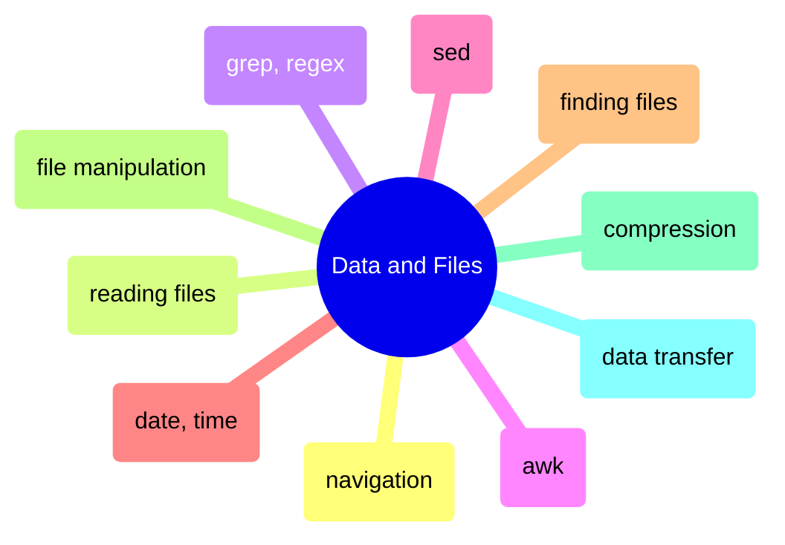
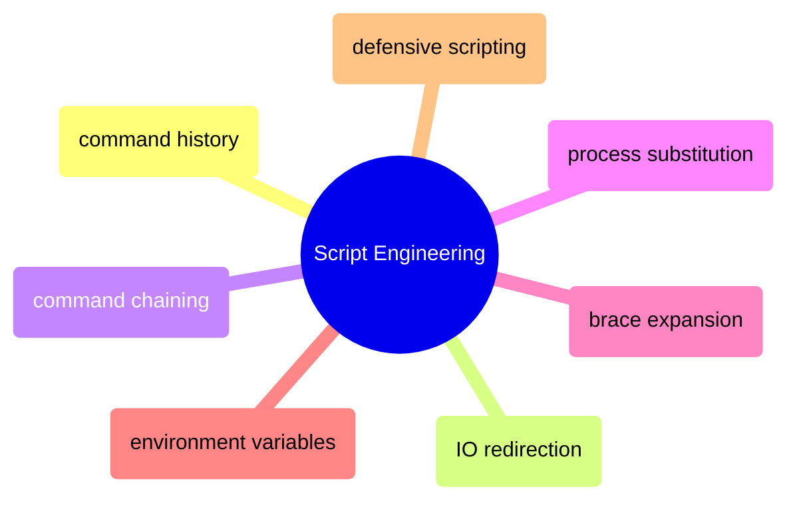
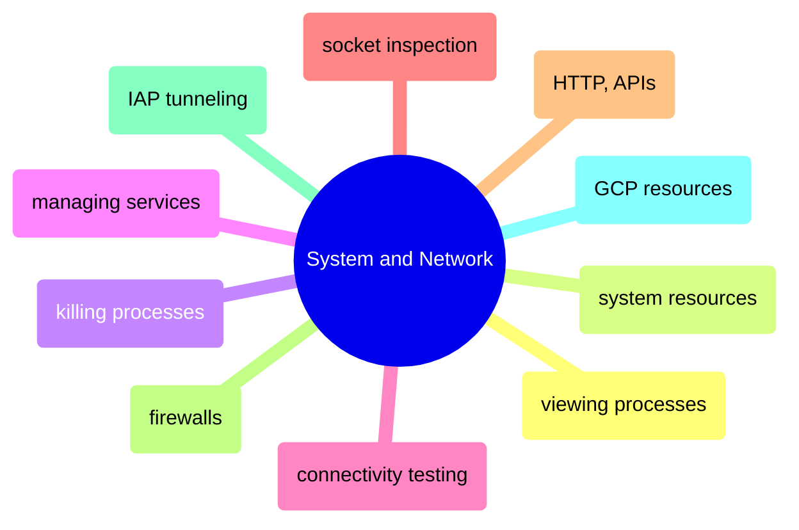

# MOC: Shell

The command line organized by what you DO with it — process data, write scripts,
or operate systems. Expand any page below to see its sections, or click through
to the full content. Every page covers both bash (Linux/macOS) and PowerShell (Windows).

> [!example]- Data & Files
>
> > [!abstract]- [[navigation-and-listing]]
> >
> > - [[navigation-and-listing#Linux — ls, du, df, tree]]
> > - [[navigation-and-listing#ls -lhrt — the data engineer's default listing]]
> > - [[navigation-and-listing#du, ls, df — investigating disk space on a database server]]
> > - [[navigation-and-listing#du vs df discrepancy — why disk usage numbers don't match]]
> > - [[navigation-and-listing#df -i — check inode usage when disk is "full" but df shows free space]]
> > - [[navigation-and-listing#PowerShell — Get-ChildItem, Get-PSDrive]]
>
> > [!abstract]- [[reading-file-contents]]
> >
> > - [[reading-file-contents#Linux — cat, head, tail, grep, awk]]
> > - [[reading-file-contents#cat, head, tail, less — basic file reading]]
> > - [[reading-file-contents#tail -f — follow a log file in real-time]]
> > - [[reading-file-contents#Analyzing a large log file during an incident — grep, awk, sort workflow]]
> > - [[reading-file-contents#grep performance on large files — -F, -m, ripgrep, LC_ALL=C]]
> > - [[reading-file-contents#PowerShell — Get-Content -Wait, Select-String for log analysis]]
>
> > [!abstract]- [[grep-and-pattern-matching]]
> >
> > - [[grep-and-pattern-matching#Basic Pattern Matching]]
> > - [[grep-and-pattern-matching#Whole-word matching]]
> > - [[grep-and-pattern-matching#Recursive search]]
> > - [[grep-and-pattern-matching#Regular Expression Patterns]]
> > - [[grep-and-pattern-matching#POSIX character classes]]
> > - [[grep-and-pattern-matching#Common data engineering regex patterns]]
>
> > [!abstract]- [[awk-data-processing]]
> >
> > - [[awk-data-processing#Record and Field Model]]
> > - [[awk-data-processing#Setting the Field Separator with -F]]
> > - [[awk-data-processing#BEGIN and END Blocks]]
> > - [[awk-data-processing#Field Extraction and Formatting]]
> > - [[awk-data-processing#Filtering and Conditions]]
> > - [[awk-data-processing#Data Transformation]]
> > - [[awk-data-processing#Data Engineering Scenarios]]
>
> > [!abstract]- [[sed-stream-editing]]
> >
> > - [[sed-stream-editing#Stream Processing Model]]
> > - [[sed-stream-editing#Basic Substitution]]
> > - [[sed-stream-editing#In-Place Editing]]
> > - [[sed-stream-editing#Line Selection and Addressing]]
> > - [[sed-stream-editing#Deletion, Insertion, and Append]]
> > - [[sed-stream-editing#Advanced Substitution with Regex]]
>
> > [!abstract]- [[date-and-time-handling]]
> >
> > - [[date-and-time-handling#ISO 8601 — the only date format you should use in pipelines]]
> > - [[date-and-time-handling#Date format selection — which format for which context]]
> > - [[date-and-time-handling#Terminal — Linux (Bash)]]
> > - [[date-and-time-handling#Terminal — PowerShell]]
> > - [[date-and-time-handling#SQL Server (T-SQL)]]
> > - [[date-and-time-handling#Python]]
>
> > [!abstract]- [[finding-files]]
> >
> > - [[finding-files#Linux — find, fd, locate]]
> > - [[finding-files#find -mtime -mmin — find by modification time]]
> > - [[finding-files#find -size — find by file size]]
> > - [[finding-files#find -exec, find -delete — find and execute on results]]
> > - [[finding-files#find vs fd vs locate — tool comparison]]
> > - [[finding-files#PowerShell — Get-ChildItem, Where-Object, Select-String]]
>
> > [!abstract]- [[file-manipulation]]
> >
> > - [[file-manipulation#Linux — cp, mv, rm, rsync]]
> > - [[file-manipulation#cp -a — archive copy preserving all metadata]]
> > - [[file-manipulation#rm — safe delete pattern with trash directory]]
> > - [[file-manipulation#chmod — set file permissions with octal or symbolic notation]]
> > - [[file-manipulation#chown — change file ownership for Docker and multi-user environments]]
> > - [[file-manipulation#PowerShell — Copy-Item, Move-Item, Remove-Item, New-Item]]
>
> > [!abstract]- [[compression]]
> >
> > - [[compression#Linux — gzip, zstd, tar]]
> > - [[compression#gzip — compress and decompress files]]
> > - [[compression#zstd — modern replacement with better ratio and faster speed]]
> > - [[compression#tar — archiving and compression for directories]]
> > - [[compression#Compression strategy matrix — choosing the right algorithm for data pipelines]]
> > - [[compression#PowerShell — Compress-Archive, 7-Zip, GZipStream]]
>
> > [!abstract]- [[data-transfer]]
> >
> > - [[data-transfer#rsync — The Gold Standard for File Transfer]]
> > - [[data-transfer#rsync trailing slash — source path determines copy behavior]]
> > - [[data-transfer#rsync vs cp — when to use which]]
> > - [[data-transfer#scp — Simple Remote Copy]]
> > - [[data-transfer#gcloud compute scp — GCE-Native File Transfer]]
> > - [[data-transfer#gsutil and gcloud storage — Cloud Storage Transfers]]

> [!example]- Script Engineering
>
> > [!abstract]- [[command-history]]
> >
> > - [[command-history#Bash History]]
> > - [[command-history#history, Ctrl+R, !!, !$ — search, recall, re-run commands]]
> > - [[command-history#^old^new — quick substitution in last command]]
> > - [[command-history#Building Complex Commands Incrementally]]
> > - [[command-history#HISTSIZE, HISTCONTROL — history configuration for .bashrc]]
> > - [[command-history#PowerShell — Get-History, PSReadLine predictive IntelliSense]]
>
> > [!abstract]- [[io-redirection]]
> >
> > - [[io-redirection#Bash Redirection]]
> > - [[io-redirection#Production Logging Patterns]]
> > - [[io-redirection#tee -a — output to both file and terminal simultaneously]]
> > - [[io-redirection#Redirect-before-write gotcha]]
> > - [[io-redirection#PowerShell — Out-File]]
>
> > [!abstract]- [[command-chaining]]
> >
> > - [[command-chaining#The Four Operators]]
> > - [[command-chaining#AND Operator]]
> > - [[command-chaining#Semicolon]]
> > - [[command-chaining#OR Operator]]
> > - [[command-chaining#AND + OR Combined]]
> > - [[command-chaining#Pipe]]
>
> > [!abstract]- [[process-substitution]]
> >
> > - [[process-substitution#Process Substitution]]
> > - [[process-substitution#Here Documents]]
> > - [[process-substitution#Here Strings]]
>
> > [!abstract]- [[brace-expansion-and-globbing]]
> >
> > - [[brace-expansion-and-globbing#Brace Expansion]]
> > - [[brace-expansion-and-globbing#mkdir -p with {brace,expansion} — create directory trees]]
> > - [[brace-expansion-and-globbing#Globbing — Extended Patterns]]
> > - [[brace-expansion-and-globbing#shopt -s extglob — exclude patterns with !(glob)]]
> > - [[brace-expansion-and-globbing#Globbing — Extended Patterns]]
> > - [[brace-expansion-and-globbing#shopt settings for .bashrc — extglob, globstar, failglob]]
> > - [[brace-expansion-and-globbing#PowerShell — ForEach-Object loops and Get-ChildItem -Recurse for globbing]]
>
> > [!abstract]- [[environment-variables]]
> >
> > - [[environment-variables#The Propagation Model]]
> > - [[environment-variables#Bash Environment Variables]]
> > - [[environment-variables#export — set and propagate variables to child processes]]
> > - [[environment-variables#Bash Environment Variables]]
> > - [[environment-variables#Secure Credential Handling]]
> > - [[environment-variables#.env files and source — secure credential handling in scripts]]
> > - [[environment-variables#PowerShell — $env: drive, SetEnvironmentVariable for persistent env vars]]
>
> > [!abstract]- [[defensive-scripting]]
> >
> > - [[defensive-scripting#set -euo pipefail — the essential first line of every production script]]
> > - [[defensive-scripting#set -e — exit immediately on error]]
> > - [[defensive-scripting#set -u — treat unset variables as errors]]
> > - [[defensive-scripting#set -o pipefail — propagate pipeline failures]]
> > - [[defensive-scripting#Production script template — set -euo pipefail with trap cleanup]]
> > - [[defensive-scripting#trap EXIT — guaranteed cleanup on script exit, error, or signal]]

> [!example]- System & Network Operations
>
> > [!abstract]- [[viewing-processes]]
> >
> > - [[viewing-processes#Linux — ps, top, htop, pstree]]
> > - [[viewing-processes#pstree -p — show parent-child process relationships]]
> > - [[viewing-processes#Diagnosing a slow Airflow VM — ps, docker stats, iostat workflow]]
> > - [[viewing-processes#The D state — uninterruptible sleep processes that cannot be killed]]
> > - [[viewing-processes#PowerShell — Get-Process, Get-CimInstance for process and system monitoring]]
>
> > [!abstract]- [[system-resources]]
> >
> > - [[system-resources#Linux — free, lscpu, uptime, vmstat, iostat, iotop]]
> > - [[system-resources#free -h — memory usage and available RAM]]
> > - [[system-resources#lscpu, uptime — CPU info and load average]]
> > - [[system-resources#vmstat — combined CPU, memory, IO snapshot]]
> > - [[system-resources#iostat -xz — disk IO performance and utilization]]
> > - [[system-resources#SQL Server memory interpretation — why free -h looks alarming but is normal]]
> > - [[system-resources#PowerShell — Get-CimInstance, Get-Counter for memory, CPU, and disk IO]]
>
> > [!abstract]- [[killing-processes]]
> >
> > - [[killing-processes#Linux — kill, pkill, killall]]
> > - [[killing-processes#pkill -f — kill by command line pattern]]
> > - [[killing-processes#kill -- -PGID — kill a process group (parent and all children)]]
> > - [[killing-processes#SIGTERM → strace → SIGKILL — the correct kill escalation sequence]]
> > - [[killing-processes#PowerShell — Stop-Process for graceful and forced termination]]
>
> > [!abstract]- [[managing-services]]
> >
> > - [[managing-services#systemctl, journalctl — managing systemd services and reading logs]]
> > - [[managing-services#systemctl start, stop, restart — control service lifecycle]]
> > - [[managing-services#systemctl enable — start service automatically on boot]]
> > - [[managing-services#journalctl -u — read service logs]]
> > - [[managing-services#Diagnosing OOM kills — when services crash with no error in their own logs]]
> > - [[managing-services#PowerShell — Start-Service, Stop-Service, Set-Service for Windows services]]
>
> > [!abstract]- [[connectivity-testing]]
> >
> > - [[connectivity-testing#Linux — nc, dig, traceroute, mtr, ss]]
> > - [[connectivity-testing#nc (netcat) — testing port reachability]]
> > - [[connectivity-testing#dig — DNS lookup and record queries]]
> > - [[connectivity-testing#mtr — combines ping + traceroute in real time]]
> > - [[connectivity-testing#Debugging a failed database connection — systematic network stack walkthrough]]
> > - [[connectivity-testing#The "it works from my machine" problem — user context, DNS, and connection pools]]
> > - [[connectivity-testing#PowerShell — Test-NetConnection, Resolve-DnsName]]
>
> > [!abstract]- [[socket-inspection]]
> >
> > - [[socket-inspection#ss -tlnp — listing listening TCP sockets with process info]]
> > - [[socket-inspection#ss -tlnp — listing listening TCP sockets with process info]]
> > - [[socket-inspection#ss local address — 0.0.0.0 vs 127.0.0.1 determines who can connect]]
> > - [[socket-inspection#Common services and default ports — SSH, SQL Server, Datadog, PostgreSQL, Airflow]]
> > - [[socket-inspection#ss -tnp — viewing established connections and reading peer addresses]]
> > - [[socket-inspection#ss filtering — counting connections, TIME-WAIT, and per-client breakdown]]
> > - [[socket-inspection#Connection refused vs connection timed out — diagnosing the root cause]]
> > - [[socket-inspection#PowerShell — Get-NetTCPConnection for socket inspection and connection counts]]
>
> > [!abstract]- [[http-requests-and-apis]]
> >
> > - [[http-requests-and-apis#Linux — curl]]
> > - [[http-requests-and-apis#curl -X POST — send JSON body]]
> > - [[http-requests-and-apis#curl --retry --connect-timeout — download with retry and timeout]]
> > - [[http-requests-and-apis#curl -w — timing breakdown to diagnose latency]]
> > - [[http-requests-and-apis#curl vs wget vs Python requests — tool selection]]
> > - [[http-requests-and-apis#PowerShell — Invoke-RestMethod, Invoke-WebRequest for HTTP requests]]
>
> > [!abstract]- [[firewalls]]
> >
> > - [[firewalls#ufw — Linux Uncomplicated Firewall for port access control]]
> > - [[firewalls#ufw default deny — the correct baseline for production servers]]
> > - [[firewalls#gcloud compute firewall-rules list — check GCP-level firewall]]
> > - [[firewalls#Defense in depth — layered firewall strategy for production databases]]
> > - [[firewalls#PowerShell — Windows Firewall with New-NetFirewallRule]]
>
> > [!abstract]- [[iap-tunneling]]
> >
> > - [[iap-tunneling#How IAP tunneling works — the full network path from workstation to VM]]
> > - [[iap-tunneling#IAP Tunnel Commands — All Variants]]
> > - [[iap-tunneling#gcloud compute start-iap-tunnel — port forwarding through IAP]]
> > - [[iap-tunneling#Debugging IAP tunnels — API, IAM, firewall, and VM state checks]]
> > - [[iap-tunneling#Verifying the IAP tunnel from both ends — local listener and VM connections]]
> > - [[iap-tunneling#IAP vs Cloud VPN vs bastion host — choosing the right access method]]
>
> > [!abstract]- [[connecting-to-gcp-resources]]
> >
> > - [[connecting-to-gcp-resources#Compute Engine VMs (SSH)]]
> > - [[connecting-to-gcp-resources#SQL Server on Compute Engine (via IAP Tunnel)]]
> > - [[connecting-to-gcp-resources#BigQuery (Direct API — No Tunnel Needed)]]
> > - [[connecting-to-gcp-resources#Cloud Run services — HTTPS endpoints with identity token auth]]
> > - [[connecting-to-gcp-resources#Airflow webserver on Compute Engine — IAP tunnel to port 8080]]
> > - [[connecting-to-gcp-resources#Connection quick reference matrix — protocol and tunnel requirements by service]]

## Cross-References

- [[sqlcmd-connection-and-usage]] — SQL Server command-line operations from the shell
- [[gcloud-authentication]] — GCP authentication underpinning all gcloud CLI work
- [[container-lifecycle]] — Docker container commands are shell operations
- [[linux-scheduling|cron and crontab]] — Scheduling shell commands for pipeline automation
