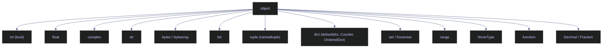

# 01. Basics - Python

> [!quote]
> "The only way to learn a new programming language is by writing programs in it."
>
> — **Brian W. Kernighan & Dennis Ritchie**, *The C Programming Language* (1978)

This note covers the absolute foundations of Python as a programming language: how to set up and verify a runtime environment, read and write console output, declare variables, work with every built-in data type, use all operator families, implement custom operator behavior via dunder methods, and understand the mutable-vs-immutable distinction that governs safe data handling.

### Key terms used in this note

| Term | Definition | Purpose | Common mistake / confusion |
|---|---|---|---|
| **Variable** | A name bound to an object in memory. In Python, variables are references — they point to objects, they do not contain them. | Store, retrieve, and pass data. | Confusing "variable" with "value." Reassigning `x = 5; x = "hi"` changes what `x` points to, not the `5` object. |
| **Constant** | A variable whose value should not change. Python uses `ALL_CAPS` naming convention; there is no enforced `const` keyword. | Signal intent that a value is fixed (e.g., `PI`, `MAX_RETRIES`). | Thinking `ALL_CAPS` prevents reassignment — it does not. Use `typing.Final` (PEP 591) for static analysis enforcement. |
| **Dynamic typing** | Type of a variable is determined at runtime and can change freely. Contrast with C#'s static typing where types are fixed at compile time. | Rapid prototyping, flexible data handling. | Assuming type errors are caught before runtime — they are not. Use type hints + `mypy` for static checking. |
| **int** | Integer type with arbitrary precision — grows as large as memory allows. | Whole numbers, counters, indices, large financial identifiers. | Assuming Python ints overflow like C#'s 32-bit `int` — they never overflow. |
| **float** | 64-bit IEEE 754 double-precision floating-point. Python has no separate `float`/`double` distinction. | Decimal numbers, scientific values, measurements. | Using `float` for financial calculations — `0.1 + 0.2 != 0.3`. Use `Decimal` instead. |
| **complex** | Built-in numeric type with real and imaginary parts, using `j` suffix (e.g., `3+4j`). | Signal processing, scientific computing. | Using `i` instead of `j` for the imaginary part. |
| **bool** | Boolean `True`/`False`. In Python, `bool` is a subclass of `int` (`True == 1`, `False == 0`). | Control flow, flags, filters. | Not knowing `True + True == 2` is valid since `bool` inherits from `int`. |
| **str** | Immutable Unicode text sequence. | Store and manipulate text — names, paths, SQL, JSON. | Treating strings as mutable — `+=` creates a new object. Use `io.StringIO` for incremental building. |
| **bytes / bytearray** | `bytes` is immutable integers 0–255; `bytearray` is the mutable counterpart. | Binary data, network protocols, file I/O. | Confusing `str` with `bytes` — distinct types in Python 3. `.encode()` → bytes, `.decode()` → str. |
| **None** | Python's null singleton of type `NoneType`. Functions without `return` return `None`. | Represent absence of a value, optional parameters. | Testing `== None` instead of `is None`. Always use identity check. |
| **Decimal** | Exact base-10 arithmetic type from the `decimal` module. | Financial calculations, tax, currency. | Constructing from float (`Decimal(0.1)`) instead of string (`Decimal("0.1")`). |
| **Mutable** | Object whose internal state can change after creation (e.g., `list`, `dict`, `set`). | In-place modification avoids copying. | Sharing mutable objects unknowingly — both references point to the same object. |
| **Immutable** | Object whose state cannot change after creation (e.g., `int`, `str`, `tuple`). | Safe as dict keys, defaults, shared state. | Thinking immutable means the variable cannot be reassigned — it can. Immutability applies to the object. |
| **Hashable** | Object with `__hash__()` returning a stable integer. Required for dict keys and sets. | O(1) lookups in dicts and sets. | Using `list` as a dict key — lists are unhashable. Convert to `tuple`. |
| **Truthy / Falsy** | Values evaluating to `True`/`False` in boolean context. Falsy: `0`, `""`, `[]`, `{}`, `None`, etc. | Concise conditionals: `if my_list:` instead of `if len(my_list) > 0:`. | Assuming only `True`/`False` are boolean — any object works in boolean context. |
| **f-string** | Formatted string literal (Python 3.6+) embedding expressions inside `{...}`. | Readable, performant string interpolation. | Forgetting the `f` prefix — `"{x}"` is a literal string, not interpolation. |
| **Dunder method** | Method with `__double_underscore__` names (e.g., `__init__`, `__add__`). Called automatically by operators and built-ins. | Customize behavior with `+`, `==`, `len()`, `for`, `with`. | Defining `__eq__` without `__hash__` — breaks dict/set usage. |
| **Walrus operator (`:=`)** | Assignment expression (Python 3.8+) — assigns and returns a value in one expression. | Compute-once-use-twice in comprehensions and `while` loops. | Overusing `:=` where regular `=` is clearer. |
| **EAFP** | "Easier to Ask Forgiveness than Permission" — try the operation, catch exceptions if it fails. | Cleaner than pre-checking with `if` statements (LBYL). | Wrapping every line in try/except instead of only expected failure paths. |
| **Context manager** | Object implementing `__enter__`/`__exit__` for the `with` statement. Python's equivalent of C# `using`/`IDisposable`. | Guarantee cleanup of files, connections, locks. | Forgetting `with` and leaving resources open. |
| **Virtual environment** | Isolated Python installation with its own packages, separate from system Python. | Prevent dependency conflicts between projects. | Installing packages globally — risks version conflicts. |

### What this note covers

- **Environment Setup** — verify interpreter version, virtual environment, installed packages
- **Console I/O** — `print()` formatting, escape sequences, ANSI colors, `input()` parsing and validation
- **Variables, Constants & Data Types** — dynamic typing, all built-in numeric types, `bool`, `bytes`, `None`, specialized containers
- **Operators** — arithmetic, comparison, chained comparisons, identity/membership, logical, bitwise, compound assignment, ternary, walrus operator, precedence
- **Magic Methods** — dunder methods for operators, iteration, context management, type inspection
- **Mutable vs Immutable Types** — mutability matrix, aliasing, dict keys, function argument semantics

## Environment Setup

Covers Python interpreter configuration, virtual environment inspection, and package verification. These cells confirm the runtime environment before executing language examples.

### Runtime and package inspection

Confirms the interpreter version, executable location, and installed packages before running language examples.

#### Check Python version, executable path, and hostname

```python
import sys
import socket
from collections import deque, OrderedDict, defaultdict, Counter, namedtuple
from dataclasses import dataclass
from decimal import Decimal
from enum import Enum, IntEnum
from fractions import Fraction
from importlib.metadata import distributions
from typing import NamedTuple
import io
import json
import math
import os
import time as _time
print(sys.version)   # Python version
print(sys.executable)   # Python executable
print(socket.gethostname())   # Machine
```
```text
3.12.0 (tags/v3.12.0:0fb18b0, Oct  2 2023, 13:03:39) [MSC v.1935 64 bit (AMD64)]
c:\Users\aperi\DEV\LANG\.lang\Scripts\python.exe
Elysium
```

#### Inspect virtual environment and working directory

`os.environ.get('VIRTUAL_ENV')` returns the path to the active virtual environment, or `None` if running in the system Python. `os.getcwd()` returns the current working directory where file path resolution starts.

```python
print(os.environ.get('VIRTUAL_ENV', 'None'))
print(os.getcwd())
```
```text
C:\Users\aperi\DEV\LANG\.lang
c:\Users\aperi\DEV\LANG
```

#### List installed packages with importlib.metadata

`importlib.metadata.distributions()` iterates over all installed packages in the current environment. Each distribution object exposes `metadata['Name']` and `version`. This replaces the older `pkg_resources` approach and works in virtual environments.

```python

installed = sorted([f"{d.metadata['Name']}=={d.version}" for d in distributions()])
for pkg in installed[:5]:
    print(pkg)
```
```text
Flask==3.1.3
Jinja2==3.1.6
Markdown==3.10.2
MarkupSafe==3.0.3
PyMySQL==1.1.2
```

#### Verify that required packages can be imported

`__import__(name)` dynamically imports a module by name string. Wrapping it in try/except catches `ImportError` for missing packages. This pattern is useful at the top of notebooks to fail fast with a clear message if a dependency is not installed.

```python

imports = [
    "numpy", "pandas", "matplotlib",
    "sqlalchemy", "requests", "fastapi",
    "pydantic", "yaml", "pytest"
]

for mod in imports:
    try:
        __import__(mod)
        print(f"  {mod}: OK")
    except ImportError:
        print(f"  {mod}: MISSING")
```
```text
numpy: OK
  pandas: OK
  matplotlib: OK
  sqlalchemy: OK
  requests: OK
  fastapi: OK
  pydantic: OK
  yaml: OK
  pytest: OK
```

## Console I/O

Demonstrates output formatting, escape sequences, terminal styling, and input parsing. Python's `print()` is the primary output function, and `input()` reads text from stdin. All input arrives as `str` — numeric values must be parsed explicitly with `int()` or `float()` inside `try/except`.

### Output and string formatting

Covers `print()` parameters (`sep`, `end`, `file`, `flush`) and the three string formatting styles: f-strings, `.format()`, and `%`-formatting.

#### Print multiple values with separator and end parameters

`print()` accepts multiple arguments separated by `sep` (default `" "`) and ends with `end` (default `"\n"`). Accepts any type — calls `str()` on each argument automatically. Use `sep` instead of manual `+` concatenation. For structured logging, use the `logging` module instead.

```python
print("one", "two", "three", sep=" | ", end="\n")
```
```text
one | two | three
```

#### Format strings with f-strings, .format(), and %-formatting

Python offers three string formatting approaches. **f-strings** (Python 3.6+) embed expressions directly in the string with `{expr}` — preferred for readability and performance. **`.format()`** uses numbered or named placeholders — useful when the format string is dynamic. **`%`-formatting** is the oldest style (`"Name: %s"`) — still encountered in legacy code but not recommended for new projects. All three support format specifiers like `:.2f` for two decimal places.

```python

name = "Alice"
age = 30

# f-string
print(f"Name: {name}, Age: {age}")

# .format() method
print("Name: {}, Age: {}".format(name, age))

# % formatting (legacy)
print("Name: %s, Age: %d" % (name, age))

# f-string with expressions
print(age + 1)   # Next year
print(name.upper())   # Name uppercased
print(f"{3.14159:.2f}")   # Pi to 2 decimals

# Output formatting options for print()
```

```text
Name: Alice, Age: 30
Name: Alice, Age: 30
Name: Alice, Age: 30
31
ALICE
3.14
```

#### Control separator between print() arguments with sep

The `sep` parameter controls what character(s) `print()` inserts between its arguments (default is a single space). This is Python's equivalent of C#'s `string.Join` — pass multiple values and let `print()` handle the joining. Works with any type that has a `__str__` method.

```python

print("a", "b", "c")                    # a b c
print("a", "b", "c", sep=", ")          # a, b, c
print("a", "b", "c", sep="")            # abc
print("a", "b", "c", sep=" → ")         # a → b → c
print(2024, 3, 15, sep="-")             # 2024-3-15
```
```text
a b c
a, b, c
abc
a → b → c
2024-3-15
```

#### Control line ending with end and force output with flush

The `end` parameter controls what `print()` appends after the output (default `"\n"`). Setting `end=""` or `end=" "` allows building a line incrementally across multiple `print()` calls. The `file` parameter redirects output to any file-like object (`sys.stderr`, an open file). The `flush=True` parameter forces immediate output, bypassing Python's output buffering — essential for progress indicators in loops.

```python

print("hello", end=" ")
print("world", end="!\n")               # hello world!
print("loading", end="")
print("...", end="")
print("done!")                           # loading...done!

# file — redirect output to a file

print("This goes to stderr", file=sys.stderr)
# print("log entry", file=open("log.txt", "a"))  # append to file

# flush — force immediate output (useful in loops/progress)

print("Processing...", flush=True)       # immediately visible, no buffering
```
```text
hello world!
loading...done!
Processing...

This goes to stderr
```

### Escape sequences and terminal styling

Demonstrates backslash escape sequences, raw string literals, ANSI terminal color codes, and the distinction between `str()` and `repr()`.

#### Escape sequences and raw strings

Escape sequences insert special characters using a backslash prefix: `\t` (tab), `\n` (newline), `\\` (literal backslash), `\"` and `\'` (quotes), `\uXXXX` (Unicode code point), and `\0` (null character). Raw strings (`r"..."`) disable escape processing — backslashes are treated as literal characters, ideal for regex patterns and Windows file paths.

```python

print("Tab:\tafter tab")
print("Newline:\nafter newline")
print("Backslash: \\")
print("Quote: \"double\" and \'single\'")
print("Unicode: \u2764 \u2605 \u2602")  # ❤ ★ ☂
print("Null char: [\0] (invisible)")
print(r"Raw string: \n \t not escaped")  # raw string with r prefix
```
```text
Tab:	after tab
after newline
Backslash: \
Quote: "double" and 'single'
Unicode: ❤ ★ ☂
[] (invisible)
\n \t not escaped
```

#### Apply ANSI color and style codes to terminal output

ANSI escape codes control text color and style in terminals. Python uses `\033` (octal for ESC) instead of C#'s `\x1b`. Each code is bracketed by `\033[` and terminated with `m`. Always reset with `\033[0m`. Notebook environments may strip ANSI codes — the output below shows raw escape sequences.

```python

print("\033[31mRed text\033[0m")
print("\033[32mGreen text\033[0m")
print("\033[1;34mBold blue text\033[0m")
print("\033[43m\033[30mBlack on yellow\033[0m")
```
```text
Red text
Green text
Bold blue text
Black on yellow
```

#### Distinguish repr() from str() — developer vs user-friendly output

`str()` returns a human-readable representation (what `print()` displays). `repr()` returns a developer representation that, ideally, could recreate the object — it shows escape sequences, quote delimiters, and type information. In f-strings, `!r` applies `repr()` and `!a` applies `ascii()` (escapes non-ASCII characters). Use `repr()` for debugging and logging; use `str()` for user-facing output.

```python

s = "hello\nworld"
s  # hello\nworld (displays newline)
s!r  # 'hello\nworld' (shows escape)
'café'!a  # 'caf\\xe9'
```
```text
hello
world
'hello\nworld'
'caf\xe9'
```

### Console input and parsing

Shows how to read user input with `input()`, parse it to numeric types using `int()` and `float()`, and validate it with `while True` + `try/except` loops.

#### Read a line of text from standard input with input()

`input(prompt)` displays the prompt string and blocks until the user presses Enter, then returns the entire line as a `str`. All console input arrives as text — numeric values must be parsed explicitly with `int()`, `float()`, or `Decimal()`. Returns an empty string if the user presses Enter without typing.

```python

name = input("Enter your name: ")
print(f"Hello, {name}!")
print(type(name))   # Type of input
```
```text
Hello, Alex!
<class 'str'>
```

#### Parse string to integer safely with int() and try/except

`int(string)` converts a string to an integer, raising `ValueError` if the string is not a valid integer representation. Wrapping in `try/except ValueError` is the Pythonic equivalent of C#'s `int.TryParse` — catch the exception rather than checking beforehand (EAFP: "Easier to Ask Forgiveness than Permission").

```python

age_str = input("Enter your age: ")

# Unsafe conversion - crashes on invalid input
# age = int(age_str)

# Safe conversion with try/except
try:
    age = int(age_str)
    print(f"Your age is {age}, type: {type(age)}")
except ValueError:
    print(f"'{age_str}' is not a valid integer")
```
```text
Your age is 47, type: <class 'int'>
```

#### Parse string to float safely with float() and try/except

`float(string)` works identically to `int()` but for floating-point values. It respects locale-independent format (always uses `.` as the decimal separator). For locale-aware parsing, use the `locale` module. For financial amounts, parse to `Decimal` instead of `float` to avoid binary rounding.

```python

price_str = input("Enter a price: ")

try:
    price = float(price_str)
    print(f"Price: ${price:.2f}, type: {type(price)}")
except ValueError:
    print(f"'{price_str}' is not a valid number")
```
```text
$30.00, type: <class 'float'>
```

#### Validate input in a loop until parsing succeeds

The standard pattern for interactive console input: `while True` + `try/except` + `return`. The loop repeats until valid input is provided. This is more Pythonic than pre-checking with regex — let the parser do the validation and catch the exception.

```python

def get_valid_int(prompt):
    while True:
        value = input(prompt)
        try:
            return int(value)
        except ValueError:
            print(f"'{value}' is not valid. Please enter a whole number.")
```

#### Float input validation with the same while/try pattern

Same `while True` + `try/except ValueError` pattern applied to `float()` conversion. The structure is identical — only the conversion function changes.

```python

def get_valid_float(prompt):
    while True:
        value = input(prompt)
        try:
            return float(value)
        except ValueError:
            print(f"'{value}' is not valid. Please enter a number.")
```

#### Reject empty or whitespace-only input with strip() and truthiness

Python's truthy/falsy semantics make string validation concise: `"".strip()` returns `""` which is falsy, so `if value:` rejects empty and whitespace-only strings. No explicit length check needed.

```python

def get_non_empty_string(prompt):
    while True:
        value = input(prompt).strip()
        if value:
            return value
        print("Input cannot be empty.")
```

#### Call the reusable validation functions

Demonstrates calling the validators defined above. In a real console application, `input()` would prompt the user interactively; in a notebook, the values are pre-supplied.

```python

num = get_valid_int("Enter a number: ")
print(num)   # Got

name = get_non_empty_string("Enter your name: ")
print(name)   # Got
```
```text
17
Alex
```

## Variables, Constants & Data Types

Covers variable declaration, naming conventions for constants, the complete set of built-in types, and Python's mutable/immutable distinction. Unlike C#, Python is dynamically typed — variables can be rebound to any type at any time.

### Variable declaration and constants

Explains Python's dynamic typing model, where variables are names bound to objects at runtime, and the `ALL_CAPS` naming convention used for values that should not change.

#### Declare variables with dynamic typing — type() and isinstance()

Assign directly: `x = 10` — Python infers the type at runtime. Variables are names bound to objects; rebinding changes the reference. `type()` reveals the current type; `isinstance()` checks the type hierarchy. Add type hints (PEP 484) for public APIs and complex functions.

```python
x = 10          # int
y = 3.14        # float
name = "Alice"  # str
active = True   # bool

# Python infers the type from the assigned value
print(f"x = {x}, type: {type(x)}")
print(f"y = {y}, type: {type(y)}")
print(f"name = {name}, type: {type(name)}")
print(f"active = {active}, type: {type(active)}")

# Variables can change type (dynamic typing)
x = "now I'm a string"
print(f"\nx = {x}, type: {type(x)}")
```
```text
x = 10, type: <class 'int'>
y = 3.14, type: <class 'float'>
name = Alice, type: <class 'str'>
active = True, type: <class 'bool'>

x = now I'm a string, type: <class 'str'>
```

#### Define constants with UPPERCASE naming convention

Python has no `const` keyword — constants are a naming convention only. Use `ALL_CAPS` names for values that should not change. Nothing prevents reassignment at runtime, but linters like `mypy` can flag mutations of `Final` annotated variables (PEP 591, Python 3.8+): `PI: Final = 3.14159`.

```python

PI = 3.14159
MAX_USERS = 100
API_URL = "https://api.example.com"

print(PI)
print(MAX_USERS)
print(API_URL)

# Nothing prevents reassignment (it's just a convention)
PI = 999  # No error, but don't do this!
```
```text
PI = 3.14159
MAX_USERS = 100
API_URL = https://api.example.com
```

### Numeric types

Covers Python's four numeric types — `int` (arbitrary precision), `float` (64-bit IEEE 754), `complex` (built-in `j` notation), and `Decimal` (exact base-10 arithmetic for financial work).

#### Integer — arbitrary precision with no overflow

Python integers have arbitrary precision — they grow as large as memory allows, with no fixed bit width and no overflow. `10**100` works natively without any special library. This is fundamentally different from C#'s fixed-width `int` (32-bit) and `long` (64-bit). The tradeoff is that very large integers are slower than fixed-width machine integers.

> [!info] No overflow in Python — contrast with C#
> Python integers never overflow or wrap around. C# requires `checked` blocks to detect overflow; Python simply allocates more memory. There is no equivalent of C#'s `checked`/`unchecked` contexts because overflow cannot occur.

```python

a = 42
b = -100
c = 10**100  # huge number, no overflow!

a
b
c
print(f"c has {len(str(c))} digits")
sys.getsizeof(a)   # Size of a in bytes
sys.getsizeof(c)   # Size of c in bytes
```
```text
a = 42
b = -100
c = 10000000000000000000000000000000000000000000000000000000000000000000000000000000000000000000000000000
c has 101 digits
Size of a in bytes: 28
Size of c in bytes: 72

Python int has NO fixed range - it grows as needed
```

#### float — IEEE 754 double-precision (64-bit)

Python's `float` is always 64-bit double-precision IEEE 754 — there is no separate `float`/`double`/`decimal` trio like C#. For exact decimal arithmetic, use `Decimal` from the `decimal` module. `sys.float_info` exposes the platform's float characteristics including max value, min positive value, and digit precision.

```python

a = 3.14
b = -0.001
c = 1.8e308   # near max
d = 5e-324    # near min positive

print(a)
print(b)
print(c)
print(d)
print(sys.float_info.max)   # Max float
print(sys.float_info.min)   # Min float
print(f"Precision: {sys.float_info.dig} digits")
```
```text
a = 3.14
b = -0.001
c = inf
d = 5e-324
1.7976931348623157e+308
2.2250738585072014e-308
Precision: 15 digits
```

#### Inspect special float values — Infinity, NaN, and precision loss

IEEE 754 defines three special float values: `inf` (positive infinity), `-inf`, and `nan` (Not a Number). Create them with `float('inf')`, `float('nan')`, or via operations like `1.0 / 0.0`. `nan` is not equal to anything, including itself — use `math.isnan()` to test. The classic `0.1 + 0.2 != 0.3` artifact is inherent to binary floating-point; use `Decimal` or `math.isclose()` for exact comparison.

```python

print(float('inf'))   # Infinity
print(float('-inf'))   # Neg Infinity
print(float('nan'))   # NaN

# Floating point imprecision
print(0.1 + 0.2)  # not exactly 0.3!
```
```text
inf
-inf
nan

0.30000000000000004
```

#### Perform complex number arithmetic with built-in j notation

Python has a built-in `complex` type using `j` suffix for the imaginary part (not `i` as in mathematics). Access components with `.real` and `.imag`. `abs(z)` returns the magnitude, `.conjugate()` returns the complex conjugate. Use `cmath` module for complex-valued math functions.

```python

z = 3 + 4j
print(f"z = {z}, type: {type(z)}")
print(f"Real: {z.real}, Imaginary: {z.imag}")
print(z.conjugate())   # Conjugate
print(abs(z))  # magnitude
```
```text
z = (3+4j), type: <class 'complex'>
Real: 3.0, Imaginary: 4.0
(3-4j)
5.0
```

### Boolean, bytes, and None

Covers the `bool` type and its integer inheritance, the `bytes`/`bytearray` pair for binary data, and `None` as Python's null singleton.

#### bool — truthy/falsy values and int subclass behavior

`bool` is a subclass of `int` with `True == 1` and `False == 0` — arithmetic with booleans works (`True + True == 2`). Unlike C# which has no truthy/falsy concept, Python evaluates ANY object as a boolean: `0`, `0.0`, `""`, `[]`, `{}`, `set()`, `None`, and `range(0)` are all falsy; everything else is truthy. Custom classes can define `__bool__` to control their truthiness.

```python

a = True
b = False

print(f"a = {a}, type: {type(a)}")
print(f"b = {b}, type: {type(b)}")
print(True + True)  # 2 (bool is int)
print(True * 10)  # 10

# Truthy and falsy values
print(bool(0))  # False
print(bool(1))  # True
print(bool(''))  # False
print(bool('hi'))  # True
print(bool([]))  # False
print(bool([1]))  # True
print(bool(None))  # False
```
```text
a = True, type: <class 'bool'>
b = False, type: <class 'bool'>
2
10

False
True
False
True
False
True
False
```

#### Convert between strings and byte arrays with encode/decode

`bytes` is an immutable sequence of integers (0–255), created with `b"..."` literals or `.encode()`. `bytearray` is the mutable counterpart. `str.encode("utf-8")` converts a string to bytes; `bytes.decode("utf-8")` converts back. UTF-8 is variable-width: `"café"` encodes to 5 bytes because `é` requires two bytes (`\xc3\xa9`).

```python

b1 = b"hello"              # bytes (immutable)
b2 = bytearray(b"hello")   # bytearray (mutable)

print(f"b1 = {b1}, type: {type(b1)}")
print(f"b2 = {b2}, type: {type(b2)}")

# Encoding/decoding
text = "café"
encoded = text.encode("utf-8")
decoded = encoded.decode("utf-8")
print(f"\n'{text}' encoded: {encoded}")
print(decoded)   # decoded back
```
```text
b1 = b'hello', type: <class 'bytes'>
b2 = bytearray(b'hello'), type: <class 'bytearray'>

'café' encoded: b'caf\xc3\xa9'
decoded back: café
```

#### Understand None — Python's null singleton

`None` is Python's null value — a singleton of type `NoneType`. Always test with `is None` (identity check), not `== None` (equality check), because `==` can be overridden by custom classes. Functions without an explicit `return` statement return `None`. Use `Optional[T]` type hint (or `T | None` in Python 3.10+) to annotate variables that may be None.

```python

x = None
print(f"x = {x}, type: {type(x)}")
print(x is None)  # preferred way to check
print(x == None)  # works but not idiomatic
```
```text
x = None, type: <class 'NoneType'>
True
True
```

### Type system reference — all built-in types

The diagram below maps every built-in type to the common `object` root; the H4 cells that follow show each category with runtime examples.



#### Numeric types — int, float, complex, bool

Complete reference showing all numeric types with their runtime type names. Python has four numeric types: `int` (arbitrary precision), `float` (64-bit IEEE 754), `complex` (real + imaginary), and `bool` (subclass of int, True=1/False=0).

```python

i = 42
print(f"int:          {i:>20}  type={type(i).__name__}")

# float — 64-bit IEEE 754
f = 3.14
print(f"float:        {f:>20}  type={type(f).__name__}")

# complex — real + imaginary
c = 3 + 4j
print(f"complex:      {str(c):>20}  type={type(c).__name__}")

# bool — True/False (subclass of int)
b = True
print(f"bool:         {b:>20}  type={type(b).__name__}")

# str — immutable Unicode string
s = "hello"
print(f"str:          {s:>20}  type={type(s).__name__}")
```
```text
42  type=int
3.14  type=float
(3+4j)  type=complex
1  type=bool
hello  type=str
```

#### Immutable sequence types — bytes, tuple, frozenset, range, None

Immutable types cannot be modified after creation. They are safe as dict keys, function defaults, and shared state. `tuple` is the immutable counterpart of `list`; `frozenset` is the immutable counterpart of `set`; `range` produces integers lazily without allocating a list.

```python

by = b"hello"
print(f"bytes:        {str(by):>20}  type={type(by).__name__}")

# tuple — immutable ordered sequence
t = (1, 2, 3)
print(f"tuple:        {str(t):>20}  type={type(t).__name__}")

# frozenset — immutable set
fs = frozenset({1, 2, 3})
print(f"frozenset:    {str(fs):>20}  type={type(fs).__name__}")

# range — immutable sequence of numbers
r = range(5)
print(f"range:        {str(r):>20}  type={type(r).__name__}")

# NoneType — singleton null
n = None
print(f"NoneType:     {str(n):>20}  type={type(n).__name__}")
```
```text
b'hello'  type=bytes
(1, 2, 3)  type=tuple
frozenset({1, 2, 3})  type=frozenset
range(0, 5)  type=range
None  type=NoneType
```

#### Mutable collection types — list, dict, set, bytearray

Mutable types can be modified in place. Assignment copies the reference (not the data), so two variables can point to the same object. `list` is a dynamic array, `dict` is a hash map, `set` stores unique elements, and `bytearray` is a mutable byte buffer.

```python

lst = [1, 2, 3]
print(f"list:         {str(lst):>20}  type={type(lst).__name__}")

# dict — key-value mapping
d = {"a": 1, "b": 2}
print(f"dict:         {str(d):>20}  type={type(d).__name__}")

# set — unordered unique elements
st = {1, 2, 3}
print(f"set:          {str(st):>20}  type={type(st).__name__}")

# bytearray — mutable byte sequence
ba = bytearray(b"hello")
print(f"bytearray:    {str(ba):>20}  type={type(ba).__name__}")
```
```text
[1, 2, 3]  type=list
{'a': 1, 'b': 2}  type=dict
{1, 2, 3}  type=set
bytearray(b'hello')  type=bytearray
```

#### Specialized containers — memoryview, deque, OrderedDict

`memoryview` provides zero-copy access to the buffer of a bytes-like object — essential for high-performance I/O and image processing. `deque` (double-ended queue) supports O(1) append/pop on both ends. `OrderedDict` explicitly preserves insertion order (redundant since Python 3.7 where all dicts are ordered, but useful when order-dependent equality matters).

```python

mv = memoryview(ba)
print(f"memoryview:   {str(mv):>20}  type={type(mv).__name__}")


# deque — double-ended queue
dq = deque([1, 2, 3])
print(f"deque:        {str(dq):>40}  (fast append/pop both ends)")

# OrderedDict — insertion-ordered dict (redundant since 3.7, dict keeps order)
od = OrderedDict(a=1, b=2)
print(f"OrderedDict:  {str(od):>40}  (explicit ordered dict)")
```
```text
<memory at 0x0000029D91A19240>  type=memoryview
deque([1, 2, 3])  (fast append/pop both ends)
OrderedDict({'a': 1, 'b': 2})  (explicit ordered dict)
```

#### Auto-create missing keys with defaultdict

`defaultdict(factory)` automatically creates a default value when a missing key is accessed, eliminating the need for `if key not in dict` checks. Pass `int` for counting (defaults to 0), `list` for grouping (defaults to `[]`), or `set` for unique grouping. This is Python's most idiomatic pattern for accumulation and grouping tasks.

```python

dd = defaultdict(int)          # factory=int → missing keys default to 0
dd["a"] += 1
dd["b"] += 3
dd["a"] += 2
dict(dd)  # {'a': 3, 'b': 3}

# defaultdict(list) — group items by key without checking if key exists
groups = defaultdict(list)
for name, dept in [("Alice", "Eng"), ("Bob", "Sales"), ("Charlie", "Eng")]:
    groups[dept].append(name)
dict(groups)   # Groups
```
```text
{'a': 3, 'b': 3}
{'Eng': ['Alice', 'Charlie'], 'Sales': ['Bob']}
```

#### Count occurrences of hashable elements with Counter

`Counter` is a dict subclass that maps elements to their counts. Pass any iterable — a string (counts characters), a list (counts elements), or use `.update()` to add more counts. `.most_common(n)` returns the n most frequent elements as `(element, count)` tuples. Supports arithmetic: `counter1 + counter2` adds counts, `counter1 - counter2` subtracts.

```python

ct = Counter("abracadabra")
print(ct)   # Counter
print(ct.most_common(3))   # Most common 3

# Counting words
words = "the cat sat on the mat the cat".split()
word_counts = Counter(words)
print(word_counts)
```
```text
Counter({'a': 5, 'b': 2, 'r': 2, 'c': 1, 'd': 1})
Most common 3: [('a', 5), ('b', 2), ('r', 2)]
Counter({'the': 3, 'cat': 2, 'sat': 1, 'on': 1, 'mat': 1})
```

#### Create lightweight immutable records with namedtuple

`namedtuple` creates a tuple subclass with named fields — combining the immutability and hashability of tuples with the readability of attribute access (`pt.x` instead of `pt[0]`). `_replace()` returns a new instance with one or more fields changed (immutable update). For more features (defaults, methods, type hints), use `@dataclass(frozen=True)` or `typing.NamedTuple`.

```python

Point = namedtuple("Point", ["x", "y"])
pt = Point(3, 4)
print(pt)   # Point
print(f"pt.x:    {pt.x}, pt.y: {pt.y}")
print(pt[0])  # also indexable like a regular tuple

# _replace returns a NEW namedtuple with one field changed (immutable)
pt2 = pt._replace(x=10)
print(pt2)   # _replace
```
```text
Point(x=3, y=4)
3, pt.y: 4
3
_replace: Point(x=10, y=4)
```

#### Perform exact decimal arithmetic with Decimal

`Decimal` from the `decimal` module provides exact base-10 arithmetic — Python's equivalent of C#'s `decimal`. Use it for financial calculations, tax computation, and any domain where binary floating-point rounding (`0.1 + 0.2 != 0.3`) is unacceptable. Always construct from strings (`Decimal("0.1")`) — constructing from floats (`Decimal(0.1)`) captures the float's imprecision.

```python
from decimal import Decimal, getcontext

getcontext().prec = 28

a = Decimal("0.1") + Decimal("0.2")
print(f"Decimal: 0.1 + 0.2 = {a}")
print(f"float:   0.1 + 0.2 = {0.1 + 0.2}")

price = Decimal("19.99")
tax = Decimal("0.0825")
total = (price * (1 + tax)).quantize(Decimal("0.01"))
print(f"Price: {price}, Tax: {tax}, Total: {total}")
```

```text
Decimal: 0.1 + 0.2 = 0.3
float:   0.1 + 0.2 = 0.30000000000000004
Price: 19.99, Tax: 0.0825, Total: 21.64
```

### Mutability and references

Demonstrates how immutable types create new objects on "reassignment" while mutable types share the same object across multiple references.

#### Exact rational arithmetic with Fraction and immutable string behavior

`Fraction` represents exact rational numbers with no floating-point error — `Fraction(1, 3)` is precisely one-third, not `0.33333...`. Strings demonstrate immutability: `+=` creates a new string object rather than modifying in place, so the original reference (`b`) remains unchanged.

```python

frac = Fraction(1, 3)
print(f"Fraction:     {str(frac):>40}  (exact rational)")

# Immutable: reassignment creates a NEW object
a = "hello"
b = a
a += " world"
print(f"Immutable str: a='{a}', b='{b}'")  # b unchanged!
```
```text
1/3  (exact rational)
a='hello world', b='hello'
```

#### Mutable list assignment shares the same object

Assigning a list to another variable copies the reference, not the data. Both variables point to the same list object — `append()` through either variable is visible through the other. Use `b = a.copy()` or `b = a[:]` for a shallow copy, or `copy.deepcopy(a)` for a deep copy of nested structures.

```python

a = [1, 2, 3]
b = a
a.append(4)
print(f"Mutable list:  a={a}, b={b}")  # b changed too!
a is b  # True
```
```text
a=[1, 2, 3, 4], b=[1, 2, 3, 4]
Same object?   True
```

## Operators

Covers arithmetic, comparison, logical, bitwise, assignment, and identity/membership operators. Python has true division (`/`), floor division (`//`), and exponentiation (`**`) built in — no `Math.Pow` needed. Chained comparisons (`a < b < c`) and walrus operator (`:=`) are Python-specific features.

### Arithmetic and comparison

Covers Python's full set of arithmetic operators — including floor division and exponentiation — and the comparison operators that return `bool`.

#### Arithmetic operators — true division, floor division, and exponentiation

Python has true division (`/` returns float), floor division (`//` returns int), and exponentiation (`**`). `divmod(a, b)` returns `(quotient, remainder)` in one call. For financial math, use `Decimal` for exact division.

```python
a, b = 17, 5

print(f"{a} + {b}  = {a + b}")  # Addition
print(f"{a} - {b}  = {a - b}")  # Subtraction
print(f"{a} * {b}  = {a * b}")  # Multiplication
print(f"{a} / {b}  = {a / b}")  # Division (always returns float)
print(f"{a} // {b} = {a // b}")  # Floor division (integer result)
print(f"{a} % {b}  = {a % b}")  # Modulus (remainder)
print(f"{a} ** {b} = {a ** b}")  # Exponentiation
print(f"-{a}       = {-a}")  # Unary negation

# Division behavior

print(7 / 2)  # 3.5 (true division)
print(7 // 2)  # 3 (floor division)
print(-7 // 2)  # -4 (floors toward negative infinity!)
print(7 % 2)  # 1
print(-7 % 2)  # 1 (Python modulo always returns same sign as divisor)
```
```text
17 + 5  = 22
17 - 5  = 12
17 * 5  = 85
17 / 5  = 3.4
17 // 5 = 3
17 % 5  = 2
17 ** 5 = 1419857
-17       = -17
7 / 2   = 3.5
7 // 2  = 3
-7 // 2 = -4
7 % 2   = 1
-7 % 2  = 1
```

#### Comparison operators — equality, inequality, and relational

Comparison operators return `bool`. Python compares by value for all built-in types (no reference vs value distinction like C#). `==` tests equality, `is` tests identity (same object in memory).

```python
a, b = 10, 20

print(f"{a} == {b}  : {a == b}")  # Equal
print(f"{a} != {b}  : {a != b}")  # Not equal
print(f"{a} > {b}   : {a > b}")  # Greater than
print(f"{a} < {b}   : {a < b}")  # Less than
print(f"{a} >= {b}  : {a >= b}")  # Greater than or equal
print(f"{a} <= {b}  : {a <= b}")  # Less than or equal
```
```text
10 == 20  : False
10 != 20  : True
10 > 20   : False
10 < 20   : True
10 >= 20  : False
10 <= 20  : True
```

#### Chain comparisons for concise range checks

Python supports chained comparisons: `10 < x < 20` is equivalent to `(10 < x) and (x < 20)` but evaluates `x` only once. This is more readable than C#'s required `10 < x && x < 20`. Chains can mix operators: `1 < 2 > 0` means `1 < 2 and 2 > 0`.

```python

x = 15

print(f"10 < {x} < 20 : {10 < x < 20}")  # True — same as (10 < x) and (x < 20)
print(1 < 2 < 3 < 4)  # True
print(1 < 2 > 0)  # True
```
```text
10 < 15 < 20 : True
1 < 2 < 3 < 4 : True
1 < 2 > 0     : True
```

### Identity, membership, and logical operators

Covers `is`/`is not` for object identity, `in`/`not in` for membership testing, and `and`/`or`/`not` with their short-circuit and operand-returning semantics.

#### Test object identity with is and is not

`is` checks whether two variables refer to the same object in memory (like C#'s `object.ReferenceEquals`). `==` checks value equality. For singletons like `None`, always use `is`: `if x is None`. For small integers (-5 to 256) and interned strings, `is` may return `True` unexpectedly due to Python's caching — never rely on `is` for value comparison.

```python

a = [1, 2, 3]
b = [1, 2, 3]
c = a
print(a == b)  # True  (same value)
print(a is b)  # False (different objects)
print(a is c)  # True  (same object)
print(a is not b)  # True
```
```text
a == b  : True
a is b  : False
a is c  : True
a is not b : True
```

#### Test membership with in and not in

`in` tests whether a value exists in a collection — works on lists, tuples, sets, dicts (tests keys), strings (tests substrings), and ranges. Time complexity is O(1) for sets and dicts, O(n) for lists and tuples. C# equivalent is `.Contains()` or LINQ `.Any()`.

```python

fruits = ["apple", "banana", "cherry"]
print('banana' in fruits)   # 'banana' in fruits
print('grape' not in fruits)   # 'grape' not in fruits
print('an' in 'banana')  # works on strings too
print(3 in range(5))  # works on range
print(f"'key' in {{'key': 1}}    : {'key' in {'key': 1}}")  # works on dict keys

print(True and False)  # False
print(True or False)  # True
print(not True)  # False
```
```text
'banana' in fruits     : True
'grape' not in fruits  : True
'an' in 'banana'       : True
3 in range(5)          : True
'key' in {'key': 1}    : True
True and False  : False
True or False   : True
not True        : False
```

#### Logical operators return operands, not just True/False

Unlike C#'s `&&`/`||` which always return `bool`, Python's `and`/`or` return the actual operand that determined the result. `and` returns the first falsy value (or the last value if all truthy). `or` returns the first truthy value (or the last value if all falsy). This enables the `None or 'default'` pattern for providing fallback values — Python's equivalent of C#'s `??` null-coalescing.

```python

print(0 and 5)  # 0 (first falsy)
print(3 and 5)  # 5 (last value, both truthy)
print('' and 'hello')  # '' (first falsy)

# 'or' returns first truthy value or last value
print(0 or 5)  # 5 (first truthy)
print(3 or 5)  # 3 (first truthy)
print('' or 'hello')  # 'hello'
print(None or 'default')  # 'default' (common pattern!)
```
```text
0 and 5         : 0
3 and 5         : 5
'' and 'hello'  : 
0 or 5          : 5
3 or 5          : 3
'' or 'hello'   : hello
None or 'default': default
```

**Truthy/Falsy values** — `0`, `0.0`, `""`, `[]`, `{}`, `set()`, `None`, and `range(0)` are all falsy; every other value is truthy. Custom classes can define `__bool__` to control their truthiness.

```python
falsy_values = [False, 0, 0.0, 0j, "", [], {}, set(), None, range(0)]
for val in falsy_values:
    print(f"  bool({str(val):10}) = {bool(val)}")
```
```text
  bool(False     ) = False
  bool(0         ) = False
  bool(0.0       ) = False
  bool(0j        ) = False
  bool(          ) = False
  bool([]        ) = False
  bool({}        ) = False
  bool(set()     ) = False
  bool(None      ) = False
  bool(range(0, 0)) = False
```

### Bitwise operators and flags

Covers Python's bitwise operators (`&`, `|`, `^`, `~`, `<<`, `>>`) and the practical flag-management pattern built on top of them.

#### Bitwise AND, OR, XOR, NOT, and shift operators

Bitwise operators work on the binary representation of integers. Python integers have arbitrary precision, so `~a` inverts all bits (including the sign bit via two's complement), producing `-(a+1)`. The operators are identical to C#: `&` (AND), `|` (OR), `^` (XOR), `~` (NOT), `<<` (left shift), `>>` (right shift). Python has no unsigned right shift (`>>>`) since integers are arbitrary-width.

```python

a, b = 0b1100, 0b1010  # 12 and 10

print(f"a = {a:04b} ({a}),  b = {b:04b} ({b})")
print(f"a & b  (AND)  = {a & b:04b} ({a & b})")  # 1000 (8)
print(f"a | b  (OR)   = {a | b:04b} ({a | b})")  # 1110 (14)
print(f"a ^ b  (XOR)  = {a ^ b:04b} ({a ^ b})")  # 0110 (6)
print(f"~a     (NOT)  = {~a} (inverts all bits)")  # -13 (two's complement)
print(f"a << 2 (LEFT) = {a << 2:08b} ({a << 2})")  # 110000 (48)
print(f"a >> 1 (RIGHT)= {a >> 1:04b} ({a >> 1})")  # 0110 (6)

# Common use cases for bitwise operators
```
```text
a = 1100 (12),  b = 1010 (10)
a & b  (AND)  = 1000 (8)
a | b  (OR)   = 1110 (14)
a ^ b  (XOR)  = 0110 (6)
~a     (NOT)  = -13 (inverts all bits)
a << 2 (LEFT) = 00110000 (48)
a >> 1 (RIGHT)= 0110 (6)
```

#### Manage permission flags with bitwise operations

Same flag pattern as C#: define each permission as a power of 2, combine with `|`, test with `&`, add with `|=`, remove with `&= ~flag`. Python has no `[Flags]` enum equivalent, but `enum.IntFlag` (Python 3.6+) provides similar functionality with named flags and readable `repr()`.

```python

READ, WRITE, EXECUTE = 0b100, 0b010, 0b001

# Combine two flags with OR
perms = READ | WRITE
print(f"{perms:03b}")   # Start

# Test a flag with AND
print(bool(perms & READ))   # Can read?
print(bool(perms & EXECUTE))   # Can execute?

# Add a flag — set its bit with |=
perms |= EXECUTE
print(f"{perms:03b}")   # After |= EXEC

# Remove a flag — AND with inverted mask using &= ~
perms &= ~WRITE
print(f"{perms:03b}")   # After &= ~WRITE

# Even/odd check — LSB is 1 for odd, 0 for even
n = 42
print(f"\n{n} is {'even' if n & 1 == 0 else 'odd'}")
```
```text
110
Can read?        True
Can execute?     False
111
After &= ~WRITE: 101

42 is even
```

#### Swap values with XOR or tuple unpacking

XOR swap works the same as in C#, but Python's idiomatic swap is `x, y = y, x` (tuple unpacking) — clearer, faster, and works for any type. The XOR trick is shown for completeness but should never be used in Python code.

XOR swap works because XOR is its own inverse: `a ^ b ^ b == a`. The algorithm proceeds in three steps: (1) `x = x^y` — `x` now holds the combined bits; (2) `y = (x^y)^y` — recovers the original `x`; (3) `x = (x^y)^x` — recovers the original `y`. Always prefer `x, y = y, x` in real code — this is a curiosity, not a recommendation.

```python
x, y = 5, 10
x ^= y; y ^= x; x ^= y
print(f"Swapped: x={x}, y={y}")
```
```text
Swapped: x=10, y=5
```

### Assignment and compound operators

Documents Python's compound assignment operators for arithmetic and bitwise operations, including the Python-specific `//=` and `**=` forms.

#### Compound assignment operators — arithmetic shorthand

Same compound operators as C# (`+=`, `-=`, `*=`, `/=`, `%=`) plus Python-specific `//=` (floor division) and `**=` (exponentiation). Note that `/=` always produces a `float` in Python, even between two integers — use `//=` for integer floor division.

```python

x = 10;  print(f"x = 10       → {x}")

# Addition assignment
x += 5;  print(f"x += 5       → {x}")

# Subtraction assignment
x -= 3;  print(f"x -= 3       → {x}")

# Multiplication assignment
x *= 2;  print(f"x *= 2       → {x}")

# Division assignment (always returns float)
x /= 4;  print(f"x /= 4       → {x}")

x = 10
# Floor division assignment
x //= 3; print(f"x //= 3      → {x}")

# Modulo assignment
x %= 2;  print(f"x %= 2       → {x}")

x = 2
# Exponentiation assignment
x **= 8; print(f"x **= 8      → {x}")
```
```text
x = 10       → 10
x += 5       → 15
x -= 3       → 12
x *= 2       → 24
x /= 4       → 6.0
x //= 3      → 3
x %= 2       → 1
x **= 8      → 256
```

#### Compound bitwise assignment — in-place bit manipulation

Same bitwise compound operators as C#: `&=` masks, `|=` sets, `^=` toggles, `<<=` shifts left, `>>=` shifts right. No `>>>=` (unsigned right shift) in Python since integers are arbitrary-width.

```python

x = 0b1100
x &= 0b1010; print(f"x &= 0b1010  → {x:04b}")

# Bitwise OR assignment — add/set bits (set flags)
x = 0b1100
x |= 0b1010; print(f"x |= 0b1010  → {x:04b}")

# Bitwise XOR assignment — toggle bits (flip flags)
x = 0b1100
x ^= 0b1010; print(f"x ^= 0b1010  → {x:04b}")

# Right shift assignment — divide by 2^n
x = 8
x >>= 2; print(f"x >>= 2      → {x}")

# Left shift assignment — multiply by 2^n
x <<= 3; print(f"x <<= 3      → {x}")
```
```text
x &= 0b1010  → 1000
x |= 0b1010  → 1110
x ^= 0b1010  → 0110
x >>= 2      → 2
x <<= 3      → 16
```

### Ternary, walrus, and precedence

Covers Python's inline conditional expression, the walrus operator (`:=`) for assign-and-test patterns, and the full operator precedence table.

#### Ternary conditional expression — value if condition else alternative

Python's ternary syntax is `value_if_true if condition else value_if_false` — note the reversed order compared to C#'s `condition ? true : false`. Reads like English: "adult if age >= 18 else minor".

```python

age = 20
status = "adult" if age >= 18 else "minor"
print(f"age={age} → {status}")
```
```text
age=20 → adult
```

#### Nested ternary and walrus operator in expressions

Ternary expressions can be chained for multi-condition logic, though readability suffers beyond two levels — prefer `if/elif/else` for complex cases. The **walrus operator** `:=` (Python 3.8+) assigns a value AND returns it in one expression, enabling compute-once-use-twice patterns in comprehensions and while loops. C# has no direct equivalent.

```python

score = 85
grade = "A" if score >= 90 else "B" if score >= 80 else "C" if score >= 70 else "D" if score >= 60 else "F"
print(f"score={score} → grade={grade}")

# Ternary in f-string
items = 3
print(f"You have {items} {'item' if items == 1 else 'items'}")
```
```text
score=85 → grade=B
You have 3 items
```

**Walrus operator in list comprehension** — `:=` assigns a value and returns it in the same expression, so `y := x * 2` computes the doubled value, filters on `> 10`, and includes `y` in the result — all without a separate pre-comprehension variable.

```python
data = [1, 2, 3, 4, 5, 6, 7, 8, 9, 10]
filtered = [y for x in data if (y := x * 2) > 10]
print(filtered)   # Doubled > 10
```
```text
Doubled > 10: [12, 14, 16, 18, 20]
```

#### Use the walrus operator in while loops for read-and-test patterns

The walrus operator shines in `while` loops that read input and test a condition: `while (line := reader.readline())` reads a line, assigns it to `line`, and tests truthiness in one expression. Without `:=`, you need a priming read before the loop and a duplicate read at the end.

```python

reader = io.StringIO("line1\nline2\nline3")
while (line := reader.readline()):
    print(f"  Read: {line.strip()}")
```
```text
line1
  line2
  line3
```

#### Operator precedence — evaluation order from highest to lowest

Python evaluates operators in a strict precedence order. Parentheses bind tightest (level 1), the walrus operator binds loosest (level 14). Key difference from C#: `**` (exponentiation) is level 2 and binds tighter than unary minus, so `-2 ** 2 == -4` (not 4).

```python

precedence = """
  1. ()              Parentheses
  2. **              Exponentiation
  3. +x, -x, ~x     Unary plus, minus, bitwise NOT
  4. *, /, //, %     Multiplication, division, floor div, modulus
  5. +, -            Addition, subtraction
  6. <<, >>          Bitwise shifts
  7. &               Bitwise AND
  8. ^               Bitwise XOR
  9. |               Bitwise OR
 10. ==, !=, <, <=,  Comparisons, identity, membership
     >, >=, is, in
 11. not             Logical NOT
 12. and             Logical AND
 13. or              Logical OR
 14. :=              Walrus operator
"""
precedence
```
```text
1. ()              Parentheses
  2. **              Exponentiation
  3. +x, -x, ~x     Unary plus, minus, bitwise NOT
  4. *, /, //, %     Multiplication, division, floor div, modulus
  5. +, -            Addition, subtraction
  6. <<, >>          Bitwise shifts
  7. &               Bitwise AND
  8. ^               Bitwise XOR
  9. |               Bitwise OR
10. ==, !=, <, <=,  Comparisons, identity, membership
     >, >=, is, in
11. not             Logical NOT
12. and             Logical AND
13. or              Logical OR
14. :=              Walrus operator
```

#### Precedence gotchas — exponentiation vs unary minus

The most common Python precedence surprise: `-2 ** 2` evaluates as `-(2 ** 2) = -4`, not `(-2) ** 2 = 4`, because `**` binds tighter than unary `-`. Also, `not 1 == 1` evaluates as `not (1 == 1)` because `==` has higher precedence than `not`.

```python

print(2 + 3 * 4)  # 14 (not 20)
print((2 + 3) * 4)  # 20
print(-2 ** 2)  # -4 (** binds tighter than unary -)
print((-2) ** 2)  # 4
print(not 1 == 1)  # False (== before not)
print(not (1 == 1))  # False (same, but explicit)
```
```text
14
20
-4
4
False
False
```

## Magic Methods (Dunder Methods)

Demonstrates how to implement Python's "dunder" (double-underscore) methods for custom operator support, iteration, context management, and introspection. These are Python's equivalent of C#'s operator overloading, `IEnumerable`, `IDisposable`, and reflection.

### Custom operator implementation

Shows how to implement the full suite of dunder methods on a `Vector` class, enabling natural Python syntax for arithmetic, comparison, iteration, and context management.

#### Define a Vector class with dunder methods for operators, iteration, and hashing

Implement dunder methods for full operator support: `__add__`/`__sub__`/`__mul__` for arithmetic, `__eq__`/`__hash__` for equality, `__getitem__`/`__len__`/`__iter__` for collection integration. Natural syntax: `v1 + v2`, `abs(v1)`, `v1[0]`, `len(v1)`. Use for mathematical types (vectors, matrices, coordinates) where operators have clear meaning.

> [!warning] Anti-patterns
>
> - **`__eq__` without `__hash__`** — breaks `dict`/`set` usage
> - **Non-intuitive operator semantics** — `+` should mean addition
> - **Mutable objects with `__hash__`** — hash changes corrupt collections

> [!success] Correct pattern
>
> Always define `__hash__` alongside `__eq__`. Keep `__hash__` consistent: `return hash((self.x, self.y))`. Use `__eq__` + `__hash__` together so instances work correctly as dict keys and in sets.

```python
class Vector:
    # __init__: constructor
    def __init__(self, x, y):
        self.x = x
        self.y = y

    # __str__: human-readable string)
    def __str__(self):
        return f"Vector({self.x}, {self.y})"

    # __repr__: developer/debug string
    def __repr__(self):
        return f"Vector(x={self.x}, y={self.y})"

    # __eq__: equality / operator ==)
    def __eq__(self, other):
        return isinstance(other, Vector) and self.x == other.x and self.y == other.y

    # __hash__: hashing for sets/dicts)
    def __hash__(self):
        return hash((self.x, self.y))

    # __add__: + operator
    def __add__(self, other):
        return Vector(self.x + other.x, self.y + other.y)

    # __sub__: - operator
    def __sub__(self, other):
        return Vector(self.x - other.x, self.y - other.y)

    # __mul__: * operator
    def __mul__(self, scalar):
        return Vector(self.x * scalar, self.y * scalar)

    # __neg__: unary -
    def __neg__(self):
        return Vector(-self.x, -self.y)

    # __abs__: abs() function
    def __abs__(self):
        return (self.x ** 2 + self.y ** 2) ** 0.5

    # __len__: len() function
    def __len__(self):
        return 2  # 2D vector

    # __getitem__: indexing obj[i]
    def __getitem__(self, index):
        if index == 0: return self.x
        if index == 1: return self.y
        raise IndexError("Vector index out of range")

    # __contains__: 'in' operator)
    def __contains__(self, value):
        return value == self.x or value == self.y

    # __lt__, __le__, __gt__, __ge__: comparison operators
    def __lt__(self, other):
        return abs(self) < abs(other)

    # __bool__: truthiness
    def __bool__(self):
        return self.x != 0 or self.y != 0

    # __call__: make object callable like a function
    def __call__(self, scalar):
        return Vector(self.x * scalar, self.y * scalar)

    # __iter__: make iterable
    def __iter__(self):
        yield self.x
        yield self.y
```

#### Use str() and repr() for human-readable and developer representations

`__str__` is called by `print()` and `str()` — for end users. `__repr__` is called by the REPL, debugger, and `repr()` — for developers. Best practice: `__repr__` should return a string that could recreate the object. If only one is defined, define `__repr__` — Python falls back to it when `__str__` is missing.

```python

v1 = Vector(3, 4)
v2 = Vector(1, 2)

print(str(v1))  # __str__
print(repr(v1))  # __repr__
```
```text
Vector(3, 4)
Vector(x=3, y=4)
```

#### Test arithmetic, equality, and comparison via dunder methods

Once dunder methods are defined, instances support natural Python syntax: `v1 + v2` calls `__add__`, `abs(v1)` calls `__abs__`, `v1 == v2` calls `__eq__`, and `v1 < v2` calls `__lt__`. `hash()` calls `__hash__` — required for using instances as dict keys or set members.

```python

print(v1 + v2)  # __add__
print(v1 - v2)  # __sub__
print(v1 * 3)  # __mul__
print(-v1)  # __neg__
print(abs(v1))  # __abs__

print(v1 == v2)  # __eq__
print(v1 == Vector(3, 4))   # v1 == Vector(3,4)
print(v1 < v2)  # __lt__ (compares magnitude)
print(hash(v1))  # __hash__
```
```text
Vector(4, 6)
Vector(2, 2)
Vector(9, 12)
Vector(-3, -4)
5.0
False
v1 == Vector(3,4): True
False
1079245023883434373
```

#### Access by index, iterate, test membership, and call as a function

`__getitem__` enables `v1[0]`, `__len__` enables `len(v1)`, `__iter__` enables `for x in v1` and `list(v1)`, `__contains__` enables `3 in v1`, `__call__` makes the instance callable like a function (`v1(2)`), and `__bool__` controls truthiness (`if v1:`).

```python

print(v1[0])  # __getitem__
print(v1[1])   # v1[1]
print(3 in v1)  # __contains__
print(5 in v1)   # 5 in v1
print(len(v1))  # __len__

print(v1(2))  # __call__
print(list(v1))  # __iter__
print(bool(v1))  # __bool__
print(bool(Vector(0, 0)))   # bool(Vector(0,0))
```
```text
3
4
True
False
2
Vector(6, 8)
[3, 4]
True
False
```

#### Implement a context manager with __enter__ and __exit__

Context managers enable the `with` statement for automatic resource cleanup — Python's equivalent of C#'s `using` statement and `IDisposable`. `__enter__` runs at the start of the `with` block (return value is bound to `as`). `__exit__` runs when the block ends (even on exception). Return `False` from `__exit__` to propagate exceptions, `True` to suppress them.

```python

class Timer:
    """Context manager that times a block of code"""
    def __enter__(self):
        self.start = _time.perf_counter()
        print("  Timer started")
        return self

    def __exit__(self, exc_type, exc_val, exc_tb):
        elapsed = _time.perf_counter() - self.start
        print(f"  Timer stopped: {elapsed:.6f}s")
        return False
    
with Timer() as t:
    total = sum(range(1_000_000))
    print(f"  Sum: {total}")
```
```text
Timer started
  499999500000
  0.018712s
```

### Type inspection and reflection

Covers Python's introspection system — magic attributes on modules, functions, and classes that expose type hierarchy, method resolution order, and metadata at runtime.

#### Inspect module identity and docstrings with __name__ and __doc__

Every module has `__name__` (its import name, or `"__main__"` for the entry-point script) and `__doc__` (its docstring). The `if __name__ == "__main__"` guard prevents code from running when the module is imported as a library.

```python

print(__name__)
print(math.__name__)   # math.__name__
print(f"math.__doc__[:50]: {(math.__doc__ or '')[:50]}...")
```
```text
__main__
math
math.__doc__[:50]: This module provides access to the mathematical fu...
```

#### Introspect object type with __class__, type(), isinstance(), and __dict__

`__class__` and `type()` both return the type of an instance. `isinstance()` checks the type hierarchy (including parent classes). `__dict__` exposes the object's attributes as a dictionary — this is Python's equivalent of C# reflection on instance fields.

```python

v = Vector(3, 4)
print(v.__class__)   # v.__class__
print(v.__class__.__name__)   # v.__class__.__name__
print(type(v))   # type(v)
print(isinstance(v, Vector))   # isinstance(v, Vector)
print(v.__dict__)   # v.__dict__
```
```text
<class '__main__.Vector'>
v.__class__.__name__: Vector
<class '__main__.Vector'>
True
{'x': 3, 'y': 4}
```

#### Optimize memory with __slots__ — fixed attribute storage

`__slots__` replaces the per-instance `__dict__` with a fixed-size tuple of attribute descriptors. This reduces memory usage by 30–50% for classes with many instances (e.g., millions of data points). The tradeoff: you cannot add attributes dynamically. Use for data-heavy classes; avoid for classes that need runtime attribute flexibility.

```python

class Point:
    __slots__ = ('x', 'y')
    def __init__(self, x, y):
        self.x = x
        self.y = y

p = Point(1, 2)
print(f"Point({p.x}, {p.y})")
# p.z = 3 → AttributeError (slots restricts attributes)
hasattr(p, '__dict__')   # Has __dict__?
```
```text
Point(1, 2)
p.z = 3 → AttributeError (slots restricts attributes)
Has __dict__? False
```

#### Complete dunder method reference by category

Comprehensive list of all major dunder method categories. Each category enables a different aspect of Python's protocol system — implementing the right dunders lets your class integrate seamlessly with built-in functions, operators, and control flow.

```python

categories = {
    "Creation/Destroy": "__init__, __new__, __del__",
    "String":           "__str__, __repr__, __format__",
    "Comparison":       "__eq__, __ne__, __lt__, __le__, __gt__, __ge__",
    "Arithmetic":       "__add__, __sub__, __mul__, __truediv__, __floordiv__, __mod__, __pow__",
    "Reverse Arith":    "__radd__, __rsub__, __rmul__ (when left operand doesn't support it)",
    "In-place Arith":   "__iadd__, __isub__, __imul__ (+=, -=, *=)",
    "Unary":            "__neg__, __pos__, __abs__, __invert__",
    "Type Conversion":  "__int__, __float__, __bool__, __complex__, __bytes__",
    "Container":        "__len__, __getitem__, __setitem__, __delitem__, __contains__",
    "Iteration":        "__iter__, __next__, __reversed__",
    "Callable":         "__call__",
    "Context Manager":  "__enter__, __exit__",
    "Attribute Access": "__getattr__, __setattr__, __delattr__, __getattribute__",
    "Hashing":          "__hash__",
    "Descriptor":       "__get__, __set__, __delete__",
}
for cat, methods in categories.items():
    print(f"  {cat:20}: {methods}")
```
```text
Creation/Destroy    : __init__, __new__, __del__
  __str__, __repr__, __format__
  __eq__, __ne__, __lt__, __le__, __gt__, __ge__
  __add__, __sub__, __mul__, __truediv__, __floordiv__, __mod__, __pow__
  Reverse Arith       : __radd__, __rsub__, __rmul__ (when left operand doesn't support it)
  In-place Arith      : __iadd__, __isub__, __imul__ (+=, -=, *=)
  __neg__, __pos__, __abs__, __invert__
  Type Conversion     : __int__, __float__, __bool__, __complex__, __bytes__
  __len__, __getitem__, __setitem__, __delitem__, __contains__
  __iter__, __next__, __reversed__
  __call__
  Context Manager     : __enter__, __exit__
  Attribute Access    : __getattr__, __setattr__, __delattr__, __getattribute__
  __hash__
  __get__, __set__, __delete__
```

#### Explore module magic attributes — __name__, __file__, __spec__

Every Python module exposes metadata attributes. `__file__` is the source file path (unavailable for C extensions and notebooks). `__spec__` (PEP 451) holds import system metadata: name, loader, origin path, and submodule search locations. Built-in C extension modules (like `math`) may lack `__file__` but still have `__name__` and `__doc__`.

```python

__name__

# __file__ — absolute path of the module's source file (not available in notebooks)
# print(f"__file__:    {__file__}")

# __doc__ — the module's docstring (first string literal at the top of the file)
print(f"__doc__:       {(os.__doc__ or '')[:60]}...")

# Common guard: prevents code from running when the module is imported
# if __name__ == "__main__":
#     main()

# math.__name__ — built-in C extension modules still carry a __name__
math.__name__   # math.__name__

# math.__doc__ — even C extensions expose their docstring
print(f"math.__doc__:     {(math.__doc__ or '')[:60]}...")

# math.__file__ — C extension modules may not have a .py __file__
getattr(math, '__file__', 'N/A (built-in C module)')   # math.__file__

# os.__name__ and os.__file__ — pure Python stdlib module
os.__name__   # os.__name__
os.__file__   # os.__file__

# json.__file__ — pure Python module always has a __file__
json.__file__   # json.__file__

# json.__spec__ — import system metadata (name, origin, loader, submodule_search_locations)
json.__spec__   # json.__spec__
```
```text
__main__
OS routines for NT or Posix depending on what system we're o...
math
This module provides access to the mathematical functions
de...
N/A (built-in C module)
os
C:\Users\aperi\AppData\Local\Programs\Python\Python312\Lib\os.py
C:\Users\aperi\AppData\Local\Programs\Python\Python312\Lib\json\__init__.py
ModuleSpec(name='json', loader=<_frozen_importlib_external.SourceFileLoader object at 0x0000029DEA85D2B0>, origin='C:\\Users\\aperi\\AppData\\Local\\Programs\\Python\\Python312\\Lib\\json\\__init__.py', submodule_search_locations=['C:\\Users\\aperi\\AppData\\Local\\Programs\\Python\\Python312\\Lib\\json'])
```

#### Inspect function metadata — __name__, __doc__, __annotations__, __defaults__

Functions are first-class objects with their own magic attributes. `__annotations__` holds type hints as a dict. `__defaults__` holds default argument values as a tuple. `__qualname__` gives the fully qualified name — for nested functions it shows the enclosing scope (e.g., `Outer.inner`).

```python

def greet(name: str, greeting: str = "Hello") -> str:
    """Returns a greeting message."""
    return f"{greeting}, {name}!"

# __name__ — the function's own name as a string
greet.__name__   # __name__

# __doc__ — the function's docstring
greet.__doc__   # __doc__

# __module__ — name of the module where the function was defined
greet.__module__   # __module__

# __defaults__ — tuple of default values for positional arguments with defaults
greet.__defaults__   # __defaults__

# __annotations__ — dict mapping parameter names (and 'return') to their type hints
greet.__annotations__   # __annotations__

# __qualname__ — fully qualified name; for nested functions shows the enclosing scope (e.g. 'Outer.inner')
greet.__qualname__   # __qualname__

class Animal:
    """Base class for animals."""
    pass
```
```text
greet
Returns a greeting message.
__main__
('Hello',)
__annotations__: {'name': <class 'str'>, 'greeting': <class 'str'>, 'return': <class 'str'>}
greet
```

#### Define a class hierarchy for attribute inspection

Setting up a simple `Animal` → `Dog` hierarchy to demonstrate class and instance magic attributes.

```python

class Dog(Animal):
    """A dog."""
    species = "canine"
    def __init__(self, name):
        self.name = name
```

#### Walk the class hierarchy with __bases__, __mro__, and __dict__

`__bases__` lists direct parent classes. `__mro__` (Method Resolution Order) shows the full inheritance chain Python follows when resolving attribute lookups — equivalent to C#'s `Type.BaseType` chain. `__dict__` on a class shows the class namespace (methods, class variables); on an instance it shows instance attributes only.

```python

d = Dog("Rex")
print(Dog.__name__)  # 'Dog'
print(Dog.__doc__)  # 'A dog.'
print(Dog.__module__)  # '__main__'
print(Dog.__bases__)  # (Animal,) — direct parent classes
print(Dog.__mro__)  # method resolution order
print(list(Dog.__dict__.keys()))  # class namespace

print(d.__class__)  # <class 'Dog'>
print(d.__class__.__name__)  # 'Dog'
print(d.__dict__)  # {'name': 'Rex'} — instance attributes
print(f"d.__sizeof__():    {d.__sizeof__()} bytes")  # memory size

print(type(d).__name__)  # 'Dog'
print(isinstance(d, Dog))   # isinstance(d, Dog)
print(isinstance(d, Animal))   # isinstance(d, Animal)
print(issubclass(Dog, Animal))   # issubclass(Dog, Animal)
```
```text
Dog
A dog.
__main__
(<class '__main__.Animal'>,)
(<class '__main__.Dog'>, <class '__main__.Animal'>, <class 'object'>)
Dog.__dict__.keys: ['__module__', '__doc__', 'species', '__init__']
<class '__main__.Dog'>
d.__class__.__name__: Dog
{'name': 'Rex'}
16 bytes
Dog
True
True
True
```

#### Magic attribute quick reference

These attributes are present on all modules, classes, and functions and expose read-only metadata.

| Attribute | Purpose |
|---|---|
| `__name__` | Module name / class name / function name |
| `__doc__` | Docstring of any object |
| `__dict__` | Attributes as a dict (class or instance) |
| `__class__` | Type of an instance |
| `__bases__` | Parent classes |
| `__mro__` | Method resolution order (inheritance chain) |
| `__file__` | Source file path (pure Python modules only) |
| `__annotations__` | Type hints on a function |
| `__defaults__` | Default argument values |

These are read-only metadata — not methods you override.

## Mutable vs Immutable Types Reference

Quick-reference section for Python's mutable/immutable distinction — which types are safe as dict keys, dataclass defaults, and shared state, and which require copies or factories.

### Mutability matrix

Python's key distinction is **mutable vs immutable** — not value vs reference (everything is a reference). Immutable types create new objects on "modification". Mutable types change in place.

Understanding this prevents aliasing bugs with lists and dicts, enables using types as dict keys (only immutables are hashable), and is essential for thread safety (immutables need no synchronization).

> [!warning] Common mutability pitfalls
>
> - **Mutable default arguments:** `def f(lst=[])` shares one list across all calls — use `def f(lst=None)` instead
> - **Assuming `+=` copies:** for lists, `+=` mutates in place; for strings, it creates a new object
> - **Sharing mutable objects across threads** without locks causes race conditions

> [!success] Correct pattern
>
> Use `def f(lst=None): if lst is None: lst = []` for mutable defaults. Use `copy.copy()` or `copy.deepcopy()` when you need an independent copy of a mutable object. Use `threading.Lock` or immutable data structures when sharing state across threads.

#### Why it matters — 5 key scenarios

The table below contrasts how immutable and mutable types behave across the five most common pitfall areas.

| Scenario | Immutable | Mutable |
|---|---|---|
| Assignment | `a = "hello"; b = a; a += " world"` → `b` is still `"hello"` (new object) | `a = [1,2]; b = a; a.append(3)` → `b` is `[1,2,3]` (same object!) |
| Function arguments | Function can't modify the caller's variable | Function CAN modify the caller's object |
| Dict keys / set elements | CAN be used as dict key (hashable) | CANNOT be used as dict key (unhashable) |
| Dataclass defaults | Safe: `salary: float = 50000.0` | Unsafe: `tags: list = []` — use `field(default_factory=list)` |
| Thread safety | Safe to share between threads | Needs locks/synchronization |

> [!abstract]- Immutable types (safe as defaults,
>
> Immutable types (safe as defaults, dict keys, shared across contexts)
> | Type | Example | Notes |
> |---|---|---|
> | `int` | `42` | Arbitrary precision |
> | `float` | `3.14` | 64-bit IEEE 754 |
> | `complex` | `3+4j` | Real + imaginary |
> | `bool` | `True`/`False` | Subclass of int |
> | `str` | `"hello"` | Unicode string |
> | `bytes` | `b"hello"` | Byte sequence |
> | `tuple` | `(1, 2, 3)` | Ordered, indexed |
> | `frozenset` | `frozenset({1, 2})` | Set but immutable |
> | `range` | `range(10)` | Lazy integer sequence |
> | `None` | `None` | Singleton null |
> | `Decimal` | `Decimal("3.14")` | Exact decimal (from `decimal` module) |
> | `datetime` | `datetime.now()` | Date/time (from `datetime` module) |
> | `namedtuple` | `Point(3, 4)` | Tuple with named fields |

The counterpart mutable types cannot be dict keys or safe dataclass defaults — use `field(default_factory=…)` for all of them.

> [!abstract]- Mutable types (unsafe as defaults,
>
> Mutable types (unsafe as defaults, can't be dict keys)
> | Type | Example | Safe dataclass default |
> |---|---|---|
> | `list` | `[1, 2, 3]` | `field(default_factory=list)` |
> | `dict` | `{"a": 1}` | `field(default_factory=dict)` |
> | `set` | `{1, 2, 3}` | `field(default_factory=set)` |
> | `bytearray` | `bytearray(b"hi")` | `field(default_factory=bytearray)` |
> | `deque` | `deque([1, 2])` | `field(default_factory=deque)` |
> | `defaultdict` | `defaultdict(int)` | `field(default_factory=lambda: defaultdict(int))` |
> | Any class | `MyClass()` | `field(default_factory=MyClass)` |
>
> **Quick test:** if you can `.append()`, `.add()`, `[key]=value`, or modify in-place → it's mutable.

### Assignment, equality, and argument passing

Demonstrates with runnable cells how mutability affects variable assignment, function argument semantics, and dict key legality.

#### Immutable reassignment — strings create new objects

String `+=` produces a new object, leaving the original reference unchanged — verified by `is` identity check.

```python
# String immutability — += creates a new object, not in-place modification

a = "hello"
b = a
a += " world"
print(a)
print(b)
print(a is b)   # Same object?
```
```text
a = 'hello world'
b = 'hello'
Same object? False
```

#### Mutable shared reference — lists modify in place

Assigning a list to another variable copies the reference, not the data. Both variables point to the same list object — `append()` through either variable is visible through the other. Use `b = a.copy()` or `b = list(a)` for a shallow copy.

```python

a = [1, 2, 3]
b = a
a.append(4)
a
b
a is b   # Same object?
```
```text
a = [1, 2, 3, 4]
b = [1, 2, 3, 4]
Same object? True
```

#### Dict keys must be hashable — only immutable types allowed

Only objects with a `__hash__` method can be dict keys or set members. All immutable built-in types are hashable. Mutable types (`list`, `set`, `dict`) are not hashable — attempting to use them as keys raises `TypeError`. Convert to immutable equivalents: `list` → `tuple`, `set` → `frozenset`.

```python

d = {}
d["string_key"] = 1        # str is immutable → OK
d[(1, 2)] = 2              # tuple is immutable → OK
d[frozenset({3})] = 3      # frozenset is immutable → OK
d   # Dict
```

> [!warning] Mutable Types Cannot Be Dict Keys
>
> Lists and sets are mutable, so they're not hashable and cannot be used as dictionary keys. Use tuples (immutable) instead: `d[(1, 2)] = 4`.

> [!success] Correct pattern
>
> Replace mutable keys with immutable equivalents: `list` → `tuple`, `set` → `frozenset`. Both are hashable and can be used as dict keys or set elements: `d[(1, 2)] = 4` or `d[frozenset({3})] = "val"`.

```text
Dict: {'string_key': 1, (1, 2): 2, frozenset({3}): 3}
```

#### Demonstrate mutable function arguments — caller's object is modified

When a mutable object is passed to a function, the function receives a reference to the same object. Mutations inside the function (`.append()`, `[key]=value`) affect the caller's variable. This is identical in behavior to C# reference types. To prevent modification, pass a copy: `add_item(my_list.copy(), 3)`.

```python

def add_item(lst, item):
    lst.append(item)

my_list = [1, 2]
add_item(my_list, 3)
my_list
```
```text
my_list: [1, 2, 3]
```

## When to Use Python for These Concepts

- **Interactive exploration and prototyping** — Python's REPL, Jupyter notebooks, and dynamic typing make it the fastest path from idea to working code for data exploration, one-off scripts, and ad-hoc analysis.
- **Data engineering glue code** — connecting APIs, transforming files, orchestrating pipelines, parsing configuration. Python's ecosystem (`requests`, `pandas`, `polars`, `sqlalchemy`, `pydantic`) is unmatched for data plumbing.
- **Rapid development over runtime performance** — when development speed matters more than microsecond execution time. Python's expressiveness reduces lines of code by 3–5x vs C# for typical data tasks.
- **Team environments with mixed skill levels** — Python's low ceremony and readable syntax lower the barrier for analysts, data scientists, and junior engineers to contribute to shared codebases.

## When Not to Use / Limits

- **CPU-bound hot loops** — pure Python is 10–100x slower than C# for tight numerical loops. Use NumPy, Polars, or Cython for computation-heavy work, or move the logic to C#/.NET.
- **Memory-constrained environments** — Python objects carry significant overhead (28 bytes for a single `int`). For millions of small objects, C# structs or arrays are far more memory-efficient.
- **Type safety at compile time** — Python's dynamic typing means type errors surface at runtime. For large, long-lived codebases where refactoring safety matters, C#'s static type system catches more bugs earlier.
- **Desktop/mobile GUI applications** — Python's GUI ecosystem (Tkinter, PyQt) is functional but inferior to C#'s WPF/MAUI/Blazor for production desktop applications.
- **Concurrency with CPU parallelism** — the GIL (Global Interpreter Lock) prevents true parallel execution of Python threads. Use `multiprocessing`, `asyncio` (for I/O), or move CPU work to C#.

## Warnings

> [!warning] Mutable default arguments
>
> `def f(lst=[])` shares one list across all calls — the default is created once at function definition, not per call. This is Python's most common beginner bug.

> [!success] Correct pattern
>
> Use `def f(lst=None): lst = lst if lst is not None else []`. For dataclasses, use `field(default_factory=list)`.

> [!warning] Float equality
>
> Never compare floats with `==` — `0.1 + 0.2 == 0.3` is `False`. Binary floating-point cannot represent all decimal fractions exactly.

> [!success] Correct pattern
>
> Use `math.isclose(a, b, rel_tol=1e-9)` for approximate comparison, or `Decimal` for exact decimal arithmetic.

> [!warning] `is` vs `==` confusion
>
> `is` checks identity (same object in memory), `==` checks value equality. Small integers (-5 to 256) and short strings are cached, so `is` may misleadingly return `True` for equal values — but this is an implementation detail, not a guarantee.

> [!success] Correct pattern
>
> Use `==` for value comparison. Use `is` only for singletons: `if x is None`, `if x is True`.

> [!warning] Shared mutable references
>
> `b = a` where `a` is a list copies the reference, not the data. `a.append(x)` changes `b` too.

> [!success] Correct pattern
>
> Use `b = a.copy()` for a shallow copy, or `import copy; b = copy.deepcopy(a)` for nested structures.

## Recommendations

- **Always use f-strings** for string formatting in new code — they are faster, more readable, and less error-prone than `.format()` or `%`.
- **Always use `is` for None checks** — `if x is None:` not `if x == None:`.
- **Always use virtual environments** — never install project dependencies into system Python.
- **Add type hints to public functions** — even in a dynamically typed language, type hints enable IDE support, documentation, and `mypy` static analysis.
- **Prefer `Decimal` for money** — binary floats cause rounding errors that accumulate in financial calculations. Always construct from strings: `Decimal("19.99")`.
- **Use `__slots__`** for data-heavy classes with millions of instances — reduces memory by 30–50%.
- **Prefer EAFP over LBYL** — use `try/except` for expected failure paths rather than pre-checking with `if key in dict`. It is both more Pythonic and often faster.
- **Pair `__eq__` with `__hash__`** — if your class defines equality, it must define hashing too, or instances cannot be used in dicts/sets.

## Troubleshooting

| Problem | Cause | Fix |
|---|---|---|
| `TypeError: unhashable type: 'list'` | Used a `list` as a dict key or set element | Convert to `tuple`: `d[tuple(my_list)] = val` |
| `TypeError: 'NoneType' object is not iterable` | Function returned `None` instead of a collection | Check that the function has an explicit `return` statement |
| `ValueError: invalid literal for int()` | Passed a non-numeric string to `int()` | Wrap in `try/except ValueError` |
| `0.1 + 0.2 != 0.3` returns `True` | IEEE 754 binary float representation | Use `math.isclose()` or `Decimal` |
| `NameError: name 'x' is not defined` | Variable used before assignment | Assign the variable before referencing it; check scope and spelling |
| `UnboundLocalError` in function | Assigned to a variable that shadows an outer name | Use `nonlocal` or `global` keyword, or rename the local variable |
| Mutable default argument shares state across calls | Default `list`/`dict` is created once at definition time | Use `None` as default and create inside the function body |
| `SyntaxError: invalid syntax` on `:=` | Running on Python < 3.8 | Upgrade to Python 3.8+ or rewrite without the walrus operator |
| `ModuleNotFoundError` | Package not installed in the active virtual environment | Run `pip install <package>` inside the correct venv |
| `PermissionError` when importing | System Python is protected or pip needs `--user` flag | Activate a virtual environment first; never use `sudo pip` |

- **Data Architecture: Serialization** — [Serialization Formats](https://alp78.github.io/elysium/14-Data-Architecture/Pipeline-Patterns/serialization-formats) for when `bytes`, JSON, and Parquet choices matter in pipelines
