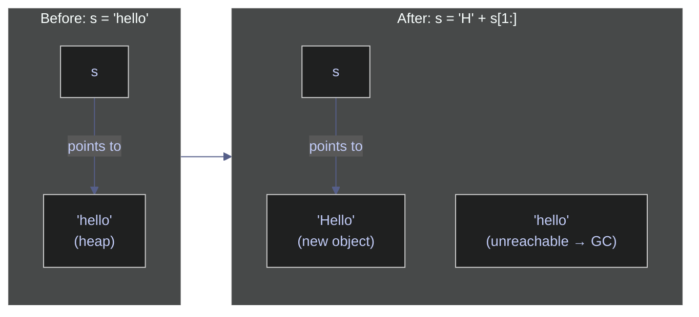
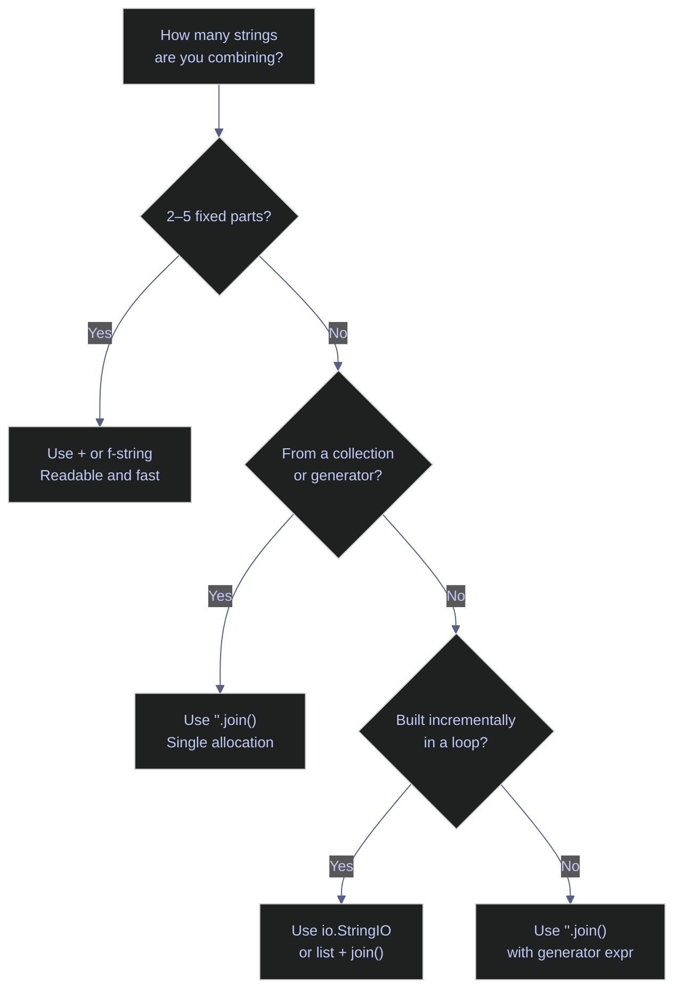

# 02. Strings - Python

> [!quote] Matsumoto on string processing
>
> "In our daily lives as programmers, we process text strings a lot. So I tried to work hard on text processing, namely the string class and regular expressions."
>
> — **Yukihiro Matsumoto**, creator of Ruby

> [!abstract]- Summary
>
> Reference coverage for Python string representation, slicing semantics, transformation APIs, interpolation mechanisms, construction strategies, and regular-expression workflows.
>
> **String Creation & Basics**
> - `str` is Python's text type: an immutable Unicode code-point sequence with no separate `char`
> - Single, double, and triple quotes all create `str` objects; `r"..."` leaves backslashes uninterpreted
> - `str()` converts arbitrary objects; `*` repeats strings; empty strings are falsy and test cleanly with `if not s:`
> - String transformations allocate new objects; repeated `+=` in loops is O(n²), so use `"".join()` or `io.StringIO`
>
> **Indexing & Slicing**
> - Zero-based indexing and negative indexing from the end (`s[-1]` for the final character)
> - Slice syntax `s[start:stop:step]`: `stop` is exclusive; out-of-range silently clamped
> - `s[::-1]` reverses; direct `s[i]` raises `IndexError` for out-of-range
>
> **String Methods**
> - Case: `upper`, `lower`, `title`, `capitalize`, `swapcase`, `casefold` (Unicode-aware)
> - Whitespace/padding: `strip`, `lstrip`, `rstrip`, `ljust`, `rjust`, `center`, `zfill`
> - Content checks: `isalpha`, `isdigit`, `isdecimal`, `isnumeric`, `isspace`, `isidentifier`
> - Search: `find` (returns -1), `index` (raises), `rfind`, `count`, `startswith`, `endswith`
> - Replace/split/join: `replace`, `split`, `rsplit`, `splitlines`, `partition`, `join`, `expandtabs`
> - Encoding: `maketrans`/`translate` for character-level substitution; `encode`/`decode` for bytes
>
> **String Formatting**
> - f-strings (Python 3.6+): default choice for literal templates; expressions inside `{...}` evaluate at runtime
> - `str.format()`: positional/named placeholders; use when template is a variable
> - `%` operator: legacy C-style; still common in logging
> - Format specifiers: `:.2f`, `:,.2f`, `:.2e`, `:.1%`, `:b`, `:x`, `:#x`, `:<10`, `:>10`, `:^10`
> - Locale-aware currency formatting through `locale` is OS-dependent; prefer `babel` when portability matters
>
> **Efficient String Building**
> - `"".join()`: O(n), single allocation — use for any loop-based assembly
> - `io.StringIO`: incremental write interface analogous to C# `StringBuilder`
> - `+`: acceptable for 2–5 fixed parts only
>
> **Regular Expressions**
> - `re.search` scans whole string; `re.match` anchors to start; `re.fullmatch` requires full string
> - `re.findall` returns list; `re.finditer` yields match objects with position info
> - Capture groups `(...)`: `group(0)` = full match, `group(1)` = first group
> - Named groups `(?P<name>...)`: access via `group('name')` or `groupdict()`
> - `re.sub`: static, lambda, or backreference replacement; `re.split`: pattern-based tokenizing
> - `re.compile`: create reusable regex objects; common flags include `IGNORECASE`, `MULTILINE`, `DOTALL`, `VERBOSE`
>
> **Operational Safety**
> - Never use f-strings in SQL/shell — use parameterized queries or `shlex.quote()`
> - Always use raw strings `r"..."` for regex patterns to avoid escape conflicts
> - Use `casefold()` not `lower()` for Unicode-correct case-insensitive comparison
> - Use `babel` not `locale` for portable currency/number formatting in production

> [!note]- Glossary
>
> **`str`**
>
> - Python text type: immutable sequence of Unicode code points with no separate `char` type.
> - Used at every text boundary, including user input, JSON payloads, log messages, SQL parameters, and file paths.
> - A single character is still a `str` of length 1, and Python 3 string operations are Unicode-aware by default.
>
> ---
>
> **Immutability**
>
> - A `str` cannot be modified in place; item assignment such as `s[0] = "H"` raises `TypeError`.
> - Transformations allocate new string objects, which keeps strings safe for hashing, dict keys, and shared references.
> - Repeated `+=` inside loops copies the accumulated value on each iteration; use `"".join()` or `io.StringIO` for repeated assembly.
>
> ---
>
> **Indexing**
>
> - `s[i]` returns the character at a zero-based position and raises `IndexError` when the position is out of range.
> - Used for parsing, validation, prefix checks, and position-based extraction.
> - Python returns a one-character `str`, not a distinct `char` type.
>
> ---
>
> **Negative indexing**
>
> - Negative indices address positions from the end: `s[-1]` is the final character and `s[-2]` is the previous one.
> - This avoids explicit `len(s) - 1` arithmetic for suffix inspection and reverse traversal.
> - `s[-0]` is identical to `s[0]`; use `s[-1]` when you mean the last element.
>
> ---
>
> **Slicing**
>
> - `s[start:stop:step]` extracts a substring; `stop` is exclusive and omitted bounds use defaults.
> - Used for substrings, reversal (`s[::-1]`), and stride-based extraction.
> - Slice bounds are clamped rather than raising `IndexError`, unlike direct indexing.
>
> ---
>
> **`f-string`**
>
> - Formatted string literal in which expressions inside `{...}` are evaluated at runtime and may include format specifiers after `:`.
> - Preferred interpolation mechanism for literal templates in new Python code.
> - Do not use f-strings to build SQL or shell commands from untrusted data; use parameterized APIs instead.
>
> ---
>
> **`str.format()`**
>
> - Placeholder-based formatting with positional or named fields, for example `"{} {}".format(a, b)` or `"{name}".format(name="x")`.
> - Useful when the template string is stored in a variable rather than written as a literal.
> - Do not mix automatic field numbering (`{}`) with manual numbering (`{0}`); Python raises `ValueError`.
>
> ---
>
> **Format specifier**
>
> - Mini-language written after `:` inside a replacement field, for example `:.2f`, `:,.2f`, `:#x`, or `:.1%`.
> - Controls numeric precision, width, alignment, sign display, and radix formatting without manual string manipulation.
> - The colon is required between the expression and the specifier: `f"{n:.2f}"`, not `f"{n.2f}"`.
>
> ---
>
> **`join()`**
>
> - `separator.join(iterable)` assembles items into a single string and is invoked on the separator, not on the collection.
> - Standard O(n) construction pattern for repeated string assembly.
> - `parts.join(", ")` is incorrect because `list` has no `join`; write `", ".join(parts)`.
>
> ---
>
> **`io.StringIO`**
>
> - In-memory text buffer with `.write()`, `.getvalue()`, and context-manager support.
> - Useful when text is emitted incrementally rather than assembled from a ready-made list of fragments.
> - Use a context manager or close the buffer when the object has a clearly bounded lifetime.
>
> ---
>
> **Regular expression**
>
> - Pattern language used by the `re` module for matching, extracting, replacing, and splitting text.
> - Appropriate when fixed-string methods cannot express the validation or extraction rule precisely.
> - Regex patterns should usually be written as raw strings so backslashes reach the regex engine unchanged.
>
> ---
>
> **Capture group**
>
> - Parentheses `(...)` capture matched substrings for later retrieval through `match.group(n)`.
> - Used to extract structured components such as area codes, usernames, domains, or date parts.
> - `group(0)` is always the full match; numbered capture groups start at `1`.
>
> ---
>
> **Named group**
>
> - `(?P<name>...)` assigns a name to a capture group, retrievable through `match.group("name")` or `groupdict()`.
> - Improves readability when a pattern returns several structured fields.
> - Python requires the `?P<name>` syntax rather than C#'s `?<name>` form.
>
> ---
>
> **`re.compile`**
>
> - Compiles a pattern into a reusable regex object with methods such as `.search()`, `.findall()`, and `.sub()`.
> - Useful when the same pattern is applied repeatedly or shared across several operations.
> - Compilation happens at runtime; Python does not have a source-generated regex feature comparable to recent .NET releases.
>
> ---
>
> **Raw string**
>
> - `r"..."` tells Python not to interpret backslash escapes before the value reaches the next layer.
> - Essential for regex patterns and often clearer for Windows-style paths.
> - Raw strings cannot end with an odd number of trailing backslashes.
>
> ---
>
> **`casefold()`**
>
> - Unicode-aware normalization method intended for caseless comparison.
> - More aggressive than `lower()`, so values such as `"Straße"` normalize correctly for comparison.
> - Prefer `casefold()` over `lower()` whenever equality must remain correct across non-ASCII text.
>
> ---
>
> **Locale**
>
> - Operating-system-provided regional settings for numeric formatting, currency symbols, separators, and collation order.
> - Used through Python's `locale` module when output must follow a host system's regional conventions.
> - Locale identifiers and installed locales vary by operating system; use `babel` when formatting must be portable.

## String Creation & Basics

This section covers the fundamental building blocks of string handling in Python: literal syntax, type conversions, construction patterns, and the immutability guarantee that shapes how strings behave at runtime.

### Literals and declaration

Python strings are sequences of Unicode code points. Single quotes and double quotes are interchangeable; triple quotes create multiline strings; and the `r""` prefix disables escape processing.

#### Declare strings with single and double quotes

`str` is Python's only text type — there is no separate `char` type. A single character is simply a string of length 1. Single quotes (`'...'`) and double quotes (`"..."`) produce identical `str` objects. Choose whichever avoids internal escaping.

Use this when literal syntax or quote choice is the actual question. It is typically triggered by reach for it when embedded quotes or escapes make the spelling unclear. Local Python REPL, script, or notebook cell. Show that single-quoted and double-quoted literals produce equal `str` values.

*This example imports the modules used later in the note and declares equivalent single-quoted and double-quoted strings.*

```python
import io
import re
import time
import locale

s1 = 'hello'
s2 = "hello"
print(repr(s1))
print(f"\"{s2}\"")
print(s1 == s2)
```

```text
'hello'
"hello"
True
```

#### Create multiline and raw strings

Triple-quoted strings (`"""..."""` or `'''...'''`) preserve embedded newlines. Raw strings (`r"..."`) treat backslashes as literal characters — essential for regex patterns and Windows file paths. Both can be combined (`r"""..."""`).

Use this when you need multiline text or preserved backslashes. It is typically triggered by reach for it when writing regex patterns, Windows paths, or doc-like literals. Local Python REPL, script, or notebook cell. Show newline preservation and raw-string escape handling.

*This example creates triple-quoted multiline strings and raw strings, then prints their rendered values.*

```python
s3 = """This is
a multiline
string"""
s4 = '''Also works
with single
quotes'''
print(s3)
print()

s5 = r"C:\Users\new\test"
s6 = "C:\\Users\\new\\test"
print(s5)
print(s6)
print(s5 == s6)
```

```text
This is
a multiline
string

C:\Users\new\test
C:\Users\new\test
True
```

### Conversion and construction

Methods for converting other types to strings, assembling strings from parts, and checking for empty values.

#### Convert other types to string with str()

`str()` calls the object's `__str__` method (or `__repr__` as fallback) to produce a human-readable string representation. Unlike C#'s `ToString()`, `str(None)` returns the string `"None"` rather than throwing.

Use this when non-string values must cross into a text boundary. It is typically triggered by reach for it when numbers, booleans, containers, or `None` need display form. Local Python REPL, script, or notebook cell. Show the default `str()` representations for common Python values.

*This example converts common Python values to strings and prints their quoted representations.*

```python
print(repr(str(42)))
print(repr(str(3.14)))
print(repr(str(True)))
print(repr(str([1,2,3])))
print(repr(str(None)))
```

```text
'42'
'3.14'
'True'
'[1, 2, 3]'
'None'
```

#### Repeat and concatenate strings

The `*` operator repeats a string *n* times — a feature C# lacks. The `+` operator concatenates strings. The compiler does not optimize `+` in loops, so reserve it for small fixed concatenations.

Use this when assembling a few fixed fragments or repeating a token. It is typically triggered by reach for it when literal repetition is simpler than a loop or `join()`. Local Python REPL, script, or notebook cell. Show `*` repetition and small-scale `+` concatenation.

*This example repeats a substring and concatenates a few fixed string literals with `+`.*

```python
print(repr('ha' * 3))
print(repr('hello' + ' ' + 'world'))
```

```text
'hahaha'
'hello world'
```

#### Check for empty strings and truthiness

Empty strings are falsy in Python — `bool('')` returns `False`. This means you can test for emptiness with `if not s:` instead of `if s == ""` or `if len(s) == 0`. Any non-empty string is truthy. Prefer `if not s:` as the default spelling; it is the idiomatic boolean test and also treats `None` as falsy when the surrounding API allows both `None` and `""`.

Use this when control flow depends on whether text is present. It is typically triggered by reach for it when deciding between truthiness, equality, and length checks. Local Python REPL, script, or notebook cell. Show the boolean behavior of empty and non-empty strings.

*This example checks an empty string by equality, length, and boolean truthiness.*

```python
empty = ""
print(empty == '')
print(len(empty))
print(bool(''))
print(bool('a'))
```

```text
True
0
False
True
```

### Immutability

The single most important property of Python strings — every operation that appears to modify a string actually allocates a new object and returns it. Understanding this shapes how you write performant string code.

#### Understand string immutability and its implications

Once a `str` is created, its character sequence cannot change. Item assignment (`s[0] = 'H'`) raises `TypeError`. Any transformation — `upper()`, `replace()`, slicing, or concatenation — allocates a new `str` on the heap. The original is unchanged and becomes eligible for garbage collection if no other reference points to it.
Avoid `+=` as the default inside loops because repeated growth can force repeated copying of the accumulated text. For repeated assembly, use `"".join()` when fragments already exist in a collection and `io.StringIO` when text is emitted incrementally. Reserve `+` for a few fixed fragments.

Use this when an in-place mutation instinct would be wrong. It is typically triggered by reach for it when translating from mutable-text APIs or debugging `TypeError`. Local Python REPL, script, or notebook cell. Show that rewriting one character position creates a new string.

*This example rebuilds a string by slicing because Python strings cannot be modified in place.*

```python
s = "hello"
s = "H" + s[1:]
print(s)
```

```text
Hello
```

The diagram below shows what happens in memory. The variable `s` is reassigned to point to a new string object; the original `"hello"` is not modified — it becomes unreachable and is collected by the GC.

*This diagram shows reassignment from the original string object to the newly allocated result.*



## Indexing & Slicing

Accessing individual characters and extracting substrings. Python uses 0-based indexing, negative indexing from the end, and slice syntax (`start:stop:step`) with full stride support — more powerful than C#'s Range syntax.

### Accessing characters and substrings

Direct character access by position, substring extraction via slicing, and stride patterns.

#### Access characters and substrings by index and slice

Python strings support 0-based indexing with `[]`, negative indexing from the end, and slice syntax `[start:stop:step]` with full stride support. Slicing never raises an exception — out-of-range indices are silently clamped.
In practice, `s[i]` reads one character, `s[-1]` reads the last character, `s[a:b]` returns a right-exclusive slice, `s[::2]` applies a stride, and `s[::-1]` reverses the string. For structured extraction, prefer `split`, `partition`, or regex over manual index math.

Use this when direct character access or fixed-position slices are appropriate. It is typically triggered by reach for it when index math is simpler than delimiter parsing or regex. Local Python REPL, script, or notebook cell. Show zero-based indexing, negative indexing, and common slice forms.

*This example reads individual characters and common slices, including negative indices and reversed order.*

```python
s = "Hello, World!"
print(repr(s[0]))
print(repr(s[1]))
print(repr(s[-1]))
print(repr(s[-2]))
print(repr(s[0:5]))
print(repr(s[:5]))
print(repr(s[7:]))
print(repr(s[-6:]))
print(repr(s[::2]))
print(repr(s[::-1]))
print(repr(s[7:12]))
print(repr(s[2:10:2]))
```

```text
'H'
'e'
'!'
'd'
'Hello'
'Hello'
'World!'
'World!'
'Hlo ol!'
'!dlroW ,olleH'
'World'
'lo o'
```

### Iterating characters and out-of-range behavior

Python slicing silently clamps out-of-range indices — no exception is raised. Direct indexing (`s[100]`) raises `IndexError`.

#### Handle out-of-range access and iterate characters

Slicing beyond the string length returns as many characters as available — `s[0:100]` returns the full string without error. Direct index access (`s[100]`) raises `IndexError`. Use `for ch in s` for simple iteration or `enumerate()` for index-value pairs (equivalent to C#'s LINQ `Select` with index).
This mismatch is intentional: indexing requires a valid position, while slicing clamps bounds and returns the available span.

Use this when a boundary might exceed the string length. It is typically triggered by reach for it when choosing between forgiving slicing and strict indexing. Local Python REPL, script, or notebook cell. Show slice clamping and character iteration with `enumerate()`.

*This example shows slice clamping, iterates over characters, and prints indexes with `enumerate()`.*

```python
s = "Hello, World!"
print(repr(s[0:100]))

print(" ".join(s[:5]))

for i, ch in enumerate(s[:5]):
    print(f"  [{i}] = '{ch}'")
```

```text
'Hello, World!'
H e l l o
  [0] = 'H'
  [1] = 'e'
  [2] = 'l'
  [3] = 'l'
  [4] = 'o'
```

## String Methods

The built-in methods on `str` for transforming case, trimming whitespace, inspecting content, searching, splitting, joining, and encoding. All transformation methods return new strings — the original is never modified.

### Case conversion

Methods for changing letter case. Python provides `upper()`, `lower()`, `title()`, `capitalize()`, `swapcase()`, and `casefold()` — richer than C#'s set.

#### Convert case with upper, lower, title, capitalize, swapcase, casefold

Python provides six case-conversion methods. `upper()` and `lower()` convert all characters. `title()` capitalizes the first letter of each word, while `capitalize()` only capitalizes the first character of the string. `swapcase()` inverts case, and `casefold()` performs aggressive Unicode-aware lowering for case-insensitive comparison.
Use `casefold()` rather than `lower()` for caseless comparison, especially with non-ASCII text such as `"Straße"`. `title()` and `capitalize()` encode different word-boundary behavior, and all six methods apply Unicode casing rules without exposing locale-specific tuning through the `str` API.

Use this when normalizing or presenting text with specific casing. It is typically triggered by reach for it when case-insensitive comparison or title casing is required. Local Python REPL, script, or notebook cell. Show the main case-conversion methods and `casefold()` behavior.

*This example applies the main case-conversion methods, including Unicode-aware `casefold()`.*

```python
s = "  Hello, World!  "

print(repr('hello world'.upper()))
print(repr('HELLO WORLD'.lower()))
print(repr('hello world'.title()))
print(repr('hello world'.capitalize()))
print(repr('Hello World'.swapcase()))
print(repr('Straße'.casefold()))
```

```text
'HELLO WORLD'
'hello world'
'Hello World'
'Hello world'
'hELLO wORLD'
'strasse'
```

### Whitespace and padding

Methods for stripping leading/trailing whitespace (or custom characters) and padding strings to a fixed width.

#### Trim with strip and pad with ljust, rjust, center, zfill

`strip()` removes whitespace from both ends; `lstrip()`/`rstrip()` from one side. Pass a string argument to strip specific characters. `ljust`/`rjust`/`center` pad to a target width — Python adds `center()` and `zfill()` which C# lacks natively.

Use this when cleaning input or formatting fixed-width output. It is typically triggered by reach for it when whitespace, padding, or zero-fill behavior matters. Local Python REPL, script, or notebook cell. Show trimming and width-filling helpers on representative text.

*This example trims whitespace and pads strings with alignment and zero-fill helpers.*

```python
s = "  Hello, World!  "
print(repr(s.strip()))
print(repr(s.lstrip()))
print(repr(s.rstrip()))
print(repr('Hello!!'.strip('!')))
print(repr('hello'.center(20)))
print(repr('hello'.center(20, '*')))
print(repr('hello'.ljust(20)))
print(repr('hello'.rjust(20)))
print(repr('42'.zfill(8)))
```

```text
'Hello, World!'
'Hello, World!  '
'  Hello, World!'
'Hello'
'       hello        '
'*******hello********'
'hello               '
'               hello'
'00000042'
```

### Character and content checks

Python provides built-in `str.isXxx()` methods — unlike C# where you must combine `char.IsXxx` with LINQ.

#### Test string content with isalpha, isdigit, isnumeric, and more

Python provides built-in `str.isXxx()` methods that return `True` if all characters satisfy the condition and the string is non-empty. Notable distinctions: `isnumeric()` is broader than `isdigit()` (it includes fractions like `½`), `isdecimal()` is the strictest (only `0-9`), and `isprintable()` returns `False` for control characters like `\n`.
For parsing numbers, `isdecimal()` is the strictest choice; `isdigit()` also accepts superscripts and subscripts, while `isnumeric()` is broader still and includes values such as `½`.

Use this when validating text before parsing or branching on it. It is typically triggered by reach for it when the code depends on digits, identifiers, whitespace, or printable text. Local Python REPL, script, or notebook cell. Show the behavior of the common `isXxx()` predicates.

*This example runs the common string content-check methods and prints their boolean results.*

```python
checks = {
    "isalpha()":    "Hello",
    "isdigit()":    "12345",
    "isalnum()":    "Hello123",
    "isspace()":    "   ",
    "isupper()":    "HELLO",
    "islower()":    "hello",
    "istitle()":    "Hello World",
    "isascii()":    "Hello",
    "isnumeric()":  "½",
    "isdecimal()":  "12345",
    "isidentifier()": "my_var",
    "isprintable()":  "hello\n",
}
for method, example in checks.items():
    result = getattr(example, method.replace('()', ''))()
    safe = example.replace("\n", "\\n")
    print(f"'{safe:12}'.{method:18} = {result}")
```

```text
'Hello       '.isalpha()          = True
'12345       '.isdigit()          = True
'Hello123    '.isalnum()          = True
'            '.isspace()          = True
'HELLO       '.isupper()          = True
'hello       '.islower()          = True
'Hello World '.istitle()          = True
'Hello       '.isascii()          = True
'½           '.isnumeric()        = True
'12345       '.isdecimal()        = True
'my_var      '.isidentifier()     = True
'hello\n     '.isprintable()      = False
```

### Search and location

Methods for finding substrings by position or existence.

#### Search with find, index, count, startswith, endswith

`find` returns the 0-based position of the first occurrence (or `-1` if not found). `index` is identical but raises `ValueError` instead of returning `-1`. `rfind`/`rindex` search from the right. `count` returns the number of non-overlapping occurrences. The `in` operator is the idiomatic way to check for substring existence.

Use this when locating substrings or checking presence without regex. It is typically triggered by reach for it when you need positions, counts, or prefix/suffix tests. Local Python REPL, script, or notebook cell. Compare `find()`, `index()`, `count()`, `startswith()`, and `endswith()`.

*This example searches for substrings, counts matches, and compares `find()` with `index()`.*

```python
s = "Hello, World! Hello!"
print(s.find('Hello'))
print(s.find('Hello', 1))
print(s.rfind('Hello'))
print(s.find('Java'))
print(s.index('World'))
print(s.count('Hello'))
print(s.startswith('Hello'))
print(s.endswith('!'))
print('World' in s)
```

```text
0
14
14
-1
7
2
True
True
True
```

### Comparison and ordering

Python strings support direct comparison with `<`, `>`, `==` using lexicographic (Unicode code point) ordering — no explicit `Compare` method needed.

#### Compare strings for ordering

Python's comparison operators (`<`, `>`, `<=`, `>=`, `==`, `!=`) compare strings lexicographically by Unicode code point — equivalent to C#'s `StringComparison.Ordinal`. For locale-aware sorting (e.g., German ä near a), use `locale.strcoll`. For custom sort keys, use `functools.cmp_to_key`. Python has no built-in case-insensitive comparison operator, so normalize both sides with `casefold()` when equality must remain Unicode-correct.

Use this when code depends on lexical order or equality semantics. It is typically triggered by reach for it when sorting text or comparing case-sensitive versus caseless values. Local Python REPL, script, or notebook cell. Show default lexicographic ordering and `casefold()` equality.

*This example compares strings for lexical ordering, case sensitivity, and case-insensitive equality.*

```python
print("apple" < "banana")
print("banana" > "apple")
print("apple" == "apple")
print("hello" == "HELLO")
print("hello".casefold() == "HELLO".casefold())
```

```text
True
True
True
False
True
```

### Replace, split, and join

Methods for substituting substrings, tokenizing strings into arrays, and reassembling them. Python's `str.split()` and `str.join()` are richer than C#'s — with `rsplit`, `splitlines`, `partition`, and `expandtabs`.

#### Replace substrings and split strings

`replace` substitutes occurrences and accepts an optional max-count parameter (unlike C# which always replaces all). `split` tokenizes on a delimiter — with no arguments it splits on any whitespace and strips empties, equivalent to C#'s `Split(null, RemoveEmptyEntries)`. `rsplit` splits from the right. `splitlines` handles all line endings (`\n`, `\r\n`, `\r`). `partition`/`rpartition` split into exactly three parts `(before, sep, after)`.

Use this when tokenizing or rewriting structured text without regex. It is typically triggered by reach for it when delimiter behavior matters more than arbitrary pattern matching. Local Python REPL, script, or notebook cell. Show replacement, whitespace splitting, right splits, and partitions.

*This example replaces substrings and splits text into lists and tuples with several string methods.*

```python
s = "  Hello, World!  "
print(repr(s.replace('Hello', 'Hi')))
print(repr(s.replace('Hello', 'Hi', 1)))

csv = "apple,banana,cherry"
print(csv.split(','))
print(csv.split(',', 1))

words = "  hello  world  "
print(words.split())
print(words.split(' '))

print(csv.rsplit(',', 1))

lines = "line1\nline2\nline3"
print(lines.splitlines())

print(csv.partition(','))
print(csv.rpartition(','))
```

```text
'  Hi, World!  '
'  Hi, World!  '
['apple', 'banana', 'cherry']
['apple', 'banana,cherry']
['hello', 'world']
['', '', 'hello', '', 'world', '', '']
['apple,banana', 'cherry']
['line1', 'line2', 'line3']
('apple', ',', 'banana,cherry')
('apple,banana', ',', 'cherry')
```

#### Rejoin strings with join and expandtabs

`str.join(iterable)` is called on the separator string, not on the list — the opposite of C#'s `string.Join(separator, collection)`. `expandtabs` replaces tab characters with spaces aligned to tab stops.

Use this when fragments already exist and need recomposition. It is typically triggered by reach for it when building display text from a list or expanding tabs for alignment. Local Python REPL, script, or notebook cell. Show separator-driven `join()` and `expandtabs()`.

*This example rejoins a list of strings with different separators and expands tab characters to spaces.*

```python
parts = ["hello", "world", "python"]
print(repr(' '.join(parts)))
print(repr(', '.join(parts)))
print(repr('->'.join(parts)))
print(repr(''.join(parts)))

tab_str = "a\tb\tc"
print(repr(tab_str.expandtabs(4)))
```

```text
'hello world python'
'hello, world, python'
'hello->world->python'
'helloworldpython'
'a   b   c'
```

### Encoding and translation

Converting between strings and bytes, and performing character-level replacements.

#### Translate characters and encode to bytes

`str.maketrans` builds a translation table mapping characters to replacements (or `None` for deletion). `translate` applies the table in a single pass — faster than chained `replace` calls for multiple substitutions. `encode` converts a `str` to `bytes` using a specified codec; `bytes.decode` reverses the process. C# has no direct equivalent of `str.translate` or `str.maketrans`; the closest options are `Regex.Replace` with a character class or a manual `StringBuilder` loop.

Use this when applying character-level substitution or crossing the text/bytes boundary. It is typically triggered by reach for it when cleanup requires many single-character rewrites or explicit encoding. Local Python REPL, script, or notebook cell. Show `maketrans()`, `translate()`, and basic encoding to bytes.

*This example translates characters with `maketrans()` and converts text to UTF-8 and ASCII bytes.*

```python
table = str.maketrans("aeiou", "12345")
print(repr('hello world'.translate(table)))

table2 = str.maketrans("", "", "aeiou")
print(repr('hello world'.translate(table2)))

print('hello'.encode('utf-8'))
print('hello'.encode('ascii'))
```

```text
'h2ll4 w4rld'
'hll wrld'
b'hello'
b'hello'
```

## String Formatting

Embedding values into strings and controlling how numbers, dates, and currencies are displayed. Python offers three mechanisms: f-strings (`f""`), `str.format()`, and the legacy `%` operator.

### Interpolation mechanisms

The three standard ways to embed values into strings.

#### Embed values with f-strings, format(), and % operator

f-strings (`f""`, Python 3.6+) are the preferred approach when the template is a literal in source code. They accept arbitrary expressions inside `{...}`, including format specifiers such as `f"{n:.2f}"`, method calls such as `f"{name.upper()}"`, and arithmetic such as `f"{age + 1}"`.

Use `str.format()` when the template string is stored in a variable. Keep `%` formatting for legacy interfaces such as logging, where `logger.info("User %s logged in", username)` preserves lazy formatting. Do not build SQL or shell commands with f-strings or `.format()` from untrusted input; use parameterized queries and argument vectors instead.

Use this when rendering values into human-readable strings. It is typically triggered by reach for it when choosing between f-strings, `.format()`, and legacy `%` formatting. Local Python REPL, script, or notebook cell. Show the three interpolation mechanisms on the same values.

*This example formats the same values with f-strings, `str.format()`, and the legacy `%` operator.*

```python
name, age = "Alice", 30
n = 1234567.89123
pct = 0.856

print(f"Name: {name}, Age: {age}")
print(age + 1)
print(name.upper())

print("Name: {}, Age: {}".format(name, age))
print("Name: {0}, Age: {1}, {0} again".format(name, age))
print("Name: {n}, Age: {a}".format(n=name, a=age))

print("Name: %s, Age: %d, Pi: %.2f" % (name, age, 3.14))
```

```text
Name: Alice, Age: 30
31
ALICE
Name: Alice, Age: 30
Name: Alice, Age: 30, Alice again
Name: Alice, Age: 30
Name: Alice, Age: 30, Pi: 3.14
```

### Numeric format specifiers

Format specifiers inside f-string braces control numeric display: `{value:.2f}`, `{value:,.0f}`, `{value:#x}`.

#### Format numbers with f-string specifiers

The table below summarizes the specifiers used in the examples and the output they produce.

Use this when precision, grouping, radix, or percentage output matters. It is typically triggered by reach for it when a raw numeric value must be rendered for humans. Local Python REPL, script, or notebook cell. Show the most common numeric format specifiers in one place.

| Specifier | Meaning | Example |
|---|---|---|
| `.2f` | Fixed-point, 2 decimals | `1234567.89` |
| `,.2f` | Fixed with comma separator | `1,234,567.89` |
| `.2e` | Scientific notation | `1.23e+06` |
| `.4g` | General (compact) | `1.235e+06` |
| `.1%` | Percentage (multiplies by 100) | `85.6%` |
| `d` | Decimal integer | `255` |
| `b` | Binary | `11111111` |
| `o` | Octal | `377` |
| `x`/`X` | Hexadecimal lower/upper | `ff` / `FF` |
| `#x` | Hex with `0x` prefix | `0xff` |

*This example formats numbers with precision, grouping, scientific notation, percentages, and integer radix specifiers.*

```python
n = 1234567.89123
pct = 0.856
print(f"{n:.2f}")
print(f"{n:.0f}")
print(f"{n:,.2f}")
print(f"{n:.2e}")
print(f"{n:.4g}")
print(f"{pct:.1%}")

x = 255
print(f"{x:d}")
print(f"{x:b}")
print(f"{x:o}")
print(f"{x:x}")
print(f"{x:X}")
print(f"{x:#x}")
print(f"{x:08d}")
```

```text
1234567.89
1234568
1,234,567.89
1.23e+06
1.235e+06
85.6%
255
11111111
377
ff
FF
0xff
00000255
```

### Alignment and locale currency

Controlling field width for tabular output and formatting numbers according to locale conventions.

#### Align strings and format currencies by locale

f-string alignment uses `<` (left), `>` (right), `^` (center) with an optional fill character. For locale-aware currency, Python's `locale` module depends on system locale availability and host-specific locale names. The `babel` library is more reliable and portable for production currency formatting.

Use this when fixed-width output or locale-aware currency formatting is required. It is typically triggered by reach for it when alignment must be visible or a host locale may affect formatting. Local Python REPL, script, or notebook cell; `locale` and `babel` behavior depends on host availability. Show alignment specifiers and the environment-sensitive currency paths.

*This example aligns text inside fixed-width fields and formats currency through `locale` and `babel` when available.*

```python
s = "hi"
print(repr(f"{s:<10}"))
print(repr(f"{s:>10}"))
print(repr(f"{s:^10}"))
print(repr(f"{s:*^10}"))
print(f"{42:+d}")
print(f"{42:d}")

try:
    locale.setlocale(locale.LC_ALL, 'en_US.UTF-8')
    print(locale.currency(1234567.89, grouping=True))
except locale.Error:
    print("(locale not available)")

try:
    from babel.numbers import format_currency
    print(f"EUR: {format_currency(1234567.89, 'EUR', locale='de_DE')}")
    print(f"JPY: {format_currency(1234567.89, 'JPY', locale='ja_JP')}")
    print(f"BRL: {format_currency(1234567.89, 'BRL', locale='pt_BR')}")
except ImportError:
    print("(babel not installed — pip install babel)")
```

```text
'hi        '
'        hi'
'    hi    '
'****hi****'
+42
42
$1,234,567.89
(babel not installed — pip install babel)
```

## Efficient String Building

Strategies for building strings without the O(n²) penalty of repeated concatenation. `"".join()` for collections, `io.StringIO` for incremental writes, and `+` for small fixed concatenations.

*This decision diagram maps the usual choice between `+`, `"".join()`, and `io.StringIO`.*



Use `+` or f-strings for a few fixed fragments. Once construction moves into a loop or a collection, switch to `"".join()` or `io.StringIO` to avoid repeated copying of the accumulated text.

### join() and io.StringIO

Python's equivalents of C#'s `StringBuilder` and `string.Join`.

#### Compare += vs join() performance

The benchmark below demonstrates the difference: 50,000 `+=` operations are materially slower than a single `"".join()` call because `join` pre-calculates the final size and copies each part exactly once.

Use this when a string-building hot path is suspected to be allocation-heavy. It is typically triggered by reach for it when loop-based concatenation starts to dominate runtime. Local Python REPL, script, or notebook cell; timing is environment-sensitive but the direction should be stable. Compare repeated `+=` against a single `join()` pass.

*This example times repeated `+=` concatenation against `"".join()` and reports a deterministic faster/slower comparison.*

```python
start = time.perf_counter()
result = ""
for i in range(50000):
    result += str(i)
t1 = time.perf_counter() - start

start = time.perf_counter()
result_join = "".join(str(i) for i in range(50000))
t2 = time.perf_counter() - start
print(f"+ in loop len={len(result)}")
print(f"join() len={len(result_join)}")
print(f"join faster? {t2 < t1}")
```

```text
+ in loop len=238890
join() len=238890
join faster? True
```

#### Build strings with io.StringIO and list accumulation

`io.StringIO` provides a file-like write interface for incremental string building — the Python equivalent of C#'s `StringBuilder`. Alternatively, accumulate parts in a `list` and call `"".join()` at the end. Generator expressions inside `join()` are the most concise pattern, and unlike C# there is no `ReadOnlySpan<char>`-style zero-allocation slice for text: every `str` slice allocates a new string, while `memoryview` applies only to bytes.

Use this when text is emitted incrementally or fragments are accumulated first. It is typically triggered by reach for it when a loop or writer-style API produces many small pieces. Local Python REPL, script, or notebook cell. Show `io.StringIO`, list accumulation, and generator-based `join()`.

*This example builds strings with `io.StringIO`, a list plus `join()`, and a generator expression.*

```python
buf = io.StringIO()
buf.write("Hello")
buf.write(", ")
buf.write("World!")
buf.write(f" Number: {42}")
result = buf.getvalue()
print(repr(result))
buf.close()

parts = []
for i in range(5):
    parts.append(f"item_{i}")
result = ", ".join(parts)
print(repr(result))

result = ", ".join(f"item_{i}" for i in range(5))
print(repr(result))
```

```text
'Hello, World! Number: 42'
'item_0, item_1, item_2, item_3, item_4'
'item_0, item_1, item_2, item_3, item_4'
```

#### Use + for small fixed concatenations

For 2–5 known parts, the `+` operator is perfectly readable and efficient. Python does not optimize `+` in loops, but for small fixed concatenations the overhead is negligible.

Use this when only a few known fragments must be combined. It is typically triggered by reach for it when `join()` would add ceremony without reducing allocations materially. Local Python REPL, script, or notebook cell. Show the readable fixed-fragment case where `+` is appropriate.

*This example concatenates a few fixed string parts with `+`, which is appropriate for small constant assemblies.*

```python
first = "Hello"
last = "World"
full = first + " " + last
print(repr(full))
```

```text
'Hello World'
```

## Regular Expressions

The `re` module provides pattern matching, extraction, replacement, and splitting. Always use raw strings (`r""`) for patterns to avoid double-escaping backslashes.

### Matching and capturing

Finding patterns in text and extracting matched groups.

#### Find matches with re.search, findall, finditer, match, fullmatch

`re.search` scans the entire string and returns the first match (or `None`). `re.findall` returns all non-overlapping matches as a list of strings. `re.finditer` yields match objects for iteration with position info. `re.match` only matches at the **start** of the string. `re.fullmatch` requires the **entire** string to match. When extracting structured tokens from prose, make the boundary explicit so trailing sentence punctuation is not consumed.

Use this when pattern search must scan text rather than split on fixed delimiters. It is typically triggered by reach for it when you need first match, all matches, iterator-based matches, or full-string validation. Local Python REPL, script, or notebook cell with the standard `re` module. Compare `search()`, `findall()`, `finditer()`, `match()`, and `fullmatch()`.

*This example searches text with the main `re` matching functions and prints the matches they return.*

```python
text = "Contact us at support@email.com or sales@company.org. Call 123-456-7890 or 987-654-3210."

match = re.search(r'\d{3}-\d{3}-\d{4}', text)
if match:
    print(f"Found: {match.group()} at [{match.start()}:{match.end()}]")

phones = re.findall(r'\d{3}-\d{3}-\d{4}', text)
emails = re.findall(r'[\w.+-]+@[\w-]+(?:\.[\w-]+)+', text)
print(phones)
print(emails)

for m in re.finditer(r'\d{3}-\d{3}-\d{4}', text):
    print(f"  {m.group()} at [{m.start()}:{m.end()}]")

print(bool(re.match(r'Contact', text)))
print(bool(re.match(r'support', text)))
print(bool(re.fullmatch(r'\d+', '12345')))
print(bool(re.fullmatch(r'\d+', '123a5')))
```

```text
Found: 123-456-7890 at [59:71]
['123-456-7890', '987-654-3210']
['support@email.com', 'sales@company.org']
  123-456-7890 at [59:71]
  987-654-3210 at [75:87]
True
False
True
False
```

#### Extract sub-matches with capture groups

Parentheses `(...)` create numbered capture groups accessible via `match.group(1)`, `match.group(2)`, etc. (`group(0)` is the full match). `match.groups()` returns all groups as a tuple. Named groups `(?P<name>...)` use the `P<>` syntax (unlike C#'s `<>`) and are accessed via `match.group('name')` or `match.groupdict()`.

Use this when a regex must return structured subfields rather than just a whole match. It is typically triggered by reach for it when the pattern needs user, domain, area code, or other named components. Local Python REPL, script, or notebook cell with the standard `re` module. Show numbered capture groups and named-group access.

*This example extracts numbered and named regex capture groups from a phone number and an email address.*

```python
text = "Contact us at support@email.com or sales@company.org. Call 123-456-7890 or 987-654-3210."

match = re.search(r'(\d{3})-(\d{3})-(\d{4})', text)
if match:
    print(f"Full:     {match.group(0)}")
    print(f"Groups:   {match.groups()}")
    print(f"Area:     {match.group(1)}")

match = re.search(r'(?P<user>[\w.+-]+)@(?P<domain>[\w-]+(?:\.[\w-]+)+)', text)
if match:
    print(f"User:     {match.group('user')}")
    print(f"Domain:   {match.group('domain')}")
    print(f"GroupDict:{match.groupdict()}")
```

```text
Full:     123-456-7890
Groups:   ('123', '456', '7890')
Area:     123
User:     support
Domain:   email.com
GroupDict:{'user': 'support', 'domain': 'email.com'}
```

### Replace, split, and compilation

Transforming text with pattern-based replacement, splitting on patterns, and pre-compiling for performance.

#### Replace, split, and compile regex patterns

`re.sub` substitutes matches — pass a string for static replacement, a lambda for dynamic transformation, or `\1`/`\2` backreferences for group rearrangement. `re.split` tokenizes on a pattern instead of a fixed delimiter. `re.compile` pre-compiles a pattern into a reusable object — the Python equivalent of C#'s `new Regex(..., Compiled)`.

Use this when a regex must transform, tokenize, or be reused several times. It is typically triggered by reach for it when fixed-string methods no longer express the rule cleanly. Local Python REPL, script, or notebook cell with the standard `re` module. Show `sub()`, `split()`, and `compile()` on the same sample text.

*This example replaces matches, splits text by regex, and reuses a compiled pattern.*

```python
text = "Contact us at support@email.com or sales@company.org. Call 123-456-7890 or 987-654-3210."

print(re.sub(r'\d{3}-\d{3}-\d{4}', '***-***-****', text))

print(re.sub(r'\d+', lambda m: str(int(m.group()) * 2), "price: 50, qty: 3"))

print(re.sub(r'(\w+)@(\w+)', r'\2/\1', "user@host"))

print(re.split(r'[.!?]\s*', "Hello World. How are you? Fine!"))
print(re.split(r'\s*,\s*', "a , b , c"))

phone_pat = re.compile(r'\d{3}-\d{3}-\d{4}')
print(phone_pat.findall(text))
print(phone_pat.sub('REDACTED', text))
```

```text
Contact us at support@email.com or sales@company.org. Call ***-***-**** or ***-***-****.
price: 100, qty: 6
host/user
['Hello World', 'How are you', 'Fine', '']
['a', 'b', 'c']
['123-456-7890', '987-654-3210']
Contact us at support@email.com or sales@company.org. Call REDACTED or REDACTED.
```

### Syntax reference

Quick-reference tables for regex syntax elements.

#### Regex syntax — characters, quantifiers, anchors, groups

A condensed reference for Python's `re` module syntax. Named groups use `(?P<name>...)` (with `P`) — unlike C#'s `(?<name>...)`.

*This reference block summarizes the core Python `re` tokens used across the examples.*

```text
CHARACTERS
.         Any character (except newline)
\d        Digit [0-9]              \D  Non-digit
\w        Word char [a-zA-Z0-9_]   \W  Non-word
\s        Whitespace [ \t\n\r]     \S  Non-whitespace
\b        Word boundary             \B  Non-word boundary

QUANTIFIERS
*         0 or more (greedy)        *?  0 or more (lazy)
+         1 or more (greedy)        +?  1 or more (lazy)
?         0 or 1 (optional)         ??  0 or 1 (lazy)
{n}       Exactly n                 {n,m}  Between n and m
{n,}      n or more                 {n,m}? Between n and m (lazy)

ANCHORS
^         Start of string/line      $   End of string/line
\A        Start of string only      \Z  End of string only

GROUPS
(...)     Capture group             (?:...)  Non-capture group
(?P<name>...) Named group           (?P=name) Backreference
\1, \2    Backreference by number

LOOKAROUND
(?=...)   Lookahead (positive)      (?!...)  Lookahead (negative)
(?<=...)  Lookbehind (positive)     (?<!...) Lookbehind (negative)

CHARACTER CLASSES
[abc]     Any of a, b, c            [^abc]  NOT a, b, c
[a-z]     Range a through z         [a-zA-Z0-9]  Alphanumeric
|         OR (alternation)
```

### Options and flags

`re` flags modify matching behavior. Combine multiple flags with bitwise OR (`|`).

#### Control matching with re flags

`re.IGNORECASE` enables case-insensitive matching. `re.MULTILINE` makes `^` and `$` match line boundaries. `re.DOTALL` makes `.` match newline characters. `re.VERBOSE` allows formatting patterns with whitespace and inline `#` comments for readability — the Python equivalent of C#'s `IgnorePatternWhitespace`. Relative to C#, `re.compile()` is the closest analogue to `[GeneratedRegex]`, but compilation still happens at runtime rather than during the build.

Use this when default regex behavior misses case, newline, or readability requirements. It is typically triggered by reach for it when anchors, dot matching, or commented patterns need to change. Local Python REPL, script, or notebook cell with the standard `re` module. Show the practical effect of `IGNORECASE`, `MULTILINE`, `DOTALL`, and `VERBOSE`.

*This example applies common regex flags such as `IGNORECASE`, `MULTILINE`, `DOTALL`, and `VERBOSE`.*

```python
text = "Hello\nworld\nHELLO"
print(re.findall(r'hello', text, re.IGNORECASE))
print(re.findall(r'^\w+', text, re.MULTILINE))
print(bool(re.search(r'Hello.world', text, re.DOTALL)))

pattern = re.compile(r"""
    (\d{3})     # area code
    [-.]        # separator
    (\d{3})     # first 3 digits
    [-.]        # separator
    (\d{4})     # last 4 digits
""", re.VERBOSE)
print(pattern.findall('Call 123-456-7890'))

print(re.findall(r'^hello', text, re.IGNORECASE | re.MULTILINE))
```

```text
['Hello', 'HELLO']
['Hello', 'world', 'HELLO']
True
[('123', '456', '7890')]
['Hello', 'HELLO']
```

### Validation patterns

Ready-to-use validation patterns for frequently matched formats.

#### Common regex patterns for validation

The table below collects compact patterns that are frequently reused in validation helpers and data-cleaning code.

Use this when you need a compact starting point for common validation helpers. It is typically triggered by reach for it when scaffolding an email, URL, date, time, or password check. Local Python REPL, script, or notebook cell; these are starter patterns, not full RFC validators. Print the reusable pattern set so it is easy to compare or copy.

| Pattern | Regex |
|---|---|
| Email | `^[\w.+-]+@[\w-]+(?:\.[\w-]+)+$` |
| URL | `https?://[\w./\-?=&#]+` |
| IPv4 | `\b\d{1,3}(\.\d{1,3}){3}\b` |
| Date (YYYY-MM-DD) | `\d{4}-(?:0[1-9]|1[0-2])-(?:0[1-9]|[12]\d|3[01])` |
| Time (HH:MM) | `(?:[01]\d|2[0-3]):[0-5]\d` |
| Hex color | `^#[0-9a-fA-F]{6}$` |
| Phone (US) | `\(?\d{3}\)?[-.\s]?\d{3}[-.\s]?\d{4}` |
| Zip code (US) | `\d{5}(-\d{4})?` |
| Strong password | `^(?=.*[a-z])(?=.*[A-Z])(?=.*\d)(?=.*[@$!%*?&]).{8,}$` |

*This example prints reusable regex patterns for common validation and extraction tasks.*

```python
patterns = {
    "email":          r'^[\w.+-]+@[\w-]+(?:\.[\w-]+)+$',
    "URL":            r'https?://[\w./\-?=&#]+',
    "IPv4":           r'\b\d{1,3}(\.\d{1,3}){3}\b',
    "date YYYY-MM-DD":r'\d{4}-(?:0[1-9]|1[0-2])-(?:0[1-9]|[12]\d|3[01])',
    "time HH:MM":     r'(?:[01]\d|2[0-3]):[0-5]\d',
    "hex color":      r'^#[0-9a-fA-F]{6}$',
    "phone US":       r'\(?\d{3}\)?[-.\s]?\d{3}[-.\s]?\d{4}',
    "zip code US":    r'\d{5}(-\d{4})?',
    "strong password": r'^(?=.*[a-z])(?=.*[A-Z])(?=.*\d)(?=.*[@$!%*?&]).{8,}$',
}
for name, pat in patterns.items():
    print(f"{name:20}: {pat}")
```

```text
email               : ^[\w.+-]+@[\w-]+(?:\.[\w-]+)+$
URL                 : https?://[\w./\-?=&#]+
IPv4                : \b\d{1,3}(\.\d{1,3}){3}\b
date YYYY-MM-DD     : \d{4}-(?:0[1-9]|1[0-2])-(?:0[1-9]|[12]\d|3[01])
time HH:MM          : (?:[01]\d|2[0-3]):[0-5]\d
hex color           : ^#[0-9a-fA-F]{6}$
phone US            : \(?\d{3}\)?[-.\s]?\d{3}[-.\s]?\d{4}
zip code US         : \d{5}(-\d{4})?
strong password     : ^(?=.*[a-z])(?=.*[A-Z])(?=.*\d)(?=.*[@$!%*?&]).{8,}$
```

## Workload Selection

Summarizes the workloads where Python's string model is a strong fit and the cases where allocation behavior or boundary handling becomes the limiting factor.

### Appropriate workloads

Python strings are a good fit when the workload is text-first and the hot path still lives comfortably at the application layer.

#### Text parsing and transformation

Use built-in `str` methods for delimiter handling, whitespace cleanup, and light reshaping before you reach for heavier parsing layers.

*This example normalizes a delimited record with `strip()` and `split()` before promoting the fields into application state.*

```python
raw = "  alice|admin  "
user, role = raw.strip().split("|")
print(user, role.upper())
```

```text
alice ADMIN
```

#### Regex-centric extraction and validation

Use `re` when the boundary definition is pattern-driven rather than delimiter-driven and named groups keep the extracted fields readable.

*This example extracts structured fields with a named-group regex instead of manual substring math.*

```python
import re

text = "id=42 status=ok"
match = re.search(r"id=(?P<id>\d+) status=(?P<status>\w+)", text)
print(match.groupdict())
```

```text
{'id': '42', 'status': 'ok'}
```

#### Data cleaning in pipelines

For row-oriented ETL prep, `strip()` and `lower()` usually cover header cleanup and column normalization before the workload needs a vectorized engine.

*This example normalizes raw column headers into the lowercase field names that downstream code usually expects.*

```python
columns = [" Name ", " Email ", " City "]
print([col.strip().lower() for col in columns])
```

```text
['name', 'email', 'city']
```

#### Template and report assembly

Use f-strings, format specifiers, and `join()` when the output is text-first and the assembly logic is still straightforward.

*This example emits a short report line with an f-string and a width-constrained numeric field.*

```python
payload = {"user": "alice", "count": 3}
print(f"{payload['user']}: {payload['count']:02d} items")
```

```text
alice: 03 items
```

### Constraints and trade-offs

Python strings stop being the best abstraction when allocation cost, binary boundaries, or security rules dominate the design.

#### High-throughput per-row string processing

A small `for row in rows:` loop is fine, but once per-row normalization becomes the hot path, Python-level dispatch and repeated allocations dominate.

*This example shows the kind of row-wise cleanup that is fine at small scale but should move to a vectorized engine when it becomes the bottleneck.*

```python
rows = [" a ", " b ", " c "]
print([row.strip() for row in rows])
```

```text
['a', 'b', 'c']
```

#### Binary protocol parsing

Decoding too early adds overhead and can blur byte-level boundaries, so keep the payload in `bytes` or `memoryview` until the text boundary is explicit.

*This example slices a byte payload through `memoryview` and decodes only the ASCII header field.*

```python
packet = b"OK\x00123"
print(memoryview(packet)[:2].tobytes().decode("ascii"))
```

```text
OK
```

#### Locale-dependent presentation

Host `locale` availability and locale naming differ across operating systems, so treat locale-sensitive formatting as a presentation concern or use `babel` for portability.

*This example prints a stable default rendering and then calls out that truly portable locale formatting belongs in `babel` or a dedicated presentation layer.*

```python
amount = 1234.5
print(f"default={amount:,.2f}")
print("portable=babel or app-layer formatter")
```

```text
default=1,234.50
portable=babel or app-layer formatter
```

#### Security-sensitive command assembly

Manual interpolation into shell or SQL text is unsafe; prefer `subprocess.run([...])`, parameterized queries, or `shlex.quote()` when you need a literal shell spelling.

*This example contrasts an unsafe shell fragment with a quoted variant that preserves the untrusted argument as data.*

```python
import shlex

user = "two words & rm -rf /"
print(f"unsafe=grep {user} data.txt")
print(f"safe=grep {shlex.quote(user)} data.txt")
```

```text
unsafe=grep two words & rm -rf / data.txt
safe=grep 'two words & rm -rf /' data.txt
```

## Engineering Practices

These conventions consolidate the page's repeated guidance into one operational reference section.

### Core conventions

These defaults keep Python string code predictable in production.

#### Prefer f-strings for literal templates

Use f-strings for literal templates, switch to `.format()` when the template itself is data, and reserve `%` formatting for legacy logging interfaces.

*This example keeps the template inline so the f-string stays the shortest correct spelling.*

```python
name = "alice"
print(f"user={name}")
```

```text
user=alice
```

#### Use `casefold()` for caseless equality

Avoid `lower()` when text may contain non-ASCII characters because `casefold()` preserves Unicode-correct comparison semantics.

*This example shows why `casefold()` is the default choice for Unicode-aware equality checks.*

```python
print("Straße".lower() == "STRASSE".lower())
print("Straße".casefold() == "STRASSE".casefold())
```

```text
False
True
```

#### Use `"".join()` or `io.StringIO` for repeated assembly

Reserve `+` for a small fixed number of fragments; use `"".join()` or `io.StringIO` once assembly becomes incremental or collection-driven.

*This example shows the two standard O(n) assembly patterns for repeated string construction.*

```python
import io

parts = ["a", "b", "c"]
print("".join(parts))
buf = io.StringIO()
for part in parts:
    buf.write(part)
print(buf.getvalue())
```

```text
abc
abc
```

#### Compile reused regex patterns

Store hot-path or shared patterns in `re.compile()` objects so parsing and flag configuration happen once in one obvious place.

*This example reuses a compiled numeric pattern across two validation checks.*

```python
import re

pat = re.compile(r"\d+")
print(pat.fullmatch("123") is not None)
print(pat.fullmatch("12a") is not None)
```

```text
True
False
```

#### Write regex as raw strings

Write regex patterns as raw strings such as `r"\bword\b"` so Python does not reinterpret the backslashes before `re` sees them.

*This example shows the intended raw-string boundary check and the broken non-raw equivalent.*

```python
import re

print(bool(re.search(r"\bword\b", "a word b")))
print(bool(re.search("\bword\b", "a word b")))
```

```text
True
False
```

#### Prefer semantic helpers over manual slicing

Use helpers such as `removeprefix()`, `removesuffix()`, and `partition()` when their intent matches the task because they communicate boundaries more clearly than manual slicing.

*This example removes a known prefix and splits a key-value pair without any index arithmetic.*

```python
name = "prefix_value"
print(name.removeprefix("prefix_"))
print("key=value".partition("="))
```

```text
value
('key', '=', 'value')
```

#### Prefer `babel` for portable locale formatting

Treat `locale` as a host-dependent integration surface and prefer `babel` when formatted output must stay portable across environments.

*This example detects whether `babel` is available and falls back to a portability warning when the environment does not provide it.*

```python
try:
    from babel.numbers import format_currency
    print(format_currency(12.5, "EUR", locale="de_DE"))
except ImportError:
    print("babel unavailable in this env")
print("locale output stays host-dependent")
```

```text
babel unavailable in this env
locale output stays host-dependent
```

## Troubleshooting

Maps common string and regex failures to their immediate cause and the first corrective action.

### Diagnostic reference

#### `TypeError: 'str' object does not support item assignment`

If `s[0] = "H"` fails, rebuild the string instead of attempting in-place mutation.

*This example triggers the immutability error and then applies the slice-and-concatenate fix.*

```python
try:
    s = "hello"
    s[0] = "H"
except Exception as exc:
    print(type(exc).__name__)
print("H" + "hello"[1:])
```

```text
TypeError
Hello
```

#### `IndexError: string index out of range`

If a direct access such as `s[i]` can miss the valid range, guard the index first or switch to `s[i:i+1]` when an empty string is acceptable.

*This example shows the strict indexing failure and the forgiving slice alternative.*

```python
try:
    print("hi"[5])
except Exception as exc:
    print(type(exc).__name__)
print(repr("hi"[5:6]))
```

```text
IndexError
''
```

#### `re.error: bad escape`

A malformed escape can fail before matching ever starts, so keep the intended pattern in a raw string such as `r"\bword\b"`.

*This example triggers `re.error` with an invalid escape and then uses a raw-string word-boundary pattern successfully.*

```python
import re

try:
    re.compile("\\k")
except Exception as exc:
    print(type(exc).__module__ + "." + type(exc).__name__)
print(bool(re.search(r"\bword\b", "a word b")))
```

```text
re.error
True
```

#### `AttributeError: 'list' object has no attribute 'join'`

`join()` belongs to the separator string, not the list of fragments.

*This example shows the failing call shape and the corrected separator-driven spelling.*

```python
try:
    ["a", "b"].join(", ")
except Exception as exc:
    print(type(exc).__name__)
print(", ".join(["a", "b"]))
```

```text
AttributeError
a, b
```

#### `UnicodeEncodeError`

ASCII cannot encode characters such as `é`, so choose the actual wire encoding explicitly instead of relying on an incompatible default.

*This example fails under ASCII and then encodes the same text under UTF-8.*

```python
try:
    "café".encode("ascii")
except Exception as exc:
    print(type(exc).__name__)
print("café".encode("utf-8"))
```

```text
UnicodeEncodeError
b'caf\xc3\xa9'
```

#### `UnicodeDecodeError`

When bytes are decoded with the wrong codec, the fix is to identify the real source encoding at the boundary and decode once with that codec.

*This example fails under UTF-8 and then decodes the same byte with `latin-1` to match the source encoding.*

```python
try:
    b"\xff".decode("utf-8")
except Exception as exc:
    print(type(exc).__name__)
print(b"\xff".decode("latin-1"))
```

```text
UnicodeDecodeError
ÿ
```

#### Case-insensitive match fails for non-ASCII text

If non-ASCII case-insensitive equality fails, normalize with `casefold()` instead of `lower()`.

*This example shows the failed `lower()` comparison and the corrected `casefold()` result.*

```python
print("Straße".lower() == "STRASSE".lower())
print("Straße".casefold() == "STRASSE".casefold())
```

```text
False
True
```

#### `re.match` does not find a pattern in the middle of the string

`re.match()` only checks position `0`, so switch to `re.search()` when the pattern can appear later in the string.

*This example contrasts the anchored `match()` behavior with the scanning behavior of `search()`.*

```python
import re

text = "status=ok"
print(bool(re.match(r"ok", text)))
print(bool(re.search(r"ok", text)))
```

```text
False
True
```

#### Regex greedy match captures too much

Greedy `.*` keeps consuming until the latest viable boundary, so replace it with `.*?` or a tighter character class when the match should stop earlier.

*This example shows the over-capture from a greedy pattern and the corrected lazy version.*

```python
import re

html = "<a>1</a><a>2</a>"
print(re.findall(r"<a>.*</a>", html))
print(re.findall(r"<a>.*?</a>", html))
```

```text
['<a>1</a><a>2</a>']
['<a>1</a>', '<a>2</a>']
```

#### `locale.Error: unsupported locale setting`

Missing locales are host-dependent, so trap `locale.Error` and fall back to `babel` or an application-owned formatter when portability matters.

*This example requests a definitely missing locale, catches the failure, and records the portable fallback.*

```python
import locale

try:
    locale.setlocale(locale.LC_ALL, "__definitely_missing__")
except Exception as exc:
    print(type(exc).__module__ + "." + type(exc).__name__)
print("fallback=babel")
```

```text
locale.Error
fallback=babel
```

## Related Topics

- **Data Architecture: Serialization** — [Serialization Formats](https://alp78.github.io/elysium/14-Data-Architecture/Pipeline-Patterns/serialization-formats) for when string encoding choices matter in data pipelines
