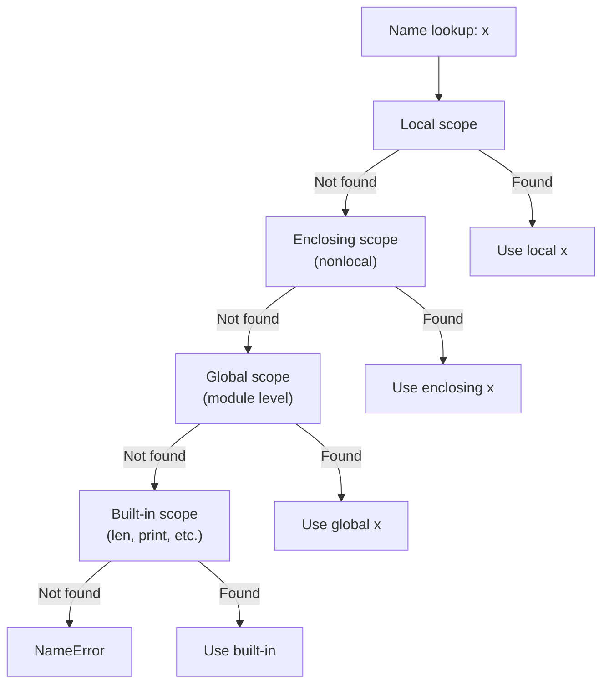

# 04. Functions - Python

> [!quote]+
>
> "The purpose of abstraction is not to be vague, but to create a new semantic level in which one can be absolutely precise."
>
> - **Edsger W. Dijkstra**, *The Humble Programmer*, ACM Turing lecture (1972)

> [!abstract]- Summary
>
> **Function Basics**
> - `def name(params): body` defines a function; implicit `return None` when no `return` is present.
> - Functions are first-class objects: assign to variables, pass as arguments, return from other functions, and store in dicts.
> - Docstrings are triple-quoted strings as the first statement and are accessible through `help()` and `__doc__`.
> - Higher-order patterns include closures, callbacks, strategy dispatch, pipelines via `functools.reduce`, and dependency injection.
>
> **Parameters**
> - Parameter order is required parameters -> `*args` -> keyword-only parameters -> `**kwargs`.
> - Mutable defaults such as `def f(lst=[])` share state across calls; use the `None` sentinel pattern instead.
> - `/` enforces positional-only parameters and `*` enforces keyword-only parameters.
> - `*seq` unpacks a sequence into positional arguments and `**mapping` unpacks a mapping into keyword arguments.
>
> **Lambda Expressions**
> - `lambda params: expr` creates a one-expression anonymous function with an implicit return.
> - Common uses are inline `key=` functions, `map`, `filter`, and short callbacks.
> - Lambdas in loops capture the variable, not its value; bind the current value with `lambda i=i: i`.
>
> **Closures & Scope**
> - LEGB name resolution order is Local -> Enclosing -> Global -> Built-in.
> - `nonlocal` rebinds a variable in the nearest enclosing scope; without it, assignment creates a local shadow.
> - Closure factories return independent functions with encapsulated state.
>
> **Decorators**
> - `@decorator` is syntax sugar for `func = decorator(func)`.
> - Apply `@functools.wraps(func)` to wrappers so metadata survives decoration.
> - Decorator stacks apply bottom-up: `@a @b def f()` becomes `f = a(b(f))`.
> - Common tools include `@property`, `@staticmethod`, `@classmethod`, `@lru_cache`, `partial`, and `singledispatch`.
>
> **Type Hints**
> - Annotations such as `def f(x: int) -> str:` are not enforced at runtime.
> - `Optional[T]` means `T | None`, and `Callable[[int], str]` documents a function signature.
> - `__annotations__` and `get_type_hints()` expose annotations for tooling and runtime frameworks.
>
> **Operations & Safety**
> - Never use mutable defaults for `list`, `dict`, or `set`; create them inside the function.
> - Always use `@functools.wraps(func)` in decorators unless you intentionally want to hide wrapped metadata.
> - Closures in loops capture references, not snapshots.
> - Run `mypy` or `pyright` when you need type checking; hints alone do not enforce correctness.
> - `@lru_cache` requires hashable arguments.

> [!note]- Glossary
>
> **`def`**
> - Keyword that defines a named function and binds the resulting function object in the current scope.
> - Use it for reusable logic that benefits from a stable name, docstring, and explicit signature.
> - Pitfall: `def greet(name)` raises `SyntaxError`; the colon is required: `def greet(name):`.
>
> **First-class function**
> - A function object that can be assigned to variables, passed as an argument, returned from another function, or stored in data structures.
> - This capability enables callbacks, strategy dispatch, pipelines, and dependency injection.
> - Pitfall: `apply(greet)` passes the function object, while `apply(greet())` calls it first and passes the return value.
>
> **`return`**
> - Exits a function and sends a value back to the caller.
> - If `return` is omitted, the function returns `None`.
> - Pitfall: forgetting `return` in a value-producing function quietly changes the caller-visible result to `None`.
>
> **Docstring**
> - A triple-quoted string placed as the first statement in a function, class, or module body.
> - Accessible through `help()` and `__doc__`, and consumed by documentation tooling.
> - Pitfall: if any executable statement appears before the string, it becomes an ordinary string literal instead of the docstring.
>
> **`*args`**
> - Collects unmatched positional arguments into a tuple.
> - Useful in wrappers, adapters, and variadic APIs.
> - Pitfall: `args` is immutable; convert it to `list(args)` before mutating.
>
> **`**kwargs`**
> - Collects unmatched keyword arguments into a dictionary.
> - Common in decorators, forwarding functions, and configuration builders.
> - Pitfall: duplicate keyword arguments still raise `TypeError`; `**kwargs` does not silently override them at the call site.
>
> **Default argument**
> - A parameter value evaluated once when the function is defined, not each time it is called.
> - Useful for optional parameters with stable immutable defaults.
> - Pitfall: mutable defaults create shared state across calls.
>
> **Keyword-only argument**
> - A parameter declared after a bare `*` that must be passed by name.
> - Useful for boolean flags and configuration switches where call-site clarity matters.
> - Related rule: parameters before `/` are positional-only.
>
> **Lambda**
> - An anonymous one-expression function written as `lambda params: expression`.
> - Best for short inline callbacks such as `sorted(key=...)`.
> - Pitfall: assigning a lambda to a long-lived name usually reads worse than a normal `def`.
>
> **Closure**
> - An inner function that captures values from its enclosing scope.
> - Used for factories, decorators, and small stateful helpers.
> - Pitfall: closures capture variables by reference, so loop-created closures often all see the final loop value.
>
> **LEGB rule**
> - Python resolves names in Local, Enclosing, Global, then Built-in order.
> - Understanding LEGB explains why nested functions, module globals, and built-ins resolve differently.
> - Pitfall: shadowing a built-in such as `list` or `dict` makes later code harder to reason about.
>
> **`nonlocal`**
> - Declares that an inner function should rebind a name from the nearest enclosing non-global scope.
> - Use it when a closure needs to mutate captured state.
> - Pitfall: without `nonlocal`, assignment creates a new local variable and often triggers `UnboundLocalError`.
>
> **Decorator**
> - A callable that accepts a function and returns a replacement function.
> - Used for cross-cutting concerns such as logging, retries, caching, and instrumentation.
> - Pitfall: omitting `@functools.wraps` hides the wrapped function's metadata.
>
> **`functools.wraps`**
> - A decorator for wrapper functions that copies metadata from the wrapped function.
> - Preserves `__name__`, `__doc__`, `__annotations__`, and `__wrapped__`.
> - Practical use: tools such as `help()`, loggers, and debuggers continue to see the original function identity.
>
> **`functools.lru_cache`**
> - A memoization decorator that caches function results keyed by arguments.
> - Useful for pure functions with repeated inputs, especially recursive ones.
> - Pitfall: lists and dictionaries are unhashable and cannot be used directly as cache keys.
>
> **Type hint**
> - An annotation that documents expected parameter and return types.
> - Useful for IDE assistance, static analysis, and runtime frameworks that inspect annotations.
> - Pitfall: Python does not enforce type hints unless an external tool or framework does so.
>
> **Higher-order function**
> - A function that accepts a function, returns a function, or both.
> - This pattern underpins callbacks, decorators, and collection helpers such as `map`, `filter`, and `sorted(key=...)`.
> - Pitfall: passing `len()` instead of `len` invokes the function immediately and usually raises an error.

## Function Basics

Python functions are first-class objects. You can bind them to names, pass them around, return them, and store them like any other value. The examples in this page focus on behavior that matters in day-to-day Python code: definitions, argument handling, closures, decorators, and annotation-driven tooling.

### Defining and calling functions

Functions are defined with `def`, return values with `return`, and default to `None` when no explicit return value is present. Prefer explicit signatures over sprawling catch-all parameter bags, and give public functions a docstring when the behavior is not obvious from the name alone.

#### Module imports

These imports are shared by the later snippets: `datetime` and `timezone` for time-aware examples, `functools` helpers for higher-order patterns, `re` for the pipeline example, and `typing` tools for annotations and introspection.

*Python example: shared imports used by the later snippets.*
```python
from datetime import datetime, timezone
from functools import reduce
from typing import Callable, Optional, get_type_hints
import functools
import re
```

```text
(no output; imports only)
```

#### `def`, `return`, and docstrings

`def` creates the function object. The first string literal in the body becomes the docstring. If the function reaches the end of the body without hitting `return`, Python returns `None`.

*Python example: define a documented function and call it twice.*
```python
def greet(name):
    """Return a greeting message."""
    return f"Hello, {name}!"

print(greet("Alice"))
print(greet("Bob"))
```

```text
Hello, Alice!
Hello, Bob!
```

#### Implicit `None` return

Functions that exist only for side effects often omit `return`. Treat that as a clear contract: callers should not expect a value unless the function explicitly produces one.

*Python example: a side-effect function returns `None` when no explicit value is returned.*
```python
def print_greeting(name):
    print(f"Hi, {name}!")

result = print_greeting("Charlie")
print(result)
```

```text
Hi, Charlie!
None
```

#### Default parameters and named arguments

Default parameters let callers omit common values, and named arguments make call sites easier to read. Reserve very broad `*args` or `**kwargs` signatures for APIs that genuinely need open-ended argument forwarding.

*Python example: use a default parameter and keyword arguments at the call site.*
```python
def greet(name, greeting="Hello"):
    return f"{greeting}, {name}!"

print(greet("Alice"))
print(greet("Bob", "Hi"))
print(greet(greeting="Yo", name="Diana"))
```

```text
Hello, Alice!
Hi, Bob!
Yo, Diana!
```

#### Assign a function to a variable

Binding a function to another variable does not create a copy. It gives you another reference to the same function object.

*Python example: assign a function object to another name.*
```python
say_hello = greet
print(say_hello("Diana"))
```

```text
Hello, Diana!
```

#### Pass a function as an argument

Higher-order functions accept other callables as input. This is the base pattern behind callbacks, pluggable strategies, and collection helpers.

*Python example: pass a function as a higher-order argument.*
```python
def apply(func, value):
    return func(value)

print(apply(greet, "Eve"))
```

```text
Hello, Eve!
```

### Function-passing patterns

Passing functions directly keeps callers in control of behavior. It is a lightweight way to express customization without adding subclasses or configuration objects.

#### Closures - return a function from a function

A closure captures names from the enclosing scope. Each call to the outer function creates a new enclosed environment, so separate closure instances can carry separate state or configuration.

*Python example: return a closure that captures an enclosing value.*
```python
def make_multiplier(n):
    def multiplier(x):
        return x * n
    return multiplier

double = make_multiplier(2)
triple = make_multiplier(3)
print(double(5))
print(triple(5))
```

```text
10
15
```

#### Callbacks - `on_success` and `on_error` hooks

Callbacks let the caller decide what to do with success and failure without hardcoding output behavior inside the function that performs the work.

*Python example: route success handling through callback parameters.*
```python
def fetch_data(url, on_success, on_error):
    try:
        result = f"data from {url}"
        on_success(result)
    except Exception as exc:
        on_error(exc)

fetch_data(
    "api/users",
    on_success=lambda data: print(f"Got: {data}"),
    on_error=lambda err: print(f"Error: {err}"),
)
```

```text
Got: data from api/users
```

#### Strategy pattern - swap behavior via functions

The strategy pattern passes a callable that encapsulates a policy. The consumer stays fixed while callers choose the pricing rule, scoring rule, or formatter they want.

*Python example: swap pricing behavior by passing different strategy functions.*
```python
full_price = lambda price: price
discount_20 = lambda price: price * 0.8
member_discount = lambda price: price * 0.7

def calculate(price, strategy):
    return strategy(price)

print(f"Full:     ${calculate(100, full_price):.2f}")
print(f"20% off:  ${calculate(100, discount_20):.2f}")
print(f"Member:   ${calculate(100, member_discount):.2f}")
```

```text
Full:     $100.00
20% off:  $80.00
Member:   $70.00
```

#### Pipeline - chained steps with `reduce`

Pipelines break a larger transformation into small, composable steps. `reduce()` is one way to apply each step to the previous step's output without introducing intermediate variables.

*Python example: compose string-cleanup steps with `reduce`.*
```python
steps = [
    str.strip,
    str.lower,
    lambda s: re.sub(r"\s+", " ", s),
]

raw = "   Hello   WORLD   "
result = reduce(lambda s, fn: fn(s), steps, raw)
print(f"Pipeline: '{raw}' -> '{result}'")
```

```text
Pipeline: '   Hello   WORLD   ' -> 'hello world'
```

#### Dependency injection - inject a clock for testability

Inject dependencies instead of hardcoding them. The example uses a fixed default clock so the output remains reproducible in the note; production code would typically substitute `datetime.now(timezone.utc)` there.

*Python example: inject clock functions instead of hardcoding the current time.*
```python
def process_order(order, get_now=None):
    if get_now is None:
        get_now = lambda: datetime(2030, 1, 1, 9, 30, tzinfo=timezone.utc)
    order["processed_at"] = get_now()
    return order

order1 = process_order({"id": 1})
print(f"Production: {order1['processed_at'].isoformat()}")

order2 = process_order(
    {"id": 2},
    get_now=lambda: datetime(2024, 1, 1, 12, 0, tzinfo=timezone.utc),
)
print(f"Test:       {order2['processed_at'].isoformat()}")
```

```text
Production: 2030-01-01T09:30:00+00:00
Test:       2024-01-01T12:00:00+00:00
```

#### Progress callback

Optional callbacks decouple the core loop from presentation. The loader does the work, while the caller chooses whether progress is ignored, printed, sent to a progress bar, or forwarded to a UI.

*Python example: expose progress reporting through an optional callback slot.*
```python
class DataLoader:
    def __init__(self):
        self.on_progress: Optional[Callable] = None

    def load(self, items):
        for i, item in enumerate(items):
            if self.on_progress:
                self.on_progress(i + 1, len(items), item)

loader = DataLoader()
loader.on_progress = lambda curr, total, item: print(f"[{curr}/{total}] Loading {item}")
loader.load(["users", "orders", "products"])
```

```text
[1/3] Loading users
[2/3] Loading orders
[3/3] Loading products
```

#### Sorting with a `key=` function

`sorted(iterable, key=func)` orders items by a derived value rather than the raw item itself. Python sorting is stable, so items with equal keys keep their original relative order.

*Python example: sort records by a derived key.*
```python
employees = [
    {"name": "Alice", "dept": "Engineering", "salary": 95000},
    {"name": "Bob", "dept": "Sales", "salary": 65000},
    {"name": "Charlie", "dept": "Engineering", "salary": 110000},
]

by_salary = sorted(employees, key=lambda e: e["salary"], reverse=True)
for employee in by_salary:
    print(f"{employee['name']:<10} ${employee['salary']:>7,}")
```

```text
Charlie    $110,000
Alice      $ 95,000
Bob        $ 65,000
```

#### Common function-passing patterns

| Pattern | Use case |
|---|---|
| **Callbacks** | `on_success`, `on_error`, and `on_progress` hooks |
| **Strategy** | Swap algorithms without changing the calling code |
| **Pipeline** | Chain processing steps in a list |
| **Dependency injection** | Inject fakes or stubs for testing |
| **Events** | Notify subscribers when something happens |

## Parameters

Python's parameter system is flexible enough to express strict APIs and forwarding wrappers. It supports defaults, variadic arguments, positional-only parameters, and keyword-only parameters in one signature. Python does not have `ref`, `out`, or `in` parameter modifiers; rebinding a parameter name only changes the local name, while mutating the referenced object affects shared state.

### Default parameters and argument passing

Default values are evaluated once when the function is defined. That rule is the source of Python's most common parameter bug: using a mutable object as a default and accidentally sharing it across calls.

#### Mutable default argument trap

Mutable defaults such as `[]` or `{}` persist across calls. When you mutate the object, later calls that rely on the default see the already-mutated state.

*Python example: mutable defaults preserve shared state across calls.*
```python
def bad_append(item, lst=[]):
    lst.append(item)
    return lst

print(bad_append(1))
print(bad_append(2))
```

```text
[1]
[1, 2]
```

#### `None` sentinel pattern

Use `None` as the default and allocate the mutable object inside the function body. Each call that omits the argument then gets a fresh container.

*Python example: use a `None` sentinel to create a fresh list per call.*
```python
def good_append(item, lst=None):
    if lst is None:
        lst = []
    lst.append(item)
    return lst

print(good_append(1))
print(good_append(2))
```

```text
[1]
[2]
```

#### `**kwargs` - collect keyword arguments as a dict

`**kwargs` gathers unmatched keyword arguments into a dictionary. Use it when the set of accepted keys is intentionally open-ended, not as a substitute for an otherwise well-defined signature.

*Python example: collect arbitrary keyword arguments into `kwargs`.*
```python
def build_profile(**kwargs):
    print(f"kwargs = {kwargs}  (type: {type(kwargs).__name__})")
    return kwargs

print(build_profile(name="Alice", age=30))
```

```text
kwargs = {'name': 'Alice', 'age': 30}  (type: dict)
{'name': 'Alice', 'age': 30}
```

#### `**` unpacking - pass a dict as keyword arguments

At the call site, `**mapping` expands a dictionary into keyword arguments. This is useful when you are forwarding configuration or adapting one function's output to another function's signature.

*Python example: unpack a dictionary into keyword arguments.*
```python
data = {"host": "localhost", "port": 5432}

def connect(host, port=5432):
    return f"{host}:{port}"

print(connect(**data))
```

```text
localhost:5432
```

#### Combined `*args`, keyword-only parameters, and `**kwargs`

The order is fixed: required parameters, then `*args`, then keyword-only parameters, then `**kwargs`. That ordering lets you build wrappers that still preserve explicit switches for the arguments that matter most.

*Python example: combine required, variadic, keyword-only, and `**kwargs` parameters.*
```python
def kitchen_sink(required, *args, keyword_only="default", **kwargs):
    print(f"required: {required}")
    print(f"*args:    {args}")
    print(f"kw_only:  {keyword_only}")
    print(f"**kwargs: {kwargs}")

kitchen_sink("a", "b", "c", keyword_only="custom", x=1, y=2)
```

```text
required: a
*args:    ('b', 'c')
kw_only:  custom
**kwargs: {'x': 1, 'y': 2}
```

### Parameter restrictions

Use `/` when callers should not rely on a parameter name, and use `*` when callers must spell the name explicitly. These markers make APIs harder to misuse and easier to evolve.

#### `*args` - collect positional arguments as a tuple

`*args` gathers any extra positional arguments into a tuple. It is common in wrappers and decorators, but explicit parameters remain easier to understand when the expected arguments are known in advance.

*Python example: collect positional arguments into a tuple.*
```python
def total(*args):
    print(f"args = {args}  (type: {type(args).__name__})")
    return sum(args)

print(total(1, 2, 3))
```

```text
args = (1, 2, 3)  (type: tuple)
6
```

#### `*` unpacking - pass a sequence as positional arguments

At the call site, `*sequence` expands the sequence into positional arguments. This is useful when a list or tuple already exists but the callee expects separate arguments.

*Python example: unpack a sequence into positional arguments.*
```python
numbers = [1, 2, 3, 4, 5]
print(total(*numbers))
```

```text
args = (1, 2, 3, 4, 5)  (type: tuple)
15
```

#### Positional-only (`/`) and keyword-only (`*`) parameters

Parameters before `/` can only be passed positionally. Parameters after `*` must be passed by name. Use positional-only parameters when you might rename the parameter later, and keyword-only parameters when readability or correctness depends on the name being visible at the call site.

*Python example: mix positional-only, regular, and keyword-only parameters.*
```python
def func(pos_only, /, normal, *, kw_only):
    return f"{pos_only}, {normal}, {kw_only}"

print(func(1, 2, kw_only=3))
print(func(1, normal=2, kw_only=3))
```

```text
1, 2, 3
1, 2, 3
```

## Lambda Expressions

Lambda expressions create anonymous one-expression functions inline. They work well when the callable is short, local, and unlikely to benefit from a reusable name or docstring.

### Lambda syntax

Because lambdas can contain only one expression, they fit best where the logic is trivial. If the body needs statements, branching that hurts readability, or error handling, move the logic into a normal `def`.

#### Lambda basics

`lambda params: expression` creates a callable with an implicit return value. It is a compact form for very small functions.

*Python example: create and call a single-expression lambda.*
```python
add = lambda a, b: a + b
print(add(3, 4))
```

```text
7
```

#### Lambda with `sorted()`

The most common use for lambdas is an inline sort key. Keep them short enough that the extracted value is immediately obvious.

*Python example: use lambdas as inline sort keys.*
```python
names = ["Charlie", "Alice", "Bob", "Diana"]
print(sorted(names, key=lambda n: len(n)))
print(sorted(names, key=lambda n: n[-1]))
```

```text
['Bob', 'Alice', 'Diana', 'Charlie']
['Diana', 'Bob', 'Charlie', 'Alice']
```

#### Lambda with `map()`

`map()` applies the callable to each element and returns an iterator. In Python codebases, list comprehensions are often more readable, but `map()` is still a standard higher-order tool.

*Python example: transform each element with `map` and a lambda.*
```python
nums = [1, 2, 3, 4, 5]
print(list(map(lambda x: x**2, nums)))
```

```text
[1, 4, 9, 16, 25]
```

#### Lambda with `filter()`

`filter()` keeps only elements for which the predicate returns a truthy value. As with `map()`, a comprehension is often the clearest alternative when the expression stops being trivial.

*Python example: filter values with a predicate lambda.*
```python
print(list(filter(lambda x: x % 2 == 0, nums)))
```

```text
[2, 4]
```

### Scope lookup in lambda expressions

This subsection covers the name-resolution behavior that matters when a lambda captures variables. Stateful closures and `nonlocal` rebinding appear in the next major section.

#### LEGB lookup inside nested functions

Python resolves names in Local, Enclosing, Global, then Built-in order. Reading that rule correctly explains why nested functions can see outer names without copying them.

*Python example: show local, enclosing, and global names resolving independently.*
```python
x = "global"

def outer():
    x = "enclosing"

    def inner():
        x = "local"
        print(f"inner: {x}")

    inner()
    print(f"outer: {x}")

outer()
print(x)
```

```text
inner: local
outer: enclosing
global
```

*Diagram: LEGB name resolution order.*


## Closures & Scope

Closures capture names from the enclosing scope by reference. That behavior enables decorator wrappers and small stateful factories, but it also introduces two common sharp edges: you need `nonlocal` to rebind captured state, and loop-created closures often all observe the same final loop variable.

### Variable capture and `nonlocal`

When an inner function only reads a name from the enclosing scope, no extra syntax is needed. When it assigns to that name, add `nonlocal` so Python knows the target lives in the enclosing scope rather than in a new local scope.

#### `nonlocal` for mutable closure state

Use `nonlocal` when the closure owns state that must change across calls. If you find yourself managing several pieces of state this way, a class may be easier to read.

*Python example: mutate captured state with `nonlocal`.*
```python
def make_counter(start=0):
    count = start

    def increment():
        nonlocal count
        count += 1
        return count

    return increment

counter = make_counter(10)
print(counter())
print(counter())

counter2 = make_counter(0)
print(counter2())
```

```text
11
12
1
```

### Closure factories

Closure factories return specialized functions without introducing a class. This pattern works well when the stored state is small and the resulting callable has a narrow purpose.

#### Validator factory

A validator factory captures a range once and returns a function that can be reused anywhere the check is needed.

*Python example: return specialized validators from a closure factory.*
```python
def make_validator(min_val, max_val):
    def validate(value):
        return min_val <= value <= max_val

    return validate

is_valid_age = make_validator(0, 120)
is_valid_score = make_validator(0, 100)
print(is_valid_age(25))
print(is_valid_age(150))
```

```text
True
False
```

### Closure pitfalls

The most common closure bug in Python is late binding in loops. The closure keeps a reference to the variable itself, not a snapshot of the variable's value at definition time.

#### Late binding in loop-created lambdas

When the lambda eventually runs, it reads the final value of the shared loop variable unless you bind the current value explicitly.

*Python example: late binding causes loop-created lambdas to share one variable.*
```python
funcs_bad = [lambda: i for i in range(3)]
print([f() for f in funcs_bad])
```

```text
[2, 2, 2]
```

#### Bind the current value with a default argument

`lambda i=i: i` evaluates the default at definition time, so each lambda captures its own snapshot.

*Python example: bind the current loop value with a default argument.*
```python
funcs_good = [lambda i=i: i for i in range(3)]
print([f() for f in funcs_good])
```

```text
[0, 1, 2]
```

## Decorators

Decorators wrap a function with extra behavior without editing the function body itself. They are the standard Python mechanism for logging, caching, retries, authorization, and similar cross-cutting concerns.

### Decorator basics

A decorator takes a function, returns another function, and is applied with `@decorator`. Use `@functools.wraps(func)` inside wrappers so introspection, tooling, and tracebacks continue to see the original function metadata.

#### Timer decorator

The example below uses fixed clock checkpoints so the note's output is deterministic. In production code, the same structure usually reads the clock from `time.perf_counter()`.

*Python example: preserve metadata with `@functools.wraps` and a deterministic timer.*
```python
clock_values = iter([10.0, 10.125, 20.0, 20.05])

def timer(func):
    @functools.wraps(func)
    def wrapper(*args, **kwargs):
        start = next(clock_values)
        result = func(*args, **kwargs)
        elapsed = next(clock_values) - start
        print(f"{func.__name__} took {elapsed:.6f}s")
        return result

    return wrapper

@timer
def slow_sum(n):
    """Sum numbers from 0 to n."""
    return sum(range(n))

result = slow_sum(1_000_000)
print(result)
print(slow_sum.__name__)
```

```text
slow_sum took 0.125000s
499999500000
slow_sum
```

### Decorator patterns

Decorators can accept arguments, can be stacked, and can come from the standard library. Read decorator stacks from the bottom up because the decorator closest to `def` runs first.

#### Decorator with arguments - retry

Parameterized decorators add one more nesting level: a factory receives the decorator arguments, returns the actual decorator, and that decorator returns the wrapper.

*Python example: retry a deterministic sequence of failures before succeeding.*
```python
def retry(max_attempts=3):
    def decorator(func):
        @functools.wraps(func)
        def wrapper(*args, **kwargs):
            for attempt in range(1, max_attempts + 1):
                try:
                    return func(*args, **kwargs)
                except Exception as exc:
                    if attempt == max_attempts:
                        raise
                    print(f"Attempt {attempt} failed: {exc}, retrying...")

        return wrapper

    return decorator

outcomes = iter(["bad luck", "bad luck", "success"])

@retry(max_attempts=3)
def unreliable():
    outcome = next(outcomes)
    if outcome != "success":
        raise ValueError(outcome)
    return outcome

print(f"Result: {unreliable()}")
```

```text
Attempt 1 failed: bad luck, retrying...
Attempt 2 failed: bad luck, retrying...
Result: success
```

#### Stacking decorators

`@a @b def f()` means `f = a(b(f))`. That order matters because each decorator wraps the result returned by the one below it.

*Python example: stack decorators and observe bottom-up application order.*
```python
def log(func):
    @functools.wraps(func)
    def wrapper(*args, **kwargs):
        print(f"[LOG] Calling {func.__name__}")
        return func(*args, **kwargs)

    return wrapper

@log
@timer
def compute(n):
    return sum(range(n))

print(compute(500_000))
```

```text
[LOG] Calling compute
compute took 0.050000s
249999750000
```

#### Built-in decorators - `@property`, `@staticmethod`, `@classmethod`

Python ships with decorators that change method binding behavior. These cover computed attributes, namespace-level helpers that live on a class, and alternate constructors.

*Python example: compare `@property`, `@staticmethod`, and `@classmethod`.*
```python
class MyClass:
    def __init__(self, value):
        self.value = value

    @property
    def doubled(self):
        return self.value * 2

    @staticmethod
    def utility():
        return "No instance needed"

    @classmethod
    def from_string(cls, s):
        return cls(int(s))

obj = MyClass(21)
print(obj.doubled)
print(MyClass.utility())
print(MyClass.from_string("99").value)
```

```text
42
No instance needed
99
```

### `functools` utilities

The `functools` module adds several widely used higher-order helpers. `partial` pre-binds arguments, `lru_cache` memoizes results, and `singledispatch` routes work by the runtime type of the first argument.

#### `functools.partial`

`partial()` returns a new callable with some arguments already filled in. It is often clearer than wrapping the original function in a tiny lambda just to bind one or two values.

*Python example: freeze selected arguments with `functools.partial`.*
```python
from functools import partial

def power(base, exponent):
    return base ** exponent

square = partial(power, exponent=2)
cube = partial(power, exponent=3)
print(square(5))
print(cube(3))
```

```text
25
27
```

#### `functools.lru_cache`

`@lru_cache(maxsize=128)` stores results by argument tuple. Use it for pure functions whose outputs depend only on their inputs, and ensure the arguments are hashable.

*Python example: cache recursive results and inspect cache statistics.*
```python
from functools import lru_cache

@lru_cache(maxsize=128)
def fibonacci(n):
    if n < 2:
        return n
    return fibonacci(n - 1) + fibonacci(n - 2)

print(fibonacci(50))
print(fibonacci.cache_info())
```

```text
12586269025
CacheInfo(hits=48, misses=51, maxsize=128, currsize=51)
```

#### `functools.singledispatch`

`@singledispatch` creates a generic function and dispatches to registered implementations by the first argument's runtime type.

*Python example: register implementations by the first argument type.*
```python
from functools import singledispatch

@singledispatch
def format_value(value):
    return f"unknown: {value}"

@format_value.register(int)
def _(value):
    return f"int: {value}"

@format_value.register(float)
def _(value):
    return f"float: {value:.2f}"

@format_value.register(str)
def _(value):
    return f"string: '{value}'"

print(format_value(42))
print(format_value(3.14))
print(format_value("hello"))
print(format_value([1, 2]))
```

```text
int: 42
float: 3.14
string: 'hello'
unknown: [1, 2]
```

## Type Hints

Type hints document intent, improve editor assistance, and enable static analysis. They do not change Python into a statically typed language by themselves.

### Type annotations

Use annotations on public functions, complex return values, and higher-order APIs where the expected callable signature is not obvious.

#### Structured annotations and `Optional`

Built-in generics such as `list[str]` and `dict[str, object]` are standard in modern Python. `Optional[T]` means the value may be `T` or `None`.

*Python example: annotate parameters, defaults, and a structured return value.*
```python
def process(
    name: str,
    age: int,
    score: float,
    active: bool = True,
    tags: list[str] | None = None,
) -> dict[str, object]:
    return {"name": name, "age": age, "score": score, "active": active, "tags": tags or []}

print(process("Alice", 30, 85.5, tags=["admin"]))
```

```text
{'name': 'Alice', 'age': 30, 'score': 85.5, 'active': True, 'tags': ['admin']}
```

#### Optional return values

Annotate nullable results so callers know a guard is required before they dereference the value.

*Python example: use `Optional` for a nullable lookup result.*
```python
def find_user(user_id: int) -> Optional[str]:
    users = {1: "Alice", 2: "Bob"}
    return users.get(user_id)

print(find_user(1))
print(find_user(9))
```

```text
Alice
None
```

#### `Callable` type hints

`Callable[[ArgType, ...], ReturnType]` documents the arguments and return value that a function parameter expects.

*Python example: annotate a callable parameter signature.*
```python
def apply_func(func: Callable[[int], int], value: int) -> int:
    return func(value)

print(apply_func(lambda x: x * 2, 5))
```

```text
10
```

### Type introspection

Type aliases make compound types easier to read, `__annotations__` exposes the raw stored annotations, and `get_type_hints()` resolves them into the form most runtime tooling wants.

#### Type aliases, `__annotations__`, and `get_type_hints()`

Frameworks such as FastAPI, Pydantic, and dataclass-based tooling inspect annotations at runtime. That is why type hints can influence real behavior even though Python itself does not enforce them.

*Python example: inspect type aliases and stored annotations at runtime.*
```python
UserId = int
UserName = str
UserMap = dict[UserId, UserName]

def get_users() -> UserMap:
    return {1: "Alice", 2: "Bob"}

print(get_users())
print(process.__annotations__)
print(get_type_hints(process))
```

```text
{1: 'Alice', 2: 'Bob'}
{'name': <class 'str'>, 'age': <class 'int'>, 'score': <class 'float'>, 'active': <class 'bool'>, 'tags': list[str] | None, 'return': dict[str, object]}
{'name': <class 'str'>, 'age': <class 'int'>, 'score': <class 'float'>, 'active': <class 'bool'>, 'tags': list[str] | None, 'return': dict[str, object]}
```

## Operational Risks

These are the failure modes that most often turn small function utilities into hard-to-debug behavior.

### Stateful defaults and captured values

#### Mutable defaults retain prior state

Use `None` instead of `[]` so each call allocates its own container. A default such as `items=[]` is evaluated once at definition time, so later calls keep mutating the same object.

*Python example: compare a mutable default with the `None` sentinel pattern.*
```python
def append_item_bad(value, items=[]):
    items.append(value)
    return items

def append_item_good(value, items=None):
    if items is None:
        items = []
    items.append(value)
    return items

print(append_item_bad("a"))
print(append_item_bad("b"))
print(append_item_good("a"))
print(append_item_good("b"))
```

```text
['a']
['a', 'b']
['a']
['b']
```

#### Loop-created closures capture variables, not snapshots

A closure created inside a loop reads the final `i` unless you bind the current value at definition time. The common repair is `lambda i=i: i`.

*Python example: show late binding and the bound-default fix side by side.*
```python
funcs_bad = [lambda: i for i in range(3)]
funcs_good = [lambda i=i: i for i in range(3)]

print([func() for func in funcs_bad])
print([func() for func in funcs_good])
```

```text
[2, 2, 2]
[0, 1, 2]
```

### Metadata and cache boundaries

#### Decorators that skip `@functools.wraps` erase metadata

Without `@functools.wraps(func)`, the decorated callable exposes `wrapper` metadata instead of the original function identity. That breaks `__name__`, `__doc__`, and some introspection tools.

*Python example: compare decorator metadata before and after `@functools.wraps`.*
```python
import functools

def bare_decorator(func):
    def wrapper(*args, **kwargs):
        return func(*args, **kwargs)
    return wrapper

def wrapped_decorator(func):
    @functools.wraps(func)
    def wrapper(*args, **kwargs):
        return func(*args, **kwargs)
    return wrapper

@bare_decorator
def bare():
    """bare doc"""
    return "bare"

@wrapped_decorator
def wrapped():
    """wrapped doc"""
    return "wrapped"

print(bare.__name__, bare.__doc__)
print(wrapped.__name__, wrapped.__doc__)
```

```text
wrapper None
wrapped wrapped doc
```

#### `@lru_cache` requires hashable arguments

`@lru_cache` builds its key from the call arguments. Passing a `list` or `dict` fails before caching can help, so normalize the input to `tuple` or another hashable form first.

*Python example: catch the unhashable-argument error and then call a hashable variant.*
```python
from functools import lru_cache

@lru_cache(maxsize=None)
def total(values):
    return sum(values)

try:
    total([1, 2, 3])
except TypeError as exc:
    print(exc)

print(total((1, 2, 3)))
```

```text
unhashable type: 'list'
6
```

### Runtime typing boundaries

#### Type annotations do not reject bad runtime values

An annotation such as `name: str` documents intent, but the interpreter still runs the call unless you add a guard or external validator. Keep `mypy`, `pyright`, or explicit `isinstance()` checks separate from the hint itself.

*Python example: pass a value that violates the hint but still runs.*
```python
def repeat(name: str) -> str:
    return name * 2

print(repeat("ha"))
print(repeat(3))
```

```text
haha
6
```

## Recommended Patterns

These patterns keep function-heavy code readable at the call site and easier to evolve under testing.

### Signature design

#### Prefer explicit parameters over open-ended forwarding

An explicit signature such as `send_email(recipient, subject, *, retry=False)` tells callers what the function accepts. Reach for `*args` or `**kwargs` only when the wrapper truly needs to forward an unknown call shape.

*Python example: compare a clear signature with a thin forwarding wrapper.*
```python
def send_email(recipient, subject, *, retry=False):
    return f"{recipient}|{subject}|retry={retry}"

def forward_email(*args, **kwargs):
    return send_email(*args, **kwargs)

print(send_email("ops@example.com", "Daily report", retry=True))
print(forward_email("ops@example.com", "Daily report", retry=True))
```

```text
ops@example.com|Daily report|retry=True
ops@example.com|Daily report|retry=True
```

#### Use keyword-only flags for call-site clarity

A bare `*` forces a flag such as `verbose=True` to be named instead of hidden in a positional slot. This makes behavior switches easier to scan in review.

*Python example: require a `verbose` flag to be passed by name.*
```python
def render(report, *, verbose=False):
    return f"{report}|verbose={verbose}"

print(render("weekly"))
print(render("weekly", verbose=True))
```

```text
weekly|verbose=False
weekly|verbose=True
```

### Reusable higher-order helpers

#### Use `functools.partial` when only arguments need binding

`partial()` makes it obvious that the underlying function stays the same and only a few arguments are pre-filled. That is usually clearer than a custom `lambda` wrapper.

*Python example: bind fixed conversion settings with `functools.partial`.*
```python
from functools import partial

def convert_units(value, factor, label):
    return f"{value * factor:.1f} {label}"

meters_to_cm = partial(convert_units, factor=100, label="cm")
meters_to_mm = partial(convert_units, factor=1000, label="mm")

print(meters_to_cm(1.5))
print(meters_to_mm(1.5))
```

```text
150.0 cm
1500.0 mm
```

#### Keep `lambda` usage small and local

Use `lambda` for one-expression helpers such as `sorted(..., key=...)`. When the logic stops being small, a named `def` is easier to read, test, and reuse.

*Python example: use a short `lambda` only as a local sort key.*
```python
records = [
    {"name": "Ada", "score": 91},
    {"name": "Bob", "score": 88},
    {"name": "Cy", "score": 95},
]

ordered = sorted(records, key=lambda record: record["score"], reverse=True)
print([record["name"] for record in ordered])
```

```text
['Cy', 'Ada', 'Bob']
```

#### Add `Callable` hints to higher-order interfaces

A `Callable[[int], int]` hint documents the callback contract even though Python does not enforce it by itself. This matters when the parameter name alone does not reveal the expected signature.

*Python example: annotate a callback-driven helper and call it with two strategies.*
```python
from typing import Callable

def run_step(step: Callable[[int], int], value: int) -> int:
    return step(value)

print(run_step(lambda n: n + 1, 4))
print(run_step(lambda n: n * 3, 4))
```

```text
5
12
```

## Python Functions Troubleshooting

Use these failure signatures to decide whether the bug is a binding issue, a state-sharing problem, or a mismatch between a signature and how callers invoke it.

### Binding and call-shape errors

#### `TypeError: f() takes 0 positional arguments but 1 was given`

This usually means an instance method forgot `self`. Inside a class body, `def greet():` is still called as `Greeter.greet(instance)`, so the fix is `def greet(self):`.

*Python example: reproduce the missing-`self` error and then fix it.*
```python
class BrokenGreeter:
    def greet():
        return "hello"

class FixedGreeter:
    def greet(self):
        return "hello"

try:
    print(BrokenGreeter().greet())
except TypeError as exc:
    print(exc)

print(FixedGreeter().greet())
```

```text
BrokenGreeter.greet() takes 0 positional arguments but 1 was given
hello
```

#### `TypeError: f() got an unexpected keyword argument`

The caller supplied a keyword that the function does not accept. Either add that parameter explicitly or accept `**kwargs` only when the API is intentionally open-ended.

*Python example: trigger a keyword mismatch and then call a matching signature.*
```python
def connect(host, port):
    return f"{host}:{port}"

def connect_fixed(host, port, timeout=30):
    return f"{host}:{port} timeout={timeout}"

try:
    print(connect("db.local", 5432, timeout=5))
except TypeError as exc:
    print(exc)

print(connect_fixed("db.local", 5432, timeout=5))
```

```text
connect() got an unexpected keyword argument 'timeout'
db.local:5432 timeout=5
```

### Shared state and captured values

#### Shared mutable state across calls

If a `list` or `dict` keeps data from an earlier call, inspect the signature for a mutable default. Replace `items=[]` with `items=None` and allocate the container inside the function.

*Python example: contrast the shared-default bug with the `None` sentinel fix.*
```python
def collect_bad(value, items=[]):
    items.append(value)
    return items

def collect_good(value, items=None):
    if items is None:
        items = []
    items.append(value)
    return items

print(collect_bad(1))
print(collect_bad(2))
print(collect_good(1))
print(collect_good(2))
```

```text
[1]
[1, 2]
[1]
[2]
```

#### All closures return the same value

This is the classic late-binding loop problem. Each closure reads the same `i` unless you bind the current value with `lambda i=i: i` or pre-bind with `partial()`.

*Python example: compare the late-bound result with the repaired version.*
```python
funcs_bad = [lambda: i for i in range(3)]
funcs_good = [lambda i=i: i for i in range(3)]

print([func() for func in funcs_bad])
print([func() for func in funcs_good])
```

```text
[2, 2, 2]
[0, 1, 2]
```

#### `TypeError: 'NoneType' object is not callable`

A name that used to reference a function was rebound to `None` or another non-callable value. Avoid shadowing a function name when you still need to call it later.

*Python example: shadow a function name with `None` and then use an unshadowed alias.*
```python
def build_message():
    return "ok"

safe_build_message = build_message
build_message = None

try:
    build_message()
except TypeError as exc:
    print(exc)

print(safe_build_message())
```

```text
'NoneType' object is not callable
ok
```

### Decorator and metadata issues

#### Decorated function shows the wrong `__name__` or `__doc__`

The wrapper likely omitted `@functools.wraps(func)`. Add `@functools.wraps(func)` so `__name__`, `__doc__`, and `__wrapped__` keep pointing at the original function metadata.

*Python example: compare decorator metadata before and after `@functools.wraps`.*
```python
import functools

def bare(func):
    def wrapper(*args, **kwargs):
        return func(*args, **kwargs)
    return wrapper

def fixed(func):
    @functools.wraps(func)
    def wrapper(*args, **kwargs):
        return func(*args, **kwargs)
    return wrapper

@bare
def broken_target():
    """broken doc"""
    return "broken"

@fixed
def fixed_target():
    """fixed doc"""
    return "fixed"

print(broken_target.__name__, broken_target.__doc__)
print(fixed_target.__name__, fixed_target.__doc__)
```

```text
wrapper None
fixed_target fixed doc
```

### Recursion, typing, and caching limits

#### `RecursionError: maximum recursion depth exceeded`

Fix the termination logic or switch to an iterative version before touching `sys.setrecursionlimit()`. Raising the recursion limit does not help if the recursion never reaches a base case.

*Python example: catch a runaway recursive call and then use an iterative equivalent.*
```python
def broken_countdown(n):
    return broken_countdown(n - 1)

def safe_countdown(n):
    steps = 0
    while n > 0:
        n -= 1
        steps += 1
    return steps

try:
    broken_countdown(3)
except RecursionError as exc:
    print(type(exc).__name__)

print(safe_countdown(3))
```

```text
RecursionError
3
```

#### Type hints do not stop bad runtime values

An annotation such as `quantity: int` informs tools, not the interpreter. If the program must fail at runtime, add an explicit guard or a validation layer.

*Python example: show an annotated function accepting the wrong type until a manual guard is added.*
```python
def double_unchecked(quantity: int) -> int:
    return quantity * 2

def double_checked(quantity: int) -> int:
    if not isinstance(quantity, int):
        raise TypeError("quantity must be int")
    return quantity * 2

print(double_unchecked("3"))
try:
    print(double_checked("3"))
except TypeError as exc:
    print(exc)
```

```text
33
quantity must be int
```

#### `lru_cache` fails with dict or list arguments

`@lru_cache` hashes the argument tuple, so mutable containers fail because they are unhashable. Convert the input to `tuple` or another hashable representation before it reaches the cached function.

*Python example: trigger the unhashable error and then pass a tuple instead.*
```python
from functools import lru_cache

@lru_cache(maxsize=None)
def sort_names(names):
    return tuple(sorted(names))

try:
    sort_names(["bob", "ada"])
except TypeError as exc:
    print(exc)

print(sort_names(("bob", "ada")))
```

```text
unhashable type: 'list'
('ada', 'bob')
```
