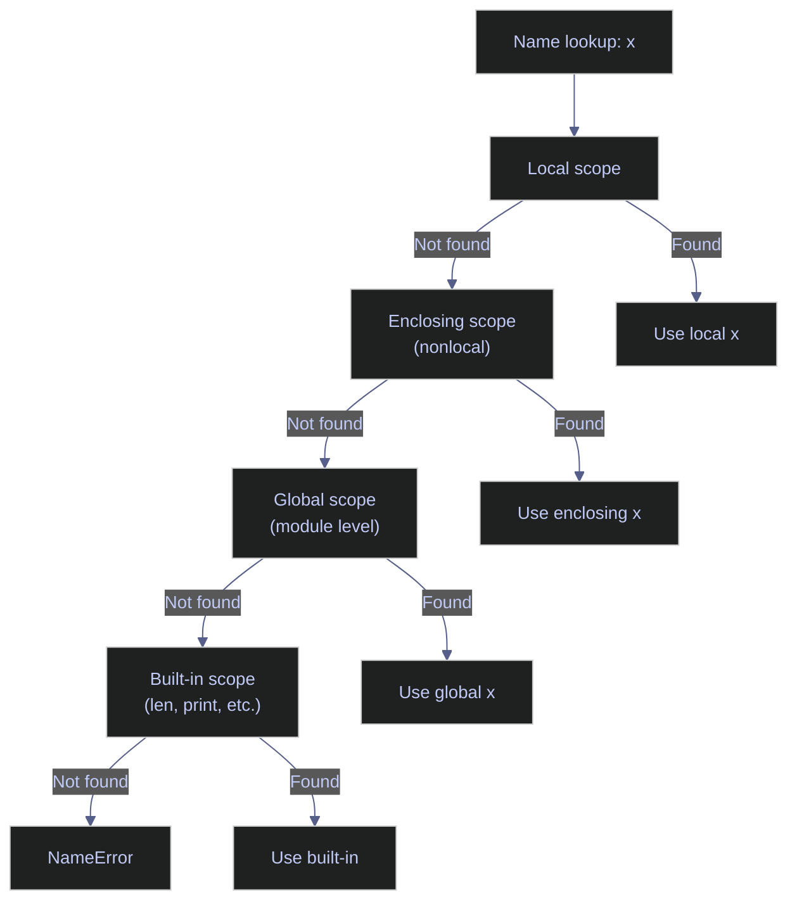

# 04. Functions - Python

> [!quote]
> "The purpose of abstraction is not to be vague, but to create a new semantic level in which one can be absolutely precise."
>
> — **Edsger W. Dijkstra**, *The Humble Programmer*, ACM Turing lecture (1972)

This note covers Python's function system in full: definition and first-class usage, flexible parameter modes (`*args`, `**kwargs`, defaults, keyword-only), lambda expressions, closures and scope rules (LEGB), the decorator pattern for cross-cutting concerns, and type hints for static analysis.

### Key terms used in this note

| Term | Definition | Purpose | Common mistake / confusion |
|---|---|---|---|
| **First-class function** | Functions are objects — assign to variables, pass as arguments, return from other functions, store in dicts. | Higher-order patterns, callbacks, strategy dispatch. | Calling `func` (with parens) vs passing `func` (without parens) — parens invoke, no parens pass the reference. |
| **def** | Keyword that defines a named function. Creates a function object bound to the given name. | Reusable named blocks of logic. | Forgetting the colon: `def greet(name)` is a syntax error — needs `def greet(name):`. |
| **return** | Exits the function and sends a value back to the caller. Without `return`, functions return `None`. | Produce output from computation. | Forgetting `return` — function does work but caller gets `None`. |
| **Docstring** | Triple-quoted string as the first statement in a function. Accessible via `help()` and `__doc__`. | Built-in documentation for functions, classes, modules. | Placing code before the docstring — it becomes a regular string, not a docstring. |
| **\*args** | Collects extra positional arguments into a tuple. | Accept variable number of positional arguments. | Modifying `args` — it's a tuple (immutable). Convert to list if needed. |
| **\*\*kwargs** | Collects extra keyword arguments into a dict. | Accept variable number of named arguments. | Passing duplicate keyword arguments — raises `TypeError`. |
| **Default argument** | Parameter with a preset value: `def f(x=10)`. Caller can omit it. | Optional parameters with sensible defaults. | Mutable defaults (`def f(lst=[])`) are shared across calls — use `None` sentinel. |
| **Keyword-only argument** | Parameters after `*` in the signature must be passed by name. | Force explicit naming for clarity and safety. | Forgetting `*` separator — parameters remain positional. |
| **Lambda** | Anonymous function: `lambda args: expression`. Single expression, no statements. | Short callbacks for `map`, `filter`, `sorted`, LINQ-style chains. | Trying to use statements (assignment, `if/else` block) — lambdas are expression-only. |
| **Closure** | Inner function that captures variables from the enclosing scope. The captured variables persist after the outer function returns. | Factories, callbacks, partial application, state encapsulation. | Late binding — closures capture the *variable*, not its value at definition time. Loop closures all share the same variable. |
| **LEGB rule** | Python's scope resolution order: Local → Enclosing → Global → Built-in. | Understand which variable a name refers to. | Shadowing built-ins (`list = [1,2]`) — overrides the built-in `list` type. |
| **nonlocal** | Keyword that rebinds a variable in the nearest enclosing (non-global) scope. | Modify closure state from an inner function. | Confusing `nonlocal` with `global` — `global` targets module scope, `nonlocal` targets enclosing function scope. |
| **Decorator** | A function that wraps another function: `@decorator` above `def`. Receives the function, returns a modified version. | Cross-cutting concerns: logging, timing, caching, authentication, retry. | Forgetting `@functools.wraps(func)` — the wrapper loses the original function's `__name__` and `__doc__`. |
| **functools.wraps** | Decorator that copies metadata (`__name__`, `__doc__`, `__annotations__`) from the wrapped function to the wrapper. | Preserve identity of decorated functions for debugging and inspection. | Omitting it — `help(func)` shows the wrapper's docstring, not the original's. |
| **functools.lru_cache** | Built-in memoization decorator that caches function results based on arguments. | Avoid redundant computation for pure functions with repeated inputs. | Caching functions with mutable arguments (dicts, lists) — they aren't hashable. |
| **Type hint** | Annotations like `def f(x: int) -> str:` that describe expected types. Not enforced at runtime. | IDE support, documentation, static analysis with `mypy`. | Thinking type hints are enforced — they are not. Use `mypy` or `beartype` for runtime checking. |
| **Higher-order function** | A function that takes other functions as arguments or returns a function. | `map`, `filter`, `sorted(key=...)`, decorator factories, strategy pattern. | Accidentally calling the function instead of passing it: `sorted(data, key=len())` vs `sorted(data, key=len)`. |

### What this note covers

- **Function Basics** — `def`, `return`, docstrings, first-class usage, higher-order patterns, `map`/`filter`/`reduce`
- **Parameters** — positional, keyword, `*args`/`**kwargs`, defaults (mutable pitfall), keyword-only, positional-only (Python 3.8+)
- **Lambda Expressions** — syntax, use cases with `sorted`/`map`/`filter`, limitations, `functools.partial`
- **Closures & Scope** — LEGB rule, `nonlocal`, `global`, closure factories, late-binding pitfall
- **Decorators** — basic pattern, `@functools.wraps`, parameterized decorators, stacking, class decorators, built-in decorators (`@property`, `@staticmethod`, `@classmethod`, `@lru_cache`)
- **Type Hints** — basic annotations, `Optional`, `Union`, `Callable`, generics, `TypeAlias`

## Function Basics

Python functions are first-class objects — assign them to variables, pass them as arguments, return them from other functions, and store them in data structures. Functions are defined with `def`, support flexible parameter modes (`*args`, `**kwargs`, defaults), and use closures to capture enclosing scope. This section covers definitions, first-class usage, and common function-passing patterns.

### Defining and calling functions

Functions are defined with `def name(params): body` and return values with `return`. Without an explicit `return`, functions return `None` (Python's equivalent of C#'s `void`). Docstrings provide built-in documentation accessible via `help()`.

#### Module imports

These imports are used throughout the file — `datetime` and `timezone` for time-aware examples, `functools` for higher-order tools (`partial`, `lru_cache`, `singledispatch`, `wraps`), `time` for the timer decorator, `re` for the pipeline example, and `typing` for type hint annotations.

```python
from datetime import datetime, timezone
from functools import reduce
from typing import Optional, Callable
import functools, time
import re
```

#### def, return, docstrings — basic function definition

`def` declares a function. The first string literal inside the body becomes the docstring, accessible via `help(func)` or `func.__doc__`. Functions without a `return` statement implicitly return `None`. All functions are objects that can be assigned, passed, and inspected at runtime.

> [!warning] Function anti-patterns
>
> - Very long parameter lists — use `**kwargs` or a config object
> - Functions doing too much — single responsibility principle
> - Missing docstrings on public functions — undocumented API

> [!success] Correct pattern
>
> Keep functions focused on one task. For many parameters, pass a dataclass or dict: `def process(config: Config):`. Add a docstring to every public function: `"""Returns a greeting message."""`. Aim for functions that fit on one screen.

```python
def greet(name):
    """Return a greeting message."""
    return f"Hello, {name}!"

greet("Alice")
greet("Bob")
```

```text
Hello, Alice!
Hello, Bob!
```

#### Void equivalent — implicit None return

A function with no `return` (or bare `return`) returns `None` — Python's equivalent of C#'s `void`. Use for side-effect functions (print, log, write, mutate).

> [!warning] None-returning function pitfalls
>
> Don't assign the result of a `None`-returning function — it's likely a bug. Don't mix `return None` and `return value` in the same function.

> [!success] Correct pattern
>
> If a function mutates state or has side effects, don't `return` a value — callers shouldn't assign it. If a function can return a value or nothing, use `Optional[T]` and be explicit: `return None` at the end. Keep all return paths consistent.

```python
def print_greeting(name):
    print(f"Hi, {name}!")

result = print_greeting("Charlie")
print(result)
```

```text
Hi, Charlie!
None
```

#### Default parameters, *args, **kwargs — tuple return and unpacking

Default parameters provide fallback values, `*args` collects extra positional arguments as a tuple, and `**kwargs` collects extra keyword arguments as a dict. Named arguments at the call site (`f(x=5)`) are self-documenting and allow any order.

> [!warning] Parameter pitfalls
>
> - **Mutable defaults:** `def f(lst=[])` shares the list across all calls — use `lst=None` instead
> - Too many defaulted params — use a config dict or dataclass

> [!success] Correct pattern
>
> Use the `None` sentinel: `def f(lst=None): if lst is None: lst = []`. For functions with many options, group them: `def run(config: dict):` or use a `@dataclass` config object. Immutable defaults (`int`, `str`, `tuple`) are always safe.

```python
def greet(name, greeting="Hello"):
    return f"{greeting}, {name}!"

print(greet("Alice"))
print(greet("Bob", "Hi"))
print(greet(greeting="Yo", name="Diana"))
```

```text
Hello, Alice!
Hi, Bob!
Yo, Diana!
```

#### Assign a function to a variable

Functions are objects — you can assign them to variables and call the function through the variable. The variable holds a reference to the same function object.

```python
say_hello = greet
print(say_hello("Diana"))
```

```text
Hello, Diana!
```

#### Pass a function as argument

Higher-order functions accept other functions as parameters. This enables callbacks, strategy pattern, and `map`/`filter` pipelines.

```python
def apply(func, value):
    return func(value)
print(apply(greet, "Eve"))
```

```text
Hello, Eve!
```

### Function-passing patterns

Functions stored as variables unlock powerful composition patterns: closures create encapsulated state, callbacks decouple operations from side effects, strategy pattern swaps algorithms at runtime, pipelines chain transformations, and dependency injection makes code testable.

#### Closures — return a function from a function

A closure is a function that remembers variables from its enclosing scope even after that scope has finished executing. The inner function "closes over" the outer variables. Closures are how decorators and factory functions work.

Inner functions capture variables from the enclosing scope. `make_multiplier(3)` returns a function that multiplies by 3 — each call creates independent state. Use for factory functions, parameterized callbacks, and partial application. For complex state, prefer a class.

> [!warning] Don't mutate captured variables without nonlocal
>
> Don't mutate captured variables without `nonlocal` — Python creates a local shadow instead.

> [!success] Correct pattern
>
> Declare `nonlocal var` before assigning to an enclosing-scope variable: `nonlocal count; count += 1`. For complex shared state, use a class instead of closures with multiple `nonlocal` declarations.

```python
def make_multiplier(n):
    def multiplier(x):
        return x * n
    return multiplier

double = make_multiplier(2)
triple = make_multiplier(3)
print(double(5))
print(triple(5))
```

```text
10
15
```

#### Callbacks — onSuccess / onError

A callback is a function passed as an argument to another function, to be called later when a specific event occurs. In Python, any callable (function, lambda, method) can serve as a callback. The caller decides what happens on success or failure.

Accept `on_success` and `on_error` as callable parameters — the caller defines the response. The fetch result is simulated with a formatted string. Decouples operation from side effects, making it testable. Use for async completion, event-driven processing, and plugin hooks.

```python
def fetch_data(url, on_success, on_error):
    try:
        result = f"data from {url}"
        on_success(result)
    except Exception as e:
        on_error(e)

fetch_data("api/users",
    on_success=lambda data: print(f"  Got: {data}"),
    on_error=lambda err: print(f"  Error: {err}"))
```

```text
Got: data from api/users
```

#### Strategy pattern — swap behavior via functions

The strategy pattern passes different scoring, calculation, or formatting functions as parameters, letting you swap behavior without modifying the consumer. Each strategy function has the same signature but different logic — the caller picks which one to use at runtime.

Define interchangeable functions and pass the desired one to the consumer. Change behavior without modifying code (open/closed principle). Use for pricing rules, validation, sorting strategies, formatters.

```python
full_price = lambda price: price
discount_20 = lambda price: price * 0.8
member_discount = lambda price: price * 0.7

def calculate(price, strategy):
    return strategy(price)

print(f"Full:     ${calculate(100, full_price):.2f}")
print(f"20% off:  ${calculate(100, discount_20):.2f}")
print(f"Member:   ${calculate(100, member_discount):.2f}")
```

```text
Full:     $100.00
20% off:  $80.00
Member:   $70.00
```

#### Pipeline — chained steps with reduce

A pipeline chains transformation steps where each function's output feeds the next function's input. This pattern decomposes complex transformations into small, testable, reorderable units.

> [!tip] functools.reduce for pipelines
>
> `reduce(lambda data, fn: fn(data), steps, initial)` composes a pipeline from a list of functions. Each step receives the previous step's output — no intermediate variables needed.

Store steps as a list of functions. `reduce` applies them sequentially — each receives the previous step's output. Steps are composable, reorderable, and independently testable.

```python
steps = [
    str.strip,
    str.lower,
    lambda s: re.sub(r'\s+', ' ', s),
]

raw = "   Hello   WORLD   "
result = reduce(lambda s, fn: fn(s), steps, raw)
print(f"Pipeline: '{raw}' → '{result}'")
```

```text
Pipeline: '   Hello   WORLD   ' → 'hello world'
```

#### Dependency injection — inject fake time for testing

Dependency injection means passing dependencies (like a time source, database connection, or API client) as parameters instead of hardcoding them. This makes the function testable — tests inject fakes or stubs, while production code passes the real implementations. No mocking framework required.

Accept a `get_now` callable with default `None` (uses real time). Tests inject a lambda returning a fixed datetime — makes time-dependent code deterministic. No mocking framework needed.

> [!warning] Avoid datetime.now() in production
>
> Don't call `datetime.now()` directly in production code — it's untestable. Don't monkeypatch `datetime` in tests — it's fragile.

> [!success] Correct pattern
>
> Inject time as a callable: `def process(get_now=None): if get_now is None: get_now = lambda: datetime.now(timezone.utc)`. Tests inject a fixed value: `process(get_now=lambda: datetime(2024, 1, 1))`. This makes time-dependent code fully deterministic and testable.

```python
def process_order(order, get_now=None):
    if get_now is None:
        get_now = lambda: datetime.now(timezone.utc)
    order["processed_at"] = get_now()
    return order

order1 = process_order({"id": 1})
print(order1['processed_at'])

order2 = process_order({"id": 2}, get_now=lambda: datetime(2024, 1, 1, 12, 0, 0))
print(order2['processed_at'])
```

```text
Production: 2026-03-25 01:34:08.803144+00:00
Test:       2024-01-01 12:00:00
```

#### Progress callback

Class with an `on_progress` attribute initialized to `None` as the callback slot. The loader invokes it with `(current, total, message)`. If not set, no reporting — caller controls display (print, tqdm, GUI, nothing). Decouples processing from reporting.

```python
class DataLoader:
    def __init__(self):
        self.on_progress: Optional[Callable] = None

    def load(self, items):
        for i, item in enumerate(items):
            if self.on_progress:
                self.on_progress(i + 1, len(items), item)

loader = DataLoader()
loader.on_progress = lambda curr, total, item: print(f"  [{curr}/{total}] Loading {item}")
loader.load(["users", "orders", "products"])
```

```text
[1/3] Loading users
[2/3] Loading orders
[3/3] Loading products
```

#### Sorting with key= function

`sorted(iterable, key=func)` returns a new sorted list using `func` to extract the comparison value from each element. `key=len` sorts by length, `key=lambda x: x["salary"]` sorts by a dict field. Python's sort is stable — equal elements keep their original order. Use `reverse=True` for descending.

```python
employees = [
    {"name": "Alice", "dept": "Engineering", "salary": 95000},
    {"name": "Bob", "dept": "Sales", "salary": 65000},
    {"name": "Charlie", "dept": "Engineering", "salary": 110000},
]
by_salary = sorted(employees, key=lambda e: e["salary"], reverse=True)
for e in by_salary:
    print(f"  {e['name']:<10} ${e['salary']:>7,}")
```

```text
Charlie    $110,000
Alice      $ 95,000
Bob        $ 65,000
```

#### Common function-passing patterns

| Pattern | Use case |
|---|---|
| **Callbacks** | `on_success`, `on_error`, `on_progress` hooks |
| **Strategy** | Swap algorithms without changing calling code |
| **Pipeline** | Chain processing steps in a list |
| **DI / Testing** | Inject fake dependencies for testing |
| **Events** | Notify subscribers when something happens |

## Parameters

Python's parameter system is more flexible than C#'s: `*args` and `**kwargs` collect variable arguments, `/` and `*` enforce positional-only or keyword-only calling conventions, and defaults can be any expression (but mutable defaults are a notorious trap). Python passes everything by object reference — there are no `ref`/`out`/`in` modifiers.

> [!info] No pass-by-reference modes
>
> Python has no equivalent to C#'s `ref`, `out`, or `in` keywords. All arguments are passed by object reference — the function receives a reference to the same object, not a copy. Rebinding the parameter name (`x = new_value`) does not affect the caller, but mutating the object (`x.append(item)`) does. For output-style returns, use tuples: `return success, value`.

### Default parameters and argument passing

Default values are evaluated once at function definition time — not on each call. This makes mutable defaults (`list`, `dict`, `set`) a common source of bugs. The fix is the `None` sentinel pattern.

#### Mutable default argument trap — def f(lst=[]) pitfall

Mutable default arguments (`def f(lst=[])`) create a single shared object at definition time — all calls that use the default share the same list. Calling `bad_append(1)` then `bad_append(2)` accumulates items in the same list across calls.

> [!danger] Mutable default arguments (def f(lst=[],
>
> Mutable default arguments (`def f(lst=[], d={})`) cause shared state across calls. The same issue applies to dicts and sets — always use the `None` sentinel pattern.

> [!success] Correct pattern
>
> Use `None` as the default, then initialize inside the function: `def f(lst=None): if lst is None: lst = []`. This guarantees a fresh object on every call. The same pattern applies to dicts: `def f(d=None): if d is None: d = {}`.

```python
def bad_append(item, lst=[]):
    lst.append(item)
    return lst
print(bad_append(1))
print(bad_append(2))
```

```text
[1]
[1, 2]
```

#### None sentinel pattern — fix for mutable defaults

`None` as the default with an explicit check inside guarantees a fresh object on every call. Each invocation gets its own independent list, with no shared state across calls.

```python
def good_append(item, lst=None):
    if lst is None:
        lst = []
    lst.append(item)
    return lst
print(good_append(1))
print(good_append(2))
```

```text
[1]
[2]
```

#### **kwargs — collect keyword arguments as dict

`**kwargs` collects all unmatched keyword arguments as a dict, accessible by name inside the function. Use for decorators, wrapper functions, and config builders. Prefer explicit params when names are known — they give better IDE support and type safety.

```python
def build_profile(**kwargs):
    print(f"  kwargs = {kwargs}  (type: {type(kwargs).__name__})")
    return kwargs
print(build_profile(name="Alice", age=30))
```

```text
kwargs = {'name': 'Alice', 'age': 30}  (type: dict)
{'name': 'Alice', 'age': 30}
```

#### ** unpacking — pass a dict as keyword arguments

`**dict` at the call site unpacks a dictionary into keyword arguments — each key becomes a parameter name. Use to forward configuration dicts to functions without manually passing each key.

```python
data = {"host": "localhost", "port": 5432}
def connect(host, port=5432):
    return f"{host}:{port}"
print(connect(**data))
```

```text
localhost:5432
```

#### Combined *args/**kwargs and positional/keyword-only

Parameter order: required, `*args`, keyword-only, `**kwargs`. Parameters after `*` are keyword-only — prevents positional misuse. Use for decorator wrappers and flexible APIs.

```python
def kitchen_sink(required, *args, keyword_only="default", **kwargs):
    print(f"  required: {required}")
    print(f"  *args:    {args}")
    print(f"  kw_only:  {keyword_only}")
    print(f"  **kwargs: {kwargs}")
kitchen_sink("a", "b", "c", keyword_only="custom", x=1, y=2)
```

```text
required: a
*args:    ('b', 'c')
kw_only:  custom
**kwargs: {'x': 1, 'y': 2}
```

### Parameter restrictions

Python 3.8+ introduced `/` (positional-only) and `*` (keyword-only) parameter separators. These enforce how callers pass arguments — positional-only parameters can be renamed without breaking callers, and keyword-only parameters prevent positional misuse.

#### *args — collect variable positional arguments as tuple

`*args` collects unmatched positional arguments as a tuple. Common in wrappers and decorators. Prefer explicit params when names are known — they give better IDE support.

```python
def total(*args):
    print(f"  args = {args}  (type: {type(args).__name__})")
    return sum(args)
total(1, 2, 3)
```

```text
args = (1, 2, 3)  (type: tuple)
6
```

#### * unpacking — pass a sequence as positional arguments

`*list` at the call site unpacks a sequence into positional arguments — each element is passed as a separate positional value. Use to forward a list or tuple to a function expecting `*args`.

```python
numbers = [1, 2, 3, 4, 5]
total(*numbers)
```

```text
args = (1, 2, 3, 4, 5)  (type: tuple)
15
```

#### Positional-only (/) and keyword-only (*) parameters

Parameters before `/` are positional-only — callers cannot use their names, which lets you rename them without breaking existing code. Parameters after `*` are keyword-only — prevents positional misuse. These match built-in signatures like `len(obj, /)`.

```python
def func(pos_only, /, normal, *, kw_only):
    return f"{pos_only}, {normal}, {kw_only}"
print(func(1, 2, kw_only=3))
print(func(1, normal=2, kw_only=3))
```

```text
1, 2, 3
1, 2, 3
```

> [!tip] Positional-only prevents naming errors
>
> `func(pos_only=1, ...)` raises `TypeError` — `pos_only` is positional-only. Similarly, `func(1, 2, 3)` fails because `kw_only` must be passed by name. These constraints make APIs safer and more explicit.

## Lambda Expressions

Lambda expressions (`lambda params: expr`) create anonymous single-expression functions inline. They are the primary way to write short throwaway functions for `sorted`, `map`, `filter`, and other higher-order functions. Unlike C# lambdas, Python lambdas cannot contain statements — only a single expression.

### Lambda syntax

Python lambdas are limited to one expression with an implicit return. For anything more complex, use a `def` statement — named functions have names in tracebacks, support docstrings, and are more readable.

#### Lambda basics

`lambda params: expression` creates an anonymous function — limited to one expression, no statements. It is equivalent to a named `def` but without a name or docstring. Use for short throwaway functions as arguments: `sorted(data, key=lambda x: x[1])`.

> [!warning] Lambda anti-patterns
>
> - **Assigning lambda to a variable** — use `def` instead (has a name, docstring)
> - **Complex lambdas** — unreadable; extract to a named function
> - **Lambda with side effects** — use `def` for clarity

> [!success] Correct pattern
>
> Use lambdas only as inline arguments: `sorted(data, key=lambda x: x[1])`. For anything more complex, define a named function: `def by_salary(e): return e["salary"]`. Named functions show up in tracebacks and support docstrings.

```python
add = lambda a, b: a + b
print(add(3, 4))
```

```text
7
```

#### Lambda with sorted — sort by extracted key

`sorted(iterable, key=lambda)` sorts using the value the lambda extracts from each element. `key=lambda n: len(n)` sorts by string length; `key=lambda n: n[-1]` sorts by last character. Python's sort is stable — equal elements keep their original order.

```python
names = ["Charlie", "Alice", "Bob", "Diana"]
print(sorted(names, key=lambda n: len(n)))
print(sorted(names, key=lambda n: n[-1]))
```

```text
['Bob', 'Alice', 'Diana', 'Charlie']
['Diana', 'Bob', 'Charlie', 'Alice']
```

#### Lambda with map — transform each element

`map(lambda, iterable)` applies the lambda to every element and returns a lazy iterator. Wrap in `list()` to materialize. Prefer `[x**2 for x in nums]` for readability in most cases.

```python
nums = [1, 2, 3, 4, 5]
print(list(map(lambda x: x**2, nums)))
```

```text
[1, 4, 9, 16, 25]
```

#### Lambda with filter — select elements by predicate

`filter(lambda, iterable)` keeps only elements for which the lambda returns `True`. Returns a lazy iterator — wrap in `list()` to materialize. Prefer `[x for x in nums if x % 2 == 0]` for readability.

```python
print(list(filter(lambda x: x % 2 == 0, nums)))
```

```text
[2, 4]
```

### Closures and scope resolution

Python resolves variable names using the LEGB rule: Local → Enclosing → Global → Built-in. Closures capture enclosing scope variables by reference, and `nonlocal`/`global` declarations modify the lookup behavior.

#### Closures and variable scope — LEGB rule

Python resolves names in LEGB order: Local → Enclosing → Global → Built-in. Closures capture enclosing scope variables. `nonlocal` modifies enclosing scope; `global` modifies module-level (but prefer passing params instead).

> [!warning] Modifying an enclosing variable without
>
> Modifying an enclosing variable without `nonlocal` creates a local shadow instead of updating the outer variable.

> [!success] Correct pattern
>
> Declare `nonlocal x` at the top of the inner function before any assignment to `x`. Without it, any `x = ...` inside the inner function creates a new local and Python raises `UnboundLocalError` if `x` is read before assignment.

```python
x = "global"
def outer():
    x = "enclosing"
    def inner():
        x = "local"
        print(f"  inner: {x}")
    inner()
    print(f"  outer: {x}")
outer()
print(x)
```

```text
inner: local
outer: enclosing
global
```



## Closures & Scope

Closures capture variables from the enclosing scope by reference. The `nonlocal` keyword allows an inner function to modify an enclosing variable — without it, assignment creates a local shadow. Closure factories return functions with private, encapsulated state — replacing simple classes for counters, validators, and parameterized logic.

### Variable capture and nonlocal

`nonlocal` tells Python that a name refers to the nearest enclosing scope's variable, not a new local. Without it, `count += 1` inside an inner function raises `UnboundLocalError` because Python sees the assignment and assumes `count` is local.

#### Closures and nonlocal

`nonlocal count` allows the inner function to modify `count` from the enclosing scope. Without it, assignment creates a local shadow (`UnboundLocalError`). Each `make_counter()` call creates independent state — no class needed for basic counters.

```python
def make_counter(start=0):
    count = start
    def increment():
        nonlocal count
        count += 1
        return count
    return increment

counter = make_counter(10)
print(counter())
print(counter())

counter2 = make_counter(0)
print(counter2())
```

```text
11
12
1
```

### Closure factories

Closures that return functions create independent, encapsulated state — each call produces a new closure with its own captured variables. This pattern replaces simple classes for counters, validators, and parameterized logic.

#### Closure as validator factory

`make_validator(min, max)` returns a function that tests whether a value falls in `[min, max]`. Each call creates an independent validator with its own captured bounds — composable with `filter()`, `any()`, `all()`.

```python
def make_validator(min_val, max_val):
    def validate(value):
        return min_val <= value <= max_val
    return validate

is_valid_age = make_validator(0, 120)
is_valid_score = make_validator(0, 100)
print(is_valid_age(25))
print(is_valid_age(150))
```

```text
True
False
```

### Closure pitfalls

The most common closure bug in Python involves lambdas created inside a loop — all lambdas share the same loop variable and see its final value.

#### Lambda loop capture gotcha — closures bind by reference

Lambdas created in a loop capture the loop variable `i` itself — not its value at each iteration. After the loop, `i` has its final value, so all lambdas return the same result.

> [!danger] Lambdas in a loop capture
>
> Lambdas in a loop capture the variable itself — not the value. After the loop, all see the final value. Fix: default argument `i=i` captures the current value.

> [!success] Correct pattern
>
> Capture the current value using a default argument: `lambda i=i: i`. The default is evaluated at definition time, binding the current value of `i` rather than the variable reference. This is the standard Pythonic fix for late-binding closures in loops.

```python
funcs_bad = [lambda: i for i in range(3)]
print([f() for f in funcs_bad])
```

```text
[2, 2, 2]
```

#### Lambda loop capture fix — default argument binds current value

Passing `i=i` as a default argument captures the current value of `i` at definition time — each lambda gets its own independent copy rather than a shared reference to the loop variable.

```python
funcs_good = [lambda i=i: i for i in range(3)]
print([f() for f in funcs_good])
```

```text
[0, 1, 2]
```

## Decorators

A decorator wraps a function with additional behavior without modifying its source code. The `@decorator` syntax is syntactic sugar for `func = decorator(func)`. Decorators are the Pythonic way to implement cross-cutting concerns: timing, logging, retry, caching, and authentication. They rely on closures — the wrapper function captures the original function and adds behavior before and/or after calling it.

> [!info] No C# equivalent
>
> C# has no direct decorator equivalent. The closest patterns are method attributes (`[Authorize]`, `[Cache]`) which require framework support, or wrapping via `Func<T>` composition. Python decorators are more flexible because functions are first-class objects with no type ceremony.

### Decorator basics

A basic decorator takes a function, defines a wrapper that adds behavior, and returns the wrapper. `@functools.wraps(func)` on the wrapper preserves the original `__name__`, `__doc__`, and `__annotations__` — without it, `help()` and debugging tools see the wrapper instead of the decorated function.

#### Timer decorator — measure execution time

The `timer` decorator wraps a function to measure its execution time. It calls `time.perf_counter()` before and after the wrapped function, then prints the elapsed time. `@functools.wraps(func)` preserves the original function's metadata on the wrapper.

> [!warning] Decorator pitfalls
>
> - Forgetting `@functools.wraps` — breaks `help()` and debugging
> - Side effects at import time — surprising behavior
> - Too many stacked decorators (>3) — hard to debug order

> [!success] Correct pattern
>
> Always use `@functools.wraps(func)` on the wrapper to preserve `__name__`, `__doc__`, and `__annotations__`. Keep decorator logic side-effect-free at definition time. If stacking more than 3 decorators, consider combining related concerns into one decorator.

```python
def timer(func):
    @functools.wraps(func)
    def wrapper(*args, **kwargs):
        start = time.perf_counter()
        result = func(*args, **kwargs)
        elapsed = time.perf_counter() - start
        print(f"  {func.__name__} took {elapsed:.6f}s")
        return result
    return wrapper

@timer
def slow_sum(n):
    """Sum numbers from 0 to n."""
    return sum(range(n))

result = slow_sum(1_000_000)
print(result)
print(slow_sum.__name__)
```

```text
slow_sum took 0.016651s
499999500000
slow_sum
```

### Decorator patterns

Decorators can accept arguments (requiring an extra nesting level), be stacked in order, or come from the standard library (`@property`, `@staticmethod`, `@classmethod`).

#### Decorator with arguments — retry

`@retry(max_attempts=3)` requires three nested functions: `retry(args)` returns `decorator(func)` which returns `wrapper(*args)`. The outer function captures decorator arguments; the inner wraps the target. Each decorated function gets its own configuration.

```python
def retry(max_attempts=3):
    def decorator(func):
        @functools.wraps(func)
        def wrapper(*args, **kwargs):
            for attempt in range(1, max_attempts + 1):
                try:
                    return func(*args, **kwargs)
                except Exception as e:
                    if attempt == max_attempts:
                        raise
                    print(f"  Attempt {attempt} failed: {e}, retrying...")
        return wrapper
    return decorator

@retry(max_attempts=3)
def unreliable():
    import random
    if random.random() < 0.7:
        raise ValueError("bad luck")
    return "success"

try:
    print(f"  Result: {unreliable()}")
except ValueError as e:
    print(f"  Final failure: {e}")
```

```text
Attempt 1 failed: bad luck, retrying...
Attempt 2 failed: bad luck, retrying...
Final failure: bad luck
```

#### Stacking decorators — execution order and composition

`@a @b @c def f()` means `f = a(b(c(f)))` — bottom decorator wraps first, each receives the result of the one below. In the example below, `@log` wraps `@timer(compute)` — the logger sees the timed function, so reversing the order would time the logging overhead too. Order matters. Avoid stacking more than 3 decorators.

> [!warning] Decorator order matters — decorators are applied bottom-up
>
> `@retry @log def f()` means `f = retry(log(f))`, not `log(retry(f))`. The bottom decorator wraps the function first, and each outer decorator wraps the result. Reversing the order changes behavior — e.g., logging may or may not see retries depending on stack order.

> [!success] Correct pattern
>
> Read decorator stacks bottom-up: the decorator closest to `def` wraps first. Place `@functools.wraps` innermost. To log retries, put `@log` outside `@retry`: `@log @retry def f()` means `f = log(retry(f))` — every retry attempt is visible to the logger.

```python
def log(func):
    @functools.wraps(func)
    def wrapper(*args, **kwargs):
        print(f"  [LOG] Calling {func.__name__}")
        return func(*args, **kwargs)
    return wrapper

@log
@timer
def compute(n):
    return sum(range(n))

print(compute(500_000))
```

```text
[LOG] Calling compute
  compute took 0.008312s
249999750000
```

#### Built-in decorators — @property, @staticmethod, @classmethod

Python includes several built-in decorators that transform method behavior. `@property` turns a method into a computed attribute, `@staticmethod` removes the implicit `self` parameter, and `@classmethod` receives the class instead of the instance.

```python
class MyClass:
    def __init__(self, value):
        self.value = value

    @property
    def doubled(self):
        return self.value * 2

    @staticmethod
    def utility():
        return "No instance needed"

    @classmethod
    def from_string(cls, s):
        return cls(int(s))

obj = MyClass(21)
print(obj.doubled)
print(MyClass.utility())
print(MyClass.from_string('99').value)
```

```text
42
No instance needed
99
```

### functools utilities

The `functools` module provides higher-order functions that extend Python's functional programming capabilities. `partial` freezes some arguments, `lru_cache` memoizes results, and `singledispatch` enables function overloading by argument type.

#### functools.partial — freeze arguments

`functools.partial(func, *args, **kwargs)` returns a new callable with some arguments pre-filled. Use for callback factories, configuration, and adapting function signatures to match expected interfaces.

```python
from functools import partial

def power(base, exponent):
    return base ** exponent

square = partial(power, exponent=2)
cube = partial(power, exponent=3)
print(square(5))
print(cube(3))
```

```text
25
27
```

#### functools.lru_cache — memoize expensive computations

`@lru_cache(maxsize=128)` caches return values based on arguments — subsequent calls with the same arguments return the cached result instantly. `@cache` (Python 3.9+) is shorthand for `@lru_cache(maxsize=None)`. Arguments must be hashable. Use for recursive algorithms (Fibonacci), expensive lookups, and pure functions.

> [!warning] lru_cache with mutable arguments
>
> `@lru_cache` requires hashable arguments — passing a list or dict raises `TypeError`. Convert to tuple first: `tuple(my_list)`.

> [!success] Correct pattern
>
> Only decorate pure functions with hashable parameters. For functions with mutable arguments, accept a tuple or frozenset instead. Use `cache_info()` to monitor hit rates: `func.cache_info()`.

```python
from functools import lru_cache

@lru_cache(maxsize=128)
def fibonacci(n):
    if n < 2:
        return n
    return fibonacci(n - 1) + fibonacci(n - 2)

print(fibonacci(50))
print(fibonacci.cache_info())
```

```text
12586269025
CacheInfo(hits=48, misses=51, maxsize=128, currsize=51)
```

#### functools.singledispatch — function overloading by type

`@singledispatch` creates a generic function that dispatches to type-specific implementations. Register implementations with `@func.register(type)`. This is Python's equivalent of C#'s method overloading — different behavior based on the first argument's type.

```python
from functools import singledispatch

@singledispatch
def format_value(value):
    return f"unknown: {value}"

@format_value.register(int)
def _(value):
    return f"int: {value}"

@format_value.register(float)
def _(value):
    return f"float: {value:.2f}"

@format_value.register(str)
def _(value):
    return f"string: '{value}'"

print(format_value(42))
print(format_value(3.14))
print(format_value("hello"))
print(format_value([1, 2]))
```

```text
int: 42
float: 3.14
string: 'hello'
unknown: [1, 2]
```

## Type Hints

Python type hints are optional annotations that enable IDE autocompletion, static analysis (mypy, pyright), and documentation. They are not enforced at runtime — Python remains dynamically typed. Hints use the `typing` module or built-in generics (Python 3.9+).

### Type annotations

Type annotations declare parameter types, return types, and complex composed types. `Optional[str]` (or `str | None` in 3.10+) indicates nullable values, and `Callable` type hints describe function signatures.

#### Complex type hints and Optional

Combine types: `list[int]`, `dict[str, Any]`, `str | None`. `Optional[str]` is shorthand for `str | None`. `Callable` describes the argument and return types of passed functions. Hints enable IDE autocompletion and static analysis with mypy/pyright — they are not checked at runtime.

```python
def process(
    name: str,
    age: int,
    score: float,
    active: bool = True,
    tags: list[str] | None = None,     # Python 3.10+ syntax
) -> dict[str, object]:
    return {"name": name, "age": age, "score": score, "active": active, "tags": tags or []}

print(process("Alice", 30, 85.5, tags=["admin"]))
```

```text
{'name': 'Alice', 'age': 30, 'score': 85.5, 'active': True, 'tags': ['admin']}
```

#### Optional return — str | None for nullable results

`-> Optional[str]` (or `-> str | None` in 3.10+) declares a nullable return. Callers should check before using — mypy/pyright flag unguarded access. Use for lookups that may fail.

```python
def find_user(user_id: int) -> Optional[str]:   # same as str | None
    users = {1: "Alice", 2: "Bob"}
    return users.get(user_id)

print(find_user(1))
print(find_user(9))
```

```text
Alice
None
```

#### Callable type hints

Use `Callable` to declare a function parameter with an expected signature. For example, a callable can be defined to take two integers and return a string. mypy checks that passed functions match the signature.

```python
def apply_func(func: Callable[[int], int], value: int) -> int:
    return func(value)

print(apply_func(lambda x: x * 2, 5))
```

```text
10
```

### Type introspection

Type aliases give readable names to complex types, `__annotations__` stores hints as a dict for runtime inspection (this is how Pydantic validates types), and `get_type_hints()` resolves forward references.

#### Type aliases, __annotations__, get_type_hints — runtime introspection

Type aliases create readable names for complex composed types: `UserMap = dict[int, str]`. The `__annotations__` attribute stores hints as a dict — frameworks like Pydantic, FastAPI, and dataclasses use this for runtime validation and serialization.

```python
UserId = int
UserName = str
UserMap = dict[UserId, UserName]

def get_users() -> UserMap:
    return {1: "Alice", 2: "Bob"}
print(get_users())

print(process.__annotations__)
```

```text
{1: 'Alice', 2: 'Bob'}
{'name': <class 'str'>, 'age': <class 'int'>, 'score': <class 'float'>, 'active': <class 'bool'>, 'tags': list[str] | None, 'return': dict[str, object]}
```

## When to Use

- **Reusable logic** — extract any repeated block into a function. Functions are Python's primary abstraction mechanism.
- **Decorators for cross-cutting concerns** — logging, timing, retry, caching, authentication. One decorator applied to many functions avoids scattering infrastructure code.
- **Closures for state encapsulation** — when a class feels like overkill for simple state (counters, accumulators, partial configuration).
- **Type hints for team codebases** — annotate public APIs and complex functions. `mypy` catches type bugs before runtime.
- **Lambda + higher-order functions** — short callbacks for `sorted(key=...)`, `map`, `filter`, and LINQ-style Polars/Pandas operations.

## When Not to Use / Limits

- **Lambdas for complex logic** — if a lambda needs `if/else`, multiple statements, or error handling, use a named `def` instead.
- **Deep decorator stacking** — more than 3 stacked decorators becomes hard to debug. Combine concerns into a single decorator.
- **Closures over mutable state in loops** — late binding causes all closures to share the final loop value. Use `functools.partial` or default argument binding.
- **Type hints as runtime enforcement** — annotations are ignored at runtime unless you add a tool like `beartype` or `pydantic`. Don't assume correctness from hints alone.

## Warnings

> [!warning] Mutable default arguments
>
> `def f(lst=[])` shares one list across all calls. The default is created once at function definition time.

> [!success] Correct pattern
>
> Use `None` sentinel: `def f(lst=None): lst = lst if lst is not None else []`.

> [!warning] Late-binding closures in loops
>
> `[lambda: i for i in range(5)]` — all lambdas return `4` because they capture the variable `i`, not its value.

> [!success] Correct pattern
>
> Bind via default argument: `[lambda i=i: i for i in range(5)]` or use `functools.partial`.

> [!warning] Missing `@functools.wraps`
>
> Without it, decorated functions lose their `__name__`, `__doc__`, and `__annotations__`, breaking `help()`, logging, and debugging.

> [!success] Correct pattern
>
> Always add `@functools.wraps(func)` to the inner wrapper function in every decorator.

## Recommendations

- **Always use `@functools.wraps`** in decorators — preserves function identity for debugging and tools.
- **Use keyword-only arguments** for boolean flags — `def process(data, *, verbose=False)` forces `process(data, verbose=True)`.
- **Prefer `functools.lru_cache`** over manual memoization dicts — built-in, thread-safe, and configurable.
- **Add type hints to all public functions** — even in a dynamically typed language, hints enable IDE completion and `mypy` checking.
- **Use `*args` and `**kwargs` sparingly** — they obscure the function signature. Prefer explicit parameters with defaults.
- **Return early** for guard clauses — `if not valid: return None` at the top keeps the happy path unindented.
- **Use `functools.partial`** instead of lambda when binding arguments — more readable and preserves the wrapped function's metadata.

## Troubleshooting

| Problem | Cause | Fix |
|---|---|---|
| `TypeError: f() takes 0 positional arguments but 1 was given` | Forgot `self` in a method definition | Add `self` as the first parameter |
| Mutable default shared across calls | Default `list`/`dict` created once at definition | Use `None` sentinel pattern |
| All closures return same value | Late binding in loop — closures capture variable, not value | Use default argument binding or `functools.partial` |
| `TypeError: 'NoneType' object is not callable` | Assigned `None` to a function name (shadowing) | Check for name collisions; don't reuse function names as variables |
| Decorated function shows wrong `__name__` | Missing `@functools.wraps(func)` | Add `@functools.wraps(func)` to the wrapper |
| `TypeError: f() got an unexpected keyword argument` | Caller passed a keyword arg the function doesn't accept | Add `**kwargs` or add the parameter explicitly |
| `RecursionError: maximum recursion depth exceeded` | Recursive function without base case or too-deep recursion | Add base case; increase `sys.setrecursionlimit()` or use iteration |
| Type hint doesn't prevent wrong type | Type hints are not enforced at runtime | Run `mypy` for static checking; use `pydantic` for runtime validation |
| `lru_cache` doesn't work with dict args | Dict arguments aren't hashable | Convert to `frozenset(d.items())` or use a hashable key |

