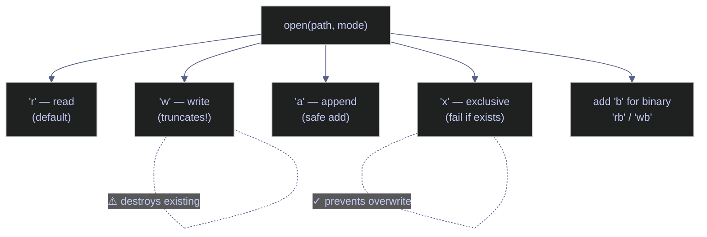

# 09. File I/O & Serialization - Python

> [!quote]
> "Tape is dead. Disk is tape. Flash is disk. RAM locality is king."
>
> — **Jim Gray**, Turing Award lecture (1998)

> [!abstract]- Summary
>
> Python file I/O and serialization spans multiple layers: built-in `open()` for text/binary files, standard library modules (`csv`, `json`, `yaml`, `pickle`), high-performance libraries (`orjson`, `pyarrow`, `fastavro`), and cloud-native access via `fsspec`.
>
> - **Read / Write / Append** — `open()` with mode strings `'r'`, `'w'`, `'a'`, `'x'`; `pathlib.Path` for cross-platform path handling; temp files via `tempfile`
> - **CSV** — `csv.reader` / `csv.writer`; `DictReader` / `DictWriter`; pandas and Polars CSV I/O
> - **JSON** — `json.dumps` / `json.loads`; custom encoders for `datetime` and `Decimal`; `orjson` for 3–10x throughput
> - **YAML** — `yaml.safe_load` / `yaml.dump`; config file and CI/CD manifest patterns
> - **Serialization & Streams** — `pickle` for Python-native objects; `struct` for binary packing; Protocol Buffers, Avro, Parquet, Arrow IPC for cross-language interchange
> - **Encoding & Decoding** — UTF-8, Base64, hex, URL encoding
> - **Async File I/O** — `aiofiles` with `async with` for non-blocking reads/writes in async services
> - **Schema Validation** — Pydantic v2 `BaseModel` for runtime coercion and validation at system boundaries
> - **Cloud Storage** — `fsspec` for filesystem-agnostic access across local, S3, GCS, and Azure Blob

> [!note]- Glossary
>
> **`open()`** — Python's built-in function for reading and writing files; mode strings (`'r'`, `'w'`, `'a'`, `'rb'`, `'wb'`) control the operation type.
>
> - The foundation for all text and binary file I/O in Python; always pair with a `with` statement.
> - Common mistake: omitting `encoding='utf-8'` — the default varies by OS (Windows uses cp1252, corrupting non-ASCII characters).
>
> > [!warning] `'w'` mode truncates without warning
> >
> > Opening an existing file with `'w'` destroys its content immediately. Use `'x'` (exclusive create) or check `Path.exists()` first for files that must be preserved.
>
> > ---
>
> **`with` statement** — Context manager that calls `close()` automatically when the block exits, even if an exception is raised.
>
> - Prevents resource leaks: open file handles, OS-level locks, and socket connections are released reliably.
> - Common mistake: storing the file handle in a variable and accessing it after the `with` block — the file is already closed and further reads/writes raise `ValueError`.
>
> > [!tip] Prefer `with` over manual `close()`
> >
> > Manual `f.close()` in a `try/finally` block is verbose and error-prone. The `with` statement is the canonical Python idiom and is enforced by most linters.
>
> > ---
>
> **`pathlib.Path`** — Object-oriented filesystem path API that replaces `os.path` string manipulation; supports the `/` operator for joining segments.
>
> - Cross-platform: `.Path` handles Windows backslashes and Unix forward slashes transparently.
> - Common mistake: mixing `os.path` strings with `Path` objects in the same expression — they interoperate but produce inconsistent types and reduce readability.
>
> > [!info] `Path` replaces the full `os.path` module
> >
> > `Path.read_text()`, `Path.write_text()`, `Path.exists()`, `Path.glob()`, and `Path.stat()` cover the most common `os.path` and `os` operations in a single, chainable API.
>
> > ---
>
> **CSV** — Comma-Separated Values; a plain-text tabular format with no schema, no data types, and no support for nesting.
>
> - Universal interchange format for flat data: spreadsheet exports, database dumps, pipeline staging files, and log aggregates.
> - Common mistake: parsing CSV manually with `split(',')` — this breaks on quoted fields that contain commas (e.g., `"Smith, John"`). Always use the `csv` module.
>
> > [!warning] Manual `split(',')` is not a CSV parser
> >
> > The `csv` module handles quoting, escaping, and dialect differences (delimiter, line terminator, quotechar) correctly. `split(',')` silently corrupts records with embedded commas.
>
> > ---
>
> **JSON** — JavaScript Object Notation; a text-based, human-readable format natively supported by web APIs, configuration files, and message brokers.
>
> - The default interchange format for REST APIs; also used for Kafka message payloads, GCS object metadata, and pipeline configuration.
> - Common mistake: passing `datetime`, `Decimal`, or custom class instances to `json.dumps()` without a custom encoder — these types raise `TypeError` by default.
>
> > [!info] `json.dumps` requires a custom encoder for non-primitive types
> >
> > Subclass `json.JSONEncoder` and override `default()`, or use `orjson` which handles `datetime`, `UUID`, and `numpy` arrays natively without extra configuration.
>
> > ---
>
> **orjson** — High-performance JSON library backed by Rust; 3–10x faster than the standard `json` module with native support for `datetime`, `UUID`, and `numpy`.
>
> - Used on hot paths: large API response serialization, high-throughput Kafka producers, and batch export jobs where JSON encoding is a bottleneck.
> - Common mistake: `orjson.dumps()` returns `bytes`, not `str` — call `.decode('utf-8')` when a string is required (e.g., writing to a text file or HTTP response body).
>
> > [!tip] Drop-in replacement for `json` on performance-sensitive paths
> >
> > `orjson.dumps(obj)` and `orjson.loads(data)` are API-compatible with the standard library for common types. Switch by aliasing: `import orjson as json` — but note the `bytes` return type.
>
> > ---
>
> **YAML** — YAML Ain't Markup Language; a human-readable config format using indentation-based nesting, commonly used for CI/CD pipelines, Kubernetes manifests, and application config.
>
> - Preferred over JSON for config files edited by humans: supports comments, multi-line strings, and anchors/aliases for DRY configuration.
> - Common mistake: using `yaml.load()` instead of `yaml.safe_load()` — `yaml.load()` can execute arbitrary Python code embedded in the YAML document.
>
> > [!danger] `yaml.load()` executes arbitrary code
> >
> > Any YAML document loaded with `yaml.load()` can embed Python object constructors. Always use `yaml.safe_load()` for all external input. Reserve `yaml.load()` only for fully trusted, application-internal documents — and even then, prefer `safe_load`.
>
> > ---
>
> **pickle** — Python-native binary serialization that can serialize arbitrary Python objects including class instances, closures, and lambdas.
>
> - Used for ML model persistence (scikit-learn pipelines), inter-process communication via `multiprocessing.Queue`, and short-lived caching where schema portability is not required.
> - Common mistake: treating pickle as a general-purpose serialization format — pickle files are Python-version-sensitive and not portable to other languages.
>
> > [!danger] Unpickling untrusted data executes arbitrary code
> >
> > `pickle.loads()` on a crafted payload can execute any Python code during deserialization. Never load pickle data from untrusted sources (external APIs, user uploads, public object storage). Use JSON or Protobuf for cross-system data exchange.
>
> > ---
>
> **Pydantic** — Data validation library that uses Python type hints to validate, coerce, and document structured data at runtime; v2 is backed by a Rust core.
>
> - Enforces schema at system boundaries: API request bodies, Kafka message deserialization, CSV row validation, and configuration loading.
> - Common mistake: using Pydantic v1 `.parse_obj()` with a v2 installation — v2 uses `model_validate()` and raises `AttributeError` on the v1 API.
>
> > [!info] Pydantic v2 API differs significantly from v1
> >
> > Key v2 changes: `model_validate()` replaces `parse_obj()`, `model_dump()` replaces `dict()`, and validators use `@field_validator` instead of `@validator`. Check the installed version with `pydantic.VERSION` before migrating.
>
> > ---
>
> **encoding** — The mapping between characters and bytes; UTF-8 is the universal default for all text data in modern systems.
>
> - Incorrect encoding corrupts non-ASCII characters: accented names (café), currency symbols (€, ¥), CJK characters (日本語), and emoji.
> - Common mistake: assuming ASCII — any non-English text in financial data (company names, city names, currency symbols) requires explicit UTF-8 handling at every I/O boundary.
>
> > [!warning] Platform default encoding is not UTF-8 on Windows
> >
> > Python on Windows defaults to `cp1252` for `open()` calls without `encoding=`. A file written on Linux (UTF-8) and read on Windows without specifying encoding silently corrupts non-ASCII bytes. Pass `encoding='utf-8'` on every `open()` call.
>
> > ---
>
> **async file I/O** — Non-blocking file operations using `aiofiles`; provides `async with aiofiles.open()` compatible with `asyncio` event loops.
>
> - Required in high-concurrency async services (FastAPI, aiohttp) where a blocking `open()` call would stall the event loop and degrade throughput.
> - Common mistake: assuming `aiofiles` is truly async at the OS level — it offloads I/O to a thread pool internally; it prevents event loop blocking but does not provide kernel-level async I/O.
>
> > [!info] `aiofiles` uses a thread pool, not OS async I/O
> >
> > `aiofiles` wraps synchronous file operations in `asyncio.get_event_loop().run_in_executor()`. This prevents blocking the event loop but does not achieve the same concurrency model as `io_uring` (Linux) or IOCP (Windows). For extreme throughput, consider memory-mapped files or in-process buffers.
>
> > ---
>
> **fsspec** — Filesystem-agnostic file access library; provides a unified `open()` / `glob()` / `ls()` API across local disk, S3, GCS, Azure Blob, HDFS, and HTTP.
>
> - Enables pipeline code that runs unchanged in local development (local filesystem) and cloud deployment (GCS or S3) by swapping the URI scheme (`file://` vs `gs://` vs `s3://`).
> - Common mistake: assuming `fsspec` handles authentication automatically — each backend requires its own credentials (`GOOGLE_APPLICATION_CREDENTIALS` for GCS, `AWS_ACCESS_KEY_ID` for S3).
>
> > [!tip] Use `fsspec` URIs to decouple pipeline code from storage backend
> >
> > Pass storage paths as URIs (`gs://bucket/path`, `s3://bucket/path`) rather than local paths. `fsspec.open(uri)` resolves the correct filesystem implementation at runtime, making the same code runnable in unit tests (local) and production (cloud) without modification.

Python provides multiple layers for file I/O and serialization — from built-in `open()` for text/binary files through `csv`, `json`, `yaml`, and `pickle` modules, to high-performance libraries like `orjson`, `pyarrow`, and `fastavro`. This note covers reading/writing files, structured data formats, encoding, async I/O, schema validation with Pydantic, and cloud-native storage patterns.

```python
import os
import csv
import json
import yaml
import pickle
import struct
import tempfile
import time
import shutil
import base64
import hashlib
import asyncio
import aiofiles
import orjson
import fsspec
import fastavro
import polars as pl
import pandas as pd
import pyarrow as pa
import pyarrow.parquet as pq
import pyarrow.compute as pc
from pathlib import Path
from io import StringIO, BytesIO
from datetime import datetime
from decimal import Decimal
from dataclasses import dataclass, asdict
from typing import Optional
from urllib.parse import quote, unquote, quote_plus, urlencode
from pydantic import BaseModel, Field, ValidationError
from google.protobuf import descriptor_pb2, descriptor_pool, symbol_database
from google.protobuf import descriptor as _descriptor
from google.protobuf import message as _message
from google.protobuf import reflection as _reflection

from IPython.display import display, Markdown
html_formatter = get_ipython().display_formatter.formatters['text/html'] # type: ignore
html_formatter.for_type(pd.DataFrame, lambda df: df.to_html())
html_formatter.for_type(pd.Series, lambda s: s.to_frame().to_html())
```

    <function __main__.<lambda>(s)>

## Read, Write, Append Files

Python's built-in `open()` function handles all file I/O with mode strings controlling the operation. Always use `with` statements for automatic resource cleanup and pass `encoding='utf-8'` explicitly — the default varies by OS (Windows uses cp1252, not UTF-8).

> [!info] File modes
>
> - `'r'` — read (default) | `'w'` — write (truncates!) | `'a'` — append | `'x'` — exclusive create
> - Add `'b'` for binary (`'rb'`, `'wb'`), `'+'` for read+write (`'r+'`, `'w+'`)
> - Always specify `encoding='utf-8'` — the default varies by OS (Windows uses cp1252)
> - Use `pathlib.Path` for modern path handling (preferred over `os.path`)



### Temporary directories

#### tempfile.mkdtemp — create isolated temp directory

`tempfile.mkdtemp` creates a unique temporary directory for file demos and intermediate pipeline outputs. The directory persists until explicitly deleted — use `shutil.rmtree()` for cleanup.


```python
# Temp directory — isolated workspace for file demos

tmp_dir = Path(tempfile.mkdtemp(prefix="fileio_"))
print(f"Working dir: {tmp_dir}\n")
```

    C:\Users\aperi\AppData\Local\Temp\fileio_yk2nuyou

### Writing and reading files

#### open() mode 'w' — write file (creates new or truncates existing)

`open(path, "w")` creates a new file or truncates an existing one to zero length. `f.write()` writes a string to the file — it does NOT add a newline automatically, so you must include `\n` yourself. The `Path / operator` joins path segments (equivalent to `os.path.join`).

> [!warning] Write mode overwrites silently
>
> `'w'` mode destroys existing content without warning. `f.write()` does NOT add a newline — you must add `\n` yourself.

> [!success] Use 'x' mode or check existence before writing critical files
>
> To prevent accidental overwrites of important output files, use `open(path, "x")` (exclusive create — fails if the file exists) or check `Path(path).exists()` first. For log/audit files that must be preserved, always use append mode `"a"` instead of `"w"`.

```python
staging_file = tmp_dir / "pipeline_output.txt"

with open(staging_file, "w", encoding="utf-8") as f:
    f.write("pipeline_id|status|rows_processed\n")  # header
    f.write("etl_001|success|15000\n")
    f.write("etl_002|failed|0\n")
    f.write("etl_003|success|8200\n")

staging_file
print(f"{staging_file.stat().st_size} bytes")
```

    C:\Users\aperi\AppData\Local\Temp\fileio_yk2nuyou\pipeline_output.txt
    98 bytes

#### open() mode 'r' — read entire file

`open(path, "r")` opens a file for reading (the default mode). `f.read()` returns the entire file as one string. `Path.read_text(encoding="utf-8")` is a one-liner shorthand that opens, reads, and closes automatically.

> [!danger] Omitting encoding= causes platform-dependent behavior
>
> On Windows, `open()` defaults to `cp1252` (not UTF-8). A file written on Linux (UTF-8) and read on Windows (cp1252) silently corrupts non-ASCII characters like accented names, currency symbols, and emoji. Always pass `encoding='utf-8'` explicitly.

> [!success] Pass encoding='utf-8' on every open() call
>
> Treat `encoding='utf-8'` as a required argument, not an optional one. Set it as a team convention or lint rule (`flake8-bugbear B019`). For source files that must be portable, use `pathlib.Path.read_text(encoding="utf-8")` which enforces the encoding at the call site.

```python
with open(staging_file, "r", encoding="utf-8") as f:
    content = f.read()
print(f"read(): {repr(content[:60])}...")

content = staging_file.read_text(encoding="utf-8")
print(f"{len(content)} chars")
```

    'pipeline_id|status|rows_processed\netl_001|success|15000\netl_'...
    94 chars

#### open() line-by-line iteration — memory efficient for large files

For large files (multi-GB data lake exports), don't load everything into memory. A file object is an iterator — `for line in f` yields one line at a time, using almost no memory regardless of file size. Each line includes the trailing `\n` — call `.rstrip()` to remove it.

```python
with open(staging_file, "r", encoding="utf-8") as f:
    for i, line in enumerate(f):
        print(f"  Line {i}: {line.rstrip()}")
```

      Line 0: pipeline_id|status|rows_processed
      Line 1: etl_001|success|15000
      Line 2: etl_002|failed|0
      Line 3: etl_003|success|8200

#### readlines() vs readline() | bulk vs single-line reading

`readlines()` reads ALL lines into a `list[str]` at once — like `read()` but pre-split by `\n`. `readline()` reads ONE line per call, advancing the file position — use for manual control when you need to process the header separately from data rows.

```python
with open(staging_file, "r", encoding="utf-8") as f:
    all_lines = f.readlines()
    print(f"  readlines() → list of {len(all_lines)} strings")
    print(f"  First: {all_lines[0].rstrip()!r}")

with open(staging_file, "r", encoding="utf-8") as f:
    first = f.readline()
    second = f.readline()
    print(f"  readline() #1: {first.rstrip()!r}")
    print(f"  readline() #2: {second.rstrip()!r}")
```

      readlines() → list of 4 strings
    'pipeline_id|status|rows_processed'
      readline() #1: 'pipeline_id|status|rows_processed'
      readline() #2: 'etl_001|success|15000'

### Append, exclusive create, and binary mode

#### open() mode 'a' — append to end, never truncates

`'a'` mode positions the cursor at the end of the file. Creates the file if it doesn't exist. Does NOT truncate — safe to call repeatedly for log files, audit trails, and incremental pipeline outputs.

```python
with open(staging_file, "a", encoding="utf-8") as f:
    f.write("etl_004|success|22000\n")
    f.write("etl_005|success|3100\n")

# Verify: now has 5 data rows + 1 header = 6 lines
lines = staging_file.read_text(encoding="utf-8").splitlines()  # splitlines() strips \n
len(lines)  # Total lines after append
lines[-1]!r  # Last line
```

    6
    'etl_005|success|3100'

#### open() mode 'x' — exclusive create, fail if file exists

`'x'` mode creates the file only if it does not already exist — raises `FileExistsError` on collision. Use for ensuring unique output files where accidental overwrites would be destructive.

```python
new_file = tmp_dir / "unique_output.txt"
with open(new_file, "x", encoding="utf-8") as f:
    f.write("This file was created exclusively.\n")
    print(f"  Created: {new_file.name}")

try:
    with open(new_file, "x") as f:  # second attempt — file already exists
        pass
except FileExistsError:
    print(f"  FileExistsError: '{new_file.name}' already exists (mode='x' prevents overwrite)")
```

    unique_output.txt
    'unique_output.txt' already exists (mode='x' prevents overwrite)

#### open() binary mode 'rb' / 'wb' — read and write bytes

Binary mode works with `bytes` objects instead of strings. No `encoding` parameter — you work with raw bytes. Use for images, Parquet files, Protobuf, Avro, and compressed archives.

```python
bin_file = tmp_dir / "sample.bin"
data = bytes([0x89, 0x50, 0x4E, 0x47])  # PNG magic bytes (header signature)

with open(bin_file, "wb") as f:     # 'wb' = write binary
    f.write(data)

with open(bin_file, "rb") as f:     # 'rb' = read binary
    raw = f.read()                  # returns bytes, not str
    print(f"  Type: {type(raw)}, Content: {raw.hex()}")
```

    <class 'bytes'>, Content: 89504e47

### pathlib — modern path operations

#### pathlib.Path | modern replacement for os.path

`pathlib.Path` is the modern, object-oriented replacement for `os.path.join`, `os.path.exists`, etc. The `/` operator joins path segments. `.name`, `.stem`, `.suffix`, `.parent` extract path components. `.mkdir(exist_ok=True)` is equivalent to `mkdir -p`. `.glob("*")` finds files matching a pattern.

```python
p = Path("/data/lake/raw/events/2024/01/events.parquet")
p.name  # name — 'events.parquet' — filename with extension
p.stem  # stem — 'events' — filename without extension
p.suffix  # suffix — '.parquet' — extension including the dot
p.parent  # parent — '/data/lake/raw/events/2024/01' — directory containing this file
p.parts  # parts — all path components as a tuple

# Path operations
output = tmp_dir / "output"          # / operator joins paths
output.mkdir(exist_ok=True)          # mkdir -p equivalent; exist_ok=True avoids error if already exists
output  # Created dir
output.exists()  # Exists — True
output.is_dir()  # Is dir — True
staging_file.is_file()  # Is file — True

# Glob — find files matching a pattern
# Files in tmp_dir
for f in sorted(tmp_dir.glob("*")):  # glob("*") = all files/dirs in tmp_dir
    print(f"    {f.name}")
# Recursive glob: tmp_dir.glob("**/*.csv") — all .csv files in any subdirectory
```

    events.parquet
    events
    .parquet
    \data\lake\raw\events\2024\01
    ('\\', 'data', 'lake', 'raw', 'events', '2024', '01', 'events.parquet')
    C:\Users\aperi\AppData\Local\Temp\fileio_yk2nuyou\output
    True
    True
    True
    
        output
        pipeline_output.txt
        sample.bin
        unique_output.txt

## CSV Files

The `csv` module handles quoting, escaping, and delimiters automatically. `csv.reader`/`csv.writer` work with list-based rows; `csv.DictReader`/`csv.DictWriter` use dict-based rows with named columns — preferred in data engineering since you access columns by name, not index.

> [!warning] Windows newline translation silently corrupts CSV
>
> Python's text mode translates `\n` to `\r\n` on Windows. For CSV files, this causes double-newlines (blank rows) unless you pass `newline=""` to `open()`. For binary formats (Parquet, Avro, images), always use `'rb'`/`'wb'` mode.

> [!success] Pass newline='' for CSV, use binary mode for all other formats
>
> For CSV: `open(path, "w", newline="", encoding="utf-8")` — the `csv` module handles its own newlines. For Parquet, Avro, images, and compressed files: `open(path, "wb")` — no encoding argument, no newline translation.

> [!warning] CSV pitfalls
>
> - **Never use `split(',')`** — breaks on quoted commas. Always use the `csv` module.
> - **Avoid positional indexing** with `csv.reader` — fragile if columns reorder. Use `DictReader` instead.
> - **For large CSV (>100MB)** — use pandas, Polars, or DuckDB instead of the built-in module.

> [!success] Use DictReader/DictWriter and always pass newline=''
>
> `csv.DictReader` accesses columns by name, so column reordering never breaks the code. Always open CSV files with `newline=""` on Windows to prevent the csv module from adding extra blank lines. For files over 100 MB, switch to `polars.read_csv()` for 5-10x faster parsing.

### csv.writer and csv.reader — list-based rows

#### csv.writer — write CSV rows as lists

`csv.writer` writes rows as lists of values. `writerow()` writes a single row; `writerows()` writes multiple rows at once. The writer handles quoting automatically — values containing commas are wrapped in double quotes per RFC 4180.

```python
tmp_dir = Path(tempfile.mkdtemp(prefix="csv_"))
csv_file = tmp_dir / "pipeline_runs.csv"

with open(csv_file, "w", newline="", encoding="utf-8") as f:
    # newline="" is REQUIRED on Windows — prevents csv module from adding extra blank lines.
    # The csv.writer handles quoting automatically (e.g. commas inside values).
    writer = csv.writer(f)
    writer.writerow(["pipeline_id", "status", "rows_processed", "duration_s"])  # header
    writer.writerow(["etl_001", "success", 15000, 2.3])
    writer.writerow(["etl_002", "failed", 0, 0.1])
    writer.writerow(["etl_003", "success", 8200, 1.7])
    # writerows() writes multiple rows at once from a list of lists:
    writer.writerows([
        ["etl_004", "success", 22000, 4.1],
        ["etl_005", "success", 3100, 0.8],
    ])

csv_file.name  # Written
print(f"Content:\n{csv_file.read_text(encoding='utf-8')}")
```

    pipeline_runs.csv
      Content:
    pipeline_id,status,rows_processed,duration_s
    etl_001,success,15000,2.3
    etl_002,failed,0,0.1
    etl_003,success,8200,1.7
    etl_004,success,22000,4.1
    etl_005,success,3100,0.8

#### csv.reader — read CSV rows as lists of strings

`csv.reader` returns an iterator of lists — each row is a `list[str]`. All values are strings; you must cast manually (`int(row[2])`, `float(row[3])`). Use `next(reader)` to consume the header row before iterating data rows.

```python
with open(csv_file, "r", encoding="utf-8") as f:
    reader = csv.reader(f)
    header = next(reader)
    print(f"  Header: {header}")
    for row in reader:                # remaining rows = data
        # row is a list of strings: ['etl_001', 'success', '15000', '2.3']
        # All values are strings — you must cast manually.
        pipeline_id, status, rows, duration = row
        print(f"  {pipeline_id}: {status}, {int(rows):,} rows, {float(duration):.1f}s")
```

    ['pipeline_id', 'status', 'rows_processed', 'duration_s']
      etl_001: success, 15,000 rows, 2.3s
      etl_002: failed, 0 rows, 0.1s
      etl_003: success, 8,200 rows, 1.7s
      etl_004: success, 22,000 rows, 4.1s
      etl_005: success, 3,100 rows, 0.8s

### csv.DictReader and csv.DictWriter — dict-based rows

#### csv.DictReader — read rows as dictionaries (preferred in DE)

`csv.DictReader` uses the first row as dictionary keys. Each subsequent row becomes a `dict` with named columns — access columns by name (`row["status"]`) instead of fragile positional indexing (`row[2]`). Preferred over `csv.reader` in data engineering because column reordering never breaks the code.

```python
with open(csv_file, "r", encoding="utf-8") as f:
    reader = csv.DictReader(f)
    print(f"  Columns: {reader.fieldnames}")
    for row in reader:
        # row is a dict: {'pipeline_id': 'etl_001', 'status': 'success', ...}
        if row["status"] == "failed":
            print(f"  FAILED: {row['pipeline_id']} ({row['rows_processed']} rows)")
        else:
            print(f"  OK:     {row['pipeline_id']} ({int(row['rows_processed']):,} rows)")
```

    ['pipeline_id', 'status', 'rows_processed', 'duration_s']
      OK:     etl_001 (15,000 rows)
      FAILED: etl_002 (0 rows)
      OK:     etl_003 (8,200 rows)
      OK:     etl_004 (22,000 rows)
      OK:     etl_005 (3,100 rows)

#### csv.DictWriter — write rows from dictionaries

`csv.DictWriter` writes rows from dictionaries. Pass the `fieldnames` list to define column order. `writeheader()` writes the header row; `writerows()` writes all data dicts at once. Use for constructing output CSV from transformed records.

```python
enriched_file = tmp_dir / "enriched_runs.csv"
fieldnames = ["pipeline_id", "status", "rows_processed", "cost_usd"]

records = [
    {"pipeline_id": "etl_001", "status": "success", "rows_processed": 15000, "cost_usd": 0.45},
    {"pipeline_id": "etl_002", "status": "failed", "rows_processed": 0, "cost_usd": 0.01},
    {"pipeline_id": "etl_003", "status": "success", "rows_processed": 8200, "cost_usd": 0.25},
]

with open(enriched_file, "w", newline="", encoding="utf-8") as f:
    writer = csv.DictWriter(f, fieldnames=fieldnames)
    writer.writeheader()            # writes the header row from fieldnames
    writer.writerows(records)       # writes all dicts at once (or use writer.writerow(dict) one by one)

enriched_file.name  # Written
print(f"Content:\n{enriched_file.read_text(encoding='utf-8')}")
```

    enriched_runs.csv
      Content:
    pipeline_id,status,rows_processed,cost_usd
    etl_001,success,15000,0.45
    etl_002,failed,0,0.01
    etl_003,success,8200,0.25

### Delimiters, quoting, and in-memory CSV

#### csv.reader delimiter parameter — pipe-delimited, tab-delimited

Pass `delimiter="|"` or `delimiter="\t"` to `csv.reader` to handle pipe-delimited and tab-delimited (TSV) files. `StringIO` wraps an in-memory string as a file-like object — useful for parsing CSV data received from an API or embedded in a variable.

```python
pipe_data = "id|name|region\n1|Alice|EMEA\n2|Bob|APAC"
reader = csv.reader(StringIO(pipe_data), delimiter="|")  # StringIO = in-memory file
for row in reader:
    print(f"  Pipe: {row}")

# Tab-delimited (TSV — common in BigQuery exports, Redshift UNLOAD)
tsv_data = "id\tname\tregion\n1\tAlice\tEMEA\n2\tBob\tAPAC"
reader = csv.reader(StringIO(tsv_data), delimiter="\t")
for row in reader:
    print(f"  Tab:  {row}")
```

    ['id', 'name', 'region']
    ['1', 'Alice', 'EMEA']
    ['2', 'Bob', 'APAC']
    ['id', 'name', 'region']
    ['1', 'Alice', 'EMEA']
    ['2', 'Bob', 'APAC']

#### csv module — quoting, embedded commas, newlines in fields

The `csv` module handles RFC 4180 edge cases automatically: values containing commas are quoted, embedded quotes are escaped by doubling (`""`), and newlines within fields are preserved. Never use `str.split(",")` for CSV — it breaks on all of these cases.

```python
tricky_data = '''name,address,note
"Smith, John","123 Main St, Apt 4","has a comma"
"O'Brien","456 Oak ""Ave""","has quotes"'''

reader = csv.DictReader(StringIO(tricky_data))
for row in reader:
    print(f"  Name: {row['name']:<15} Address: {row['address']}")
```

    Smith, John     Address: 123 Main St, Apt 4
    O'Brien         Address: 456 Oak "Ave"

#### StringIO — CSV in memory (no disk I/O)

`StringIO` is an in-memory text buffer that behaves like an open file. Use it to build CSV payloads for API calls or cloud uploads without writing to disk. Call `.getvalue()` to retrieve the complete string.

```python
output = StringIO()                            # in-memory text buffer
writer = csv.writer(output)
writer.writerow(["event_id", "event_type", "timestamp"])
writer.writerow(["evt_001", "page_view", "2024-01-15T10:30:00Z"])
writer.writerow(["evt_002", "purchase", "2024-01-15T10:31:00Z"])

csv_string = output.getvalue()                 # retrieve the entire CSV as a string
print(f"In-memory CSV ({len(csv_string)} chars):")
print(f"{csv_string.strip()}")
# Now csv_string can be sent to an API, uploaded to GCS, or written to Kafka.
```

      In-memory CSV (110 chars):
      event_id,event_type,timestamp
    evt_001,page_view,2024-01-15T10:30:00Z
    evt_002,purchase,2024-01-15T10:31:00Z

## JSON

Python's built-in `json` module handles serialization (`dumps`/`dump`) and deserialization (`loads`/`load`). The `s` suffix means string — `dumps` returns a string, `dump` writes to a file. For types not natively serializable (`datetime`, `Decimal`, `set`), provide a `default=` handler. For high-throughput pipelines, use `orjson` (covered below) for 3–10x speed.

### json module — dumps, loads, dump, load

#### json.dumps — dict → JSON string

> [!info] JSON serialization
>
> - `json.dumps(obj, indent=2, sort_keys=True)` — converts dicts/lists to JSON string
> - `default=` — handles non-serializable types (datetime, Decimal)
> - For high-throughput, use `orjson` (3-10x speed)

```python
tmp_dir = Path(tempfile.mkdtemp(prefix="json_yaml_"))

pipeline_meta = {
    "pipeline_id": "etl_events_daily",
    "schedule": "0 3 * * *",             # cron expression — runs at 3am daily
    "source": {
        "type": "bigquery",
        "dataset": "raw_events",
        "table": "clickstream",
    },
    "sink": {
        "type": "gcs",
        "bucket": "data-lake-prod",
        "path": "processed/events/",
    },
    "tags": ["production", "clickstream", "daily"],
    "row_count": 1_500_000,
    "is_active": True,                    # Python True → JSON true
    "last_failure": None,                 # Python None → JSON null
}

# dumps = dump-to-string. indent=2 for pretty print. ensure_ascii=False for unicode.
json_str = json.dumps(pipeline_meta, indent=2, ensure_ascii=False)
json_str
```

    {
      "pipeline_id": "etl_events_daily",
      "schedule": "0 3 * * *",
      "source": {
        "type": "bigquery",
        "dataset": "raw_events",
        "table": "clickstream"
      },
      "sink": {
        "type": "gcs",
        "bucket": "data-lake-prod",
        "path": "processed/events/"
      },
      "tags": [
        "production",
        "clickstream",
        "daily"
      ],
      "row_count": 1500000,
      "is_active": true,
      "last_failure": null
    }

#### json.loads — JSON string → dict

`json.loads` parses a JSON string into Python objects: `{}` → `dict`, `[]` → `list`, `true`/`false` → `True`/`False`, `null` → `None`, numbers → `int` or `float`.

```python
api_response = '''
{
    "status": "completed",
    "job_id": "bq_job_12345",
    "statistics": {
        "total_bytes_processed": 524288000,
        "total_rows": 1500000,
        "cache_hit": false
    }
}
'''

data = json.loads(api_response)  # JSON string → Python dict
# JSON types → Python types:
#   object {} → dict,  array [] → list,  string → str
#   number (int) → int,  number (float) → float
#   true/false → True/False,  null → None
data['job_id']  # Job
print(f"{data['statistics']['total_rows']:,}")  # Rows
data['statistics']['cache_hit']  # Cache hit — Python bool
```

    bq_job_12345
    1,500,000
    False

#### json.dump / json.load — write/read JSON files

`json.dump` (no `s`) writes directly to a file object. `json.load` (no `s`) reads from a file object. Both require an open file handle — use with `with open(...)`.

```python
json_file = tmp_dir / "pipeline_config.json"

# Write dict → JSON file
with open(json_file, "w", encoding="utf-8") as f:
    json.dump(pipeline_meta, f, indent=2, ensure_ascii=False)
    # dump (no 's') writes directly to a file object
print(f"{json_file.name} ({json_file.stat().st_size} bytes)")  # Written

# Read JSON file → dict
with open(json_file, "r", encoding="utf-8") as f:
    loaded = json.load(f)  # load (no 's') reads from a file object
loaded['pipeline_id']  # Loaded pipeline
print(f"Source: {loaded['source']['dataset']}.{loaded['source']['table']}")
```

    pipeline_config.json (421 bytes)
    etl_events_daily
    raw_events.clickstream

### Custom serialization and JSONL

#### json.dumps default parameter — serialize datetime, Decimal, custom objects

> [!warning] json.dumps() raises TypeError on datetime,
>
> `json.dumps()` raises `TypeError` on datetime, Decimal, set, bytes, and dataclasses
> The built-in JSON encoder only handles `dict`, `list`, `str`, `int`, `float`, `bool`, and `None`. Any other type raises `TypeError: Object of type X is not JSON serializable`. Always provide a `default=` handler or use `orjson` which handles these natively.

> [!success] Provide a default= handler or switch to orjson
>
> For stdlib json: pass `default=json_serializer` where `json_serializer` handles `datetime`, `Decimal`, `set`, and dataclasses. For high-throughput pipelines, use `orjson.dumps()` which natively serializes `datetime`, `numpy` arrays, and dataclasses without a custom handler.

```python
# Custom serializer for types json can't handle natively

def json_serializer(obj):
    if isinstance(obj, datetime):
        return obj.isoformat()      # '2024-01-15T03:00:00'
    if isinstance(obj, Decimal):
        return float(obj)           # or str(obj) to preserve precision
    if isinstance(obj, set):
        return sorted(list(obj))    # set → sorted list
    raise TypeError(f"Type {type(obj).__name__} not serializable")
```

#### json.dumps with default= — apply custom serializer

The `default=` function is called for any object the encoder can't handle natively. It receives the unserializable object and must return a JSON-compatible value. Use `default=str` as a quick fallback that converts everything to strings.

```python
pipeline_run = {
    "pipeline_id": "etl_events_daily",
    "started_at": datetime(2024, 1, 15, 3, 0, 0),
    "cost_usd": Decimal("0.45"),
    "unique_users": {1001, 1002, 1003},
}

json_str = json.dumps(pipeline_run, indent=2, default=json_serializer)
json_str
```

    {
      "pipeline_id": "etl_events_daily",
      "started_at": "2024-01-15T03:00:00",
      "cost_usd": 0.45,
      "unique_users": [
        1001,
        1002,
        1003
      ]
    }

#### JSON Lines (JSONL) — one JSON object per line

JSONL is the standard format for BigQuery exports/imports, Kafka messages, and streaming data pipelines. Each line is a complete, valid JSON object — no surrounding array, no commas between lines. Write with one `json.dumps` per line (no indent). Read with one `json.loads` per line.

```python
events = [
    {"event_id": "evt_001", "type": "page_view", "user_id": 1001, "ts": "2024-01-15T10:30:00Z"},
    {"event_id": "evt_002", "type": "purchase",  "user_id": 1002, "ts": "2024-01-15T10:31:00Z"},
    {"event_id": "evt_003", "type": "logout",    "user_id": 1001, "ts": "2024-01-15T10:35:00Z"},
]

jsonl_file = tmp_dir / "events.jsonl"

# Write JSONL — one json.dumps per line, no indent (compact)
with open(jsonl_file, "w", encoding="utf-8") as f:
    for event in events:
        f.write(json.dumps(event) + "\n")  # one complete JSON object per line

# Read JSONL — one json.loads per line
with open(jsonl_file, "r", encoding="utf-8") as f:
    for line in f:
        event = json.loads(line)           # parse each line independently
        print(f"  {event['event_id']}: {event['type']} by user {event['user_id']}")
```

      evt_001: page_view by user 1001
      evt_002: purchase by user 1002
      evt_003: logout by user 1001

## YAML

YAML is the standard configuration format for dbt, Airflow, Kubernetes, and Docker Compose. Python parses YAML with the `pyyaml` package (`pip install pyyaml`). Always use `yaml.safe_load()` — never `yaml.load()` without `SafeLoader`, as it can execute arbitrary code.

### yaml.safe_load and yaml.dump

#### yaml.safe_load — YAML string → dict

`yaml.safe_load()` parses YAML into dicts/lists safely — prevents arbitrary code execution (unlike `yaml.load` which can instantiate any Python object). Auto-detects types (numbers, booleans, dates).

> [!danger] Never use yaml.load() without SafeLoader
>
> Never use `yaml.load()` without `SafeLoader` — security risk. Always use `yaml.safe_load()`.

> [!success] Always use yaml.safe_load() for all YAML parsing
>
> `yaml.safe_load()` restricts deserialization to standard Python types (dict, list, str, int, float, bool, None). It blocks `!!python/object` tags that allow arbitrary code execution. The safe variant handles all legitimate config YAML with no functional difference.

```python
tmp_dir = Path(tempfile.mkdtemp(prefix="yaml_"))

# yaml.safe_load — YAML string → dict
# Data Engineering scenario: parse a dbt project config or Airflow DAG config

yaml_config = """
# Pipeline configuration (YAML supports comments — JSON does not)
pipeline:
  name: etl_events_daily
  schedule: "0 3 * * *"
  owner: data-team

source:
  type: bigquery
  dataset: raw_events
  table: clickstream
  partitioned_by: event_date      # BigQuery partition column

sink:
  type: gcs
  bucket: data-lake-prod
  format: parquet
  compression: snappy

quality_checks:
  - name: row_count_check
    min_rows: 1000
  - name: null_check
    columns: [event_id, user_id, event_date]

tags: [production, clickstream, daily]
"""

# safe_load: parses YAML but blocks dangerous Python object deserialization.
# ALWAYS use safe_load — never yaml.load() without Loader= (security risk).
config = yaml.safe_load(yaml_config)

config['pipeline']['name']  # Pipeline
print(f"Source:   {config['source']['dataset']}.{config['source']['table']}")
print(f"Sink:     gs://{config['sink']['bucket']}/{config['sink']['format']}")
[c['name'] for c in config['quality_checks']]  # Checks
config['tags']  # Tags
```

    etl_events_daily
    raw_events.clickstream
    gs://data-lake-prod/parquet
    ['row_count_check', 'null_check']
    ['production', 'clickstream', 'daily']

#### yaml.dump — dict → YAML string

`yaml.dump` serializes a Python dict to a YAML string. Pass `default_flow_style=False` for block style (readable indented format) and `sort_keys=False` to preserve insertion order.

```python
new_config = {
    "pipeline": {
        "name": "etl_purchases_hourly",
        "schedule": "0 * * * *",
    },
    "source": {"type": "kafka", "topic": "purchases", "group_id": "etl-consumer"},
    "sink": {"type": "bigquery", "dataset": "analytics", "table": "purchases"},
}

# default_flow_style=False → block style (readable); sort_keys=False → preserve insertion order
yaml_str = yaml.dump(new_config, default_flow_style=False, sort_keys=False)
yaml_str
```

    pipeline:
      name: etl_purchases_hourly
      schedule: 0 * * * *
    source:
      type: kafka
      topic: purchases
      group_id: etl-consumer
    sink:
      type: bigquery
      dataset: analytics
      table: purchases

#### yaml.safe_load / yaml.dump — read and write YAML files

Combine `yaml.dump` with `open()` to write YAML files, and `yaml.safe_load` with `open()` to read them back. Always use `safe_load` (not `load`) for parsing.

```python
yaml_file = tmp_dir / "pipeline_config.yaml"

# Write
with open(yaml_file, "w", encoding="utf-8") as f:
    yaml.dump(new_config, f, default_flow_style=False, sort_keys=False)
yaml_file.name  # Written

# Read
with open(yaml_file, "r", encoding="utf-8") as f:
    loaded_config = yaml.safe_load(f)
loaded_config['pipeline']['name']  # Loaded
```

    pipeline_config.yaml
    etl_purchases_hourly

### Multi-document YAML and comparison

#### Multi-document YAML (--- separator)

Some tools (Kubernetes manifests, dbt model configs) use multiple YAML documents in a single file, separated by `---`. `yaml.safe_load_all` returns a generator yielding one dict per document — iterate to process each.

```python
multi_doc = """
---
name: staging_events
materialized: view
---
name: mart_daily_events
materialized: table
depends_on:
  - staging_events
"""

# safe_load_all returns a generator — one dict per document
docs = list(yaml.safe_load_all(multi_doc))
for doc in docs:
    print(f"  Model: {doc['name']} ({doc['materialized']})")
```

    staging_events (view)
    mart_daily_events (table)

#### JSON vs YAML comparison | when to use each format

```python
print("""
Feature           JSON                    YAML
─────────────────────────────────────────────────────
Comments          NO                      YES (#)
Quoting           REQUIRED (double)       Optional
Trailing commas   NO                      N/A
Readability       Compact                 Human-friendly
Use case          APIs, data exchange     Config files (dbt, Airflow, K8s)
Python module     json (built-in)         yaml (pip install pyyaml)
C# equivalent     System.Text.Json        YamlDotNet
Security          Safe                    Use safe_load ONLY
Multi-document    No                      Yes (--- separator)
""")
```

    Feature           JSON                    YAML
    ─────────────────────────────────────────────────────
    Comments          NO                      YES (#)
    Quoting           REQUIRED (double)       Optional
    Trailing commas   NO                      N/A
    Readability       Compact                 Human-friendly
    Use case          APIs, data exchange     Config files (dbt, Airflow, K8s)
    Python module     json (built-in)         yaml (pip install pyyaml)
    C# equivalent     System.Text.Json        YamlDotNet
    Security          Safe                    Use safe_load ONLY
    Multi-document    No                      Yes (--- separator)

## Serialization, Deserialization, and Streams

For an architecture-level comparison of when to choose JSON, CSV, Parquet, or Avro for pipeline storage and interchange, see [serialization-formats](https://alp78.github.io/elysium/14-Data-Architecture/Pipeline-Patterns/serialization-formats).

### In-memory streams

Serialization converts in-memory objects to bytes/string. JSON for text interchange, `pickle` for Python caching (not safe for untrusted data), `struct` for binary protocols. `StringIO`/`BytesIO` for in-memory streams (API payloads, cloud uploads without disk).

```python
tmp_dir = Path(tempfile.mkdtemp(prefix="serial_"))
```

#### StringIO — in-memory text stream

> [!info] StringIO — In-Memory Text File
>
> Behaves like `open()` in text mode but lives entirely in memory. Use for building CSV/JSON payloads for API calls, cloud uploads, and unit tests without disk I/O.

```python
# StringIO — in-memory text stream with file-like API

buffer = StringIO()                  # create an empty text buffer
buffer.write("line 1\n")            # write to it like a file
buffer.write("line 2\n")
buffer.write("line 3\n")

# getvalue() returns the entire content as a string
content = buffer.getvalue()
content!r  # Content

# seek(0) resets the read position to the beginning (like rewinding a tape)
buffer.seek(0)
for line in buffer:                  # iterate like a file
    print(f"  Read: {line.rstrip()}")

buffer.close()                       # free the buffer (or use 'with')
```

    'line 1\nline 2\nline 3\n'
    line 1
    line 2
    line 3

#### BytesIO — in-memory binary stream

> [!info] BytesIO — In-Memory Binary File
>
> Behaves like `open()` in binary mode. Use for building binary payloads (Parquet, Protobuf, images) for cloud upload without writing to disk.

```python
# BytesIO — in-memory binary stream with file-like API

bin_buffer = BytesIO()
bin_buffer.write(b"HEADER")         # write bytes (not strings)
bin_buffer.write(b"\x00\x01\x02")  # raw binary data
print(f"{bin_buffer.tell()} bytes")  # Size — tell() returns current position

# Read back
bin_buffer.seek(0)                   # rewind to start
raw = bin_buffer.read()
raw  # Content
type(raw)  # Type — bytes
```

    9 bytes
    b'HEADER\x00\x01\x02'
    <class 'bytes'>

#### IO streams as function arguments — write once, use with file or memory

A function that accepts a file-like object (`dest`) works with both real files and in-memory streams. Write the function once using the file API, then call it with `open()` for disk or `StringIO()` for memory — same interface, different backend. This pattern is fundamental to testable I/O code.

```python
def write_events_csv(dest, events):
    """Write events to any file-like object (real file, StringIO, GCS blob, etc.)."""
    writer = csv.writer(dest)
    writer.writerow(["event_id", "type", "user_id"])
    for e in events:
        writer.writerow([e["event_id"], e["type"], e["user_id"]])

events = [
    {"event_id": "evt_001", "type": "page_view", "user_id": 1001},
    {"event_id": "evt_002", "type": "purchase", "user_id": 1002},
]

# Option 1: write to in-memory stream (for API upload, unit test, etc.)
mem_file = StringIO()
write_events_csv(mem_file, events)
print(f"In-memory CSV:\n  {mem_file.getvalue().strip()}")

# Option 2: write to real file on disk (same function, different argument)
disk_file = tmp_dir / "events.csv"
with open(disk_file, "w", newline="", encoding="utf-8") as f:
    write_events_csv(f, events)
print(f"{disk_file.name} ({disk_file.stat().st_size} bytes)")  # Disk file
```

      In-memory CSV:
      event_id,type,user_id
    evt_001,page_view,1001
    evt_002,purchase,1002
    events.csv (70 bytes)

### Dataclass serialization

#### @dataclass — define typed domain model for serialization

`@dataclass` auto-generates `__init__`, `__repr__`, and `__eq__` from annotated fields. Use `Optional[str] = None` for fields that may be absent. Convert to a plain dict with `dataclasses.asdict()` for JSON serialization.

```python
@dataclass
class PipelineRun:
    """Represents a single execution of a data pipeline."""
    pipeline_id: str
    status: str                              # 'success' | 'failed' | 'running'
    rows_processed: int
    started_at: datetime
    cost_usd: float
    error_message: Optional[str] = None      # None if success, error string if failed
```

#### dataclasses.asdict + json.dumps — serialize dataclass to JSON

`asdict()` converts a dataclass instance to a plain dict. Then `json.dumps()` converts the dict to a JSON string. Non-serializable types like `datetime` require a `default=` handler (here `default=str` converts everything to strings as a fallback).

```python
run = PipelineRun(
    pipeline_id="etl_events_daily",
    status="success",
    rows_processed=1_500_000,
    started_at=datetime(2024, 1, 15, 3, 0, 0),
    cost_usd=0.45,
)

# Step 1: asdict() converts the dataclass instance to a plain dict
run_dict = asdict(run)  # {'pipeline_id': 'etl_events_daily', 'status': 'success', ...}

# Step 2: json.dumps() converts the dict to a JSON string
# Need default= for datetime (not natively JSON-serializable)
json_str = json.dumps(run_dict, indent=2, default=str)  # default=str: fallback for non-serializable types
json_str
```

    {
      "pipeline_id": "etl_events_daily",
      "status": "success",
      "rows_processed": 1500000,
      "started_at": "2024-01-15 03:00:00",
      "cost_usd": 0.45,
      "error_message": null
    }

#### json.loads + dataclass(**dict) — deserialize JSON to dataclass

`json.loads` returns a plain dict. Convert datetime strings back to `datetime` objects manually, then unpack the dict into the dataclass constructor with `**`. Pydantic (covered below) automates this type coercion.

```python
json_input = '{"pipeline_id":"etl_purchases","status":"failed","rows_processed":0,"started_at":"2024-01-15T04:00:00","cost_usd":0.01,"error_message":"Source table not found"}'

data = json.loads(json_input)          # JSON string → dict
# Convert datetime string back to datetime object
data["started_at"] = datetime.fromisoformat(data["started_at"])
# Unpack dict into dataclass constructor with **
run2 = PipelineRun(**data)             # dict → dataclass instance
run2.pipeline_id  # Pipeline
run2.status  # Status
run2.error_message  # Error
type(run2)  # Type
```

    etl_purchases
    failed
    Source table not found
    <class '__main__.PipelineRun'>

### pickle — Python-only binary serialization

#### pickle.dumps / pickle.loads — serialize to/from bytes

> [!danger] Pickle Executes Arbitrary Code
>
> pickle can serialize almost any Python object. But NEVER unpickle data from untrusted sources — a crafted payload can execute arbitrary code including `os.system('rm -rf /')`.

> [!success] Audit all pickle.loads() call sites in the codebase
>
> Search for `pickle.loads` and `pickle.load` in the codebase. Verify each call site reads from a local file or in-process object you wrote, not from a network socket, database column, or user-supplied input. Replace cross-service serialization with JSON or Protobuf.

```python
pickled = pickle.dumps(run)            # PipelineRun → bytes
print(f"{len(pickled)} bytes")  # Pickled size
type(pickled)  # Type
pickled[:30]  # First 30 bytes

unpickled = pickle.loads(pickled)      # bytes → PipelineRun
print(f"Unpickled: {unpickled.pipeline_id}, {unpickled.status}")
type(unpickled)  # Type
```

    212 bytes
    <class 'bytes'>
    b'\x80\x04\x95\xc9\x00\x00\x00\x00\x00\x00\x00\x8c\x08__main__\x94\x8c\x0bPipeli'
    etl_events_daily, success
    <class '__main__.PipelineRun'>

#### pickle.dump / pickle.load — serialize to/from file

`pickle.dump` writes a serialized object to a binary file (`'wb'` mode required). `pickle.load` reads it back (`'rb'` mode). The file must be opened in binary mode — pickle produces bytes, not text.

```python
pkl_file = tmp_dir / "pipeline_run.pkl"

# Write — binary mode required ('wb')
with open(pkl_file, "wb") as f:
    pickle.dump(run, f)
print(f"{pkl_file.name} ({pkl_file.stat().st_size} bytes)")  # Written

# Read — binary mode required ('rb')
with open(pkl_file, "rb") as f:
    loaded_run = pickle.load(f)
print(f"Loaded: {loaded_run.pipeline_id}, {loaded_run.rows_processed:,} rows")
```

    pipeline_run.pkl (212 bytes)
    etl_events_daily, 1,500,000 rows

#### When to use pickle vs JSON | comparison table

```python
print("""
Feature         pickle                          JSON
──────────────────────────────────────────────────────────
Types           Any Python object               dict, list, str, int, float, bool, None
Cross-language  Python only                     Universal (JS, C#, Go, Java, ...)
Human-readable  No (binary)                     Yes (text)
Security        DANGEROUS with untrusted data   Safe
Speed           Fast                            Moderate
Use case        Cache, ML models, internal      APIs, configs, data exchange
DE use case     Sklearn model artifacts,        BigQuery loads, API payloads,
                Airflow XCom (legacy)           Kafka messages, config files
""")

# ─────────────────────────────────────────────
# STRUCT — binary packing (C-compatible layout)
# ─────────────────────────────────────────────

```

    Feature         pickle                          JSON
    ──────────────────────────────────────────────────────────
    Types           Any Python object               dict, list, str, int, float, bool, None
    Cross-language  Python only                     Universal (JS, C#, Go, Java, ...)
    Human-readable  No (binary)                     Yes (text)
    Security        DANGEROUS with untrusted data   Safe
    Speed           Fast                            Moderate
    Use case        Cache, ML models, internal      APIs, configs, data exchange
    DE use case     Sklearn model artifacts,        BigQuery loads, API payloads,
                    Airflow XCom (legacy)           Kafka messages, config files
    
    struct (binary packing)

### struct — C-compatible binary packing

#### struct.pack / struct.unpack — fixed-size binary records

> [!info] struct Format Codes
>
> `struct` converts Python values to C-compatible binary data. Format codes: `i` = 32-bit int, `f` = 32-bit float, `d` = 64-bit double, `B` = unsigned byte, `?` = bool. Byte order: `<` = little-endian, `>` = big-endian, `!` = network order.

```python
fmt = '<ifd?'
fmt  # Format
print(f"{struct.calcsize(fmt)} bytes")  # Size — how many bytes this format needs

# Pack: Python values → bytes
packed = struct.pack(fmt, 42, 23.5, 1705312200.0, True)
packed.hex()  # Packed

# Unpack: bytes → Python tuple
sensor_id, value, ts, alert = struct.unpack(fmt, packed)
print(f"Unpacked: sensor={sensor_id}, value={value:.1f}, ts={ts}, alert={alert}")
```

    <ifd?
    17 bytes
    2a0000000000bc41000000f23f69d94101
    sensor=42, value=23.5, ts=1705312200.0, alert=True

## Encoding and Decoding

### Character encoding

#### str.encode / bytes.decode — UTF-8, ASCII, Latin-1 character encoding

> [!info] Character encoding
>
> - `str.encode('utf-8')` → bytes
> - `bytes.decode('utf-8')` → string
> - UTF-8 is the universal standard — always specify encoding explicitly (default varies by platform)
> - `errors='replace'` for graceful handling of bad bytes

```python
text = "Euro Stoxx 50: SAP €166.52, ASML €685.40"

# UTF-8: variable-length, ASCII-compatible, the internet standard
utf8 = text.encode("utf-8")
print(f"{len(utf8)} bytes, roundtrip={text == utf8.decode('utf-8')}")  # UTF-8

# ASCII: 7-bit only — non-ASCII chars raise UnicodeEncodeError
try:
    ascii_bytes = text.encode("ascii")
except UnicodeEncodeError as e:
    print(f"  ASCII:   FAILED — {e}")

# ASCII with replace — replaces unknown chars with ?
ascii_safe = text.encode("ascii", errors="replace")
print(f"{ascii_safe.decode('ascii')} (€ replaced with ?)")  # ASCII

# Latin-1 (ISO 8859-1): single-byte Western European
# Note: € is NOT in Latin-1 (it was added in Latin-9/ISO 8859-15)
try:
    latin1 = text.encode("latin-1")
except UnicodeEncodeError as e:
    print(f"  Latin-1: FAILED — {e}")
    latin1 = text.encode("latin-1", errors="replace")
    print(f"  Latin-1: {len(latin1)} bytes (with replacements)")

# UTF-16: 2 bytes per char (4 for supplementary) — used internally by Java/.NET
utf16 = text.encode("utf-16")
print(f"{len(utf16)} bytes (includes 2-byte BOM)")  # UTF-16
```

    44 bytes, roundtrip=True
    FAILED — 'ascii' codec can't encode character '\u20ac' in position 19: ordinal not in range(128)
    Euro Stoxx 50: SAP ?166.52, ASML ?685.40 (€ replaced with ?)
    FAILED — 'latin-1' codec can't encode character '\u20ac' in position 19: ordinal not in range(256)
    40 bytes (with replacements)
    82 bytes (includes 2-byte BOM)

### Data encoding — Base64, Hex, URL

#### base64.b64encode / b64decode — Base64 encoding for binary-safe text

Base64 encodes arbitrary binary data as printable ASCII characters. `b64encode` returns `bytes` (call `.decode()` for a string). `urlsafe_b64encode` replaces `+` and `/` with `-` and `_` for URL-safe output.

```python
original = "SAP.DE|2024-03-12|166.52"
b64 = base64.b64encode(original.encode("utf-8"))
decoded = base64.b64decode(b64).decode("utf-8")
original  # Original
b64.decode()  # Base64
decoded  # Decoded
original == decoded  # Roundtrip

# URL-safe Base64 (replaces + and / with - and _)
url_safe = base64.urlsafe_b64encode(original.encode("utf-8"))
b64.decode()  # Standard
url_safe.decode()  # URL-safe
```

    SAP.DE|2024-03-12|166.52
    U0FQLkRFfDIwMjQtMDMtMTJ8MTY2LjUy
    SAP.DE|2024-03-12|166.52
    True
    
    U0FQLkRFfDIwMjQtMDMtMTJ8MTY2LjUy
    U0FQLkRFfDIwMjQtMDMtMTJ8MTY2LjUy

#### bytes.hex / bytes.fromhex — hexadecimal encoding

`bytes.hex()` encodes each byte as two hex characters (0–9, a–f). `bytes.fromhex()` decodes back. Standard format for displaying hash digests (SHA-256, MD5) and debugging binary data.

```python
raw = b"\xde\xad\xbe\xef\xca\xfe"
hex_str = raw.hex()
back = bytes.fromhex(hex_str)
raw  # Bytes
hex_str  # Hex
raw == back  # Roundtrip

# SHA-256 hash displayed as hex (standard format)
sha = hashlib.sha256(b"SAP.DE").hexdigest()
sha  # SHA-256
print(f"{len(sha)} hex chars = {len(sha)//2} bytes")  # Length
```

    b'\xde\xad\xbe\xef\xca\xfe'
    deadbeefcafe
    True
    
    a80ae49a0c54581271b2fa37bc9113425072ca8b559941b00b916d37af0c4e58
    64 hex chars = 32 bytes

#### urllib.parse quote / unquote — URL percent-encoding

`quote()` percent-encodes special characters for safe URL inclusion (spaces → `%20`). `unquote()` decodes back. `urlencode(dict)` builds a complete query string from a dictionary of parameters (spaces → `+` in form encoding).

```python
raw = "SAP.DE close=166.52 change=+2.5% sector=Tech&Finance"
encoded = quote(raw)
raw  # Raw
encoded  # Encoded
unquote(encoded)  # Decoded

# Build safe query string from dict
params = {"symbol": "BRK.B", "note": "Q1 2024 earnings & revenue"}
qs = urlencode(params)
qs  # Query string
print(f"Full URL: https://api.example.com/quote?{qs}")
```

    SAP.DE close=166.52 change=+2.5% sector=Tech&Finance
    SAP.DE%20close%3D166.52%20change%3D%2B2.5%25%20sector%3DTech%26Finance
    SAP.DE close=166.52 change=+2.5% sector=Tech&Finance
    
    symbol=BRK.B&note=Q1+2024+earnings+%26+revenue
    https://api.example.com/quote?symbol=BRK.B&note=Q1+2024+earnings+%26+revenue

## Async File I/O

### aiofiles — non-blocking file operations

#### aiofiles — non-blocking file operations

> [!info] aiofiles
>
> - Wraps standard `open()` with `async`/`await` — releases the event loop during disk I/O
> - Essential for asyncio-based web servers
> - Standard `open()` blocks the entire event loop; `aiofiles` uses a thread pool internally

```python
tmp = tempfile.mkdtemp(prefix="async_py_")
async_file = os.path.join(tmp, "data.txt")

# Async write
async with aiofiles.open(async_file, "w") as f:
    await f.write("line1\nline2\nline3\n")

# Async read
async with aiofiles.open(async_file, "r") as f:
    content = await f.read()
content.strip().replace(chr(10), ', ')  # Read async

# Async line-by-line
async with aiofiles.open(async_file, "r") as f:
    i = 0
    async for line in f:
        print(f"    Line {i}: {line.strip()}")
        i += 1

shutil.rmtree(tmp)
```

      Written async
    line1, line2, line3
        Line 0: line1
        Line 1: line2
        Line 2: line3

## High-Performance JSON

### orjson — Rust-based fast JSON

#### orjson — fast JSON serialization

> [!info] orjson
>
> - Rust-based JSON, 3-10x faster than stdlib
> - `dumps()` returns `bytes` (not `str`)
> - Handles `datetime`, `numpy`, `dataclass` natively
> - Drop-in replacement for high-throughput APIs

```python
data = {"symbol": "SAP.DE", "price": 166.52, "timestamp": datetime(2024, 3, 12, 14, 30)}
fast_json = orjson.dumps(data, option=orjson.OPT_INDENT_2)
fast_json.decode()  # orjson output (bytes)

# Parse back
parsed = orjson.loads(fast_json)
parsed  # Parsed

# Benchmark: orjson vs json
big = [{"id": i, "value": i * 1.5, "name": f"item_{i}"} for i in range(10000)]

start = time.perf_counter()
for _ in range(100): json.dumps(big)
std_time = time.perf_counter() - start

start = time.perf_counter()
for _ in range(100): orjson.dumps(big)
orj_time = time.perf_counter() - start

print(f"json:   {std_time:.3f}s")
print(f"orjson: {orj_time:.3f}s")
print(f"Speedup: {std_time/orj_time:.1f}x")
```

    {
      "symbol": "SAP.DE",
      "price": 166.52,
      "timestamp": "2024-03-12T14:30:00"
    }
    {'symbol': 'SAP.DE', 'price': 166.52, 'timestamp': '2024-03-12T14:30:00'}
    
    0.299s
    0.038s
    7.9x

## Schema Validation with Pydantic

### Pydantic BaseModel — typed validation

#### pydantic — typed models with validation

> [!info] Pydantic
>
> - `class Model(BaseModel)` — validates types on construction, auto-coerces (`"42"` → `42`)
> - `model_dump()` → dict | `model_dump_json()` → JSON string
> - Generates JSON schema automatically
> - Use for API models, config validation, ETL schemas; for simple internal data, `dataclass` is lighter

```python
# Define a model with type hints and constraints
class StockQuote(BaseModel):
    symbol: str = Field(min_length=1, max_length=10)
    price: float = Field(gt=0)
    volume: int = Field(ge=0)
    exchange: Optional[str] = None

# Valid data — parsed and validated
quote = StockQuote(symbol="SAP.DE", price=166.52, volume=82621)
quote  # Valid
quote.model_dump_json()  # JSON

# Type coercion — "166.52" auto-converted to float
coerced = StockQuote(symbol="ASML.AS", price="685.40", volume="45000")
print(f"Coerced: price={coerced.price} (type={type(coerced.price).__name__})")

# Validation error — negative price rejected
try:
    bad = StockQuote(symbol="BAD", price=-5.0, volume=100)
except ValidationError as e:
    print(f"  Validation error: {e.errors()[0]['msg']}")
```

    symbol='SAP.DE' price=166.52 volume=82621 exchange=None
    {"symbol":"SAP.DE","price":166.52,"volume":82621,"exchange":null}
    price=685.4 (type=float)
    Input should be greater than 0

## High-Performance CSV Parsing

### Polars and DuckDB — vectorized CSV

#### polars and DuckDB — vectorized CSV

Polars (Rust) and DuckDB (C++) parse CSV with multi-threading and SIMD — 10–100x faster than the `csv` module. Automatic type inference. Use for any CSV >100MB. For small files, stdlib `csv` is sufficient.

```python
# Create a sample CSV in memory
csv_data = "symbol,date,close,volume\n"
csv_data += "\n".join(f"SYM_{i},2024-03-{i%28+1:02d},{100+i*0.5},{1000*i}" for i in range(1000))

# Polars: read CSV from string (in production: pl.read_csv("path.csv"))
df = pl.read_csv(csv_data.encode())
print(f"{df.shape[0]} rows, {df.shape[1]} cols")  # Polars
dict(zip(df.columns, [str(t) for t in df.dtypes]))  # Schema
print(f"Head:\n{df.head(3)}")

# Benchmark: csv module vs Polars

start = time.perf_counter()
for _ in range(100):
    reader = csv.DictReader(StringIO(csv_data))
    rows = list(reader)
csv_time = time.perf_counter() - start

start = time.perf_counter()
for _ in range(100):
    df = pl.read_csv(csv_data.encode())
pl_time = time.perf_counter() - start

print(f"csv module: {csv_time:.3f}s")
print(f"Polars:     {pl_time:.3f}s")
print(f"Speedup:    {csv_time/pl_time:.1f}x")
```

    1000 rows, 4 cols
    {'symbol': 'String', 'date': 'String', 'close': 'Float64', 'volume': 'Int64'}
      Head:
    (3, 4)
    ┌────────┬────────────┬───────┬────────┐
    │ symbol ┆ date       ┆ close ┆ volume │
    │ ---    ┆ ---        ┆ ---   ┆ ---    │
    │ str    ┆ str        ┆ f64   ┆ i64    │
    ╞════════╪════════════╪═══════╪════════╡
    │ SYM_0  ┆ 2024-03-01 ┆ 100.0 ┆ 0      │
    │ SYM_1  ┆ 2024-03-02 ┆ 100.5 ┆ 1000   │
    │ SYM_2  ┆ 2024-03-03 ┆ 101.0 ┆ 2000   │
    └────────┴────────────┴───────┴────────┘
    
    0.065s
    0.012s
    5.4x

> [!tip] Related pattern
>
> When writing pipeline output to files, codec selection (gzip, zstd, snappy) significantly affects both file size and read performance — see [compression](https://alp78.github.io/elysium/01-Shell/File-Operations/compression) for benchmark data and decision guidance.

## Cloud and Object Storage

### fsspec — unified filesystem interface

#### fsspec — unified filesystem interface

`fsspec` provides a single `open()` API for local, S3, GCS, Azure Blob, HDFS, HTTP. Change the URI, not the code: `open("s3://bucket/data.csv")`. Supports streaming. Works with pandas, Polars, PyArrow, Dask.

```python
tmp = tempfile.mkdtemp(prefix="fsspec_")
local_path = os.path.join(tmp, "data.csv")

with fsspec.open(local_path, "w") as f:
    f.write("symbol,price\nSAP.DE,166.52\nASML.AS,685.40\n")

with fsspec.open(local_path, "r") as f:
    print(f"  fsspec local: {f.read().strip()}")

# Cloud URIs — same API, just change the path:
# fsspec.open("s3://bucket/data.csv")       # AWS S3
# fsspec.open("gs://bucket/data.csv")       # Google Cloud Storage
# fsspec.open("abfs://container/data.csv")  # Azure Blob
# fsspec.open("https://api.example.com/data") # HTTP

shutil.rmtree(tmp)
```

    symbol,price
    SAP.DE,166.52
    ASML.AS,685.40
    
      # Cloud URIs (same API, just change the path):
      fsspec.open('s3://bucket/data.csv')       # AWS S3
      fsspec.open('gs://bucket/data.csv')       # Google Cloud Storage
      fsspec.open('abfs://container/data.csv')  # Azure Blob
      fsspec.open('https://api.example.com/data') # HTTP

## Warnings

> [!warning] Pickle is insecure — arbitrary code execution
>
> `pickle.load()` executes arbitrary Python code embedded in the pickle stream. Loading a pickle from an untrusted source is equivalent to running `eval()` on attacker-controlled input.

> [!success] Correct pattern
>
> Use pickle only for local caching and inter-process communication where you control both ends. For external data exchange, use JSON, Parquet, or Avro.

> [!warning] `yaml.load()` allows arbitrary code execution
>
> `yaml.load(data, Loader=yaml.FullLoader)` or plain `yaml.load(data)` can instantiate arbitrary Python objects. Malicious YAML payloads can execute code.

> [!success] Correct pattern
>
> Always use `yaml.safe_load()` — it only allows basic Python types (strings, ints, lists, dicts).

> [!warning] Default encoding varies by OS
>
> On Windows, `open('file.txt')` uses `cp1252` by default, not UTF-8. Non-ASCII characters (€, ñ, 日本語) become garbled or throw `UnicodeDecodeError`.

> [!success] Correct pattern
>
> Always pass `encoding='utf-8'` explicitly: `open('file.txt', encoding='utf-8')`.

> [!warning] `json.dumps` fails on `datetime`, `Decimal`, and custom objects
>
> `json.dumps({"date": datetime.now()})` raises `TypeError: Object of type datetime is not JSON serializable`.

> [!success] Correct pattern
>
> Use `orjson` (handles `datetime` natively) or pass `default=str` as a fallback encoder to `json.dumps`.

## Recommendations

- **Always use `with` for file I/O** — guarantees cleanup even on exceptions.
- **Always specify `encoding='utf-8'`** — makes code portable across Windows, Linux, and macOS.
- **Use `pathlib.Path` over `os.path`** — cleaner API, `/` operator for joining, cross-platform.
- **Use `orjson` for performance-critical JSON** — 3–10x faster, handles `datetime`/`UUID` natively.
- **Use Pydantic for schema validation at system boundaries** — API input, CSV parsing, config loading.
- **Use Parquet or Arrow IPC for analytical data** — columnar format, compression, schema preservation, 10–100x faster than CSV.
- **Use `fsspec` for cloud-portable file access** — same API for local, S3, GCS, Azure Blob.
- **Never unpickle untrusted data** — use JSON/Parquet/Avro for data exchange.

## Troubleshooting

| Problem | Cause | Fix |
|---|---|---|
| `UnicodeDecodeError` reading a file | File encoding doesn't match the `encoding=` parameter | Detect with `chardet` or specify the correct encoding |
| `json.dumps` raises `TypeError` | Object not serializable (datetime, Decimal, custom class) | Use `orjson`, or pass `default=str` to `json.dumps` |
| CSV field contains commas, breaks parsing | Not using `csv` module — manual `split(',')` | Use `csv.reader` which handles quoted fields correctly |
| `yaml.safe_load()` returns `None` | YAML file is empty or contains only comments | Check file contents; handle `None` return explicitly |
| Pickle file loads different object type | Pickle version or class definition changed between save and load | Pin pickle protocol; ensure class definition matches |
| `PermissionError` on Windows | File open in another process or antivirus lock | Close other programs; use `tempfile` for intermediate files |
| `FileNotFoundError` with relative path | Working directory differs from expected | Use `pathlib.Path(__file__).parent / 'data.csv'` for script-relative paths |
| `aiofiles` doesn't improve performance | File I/O is CPU-bound (compression, parsing), not I/O-bound | `aiofiles` helps with concurrent I/O; for CPU-bound work use `ProcessPoolExecutor` |

