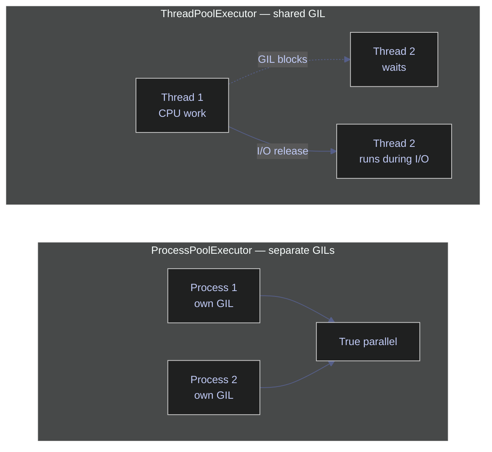
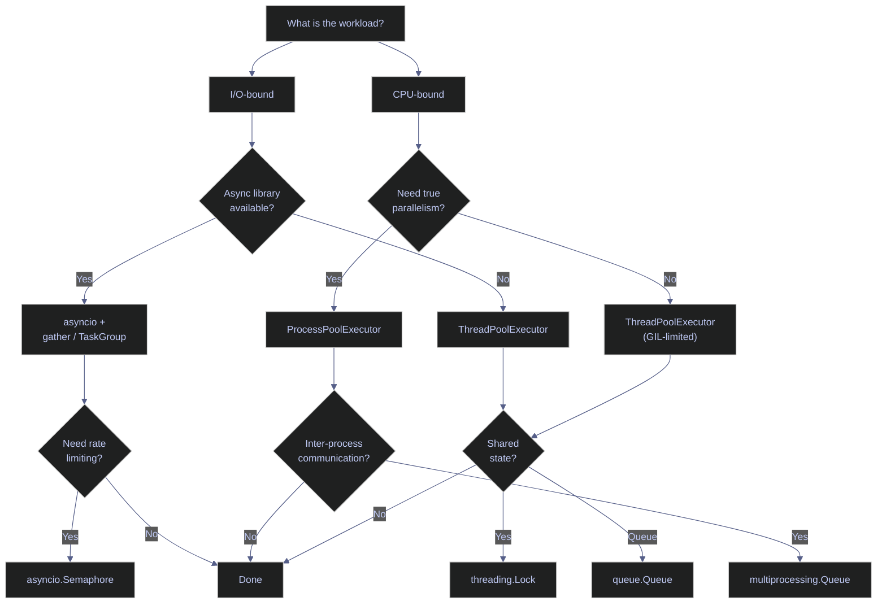

# 12. Async and Concurrency - Python

> [!quote]+
> "Everybody who learns concurrency thinks they understand it, ends up finding mysterious races they thought weren't possible, and discovers that they didn't actually understand it yet after all."
>
> — **Herb Sutter**, *The Free Lunch Is Over*, Dr. Dobb's Journal (2005)

> [!abstract]- Summary
>
> **Async and Await** — `async def` / `await` drive a single-threaded event loop for I/O-bound concurrency. `asyncio.gather` runs coroutines concurrently and collects all results; `asyncio.TaskGroup` (3.11+) adds structured cancellation. `asyncio.Semaphore` caps concurrent execution; `asyncio.wait_for` enforces per-coroutine timeouts. `asyncio.as_completed` yields futures fastest-first. `asyncio.Lock` guards shared state; `asyncio.Event` broadcasts a one-shot ready signal. Async generators (`async def` + `yield`) stream paginated data with `async for`.
>
> **Tasks and Parallelism** — `concurrent.futures` unifies thread and process pools under a single API. `ThreadPoolExecutor` parallelises I/O-bound blocking calls (GIL is released during I/O); `ProcessPoolExecutor` bypasses the GIL for true CPU parallelism in separate processes. `submit()` + `as_completed()` processes futures fastest-first; `pool.map()` preserves submission order. `asyncio.to_thread()` bridges a blocking call into the async event loop. `multiprocessing.Queue` passes data across process boundaries via serialisation.
>
> **Threading and Concurrency** — `threading.Thread` creates OS threads; `.join()` waits for completion. `threading.Lock` serialises read-modify-write sequences. `threading.Event` holds workers until a signal arrives; `threading.Barrier` synchronises N threads at a checkpoint before the next phase. `queue.Queue` is the thread-safe FIFO for producer-consumer patterns.
>
> **Advanced Synchronisation** — Python has no built-in reader-writer lock, countdown latch, lock-free atomics (`Interlocked`), or periodic timer — C# equivalents documented with migration patterns. Retry with exponential backoff is the standard transient-error recovery pattern for async I/O.
>
> **Decision rule** — I/O-bound + async library → `asyncio`; I/O-bound + blocking library → `ThreadPoolExecutor`; CPU-bound → `ProcessPoolExecutor`. Rate-limit with `asyncio.Semaphore`; pipeline with `asyncio.Queue` or `queue.Queue`; guard shared state with `threading.Lock`.

> [!note]- Glossary
>
> **asyncio**
> - Python's standard-library single-threaded asynchronous I/O framework built on an event loop that multiplexes coroutines cooperatively.
> - Ideal for I/O-bound concurrency (HTTP, DB, file); useless for CPU-bound work because it runs on one thread and does not bypass the GIL.
>
> > [!tip] asyncio is not parallelism
> >
> > `asyncio` overlaps waiting time across coroutines but executes only one at a time. CPU-bound tasks block the loop; offload them to `ProcessPoolExecutor` or `asyncio.to_thread`.
>
>  ---
>
> **async / await**
> - `async def` declares a coroutine — a function that can suspend and resume without blocking a thread.
> - `await` pauses the current coroutine and yields control back to the event loop until the awaited object resolves.
>
> > [!warning] Un-awaited coroutine silently does nothing
> >
> > Calling `async def fetch()` without `await` returns a coroutine object and never executes the body. Python emits `RuntimeWarning: coroutine 'fetch' was never awaited`.
>
>  ---
>
> **coroutine**
> - A function declared with `async def` that returns a coroutine object when called; the body runs only when the object is `await`ed or scheduled.
> - The fundamental unit of asyncio programs — `gather`, `TaskGroup`, and `create_task` all schedule coroutines.
>
> > [!info] Coroutine vs function
> >
> > A regular function executes immediately on call. A coroutine is a lazy object: it does nothing until driven by the event loop via `await`, `asyncio.run()`, or `create_task()`.
>
>  ---
>
> **event loop**
> - The single-threaded scheduler inside `asyncio` that drives coroutines by resuming them when their awaited I/O completes.
> - `asyncio.run(main())` creates, runs, and closes the loop; in Jupyter the loop is already running — use `await` directly.
>
> > [!danger] Nested asyncio.run() raises RuntimeError
> >
> > `asyncio.run()` cannot be called inside an already-running loop (Jupyter, FastAPI, Airflow). Use `await` directly in those environments, or apply `nest_asyncio` as a last resort.
>
>  ---
>
> **asyncio.gather**
> - Schedules multiple coroutines concurrently and returns all results in submission order when every coroutine completes.
> - With `return_exceptions=True`, exceptions are returned as values instead of aborting the gather; without it, the first exception cancels remaining tasks.
>
> > [!tip] gather vs TaskGroup
> >
> > Prefer `gather(return_exceptions=True)` when partial failures are acceptable and all outcomes must be inspected. Prefer `TaskGroup` (3.11+) for all-or-nothing operations that should abort immediately on any failure.
>
>  ---
>
> **TaskGroup (Python 3.11+)**
> - Structured concurrency primitive: all tasks created inside `async with asyncio.TaskGroup() as tg` are cancelled if any one raises an exception.
> - Uses `except*` syntax to catch `ExceptionGroup` — multiple simultaneous exceptions from different tasks.
>
> > [!info] Structured concurrency guarantee
> >
> > `TaskGroup` ensures no task outlives its scope. Orphaned background tasks (a common `gather` bug) are impossible — the `async with` block does not exit until every task is settled.
>
>  ---
>
> **GIL (Global Interpreter Lock)**
> - CPython mutex that allows only one thread to execute Python bytecode at a time, preventing true CPU parallelism across threads.
> - The GIL is released during I/O operations, so threads still provide concurrency for network and file work; only CPU-bound loops are serialised.
>
> > [!warning] ThreadPoolExecutor is not CPU-parallel
> >
> > Adding threads to CPU-bound work adds context-switching overhead with no parallelism gain — measured speedup drops below 1.0×. Use `ProcessPoolExecutor` to bypass the GIL with separate processes.
>
>  ---
>
> **concurrent.futures**
> - Standard-library module providing `ThreadPoolExecutor` and `ProcessPoolExecutor` under a uniform API: `submit()`, `map()`, `as_completed()`.
> - Switching from threads to processes requires only replacing the executor class — the rest of the call site is identical.
>
> > [!tip] Uniform API benefit
> >
> > Profile first, then swap: start with `ThreadPoolExecutor` for I/O work and replace with `ProcessPoolExecutor` for CPU work without changing business logic.
>
>  ---
>
> **ThreadPoolExecutor**
> - Manages a pool of reusable OS threads for running blocking I/O calls concurrently without blocking the calling thread.
> - `max_workers` should be set explicitly; the default can spawn dozens of threads, which wastes memory for I/O workloads with high sleep-to-work ratios.
>
> > [!info] Bridging sync and async
> >
> > Use `loop.run_in_executor(pool, blocking_fn, *args)` or the convenience wrapper `asyncio.to_thread(blocking_fn, *args)` to run a blocking call inside the event loop without stalling it.
>
>  ---
>
> **ProcessPoolExecutor**
> - Creates a pool of separate OS processes, each with its own Python interpreter and GIL, enabling true CPU parallelism on multi-core machines.
> - All arguments and return values must be picklable; the `if __name__ == "__main__":` guard is required on Windows to prevent recursive subprocess spawning.
>
> > [!warning] Pickling overhead
> >
> > Inter-process data transfer serialises arguments and results with `pickle`. Passing large numpy arrays, open file handles, or lambda functions fails with `PicklingError`. Keep payloads small or use shared memory (`multiprocessing.shared_memory`).
>
>  ---
>
> **asyncio.Semaphore**
> - Async-safe counter that limits how many coroutines can execute a guarded block simultaneously; extras `await` until a slot frees.
> - `Semaphore(N)` is the standard rate-limiting pattern for capping concurrent API calls, database connections, or file handles.
>
> > [!danger] Semaphore limits execution, not creation
> >
> > Creating 10,000 tasks with `Semaphore(10)` still allocates 10,000 task objects in memory. For large fan-outs, create tasks lazily or feed them through a bounded `asyncio.Queue` to cap both memory and concurrency.
>
>  ---
>
> **asyncio.wait_for**
> - Wraps a coroutine with a deadline; raises `asyncio.TimeoutError` and cancels the coroutine if it does not complete within the specified seconds.
> - Unlike C#'s `CancellationToken`, cancellation is automatic — the coroutine receives `CancelledError` internally and must handle cleanup in `finally` or `except asyncio.CancelledError`.
>
> > [!tip] Always handle CancelledError in cleanup paths
> >
> > If a timed-out coroutine holds a lock or an open connection, it must release it in a `finally` block; otherwise the resource leaks even after the timeout fires.
>
>  ---
>
> **asyncio.as_completed**
> - Returns an iterator of futures in completion order (fastest first), regardless of submission order; equivalent to C#'s `Task.WhenAny` used in a loop.
> - Use when latency matters and partial results can be processed immediately, rather than waiting for the slowest task before processing any.
>
> > [!info] as_completed vs gather
> >
> > `gather` blocks until all tasks finish and returns results in submission order. `as_completed` unblocks as each task finishes, returning results in wall-clock order. Choose `gather` for batch collection, `as_completed` for streaming display or early termination.
>
>  ---
>
> **asyncio.Queue**
> - Async-safe FIFO queue for producer-consumer pipelines; `put()` blocks if bounded and full, `get()` blocks if empty, enforcing backpressure.
> - Equivalent to C#'s `Channel<T>`; use sentinel values (`None`) or `maxsize` to signal workers and cap memory usage.
>
> > [!warning] asyncio.Queue is not thread-safe
> >
> > `asyncio.Queue` is designed for coroutines on the same event loop. Passing it to `threading.Thread` workers causes undefined behaviour. Use `queue.Queue` for thread-based pipelines.
>
>  ---
>
> **asyncio.Lock**
> - Async-safe mutual exclusion primitive; only one coroutine can hold the lock at a time — others `await` until it is released.
> - Typical use: guard a shared cache or token refresh so only one coroutine triggers the expensive operation while others wait and reuse the result.
>
> > [!info] asyncio.Lock vs threading.Lock
> >
> > `asyncio.Lock` is not thread-safe; it only works within a single event loop. For mixed async/thread code, use `threading.Lock` or `asyncio.to_thread` to isolate the boundary.
>
>  ---
>
> **asyncio.Event**
> - Async signalling primitive: `event.set()` unblocks all coroutines currently waiting on `await event.wait()` simultaneously; the event stays set until `event.clear()`.
> - Use to broadcast a one-shot ready signal (e.g., "schema validated, all loaders may proceed") rather than polling.
>
> > [!tip] One-shot vs repeating signals
> >
> > `asyncio.Event` is best for one-shot broadcasts. For repeating signals or value handoff, prefer `asyncio.Queue`. For phased milestones across multiple stages, use `asyncio.Barrier` (3.11+) or `asyncio.gather`.
>
>  ---
>
> **async generator**
> - An `async def` function containing `yield` that produces values lazily; consumed with `async for`, equivalent to C#'s `IAsyncEnumerable<T>`.
> - Ideal for paginated API responses, streaming database cursors, or large file processing where materialising all items at once would exhaust memory.
>
> > [!info] Early exit triggers cleanup
> >
> > Using `break` inside `async for` sends a `GeneratorExit` (via `aclose()`) to the generator, which triggers `finally` blocks inside it. Always put resource cleanup in `finally` to avoid connection leaks on early exit.
>
>  ---
>
> **threading.Thread**
> - OS-level thread created with `threading.Thread(target=fn, args=())` and started with `.start()`; `.join()` blocks the caller until the thread finishes.
> - Prefer `ThreadPoolExecutor` for managed thread pools; use `threading.Thread` directly only for long-lived background tasks (heartbeat loops, file watchers).
>
> > [!warning] Daemon threads are silently killed
> >
> > A daemon thread (`daemon=True`) is terminated immediately when the main thread exits, without running `finally` blocks or cleanup. Use non-daemon threads and explicit `.join()` for any thread that writes data or holds resources.
>
>  ---
>
> **threading.Lock**
> - Mutual exclusion primitive that serialises access to shared mutable state; `with lock:` acquires on entry and releases on exit.
> - `threading.Lock` is not reentrant — the same thread acquiring it twice deadlocks. Use `threading.RLock` if re-entrant acquisition is needed.
>
> > [!danger] += is not atomic in Python
> >
> > Despite the GIL, `counter += 1` compiles to LOAD / ADD / STORE — three bytecode instructions. The GIL can be released between them, causing lost updates. Always wrap read-modify-write sequences with `threading.Lock`.
>
>  ---
>
> **threading.Event**
> - Thread signalling primitive; `event.set()` unblocks all threads waiting on `event.wait()`. Equivalent to C#'s `ManualResetEventSlim`.
> - The event stays set until `event.clear()`; use `event.is_set()` for non-blocking polls.
>
> > [!tip] Event vs Queue for thread coordination
> >
> > Use `threading.Event` for a broadcast "go" signal with no payload. Use `queue.Queue` when the signal must carry data or when multiple distinct signals need to be queued.
>
>  ---
>
> **threading.Barrier**
> - Synchronises exactly N threads at a checkpoint: all N must call `barrier.wait()` before any can proceed. Direct equivalent of C#'s `System.Threading.Barrier`.
> - Useful for phased ETL pipelines where all partition loads must complete before the merge step begins.
>
> > [!warning] Broken barrier raises BrokenBarrierError
> >
> > If a thread raises inside `barrier.wait()` or the barrier is aborted with `barrier.abort()`, all waiting threads receive `BrokenBarrierError`. Always handle this in each worker to avoid silent deadlock.
>
>  ---
>
> **queue.Queue**
> - Thread-safe FIFO queue for inter-thread communication; `put()` blocks if bounded and full, `get()` blocks if empty. Equivalent to C#'s `BlockingCollection<T>`.
> - Handles locking internally — no manual `Lock` required for producer-consumer patterns.
>
> > [!tip] Stop signal pattern
> >
> > Use a `threading.Event` as a stop signal rather than a sentinel value when multiple consumers are running: `stop_event.set()` signals all workers simultaneously without requiring one sentinel per worker thread.
>
>  ---
>
> **multiprocessing.Queue**
> - Process-safe queue that passes data between processes using OS pipes and `pickle` serialisation; unlike `queue.Queue`, it crosses process memory boundaries.
> - Use with `ProcessPoolExecutor` producer-consumer patterns; avoid for high-frequency small messages due to serialisation overhead.
>
> > [!warning] Serialisation cost is non-trivial
> >
> > Each item passed through `multiprocessing.Queue` is pickled on write and unpickled on read. For throughput-sensitive pipelines, batch items into lists before queuing or consider `multiprocessing.shared_memory` for large arrays.
>
>  ---
>
> **exponential backoff**
> - Retry strategy that doubles the wait interval after each failure — 0.1s, 0.2s, 0.4s, 0.8s — to reduce load on a failing downstream service.
> - After `max_retries` attempts the final exception is re-raised, signalling a permanent failure to the caller.
>
> > [!tip] Add jitter to backoff in multi-client scenarios
> >
> > When many clients retry simultaneously (API rate-limit hit), pure exponential backoff causes a retry thundering herd. Add `random.uniform(0, delay)` jitter to spread retry bursts across time.
>
>  ---
>
> **structured concurrency**
> - Programming model (Python 3.11 `TaskGroup`, Trio `nursery`) where tasks are scoped to a block — no task can outlive the block, and any failure cancels siblings.
> - Eliminates the "fire-and-forget leak" pattern where `asyncio.create_task` tasks escape the calling coroutine's lifetime.
>
> > [!info] C# equivalent
> >
> > C# achieves structured concurrency via `Task.WhenAll` with `CancellationTokenSource` linkage. `TaskGroup` is more ergonomic: cancellation and exception aggregation happen automatically without manual `CancellationToken` plumbing.

```python
import asyncio
import time
import os
import sys
import random
import hashlib
import threading
import queue
import subprocess
import textwrap
import tempfile
import json as json_mod
from collections import Counter
from concurrent.futures import ThreadPoolExecutor, ProcessPoolExecutor, as_completed
```

## Async and Await

> [!info] Async fundamentals
>
> - `async def` — declares a coroutine (a function that can pause and resume)
> - `await` — pauses until the awaited task completes, releasing the event loop
> - `asyncio.run()` — entry point that starts the event loop
> - In Jupyter, the loop is already running — use `await` directly at top level

The event loop is a single-threaded scheduler that multiplexes coroutines. While one awaits I/O, the loop runs another. This is **not parallelism** — it's concurrency on one thread. Great for I/O-bound work (HTTP, DB, file); useless for CPU-bound work.

**Why async matters for data engineering:** API calls (BigQuery, GCS, REST) are I/O-bound — async lets you overlap them. A pipeline that fetches 10 APIs sequentially in 10s can do it in ~1s with async.

> [!warning] Async pitfalls
>
> - **Blocking calls** (`time.sleep`, `requests.get`) inside async code block the entire event loop — use `asyncio.sleep` and `aiohttp` instead
> - **`asyncio.run()` inside a running loop** raises `RuntimeError` in notebooks
> - **Missing `await`** — the coroutine is created but never executed
> - For **CPU-bound work**, use `ProcessPoolExecutor` instead (the GIL blocks threads)

> [!success] Correct async patterns
>
> - Use `asyncio.sleep` for delays and `aiohttp`/`httpx.AsyncClient` for HTTP inside coroutines
> - In Jupyter, `await` directly at top level — the event loop is already running
> - Always `await` a coroutine call; an un-awaited coroutine silently does nothing
> - Use `ProcessPoolExecutor` for CPU-intensive work to bypass the GIL

> [!danger] Nested asyncio.run() not allowed
>
> `asyncio.run()` cannot be nested inside a running event loop.
> Calling `asyncio.run()` from within an already-running loop (Jupyter, FastAPI, Airflow tasks) raises `RuntimeError: This event loop is already running`. In notebooks, use `await` directly at top level. In sync code that may run inside an existing loop, use `nest_asyncio.apply()` as a last resort, or restructure to propagate `async` up the call chain.

> [!success] Correct async entry points
>
> - Use `asyncio.run(main())` only at the top-level script entry point (outside any existing loop)
> - In Jupyter and FastAPI, `await` coroutines directly — the loop is already managed by the framework
> - To bridge sync and async, use `loop.run_until_complete()` or `asyncio.get_event_loop().run_in_executor()`

### Basic async/await

#### async def / await — basic coroutine

`async def` declares a coroutine — a function that can pause execution and resume later. `await` pauses the coroutine until the awaited operation completes, releasing the thread to do other work. This is cooperative multitasking: coroutines voluntarily yield control.

```python
async def fetch_data(source: str, delay: float) -> dict:
    """Simulate fetching data from a source with network latency."""
    print(f"  [{time.strftime('%H:%M:%S')}] Starting fetch: {source}")
    await asyncio.sleep(delay)
    print(f"  [{time.strftime('%H:%M:%S')}] Completed fetch: {source}")
    return {"source": source, "rows": int(delay * 1000)}
```

### asyncio.gather and TaskGroup — concurrent waiting strategies

#### asyncio.gather — sequential vs concurrent execution

Runs multiple coroutines concurrently and waits for all to complete. Returns results in the same order as the input. Use `return_exceptions=True` to collect errors instead of failing on the first one.

> [!warning] gather vs TaskGroup
>
> `gather` continues running other tasks if one fails (unless `return_exceptions=False`). `TaskGroup` (Python 3.11+) cancels all remaining tasks on first failure — safer for operations that should be all-or-nothing.

> [!success] Choose the right primitive
>
> - Use `asyncio.gather(..., return_exceptions=True)` when partial failure is acceptable and all results (including errors) should be collected
> - Use `TaskGroup` (Python 3.11+) for all-or-nothing operations where any failure should abort the group
> - Use `asyncio.as_completed()` when you want to process results as they arrive, not in submission order

```python
async def sequential():
    print("=== Sequential (one after another) ===")
    start = time.perf_counter()
    r1 = await fetch_data("users_api", 1.0)
    r2 = await fetch_data("events_api", 0.8)
    r3 = await fetch_data("products_api", 0.5)
    elapsed = time.perf_counter() - start
    print(f"  Total: {elapsed:.2f}s (sum of all delays)")
    return [r1, r2, r3]

async def concurrent():
    print("\n=== Concurrent (asyncio.gather) ===")
    start = time.perf_counter()
    r1, r2, r3 = await asyncio.gather(
        fetch_data("users_api", 1.0),
        fetch_data("events_api", 0.8),
        fetch_data("products_api", 0.5),
    )
    elapsed = time.perf_counter() - start
    print(f"  Total: {elapsed:.2f}s (max of all delays)")
    return [r1, r2, r3]

seq_results = await sequential()
conc_results = await concurrent()

print(f"\nResults match: {seq_results == conc_results}")
```

```text
[06:59:52] Starting fetch: users_api
[06:59:53] Completed fetch: users_api
[06:59:53] Starting fetch: events_api
[06:59:54] Completed fetch: events_api
[06:59:54] Starting fetch: products_api
[06:59:55] Completed fetch: products_api
2.33s (sum of all delays)

[06:59:55] Starting fetch: users_api
[06:59:55] Starting fetch: events_api
[06:59:55] Starting fetch: products_api
[06:59:55] Completed fetch: products_api
[06:59:56] Completed fetch: events_api
[06:59:56] Completed fetch: users_api
1.00s (max of all delays)

Results match: True
```

#### asyncio.gather and TaskGroup — define helper for waiting strategies

Helper method used in subsequent cells to demonstrate error handling and structured concurrency. The optional `fail` parameter lets you simulate transient failures.

```python
async def fetch_table(name: str, delay: float, fail: bool = False) -> dict:
    """Simulate a BigQuery table fetch."""
    await asyncio.sleep(delay)
    if fail:
        raise RuntimeError(f"Fetch failed: {name}")
    return {"table": name, "rows": int(delay * 1000)}
```

#### asyncio.gather with error handling

With `return_exceptions=True`, `gather` returns exceptions as values in the results list instead of raising immediately. This lets you inspect all outcomes — both successes and failures — after all tasks complete. Without this flag, the first exception aborts the gather.

```python
results = await asyncio.gather(
    fetch_table("events", 0.3),
    fetch_table("users", 0.2, fail=True),
    fetch_table("products", 0.1),
    return_exceptions=True,
)
for r in results:
    if isinstance(r, Exception):
        print(f"  ERROR: {r}")
    else:
        print(f"  OK:    {r}")
```

```text
OK:    {'table': 'events', 'rows': 300}
ERROR: Fetch failed: users
OK:    {'table': 'products', 'rows': 100}
```

#### TaskGroup (Python 3.11+) — structured concurrency

Structured concurrency: all tasks within the group must complete (or be cancelled) before the `async with` block exits. If any task raises, all others are cancelled. This prevents orphaned tasks running after an error.

```python
try:
    async with asyncio.TaskGroup() as tg:
        t1 = tg.create_task(fetch_table("events", 0.3))
        t2 = tg.create_task(fetch_table("users", 0.2, fail=True))
        t3 = tg.create_task(fetch_table("products", 0.1))
    # If we get here, all tasks succeeded
    print(f"  All done: {t1.result()}, {t2.result()}, {t3.result()}")
except* RuntimeError as eg:
    # ExceptionGroup — Python 3.11+ syntax for catching grouped exceptions
    # except* catches a specific type from the group
    print(f"  Caught {len(eg.exceptions)} error(s):")
    for exc in eg.exceptions:
        print(f"    - {exc}")
    # Successful tasks still have their results
    if not t1.cancelled():
        print(f"  t1 (events) completed: {t1.result()}")
    if not t3.cancelled():
        print(f"  t3 (products) completed: {t3.result()}")
```

```text
Caught 1 error(s):
  - Fetch failed: users
t3 (products) completed: {'table': 'products', 'rows': 100}
```

### Concurrency control

#### asyncio.Semaphore — concurrency rate limiting

Limits the number of concurrent coroutines accessing a resource. `Semaphore(10)` allows 10 coroutines to proceed simultaneously; the 11th waits until one finishes. Essential for rate-limiting API calls and preventing resource exhaustion.

> [!danger] Semaphore doesn't limit creation
>
> A semaphore limits concurrent EXECUTION, not creation. If you create 10,000 tasks with a semaphore of 10, all 10,000 task objects exist in memory. Create tasks lazily or use a bounded queue.

> [!success] Combine semaphore with lazy task creation
>
> For large task sets, create tasks lazily in batches or feed them through an `asyncio.Queue`. This caps both concurrent execution (semaphore) and memory usage (bounded queue), preventing OOM errors on large API ingestion jobs.

```python
async def fetch_with_limit(sem: asyncio.Semaphore, url: str) -> str:
    async with sem:
        delay = random.uniform(0.1, 0.5)
        await asyncio.sleep(delay)
        return f"{url} ({delay:.2f}s)"

sem = asyncio.Semaphore(3)
start = time.perf_counter()
results = await asyncio.gather(*[
    fetch_with_limit(sem, f"https://api.example.com/page/{i}")
    for i in range(10)
])
elapsed = time.perf_counter() - start
print(f"  Fetched {len(results)} pages in {elapsed:.2f}s (max 3 at a time)")
for r in results[:3]:
    print(f"    {r}")
print(f"    ... ({len(results) - 3} more)")
```

```text
Fetched 10 pages in 1.28s (max 3 at a time)
  https://api.example.com/page/0 (0.28s)
  https://api.example.com/page/1 (0.27s)
  https://api.example.com/page/2 (0.45s)
  ... (7 more)
```

#### asyncio.wait_for — timeout and cancel slow tasks

`asyncio.wait_for` wraps a coroutine with a timeout. If the coroutine doesn't complete within the specified duration, it is cancelled and `asyncio.TimeoutError` is raised. Unlike `CancellationToken` in C#, cancellation here is automatic — the coroutine receives a `CancelledError` internally.

```python
async def slow_query(table: str) -> dict:
    await asyncio.sleep(5.0)  # simulate a very slow query
    return {"table": table, "rows": 999}

try:
    result = await asyncio.wait_for(slow_query("huge_table"), timeout=1.0)
    print(f"  Result: {result}")
except asyncio.TimeoutError:
    print("  Query timed out after 1.0s — cancelled automatically")
```

```text
Query timed out after 1.0s — cancelled automatically
```

### Retry patterns

#### Retry with exponential backoff — asyncio transient error recovery

Transient errors (network timeouts, rate limits, temporary unavailability) are common in distributed systems. Exponential backoff retries with increasing delays — 0.1s, 0.2s, 0.4s, 0.8s — to avoid hammering a failing service. The final attempt raises instead of retrying, letting the caller handle permanent failures.

```python
attempt_count = 0

async def flaky_api(endpoint: str) -> dict:
    global attempt_count
    attempt_count += 1
    if attempt_count < 3:  # fail first 2 attempts
        raise ConnectionError(f"Connection refused (attempt {attempt_count})")
    return {"endpoint": endpoint, "status": "ok"}

async def retry_with_backoff(coro_func, *args, max_retries: int = 5, base_delay: float = 0.1):
    for attempt in range(max_retries):
        try:
            return await coro_func(*args)
        except Exception as e:
            if attempt == max_retries - 1:
                raise  # give up after max retries
            delay = base_delay * (2 ** attempt)
            print(f"  Attempt {attempt + 1} failed: {e}. Retrying in {delay:.1f}s...")
            await asyncio.sleep(delay)

attempt_count = 0
result = await retry_with_backoff(flaky_api, "/data/events")
print(f"  Success on attempt {attempt_count}: {result}")
```

```text
Attempt 1 failed: Connection refused (attempt 1). Retrying in 0.1s...
Attempt 2 failed: Connection refused (attempt 2). Retrying in 0.2s...
Success on attempt 3: {'endpoint': '/data/events', 'status': 'ok'}
```

### asyncio.Queue — async producer-consumer

#### Producer-Consumer with asyncio.Queue

`asyncio.Queue` is the async equivalent of `queue.Queue` (and C#'s `Channel<T>`). Producers `put` items, consumers `get` items, and the queue handles backpressure when bounded. Use sentinel values (`None`) to signal workers to shut down.

```python
async def async_producer(queue: asyncio.Queue, n: int):
    """Generate events and put them in the queue."""
    for i in range(n):
        event = {"id": f"evt_{i:03d}", "type": random.choice(["click", "view", "purchase"])}
        await queue.put(event)
        await asyncio.sleep(0.05)
    for _ in range(3):  # one sentinel per worker
        await queue.put(None)

async def async_worker(name: str, queue: asyncio.Queue, results: list):
    while True:
        event = await queue.get()
        if event is None:
            break
        await asyncio.sleep(random.uniform(0.02, 0.1))
        results.append(f"{name} processed {event['id']}")
        queue.task_done()
```

#### asyncio.Queue — run producer-consumer pipeline

Runs a bounded queue with one producer and three consumer workers. The producer sends sentinel `None` values — one per worker — to signal shutdown. Total time is bounded by the slowest consumer, not the sum.

```python
q = asyncio.Queue(maxsize=5)
results = []
start = time.perf_counter()

await asyncio.gather(
    async_producer(q, 12),
    async_worker("worker-1", q, results),
    async_worker("worker-2", q, results),
    async_worker("worker-3", q, results),
)

elapsed = time.perf_counter() - start
print(f"  Processed {len(results)} events in {elapsed:.2f}s with 3 workers")
for r in results[:4]:
    print(f"    {r}")
print(f"    ... ({len(results) - 4} more)")
```

```text
Processed 12 events in 0.73s with 3 workers
  worker-1 processed evt_000
  worker-2 processed evt_001
  worker-3 processed evt_002
  worker-3 processed evt_003
  ... (8 more)
```

### Async generators — streaming

#### Async generators — async def with yield

An `async def` with `yield` creates an async generator — the Python equivalent of C#'s `IAsyncEnumerable<T>`. It streams data one item at a time, consumed with `async for`. The generator pauses between yields, making it ideal for paginated APIs, streaming database cursors, or large file processing. Using `break` inside `async for` triggers cleanup via the generator's `finally` blocks.

```python
async def fetch_pages(total_pages: int, items_per_page: int):
    """Simulate a paginated API — yields items one at a time across pages."""
    for page in range(1, total_pages + 1):
        await asyncio.sleep(0.1)  # simulate network latency per page
        print(f"  Fetching page {page}...")
        for i in range(items_per_page):
            yield f"page{page}_item{i + 1}"  # yield one item at a time

count = 0
async for item in fetch_pages(3, 2):
    count += 1
    print(f"    Received: {item}")
print(f"  Total: {count} items")

print("\n  First 4 items only:")
async for item in fetch_pages(10, 3):
    print(f"    {item}")
    count += 1
    if count >= 4:
        break
```

```text
Fetching page 1...
  Received: page1_item1
  Received: page1_item2
Fetching page 2...
  Received: page2_item1
  Received: page2_item2
Fetching page 3...
  Received: page3_item1
  Received: page3_item2
6 items

First 4 items only:
Fetching page 1...
  page1_item1
```

### asyncio.as_completed — completion-order processing

#### asyncio.as_completed — process fastest results first

`asyncio.as_completed` yields futures in the order they finish — fastest first, regardless of submission order. Useful when you want to process or display results as they arrive rather than waiting for all tasks. Equivalent to C#'s `Task.WhenAny` in a loop.

```python
async def fetch_with_delay(name: str, delay: float) -> str:
    """Simulate an API call with variable latency."""
    await asyncio.sleep(delay)
    return f"{name} ({delay}s)"

tasks = [
    fetch_with_delay("fast_api", 0.1),
    fetch_with_delay("slow_api", 0.5),
    fetch_with_delay("medium_api", 0.3),
    fetch_with_delay("very_slow_api", 0.8),
]

print("  Results in completion order:")
start = time.perf_counter()
for coro in asyncio.as_completed(tasks):
    result = await coro
    elapsed = time.perf_counter() - start
    print(f"    {elapsed:.2f}s: {result}")
```

```text
Results in completion order:
  0.11s: fast_api (0.1s)
  0.31s: medium_api (0.3s)
  0.50s: slow_api (0.5s)
  0.81s: very_slow_api (0.8s)
```

### asyncio.Lock and asyncio.Event — async synchronization

#### asyncio.Lock and asyncio.Event — async-safe mutual exclusion and signaling

`asyncio.Lock` is an async-safe mutual exclusion primitive — only one coroutine can hold it at a time. Use it to guard shared state from concurrent coroutine access (e.g., a token cache where only one coroutine should refresh at a time). `asyncio.Event` is a signaling primitive — coroutines call `await event.wait()` to block until another coroutine calls `event.set()`, unblocking all waiters simultaneously.

```python
token_cache = {"access_token": "old_token", "expires_at": 0}
lock = asyncio.Lock()

async def get_token():
    async with lock:
        if token_cache["expires_at"] < time.perf_counter():
            await asyncio.sleep(0.1)  # simulate token refresh API call
            token_cache["access_token"] = f"new_token_{int(time.perf_counter()*1000)}"
            token_cache["expires_at"] = time.perf_counter() + 300
            print(f"    Refreshed: {token_cache['access_token']}")
    return token_cache["access_token"]

results = await asyncio.gather(get_token(), get_token(), get_token())
print(f"  All got same token: {len(set(results)) == 1}")

print("\n  asyncio.Event:")
ready = asyncio.Event()

async def worker(name: str):
    print(f"    {name}: waiting for ready signal...")
    await ready.wait()
    print(f"    {name}: proceeding!")

worker_tasks = [asyncio.create_task(worker(f"w{i}")) for i in range(3)]
await asyncio.sleep(0.2)
print("    Main: signaling ready")
ready.set()
await asyncio.gather(*worker_tasks)
```

```text
Refreshed: new_token_76055257
All got same token: True

asyncio.Event:
  w0: waiting for ready signal...
  w1: waiting for ready signal...
  w2: waiting for ready signal...
  Main: signaling ready
  w0: proceeding!
  w1: proceeding!
  w2: proceeding!
```

## Tasks and Parallelism

> [!tip] Related pattern
>
> The concurrency patterns below (task fan-out, semaphore-bounded parallelism) parallel how [airflow-dag-patterns](https://alp78.github.io/elysium/12-Orchestration/Airflow/airflow-dag-patterns) manages DAG task concurrency — both control how many units of work execute simultaneously, just at different abstraction levels.

`concurrent.futures` provides two pool executors with a uniform API — swap one for the other with a single line change:

- **`ThreadPoolExecutor`** — pool of threads for I/O-bound parallelism (HTTP, file, DB). Threads share memory but are limited by the GIL for CPU work.
- **`ProcessPoolExecutor`** — pool of processes for CPU-bound parallelism (parsing, hashing, ML). Each process has its own GIL — true multi-core parallelism.
- `executor.submit(fn, *args)` schedules a single task (returns a `Future`). `executor.map(fn, iterable)` schedules many tasks (returns results in order). `Future.result()` blocks until complete.

> [!info] Python's GIL
>
> The Global Interpreter Lock means only one thread executes Python bytecode at a time. Threads still help for I/O (while one waits for a network response, another runs), but for CPU-bound work you need `ProcessPoolExecutor` (separate processes, separate GILs).



> [!warning] Concurrency pitfalls
>
> - `ThreadPoolExecutor` for CPU-bound work — GIL limits to ~1 core
> - `ProcessPoolExecutor` for I/O — unnecessary overhead from process creation and pickling
> - Not setting `max_workers` — defaults may spawn too many threads
> - For simple async I/O, `asyncio` is lighter than thread pools

> [!success] Match executor to workload
>
> - I/O-bound with sync libraries: `ThreadPoolExecutor` with explicit `max_workers`
> - I/O-bound with async libraries: `asyncio` + `aiohttp`/`httpx.AsyncClient` (lighter, no thread overhead)
> - CPU-bound: `ProcessPoolExecutor` — each process has its own GIL, enabling true multi-core parallelism

### ThreadPoolExecutor — I/O-bound parallelism

#### ThreadPoolExecutor — I/O-bound work

Runs blocking I/O operations (file reads, HTTP calls, database queries) in a thread pool without blocking the event loop. Use `loop.run_in_executor(pool, blocking_func)` to bridge sync and async code. Threads share memory but are limited by the GIL for CPU work.

```python
def fetch_sync(url: str) -> dict:
    """Simulate a blocking HTTP call (like requests.get)."""
    time.sleep(0.5)
    return {"url": url, "status": 200, "size": len(url) * 100}

urls = [f"https://api.example.com/table/{t}" for t in ["events", "users", "products", "sessions", "logs"]]

start = time.perf_counter()
seq_results = [fetch_sync(u) for u in urls]
print(f"  {len(seq_results)} fetches in {time.perf_counter() - start:.2f}s")

# ThreadPool
start = time.perf_counter()
with ThreadPoolExecutor(max_workers=5) as pool:
    thread_results = list(pool.map(fetch_sync, urls))
print(f"  {len(thread_results)} fetches in {time.perf_counter() - start:.2f}s")
```

```text
5 fetches in 2.50s

5 fetches in 0.50s
```

#### submit() + as_completed() — process results as they finish

`submit()` returns a `Future` for each task, which is a handle you can poll or wait on. `as_completed()` yields futures in the order they finish — fastest first. Use this pattern when you want to process results as they arrive rather than waiting for all to complete (compared to `map()` which returns in submission order).

```python
with ThreadPoolExecutor(max_workers=5) as pool:
    future_to_url = {pool.submit(fetch_sync, url): url for url in urls}
    
    for future in as_completed(future_to_url):
        url = future_to_url[future]
        try:
            result = future.result()
            print(f"  Done: {url.split('/')[-1]} -> {result['size']} bytes")
        except Exception as e:
            print(f"  Error: {url} -> {e}")
```

```text
Done: events -> 3600 bytes
Done: users -> 3500 bytes
Done: sessions -> 3800 bytes
Done: logs -> 3400 bytes
Done: products -> 3800 bytes
```

### ProcessPoolExecutor — CPU-bound parallelism

#### ProcessPoolExecutor — sequential CPU baseline

Establishes a sequential baseline for CPU-bound work. The hash function is deliberately expensive (100 SHA-256 rounds per payload) to make the parallelism speedup measurable.

```python
def cpu_heavy(data: bytes) -> str:
    """CPU-bound work: compute SHA-256 hash of a large payload."""
    for _ in range(100):
        data = hashlib.sha256(data).digest()
    return data.hex()[:16]

payloads = [os.urandom(1024 * 100) for _ in range(8)]

start = time.perf_counter()
seq_hashes = [cpu_heavy(p) for p in payloads]
seq_time = time.perf_counter() - start
print(f"  {len(seq_hashes)} hashes in {seq_time:.2f}s")
```

```text
8 hashes in 0.00s
```

#### ThreadPoolExecutor — GIL limits CPU-bound speedup

Runs the same `cpu_heavy` hash function from the sequential baseline using a `ThreadPoolExecutor` with `os.cpu_count()` threads. Because the GIL prevents true parallel Python bytecode execution, adding threads introduces context-switching overhead without gaining parallelism — producing a speedup ratio below 1.0x.

> [!danger] GIL blocks CPU-bound threads
>
> GIL makes threads *slower* than sequential for CPU-bound work.
> The GIL forces only one thread to execute Python bytecode at a time. For CPU-bound tasks, threads add context-switching overhead with zero parallelism gain. The result below shows a speedup less than 1.0x. Use `ProcessPoolExecutor` for CPU-bound work.

> [!success] Use ProcessPoolExecutor for CPU-bound work
>
> Each worker process has its own interpreter and GIL, enabling true multi-core parallelism. Swap `ThreadPoolExecutor` for `ProcessPoolExecutor` with a single line change — the `executor.map()` API is identical. Ensure all arguments are picklable (no lambdas, no open file handles).

```python
start = time.perf_counter()
with ThreadPoolExecutor(max_workers=os.cpu_count()) as pool:
    thread_hashes = list(pool.map(cpu_heavy, payloads))
thread_time = time.perf_counter() - start
print(f"  {len(thread_hashes)} hashes in {thread_time:.2f}s")
print(f"  Speedup vs sequential: {seq_time / thread_time:.1f}x (GIL limits CPU-bound threads)")
print(f"  Results match: {seq_hashes == thread_hashes}")
```

```text
8 hashes in 0.00s
0.6x (GIL limits CPU-bound threads)
True
```

#### ProcessPoolExecutor — true multi-core speedup

Runs CPU-bound operations (data transformation, compression, hashing) in separate processes, bypassing the GIL. Each process has its own memory space — data must be serializable (pickle). Higher overhead than threads but true parallelism.

> [!warning] GIL limits threads for CPU work
>
> Python's Global Interpreter Lock means threads don't speed up CPU-bound code (only one thread executes Python bytecode at a time). Use `ProcessPoolExecutor` for CPU work, `ThreadPoolExecutor` for I/O work.

> [!success] ProcessPoolExecutor bypasses the GIL
>
> Wrap CPU-bound functions with `ProcessPoolExecutor` and the `if __name__ == "__main__":` guard (required on Windows). Use `pool.map(fn, iterable)` for ordered results or `pool.submit` + `as_completed` for processing results as they finish.

```python
# ProcessPoolExecutor — true multi-core speedup for CPU-bound work

script = textwrap.dedent("""
    from concurrent.futures import ProcessPoolExecutor
    import hashlib, time, os

    def cpu_heavy(data: bytes) -> str:
        for _ in range(100):
            data = hashlib.sha256(data).digest()
        return data.hex()[:16]

    if __name__ == "__main__":
        payloads = [os.urandom(1024 * 100) for _ in range(8)]

        start = time.perf_counter()
        seq = [cpu_heavy(p) for p in payloads]
        seq_time = time.perf_counter() - start

        start = time.perf_counter()
        with ProcessPoolExecutor() as pool:
            proc = list(pool.map(cpu_heavy, payloads))
        proc_time = time.perf_counter() - start

        print(f"Sequential:   {seq_time:.2f}s")
        print(f"ProcessPool:  {proc_time:.2f}s  ({os.cpu_count()} cores)")
        print(f"Speedup:      {seq_time / proc_time:.1f}x")
        print(f"Results match: {seq == proc}")
""")

with tempfile.NamedTemporaryFile(mode='w', suffix='.py', delete=False) as f:
    f.write(script)
    tmp_script = f.name

result = subprocess.run([sys.executable, tmp_script], capture_output=True, text=True)
print(result.stdout.strip())
os.unlink(tmp_script)
```

```text
0.00s
0.10s  (16 cores)
0.0x
True
```

### Comparison and inter-process communication

#### Comparison table — asyncio vs threads vs processes

Quick-reference summary of when to use each concurrency model. The GIL column indicates whether the Global Interpreter Lock limits parallelism for that approach.

| Approach | Best for | GIL issue? | C# equivalent |
|---|---|---|---|
| `asyncio` | I/O (async libs) | No (1 thread) | `async`/`await` |
| `ThreadPoolExecutor` | I/O (sync libs) | Yes, but OK | `Task.Run()` |
| `ProcessPoolExecutor` | CPU-bound work | No (separate) | `Parallel.ForEach()` |

#### multiprocessing.Queue — inter-process communication

A process-safe queue for passing data between processes. Unlike `queue.Queue` (thread-safe), this works across process boundaries using pipes and serialization. Use for producer-consumer patterns with `ProcessPoolExecutor`.

```python
result = subprocess.run(
    ["python", "-c", "import json; print(json.dumps({'source': 'child', 'pid': __import__('os').getpid(), 'result': sum(range(100))}))"],
    capture_output=True, text=True, timeout=10,
)
print(f"  Exit code: {result.returncode}")
parsed = json_mod.loads(result.stdout)
print(f"  Parsed: source={parsed['source']}, pid={parsed['pid']}, result={parsed['result']}")

def run_python_expr(expr: str) -> tuple[str, str]:
    r = subprocess.run(["python", "-c", f"print({expr})"], capture_output=True, text=True, timeout=10)
    return (expr, r.stdout.strip())

expressions = ["2**10", "sum(range(1000))", "3.14159 * 2"]
with ThreadPoolExecutor(max_workers=3) as pool:
    results = list(pool.map(run_python_expr, expressions))

for expr, result in results:
    print(f"  {expr:25} = {result}")
```

> [!info] Windows Async Subprocess Limitation
>
> `asyncio.create_subprocess_exec` doesn't work reliably on Windows ProactorEventLoop in notebooks. Use `ThreadPoolExecutor` with `subprocess.run` as a cross-platform alternative.

```text
Exit code: 0
Parsed: source=child, pid=40052, result=4950
  2**10                     = 1024
  sum(range(1000))          = 499500
  3.14159 * 2               = 6.28318
```

## Threading and Concurrency

> [!info] Threading primitives
>
> - `threading.Thread(target=func, args=())` — creates an OS thread
> - `.start()` — begins execution; `.join()` — waits for completion
> - Threads share memory — use `Lock` for shared mutable state
> - `threading.Event` — signals between threads (one sets, others wait)
> - Daemon threads die when the main thread exits

Threads provide true concurrency for I/O-bound work (the GIL is released during I/O) with lower overhead than processes (no pickling, no process creation). Use threads when asyncio isn't an option.

> [!warning] Threading pitfalls
>
> - **Threads for CPU-bound work** — GIL limits to ~1 core. Use `multiprocessing` instead.
> - **Shared mutable state without locks** — race conditions
> - **Not joining threads** — main thread may exit before workers finish
> - For async I/O, prefer `asyncio` (lighter than thread pools)

> [!success] Safe threading patterns
>
> - Always call `.join()` on threads before the main thread exits to prevent orphaned workers
> - Use `queue.Queue` for inter-thread communication — it handles locking internally
> - Prefer `ThreadPoolExecutor` over raw `threading.Thread` for managed lifecycle, exception propagation, and result collection

### Thread class — basic threading

#### threading.Thread — basic thread creation and join

The low-level threading API. Use `ThreadPoolExecutor` instead for most cases — it handles thread lifecycle, reuse, and exception propagation. Direct `Thread` usage is for long-lived background tasks (heartbeats, watchers).

```python
def worker(name: str, delay: float, results: list):
    print(f"  [{threading.current_thread().name}] {name} starting")
    time.sleep(delay)
    results.append(f"{name} done")
    print(f"  [{threading.current_thread().name}] {name} finished")

results = []
threads = []
for name, delay in [("fetch_users", 0.3), ("fetch_events", 0.5), ("fetch_products", 0.2)]:
    t = threading.Thread(target=worker, args=(name, delay, results), name=f"T-{name}")
    threads.append(t)
    t.start()

for t in threads:
    t.join()

print(f"  Results: {results}")
print(f"  Active threads: {threading.active_count()}")
```

```text
[T-fetch_users] fetch_users starting
[T-fetch_events] fetch_events starting
[T-fetch_products] fetch_products starting
[T-fetch_products] fetch_products finished
[T-fetch_users] fetch_users finished
[T-fetch_events] fetch_events finished
['fetch_products done', 'fetch_users done', 'fetch_events done']
Active threads: 7
```

### Race conditions and locks

> [!danger] += is not thread-safe
>
> Python's `+=` on an integer involves three operations (read, add, write) that can interleave across threads. Even though the GIL ensures atomicity of single bytecode instructions, `+=` compiles to multiple instructions. Always use `threading.Lock` or `queue.Queue` for shared mutable state between threads.

> [!success] Protect shared state with Lock or Queue
>
> Use `with lock:` to guard any read-modify-write sequence on shared variables. For producer-consumer patterns, prefer `queue.Queue` — it is inherently thread-safe and removes the need to manage locks manually.

#### Threading race condition demo (WITHOUT lock)

Without synchronization, `counter += 1` compiles to multiple bytecode instructions (LOAD, ADD, STORE) that can interleave across threads. While the GIL prevents truly simultaneous execution, it releases between bytecode instructions — so two threads can read the same value, both increment, and one update is lost.

```python
counter_unsafe = 0

def increment_unsafe(n: int):
    global counter_unsafe
    for _ in range(n):
        counter_unsafe += 1

counter_unsafe = 0
threads = [threading.Thread(target=increment_unsafe, args=(100_000,)) for _ in range(4)]
for t in threads: t.start()
for t in threads: t.join()
print(f"  Expected: 400,000")
print(f"  Got:      {counter_unsafe:,}  {'(WRONG — race condition!)' if counter_unsafe != 400_000 else '(got lucky this time)'}")
```

```text
Expected: 400,000
Got:      400,000  (got lucky this time)
```

#### threading.Lock — fix race condition with mutual exclusion

The `with lock:` context manager acquires the lock on entry and releases on exit — only one thread can be inside the block at a time. This serializes the read-modify-write sequence, preventing lost updates. Python's `Lock` is reentrant-unsafe — use `RLock` if the same thread needs to acquire the lock multiple times.

```python
counter_safe = 0
lock = threading.Lock()

def increment_safe(n: int):
    global counter_safe
    for _ in range(n):
        with lock:
            counter_safe += 1

counter_safe = 0
threads = [threading.Thread(target=increment_safe, args=(100_000,)) for _ in range(4)]
for t in threads: t.start()
for t in threads: t.join()
print(f"  Expected: 400,000")
print(f"  Got:      {counter_safe:,}  (correct — lock prevents race)")
```

```text
Expected: 400,000
Got:      400,000  (correct — lock prevents race)
```

### Thread-safe patterns

#### Thread-safe Queue — producer-consumer

`queue.Queue` is Python's thread-safe FIFO queue — the equivalent of C#'s `BlockingCollection`. `put()` blocks if bounded and full, `get()` blocks if empty. Use `threading.Event` as a stop signal so consumers know when no more items will be produced.

```python
def thread_producer(q: queue.Queue, n: int, stop_event: threading.Event):
    for i in range(n):
        event = {"id": f"evt_{i:03d}", "type": random.choice(["click", "view", "purchase"])}
        q.put(event)
        time.sleep(0.02)
    stop_event.set()  # signal workers: no more events coming

def thread_consumer(name: str, q: queue.Queue, stop_event: threading.Event, results: list):
    while not (stop_event.is_set() and q.empty()):
        try:
            event = q.get(timeout=0.1)
            time.sleep(random.uniform(0.01, 0.05))
            results.append(f"{name}: {event['id']}")
            q.task_done()
        except queue.Empty:
            continue
```

#### queue.Queue — run threaded producer-consumer pipeline

Runs one producer and three consumers with a bounded queue (maxsize=5). The producer signals completion via `stop_event.set()`, and consumers drain the remaining items before exiting.

```python
q = queue.Queue(maxsize=5)
stop_event = threading.Event()
results = []
start = time.perf_counter()

prod_thread = threading.Thread(target=thread_producer, args=(q, 20, stop_event))
cons_threads = [
    threading.Thread(target=thread_consumer, args=(f"worker-{i}", q, stop_event, results))
    for i in range(3)
]
prod_thread.start()
for t in cons_threads: t.start()
prod_thread.join()
for t in cons_threads: t.join()

elapsed = time.perf_counter() - start
print(f"  Processed {len(results)} events in {elapsed:.2f}s")
worker_counts = Counter(r.split(":")[0] for r in results)
for w, c in sorted(worker_counts.items()):
    print(f"    {w}: {c} events")
```

```text
Processed 20 events in 0.49s
  worker-0: 7 events
  worker-1: 7 events
  worker-2: 6 events
```

### threading.Event — coordination

#### threading.Event — coordinating threads with signals

`threading.Event` is a signaling primitive — the equivalent of C#'s `ManualResetEventSlim`. One thread calls `event.set()` to signal, and other threads call `event.wait()` to block until the signal arrives. The event stays set until explicitly cleared with `event.clear()`.

```python
data_ready = threading.Event()
shared_data = {}

def data_loader():
    print("  Loader: fetching data...")
    time.sleep(0.5)
    shared_data["rows"] = [1, 2, 3, 4, 5]
    print("  Loader: data ready, signaling")
    data_ready.set()

def data_processor():
    print("  Processor: waiting for data...")
    data_ready.wait()
    print(f"  Processor: got {len(shared_data['rows'])} rows, processing")

loader = threading.Thread(target=data_loader)
processor = threading.Thread(target=data_processor)
processor.start()
loader.start()
loader.join()
processor.join()
print("  Both threads done")
```

```text
Processor: waiting for data...
Loader: fetching data...
Loader: data ready, signaling
Processor: got 5 rows, processing
Both threads done
```

### Decision guide

#### Concurrency decision guide

Use this decision tree to select the right concurrency primitive based on your workload characteristics. Start with the workload type (I/O-bound vs CPU-bound) and narrow by library availability.



| Workload | Tool | When to use |
|---|---|---|
| I/O-bound (async libs) | `asyncio` + `gather` / `TaskGroup` | HTTP, DB, file I/O with async APIs |
| I/O-bound (sync libs) | `ThreadPoolExecutor` | Blocking I/O (`requests`, `psycopg2`) |
| CPU-bound | `ProcessPoolExecutor` | Transform, hash, parse — bypasses GIL |
| Rate limiting (async) | `asyncio.Semaphore` | Cap concurrent API calls |
| Producer-consumer (async) | `asyncio.Queue` | Async pipeline stages |
| Producer-consumer (threads) | `queue.Queue` | Thread-based pipeline stages |
| Shared mutable state | `threading.Lock` | Guard read-modify-write sequences |
| Thread coordination | `threading.Event` | Hold workers until signal arrives |
| Phased sync | `threading.Barrier` | All workers must reach checkpoint before next phase |

## Advanced Synchronization

> [!info] Python vs C# synchronization primitives
>
> C# provides a richer set of synchronization primitives (`ReaderWriterLockSlim`, `CountdownEvent`, `ManualResetEventSlim`, `Interlocked`, `Barrier`, `PeriodicTimer`). Python covers the same coordination patterns with a smaller set of primitives, relying more on higher-level abstractions like `queue.Queue` and `asyncio` instead of low-level lock types.

### threading.Barrier — phased synchronization

#### threading.Barrier — synchronize threads at a checkpoint

`threading.Barrier` (Python 3.2+) synchronizes N threads at a checkpoint: all participants must call `barrier.wait()` before any can proceed to the next phase. This is the direct equivalent of C#'s `System.Threading.Barrier`. Useful for data pipelines where all partition loads must finish before the merge step starts.

```python
import threading

def phased_worker(barrier: threading.Barrier, worker_id: int, results: list):
    time.sleep(0.05 * (worker_id + 1))
    results.append(f"Worker {worker_id}: extract done")
    barrier.wait()

    time.sleep(0.03 * (worker_id + 1))
    results.append(f"Worker {worker_id}: transform done")
    barrier.wait()

    results.append(f"Worker {worker_id}: load done")

barrier = threading.Barrier(3)
results = []
threads = [threading.Thread(target=phased_worker, args=(barrier, i, results)) for i in range(3)]
for t in threads: t.start()
for t in threads: t.join()

for r in results:
    print(f"  {r}")
```

```text
Worker 0: extract done
Worker 1: extract done
Worker 2: extract done
Worker 0: transform done
Worker 1: transform done
Worker 2: transform done
Worker 0: load done
Worker 1: load done
Worker 2: load done
```

### Parity notes — C# primitives without direct Python equivalents

> [!info] No ReaderWriterLockSlim equivalent
>
> Python has no built-in reader-writer lock. `threading.Lock` serializes all access (readers and writers alike). For read-heavy workloads, use immutable snapshots (replace the entire dict atomically) or a third-party library like `readerwriterlock`. In async code, use `asyncio.Lock` — the single-threaded event loop already allows concurrent reads naturally.

> [!info] No CountdownEvent equivalent
>
> Python has no built-in countdown latch. Replicate it with `threading.Barrier(n)` (blocks until N threads arrive) or manually with a counter + `threading.Event`. For async code, use `asyncio.gather` or `TaskGroup` — they inherently wait for all tasks.

> [!info] No Interlocked equivalent
>
> Python has no lock-free atomic operations like C#'s `Interlocked.Increment`. The GIL provides some atomicity guarantees for simple operations, but compound operations like `+=` are not atomic. Always use `threading.Lock` for shared mutable state in threaded code.

> [!info] No PeriodicTimer equivalent
>
> Python has no built-in async periodic timer like .NET 6's `PeriodicTimer`. Use an `asyncio` loop with `await asyncio.sleep(interval)` for async polling, or `threading.Timer` (one-shot, must re-register) for thread-based scheduling. For production scheduled tasks, use orchestrators like Airflow or Celery rather than in-process timers.

## Warnings

> [!warning] The GIL prevents CPU parallelism with threads
>
> `ThreadPoolExecutor` does NOT provide CPU parallelism in CPython. Only one thread executes Python bytecode at a time. CPU-bound work (parsing, hashing, math) runs sequentially despite multiple threads.

> [!success] Correct pattern
>
> Use `ProcessPoolExecutor` for CPU-bound work — each process has its own GIL. Use `ThreadPoolExecutor` only for I/O-bound work (network, file, database).

> [!warning] Calling `async def` without `await` returns a coroutine object
>
> `result = fetch_data()` returns a coroutine, not the result. The function body never executes. Python issues a `RuntimeWarning: coroutine was never awaited`.

> [!success] Correct pattern
>
> Always `await` coroutines: `result = await fetch_data()`. Or schedule with `asyncio.gather()` or `asyncio.create_task()`.

> [!warning] Shared mutable state in threads without locking
>
> `counter += 1` across multiple threads causes race conditions — the increment is not atomic in Python (despite the GIL, compound operations like `+=` are not guaranteed atomic).

> [!success] Correct pattern
>
> Use `threading.Lock()` around all shared mutable state. Or use `queue.Queue` for thread-safe message passing.

## Recommendations

- **Use `asyncio` for I/O-bound concurrency** — HTTP, database, file I/O. Single-threaded, no GIL issues, clean `await` syntax.
- **Use `ProcessPoolExecutor` for CPU-bound parallelism** — bypasses the GIL by using separate processes.
- **Use `asyncio.Semaphore` for rate limiting** — cap concurrent API calls, database connections, or resource access.
- **Use `TaskGroup` (Python 3.11+) over `gather`** — structured concurrency with automatic cancellation and cleaner error handling.
- **Use `asyncio.Queue` for async producer-consumer** — built-in backpressure via `maxsize`.
- **Avoid mixing `asyncio` and `threading`** — use `asyncio.to_thread()` to bridge sync code into async contexts.

## Troubleshooting

| Problem | Cause | Fix |
|---|---|---|
| `RuntimeWarning: coroutine was never awaited` | Called `async def` without `await` | Add `await` or schedule with `create_task()` / `gather()` |
| CPU-bound threads don't speed up | GIL limits to single-thread execution | Use `ProcessPoolExecutor` for CPU-bound work |
| `RuntimeError: This event loop is already running` | Calling `asyncio.run()` inside an already-running loop (e.g., Jupyter) | Use `await` directly in Jupyter, or use `nest_asyncio.apply()` |
| Deadlock with `threading.Lock` | Two locks acquired in different order by different threads | Always acquire locks in the same order, or use `asyncio` instead |
| `asyncio.gather` cancels all tasks on first error | Default behavior — one failure cancels siblings | Pass `return_exceptions=True` to collect errors instead |
| `ProcessPoolExecutor` fails with pickle error | Arguments or return values not picklable | Ensure all data passed to workers is picklable |

