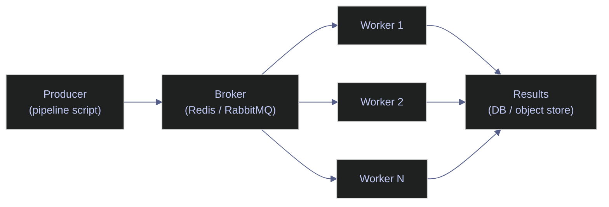

# 13. Advanced Parallel Pipelines - Python

> [!quote]
> "The combination of threads, remote-procedure-call interfaces, and heavyweight object-oriented design is especially dangerous. If you are ever invited onto a project that is supposed to feature all three, fleeing in terror might well be an appropriate reaction."
>
> — **Eric S. Raymond**, *The Art of Unix Programming* (2003)

> [!danger] Secrets Management
>
> Load API keys from `.env` for local development. In production, use GCP Secret Manager, AWS Secrets Manager, or Azure Key Vault. NEVER commit `.env` to git.

> [!success] Safe secrets pattern
>
> - Use `python-dotenv` with a `.env` file locally; add `.env` to `.gitignore` before the first commit
> - In production (GCP), read secrets at runtime via `google-cloud-secret-manager` — never bake them into images or config files
> - Rotate keys in the secret manager without touching code; inject via `os.environ` or a dedicated secrets-loader function

This note covers advanced parallel pipeline patterns — async generators for paginated APIs, rate-limited parallel ingestion, async batching, cross-process execution with `subprocess`, and distributed task queue architecture. Every concept is paired with its C# equivalent in [[13-cs-advancedpipelines]].

### Key terms used in this note

| Term | Plain-English definition | Why it matters here | Common mistake / confusion |
|---|---|---|---|
| **async generator** | `async def` with `yield` — produces values lazily and asynchronously, one at a time. | Stream paginated API responses without loading all pages into memory. | Must use `async for` to consume, not regular `for`. |
| **asyncio.Semaphore** | Limits concurrent async operations. `Semaphore(5)` allows 5 concurrent tasks. | Rate-limit API calls to avoid 429 (Too Many Requests) errors. | Not thread-safe — use only within a single event loop. |
| **asyncio.gather** | Runs multiple coroutines concurrently, returns all results when complete. | Fan-out: fetch N API pages or symbols in parallel. | One failure cancels all by default — use `return_exceptions=True` for resilience. |
| **aiohttp** | Async HTTP client library for Python. Uses connection pooling and keep-alive. | High-throughput API ingestion without blocking. | Must manage `ClientSession` lifecycle — create once, reuse, close at end. |
| **subprocess** | Module for launching external processes. `subprocess.run()` for sync, `asyncio.create_subprocess_exec()` for async. | Call CLI tools, shell scripts, or other language runtimes from Python. | Shell injection risk with `shell=True` — use argument lists instead. |
| **Celery** | Distributed task queue using a message broker (Redis, RabbitMQ). | Scale beyond a single machine — dispatch tasks to a pool of workers. | Requires a running broker and worker process — not an in-process library. |

### What this note covers

- **Async Generators** — paginated API streaming with `async for`
- **Parallel API Ingestion** — rate-limited concurrent fetches with `asyncio.Semaphore`
- **Async Batching** — accumulate results into batches for bulk writes
- **Cross-Process Execution** — `subprocess.run()` and async subprocess for external tools
- **Distributed Task Queues** — Celery/RQ architecture overview, scaling ladder

```python
import asyncio
import time
import os
import json
import subprocess
from dataclasses import dataclass
from concurrent.futures import ThreadPoolExecutor
import aiohttp
from dotenv import load_dotenv

load_dotenv()

TWELVE_DATA_KEY = os.environ.get('TWELVE_DATA_KEY', '')
FRED_KEY = os.environ.get('FRED_KEY', '')
FINNHUB_KEY = os.environ.get('FINNHUB_KEY', '')

"set" if TWELVE_DATA_KEY else "MISSING"
"set" if FRED_KEY else "MISSING"
"set" if FINNHUB_KEY else "MISSING"
```

```text
TWELVE_DATA_KEY: set
FRED_KEY:        set
FINNHUB_KEY:     set
```

## Async Generators with Real APIs

> [!info] Python vs C# pipeline frameworks
>
> C# has `TPL Dataflow` — a built-in library of composable blocks (`TransformBlock`, `ActionBlock`, `BatchBlock`) with per-stage concurrency control and automatic backpressure. Python has no equivalent built-in. Instead, Python pipelines are assembled from `asyncio.Queue` chains, async generators, and manual batching. For production-grade orchestration, use Airflow, Prefect, or Dagster.

### Paginated API streaming

#### Paginated FRED API with async for

Many REST APIs return results in pages (100 items per response with a `next_page` token). An async generator fetches each page, yields individual items, and follows pagination links — providing a clean `async for item in paginate(url)` interface that hides the pagination complexity.

```python
async def fetch_fred_series(search_text: str, limit: int = 10, page_size: int = 5):
    """Async generator — yields (id, title) tuples from FRED series search."""
    offset = 0
    yielded = 0
    async with aiohttp.ClientSession() as session:
        while yielded < limit:
            url = (f'https://api.stlouisfed.org/fred/series/search'
                   f'?search_text={search_text}&api_key={FRED_KEY}'
                   f'&file_type=json&limit={page_size}&offset={offset}')
            async with session.get(url) as resp:
                data = await resp.json()
            series = data.get('seriess', [])
            if not series:
                break
            for s in series:
                if yielded >= limit:
                    break
                yield (s['id'], s['title'])
                yielded += 1
            offset += page_size

async for series_id, title in fetch_fred_series('inflation', limit=8):
    print(f'    {series_id:20} {title[:50]}')
```

```text
FRED series matching "inflation":
  DFII10               Market Yield on U.S. Treasury Securities at 10-Yea
  FII10                Market Yield on U.S. Treasury Securities at 10-Yea
  WFII10               Market Yield on U.S. Treasury Securities at 10-Yea
  RIFLGFCY10XIINA      Market Yield on U.S. Treasury Securities at 10-Yea
  T10YIE               10-Year Breakeven Inflation Rate
  T10YIEM              10-Year Breakeven Inflation Rate
  FPCPITOTLZGUSA       Inflation, consumer prices for the United States
  CPIAUCSL             Consumer Price Index for All Urban Consumers: All
```

## Parallel API Ingestion

> [!danger] asyncio.gather() without a semaphore fires
>
> `asyncio.gather()` without a semaphore fires ALL requests simultaneously
> For 50 symbols, `gather(*[fetch(s) for s in symbols])` opens 50 connections at once.
> Most financial data APIs have strict rate limits (Twelve Data: 8/min, Alpha Vantage:
> 5/min). Without a semaphore, every request after the limit returns `429 Too Many
> Requests` — and your pipeline processes empty/error responses as valid data.

> [!success] Always gate gather() with a Semaphore
>
> - Wrap the fetch coroutine in `async with semaphore:` to cap concurrent requests (e.g., `asyncio.Semaphore(3)` for Twelve Data free tier)
> - Check `resp.status` for 429 inside the coroutine and raise so gather reports the error instead of silently returning empty data
> - For strict rate limits (requests-per-minute), combine the semaphore with `asyncio.sleep` between batches

### Rate-limited parallel fetch

#### asyncio.Semaphore + aiohttp — parallel fetch with rate limiting

Combines rate limiting (semaphore) with async HTTP (aiohttp) for parallel API fetches that respect rate limits. The semaphore caps concurrent requests; aiohttp reuses connections via a session pool. This is the standard pattern for fetching data from rate-limited financial APIs.

```python
SYMBOLS = ['SAP', 'ASML', 'TTE', 'UL', 'DEO', 'SNY', 'NVS', 'AZN']

async def fetch_price(session, symbol, semaphore):
    """Fetch a single stock price with rate limiting."""
    async with semaphore:
        url = f'https://api.twelvedata.com/price?symbol={symbol}&apikey={TWELVE_DATA_KEY}'
        async with session.get(url) as resp:
            data = await resp.json()
            price = float(data.get('price', 0))
            return (symbol, price)

start = time.perf_counter()
sem = asyncio.Semaphore(3)

async with aiohttp.ClientSession() as session:
    tasks = [fetch_price(session, sym, sem) for sym in SYMBOLS]
    results = await asyncio.gather(*tasks)

elapsed = time.perf_counter() - start
for symbol, price in results:
    print(f'  {symbol:6} €{price:>8.2f}')
print(f"Fetched {len(results)} quotes in {elapsed:.2f}s (3 concurrent max)")
```

```text
SAP    €  171.05
ASML   € 1399.48
TTE    €   88.81
UL     €   60.65
DEO    €   72.47
SNY    €   45.13
NVS    €  148.64
AZN    €  185.84

Fetched 8 quotes in 0.65s (3 concurrent max)
```

### Completion-order processing

#### asyncio.as_completed with real API

Returns an iterator of futures that yields results in completion order (fastest first), not submission order. Use when you want to process results as they arrive rather than waiting for all to finish.

> [!info] as_completed — Fastest First
>
> Wraps coroutines and yields futures in completion order, not submission order. The fastest API response is processed first, even if submitted last. Use when you want to start processing results immediately rather than waiting for all.

```python
async def fetch_quote_fh(session, symbol):
    """Fetch a quote from Finnhub — returns current price and percent change."""
    url = f'https://finnhub.io/api/v1/quote?symbol={symbol}&token={FINNHUB_KEY}'
    start = time.perf_counter()
    async with session.get(url) as resp:
        data = await resp.json()
    elapsed = time.perf_counter() - start
    price = data.get('c', 0)
    change = data.get('dp', 0)
    return (symbol, price, change, elapsed)

async with aiohttp.ClientSession() as session:
    coros = [fetch_quote_fh(session, s) for s in ['SAP', 'ASML', 'TTE', 'UL']]
    for coro in asyncio.as_completed(coros):
        symbol, price, change, elapsed = await coro
        print(f'    {symbol:6} €{price:>8.2f}  {change:+.2f}%  ({elapsed:.3f}s)')
```

```text
Results in completion order (fastest first):
  TTE    €   88.79  -0.39%  (0.186s)
  ASML   € 1399.42  +2.18%  (0.190s)
  UL     €   60.62  -0.74%  (0.190s)
  SAP    €  171.00  -4.02%  (0.191s)
```

## Async Batching

### Time and count bounded batching

#### Async batching — flush by count or timeout

Combines an async queue with a batch consumer: producers push individual items to the queue, a consumer drains N items at a time and processes them as a batch. Provides backpressure (bounded queue) and efficient batched I/O.

```python
async def batch_consumer(queue: asyncio.Queue, max_size: int = 3, max_wait: float = 0.5):
    """Consume items from queue, flush when batch is full or timeout expires."""
    batch = []
    while True:
        try:
            item = await asyncio.wait_for(queue.get(), timeout=max_wait)
            if item is None:
                break
            batch.append(item)
            if len(batch) >= max_size:
                print(f'  Flush (size={len(batch)}): {batch}')
                batch = []
        except asyncio.TimeoutError:
            if batch:
                print(f'  Flush (time={len(batch)}): {batch}')
                batch = []
    if batch:
        print(f'  Flush (final={len(batch)}): {batch}')

q = asyncio.Queue()
consumer_task = asyncio.create_task(batch_consumer(q, max_size=3, max_wait=0.5))

for i in range(7):
    await q.put(f'item_{i}')
    await asyncio.sleep(0.1 if i < 5 else 0.8)

await q.put(None)
await consumer_task
```

```text
Flush (size=3): ['item_0', 'item_1', 'item_2']
Flush (size=3): ['item_3', 'item_4', 'item_5']
Flush (time=1): ['item_6']
```

## Cross-Process Execution

### subprocess — spawn and capture output

#### subprocess — spawn external programs

The `subprocess` module spawns external programs from Python. `subprocess.run()` is the simple synchronous API; `asyncio.create_subprocess_exec()` is the async version. Use for invoking CLI tools (gcloud, bq, sqlcmd) from pipeline scripts.

> [!danger] subprocess with shell=True
>
> `subprocess.run(cmd, shell=True)` passes the command through a shell, enabling command injection if `cmd` contains user input. Always use `shell=False` (default) with a list of arguments: `subprocess.run(["gcloud", "compute", "instances", "list"])`.

> [!success] Use shell=False with a list of arguments
>
> - Always pass commands as a list: `subprocess.run(["gcloud", "compute", "instances", "list"])` — each element is a separate token, never shell-interpreted
> - Pass secrets via environment variables (`env={"MY_SECRET": value}`) rather than as command arguments, which are visible in `ps` output
> - Set `timeout=` on every `subprocess.run()` call to prevent hung child processes from blocking the pipeline

```python
result = subprocess.run(
    ["python", "-c", "import json, os; print(json.dumps({'pid': os.getpid(), 'result': sum(range(1000))}))"],
    capture_output=True, text=True, timeout=10,
)
parsed = json.loads(result.stdout)
print(f'Child PID: {parsed["pid"]}, result: {parsed["result"]}')

def run_expr(expr: str) -> tuple:
    r = subprocess.run(["python", "-c", f"print({expr})"], capture_output=True, text=True)
    return (expr, r.stdout.strip())

exprs = ['2**20', 'sum(range(10000))', '3.14159 * 100']
with ThreadPoolExecutor(max_workers=3) as pool:
    results = list(pool.map(run_expr, exprs))
for expr, val in results:
    print(f'  {expr:25} = {val}')
```

```text
Child PID: 31988, result: 499500
  2**20                     = 1048576
  sum(range(10000))         = 49995000
  3.14159 * 100             = 314.159
```

## Distributed Task Queues — Architecture Overview

### Architecture and evolution

A broker (Redis/RabbitMQ) distributes tasks to workers on multiple machines. Workers pull tasks from the queue, execute them, and report results. This is the standard architecture for production data engineering at scale.



| Framework | Description | Use for |
|---|---|---|
| **Celery** | Most popular distributed task queue. Workers subscribe to a broker. | ETL jobs, API ingestion, scheduled pipeline triggers |
| **Redis Queue (RQ)** | Simpler alternative to Celery. Less config. | Small/medium workloads |
| **Dask** | Parallel computing, scales from laptop to cluster. Integrates with pandas/numpy. | Large DataFrame processing, ML pipelines |

#### Evolution path — from single process to distributed

Each step adds a layer of scalability. Start with the simplest model that meets your throughput requirements and scale up only when needed.

1. `asyncio.gather` → single process, concurrent I/O
2. `ProcessPoolExecutor` → single machine, multiple cores
3. Celery/RQ → multiple machines, distributed workers
4. Dask/Spark → distributed data processing at scale

> [!guide] Celery example (requires Redis +
>
> Celery example (requires Redis + worker process)
> ```python
> from celery import Celery
> app = Celery("tasks", broker="redis://localhost:6379/0")
>
> @app.task
> def fetch_and_store(symbol):
>     data = requests.get(f"api/{symbol}").json()
>     db.insert(data)
>
> # Dispatch 100 tasks — workers pick them up from Redis:
> for sym in symbols:
>     fetch_and_store.delay(sym)  # sends to broker, returns immediately
> ```

## Warnings

> [!warning] No rate limiting causes API bans
>
> Launching hundreds of concurrent requests without a semaphore triggers rate limits (HTTP 429) or IP bans from the API provider.

> [!success] Correct pattern
>
> Use `asyncio.Semaphore(n)` to cap concurrency. Start with n=5–10 and tune based on the API's rate limit headers.

> [!warning] `shell=True` in subprocess enables shell injection
>
> `subprocess.run(f"curl {user_input}", shell=True)` allows arbitrary command execution if `user_input` is untrusted.

> [!success] Correct pattern
>
> Use argument lists: `subprocess.run(["curl", url])`. Never interpolate user input into shell strings.

## Recommendations

- **Start with the simplest concurrency model** — `asyncio.gather` first, then `ProcessPoolExecutor`, then Celery only when you outgrow a single machine.
- **Use `asyncio.Semaphore` for all external API calls** — prevents rate limiting and protects downstream services.
- **Use async generators for paginated APIs** — memory-efficient streaming without loading all pages at once.
- **Batch writes for bulk database inserts** — accumulate records and flush in configurable batch sizes.
- **Use `subprocess` argument lists, not shell strings** — prevents injection and works cross-platform.

## Troubleshooting

| Problem | Cause | Fix |
|---|---|---|
| HTTP 429 Too Many Requests | Too many concurrent requests | Add `asyncio.Semaphore(n)` to limit concurrency |
| `aiohttp.ClientSession` closed prematurely | Session created per-request instead of shared | Create one session with `async with aiohttp.ClientSession()` for the entire batch |
| Subprocess hangs indefinitely | Child process waiting for stdin or producing too much output | Use `timeout=` parameter; pipe and read stdout/stderr |
| Celery task silently disappears | Broker connection lost or worker crashed | Monitor with Flower; configure task retries and dead-letter queues |

## Cross-References

- **C# equivalent** — [[13-cs-advancedpipelines]] covers TPL Dataflow, Channel-based batching, IAsyncEnumerable, cross-process execution
- **Async fundamentals** — [[12-py-asyncconcurrency]] covers `asyncio`, `async`/`await`, `concurrent.futures`
- **Web APIs** — [[15-py-webapis]] covers HTTP client patterns and API consumption
- **Error handling** — [[08-py-errorhandling]] covers retry patterns and error accumulation
