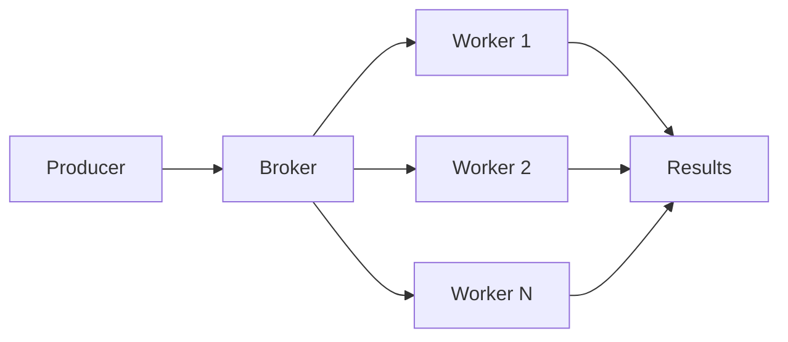

# 13. Advanced Parallel Pipelines - Python

> [!quote]+
>
> "The combination of threads, remote-procedure-call interfaces, and heavyweight object-oriented design is especially dangerous. If you are ever invited onto a project that is supposed to feature all three, fleeing in terror might well be an appropriate reaction."
>
> -- **Eric S. Raymond**, *The Art of Unix Programming* (2003)

> [!abstract]- Summary
>
> - **Async generators** let `async for` pull page-sized work as a stream instead of materializing the full result set first.
> - **Parallel ingestion** should combine `asyncio.gather()` or `asyncio.as_completed()` with `asyncio.Semaphore()` so remote fan-out stays inside an explicit concurrency budget.
> - **Async batching** uses `asyncio.Queue` plus count-or-time flushing to decouple ingestion speed from bulk-write speed.
> - **Cross-process execution** should use `subprocess.run()` for blocking child processes, `asyncio.create_subprocess_exec()` inside event loops, and `sys.executable` when Python spawns Python.
> - **Distributed queues** move the broker boundary out of process; `Celery`, `RQ`, and `Dask` become relevant only after one host or one event loop stops fitting the workload.
> - **Secrets** belong in `.env` for local development and in a secret manager for production; never pass them as shell-interpreted strings or commit them to Git.

> [!note]- Glossary
>
> **async generator**
> - An `async def` function that contains `yield`, producing values lazily without blocking the event loop.
> - Consume it with `async for`, not a regular `for`, because the returned object is an asynchronous iterator.
>
> **asyncio.Semaphore**
> - A counter-based guard that limits how many coroutines can enter a block concurrently.
> - Tune `asyncio.Semaphore(n)` from observed `429` responses, queue depth, and latency instead of hard-coding stale vendor folklore.
>
> **asyncio.gather**
> - Schedules multiple awaitables concurrently and returns results in submission order.
> - One unhandled exception cancels remaining tasks unless `return_exceptions=True` is set.
>
> **aiohttp**
> - An async HTTP client and server library built on `asyncio`.
> - Reuse one `ClientSession` per pipeline run so connection pooling and keep-alive remain effective.
>
> **asyncio.as_completed**
> - Returns futures in completion order instead of submission order.
> - Use it when downstream processing should start as soon as the fastest response finishes.
>
> **asyncio.Queue**
> - An async FIFO queue for producer and consumer stages inside one event loop.
> - `asyncio.Queue` is not thread-safe; cross-thread handoff needs thread-safe queues or `loop.call_soon_threadsafe()`.
>
> **asyncio.wait_for**
> - Wraps an awaitable with a wall-clock timeout and cancels it when the deadline expires.
> - It is the standard way to flush a partial batch after `max_wait` seconds instead of waiting forever for the next item.
>
> **subprocess**
> - The standard-library API for spawning child processes and collecting stdout, stderr, and exit codes.
> - Keep `shell=False` and pass argument lists so data stays data instead of turning into shell syntax.
>
> **asyncio.create_subprocess_exec**
> - The non-blocking subprocess API for event-loop code.
> - Prefer it when a child process runs alongside other coroutines and `subprocess.run()` would stall the loop.
>
> **ThreadPoolExecutor**
> - A pool of OS threads for I/O-bound work or blocking wrappers such as `subprocess.run()`.
> - It does not remove the GIL for CPU-bound Python code; use `ProcessPoolExecutor` for CPU saturation.
>
> **python-dotenv**
> - A package that loads `.env` key-value pairs into `os.environ`.
> - It is appropriate for local development only; production pipelines should read secrets from a secret manager at runtime.
>
> **Celery**
> - A distributed task queue that dispatches work through Redis or RabbitMQ to one or more worker processes or hosts.
> - Use it when job execution must survive process boundaries, be retried, and be monitored independently of the producer.
>
> **Redis Queue (RQ)**
> - A simpler Redis-only job queue with fewer routing and workflow features than `Celery`.
> - It fits smaller systems that need background workers without Celery's orchestration surface area.
>
> **Dask**
> - A task-graph and distributed-compute framework for array, DataFrame, and ML workloads.
> - It becomes relevant after single-host executors stop fitting the memory, CPU, or scheduling boundary.

## Secret Handling

Use `python-dotenv` to load local `.env` files, but treat `.env` as a development convenience instead of a deployment artifact. In production, inject secrets from a managed service such as GCP Secret Manager, AWS Secrets Manager, or Azure Key Vault. Keep `.env` out of Git, avoid putting secrets on the command line, and rotate credentials from the secret store instead of rebuilding images.

## Async Generators

### Page-oriented streaming

An async generator is the simplest way to hide page tokens, offsets, or chunk boundaries behind a uniform `async for` interface. The caller sees records, not pagination mechanics.

*This async generator emits page metadata and individual records without building the full result set in memory first.*
```python
import asyncio

PAGES = [
    [("SAP", 171.05), ("ASML", 1399.48)],
    [("TTE", 88.81), ("UL", 60.65)],
]


async def stream_pages(pages):
    for page_no, page in enumerate(pages, start=1):
        await asyncio.sleep(0.01)
        for symbol, price in page:
            yield page_no, symbol, price


async def main():
    async for page_no, symbol, price in stream_pages(PAGES):
        print(f"page={page_no} symbol={symbol} price={price:.2f}")


asyncio.run(main())
```
```text
page=1 symbol=SAP price=171.05
page=1 symbol=ASML price=1399.48
page=2 symbol=TTE price=88.81
page=2 symbol=UL price=60.65
```

## Parallel API Ingestion

These examples use deterministic local coroutines so the output stays exact. In production, replace the coroutine body with `aiohttp`, an SDK call, or another remote I/O operation while keeping the same concurrency structure.

### `asyncio.gather()` plus `asyncio.Semaphore()`

`asyncio.gather()` preserves submission order. Wrap each remote call in `async with semaphore:` so the live connection count stays explicit and observable.

*This fan-out example keeps result order stable while recording the peak number of concurrent in-flight tasks.*
```python
import asyncio

QUOTES = {
    "SAP": (171.05, 0.04),
    "ASML": (1399.48, 0.01),
    "TTE": (88.81, 0.03),
    "UL": (60.65, 0.02),
}


async def fetch_quote(symbol, sem, state):
    async with sem:
        state["active"] += 1
        state["peak"] = max(state["peak"], state["active"])
        price, delay = QUOTES[symbol]
        await asyncio.sleep(delay)
        state["active"] -= 1
        return symbol, price, delay


async def main():
    sem = asyncio.Semaphore(2)
    state = {"active": 0, "peak": 0}
    results = await asyncio.gather(*(fetch_quote(symbol, sem, state) for symbol in QUOTES))
    for symbol, price, delay in results:
        print(f"{symbol}: price={price:.2f} delay={delay:.2f}s")
    print(f"peak_concurrency={state['peak']}")


asyncio.run(main())
```
```text
SAP: price=171.05 delay=0.04s
ASML: price=1399.48 delay=0.01s
TTE: price=88.81 delay=0.03s
UL: price=60.65 delay=0.02s
peak_concurrency=2
```

### `asyncio.as_completed()` for completion-order work

`asyncio.as_completed()` is better when downstream work should start as soon as the fastest response lands. That is the right shape for streaming dashboards, low-latency enrichers, or early-fail validation.

*This completion-order example processes the fastest result first instead of waiting for the slowest input position.*
```python
import asyncio

QUOTES = {
    "SAP": (171.05, 0.04),
    "ASML": (1399.48, 0.01),
    "TTE": (88.81, 0.03),
    "UL": (60.65, 0.02),
}


async def fetch_quote(symbol):
    price, delay = QUOTES[symbol]
    await asyncio.sleep(delay)
    return symbol, price, delay


async def main():
    for task in asyncio.as_completed([fetch_quote(symbol) for symbol in QUOTES]):
        symbol, price, delay = await task
        print(f"{symbol}: price={price:.2f} delay={delay:.2f}s")


asyncio.run(main())
```
```text
ASML: price=1399.48 delay=0.01s
UL: price=60.65 delay=0.02s
TTE: price=88.81 delay=0.03s
SAP: price=171.05 delay=0.04s
```

## Async Batching

### Count-or-time flush

Batch writers usually need two boundaries: `max_size` for throughput and `max_wait` for tail latency. `asyncio.wait_for()` gives the consumer both.

*This queue consumer flushes on either a full batch or a timeout so the writer stays bounded even when producers slow down.*
```python
import asyncio


async def batch_consumer(queue, max_size=3, max_wait=0.05):
    batch = []
    while True:
        try:
            item = await asyncio.wait_for(queue.get(), timeout=max_wait)
        except asyncio.TimeoutError:
            if batch:
                print(f"flush timeout -> {batch}")
                batch = []
            continue
        if item is None:
            if batch:
                print(f"flush final -> {batch}")
            queue.task_done()
            return
        batch.append(item)
        queue.task_done()
        if len(batch) >= max_size:
            print(f"flush size -> {batch}")
            batch = []


async def main():
    queue = asyncio.Queue(maxsize=4)
    consumer = asyncio.create_task(batch_consumer(queue))
    delays = [0.00, 0.00, 0.00, 0.08, 0.00, 0.08]
    for index, delay in enumerate(delays, start=1):
        await asyncio.sleep(delay)
        await queue.put(f"item_{index}")
    await queue.put(None)
    await consumer


asyncio.run(main())
```
```text
flush size -> ['item_1', 'item_2', 'item_3']
flush timeout -> ['item_4', 'item_5']
flush final -> ['item_6']
```

## Cross-Process Execution

### `subprocess.run()` with `ThreadPoolExecutor`

Use `subprocess.run()` for blocking child processes, and keep Python child launches pinned to `sys.executable` so the parent and child use the same interpreter and installed packages. `ThreadPoolExecutor` is enough when the threads mostly wait on child processes.

*This subprocess example captures JSON from one child process and evaluates several expressions in parallel with the same parent interpreter.*
```python
import json
import subprocess
import sys
from concurrent.futures import ThreadPoolExecutor

result = subprocess.run(
    [
        sys.executable,
        "-c",
        "import json, os; print(json.dumps({'pid': os.getpid(), 'result': sum(range(10))}))",
    ],
    capture_output=True,
    text=True,
    timeout=5,
    check=True,
)
parsed = json.loads(result.stdout)
print(f"child_pid={parsed['pid']}")
print(f"range_sum={parsed['result']}")


def run_expr(expr):
    completed = subprocess.run(
        [sys.executable, "-c", f"print({expr})"],
        capture_output=True,
        text=True,
        timeout=5,
        check=True,
    )
    return expr, completed.stdout.strip()


with ThreadPoolExecutor(max_workers=3) as pool:
    for expr, value in pool.map(run_expr, ["2**10", "sum(range(100))", "round(3.14159, 3)"]):
        print(f"{expr}={value}")
```
```text
child_pid=39068
range_sum=45
2**10=1024
sum(range(100))=4950
round(3.14159, 3)=3.142
```

Inside long-running coroutines, switch to `asyncio.create_subprocess_exec()` so the event loop can keep serving timers, queues, and heartbeats while the child process runs.

## Distributed Task Queues

### Broker and worker architecture

Distributed queues move the scheduling boundary out of process. Producers push job metadata to a broker, workers pull and acknowledge jobs, and results land in a database, cache, or object store.

*This architecture diagram shows the producer, broker, workers, and result sink that distributed queue systems separate across processes or hosts.*


| Framework | Primary boundary | Use it when |
| --- | --- | --- |
| `Celery` | Broker-backed job dispatch across workers or hosts | Tasks need retries, routing, and external worker lifecycle management |
| `RQ` | Simpler Redis-backed background jobs | One Redis broker is enough and advanced routing is unnecessary |
| `Dask` | Distributed task graphs for array, DataFrame, and ML workloads | Scheduling and memory must scale past one host or one process pool |

#### Evolution path from `asyncio` to `Dask`

Promote the architecture only when the failure boundary changes:

1. `asyncio.gather()` for concurrent I/O in one process
2. `ProcessPoolExecutor` for CPU-bound work on one host
3. `Celery` or `RQ` for cross-process and cross-host worker fleets
4. `Dask` for distributed compute graphs and memory scaling

### Local broker simulation

This local simulation keeps the queue mechanics visible without requiring Redis, RabbitMQ, or a separate worker supervisor. The shape is the same one `Celery` or `RQ` would enforce across processes.

*This broker simulation retries one job once and records which worker acknowledged each attempt.*
```python
from collections import deque

broker = deque([
    {"symbol": "SAP", "attempt": 1},
    {"symbol": "ASML", "attempt": 1},
    {"symbol": "TTE", "attempt": 1},
])
retried = False
worker_cycle = ["worker-1", "worker-2"]
turn = 0

while broker:
    worker = worker_cycle[turn % len(worker_cycle)]
    turn += 1
    job = broker.popleft()
    symbol = job["symbol"]
    attempt = job["attempt"]
    if symbol == "ASML" and not retried:
        retried = True
        print(f"{worker} retry {symbol} attempt={attempt}")
        broker.append({"symbol": symbol, "attempt": attempt + 1})
        continue
    print(f"{worker} ack {symbol} attempt={attempt}")
```
```text
worker-1 ack SAP attempt=1
worker-2 retry ASML attempt=1
worker-1 ack TTE attempt=1
worker-2 ack ASML attempt=2
```

## Operational Risks

### Failure boundaries that need explicit control

#### Ungated `asyncio.gather()` overloads remote services

If every task enters the remote call path immediately, the producer can exceed the service boundary before any response comes back. That is how `429` spikes, connection pool exhaustion, and meaningless partial batches start.

*This fan-out shows four requests entering a fake API with capacity for only two active calls.*
```python
import asyncio


class FakeAPI:
    def __init__(self, limit):
        self.limit = limit
        self.active = 0

    async def call(self, name):
        self.active += 1
        over_limit = self.active > self.limit
        await asyncio.sleep(0.01)
        self.active -= 1
        return f"{name}:{429 if over_limit else 200}"


async def main():
    api = FakeAPI(limit=2)
    results = await asyncio.gather(*(api.call(name) for name in ["job-1", "job-2", "job-3", "job-4"]))
    for line in results:
        print(line)


asyncio.run(main())
```
```text
job-1:200
job-2:200
job-3:429
job-4:429
```

#### `shell=True` converts data into shell syntax

Once user-controlled data is interpolated into a shell string, metacharacters stop being payload and start being instructions. Keep `shell=False` and pass argument lists so the child process sees one literal argument.

*This snippet contrasts an unsafe shell string with a safe argument list that preserves the same payload as data.*
```python
user_value = "AAPL && whoami"
unsafe = f"curl {user_value}"
safe = ["curl", user_value]
print(f"unsafe={unsafe}")
print(f"safe={safe}")
```
```text
unsafe=curl AAPL && whoami
safe=['curl', 'AAPL && whoami']
```

## Recommended Patterns

### Composition rules that scale cleanly

#### Keep `asyncio.Queue` between bursty producers and batched writers

A bounded `asyncio.Queue` makes backpressure visible. It prevents a fast producer from silently buffering an unbounded number of pages while the batch writer waits on I/O.

*This queue snapshot shows a bounded buffer filling to `maxsize` and then shrinking after one drain operation.*
```python
import asyncio


async def main():
    queue = asyncio.Queue(maxsize=2)
    await queue.put("page-1")
    await queue.put("page-2")
    print(f"buffered={queue.qsize()}")
    item = await queue.get()
    print(f"drained={item}")
    print(f"buffered={queue.qsize()}")


asyncio.run(main())
```
```text
buffered=2
drained=page-1
buffered=1
```

#### Use `sys.executable` when Python spawns Python

`sys.executable` keeps child processes on the same interpreter path, virtual environment, and installed dependency set as the parent. That matters for notes, tests, and production jobs equally.

*This subprocess confirms that the child interpreter path exactly matches the parent interpreter path.*
```python
import subprocess
import sys

completed = subprocess.run(
    [sys.executable, "-c", "import sys; print(sys.executable)"],
    capture_output=True,
    text=True,
    check=True,
)
print(f"child_matches_parent={completed.stdout.strip() == sys.executable}")
```
```text
child_matches_parent=True
```

#### Promote to `Celery` or `Dask` only after `ProcessPoolExecutor` stops fitting

The right upgrade path depends on the execution boundary. Choose a new tool only when the workload crosses from one host to many hosts or from local batches to distributed compute graphs.

*This decision table maps workload boundaries to the smallest concurrency primitive that still fits them.*
```python
cases = [
    ("http_fanout", "single host", "asyncio.gather + Semaphore"),
    ("cpu_bound", "single host", "ProcessPoolExecutor"),
    ("cross_host_queue", "multiple hosts", "Celery or RQ"),
    ("columnar_analytics", "cluster", "Dask"),
]
for workload, boundary, tool in cases:
    print(f"{workload}: boundary={boundary} tool={tool}")
```
```text
http_fanout: boundary=single host tool=asyncio.gather + Semaphore
cpu_bound: boundary=single host tool=ProcessPoolExecutor
cross_host_queue: boundary=multiple hosts tool=Celery or RQ
columnar_analytics: boundary=cluster tool=Dask
```

## Troubleshooting Scenarios

### Common failure signatures

#### Repeated `429` responses mean the `Semaphore` is too wide or missing

If a provider starts returning `429`, the first question is whether the request fan-out matches the advertised concurrency or credit budget. Reduce the `Semaphore` width before adding retries.

*This comparison shows the same fake API both without a semaphore and with a semaphore that matches its capacity.*
```python
import asyncio


class FakeAPI:
    def __init__(self, limit):
        self.limit = limit
        self.active = 0

    async def call(self, name, sem=None):
        if sem is None:
            return await self._call(name)
        async with sem:
            return await self._call(name)

    async def _call(self, name):
        self.active += 1
        over_limit = self.active > self.limit
        await asyncio.sleep(0.01)
        self.active -= 1
        return f"{name}:{429 if over_limit else 200}"


async def run(use_sem):
    api = FakeAPI(limit=2)
    sem = asyncio.Semaphore(2) if use_sem else None
    results = await asyncio.gather(*(api.call(name, sem) for name in ["job-1", "job-2", "job-3", "job-4"]))
    return results


async def main():
    print("without_sem=" + ",".join(await run(False)))
    print("with_sem=" + ",".join(await run(True)))


asyncio.run(main())
```
```text
without_sem=job-1:200,job-2:200,job-3:429,job-4:429
with_sem=job-1:200,job-2:200,job-3:200,job-4:200
```

#### A closed `ClientSession` usually means the session lifetime ended too early

An `aiohttp.ClientSession` should be created once for the batch and closed after all tasks finish. If the session closes first, every later fetch fails at the boundary, not in the business logic.

*This minimal session object reproduces the same failure signature a prematurely closed HTTP session would raise.*
```python
import asyncio


class FakeSession:
    def __init__(self):
        self.closed = False

    async def get(self, symbol):
        if self.closed:
            raise RuntimeError("session closed")
        await asyncio.sleep(0)
        return f"ok:{symbol}"


async def main():
    session = FakeSession()
    session.closed = True
    try:
        await session.get("SAP")
    except RuntimeError as exc:
        print(exc)


asyncio.run(main())
```
```text
session closed
```

#### Hung child processes need `timeout=` and error paths

If a child process stops making progress, the parent pipeline should fail the stage explicitly instead of blocking forever. `timeout=` turns a hidden hang into an observable failure boundary.

*This subprocess sleeps longer than the allowed timeout so the parent can surface a deterministic failure instead of hanging indefinitely.*
```python
import subprocess
import sys

try:
    subprocess.run(
        [sys.executable, "-c", "import time; time.sleep(1)"],
        timeout=0.05,
        check=True,
    )
except subprocess.TimeoutExpired as exc:
    print(f"timed_out_after={exc.timeout:.2f}s")
```
```text
timed_out_after=0.05s
```
