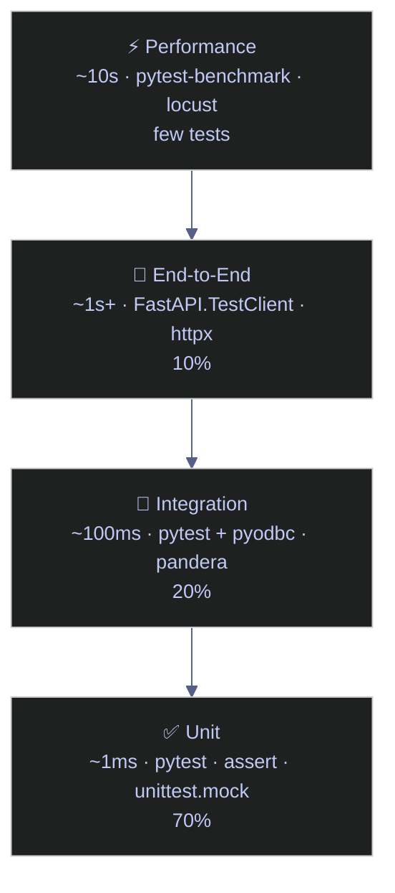

# 14. Testing - Python

> [!quote]
> "Legacy code is simply code without tests."
>
> — **Michael Feathers**, *Working Effectively with Legacy Code* (2004)
>
> "Write tests until fear is transformed into boredom."
>
> — **Kent Beck**, *Test-Driven Development: By Example*

> [!abstract]- Summary
>
> **Testing Philosophy**
> - Testing pyramid: 70% unit (~1 ms, `pytest`/`assert`/`unittest.mock`) → 20% integration (~100 ms, `pyodbc`/`pandera`) → 10% E2E (~1 s+, `FastAPI.TestClient`). Unit tests run on every commit; integration tests on every PR; E2E on deploy.
> - TDD cycle: write a failing test first, then write the minimum code to pass it, then refactor.
>
> **Unit Testing with pytest**
> - Auto-discovery: files `test_*.py` or `*_test.py`, functions `test_*`. No base class needed.
> - Plain `assert` is rewritten by pytest for rich diffs. `ipytest` enables interactive pytest in notebooks.
>
> **Assertions and Test Organization**
> - Numeric: `pytest.approx` for float tolerance (default 1e-6 relative); essential for financial calculations.
> - Collections: `in`, `.issubset()`, `all(...)` for membership and completeness checks.
> - Strings: `len()`, `.isalpha()`, `re.match()` for structured identifiers (ISIN, ticker, log format).
> - Types/None: `isinstance()` catches API type mismatches; `is None` avoids falsy-value confusion.
>
> **Fixtures and Parametrize**
> - `@pytest.fixture` provides reusable setup; `yield` adds guaranteed teardown even on failure.
> - `scope`: `"function"` (default, fresh per test), `"module"`, `"session"` (shared, use for immutable data only).
> - `conftest.py` auto-discovered; fixtures in it are available to all tests below without imports.
> - `@pytest.mark.parametrize` runs one test function per row of input data; use `ids=` for readable names.
>
> **Mocking and Patching**
> - `Mock()` / `MagicMock()` from `unittest.mock`; configure with `.return_value` or `.side_effect`.
> - `patch()` replaces the target where it is **used**, not where it is defined.
> - `Mock(spec=RealClass)` prevents typos from silently passing; always prefer spec.
> - `@patch.dict(os.environ, {...}, clear=True)` isolates env-var-dependent tests.
> - Dependency injection (accepting `now=None`) eliminates need for `@patch` on datetime/clock code.
>
> **Test Patterns for Data Engineering**
> - Pure function tests (e.g., `normalize_trades`): no mocks, fastest, most valuable.
> - `validate_eod_prices`: OHLCV invariants (`close > 0`, `high >= low`, `volume >= 0`, daily return < 20%).
> - `Mock(spec=MarketDataClient)`: spec-bound mock for external API client; verifies call args.
>
> **Integration Testing with Real Database**
> - `pyodbc` + `query_scalar`/`query_rows` helpers against `stoxx` SQL Server (Docker, port 1434).
> - Schema validation via `INFORMATION_SCHEMA`; completeness via `COUNT(DISTINCT symbol)`.
> - OHLCV invariants in SQL; cross-layer checks (bronze → silver → gold row counts, z-score range).
>
> **Data Quality with Pandera**
> - `pa.DataFrameSchema` defines column dtypes, ranges (`pa.Check.greater_than`), and nullability per medallion layer.
> - `ohlcv_schema.validate(df)` raises `SchemaError` on any violation; used with `try/except` for reporting.
>
> **API Integration Tests**
> - `requests.get` against Finnhub API; cross-checks live price against `silver` DB close within a wide ratio tolerance.
>
> **CI/CD — Running Tests in GitHub Actions**
> - Matrix build across Python 3.11/3.12; secrets injected via GitHub Secrets.
> - `pytest --cov=src --cov-report=xml --junitxml=test-results.xml`; artifacts uploaded on `always()`.
> - Project layout: `src/` + `tests/` + `conftest.py` + `pyproject.toml`.

> [!note]- Glossary
>
> **Unit test**
>
> - A test that exercises one function in isolation with no I/O or external dependencies.
> - Forms the fast base of the testing pyramid; the majority (≥70%) of a test suite should be unit tests.
>
> > [!tip] Common mistake
> >
> > Calling a test a "unit test" while it queries a real database. The moment a test opens a network connection or reads a file, it becomes an integration test — slower and environment-dependent.
>
>  ---
>
> **Integration test**
>
> - A test that exercises code together with real dependencies (database, API, filesystem).
> - Validates that components connect correctly; reveals schema drift and connection failures that unit tests cannot catch.
>
> > [!tip] Common mistake
> >
> > Running integration tests on every commit. They are 100× slower than unit tests; gate them to PR builds or nightly schedules to keep commit feedback fast.
>
>  ---
>
> **Fixture**
>
> - A reusable setup function decorated with `@pytest.fixture` that provides data or objects to tests.
> - Eliminates copy-paste setup across test functions; `yield` fixtures guarantee cleanup even when a test fails.
>
> > [!tip] Common mistake
> >
> > Defining fixtures inside the test module file. Fixtures belong in `conftest.py` so they are shared across the whole directory without explicit imports.
>
>  ---
>
> **conftest.py**
>
> - A special pytest file auto-discovered in any directory; contains shared fixtures and hooks.
> - Makes fixtures available to all tests in the same directory and all subdirectories without any import statement.
>
> > [!tip] Common mistake
> >
> > Renaming the file. pytest discovers it specifically by the name `conftest.py`; any other name breaks auto-discovery silently.
>
>  ---
>
> **Parametrize**
>
> - `@pytest.mark.parametrize` decorator that runs a test function once per row of input data.
> - Replaces loops inside test functions with clean, independent test cases; each row appears as a separate result in the test report.
>
> > [!tip] Common mistake
> >
> > Putting all cases inside a single `assert` in a loop. A failure in row 3 masks whether rows 4–N would have passed. Parametrize reports each row independently.
>
>  ---
>
> **Mock / MagicMock**
>
> - A stand-in object from `unittest.mock` that records all calls and returns controlled values. `MagicMock` additionally pre-configures magic methods (`__len__`, `__iter__`, etc.).
> - Isolates units from I/O, external APIs, databases, or non-deterministic behavior such as clocks and random numbers.
>
> > [!tip] Common mistake
> >
> > Mocking at the wrong layer. Always patch where the name is **used** (the consuming module), not where it is defined. `from requests import get` in `mymodule` means patch `"mymodule.get"`, not `"requests.get"`.
>
>  ---
>
> **patch**
>
> - `unittest.mock.patch` context manager or decorator that temporarily replaces a named attribute in a module for the duration of one test, then restores it.
> - Swaps out real dependencies (APIs, clocks, env vars) without modifying production code.
>
> > [!tip] Common mistake
> >
> > Patching the wrong module path — the original definition site instead of the import site in the consuming module. The real function still executes and the mock has no effect.
>
>  ---
>
> **side_effect**
>
> - A list or callable assigned to a mock that returns different values (or raises exceptions) on successive calls.
> - Simulates retry scenarios, alternating states, transient failures, or ordered sequences of API responses.
>
> > [!tip] Common mistake
> >
> > Confusing `return_value` with `side_effect`. `return_value` returns the same single value on every call. `side_effect` consumes the list in order; a `StopIteration` is raised if the list is exhausted.
>
>  ---
>
> **spec**
>
> - `Mock(spec=RealClass)` — restricts the mock to only expose attributes and methods that exist on the real class.
> - Prevents tests from passing due to a typo on a mock attribute; accessing a non-existent attribute raises `AttributeError` immediately.
>
> > [!tip] Common mistake
> >
> > Omitting `spec`. A bare `Mock()` accepts any attribute access and method call without error, so `mock.conect()` (typo) silently succeeds while the real code would fail.
>
>  ---
>
> **pytest.approx**
>
> - Wrapper for floating-point equality checks that applies a configurable tolerance (default relative tolerance 1e-6).
> - Essential for financial calculations where IEEE 754 rounding makes exact equality comparisons unreliable.
>
> > [!tip] Common mistake
> >
> > Using `==` directly on floats: `assert 0.1 + 0.2 == 0.3` fails in Python. For production financial code outside tests, use `math.isclose()` for the same protection.
>
>  ---
>
> **pytest.raises**
>
> - Context manager that asserts a specific exception type is raised within the `with` block; the test fails if no exception is raised.
> - Tests error paths explicitly and verifies that validation logic fires; use `match=` to also assert the error message.
>
> > [!tip] Common mistake
> >
> > Not asserting the exception message with `match=`. A different exception type that is a subclass of the expected one can still pass, hiding a regression in the error path.
>
>  ---
>
> **scope**
>
> - Fixture parameter controlling lifetime: `"function"` (default, fresh per test), `"class"`, `"module"`, `"session"` (shared for the entire run).
> - Wider scope avoids repeated expensive setup such as database connections or large dataset loads.
>
> > [!tip] Common mistake
> >
> > Using `scope="session"` for mutable objects (lists, dicts, DataFrames). Mutations from one test persist into the next, making tests order-dependent and causing intermittent failures.
>
>  ---
>
> **hypothesis**
>
> - Property-based testing library that generates random inputs covering edge cases and finds counterexamples automatically.
> - Uncovers bugs that hand-picked examples miss; particularly effective for pure functions with wide numeric or string input domains.
>
> > [!tip] Common mistake
> >
> > Applying hypothesis to every test. Reserve it for pure functions where the input domain is large and the invariant is expressible as a property. For domain-specific business logic with constrained inputs, parametrize is clearer and faster.
>
>  ---
>
> **pandera**
>
> - Schema validation library for pandas DataFrames — defines expected column dtypes, value ranges, and nullability constraints in a `DataFrameSchema` object.
> - Catches data quality regressions in pipeline outputs; raises `SchemaError` with a full report of all violations, not just the first.
>
> > [!tip] Common mistake
> >
> > Using a single schema across all medallion layers. Bronze schemas must allow NULLs and broad types (raw data is messy); silver enforces non-null on critical columns; gold schemas are strict and match downstream consumer contracts exactly.
>
>  ---
>
> **TDD (Test-Driven Development)**
>
> - A development cycle: write a failing test first, then write the minimum code to make it pass, then refactor.
> - Forces clear specification before implementation; improves design by making testability a first-class constraint.
>
> > [!tip] Common mistake
> >
> > Writing tests after the implementation and calling it TDD. The sequence is the point — writing the test first forces the developer to define the expected behavior before writing code that could bias the test.

## Testing Philosophy

Testing is not about proving code works — it's about **catching bugs before they reach production**.
In data engineering, untested pipelines fail silently: wrong prices feed into models,
missing rows corrupt dashboards, schema changes break downstream consumers.
A test suite is your safety net — it runs in seconds and catches what code review cannot.

### The Testing Pyramid

Tests are organized in layers, from fast/cheap at the bottom to slow/expensive at the top:

| Layer | What it tests | Speed | Tools | Demonstrated |
|-------|--------------|-------|-------|-------------|
| **Unit tests** | One function in isolation — pure logic, no I/O | ~1ms each | `pytest`, `assert`, `unittest.mock` | Sections 1–5 |
| **Integration tests** | Code + real dependencies (DB, API, files) | ~100ms each | `pytest` + `pyodbc`, `requests`, `pandera` | Sections 6–8 |
| **End-to-end tests** | Full pipeline from input to output | ~1s+ each | `FastAPI.TestClient`, `httpx` | Conceptual |
| **Performance tests** | Speed and memory under load | ~10s each | `pytest-benchmark`, `locust` | Conceptual |

**Rule of thumb**: 70% unit, 20% integration, 10% E2E.
Unit tests run on every commit. Integration tests run on every PR. E2E tests run on deploy.



### Python Testing Ecosystem

- **pytest** — the standard test framework. Discovers `test_` functions automatically, rewrites `assert` for rich error messages, supports fixtures, parametrize, and plugins.
- **unittest.mock** — built-in library for creating fake objects (`Mock`, `patch`, `side_effect`). Replaces real APIs/DBs with controlled fakes during tests.
- **pytest fixtures** — reusable setup/teardown. `@pytest.fixture` provides test data; `yield` fixtures clean up after tests (even on failure).
- **`@pytest.mark.parametrize`** — data-driven testing. Write one test, run it with N different inputs.
- **pandera** — DataFrame schema validation. Declares column types, ranges, and constraints; validates entire DataFrames at once.
- **pytest-cov** — code coverage measurement. Fails CI if coverage drops below a threshold.

### What This Notebook Demonstrates

1. **Unit tests**: assert, exceptions, fixtures, parametrize, mocking, patching
2. **Data engineering patterns**: trade normalization, OHLCV validation, mock APIs
3. **Integration tests**: real SQL queries against the `stoxx` database (schema, completeness, quality, cross-layer consistency)
4. **DataFrame validation**: pandera schema checks on live data
5. **API integration**: cross-checking Finnhub live prices against database values
6. **CI/CD**: GitHub Actions workflow for automated testing on every push

```python
# Imports used throughout this notebook
import ipytest
import pytest
import json
import os
import tempfile
import requests
import pyodbc
from sqlalchemy import create_engine
from urllib.parse import quote_plus
import pandas as pd
import pandera.pandas as pa
from pandera.pandas import Column, Check, DataFrameSchema
from pandera.pandas import SchemaError
from unittest.mock import Mock, MagicMock, patch, call
from datetime import datetime, date
from dotenv import load_dotenv

load_dotenv()
ipytest.autoconfig()
```

## Unit Testing with pytest

> [!info] pytest fundamentals
>
> - De-facto standard Python test framework
> - Automatic discovery: files `test_*.py` or `*_test.py`, functions `test_*` — no base class needed
> - Plain `assert` statements get rewritten to show rich diffs on failure

> [!info] Running pytest in notebooks
>
> pytest runs from the command line (`pytest test_mymodule.py`). In notebooks, we use `ipytest` to run pytest cells interactively. In production, test files live in a `tests/` directory.

### Basic test functions

#### pytest assert — basic test functions

pytest uses plain `assert` statements instead of special assertion methods. When an assertion fails, pytest introspects the expression and shows the actual vs expected values. No need for `assertEqual`, `assertTrue` — just `assert result == expected`.

> [!todo] TEST
>
> basic price calculation — quantity * unit_price = total

```python
def test_price_calculation():
    """Test trade price computation: quantity * unit_price."""
    quantity = 150
    unit_price = 42.75
    total = quantity * unit_price
    assert total == 6412.50

ipytest.run()
```
<pre style="font-size:0.85em; background:transparent; color:#ccc; padding:8px 12px; border-radius:6px"><span style="color:#4ec9b0">.</span><span style="color:#e5c07b">                                                                                            [100%]</span>
<span style="color:#e5c07b">======================================== warnings summary =========================================</span>
.lang\Lib\site-packages\_pytest\config\__init__.py:1303
  c:\Users\aperi\DEV\LANG\.lang\Lib\site-packages\_pytest\config\__init__.py:1303: PytestAssertRewriteWarning: Module already imported so cannot be rewritten; typeguard
    self._mark_plugins_for_rewrite(hook, disable_autoload)
-- Docs: https://docs.pytest.org/en/stable/how-to/capture-warnings.html
<span style="color:#4ec9b0">1 passed</span>, <b><span style="color:#e5c07b">1 warning</span></b><span style="color:#e5c07b"> in 0.01s</span>
&lt;ExitCode.OK: 0&gt;</pre>

> [!todo] TEST
>
> ticker strings are trimmed and uppercased

```python
def test_ticker_normalization():
    """Tickers should be uppercase and stripped."""
    raw_ticker = "  aapl  "
    assert raw_ticker.strip().upper() == "AAPL"

ipytest.run()
```

<pre style="font-size:0.85em; background:transparent; color:#ccc; padding:8px 12px; border-radius:6px"><span style="color:#4ec9b0">..</span><span style="color:#e5c07b">                                                                                           [100%]</span>
<span style="color:#e5c07b">======================================== warnings summary =========================================</span>
.lang\Lib\site-packages\_pytest\config\__init__.py:1303
  c:\Users\aperi\DEV\LANG\.lang\Lib\site-packages\_pytest\config\__init__.py:1303: PytestAssertRewriteWarning: Module already imported so cannot be rewritten; typeguard
    self._mark_plugins_for_rewrite(hook, disable_autoload)
-- Docs: https://docs.pytest.org/en/stable/how-to/capture-warnings.html
<span style="color:#4ec9b0">2 passed</span>, <b><span style="color:#e5c07b">1 warning</span></b><span style="color:#e5c07b"> in 0.01s</span>
&lt;ExitCode.OK: 0&gt;</pre>

> [!todo] TEST
>
> normalized portfolio weights sum to exactly 1.0

```python
def test_portfolio_weights_sum():
    """Portfolio weights must sum to 1.0 (fully invested)."""
    weights = {"AAPL": 0.30, "MSFT": 0.25, "GOOG": 0.20, "AMZN": 0.25}
    assert pytest.approx(sum(weights.values())) == 1.0

ipytest.run()
```

<pre style="font-size:0.85em; background:transparent; color:#ccc; padding:8px 12px; border-radius:6px"><span style="color:#4ec9b0">...</span><span style="color:#e5c07b">                                                                                          [100%]</span>
<span style="color:#e5c07b">======================================== warnings summary =========================================</span>
.lang\Lib\site-packages\_pytest\config\__init__.py:1303
  c:\Users\aperi\DEV\LANG\.lang\Lib\site-packages\_pytest\config\__init__.py:1303: PytestAssertRewriteWarning: Module already imported so cannot be rewritten; typeguard
    self._mark_plugins_for_rewrite(hook, disable_autoload)
-- Docs: https://docs.pytest.org/en/stable/how-to/capture-warnings.html
<span style="color:#4ec9b0">3 passed</span>, <b><span style="color:#e5c07b">1 warning</span></b><span style="color:#e5c07b"> in 0.01s</span>
&lt;ExitCode.OK: 0&gt;</pre>

> [!todo] TEST
>
> trade dict contains all required keys

```python
def test_trade_record_fields():
    """Validate that a trade dict has all required fields."""
    trade = {
        "trade_id": "TRD_001",
        "ticker": "AAPL",
        "side": "BUY",
        "quantity": 100,
        "price": 178.50,
        "timestamp": "2024-03-15T14:30:00Z",
    }
    required = {"trade_id", "ticker", "side", "quantity", "price", "timestamp"}
    assert required.issubset(trade.keys())

ipytest.run()
```

<pre style="font-size:0.85em; background:transparent; color:#ccc; padding:8px 12px; border-radius:6px"><span style="color:#4ec9b0">....</span><span style="color:#e5c07b">                                                                                         [100%]</span>
<span style="color:#e5c07b">======================================== warnings summary =========================================</span>
.lang\Lib\site-packages\_pytest\config\__init__.py:1303
  c:\Users\aperi\DEV\LANG\.lang\Lib\site-packages\_pytest\config\__init__.py:1303: PytestAssertRewriteWarning: Module already imported so cannot be rewritten; typeguard
    self._mark_plugins_for_rewrite(hook, disable_autoload)
-- Docs: https://docs.pytest.org/en/stable/how-to/capture-warnings.html
<span style="color:#4ec9b0">4 passed</span>, <b><span style="color:#e5c07b">1 warning</span></b><span style="color:#e5c07b"> in 0.01s</span>
&lt;ExitCode.OK: 0&gt;</pre>

### Exception testing

#### pytest.raises — testing exceptions

A context manager that verifies a specific exception is raised. The test passes only if the expected exception type is raised within the `with` block. Use `match=` to also verify the error message matches a regex.

> [!todo] TEST
>
> negative quantity raises ValueError (fail-fast validation)

```python
def test_invalid_quantity_raises():
    """Negative trade quantity should raise ValueError."""
    def validate_trade(qty):
        if qty <= 0:
            raise ValueError(f"Invalid quantity: {qty}")
    with pytest.raises(ValueError, match="Invalid quantity"):
        validate_trade(-10)

ipytest.run()
```

<pre style="font-size:0.85em; background:transparent; color:#ccc; padding:8px 12px; border-radius:6px"><span style="color:#4ec9b0">.....</span><span style="color:#e5c07b">                                                                                        [100%]</span>
<span style="color:#e5c07b">======================================== warnings summary =========================================</span>
.lang\Lib\site-packages\_pytest\config\__init__.py:1303
  c:\Users\aperi\DEV\LANG\.lang\Lib\site-packages\_pytest\config\__init__.py:1303: PytestAssertRewriteWarning: Module already imported so cannot be rewritten; typeguard
    self._mark_plugins_for_rewrite(hook, disable_autoload)
-- Docs: https://docs.pytest.org/en/stable/how-to/capture-warnings.html
<span style="color:#4ec9b0">5 passed</span>, <b><span style="color:#e5c07b">1 warning</span></b><span style="color:#e5c07b"> in 0.01s</span>
&lt;ExitCode.OK: 0&gt;</pre>

> [!todo] TEST
>
> accessing missing key raises KeyNotFoundException

```python
def test_missing_ticker_raises():
    """Accessing missing key in position dict should raise KeyError."""
    positions = {"AAPL": 100, "MSFT": 50}
    with pytest.raises(KeyError):
        _ = positions["TSLA"]

ipytest.run()
```

<pre style="font-size:0.85em; background:transparent; color:#ccc; padding:8px 12px; border-radius:6px"><span style="color:#4ec9b0">......</span><span style="color:#e5c07b">                                                                                       [100%]</span>
<span style="color:#e5c07b">======================================== warnings summary =========================================</span>
.lang\Lib\site-packages\_pytest\config\__init__.py:1303
  c:\Users\aperi\DEV\LANG\.lang\Lib\site-packages\_pytest\config\__init__.py:1303: PytestAssertRewriteWarning: Module already imported so cannot be rewritten; typeguard
    self._mark_plugins_for_rewrite(hook, disable_autoload)
-- Docs: https://docs.pytest.org/en/stable/how-to/capture-warnings.html
<span style="color:#4ec9b0">6 passed</span>, <b><span style="color:#e5c07b">1 warning</span></b><span style="color:#e5c07b"> in 0.01s</span>
&lt;ExitCode.OK: 0&gt;</pre>

## Assertions and Test Organization

pytest rewrites plain `assert` for rich error messages — no `assertEqual` or `assertTrue` needed.

| pytest | C# xUnit equivalent |
|---|---|
| `assert x == y` | `Assert.Equal(y, x)` |
| `assert x > 0` | `Assert.True(x > 0)` |
| `assert x is None` | `Assert.Null(x)` |
| `assert "foo" in bar` | `Assert.Contains("foo", bar)` |
| `pytest.approx()` | `Assert.Equal(expected, actual, precision)` |

### Numeric and collection assertions

#### Numeric assertions — pytest.approx for float tolerance

`pytest.approx` compares floating-point numbers with a tolerance, avoiding the classic `0.1 + 0.2 != 0.3` problem. `assert 0.3 == pytest.approx(0.1 + 0.2)` passes. Default tolerance is 1e-6 (relative). Essential for financial calculations where small floating-point errors accumulate.

> [!danger] Never use == for floats
>
> `assert 0.1 + 0.2 == 0.3` fails in Python because IEEE 754 floating-point arithmetic is not exact. Always use `pytest.approx()` or `math.isclose()` for float comparison.

> [!success] Use pytest.approx for float assertions
>
> `assert result == pytest.approx(expected)` applies a default relative tolerance of 1e-6, which is safe for financial calculations. For tighter control, pass `rel=1e-4` or `abs=0.01`. Use `math.isclose()` outside of test code for the same protection.

> [!todo] TEST
>
> PnL = (exit - entry) * quantity

```python
def test_pnl_calculation():
    """Profit & Loss: (exit_price - entry_price) * quantity."""
    entry = 150.25
    exit_ = 155.80
    qty = 200
    pnl = (exit_ - entry) * qty
    assert pnl == pytest.approx(1110.0)  # float tolerance

ipytest.run()
```

<pre style="font-size:0.85em; background:transparent; color:#ccc; padding:8px 12px; border-radius:6px"><span style="color:#4ec9b0">.......</span><span style="color:#e5c07b">                                                                                      [100%]</span>
<span style="color:#e5c07b">======================================== warnings summary =========================================</span>
.lang\Lib\site-packages\_pytest\config\__init__.py:1303
  c:\Users\aperi\DEV\LANG\.lang\Lib\site-packages\_pytest\config\__init__.py:1303: PytestAssertRewriteWarning: Module already imported so cannot be rewritten; typeguard
    self._mark_plugins_for_rewrite(hook, disable_autoload)
-- Docs: https://docs.pytest.org/en/stable/how-to/capture-warnings.html
<span style="color:#4ec9b0">7 passed</span>, <b><span style="color:#e5c07b">1 warning</span></b><span style="color:#e5c07b"> in 0.02s</span>
&lt;ExitCode.OK: 0&gt;</pre>

> [!todo] TEST
>
> fee tiers map volume to correct basis points

```python
def test_basis_points():
    """1 basis point = 0.01%. 50 bps = 0.50%."""
    bps = 50
    rate = bps / 10_000
    assert rate == pytest.approx(0.005)

ipytest.run()
```

<pre style="font-size:0.85em; background:transparent; color:#ccc; padding:8px 12px; border-radius:6px"><span style="color:#4ec9b0">........</span><span style="color:#e5c07b">                                                                                     [100%]</span>
<span style="color:#e5c07b">======================================== warnings summary =========================================</span>
.lang\Lib\site-packages\_pytest\config\__init__.py:1303
  c:\Users\aperi\DEV\LANG\.lang\Lib\site-packages\_pytest\config\__init__.py:1303: PytestAssertRewriteWarning: Module already imported so cannot be rewritten; typeguard
    self._mark_plugins_for_rewrite(hook, disable_autoload)
-- Docs: https://docs.pytest.org/en/stable/how-to/capture-warnings.html
<span style="color:#4ec9b0">8 passed</span>, <b><span style="color:#e5c07b">1 warning</span></b><span style="color:#e5c07b"> in 0.02s</span>
&lt;ExitCode.OK: 0&gt;</pre>

> [!todo] TEST
>
> Sharpe ratio is positive for upward-trending returns

```python
def test_sharpe_ratio_positive():
    """A positive Sharpe ratio means returns exceed the risk-free rate."""
    returns = [0.02, 0.01, -0.005, 0.03, 0.015]
    import statistics
    mean_ret = statistics.mean(returns)
    std_ret = statistics.stdev(returns)
    risk_free = 0.005
    sharpe = (mean_ret - risk_free) / std_ret
    assert sharpe > 0

ipytest.run()
```

<pre style="font-size:0.85em; background:transparent; color:#ccc; padding:8px 12px; border-radius:6px"><span style="color:#4ec9b0">.........</span><span style="color:#e5c07b">                                                                                    [100%]</span>
<span style="color:#e5c07b">======================================== warnings summary =========================================</span>
.lang\Lib\site-packages\_pytest\config\__init__.py:1303
  c:\Users\aperi\DEV\LANG\.lang\Lib\site-packages\_pytest\config\__init__.py:1303: PytestAssertRewriteWarning: Module already imported so cannot be rewritten; typeguard
    self._mark_plugins_for_rewrite(hook, disable_autoload)
-- Docs: https://docs.pytest.org/en/stable/how-to/capture-warnings.html
<span style="color:#4ec9b0">9 passed</span>, <b><span style="color:#e5c07b">1 warning</span></b><span style="color:#e5c07b"> in 0.02s</span>
&lt;ExitCode.OK: 0&gt;</pre>

#### Collection assertions — in, issubset, all()

Use `in` to test membership, `.issubset()` to verify required keys are all present, and `all(...)` to assert a condition holds for every element. These patterns appear constantly in financial data tests: verifying an ETF holds a known ticker, checking a trade record has all mandatory fields, confirming no price is negative.

> [!todo] TEST
>
> Euro Stoxx 50 index has exactly 50 constituents

```python
def test_index_constituents():
    """S&P 500 sector ETFs should contain known tickers."""
    tech_etf = {"AAPL", "MSFT", "GOOG", "NVDA", "META"}
    assert "AAPL" in tech_etf
    assert "TSLA" not in tech_etf

ipytest.run()
```

<pre style="font-size:0.85em; background:transparent; color:#ccc; padding:8px 12px; border-radius:6px"><span style="color:#4ec9b0">..........</span><span style="color:#e5c07b">                                                                                   [100%]</span>
<span style="color:#e5c07b">======================================== warnings summary =========================================</span>
.lang\Lib\site-packages\_pytest\config\__init__.py:1303
  c:\Users\aperi\DEV\LANG\.lang\Lib\site-packages\_pytest\config\__init__.py:1303: PytestAssertRewriteWarning: Module already imported so cannot be rewritten; typeguard
    self._mark_plugins_for_rewrite(hook, disable_autoload)
-- Docs: https://docs.pytest.org/en/stable/how-to/capture-warnings.html
<span style="color:#4ec9b0">10 passed</span>, <b><span style="color:#e5c07b">1 warning</span></b><span style="color:#e5c07b"> in 0.02s</span>
&lt;ExitCode.OK: 0&gt;</pre>

> [!todo] TEST
>
> OHLCV bar has all required fields with correct types

```python
def test_ohlcv_bar():
    """OHLCV bar must have all required fields."""
    bar = {"open": 150.0, "high": 155.0, "low": 149.0, "close": 153.0, "volume": 1_200_000}
    assert bar["high"] >= bar["low"]
    assert bar["volume"] > 0
    assert all(k in bar for k in ["open", "high", "low", "close", "volume"])

ipytest.run()
```

<pre style="font-size:0.85em; background:transparent; color:#ccc; padding:8px 12px; border-radius:6px"><span style="color:#4ec9b0">...........</span><span style="color:#e5c07b">                                                                                  [100%]</span>
<span style="color:#e5c07b">======================================== warnings summary =========================================</span>
.lang\Lib\site-packages\_pytest\config\__init__.py:1303
  c:\Users\aperi\DEV\LANG\.lang\Lib\site-packages\_pytest\config\__init__.py:1303: PytestAssertRewriteWarning: Module already imported so cannot be rewritten; typeguard
    self._mark_plugins_for_rewrite(hook, disable_autoload)
-- Docs: https://docs.pytest.org/en/stable/how-to/capture-warnings.html
<span style="color:#4ec9b0">11 passed</span>, <b><span style="color:#e5c07b">1 warning</span></b><span style="color:#e5c07b"> in 0.02s</span>
&lt;ExitCode.OK: 0&gt;</pre>

### String and type assertions

#### String assertions — len, isalpha, re.match

String assertions validate structured identifiers: ISIN codes, ticker formats, log line patterns. Use `len()` for fixed-length checks, `.isalpha()` and `.isupper()` for character-class validation, and `re.match()` for structured format validation. These catch data corruption that would otherwise propagate silently through string-keyed joins.

> [!todo] TEST
>
> ISIN matches 2-letter country + 9 alphanum + 1 check digit

```python
def test_isin_format():
    """ISIN: 2-letter country + 9 alphanum + 1 check digit = 12 chars."""
    isin = "US0378331005"  # Apple Inc.
    assert len(isin) == 12
    assert isin[:2].isalpha()  # country code
    assert isin[:2].isupper()

ipytest.run()
```

<pre style="font-size:0.85em; background:transparent; color:#ccc; padding:8px 12px; border-radius:6px"><span style="color:#4ec9b0">............</span><span style="color:#e5c07b">                                                                                 [100%]</span>
<span style="color:#e5c07b">======================================== warnings summary =========================================</span>
.lang\Lib\site-packages\_pytest\config\__init__.py:1303
  c:\Users\aperi\DEV\LANG\.lang\Lib\site-packages\_pytest\config\__init__.py:1303: PytestAssertRewriteWarning: Module already imported so cannot be rewritten; typeguard
    self._mark_plugins_for_rewrite(hook, disable_autoload)
-- Docs: https://docs.pytest.org/en/stable/how-to/capture-warnings.html
<span style="color:#4ec9b0">12 passed</span>, <b><span style="color:#e5c07b">1 warning</span></b><span style="color:#e5c07b"> in 0.02s</span>
&lt;ExitCode.OK: 0&gt;</pre>

> [!todo] TEST
>
> trade log line matches expected pipe-delimited format

```python
def test_trade_log_format():
    import re
    log = "2024-03-15T14:30:00Z | BUY | AAPL | 100 @ 178.50"
    assert re.match(r"\d{4}-\d{2}-\d{2}T\d{2}:\d{2}:\d{2}Z", log)

ipytest.run()
```

<pre style="font-size:0.85em; background:transparent; color:#ccc; padding:8px 12px; border-radius:6px"><span style="color:#4ec9b0">.............</span><span style="color:#e5c07b">                                                                                [100%]</span>
<span style="color:#e5c07b">======================================== warnings summary =========================================</span>
.lang\Lib\site-packages\_pytest\config\__init__.py:1303
  c:\Users\aperi\DEV\LANG\.lang\Lib\site-packages\_pytest\config\__init__.py:1303: PytestAssertRewriteWarning: Module already imported so cannot be rewritten; typeguard
    self._mark_plugins_for_rewrite(hook, disable_autoload)
-- Docs: https://docs.pytest.org/en/stable/how-to/capture-warnings.html
<span style="color:#4ec9b0">13 passed</span>, <b><span style="color:#e5c07b">1 warning</span></b><span style="color:#e5c07b"> in 0.02s</span>
&lt;ExitCode.OK: 0&gt;</pre>

#### Type & None assertions — isinstance, is None

`isinstance(value, type)` verifies that a field carries the expected type — catching cases where an API returns `"178.50"` (string) instead of `178.50` (float), which would cause silent errors in arithmetic. `is None` explicitly tests for absent optional fields without accidentally matching falsy values like `0` or `""`.

> [!todo] TEST
>
> market data dict fields have correct types (str, float, int)

```python
def test_market_data_types():
    tick = {"price": 178.50, "size": 100, "exchange": "XNAS"}
    assert isinstance(tick["price"], float)
    assert isinstance(tick["size"], int)
    assert isinstance(tick["exchange"], str)

ipytest.run()
```

<pre style="font-size:0.85em; background:transparent; color:#ccc; padding:8px 12px; border-radius:6px"><span style="color:#4ec9b0">..............</span><span style="color:#e5c07b">                                                                               [100%]</span>
<span style="color:#e5c07b">======================================== warnings summary =========================================</span>
.lang\Lib\site-packages\_pytest\config\__init__.py:1303
  c:\Users\aperi\DEV\LANG\.lang\Lib\site-packages\_pytest\config\__init__.py:1303: PytestAssertRewriteWarning: Module already imported so cannot be rewritten; typeguard
    self._mark_plugins_for_rewrite(hook, disable_autoload)
-- Docs: https://docs.pytest.org/en/stable/how-to/capture-warnings.html
<span style="color:#4ec9b0">14 passed</span>, <b><span style="color:#e5c07b">1 warning</span></b><span style="color:#e5c07b"> in 0.02s</span>
&lt;ExitCode.OK: 0&gt;</pre>

> [!todo] TEST
>
> optional field can be None without causing errors

```python
def test_optional_field():
    """Missing optional fields should be None."""
    order = {"ticker": "AAPL", "limit_price": None}
    assert order["limit_price"] is None

ipytest.run()
```

<pre style="font-size:0.85em; background:transparent; color:#ccc; padding:8px 12px; border-radius:6px"><span style="color:#4ec9b0">...............</span><span style="color:#e5c07b">                                                                              [100%]</span>
<span style="color:#e5c07b">======================================== warnings summary =========================================</span>
.lang\Lib\site-packages\_pytest\config\__init__.py:1303
  c:\Users\aperi\DEV\LANG\.lang\Lib\site-packages\_pytest\config\__init__.py:1303: PytestAssertRewriteWarning: Module already imported so cannot be rewritten; typeguard
    self._mark_plugins_for_rewrite(hook, disable_autoload)
-- Docs: https://docs.pytest.org/en/stable/how-to/capture-warnings.html
<span style="color:#4ec9b0">15 passed</span>, <b><span style="color:#e5c07b">1 warning</span></b><span style="color:#e5c07b"> in 0.03s</span>
&lt;ExitCode.OK: 0&gt;</pre>

## Fixtures and Parametrize

Fixtures provide setup/teardown for tests. `@pytest.fixture` creates reusable test dependencies (database connections, test data, temporary files). Fixtures can be scoped: `function` (default, fresh for each test), `class`, `module`, or `session` (shared across all tests).

> [!tip] conftest.py for shared fixtures
>
> Put fixtures in `conftest.py` and they're automatically available to all tests in the directory and subdirectories. No imports needed.

> [!info] Fixtures
>
> - `@pytest.fixture` — marks a function that provides test data or resources
> - Tests declare the fixture as a parameter — pytest injects it automatically
> - `yield` separates setup (before) from teardown (after)
> - `scope` controls lifetime: `"function"` (default, fresh per test), `"module"`, or `"session"`

### Fixtures — reusable test setup

#### Fixture: sample trade data

`@pytest.fixture` provides fresh test data per test — no cross-test contamination. Fixtures support setup + teardown (with `yield`), composability (fixtures depending on other fixtures), and auto-discovery.

```python
@pytest.fixture
def sample_trades():
    """Provide sample trade records — reused across multiple tests."""
    return [
        {"trade_id": "TRD_001", "ticker": "AAPL", "side": "BUY",  "qty": 100, "price": 178.50},
        {"trade_id": "TRD_002", "ticker": "MSFT", "side": "BUY",  "qty":  50, "price": 415.20},
        {"trade_id": "TRD_003", "ticker": "AAPL", "side": "SELL", "qty":  30, "price": 180.00},
        {"trade_id": "TRD_004", "ticker": "GOOG", "side": "BUY",  "qty":  20, "price": 172.30},
    ]
```

> [!todo] TEST
>
> fixture provides exactly 4 trade records

> [!info] The parameter name `sample_trades` matches the fixture function name — pytest sees this and automatically calls `sample_trades()` to get the data.

```python
def test_trade_count(sample_trades):
    assert len(sample_trades) == 4

ipytest.run()
```

<pre style="font-size:0.85em; background:transparent; color:#ccc; padding:8px 12px; border-radius:6px"><span style="color:#4ec9b0">................</span><span style="color:#e5c07b">                                                                             [100%]</span>
<span style="color:#e5c07b">======================================== warnings summary =========================================</span>
.lang\Lib\site-packages\_pytest\config\__init__.py:1303
  c:\Users\aperi\DEV\LANG\.lang\Lib\site-packages\_pytest\config\__init__.py:1303: PytestAssertRewriteWarning: Module already imported so cannot be rewritten; typeguard
    self._mark_plugins_for_rewrite(hook, disable_autoload)
-- Docs: https://docs.pytest.org/en/stable/how-to/capture-warnings.html
<span style="color:#4ec9b0">16 passed</span>, <b><span style="color:#e5c07b">1 warning</span></b><span style="color:#e5c07b"> in 0.02s</span>
&lt;ExitCode.OK: 0&gt;</pre>

> [!todo] TEST
>
> every trade has a non-empty ticker field

> [!warning] Catches data corruption: missing tickers would cause KeyError or empty joins downstream.

```python
def test_all_trades_have_ticker(sample_trades):
    for trade in sample_trades:
        assert "ticker" in trade          # key exists
        assert len(trade["ticker"]) > 0   # not empty string

ipytest.run()
```

<pre style="font-size:0.85em; background:transparent; color:#ccc; padding:8px 12px; border-radius:6px"><span style="color:#4ec9b0">.................</span><span style="color:#e5c07b">                                                                            [100%]</span>
<span style="color:#e5c07b">======================================== warnings summary =========================================</span>
.lang\Lib\site-packages\_pytest\config\__init__.py:1303
  c:\Users\aperi\DEV\LANG\.lang\Lib\site-packages\_pytest\config\__init__.py:1303: PytestAssertRewriteWarning: Module already imported so cannot be rewritten; typeguard
    self._mark_plugins_for_rewrite(hook, disable_autoload)
-- Docs: https://docs.pytest.org/en/stable/how-to/capture-warnings.html
<span style="color:#4ec9b0">17 passed</span>, <b><span style="color:#e5c07b">1 warning</span></b><span style="color:#e5c07b"> in 0.02s</span>
&lt;ExitCode.OK: 0&gt;</pre>

> [!todo] TEST
>
> net AAPL position = bought 100 - sold 30 = 70 shares

> [!warning] Net position is BUY qty minus SELL qty for one ticker. This is a core portfolio calculation — getting it wrong means wrong risk exposure.

```python
def test_net_aapl_position(sample_trades):
    """Net position = sum of BUY qty - sum of SELL qty for a ticker."""
    net = sum(
        t["qty"] if t["side"] == "BUY" else -t["qty"]
        for t in sample_trades if t["ticker"] == "AAPL"
    )
    assert net == 70  # bought 100, sold 30

ipytest.run()
```

<pre style="font-size:0.85em; background:transparent; color:#ccc; padding:8px 12px; border-radius:6px"><span style="color:#4ec9b0">..................</span><span style="color:#e5c07b">                                                                           [100%]</span>
<span style="color:#e5c07b">======================================== warnings summary =========================================</span>
.lang\Lib\site-packages\_pytest\config\__init__.py:1303
  c:\Users\aperi\DEV\LANG\.lang\Lib\site-packages\_pytest\config\__init__.py:1303: PytestAssertRewriteWarning: Module already imported so cannot be rewritten; typeguard
    self._mark_plugins_for_rewrite(hook, disable_autoload)
-- Docs: https://docs.pytest.org/en/stable/how-to/capture-warnings.html
<span style="color:#4ec9b0">18 passed</span>, <b><span style="color:#e5c07b">1 warning</span></b><span style="color:#e5c07b"> in 0.03s</span>
&lt;ExitCode.OK: 0&gt;</pre>

#### Fixture with teardown (yield)

A `yield` fixture has two phases: **setup** (before `yield` — create resources) and **teardown** (after `yield` — cleanup, runs even if the test fails). `return` has no cleanup; `yield` guarantees no leftover files.

```python
@pytest.fixture
def temp_positions_file():
    """Create temp JSONL file with positions, clean up after test."""
    positions = [
        {"ticker": "AAPL", "shares": 500, "avg_cost": 165.00},
        {"ticker": "MSFT", "shares": 200, "avg_cost": 380.50},
        {"ticker": "GOOG", "shares": 100, "avg_cost": 140.25},
    ]
    fd, path = tempfile.mkstemp(suffix=".jsonl")
    os.close(fd)
    with open(path, "w") as f:
        for p in positions:
            f.write(json.dumps(p) + "\n")
    yield path  # ← test runs here, receives the file path
    # TEARDOWN: runs even if test fails — guaranteed cleanup
    if os.path.exists(path):
        os.unlink(path)
```

> [!todo] TEST
>
> load positions from the temp JSONL file created by the fixture

> [!info] Verifies: file was written correctly, JSONL parsing works, first record is AAPL. The fixture creates the file BEFORE this test runs and deletes it AFTER.

```python
def test_load_positions(temp_positions_file):
    with open(temp_positions_file) as f:
        positions = [json.loads(line) for line in f]
    assert len(positions) == 3                  # fixture wrote 3 records
    assert positions[0]["ticker"] == "AAPL"     # first record is AAPL

ipytest.run()
```

<pre style="font-size:0.85em; background:transparent; color:#ccc; padding:8px 12px; border-radius:6px"><span style="color:#4ec9b0">...................</span><span style="color:#e5c07b">                                                                          [100%]</span>
<span style="color:#e5c07b">======================================== warnings summary =========================================</span>
.lang\Lib\site-packages\_pytest\config\__init__.py:1303
  c:\Users\aperi\DEV\LANG\.lang\Lib\site-packages\_pytest\config\__init__.py:1303: PytestAssertRewriteWarning: Module already imported so cannot be rewritten; typeguard
    self._mark_plugins_for_rewrite(hook, disable_autoload)
-- Docs: https://docs.pytest.org/en/stable/how-to/capture-warnings.html
<span style="color:#4ec9b0">19 passed</span>, <b><span style="color:#e5c07b">1 warning</span></b><span style="color:#e5c07b"> in 0.03s</span>
&lt;ExitCode.OK: 0&gt;</pre>

> [!todo] TEST
>
> total market value = sum(shares × avg_cost) for all positions

> [!warning] This is a core portfolio valuation — wrong math here means wrong NAV reporting. Uses `pytest.approx` for floating-point comparison safety.

```python
def test_total_market_value(temp_positions_file):
    with open(temp_positions_file) as f:
        positions = [json.loads(line) for line in f]
    total = sum(p["shares"] * p["avg_cost"] for p in positions)
    # 500×165.0 + 200×380.5 + 100×140.25 = 82500 + 76100 + 14025 = 172625
    assert total == pytest.approx(500*165.0 + 200*380.5 + 100*140.25)

ipytest.run()
```

<pre style="font-size:0.85em; background:transparent; color:#ccc; padding:8px 12px; border-radius:6px"><span style="color:#4ec9b0">....................</span><span style="color:#e5c07b">                                                                         [100%]</span>
<span style="color:#e5c07b">======================================== warnings summary =========================================</span>
.lang\Lib\site-packages\_pytest\config\__init__.py:1303
  c:\Users\aperi\DEV\LANG\.lang\Lib\site-packages\_pytest\config\__init__.py:1303: PytestAssertRewriteWarning: Module already imported so cannot be rewritten; typeguard
    self._mark_plugins_for_rewrite(hook, disable_autoload)
-- Docs: https://docs.pytest.org/en/stable/how-to/capture-warnings.html
<span style="color:#4ec9b0">20 passed</span>, <b><span style="color:#e5c07b">1 warning</span></b><span style="color:#e5c07b"> in 0.03s</span>
&lt;ExitCode.OK: 0&gt;</pre>

### Parametrized test cases

#### @pytest.mark.parametrize — run one test with multiple inputs

`@pytest.mark.parametrize` runs the same test function with multiple input/output combinations. Instead of writing 10 separate test functions for 10 ticker formats, write one parametrized test. Each parameter set appears as a separate test case in the output.

The `@pytest.mark.parametrize` decorator takes a comma-separated string of parameter names and a list of tuples. pytest runs the test function once per tuple, unpacking values into the named parameters. Each row runs independently — if row 3 fails, rows 1–2 still show as PASSED.

Use parametrize when the **logic is the same but the data varies**: fee tier calculations, currency conversions, input validation, OHLCV invariants.

> [!warning] Parametrize pitfalls
>
> - Don't parametrize when the test **logic** differs — write separate tests
> - Don't put too many cases in one parametrize — hard to find which row failed
> - Use `ids=` to name each case: `@pytest.mark.parametrize(..., ids=["valid", "negative"])`

> [!success] Effective parametrize patterns
>
> - Group cases by what they test: valid inputs, boundary values, and invalid inputs
> - Use `ids=["valid_ticker", "empty", "too_long"]` so failure messages identify the case immediately
> - Keep each parametrize focused on one logical behaviour — use multiple `@pytest.mark.parametrize` decorators on the same test to combine independent dimensions

#### Parametrize: validate ticker formats

> [!todo] TEST
>
> validate ticker format — uppercase, 1-5 chars, dot allowed for class shares

> [!info] Each row is one ticker + expected validity. pytest runs the test once per row. Valid: `AAPL`, `BRK.B`. Invalid: empty, lowercase, too long.

```python
@pytest.mark.parametrize("ticker, valid", [
    ("AAPL",  True),
    ("MSFT",  True),
    ("BRK.B", True),   # class B shares — dot allowed
    ("",      False),
    ("aapl",  False),  # must be uppercase
    ("A" * 10, False), # too long
])
def test_ticker_validation(ticker, valid):
    import re
    is_valid = bool(re.match(r"^[A-Z]{1,5}(\.[A-Z])?$", ticker))
    assert is_valid == valid
```

#### Parametrize: OHLCV bar validation

> [!todo] TEST
>
> OHLCV bar invariants — high >= max(open,close), low <= min(open,close), volume >= 0

> [!warning] Catches impossible candles from API errors or bad transforms. Each row is one candle dict + expected pass/fail.

```python
@pytest.mark.parametrize("bar, should_pass", [
    ({"o": 100, "h": 105, "l": 98, "c": 103, "v": 50000}, True),
    ({"o": 100, "h": 95,  "l": 98, "c": 99,  "v": 50000}, False),  # high < open
    ({"o": 100, "h": 105, "l": 98, "c": 103, "v": -1},    False),  # negative volume
], ids=["valid_bar", "high_below_open", "negative_volume"])
def test_ohlcv_bar_validation(bar, should_pass):
    is_valid = (
        bar["h"] >= max(bar["o"], bar["c"]) and
        bar["l"] <= min(bar["o"], bar["c"]) and
        bar["v"] >= 0
    )
    assert is_valid == should_pass
```

#### Parametrize: fee tier calculation

> [!todo] TEST
>
> fee tier mapping — volume in USD maps to fee in basis points

> [!warning] < $100K → 30 bps, $100K–\$1M → 20 bps, > $1M → 10 bps. Each row tests one volume tier. Wrong fee = overcharging or undercharging clients.

```python
@pytest.mark.parametrize("volume_usd, expected_bps", [
    (50_000,    30),   # tier 1: < $100K → 30 bps
    (500_000,   20),   # tier 2: $100K-$1M → 20 bps
    (5_000_000, 10),   # tier 3: > $1M → 10 bps
])
def test_fee_tier(volume_usd, expected_bps):
    def get_fee_bps(volume):
        if volume < 100_000:
            return 30
        elif volume < 1_000_000:
            return 20
        else:
            return 10
    assert get_fee_bps(volume_usd) == expected_bps
```

#### Parametrize: currency conversions

> [!todo] TEST
>
> currency conversion — amount × rate = expected

> [!info] Each row converts 1000 USD to a different currency. Uses `pytest.approx` for floating-point tolerance (IEEE 754 rounding).

```python
@pytest.mark.parametrize("amount_usd, rate, expected", [
    (1000.0, 0.92,  920.0),    # USD → EUR
    (1000.0, 149.5, 149500.0), # USD → JPY
    (1000.0, 0.79,  790.0),    # USD → GBP
])
def test_currency_conversion(amount_usd, rate, expected):
    converted = amount_usd * rate
    assert converted == pytest.approx(expected)

ipytest.run()
```

<pre style="font-size:0.85em; background:transparent; color:#ccc; padding:8px 12px; border-radius:6px"><span style="color:#4ec9b0">...................................</span><span style="color:#e5c07b">                                                          [100%]</span>
<span style="color:#e5c07b">======================================== warnings summary =========================================</span>
.lang\Lib\site-packages\_pytest\config\__init__.py:1303
  c:\Users\aperi\DEV\LANG\.lang\Lib\site-packages\_pytest\config\__init__.py:1303: PytestAssertRewriteWarning: Module already imported so cannot be rewritten; typeguard
    self._mark_plugins_for_rewrite(hook, disable_autoload)
-- Docs: https://docs.pytest.org/en/stable/how-to/capture-warnings.html
<span style="color:#4ec9b0">35 passed</span>, <b><span style="color:#e5c07b">1 warning</span></b><span style="color:#e5c07b"> in 0.05s</span>
&lt;ExitCode.OK: 0&gt;</pre>

## Mocking and Patching

> [!danger] patch() target location matters
>
> `patch()` must target where the name is LOOKED UP, not where it's defined.
> `@patch("mymodule.requests.get")` is wrong if `mymodule` imports `get` directly.
> Patch the reference in the consuming module: `@patch("mymodule.get")`. This is the #1
> source of "my mock isn't working" — the real function still runs because you patched
> the wrong location.

> [!success] Find the correct patch target
>
> Look at the import in the module under test. If it does `from requests import get`, patch `"mymodule.get"`. If it does `import requests`, patch `"mymodule.requests.get"`. The rule: patch the name as the consuming module sees it, not where it originates.

> [!info] Mocking library
>
> - `unittest.mock` — Python's built-in mocking library (works with pytest)
> - `Mock()` — creates a flexible fake that records all calls
> - `MagicMock()` — adds pre-configured magic methods
> - `patch()` — temporarily replaces a real object in a module

> [!tip] Why mock?
>
> Don't call real Bloomberg API / exchange / database in tests. Tests must be fast, isolated, and deterministic. Mock the boundary (API client), test the logic (transform, validate).

### Mock() — return values and call verification

#### unittest.mock Mock() — return_value, assert_called_once_with

> [!info] Mock pattern
>
> - `Mock()` creates a fake object
> - `mock_client.get_quote.return_value = {...}` — configures canned data (no real API call)
> - Test verifies: caller reads the right field, spread is positive, correct symbol was requested
> - In production, `get_quote()` hits a live API; in tests, the mock returns instantly

```python
def test_mock_market_data():
    mock_client = Mock()
    mock_client.get_quote.return_value = {
        "ticker": "AAPL", "bid": 178.40, "ask": 178.60, "last": 178.50
    }

    quote = mock_client.get_quote("AAPL")
    assert quote["last"] == 178.50                           # caller reads the right field
    assert quote["ask"] > quote["bid"]                       # spread is positive
    mock_client.get_quote.assert_called_once_with("AAPL")   # verify correct symbol was requested

ipytest.run()
```

<pre style="font-size:0.85em; background:transparent; color:#ccc; padding:8px 12px; border-radius:6px"><span style="color:#4ec9b0">....................................</span><span style="color:#e5c07b">                                                         [100%]</span>
<span style="color:#e5c07b">======================================== warnings summary =========================================</span>
.lang\Lib\site-packages\_pytest\config\__init__.py:1303
  c:\Users\aperi\DEV\LANG\.lang\Lib\site-packages\_pytest\config\__init__.py:1303: PytestAssertRewriteWarning: Module already imported so cannot be rewritten; typeguard
    self._mark_plugins_for_rewrite(hook, disable_autoload)
-- Docs: https://docs.pytest.org/en/stable/how-to/capture-warnings.html
<span style="color:#4ec9b0">36 passed</span>, <b><span style="color:#e5c07b">1 warning</span></b><span style="color:#e5c07b"> in 0.05s</span>
&lt;ExitCode.OK: 0&gt;</pre>

`assert_called_once_with(...)` verifies the mock was called with exactly the right arguments — catches parameter-passing bugs. Order submission bugs (wrong ticker, wrong side, wrong quantity) can lose real money.

```python
def test_mock_order_submission():
    """Verify that our order function calls the broker API correctly."""
    mock_broker = Mock()
    mock_broker.submit_order.return_value = {"order_id": "ORD_123", "status": "FILLED"}

    result = mock_broker.submit_order(
        ticker="AAPL", side="BUY", qty=100, order_type="LIMIT", limit_price=178.00
    )

    assert result["status"] == "FILLED"                      # response handled correctly
    mock_broker.submit_order.assert_called_once_with(        # exact args verified
        ticker="AAPL", side="BUY", qty=100, order_type="LIMIT", limit_price=178.00
    )

ipytest.run()
```

<pre style="font-size:0.85em; background:transparent; color:#ccc; padding:8px 12px; border-radius:6px"><span style="color:#4ec9b0">.....................................</span><span style="color:#e5c07b">                                                        [100%]</span>
<span style="color:#e5c07b">======================================== warnings summary =========================================</span>
.lang\Lib\site-packages\_pytest\config\__init__.py:1303
  c:\Users\aperi\DEV\LANG\.lang\Lib\site-packages\_pytest\config\__init__.py:1303: PytestAssertRewriteWarning: Module already imported so cannot be rewritten; typeguard
    self._mark_plugins_for_rewrite(hook, disable_autoload)
-- Docs: https://docs.pytest.org/en/stable/how-to/capture-warnings.html
<span style="color:#4ec9b0">37 passed</span>, <b><span style="color:#e5c07b">1 warning</span></b><span style="color:#e5c07b"> in 0.06s</span>
&lt;ExitCode.OK: 0&gt;</pre>

`side_effect` takes a list — each call returns the next item (exceptions are raised). `[ConnectionError, ConnectionError, {"ack": True}]` = fail, fail, succeed. Tests retry logic: must retry on failure, stop after success, return the successful result.

```python
def test_mock_side_effect_retries():
    """Simulate transient failures from an exchange gateway."""
    mock_gw = Mock()
    mock_gw.send.side_effect = [
        ConnectionError("gateway timeout"),    # 1st call → raises ConnectionError
        ConnectionError("gateway timeout"),    # 2nd call → raises ConnectionError
        {"ack": True, "seq": 42},              # 3rd call → returns success dict
    ]

    # Retry loop — same pattern as production retry logic
    result: dict = {}
    for attempt in range(3):
        try:
            result = mock_gw.send({"type": "NEW_ORDER", "ticker": "MSFT"})
            break                              # success — stop retrying
        except ConnectionError:
            continue                           # transient error — try again

    assert result.get("ack") is True           # verify we got the success response
    assert mock_gw.send.call_count == 3        # verify all 3 attempts happened

ipytest.run()
```

<pre style="font-size:0.85em; background:transparent; color:#ccc; padding:8px 12px; border-radius:6px"><span style="color:#4ec9b0">......................................</span><span style="color:#e5c07b">                                                       [100%]</span>
<span style="color:#e5c07b">======================================== warnings summary =========================================</span>
.lang\Lib\site-packages\_pytest\config\__init__.py:1303
  c:\Users\aperi\DEV\LANG\.lang\Lib\site-packages\_pytest\config\__init__.py:1303: PytestAssertRewriteWarning: Module already imported so cannot be rewritten; typeguard
    self._mark_plugins_for_rewrite(hook, disable_autoload)
-- Docs: https://docs.pytest.org/en/stable/how-to/capture-warnings.html
<span style="color:#4ec9b0">38 passed</span>, <b><span style="color:#e5c07b">1 warning</span></b><span style="color:#e5c07b"> in 0.05s</span>
&lt;ExitCode.OK: 0&gt;</pre>

### patch() — replacing objects at test time

#### unittest.mock patch() — temporarily replace objects with mocks

`patch()` temporarily replaces real objects with mocks during the test.

> [!warning] Patch at the usage site
>
> Patch where the object is **used**, not where it's defined.
> If `my_module.py` does `from datetime import datetime`, patch `"my_module.datetime"`, NOT `"datetime.datetime"`.

> [!success] Prefer dependency injection over patching
>
> Accepting `now=None` and defaulting to `datetime.now()` inside the function eliminates the need for `@patch` entirely. Pass a fixed `datetime` in tests, let the real clock run in production. This is simpler, more readable, and avoids the patch-target confusion entirely.

#### Dependency injection — testable market hours check

Instead of calling `datetime.now()` or `requests.get()` directly, accept them as parameters. Tests inject fakes (fixed time, mock responses); production injects real implementations. This is how you test time-dependent, network-dependent, and database-dependent code without those dependencies.

```python
# Function under test: market hours check
def is_market_open(now=None):
    """Check if NYSE is open (weekday, 9:30-16:00 ET). Simplified."""
    if now is None:
        now = datetime.now()
    if now.weekday() >= 5:  # Saturday=5, Sunday=6
        return False
    market_open = now.replace(hour=9, minute=30, second=0)
    market_close = now.replace(hour=16, minute=0, second=0)
    return market_open <= now <= market_close
```

> [!todo] TEST
>
> market is open during trading hours (Wednesday 11:00 AM)

> [!info] Instead of `@patch("datetime.datetime")`, we pass `now` directly. This is the dependency injection pattern — easier to test than monkey-patching.

```python
def test_market_open_during_hours():
    now = datetime(2024, 3, 13, 11, 0, 0)  # Wednesday 11:00
    assert is_market_open(now) is True

ipytest.run()
```

<pre style="font-size:0.85em; background:transparent; color:#ccc; padding:8px 12px; border-radius:6px"><span style="color:#4ec9b0">.......................................</span><span style="color:#e5c07b">                                                      [100%]</span>
<span style="color:#e5c07b">======================================== warnings summary =========================================</span>
.lang\Lib\site-packages\_pytest\config\__init__.py:1303
  c:\Users\aperi\DEV\LANG\.lang\Lib\site-packages\_pytest\config\__init__.py:1303: PytestAssertRewriteWarning: Module already imported so cannot be rewritten; typeguard
    self._mark_plugins_for_rewrite(hook, disable_autoload)
-- Docs: https://docs.pytest.org/en/stable/how-to/capture-warnings.html
<span style="color:#4ec9b0">39 passed</span>, <b><span style="color:#e5c07b">1 warning</span></b><span style="color:#e5c07b"> in 0.05s</span>
&lt;ExitCode.OK: 0&gt;</pre>

> [!todo] TEST
>
> market is closed on weekends (Saturday 11:00 AM)

```python
def test_market_closed_weekend():
    now = datetime(2024, 3, 16, 11, 0, 0)  # Saturday 11:00
    assert is_market_open(now) is False

ipytest.run()
```

<pre style="font-size:0.85em; background:transparent; color:#ccc; padding:8px 12px; border-radius:6px"><span style="color:#4ec9b0">........................................</span><span style="color:#e5c07b">                                                     [100%]</span>
<span style="color:#e5c07b">======================================== warnings summary =========================================</span>
.lang\Lib\site-packages\_pytest\config\__init__.py:1303
  c:\Users\aperi\DEV\LANG\.lang\Lib\site-packages\_pytest\config\__init__.py:1303: PytestAssertRewriteWarning: Module already imported so cannot be rewritten; typeguard
    self._mark_plugins_for_rewrite(hook, disable_autoload)
-- Docs: https://docs.pytest.org/en/stable/how-to/capture-warnings.html
<span style="color:#4ec9b0">40 passed</span>, <b><span style="color:#e5c07b">1 warning</span></b><span style="color:#e5c07b"> in 0.05s</span>
&lt;ExitCode.OK: 0&gt;</pre>

> [!todo] TEST
>
> market is closed after hours (Wednesday 18:00)

```python
def test_market_closed_after_hours():
    now = datetime(2024, 3, 13, 18, 0, 0)  # Wednesday 18:00
    assert is_market_open(now) is False

ipytest.run()
```

<pre style="font-size:0.85em; background:transparent; color:#ccc; padding:8px 12px; border-radius:6px"><span style="color:#4ec9b0">.........................................</span><span style="color:#e5c07b">                                                    [100%]</span>
<span style="color:#e5c07b">======================================== warnings summary =========================================</span>
.lang\Lib\site-packages\_pytest\config\__init__.py:1303
  c:\Users\aperi\DEV\LANG\.lang\Lib\site-packages\_pytest\config\__init__.py:1303: PytestAssertRewriteWarning: Module already imported so cannot be rewritten; typeguard
    self._mark_plugins_for_rewrite(hook, disable_autoload)
-- Docs: https://docs.pytest.org/en/stable/how-to/capture-warnings.html
<span style="color:#4ec9b0">41 passed</span>, <b><span style="color:#e5c07b">1 warning</span></b><span style="color:#e5c07b"> in 0.05s</span>
&lt;ExitCode.OK: 0&gt;</pre>

#### unittest.mock @patch.dict(os.environ) — patch environment variables

`@patch.dict(os.environ, {...})` temporarily injects fake env vars for one test — original env is restored after. Standard pattern for testing Docker/K8s config-reading code.

> [!warning] If env vars are already
>
> If env vars are already set (from `.env`, Docker, or a previous cell), default-value tests will fail. Fix: use `@patch.dict(os.environ, {}, clear=True)` to guarantee a clean env.

> [!success] Use clear=True for isolated env tests
>
> `@patch.dict(os.environ, {"KEY": "value"}, clear=True)` starts with a completely empty environment, then injects only the keys you specify. This ensures default-value tests are not contaminated by the developer's local environment or CI secrets.

```python
def get_exchange_config():
    """Read exchange config from env vars (Docker/K8s deployment)."""
    return {
        "host": os.environ.get("EXCHANGE_HOST", "localhost"),
        "port": int(os.environ.get("EXCHANGE_PORT", "8080")),
        "api_key": os.environ.get("EXCHANGE_API_KEY", ""),
    }
```

> [!todo] TEST
>
> with patched env vars — simulates production deployment

> [!info] `@patch.dict` temporarily sets these env vars, restores original after test.

```python
@patch.dict(os.environ, {
    "EXCHANGE_HOST": "exchange.prod.internal",
    "EXCHANGE_PORT": "9090",
    "EXCHANGE_API_KEY": "sk_prod_abc123",
})
def test_production_exchange_config():
    config = get_exchange_config()
    assert config["host"] == "exchange.prod.internal"
    assert config["port"] == 9090
    assert config["api_key"].startswith("sk_prod_")

ipytest.run()
```

<pre style="font-size:0.85em; background:transparent; color:#ccc; padding:8px 12px; border-radius:6px"><span style="color:#4ec9b0">..........................................</span><span style="color:#e5c07b">                                                   [100%]</span>
<span style="color:#e5c07b">======================================== warnings summary =========================================</span>
.lang\Lib\site-packages\_pytest\config\__init__.py:1303
  c:\Users\aperi\DEV\LANG\.lang\Lib\site-packages\_pytest\config\__init__.py:1303: PytestAssertRewriteWarning: Module already imported so cannot be rewritten; typeguard
    self._mark_plugins_for_rewrite(hook, disable_autoload)
-- Docs: https://docs.pytest.org/en/stable/how-to/capture-warnings.html
<span style="color:#4ec9b0">42 passed</span>, <b><span style="color:#e5c07b">1 warning</span></b><span style="color:#e5c07b"> in 0.06s</span>
&lt;ExitCode.OK: 0&gt;</pre>

> [!todo] TEST
>
> without patch — falls back to defaults

> [!warning] This FAILS if `EXCHANGE_HOST`/`PORT` are set in your real env. In real projects, use `@patch.dict(os.environ, {}, clear=True)` for clean env.

```python
def test_default_exchange_config():
    config = get_exchange_config()
    assert config["host"] == "localhost"
    assert config["port"] == 8080

ipytest.run()
```

<pre style="font-size:0.85em; background:transparent; color:#ccc; padding:8px 12px; border-radius:6px"><span style="color:#4ec9b0">...........................................</span><span style="color:#e5c07b">                                                  [100%]</span>
<span style="color:#e5c07b">======================================== warnings summary =========================================</span>
.lang\Lib\site-packages\_pytest\config\__init__.py:1303
  c:\Users\aperi\DEV\LANG\.lang\Lib\site-packages\_pytest\config\__init__.py:1303: PytestAssertRewriteWarning: Module already imported so cannot be rewritten; typeguard
    self._mark_plugins_for_rewrite(hook, disable_autoload)
-- Docs: https://docs.pytest.org/en/stable/how-to/capture-warnings.html
<span style="color:#4ec9b0">43 passed</span>, <b><span style="color:#e5c07b">1 warning</span></b><span style="color:#e5c07b"> in 0.05s</span>
&lt;ExitCode.OK: 0&gt;</pre>

## Test Patterns for Data Engineering

Key testing patterns for data engineering and finance:

1. **Test transform functions** — pure logic, no mocks needed
2. **Mock external systems** — exchange APIs, databases, cloud storage
3. **Fixtures for sample data** — market data, trade records, temp files
4. **Parametrize for edge cases** — splits, dividends, halts, holidays

> [!info] No DI container validation in Python
>
> The C# equivalent ([14-cs-testing](https://alp78.github.io/elysium/02-Programming-Languages/02-CSharp/14-cs-testing)) has a dedicated "DI Validation Testing" section that smoke-tests `IServiceCollection` registrations using `GetRequiredService<T>()`. Python has no IoC container — dependencies are injected via function parameters, `@pytest.fixture`, or protocol typing. There is no equivalent of "resolve all root services and check for missing registrations" because there is no service registry to query. Use `@pytest.fixture` with `scope="session"` to share expensive dependencies, and type hints with `Protocol` to enforce interface contracts.

> [!tip] Related pattern
>
> The pytest patterns here (fixtures, parametrize, assertion style) have direct parallels in [dbt-testing-framework](https://alp78.github.io/elysium/11-dbt/Quality/dbt-testing-framework), where dbt tests validate SQL transforms the same way pytest validates Python transforms. For the broader quality strategy that both test layers feed into, see [data-quality-framework](https://alp78.github.io/elysium/14-Data-Architecture/Pipeline-Patterns/data-quality-framework).

### Transform and quality tests

#### Pure function testing — normalize_trades transform

`normalize_trades` is a pure function — no side effects, no DB, no API. Transform tests are the most valuable: fast (no I/O), deterministic, catch logic bugs.

```python
# normalize_trades — the function under test
# Takes raw exchange data (string prices, messy tickers) and returns clean dicts.
# Rules: drop missing IDs, uppercase tickers, convert types, compute notional.
def normalize_trades(raw_trades: list[dict]) -> list[dict]:
    """Clean and normalize raw trade data from exchange feed."""
    cleaned = []
    for t in raw_trades:
        if not t.get("trade_id"):  # skip trades with empty/None/missing trade_id
            continue
        cleaned.append({
            "trade_id": t["trade_id"].strip(),
            "ticker": t["ticker"].strip().upper(),        # " aapl " → "AAPL"
            "side": t["side"].strip().upper(),             # "buy" → "BUY"
            "qty": int(t["qty"]),                          # "100" → 100
            "price": float(t["price"]),                    # "178.50" → 178.5
            "notional": int(t["qty"]) * float(t["price"]), # qty × price
        })
    return cleaned
```

> [!todo] TEST
>
> normal trades are cleaned — ticker uppercased, price as float, notional computed

> [!info] Verifies the happy path: two valid trades go in, two cleaned trades come out.

```python
def test_normalize_trades_basic():
    raw = [
        {"trade_id": "TRD_001", "ticker": " aapl ", "side": "buy", "qty": "100", "price": "178.50"},
        {"trade_id": "TRD_002", "ticker": "MSFT",   "side": "SELL", "qty": "50",  "price": "415.20"},
    ]
    result = normalize_trades(raw)
    assert len(result) == 2
    assert result[0]["ticker"] == "AAPL"                    # whitespace stripped + uppercased
    assert result[0]["price"] == 178.50                      # string → float
    assert result[0]["notional"] == pytest.approx(17850.0)   # 100 × 178.50 (approx for float safety)
    assert result[1]["side"] == "SELL"                        # already uppercase, stays uppercase

ipytest.run()
```

<pre style="font-size:0.85em; background:transparent; color:#ccc; padding:8px 12px; border-radius:6px"><span style="color:#4ec9b0">............................................</span><span style="color:#e5c07b">                                                 [100%]</span>
<span style="color:#e5c07b">======================================== warnings summary =========================================</span>
.lang\Lib\site-packages\_pytest\config\__init__.py:1303
  c:\Users\aperi\DEV\LANG\.lang\Lib\site-packages\_pytest\config\__init__.py:1303: PytestAssertRewriteWarning: Module already imported so cannot be rewritten; typeguard
    self._mark_plugins_for_rewrite(hook, disable_autoload)
-- Docs: https://docs.pytest.org/en/stable/how-to/capture-warnings.html
<span style="color:#4ec9b0">44 passed</span>, <b><span style="color:#e5c07b">1 warning</span></b><span style="color:#e5c07b"> in 0.06s</span>
&lt;ExitCode.OK: 0&gt;</pre>

> [!todo] TEST
>
> trades with empty/None trade_id are silently dropped

> [!warning] In production, exchange feeds sometimes send heartbeat or malformed records with no trade_id. The pipeline must skip these without crashing.

```python
def test_normalize_trades_drops_missing_id():
    raw = [
        {"trade_id": "", "ticker": "AAPL", "side": "BUY", "qty": "100", "price": "178.50"},      # empty string
        {"trade_id": None, "ticker": "MSFT", "side": "BUY", "qty": "50", "price": "415.20"},     # None
        {"trade_id": "TRD_003", "ticker": "GOOG", "side": "BUY", "qty": "20", "price": "172.30"}, # valid
    ]
    result = normalize_trades(raw)
    assert len(result) == 1              # only the valid trade survives
    assert result[0]["trade_id"] == "TRD_003"

ipytest.run()
```

<pre style="font-size:0.85em; background:transparent; color:#ccc; padding:8px 12px; border-radius:6px"><span style="color:#4ec9b0">.............................................</span><span style="color:#e5c07b">                                                [100%]</span>
<span style="color:#e5c07b">======================================== warnings summary =========================================</span>
.lang\Lib\site-packages\_pytest\config\__init__.py:1303
  c:\Users\aperi\DEV\LANG\.lang\Lib\site-packages\_pytest\config\__init__.py:1303: PytestAssertRewriteWarning: Module already imported so cannot be rewritten; typeguard
    self._mark_plugins_for_rewrite(hook, disable_autoload)
-- Docs: https://docs.pytest.org/en/stable/how-to/capture-warnings.html
<span style="color:#4ec9b0">45 passed</span>, <b><span style="color:#e5c07b">1 warning</span></b><span style="color:#e5c07b"> in 0.06s</span>
&lt;ExitCode.OK: 0&gt;</pre>

> [!todo] TEST
>
> empty input produces empty output — no crash, no None, just []

> [!info] Edge case that catches IndexError or NoneType bugs in the transform.

```python
def test_normalize_trades_empty():
    assert normalize_trades([]) == []

ipytest.run()
```

<pre style="font-size:0.85em; background:transparent; color:#ccc; padding:8px 12px; border-radius:6px"><span style="color:#4ec9b0">..............................................</span><span style="color:#e5c07b">                                               [100%]</span>
<span style="color:#e5c07b">======================================== warnings summary =========================================</span>
.lang\Lib\site-packages\_pytest\config\__init__.py:1303
  c:\Users\aperi\DEV\LANG\.lang\Lib\site-packages\_pytest\config\__init__.py:1303: PytestAssertRewriteWarning: Module already imported so cannot be rewritten; typeguard
    self._mark_plugins_for_rewrite(hook, disable_autoload)
-- Docs: https://docs.pytest.org/en/stable/how-to/capture-warnings.html
<span style="color:#4ec9b0">46 passed</span>, <b><span style="color:#e5c07b">1 warning</span></b><span style="color:#e5c07b"> in 0.06s</span>
&lt;ExitCode.OK: 0&gt;</pre>

### Mocking external services

#### unittest.mock Mock(spec=Class) — mock an external API client

`Mock(spec=Class)` creates a mock object that mimics a class's interface. `Mock(spec=DatabaseConnection)` has the same attributes and methods as `DatabaseConnection` but returns `Mock` objects for every call. `spec=` prevents accessing attributes that don't exist on the real class, catching typos.

> [!warning] Mock without spec is dangerous
>
> `Mock()` without `spec` accepts ANY attribute access and method call, always returning another Mock. A typo like `mock.conect()` instead of `mock.connect()` silently succeeds, and your test passes while the real code would fail.

> [!success] Always use Mock(spec=RealClass)
>
> `Mock(spec=MyClient)` restricts the mock to attributes that actually exist on `MyClient`. Accessing a non-existent attribute raises `AttributeError` immediately, catching interface drift before it reaches production.

```python
# Mock an external API
class MarketDataClient:
    """Simplified market data client — calls real exchange API in prod."""
    def get_index_constituents(self, index: str) -> list[dict]:
        raise NotImplementedError("Requires live API connection")

def calculate_index_weight(client: MarketDataClient, index: str, ticker: str) -> float:
    """Calculate a stock's weight in an index by market cap."""
    constituents = client.get_index_constituents(index)
    total_mcap = sum(c["market_cap"] for c in constituents)
    stock = next(c for c in constituents if c["ticker"] == ticker)
    return stock["market_cap"] / total_mcap

def test_index_weight_calculation():
    mock_client = Mock(spec=MarketDataClient)
    mock_client.get_index_constituents.return_value = [
        {"ticker": "AAPL", "market_cap": 3_000_000_000_000},
        {"ticker": "MSFT", "market_cap": 2_800_000_000_000},
        {"ticker": "GOOG", "market_cap": 2_000_000_000_000},
    ]

    weight = calculate_index_weight(mock_client, "SP500", "AAPL")

    # AAPL = 3T / (3T + 2.8T + 2T) = 3/7.8 ≈ 0.3846
    assert weight == pytest.approx(3.0 / 7.8, rel=1e-4)
    mock_client.get_index_constituents.assert_called_once_with("SP500")
```

#### Data quality validation — validate_eod_prices, OHLCV invariants

> [!info] EOD price validation invariants
>
> - `close > 0`, `high >= low`, `volume >= 0`, daily return < 20%
> - Returns error strings — empty = all valid
> - Financial APIs return garbage more often than expected — these tests are the last line of defense

```python
# validate_eod_prices — the function under test
# Returns a list of human-readable error strings describing each violation found.
def validate_eod_prices(prices: list[dict]) -> list[str]:
    """Run data quality checks on end-of-day price data.
    Returns list of error messages (empty = all good).
    """
    errors = []
    for p in prices:
        if p["close"] <= 0:                          # non-positive close = corrupt data
            errors.append(f"{p['ticker']}: non-positive close price {p['close']}")
        if p["high"] < p["low"]:                     # high < low = impossible candle
            errors.append(f"{p['ticker']}: high ({p['high']}) < low ({p['low']})")
        if p["volume"] < 0:                          # negative volume = data error
            errors.append(f"{p['ticker']}: negative volume {p['volume']}")
        if p["prev_close"] > 0:                      # need prev_close to compute return
            daily_return = abs(p["close"] - p["prev_close"]) / p["prev_close"]
            if daily_return > 0.20:                  # >20% move = suspicious
                errors.append(f"{p['ticker']}: suspicious daily move {daily_return:.1%}")
    return errors
```

> [!todo] TEST
>
> clean OHLCV data produces zero validation errors

> [!info] Two normal stocks with valid OHLCV data, both should pass all checks.

```python
def test_valid_eod_data():
    prices = [
        {"ticker": "AAPL", "close": 178.50, "high": 180.0, "low": 176.0, "volume": 50_000_000, "prev_close": 177.00},
        {"ticker": "MSFT", "close": 415.20, "high": 418.0, "low": 412.0, "volume": 25_000_000, "prev_close": 413.00},
    ]
    assert validate_eod_prices(prices) == []  # no errors = all data is valid

ipytest.run()
```

<pre style="font-size:0.85em; background:transparent; color:#ccc; padding:8px 12px; border-radius:6px"><span style="color:#4ec9b0">................................................</span><span style="color:#e5c07b">                                             [100%]</span>
<span style="color:#e5c07b">======================================== warnings summary =========================================</span>
.lang\Lib\site-packages\_pytest\config\__init__.py:1303
  c:\Users\aperi\DEV\LANG\.lang\Lib\site-packages\_pytest\config\__init__.py:1303: PytestAssertRewriteWarning: Module already imported so cannot be rewritten; typeguard
    self._mark_plugins_for_rewrite(hook, disable_autoload)
-- Docs: https://docs.pytest.org/en/stable/how-to/capture-warnings.html
<span style="color:#4ec9b0">48 passed</span>, <b><span style="color:#e5c07b">1 warning</span></b><span style="color:#e5c07b"> in 0.07s</span>
&lt;ExitCode.OK: 0&gt;</pre>

> [!todo] TEST
>
> three different violations are all caught — BAD1 (negative close), BAD2 (high < low), BAD3 (50% daily move)

> [!warning] BAD1 triggers **two** rules (negative close + extreme return) → total 4 errors, not 3. A record can violate multiple rules. This is a real bug in the test, not in the function — the test assumed each bad record produces exactly 1 error.

```python
def test_catches_invalid_prices():
    prices = [
        {"ticker": "BAD1", "close": -5.0,  "high": 10.0, "low": 8.0,  "volume": 1000, "prev_close": 10.0},
        {"ticker": "BAD2", "close": 100.0, "high": 90.0, "low": 95.0, "volume": 1000, "prev_close": 100.0},
        {"ticker": "BAD3", "close": 150.0, "high": 155.0, "low": 145.0, "volume": 1000, "prev_close": 100.0},
    ]
    errors = validate_eod_prices(prices)
    assert len(errors) == 4  # BAD1 triggers 2 rules (negative close + extreme return)
    assert any("non-positive" in e for e in errors)                   # BAD1: close = -5
    assert any("high" in e and "< low" in e for e in errors)          # BAD2: high < low
    assert any("suspicious daily move" in e for e in errors)          # BAD3: 50% move

ipytest.run()
```

<pre style="font-size:0.85em; background:transparent; color:#ccc; padding:8px 12px; border-radius:6px"><span style="color:#4ec9b0">.................................................</span><span style="color:#e5c07b">                                            [100%]</span>
<span style="color:#e5c07b">======================================== warnings summary =========================================</span>
.lang\Lib\site-packages\_pytest\config\__init__.py:1303
  c:\Users\aperi\DEV\LANG\.lang\Lib\site-packages\_pytest\config\__init__.py:1303: PytestAssertRewriteWarning: Module already imported so cannot be rewritten; typeguard
    self._mark_plugins_for_rewrite(hook, disable_autoload)
-- Docs: https://docs.pytest.org/en/stable/how-to/capture-warnings.html
<span style="color:#4ec9b0">49 passed</span>, <b><span style="color:#e5c07b">1 warning</span></b><span style="color:#e5c07b"> in 0.06s</span>
&lt;ExitCode.OK: 0&gt;</pre>

## Integration Testing with Real Database

### Connection setup

#### Database connection and test helpers

Integration tests execute real SQL against SQL Server — mocked tests can pass while real queries fail (SQL syntax differences, schema drift, data constraints). The stoxx database uses medallion architecture: `bronze` (raw OHLCV) → `silver` (cleaned + gap-filled) → `gold` (scores, index performance).

> [!warning] Integration test isolation
>
> Never run integration tests against production. Don't assert on specific data values that change daily — test invariants (row counts, ranges, absence of NULLs). In CI, use Testcontainers for ephemeral DB instances that are destroyed after the run.

> [!success] Safe integration test practices
>
> - Point integration tests at a dedicated test database, never production
> - Test invariants (row counts > 0, no NULLs in required columns) rather than exact values that change daily
> - In CI, use Testcontainers or a Docker Compose service to spin up an ephemeral SQL Server instance that is destroyed after the run

```python
# Load credentials from .env — never hardcode passwords in notebooks

CONN_STR = (
    "Driver={ODBC Driver 18 for SQL Server};"
    f"Server=localhost,1434;Database=stoxx;"
    f"UID=sa;PWD={os.environ.get('SQL_PASSWORD', '')};"
    "TrustServerCertificate=yes;"
)

def query_scalar(sql: str):
    """Execute SQL and return the single scalar result."""
    with pyodbc.connect(CONN_STR, timeout=10) as conn:
        row = conn.cursor().execute(sql).fetchone()
        return row[0] if row else None

def query_rows(sql: str) -> list[dict]:
    """Execute SQL and return all rows as list of dicts."""
    with pyodbc.connect(CONN_STR, timeout=10) as conn:
        cursor = conn.cursor().execute(sql)
        cols = [c[0] for c in cursor.description]
        return [dict(zip(cols, row)) for row in cursor.fetchall()]

def assert_test(name: str, condition: bool):
    """Print PASS/FAIL for a test condition."""
    status = "PASS" if condition else "FAIL"
    print(f"  {status}: {name}")

print("  DB connection ready.")
```

      DB connection ready.

### Medallion layer assertions

#### Schema validation tests

Query `INFORMATION_SCHEMA` to verify tables and columns exist. Schema changes are the #1 cause of silent pipeline failures.

```python
# TEST: all medallion layers exist
for table in ["bronze.eurostoxx50_ohlcv", "silver.eurostoxx50_ohlcv",
              "gold.index_performance", "gold.scores_daily"]:
    schema, name = table.split(".")
    exists = query_scalar(
        f"SELECT COUNT(*) FROM INFORMATION_SCHEMA.TABLES "
        f"WHERE TABLE_SCHEMA='{schema}' AND TABLE_NAME='{name}'")
    assert_test(f"table {table} exists", exists == 1)

# TEST: silver has is_filled column (added during bronze->silver transform)
has_filled = query_scalar(
    "SELECT COUNT(*) FROM INFORMATION_SCHEMA.COLUMNS "
    "WHERE TABLE_SCHEMA='silver' AND TABLE_NAME='eurostoxx50_ohlcv' "
    "AND COLUMN_NAME='is_filled'")
assert_test("silver has is_filled column", has_filled == 1)

# TEST (deliberate FAIL): check for a column that doesn't exist
has_fake = query_scalar(
    "SELECT COUNT(*) FROM INFORMATION_SCHEMA.COLUMNS "
    "WHERE TABLE_SCHEMA='silver' AND TABLE_NAME='eurostoxx50_ohlcv' "
    "AND COLUMN_NAME='fake_column'")
assert_test("silver has fake_column (expected FAIL)", has_fake == 1)
```

      PASS: table bronze.eurostoxx50_ohlcv exists
      PASS: table silver.eurostoxx50_ohlcv exists
      PASS: table gold.index_performance exists
      PASS: table gold.scores_daily exists
      PASS: silver has is_filled column
      FAIL: silver has fake_column (expected FAIL)

#### Data completeness tests

Verify all expected data was ingested — symbol count, row counts, NULL coverage. A silent API failure might ingest 40 of 50 stocks.

```python
# TEST: exactly 50 distinct symbols in bronze (Euro Stoxx 50 = 50 stocks)
bronze_syms = query_scalar("SELECT COUNT(DISTINCT symbol) FROM bronze.eurostoxx50_ohlcv")
assert_test(f"bronze has {bronze_syms} symbols (expected 50)", bronze_syms == 50)

# TEST: silver has more rows than bronze (historical backfill)
bronze_cnt = query_scalar("SELECT COUNT(*) FROM bronze.eurostoxx50_ohlcv")
silver_cnt = query_scalar("SELECT COUNT(*) FROM silver.eurostoxx50_ohlcv")
assert_test(f"silver ({silver_cnt:,}) > bronze ({bronze_cnt:,})", silver_cnt > bronze_cnt)

# TEST: no NULL close prices in silver (should be gap-filled)
null_closes = query_scalar("SELECT COUNT(*) FROM silver.eurostoxx50_ohlcv WHERE [close] IS NULL")
assert_test(f"silver has {null_closes} NULL closes (expected 0)", null_closes == 0)

# TEST: gold covers all 4 indices from dim_index
gold_idx = query_scalar("SELECT COUNT(DISTINCT _index) FROM gold.index_performance")
dim_idx = query_scalar("SELECT COUNT(*) FROM bronze.dim_index")
assert_test(f"gold has {gold_idx} indices (expected {dim_idx})", gold_idx >= dim_idx)
```

      PASS: bronze has 50 symbols (expected 50)
      PASS: silver (66,355) > bronze (50)
      PASS: silver has 0 NULL closes (expected 0)
      PASS: gold has 4 indices (expected 4)

#### Data quality tests

OHLCV invariants: `high >= low`, close between low/high, no negative prices, no future dates.

```python
# TEST: high >= low for all rows
bad_hl = query_scalar("SELECT COUNT(*) FROM silver.eurostoxx50_ohlcv WHERE high < low")
assert_test(f"high >= low ({bad_hl} violations)", bad_hl == 0)

# TEST: close between low and high
close_oob = query_scalar(
    "SELECT COUNT(*) FROM silver.eurostoxx50_ohlcv WHERE [close] < low OR [close] > high")
assert_test(f"close in [low, high] ({close_oob} violations)", close_oob == 0)

# TEST: no negative prices
neg = query_scalar("SELECT COUNT(*) FROM silver.eurostoxx50_ohlcv WHERE [close] < 0 OR [open] < 0")
assert_test(f"no negative prices ({neg} violations)", neg == 0)

# TEST: no future dates
future = query_scalar("SELECT COUNT(*) FROM silver.eurostoxx50_ohlcv WHERE date > GETDATE()")
assert_test(f"no future dates ({future} violations)", future == 0)

# TEST: no negative volume
neg_vol = query_scalar("SELECT COUNT(*) FROM silver.eurostoxx50_ohlcv WHERE volume < 0")
assert_test(f"no negative volume ({neg_vol} violations)", neg_vol == 0)
```

      PASS: high >= low (0 violations)
      PASS: close in [low, high] (0 violations)
      PASS: no negative prices (0 violations)
      PASS: no future dates (0 violations)
      PASS: no negative volume (0 violations)

#### Cross-layer consistency tests

Tests that verify data consistency across medallion layers: row counts match between bronze and silver, aggregates in gold equal sums from silver, foreign keys resolve. These catch pipeline bugs that unit tests miss.

```python
# Cross-layer consistency — verify bronze → silver → gold pipeline integrity
#
# WHAT: checks that data flows correctly between medallion layers.
#   If these fail, there is a bug in the ETL transform.

# TEST: silver symbols >= bronze symbols
silver_syms = query_scalar("SELECT COUNT(DISTINCT symbol) FROM silver.eurostoxx50_ohlcv")
assert_test(f"silver symbols ({silver_syms}) >= bronze ({bronze_syms})", silver_syms >= bronze_syms)

# TEST: gap-filled rows are < 1% of silver
filled = query_scalar("SELECT COUNT(*) FROM silver.eurostoxx50_ohlcv WHERE is_filled = 1")
pct = filled / silver_cnt * 100
assert_test(f"filled rows = {filled} ({pct:.3f}%, expected < 1%)", pct < 1.0)

# TEST (real-world FAIL): composite_score looks like [0,1] but is a z-score
bad_scores = query_scalar(
    "SELECT COUNT(*) FROM gold.scores_daily WHERE composite_score < 0 OR composite_score > 1")
assert_test(f"composite_score in [0,1] ({bad_scores} violations — it's a z-score!)", bad_scores == 0)

# CORRECTED: z-score range [-2, 2]
really_bad = query_scalar(
    "SELECT COUNT(*) FROM gold.scores_daily WHERE composite_score < -2 OR composite_score > 2")
assert_test(f"composite_score in [-2,2] z-score range ({really_bad} violations)", really_bad == 0)

# TEST: daily returns within +/-20%
extreme = query_scalar("SELECT COUNT(*) FROM gold.index_performance WHERE ABS(daily_return) > 0.2")
assert_test(f"daily returns within +/-20% ({extreme} violations)", extreme == 0)
```

      PASS: silver symbols (50) >= bronze (50)
      PASS: filled rows = 6 (0.009%, expected < 1%)
      FAIL: composite_score in [0,1] (216 violations — it's a z-score!)
      PASS: composite_score in [-2,2] z-score range (0 violations)
      PASS: daily returns within +/-20% (0 violations)

## Data Quality with Pandera

### Schema validation with pandera

#### pandera — DataFrame schema validation

Pandera defines a schema (column names, types, ranges, nullability) and validates a DataFrame against it — invalid data raises `SchemaError`. Validates ALL columns at once and reports ALL violations. Integrates with pytest.

> [!warning] Don't make schemas too strict
>
> Don't make schemas too strict — allow NULL where the source allows it. Don't validate bronze data with silver schema — each layer has its own.

> [!success] Match schema strictness to the medallion layer
>
> - Bronze schemas: allow NULLs everywhere and use broad type checks — raw data is messy by design
> - Silver schemas: enforce non-null on critical columns (`close`, `date`, `symbol`), add range checks (`close > 0`), mark optional columns as `nullable=True`
> - Gold schemas: strict — no NULLs, tight ranges, column names must match downstream consumer contracts exactly

```python
# Define schema for silver OHLCV data
ohlcv_schema = pa.DataFrameSchema({
    "symbol":    pa.Column(str, pa.Check.str_length(min_value=1)),
    "date":      pa.Column("datetime64[ns]"),
    "open":      pa.Column(float, pa.Check.greater_than(0), nullable=True),
    "high":      pa.Column(float, pa.Check.greater_than(0), nullable=True),
    "low":       pa.Column(float, pa.Check.greater_than(0), nullable=True),
    "close":     pa.Column(float, pa.Check.greater_than(0)),
    "volume":    pa.Column(int, pa.Check.greater_than_or_equal_to(0), nullable=True),
})

# Load sample data from silver layer using SQLAlchemy engine
# pd.read_sql expects a SQLAlchemy connection or sqlite3 — not raw pyodbc.
# SQLAlchemy wraps pyodbc and gives pd.read_sql the correct type.
engine = create_engine(f"mssql+pyodbc:///?odbc_connect={quote_plus(CONN_STR)}")
df = pd.read_sql(
    "SELECT TOP 100 symbol, date, [open], high, low, [close], volume FROM silver.eurostoxx50_ohlcv",
    engine)

# Convert date column to datetime for downstream use (optional)
df["date"] = pd.to_datetime(df["date"])

# Validate — raises SchemaError if any column fails
try:
    ohlcv_schema.validate(df)
    print(f"  PASS: pandera validated {len(df)} rows against OHLCV schema")
except SchemaError as e:
    print(f"  FAIL: {e}")

# TEST (deliberate FAIL): schema that requires volume > 1,000,000
strict_schema = pa.DataFrameSchema({
    "volume": pa.Column(int, pa.Check.greater_than(1_000_000), coerce=True),
})
try:
    strict_schema.validate(df[["volume"]])
    print("  FAIL: should have raised SchemaError")
except SchemaError:
    print("  PASS: correctly caught volume <= 1M (expected FAIL)")
```

      PASS: pandera validated 100 rows against OHLCV schema
      PASS: correctly caught volume <= 1M (expected FAIL)

    c:\Users\aperi\DEV\LANG\.lang\Lib\site-packages\pandera\_pandas_deprecated.py:143: FutureWarning: Importing pandas-specific classes and functions from the
    top-level pandera module will be **removed in a future version of pandera**.
    If you're using pandera to validate pandas objects, we highly recommend updating
    your import:
    
    ```
    # old import
    import pandera as pa
    
    # new import
    import pandera.pandas as pa
    ```
    
    If you're using pandera to validate objects from other compatible libraries
    like pyspark or polars, see the supported libraries section of the documentation
    for more information on how to import pandera:
    
    https://pandera.readthedocs.io/en/stable/supported_libraries.html
    
    To disable this warning, set the environment variable:
    
    ```
    export DISABLE_PANDERA_IMPORT_WARNING=True
    ```
    
      warnings.warn(_future_warning, FutureWarning)

## API Integration Tests

### Live API validation

#### Test live API responses
Call real APIs and verify responses. Cross-check live prices against DB values to catch stale data. APIs change without notice — these tests catch breakages before production.

```python
FINNHUB_KEY = os.environ.get("FINNHUB_KEY", "")

# TEST: Finnhub returns valid price for Euro Stoxx 50 stocks
for sym in ["SAP", "ASML"]:
    resp = requests.get(f"https://finnhub.io/api/v1/quote?symbol={sym}&token={FINNHUB_KEY}")
    data = resp.json()
    price = data.get("c", 0)
    assert_test(f"Finnhub {sym} price = {price:.2f} (expected > 0)", price > 0)

# TEST: API price within reasonable range of DB close
db_close = query_scalar(
    "SELECT TOP 1 [close] FROM silver.eurostoxx50_ohlcv "
    "WHERE symbol = 'SAP.DE' ORDER BY date DESC")
resp = requests.get(f"https://finnhub.io/api/v1/quote?symbol=SAP&token={FINNHUB_KEY}")
live = resp.json().get("c", 0)
# ADR vs exchange price differs (currency + premium), so wide tolerance
ratio = live / db_close if db_close else 0
assert_test(f"SAP live={live:.2f} vs DB={db_close:.2f} (ratio={ratio:.2f})", 0.2 < ratio < 5.0)
```
      PASS: Finnhub SAP price = 171.00 (expected > 0)
      PASS: Finnhub ASML price = 1399.42 (expected > 0)
      PASS: SAP live=171.00 vs DB=166.52 (ratio=1.03)

## CI/CD — Running Tests in GitHub Actions

GitHub Actions workflow: `.github/workflows/test.yml`. Triggers on push/PR/schedule. Matrix tests across Python versions. Secrets injected via GitHub Secrets. Artifacts: test reports, coverage, logs.

### Workflow configuration

```yaml
# .github/workflows/test.yml
name: Tests

on:
  push:
    branches: [main, develop]
  pull_request:
    branches: [main]

jobs:
  test:
    runs-on: ubuntu-latest
    strategy:
      matrix:
        python-version: ["3.11", "3.12"]

    steps:
      - uses: actions/checkout@v4

      - name: Set up Python ${{ matrix.python-version }}
        uses: actions/setup-python@v5
        with:
          python-version: ${{ matrix.python-version }}

      - name: Install dependencies
        run: |
          python -m pip install --upgrade pip
          pip install -r requirements.txt
          pip install pytest-cov

      - name: Run tests with coverage
        run: |
          pytest tests/ \
            --tb=short \
            --cov=src \
            --cov-report=xml \
            --cov-report=term-missing \
            --junitxml=test-results.xml
        env:
          DB_HOST: ${{ secrets.DB_HOST }}
          EXCHANGE_API_KEY: ${{ secrets.EXCHANGE_API_KEY }}

      - name: Upload test results
        if: always()
        uses: actions/upload-artifact@v4
        with:
          name: test-results-py${{ matrix.python-version }}
          path: test-results.xml

      - name: Upload coverage
        if: always()
        uses: actions/upload-artifact@v4
        with:
          name: coverage-py${{ matrix.python-version }}
          path: coverage.xml
```

| Trigger | Description |
|---|---|
| `push` | Runs on every push to specified branches |
| `pull_request` | Runs on PRs targeting specified branches |
| `schedule` | Cron-based (e.g., nightly data quality checks) |
| `workflow_dispatch` | Manual trigger from GitHub UI |

| Secret | How to set |
|---|---|
| `secrets.DB_HOST` | Repo → Settings → Secrets → Actions |
| `secrets.API_KEY` | Never hardcode in workflow files |

| pytest flag | Purpose |
|---|---|
| `--cov=src` | Measure code coverage |
| `--cov-report=xml` | Coverage report for CI tools |
| `--junitxml=...` | Test results in JUnit XML format |
| `--tb=short` | Short tracebacks (cleaner CI logs) |
| `-x` | Stop on first failure |

> [!abstract]- Python Testing Quick Reference
>
> **Framework**
> | Command | Purpose |
> |---|---|
> | `pytest tests/` | Run all tests |
> | `pytest -v` | Verbose (show each test name) |
> | `pytest -k "test_trade"` | Run only matching tests |
> | `pytest -x` | Stop on first failure |
>
> **Assertions:** `assert x == y` (equality) | `assert x in coll` (membership) | `pytest.approx(3.14)` (float tolerance) | `pytest.raises(ValueError)` (expect exception)
>
> **Fixtures:** `@pytest.fixture` (reusable setup) | `yield` (setup + teardown) | `scope="module"` (share across module) | `conftest.py` (auto-discovered)
>
> **Parametrize:** `@pytest.mark.parametrize("x,y", [(1,2)])` | `ids=[...]` for readable names
>
> **Mocking:** `Mock()` | `.return_value = ...` | `.side_effect = [...]` | `.assert_called_once_with()` | `@patch("module.object")` | `@patch.dict(os.environ)` | `Mock(spec=RealClass)`
>
> **C# equivalents:** `assert` → `Assert.Equal` | `@pytest.fixture` → constructor + `IDisposable` | `@parametrize` → `[Theory]` + `[InlineData]` | `unittest.mock` → Moq

### Reference

#### GitHub Actions CI/CD — typical project layout

Separate source code from tests using `src/` and `tests/` directories. Each source module gets its own test module. Shared fixtures go in `conftest.py` — pytest auto-discovers it, no imports needed. This layout works with `pytest tests/` and integrates cleanly with coverage tools.

```
trading_pipeline/
├── src/
│   ├── transforms.py        # normalize_trades(), adjust_for_splits()
│   ├── market_data.py       # MarketDataClient, get_index_constituents()
│   ├── quality.py           # validate_eod_prices(), check_stale_quotes()
│   └── config.py            # get_exchange_config()
├── tests/
│   ├── conftest.py          # shared fixtures (sample trades, mock clients)
│   ├── test_transforms.py   # pure function tests — fast, no mocks
│   ├── test_market_data.py  # mock exchange/API calls
│   ├── test_quality.py      # data quality validation tests
│   └── test_config.py       # patch env vars
├── pyproject.toml
└── requirements.txt
```

## Warnings

> [!warning] Patching the wrong module path
> `@patch("mymodule.requests.get")` patches the original source. If your module does `from requests import get`, patch `mymodule.get` instead — the name as imported, not as defined.

> [!success] Correct pattern
> Identify where the name is looked up at call time. Use `@patch("src.market_data.requests.get")` when `market_data.py` imports `requests` at the top level.

---

> [!warning] Mutable shared fixture state
> A `scope="session"` fixture that returns a mutable object (list, dict, DataFrame) will carry mutations across tests, making test order matter and causing intermittent failures.

> [!success] Correct pattern
> Return immutable objects from wide-scope fixtures, or use `scope="function"` (default) for any fixture whose return value is mutated by tests.

---

> [!warning] Asserting on float equality
> `assert result == 0.1 + 0.2` fails due to IEEE 754 rounding. Financial calculations amplify rounding differences.

> [!success] Correct pattern
> Use `assert result == pytest.approx(0.3, rel=1e-6)` or `assert result == pytest.approx(expected, abs=0.0001)` for currency/price checks.

---

> [!warning] Tests that pass because mocks accept any call
> `Mock()` without `spec=` allows calling any attribute or method without error. A typo on a method name silently passes.

> [!success] Correct pattern
> Always use `Mock(spec=RealClass)` or `create_autospec(RealClass)` so the mock raises `AttributeError` on invalid access.

---

> [!warning] Integration tests in the default CI job
> Running slow database or API tests on every commit blocks the pipeline and discourages frequent commits.

> [!success] Correct pattern
> Tag integration tests with `@pytest.mark.integration` and run them in a separate CI job or on a nightly schedule using `pytest -m integration`.

## Recommendations

- Keep unit tests fast (< 5 ms each). If a test needs a real DB or network, it is an integration test — move it.
- Put all shared fixtures in `conftest.py` at the appropriate directory level. Never import fixtures manually.
- Use `@pytest.mark.parametrize` instead of loops inside test functions. Each row becomes an independent, named test case.
- Name tests after the behaviour, not the implementation: `test_normalize_trade_rounds_price_to_4dp` beats `test_normalize_trade`.
- Mock at the boundary (HTTP client, DB cursor), not deep inside the system under test. Wide mocks produce brittle tests.
- Run `pytest --cov=src --cov-report=term-missing` locally before pushing. Aim for > 80 % line coverage on pure transformation logic.
- Validate DataFrame schemas with pandera in both unit and integration tests so schema regressions surface immediately.
- Isolate environment variables with `@patch.dict(os.environ, {...})` — never read `os.environ` directly in tests without patching.

## Troubleshooting

| Problem | Cause | Fix |
|---|---|---|
| `ModuleNotFoundError` when running `pytest` | `src/` is not on `sys.path` | Add `pythonpath = src` to `[tool.pytest.ini_options]` in `pyproject.toml` |
| Fixture not found: `fixture 'my_fixture' not found` | `conftest.py` is in the wrong directory or misspelled | Place `conftest.py` in the package root or the `tests/` directory pytest is collecting |
| Mock returns `MagicMock` instead of expected value | `return_value` not set on the mock | Add `.return_value = expected` after creating the mock |
| `assert x == pytest.approx(y)` still fails | Tolerance too tight for the calculation | Use `abs=` instead of `rel=` for values near zero; increase tolerance for accumulated rounding |
| `patch` does not intercept calls | Patching the module where the function is defined, not where it is imported | Patch the name as used: `patch("src.module.dependency")` |
| Test passes locally, fails in CI | Test depends on local files, env vars, or machine-specific state | Use fixtures for all external state; inject env vars via `patch.dict` in CI |
| `scope="session"` fixture causes intermittent failures | Mutable state shared across tests | Use `scope="function"` or deep-copy mutable fixture return values |
| Parametrize test names are unreadable (`test_fn[0-1-2]`) | No `ids` parameter | Pass `ids=["case_name_1", ...]` or use `pytest.param(..., id="name")` |
| `pandera.errors.SchemaError` in integration test | DataFrame output violates schema (wrong dtype, out-of-range) | Fix the pipeline transformation; do not relax the schema without review |
| `assert_called_once_with` fails despite correct call | Argument equality uses `==`; objects with `__eq__` not defined compare by identity | Use `ANY` from `unittest.mock` for arguments you cannot control, or implement `__eq__` |

