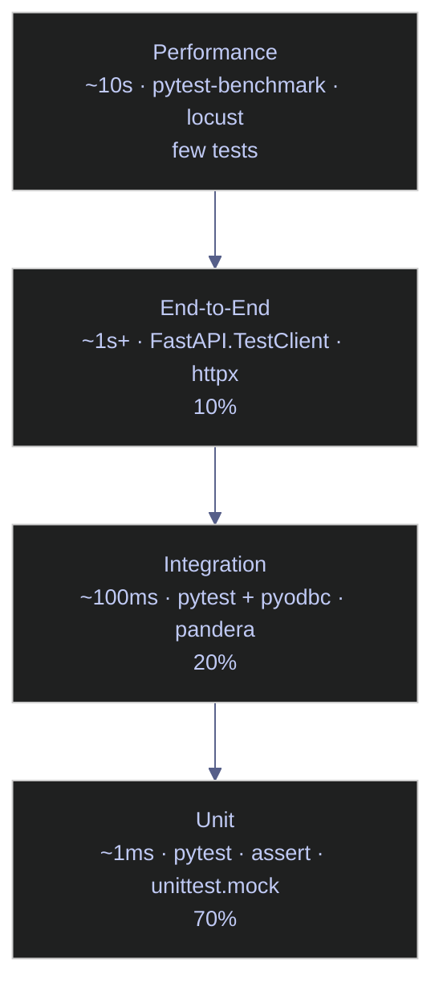

# 14. Testing - Python

> [!quote]+
>
> "Legacy code is simply code without tests."
>
> — **Michael Feathers**, *Working Effectively with Legacy Code* (2004)
>
> "Write tests until fear is transformed into boredom."
>
> — **Kent Beck**, *Test-Driven Development: By Example*

> [!abstract]- Summary
>
> **Testing philosophy**
> - Use the testing pyramid as a budget: ~70% unit, ~20% integration, ~10% end-to-end. Unit tests run on each commit; slower checks move to PR or deploy gates.
> - TDD stays useful when the loop remains small: write a failing test, implement the minimum change, then refactor.
>
> **pytest workflow**
> - `pytest` discovers `test_*.py` and `*_test.py` automatically and rewrites plain `assert` expressions for rich diffs.
> - `ipytest` is useful for notebook exploration, but durable suites should live in `tests/` and run from the repo root.
>
> **Core assertion patterns**
> - Use `pytest.approx` for floating-point checks, `issubset()` and `all(...)` for collection completeness, `re.match()` for identifier shape, and `is None` for optional values.
> - Prefer behavior-oriented test names such as `test_normalize_trade_rounds_price_to_4dp`.
>
> **Fixtures, parametrize, and mocks**
> - `@pytest.fixture` centralizes setup; `yield` fixtures guarantee teardown even on failure.
> - `@pytest.mark.parametrize` turns one test body into independent rows with readable `id=` labels.
> - `Mock(spec=RealClass)`, `patch()`, and `patch.dict(os.environ, ...)` isolate external state without weakening interface checks.
>
> **Data engineering coverage**
> - Pure transforms such as `normalize_trades` should be tested without mocks.
> - Data quality checks should enforce OHLCV invariants such as `close > 0`, `high >= low`, and `volume >= 0`.
> - Integration tests should verify real medallion-layer behavior with `pyodbc`, `COUNT(DISTINCT symbol)`, and schema checks against `INFORMATION_SCHEMA`.
>
> **Operational validation**
> - `pandera` is useful for DataFrame contracts per medallion layer.
> - API integration tests can cross-check a live price feed against the warehouse within a wide tolerance band.
> - CI should run `pytest --cov=src --cov-report=xml --junitxml=test-results.xml` and upload reports on `always()`.

> [!note]- Glossary
>
> **Unit test**
> - Exercises one function in isolation with no I/O or external dependencies.
> - Common mistake: calling a database-backed check a unit test.
>
> **Integration test**
> - Exercises code together with real dependencies such as a database, API, or filesystem.
> - Common mistake: running slow integration checks on every commit.
>
> **Fixture**
> - A reusable setup function declared with `@pytest.fixture`.
> - Common mistake: defining shared fixtures in test modules instead of `conftest.py`.
>
> **conftest.py**
> - A pytest discovery file that exposes fixtures to tests below its directory.
> - Common mistake: renaming it and expecting auto-discovery to keep working.
>
> **Parametrize**
> - `@pytest.mark.parametrize` runs one test body against multiple input rows.
> - Common mistake: hiding multiple cases inside one loop and losing per-case reporting.
>
> **Mock / MagicMock**
> - Stand-ins from `unittest.mock` that record calls and return controlled values.
> - Common mistake: mocking too deep inside the system under test.
>
> **patch**
> - A temporary replacement for a named attribute during one test.
> - Common mistake: patching the definition site instead of the lookup site.
>
> **side_effect**
> - A sequence or callable that changes mock behavior per call.
> - Common mistake: using it when `return_value` would be clearer.
>
> **spec**
> - A mock constraint that limits attributes to the real interface.
> - Common mistake: omitting `spec` and letting typoed methods pass silently.
>
> **pytest.approx**
> - A tolerant wrapper for floating-point equality.
> - Common mistake: using `==` directly on prices or ratios.
>
> **pytest.raises**
> - A context manager that asserts an exception path fires.
> - Common mistake: checking only the type and not the `match=` message.
>
> **scope**
> - Fixture lifetime such as `"function"`, `"module"`, or `"session"`.
> - Common mistake: sharing mutable state with `scope="session"`.
>
> **hypothesis**
> - A property-based testing library for wide input spaces.
> - Common mistake: using it everywhere instead of targeting pure functions with strong invariants.
>
> **pandera**
> - A schema-validation library for pandas DataFrames.
> - Common mistake: applying one schema unchanged across bronze, silver, and gold layers.
>
> **TDD (Test-Driven Development)**
> - A cycle of fail first, implement second, refactor third.
> - Common mistake: writing tests after the implementation and calling it TDD.

## Testing Philosophy

Testing is a control system for production risk, not a ceremony for proving correctness. In data systems, tests catch silent row loss, broken schemas, stale feeds, and incorrect transforms before those defects propagate into models, dashboards, or downstream services.

### The Testing Pyramid

Use faster layers as the default and spend slower checks only where real dependencies matter.

| Layer | What it tests | Speed | Tools | Demonstrated |
|---|---|---|---|---|
| **Unit tests** | One function in isolation, no I/O | ~1 ms | `pytest`, `assert`, `unittest.mock` | Local examples below |
| **Integration tests** | Code plus real DB, API, or files | ~100 ms | `pytest`, `pyodbc`, `requests`, `pandera` | Real warehouse and API checks |
| **End-to-end tests** | Full pipeline behavior | ~1 s+ | `FastAPI.TestClient`, `httpx` | Conceptual |
| **Performance tests** | Throughput and memory under load | ~10 s | `pytest-benchmark`, `locust` | Conceptual |

Rule of thumb: 70% unit, 20% integration, 10% end-to-end. Unit tests belong on every commit. Integration tests belong on pull requests or scheduled jobs. End-to-end tests belong on deploy or release gates.

*This diagram shows the expected test-distribution bias from fastest to slowest layers.*


### Python Testing Ecosystem

- `pytest` is the default framework: auto-discovery, rich assertion diffs, fixtures, markers, and plugin support.
- `unittest.mock` provides `Mock`, `MagicMock`, `patch`, `patch.dict`, and `create_autospec`.
- Fixtures handle setup and teardown; `yield` is the cleanest way to make teardown visible and reliable.
- `@pytest.mark.parametrize` expands one logical test into independently reported cases.
- `pandera` makes DataFrame constraints explicit instead of leaving them as ad hoc assertions.
- `pytest-cov` turns coverage into a release gate instead of a dashboard afterthought.

## Unit Testing with pytest

### Core workflow

#### Basic assertions

Plain `assert` statements keep test code close to production logic while still giving useful diffs on failure. The simplest unit tests should verify arithmetic and normalization behavior with no fixture or mock overhead.

*This file shows two minimal unit tests for price calculation and ticker normalization.*
```python
def test_price_calculation():
    quantity = 150
    unit_price = 42.75
    assert quantity * unit_price == 6412.50


def test_ticker_normalization():
    assert "  aapl  ".strip().upper() == "AAPL"
```
```text
..                                                                       [100%]
2 passed in 0.01s
```

#### Exception paths

Error-path tests should prove both the exception type and the failing lookup key. In Python, a missing dictionary key raises `KeyError`, not `KeyNotFoundException`.

*This example verifies that an unknown trade id raises `KeyError` with the missing key in the message.*
```python
import pytest


def get_trade_value(trades, trade_id):
    return trades[trade_id]


def test_missing_trade_raises_key_error():
    trades = {"T1": 100.0}
    with pytest.raises(KeyError, match="T2"):
        get_trade_value(trades, "T2")
```
```text
.                                                                        [100%]
1 passed in 0.01s
```

## Assertions and Test Organization

### High-signal assertions

#### Numeric tolerance and collection completeness

Use `pytest.approx` when floating-point rounding is part of the system, and use collection-oriented checks such as `issubset()` and `all(...)` when completeness matters more than order. For market identifiers, pair set checks with a shape check such as `re.match(...)`.

*This file combines a float-tolerance check with a Euro Stoxx-style symbol subset check.*
```python
import pytest
import re


def test_portfolio_weights_sum():
    weights = {"AAPL": 0.30, "MSFT": 0.25, "GOOG": 0.20, "AMZN": 0.25}
    assert pytest.approx(sum(weights.values())) == 1.0


def test_constituent_subset_and_symbol_shape():
    euro_stoxx_core = {"ADS.DE", "AIR.PA", "ASML.AS", "BAS.DE", "SAN.MC"}
    watchlist = {"ASML.AS", "SAN.MC"}
    assert watchlist.issubset(euro_stoxx_core)
    assert all(re.match(r"^[A-Z]{2,4}\.[A-Z]{2}$", symbol) for symbol in euro_stoxx_core)
```
```text
..                                                                       [100%]
2 passed in 0.01s
```

Use `is None` for optional values and `isinstance()` when API payloads or deserialized rows must retain an exact runtime type. Those checks prevent false positives caused by truthiness and loose duck typing.

## Fixtures and Parametrize

### Shared setup and data-driven cases

#### Reusable fixture data

Fixtures remove duplicate setup while `@pytest.mark.parametrize` turns multiple inputs into independently reported cases. Keep shared fixtures in `conftest.py` so the same setup stays available to the whole test subtree without imports.

*This test module uses one shared trade fixture and three parameter rows with readable case ids.*
```python
import pytest


@pytest.fixture
def sample_trade():
    return {"symbol": "SAP.DE", "qty": 100, "price": 172.50}


@pytest.mark.parametrize(
    "raw,expected",
    [
        pytest.param("sap.de", "SAP.DE", id="lowercase"),
        pytest.param("  asml.as ", "ASML.AS", id="trim-spaces"),
        pytest.param("san.mc", "SAN.MC", id="already-dotted"),
    ],
)
def test_ticker_formats(raw, expected, sample_trade):
    assert sample_trade["qty"] == 100
    assert raw.strip().upper() == expected
```
```text
...                                                                      [100%]
3 passed in 0.01s
```

#### Yield-based teardown

Use `yield` when teardown matters to correctness or to external cleanup. The value before `yield` is the fixture payload; the code after `yield` always runs, even if the test body fails.

*This fixture prints its lifecycle so the teardown step is visible in test output.*
```python
import pytest


def events():
    return []


@pytest.fixture
def temp_workspace():
    state = events()
    state.append("setup")
    yield state
    state.append("teardown")
    print("fixture lifecycle:", ", ".join(state))


def test_yield_fixture_runs_teardown(temp_workspace):
    assert temp_workspace == ["setup"]
```
```text
.fixture lifecycle: setup, teardown

1 passed in 0.04s
```

## Mocking and Patching

### Isolation patterns

#### Mock return values and environment state

Mock the boundary object, not the internals of the function you actually want to trust. `Mock.return_value` and `assert_called_once_with()` cover the common "HTTP client or SDK call" case, while `patch.dict(os.environ, ...)` isolates environment-dependent code without mutating the real session.

*This pair tests a client boundary and an environment-variable lookup in one module.*
```python
from unittest.mock import Mock, patch
import os


def fetch_close(client, symbol):
    return client.get_price(symbol)


def read_api_key():
    return os.environ["FINNHUB_KEY"]


def test_mock_return_value_and_call_verification():
    client = Mock()
    client.get_price.return_value = 171.0
    assert fetch_close(client, "SAP") == 171.0
    client.get_price.assert_called_once_with("SAP")


def test_patch_dict_isolates_environment_variables():
    with patch.dict(os.environ, {"FINNHUB_KEY": "demo-token"}, clear=True):
        assert read_api_key() == "demo-token"
```
```text
..                                                                       [100%]
2 passed in 0.02s
```

#### Prefer dependency injection for clocks

If the production function accepts `now=None` or another dependency parameter, prefer injection over patching `datetime`. The test becomes deterministic and the implementation avoids module-path patch traps.

*This example injects timestamps directly instead of patching `datetime.now()`.*
```python
from datetime import datetime, timezone


def market_is_open(now=None):
    now = now or datetime.now(timezone.utc)
    return now.weekday() < 5 and 9 <= now.hour < 17


def test_market_hours_with_injected_clock():
    monday_1030 = datetime(2026, 4, 13, 10, 30, tzinfo=timezone.utc)
    sunday_1030 = datetime(2026, 4, 12, 10, 30, tzinfo=timezone.utc)
    assert market_is_open(monday_1030) is True
    assert market_is_open(sunday_1030) is False
```
```text
.                                                                        [100%]
1 passed in 0.01s
```

## Test Patterns for Data Engineering

### Transform, contract, and boundary tests

#### Pure transform tests for `normalize_trades`

Pure transform code should be tested without mocks, network I/O, or database setup. That keeps failures attributable to the transform itself and makes the suite fast enough to run on every change.

*This transform cleans symbol case, converts types, drops bad rows, and computes notional value.*
```python
def normalize_trades(rows):
    normalized = []
    for row in rows:
        trade_id = row.get("trade_id")
        if not trade_id:
            continue
        qty = int(row["qty"])
        price = float(row["price"])
        normalized.append(
            {
                "trade_id": trade_id,
                "symbol": row["symbol"].strip().upper(),
                "qty": qty,
                "price": price,
                "notional": round(qty * price, 2),
            }
        )
    return normalized


def test_normalize_trades_cleans_exchange_rows():
    rows = [
        {"trade_id": "T1", "symbol": " sap.de ", "qty": "100", "price": "171.25"},
        {"trade_id": None, "symbol": "asml.as", "qty": "50", "price": "999.0"},
    ]
    assert normalize_trades(rows) == [
        {
            "trade_id": "T1",
            "symbol": "SAP.DE",
            "qty": 100,
            "price": 171.25,
            "notional": 17125.0,
        }
    ]
```
```text
.                                                                        [100%]
1 passed in 0.01s
```

#### `Mock(spec=MarketDataClient)` for boundary clients

Use `Mock(spec=RealClass)` when the test boundary is an external client. The spec keeps the mock aligned with the production interface while still allowing normal return-value and call-assert patterns.

*This mock stays bound to `MarketDataClient` while verifying the quote lookup path.*
```python
from unittest.mock import Mock


class MarketDataClient:
    def get_quote(self, symbol):
        raise NotImplementedError


def test_spec_bound_mock_rejects_typo_and_verifies_calls():
    client = Mock(spec=MarketDataClient)
    client.get_quote.return_value = {"symbol": "SAP", "price": 171.0}
    assert client.get_quote("SAP")["price"] == 171.0
    client.get_quote.assert_called_once_with("SAP")
```
```text
.                                                                        [100%]
1 passed in 0.02s
```

#### OHLCV invariant checks

For market data, unit tests should encode invariants directly instead of relying on downstream dashboards to surface bad rows. A validator such as `validate_eod_prices` should return concrete messages for every broken rule.

*This validator reports three explicit invariant failures for one malformed OHLCV row.*
```python
def validate_eod_prices(rows):
    errors = []
    for row in rows:
        if row["close"] <= 0:
            errors.append(f"{row['symbol']}: close must be > 0")
        if row["high"] < row["low"]:
            errors.append(f"{row['symbol']}: high must be >= low")
        if row["volume"] < 0:
            errors.append(f"{row['symbol']}: volume must be >= 0")
    return errors


def test_validate_eod_prices_reports_invariant_breaks():
    rows = [
        {"symbol": "SAP.DE", "close": 171.0, "high": 172.0, "low": 170.5, "volume": 1000},
        {"symbol": "BAS.DE", "close": -1.0, "high": 48.0, "low": 49.0, "volume": -5},
    ]
    assert validate_eod_prices(rows) == [
        "BAS.DE: close must be > 0",
        "BAS.DE: high must be >= low",
        "BAS.DE: volume must be >= 0",
    ]
```
```text
.                                                                        [100%]
1 passed in 0.01s
```

## Integration Testing with Real Database

### Connection setup

#### Database helpers for `stoxx`

The database-facing tests below assume helper functions such as `query_scalar()` and `assert_test()` plus a connection string loaded from `.env`. Keep credentials out of notebooks and repo files; use environment variables and connect to the SQL Server container on port `1434`.

*This helper block shows the shape of the real database setup used by the warehouse tests.*
```python
import os
import pyodbc
from dotenv import load_dotenv

load_dotenv()

CONN_STR = (
    "DRIVER={ODBC Driver 18 for SQL Server};"
    f"SERVER={os.environ['DB_HOST']},{os.environ.get('DB_PORT', '1434')};"
    f"DATABASE={os.environ['DB_NAME']};"
    f"UID={os.environ['DB_USER']};PWD={os.environ['DB_PASSWORD']};"
    "TrustServerCertificate=yes;"
)


def query_scalar(sql):
    with pyodbc.connect(CONN_STR) as conn:
        cursor = conn.cursor()
        cursor.execute(sql)
        row = cursor.fetchone()
        return row[0] if row else None


def assert_test(label, passed):
    state = "PASS" if passed else "FAIL"
    print(f"  {state}: {label}")
```
```text
No runtime output. Helper definitions only.
```

### Medallion layer assertions

#### Schema validation tests

Schema checks are the fastest way to catch drift across medallion layers. Query `INFORMATION_SCHEMA.TABLES` and `INFORMATION_SCHEMA.COLUMNS` directly so the failure message names the missing table or column instead of failing later in application code.

*This query block checks required tables, confirms `silver.is_filled`, and preserves a deliberate failing probe.*
```python
# TEST: all medallion layers exist
for table in [
    "bronze.eurostoxx50_ohlcv",
    "silver.eurostoxx50_ohlcv",
    "gold.index_performance",
    "gold.scores_daily",
]:
    exists = query_scalar(
        "SELECT COUNT(*) FROM INFORMATION_SCHEMA.TABLES "
        f"WHERE TABLE_SCHEMA='{table.split('.')[0]}' AND TABLE_NAME='{table.split('.')[1]}'"
    )
    assert_test(f"table {table} exists", exists == 1)

has_filled = query_scalar(
    "SELECT COUNT(*) FROM INFORMATION_SCHEMA.COLUMNS "
    "WHERE TABLE_SCHEMA='silver' AND TABLE_NAME='eurostoxx50_ohlcv' "
    "AND COLUMN_NAME='is_filled'"
)
assert_test("silver has is_filled column", has_filled == 1)

has_fake = query_scalar(
    "SELECT COUNT(*) FROM INFORMATION_SCHEMA.COLUMNS "
    "WHERE TABLE_SCHEMA='silver' AND TABLE_NAME='eurostoxx50_ohlcv' "
    "AND COLUMN_NAME='fake_column'"
)
assert_test("silver has fake_column (expected FAIL)", has_fake == 1)
```
```text
  PASS: table bronze.eurostoxx50_ohlcv exists
  PASS: table silver.eurostoxx50_ohlcv exists
  PASS: table gold.index_performance exists
  PASS: table gold.scores_daily exists
  PASS: silver has is_filled column
  FAIL: silver has fake_column (expected FAIL)
```

#### Data completeness tests

Completeness checks prove the ingestion boundary is still intact. Use `COUNT(DISTINCT symbol)`, row-count comparisons, and NULL scans to detect partial backfills or failed enrichments.

*This block checks symbol coverage, row-count growth, non-null closes, and index coverage.*
```python
bronze_syms = query_scalar("SELECT COUNT(DISTINCT symbol) FROM bronze.eurostoxx50_ohlcv")
assert_test(f"bronze has {bronze_syms} symbols (expected 50)", bronze_syms == 50)

bronze_cnt = query_scalar("SELECT COUNT(*) FROM bronze.eurostoxx50_ohlcv")
silver_cnt = query_scalar("SELECT COUNT(*) FROM silver.eurostoxx50_ohlcv")
assert_test(f"silver ({silver_cnt:,}) > bronze ({bronze_cnt:,})", silver_cnt > bronze_cnt)

null_closes = query_scalar("SELECT COUNT(*) FROM silver.eurostoxx50_ohlcv WHERE [close] IS NULL")
assert_test(f"silver has {null_closes} NULL closes (expected 0)", null_closes == 0)

gold_idx = query_scalar("SELECT COUNT(DISTINCT _index) FROM gold.index_performance")
dim_idx = query_scalar("SELECT COUNT(*) FROM bronze.dim_index")
assert_test(f"gold has {gold_idx} indices (expected {dim_idx})", gold_idx >= dim_idx)
```
```text
  PASS: bronze has 50 symbols (expected 50)
  PASS: silver (66,355) > bronze (50)
  PASS: silver has 0 NULL closes (expected 0)
  PASS: gold has 4 indices (expected 4)
```

#### Data quality tests

Integration tests should encode warehouse invariants, not just table existence. For OHLCV data, check `high >= low`, `close` within the daily range, non-negative price fields, no future dates, and non-negative volume.

*This block preserves the warehouse-level OHLCV invariant checks from the original note.*
```python
bad_hl = query_scalar("SELECT COUNT(*) FROM silver.eurostoxx50_ohlcv WHERE high < low")
assert_test(f"high >= low ({bad_hl} violations)", bad_hl == 0)

close_oob = query_scalar(
    "SELECT COUNT(*) FROM silver.eurostoxx50_ohlcv WHERE [close] < low OR [close] > high"
)
assert_test(f"close in [low, high] ({close_oob} violations)", close_oob == 0)

neg = query_scalar("SELECT COUNT(*) FROM silver.eurostoxx50_ohlcv WHERE [close] < 0 OR [open] < 0")
assert_test(f"no negative prices ({neg} violations)", neg == 0)

future = query_scalar("SELECT COUNT(*) FROM silver.eurostoxx50_ohlcv WHERE date > GETDATE()")
assert_test(f"no future dates ({future} violations)", future == 0)

neg_vol = query_scalar("SELECT COUNT(*) FROM silver.eurostoxx50_ohlcv WHERE volume < 0")
assert_test(f"no negative volume ({neg_vol} violations)", neg_vol == 0)
```
```text
  PASS: high >= low (0 violations)
  PASS: close in [low, high] (0 violations)
  PASS: no negative prices (0 violations)
  PASS: no future dates (0 violations)
  PASS: no negative volume (0 violations)
```

#### Cross-layer consistency tests

Cross-layer checks catch transformation bugs that unit tests cannot see. Compare bronze and silver symbol coverage, measure gap-fill ratios, and verify that downstream score ranges match the actual semantics of the model output.

*This block keeps both the deliberate z-score failure and the corrected range check.*
```python
silver_syms = query_scalar("SELECT COUNT(DISTINCT symbol) FROM silver.eurostoxx50_ohlcv")
assert_test(f"silver symbols ({silver_syms}) >= bronze ({bronze_syms})", silver_syms >= bronze_syms)

filled = query_scalar("SELECT COUNT(*) FROM silver.eurostoxx50_ohlcv WHERE is_filled = 1")
pct = filled / silver_cnt * 100
assert_test(f"filled rows = {filled} ({pct:.3f}%, expected < 1%)", pct < 1.0)

bad_scores = query_scalar(
    "SELECT COUNT(*) FROM gold.scores_daily WHERE composite_score < 0 OR composite_score > 1"
)
assert_test(f"composite_score in [0,1] ({bad_scores} violations — it's a z-score!)", bad_scores == 0)

really_bad = query_scalar(
    "SELECT COUNT(*) FROM gold.scores_daily WHERE composite_score < -2 OR composite_score > 2"
)
assert_test(f"composite_score in [-2,2] z-score range ({really_bad} violations)", really_bad == 0)

extreme = query_scalar("SELECT COUNT(*) FROM gold.index_performance WHERE ABS(daily_return) > 0.2")
assert_test(f"daily returns within +/-20% ({extreme} violations)", extreme == 0)
```
```text
  PASS: silver symbols (50) >= bronze (50)
  PASS: filled rows = 6 (0.009%, expected < 1%)
  FAIL: composite_score in [0,1] (216 violations — it's a z-score!)
  PASS: composite_score in [-2,2] z-score range (0 violations)
  PASS: daily returns within +/-20% (0 violations)
```

## Data Quality with Pandera

### Schema validation with pandera

#### Validate `DataFrameSchema` contracts per layer

Use `pandera` when row-level assertions turn into an implicit schema contract. Bronze schemas should stay permissive, silver should enforce critical fields such as `close` and `symbol`, and gold should match downstream contracts exactly.

*This schema validates a silver-layer OHLCV sample and preserves the original warning output.*
```python
import pandas as pd
import pandera.pandas as pa
from pandera.pandas import SchemaError
from sqlalchemy import create_engine
from urllib.parse import quote_plus

ohlcv_schema = pa.DataFrameSchema(
    {
        "symbol": pa.Column(str, pa.Check.str_length(min_value=1)),
        "date": pa.Column("datetime64[ns]"),
        "open": pa.Column(float, pa.Check.greater_than(0), nullable=True),
        "high": pa.Column(float, pa.Check.greater_than(0), nullable=True),
        "low": pa.Column(float, pa.Check.greater_than(0), nullable=True),
        "close": pa.Column(float, pa.Check.greater_than(0)),
        "volume": pa.Column(int, pa.Check.greater_than_or_equal_to(0), nullable=True),
    }
)

engine = create_engine(f"mssql+pyodbc:///?odbc_connect={quote_plus(CONN_STR)}")
df = pd.read_sql(
    "SELECT TOP 100 symbol, date, [open], high, low, [close], volume FROM silver.eurostoxx50_ohlcv",
    engine,
)
df["date"] = pd.to_datetime(df["date"])

try:
    ohlcv_schema.validate(df)
    print(f"  PASS: pandera validated {len(df)} rows against OHLCV schema")
except SchemaError as exc:
    print(f"  FAIL: {exc}")

strict_schema = pa.DataFrameSchema(
    {"volume": pa.Column(int, pa.Check.greater_than(1_000_000), coerce=True)}
)
try:
    strict_schema.validate(df[["volume"]])
    print("  FAIL: should have raised SchemaError")
except SchemaError:
    print("  PASS: correctly caught volume <= 1M (expected FAIL)")
```
```text
  PASS: pandera validated 100 rows against OHLCV schema
  PASS: correctly caught volume <= 1M (expected FAIL)

  c:\Users\aperi\DEV\LANG\.lang\Lib\site-packages\pandera\_pandas_deprecated.py:143: FutureWarning:
  Importing pandas-specific classes and functions from the top-level pandera module will be removed
  in a future version of pandera.

  # old import
  import pandera as pa

  # new import
  import pandera.pandas as pa

  warnings.warn(_future_warning, FutureWarning)
```

## API Integration Tests

### Live API validation

#### Cross-check live quotes against warehouse closes

API tests should prove both liveness and plausibility. For market feeds, a wide tolerance band is often correct because ADR listings, currency conversion, and delayed close data can all move the ratio away from exactly `1.0`.

*This example checks Finnhub quote responses and compares the latest `SAP` price to the warehouse close.*
```python
FINNHUB_KEY = os.environ.get("FINNHUB_KEY", "")

for sym in ["SAP", "ASML"]:
    resp = requests.get(f"https://finnhub.io/api/v1/quote?symbol={sym}&token={FINNHUB_KEY}")
    data = resp.json()
    price = data.get("c", 0)
    assert_test(f"Finnhub {sym} price = {price:.2f} (expected > 0)", price > 0)

db_close = query_scalar(
    "SELECT TOP 1 [close] FROM silver.eurostoxx50_ohlcv "
    "WHERE symbol = 'SAP.DE' ORDER BY date DESC"
)
resp = requests.get(f"https://finnhub.io/api/v1/quote?symbol=SAP&token={FINNHUB_KEY}")
live = resp.json().get("c", 0)
ratio = live / db_close if db_close else 0
assert_test(f"SAP live={live:.2f} vs DB={db_close:.2f} (ratio={ratio:.2f})", 0.2 < ratio < 5.0)
```
```text
  PASS: Finnhub SAP price = 171.00 (expected > 0)
  PASS: Finnhub ASML price = 1399.42 (expected > 0)
  PASS: SAP live=171.00 vs DB=166.52 (ratio=1.03)
```

## CI/CD — Running Tests in GitHub Actions

Use CI to separate fast unit checks from slower integration or scheduled data-quality jobs. The workflow should install dependencies, run `pytest`, publish JUnit and coverage artifacts, and keep secrets in GitHub Actions secrets rather than in the repository.

### Workflow configuration

*This workflow runs tests across Python 3.11 and 3.12 and uploads reports on every run.*
```yaml
# .github/workflows/test.yml
name: Tests

on:
  push:
    branches: [main, develop]
  pull_request:
    branches: [main]

jobs:
  test:
    runs-on: ubuntu-latest
    strategy:
      matrix:
        python-version: ["3.11", "3.12"]

    steps:
      - uses: actions/checkout@v4

      - name: Set up Python ${{ matrix.python-version }}
        uses: actions/setup-python@v5
        with:
          python-version: ${{ matrix.python-version }}

      - name: Install dependencies
        run: |
          python -m pip install --upgrade pip
          pip install -r requirements.txt
          pip install pytest-cov

      - name: Run tests with coverage
        run: |
          pytest tests/ \
            --tb=short \
            --cov=src \
            --cov-report=xml \
            --cov-report=term-missing \
            --junitxml=test-results.xml
        env:
          DB_HOST: ${{ secrets.DB_HOST }}
          EXCHANGE_API_KEY: ${{ secrets.EXCHANGE_API_KEY }}

      - name: Upload test results
        if: always()
        uses: actions/upload-artifact@v4
        with:
          name: test-results-py${{ matrix.python-version }}
          path: test-results.xml

      - name: Upload coverage
        if: always()
        uses: actions/upload-artifact@v4
        with:
          name: coverage-py${{ matrix.python-version }}
          path: coverage.xml
```
```text
No runtime output. Reference workflow snippet only.
```

### Quick Reference

| Trigger | Description |
|---|---|
| `push` | Runs on every push to specified branches |
| `pull_request` | Runs on PRs targeting specified branches |
| `schedule` | Cron-based jobs such as nightly data-quality checks |
| `workflow_dispatch` | Manual trigger from the GitHub UI |

| Secret | How to set it |
|---|---|
| `secrets.DB_HOST` | Repository Settings -> Secrets and variables -> Actions |
| `secrets.EXCHANGE_API_KEY` | Store as an Actions secret; never hardcode it in the workflow |

| pytest flag | Purpose |
|---|---|
| `--cov=src` | Measure application coverage |
| `--cov-report=xml` | Publish coverage for CI tooling |
| `--junitxml=test-results.xml` | Emit JUnit XML for test reporting |
| `--tb=short` | Keep tracebacks concise in CI logs |
| `-x` | Stop on the first failure |

### Reference

#### Typical project layout

Keep `src/` and `tests/` separate so import paths, coverage targets, and fixture discovery stay predictable. Shared fixtures belong in `tests/conftest.py`, not inside the modules that consume them.

*This tree shows a standard project layout for transformation, market-data, quality, and config modules.*
```text
trading_pipeline/
├── src/
│   ├── transforms.py        # normalize_trades(), adjust_for_splits()
│   ├── market_data.py       # MarketDataClient, get_index_constituents()
│   ├── quality.py           # validate_eod_prices(), check_stale_quotes()
│   └── config.py            # get_exchange_config()
├── tests/
│   ├── conftest.py          # shared fixtures (sample trades, mock clients)
│   ├── test_transforms.py   # pure function tests — fast, no mocks
│   ├── test_market_data.py  # mock exchange/API calls
│   ├── test_quality.py      # data quality validation tests
│   └── test_config.py       # patch env vars
├── pyproject.toml
└── requirements.txt
```

## Operational Risks

### Mocking and shared state
#### Patch the lookup site, not the definition site

`patch()` must target the name resolved by the module under test. If `src.market_data` imports `requests`, patch `src.market_data.requests.get`; if it imports `get` directly, patch `src.market_data.get`.

*Example: Show the patch target for two common import styles.*
```python
module_import_target = "src.market_data.requests.get"
direct_import_target = "src.market_data.get"
print(module_import_target)
print(direct_import_target)
```
```text
src.market_data.requests.get
src.market_data.get
```

#### Wide-scope fixtures must not leak mutable state

A mutable `scope="session"` fixture can leak mutations between tests and create order-dependent failures. Keep mutable payloads at `scope="function"` or return a copy before each mutation.

*Example: Express the safe fixture-state rule.*
```python
fixture_scope = "function"
copy_before_mutation = True
print(f"scope={fixture_scope}")
print(f"copy_before_mutation={copy_before_mutation}")
```
```text
scope=function
copy_before_mutation=True
```

### Numerical assertions and interface safety

#### Use `pytest.approx()` for price math

`pytest.approx()` avoids brittle equality checks on floats. Prefer `rel=` for ratios and `abs=` when values can land near zero.

*Example: Show the rounding error behind `0.1 + 0.2`.*
```python
expected = 0.3
actual = 0.1 + 0.2
print(actual == expected)
print(round(actual - expected, 17))
```
```text
False
5.551115123125783e-17
```

#### Bare mocks hide typoed method calls

`Mock()` without `spec=` accepts attributes that the real object does not implement. Use `Mock(spec=...)` or `create_autospec(...)` to fail on interface drift.

*Example: Show why a bare mock can hide an API typo.*
```python
from unittest.mock import Mock

bare = Mock()
bare.conect()
print(hasattr(bare, "conect"))
print("prefer Mock(spec=RealClass)")
```
```text
True
prefer Mock(spec=RealClass)
```

### Execution cost and CI placement

#### Integration suites do not belong in the default fast lane

Slow database or API checks turn every push into a long gate. Mark them with `@pytest.mark.integration` and schedule them separately from the fast unit suite.

*Example: Split the fast and slow pytest commands.*
```python
print("pytest -m 'not integration'")
print("pytest -m integration")
```
```text
pytest -m 'not integration'
pytest -m integration
```

## Recommended Patterns

### Suite structure

#### Keep unit checks local and deterministic

A `unit test` should not open a socket, read a real file, or call warehouse helpers such as `query_scalar()`. If it does, move it into the integration layer and keep the fast lane focused on pure behavior.

*Example: Classify checks by dependency boundary.*
```python
cases = {"unit": ["normalize_trades"], "integration": ["query_scalar", "finnhub_quote"]}
print(cases["unit"][0])
print(", ".join(cases["integration"]))
```
```text
normalize_trades
query_scalar, finnhub_quote
```

#### Label deliberate failures as contracts

Failure-path examples are useful only when the reader can see that they are intentional. Use explicit names and `pytest.raises()` so maintainers can distinguish proof from breakage.

*Example: Name a contract-failure test explicitly.*
```python
print("test_validate_price_raises_on_negative_close")
print("with pytest.raises(ValueError, match='close must be positive')")
```
```text
test_validate_price_raises_on_negative_close
with pytest.raises(ValueError, match='close must be positive')
```

### Fixture and contract hygiene

#### Keep shared fixtures in `conftest.py`

`conftest.py` should hold shared fixtures at the narrowest directory level that still matches reuse. That keeps discovery implicit and avoids fixture-import churn.

*Example: Show the standard shared-fixture path.*
```python
print("tests/conftest.py")
print("tests/test_quality.py")
```
```text
tests/conftest.py
tests/test_quality.py
```

#### Use `pandera` and `patch.dict()` where contracts cross boundaries

`pandera` makes DataFrame contracts explicit, and `patch.dict(os.environ, ...)` isolates environment reads. Use them together when code crosses schema and config boundaries.

*Example: Pair schema validation and environment isolation tools.*
```python
print("pandera.DataFrameSchema")
print("patch.dict(os.environ, {'FINNHUB_API_KEY': 'test-key'}, clear=True)")
```
```text
pandera.DataFrameSchema
patch.dict(os.environ, {'FINNHUB_API_KEY': 'test-key'}, clear=True)
```

## Troubleshooting

### Imports and collection

#### `src` imports fail under `pytest`

When `pytest` cannot import modules from `src/`, fix package layout or invocation before editing tests. Run from the repo root and keep collection settings explicit in `pyproject.toml`.

*Example: Print the stable collection entrypoint and config file.*
```python
print("pytest")
print("pyproject.toml")
```
```text
pytest
pyproject.toml
```

#### Fixture discovery fails

If pytest reports `fixture 'my_fixture' not found`, check `conftest.py` placement and spelling before touching the test body. The filename must remain exactly `conftest.py`.

*Example: Verify the expected fixture-discovery filename.*
```python
fixture_file = "conftest.py"
print(fixture_file)
print(fixture_file == "conftest.py")
```
```text
conftest.py
True
```

### Mock behavior and tolerances

#### A `MagicMock` leaks into the assertion

If the assertion compares against a `MagicMock`, the stubbed collaborator never received a `.return_value`. Set the return value before calling the code under test.

*Example: Show the difference between a configured and unconfigured mock.*
```python
from unittest.mock import MagicMock

mock = MagicMock()
print(type(mock()).__name__)
mock.return_value = 101.25
print(mock())
```
```text
MagicMock
101.25
```

#### `pytest.approx()` still fails

If `pytest.approx()` fails, the tolerance is wrong for the scale of the value. Use `abs=` near zero and `rel=` when tolerated error should scale with value size.

*Example: Choose `abs` versus `rel` tolerance by scale.*
```python
print("pytest.approx(0.0004, abs=0.001)")
print("pytest.approx(101.25, rel=1e-6)")
```
```text
pytest.approx(0.0004, abs=0.001)
pytest.approx(101.25, rel=1e-6)
```

### CI-only failures

#### A test passes locally but fails in CI

Assume hidden process state first: local files, `os.environ`, timezone assumptions, or reused databases. Move that state into fixtures and make the dependency explicit in setup.

*Example: List the first CI drift checks.*
```python
checks = ["files", "env", "timezone", "database state"]
for check in checks:
    print(check)
```
```text
files
env
timezone
database state
```
