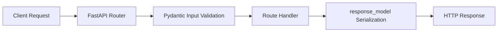

# 15. Web & APIs - Python

> [!quote]+
>
> "Web programming is the science of coming up with increasingly complicated ways of concatenating strings."
>
> - **Greg Brockman**

> [!abstract]- Summary
>
> - Use `requests` for synchronous integrations and `httpx` when the same client code needs `async`, connection pooling, or HTTP/2.
> - Always set `timeout=` on outbound calls, reuse `Session()` or `Client()` instances, and load bearer tokens from `os.environ`.
> - Handle pagination, `429` retries, and bulk `POST` batching explicitly instead of assuming a single happy-path response.
> - FastAPI pairs `BaseModel` request schemas, `response_model=` contracts, and `HTTPException` failure boundaries cleanly.
> - Pydantic covers schema constraints, custom validators, nested models, aliases, JSON Schema generation, `frozen=True`, and `strict=True`.

> [!note]- Glossary
>
> **`requests`**
> - Synchronous HTTP client for simple scripts and service-to-service calls.
> - Always pass `timeout=` because `requests` does not apply one by default.
>
> ---
>
> **`httpx`**
> - HTTP client with both synchronous and asynchronous APIs.
> - Use `Client()` or `AsyncClient()` when connection reuse or `asyncio` concurrency matters.
>
> ---
>
> **`AsyncClient`**
> - `httpx` client type for `async` / `await` code paths.
> - Keep it inside `async with` or call `await client.aclose()` explicitly.
>
> ---
>
> **ASGI**
> - Interface between async Python web apps and servers such as `uvicorn`.
> - FastAPI uses ASGI so it can support async handlers and long-lived connections.
>
> ---
>
> **FastAPI**
> - Python framework for typed HTTP APIs with automatic OpenAPI generation.
> - The main workflow is `BaseModel` input, route decorators, `response_model=`, and `HTTPException`.
>
> ---
>
> **`BaseModel`**
> - Pydantic base class for validation, coercion, and schema generation.
> - FastAPI uses it for request parsing and response contracts.
>
> ---
>
> **`raise_for_status()`**
> - Method on `requests` and `httpx` responses that raises on `4xx` and `5xx`.
> - Use it after each call when an error payload should stop downstream processing.
>
> ---
>
> **Pagination**
> - API pattern that splits a large result set across multiple responses.
> - Guard loops with `next_page`, `max_pages`, or repeated-token detection.
>
> ---
>
> **Bearer token**
> - Credential sent in `Authorization: Bearer <token>`.
> - Load it from `os.environ` or a secret store instead of hardcoding it in source.
>
> ---
>
> **`uvicorn`**
> - ASGI server commonly used to run FastAPI apps.
> - `--reload` is for local development, not production worker setups.
>
> ---
>
> **`422 Unprocessable Entity`**
> - FastAPI's default response when parsed input fails declared validation rules.
> - Check the `detail` array before assuming the route handler ran.

## Local Demo Server for Outbound Client Examples

The `requests` and `httpx` examples below use a local `ThreadingHTTPServer` fixture instead of an external service. That keeps the outputs deterministic and makes adjacent `text` fences reflect literal execution rather than hand-normalized notebook output.

*This helper server exposes `/quote`, `/orders`, `/headers`, `/status/500`, `/items`, `/unstable`, and `/bulk` for the client examples that follow.*

```python
import asyncio
import json
import os
import threading
import time
from http.server import BaseHTTPRequestHandler, ThreadingHTTPServer
from urllib.parse import parse_qs, urlparse

import httpx
import requests


class DemoHandler(BaseHTTPRequestHandler):
    unstable_calls = 0
    pages = [
        [{"id": 1, "ticker": "AAPL"}, {"id": 2, "ticker": "MSFT"}],
        [{"id": 3, "ticker": "NVDA"}, {"id": 4, "ticker": "META"}],
        [{"id": 5, "ticker": "AMZN"}],
    ]

    def log_message(self, format, *args):
        pass

    def _send(self, status, payload, headers=None):
        body = json.dumps(payload).encode("utf-8")
        self.send_response(status)
        self.send_header("Content-Type", "application/json")
        self.send_header("Content-Length", str(len(body)))
        if headers:
            for key, value in headers.items():
                self.send_header(key, value)
        self.end_headers()
        self.wfile.write(body)

    def do_GET(self):
        parsed = urlparse(self.path)
        params = parse_qs(parsed.query)

        if parsed.path == "/quote":
            return self._send(200, {
                "symbol": params.get("symbol", ["AAPL"])[0],
                "date": params.get("date", ["2024-03-15"])[0],
                "price": 189.45,
                "source": params.get("source", ["requests"])[0],
            })

        if parsed.path == "/headers":
            return self._send(200, {
                "has_authorization": "Authorization" in self.headers,
                "client_id": self.headers.get("X-Client-Id"),
                "accept": self.headers.get("Accept"),
            })

        if parsed.path == "/status/500":
            return self._send(500, {"detail": "upstream failure"})

        if parsed.path == "/pool":
            return self._send(200, {
                "request": params.get("request", ["?"])[0],
                "status": "ok",
            })

        if parsed.path == "/items":
            page = int(params.get("page", ["1"])[0])
            index = page - 1
            items = self.pages[index] if 0 <= index < len(self.pages) else []
            next_page = page + 1 if index + 1 < len(self.pages) else None
            return self._send(200, {"page": page, "items": items, "next_page": next_page})

        if parsed.path == "/unstable":
            DemoHandler.unstable_calls += 1
            if DemoHandler.unstable_calls == 1:
                return self._send(429, {"detail": "rate limited"}, headers={"Retry-After": "0"})
            return self._send(200, {"attempt": DemoHandler.unstable_calls, "status": "ok"})

        return self._send(404, {"detail": "not found"})

    def do_POST(self):
        length = int(self.headers.get("Content-Length", "0"))
        payload = json.loads(self.rfile.read(length).decode("utf-8"))

        if self.path == "/orders":
            return self._send(201, {"order_id": "ORD-001", "received": payload, "created": True})

        if self.path == "/bulk":
            return self._send(200, {
                "accepted": len(payload["items"]),
                "tickers": [item["ticker"] for item in payload["items"]],
            })

        return self._send(404, {"detail": "not found"})


server = ThreadingHTTPServer(("127.0.0.1", 0), DemoHandler)
thread = threading.Thread(target=server.serve_forever, daemon=True)
thread.start()
BASE_URL = f"http://127.0.0.1:{server.server_address[1]}"

print({"base_url": BASE_URL})
```
```text
{'base_url': 'http://127.0.0.1:53627'}
```

## HTTP Clients and Outbound API Calls

`requests` is the simplest path for synchronous API work. `httpx` uses a similar surface area but adds `AsyncClient()`, HTTP/2 support, and a more explicit client lifecycle for pooled connections.

### `requests` for synchronous calls

#### `requests.get()` for query params and JSON parsing

Use `requests.get()` when the code path is synchronous and the response shape is small enough to parse eagerly. `params=` builds the query string, and `resp.json()` should happen only after the response contract is trusted.

*This call fetches a single quote from the local demo API and prints the literal URL plus the parsed JSON payload.*

```python
resp = requests.get(
    f"{BASE_URL}/quote",
    params={"symbol": "AAPL", "date": "2024-03-15"},
    timeout=5,
)

print(resp.status_code)
print(resp.url)
print(resp.json())
```
```text
200
http://127.0.0.1:53627/quote?symbol=AAPL&date=2024-03-15
{'symbol': 'AAPL', 'date': '2024-03-15', 'price': 189.45, 'source': 'requests'}
```

#### `requests.post()` for JSON request bodies

Use `json=` when the server expects JSON and the client should set `Content-Type: application/json` automatically. The main failure boundary is still the HTTP status code, so keep `timeout=` and status checks in the same call path.

*This POST sends a trade order and shows the created response body echoed by the demo API.*

```python
trade_order = {
    "ticker": "AAPL",
    "side": "BUY",
    "quantity": 100,
    "limit_price": 178.5,
}

resp = requests.post(f"{BASE_URL}/orders", json=trade_order, timeout=5)

print(resp.status_code)
print(resp.json())
```
```text
201
{'order_id': 'ORD-001', 'received': {'ticker': 'AAPL', 'side': 'BUY', 'quantity': 100, 'limit_price': 178.5}, 'created': True}
```

#### `Session()` plus `os.environ` for shared headers

A reusable `requests.Session()` keeps headers and connection state in one place. Build the `Authorization` header from `os.environ` or an injected secret provider rather than embedding the token literal in the request call.

*This example seeds a demo token in `os.environ`, updates a shared `Session()` header set, and confirms that the server saw the headers without echoing the token value back into the note.*

```python
os.environ["API_TOKEN"] = "demo-token"

session = requests.Session()
session.headers.update({
    "Authorization": f"Bearer {os.environ['API_TOKEN']}",
    "X-Client-Id": "pipeline-v2",
    "Accept": "application/json",
})

resp = session.get(f"{BASE_URL}/headers", timeout=5)
print(resp.json())
```
```text
{'has_authorization': True, 'client_id': 'pipeline-v2', 'accept': 'application/json'}
```

#### `raise_for_status()` for failure boundaries

The safest pattern is `resp.raise_for_status()` immediately after the call returns. That makes `4xx` and `5xx` responses explicit control-flow events instead of leaving downstream parsing code to infer failure from an unexpected body.

*This example calls an endpoint that always returns `500` and captures the exact `HTTPError` boundary.*

```python
resp = requests.get(f"{BASE_URL}/status/500", timeout=5)

try:
    resp.raise_for_status()
except requests.HTTPError as exc:
    print(resp.status_code)
    print(type(exc).__name__)
    print(resp.json())
```
```text
500
HTTPError
{'detail': 'upstream failure'}
```

### `httpx` for pooled and async clients

#### `httpx.get()` for sync code that may later grow into async

`httpx.get()` is the lowest-friction way to start with `httpx` in synchronous code. The main reason to choose it early is that the rest of the module can move to `Client()` or `AsyncClient()` later without changing libraries.

*This sync `httpx` call hits the same quote endpoint so the response shape can be compared directly with `requests`.*

```python
resp = httpx.get(
    f"{BASE_URL}/quote",
    params={"symbol": "MSFT", "source": "httpx"},
    timeout=5.0,
)

print(resp.status_code)
print(resp.json())
```
```text
200
{'symbol': 'MSFT', 'date': '2024-03-15', 'price': 189.45, 'source': 'httpx'}
```

#### `httpx.Client()` for connection reuse

A long-lived `httpx.Client()` is the sync equivalent of reusing one `HttpClient` instance in C#. It keeps sockets, headers, and timeout policy in one object instead of reinitializing that state per call.

*This client makes three pooled requests against one host and prints the literal JSON responses in order.*

```python
with httpx.Client(base_url=BASE_URL, timeout=5.0) as client:
    pooled = [client.get("/pool", params={"request": str(i)}).json() for i in (1, 2, 3)]

print(pooled)
```
```text
[{'request': '1', 'status': 'ok'}, {'request': '2', 'status': 'ok'}, {'request': '3', 'status': 'ok'}]
```

#### `AsyncClient()` with `asyncio.gather()` for fan-out

`httpx.AsyncClient()` is the point where `httpx` materially diverges from `requests`. Keep the client inside `async with`, and add a semaphore when the upstream API cannot tolerate full fan-out concurrency.

*This async example fans out three requests concurrently and returns the literal JSON payloads in gather order.*

```python
async def fetch_all():
    async with httpx.AsyncClient(base_url=BASE_URL, timeout=5.0) as client:
        async def fetch(label):
            resp = await client.get("/pool", params={"request": label})
            return resp.json()

        return await asyncio.gather(*(fetch(label) for label in ("AAPL", "MSFT", "NVDA")))


results = asyncio.run(fetch_all())
print(results)
```
```text
[{'request': 'AAPL', 'status': 'ok'}, {'request': 'MSFT', 'status': 'ok'}, {'request': 'NVDA', 'status': 'ok'}]
```

#### `requests` vs `httpx` lookup

Use the table below for selection, not as a substitute for failure-policy design. The actual decision point is whether the code path needs `async`, stricter client lifecycle control, or just a simple blocking request.

| Capability | `requests` | `httpx` |
|---|---|---|
| Sync API | Yes | Yes |
| Async API | No | `AsyncClient()` |
| Connection reuse | `Session()` | `Client()` / `AsyncClient()` |
| HTTP/2 | No | Yes |
| Typical use | Simple sync integrations | Sync or async service clients |

## REST API Patterns for Data Engineering

The main production failures are rarely the first `GET`. They show up in page iteration, rate limits, and write amplification, so those cases need explicit control flow rather than prose-only guidance.

### Pagination, retry, and batching

#### `next_page` loops for paginated APIs

Pagination code should stop only when the remote contract says there is no next page. Use `next_page`, `cursor`, or an explicit exhausted flag, and add guard rails such as `max_pages` if the upstream API is not fully trusted.

*This loop follows `next_page` until the demo API is exhausted and prints both per-page results and the flattened collection.*

```python
page = 1
collected = []
page_log = []

while page is not None:
    payload = requests.get(f"{BASE_URL}/items", params={"page": page}, timeout=5).json()
    page_log.append({"page": payload["page"], "items": [item["ticker"] for item in payload["items"]]})
    collected.extend(item["ticker"] for item in payload["items"])
    page = payload["next_page"]

print(page_log)
print(collected)
```
```text
[{'page': 1, 'items': ['AAPL', 'MSFT']}, {'page': 2, 'items': ['NVDA', 'META']}, {'page': 3, 'items': ['AMZN']}]
['AAPL', 'MSFT', 'NVDA', 'META', 'AMZN']
```

#### `Retry-After` handling for `429` responses

A retry loop should distinguish between transient server failures and permanent client errors. `429` is a back-pressure signal, so read `Retry-After` when present and let the retry loop decide the next attempt boundary.

*This example hits an endpoint that returns `429` once, then succeeds on the second attempt after reading the `Retry-After` header.*

```python
attempts = []

for attempt in range(1, 4):
    resp = requests.get(f"{BASE_URL}/unstable", timeout=5)
    attempts.append({"attempt": attempt, "status_code": resp.status_code})

    if resp.status_code == 429:
        delay = float(resp.headers.get("Retry-After", "0"))
        attempts[-1]["retry_after"] = delay
        time.sleep(delay)
        continue

    attempts[-1]["body"] = resp.json()
    break

print(attempts)
```
```text
[{'attempt': 1, 'status_code': 429, 'retry_after': 0.0}, {'attempt': 2, 'status_code': 200, 'body': {'attempt': 2, 'status': 'ok'}}]
```

#### Bulk `POST` to reduce round trips

When an API supports bulk writes, send batches that match the documented limit instead of one record per request. The point is to reduce request count without building payloads so large that a single retry becomes too expensive.

*This bulk request sends three records in one payload and prints the accepted count plus the tickers echoed by the demo API.*

```python
batch = {
    "items": [
        {"ticker": "AAPL", "quantity": 10},
        {"ticker": "MSFT", "quantity": 5},
        {"ticker": "NVDA", "quantity": 1},
    ]
}

resp = requests.post(f"{BASE_URL}/bulk", json=batch, timeout=5)
print(resp.json())
```
```text
{'accepted': 3, 'tickers': ['AAPL', 'MSFT', 'NVDA']}
```

## Building a REST API with FastAPI

FastAPI works best when the route layer stays narrow: parse input with `BaseModel`, return a declared `response_model=`, and raise `HTTPException` for deliberate client-visible failures. The examples below use `TestClient` so the results stay local and deterministic.

*This diagram maps the request path from the HTTP layer to validation, route execution, and typed response serialization.*


```text
Diagram only; no runtime output.
```

### Route definitions and contract tests

#### `BaseModel`, `response_model=`, and `HTTPException` in one FastAPI app

A reference note is more useful when the route contract and the observable behavior stay next to each other. This example defines the models, in-memory store, and three route types, then exercises the app with `TestClient` so the output shows literal `200`, `201`, `409`, `422`, and delete lifecycle behavior.

*This single block defines a FastAPI app, runs local contract tests with `TestClient`, and prints the route table plus live responses.*

```python
from typing import Literal

from fastapi import FastAPI, HTTPException
from fastapi.testclient import TestClient
from pydantic import BaseModel, Field


class TradeIn(BaseModel):
    trade_id: str = Field(min_length=3)
    ticker: str = Field(pattern=r"^[A-Z]{1,5}$")
    quantity: int = Field(gt=0)
    price: float = Field(gt=0)


class TradeOut(TradeIn):
    status: Literal["accepted", "cancelled"]


app = FastAPI(title="Trade API")
store: dict[str, TradeOut] = {}


@app.get("/health")
def health():
    return {"status": "ok"}


@app.get("/trades", response_model=list[TradeOut])
def list_trades():
    return list(store.values())


@app.post("/trades", response_model=TradeOut, status_code=201)
def create_trade(trade: TradeIn):
    if trade.trade_id in store:
        raise HTTPException(status_code=409, detail="duplicate trade_id")
    created = TradeOut(**trade.model_dump(), status="accepted")
    store[trade.trade_id] = created
    return created


@app.delete("/trades/{trade_id}", status_code=204)
def delete_trade(trade_id: str):
    if trade_id not in store:
        raise HTTPException(status_code=404, detail="trade not found")
    del store[trade_id]
    return None


client = TestClient(app)

print(sorted(route.path for route in app.router.routes if getattr(route, "path", None)))
print(client.get("/health").json())
print(client.post("/trades", json={
    "trade_id": "TRD-001",
    "ticker": "AAPL",
    "quantity": 10,
    "price": 189.45,
}).json())
print(client.post("/trades", json={
    "trade_id": "TRD-001",
    "ticker": "AAPL",
    "quantity": 10,
    "price": 189.45,
}).json())
invalid = client.post("/trades", json={
    "trade_id": "TRD-002",
    "ticker": "aapl",
    "quantity": 0,
    "price": 0,
})
print(invalid.status_code)
print(invalid.json()["detail"][0]["msg"])
print(client.get("/trades").json())
client.delete("/trades/TRD-001")
print(client.get("/trades").json())
print(client.delete("/trades/TRD-404").json())
```
```text
['/docs', '/docs/oauth2-redirect', '/health', '/openapi.json', '/redoc', '/trades', '/trades', '/trades/{trade_id}']
{'status': 'ok'}
{'trade_id': 'TRD-001', 'ticker': 'AAPL', 'quantity': 10, 'price': 189.45, 'status': 'accepted'}
{'detail': 'duplicate trade_id'}
422
String should match pattern '^[A-Z]{1,5}$'
[{'trade_id': 'TRD-001', 'ticker': 'AAPL', 'quantity': 10, 'price': 189.45, 'status': 'accepted'}]
[]
{'detail': 'trade not found'}
```

#### `uvicorn.Config` for the serving boundary

`TestClient` proves route behavior, but the deployment boundary is still `uvicorn` or another ASGI server. The useful contract here is host, port, reload policy, and docs URL, not a prose-only reminder that the app can be served.

*This snippet builds a `uvicorn.Config` object and prints the literal serve address plus the generated docs route.*

```python
import uvicorn

config = uvicorn.Config(app=app, host="127.0.0.1", port=8000, reload=False)

print(config.host)
print(config.port)
print(config.reload)
print(f"http://{config.host}:{config.port}/docs")
```
```text
127.0.0.1
8000
False
http://127.0.0.1:8000/docs
```

#### FastAPI to ASP.NET lookup

The table below is narrow reference material rather than prose guidance, so it stays as a lookup table. It captures the usual translation points when switching between the Python and C# notes.

| FastAPI | ASP.NET Core | Typical role |
|---|---|---|
| `FastAPI()` | `WebApplication.CreateBuilder()` + `Build()` | App bootstrap |
| `@app.get()` / `@app.post()` | `MapGet()` / `MapPost()` | Route mapping |
| `BaseModel` | DTO / record type | Request and response contract |
| `response_model=` | Typed result / serializer contract | Output shaping |
| `HTTPException` | `Results.*` / exception mapping | Client-visible failure |
| `uvicorn` | Kestrel | ASGI / HTTP host |

## Pydantic Validation for API Contracts

Pydantic is the boundary between raw input and typed data. The most important features are schema constraints, custom validators, nested models, alias-aware serialization, and explicit immutability or strictness when coercion would hide bugs.

### Constraints, validators, and nested models

#### `Field()` and `Literal` for schema-level rejection

Start with the shape the API should accept, then make the easy failures impossible with `Field()` constraints and `Literal` choices. That catches invalid input before the business logic path decides what to do with it.

*This model accepts one valid order and then shows the first validation error for three rejected payloads.*

```python
from typing import Literal

from pydantic import BaseModel, Field, ValidationError


class TradeOrder(BaseModel):
    trade_id: str = Field(min_length=3, max_length=20)
    ticker: str = Field(pattern=r"^[A-Z]+$")
    side: Literal["BUY", "SELL"]
    quantity: int = Field(gt=0)
    price: float = Field(gt=0)


valid_order = TradeOrder(
    trade_id="TRD_001",
    ticker="AAPL",
    side="BUY",
    quantity=100,
    price=178.5,
)

errors = []
for bad in [
    {"trade_id": "T", "ticker": "AAPL", "side": "BUY", "quantity": 1, "price": 1},
    {"trade_id": "TRD_X", "ticker": "aapl", "side": "BUY", "quantity": 1, "price": 1},
    {"trade_id": "TRD_X", "ticker": "AAPL", "side": "HOLD", "quantity": 1, "price": 1},
]:
    try:
        TradeOrder(**bad)
    except ValidationError as exc:
        errors.append(exc.errors()[0]["msg"])

print(valid_order.model_dump())
print(errors)
```
```text
{'trade_id': 'TRD_001', 'ticker': 'AAPL', 'side': 'BUY', 'quantity': 100, 'price': 178.5}
['String should have at least 3 characters', "String should match pattern '^[A-Z]+$'", "Input should be 'BUY' or 'SELL'"]
```

#### `@field_validator` and `@model_validator` for business rules

Once the shape is correct, use `@field_validator` and `@model_validator` for rules that the type system alone cannot express. The usual cases are naming conventions, cross-field comparisons, and normalized input that still needs a hard failure boundary.

*This config model accepts one valid payload, rejects a non-snake-case name, and rejects an inverted date range.*

```python
from datetime import date

from pydantic import BaseModel, ValidationError, field_validator, model_validator


class PipelineConfig(BaseModel):
    name: str
    start_date: date
    end_date: date

    @field_validator("name")
    @classmethod
    def snake_case(cls, value: str) -> str:
        if value != value.lower() or "-" in value:
            raise ValueError("name must be snake_case")
        return value

    @model_validator(mode="after")
    def validate_dates(self):
        if self.end_date <= self.start_date:
            raise ValueError("end_date must be after start_date")
        return self


cfg = PipelineConfig(name="daily_etl", start_date="2024-01-01", end_date="2024-03-15")

errors = []
for bad in [
    {"name": "DailyETL", "start_date": "2024-01-01", "end_date": "2024-03-15"},
    {"name": "daily_etl", "start_date": "2024-06-01", "end_date": "2024-01-01"},
]:
    try:
        PipelineConfig(**bad)
    except ValidationError as exc:
        errors.append(exc.errors()[0]["msg"])

print(cfg.model_dump(mode="json"))
print(errors)
```
```text
{'name': 'daily_etl', 'start_date': '2024-01-01', 'end_date': '2024-03-15'}
['Value error, name must be snake_case', 'Value error, end_date must be after start_date']
```

#### Nested `BaseModel` trees and `Enum` state

Nested models make response trees explicit, and `Enum` or `Literal` keeps state fields out of stringly typed drift. When one field changes the rule for another field, keep that policy in a model validator instead of scattering it across handlers.

*This multi-leg order validates a two-leg `PAIRS` strategy and rejects a three-leg variant with the literal model error.*

```python
from enum import Enum
from typing import Literal

from pydantic import BaseModel, Field, ValidationError, model_validator


class OrderStatus(str, Enum):
    PENDING = "pending"
    FILLED = "filled"


class OrderLeg(BaseModel):
    ticker: str = Field(pattern=r"^[A-Z]{1,5}$")
    side: Literal["BUY", "SELL"]
    quantity: int = Field(gt=0)


class MultiLegOrder(BaseModel):
    strategy: Literal["PAIRS", "BASKET"]
    legs: list[OrderLeg] = Field(min_length=2, max_length=4)
    status: OrderStatus = OrderStatus.PENDING

    @model_validator(mode="after")
    def require_two_legs_for_pairs(self):
        if self.strategy == "PAIRS" and len(self.legs) != 2:
            raise ValueError("PAIRS strategy requires exactly 2 legs")
        return self


multi = MultiLegOrder(strategy="PAIRS", legs=[
    OrderLeg(ticker="AAPL", side="BUY", quantity=10),
    OrderLeg(ticker="MSFT", side="SELL", quantity=10),
])

try:
    MultiLegOrder(strategy="PAIRS", legs=[
        OrderLeg(ticker="AAPL", side="BUY", quantity=10),
        OrderLeg(ticker="MSFT", side="SELL", quantity=10),
        OrderLeg(ticker="NVDA", side="BUY", quantity=10),
    ])
except ValidationError as exc:
    print(multi.model_dump(mode="json"))
    print(exc.errors()[0]["msg"])
```
```text
{'strategy': 'PAIRS', 'legs': [{'ticker': 'AAPL', 'side': 'BUY', 'quantity': 10}, {'ticker': 'MSFT', 'side': 'SELL', 'quantity': 10}], 'status': 'pending'}
Value error, PAIRS strategy requires exactly 2 legs
```

### Serialization, schema, and strictness

#### `model_dump()`, aliases, and `model_json_schema()`

The public API contract is usually not the same as internal Python naming. Use field aliases when the external system expects `camelCase`, and use `model_json_schema()` when the output contract needs to be inspected or exported directly.

*This response model emits `camelCase` with `by_alias=True` and prints the exact schema property keys generated by Pydantic.*

```python
from datetime import datetime

from pydantic import BaseModel, ConfigDict, Field


class APIResponse(BaseModel):
    model_config = ConfigDict(populate_by_name=True)
    pipeline_id: str = Field(alias="pipelineId")
    row_count: int = Field(alias="rowCount")
    processed_at: datetime = Field(default_factory=lambda: datetime(2024, 3, 15, 9, 30, 0))


resp = APIResponse(pipeline_id="etl_daily", row_count=15000)

print(resp.model_dump(by_alias=True, mode="json"))
print(sorted(resp.model_json_schema()["properties"].keys()))
```
```text
{'pipelineId': 'etl_daily', 'rowCount': 15000, 'processed_at': '2024-03-15T09:30:00'}
['pipelineId', 'processed_at', 'rowCount']
```

#### `frozen=True` and `strict=True` when coercion is unsafe

`frozen=True` protects configuration from post-construction mutation, and `strict=True` blocks silent coercion that would otherwise turn `"100"` into `100`. Use both when the system would rather fail at the boundary than continue with coerced state.

*This example shows the literal validation messages for mutating a frozen model and for passing a string into a strict integer field.*

```python
from pydantic import BaseModel, ConfigDict, ValidationError


class ImmutableConfig(BaseModel):
    model_config = ConfigDict(frozen=True)
    db_host: str
    db_port: int = 5432


class StrictTrade(BaseModel):
    model_config = ConfigDict(strict=True)
    ticker: str
    quantity: int


cfg = ImmutableConfig(db_host="db.internal")

try:
    cfg.db_port = 9999
except ValidationError as exc:
    print(exc.errors()[0]["msg"])

try:
    StrictTrade(ticker="AAPL", quantity="100")
except ValidationError as exc:
    print(exc.errors()[0]["msg"])
```
```text
Instance is frozen
Input should be a valid integer
```

## Recommended Patterns

These are the production defaults worth applying before the note turns into a checklist of exceptions. Each concept has a concrete `code` boundary so the operational rule is visible instead of implied.

### Client lifecycle and secret handling

#### Reuse `Session()` and `Client()` per upstream host

A fresh `Session()` or `Client()` per request discards pooling and duplicates header setup. Keep one reusable client per process, dependency scope, or worker unit, then inject request-specific data at the call site.

*This example shows a shared `Session()` carrying one client identifier instead of rebuilding headers for every request.*

```python
with requests.Session() as pooled_session:
    pooled_session.headers.update({"X-Client-Id": "shared-client"})
    print(type(pooled_session).__name__)
    print(pooled_session.headers["X-Client-Id"])
```
```text
Session
shared-client
```

#### Declare `response_model=` and `Field()` as the contract, not a comment

The API contract should be executable. `Field()` defines field boundaries, and `response_model=` makes the route output pass through the same schema discipline that input already uses.

*This snippet inspects the `TradeIn` schema from the FastAPI example and prints the required fields plus the enforced ticker pattern.*

```python
schema = TradeIn.model_json_schema()

print(schema["required"])
print(schema["properties"]["ticker"]["pattern"])
```
```text
['trade_id', 'ticker', 'quantity', 'price']
^[A-Z]{1,5}$
```

#### Build bearer headers from `os.environ`

The safe pattern is to pull credentials from `os.environ`, injected config, or a secret manager at runtime. The note should show header construction without printing the token body back into logs or docs.

*This example uses the demo token already loaded into `os.environ` and prints only the header prefix plus the token source.*

```python
auth_header = {"Authorization": f"Bearer {os.environ['API_TOKEN']}"}

print(auth_header["Authorization"].split()[0])
print("os.environ")
```
```text
Bearer
os.environ
```

## Troubleshooting

The common failures are boundary mistakes, not deep framework bugs. Each case below shows the literal error surface so the fix maps back to something observable.

### Timeouts, validation errors, and client lifetime

#### Missing `timeout=` turns slow responses into hanging work

A stalled upstream call is a control-flow problem, not an edge case. Set a realistic `timeout=` and combine it with retry policy only for errors that are genuinely transient.

*This self-contained server sleeps before replying, and `requests` raises the exact `ReadTimeout` you should trap or prevent with policy.*

```python
import json
import threading
import time
from http.server import BaseHTTPRequestHandler, ThreadingHTTPServer

import requests


class SlowHandler(BaseHTTPRequestHandler):
    def log_message(self, format, *args):
        pass

    def do_GET(self):
        time.sleep(0.2)
        body = json.dumps({"status": "slow but complete"}).encode("utf-8")
        self.send_response(200)
        self.send_header("Content-Type", "application/json")
        self.send_header("Content-Length", str(len(body)))
        self.end_headers()
        self.wfile.write(body)


slow_server = ThreadingHTTPServer(("127.0.0.1", 0), SlowHandler)
slow_thread = threading.Thread(target=slow_server.serve_forever, daemon=True)
slow_thread.start()
slow_base = f"http://127.0.0.1:{slow_server.server_address[1]}"

try:
    requests.get(f"{slow_base}/slow", timeout=0.05)
except requests.ReadTimeout as exc:
    print(type(exc).__name__)
finally:
    slow_server.shutdown()
    slow_server.server_close()
    slow_thread.join(timeout=1)
```
```text
ReadTimeout
```

#### A FastAPI `422` means the schema rejected input before the handler ran

When FastAPI returns `422`, the route logic might be correct and simply never ran. Inspect the first `detail` entry before changing handler code or assuming the request body matched the declared `Field()` rules.

*This route expects `quantity > 0`, and `TestClient` exposes the exact `422` message from Pydantic.*

```python
from fastapi import FastAPI
from fastapi.testclient import TestClient
from pydantic import BaseModel, Field


class QtyIn(BaseModel):
    quantity: int = Field(gt=0)


app = FastAPI()


@app.post("/qty")
def qty_route(item: QtyIn):
    return item.model_dump()


client = TestClient(app)
invalid_resp = client.post("/qty", json={"quantity": 0})

print(invalid_resp.status_code)
print(invalid_resp.json()["detail"][0]["msg"])
```
```text
422
Input should be greater than 0
```

#### Using `AsyncClient()` after `aclose()` is a lifecycle bug

The error is not about the remote API. It means the client object escaped its intended lifetime. Keep outbound calls inside `async with` or a clearly owned dependency boundary so the closed-client path never becomes reachable.

*This snippet closes an `AsyncClient()` first and then shows the exact runtime error raised on the next request attempt.*

```python
async def closed_client_demo():
    client = httpx.AsyncClient(base_url=BASE_URL)
    await client.aclose()

    try:
        await client.get("/pool", params={"request": "late"})
    except RuntimeError as exc:
        print(type(exc).__name__)
        print(str(exc))


asyncio.run(closed_client_demo())
```
```text
RuntimeError
Cannot send a request, as the client has been closed.
```

## Cleanup

The local demo server started at the top of the note should be shut down when the client examples are done. Keeping cleanup explicit prevents notebook kernels from accumulating background threads across reruns.

*This cleanup block stops the `ThreadingHTTPServer` fixture created earlier.*

```python
server.shutdown()
server.server_close()
thread.join(timeout=1)
print("demo server stopped")
```
```text
demo server stopped
```
