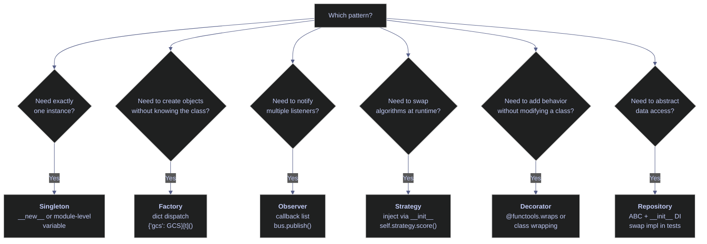

# 18. Design Patterns & Architecture - Python

> [!quote]+
>
> "When I see patterns in my programs, I consider it a sign of trouble. The shape of a program should reflect only the problem it needs to solve."
>
> — **Paul Graham**, *Revenge of the Nerds*, essay (2002)

> [!abstract]- Summary
>
> **Dependency Injection** — Constructor injection pattern: classes receive dependencies (`DataRepository`, `NotificationService`) via `__init__` rather than creating them internally. ABCs define contracts; production and test wiring differ only in the objects passed.
>
> **Design Patterns** — Six patterns with executable examples: Singleton (`__new__` override or module-level variable), Factory (dict-dispatch function returning the correct subclass), Observer (callback-list event bus with `subscribe`/`publish`), Strategy (injected algorithm object with a shared ABC interface), Decorator (composition-based class wrapping), Repository (ABC over data access, swappable via DI).
>
> **Data Validation** — Pydantic `BaseModel` validates field types, `Field()` constraints, and cross-field rules via `@model_validator` at construction time. `ValidationError` is raised at the boundary before bad data enters the pipeline.
>
> **Reflection / Introspection** — `type()`, `isinstance()`, `dir()`, `vars()`, `getattr()`, and the `inspect` module for runtime examination of classes, attributes, methods, and signatures.
>
> **Project Structure & Best Practices** — Layered package layout (`fetchers/`, `transforms/`, `loaders/`, `services/`), separation of concerns, boundary validation, environment-based config, and test strategy.
>
> **Summary** — Mermaid decision flowchart and quick-reference table mapping each pattern to its Python idiom and C# equivalent.

> [!note]- Glossary
>
> **Design pattern**
> - A named, reusable design approach for a recurring software-structure problem, described at the level of intent rather than tied to one exact implementation.
> - Used to give teams a shared vocabulary for discussing trade-offs and solutions without re-explaining the full structure every time.
>
> > [!tip] Patterns are a vocabulary, not a checklist
> >
> > A pattern is useful only when it fits the problem. Applying one because it is famous or fashionable usually adds indirection without solving anything important.
>
> ---
>
> **Dependency Injection (DI)**
> - Design approach in which an object receives the collaborators it depends on from outside, rather than constructing those collaborators internally.
> - Used to reduce coupling, improve testability, and make it easier to substitute implementations such as mocks, fakes, or alternative backends.
>
> > [!tip] Inject abstractions, not concretions
> >
> > Prefer depending on an interface, `Protocol`, or abstract contract rather than a concrete implementation class. That preserves substitutability and keeps the caller decoupled from implementation details.
>
> ---
>
> **Singleton**
> - Pattern that restricts a class or resource to a single shared instance within a chosen scope, often a process or application runtime.
> - Used for state or resources that should be coordinated centrally, such as a configuration object, cache, or connection pool handle.
>
> > [!warning] Thread safety and testability are the real risks
> >
> > Naive Singleton implementations are often unsafe under concurrency and awkward to reset in tests. In Python, a module-level shared object is usually simpler and clearer than a custom class-based Singleton.
>
> ---
>
> **Factory**
> - Function, method, or object whose responsibility is to create and return another object while hiding some or all construction details from the caller.
> - Used to centralize creation logic, choose implementations dynamically, and keep callers independent of concrete class names and setup details.
>
> > [!warning] A factory should not absorb unrelated business logic
> >
> > Creation decisions belong in the factory; domain decisions usually do not. Once the factory starts owning workflow policy, pricing rules, or business branching, it stops being just a creation abstraction.
>
> ---
>
> **Observer / Event bus**
> - Publish-subscribe design in which one component emits events and other components subscribe to be notified when those events occur.
> - Used to decouple event producers from event consumers so new reactions can be added without rewriting the producer.
>
> > [!warning] Subscription lifecycle matters
> >
> > If listeners are registered repeatedly and never removed, the same event may trigger duplicate callbacks and memory may grow unexpectedly. Always manage subscription and teardown deliberately.
>
> ---
>
> **Strategy**
> - Pattern that encapsulates interchangeable algorithms or behaviors behind a common contract so a caller can switch among them without changing its own structure.
> - Used when a system needs runtime-selectable behavior, such as scoring rules, validation policies, or output formats.
>
> > [!tip] Composition is usually cleaner than subclass proliferation
> >
> > Injecting a strategy keeps the host object stable while the algorithm varies independently. This is often easier to test and extend than creating deep subclass hierarchies.
>
> ---
>
> **Decorator pattern**
> - Pattern in which one object wraps another object that implements the same conceptual interface and adds behavior before or after delegating the call.
> - Used for cross-cutting concerns such as logging, caching, metrics, authorization, or retry behavior without modifying the wrapped class directly.
>
> > [!tip] Distinguish the pattern from Python decorator syntax
> >
> > Python's `@decorator` syntax is a language feature for transforming functions or classes. It can implement the Decorator idea in some cases, but it is not identical to the classic object-wrapper pattern.
>
> ---
>
> **Repository pattern**
> - Abstraction layer that exposes domain-oriented data access operations while hiding the details of the underlying storage mechanism.
> - Used to keep domain or service logic independent of whether data comes from SQL, an API, object storage, or an in-memory test implementation.
>
> > [!warning] Do not leak storage-specific details across the boundary
> >
> > If repository methods return ORM-specific rows or raise storage-driver-specific exceptions directly, the abstraction has failed. Translate infrastructure details into domain-friendly data and errors.
>
> ---
>
> **ABC (Abstract Base Class)**
> - Python mechanism for defining an explicit abstract contract using `abc.ABC` and `@abstractmethod`.
> - Used when a codebase wants enforced nominal inheritance and a clear, formal interface that subclasses must implement before they can be instantiated.
>
> > [!tip] ABC vs `Protocol`
> >
> > An ABC requires explicit inheritance. A `Protocol` supports structural subtyping, which is useful when you want interface-style compatibility without forcing a shared base class.
>
> ---
>
> **`__new__` vs `__init__`**
> - `__new__` creates and returns the instance object; `__init__` runs after creation to initialize that instance's state.
> - Used to explain object-construction control points, especially when implementing patterns such as Singleton or immutable object creation.
>
> > [!warning] `__init__` does not control allocation
> >
> > By the time `__init__` runs, the object already exists. Any logic that must decide whether a new instance should be created belongs in `__new__` or outside the class entirely.
>
> ---
>
> **Pydantic `BaseModel`**
> - Pydantic base class for defining typed data models with parsing, validation, and schema generation.
> - Used to validate input at system boundaries such as APIs, config loading, and file parsing, so downstream code can assume the data already satisfies declared constraints.
>
> > [!warning] Validation behavior depends on model configuration and operation
> >
> > Construction is validated by default, but not every later mutation is unless configured accordingly. Know the model's configuration before assuming post-construction assignments are automatically validated.
>
> ---
>
> **`getattr` / `setattr`**
> - Built-in Python functions for reading and writing object attributes dynamically by attribute name supplied as a string.
> - Used in reflective or metadata-driven infrastructure such as serializers, plugin dispatch, configuration loaders, and generic adapters.
>
> > [!warning] Dynamic attribute access can obscure control flow
> >
> > Overusing `getattr` and `setattr` inside domain logic makes code harder to trace, validate, and refactor. Keep this style mostly in infrastructure layers where the indirection is justified.
>
> ---
>
> **Module-level singleton**
> - Shared object created at module scope and reused through Python's module import cache, which normally executes a module once per interpreter process and then reuses it.
> - Used as the simplest Pythonic way to hold one shared instance of configuration or infrastructure state without implementing a custom Singleton class.
>
> > [!tip] Usually simpler than a class-based Singleton
> >
> > A module-level shared object avoids `__new__` tricks, repeated initialization guards, and extra boilerplate. Prefer it unless you specifically need lazy creation, explicit reset hooks, or more elaborate lifecycle control.

## Dependency Injection

> [!tip] Related pattern
>
> dbt's `ref()` and `source()` functions implement dependency injection at the SQL layer — models declare their dependencies explicitly rather than hardcoding table names, enabling the same swap-and-test pattern shown below. See [dbt-core-concepts](https://alp78.github.io/elysium/11-dbt/Foundations/dbt-core-concepts) for details.

A class receives its dependencies (DB connection, API client, logger) through its constructor rather than creating them internally. This enables testability (swap real DB for mock), flexibility (swap providers), and single responsibility. In Python, no framework is needed — just pass objects via `__init__`. C# equivalent: `Microsoft.Extensions.DependencyInjection` (`builder.Services.AddXxx`).

> [!warning] Anti-pattern — hardcoded dependencies
>
> ```python
> class PipelineService:
>     def __init__(self):
>         self.db = PostgresConnection("prod-host")  # hardcoded!
> ```
> Instead, inject via constructor: `def __init__(self, db, storage):`

> [!success] Inject dependencies via constructor
>
> ```python
> class PipelineService:
>     def __init__(self, db: DatabaseClient, storage: StorageClient):
>         self.db = db          # injected — swap for mock in tests
>         self.storage = storage
>
> # Production
> svc = PipelineService(db=PostgresConnection("prod-host"), storage=GCSClient())
> # Test
> svc = PipelineService(db=MockDatabase(), storage=MockStorage())
> ```

### Abstract base classes

ABCs define the contract. Every consumer — the pipeline service, tests, future implementations — programs against these rather than concrete classes.

#### DataRepository — data access contract

Declares `get_prices` and `save_scores`. Same signature whether the backend is SQL, BigQuery, or an in-memory mock.

*The shared imports and `DataRepository` ABC establish the contract used by the DI examples.*
```python
from abc import ABC, abstractmethod
from datetime import date
from pydantic import BaseModel, Field, model_validator, ValidationError
from typing import Callable
from typing import Optional
import inspect

class DataRepository(ABC):
    """Interface for data access — could be SQL, BigQuery, CSV, mock."""
    @abstractmethod
    def get_prices(self, ticker: str) -> list[dict]:
        ...

    @abstractmethod
    def save_scores(self, scores: list[dict]) -> int:
        ...
```

#### NotificationService — notification contract

Single-method contract for pipeline notifications.

*The `NotificationService` ABC keeps outbound messaging behind a minimal contract.*
```python
class NotificationService(ABC):
    """Interface for notifications — could be email, Slack, Pub/Sub, mock."""
    @abstractmethod
    def notify(self, message: str) -> None:
        ...
```

### Production implementations

Each concrete class implements one ABC and handles the actual I/O — database queries, Slack API calls, etc.

#### SqlRepository — database-backed data access

Connects to a SQL database and implements both retrieval and persistence. Connection string is injected. In production, `get_prices` would execute a parameterized query (`cursor.execute("SELECT * FROM prices WHERE ticker=?", ticker)`) — here it returns sample data for demonstration.

*The `SqlRepository` implementation models the production-facing side of the `DataRepository` contract.*
```python
class SqlRepository(DataRepository):
    """Real implementation — talks to a database."""
    def __init__(self, connection_string: str):
        self.conn_str = connection_string
        print(f"  SqlRepository connected to: {connection_string[:30]}...")

    def get_prices(self, ticker: str) -> list[dict]:
        return [{"ticker": ticker, "close": 178.50, "date": "2026-03-20"}]

    def save_scores(self, scores: list[dict]) -> int:
        print(f"  SqlRepository: saved {len(scores)} scores to database")
        return len(scores)
```

#### SlackNotifier — Slack notifications

Sends formatted pipeline notifications to Slack.

*The `SlackNotifier` implementation turns `notify()` calls into side effects at the integration boundary.*
```python
class SlackNotifier(NotificationService):
    def notify(self, message: str) -> None:
        print(f"  Slack: {message}")
```

### Test doubles

Replace production dependencies with in-memory alternatives. No database, no network — tests run in milliseconds.

#### MockRepository — in-memory data access

Returns hardcoded prices, captures every saved score in a list. Inspect `saved` after the test.

*The `MockRepository` test double records writes without touching a real database.*
```python
class MockRepository(DataRepository):
    """Test implementation — no database needed."""
    def __init__(self):
        self.saved: list[dict] = []

    def get_prices(self, ticker: str) -> list[dict]:
        return [{"ticker": ticker, "close": 100.0, "date": "2026-01-01"}]

    def save_scores(self, scores: list[dict]) -> int:
        self.saved.extend(scores)
        return len(scores)
```

#### MockNotifier — notification capture

Collects messages instead of sending them. Inspect `messages` after the run.

*The `MockNotifier` captures notification calls so tests can assert on them later.*
```python
class MockNotifier(NotificationService):
    def __init__(self):
        self.messages: list[str] = []
    def notify(self, message: str) -> None:
        self.messages.append(message)
```

### Pipeline service

The service class depends only on the two ABCs — it has no knowledge of SQL, Slack, or mocks.

#### PipelineService — constructor-injected orchestrator

Constructor receives both dependencies via `__init__`. `run()` orchestrates: fetch prices, compute score, persist, notify.

*The `PipelineService` depends only on injected abstractions and orchestrates one pipeline run.*
```python
class PipelineService:
    """Orchestrates the pipeline — dependencies injected via constructor."""
    def __init__(self, repo: DataRepository, notifier: NotificationService):
        self.repo = repo
        self.notifier = notifier

    def run(self, ticker: str) -> dict:
        prices = self.repo.get_prices(ticker)
        score = {"ticker": ticker, "momentum": 0.85, "rank": 1}
        self.repo.save_scores([score])
        self.notifier.notify(f"Pipeline done: {ticker} scored {score['momentum']}")
        return score
```

### Wiring — production vs. test

The same `PipelineService` class is used in both contexts. Only the objects passed to `__init__` change.

#### Production wiring

`SqlRepository` connects to prod database, `SlackNotifier` sends to team channel.

*This production wiring uses the real `SqlRepository` and `SlackNotifier` implementations.*
```python
prod_service = PipelineService(
    repo=SqlRepository("Server=prod-db;Database=stoxx"),
    notifier=SlackNotifier(),
)
result = prod_service.run("ASML.AS")
print(result)
```

```text
SqlRepository connected to: Server=prod-db;Database=stoxx...
SqlRepository: saved 1 scores to database
Slack: Pipeline done: ASML.AS scored 0.85
{'ticker': 'ASML.AS', 'momentum': 0.85, 'rank': 1}
```

#### Test wiring — swap mocks with zero code changes

Replace every dependency with a mock. `PipelineService.__init__` is identical. After the run, inspect the mock's captured state.

*This test wiring swaps in `MockRepository` and `MockNotifier` without changing `PipelineService`.*
```python
mock_repo = MockRepository()
mock_notifier = MockNotifier()
test_service = PipelineService(repo=mock_repo, notifier=mock_notifier)
result = test_service.run("TEST.XX")
print(result)
print(mock_repo.saved)
print(mock_notifier.messages)
```

```text
{'ticker': 'TEST.XX', 'momentum': 0.85, 'rank': 1}
[{'ticker': 'TEST.XX', 'momentum': 0.85, 'rank': 1}]
['Pipeline done: TEST.XX scored 0.85']
```

## Design Patterns

Design patterns are reusable solutions to common software design problems. In data engineering, they structure pipelines for testability, extensibility, and separation of concerns. The patterns below — singleton, factory, observer, strategy, decorator, and repository — appear frequently in production index-calculation and ETL codebases. Python's first-class functions and duck typing make many patterns lighter than their C# counterparts.

### Singleton — ensure exactly one instance of a class

Ensures a class has exactly one instance — useful for database connection pools, configuration managers, or loggers. In Python, the `__new__` method controls instance creation (it runs *before* `__init__`): if an instance already exists, return it instead of creating a new one. The `__init__` guard (`if self._initialized: return`) prevents re-running setup on subsequent calls. Singletons make testing harder (global state) — prefer DI with a single instance when possible.

> [!tip] Modules are natural singletons
>
> In Python, a module is only imported once. A database connection created at module level (`conn = create_connection()`) is effectively a singleton. No pattern needed.

#### Config — singleton with \_\_new\_\_

A private `_instance` class variable stores the single instance. `__new__` checks whether an instance already exists — if so, returns the existing one. The `_initialized` guard in `__init__` prevents re-running setup on subsequent calls.

*The `Config` example shows the classic class-based singleton implemented with `__new__`.*
```python
class Config:
    """Singleton configuration — only one instance ever created."""
    _instance = None

    def __new__(cls):
        if cls._instance is None:
            cls._instance = super().__new__(cls)
            cls._instance._initialized = False
        return cls._instance

    def __init__(self):
        if self._initialized:
            return
        self._initialized = True
        self.project_id = "index-lab-2"
        self.region = "europe-west1"
        self.batch_size = 5000
        print(f"  Config loaded (project={self.project_id})")
```

#### Verifying single-instance behavior

Both calls to `Config()` return the same object — `__init__` runs only on the first call (the `_initialized` guard skips re-execution). `is` confirms identity. A simpler alternative is a module-level variable — Python modules are imported once, making them natural singletons without any pattern.

*This check verifies that repeated `Config()` calls return the same object identity.*
```python
c1 = Config()
c2 = Config()
print(c1 is c2)
print(c1.project_id)
```

```text
Config loaded (project=index-lab-2)
True
index-lab-2
```

### Factory — create objects without specifying the exact class

Creates objects without specifying the exact class — select the right implementation based on config or environment. A factory function or method decides which class to instantiate based on input. `create_parser("csv")` returns a CSVParser; `create_parser("json")` returns a JSONParser. The caller doesn't need to know the concrete classes. In Python, use a function or `@classmethod` that returns the right subclass. C# equivalent: static factory method, or `IServiceProvider.GetService<T>()`.

#### StorageClient ABC and concrete backends

The abstract base class declares a single `upload` method. Three implementations — GCS, S3, and local filesystem — each format the upload result differently. Adding a new backend means adding one class and one entry in the factory.

*The `StorageClient` hierarchy keeps provider-specific behavior behind one `upload()` method.*
```python
class StorageClient(ABC):
    @abstractmethod
    def upload(self, path: str, data: bytes) -> str: ...

class GCSClient(StorageClient):
    def upload(self, path: str, data: bytes) -> str:
        return f"gs://bucket/{path} ({len(data)} bytes)"

class S3Client(StorageClient):
    def upload(self, path: str, data: bytes) -> str:
        return f"s3://bucket/{path} ({len(data)} bytes)"

class LocalClient(StorageClient):
    def upload(self, path: str, data: bytes) -> str:
        return f"file://{path} ({len(data)} bytes)"
```

#### create_storage_client — factory function

Maps a provider string to a concrete class via dictionary dispatch. The caller gets back a `StorageClient` without knowing which class was instantiated.

*The `create_storage_client()` function maps provider keys to concrete storage clients.*
```python
def create_storage_client(provider: str = "gcs") -> StorageClient:
    """Factory: create storage client based on provider name."""
    clients = {
        "gcs": GCSClient,
        "s3": S3Client,
        "local": LocalClient,
    }
    if provider not in clients:
        raise ValueError(f"Unknown provider: {provider}. Choose from: {list(clients.keys())}")
    return clients[provider]()
```

#### Provider-agnostic usage

The loop creates three clients through the factory. Each upload returns a provider-specific path — the consuming code is identical regardless of backend.

*This loop shows one caller using the same factory API for `gcs`, `s3`, and `local`.*
```python
for provider in ["gcs", "s3", "local"]:
    client = create_storage_client(provider)
    result = client.upload("bronze/data.csv", b"OHLCV data")
    print(f"  {provider:5s} -> {result}")
```

```text
gcs   -> gs://bucket/bronze/data.csv (10 bytes)
s3    -> s3://bucket/bronze/data.csv (10 bytes)
local -> file://bronze/data.csv (10 bytes)
```

### Observer — one-to-many event notification

One-to-many notification: when a subject changes state, all registered observers are notified. In Python, implement with callbacks (list of functions) or the built-in `property` setter that triggers notifications. Notifies multiple listeners when something happens — pipeline events (step completed, error occurred, data ready). Multiple consumers react to the same event without coupling. C# equivalent: `event`/`delegate` pattern, or `IObservable<T>`. GCP equivalent: Pub/Sub (same pattern, distributed).

#### PipelineEventBus — subject

The event bus maintains a dictionary of event names to subscriber lists. `subscribe()` registers a callback; `publish()` iterates all subscribers for that event type and invokes each one.

*The `PipelineEventBus` stores subscribers by event name and fans out payloads with `publish()`.*
```python
class PipelineEventBus:
    """Simple observer/event bus — subscribe to events, publish notifications."""
    def __init__(self):
        self._subscribers: dict[str, list[Callable]] = {}

    def subscribe(self, event: str, callback: Callable) -> None:
        """Register a callback for an event type."""
        self._subscribers.setdefault(event, []).append(callback)

    def publish(self, event: str, data: dict) -> None:
        """Notify all subscribers of an event."""
        for callback in self._subscribers.get(event, []):
            callback(data)
```

#### Handler functions — observers

Three lightweight handlers subscribe to the same event type. `log_handler` prints every event, `metrics_handler` only fires when the event carries row counts, and `alert_handler` only fires on errors. Each handler is independent.

*These observer callbacks react to the same event without depending on one another.*
```python
def log_handler(data: dict):
    print(f"  [LOG]   {data}")

def alert_handler(data: dict):
    if data.get("status") == "error":
        print(f"  [ALERT] Pipeline error: {data.get('message')}")

def metrics_handler(data: dict):
    if "rows" in data:
        print(f"  [METRIC] rows_loaded = {data['rows']}")
```

#### Wiring subscribers and publishing events

All three handlers subscribe to `"step_completed"`. Publishing three pipeline events demonstrates selective handling — the ok events trigger LOG + METRIC, the error event triggers LOG + ALERT.

*Publishing three `step_completed` events shows how the observer set fans out different reactions.*
```python
bus = PipelineEventBus()
bus.subscribe("step_completed", log_handler)
bus.subscribe("step_completed", metrics_handler)
bus.subscribe("step_completed", alert_handler)

bus.publish("step_completed", {"step": "ohlcv_load", "status": "ok", "rows": 306})
bus.publish("step_completed", {"step": "silver_transform", "status": "ok", "rows": 306})
bus.publish("step_completed", {"step": "gold_score", "status": "error", "message": "BQ timeout"})
```

```text
[LOG]   {'step': 'ohlcv_load', 'status': 'ok', 'rows': 306}
[METRIC] rows_loaded = 306
[LOG]   {'step': 'silver_transform', 'status': 'ok', 'rows': 306}
[METRIC] rows_loaded = 306
[LOG]   {'step': 'gold_score', 'status': 'error', 'message': 'BQ timeout'}
[ALERT] Pipeline error: BQ timeout
```

### Strategy — swap algorithms at runtime

Swap algorithms at runtime by passing functions or objects with a common interface. Instead of if/else chains selecting a scoring method, accept the scoring function as a parameter. Python's first-class functions make this trivial: just pass the function directly. Useful for different scoring algorithms, export formats, or retry policies. The context class delegates to a strategy object. C# equivalent: interface + DI, or `Func<T>` delegate.

#### ScoringStrategy — algorithm contract

The ABC declares two methods: `score()` takes a price list and returns a float, `name()` identifies the strategy. Every concrete strategy implements both.

*The `ScoringStrategy` ABC defines the shared `score()` and `name()` contract.*
```python
class ScoringStrategy(ABC):
    """Interface for different scoring algorithms."""
    @abstractmethod
    def score(self, prices: list[float]) -> float: ...

    @abstractmethod
    def name(self) -> str: ...
```

#### MomentumStrategy

Scores based on the latest price relative to the mean — positive means the latest is above average, suggesting upward momentum.

*The `MomentumStrategy` compares the latest close against the series mean.*
```python
class MomentumStrategy(ScoringStrategy):
    """Score based on price momentum (last vs average)."""
    def score(self, prices: list[float]) -> float:
        if not prices: return 0.0
        avg = sum(prices) / len(prices)
        return (prices[-1] - avg) / avg
    def name(self) -> str: return "Momentum"
```

#### VolatilityStrategy

Computes coefficient of variation (std dev / mean), negated so lower volatility yields a higher (less negative) score.

*The `VolatilityStrategy` favors smoother price series by returning a less negative score for lower variation.*
```python
class VolatilityStrategy(ScoringStrategy):
    """Score based on price volatility (lower = better)."""
    def score(self, prices: list[float]) -> float:
        if len(prices) < 2: return 0.0
        avg = sum(prices) / len(prices)
        variance = sum((p - avg) ** 2 for p in prices) / len(prices)
        return -(variance ** 0.5 / avg)  # negative: lower vol = higher score
    def name(self) -> str: return "Volatility"
```

#### MeanReversionStrategy

Scores based on distance below the mean — the farther the latest price is below average, the higher the score, betting on reversion to the mean.

*The `MeanReversionStrategy` rewards prices that sit below the recent mean.*
```python
class MeanReversionStrategy(ScoringStrategy):
    """Score based on distance from mean (farther below = higher score)."""
    def score(self, prices: list[float]) -> float:
        if not prices: return 0.0
        avg = sum(prices) / len(prices)
        return (avg - prices[-1]) / avg  # below avg = positive score
    def name(self) -> str: return "MeanReversion"
```

#### StockScorer — strategy consumer

The context class receives any `ScoringStrategy` via `__init__`. `evaluate()` delegates to the injected strategy — the scorer does not know or care which algorithm it uses.

*The `StockScorer` delegates evaluation to whichever `ScoringStrategy` it receives.*
```python
class StockScorer:
    """Scores stocks using a pluggable strategy."""
    def __init__(self, strategy: ScoringStrategy):
        self.strategy = strategy  # injected

    def evaluate(self, ticker: str, prices: list[float]) -> dict:
        return {
            "ticker": ticker,
            "strategy": self.strategy.name(),
            "score": round(self.strategy.score(prices), 4),
        }
```

#### Evaluating with different strategies

The same ASML.AS price series is scored with all three strategies. Momentum and Volatility return small negatives; MeanReversion returns a small positive since the latest price is below average.

*This comparison runs the same price series through three interchangeable scoring strategies.*
```python
prices = [685.0, 690.0, 680.0, 695.0, 710.0, 700.0, 685.0]

for strategy in [MomentumStrategy(), VolatilityStrategy(), MeanReversionStrategy()]:
    scorer = StockScorer(strategy)
    result = scorer.evaluate("ASML.AS", prices)
    print(f"  {result['strategy']:15s} score={result['score']:+.4f}")
```

```text
Momentum        score=-0.0103
Volatility      score=-0.0138
MeanReversion   score=+0.0103
```

### Decorator — wrap an object with additional behavior

Not to be confused with Python's `@decorator` syntax (which is a language feature). The decorator pattern wraps an object with additional behavior while keeping the same interface. Example: a `LoggingConnection` wraps a `DatabaseConnection`, adding logging to every query without modifying the original class. In Python, function decorators (`@functools.wraps`) are common, but the object-wrapper pattern is still useful when you need to compose behaviors around class instances.

#### LoggingStore — object-wrapper decorator

`LoggingStore` implements the same `FileStore` contract as its wrapped object. The caller still invokes `write()`, but the decorator adds pre- and post-call logging around the delegated operation.

*This decorator example wraps `MemoryFileStore.write()` with logging while preserving the same `FileStore` interface.*
```python
from abc import ABC, abstractmethod

class FileStore(ABC):
    @abstractmethod
    def write(self, name: str, payload: bytes) -> str:
        ...

class MemoryFileStore(FileStore):
    def write(self, name: str, payload: bytes) -> str:
        return f"stored {name} ({len(payload)} bytes)"

class LoggingStore(FileStore):
    def __init__(self, inner: FileStore):
        self.inner = inner

    def write(self, name: str, payload: bytes) -> str:
        print(f"LOG start -> {name}")
        result = self.inner.write(name, payload)
        print(f"LOG done  -> {result}")
        return result

store = LoggingStore(MemoryFileStore())
print(store.write("scores.json", b'{"rank": 1}'))
```

```text
LOG start -> scores.json
LOG done  -> stored scores.json (11 bytes)
stored scores.json (11 bytes)
```

### Repository — abstract data access behind a clean interface

Abstracts data access behind a clean interface. `repo.get_prices(symbol, date)` works whether the data comes from SQL Server, BigQuery, a CSV file, or a mock. The pipeline code depends on the interface, not the storage technology. Combined with dependency injection, this is the foundation for testable data pipelines — swap `SqlRepository` for `MockRepository` in tests without changing any pipeline logic.

#### PriceRepository — swappable persistence boundary

The service-level function below calculates a closing-price gap through the `PriceRepository` interface only. The `SqlPriceRepository` and `MemoryPriceRepository` implementations return different datasets, but the caller code stays identical.

*This repository example keeps the `closing_gap()` function independent of whether data comes from SQL or memory.*
```python
from abc import ABC, abstractmethod

class PriceRepository(ABC):
    @abstractmethod
    def latest_two_closes(self, ticker: str) -> list[float]:
        ...

class SqlPriceRepository(PriceRepository):
    def latest_two_closes(self, ticker: str) -> list[float]:
        return [698.5, 700.0]

class MemoryPriceRepository(PriceRepository):
    def latest_two_closes(self, ticker: str) -> list[float]:
        return [100.0, 103.0]

def closing_gap(repo: PriceRepository, ticker: str) -> float:
    first, last = repo.latest_two_closes(ticker)
    return round(last - first, 2)

print(closing_gap(SqlPriceRepository(), "ASML.AS"))
print(closing_gap(MemoryPriceRepository(), "TEST.XX"))
```

```text
1.5
3.0
```

## Data Validation

Pydantic validates data at construction time using Python type hints — if the input doesn't match the schema, a `ValidationError` is raised before bad data enters the pipeline. This catches problems at the boundary (API input, file parse, config load) rather than deep inside transformation logic where the root cause is harder to trace.

> [!info] Pydantic data validation
>
> - Define data shape with type hints — validates on construction, raises `ValidationError` if invalid
> - `Field()` — adds constraints (min, max, regex, default)
> - `model_validate()` — parses dict → model
> - `model_dump()` — serializes model → dict
> - Catches bad data at the boundary (API input, file load, config parse) before it flows into pipelines
> - C# equivalent: `DataAnnotations` (`[Required]`, `[Range]`) + FluentValidation

### Pydantic model validation

Pydantic validates data at construction time. Define the schema as a class with type hints and `Field` constraints — if input violates any rule, a `ValidationError` is raised immediately.

#### OhlcvRecord — validated price model

Each field uses `Field()` with constraints: `min_length`/`max_length` for strings, `gt`/`ge` for numeric bounds. The `@model_validator` adds a cross-field check ensuring High >= Low.

*The `OhlcvRecord` model validates prices and enforces `high >= low` after field parsing.*
```python
class OhlcvRecord(BaseModel):
    """Validated OHLCV record — catches bad data before pipeline ingestion."""
    symbol: str = Field(..., min_length=1, max_length=20, description="Ticker symbol")
    trade_date: date = Field(..., description="Trading date")
    open: float = Field(..., gt=0, description="Opening price")
    high: float = Field(..., gt=0)
    low: float = Field(..., gt=0)
    close: float = Field(..., gt=0)
    volume: int = Field(..., ge=0)

    @model_validator(mode="after")
    def high_gte_low(self):
        if self.high < self.low:
            raise ValueError(f"high ({self.high}) must be >= low ({self.low})")
        return self
```

#### PipelineConfig — validated configuration

Configuration model with a regex pattern on `name`, bounded `batch_size` and `max_retries`, and a `dry_run` flag. Invalid config is caught before the pipeline starts.

*The `PipelineConfig` model constrains pipeline names, retry limits, and storage targets.*
```python
class PipelineConfig(BaseModel):
    """Validated pipeline configuration."""
    name: str = Field(..., pattern=r"^[a-z][a-z0-9_]*$")
    batch_size: int = Field(default=5000, ge=100, le=100_000)
    max_retries: int = Field(default=3, ge=0, le=10)
    source_bucket: str = Field(..., min_length=3)
    destination_table: str
    dry_run: bool = False
```

#### Valid data — passes all constraints

A well-formed OHLCV record and pipeline config. Pydantic returns the validated model; `model_dump()` serializes to dict.

*This example constructs valid `OhlcvRecord` and `PipelineConfig` instances and prints their normalized values.*
```python
record = OhlcvRecord(
    symbol="ASML.AS", trade_date=date(2026, 3, 20),
    open=685.0, high=710.0, low=680.0, close=700.0, volume=1_500_000
)
print(record)
print(record.model_dump())

config = PipelineConfig(
    name="events_etl",
    source_bucket="index-lab-2-data",
    destination_table="index_data.bronze_ohlcv",
)
print(config)
```

```text
symbol='ASML.AS' trade_date=datetime.date(2026, 3, 20) open=685.0 high=710.0 low=680.0 close=700.0 volume=1500000
{'symbol': 'ASML.AS', 'trade_date': datetime.date(2026, 3, 20), 'open': 685.0, 'high': 710.0, 'low': 680.0, 'close': 700.0, 'volume': 1500000}
name='events_etl' batch_size=5000 max_retries=3 source_bucket='index-lab-2-data' destination_table='index_data.bronze_ohlcv' dry_run=False
```

#### Invalid data — caught at the boundary

Each invalid input triggers a different rule: negative price fails `gt=0`, High < Low fails the `model_validator`, empty symbol fails `min_length`, bad config name fails the regex pattern.

*This loop shows `ValidationError` messages for four different boundary failures.*
```python
bad_inputs = [
    {"label": "Negative price", "data": {"symbol": "X", "trade_date": "2026-01-01", "open": -5, "high": 10, "low": 8, "close": 9, "volume": 100}},
    {"label": "High < Low", "data": {"symbol": "X", "trade_date": "2026-01-01", "open": 10, "high": 5, "low": 8, "close": 9, "volume": 100}},
    {"label": "Empty symbol", "data": {"symbol": "", "trade_date": "2026-01-01", "open": 10, "high": 12, "low": 8, "close": 11, "volume": 100}},
    {"label": "Bad config name", "data": {"name": "Bad-Name!", "source_bucket": "b", "destination_table": "t"}},
]

for case in bad_inputs:
    try:
        if "symbol" in case["data"]:
            OhlcvRecord(**case["data"])
        else:
            PipelineConfig(**case["data"])
        print(f"  {case['label']}: PASSED (unexpected)")
    except ValidationError as e:
        print(f"  {case['label']}: CAUGHT — {e.errors()[0]['msg']}")
```

```text
Negative price: CAUGHT — Input should be greater than 0
High < Low: CAUGHT — Value error, high (5.0) must be >= low (8.0)
Empty symbol: CAUGHT — String should have at least 1 character
Bad config name: CAUGHT — String should match pattern '^[a-z][a-z0-9_]*$'
```

## Reflection / Introspection

Python is deeply introspective — you can inspect any object's type, attributes, methods, source code, and module at runtime. C# equivalent: `System.Reflection` (`typeof`, `GetType`, `GetProperties`, `GetMethods`). Use cases include plugin systems, serializers, ORMs, debugging, and documentation generation.

### Inspecting objects at runtime

Python's introspection tools operate on any object. The `TradeOrder` class below serves as the inspection target for every example in this section.

#### TradeOrder — inspection target

A trade model with a class attribute `MAX_QUANTITY`, four instance attributes set in `__init__`, a computed `notional()` method, and a custom `__repr__`.

*The `TradeOrder` class provides a simple object for the introspection examples that follow.*
```python
class TradeOrder:
    """Sample class to inspect."""
    MAX_QUANTITY = 1_000_000

    def __init__(self, ticker: str, side: str, quantity: int, price: float):
        self.ticker = ticker
        self.side = side
        self.quantity = quantity
        self.price = price

    def notional(self) -> float:
        return self.quantity * self.price

    def __repr__(self) -> str:
        return f"TradeOrder({self.ticker}, {self.side}, {self.quantity}, {self.price})"

order = TradeOrder("ASML.AS", "BUY", 100, 685.40)
```

#### type() and isinstance()

`type()` returns the class object itself, `type().__name__` gives the string name, `isinstance()` checks membership in a class hierarchy.

*These checks show the runtime type and class membership of the `order` instance.*
```python
print(type(order))
print(type(order).__name__)
print(isinstance(order, TradeOrder))
```

```text
<class '__main__.TradeOrder'>
TradeOrder
True
```

#### dir() — list public attributes and methods

`dir()` returns all attributes; filtering out dunder names shows the public API: class attributes, instance attributes, and methods together.

*Filtering `dir(order)` reveals the public attributes and methods exposed by the instance.*
```python
public = [m for m in dir(order) if not m.startswith("_")]
print(public)
```

```text
['MAX_QUANTITY', 'notional', 'price', 'quantity', 'side', 'ticker']
```

#### vars() — instance attributes only

`vars()` returns the instance's `__dict__` — only attributes set in `__init__`, not class attributes or methods.

*`vars(order)` isolates the instance attributes assigned by `__init__`.*
```python
print(vars(order))
```

```text
{'ticker': 'ASML.AS', 'side': 'BUY', 'quantity': 100, 'price': 685.4}
```

#### getattr() — dynamic attribute access

`getattr(obj, name)` retrieves an attribute by string name — Python's equivalent of C#'s reflection `GetProperty().GetValue()`. Combined with `callable()`, it distinguishes data attributes from methods.

*This loop uses `getattr()` to read both fields and methods from the same object dynamically.*
```python
for attr in ["ticker", "side", "quantity", "notional"]:
    if hasattr(order, attr):
        val = getattr(order, attr)
        if callable(val):
            print(f"  {attr}() = {val()}")
        else:
            print(f"  {attr} = {val}")
```

```text
ticker = ASML.AS
side = BUY
quantity = 100
notional() = 68540.0
```

#### inspect module — deeper introspection

The `inspect` module examines classes and functions: `isclass()` checks type, `getmembers()` finds methods, `getfile()` locates the source, and `signature()` extracts parameter names and type annotations.

*This `inspect` example prints the class check, bound methods, source origin, and constructor signature.*
```python
print(inspect.isclass(TradeOrder))
print([m[0] for m in inspect.getmembers(order, predicate=inspect.ismethod)])
try:
    print(f"  Source file: {inspect.getfile(TradeOrder)}")
except OSError:
    print("  Source file: <notebook cell> (no file on disk)")

sig = inspect.signature(TradeOrder.__init__)
for name, param in sig.parameters.items():
    if name == "self": continue
    print(f"  {name}: {param.annotation.__name__ if param.annotation != inspect.Parameter.empty else 'Any'}")
```

```text
True
['__init__', '__repr__', 'notional']
  Source file: <stdin>

ticker: str
side: str
quantity: int
price: float
```

## Project Structure & Best Practices

A well-organized Python project separates concerns by responsibility (fetching, transforming, loading), keeps configuration external, and mirrors the source layout in tests. The structure below follows the package conventions used in production index-calculation pipelines.

### Recommended project layout

*This reference tree shows a layered `src/`, `tests/`, and `scripts/` layout for a pipeline repository.*
```text
index-pipeline/
├── pyproject.toml           # Project metadata, dependencies, tool config
├── requirements.txt         # Pinned dependencies (pip freeze)
├── .env                     # Local env vars (do not commit)
├── .gitignore               # Ignore .env, __pycache__, .venv, *.pyc
│
├── src/                     # Source code
│   ├── __init__.py
│   ├── config.py            # Configuration (env vars, defaults)
│   ├── models.py            # Pydantic models (OhlcvRecord, PipelineConfig)
│   ├── db.py                # Database connection factory
│   │
│   ├── fetchers/            # Data ingestion
│   │   ├── __init__.py
│   │   ├── ohlcv.py         # yfinance OHLCV fetcher
│   │   └── signals.py       # Daily/quarterly signal fetcher
│   │
│   ├── transforms/          # Bronze → Silver → Gold
│   │   ├── __init__.py
│   │   ├── clean.py         # Bronze → Silver (dedup, gap-fill)
│   │   └── score.py         # Silver → Gold (z-scores, ranks)
│   │
│   ├── loaders/             # Write to storage/DB
│   │   ├── __init__.py
│   │   ├── bigquery.py      # BigQuery loader
│   │   └── firestore.py     # Firestore writer
│   │
│   └── services/            # Business logic
│       ├── __init__.py
│       └── pipeline.py      # PipelineService (DI, orchestration)
│
├── tests/                   # Test code (mirrors src/)
│   ├── conftest.py          # Shared fixtures
│   ├── test_transforms.py   # Pure function tests
│   ├── test_loaders.py      # Mock external services
│   └── test_pipeline.py     # Integration tests
│
└── scripts/                 # CLI entry points
    ├── run_pipeline.py      # python scripts/run_pipeline.py --step ohlcv
    └── setup_index.py       # One-time index setup
```

### Engineering Practices

#### Keep `fetchers/`, `transforms/`, `loaders/`, and `services/` isolated by responsibility

Reference-style Python projects keep I/O boundaries thin and explicit: `fetchers/` obtain data, `transforms/` stay deterministic, `loaders/` write results, and `services/` orchestrate. Read configuration through `os.environ`, validate payloads as they cross boundaries, and keep tests focused on pure transformations while mocking external calls.

*This pipeline sketch keeps each step narrow and reads `PIPELINE_ENV` from the environment instead of hardcoding deployment state.*
```python
import os

os.environ["PIPELINE_ENV"] = "dev"

def fetch_prices() -> list[float]:
    return [100.0, 101.5]

def score(prices: list[float]) -> float:
    return round(prices[-1] - prices[0], 2)

def load(score_value: float) -> str:
    return f"loaded score={score_value}"

prices = fetch_prices()
print(prices)
print(score(prices))
print(load(score(prices)))
print(os.environ["PIPELINE_ENV"])
```

```text
[100.0, 101.5]
1.5
loaded score=1.5
dev
```

## Summary

*This Mermaid flowchart maps common design pressures to the pattern that best fits them.*


> [!abstract]- Design Patterns Quick Reference
>
> | Pattern | Python | Usage |
> |---|---|---|
> | **Dependency Injection** | `def __init__(self, repo)` | Inject via constructor; `Service(SqlRepo())` in prod, `Service(MockRepo())` in test |
> | **Singleton** | `def __new__(cls)` | Create once, return same. Better: module-level variable (modules ARE singletons) |
> | **Factory** | `def create_client(t)` | `return {"gcs": GCS, "s3": S3}[t]()` — return right subclass |
> | **Observer** | `bus.subscribe("event", cb)` | Register listeners, `bus.publish("event", data)` notifies all |
> | **Strategy** | `def __init__(self, strategy)` | Inject algorithm, delegate via `self.strategy.evaluate()` |
> | **Decorator** | `class Wrapper(Interface)` | Wraps inner instance via composition, or `@functools.wraps` for functions |
> | **Repository** | `class Repo(ABC)` | Abstract data access, swap `SqlRepo` / `MockRepo` via DI |
> | **Validation** | `class Model(BaseModel)` | Pydantic auto-validates on creation with type hints + `Field()` |
> | **Reflection** | `type()`, `dir()`, `getattr()` | Type checking, attribute listing, dynamic access, `inspect.signature()` |
>
> **C# equivalents:** `ABC`/`abstractmethod` → `interface` | `__init__(dep)` → constructor injection | `AddSingleton<T>()` → DI lifetime | `Pydantic` → DataAnnotations + FluentValidation | `inspect` → `System.Reflection`

## Anti-Patterns

### Common failures

#### Avoid `__init__`-only singletons, duplicate `subscribe()` calls, and business-heavy factories

`__init__` cannot enforce singleton identity because allocation already happened before it runs. Observer-style systems also need guarded `subscribe()` logic so the same handler is not appended repeatedly during tests or reloads. Keep factory functions focused on selecting constructors such as `{"gcs": GCSClient}` rather than mixing in unrelated workflow policy.

*This anti-pattern check shows that plain `__init__` instances are distinct, listener registration should deduplicate, and factories should resolve to a constructor target only.*
```python
class BrokenConfig:
    def __init__(self):
        self.project = "alpha"

a = BrokenConfig()
b = BrokenConfig()
print(a is b)

listeners = []
def subscribe(callback: str) -> None:
    if callback not in listeners:
        listeners.append(callback)

subscribe("handler")
subscribe("handler")
print(listeners)

clients = {"gcs": "GCSClient", "s3": "S3Client"}
print(clients["gcs"])
```

```text
False
['handler']
GCSClient
```

## Recommended Patterns

### Defaults that scale

#### Prefer constructor injection with `ABC` contracts and keep light reflection at the boundary

Default to constructor injection so dependencies stay explicit and swappable. Type those constructor parameters to an `ABC` or `Protocol`, then reserve light reflection such as `hasattr()` or `vars()` for serializers, adapters, and diagnostics rather than core domain logic.

*This service example accepts a `Repo` abstraction, preserves the contract in annotations, and still allows minimal boundary reflection through `hasattr()`.*
```python
from abc import ABC, abstractmethod

class Repo(ABC):
    @abstractmethod
    def name(self) -> str:
        ...

class SqlRepo(Repo):
    def name(self) -> str:
        return "sql"

class Service:
    def __init__(self, repo: Repo):
        self.repo = repo

svc = Service(SqlRepo())
print(type(svc.repo).__name__)
print(Service.__init__.__annotations__["repo"].__name__)
print(hasattr(svc.repo, "name"))
```

```text
SqlRepo
Repo
True
```

## Python Design Patterns and Architecture Troubleshooting

### Diagnostic checks

#### Inspect `__abstractmethods__`, normalize keys with `.lower().strip()`, and deduplicate listener state

When a pattern fails, inspect the contract or dispatch boundary before rewriting the design. `__abstractmethods__` immediately reveals which method keeps an `ABC` subclass abstract, `.lower().strip()` prevents avoidable factory misses caused by user input, and checking the listener list tells you whether setup code registered the same callback twice.

*This diagnostic snippet surfaces missing abstract methods, normalizes a factory key, and confirms that duplicate listener registration collapses to one entry.*
```python
from abc import ABC, abstractmethod

class Repo(ABC):
    @abstractmethod
    def get(self):
        ...

    @abstractmethod
    def save(self):
        ...

class BrokenRepo(Repo):
    def get(self):
        return []

clients = {"gcs": "GCSClient", "s3": "S3Client"}
raw = " S3 "
listeners = []
for handler in ["metrics", "metrics"]:
    if handler not in listeners:
        listeners.append(handler)

print(sorted(BrokenRepo.__abstractmethods__))
print(clients[raw.lower().strip()])
print(listeners)
```

```text
['save']
S3Client
['metrics']
```

