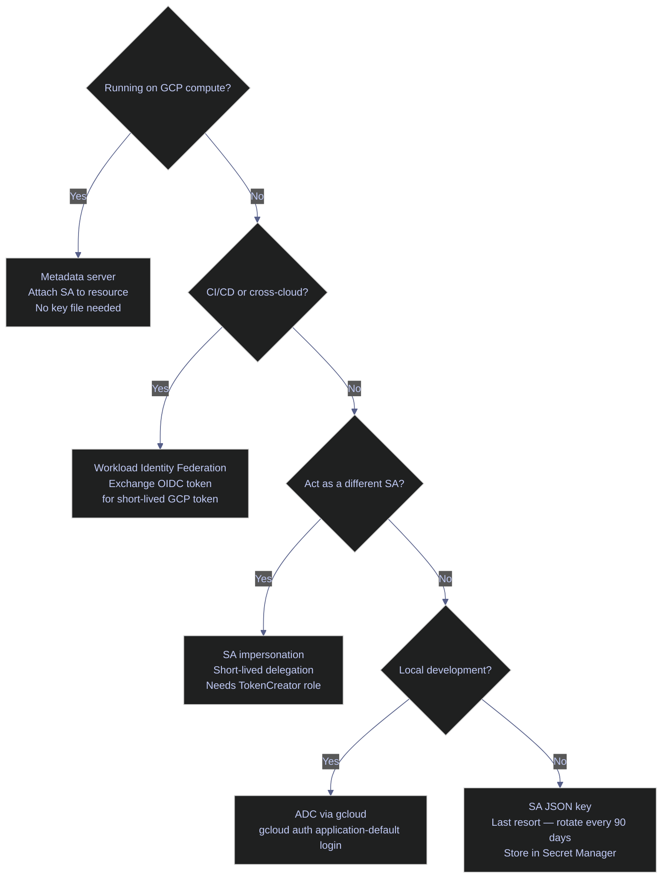
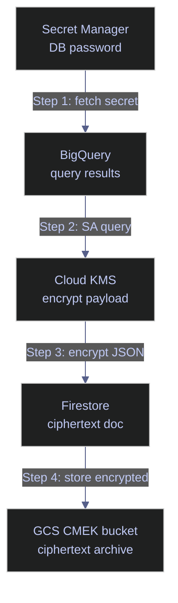

# 21. Security Operations — Encryption, Certificates & Identity

> [!quote]
> "The only truly secure system is one that is powered off, cast in a block of concrete, and sealed in a lead-lined room with armed guards — and even then I have my doubts."
>
> — **Gene Spafford**, attributed remark (c. 1989)

> [!tip] Prerequisite Reading
>
> For the theoretical framework behind these operations — identity model, credential types, OAuth2 flows, and connection patterns — see [gcp-identity-and-connection-patterns](https://alp78.github.io/elysium/06-GCP/Security/gcp-identity-and-connection-patterns).

> [!abstract]- Summary
>
> **Environment Setup**
> - Imports all third-party and Google Cloud libraries; verifies versions; loads `.env` via `load_dotenv`; defines project constants (`PROJECT_ID`, `KMS_KEYRING`, `BUCKET_NAME`, etc.); validates credentials with an explicit token refresh.
>
> **Identity and Authentication**
> - SA key-file auth (`Credentials.from_service_account_file`); scope restriction with `with_scopes`; ADC lookup chain via `google.auth.default`; service account impersonation with short-lived tokens; `IAMCredentialsClient.generate_access_token` (600 s TTL); raw Bearer-token HTTP calls; Workload Identity Federation (GitHub OIDC → STS → GCP); ID token vs access token distinction; JWT decode; `testIamPermissions` dry-run check.
>
> **Secret Manager**
> - Read by version (`latest` and pinned); parse JSON secrets; create secrets with labels and automatic replication; rotate with `add_secret_version`; disable old versions; audit IAM policy; startup-load and lazy-cache-with-TTL application patterns.
>
> **Cloud KMS**
> - Symmetric encrypt/decrypt for payloads ≤ 64 KiB; envelope encryption (AES-256-GCM DEK + KMS-wrapped DEK) for large data; latency benchmark across payload sizes; client-side KMS encrypt before GCS upload; download and decrypt; list key versions and rotation metadata; CMEK bucket verification.
>
> **Compute Engine**
> - SSH via `paramiko` with Ed25519 key and OS Login username; OS Login key list; IAP TCP tunnel reference; metadata server endpoint table and `curl` usage; firewall audit with `FirewallsClient` flagging `0.0.0.0/0` rules.
>
> **Cloud SQL**
> - Auth method comparison table and decision matrix; dynamic IP allowlisting with `gcloud sql instances patch`; `pymssql` password auth; server CA certificate download and `cryptography` inspection; `pymssql` SSL-verified connection via `TDSSSL`/`TDSCAFILE`; Auth Proxy reference; authorized-networks audit; CMEK-at-rest verification.
>
> **BigQuery**
> - Authenticated queries with SA key and impersonated credentials; column-level KMS encryption before insert; ciphertext query and client-side decrypt; dataset and per-table encryption audit; authorized view for column-level access control.
>
> **Firestore**
> - SA-authenticated CRUD (`set`, `update`, `delete`); field-level KMS encryption before write and decrypt after read; IAM-based access control demo; scope-restriction 403 demonstration; IAM role audit via `gcloud`.
>
> **Cloud Storage**
> - CMEK-bucket upload with `blob.reload()` CMEK verification; AES-256-GCM client-side encryption + KMS-wrapped key stored as separate blob; download and decrypt; CSEK (customer-supplied key) upload/download; signed GET URL (15 min); signed PUT URL for direct-upload; bucket IAM policy audit.
>
> **Cross-Service Security Patterns**
> - End-to-end pipeline: Secret Manager → BigQuery → KMS encrypt → Firestore → GCS (triple-layer encryption); TLS certificate chain inspection for `bigquery.googleapis.com` using `ssl` + `cryptography`.
>
> **Cleanup and Cost Control**
> - GCS demo-file deletion; BigQuery table/view cleanup; Firestore document cleanup; Cloud SQL stop (`activation-policy=NEVER`); VM stop; full irreversible teardown commands.
>
> **Warnings / Recommendations / Troubleshooting**
> - Standalone `[!warning]`/`[!success]` pairs for KMS payload size, SSL validation, token logging, and DEK version tagging; eight operational recommendations; troubleshooting table for eight common errors.

> [!note]- Glossary
>
> **ADC (Application Default Credentials)**
>
> - Google's credential resolution chain checked automatically by all GCP client libraries; priority order: `GOOGLE_APPLICATION_CREDENTIALS` env var → gcloud user credentials → Compute Engine metadata server → Workload Identity Federation config.
> - All notebook cells use ADC unless `GOOGLE_APPLICATION_CREDENTIALS` is set explicitly, which pins the identity to a specific SA key file.
>
> > [!tip] ADC credential source in use
> >
> > Call `google.auth.default()` and inspect `type(credentials).__name__` to confirm which credential source ADC resolved to at runtime.
>
> > ---
>
> **Service Account Impersonation**
>
> - A source identity requests short-lived credentials for a target SA via the IAM Credentials API using `impersonated_credentials.Credentials`; requires `roles/iam.serviceAccountTokenCreator` on the target SA.
> - Credentials expire automatically (up to 3 600 s); the source identity never downloads or stores the target SA's key file.
>
> > [!warning] Scope impersonation tightly
> >
> > Grant `serviceAccountTokenCreator` on a specific target SA, never at project level. Audit the binding with `gcloud iam service-accounts get-iam-policy`.
>
> > ---
>
> **Cloud KMS — Symmetric Encryption**
>
> - Encrypts and decrypts data directly inside Google-operated HSMs using the `encrypt` / `decrypt` API; the key bytes never leave the HSM, and the caller sends plaintext (up to 64 KiB) and receives ciphertext.
> - Each ciphertext envelope contains an embedded key-version identifier so `decrypt` automatically routes to the correct version without the caller specifying it.
>
> > [!warning] 64 KiB payload limit
> >
> > Sending payloads larger than 64 KiB to `kms_client.encrypt` raises `INVALID_ARGUMENT`. Use envelope encryption for larger data.
>
> > ---
>
> **Envelope Encryption**
>
> - Two-layer scheme: a fresh 256-bit AES-GCM Data Encryption Key (DEK) encrypts the payload locally, then Cloud KMS encrypts the DEK; only the small DEK (32 bytes) is sent to the KMS API.
> - The wrapped DEK and nonce are stored alongside the ciphertext; decryption reverses the order — KMS unwraps the DEK, then the application decrypts locally.
>
> > [!danger] Never store the plaintext DEK
> >
> > Store only the KMS-wrapped DEK next to the ciphertext. A plaintext DEK in the same location eliminates the protection that envelope encryption provides.
>
> > ---
>
> **Secret Version**
>
> - An immutable, numbered snapshot of a secret's byte value stored in Secret Manager; each `add_secret_version` call creates a new version while previous versions remain accessible until explicitly disabled or destroyed.
> - Consumers reference a version as `latest` (always the newest enabled version) or by a pinned number such as `versions/1` for reproducibility.
>
> > [!warning] `latest` can change between pipeline runs
> >
> > Pin to a specific version number in production deployments. Reserve `latest` for development or when an automated rotation workflow updates the consumer config immediately after each rotation.
>
> > ---
>
> **SSL/TLS Mutual Auth**
>
> - Both client and server present X.509 certificates during the TLS handshake; the server's CA certificate proves the server's identity, and the client cert/key pair proves the client's identity to the server.
> - Cloud SQL mutual TLS requires: the server CA cert (`TDSCAFILE`), a client certificate, and a client private key — all three must be supplied to the driver.
>
> > [!danger] Never use `TrustServerCertificate=yes` in production
> >
> > This flag accepts any certificate without validation, leaving the connection open to man-in-the-middle attacks even though traffic is encrypted.
>
> > ---
>
> **Access Token**
>
> - A short-lived OAuth 2.0 bearer string (default TTL 1 hour, minimum 300 s via `generateAccessToken`) that authorizes calls to Google APIs scoped at issuance time; any HTTP client can use it in an `Authorization: Bearer <token>` header.
> - GCP client libraries refresh tokens automatically; applications should never cache tokens manually, log token values, or hand them to untrusted code without a short TTL.
>
> > [!warning] Never log or cache access tokens manually
> >
> > Pass the `credentials` object to client library constructors and let the library manage the refresh lifecycle. A logged token is a bearer credential valid for up to one hour.
>
> > ---
>
> **CMEK (Customer-Managed Encryption Key) Verification**
>
> - The act of confirming, after resource creation or object upload, that a GCP resource is actually encrypted with the expected Cloud KMS key by calling `describe`/`get` on the resource and checking the `kmsKeyName` field.
> - CMEK is configured at resource creation time and cannot be changed afterwards; a failed CMEK configuration silently falls back to Google-managed encryption without an error.
>
> > [!tip] Always verify CMEK after provisioning
> >
> > Call `blob.reload()` after a GCS upload, or `bq_client.get_table()` after a BigQuery table creation, to confirm the `kms_key_name` field is populated before assuming CMEK is active.
>
> > ---
>
> **`pg8000` / `psycopg2`**
>
> - Pure-Python PostgreSQL drivers implementing DB-API 2.0; `pg8000` has no native library dependencies, making it preferable in constrained environments such as Cloud Run or minimal container images.
> - Both require three SSL artifacts for mutual TLS connections to Cloud SQL PostgreSQL: the server CA certificate, a client certificate, and a client private key.
>
> > [!tip] Prefer `pg8000` in serverless environments
> >
> > `psycopg2` requires the `libpq` native library and a C compiler at build time; `pg8000` is pure Python and installs cleanly in any environment without system dependencies.
>
> > ---
>
> **`pyOpenSSL` / `cryptography`**
>
> - Python libraries for X.509 certificate parsing and low-level cryptographic operations; `pyOpenSSL` wraps OpenSSL, while `cryptography` is the modern pure-Python replacement with a stable high-level API.
> - Used in this note to inspect certificate fields (subject, issuer, validity window, SANs, serial number) returned by Cloud SQL and Google API TLS connections.
>
> > [!warning] Do not mix `pyOpenSSL` and `cryptography` APIs in the same code path
> >
> > The two libraries have overlapping but incompatible object models. Use `cryptography` for all new code; `pyOpenSSL` is maintained for legacy compatibility only.
>
> > ---
>
> **BigQuery Column-Level Encryption**
>
> - A client-side pattern where individual field values are KMS-encrypted before insertion into BigQuery; the table stores `BYTES` or base64-encoded `STRING` ciphertext, and decryption happens in the application after fetch.
> - Only callers with `cloudkms.cryptoKeyDecrypter` on the relevant key can read plaintext; BigQuery column ACLs and authorized views provide a complementary but weaker access control layer.
>
> > [!warning] Encrypted columns cannot be filtered or joined
> >
> > KMS ciphertext is opaque — equality lookups and range scans on an encrypted column will not work. For columns that must be queried, use deterministic tokenization (HMAC or format-preserving encryption) instead.
>
> > ---
>
> **Firestore Field-Level Encryption**
>
> - A client-side pattern where individual document field values are KMS-encrypted before writing to Firestore; the document stores base64-encoded ciphertext, and decryption happens in the application after reading the document.
> - Prevents plaintext exposure even from Firestore admin-level access or GCP support; the `encryption_key` metadata field in the document records which KMS key was used for decryption reference.
>
> > [!tip] Establish a clear policy for which fields require encryption
> >
> > Inconsistent field-level encryption — where some documents encrypt a field and others do not — is harder to audit and easier to misconfigure than a schema-wide policy applied uniformly.
>
> > ---
>
> **Signed URL**
>
> - A time-limited capability URL that embeds an HMAC-signed authorization credential directly in the query string, granting the bearer access to a specific GCS object for the duration of the `expiration` window without requiring a Google identity.
> - Generated with `blob.generate_signed_url(version="v4", expiration=timedelta(...), method="GET"|"PUT")`; maximum validity is 7 days; cannot be revoked before expiry.
>
> > [!warning] Never log the full signed URL
> >
> > The URL itself is the credential. Log only the GCS object path and the expiry timestamp. Set the shortest practical expiration — minutes for one-time downloads, not hours.
>
> > ---

This note demonstrates Python-based security operations across GCP services — encryption, certificate handling, identity, and secure access patterns.

### Key terms used in this note

| Term | Plain-English definition | Why it matters here | Common mistake / confusion |
|---|---|---|---|
| ADC | Application Default Credentials — Google's credential resolution chain checked by all client libraries | All cells use ADC unless a key file path is set explicitly in `GOOGLE_APPLICATION_CREDENTIALS` | Not setting `GOOGLE_APPLICATION_CREDENTIALS` when running outside a GCP VM; ADC then falls back to the wrong account |
| Service Account Impersonation | Requesting short-lived credentials for a target SA without downloading its key | Demonstrated as an alternative to key-file authentication; credentials expire automatically | Confusing impersonation with key-based auth; impersonation requires `iam.serviceAccounts.getAccessToken` on the target |
| Cloud KMS — symmetric encryption | Encrypt/decrypt data directly using a KMS key via the Cloud KMS API | Used for small payloads (up to 64 KiB) where the data itself is sent to the KMS API | Sending large blobs directly to KMS; use envelope encryption for anything larger |
| Envelope Encryption | Generate a local Data Encryption Key (DEK), encrypt data with it, then encrypt the DEK with a KMS key | Used for large payloads: only the DEK is sent to KMS, not the data | Storing the plaintext DEK alongside the ciphertext — only the encrypted DEK should be persisted |
| Secret Version | An immutable snapshot of a secret's value stored in Secret Manager | Each rotation creates a new version; consumers reference `latest` or a specific version number | Accessing `latest` in production without a pinned version; a rotation can silently change the resolved value |
| SSL/TLS Mutual Auth | Both client and server present certificates to verify each other's identity | Cloud SQL connections use the server CA cert plus a client cert/key pair issued during setup | Disabling certificate validation (`sslmode=require` without `verify-ca`) — use `verify-full` in production |
| Access Token | A short-lived OAuth2 bearer token (default 1-hour TTL) that authorizes API calls | Obtained via `google.auth.default()` and refreshed automatically by client libraries | Caching tokens past their expiry; let the client library handle refresh |
| CMEK Verification | Confirming that a GCP resource is actually encrypted with the expected customer-managed key | Checked after uploads and table creation to confirm the KMS key is applied | Assuming CMEK is active because it was specified at resource creation; always verify with a describe/get call |
| `pg8000` / `psycopg2` | Pure-Python PostgreSQL drivers; `pg8000` requires no native libraries | Used for Cloud SQL PostgreSQL connections with SSL; `pg8000` is preferred in constrained environments | Forgetting to pass the SSL root cert, client cert, and client key — all three are required for mutual TLS |
| `pyOpenSSL` / `cryptography` | Python libraries for X.509 certificate parsing and low-level crypto operations | Used to inspect certificate fields (issuer, subject, expiry) returned by Cloud SQL | Mixing `pyOpenSSL` and `cryptography` calls; the `cryptography` library is the modern replacement |
| BigQuery Column-Level Encryption | Storing KMS-encrypted ciphertext in a BigQuery column; decryption happens at query time or in the client | Demonstrates field-level security where only callers with KMS access can read plaintext values | Relying on BigQuery column ACLs alone for sensitive fields — encrypt the value itself for defence in depth |
| Firestore Field-Level Encryption | Encrypting individual document field values before writing to Firestore | Prevents even Firestore admin-level access from exposing sensitive field values in plaintext | Encrypting only some fields inconsistently; establish a clear policy for which fields require encryption |
| Signed URL | A time-limited, capability URL that grants access to a GCS object without requiring GCP credentials | Used to share objects with external systems or unauthenticated clients temporarily | Setting an excessively long expiry (hours/days) on signed URLs; prefer minutes for sensitive objects |

### What this note covers

- **Environment Setup** — imports, environment variables, and project constants loaded once for all cells
- **Identity and Authentication** — service account key auth, ADC, service account impersonation, access token inspection
- **Secret Manager** — read, create, rotate, and disable secret versions
- **Cloud KMS** — symmetric encrypt/decrypt, envelope encryption for large payloads
- **Compute Engine** — SSH key auth, certificate inspection, VM metadata retrieval
- **Cloud SQL** — SQL Server TLS connections, parameterized CRUD, SSL cert verification
- **BigQuery** — authenticated queries, column-level KMS encryption and decryption
- **Firestore** — SA-authenticated CRUD, field-level KMS encryption
- **Cloud Storage** — CMEK upload and verification, client-side AES-GCM encryption, signed URLs
- **Cross-Service Security Patterns** — token scopes, SA impersonation chain, secret-backed connection strings
- **Cleanup and Cost Control** — teardown commands for all provisioned resources

## Environment Setup

### Environment configuration

All imports, environment variables, and project constants are loaded once in this section. Every subsequent cell assumes these are already available.

#### Import all libraries and verify versions

```python

# Standard library
import base64
import datetime
from datetime import timedelta
import hashlib
import json
import os
from pathlib import Path
import socket
import ssl
import subprocess
import time

# Third-party
import paramiko
import pymssql
import requests as http_requests

# Cryptography
import cryptography
import OpenSSL
from cryptography import x509
from cryptography.hazmat.backends import default_backend
from cryptography.hazmat.primitives.ciphers.aead import AESGCM

# Google Auth
import google.auth
import google.auth.transport.requests
from google.auth import impersonated_credentials
from google.oauth2 import service_account
from google.protobuf import duration_pb2

# Google Cloud — core services
from google.cloud import bigquery, compute_v1, firestore, kms, secretmanager, storage
from google.cloud import iam_credentials_v1, resourcemanager_v3
from google.cloud.secretmanager_v1.types import Replication, Secret, SecretPayload
from google.iam.v1 import iam_policy_pb2

# Environment
import secrets as secrets_module
from dotenv import load_dotenv

print("  Library versions:")
google.auth.__version__  # google-auth
kms.__version__  # google-cloud-kms
storage.__version__  # google-cloud-storage
cryptography.__version__  # cryptography
paramiko.__version__  # paramiko
OpenSSL.__version__  # pyopenssl
```

      google-auth:          2.49.1
      google-cloud-kms:     3.11.0
      google-cloud-storage: 3.9.0
      cryptography:         46.0.5
      paramiko:             4.0.0
      pyopenssl:            26.0.0

#### python-dotenv load_dotenv — load .env configuration

`load_dotenv(override=True)` reads the `.env` file in the working directory and injects its key-value pairs as environment variables. `override=True` ensures `.env` values take precedence over any shell variables already set with the same name.

```python
load_dotenv(override=True)
os.path.exists('.env')  # .env loaded
```

      True

#### Define project constants

All GCP resource identifiers — project, region, KMS keyring, bucket, SQL instance, VM — are defined once here. Every subsequent cell references these constants rather than repeating literal strings.

```python
PROJECT_ID       = "seclab-dev-ap-26"
PROJECT_NUMBER   = "922174528852"
REGION           = "europe-west1"
ZONE             = "europe-west1-b"
SA_EMAIL         = "notebook-sa@seclab-dev-ap-26.iam.gserviceaccount.com"
SA_KEY_PATH      = os.environ["GCP_SA_KEY_PATH"]
KMS_LOCATION     = "europe-west1"
KMS_KEYRING      = "notebook-keyring"
KMS_KEY          = "notebook-encrypt-key"
BUCKET_NAME      = os.environ["GCP_BUCKET"]
SQL_INSTANCE     = os.environ["GCP_SQL_INSTANCE"]
SQL_IP           = os.environ["GCP_SQL_IP"]
SQL_PASSWORD     = os.environ["GCP_SQL_PASSWORD"]
BQ_DATASET       = "index_data"
FIRESTORE_DB     = "seclab-scores"
VM_NAME          = os.environ["GCP_VM_NAME"]
VM_EXTERNAL_IP   = "34.76.141.248"
SSH_KEY_PATH     = os.environ["SSH_KEY_PATH"]
GITHUB_REPO      = "alp78/security-lab"
WIF_POOL         = "github-pool"
WIF_PROVIDER     = "github-provider"

os.environ["GOOGLE_APPLICATION_CREDENTIALS"] = SA_KEY_PATH
PROJECT_ID  # Project
SA_EMAIL  # SA
print(f"  Credentials: {SA_KEY_PATH} (exists: {os.path.exists(SA_KEY_PATH)})")
```

      seclab-dev-ap-26
      notebook-sa@seclab-dev-ap-26.iam.gserviceaccount.com
      ./gcp-sa-key.json (exists: True)

#### google-auth credentials.refresh — verify GCP authentication

Forces an immediate token refresh against the Google OAuth2 endpoint. If the key file is invalid, revoked, or the service account is disabled, this call will raise an exception before any actual API calls are made — useful as an early sanity check at notebook startup.

```python
credentials = service_account.Credentials.from_service_account_file(
    SA_KEY_PATH,
    scopes=["https://www.googleapis.com/auth/cloud-platform"]
)

# Force a token refresh to validate
auth_request = google.auth.transport.requests.Request()
credentials.refresh(auth_request)

credentials.service_account_email  # Authenticated as
credentials.valid  # Token valid
credentials.expiry  # Token expiry
```

      notebook-sa@seclab-dev-ap-26.iam.gserviceaccount.com
      True
      2026-03-26 04:40:02.725789

## Identity and Authentication

GCP supports several authentication methods for Python workloads — from SA key files to keyless federation. Each method trades off between convenience, security, and operational overhead. This section demonstrates all methods and provides a decision framework for choosing the right one.

> [!warning] SA JSON keys are the riskiest authentication method
> Service account key files are long-lived, manually rotated, and can leak through git commits, container images, or log files. If a key is compromised, the damage window lasts until it is manually revoked.

> [!success] Prefer metadata server, WIF, or impersonation
> Any workload running on GCP infrastructure should use the metadata server — no key file needed. For CI/CD and cross-cloud access, use Workload Identity Federation. For scoped delegation, use impersonation. SA keys are a last resort for legacy systems with no other option.

### Authentication methods overview

Comparison of all five methods — when to use each and when to avoid it.

#### GCP Authentication Methods — Comparison

| Method | How it works | Best for | Avoid when |
|---|---|---|---|
| **Application Default Credentials (ADC)** | SDK checks env, metadata server, gcloud config in order | Local dev with `gcloud auth application-default login`; any code that should work identically in dev and prod | You need explicit control over which identity is used |
| **Metadata server (GCE/GKE/Cloud Run)** | VM or pod automatically gets a token from the instance metadata endpoint — no key file needed | Any workload running on GCP infrastructure | Running outside GCP (no metadata server available) |
| **Workload Identity Federation (WIF)** | External OIDC/SAML token (GitHub Actions, AWS, Azure AD) is exchanged for a short-lived GCP token via STS — no key file | CI/CD pipelines, cross-cloud access, GitHub Actions | Environments that cannot issue a trusted OIDC token |
| **Service Account impersonation** | A caller identity assumes another SA's permissions for a scoped operation | Least-privilege delegation; testing what a SA can do without holding its key | Permanent elevation — use short TTLs and audit regularly |
| **Service Account JSON key** | Long-lived private key downloaded and stored as a file | Last resort: legacy systems, local scripts with no other option | Anything running on GCP (use metadata server instead); any shared or automated environment (rotation is manual and error-prone) |
| **Short-lived access tokens** | `generateAccessToken` issues a token valid for 1 h max | Time-boxed operations, token hand-off to untrusted code | Long-running background jobs (token expires mid-run) |

#### Authentication method decision tree

Use this flow when choosing how to authenticate a Python workload to GCP services.



### Service account key authentication

Explicit authentication using a downloaded JSON key file. The SDK loads the private key, signs JWTs locally, and exchanges them for OAuth2 access tokens. Most explicit, but also most operationally fragile — key files must be rotated manually and secured carefully.

#### google-auth Credentials.from_service_account_file — key file authentication

`Credentials.from_service_account_file()` reads the JSON key file, extracts the private key and service account email, and creates a credentials object ready to sign requests. The `scopes` parameter restricts which APIs the resulting token can access — always set the minimum required scope.

```python
sa_credentials = service_account.Credentials.from_service_account_file(
    SA_KEY_PATH,
    scopes=["https://www.googleapis.com/auth/cloud-platform"]
)

sa_credentials.service_account_email  # SA email
sa_credentials.project_id  # Project
sa_credentials.scopes  # Scoped
```

      notebook-sa@seclab-dev-ap-26.iam.gserviceaccount.com
      seclab-dev-ap-26
      ['https://www.googleapis.com/auth/cloud-platform']

#### google-auth credentials.with_scopes — restrict API access

`with_scopes()` returns a new credentials object bound to a narrower list of OAuth2 scopes. Even if the service account has broad IAM roles, the issued token can only call APIs within the declared scopes — limiting blast radius if the token is leaked. Use `cloud-platform.read-only` for read-only audit operations, and `cloud-platform` (full) only when writes are required.

```python
readonly_scopes = ["https://www.googleapis.com/auth/cloud-platform.read-only"]
readonly_creds = sa_credentials.with_scopes(readonly_scopes)

auth_req = google.auth.transport.requests.Request()
readonly_creds.refresh(auth_req)

readonly_creds.scopes  # Scopes
readonly_creds.valid  # Token valid
print(f"  Token (first 20): {readonly_creds.token[:20]}...")
```

      ['https://www.googleapis.com/auth/cloud-platform.read-only']
      True
      ya29.c.c0AZ4bNpZ6cVv...

#### google-cloud-resourcemanager ProjectsClient — list IAM roles

Calls the Resource Manager API to describe the project, proving the credentials are valid and have at minimum `resourcemanager.projects.get` permission. The `!gcloud` fallback is a Jupyter magic command — this fallback only works in notebook environments, not in scripts.

```python
try:
    rm_client = resourcemanager_v3.ProjectsClient(credentials=sa_credentials)
    project = rm_client.get_project(name=f"projects/{PROJECT_ID}")
    print(f"  Project:  {project.project_id}")
    print(f"  Name:     {project.display_name}")
    print(f"  State:    {project.state.name}")
except Exception as e:
    # Fallback — list IAM policy via gcloud
    print(f"  Resource Manager check: {e}")
    print("  Falling back to gcloud...")
    !gcloud projects describe {PROJECT_ID} --format="value(name, projectId, lifecycleState)"
```

      seclab-dev-ap-26
      Security Lab
      ACTIVE

### Application Default Credentials

ADC is the recommended approach for code that needs to work in multiple environments without changes. The SDK checks a prioritized lookup chain at runtime and uses whatever credential source it finds first.

#### google.auth.default — Application Default Credentials (ADC) lookup chain

`google.auth.default()` walks the credential lookup chain and returns the first match. Priority order: (1) `GOOGLE_APPLICATION_CREDENTIALS` env var → SA key file, (2) `gcloud auth application-default login` → user credentials, (3) Compute Engine / GKE metadata server → VM identity, (4) Workload Identity Federation config file. Writing code against ADC means it works identically in local dev and production — only the credential source changes.

```python
adc_credentials, adc_project = google.auth.default(
    scopes=["https://www.googleapis.com/auth/cloud-platform"]
)

type(adc_credentials).__name__  # ADC credential type
adc_project  # ADC project
print(f"  Source:              GOOGLE_APPLICATION_CREDENTIALS={os.environ.get('GOOGLE_APPLICATION_CREDENTIALS', 'not set')}")
print("  ADC lookup chain:")
print("    1. GOOGLE_APPLICATION_CREDENTIALS env var  ← ACTIVE (SA key file)")
print("    2. gcloud CLI user credentials")
print("    3. Compute Engine metadata server")
print("    4. Workload Identity Federation config")
```

      Credentials
      seclab-dev-ap-26
      GOOGLE_APPLICATION_CREDENTIALS=./gcp-sa-key.json
    
      ADC lookup chain:
        1. GOOGLE_APPLICATION_CREDENTIALS env var  ← ACTIVE (SA key file)
        2. gcloud CLI user credentials
        3. Compute Engine metadata server
        4. Workload Identity Federation config

### Service account impersonation

Act as another service account without holding its key file. The source identity requests a short-lived token for the target SA via the IAM Credentials API. Requires `roles/iam.serviceAccountTokenCreator` on the target SA.

#### Service account impersonation — keyless authentication

Impersonation: act as another SA without holding its key. The source requests a short-lived token for the target — requires `roles/iam.serviceAccountTokenCreator`. Use for: dev testing production SA access, CI/CD escalation, cross-project access, local development matching production behavior.

> [!warning] Impersonation anti-patterns
>
> - Granting `serviceAccountTokenCreator` at project level — scope to specific SAs
> - Using impersonation for long-running workloads — prefer WIF or attached SA
> - Not auditing who can impersonate — `tokenCreator` is effectively "become this identity"

> [!success] Scope impersonation to the minimum SA and audit it
>
> ```bash
> # Grant tokenCreator on a specific SA only, not at project level
> gcloud iam service-accounts add-iam-policy-binding target-sa@project.iam.gserviceaccount.com \
>   --member="serviceAccount:source-sa@project.iam.gserviceaccount.com" \
>   --role="roles/iam.serviceAccountTokenCreator"
> # Audit who can impersonate: check IAM bindings on the target SA
> gcloud iam service-accounts get-iam-policy target-sa@project.iam.gserviceaccount.com
> ```

```python
source_credentials, _ = google.auth.default(
    scopes=["https://www.googleapis.com/auth/cloud-platform"]
)

impersonated_creds = impersonated_credentials.Credentials(
    source_credentials=source_credentials,
    target_principal=SA_EMAIL,
    target_scopes=["https://www.googleapis.com/auth/cloud-platform"],
    lifetime=3600
)

# Force a token refresh to prove impersonation works
auth_req = google.auth.transport.requests.Request()
impersonated_creds.refresh(auth_req)

getattr(source_credentials, 'service_account_email', 'user')  # Source identity
impersonated_creds.service_account_email  # Impersonating
impersonated_creds.valid  # Token valid
impersonated_creds.expiry  # Token expiry
```

      notebook-sa@seclab-dev-ap-26.iam.gserviceaccount.com
      notebook-sa@seclab-dev-ap-26.iam.gserviceaccount.com
      True
      2026-03-26 04:56:17

#### google-cloud-storage Client — list GCS buckets with impersonated credentials

```python
# Prove impersonated credentials work by calling a real API
storage_client = storage.Client(
    project=PROJECT_ID,
    credentials=impersonated_creds
)

buckets = list(storage_client.list_buckets())
print(f"  Buckets accessible via impersonation ({len(buckets)}):")
for b in buckets:
    print(f"    gs://{b.name}  (location: {b.location})")
```

      Buckets accessible via impersonation (1):
        gs://seclab-dev-ap-26-data  (location: EUROPE-WEST1)

### Short-lived tokens and Workload Identity Federation

Both short-lived tokens and WIF eliminate long-lived credentials. Short-lived tokens bound the damage window of a leaked token to its TTL (max 1 hour). WIF eliminates GCP-issued credentials entirely for external workloads — a GitHub Actions OIDC token is exchanged directly for a GCP access token via STS.

#### google-cloud-iam-credentials — generate short-lived OAuth2 access tokens

Short-lived access token (300s–3600s) for time-boxed operations. A leaked token has a bounded damage window. Use for: handing off to untrusted code, time-boxing sensitive ops, CI jobs without long-lived keys. Don't use for long-running jobs (token expires mid-run) or as a replacement for WIF (it already issues short-lived tokens).

```python
iam_client = iam_credentials_v1.IAMCredentialsClient(credentials=sa_credentials)

token_response = iam_client.generate_access_token(
    name=f"projects/-/serviceAccounts/{SA_EMAIL}",
    scope=["https://www.googleapis.com/auth/cloud-platform"],
    lifetime=duration_pb2.Duration(seconds=600)
)

short_token = token_response.access_token
token_expiry = token_response.expire_time

print(f"  Token (first 30):  {short_token[:30]}...")
token_expiry  # Expires at
print(f"  Lifetime:          600 seconds")
```

      ya29.c.c0AZ4bNpbofv3VOpJ9-P6A0...
      2026-03-26 01:32:01+00:00
      600 seconds

#### requests + Bearer token — call GCP REST API with raw access token

GCP access tokens are standard OAuth2 bearer tokens — any HTTP client can use them in an `Authorization: Bearer <token>` header. This bypasses the Python SDK entirely and calls the GCP REST API directly, useful for verifying token validity or for environments where the SDK is not available.

```python
response = http_requests.get(
    f"https://storage.googleapis.com/storage/v1/b/{BUCKET_NAME}",
    headers={"Authorization": f"Bearer {short_token}"}
)

if response.status_code == 200:
    bucket_info = response.json()
    print(f"  Bucket:       {bucket_info['name']}")
    print(f"  Location:     {bucket_info['location']}")
    print(f"  Storage class: {bucket_info['storageClass']}")
    print(f"  Encryption:   {bucket_info.get('encryption', {}).get('defaultKmsKeyName', 'Google-managed')}")
else:
    print(f"  Error {response.status_code}: {response.text[:200]}")
```

      seclab-dev-ap-26-data
      EUROPE-WEST1
      STANDARD
        projects/seclab-dev-ap-26/locations/europe-west1/keyRings/notebook-keyring/cryptoKeys/notebook-encrypt-key

#### Workload Identity Federation — GitHub Actions OIDC flow

Workload Identity Federation allows external identities (GitHub, AWS, Azure) to authenticate to GCP without SA keys. Flow: GitHub OIDC token → Google STS → GCP access token.

```python
print("  Workload Identity Federation Configuration:")
WIF_POOL  # Pool
WIF_PROVIDER  # Provider
print(f"    Issuer:         https://token.actions.githubusercontent.com")
SA_EMAIL  # Target SA
GITHUB_REPO  # Bound repo


# Verify the pool exists
r = subprocess.run(
    ["gcloud", "iam", "workload-identity-pools", "describe", WIF_POOL,
     "--location=global", "--project", PROJECT_ID,
     "--format=value(displayName,state)"],
    capture_output=True, text=True, shell=True
)
if r.returncode == 0:
    print(f"  Pool:     {r.stdout.strip()}")
else:
    print(f"  Pool not accessible from this identity")

# Verify the provider exists
r = subprocess.run(
    ["gcloud", "iam", "workload-identity-pools", "providers", "describe", WIF_PROVIDER,
     "--workload-identity-pool", WIF_POOL,
     "--location=global", "--project", PROJECT_ID,
     "--format=value(displayName,state)"],
    capture_output=True, text=True, shell=True
)
if r.returncode == 0:
    print(f"  Provider: {r.stdout.strip()}")
else:
    print(f"  Provider not accessible from this identity")
```

      Workload Identity Federation Configuration:
      github-pool
      github-provider
        https://token.actions.githubusercontent.com
      notebook-sa@seclab-dev-ap-26.iam.gserviceaccount.com
      alp78/security-lab
    
      GitHub Actions Pool	ACTIVE
      ACTIVE

#### GitHub Actions workflow for Workload Identity Federation

Generates and saves the GitHub Actions workflow YAML that implements the WIF authentication flow. The `google-github-actions/auth@v2` action handles the OIDC token exchange — the workflow never touches a key file.

```yaml
name: GCP Security Lab — WIF Demo
on:
  workflow_dispatch:

permissions:
  id-token: write    # Required for OIDC token request
  contents: read

jobs:
  gcp-auth:
    runs-on: ubuntu-latest
    steps:
      - uses: actions/checkout@v4

      - id: auth
        name: Authenticate to GCP via Workload Identity Federation
        uses: google-github-actions/auth@v2
        with:
          project_id: $PROJECT_ID
          workload_identity_provider: >-
            projects/$PROJECT_NUMBER/locations/global/workloadIdentityPools/$WIF_POOL/providers/$WIF_PROVIDER
          service_account: $SA_EMAIL

      - name: Verify GCP access
        run: |
          gcloud auth list
          gcloud projects describe $PROJECT_ID
          gcloud storage ls gs://$BUCKET_NAME

      - name: Query BigQuery
        run: |
          bq query --use_legacy_sql=false \
            'SELECT COUNT(*) as rows FROM `$PROJECT_ID.$BQ_DATASET.gold_scores`'
```

#### ID tokens versus access tokens — JWT structure

**ID Token** — proves *who* you are (identity assertion). Contains claims: `iss` (issuer), `sub` (subject), `aud` (audience), `email`, `exp`. Used for service-to-service authentication where the receiving service needs to verify the caller's identity.

**Access Token** — proves *what* you can do (authorization). An opaque or JWT string tied to OAuth2 scopes. Used for authorizing API calls — Google APIs validate the token's scopes, not its identity claims.

```python
iam_client = iam_credentials_v1.IAMCredentialsClient(credentials=sa_credentials)

id_token_response = iam_client.generate_id_token(
    name=f"projects/-/serviceAccounts/{SA_EMAIL}",
    audience=f"https://{PROJECT_ID}.example.com",
    include_email=True
)

id_token = id_token_response.token
print(f"  ID Token (first 50): {id_token[:50]}...")
print(f"  ID Token length:     {len(id_token)} chars")
```

      ID Token (first 50): eyJhbGciOiJSUzI1NiIsImtpZCI6ImExMGU1OGRmNTVlNzI4NT...
      ID Token length:     794 chars

#### base64 + json — decode and inspect JWT token claims

JWTs consist of three base64url-encoded parts separated by dots: `header.payload.signature`. The header and payload are JSON objects that can be decoded without any secret — decoding is not the same as verification. Use this to inspect claims for debugging; never trust decoded claims from untrusted tokens without verifying the signature.

```python
def decode_jwt_part(part: str) -> dict:
    padding = 4 - len(part) % 4
    part += "=" * padding
    decoded = base64.urlsafe_b64decode(part)
    return json.loads(decoded)

parts = id_token.split(".")
header = decode_jwt_part(parts[0])
payload = decode_jwt_part(parts[1])

print("  JWT Header:")
for k, v in header.items():
    print(f"    {k}: {v}")

print("  JWT Payload (claims):")
for k, v in payload.items():
    if k in ("iat", "exp"):
        v = f"{v} ({datetime.datetime.fromtimestamp(v, tz=datetime.timezone.utc).isoformat()})"
    print(f"    {k}: {v}")

print("  Key differences:")
print("    ID Token:     iss, sub, aud, email, exp — identity assertion")
print("    Access Token: scope-based, opaque string — API authorization")
```

      JWT Header:
        alg: RS256
        kid: a10e58df55e728566ec56bda6eb3bd45439f35d7
        typ: JWT
    
      JWT Payload (claims):
        aud: https://seclab-dev-ap-26.example.com
        azp: 113293760076949989647
        email: notebook-sa@seclab-dev-ap-26.iam.gserviceaccount.com
        email_verified: True
        exp: 1774486246 (2026-03-26T00:50:46+00:00)
        iat: 1774482646 (2026-03-25T23:50:46+00:00)
        iss: https://accounts.google.com
        sub: 113293760076949989647
    
      Key differences:
        ID Token:     iss, sub, aud, email, exp — identity assertion
        Access Token: scope-based, opaque string — API authorization

#### google-cloud-resourcemanager — test IAM permissions on a resource

`testIamPermissions` returns the subset of the requested permissions that the caller actually holds on a resource — without having to make the real API call and risk a 403. Use this to debug access issues, verify least-privilege configurations, and audit what a service account can do before deploying it to production.

```python

try:
    rm_client = resourcemanager_v3.ProjectsClient(credentials=sa_credentials)
    test_request = iam_policy_pb2.TestIamPermissionsRequest(
        resource=f"projects/{PROJECT_ID}",
        permissions=[
            "secretmanager.secrets.create",
            "secretmanager.secrets.get",
            "cloudkms.keyRings.list",
            "cloudkms.cryptoKeys.list",
            "storage.buckets.list",
            "storage.objects.create",
            "compute.instances.list",
            "bigquery.tables.getData",
            "datastore.entities.get",
            "iam.serviceAccounts.actAs",
        ]
    )
    response = rm_client.test_iam_permissions(request=test_request)
    print(f"  Permissions granted ({len(response.permissions)}):")
    for p in sorted(response.permissions):
        print(f"    ✓ {p}")
except Exception as e:
    print(f"  Permission test via API: {e}")
    print("  Falling back to gcloud check...")
    import subprocess
    r = subprocess.run(
        ["gcloud", "projects", "get-iam-policy", PROJECT_ID,
         "--flatten=bindings[].members",
         f"--filter=bindings.members:{SA_EMAIL}",
         "--format=table(bindings.role)"],
        capture_output=True, text=True, shell=True
    )
    print(r.stdout or r.stderr)
```

      Permissions granted (7):
        ✓ bigquery.tables.getData
        ✓ compute.instances.list
        ✓ datastore.entities.get
        ✓ secretmanager.secrets.create
        ✓ secretmanager.secrets.get
        ✓ storage.buckets.list
        ✓ storage.objects.create

## Secret Manager — Secure Secret Lifecycle

Secret Manager stores application secrets (API keys, passwords, certificates) as versioned, IAM-protected resources. Every access is logged to Cloud Audit Logs. Secrets are versioned — old versions remain accessible until explicitly disabled or destroyed, enabling zero-downtime rotation.

### Reading secrets

Secrets are accessed by resource path: `projects/{project}/secrets/{name}/versions/{version}`. Use `latest` for the current version, or pin to a specific version number for reproducible pipelines.

#### google-cloud-secret-manager access_secret_version — read secrets

`access_secret_version()` fetches the payload bytes for the specified version. Versions are immutable — the value at `versions/1` never changes. The `latest` alias always points to the most recent enabled version.

```python
sm_client = secretmanager.SecretManagerServiceClient(credentials=sa_credentials)

secret_names = ["test-api-key", "db-password", "db-config"]

for name in secret_names:
    secret_path = f"projects/{PROJECT_ID}/secrets/{name}/versions/latest"
    try:
        response = sm_client.access_secret_version(name=secret_path)
        value = response.payload.data.decode("utf-8")

        # Mask the value for display
        masked = value[:4] + "***" + value[-4:] if len(value) > 8 else "***"
        print(f"  {name:20s} version={response.name.split('/')[-1]:8s} value={masked}")
    except Exception as e:
        print(f"  {name:20s} ERROR: {e}")
```

      test-api-key         version=1        value=sk_t***2345
      db-password          version=1        value=EsgD***ass1
      db-config            version=1        value={"ho***xx"}

#### google-cloud-secret-manager — access a specific secret version

Pin to a specific version number instead of `latest` for reproducibility — `latest` changes when new versions are added, which can cause a pipeline to behave differently between runs. Use pinned versions in production deployments and `latest` only in development where always-current is preferred.

```python
version_path = f"projects/{PROJECT_ID}/secrets/test-api-key/versions/1"
response = sm_client.access_secret_version(name=version_path)

print(f"  Secret:   test-api-key")
print(f"  Version:  1")
response.name  # State
print(f"  Created:  {response.payload.data.decode('utf-8')[:8]}...")
```

      Secret:   test-api-key
      Version:  1
      State:    projects/922174528852/secrets/test-api-key/versions/1
      Created:  sk_test_...

#### Parse JSON secret — database config

Secret Manager stores any string — not just passwords. Connection strings, JSON configs, and PEM certificates are all common payloads. Decode the bytes to a string, then parse with `json.loads()` for structured secrets.

```python
secret_path = f"projects/{PROJECT_ID}/secrets/db-config/versions/latest"
response = sm_client.access_secret_version(name=secret_path)

db_config = json.loads(response.payload.data.decode("utf-8"))
print(f"  DB config (parsed JSON):")
for k, v in db_config.items():
    print(f"    {k}: {v}")
```

      DB config (parsed JSON):
        host: localhost
        port: 1434
        database: stoxx

### Managing secret lifecycle

Creating, rotating, and disabling secrets follows a strict lifecycle. Labels enable IAM conditions and audit filtering. Rotation keeps the blast radius of leaked credentials bounded.

#### google-cloud-secret-manager create_secret — labels and replication

Use Secret Manager for API keys, passwords, certificates shared across services. Labels enable IAM conditions (e.g., `sensitivity=high` in prod).

> [!danger] Never hardcode secrets in code,
>
> Never hardcode secrets in code, bake them into Docker images, or store them in GCS/BigQuery instead of Secret Manager.

> [!success] Store in Secret Manager and access at runtime
>
> ```python
> from google.cloud import secretmanager
> client = secretmanager.SecretManagerServiceClient()
> # Access latest version at runtime — no value in code or image
> name = f"projects/{PROJECT_ID}/secrets/my-api-key/versions/latest"
> payload = client.access_secret_version(request={"name": name}).payload.data.decode()
> ```

```python
new_secret_id = "notebook-demo-secret"

try:
    secret = sm_client.create_secret(
        parent=f"projects/{PROJECT_ID}",
        secret_id=new_secret_id,
        secret=Secret(
            replication=Replication(automatic=Replication.Automatic()),
            labels={
                "environment": "lab",
                "created-by": "notebook-21",
                "sensitivity": "high",
            },
        ),
    )
    print(f"  Created: {secret.name}")
    print(f"  Labels:  {dict(secret.labels)}")
except Exception as e:
    if "ALREADY_EXISTS" in str(e):
        print(f"  Secret {new_secret_id} already exists — skipping creation")
    else:
        raise
```

      Created: projects/922174528852/secrets/notebook-demo-secret
      Labels:  {'sensitivity': 'high', 'environment': 'lab', 'created-by': 'notebook-21'}

#### google-cloud-secret-manager add_secret_version — secret rotation

Add a new version to replace the secret value — old versions stay accessible until disabled. Rotation limits blast radius of leaked credentials and satisfies compliance (SOC2, PCI-DSS).

Recommended frequency: API/SA keys 90 days, DB passwords 30–90 days, certificates before expiry (1 year max), KMS keys 1–3 years (automatic via rotation policy).

> [!warning] Don't rotate without updating consumers
>
> Don't rotate without updating consumers first (outages). Don't destroy old versions immediately (breaks services). Don't skip rotation because "it has never been leaked" — you wouldn't know.

> [!success] Follow a staged rotation: add new version, update consumers, then destroy old
>
> 1. Add the new secret version (`add_secret_version`).
> 2. Update all consumers to read from `latest` (or pin the new version number).
> 3. Verify no consumer reads the old version in logs/metrics.
> 4. Disable the old version; wait 24 h; then destroy it (`versions destroy`).

```python
new_password = secrets_module.token_urlsafe(24)
parent = f"projects/{PROJECT_ID}/secrets/{new_secret_id}"

version = sm_client.add_secret_version(
    parent=parent,
    payload=SecretPayload(data=new_password.encode("utf-8"))
)

version.name.split("/")[-1]  # New version
version.state.name  # State
print(f"  Value (first 8): {new_password[:8]}...")
```

      New version:   2
      State:         ENABLED
      Value (first 8): A_t--tzM...

#### google-cloud-secret-manager — disable and destroy old versions

After rotation, disable the old version first (reversible — can re-enable if consumers break), then destroy it after a grace period (irreversible — bytes are wiped from HSM). Never skip the disable→verify→destroy sequence.

```python
parent = f"projects/{PROJECT_ID}/secrets/{new_secret_id}"
versions = list(sm_client.list_secret_versions(parent=parent))

print(f"  Versions for {new_secret_id}:")
for v in versions:
    ver_num = v.name.split("/")[-1]
    print(f"    v{ver_num}: {v.state.name}")

# Disable version 1 if it exists and is enabled
if len(versions) > 1:
    v1_name = versions[-1].name
    try:
        disabled = sm_client.disable_secret_version(name=v1_name)
        print(f"  Disabled: {v1_name.split('/')[-1]} → {disabled.state.name}")
    except Exception as e:
        print(f"  Disable skipped: {e}")
```

      Versions for notebook-demo-secret:
        v2: ENABLED
        v1: ENABLED
      Disabled: 1 → DISABLED

### Access control and application patterns

IAM policies on individual secrets override project-level roles. Application-side caching reduces API calls while respecting a TTL for freshness.

#### google-cloud-secret-manager get_iam_policy — read secret IAM policy

Returns the IAM bindings on a specific secret resource. Empty bindings mean access is inherited from project-level roles — important to audit because project-level `roles/secretmanager.secretAccessor` grants access to ALL secrets, not just the intended ones.

```python
secret_resource = f"projects/{PROJECT_ID}/secrets/test-api-key"
policy = sm_client.get_iam_policy(request={"resource": secret_resource})

print(f"  IAM policy for test-api-key:")
if policy.bindings:
    for binding in policy.bindings:
        print(f"    Role: {binding.role}")
        for member in binding.members:
            print(f"      → {member}")
else:
    print("    No explicit bindings — access inherited from project-level roles")
```

      IAM policy for test-api-key:
        No explicit bindings — access inherited from project-level roles

#### Secret access patterns for applications

Two common patterns for consuming secrets at runtime. **Startup loading** injects secrets as environment variables once at process start — simple, but the value is stale if rotated during the process lifetime. **Lazy caching with TTL** fetches on first use and refreshes after the TTL expires — better for long-running services that need to pick up rotations automatically.

```python
def load_secret_to_env(secret_id: str, env_var: str):
    """Load a secret from Secret Manager into an env var at startup."""
    path = f"projects/{PROJECT_ID}/secrets/{secret_id}/versions/latest"
    response = sm_client.access_secret_version(name=path)
    os.environ[env_var] = response.payload.data.decode("utf-8")
    return True

# Pattern 2: Lazy-load with caching and TTL
class SecretCache:
    """Cache secrets in memory with a TTL to avoid repeated API calls."""
    def __init__(self, ttl_seconds=300):
        self._cache = {}
        self._ttl = ttl_seconds

    def get(self, secret_id: str) -> str:
        now = time.time()
        if secret_id in self._cache:
            value, fetched_at = self._cache[secret_id]
            if now - fetched_at < self._ttl:
                return value
        path = f"projects/{PROJECT_ID}/secrets/{secret_id}/versions/latest"
        response = sm_client.access_secret_version(name=path)
        value = response.payload.data.decode("utf-8")
        self._cache[secret_id] = (value, now)
        return value

# Demo
cache = SecretCache(ttl_seconds=60)
api_key = cache.get("test-api-key")
print(f"  Cached secret (first 8): {api_key[:8]}...")
print(f"  Cache TTL:               60 seconds")
print("  ✗ Anti-pattern: NEVER hardcode secrets in source code")
print('    password = "SecLabPass2026"  # ← WRONG')
print('    password = cache.get("db-password")  # ← CORRECT')
```

      Cached secret (first 8): sk_test_...
      Cache TTL:               60 seconds
    
      ✗ Anti-pattern: NEVER hardcode secrets in source code
        password = "SecLabPass2026"  # ← WRONG
        password = cache.get("db-password")  # ← CORRECT

## Cloud KMS — Encryption and Key Management

Cloud KMS manages cryptographic keys on Google-owned HSMs. Your application never handles the raw key material — it sends plaintext to KMS and gets back ciphertext, or vice versa. Keys are non-exportable: the bytes never leave the HSM, and encrypt/decrypt operations happen inside the chip.

**Core concepts:**
- **Key ring** — logical grouping of keys, bound to a region; cannot be deleted
- **CryptoKey** — the named key inside a ring; has a rotation schedule and purpose (`ENCRYPT_DECRYPT`, `SIGN`, `MAC`)
- **Key version** — the actual key material; KMS auto-rotates and keeps old versions active to decrypt legacy ciphertext
- **Envelope encryption** — KMS encrypts a short data encryption key (DEK), not your data directly; your app encrypts data locally with the DEK and stores only the wrapped DEK alongside the ciphertext

**When to use KMS:** application-layer encryption of sensitive BQ/GCS/Firestore fields; signing artifacts where you need an auditable non-exportable key; compliance requirements (FIPS 140-2 Level 3, HIPAA, PCI-DSS).

> [!warning] Common KMS anti-patterns
>
> - Encrypting large payloads directly with KMS — `encrypt` has a **64 KB limit**; use envelope encryption for larger data
> - Sharing one key across all environments — use separate key rings per env (`dev`/`staging`/`prod`)
> - Manual rotation instead of automatic — forgotten rotations are flagged in compliance audits
> - Granting `cloudkms.cryptoKeyEncrypterDecrypter` at project level — bind to the specific key, not the whole project
> - Destroying key versions before confirming all ciphertext has been re-encrypted — data becomes permanently unreadable

> [!info] HSM (Hardware Security Module)
>
> A physical tamper-resistant chip dedicated to cryptographic operations. Keys never leave the hardware — the chip performs encrypt/decrypt internally; software only sees the result, never the raw key bytes. If someone attempts physical key extraction, the device zeroes the keys. Cloud KMS keys live on Google-operated HSMs in their data centers — you never download or touch the key material. Storing keys in software (files, env vars, Secret Manager) means the bytes are in process memory and could be read by a compromised process; HSM removes that risk entirely.

### Symmetric encryption and decryption

Direct KMS encrypt/decrypt for payloads under 64 KB. The KMS key ID is embedded in the ciphertext — decryption automatically uses the correct key version.

#### google-cloud-kms encrypt — symmetric encryption of plaintext

KMS symmetric encryption — plaintext sent to KMS, encrypted server-side, ciphertext returned. Use for small values (<64 KB) where audit trail and automatic key rotation are needed. For payloads >64 KB or high-throughput paths, use envelope encryption instead.

```python
kms_client = kms.KeyManagementServiceClient(credentials=sa_credentials)

key_name = kms_client.crypto_key_path(PROJECT_ID, KMS_LOCATION, KMS_KEYRING, KMS_KEY)

plaintext = b"Sensitive financial data: EUROSTOXX50 daily returns"

encrypt_response = kms_client.encrypt(
    name=key_name,
    plaintext=plaintext
)

ciphertext = encrypt_response.ciphertext
KMS_KEY  # Key
plaintext.decode()  # Plaintext
print(f"  Ciphertext (b64): {base64.b64encode(ciphertext)[:60].decode()}...")
print(f"  Ciphertext size:  {len(ciphertext)} bytes")
```

      Key:              notebook-encrypt-key
      Plaintext:        Sensitive financial data: EUROSTOXX50 daily returns
      Ciphertext (b64): CiQAvMIMG7uKgzyIcAfrWoM0DVnV4jJC6rnouAWNwmx8MMBVtkYSXAA/1XLb...
      Ciphertext size:  132 bytes

#### google-cloud-kms decrypt — symmetric decryption of ciphertext

KMS embeds the key version identifier in the ciphertext envelope — the `decrypt()` call routes automatically to the correct version. You never need to specify which version was used to encrypt.

```python
decrypt_response = kms_client.decrypt(
    name=key_name,
    ciphertext=ciphertext
)

decrypted = decrypt_response.plaintext
decrypted.decode()  # Decrypted
decrypted == plaintext  # Match
```

      Decrypted:        Sensitive financial data: EUROSTOXX50 daily returns
      Match:            True

### Envelope encryption

Two-layer encryption: encrypt data locally with a per-session AES-GCM key (DEK), then wrap the DEK with KMS. The DEK never leaves your process unencrypted. The wrapped DEK and nonce are stored alongside the ciphertext.

#### cryptography AESGCM + google-cloud-kms — envelope encryption

Generates a 256-bit local DEK, encrypts the data with AES-GCM (authenticated encryption with a 12-byte nonce), then wraps the DEK with KMS. Avoids the 64 KB limit on direct KMS encrypt. Data encrypted locally (no network round-trip); only the small DEK is sent to KMS once per session. Use for files, blobs, high-throughput paths.

```python
# Generate a 256-bit local Data Encryption Key (DEK)
dek = AESGCM.generate_key(bit_length=256)
print(f"  DEK (b64):        {base64.b64encode(dek)[:30].decode()}...")

# Encrypt the data locally with the DEK
nonce = os.urandom(12)
aesgcm = AESGCM(dek)
large_data = b"A" * 10_000
encrypted_data = aesgcm.encrypt(nonce, large_data, None)
print(f"  Data encrypted:   {len(encrypted_data)} bytes (from {len(large_data)} bytes)")

# Wrap the DEK with KMS (encrypt the DEK, not the data)
wrap_response = kms_client.encrypt(name=key_name, plaintext=dek)
wrapped_dek = wrap_response.ciphertext
print(f"  Wrapped DEK:      {len(wrapped_dek)} bytes")

# Store: encrypted_data + nonce + wrapped_dek
# To decrypt: unwrap DEK with KMS → decrypt data locally
print("  Envelope encryption result:")
print(f"    Encrypted data:  {len(encrypted_data)} bytes")
print(f"    Nonce:           {len(nonce)} bytes")
print(f"    Wrapped DEK:     {len(wrapped_dek)} bytes")
print(f"    Total overhead:  {len(wrapped_dek) + len(nonce)} bytes")
```

      DEK (b64):        5o1STNFyaNci6znfcgmakgZR/+Ej8W...
      Data encrypted:   10016 bytes (from 10000 bytes)
      Wrapped DEK:      113 bytes
    
      Envelope encryption result:
        Encrypted data:  10016 bytes
        Nonce:           12 bytes
        Wrapped DEK:     113 bytes
        Total overhead:  125 bytes

#### cryptography AESGCM + google-cloud-kms — envelope decryption

```python
# Reverse the envelope: unwrap DEK with KMS, then decrypt data locally
# Step 1: Unwrap the DEK
unwrap_response = kms_client.decrypt(name=key_name, ciphertext=wrapped_dek)
recovered_dek = unwrap_response.plaintext

# Step 2: Decrypt data locally with the recovered DEK
aesgcm = AESGCM(recovered_dek)
recovered_data = aesgcm.decrypt(nonce, encrypted_data, None)

recovered_dek == dek  # DEK recovered
print(f"  Data decrypted:   {len(recovered_data)} bytes")
recovered_data == large_data  # Data matches
```

      DEK recovered:    True
      Data decrypted:   10000 bytes
      Data matches:     True

#### Encryption benchmark — latency for different payload sizes

Measures KMS round-trip latency for encrypt and decrypt operations at three payload sizes. Direct KMS encryption is capped at 64 KB — anything larger requires envelope encryption (local AES-GCM + KMS-wrapped DEK).

```python
sizes = [1024, 10_240, 64_000]

print(f"  {'Size':>10s}  {'Encrypt (ms)':>12s}  {'Decrypt (ms)':>12s}")
print(f"  {'─'*10}  {'─'*12}  {'─'*12}")

for size in sizes:
    payload = os.urandom(min(size, 64000))

    # Encrypt
    t0 = time.time()
    enc = kms_client.encrypt(name=key_name, plaintext=payload)
    t_enc = (time.time() - t0) * 1000

    # Decrypt
    t0 = time.time()
    kms_client.decrypt(name=key_name, ciphertext=enc.ciphertext)
    t_dec = (time.time() - t0) * 1000

    print(f"  {size:>10,d}  {t_enc:>12.1f}  {t_dec:>12.1f}")

print("  Note: >64KB payloads require envelope encryption (local DEK + KMS wrap)")
```

      Size  Encrypt (ms)  Decrypt (ms)
      ──────────  ────────────  ────────────
      1,024          72.2          65.2
      10,240          75.7          74.9
      64,000         139.9         133.2
    
      Note: >64KB payloads require envelope encryption (local DEK + KMS wrap)

### Integration with GCS and key management

Client-side KMS encryption before GCS upload provides double encryption: your KMS key wraps the data before it reaches GCS, and GCS applies CMEK on top. Key version inspection shows the rotation history and current primary version.

#### google-cloud-kms + google-cloud-storage — encrypt and upload to GCS

Client-side KMS encryption before upload — provides double encryption (client KMS + server CMEK). Use when compliance requires encryption before data leaves your process (HIPAA, PCI-DSS) or when separating access (one team owns bucket, another owns KMS key). For files >64 KB, use envelope encryption.

```python
gcs_client = storage.Client(project=PROJECT_ID, credentials=sa_credentials)
bucket = gcs_client.bucket(BUCKET_NAME)

# Read a sample CSV from the bucket
source_blob = bucket.blob("bronze/csv/dim_index.csv")
original_data = source_blob.download_as_bytes()
print(f"  Source file:       bronze/csv/dim_index.csv ({len(original_data)} bytes)")

# Encrypt with KMS
enc_response = kms_client.encrypt(name=key_name, plaintext=original_data)

# Upload encrypted version
dest_blob = bucket.blob("encrypted/csv/dim_index.csv.enc")
dest_blob.upload_from_string(enc_response.ciphertext)
print(f"  Uploaded:          encrypted/csv/dim_index.csv.enc ({len(enc_response.ciphertext)} bytes)")
print(f"  Double encrypted:  client-side KMS + server-side CMEK")
```

      bronze/csv/dim_index.csv (247 bytes)
      Uploaded:          encrypted/csv/dim_index.csv.enc (330 bytes)
      Double encrypted:  client-side KMS + server-side CMEK

#### google-cloud-storage + google-cloud-kms — download and decrypt from GCS

Downloads the ciphertext blob and decrypts it using the same KMS key. The KMS key version is embedded in the ciphertext — no version tracking needed by the caller.

```python
enc_blob = bucket.blob("encrypted/csv/dim_index.csv.enc")
encrypted_content = enc_blob.download_as_bytes()

dec_response = kms_client.decrypt(name=key_name, ciphertext=encrypted_content)
recovered_content = dec_response.plaintext

print(f"  Downloaded:        {len(encrypted_content)} bytes (encrypted)")
print(f"  Decrypted:         {len(recovered_content)} bytes")
recovered_content == original_data  # Content matches
print("  First 3 lines:")
for line in recovered_content.decode().split("\n")[:3]:
    print(f"    {line}")
```

      Downloaded:        330 bytes (encrypted)
      Decrypted:         247 bytes
      Content matches:   True
    
      First 3 lines:
        index_key,display_name,file_prefix,color,currency
        euro_stoxx_50,Euro Stoxx 50,eurostoxx50,#4285F4,€
        oil_20,Oil & Gas 20,oil20,#D4A017,$

#### google-cloud-kms get_crypto_key — list key versions and rotation

`get_crypto_key()` returns the current key metadata including the primary version, algorithm, and protection level. `list_crypto_key_versions()` shows all versions — enabled, disabled, and scheduled for destruction. After a rotation, the new version becomes primary for new encryptions; existing ciphertext still decrypts because the version ID is embedded in it.

```python
key_name_full = kms_client.crypto_key_path(PROJECT_ID, KMS_LOCATION, KMS_KEYRING, KMS_KEY)

key = kms_client.get_crypto_key(name=key_name_full)
KMS_KEY  # Key
key.purpose.name  # Purpose
key.primary.name.split('/')[-1]  # Primary version
key.primary.algorithm.name  # Algorithm
key.primary.protection_level.name  # Protection
key.primary.create_time  # Created

# List all versions
versions = kms_client.list_crypto_key_versions(parent=key_name_full)
print("  All versions:")
for v in versions:
    ver_num = v.name.split("/")[-1]
    state = v.state.name
    print(f"    v{ver_num}: {state} (algorithm: {v.algorithm.name})")
```

      Key:             notebook-encrypt-key
      Purpose:         ENCRYPT_DECRYPT
      Primary version: 1
      Algorithm:       GOOGLE_SYMMETRIC_ENCRYPTION
      Protection:      SOFTWARE
      Created:         2026-03-25 22:10:21.518037+00:00
    
      All versions:
        v1: ENABLED (algorithm: GOOGLE_SYMMETRIC_ENCRYPTION)

#### google-cloud-storage get_bucket — verify CMEK server-side encryption

CMEK means Google uses your KMS key (not their default) to encrypt objects at rest. The `default_kms_key_name` on the bucket metadata confirms CMEK is active. CSEK (customer-supplied) is the third option — you provide the key per request, maximum control but highest operational risk.

```python
bucket_meta = gcs_client.get_bucket(BUCKET_NAME)

if bucket_meta.default_kms_key_name:
    print(f"  Bucket:           {BUCKET_NAME}")
    print(f"  Encryption:       CMEK (Customer-Managed)")
    print(f"  Default KMS key:  {bucket_meta.default_kms_key_name}")
else:
    print(f"  Bucket:           {BUCKET_NAME}")
    print(f"  Encryption:       Google-managed (default)")

print("  Encryption comparison:")
print("    Google-default: Google manages the key — zero config, no control")
print("    CMEK:           You manage the key in KMS — control rotation, disable, destroy")
print("    CSEK:           You supply the key in each request — max control, max risk")
```

      seclab-dev-ap-26-data
      CMEK (Customer-Managed)
      Default KMS key:  projects/seclab-dev-ap-26/locations/europe-west1/keyRings/notebook-keyring/cryptoKeys/notebook-encrypt-key
    
      Encryption comparison:
        Google-default: Google manages the key — zero config, no control
        CMEK:           You manage the key in KMS — control rotation, disable, destroy
        CSEK:           You supply the key in each request — max control, max risk

## Compute Engine — SSH, Certificates and VM Identity

Compute Engine VMs authenticate to GCP via the instance metadata server — no key file needed on the VM. SSH access is managed through OS Login (IAM-based, centralized) or legacy metadata keys. IAP tunnels provide SSH access without a public IP. This section covers both SSH access patterns and the metadata server identity model.

### SSH access

Three SSH access methods: direct key-based SSH (for debugging), OS Login key management (centralized, IAM-controlled), and IAP tunneling (no public IP required, audit-logged).

#### paramiko SSHClient — SSH to VM with Ed25519 key

`paramiko.SSHClient` connects to the VM over SSH. OS Login maps the Ed25519 public key to the Google account identity — the username is derived from the account email (dots and `@` replaced with underscores). `AutoAddPolicy` auto-trusts the host key on first connect; in production, use a known-hosts file instead.

```python
try:
    ssh = paramiko.SSHClient()
    ssh.set_missing_host_key_policy(paramiko.AutoAddPolicy())

    # Load the Ed25519 private key
    key = paramiko.Ed25519Key.from_private_key_file(SSH_KEY_PATH)

    # OS Login username format: google account email with dots/@ replaced
    os_login_user = "alexper_recovery_gmail_com"

    ssh.connect(
        hostname=VM_EXTERNAL_IP,
        username=os_login_user,
        pkey=key,
        timeout=10
    )

    # Run remote commands
    for cmd in ["hostname", "uname -a", "cat /etc/os-release | head -3"]:
        stdin, stdout, stderr = ssh.exec_command(cmd)
        output = stdout.read().decode().strip()
        print(f"  $ {cmd}")
        print(f"    {output}")
        print()

    ssh.close()
    print("  SSH connection closed")

except Exception as e:
    print(f"  SSH connection failed: {e}")
    print(f"  This is expected if the VM is stopped or firewall blocks access")
    print(f"  VM IP: {VM_EXTERNAL_IP}, Key: {SSH_KEY_PATH}")
```

      $ hostname
        notebook-vm
    
      $ uname -a
        Linux notebook-vm 6.1.0-43-cloud-amd64 #1 SMP PREEMPT_DYNAMIC Debian 6.1.162-1 (2026-02-08) x86_64 GNU/Linux
    
      $ cat /etc/os-release | head -3
        PRETTY_NAME="Debian GNU/Linux 12 (bookworm)"
    NAME="Debian GNU/Linux"
    VERSION_ID="12"
    
      SSH connection closed

#### gcloud compute os-login ssh-keys list — SSH key management

OS Login centralizes SSH key management at the Google account level — no need to edit `authorized_keys` on each VM. Keys are registered once and automatically propagated to all VMs where the account has `roles/compute.osLogin`.

```python
!gcloud compute os-login ssh-keys list --format="table(fingerprint, key.len())"
print("  OS Login vs metadata SSH keys:")
print("    OS Login:    centralized, tied to Google identity, auto-managed")
print("    Metadata:    per-VM or project-wide, manual management, legacy")
```

    FINGERPRINT  FINGERPRINT
      64
      64
      64
    
      OS Login vs metadata SSH keys:
        OS Login:    centralized, tied to Google identity, auto-managed
        Metadata:    per-VM or project-wide, manual management, legacy

#### IAP tunnel — SSH without public IP exposure

Identity-Aware Proxy (IAP) creates an encrypted tunnel to a VM without needing a public IP or VPN:

1. Your `gcloud` CLI authenticates via OAuth2
2. IAP verifies your IAM role (`roles/iap.tunnelResourceAccessor`)
3. IAP creates an encrypted tunnel to the VM's internal IP
4. SSH traffic flows through the tunnel — no public IP needed

Benefits: no public IP on the VM, no VPN required, IAM-based access control, full audit logging of tunnel sessions.

```bash
gcloud compute ssh notebook-vm --zone=europe-west1-b --tunnel-through-iap
```

      IAP TCP Tunnel command:
        gcloud compute ssh notebook-vm --zone=europe-west1-b --tunnel-through-iap
    
      How IAP works:
        1. Your gcloud CLI authenticates via OAuth2
        2. IAP verifies your IAM role (roles/iap.tunnelResourceAccessor)
        3. IAP creates an encrypted tunnel to the VM's internal IP
        4. SSH traffic flows through the tunnel — no public IP needed
    
      Benefits:
        ✓ No public IP needed on the VM
        ✓ No VPN required
        ✓ IAM-based access control (who can tunnel)
        ✓ Audit logging of all tunnel sessions

### VM identity and network security

The metadata server at `169.254.169.254` is the internal GCP credential source for VMs. Firewall rules control which IPs can reach VM ports — rules with `0.0.0.0/0` source ranges are open to the entire internet and should be restricted in production.

#### VM instance identity — metadata server credentials

The GCP metadata server at `http://metadata.google.internal` provides access tokens, SA email, project ID, and instance identity tokens to any process running on the VM — no key file needed. The `Metadata-Flavor: Google` header is required to prevent SSRF attacks from external requests accidentally hitting the endpoint.

All endpoints are under `http://metadata.google.internal/computeMetadata/v1/`:

| Endpoint | Path |
|---|---|
| Access token | `instance/service-accounts/default/token` |
| SA email | `instance/service-accounts/default/email` |
| Instance ID | `instance/id` |
| Instance zone | `instance/zone` |
| Instance name | `instance/name` |
| Project ID | `project/project-id` |
| Identity token | `instance/service-accounts/default/identity?audience=AUDIENCE` |

Usage from inside the VM:

```bash
curl -H "Metadata-Flavor: Google" \
  "http://metadata.google.internal/computeMetadata/v1/instance/service-accounts/default/token"
```

#### google-cloud-compute FirewallsClient — audit permissive firewall rules

`FirewallsClient.list()` returns all firewall rules for the project. Rules with `0.0.0.0/0` source ranges accept traffic from any IP on the internet — a security risk for SSH (port 22) and RDP (port 3389) in production. In a production environment, restrict SSH to known office/VPN IPs and use IAP for all other access.

```python
compute_client = compute_v1.FirewallsClient(credentials=sa_credentials)

firewalls = compute_client.list(project=PROJECT_ID)

print(f"  Firewall rules for {PROJECT_ID}:")
print(f"  {'Name':25s} {'Direction':10s} {'Action':8s} {'Source Ranges':25s} {'Ports':20s} {'Warning':10s}")
print(f"  {'─'*25} {'─'*10} {'─'*8} {'─'*25} {'─'*20} {'─'*10}")

for fw in firewalls:
    source_ranges = ", ".join(fw.source_ranges) if fw.source_ranges else "—"
    ports = []
    for allow in fw.allowed:
        proto = allow.I_p_protocol
        port_list = ", ".join(allow.ports) if allow.ports else "all"
        ports.append(f"{proto}:{port_list}")
    ports_str = "; ".join(ports) if ports else "—"

    warning = "⚠️ OPEN" if "0.0.0.0/0" in (fw.source_ranges or []) else ""

    print(f"  {fw.name:25s} {fw.direction:10s} {'ALLOW':8s} {source_ranges:25s} {ports_str:20s} {warning}")

print("  ⚠️ Rules with 0.0.0.0/0 allow traffic from ANY IP — restrict in production")
```

      Firewall rules for seclab-dev-ap-26:
      Name                      Direction  Action   Source Ranges             Ports                Warning   
      ───────────────────────── ────────── ──────── ───────────────────────── ──────────────────── ──────────
      allow-ssh                 INGRESS    ALLOW    0.0.0.0/0                 tcp:22               ⚠️ OPEN
      default-allow-icmp        INGRESS    ALLOW    0.0.0.0/0                 icmp:all             ⚠️ OPEN
      default-allow-internal    INGRESS    ALLOW    10.128.0.0/9              tcp:0-65535; udp:0-65535; icmp:all 
      default-allow-rdp         INGRESS    ALLOW    0.0.0.0/0                 tcp:3389             ⚠️ OPEN
      default-allow-ssh         INGRESS    ALLOW    0.0.0.0/0                 tcp:22               ⚠️ OPEN
    
      ⚠️ Rules with 0.0.0.0/0 allow traffic from ANY IP — restrict in production

## Cloud SQL — SQL Server Authentication and Encryption

Four Cloud SQL authentication methods, from simplest to most secure:

1. **SQL authentication (username + password)** — `pymssql.connect(server=IP, user="sqlserver", password=PW)`. For dev debugging, ad-hoc admin, legacy apps. Avoid in production/CI (credential leak risk).
2. **SSL/TLS server certificate** — download server CA cert, validate TLS chain. For public internet connections, compliance (PCI-DSS, SOC2), cross-cloud traffic. Unnecessary with Auth Proxy.
3. **Cloud SQL Auth Proxy** — run proxy binary locally, connect to `localhost:1433`. For production services (GKE/Cloud Run/GCE), CI/CD pipelines, backend APIs. The recommended default.
4. **IP allowlisting** — `gcloud sql instances patch --authorized-networks=IP/32`. For known office/VPN IPs, static CI runners, temporary debugging.

> [!abstract]- Decision matrix by scenario
>
> | Scenario | Recommended method |
> |---|---|
> | Dev running a notebook | SQL auth + IP allowlist |
> | DBA running schema migration | SQL auth + SSL + IP allowlist |
> | CI/CD pipeline deploying | Auth Proxy (sidecar container) |
> | Production API backend | Auth Proxy + Private IP |
> | End-user dashboard (via backend) | Auth Proxy (backend) → SQL auth (internal) |
> | Cross-cloud data sync | SQL auth + SSL (mandatory) |
> | Temporary debugging session | SQL auth + temporary IP allowlist |

> [!danger] Cloud SQL anti-patterns
>
> - **Hardcoding SQL passwords** in code → store in Secret Manager, read via `os.environ`
> - **`0.0.0.0/0` as authorized network** → restrict to specific IPs or use Auth Proxy
> - **Public IP without SSL** in production → credentials travel in plaintext
> - **Shared admin account** across services → create per-service SQL logins with least-privilege
> - **Stale IP allowlist entries** after debugging → remove when done

> [!success] Safe Cloud SQL connection practices
>
> - Read credentials from Secret Manager or environment at runtime — never in source.
> - Use Cloud SQL Auth Proxy for production; for dev, allowlist only your current IP and remove it when done.
> - Enable `require_ssl` on the instance and supply a CA cert in the connection string.
> - Create a dedicated SQL login per service with only the needed schema permissions.

> [!info] Cloud SQL Python Connector
>
> For Python applications on GKE, Cloud Run, or GCE, prefer the [`cloud-sql-python-connector`](https://github.com/GoogleCloudPlatform/cloud-sql-python-connector) library over the Auth Proxy binary. It handles IAM authentication and TLS in-process via `asyncpg` / `pymysql` / `pytds` — no sidecar or shell command needed.

### Password authentication and IP allowlisting

This group covers direct TCP connections to Cloud SQL over a public IP. The instance must have a public IP enabled and the client IP must be in the authorized networks list. Use for development, ad-hoc administration, and legacy environments where Auth Proxy is not feasible.

#### Authorize current IP in Cloud SQL

Cloud SQL only accepts connections from authorized IPs. This cell detects your public IP and patches the allowlist automatically. Re-running is safe (replaces the full list). Takes 5–10 minutes.

```python
my_ip = http_requests.get("https://api.ipify.org").text.strip()
my_ip  # Your public IP

subprocess.run(
    f"gcloud sql instances patch {SQL_INSTANCE} --project={PROJECT_ID} --authorized-networks={my_ip}/32 --quiet",
    shell=True
)
```

      Your public IP: 86.49.254.2

    CompletedProcess(args='gcloud sql instances patch notebook-sql --project=seclab-dev-ap-26 --authorized-networks=86.49.254.2/32 --quiet', returncode=0)

After patching, confirm the IP was registered by inspecting the instance's IP configuration.

```python
!gcloud sql instances describe notebook-sql --project=seclab-dev-ap-26 --format="value(settings.ipConfiguration.authorizedNetworks)"
```

    {'kind': 'sql#aclEntry', 'name': '', 'value': '86.49.254.2/32'}

#### pymssql — connect to Cloud SQL with password authentication

`pymssql` wraps the FreeTDS library to provide a DB-API 2.0 connection to SQL Server. Use it for direct TCP connections when the instance IP is authorized. The `login_timeout` parameter prevents indefinite hangs if the instance is unreachable or the IP is blocked.

```python
try:
    conn = pymssql.connect(
        server=SQL_IP,
        user="sqlserver",
        password=SQL_PASSWORD,
        port="1433",
        login_timeout=10
    )
    cursor = conn.cursor()

    # Verify connection
    cursor.execute("SELECT @@VERSION")
    row = cursor.fetchone()
    version = str(row[0]) if row else "unknown"
    print(f"  Connected to Cloud SQL")
    print(f"  Version: {version[:80]}...")

    cursor.execute("SELECT GETDATE() AS now")
    row = cursor.fetchone()
    now = row[0] if row else "unknown"
    print(f"  Server time: {now}")

    cursor.close()
    conn.close()
    print("  Connection closed")

except Exception as e:
    print(f"  Connection failed: {e}")
    print(f"  This is expected if your IP is not in the authorized networks")
    print(f"  Add your IP: gcloud sql instances patch {SQL_INSTANCE} --authorized-networks=YOUR_IP/32")
```

      Connected to Cloud SQL
      Version: Microsoft SQL Server 2022 (RTM-CU23) (KB5078297) - 16.0.4236.2 (X64) 
    	Jan 22 20...
      Server time: 2026-03-26 03:44:50.037000
      Connection closed

### SSL/TLS encryption

SSL/TLS protects data in transit between the client and Cloud SQL. Cloud SQL generates a self-signed CA certificate per instance; clients download it and supply it to their driver to verify the server's identity. This prevents man-in-the-middle attacks on public internet connections. Encrypted traffic is required for PCI-DSS and SOC2 compliance.

#### Cloud SQL SSL server CA certificate — download and inspect

Cloud SQL generates a per-instance server CA certificate. Downloading and inspecting it gives you the Subject, validity window, and signing algorithm — confirming the certificate is current before embedding it in a connection string.

```python
try:
    result = subprocess.run(
        ["gcloud", "sql", "instances", "describe", SQL_INSTANCE,
         "--format=value(serverCaCert.cert)"],
        capture_output=True, text=True, shell=True, timeout=30
    )

    if result.returncode == 0 and result.stdout.strip():
        server_ca_pem = result.stdout.strip()
        print("  Server CA Certificate:")
        print(f"    Length: {len(server_ca_pem)} bytes")

        from cryptography import x509
        from cryptography.hazmat.backends import default_backend

        cert = x509.load_pem_x509_certificate(
            server_ca_pem.encode(), default_backend()
        )
        print(f"    Subject:    {cert.subject}")
        print(f"    Issuer:     {cert.issuer}")
        print(f"    Not before: {cert.not_valid_before_utc}")
        print(f"    Not after:  {cert.not_valid_after_utc}")
        print(f"    Serial:     {cert.serial_number}")
        print(f"    Algorithm:  {cert.signature_algorithm_oid._name}")

        Path("server-ca.pem").write_text(server_ca_pem)
        print("    Saved to: server-ca.pem")
    else:
        print(f"  Could not retrieve CA cert: {result.stderr[:200]}")

except Exception as e:
    print(f"  Certificate retrieval failed: {e}")
```

      Server CA Certificate:
        Length: 1252 bytes
        Subject:    <Name(2.5.4.46=69d575e2-2aa2-4788-b14d-533fdb67a94d,CN=Cloud SQL Server CA,O=Google\, Inc,C=US)>
        Issuer:     <Name(2.5.4.46=69d575e2-2aa2-4788-b14d-533fdb67a94d,CN=Cloud SQL Server CA,O=Google\, Inc,C=US)>
        Not before: 2026-03-26 03:18:11+00:00
        Not after:  2036-03-23 03:19:11+00:00
        Serial:     0
        Algorithm:  sha256WithRSAEncryption
        Saved to: server-ca.pem

    C:\Users\aperi\AppData\Local\Temp\ipykernel_28040\2555882462.py:20: CryptographyDeprecationWarning: Parsed a serial number which wasn't positive (i.e., it was negative or zero), which is disallowed by RFC 5280. Loading this certificate will cause an exception in a future release of cryptography.
      cert = x509.load_pem_x509_certificate(
    C:\Users\aperi\AppData\Local\Temp\ipykernel_28040\2555882462.py:27: CryptographyDeprecationWarning: Parsed a serial number which wasn't positive (i.e., it was negative or zero), which is disallowed by RFC 5280. Loading this certificate will cause an exception in a future release of cryptography.
      print(f"    Serial:     {cert.serial_number}")

#### pymssql — SSL-verified connection to Cloud SQL

The server CA certificate proves you're talking to the real Cloud SQL instance (MITM protection). This does NOT replace username/password — the cert verifies the server, the password verifies the client. Required for public internet, compliance (PCI-DSS, SOC2), cross-cloud traffic.

> [!danger] Never use TrustServerCertificate=yes in production
>
> Never use `TrustServerCertificate=yes` in production — accepts any cert. Don't assume encryption = authentication (encrypted channel to the wrong server is still compromised).

> [!success] Provide the server CA certificate and verify the hostname
>
> ```python
> import os, pymssql
> # Download the Cloud SQL CA cert from the GCP console and supply it explicitly
> os.environ["TDSCAFILE"] = "/path/to/server-ca.pem"
> os.environ["TDSSSL"]    = "1"
> conn = pymssql.connect(
>     server=CLOUD_SQL_IP, user=SQL_USER, password=SQL_PASS,
>     database="stoxx", tls_verify_certificate=True
> )
> ```

pymssql uses FreeTDS — TLS via `TDSSSL` env var, cert validation via `TDSCAFILE`.

```python
try:
    # Tell FreeTDS to require encryption and verify the server cert
    os.environ["TDSSSL"] = "require"
    os.environ["TDSCAFILE"] = str(Path("server-ca.pem").resolve())

    conn = pymssql.connect(
        server=SQL_IP,
        user="sqlserver",
        password=SQL_PASSWORD,
        port="1433",
        login_timeout=10,
        tds_version="7.3"
    )
    cursor = conn.cursor()
    cursor.execute("SELECT @@VERSION")
    row = cursor.fetchone()
    print(f"  SSL-verified connection: OK")
    print(f"  CA file: {os.environ['TDSCAFILE']}")
    print(f"  Server: {str(row[0])[:60] if row else 'unknown'}...")
    cursor.close()
    conn.close()
except Exception as e:
    print(f"  SSL connection: {e}")
finally:
    os.environ.pop("TDSSSL", None)
    os.environ.pop("TDSCAFILE", None)
```

      SSL-verified connection: OK
      CA file: C:\Users\aperi\DEV\LANG\server-ca.pem
      Server: Microsoft SQL Server 2022 (RTM-CU23) (KB5078297) - 16.0.4236...

### Auth Proxy and network configuration

The Cloud SQL Auth Proxy handles IAM authentication and TLS automatically. It runs as a local process (or sidecar in Kubernetes) that accepts plaintext connections on `localhost` and forwards them to Cloud SQL over an encrypted, IAM-authenticated tunnel. No public IP, no SSL certs, no password distribution required.

#### Cloud SQL Auth Proxy — IAM-authenticated tunnel

The Auth Proxy creates a local encrypted tunnel to Cloud SQL. It authenticates via IAM — no password or SSL certificate needed by the client. Steps: download the binary, start it with the instance connection name, then connect to `localhost:1433` as if it were a local SQL Server.

```bash
curl -o cloud-sql-proxy https://storage.googleapis.com/cloud-sql-connectors/cloud-sql-proxy/v2.14.3/cloud-sql-proxy.win64.exe

./cloud-sql-proxy seclab-dev-ap-26:europe-west1:notebook-sql --port=1433
```

#### Connection method comparison

| Method | Public IP | SSL | IAM Auth | Key File |
|---|---|---|---|---|
| Direct + password | Required | Optional | No | No |
| Direct + SSL certs | Required | Yes | No | Client cert |
| Auth Proxy | No | Auto | Yes | No |
| Private IP | No | Optional | Optional | No |

#### Cloud SQL authorized networks — IP whitelisting

List the current authorized networks for the instance to audit which IPs have direct access. Use this after a debugging session to verify your temporary IP was removed, or to audit for over-permissive ranges like `0.0.0.0/0`.

```python
!gcloud sql instances describe {SQL_INSTANCE} --format="yaml(settings.ipConfiguration)"
print("  To add your current IP:")
print(f"    gcloud sql instances patch {SQL_INSTANCE} --authorized-networks=YOUR_IP/32")
print("  ⚠️ Never use 0.0.0.0/0 — it allows connections from any IP on the internet")
```

    settings:
      ipConfiguration:
        authorizedNetworks:
        - kind: sql#aclEntry
          name: ''
          value: 86.49.254.2/32
        ipv4Enabled: true
        requireSsl: false
        serverCaMode: GOOGLE_MANAGED_INTERNAL_CA
        serverCertificateRotationMode: SERVER_CERTIFICATE_ROTATION_MODE_UNSPECIFIED
        sslMode: ALLOW_UNENCRYPTED_AND_ENCRYPTED
    
      To add your current IP:
        gcloud sql instances patch notebook-sql --authorized-networks=YOUR_IP/32
    
      ⚠️ Never use 0.0.0.0/0 — it allows connections from any IP on the internet

### Encryption at rest

Cloud SQL encrypts all data at rest by default using Google-managed keys. For stricter compliance requirements, you can supply your own Cloud KMS key (CMEK) at instance creation time. This H3 covers how to verify which encryption type is in use.

#### Cloud SQL encryption at rest — check instance encryption

Check if the instance uses CMEK or Google-default encryption for data at rest. Empty output = Google-default. CMEK requires `--disk-encryption-key` at creation time — cannot be changed after.

```python
!gcloud sql instances describe {SQL_INSTANCE} --format="yaml(diskEncryptionConfiguration, diskEncryptionStatus)"
print("  (empty = Google-default encryption, not CMEK)")
```

    diskEncryptionConfiguration:
      kind: sql#diskEncryptionConfiguration
      kmsKeyName: projects/seclab-dev-ap-26/locations/europe-west1/keyRings/notebook-keyring/cryptoKeys/notebook-encrypt-key
    diskEncryptionStatus:
      kind: sql#diskEncryptionStatus
      kmsKeyVersionName: projects/seclab-dev-ap-26/locations/europe-west1/keyRings/notebook-keyring/cryptoKeys/notebook-encrypt-key/cryptoKeyVersions/1
    
      (empty = Google-default encryption, not CMEK)

## BigQuery — Secure Data Operations

BigQuery access is controlled entirely through IAM — there are no database-level usernames or passwords. Authentication flows through the `google-cloud-bigquery` client using SA key credentials, ADC, or impersonated credentials. Sensitive columns can be protected with KMS-based column-level encryption before insert; authorized views restrict which columns consumers can query without giving them access to the underlying tables.

### Authenticated queries

These H4s demonstrate querying BigQuery with two different credential types — SA key and impersonated service account — using identical query logic to illustrate the authentication difference.

#### google-cloud-bigquery Client — query with service account credentials

`bigquery.Client` accepts a `credentials` parameter that overrides ADC. Passing `sa_credentials` (loaded from a JSON key file) authenticates as the service account directly, without relying on the environment's default identity.

```python
bq_client = bigquery.Client(project=PROJECT_ID, credentials=sa_credentials)

query = f"""
    SELECT symbol, ROUND(close, 2) AS close,
           ROUND(momentum_score * 100, 2) AS momentum_pct,
           composite_rank
    FROM `{PROJECT_ID}.{BQ_DATASET}.gold_scores`
    ORDER BY composite_rank
    LIMIT 10
"""

results = bq_client.query(query).to_dataframe()
print(f"  Top 10 stocks by composite rank (SA key auth):")
print(results.to_string(index=False))
```

      Top 10 stocks by composite rank (SA key auth):
     symbol   close  momentum_pct  composite_rank
     ENI.MI   21.34         12.74               1
     DB1.DE  237.90          6.98               2
     TTE.PA   69.77          6.47               3
      AD.AS   41.05          5.54               4
     PRX.AS   45.69          3.28               5
     DTE.DE   32.55          1.81               6
     WKL.AS   67.32          1.17               7
      AI.PA  168.02         -0.96               8
      SU.PA  254.65         -1.03               9
    ASML.AS 1190.80         -1.13              10

#### google-cloud-bigquery Client — query with impersonated credentials

Passing `impersonated_creds` to `bigquery.Client` runs all queries as the target service account, without storing its key file on the local machine. The calling identity needs `roles/iam.serviceAccountTokenCreator` on the target SA.

```python
impersonated_bq = bigquery.Client(
    project=PROJECT_ID,
    credentials=impersonated_creds
)

results = impersonated_bq.query(f"""
    SELECT COUNT(*) as total_rows,
           MIN(composite_rank) as best_rank,
           MAX(composite_rank) as worst_rank
    FROM `{PROJECT_ID}.{BQ_DATASET}.gold_scores`
""").to_dataframe()

print(f"  BigQuery query via impersonation:")
print(results.to_string(index=False))
```

      BigQuery query via impersonation:
     total_rows  best_rank  worst_rank
      50          1          50

### Column-level encryption

BigQuery has no native column-level encryption API. The pattern is to encrypt field values with Cloud KMS before inserting — the table stores `BYTES` or base64-encoded `STRING` ciphertext. Decryption happens in the application layer after fetch. Only identities with KMS decrypt permission on the relevant key can read plaintext.

#### google-cloud-kms + BigQuery — column-level encryption before insert

Encrypt individual field values with KMS before inserting into BigQuery — the table stores ciphertext. Only callers with KMS decrypt access see plaintext. Use for PII (GDPR, CCPA), multi-tenant isolation, or shared datasets with sensitive columns.

> [!warning] Don’t encrypt columns you need
>
> Don’t encrypt columns you need to query/filter/join on — ciphertext is not searchable (use tokenization instead). Don’t use the same KMS key for all tenants.

> [!success] Encrypt only opaque PII; use per-tenant keys for isolation
>
> - Encrypt storage-only fields (SSN, IBAN, DOB) — values displayed but never queried.
> - For fields you need to filter on (email, account ID), use deterministic tokenization (HMAC or format-preserving encryption) so equality lookups still work.
> - Create a separate KMS key per tenant: `{project}/cryptoKeys/{tenant-id}-key` — compromising one key does not expose other tenants’ data.

```python
sample_data = [
    {"symbol": "AAPL", "portfolio_id": "PF-001", "allocation_pct": 15.5},
    {"symbol": "MSFT", "portfolio_id": "PF-002", "allocation_pct": 22.0},
    {"symbol": "GOOG", "portfolio_id": "PF-003", "allocation_pct": 18.3},
]

encrypted_rows = []
for row in sample_data:
    enc_response = kms_client.encrypt(
        name=key_name,
        plaintext=row["portfolio_id"].encode()
    )
    encrypted_rows.append({
        "symbol": row["symbol"],
        "portfolio_id_encrypted": base64.b64encode(enc_response.ciphertext).decode(),
        "allocation_pct": row["allocation_pct"],
    })

table_id = f"{PROJECT_ID}.{BQ_DATASET}.encrypted_demo"
schema = [
    bigquery.SchemaField("symbol", "STRING"),
    bigquery.SchemaField("portfolio_id_encrypted", "STRING"),
    bigquery.SchemaField("allocation_pct", "FLOAT64"),
]

table = bigquery.Table(table_id, schema=schema)
try:
    bq_client.delete_table(table_id, not_found_ok=True)
    bq_client.create_table(table)
    bq_client.insert_rows_json(table_id, encrypted_rows)
    print(f"  Inserted {len(encrypted_rows)} rows with encrypted portfolio_id")
except Exception as e:
    print(f"  Insert: {e}")
```

      Inserted 3 rows with encrypted portfolio_id

#### Query encrypted data — ciphertext in results

Query the encrypted table to confirm the stored `portfolio_id_encrypted` column contains ciphertext — base64-encoded KMS output, unreadable without the KMS key. This validates that plaintext never entered BigQuery.

```python
results = bq_client.query(f"""
    SELECT symbol, portfolio_id_encrypted, allocation_pct
    FROM `{table_id}`
""").to_dataframe()

print("  Encrypted data in BigQuery:")
for _, row in results.iterrows():
    enc_preview = row["portfolio_id_encrypted"][:40] + "..."
    print(f"    {row['symbol']:6s}  {enc_preview}  {row['allocation_pct']:5.1f}%")
```

      Encrypted data in BigQuery:
        AAPL    CiQAvMIMGyYPhMQKedON8veCpJC21PuG2RsOFM4K...   15.5%
        MSFT    CiQAvMIMG67CLZrcvMqcbL1RaHNbTo3yXGn1N9vv...   22.0%
        GOOG    CiQAvMIMG0AZnsgg5gCtjfifR/XHBZcVmVG4uxsK...   18.3%

#### google-cloud-kms decrypt — decrypt BigQuery column values after query

After fetching the ciphertext rows, decode each `portfolio_id_encrypted` value from base64 and pass the raw bytes to `kms_client.decrypt`. This round-trip confirms the KMS key is accessible and the encryption was done with the correct key version. The table is deleted at the end to avoid leaving demo data.

```python
print("  Decrypted data:")
for _, row in results.iterrows():
    ciphertext = base64.b64decode(row["portfolio_id_encrypted"])
    dec_response = kms_client.decrypt(name=key_name, ciphertext=ciphertext)
    portfolio_id = dec_response.plaintext.decode()
    print(f"    {row['symbol']:6s}  {portfolio_id}  {row['allocation_pct']:5.1f}%")

bq_client.delete_table(table_id, not_found_ok=True)
table_id
```

      Decrypted data:
        AAPL    PF-001   15.5%
        MSFT    PF-002   22.0%
        GOOG    PF-003   18.3%
      Cleaned up: seclab-dev-ap-26.index_data.encrypted_demo

### Authorized views and encryption audit

Authorized views let you expose a subset of columns from a sensitive table without granting the consumer IAM access to the underlying table. Encryption audit checks whether the dataset or individual tables use CMEK (customer-managed KMS key) or Google-managed default encryption.

#### google-cloud-bigquery get_dataset — verify default encryption

`get_dataset` returns the dataset resource including `default_encryption_configuration`. If it's `None`, all tables use Google-managed encryption. Individual tables can override this; `get_table` returns per-table `encryption_configuration` with the KMS key name if CMEK is in use.

```python
dataset = bq_client.get_dataset(f"{PROJECT_ID}.{BQ_DATASET}")

BQ_DATASET
dataset.default_encryption_configuration or 'Google-managed'

tables = list(bq_client.list_tables(f"{PROJECT_ID}.{BQ_DATASET}"))
print(f"  Tables ({len(tables)}):")
for t in tables:
    full_table = bq_client.get_table(t)
    enc = full_table.encryption_configuration
    enc_str = f"CMEK: {enc.kms_key_name}" if enc else "Google-managed"
    print(f"    {t.table_id:25s}  {full_table.num_rows:>8,d} rows  {enc_str}")
```

      Dataset: index_data
      Default encryption: Google-managed
    
      Tables (3):
        bronze_ohlcv                 66,355 rows  Google-managed
        gold_scores                      50 rows  Google-managed
        silver_ohlcv                 66,355 rows  Google-managed

#### Authorized view — expose only non-sensitive columns

An authorized view is a `bigquery.Table` with `view_query` set. BigQuery executes the query as the view owner's identity, so consumers can query the view using their own credentials without needing access to the source table. This is the standard pattern for multi-team data sharing with column-level access control.

```python
view_id = f"{PROJECT_ID}.{BQ_DATASET}.gold_scores_public"

view_sql = f"""
    SELECT symbol, composite_rank,
           ROUND(momentum_score * 100, 2) AS momentum_pct
    FROM `{PROJECT_ID}.{BQ_DATASET}.gold_scores`
"""

view = bigquery.Table(view_id)
view.view_query = view_sql

try:
    bq_client.delete_table(view_id, not_found_ok=True)
    created_view = bq_client.create_table(view)
    print(f"  Created authorized view: {view_id}")

    results = bq_client.query(f"SELECT * FROM `{view_id}` ORDER BY composite_rank LIMIT 5").to_dataframe()
    print(f"  View results (sensitive columns hidden):")
    print(results.to_string(index=False))
except Exception as e:
    print(f"  View creation: {e}")
```

      Created authorized view: seclab-dev-ap-26.index_data.gold_scores_public
      View results (sensitive columns hidden):
    symbol  composite_rank  momentum_pct
    ENI.MI               1         12.74
    DB1.DE               2          6.98
    TTE.PA               3          6.47
     AD.AS               4          5.54
    PRX.AS               5          3.28

## Firestore — Secure Document Operations

Firestore is a serverless NoSQL document database. Access from server-side Python is controlled entirely through IAM — no security rules involved (those apply only to Firebase client SDKs). This section covers document CRUD with SA credentials, field-level KMS encryption, and IAM-based access control testing.

### Document CRUD

Basic read, write, and update operations using `google-cloud-firestore`, all authenticated with a service account. These operations demonstrate that the SA has the correct IAM role (`roles/datastore.user` or higher) before moving to encryption and access control testing.

#### google-cloud-firestore Client — read documents with SA credentials

`firestore.Client` accepts `credentials` and a `database` parameter (for named Firestore databases). Documents are streamed from a collection using `.stream()`, which is memory-efficient for large result sets. `.order_by` and `.limit` translate to Firestore index-backed queries.

```python
fs_client = firestore.Client(
    project=PROJECT_ID,
    database=FIRESTORE_DB,
    credentials=sa_credentials
)

docs = fs_client.collection("scores_latest").order_by("composite_rank").limit(5).stream()

print(f"  Top 5 scores from Firestore ({FIRESTORE_DB}):")
print(f"  {'Symbol':12s} {'Close':>10s} {'Rank':>6s} {'Momentum':>10s}")
print(f"  {'─'*12} {'─'*10} {'─'*6} {'─'*10}")

for doc in docs:
    d = doc.to_dict()
    momentum = d.get("momentum_score", 0)
    if momentum is not None:
        print(f"  {d['symbol']:12s} {d['close']:>10.2f} {d['composite_rank']:>6d} {momentum:>+10.4f}")
```

      Top 5 scores from Firestore (seclab-scores):
      Symbol            Close   Rank   Momentum
      ──────────── ────────── ────── ──────────
      ENI.MI            21.34      1    +0.1274
      DB1.DE           237.90      2    +0.0698
      TTE.PA            69.77      3    +0.0647
      AD.AS             41.05      4    +0.0554
      PRX.AS            45.69      5    +0.0328

#### google-cloud-firestore document.set — write a new document

`document.set` creates or fully replaces a document at a specific path. `firestore.SERVER_TIMESTAMP` is a sentinel that Firestore replaces with the server-side write time — use it instead of `datetime.now()` to avoid clock skew.

```python
doc_ref = fs_client.collection("scores_latest").document("DEMO_STOCK")

doc_ref.set({
    "symbol": "DEMO_STOCK",
    "close": 100.00,
    "daily_return": 0.015,
    "momentum_score": 0.042,
    "volume_score": 1.25,
    "composite_rank": 99,
    "updated_at": firestore.SERVER_TIMESTAMP,
    "created_by": "notebook-21",
})

print(f"  Written: DEMO_STOCK to scores_latest")

doc = fs_client.collection("scores_latest").document("DEMO_STOCK").get()
doc.to_dict()['symbol'], doc.to_dict()['composite_rank']
```

      Written: DEMO_STOCK to scores_latest
      Verified: DEMO_STOCK rank=99

#### google-cloud-firestore document.update — partial merge

`document.update` sends a field-mask patch — only the specified keys are changed. Fields not included in the update are left intact on the server. Use `update` instead of `set` when you need to change a subset of fields without reading the full document first.

```python
doc_ref = fs_client.collection("scores_latest").document("DEMO_STOCK")

doc_ref.update({
    "close": 105.50,
    "daily_return": 0.055,
    "updated_at": firestore.SERVER_TIMESTAMP,
})

updated = doc_ref.get().to_dict()
print(f"  Updated DEMO_STOCK:")
updated['close']
updated['daily_return']
print(f"    created_by:   {updated['created_by']}  ← preserved from original")
```

      Updated DEMO_STOCK:
        close:        105.5
        daily_return: 0.055
        created_by:   notebook-21  ← preserved from original

### Field-level encryption

Firestore has no native field-level encryption. The pattern is to encrypt individual field values with KMS before writing — the document stores ciphertext. Even Firestore admins and GCP support cannot read the plaintext without the KMS key. Use for PII, client identifiers, and proprietary financial annotations.

#### google-cloud-kms + Firestore — field-level encryption before write

Encrypt the sensitive fields (`portfolio_id`, `risk_notes`) with KMS before calling `doc_ref.set`. The document stores only base64-encoded ciphertext and the KMS key path (for reference — not the key itself). The non-sensitive `symbol` and `position_size` fields remain plaintext so they can still be queried.

```python
sensitive_data = {
    "symbol": "AAPL",
    "portfolio_id": "PF-SECRET-001",
    "position_size": 50000.00,
    "risk_notes": "High concentration risk — review quarterly",
}

enc_portfolio = kms_client.encrypt(
    name=key_name,
    plaintext=sensitive_data["portfolio_id"].encode()
).ciphertext
enc_notes = kms_client.encrypt(
    name=key_name,
    plaintext=sensitive_data["risk_notes"].encode()
).ciphertext

doc_ref = fs_client.collection("encrypted_positions").document("AAPL")
doc_ref.set({
    "symbol": sensitive_data["symbol"],
    "portfolio_id_enc": base64.b64encode(enc_portfolio).decode(),
    "position_size": sensitive_data["position_size"],
    "risk_notes_enc": base64.b64encode(enc_notes).decode(),
    "encryption_key": f"{KMS_KEYRING}/{KMS_KEY}",
    "created_at": firestore.SERVER_TIMESTAMP,
})

print(f"  Written encrypted document: encrypted_positions/AAPL")
print(f"    portfolio_id: encrypted ({len(enc_portfolio)} bytes)")
print(f"    risk_notes:   encrypted ({len(enc_notes)} bytes)")
print(f"    symbol:       plaintext (non-sensitive)")
```

      Written encrypted document: encrypted_positions/AAPL
        portfolio_id: encrypted (94 bytes)
        risk_notes:   encrypted (125 bytes)
        symbol:       plaintext (non-sensitive)

#### google-cloud-firestore + google-cloud-kms — read and decrypt fields

Fetch the document, then call `kms_client.decrypt` on each ciphertext field. KMS returns the original plaintext bytes; `.decode()` converts to a Python string. This pattern keeps the decryption logic in the application layer — Firestore is unaware of the encryption.

```python
doc = fs_client.collection("encrypted_positions").document("AAPL").get()
data = doc.to_dict()

dec_portfolio = kms_client.decrypt(
    name=key_name,
    ciphertext=base64.b64decode(data["portfolio_id_enc"])
).plaintext.decode()

dec_notes = kms_client.decrypt(
    name=key_name,
    ciphertext=base64.b64decode(data["risk_notes_enc"])
).plaintext.decode()

print(f"  Decrypted document: encrypted_positions/AAPL")
data['symbol']
dec_portfolio
data['position_size']
dec_notes
```

      Decrypted document: encrypted_positions/AAPL
        symbol:       AAPL
        portfolio_id: PF-SECRET-001
        position:     50,000.00
        risk_notes:   High concentration risk — review quarterly

### Access control

Firestore has two independent access control layers: IAM roles (server-side SDKs, REST API) and Firebase security rules (client SDKs only). This section demonstrates IAM-based access — what applies to all Python server code — and shows how scoping credentials to the wrong OAuth scope denies access at the token level.

#### Firestore access control — IAM vs security rules

Firestore has **two** access control layers:

1. **IAM roles (Google Cloud)** — apply to server-side SDKs and REST API. `roles/datastore.user` (read/write), `roles/datastore.viewer` (read-only), `roles/datastore.owner` (full control + index management). This is what controls access from Python/server environments.

2. **Security rules (Firebase)** — apply ONLY to Firebase client SDKs (web, mobile). Written in a declarative language, deployed via Firebase CLI. Server-side admin SDKs bypass rules completely.

> [!info] This section demonstrates IAM-based access
>
> This section demonstrates IAM-based access control, which is what governs access from server-side code. The `googleapis.com` REST API uses IAM, not Firebase security rules.

#### Full-access write with SA credentials

The notebook SA has `roles/datastore.owner`, so it can read and write any document in the database. This is the standard server-side pattern: authenticate with a SA that holds the appropriate IAM role, and the admin SDK has full access without security rules evaluation.

```python
fs_client = firestore.Client(project=PROJECT_ID, database=FIRESTORE_DB, credentials=sa_credentials)
fs_client.collection("access_test").document("iam_demo").set({
    "message": "written by notebook-sa",
    "timestamp": datetime.datetime.now().isoformat()
})
doc = fs_client.collection("access_test").document("iam_demo").get()  # type: ignore[union-attr]
print(f"  Write + read with SA: OK")
doc.to_dict()  # type: ignore[union-attr]
```

      Write + read with SA: OK
      Data: {'message': 'written by notebook-sa', 'timestamp': '2026-03-26T05:08:41.095980'}

#### Scoped credentials — read-only access attempt

`with_scopes` restricts the OAuth 2.0 token to specific Google API scopes. Supplying only `devstorage.read_only` means the token cannot be used for Firestore — the API rejects it with a 403 scope-insufficient error, regardless of IAM role. This demonstrates that OAuth scope and IAM role are independent enforcement layers.

```python
read_only_creds = sa_credentials.with_scopes([
    "https://www.googleapis.com/auth/devstorage.read_only"
])
try:
    limited_client = firestore.Client(
        project=PROJECT_ID, database=FIRESTORE_DB, credentials=read_only_creds
    )
    limited_client.collection("access_test").document("iam_demo").get()
    print("  Read with storage-only scope: OK (unexpected)")
except Exception as e:
    print(f"  Read with storage-only scope: DENIED")
    print(f"  Error: {str(e)[:100]}")
    print("  \u2192 Scope restriction works: token lacks Firestore permission")
```

      Read with storage-only scope: DENIED
      Error: 403 Request had insufficient authentication scopes. [reason: "ACCESS_TOKEN_SCOPE_INSUFFICIENT"
    domai
      → Scope restriction works: token lacks Firestore permission

#### Test IAM permission check on Firestore

`gcloud firestore databases describe` returns the database type and resource name. The second `gcloud` call queries the project IAM policy and filters for bindings that include the SA email, showing which roles grant access to Firestore/Datastore.

```python
r = subprocess.run(
    ["gcloud", "firestore", "databases", "describe",
     f"--database={FIRESTORE_DB}", f"--project={PROJECT_ID}",
     "--format=value(name,type)"],
    capture_output=True, text=True, shell=True
)
r.stdout.strip()

r2 = subprocess.run(
    f"gcloud projects get-iam-policy {PROJECT_ID} --flatten=bindings[].members "
    f"--filter=bindings.members:{SA_EMAIL} --format=table(bindings.role)",
    capture_output=True, text=True, shell=True
)
print(f"  SA roles relevant to Firestore:")
for line in r2.stdout.strip().splitlines():
    if "datastore" in line.lower() or "firestore" in line.lower() or "ROLE" in line:
        print(f"    {line.strip()}")
```

      Database: projects/seclab-dev-ap-26/databases/seclab-scores	FIRESTORE_NATIVE
      SA roles relevant to Firestore:
        ROLE
        roles/datastore.owner

### Cleanup

Remove documents written during this section to keep Firestore free of demo data.

#### Cleanup access test document

```python
fs_client.collection("access_test").document("iam_demo").delete()
print("  Cleaned up iam_demo document")
```

      Cleaned up iam_demo document

#### Delete demo documents — cleanup

```python
for collection, doc_id in [("scores_latest", "DEMO_STOCK"), ("encrypted_positions", "AAPL")]:
    try:
        fs_client.collection(collection).document(doc_id).delete()
        print(f"  Deleted: {collection}/{doc_id}")
    except Exception as e:
        print(f"  Cleanup {collection}/{doc_id}: {e}")
```

      Deleted: scores_latest/DEMO_STOCK
      Deleted: encrypted_positions/AAPL

## Cloud Storage — Encryption and Access Control

GCS supports three encryption layers: Google-managed (default), CMEK (Cloud KMS key, managed by you), and CSEK (key you supply per request; Google never stores it). Client-side encryption adds an additional layer before upload. Signed URLs provide time-limited, unauthenticated access to private objects. Access control is managed through bucket IAM policies.

### Encryption methods

GCS encrypts all objects at rest by default. CMEK gives you control over key rotation and revocation. CSEK maximises control at the cost of key management burden. Client-side encryption (AESGCM) combined with CMEK provides double encryption.

#### Upload to CMEK-encrypted bucket — verify server-side encryption

`storage.Client` accepts `credentials` and authenticates as the service account. After upload, calling `blob.reload()` fetches the object metadata — including `kms_key_name` — which confirms which KMS key version encrypted the object server-side.

```python
gcs_client = storage.Client(project=PROJECT_ID, credentials=sa_credentials)
bucket = gcs_client.bucket(BUCKET_NAME)

test_content = "symbol,close,rank\nAAPL,185.50,1\nMSFT,420.00,2\n"
blob = bucket.blob("security-demo/test_upload.csv")
blob.upload_from_string(test_content, content_type="text/csv")

blob.reload()
print(f"  Uploaded:          security-demo/test_upload.csv")
print(f"  Size:              {blob.size} bytes")
blob.kms_key_name or 'Google-managed'
blob.content_type
blob.storage_class
blob.crc32c
blob.md5_hash
```

      Uploaded:          security-demo/test_upload.csv
      Size:              46 bytes
      KMS key:           projects/seclab-dev-ap-26/locations/europe-west1/keyRings/notebook-keyring/cryptoKeys/notebook-encrypt-key/cryptoKeyVersions/1
      Content type:      text/csv
      STANDARD
      CRC32C:            Z58l3A==
      MD5:               DZTKSZ2pzrW0OKa+1XDM9A==

#### cryptography AESGCM — client-side encryption before GCS upload

AES-256-GCM encrypts data before it leaves the process. Combined with CMEK, this gives double encryption: your AES key protects the content, and CMEK protects the AES key (envelope encryption). The AES key is wrapped with KMS and stored as a separate blob — only callers with KMS decrypt access can unwrap it.

```python
local_key = AESGCM.generate_key(bit_length=256)
nonce = os.urandom(12)
aesgcm = AESGCM(local_key)

plaintext_data = b"Confidential: Q4 portfolio allocations and risk metrics"
encrypted_data = aesgcm.encrypt(nonce, plaintext_data, None)

wrapped_key = kms_client.encrypt(name=key_name, plaintext=local_key).ciphertext

blob_enc = bucket.blob("security-demo/confidential.enc")
blob_enc.upload_from_string(encrypted_data)

blob_key = bucket.blob("security-demo/confidential.key")
blob_key.metadata = {"nonce": base64.b64encode(nonce).decode()}
blob_key.upload_from_string(wrapped_key)

print(f"  Encrypted file:    confidential.enc ({len(encrypted_data)} bytes)")
print(f"  Wrapped key:       confidential.key ({len(wrapped_key)} bytes)")
base64.b64encode(nonce).decode()
print(f"  Encryption:        AES-256-GCM (client) + CMEK (server)")
```

      Encrypted file:    confidential.enc (71 bytes)
      Wrapped key:       confidential.key (113 bytes)
      Nonce:             46KNSAuwqqS34IEe
      AES-256-GCM (client) + CMEK (server)

#### cryptography AESGCM — download and decrypt client-side encrypted file

Download the ciphertext blob and the wrapped-key blob, recover the nonce from the key blob's metadata, unwrap the AES key with KMS, then decrypt with AESGCM. The nonce is stored in GCS object metadata alongside the wrapped key — it does not need to be secret.

```python
enc_data = bucket.blob("security-demo/confidential.enc").download_as_bytes()

key_blob = bucket.blob("security-demo/confidential.key")
key_blob.reload()
stored_nonce = base64.b64decode(key_blob.metadata["nonce"])
wrapped = key_blob.download_as_bytes()

recovered_key = kms_client.decrypt(name=key_name, ciphertext=wrapped).plaintext

aesgcm = AESGCM(recovered_key)
recovered_data = aesgcm.decrypt(stored_nonce, enc_data, None)

recovered_data.decode()
recovered_data == plaintext_data
```

      Decrypted: Confidential: Q4 portfolio allocations and risk metrics
      Match:     True

#### Customer-Supplied Encryption Keys (CSEK)

CSEK: you provide a 256-bit AES key in the request header. Google uses it but **never stores it** — lost key = permanent data loss. Maximum customer control. Use for ultra-sensitive data where even trusting Google with a KMS key is not acceptable.

> [!danger] Never store the CSEK key
>
> Never store the CSEK key in GCS or any Google service. Never use the same key for all objects. Always have a key backup strategy. Prefer CMEK when it satisfies compliance — CSEK adds significant operational burden.

> [!success] Store CSEK keys in an HSM or offline backup; use per-object keys
>
> - Store the 256-bit key in a hardware security module (HSM) or an encrypted offline vault — never in GCS, BigQuery, or Secret Manager.
> - Generate a unique key per object (or per batch) so a single key loss is bounded.
> - Maintain at least two encrypted copies in geographically separate locations.
> - Evaluate CMEK first: it satisfies most compliance requirements with far lower operational risk.

```python
csek_key = os.urandom(32)
csek_key_b64 = base64.b64encode(csek_key).decode()
csek_key_hash = base64.b64encode(hashlib.sha256(csek_key).digest()).decode()

print(f"  CSEK key (b64):  {csek_key_b64[:30]}...")
print(f"  CSEK SHA-256:    {csek_key_hash[:30]}...")

blob_csek = bucket.blob("security-demo/csek_test.txt", encryption_key=csek_key)
blob_csek.upload_from_string(
    "This data is encrypted with a customer-supplied key"
)
print(f"  Uploaded with CSEK: csek_test.txt")

blob_csek_dl = bucket.blob("security-demo/csek_test.txt", encryption_key=csek_key)
content = blob_csek_dl.download_as_string()
content.decode()

print("  ⚠️ CSEK risk: if you lose this key, the data is IRRECOVERABLE")
print("  Google does not store CSEK keys — you must manage them yourself")
```

      CSEK key (b64):  ItHJaEjT0j6tLEZtba2d0W8BOeAZje...
      CSEK SHA-256:    JTuNxC8pBjyQt+5peLu4OxjwYLzwNC...
      Uploaded with CSEK: csek_test.txt
      Downloaded with CSEK: This data is encrypted with a customer-supplied key
    
      ⚠️ CSEK risk: if you lose this key, the data is IRRECOVERABLE
      Google does not store CSEK keys — you must manage them yourself

### Signed URLs

Signed URLs embed authentication directly in the URL — any bearer can access the object for the duration of the `expiration` window, without needing a Google identity. Use for time-limited sharing, frontend direct upload/download (avoids routing through a backend), and email links.

#### google-cloud-storage generate_signed_url — time-limited access

Signed URLs grant time-limited access to a private GCS object without requiring authentication. Use for sharing with external users, frontend direct upload/download, temporary links in emails. Max 7 days; cannot be revoked before expiry.

> [!warning] Don't log signed URLs — they contain credentials
>
> Don't log signed URLs (anyone reading logs gets access). Use the shortest expiration needed. Don't use the same SA for signing and production (key rotation invalidates all URLs).

> [!success] Use minimal expiry, mask in logs, and isolate the signing SA
>
> - Set `expiration` to the minimum needed (e.g., `timedelta(minutes=15)` for one-time downloads).
> - Never log the full URL — log only the GCS path and the expiry timestamp.
> - Use a dedicated signing-only SA (`signing-sa@...`) with `roles/iam.serviceAccountTokenCreator`; keep it separate from the SA used by production services so key rotation does not break active workloads.

```python
blob_to_sign = bucket.blob("bronze/csv/dim_index.csv")

signed_url = blob_to_sign.generate_signed_url(
    version="v4",
    expiration=timedelta(minutes=15),
    method="GET",
    credentials=sa_credentials,
)

print(f"  Signed URL for bronze/csv/dim_index.csv:")
print(f"    {signed_url[:100]}...")
print(f"    Expires in: 15 minutes")

response = http_requests.get(signed_url)
response.status_code
print(f"  Content size: {len(response.content)} bytes")
response.text.split(chr(10))[0]
```

      Signed URL for bronze/csv/dim_index.csv:
        https://storage.googleapis.com/seclab-dev-ap-26-data/bronze/csv/dim_index.csv?X-Goog-Algorithm=GOOG4...
        Expires in: 15 minutes
    
      GET response: 200
      Content size: 247 bytes
      First line:   index_key,display_name,file_prefix,color,currency

#### google-cloud-storage generate_signed_url — presigned PUT upload

A signed PUT URL allows an unauthenticated client to upload directly to GCS. This pattern is used in frontend applications to avoid routing large uploads through a backend: the server generates the signed URL, returns it to the client, and the client PUTs directly to GCS. The `content_type` in the signature must match the `Content-Type` header in the PUT request.

```python
upload_blob = bucket.blob("security-demo/signed_upload_test.txt")

signed_upload_url = upload_blob.generate_signed_url(
    version="v4",
    expiration=timedelta(minutes=15),
    method="PUT",
    content_type="text/plain",
    credentials=sa_credentials,
)

response = http_requests.put(
    signed_upload_url,
    data="Uploaded via signed URL — no credentials needed",
    headers={"Content-Type": "text/plain"}
)

print(f"  Signed upload URL generated (expires in 15 min)")
response.status_code

uploaded_blob = bucket.blob("security-demo/signed_upload_test.txt")
content = uploaded_blob.download_as_string()
content.decode()
```

      Signed upload URL generated (expires in 15 min)
      PUT response:  200
      Verified:      Uploaded via signed URL — no credentials needed

### Access control

GCS supports two access control models: uniform (IAM only) and fine-grained (IAM + per-object ACLs). Uniform is recommended for new buckets — it has a single permission model, is easier to audit, and prevents accidental over-permissive ACLs on individual objects.

#### google-cloud-storage get_iam_policy — bucket access control audit

`get_iam_policy` returns the bucket-level IAM bindings. `requested_policy_version=3` enables conditional IAM policies. Iterate the bindings to audit which principals have which roles on the bucket.

```python
bucket_iam = bucket.get_iam_policy(requested_policy_version=3)

print(f"  IAM policy for gs://{BUCKET_NAME}:")
bucket_iam.version
for binding in bucket_iam.bindings:
    print(f"  Role: {binding['role']}")
    for member in binding['members']:
        print(f"    → {member}")
    print()

```

      IAM policy for gs://seclab-dev-ap-26-data:
      Version: 1
    
      Role: roles/storage.legacyBucketOwner
        → projectEditor:seclab-dev-ap-26
        → projectOwner:seclab-dev-ap-26
    
      Role: roles/storage.legacyBucketReader
        → projectViewer:seclab-dev-ap-26

> [!tip] Use Uniform Access Control
>
> - **Uniform (IAM only):** recommended — single permission model, easier to audit and manage.
> - **Fine-grained (ACL):** legacy — per-object ACLs, harder to audit, easy to misconfigure. Only use if you need object-level permissions distinct from bucket-level.

## Cross-Service Security Patterns

These patterns combine multiple GCP security services into end-to-end secure workflows. The pipeline pattern demonstrates how Secret Manager, BigQuery, Cloud KMS, Firestore, and GCS compose into a layered security architecture. The certificate inspection pattern shows how to programmatically verify the TLS chain for Google API endpoints.

### End-to-end encrypted pipeline

The pipeline demonstrates defense-in-depth: each stage authenticates via SA credentials, data travels over TLS, and the payload is KMS-encrypted before writing to any storage service. Even if Firestore or GCS is breached, the data is unreadable without the KMS key.



#### End-to-end encrypted pipeline — overview

Complete secure data flow: `Secret Manager → BigQuery → Cloud KMS → Firestore → GCS`. Every step: SA authentication, TLS in transit, KMS + CMEK at rest, Cloud Audit Logs.

```python
print("  End-to-End Encrypted Pipeline: starting...")
```

      End-to-End Encrypted Pipeline: starting...

#### Step 1 — Retrieve credentials from Secret Manager

Production services never hardcode passwords. The pipeline fetches the database password from Secret Manager — IAM-protected and audit-logged. Only the SA with `secretmanager.versions.access` can read it.

```python
db_pw_path = f"projects/{PROJECT_ID}/secrets/db-password/versions/latest"
db_pw = sm_client.access_secret_version(name=db_pw_path).payload.data.decode()
print(f"  1. DB password retrieved from Secret Manager")
print(f"     Secret: db-password, length: {len(db_pw)} chars")
```

      1. DB password retrieved from Secret Manager
      Secret: db-password, length: 15 chars

#### Step 2 — Query BigQuery with SA authentication

BigQuery access is controlled by IAM (`roles/bigquery.dataViewer` or higher). The query runs in the BigQuery engine; data never leaves Google infrastructure until the result is returned to the client over TLS.

```python
bq_data = bq_client.query(f"""
    SELECT symbol, close, composite_rank
    FROM `{PROJECT_ID}.{BQ_DATASET}.gold_scores`
    WHERE composite_rank <= 5
    ORDER BY composite_rank
""").to_dataframe()
print(f"  2. Queried BigQuery: {len(bq_data)} rows")
print(bq_data.to_string(index=False))
```

      2. Queried BigQuery: 5 rows
    symbol  close  composite_rank
    ENI.MI  21.34               1
    DB1.DE 237.90               2
    TTE.PA  69.77               3
     AD.AS  41.05               4
    PRX.AS  45.69               5

#### Step 3 — Encrypt query results with Cloud KMS

Application-layer encryption: the query results are serialised to JSON and encrypted with KMS before being written anywhere. Even if Firestore or GCS is compromised, the data is unreadable without the KMS key. This is defense-in-depth on top of storage-layer CMEK.

```python
data_json = bq_data.to_json()
enc_data = kms_client.encrypt(name=key_name, plaintext=data_json.encode()).ciphertext
print(f"  3. Encrypted with KMS: {len(data_json)} bytes plaintext → {len(enc_data)} bytes ciphertext")
KMS_KEYRING, KMS_KEY
```

      3. Encrypted with KMS: 185 bytes plaintext → 268 bytes ciphertext
      Key: notebook-keyring/notebook-encrypt-key

#### Step 4 — Store encrypted results in Firestore

Firestore serves as the real-time layer for dashboards and APIs. The document stores already-encrypted data (application layer), plus Firestore encrypts at rest with Google-managed keys — double encryption. The `encryption_key` field in the document tells consumers which KMS key to use for decryption.

```python
pipeline_ref = fs_client.collection("pipeline_results").document("latest_run")
pipeline_ref.set({  # type: ignore[union-attr]
    "encrypted_data": base64.b64encode(enc_data).decode(),
    "encryption_key": f"{KMS_KEYRING}/{KMS_KEY}",
    "record_count": len(bq_data),
    "pipeline_run_at": firestore.SERVER_TIMESTAMP,
})
print("  4. Written encrypted results to Firestore")
print(f"     Collection: pipeline_results, doc: latest_run")
```

      4. Written encrypted results to Firestore
      Collection: pipeline_results, doc: latest_run

#### Step 5 — Archive encrypted data to CMEK-encrypted GCS

GCS archive layer — three encryption layers: (1) application KMS before upload, (2) CMEK on the bucket, (3) Google infrastructure default.

```python
pipeline_blob = bucket.blob("pipeline/latest_scores.enc")
pipeline_blob.upload_from_string(enc_data)
print("  5. Uploaded to CMEK-encrypted GCS bucket")
print(f"     Path: gs://{BUCKET_NAME}/pipeline/latest_scores.enc")
print(f"     Size: {len(enc_data)} bytes")
print("  Pipeline complete: SA-authenticated + KMS-encrypted + audit-logged")
```

      5. Uploaded to CMEK-encrypted GCS bucket
      Path: gs://seclab-dev-ap-26-data/pipeline/latest_scores.enc
      Size: 268 bytes
    
      Pipeline complete: SA-authenticated + KMS-encrypted + audit-logged

### Certificate chain inspection

GCP services use publicly trusted TLS certificates rooted in Google Trust Services (GTS Root R1–R4). Programmatic certificate inspection lets you verify the chain, check validity windows, and confirm which intermediate CA signed the leaf cert — useful for compliance attestation or debugging TLS errors.

#### Certificate chain inspection — Cloud SQL server certificate

Opens a TLS connection to `bigquery.googleapis.com:443` using Python's `ssl` module, retrieves the peer certificate in DER format, parses it with the `cryptography` library, and prints the Subject, Issuer, validity window, serial number, signature algorithm, and Subject Alternative Names.

```python
print("  Certificate chain for googleapis.com:")

try:
    context = ssl.create_default_context()
    with socket.create_connection(("bigquery.googleapis.com", 443), timeout=10) as sock:
        with context.wrap_socket(sock, server_hostname="bigquery.googleapis.com") as ssock:
            cert_der = ssock.getpeercert(binary_form=True)
            cert = x509.load_der_x509_certificate(cert_der, default_backend())

            print(f"  Subject:          {cert.subject.rfc4514_string()}")
            print(f"  Issuer:           {cert.issuer.rfc4514_string()}")
            print(f"  Valid from:       {cert.not_valid_before_utc}")
            print(f"  Valid until:      {cert.not_valid_after_utc}")
            print(f"  Serial:           {cert.serial_number}")
            print(f"  Signature alg:    {cert.signature_algorithm_oid._name}")

            try:
                san = cert.extensions.get_extension_for_class(x509.SubjectAlternativeName)
                dns_names = san.value.get_values_for_type(x509.DNSName)
                print(f"  SANs:             {', '.join(dns_names[:5])}")
            except Exception:
                pass

except Exception as e:
    print(f"  Certificate inspection: {e}")
    print("  This may fail in restricted network environments")

print("  GCP certificate chain:")
print("    Root CA:        Google Trust Services (GTS Root R1-R4)")
print("    Intermediate:   GTS CA 1C3 / 1D4")
print("    Leaf cert:      *.googleapis.com")
print("    Trust model:    publicly trusted, auto-rotated by Google")
```

      Certificate chain for googleapis.com:
    
      Subject:          CN=upload.video.google.com
      Issuer:           CN=WE2,O=Google Trust Services,C=US
      Valid from:       2026-03-09 08:37:47+00:00
      Valid until:      2026-06-01 08:37:46+00:00
      Serial:           166067327935065613836978431416114692540
      Signature alg:    ecdsa-with-SHA256
      SANs:             upload.video.google.com, *.clients.google.com, *.docs.google.com, *.drive.google.com, *.gdata.youtube.com
    
      GCP certificate chain:
        Root CA:        Google Trust Services (GTS Root R1-R4)
        Intermediate:   GTS CA 1C3 / 1D4
        Leaf cert:      *.googleapis.com
        Trust model:    publicly trusted, auto-rotated by Google

> [!abstract]- Security Operations Audit Summary
>
> **Identity & Authentication:** SA key file, ADC, service account impersonation, short-lived access tokens (600s), Workload Identity Federation (GitHub OIDC), ID vs access token comparison, IAM permissions test
>
> **Secret Manager:** Read/create/rotate/disable/destroy secrets, version pinning, JSON secrets, IAM audit, application caching patterns
>
> **Cloud KMS:** Symmetric encrypt/decrypt, envelope encryption (DEK + KEK), file encryption for GCS, key versioning and rotation, CMEK verification
>
> **Compute Engine:** SSH with Ed25519 key (paramiko), OS Login key management, IAP tunnel, metadata server identity, firewall rules audit
>
> **Cloud SQL:** Password auth (pymssql), SSL server CA certificate inspection, Auth Proxy reference, authorized networks, encryption at rest (CMEK)
>
> **BigQuery:** SA key + impersonated credential queries, column-level KMS encryption, dataset encryption audit, authorized views
>
> **Firestore:** Authenticated CRUD, field-level KMS encryption, IAM-based access control
>
> **Cloud Storage:** CMEK upload/verify, client-side AES-GCM, CSEK (customer-supplied keys), signed URLs (download + upload), IAM policy audit
>
> **Cross-Service:** End-to-end encrypted pipeline, certificate chain inspection

## Cleanup and Cost Control

Run these cells at the end of any session to remove demo data and stop billed resources.

> [!warning] Cloud SQL and Compute Engine incur charges when idle
>
> Cloud SQL (~$50/month) and Compute Engine VMs accrue charges even when idle. Always stop them when not in use. Use the `--activation-policy=NEVER` patch or `instances stop` command below.

### Resource cleanup

#### Clean up GCS demo files

```python
demo_prefixes = ["security-demo/", "encrypted/", "pipeline/"]

for prefix in demo_prefixes:
    blobs = list(bucket.list_blobs(prefix=prefix))
    for blob in blobs:
        blob.delete()
        print(f"  Deleted: gs://{BUCKET_NAME}/{blob.name}")

print(f"  GCS cleanup complete")
```

#### Clean up BigQuery demo resources

```python
for table_id in ["gold_scores_public", "encrypted_demo"]:
    full_id = f"{PROJECT_ID}.{BQ_DATASET}.{table_id}"
    bq_client.delete_table(full_id, not_found_ok=True)
    print(f"  Deleted: {full_id}")
```

#### Clean up Firestore demo documents

```python
try:
    fs_client.collection("pipeline_results").document("latest_run").delete()
    print("  Deleted: pipeline_results/latest_run")
except Exception as e:
    print(f"  Cleanup: {e}")
```

#### gcloud sql instances patch — stop Cloud SQL to save costs

Stopping takes ~2 minutes; restarting takes ~5 minutes.

```python
!gcloud sql instances patch {SQL_INSTANCE} --activation-policy=NEVER --quiet
SQL_INSTANCE
print(f"  Restart: gcloud sql instances patch {SQL_INSTANCE} --activation-policy=ALWAYS")
```

#### gcloud compute instances stop — stop VM to save costs

Disk charges still apply while the VM is stopped; only compute charges cease.

```python
!gcloud compute instances stop {VM_NAME} --zone={ZONE} --quiet
VM_NAME
print(f"  Restart: gcloud compute instances start {VM_NAME} --zone={ZONE}")
```

> [!danger]- Full teardown commands — IRREVERSIBLE, all data will be lost
> ```bash
> # Delete Cloud SQL instance
> gcloud sql instances delete $SQL_INSTANCE --quiet
>
> # Delete VM
> gcloud compute instances delete $VM_NAME --zone=$ZONE --quiet
>
> # Delete GCS bucket and all contents
> gcloud storage rm -r gs://$BUCKET_NAME
>
> # Delete BigQuery dataset and all tables
> bq rm -r -f $PROJECT_ID:$BQ_DATASET
>
> # Delete Firestore database
> gcloud firestore databases delete --database=$FIRESTORE_DB --quiet
>
> # Delete secrets
> gcloud secrets delete test-api-key --quiet
> gcloud secrets delete db-password --quiet
> gcloud secrets delete db-config --quiet
>
> # Delete Artifact Registry
> gcloud artifacts repositories delete notebook-docker --location=$REGION --quiet
>
> # Delete the entire project (nuclear option)
> gcloud projects delete $PROJECT_ID --quiet
> ```

> [!success] Dry-run and export before teardown; prefer project deletion only as a last resort
>
> - Before running any delete command, export critical data: `bq extract`, `gcloud storage cp`, `gcloud sql export`.
> - Prefer stopping/disabling resources over deleting them during a review period.
> - Use `gcloud projects delete` only for completely disposable sandbox projects — it triggers a 30-day soft-delete window before permanent removal, giving time to recover if run by mistake.

## Warnings

> [!warning] Passing plaintext data directly to Cloud KMS for large payloads
>
> The Cloud KMS `encrypt` API accepts at most 64 KiB of plaintext. Sending large blobs directly will raise a `INVALID_ARGUMENT` error and exposes all data to the KMS API call path.

> [!success] Use envelope encryption for payloads larger than a few kilobytes
>
> Generate a local AES-GCM Data Encryption Key (DEK), encrypt the data locally, then use Cloud KMS only to encrypt the DEK. Store the encrypted DEK alongside the ciphertext; send only the DEK (32 bytes) to KMS.

> [!warning] Using `sslmode=require` without certificate validation for Cloud SQL connections
>
> `sslmode=require` encrypts the connection but does not verify the server's certificate chain, leaving the connection vulnerable to man-in-the-middle attacks.

> [!success] Use `sslmode=verify-full` with the Cloud SQL server CA certificate
>
> Pass `sslrootcert` (the server CA), `sslcert` (client cert), and `sslkey` (client key) to the connection string, and set `sslmode=verify-full`. This enforces mutual TLS and validates the server identity.

> [!warning] Caching or logging access tokens
>
> Access tokens are bearer credentials — any process that obtains a logged or cached token can impersonate the service account until the token expires (up to 1 hour).

> [!success] Let the Google Auth library manage token lifecycle; never log token values
>
> Use `google.auth.default()` and pass the credentials object to client library constructors. The library refreshes tokens automatically. Never print, log, or write token strings to files.

> [!warning] Storing KMS-encrypted ciphertext as base64 strings without tagging the key version
>
> Ciphertext produced by a specific KMS key version cannot be decrypted after that version is destroyed. Without recording which key version encrypted a value, recovery becomes impossible.

> [!success] Store the KMS key resource name alongside each encrypted value
>
> Persist `key_name` (including the version path) in a metadata column or document field next to the ciphertext. This makes re-encryption and key rotation auditable and recoverable.

## Recommendations

- Always verify CMEK is applied after creating a CMEK-enabled resource — call `describe`/`get` on the resource and check the `kmsKeyName` field before assuming encryption is active.
- Prefer service account impersonation with short-lived tokens over downloadable key files; impersonated tokens expire automatically and require no key rotation workflow.
- Pin secret versions in application configuration for stability; only use `latest` in development or when an automated rotation workflow updates the config immediately after each rotation.
- Use `verify-full` SSL mode with mutual TLS for all Cloud SQL connections; never set `sslmode=disable` even in development environments that share infrastructure with production data.
- Store encrypted DEKs and their corresponding KMS key version names together in the same record; this is the minimum metadata required to support key rotation and ciphertext migration.
- When generating signed URLs, set the shortest practical expiry (minutes, not hours); log the URL generation event with the target object name and expiry for auditability.
- Scope service account impersonation to the minimum set of roles required for the operation; avoid granting `roles/owner` or `roles/editor` to impersonation targets.
- Before running cleanup cells, export all data you need to retain; GCS object deletion, BigQuery dataset removal, and Firestore database deletion are irreversible.

## Troubleshooting

| Problem | Cause | Fix |
|---|---|---|
| `google.auth.exceptions.DefaultCredentialsError` | `GOOGLE_APPLICATION_CREDENTIALS` is not set and no metadata server is available | Set `GOOGLE_APPLICATION_CREDENTIALS` to the path of the service account key file, or run inside a GCP VM |
| `PERMISSION_DENIED` on KMS encrypt/decrypt | The service account lacks `roles/cloudkms.cryptoKeyEncrypterDecrypter` on the key | Grant the role to the SA with `gcloud kms keys add-iam-policy-binding` for the specific key |
| Cloud SQL connection fails with SSL error | Missing or incorrect cert files passed to the driver | Confirm `sslrootcert`, `sslcert`, and `sslkey` paths are correct and point to the files generated during setup (section `## Cloud SQL` of `20-py-security-setup`) |
| `google.api_core.exceptions.InvalidArgument: 400 Plaintext too large` from KMS | Payload exceeds the 64 KiB KMS plaintext limit | Switch to envelope encryption: generate a local DEK, encrypt data locally, send only the DEK to KMS |
| Secret version returns `PERMISSION_DENIED` | SA does not have `roles/secretmanager.secretAccessor` on the secret | Grant the accessor role to the SA: `gcloud secrets add-iam-policy-binding <secret> --member=... --role=roles/secretmanager.secretAccessor` |
| BigQuery query returns encrypted column values instead of plaintext | KMS decryption was not applied in the query or the SA lacks KMS access | Add a client-side decrypt step using `kms_client.decrypt()` after fetching the row, or verify the SA has `cryptoKeyDecrypter` on the BigQuery column's KMS key |
| Firestore CRUD raises `503 Service Unavailable` | The Firestore database is in `CREATING` state immediately after provisioning | Wait 30–60 seconds after database creation before running Firestore cells; poll with `gcloud firestore databases describe` |
| Signed URL returns `403 Forbidden` when accessed | The signing SA lacks `iam.serviceAccounts.signBlob`, or the URL has expired | Grant `roles/iam.serviceAccountTokenCreator` to the SA used for signing; check the URL expiry and regenerate if expired |

## Cross-References

- [gcp-identity-and-connection-patterns](https://alp78.github.io/elysium/06-GCP/Security/gcp-identity-and-connection-patterns) — identity model, credential types, and OAuth2 flows
- [gcp-cloud-sql](https://alp78.github.io/elysium/06-GCP/Services/gcp-cloud-sql) — Cloud SQL SSL configuration, CMEK, and connection patterns
