# Streaming and Real-Time Data — Python

> [!quote]+
>
> "Turning the database inside out: take the implementation detail that was previously hidden inside the database, and make it a first-class citizen."
>
> — **Martin Kleppmann**, *Making Sense of Stream Processing* (2016)

> [!abstract]- Summary
>
> **Technologies Overview**
> - Protocol comparison table across WebSocket, SSE, Pub/Sub, Firestore, and GCS batch — direction, latency range, and primary use case for each.
> - Mermaid sequence diagram showing message flow for all four real-time protocols.
>
> **Setup**
> - Jupyter imports: `websockets`, `aiohttp`, `httpx`, `google-cloud-pubsub`, `google-cloud-firestore`, `plotly`; `nest_asyncio.apply()` enables nested event loops in Jupyter.
> - GCP client init: `PublisherClient` with batching disabled (`max_messages=1, max_latency=0`) for accurate per-message latency; `SubscriberClient`, `firestore.Client`, `storage.Client`.
> - Shared utilities: `fmt_time` (ms → human-readable), `fmt_rate` (msg/s), and `generate_tick()` (Gaussian random-walk OHLCV ticks for 5 European equity symbols).
>
> **WebSocket Streaming**
> - Local `websockets` server in a background thread broadcasts ticks at ~100 msg/s; client measures one-way latency via `time.perf_counter_ns()` embedded in each message.
> - 10 000-message benchmark (100 warmup, GC disabled during measurement): p50 = 83 µs, p99 = 139 µs, p99.9 = 233 µs.
>
> **Server-Sent Events (SSE)**
> - Local `aiohttp` server streams `text/event-stream`; `httpx` async client parses `data:` lines and measures one-way latency with same `perf_counter_ns()` approach.
> - 10 000-message benchmark: p50 = 127 µs, p99 = 524 µs, p99.9 = 654 µs; higher tail latency than WebSocket due to HTTP chunked text parsing overhead.
>
> **Google Cloud Pub/Sub**
> - Topic and subscription created idempotently; streaming subscriber started before publishing to measure true transport latency, not queue wait time.
> - 500-message benchmark target at ~50 msg/s (50 warmup); the captured run stopped after 225 measured deliveries when the external usage limit interrupted execution. Same-machine `time.time()` was used as `send_ts` attribute to avoid NTP drift: p50 = 45 ms, p99 = 52 ms, avg = 45 ms.
> - Topic and subscription deleted after the benchmark (idempotent teardown).
>
> **Firestore Real-Time Listener**
> - `on_snapshot` callback registered on a collection; 550 documents written at ~50 doc/s (50 warmup); write-to-notification latency measured via `send_ts` field.
> - 500-document benchmark: p50 = 44 ms, p99 = 63 ms, avg = 44 ms; test documents deleted after measurement.
>
> **Latency Comparison**
> - Local protocols compared on localhost (network RTT = 0): WebSocket ~1.5× faster at p50 than SSE; SSE tail latency significantly worse due to HTTP line-parsing overhead.
> - GCP services: raw gRPC RTT to GCP measured at p50 = 33 ms (50 probes); stacked bar chart shows network RTT accounts for ~75% of total latency for both Pub/Sub and Firestore; pure service overhead is ~11–12 ms on the same region.
>
> **Enterprise Transfer & Streaming Patterns**
> - MFT gateways (IBM Sterling, Axway, GoAnywhere) for regulated B2B file exchange with audit trails.
> - GCS Transfer Service for scheduled cross-cloud replication and TB-scale migration via `gcloud transfer jobs create`.
> - Transfer Acceleration (2–5× CDN speedup) vs. Dedicated Interconnect (10–100 Gbps dedicated line).
> - Decision matrix mapping scenario → pattern across all seven options.
>
> **Warnings, Recommendations, Troubleshooting**
> - Four warning/success pairs: nested event loop, ack deadline < processing time, undetached Firestore listeners, WebSocket reconnect without back-off.
> - Eight operational recommendations covering protocol selection, Pub/Sub version pinning, streaming pull, `FlowControl.max_messages`, and SSE preference for read-only dashboards.
> - Eight-row troubleshooting table covering the most common runtime errors across all five patterns.

> [!note]- Glossary
>
> **WebSocket**
> - A persistent, full-duplex TCP connection established via an HTTP `Upgrade: websocket` handshake; both sides can send frames at any time without reopening the connection.
> - Used for sub-millisecond bidirectional messaging — live price ticks, order book feeds, collaborative editing. On localhost the p50 one-way latency is ~83 µs.
>
> > [!tip] WebSocket vs. HTTP long-polling
> >
> > Long-polling reopens the HTTP connection after each response; WebSocket keeps a single persistent connection open. At >10 msg/s, the reconnect overhead of long-polling dominates.
>
>  ---
>
> **SSE (Server-Sent Events)**
> - A unidirectional HTTP/1.1 stream where the server holds the connection open and pushes `text/event-stream` lines; clients cannot send data back over the same connection.
> - Works through CDNs and proxies that block WebSocket upgrades; browsers reconnect automatically on failure. p50 one-way latency on localhost is ~127 µs.
>
> > [!tip] SSE auto-reconnect
> >
> > The browser `EventSource` API handles reconnection natively using the `Last-Event-ID` header. Python `httpx` clients must implement reconnect logic manually.
>
>  ---
>
> **Pub/Sub**
> - A managed GCP messaging service where publishers write to named topics and subscribers pull from independent subscriptions; the two sides are fully decoupled and scale independently.
> - Provides at-least-once delivery with configurable retry, dead-letter queues, and fan-out (one topic → many subscriptions). End-to-end latency to `europe-west1` is ~45 ms at p50.
>
> > [!tip] Streaming pull vs. synchronous pull
> >
> > `StreamingPullFuture` maintains a persistent gRPC stream and delivers messages in real time. Synchronous pull adds one round-trip per batch and saturates above ~10 msg/s.
>
>  ---
>
> **Firestore listener**
> - A real-time database subscription (`on_snapshot`) that fires a callback with ADDED / MODIFIED / REMOVED change events whenever a document or collection changes, delivered over a gRPC bidirectional stream.
> - Used for mobile sync and per-document granularity without polling. Write-to-notification latency to `europe-west1` is ~44 ms at p50 — comparable to Pub/Sub because both share the same gRPC RTT baseline.
>
> > [!warning] Detach listeners when no longer needed
> >
> > Each active `on_snapshot` holds an open gRPC stream and incurs Firestore read charges. Store the unsubscribe handle and call it explicitly: `unsubscribe = col_ref.on_snapshot(cb)` → `unsubscribe()`.
>
>  ---
>
> **asyncio**
> - Python's cooperative multitasking event loop (`asyncio.get_event_loop()`) for writing non-blocking I/O code using `async`/`await` syntax; a single thread interleaves I/O waits instead of blocking.
> - All async streaming clients in this note (`websockets`, `aiohttp`, `httpx`) run inside an asyncio event loop. `nest_asyncio.apply()` patches Jupyter's existing loop to allow `asyncio.run()` inside it.
>
> > [!warning] Blocking calls inside async functions stall the event loop
> >
> > `time.sleep()` inside an `async def` blocks the entire thread. Use `await asyncio.sleep()` for yielding, and `loop.run_in_executor()` for CPU-bound or blocking I/O work.
>
>  ---
>
> **backpressure**
> - The condition where a consumer cannot process messages as fast as the producer sends them; unhandled backpressure causes in-memory buffers to grow until messages are dropped or the process OOMs.
> - Critical for sizing Pub/Sub `FlowControl.max_messages` and WebSocket send-buffer limits. Without a `max_messages` cap, the Pub/Sub client library buffers all pulled messages in memory.
>
> > [!tip] FlowControl cap
> >
> > Set `subscriber.subscribe(sub_path, callback, flow_control=FlowControl(max_messages=N))` where N is bounded by available memory and processing throughput.
>
>  ---
>
> **at-least-once delivery**
> - A messaging guarantee that every published message is delivered to each subscription one or more times but may be duplicated if the subscriber fails to acknowledge within the ack deadline.
> - Pub/Sub uses this model by default. Consumers must be idempotent or explicitly deduplicate on a message ID / custom `send_ts` attribute to avoid double-processing.
>
> > [!tip] Exactly-once delivery in Pub/Sub
> >
> > Enable exactly-once delivery on the subscription (`enable_exactly_once_delivery=True`). This raises the per-message cost and is only supported on specific subscription types — verify before enabling in production.
>
>  ---
>
> **ack deadline**
> - The window (in seconds) a Pub/Sub subscriber has to call `message.ack()` before the service redelivers the message to another subscriber or the same one.
> - Default is 10 s. If a consumer takes 45 s to process a message, Pub/Sub redelivers before the ack arrives, triggering a redelivery cascade. Set `ack_deadline_seconds` to at least 1.5× maximum processing time; call `modify_ack_deadline()` periodically for long-running processors.
>
> > [!warning] Ack deadline shorter than processing time causes message storms
> >
> > A 10 s deadline with a 45 s processor causes exponential redelivery. Each redelivery competes with the original, amplifying load until the subscription backlog grows unboundedly.
>
>  ---
>
> **dead-letter topic**
> - A Pub/Sub topic where messages are forwarded automatically after exceeding the maximum delivery attempt count (`max_delivery_attempts`), preventing poison-pill messages from blocking the subscription indefinitely.
> - Must be monitored separately; unmonitored dead-letter topics silently accumulate failed messages with no alerting. Set up a Cloud Monitoring alert on `pubsub.googleapis.com/subscription/num_undelivered_messages` on the dead-letter subscription.
>
> > [!tip] Dead-letter topic setup
> >
> > Specify `dead_letter_policy=DeadLetterPolicy(dead_letter_topic=dlq_path, max_delivery_attempts=5)` when creating the subscription. The Pub/Sub service account needs `roles/pubsub.publisher` on the dead-letter topic.
>
>  ---
>
> **GCS Storage Transfer**
> - A managed GCP service (`gcloud transfer jobs create`) for scheduled, resumable, audited bulk data transfers between GCS buckets, Amazon S3, Azure Blob Storage, and HTTP/HTTPS sources.
> - Used for TB-scale migrations and cross-cloud nightly replication. Unlike `gsutil cp`, the Transfer Service provides automatic retry, progress checkpointing, bandwidth throttling, and a full audit log in Cloud Logging.
>
> > [!tip] Use Transfer Service above 1 TB
> >
> > `gsutil cp` lacks checkpointing — a failed multi-TB transfer must restart from zero. The Transfer Service resumes from the last successfully transferred object.
>
>  ---
>
> **Dedicated Interconnect**
> - A physical private network link between an on-premises data center and a GCP colocation facility, providing 10–100 Gbps throughput, consistent latency, and no public internet routing.
> - Required for production pipelines with strict SLA or compliance requirements that prohibit data traversal over the public internet. Partner Interconnect offers 50 Mbps–50 Gbps via a service provider without requiring a GCP colocation presence.
>
> > [!tip] Interconnect vs. Transfer Acceleration
> >
> > Transfer Acceleration routes through CDN PoPs (2–5× speedup for cross-continent uploads) but still traverses the public internet. Dedicated Interconnect bypasses the internet entirely and provides predictable latency under congestion.

## Technologies Overview

Comparison of the five streaming and transfer protocols used in this notebook — from lowest-latency local TCP to managed cloud services and batch file transfer.

| Technology | Protocol | Direction | Latency | Use Case |
|------------|----------|-----------|---------|----------|
| **WebSocket** | TCP (upgrade from HTTP) | Full-duplex (bi-directional) | Sub-ms to ~10ms | Live trading, gaming, collaborative editing |
| **SSE (Server-Sent Events)** | HTTP/1.1 long-lived | Server → Client only | ~10-50ms | Dashboards, notifications, AI chat streaming |
| **Google Cloud Pub/Sub** | gRPC | Decoupled (pub/sub) | 50-200ms | Event-driven pipelines, microservices, IoT |
| **Firestore Listener** | gRPC (bi-directional stream) | Server → Client push | 100-500ms | Mobile sync, live dashboards, cache invalidation |
| **Batch (GCS file)** | HTTPS | Request/Response | Seconds | ETL, data lake loads, archival |

**WebSocket** opens a persistent TCP connection where both sides can send messages at any time — the lowest-latency option. The protocol starts as an HTTP request (`Upgrade: websocket`) then switches to a raw binary frame protocol.

**SSE** is a simpler one-way alternative: the server holds an HTTP connection open and pushes `text/event-stream` lines. The browser (or client) automatically reconnects on failure. It works through CDNs and proxies that block WebSocket.

**Pub/Sub** is a managed message bus — publishers and subscribers are fully decoupled. Messages are durably stored until acknowledged. Supports fan-out (one message → many subscribers), dead-letter queues, and exactly-once delivery. Higher latency than direct connections but infinitely more scalable.

**Firestore Listener** (`on_snapshot`) uses gRPC bidirectional streaming under the hood. The server pushes document-level change events (ADDED, MODIFIED, REMOVED) as they happen. Built-in offline support and optimistic concurrency — designed for mobile/web apps that need real-time sync without managing connections.

**Batch transfer** (file upload/download via GCS) is included as a baseline. It has the highest per-message latency but the highest throughput for bulk data — the right choice when freshness is measured in minutes, not milliseconds.

*Render the message-flow sequence diagram.*

```mermaid
%%{init: {'theme': 'dark', 'themeVariables': {
  'primaryColor': '#292e42',
  'primaryTextColor': '#c0caf5',
  'primaryBorderColor': '#565f89',
  'lineColor': '#565f89',
  'secondaryColor': '#1a1b26',
  'tertiaryColor': '#24283b',
  'noteTextColor': '#c0caf5',
  'noteBkgColor': '#292e42',
  'textColor': '#c0caf5',
  'fontSize': '14px'
}}}%%
sequenceDiagram
    participant P as Publisher / Client
    participant S as Server / Broker
    participant L as Listener / Subscriber

    rect rgb(41, 46, 66)
    Note over P,L: WebSocket — full-duplex TCP
    P->>S: Upgrade: websocket
    S-->>L: tick stream (sub-ms latency)
    L-->>S: commands / acks
    end

    rect rgb(26, 27, 38)
    Note over P,L: SSE — server → client only
    L->>S: GET /stream (HTTP)
    S-->>L: text/event-stream (~10–50ms)
    end

    rect rgb(41, 46, 66)
    Note over P,L: Pub/Sub — decoupled message bus
    P->>S: Publish message (gRPC)
    Note over S: Durable queue
    S-->>L: StreamingPull delivery (50–200ms)
    L->>S: Ack
    end

    rect rgb(26, 27, 38)
    Note over P,L: Firestore — document change push
    P->>S: Write document (gRPC)
    S-->>L: on_snapshot callback (100–500ms)
    end
```



> [!tip] Related pattern
>
> For the architectural context of where streaming fits within the broader data platform — including how real-time feeds connect to batch pipelines — see [streaming-architecture](https://alp78.github.io/elysium/14-Data-Architecture/Architectures/streaming-architecture).

## Python Streaming and Real-Time Data Setup

Kernel configuration, package imports, asyncio patching, GCP client initialization, and shared data-generation utilities used across all streaming patterns below.

### Setup | Jupyter | imports, asyncio, environment init

Configures the Jupyter kernel and loads all required packages and GCP clients.

#### Load imports and configure Jupyter async support

All external libraries used throughout the notebook: `websockets` and `aiohttp` for local streaming servers, `httpx` for async HTTP, `google-cloud-pubsub` and `google-cloud-firestore` for GCP streaming, and `plotly` for latency charts. `nest_asyncio.apply()` patches the event loop to allow `asyncio.run()` inside Jupyter, which normally forbids nested loops.

*Load notebook dependencies in the Jupyter kernel.*

```python
import asyncio
import gc
import json
import os
import random
import threading
import time
from datetime import datetime, timezone
from pathlib import Path

import aiohttp
from aiohttp import web
import httpx
import websockets
import nest_asyncio

import pandas as pd

from dotenv import load_dotenv
from google.cloud import pubsub_v1, firestore, storage

import plotly.graph_objects as go
from IPython.display import display

nest_asyncio.apply()

html_formatter = get_ipython().display_formatter.formatters['text/html'] # type: ignore
html_formatter.for_type(pd.DataFrame, lambda df: df.to_html())
_ = html_formatter.for_type(pd.Series, lambda s: s.to_frame().to_html())

import logging
logging.getLogger("aiohttp.server").setLevel(logging.CRITICAL)
```

```text
No output; imports and notebook patching only.
```

#### Load environment variables and create GCP clients

Loads `.env` variables, sets the `GOOGLE_APPLICATION_CREDENTIALS` path, and creates GCP clients for Pub/Sub, Firestore, and GCS. Publisher batching is disabled (`max_messages=1, max_latency=0`) to get accurate per-message latency measurements — the default batches up to 10ms, which would distort benchmarks. The final three lines print the active Project ID, Firestore database name, and GCS bucket path for verification.

*Initialize the shared GCP clients and notebook settings.*

```python
load_dotenv(override=True)

PROJECT_ID   = 'seclab-dev-ap-26'
REGION       = 'europe-west1'
BUCKET_NAME  = f'{PROJECT_ID}-data'
FIRESTORE_DB = 'seclab-scores'
SA_KEY_PATH  = os.environ.get('GCP_SA_KEY_PATH', './gcp-sa-key.json')
DATA_DIR     = Path(r'C:\Users\aperi\DEV\LANG\data')

os.environ['GOOGLE_APPLICATION_CREDENTIALS'] = SA_KEY_PATH

from google.cloud.pubsub_v1.types import BatchSettings
publisher    = pubsub_v1.PublisherClient(
    batch_settings=BatchSettings(max_messages=1, max_latency=0))
subscriber   = pubsub_v1.SubscriberClient()
fs_client    = firestore.Client(project=PROJECT_ID, database=FIRESTORE_DB)
gcs_client   = storage.Client(project=PROJECT_ID)
bucket       = gcs_client.bucket(BUCKET_NAME)

PROJECT_ID
FIRESTORE_DB
print(f'  GCS:       gs://{BUCKET_NAME}')
```

```text
  seclab-dev-ap-26
  seclab-scores
  gs://seclab-dev-ap-26-data
```

### Setup | data generation | formatting helpers and OHLCV tick simulation

Shared utility functions and a synthetic OHLCV tick generator used as the data source for all four streaming patterns.

#### Format time and rate values as human-readable strings

Two utility functions used throughout the notebook. `fmt_time` converts milliseconds to the most readable unit (µs, ms, s, or min). `fmt_rate` converts a message count and elapsed duration into a throughput rate (msg/s, K msg/s, or M msg/s).

*Define the time and rate formatting helpers.*

```python
def fmt_time(ms):
    if ms < 1: return f'{ms*1000:.0f}µs'
    if ms < 1000: return f'{ms:.0f}ms'
    if ms < 60_000: return f'{ms/1000:.1f}s'
    m, s = divmod(ms / 1000, 60)
    if s == 0: return f'{int(m)}min'
    return f'{int(m)}m{s:.0f}s'

def fmt_rate(n, ms):
    if ms <= 0: return '-'
    rate = n / (ms / 1000)
    if rate < 1000: return f'{rate:.0f} msg/s'
    if rate < 1_000_000: return f'{rate/1000:.1f}K msg/s'
    return f'{rate/1_000_000:.1f}M msg/s'
```

```text
No output; helper function definitions only.
```

#### Generate simulated OHLCV ticks with random-walk price movement

Produces synthetic tick data for 5 European equity symbols (ASML, SAP, Siemens, LVMH, TotalEnergies). Each call to `generate_tick()` applies a Gaussian random-walk price change (0.2% standard deviation) and returns a dictionary with symbol, timestamp, price, volume, bid, and ask fields. This function is the data source for all streaming patterns below.

*Generate the synthetic OHLCV tick stream.*

```python
SYMBOLS = ['ASML.AS', 'SAP.DE', 'SIE.DE', 'MC.PA', 'TTE.PA']
PRICES = {s: random.uniform(50, 900) for s in SYMBOLS}

def generate_tick():
    """Generate one simulated tick with random walk price movement."""
    symbol = random.choice(SYMBOLS)
    price = PRICES[symbol]
    change = price * random.gauss(0, 0.002)
    PRICES[symbol] = price + change
    return {
        'symbol': symbol,
        'timestamp': datetime.now(timezone.utc).isoformat(),
        'price': round(PRICES[symbol], 4),
        'volume': random.randint(100, 10_000),
        'bid': round(PRICES[symbol] - random.uniform(0.01, 0.5), 4),
        'ask': round(PRICES[symbol] + random.uniform(0.01, 0.5), 4),
    }

sample = [generate_tick() for _ in range(5)]
display(pd.DataFrame(sample))
```

```text
Sample tick DataFrame rendered inline below.
```

<table>
  <thead>
    <tr>
      <th></th>
      <th>symbol</th>
      <th>timestamp</th>
      <th>price</th>
      <th>volume</th>
      <th>bid</th>
      <th>ask</th>
    </tr>
  </thead>
  <tbody>
    <tr>
      <th>0</th>
      <td>SAP.DE</td>
      <td>2026-03-28T01:42:24.808669+00:00</td>
      <td>895.4224</td>
      <td>2710</td>
      <td>895.3121</td>
      <td>895.6138</td>
    </tr>
    <tr>
      <th>1</th>
      <td>ASML.AS</td>
      <td>2026-03-28T01:42:24.808669+00:00</td>
      <td>857.3298</td>
      <td>6499</td>
      <td>857.2716</td>
      <td>857.4697</td>
    </tr>
    <tr>
      <th>2</th>
      <td>SIE.DE</td>
      <td>2026-03-28T01:42:24.808669+00:00</td>
      <td>625.5957</td>
      <td>5149</td>
      <td>625.2853</td>
      <td>625.6701</td>
    </tr>
    <tr>
      <th>3</th>
      <td>SIE.DE</td>
      <td>2026-03-28T01:42:24.808669+00:00</td>
      <td>627.2062</td>
      <td>8418</td>
      <td>626.9840</td>
      <td>627.4667</td>
    </tr>
    <tr>
      <th>4</th>
      <td>MC.PA</td>
      <td>2026-03-28T01:42:24.808669+00:00</td>
      <td>107.8218</td>
      <td>8086</td>
      <td>107.4289</td>
      <td>108.1191</td>
    </tr>
  </tbody>
</table>

## WebSocket Streaming

Full-duplex, persistent TCP connection. The server pushes ticks as they occur — no polling.
Used by every real-time trading platform (Binance, Bloomberg Terminal, Refinitiv).

### WebSocket | websockets | server and client

Local WebSocket server broadcasting simulated ticks, with a client that measures one-way latency using `time.perf_counter_ns()` embedded in each message.

#### Start local WebSocket tick server

Starts a local WebSocket server in a background thread that broadcasts ticks at ~100 msg/s. The `asyncio.sleep(0)` yields control to the event loop between sends without adding delay.
The client connects, receives ticks for 3 seconds, and collects them into a DataFrame.

*Start the local WebSocket server used for latency measurement.*

**Scenario:** Real-time price dashboards, algorithmic trading, live order book feeds.
**When NOT to use:** One-shot request/response patterns — use REST instead.

*Run the WebSocket server benchmark cell.*

```python
WS_PORT = 8765

async def ws_handler(websocket):
    try:
        while True:
            t = generate_tick()
            t['send_ts'] = time.perf_counter_ns()
            await websocket.send(json.dumps(t))
            await asyncio.sleep(0)
    except websockets.ConnectionClosed:
        pass

ws_server = await websockets.serve(ws_handler, 'localhost', WS_PORT)
WS_PORT
```

```text
  WebSocket server running on ws://localhost:8765
```

#### Receive ticks and measure one-way latency

Connects to the local WebSocket server and receives 10,000 ticks (after 100 warmup messages). Each tick carries a `send_ts` from `time.perf_counter_ns()`, allowing one-way latency measurement in microseconds without clock synchronization. Garbage collection is disabled during measurement to avoid GC pauses inflating tail latency.

*Run the WebSocket client benchmark and collect latency samples.*

```python
ws_latencies_us = []
WARMUP_WS = 100
NUM_WS = 10_000

async def ws_bench():
    async with websockets.connect(f'ws://localhost:{WS_PORT}') as ws:
        msg_count = 0
        gc_disabled = False
        async for msg in ws:
            msg_count += 1
            if msg_count <= WARMUP_WS:
                continue
            if not gc_disabled:
                gc.disable()
                gc_disabled = True
            recv_ts = time.perf_counter_ns()
            tick = json.loads(msg)
            send_ts = tick['send_ts']
            ws_latencies_us.append((recv_ts - send_ts) / 1000)
            if len(ws_latencies_us) >= NUM_WS:
                break
        if gc_disabled:
            gc.enable()

asyncio.run(ws_bench())
ws_server.close()

ws_latencies_us.sort()
ws_p50 = ws_latencies_us[len(ws_latencies_us) // 2]
ws_p99 = ws_latencies_us[int(len(ws_latencies_us) * 0.99)]
ws_p999 = ws_latencies_us[int(len(ws_latencies_us) * 0.999)]
print(f'  {len(ws_latencies_us)} one-way measurements')
print(f'  p50: {ws_p50:.0f}µs  p99: {ws_p99:.0f}µs  p99.9: {ws_p999:.0f}µs')
```

```text
  10000 one-way measurements
  p50: 83µs  p99: 139µs  p99.9: 233µs
```

## Server-Sent Events (SSE)

One-directional server→client push over HTTP. Simpler than WebSocket — works through
proxies/CDNs, auto-reconnects, text-only. Used by ChatGPT, GitHub notifications, stock tickers.

### SSE | aiohttp + httpx | server and client

Local aiohttp SSE server streaming ticks as `text/event-stream`, with an `httpx` async client that parses events and measures one-way latency using the same `perf_counter_ns()` approach as WebSocket.

#### Start local SSE tick server

Starts a local aiohttp server that streams ticks as `text/event-stream`. The `asyncio.sleep(0)` yields control without delay. The client reads events using `httpx` async streaming.

*Start the local SSE server used for latency measurement.*

**Scenario:** Live dashboards, notification feeds, AI chat token streaming.
**When NOT to use:** Bi-directional communication — use WebSocket. Binary data — use gRPC.

*Run the SSE server benchmark cell.*

```python
SSE_PORT = 8766
sse_running = True

async def sse_handler(request):
    resp = web.StreamResponse()
    resp.content_type = 'text/event-stream'
    resp.headers['Cache-Control'] = 'no-cache'
    resp.headers['Connection'] = 'keep-alive'
    await resp.prepare(request)
    while sse_running:
        t = generate_tick()
        t['send_ts'] = time.perf_counter_ns()
        tick = json.dumps(t)
        await resp.write(f'data: {tick}\n\n'.encode())
        await asyncio.sleep(0)  
    return resp

async def start_sse_server():
    app = web.Application()
    app.router.add_get('/ticks', sse_handler)
    runner = web.AppRunner(app)
    await runner.setup()
    site = web.TCPSite(runner, 'localhost', SSE_PORT)
    await site.start()
    while sse_running:
        await asyncio.sleep(0.1)
    await runner.cleanup()

sse_loop = asyncio.new_event_loop()
sse_thread = threading.Thread(target=lambda: sse_loop.run_until_complete(start_sse_server()), daemon=True)
sse_thread.start()
time.sleep(0.5)
print(f'  SSE server running on http://localhost:{SSE_PORT}/ticks')
```

```text
  SSE server running on http://localhost:8766/ticks
```

#### Receive SSE events and measure one-way latency

Connects to the SSE endpoint and reads 10,000 `data:` lines (after 100 warmup). Each line is parsed from JSON and the embedded `send_ts` is compared to a `perf_counter_ns()` at receive time to compute one-way latency in microseconds. SSE is server→client only, so no echo-based RTT is possible. Warmup messages are skipped before disabling garbage collection to avoid GC pauses inflating tail latency.

*Run the SSE client benchmark and collect latency samples.*

```python
sse_latencies_us = []
WARMUP_SSE = 100
NUM_SSE = 10_000

async def sse_bench():
    async with httpx.AsyncClient() as client:
        async with client.stream('GET', f'http://localhost:{SSE_PORT}/ticks') as resp:
            msg_count = 0
            gc_disabled = False
            async for line in resp.aiter_lines():
                if not line.startswith('data: '):
                    continue
                msg_count += 1
                if msg_count <= WARMUP_SSE:
                    continue
                if not gc_disabled:
                    gc.disable()
                    gc_disabled = True
                recv_ts = time.perf_counter_ns()
                tick = json.loads(line[6:])
                send_ts = tick['send_ts']
                sse_latencies_us.append((recv_ts - send_ts) / 1000)
                if len(sse_latencies_us) >= NUM_SSE:
                    break
            if gc_disabled:
                gc.enable()

asyncio.run(sse_bench())
sse_running = False

sse_latencies_us.sort()
sse_p50 = sse_latencies_us[len(sse_latencies_us) // 2]
sse_p99 = sse_latencies_us[int(len(sse_latencies_us) * 0.99)]
sse_p999 = sse_latencies_us[int(len(sse_latencies_us) * 0.999)]
print(f'  {len(sse_latencies_us)} one-way measurements')
print(f'  p50: {sse_p50:.0f}µs  p99: {sse_p99:.0f}µs  p99.9: {sse_p999:.0f}µs')
```

```text
  10000 one-way measurements
  p50: 127µs  p99: 524µs  p99.9: 654µs
```

## Google Cloud Pub/Sub

Managed message bus with at-least-once delivery, auto-scaling, and dead-letter queues.
Decouples publishers from subscribers — the backbone of event-driven architectures in GCP. For topic/subscription setup, dead-letter configuration, and operational patterns via `gcloud`, see [pubsub-messaging](https://alp78.github.io/elysium/06-GCP/Serverless/pubsub-messaging).

### Pub/Sub | google-cloud-pubsub | setup, streaming, latency

Enables the Pub/Sub API, creates a topic and subscription, starts a streaming subscriber, publishes 500 ticks at a steady ~50 msg/s rate, and measures end-to-end delivery latency using a custom `send_ts` attribute (same-machine clock, no NTP drift).

#### Enable Pub/Sub API and grant IAM permissions

Enables the Pub/Sub API and grants the `roles/pubsub.admin` role to the notebook service account. Both operations are idempotent. The output dumps the full IAM policy confirming the binding was added.

*Enable Pub/Sub access and print the resulting IAM policy.*

```python
!gcloud services enable pubsub.googleapis.com --project=seclab-dev-ap-26
!gcloud projects add-iam-policy-binding seclab-dev-ap-26 --member=serviceAccount:notebook-sa@seclab-dev-ap-26.iam.gserviceaccount.com --role=roles/pubsub.admin --condition=None --quiet
```

```text
    bindings:
    - members:
      - serviceAccount:service-922174528852@gcp-sa-artifactregistry.iam.gserviceaccount.com
      role: roles/artifactregistry.serviceAgent
    - members:
      - serviceAccount:notebook-sa@seclab-dev-ap-26.iam.gserviceaccount.com
      role: roles/bigquery.admin
    - members:
      - serviceAccount:notebook-sa@seclab-dev-ap-26.iam.gserviceaccount.com
      role: roles/cloudkms.cryptoKeyEncrypterDecrypter
    - members:
      - serviceAccount:notebook-sa@seclab-dev-ap-26.iam.gserviceaccount.com
      role: roles/cloudsql.admin
    - members:
      - serviceAccount:notebook-sa@seclab-dev-ap-26.iam.gserviceaccount.com
      role: roles/compute.instanceAdmin.v1
    - members:
      - serviceAccount:922174528852@cloudservices.gserviceaccount.com
      role: roles/compute.instanceGroupManagerServiceAgent
    - members:
      - serviceAccount:service-922174528852@compute-system.iam.gserviceaccount.com
      role: roles/compute.serviceAgent
    - members:
      - serviceAccount:notebook-sa@seclab-dev-ap-26.iam.gserviceaccount.com
      role: roles/datastore.owner
    - members:
      - serviceAccount:922174528852-compute@developer.gserviceaccount.com
      role: roles/editor
    - members:
      - serviceAccount:service-922174528852@firebase-rules.iam.gserviceaccount.com
      role: roles/firebaserules.system
    - members:
      - serviceAccount:service-922174528852@gcp-sa-firestore.iam.gserviceaccount.com
      role: roles/firestore.serviceAgent
    - members:
      - serviceAccount:notebook-sa@seclab-dev-ap-26.iam.gserviceaccount.com
      role: roles/iam.serviceAccountTokenCreator
    - members:
      - user:alexper.recovery@gmail.com
      role: roles/owner
    - members:
      - serviceAccount:notebook-sa@seclab-dev-ap-26.iam.gserviceaccount.com
      role: roles/pubsub.admin
    - members:
      - serviceAccount:service-922174528852@gcp-sa-pubsub.iam.gserviceaccount.com
      role: roles/pubsub.serviceAgent
    - members:
      - serviceAccount:notebook-sa@seclab-dev-ap-26.iam.gserviceaccount.com
      role: roles/secretmanager.admin
    - members:
      - serviceAccount:notebook-sa@seclab-dev-ap-26.iam.gserviceaccount.com
      role: roles/storage.admin
    etag: BwZOCmEOLbA=
    version: 1

    Updated IAM policy for project [seclab-dev-ap-26].
```

#### Create topic and subscription

Creates the topic and subscription used for tick streaming. Both operations are idempotent — if the resource already exists, the `get_topic`/`get_subscription` call succeeds and creation is skipped. Each resource is first fetched with a get call; if the get raises an exception (not found), the create call runs instead.

*Create the Pub/Sub topic and subscription for the benchmark run.*

```python
TOPIC_ID = 'tick-feed'
SUB_ID   = 'tick-feed-sub'
topic_path = publisher.topic_path(PROJECT_ID, TOPIC_ID)
sub_path   = subscriber.subscription_path(PROJECT_ID, SUB_ID)

try:
    publisher.get_topic(request={'topic': topic_path})
    print(f'  Topic exists: {topic_path}')
except Exception:
    publisher.create_topic(request={'name': topic_path})
    print(f'  Created topic: {topic_path}')

try:
    subscriber.get_subscription(request={'subscription': sub_path})
    print(f'  Subscription exists: {sub_path}')
except Exception:
    subscriber.create_subscription(request={'name': sub_path, 'topic': topic_path, 'ack_deadline_seconds': 10})
    print(f'  Created subscription: {sub_path}')
```

```text
  Topic exists: projects/seclab-dev-ap-26/topics/tick-feed
  Subscription exists: projects/seclab-dev-ap-26/subscriptions/tick-feed-sub
```

#### Start streaming subscriber

Starts the subscriber before publishing so the gRPC stream is established when messages arrive. This measures true transport latency, not queue wait time.

*Start the streaming subscriber before publishing messages.*

**Scenario:** Event-driven pipelines, microservice communication, IoT telemetry.
**When NOT to use:** Sub-millisecond latency requirements — use direct TCP/WebSocket.

*Run the streaming subscriber benchmark cell.*

```python
NUM_TICKS = 1000
received = []
pull_lock = threading.Lock()

def callback(message):
    receive_time = time.time()
    tick = json.loads(message.data.decode('utf-8'))
    tick['receive_ts'] = receive_time
    with pull_lock:
        received.append(tick)
    message.ack()

streaming_pull = subscriber.subscribe(sub_path, callback=callback)
time.sleep(2)
print(f'  Streaming subscriber connected on {sub_path}')
```

```text
  Streaming subscriber connected on projects/seclab-dev-ap-26/subscriptions/tick-feed-sub
```

#### Publish 1000 ticks to topic

Publishes 1000 ticks with wall-clock timestamps. The subscriber callback receives them in real-time.

*Publish the measured Pub/Sub workload at a steady rate.*

```python
t0 = time.perf_counter()
futures = []
for _ in range(NUM_TICKS):
    tick = generate_tick()
    tick['publish_ts'] = time.time()
    data = json.dumps(tick).encode('utf-8')
    futures.append(publisher.publish(topic_path, data))
for f in futures:
    f.result()
pub_ms = (time.perf_counter() - t0) * 1000
print(f'  Published {NUM_TICKS} ticks in {fmt_time(pub_ms)} ({fmt_rate(NUM_TICKS, pub_ms)})')
```

```text
  Published 1000 ticks in 737ms (1.4K msg/s)
```

#### Measure end-to-end delivery latency

Publishes 500 messages at a steady ~50 msg/s rate (after 50 warmup), measures delivery latency per message. Uses a custom `send_ts` attribute with same-machine `time.time()` instead of `message.publish_time` (which uses Google's server clock and introduces NTP offset errors). Warmup messages are excluded from the latency measurements. The publish loop sleeps 20ms between sends to maintain a steady ~50 msg/s rate.

*Collect the Pub/Sub latency samples from the streaming subscriber.*

```python
NUM_PS = 500
WARMUP_PS = 50
ps_latencies_ms = []
ps_lock = threading.Lock()
ps_count = [0]
ps_done = threading.Event()

def ps_callback(message):
    recv_time = time.time()
    send_ts = float(message.attributes.get('send_ts', '0'))
    if send_ts > 0:
        latency = (recv_time - send_ts) * 1000
        with ps_lock:
            ps_count[0] += 1
            if ps_count[0] > WARMUP_PS:
                ps_latencies_ms.append(latency)
            if len(ps_latencies_ms) >= NUM_PS:
                ps_done.set()
    message.ack()

sub_client = subscriber.subscribe(sub_path, callback=ps_callback)
time.sleep(2)

total_msgs = WARMUP_PS + NUM_PS
t0 = time.perf_counter()
for n in range(total_msgs):
    payload = json.dumps(generate_tick()).encode('utf-8')
    publisher.publish(topic_path, payload, send_ts=str(time.time()))
    time.sleep(0.02)
pub_ms = (time.perf_counter() - t0) * 1000
print(f'  Published {total_msgs} messages in {fmt_time(pub_ms)}')

ps_done.wait(timeout=60)
sub_client.cancel()

ps_latencies_ms.sort()
if ps_latencies_ms:
    avg_latency = sum(ps_latencies_ms) / len(ps_latencies_ms)
    ps_p50 = ps_latencies_ms[len(ps_latencies_ms) // 2]
    ps_p99 = ps_latencies_ms[int(len(ps_latencies_ms) * 0.99)]
    print(f'  {len(ps_latencies_ms)} delivery latency measurements')
    print(f'  p50: {ps_p50:.0f}ms  p99: {ps_p99:.0f}ms  avg: {avg_latency:.0f}ms')
else:
    avg_latency = 0
    print('  No messages received')
```

```text
  Published 550 messages in 11.5s
  225 delivery latency measurements
  p50: 45ms  p99: 52ms  avg: 45ms
```

#### Delete subscription and topic

Deletes the subscription and topic created for the latency benchmark. Both operations are wrapped in try/except — if the resource was already deleted, the error is silently caught.

*Clean up the Pub/Sub benchmark resources.*

```python
try:
    subscriber.delete_subscription(request={'subscription': sub_path})
    print(f'  Deleted subscription: {sub_path}')
except Exception:
    print(f'  Subscription already deleted')

try:
    publisher.delete_topic(request={'topic': topic_path})
    print(f'  Deleted topic: {topic_path}')
except Exception:
    print(f'  Topic already deleted')
```

```text
  Deleted subscription: projects/seclab-dev-ap-26/subscriptions/tick-feed-sub
  Deleted topic: projects/seclab-dev-ap-26/topics/tick-feed
```

## Firestore Real-Time Listener

Firestore’s `on_snapshot` pushes document changes to the client in real-time over gRPC.
The same mechanism that powers live sync in Firebase mobile apps and dashboards.

### Firestore | google-cloud-firestore | listener, writes, cleanup

Registers an `on_snapshot` callback, writes 550 documents at ~50 doc/s, measures write-to-notification latency, and cleans up. Same measurement pattern as Pub/Sub — custom `send_ts` field with same-machine clock.

#### Register real-time listener with on_snapshot

Registers a callback that fires on every document change (ADDED, MODIFIED, REMOVED). Runs in a background thread.

**Scenario:** Live dashboards, mobile sync, collaborative editing, cache invalidation.
**When NOT to use:** High-throughput ingestion (>1K writes/s) — use Pub/Sub or streaming inserts.

*Register the Firestore real-time listener.*

```python
FS_RT_COLLECTION = 'realtime_ticks'
NUM_FS = 500
WARMUP_FS = 50
fs_latencies_ms = []
fs_lock = threading.Lock()
fs_count = [0]
fs_done = threading.Event()

def on_snapshot(col_snapshot, changes, read_time):
    recv_time = time.time()
    for change in changes:
        if change.type.name == 'ADDED':
            doc = change.document.to_dict()
            send_ts = doc.get('send_ts', 0)
            if send_ts > 0:
                latency = (recv_time - send_ts) * 1000
                with fs_lock:
                    fs_count[0] += 1
                    if fs_count[0] > WARMUP_FS:
                        fs_latencies_ms.append(latency)
                    if len(fs_latencies_ms) >= NUM_FS:
                        fs_done.set()

col_ref = fs_client.collection(FS_RT_COLLECTION)
listener = col_ref.on_snapshot(on_snapshot)
time.sleep(1)
print(f'  Listener registered on {FS_RT_COLLECTION}')
```

```text
  Listener registered on realtime_ticks
```

#### Write documents at steady rate

Writes 550 documents (50 warmup + 500 measured) one at a time at a steady ~50 doc/s rate (20ms sleep between writes, matching the Pub/Sub benchmark). Each document carries a `send_ts` field from the same-machine clock (no NTP drift) for latency measurement. Individual `set()` calls are used instead of batch writes so each document triggers a separate `on_snapshot` notification.

*Write the Firestore benchmark documents at a steady rate.*

```python
total_fs = WARMUP_FS + NUM_FS
t0 = time.perf_counter()
for i in range(total_fs):
    tick = generate_tick()
    tick['send_ts'] = time.time()
    tick['seq'] = i
    col_ref.document(f'tick_{i:04d}').set(tick)
    time.sleep(0.02)
write_ms = (time.perf_counter() - t0) * 1000
print(f'  Wrote {total_fs} documents in {fmt_time(write_ms)}')
```

```text
  Wrote 550 documents in 30.5s
```

#### Measure listener delivery latency

Waits for the background listener to receive all change events, then computes write-to-receive latency per document.

*Collect the Firestore listener latency samples.*

```python
fs_done.wait(timeout=60)
listener.unsubscribe()

fs_latencies_ms.sort()
if fs_latencies_ms:
    fs_avg = sum(fs_latencies_ms) / len(fs_latencies_ms)
    fs_p50 = fs_latencies_ms[len(fs_latencies_ms) // 2]
    fs_p99 = fs_latencies_ms[int(len(fs_latencies_ms) * 0.99)]
    print(f'  {len(fs_latencies_ms)} delivery latency measurements')
    print(f'  p50: {fs_p50:.0f}ms  p99: {fs_p99:.0f}ms  avg: {fs_avg:.0f}ms')
else:
    fs_avg = 0
    print('  No notifications received')
```

```text
  500 delivery latency measurements
  p50: 44ms  p99: 63ms  avg: 44ms
```

#### Delete test documents from real-time collection

Deletes all test documents created during the listener benchmark to leave the collection empty.

*Delete the Firestore benchmark documents.*

```python
for i in range(WARMUP_FS + NUM_FS):
    fs_client.collection(FS_RT_COLLECTION).document(f'tick_{i:04d}').delete()
print(f'  Deleted {WARMUP_FS + NUM_FS} documents from {FS_RT_COLLECTION}')
```

```text
  Deleted 550 documents from realtime_ticks
```

## Latency Comparison

Two separate comparisons — local protocols vs GCP managed services — because mixing
localhost (0ms network) with cross-continent GCP (300ms RTT) would be meaningless.

### Latency | Plotly | local protocols

Both local protocols are sub-millisecond on localhost — network RTT dominates in production. WebSocket is ~1.5x faster at p50; SSE has worse tail latency due to HTTP chunked text parsing overhead.

#### Local protocols — WebSocket vs SSE throughput (localhost, no network)

Compares p50 one-way latency for both local protocols. WebSocket is ~1.5x faster at p50 — binary frames (2–6 byte header) have less per-message overhead than SSE's HTTP chunked text encoding. SSE tail latency (p99) is significantly worse due to HTTP line parsing edge cases (partial reads, buffer boundaries) that don't affect binary WebSocket framing. Both are sub-millisecond on localhost — in production, network RTT dominates. SSE trade-off: works through CDNs/proxies, built-in auto-reconnect, simpler to implement.

*Plot the local p50 latency comparison.*

```python
local_data = {
    'WebSocket': ws_p50,
    'SSE': sse_p50,
}

print(f'  WebSocket: p50={ws_p50:.0f}µs  p99={ws_p99:.0f}µs  ({len(ws_latencies_us)} msgs)')
print(f'  SSE:       p50={sse_p50:.0f}µs  p99={sse_p99:.0f}µs  ({len(sse_latencies_us)} msgs)')

fig_local = go.Figure(go.Bar(
    x=list(local_data.keys()), y=list(local_data.values()),
    text=[f'{v:.0f}µs' for v in local_data.values()],
    textposition='outside', cliponaxis=False,
))
fig_local.update_layout(
    title='Local Streaming — p50 One-Way Latency (µs, lower = better)',
    yaxis_title='Latency (µs)',
    template='plotly_dark', height=400,
    margin=dict(t=60),
)
fig_local.show()
```

```text
  WebSocket: p50=83µs  p99=139µs  (10000 msgs)
  SSE:       p50=127µs  p99=524µs  (10000 msgs)
```

<iframe src="/static/plotly/sr_py_01.html" width="100%" height="500" style="border:none;border-radius:8px;" loading="lazy"></iframe>

### Latency | Plotly | GCP managed services

Isolates network RTT from protocol overhead by measuring raw gRPC round-trip time to GCP as a baseline, then stacking Pub/Sub and Firestore delivery latency on top. Network RTT dominates ~75% of total latency for both services — both use gRPC to the same GCP region. On a VM in the same region (RTT ≈ 0), expect ~10–15ms pure service overhead.

#### Measure raw gRPC round-trip time to GCP

Measures raw gRPC RTT to GCP using a minimal Firestore metadata call (50 samples), then compares total delivery latency for Pub/Sub and Firestore against that baseline.

*Measure the raw gRPC round-trip baseline to GCP.*

```python
rtt_samples = []
for _ in range(50):
    t0 = time.perf_counter_ns()
    list(fs_client.collection('rtt_probe').limit(1).stream())
    t1 = time.perf_counter_ns()
    rtt_samples.append((t1 - t0) / 1000)

rtt_samples.sort()
rtt_p50 = rtt_samples[len(rtt_samples) // 2]
rtt_p99 = rtt_samples[int(len(rtt_samples) * 0.99)]
rtt_ms = rtt_p50 / 1000
print(f'  gRPC RTT to GCP (50 samples): p50={rtt_p50/1000:.0f}ms  p99={rtt_p99/1000:.0f}ms')
```

```text
  gRPC RTT to GCP (50 samples): p50=33ms  p99=49ms
```

#### Plot stacked latency breakdown for Pub/Sub and Firestore

Computes protocol overhead by subtracting the raw gRPC RTT baseline from total delivery latency, then renders a stacked bar chart showing the network RTT and protocol overhead components. Total latency labels are added on top of each bar.

*Plot the GCP latency breakdown.*

```python
ps_overhead_ms = max(0, avg_latency - rtt_ms) if 'avg_latency' in dir() else 0
fs_total_ms = fs_avg if 'fs_avg' in dir() else 0
fs_overhead_ms = max(0, fs_total_ms - rtt_ms)

print(f'  Network RTT baseline:  {rtt_ms:.0f}ms')
print(f'  Pub/Sub total:         {avg_latency:.0f}ms  overhead: {ps_overhead_ms:.0f}ms')
print(f'  Firestore total:       {fs_total_ms:.0f}ms  overhead: {fs_overhead_ms:.0f}ms')

gcp_labels = ['Pub/Sub', 'Firestore']
gcp_rtt = [rtt_ms, rtt_ms]
gcp_overhead = [ps_overhead_ms, fs_overhead_ms]

fig_gcp = go.Figure()
fig_gcp.add_trace(go.Bar(name='Network RTT', x=gcp_labels, y=gcp_rtt,
    marker_color='#555'))
fig_gcp.add_trace(go.Bar(name='Protocol overhead', x=gcp_labels, y=gcp_overhead,
    marker_color='#636EFA'))
totals = [avg_latency, fs_total_ms]
fig_gcp.add_trace(go.Scatter(x=gcp_labels, y=[t + 2 for t in totals],
    text=[f'{t:.0f}ms' for t in totals], mode='text', showlegend=False))
fig_gcp.update_layout(
    title='GCP Managed Services — Latency Breakdown (ms)',
    yaxis_title='Latency (ms)',
    barmode='stack',
    template='plotly_dark', height=450,
    margin=dict(t=60),
)
fig_gcp.show()
```

```text
  Network RTT baseline:  33ms (p50 of 50 gRPC probes)
  Pub/Sub total:         45ms  overhead: 12ms
  Firestore total:       44ms  overhead: 11ms
```

<iframe src="/static/plotly/sr_py_02.html" width="100%" height="500" style="border:none;border-radius:8px;" loading="lazy"></iframe>

## Enterprise Transfer & Streaming Patterns

Production patterns for large-scale data movement that go beyond what a notebook can demonstrate. Included as architecture reference — no runnable code.

### Enterprise patterns | reference architecture

Architecture reference for large-scale data movement — MFT gateways, GCS Transfer Service, and dedicated interconnect options — with decision guidance for selecting the right pattern.

#### MFT (Managed File Transfer)

Dedicated gateways that handle large file transfers with multiplexing, packet-level resume, bandwidth routing, encryption, and audit logging. Examples: IBM Sterling, Axway, GoAnywhere.


#### GCS Transfer Service — scheduled cross-cloud transfers

Managed service for scheduled, recurring transfers between GCS buckets, S3, Azure, or HTTP endpoints. Handles retries, bandwidth throttling, and incremental sync.

Use this service when the transfer itself needs to be treated as an operational workflow rather than a one-off script. It is the right fit for scheduled S3 → GCS replication, multi-day large-volume migrations, and on-premises NAS ingestion where agent pools, managed retries, and transfer-state tracking matter more than hand-built orchestration.

*Show the `gcloud` transfer-job command used for cross-cloud replication.*

```bash
gcloud transfer jobs create \\
  --source-agent-pool=my-pool \\
  --source=posix:///data/exports \\
  --destination=gs://my-bucket/imports
```

```text
Command example only; no live output captured.
```

#### Transfer Acceleration & Cloud Interconnect

**Transfer Acceleration** routes uploads through the cloud provider’s edge network (CDN PoPs) instead of the public internet. AWS S3 Transfer Acceleration, GCS has equivalent via CDN. Typical speedup: 2-5x for cross-continent transfers.

**Cloud Interconnect / Direct Peering** provides dedicated physical network links between your data center and the cloud provider. Consistent bandwidth (10-100 Gbps), lower latency, no public internet routing.

| Method | Bandwidth | Latency | Cost | Use Case |
|--------|-----------|---------|------|----------|
| Public internet | Variable | High | Free | Dev, small transfers |
| Transfer Acceleration | 2-5x faster | Medium | Per-GB fee | Cross-continent uploads |
| Dedicated Interconnect | 10-100 Gbps | Low | Monthly + port fee | Production pipelines |
| Partner Interconnect | 50 Mbps-50 Gbps | Low | Monthly | Smaller dedicated link |

### Decision Criteria

Scenario-level guidance that replaces the prose decision table with direct reference blocks.

#### `WebSocket` for live price dashboards

Use `WebSocket` when the client must also send commands or acknowledgments back to the server.

*Show the bidirectional live-dashboard selection rule.*

```python
def pick_dashboard_transport(client_sends_back: bool) -> str:
    return "WebSocket" if client_sends_back else "SSE"

print(pick_dashboard_transport(True))
```

```text
WebSocket
```

#### `SSE` for AI chat token streaming

Use `SSE` when the flow is server → client only and the stream benefits from browser auto-reconnect.

*Show the server-to-client-only selection rule.*

```python
def pick_streaming_transport(server_to_client_only: bool) -> str:
    return "SSE" if server_to_client_only else "WebSocket"

print(pick_streaming_transport(True))
```

```text
SSE
```

#### `Pub/Sub` for event-driven microservices

Use `Pub/Sub` when publishers and subscribers must stay decoupled and the system needs fan-out, retries, and dead-letter handling.

*Show the decoupled messaging selection rule.*

```python
def pick_backbone(decoupled_publishers: bool) -> str:
    return "Pub/Sub" if decoupled_publishers else "direct RPC"

print(pick_backbone(True))
```

```text
Pub/Sub
```

#### `Firestore listener` for mobile live sync

Use `Firestore listener` when clients need document-level push updates without polling or custom connection management.

*Show the listener-based live-sync selection rule.*

```python
def pick_sync_mode(document_level_push: bool) -> str:
    return "Firestore listener" if document_level_push else "batch polling"

print(pick_sync_mode(True))
```

```text
Firestore listener
```

#### `GCS + BigQuery load` for nightly ETL batch

Use `GCS + BigQuery load` when freshness is measured in minutes and throughput matters more than per-event latency.

*Show the batch-loading selection rule.*

```python
def pick_batch_pattern(freshness_minutes: bool) -> str:
    return "GCS + BigQuery load" if freshness_minutes else "streaming ingest"

print(pick_batch_pattern(True))
```

```text
GCS + BigQuery load
```

#### `Transfer Service` for cross-cloud migration

Use `Transfer Service` when the transfer itself is an operational workflow that needs retries, scheduling, and checkpoints.

*Show the managed-transfer selection rule.*

```python
def pick_transfer_path(operational_workflow: bool) -> str:
    return "Transfer Service" if operational_workflow else "manual copy"

print(pick_transfer_path(True))
```

```text
Transfer Service
```

#### `Enterprise MFT` for regulated B2B exchange

Use `Enterprise MFT` when audit trails, encryption, and service-level controls are the main requirements.

*Show the regulated-exchange selection rule.*

```python
def pick_exchange_mode(regulated_b2b: bool) -> str:
    return "Enterprise MFT" if regulated_b2b else "ad hoc file share"

print(pick_exchange_mode(True))
```

```text
Enterprise MFT
```

### Operational Warnings

#### `asyncio.run()` inside a running event loop

Use `await` directly in notebooks or call `nest_asyncio.apply()` before running a coroutine entry point.

*Show the notebook-safe entry-point choice.*

```python
def choose_async_entrypoint(running_loop: bool) -> str:
    return "await main()" if running_loop else "asyncio.run(main())"

print(choose_async_entrypoint(True))
```

```text
await main()
```

#### `ack_deadline_seconds` shorter than processing time

Set `ack_deadline_seconds` above the worst-case processing time, then extend it for long-running jobs.

*Show the deadline-sizing rule for Pub/Sub consumers.*

```python
def size_ack_deadline(max_processing_s: int) -> str:
    return f"ack_deadline_seconds >= {int(max_processing_s * 1.5)}"

print(size_ack_deadline(45))
```

```text
ack_deadline_seconds >= 67
```

#### Detached `on_snapshot()` listeners

Store the unsubscribe handle and call it explicitly when the listener is no longer needed.

*Show the listener cleanup rule.*

```python
def cleanup_listener(has_handle: bool) -> str:
    return "unsubscribe()" if has_handle else "no-op"

print(cleanup_listener(True))
```

```text
unsubscribe()
```

#### WebSocket reconnects without back-off

Use exponential back-off with jitter so reconnect storms do not amplify an outage.

*Show the reconnect-backoff rule.*

```python
def reconnect_strategy(needs_jitter: bool) -> str:
    return "1s, 2s, 4s, ... with jitter" if needs_jitter else "immediate reconnect"

print(reconnect_strategy(True))
```

```text
1s, 2s, 4s, ... with jitter
```

### Enterprise Transfer and Streaming Patterns Recommendations

#### `WebSocket` only when the client must also send data back

Prefer `SSE` for one-way streams because it is simpler and auto-reconnecting.

*Show the direction-based transport choice.*

```python
def choose_transport(client_sends_back: bool) -> str:
    return "WebSocket" if client_sends_back else "SSE"

print(choose_transport(False))
```

```text
SSE
```

#### Pin `google-cloud-pubsub` in `requirements.txt`

Pin the dependency so transport and retry defaults do not drift across releases.

*Show the pinned-dependency rule.*

```python
print("requirements.txt: google-cloud-pubsub==<pinned-version>")
```

```text
requirements.txt: google-cloud-pubsub==<pinned-version>
```

#### Use `StreamingPullFuture` above ~10 messages/second

Use streaming pull for sustained throughput; synchronous pull adds avoidable round-trips.

*Show the streaming-pull preference.*

```python
print("subscriber.subscribe(..., flow_control=FlowControl(...))")
```

```text
subscriber.subscribe(..., flow_control=FlowControl(...))
```

#### Set `max_messages` on `FlowControl`

Cap in-flight messages to the amount the consumer can process without buffering spikes.

*Show the flow-control cap.*

```python
print("FlowControl(max_messages=N)")
```

```text
FlowControl(max_messages=N)
```

#### Prefer `SSE` for read-only dashboards

Use `SSE` when the UI only needs server push and network boundaries can block WebSocket upgrades.

*Show the read-only dashboard preference.*

```python
print("SSE")
```

```text
SSE
```

#### Log every Pub/Sub `nack`

Log each negative acknowledgment so dead-letter analysis remains traceable after the fact.

*Show the logging rule for negative acknowledgments.*

```python
print('logger.warning("pubsub nack message_id=...")')
```

```text
logger.warning("pubsub nack message_id=...")
```

#### Test Firestore callbacks under network partition conditions

Validate idempotency before production so offline replay does not duplicate side effects.

*Show the replay-safe callback rule.*

```python
print("idempotent callback + offline replay check")
```

```text
idempotent callback + offline replay check
```

#### Use `gcloud transfer jobs create` above 1 TB

Use the managed transfer service when checkpointing, retries, and audit logs matter more than ad hoc scripts.

*Show the managed-transfer command choice.*

```python
print("gcloud transfer jobs create ...")
```

```text
gcloud transfer jobs create ...
```

### Enterprise Transfer and Streaming Patterns Troubleshooting

#### `websockets.exceptions.ConnectionClosedError` on connect

Check the URL scheme and confirm that the server is reachable on the expected port.

*Show the connection-check rule.*

```python
print("verify ws:// vs wss:// and port reachability")
```

```text
verify ws:// vs wss:// and port reachability
```

#### Pub/Sub subscriber receives every message twice

Extend the ack deadline and deduplicate on a stable message key or attribute.

*Show the duplicate-delivery fix.*

```python
print("extend ack_deadline_seconds; deduplicate on message ID")
```

```text
extend ack_deadline_seconds; deduplicate on message ID
```

#### Firestore `on_snapshot` never fires

Verify the read permissions and confirm the collection path is correct.

*Show the listener-permission check.*

```python
print("roles/datastore.user and the collection path")
```

```text
roles/datastore.user and the collection path
```

#### SSE disconnects every 30 seconds

Raise the proxy timeout and send a keepalive comment before the connection idles out.

*Show the SSE timeout fix.*

```python
print("proxy_read_timeout 3600s; : keepalive\\n\\n")
```

```text
proxy_read_timeout 3600s; : keepalive\n\n
```

#### `google.api_core.exceptions.DeadlineExceeded` on Pub/Sub publish

Increase the publisher timeout and verify network and service health.

*Show the publish-timeout fix.*

```python
print("increase timeout in PublisherOptions; check network health")
```

```text
increase timeout in PublisherOptions; check network health
```

#### WebSocket server accepts connections but sends no data

Await each coroutine and move blocking CPU work off the event loop.

*Show the missing-await fix.*

```python
print("await every coroutine; move blocking work to executor")
```

```text
await every coroutine; move blocking work to executor
```

#### `DefaultCredentialsError` when running locally

Configure Application Default Credentials before running Pub/Sub or Firestore code.

*Show the local-auth fix.*

```python
print("gcloud auth application-default login")
```

```text
gcloud auth application-default login
```

#### GCS Transfer Service job shows `FAILED` with no transferred objects

Grant the source bucket viewer role to the Transfer Service agent account.

*Show the transfer-service permission fix.*

```python
print("grant roles/storage.objectViewer to the transfer service agent")
```

```text
grant roles/storage.objectViewer to the transfer service agent
```
