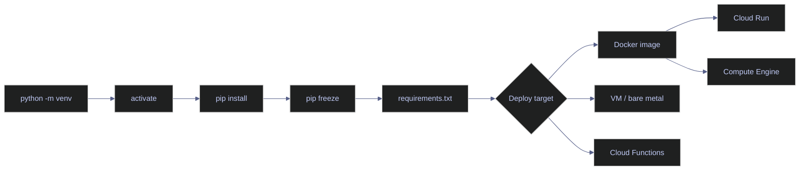

# 26. Environments — Python

> [!quote]+
>
> "Dependency management is the dark matter of software engineering — invisible but responsible for most of the catastrophic failures."
>
> — **Attributed to various DevOps practitioners**

> [!abstract]- Summary
>
> **Isolation foundations**
> - `venv` creates a per-project Python installation with its own `python`, `pip`, and `site-packages`; the system Python is shared and must never be touched with bare `pip install`.
> - Activation prepends the venv's `bin/` or `Scripts/` to `PATH` and sets `VIRTUAL_ENV`; deactivation restores the original shell state.
> - `.venv/` must be in `.gitignore` immediately after creation; it is platform-specific and not portable.
>
> **Dependency specification**
> - `pip freeze > requirements.txt` captures the full resolved tree (direct + transitive) with exact `==` pins; this is the reproducibility contract between dev, CI, and production.
> - `pip-tools` separates abstract intent (`requirements.in`) from pinned output (`requirements.txt`); `pip-compile --upgrade` updates the lock.
> - `requirements-dev.txt` starts with `-r requirements.txt` and adds test/lint tools; Docker images never install dev deps.
> - Constraint files (`-c constraints.txt`) enforce version bounds across multiple requirements files without installing those packages.
>
> **Package operations**
> - `pip install --upgrade pip` must be the first command in every new venv; bundled pip is often months old.
> - `pip uninstall` leaves transitive orphans; the canonical fix is delete-and-rebuild from the pinned spec.
> - `pip check` detects version conflicts; `pip cache purge` reclaims disk space.
>
> **Version management**
> - `pyenv` manages interpreter versions independently of package isolation; `.python-version` pins per-project and is committed to the repo.
> - Python minor versions are not interchangeable — pin in three places: `.python-version`, `Dockerfile`, and CI.
>
> **Modern tooling**
> - `uv` is a Rust-based drop-in replacement for `pip` + `pip-tools` + `virtualenv`, 10–100× faster; `uv pip sync` removes packages not in the spec.
> - `pipx` installs CLI tools into isolated hidden venvs, making them globally available without polluting project environments.
>
> **Private feeds**
> - `pip.conf` / `PIP_EXTRA_INDEX_URL` add private PyPI feeds (Artifact Registry, Artifactory); credentials must never be hardcoded — use `keyring` or environment variables.
>
> **Container and CI patterns**
> - No venv inside Docker — the container is the isolation; copy `requirements.txt` first, install, then copy source to preserve layer cache.
> - Multi-stage builds compile wheels in a builder stage and install pre-built wheels in the slim runtime stage.
> - GitHub Actions: `actions/setup-python@v5` → upgrade pip → install deps → lint/type-check/test; cache `~/.cache/pip` keyed on `requirements.txt` hash.
>
> **GCP deployment**
> - Cloud Run: environment baked into the Docker image; no separate install step at deploy time.
> - Cloud Functions: GCP reads `requirements.txt` from the source directory automatically.
> - Cloud Composer: packages installed via `gcloud composer environments update`, not via SSH.
> - Terraform: deploys infrastructure pointing at images; has no knowledge of venv, pip, or requirements files.
>
> **Anti-patterns and cheat sheet**
> - Ten canonical mistakes (no venv, unpinned deps, committed venv, venv in Docker, `python:latest`, `alpine` for data engineering, etc.) with explicit fixes.
> - Quick-reference tables: environment commands, specification files, and per-deployment-target install patterns.

> [!note]- Glossary
>
> **`venv`**
> - Standard-library module that creates an isolated Python environment tied to one base interpreter, with its own `site-packages` and executable entry points.
> - Used to keep project dependencies separate from the system Python and from other projects running on the same machine.
>
> > [!tip] Naming convention
> >
> > Name the directory `.venv/` (leading dot). VS Code, PyCharm, and many project templates detect this name automatically. Other names often require manual interpreter selection.
>
> ---
>
> **`pip`**
> - Python package installer used to resolve, download, and install packages into the currently targeted Python environment.
> - Used to add project dependencies, pin versions, install optional extras, and reproduce an environment from a requirements file.
>
> > [!danger] Bare `pip install` without a venv
> >
> > Running `pip install` outside an isolated environment can modify the system interpreter or the user site-packages, creating conflicts between projects and making builds non-reproducible.
>
> ---
>
> **`requirements.txt`**
> - Plain-text dependency specification file listing package requirements, often with exact version pins.
> - Used as the reproducibility contract between developer machines, CI, containers, and deployment targets when an environment must be recreated consistently.
>
> > [!warning] `pip list > requirements.txt` is not a lock file
> >
> > `pip list` produces human-oriented output, not the canonical `name==version` format expected by `pip install -r`. Use `pip freeze` or a dedicated lock-generation workflow instead.
>
> ---
>
> **`pip freeze`**
> - `pip` command that outputs installed packages in `name==version` format, including transitive dependencies currently present in the environment.
> - Used to capture a deterministic snapshot of an already resolved environment for reproduction elsewhere.
>
> > [!info] `pip freeze` vs `pip list`
> >
> > `pip freeze` emits installable requirement lines. `pip list` emits a display table for humans. Only the former is suitable for direct reuse as a requirements snapshot.
>
> ---
>
> **`pyenv`**
> - Tool for installing and selecting multiple Python interpreter versions side by side on the same machine.
> - Used to control which Python version a project runs under, independently of which packages are installed inside that interpreter's virtual environment.
>
> > [!tip] Commit `.python-version`
> >
> > Committing `.python-version` helps align local development and CI on the same Python minor version, reducing version-drift bugs and unexpected interpreter mismatches.
>
> ---
>
> **`uv`**
> - Fast Python packaging and environment-management tool from Astral, covering workflows that often involve `pip`, `virtualenv`, and lock/sync tooling.
> - Used to resolve, install, compile, and sync dependencies faster than traditional Python packaging workflows in many projects and CI pipelines.
>
> > [!info] `uv` availability in CI
> >
> > `uv` is not guaranteed to be present in runner images by default. Install it explicitly in CI before assuming its commands are available.
>
> ---
>
> **`pipx`**
> - Tool that installs Python CLI applications into isolated virtual environments while exposing their entry points globally on `PATH`.
> - Used for developer tools such as `ruff`, `black`, `mypy`, or `httpie` when they should be globally callable but should not pollute a project's dependency graph.
>
> > [!tip] `pipx` vs `pip install --user`
> >
> > `pip install --user` mixes tool dependencies into the user site-packages. `pipx` isolates each CLI tool in its own environment, which avoids cross-tool dependency conflicts.
>
> ---
>
> **`pip.conf` / `--extra-index-url`**
> - `pip` configuration mechanisms for adding non-default package indexes, such as private package repositories alongside PyPI.
> - Used to install internal packages from Artifact Registry, Artifactory, Azure Artifacts, or other private Python package feeds.
>
> > [!danger] Credentials in `pip.conf` leak easily
> >
> > Configuration files are often copied, logged, cached, or committed by mistake. Prefer environment variables, keyring-backed authentication, or CI secret injection instead of embedding credentials directly in config files.
>
> ---
>
> **`VIRTUAL_ENV`**
> - Environment variable commonly set by activation scripts to the path of the currently activated virtual environment.
> - Used as one signal that a shell session is targeting a specific venv, which can help scripts or prompts detect the active environment.
>
> > [!tip] Programmatic venv check
> >
> > Inside Python, `sys.prefix != sys.base_prefix` is a more portable runtime check than relying only on `VIRTUAL_ENV`, because activation is not the only way a venv can be used.
>
> ---
>
> **Docker multi-stage build**
> - Dockerfile pattern that uses multiple `FROM` stages so build-time tooling and runtime artifacts can be separated cleanly.
> - Used to compile or assemble dependencies in one stage, then copy only the necessary runtime result into a smaller and safer final image.
>
> > [!info] `python:3.12-slim` vs `python:3.12-alpine`
> >
> > `slim` is usually the safer default for Python data workloads because binary wheels commonly target glibc-based images. Alpine can be smaller, but musl-based compatibility gaps often force source builds and additional complexity.
>
> ---
>
> **`pip install --no-cache-dir`**
> - `pip` installation mode that prevents downloaded packages from being stored in pip's local cache during that command.
> - Used mainly in container builds to avoid baking package-cache files into image layers when those cached artifacts will not be reused at runtime.
>
> > [!danger] Omitting `--no-cache-dir` in Docker bloats image layers
> >
> > In Docker builds, pip's cache becomes part of the image layer unless removed later. That often increases final image size substantially without providing any runtime benefit.
>
> ---
>
> **Cloud Functions `requirements.txt`**
> - Dependency specification file read during Google Cloud Functions build and deployment so the runtime can install the Python packages the function needs.
> - Used to declare deploy-time dependencies for serverless Python functions without shipping a local virtual environment directory.
>
> > [!warning] Do not upload local `venv/` directories
> >
> > The deployment build installs from `requirements.txt`, not from your local `.venv/` or `venv/` folder. Excluding those directories keeps the source archive smaller and avoids needless upload bloat.

## venv — why virtual environments exist

Two projects. Same machine. Project A needs `pandas==1.5.3` for a legacy ETL pipeline. Project B needs `pandas==2.1.4` for a new data lakehouse. Without isolation, `pip install pandas==2.1.4` overwrites 1.5.3 globally — and Project A silently breaks at 2 AM when the nightly batch job runs.

The system Python is shared across every project, every user, and every tool on the machine. On Linux, the OS itself depends on specific package versions — `apt` and `yum` use system Python internally. One careless `pip install` can corrupt the package manager that keeps the server patched.

Virtual environments solve this by creating a self-contained Python installation per project. Each venv has its own `python` binary, its own `pip`, and its own `site-packages` directory. Packages installed in one venv are invisible to every other venv and to the system Python.

> [!danger] The System Python Trap
>
> Installing packages with `pip install` outside a virtual environment modifies
> the system Python. On Linux, this can break OS tools that depend on specific
> package versions (`apt`, `yum` use system Python internally). On macOS,
> `pip install --user` partially helps but still pollutes the global namespace.
> ALWAYS use a virtual environment. There is no exception.

> [!success] Fix: Always Create a venv Before pip install
>
> Before installing anything, run `python -m venv .venv` and activate it.
> Verify the venv is active with `which python` (Linux/macOS) or `where python`
> (Windows) — the path should point inside `.venv/`. If it doesn't, do not proceed.
> One venv per project; never share venvs across projects.




## venv — create and activate virtual environments

### venv | creation and structure

Creating a virtual environment generates a self-contained Python installation in a `.venv/` directory. The directory contains a copy of the Python binary, a `pip` executable, and an empty `site-packages` directory ready for package installation.

#### `python -m venv` — create a new virtual environment

The `venv` module is part of the Python standard library — no extra installation required. It creates the directory structure, copies (or symlinks) the Python binary, and sets up `pip`. The `.venv` name is a convention that VS Code and other tools auto-detect.

*Create a virtual environment in the current project.*

```bash
python -m venv .venv
```

> [!info] What python -m venv creates on disk
>
> The `.venv/` directory contains:
> - `Scripts/` (Windows) or `bin/` (Linux/macOS) — `python`, `pip`, `activate` scripts
> - `Lib/site-packages/` (Windows) or `lib/pythonX.Y/site-packages/` (Linux) — installed packages
> - `include/` — C header files for compiling extensions
> - `pyvenv.cfg` — configuration file pointing to the base Python installation
>
> The entire directory is 10-20 MB when empty. It grows as you install packages.

#### `activate` — switch your shell to use the virtual environment

Activation prepends the venv's `Scripts/` (or `bin/`) directory to the shell's `PATH` so that `python` and `pip` resolve to the venv copies instead of the system installation. It also sets the `VIRTUAL_ENV` environment variable. Activation is shell-specific — each platform has its own script.

Windows (PowerShell):

*Activate the venv in PowerShell.*

```powershell
.venv\Scripts\Activate.ps1
```

Windows (Git Bash / MSYS2):

*Activate the venv in Git Bash or MSYS2.*

```bash
source .venv/Scripts/activate
```

Linux / macOS:

*Activate the venv on Linux or macOS.*

```bash
source .venv/bin/activate
```

> [!info] What activation actually does
>
> Activation does two things:
> 1. Prepends `.venv/Scripts/` (or `.venv/bin/`) to your `PATH` — so `python` and `pip` resolve to the venv copies
> 2. Sets the `VIRTUAL_ENV` environment variable — so tools can detect that a venv is active
>
> Your terminal prompt changes to show `(.venv)` as a visual indicator.
> Activation is a shell-level change — it only affects the current terminal session.

#### `deactivate` — exit the virtual environment

Restores the shell's `PATH` to its pre-activation state, removing the venv's directory. After deactivation, `python` and `pip` resolve to the system installation again.

*Deactivate the active virtual environment.*

```bash
deactivate
```

> [!warning] Never Commit the venv Folder
>
> The `.venv/` directory contains platform-specific binaries (compiled C extensions,
> Python interpreter symlinks). It is NOT portable between machines, operating systems,
> or even Python versions. Add `.venv/` to `.gitignore` immediately after creation.
> The `requirements.txt` file is what gets committed — it's the reproducible
> specification, not the venv itself.

> [!success] Fix: .gitignore on Project Creation
>
> Add `.venv/` to `.gitignore` as the very first act after `git init` — before
> creating the venv. Run `echo ".venv/" >> .gitignore && git add .gitignore && git commit -m "init: add .gitignore"`.
> If `.venv/` was already tracked, remove it: `git rm -r --cached .venv/` then commit.

### venv | project configuration

Standard entries for `.gitignore` and IDE configuration ensure the venv and bytecode caches stay out of source control.

#### `.gitignore` — standard entries for Python projects

These entries prevent the venv directory, bytecode caches, and type checker caches from entering source control. `.venv/` is platform-specific and not portable. `__pycache__/` and `*.pyc` are compiled bytecode files regenerated on every import. `.mypy_cache/` is the mypy type checker's cache.

*Add standard Python ignores to the project `.gitignore`.*

```bash
echo ".venv/" >> .gitignore
echo "__pycache__/" >> .gitignore
echo "*.pyc" >> .gitignore
echo ".mypy_cache/" >> .gitignore
```

> [!tip] VS Code Auto-Detection
>
> VS Code automatically detects `.venv/` in the project root and offers to select
> it as the Python interpreter. If you name your venv something else (like `env/`
> or `myenv/`), VS Code may not find it automatically. Stick with `.venv/`.

## pip — install packages into the virtual environment

### pip | package installation

`pip install` downloads packages from PyPI and installs them into the active environment's `site-packages` directory. Version specifiers control which version is installed.

#### `pip install` — add a package

Installs a package from PyPI into the active virtual environment. Without a version specifier, pip resolves the latest stable version. The `==` operator pins an exact version. Range operators (`>=`, `<`) allow bounded flexibility. Square brackets install optional extras — dependency groups declared by the package author for specific use cases.

*Install example packages into the active venv.*

```bash
pip install pandas
pip install pandas==2.1.4
pip install "pandas>=2.0,<3.0"
pip install "uvicorn[standard]"
```

#### `pip install -r` — install from a requirements file

The `-r` flag reads a requirements file and installs every package listed in it. This is the primary mechanism for reproducing an environment — a new contributor clones the repo, creates a venv, and runs `pip install -r requirements.txt` to get an identical set of packages.

*Install packages from pinned requirements files.*

```bash
pip install -r requirements.txt
pip install -r requirements-dev.txt
```

#### `pip install -e` — editable/development install

> [!info] Editable installs for local package development
>
> `pip install -e .` installs the current project in "editable" mode — Python
> imports the package directly from your source directory instead of copying
> files into `site-packages`. Changes to your source code take effect immediately
> without reinstalling. This requires a `pyproject.toml` or `setup.py` in the project root.

*Install the current project in editable mode.*

```bash
pip install -e .
pip install -e ".[dev]"
```

> [!danger] pip install Without a venv
>
> Running `pip install pandas` without an active virtual environment installs
> to the system Python or user site-packages. This is the #1 source of
> "it works on my machine" problems. If your terminal prompt doesn't show
> `(.venv)` before the path, STOP and activate your environment first.

> [!success] Fix: Check the Prompt Before Every pip Command
>
> Your terminal prompt should show `(.venv)` when the environment is active.
> If it doesn't, run `source .venv/bin/activate` (Linux/macOS) or
> `.venv\Scripts\Activate.ps1` (Windows) before proceeding. Alternatively,
> run `python -m pip install pandas` instead of bare `pip install` — this
> always installs into whichever Python the `python` binary resolves to,
> making the target explicit.

> [!info] Transitive Dependencies
>
> When you install `pandas`, pip also installs `numpy`, `python-dateutil`, and
> `tzdata` — pandas' own dependencies. These are "transitive dependencies."
> You asked for one package; pip installed four. This is expected behavior,
> but it means your environment contains packages you never explicitly requested.
> `pip freeze` captures all of them.

## pip freeze — pin and freeze dependencies

### pip | freezing dependencies

`pip freeze` captures the exact state of the current environment — every package, every version, including transitive dependencies. This is the simplest path to reproducibility.

#### `pip freeze` — snapshot all installed packages

Outputs every installed package with its exact version in `package==version` format. Redirecting to `requirements.txt` creates a reproducible specification. Because pip freeze captures the entire environment (direct and transitive dependencies), the output is a complete snapshot — installing from it reproduces the exact same set of packages.

*Snapshot the installed environment into `requirements.txt`.*

```bash
pip freeze > requirements.txt
```

> [!tip] pip freeze Captures Everything
>
> `pip freeze` outputs ALL packages — your direct dependencies AND their transitive
> dependencies. This is intentional: it makes the environment fully reproducible.
> But it also means upgrading one package requires re-freezing the entire tree.
> Tools like `pip-compile` from `pip-tools` separate "what you asked for" from
> "what got installed" — maintaining both an abstract `requirements.in` and a
> pinned `requirements.txt`.

#### `pip-tools` and `pip-compile` — separate abstract from pinned dependencies

Create a `requirements.in` with your direct dependencies (loose constraints), then compile to a fully pinned `requirements.txt`. The `.in` file captures what you actually need — only your direct dependencies with loose version bounds:

*Show the input constraints for `pip-compile`.*

```text
pandas>=2.0
fastapi>=0.100
pyodbc>=5.0
```

*Compile the abstract requirements file into a pinned lock file.*

```bash
pip install pip-tools
pip-compile requirements.in --output-file requirements.txt
```

> [!info] pip-compile workflow
>
> `pip-compile` reads `requirements.in` (your direct dependencies with loose version
> constraints) and resolves the full dependency tree into `requirements.txt` (every
> package with exact pinned versions). To upgrade, run `pip-compile --upgrade`.
> This gives you the best of both worlds: readable intent in `.in`, reproducibility in `.txt`.

### pip | constraint files

Constraint files limit which versions of packages can be installed without requiring those packages to be installed. They are used to enforce version consistency across multiple requirements files or projects.

#### `pip install --constraint` — constrain without installing

The `-c` flag applies version constraints from a file without installing the listed packages. If a package happens to be required by a dependency, the constraint ensures it resolves to the specified version. This is useful in monorepos or when multiple requirements files must share consistent transitive dependency versions.

*Apply version constraints without installing the constraint file itself.*

```bash
pip install -r requirements.txt -c constraints.txt
```

> [!danger] Unpinned Dependencies in Production
>
> A `requirements.txt` with `pandas>=2.0` is a ticking time bomb. Today it installs
> 2.1.4. Next month, 2.2.0 is released with a breaking change in `DataFrame.merge()`.
> Your pipeline breaks in production with no code change. ALWAYS pin exact versions
> for production: `pandas==2.1.4`. Use ranges only in library development, never
> in application deployment.

> [!success] Fix: pip freeze After Every Install
>
> Whenever you install or upgrade a package, immediately run `pip freeze > requirements.txt`
> and commit the result. For a cleaner workflow, use `pip-tools`: maintain
> `requirements.in` with loose constraints, compile to a fully pinned `requirements.txt`
> with `pip-compile`, and update with `pip-compile --upgrade-package pandas`.

## pip — upgrade and manage installed packages

### pip | package updates

Upgrading a package replaces the installed version with a newer one. The `--upgrade` flag tells pip to ignore the currently installed version and resolve the latest available.

#### `pip install --upgrade` — upgrade a package to latest

The `--upgrade` flag forces pip to resolve the latest version even if the package is already installed. For pip itself, use `python -m pip install --upgrade pip` — this avoids a Windows edge case where the running `pip.exe` cannot overwrite itself. Always upgrade pip first in a new venv to get the latest resolver and security fixes.

*Upgrade pip and a sample package.*

```bash
python -m pip install --upgrade pip
pip install --upgrade pandas
```

> [!tip] Upgrade pip First
>
> A freshly created venv ships with whatever pip version came with your Python
> installation — often months or years old. Old pip has slower dependency resolution,
> missing security fixes, and worse error messages. First command in any new venv:
> `python -m pip install --upgrade pip`

#### `pip list --outdated` — find packages with newer versions

Queries PyPI for each installed package and shows those with a newer version available. The output includes the current version, the latest version, and the type of update (wheel or sdist).

*Inspect packages with newer releases available.*

```bash
pip list --outdated
```

#### `pip show` — inspect a single package

Displays metadata for a single installed package: version, installation location, direct dependencies (`Requires`), and reverse dependencies (`Required-by`). Use this to understand why a package is installed and what depends on it.

*Inspect package metadata and dependency relationships.*

```bash
pip show pandas
```

```text
Name: pandas
Version: 2.1.4
Summary: Powerful data structures for data analysis
Home-page: https://pandas.pydata.org
Location: .venv/lib/python3.12/site-packages
Requires: numpy, python-dateutil, tzdata
Required-by:
```

#### `pip uninstall` — remove a package

Removes the specified package from the environment but does NOT remove its transitive dependencies. This means `pip uninstall pandas` leaves `numpy`, `python-dateutil`, and `tzdata` behind as orphans. Over time, the environment accumulates unused packages.

*Remove a package from the environment.*

```bash
pip uninstall pandas
```

> [!warning] pip uninstall Doesn't Clean Up
>
> `pip uninstall pandas` removes pandas but leaves numpy, python-dateutil, and
> tzdata behind — even if nothing else needs them. Over time, the venv accumulates
> orphaned packages. The cleanest approach: delete the venv, recreate it, and
> install from `requirements.txt`. This is why pinned requirements matter —
> they let you rebuild a clean environment in seconds.

> [!success] Fix: Nuke and Rebuild Rather Than Uninstall
>
> Instead of hunting orphaned packages after an uninstall, delete the venv entirely
> and rebuild from the pinned `requirements.txt`: `rm -rf .venv && python -m venv .venv && pip install -r requirements.txt`.
> This is faster and guaranteed clean. If you need to remove a package from the spec,
> delete it from `requirements.txt` (or `requirements.in`) first, then rebuild.

### pip | environment health

These commands verify that the installed packages are internally consistent and help reclaim disk space.

#### `pip check` — verify dependency compatibility

Scans all installed packages and reports version conflicts — cases where package A requires `numpy>=1.24` but `numpy==1.23` is installed. A clean `pip check` with no output means all dependency constraints are satisfied.

*Check dependency compatibility in the active environment.*

```bash
pip check
```

#### `pip cache purge` — clear the download cache

Deletes all cached wheel files from pip's download cache (`~/.cache/pip` on Linux, `~/Library/Caches/pip` on macOS). Pip caches downloaded wheels to speed up future installs of the same package version. Purging frees disk space but means the next install of any cached package will re-download it.

*Clear the local pip download cache.*

```bash
pip cache purge
```

## pip — inspect the active environment

### Python | binary inspection

When something goes wrong, the first question is always "which Python am I actually running?" These commands answer that.

#### `python --version` and `which python` — confirm what's active

`python --version` shows the interpreter version. `which python` (Linux/macOS) or `where python` (Windows) shows the full path to the binary — this reveals whether you are running the venv Python or the system Python. `pip --version` shows both the pip version and the Python installation it is attached to.

*Check the active Python interpreter and pip binding.*

```bash
python --version
which python
where python
pip --version
```

> [!question] Which Python Am I Using?
>
> Run `which python` (or `where python` on Windows) and check the output.
> If it points to `/usr/bin/python` or `C:\Python312\python.exe` — you're on
> the system Python, NOT in a venv. If it points to `.venv/bin/python` or
> `.venv/Scripts/python.exe` — you're in the venv. This is the first thing to
> check when "it works on my machine but not in CI" — the CI runner may be
> using a different Python than you think.

#### `sys.prefix` — programmatic venv check

From within Python code, `sys.prefix` returns the path to the active environment and `sys.base_prefix` returns the path to the base Python installation. When a venv is active, these two differ — the comparison `sys.prefix != sys.base_prefix` returns `True`. This is useful for runtime checks in scripts that must verify they are running inside a venv.

*Inspect interpreter state from Python code.*

```python
import sys
sys.prefix
sys.base_prefix
sys.prefix != sys.base_prefix
```

#### `pip list` — all installed packages

Lists every package installed in the active environment. The default tabular format shows package name and version. The `--format=freeze` option produces the same output as `pip freeze` — useful for scripting without redirecting freeze output.

*List packages installed in the active environment.*

```bash
pip list
pip list --format=freeze
```

#### `__file__` — locating a package on disk

Every Python package has a `__file__` attribute pointing to its `__init__.py` on disk. This reveals whether the package is installed in the venv's `site-packages` or in the system Python — a quick way to confirm isolation is working correctly.

*Inspect where a package is installed on disk.*

```python
import pandas
print(pandas.__file__)
```

*Show the installed package path.*

```text
.venv/lib/python3.12/site-packages/pandas/__init__.py
```

## requirements.txt — the dependency specification lifecycle

### requirements.txt | pinned vs unpinned

The difference between a pinned and unpinned `requirements.txt` is the difference between a reproducible environment and a future outage.

#### `requirements.txt` — production dependencies (pinned)

> [!danger] requirements.txt Without Pinned Versions
>
> ```
> # BAD — will break eventually
> pandas
> polars
> fastapi
> ```
>
> ```
> # GOOD — reproducible forever
> pandas==2.1.4
> polars==0.20.5
> fastapi==0.109.0
> ```
>
> The first format installs "whatever is latest today." The second installs
> exactly what you tested against. In production, the first is a guaranteed
> future outage. The second is a guaranteed identical environment.

> [!success] Fix: Always Commit pip freeze Output
>
> Run `pip freeze > requirements.txt` after every `pip install` and commit it.
> Every line must use `==` (exact pin). Never hand-edit the file to use `>=` —
> if you need a range, maintain a `requirements.in` for intent and use
> `pip-compile` to produce the pinned `requirements.txt` from it.

A production `requirements.txt` with fully pinned versions:

```text
pandas==2.1.4
polars==0.20.5
pyodbc==5.1.0
pydantic==2.5.3
tenacity==8.2.3
sqlalchemy==2.0.25
fastapi==0.109.0
uvicorn==0.27.0
```

### requirements.txt | production and development

Separating production and development dependencies ensures that test tools, linters, and formatters never ship to production. The convention is two files: `requirements.txt` for production and `requirements-dev.txt` for development.

#### `requirements-dev.txt` — development extras that extend production

The `-r requirements.txt` line at the top includes all production dependencies, then adds development tools. This ensures developers test against the same package versions that run in production. Only the additional dev packages are listed explicitly.

```
-r requirements.txt
pytest==7.4.4
pytest-cov==4.1.0
black==24.1.0
mypy==1.8.0
ruff==0.1.14
```

> [!tip] requirements-dev.txt Extends Production
>
> The `-r requirements.txt` line at the top of `requirements-dev.txt` includes
> all production dependencies plus adds dev tools. This ensures developers
> test against the SAME package versions that run in production, plus they
> get pytest, linters, and formatters.

### requirements.txt | full lifecycle

The standard workflow for managing a Python environment follows a predictable sequence: create, activate, upgrade pip, install from spec, add new packages, re-freeze, and commit.

#### `requirements.txt` lifecycle — create, install, freeze, rebuild

This sequence demonstrates the complete dependency management cycle. Steps 4-6 repeat for every new package addition. The key discipline is always re-freezing after any `pip install` so `requirements.txt` stays in sync with the actual environment.

*Create, install, freeze, and commit a full environment refresh.*

```bash
python -m venv .venv
source .venv/bin/activate
python -m pip install --upgrade pip
pip install -r requirements.txt
pip install httpx==0.27.0
pip freeze > requirements.txt
git add requirements.txt
git commit -m "Add httpx for async HTTP client"
```

#### `pip install --upgrade` — updating a single package

To upgrade a single dependency, use `--upgrade` on just that package, then re-freeze the entire environment. The re-freeze captures any transitive dependency changes caused by the upgrade.

*Upgrade one dependency and re-freeze the environment.*

```bash
pip install --upgrade pandas
pip freeze > requirements.txt
```

#### `requirements.txt` comments and line options

Requirements files support comments (`#`), editable installs (`-e`), Git repository references, constraint file references (`-c`), and index URL overrides. The `--extra-index-url` option adds a private PyPI feed as a secondary package source alongside the public `pypi.org`.

*Show supported requirement-file syntax.*

```text
# Comments start with #
# Blank lines are ignored
-e .
-e git+https://github.com/org/repo.git@v2.0#egg=mypackage
-c constraints.txt
--extra-index-url https://pypi.company.com/simple/
```

## pyenv — manage multiple Python versions

### pyenv | version significance

Python minor versions are not interchangeable — features, performance, and stdlib modules differ significantly between them.

#### `python` minor version matters

> [!warning] Python 3.x Minor Version Matters
>
> Python 3.9 and 3.12 are not interchangeable. Match expressions (3.10+),
> `tomllib` (3.11+), exception groups (3.11+), and significant performance
> improvements (3.11 is 25% faster than 3.10) mean the minor version choice
> affects both features and speed. Pin your Python version in CI
> (`actions/setup-python@v5` with `python-version: '3.12'`) and in Docker
> (`FROM python:3.12-slim`). Never use `python:latest`.

> [!success] Fix: Pin Python Version in Three Places
>
> 1. `.python-version` (or `pyenv local 3.12.0`) — for local development.
> 2. `Dockerfile` — `FROM python:3.12-slim` (never `python:latest`).
> 3. CI/CD — `python-version: '3.12'` in `actions/setup-python@v5`.
>
> All three must agree. A mismatch between local (3.11) and CI (3.12) will
> surface as type errors or missing stdlib modules at the worst possible time.

### pyenv | system Python inspection

Before managing versions with pyenv, check what is already installed on the machine.

#### `python --version` — check what's installed

Shows the version of the Python binary that the shell currently resolves. On machines with multiple Python versions installed, this shows whichever one is first on the `PATH`.

*Inspect the interpreter version and a sample installed path.*

```bash
python --version
```

```text
Python 3.12.0
```

*Show one installed Python binary path.*

```bash
ls /usr/bin/python*
```

#### `python3.12 -m venv` — create a venv with a specific Python version

When multiple Python versions are installed, invoke the specific version explicitly to create the venv. The venv inherits the Python version of the binary used to create it — a venv created with `python3.12` always runs Python 3.12, regardless of what `python` resolves to later. On Windows, the `py` launcher provides version selection.

*Create a venv with an explicit interpreter version.*

```bash
python3.12 -m venv .venv
py -3.12 -m venv .venv
```

### pyenv | installation and version switching

`pyenv` manages multiple Python installations on a single machine by intercepting the `python` command and routing it to whichever version is configured for the current directory. It works on Linux and macOS; on Windows, use `pyenv-win`.

#### `pyenv` install and configure — manage Python versions

Install `pyenv` via Homebrew, then use it to install specific Python versions. `pyenv global` sets the machine-wide default. `pyenv local` creates a `.python-version` file in the current directory, pinning that directory to a specific version. `pyenv versions` lists all installed versions.

*Install and configure `pyenv` for version management.*

```bash
brew install pyenv
pyenv install 3.12.0
pyenv global 3.12.0
pyenv local 3.11.7
pyenv versions
```

#### `.python-version` — per-project Python version pinning

The `.python-version` file pins the Python version at the project level. When `pyenv` detects this file in the current directory, it automatically switches to the specified version. Commit this file to the repository so all contributors use the same Python version.

*Write the project-level Python version pin file.*

```bash
echo "3.12.0" > .python-version
```

> [!tip] Pin Python version at every level
>
> Pin your Python version in THREE places:
> 1. `.python-version` (or pyenv local) — for local development
> 2. `Dockerfile` — `FROM python:3.12-slim`
> 3. CI/CD — `python-version: '3.12'` in GitHub Actions
>
> If any of these drift, you get "works on my machine" failures.


## uv — modern Python package management

`uv` (by Astral, the creators of `ruff`) is a drop-in replacement for `pip`, `pip-tools`, `virtualenv`, and `pyenv` written in Rust. It resolves and installs packages 10-100x faster than pip and produces deterministic lock files by default.

### uv | virtual environments and package installation

`uv` can create virtual environments, install packages, and manage Python versions — all from a single binary. It uses `pip`-compatible syntax so migration is minimal.

#### `uv venv` and `uv pip` — create environments and install packages

`uv venv` creates a virtual environment (10x faster than `python -m venv`). `uv pip install` and `uv pip install -r` work identically to their pip equivalents but resolve dependencies in parallel. `uv pip compile` replaces `pip-compile` for lock file generation. `uv pip sync` installs exactly what is listed and removes everything else.

*Create and sync an environment with `uv`.*

*Create and sync an environment with `uv`.*

```bash
uv venv .venv
uv pip install pandas==2.1.4
uv pip install -r requirements.txt
uv pip compile requirements.in -o requirements.txt
uv pip sync requirements.txt
```

> [!info] uv vs pip — when to switch
>
> `uv` is a strict superset of pip's functionality with dramatically faster
> performance. It uses the same `requirements.txt` format, the same version
> specifiers, and the same `--extra-index-url` syntax. For new projects,
> `uv` is the recommended choice. For existing projects, migration is as
> simple as replacing `pip` with `uv pip` in commands. The main caveat:
> `uv` is newer (2024+) and may not be available in all CI base images —
> install it with `pip install uv` or `curl` from the official release.

> [!tip] uv pip sync for Deterministic Environments
>
> `uv pip sync requirements.txt` installs exactly the packages listed
> and REMOVES any packages not in the file — unlike `pip install -r`
> which only adds. This guarantees the environment matches the spec
> exactly, with no orphaned packages from previous installations.


## pipx — isolated global Python tools

`pipx` installs Python CLI tools into isolated environments, preventing them from polluting your project's venv. This is the Python equivalent of .NET's `dotnet tool install --global`.

### pipx | installation and usage

Each tool installed via `pipx` gets its own hidden virtual environment. The tool's entry point is symlinked to `~/.local/bin/` so it is available globally without conflicting with project dependencies.

#### `pipx install` — isolated global tool management

Install `pipx` once with pip, then use it to install CLI tools. Each tool gets its own venv — `black`, `ruff`, and `mypy` never interfere with each other or with your project's dependencies. `pipx list` shows all installed tools and their versions.

*Install `pipx` and a few isolated CLI tools.*

```bash
pip install pipx
pipx install black
pipx install ruff
pipx install mypy
pipx list
pipx upgrade-all
```

> [!tip] pipx vs pip install --user
>
> `pip install --user black` installs black and its dependencies into
> your user site-packages — where they can conflict with project dependencies.
> `pipx install black` creates an isolated venv just for black. The tool
> works globally, its dependencies are invisible to your projects.


## Private PyPI feeds — pip.conf and --extra-index-url

Enterprise environments host internal packages on private PyPI feeds (GCP Artifact Registry, Azure DevOps, JFrog Artifactory). Configure pip to query these feeds in addition to the public `pypi.org`.

### pip.conf | persistent feed configuration

A `pip.conf` file (Linux/macOS: `~/.config/pip/pip.conf`, Windows: `%APPDATA%\pip\pip.ini`) configures additional package sources without repeating `--extra-index-url` on every install command.

#### `pip.conf` and `--extra-index-url` — configure a private PyPI feed

The `pip.conf` file accepts an `extra-index-url` option that adds a secondary package source alongside the public `pypi.org`. The `--extra-index-url` flag on the command line achieves the same thing for one-off installs.

*Configure a private index in `pip.conf`.*

```text
[global]
extra-index-url = https://us-python.pkg.dev/my-project/pypi-repo/simple/
trusted-host = us-python.pkg.dev
```

*Install from a private feed on demand.*

```bash
pip install my-internal-package --extra-index-url https://us-python.pkg.dev/my-project/pypi-repo/simple/
```

> [!danger] Private Feeds Require Authentication
>
> Private PyPI feeds require credentials. Never hardcode tokens in `pip.conf`.
> Use `keyring` integration, environment variables (`PIP_EXTRA_INDEX_URL`),
> or GCP's `gcloud auth application-default print-access-token` for
> Artifact Registry. In CI, inject the token as a secret environment variable.

> [!success] Use environment variables for feed credentials
>
> Set `PIP_EXTRA_INDEX_URL` as a CI secret. Pip reads this environment variable
> automatically — no `pip.conf` file needed in CI. For GCP Artifact Registry,
> use `pip install keyrings.google-artifactregistry-auth` for seamless
> credential management.


## docker — Python environments in containers

### Docker | standard container pattern

The standard Python Docker pattern copies `requirements.txt` first (for layer caching), installs dependencies, then copies source code. No virtual environment is needed inside a container — the container IS the isolation.

#### `Dockerfile` — the standard Python container pattern

> [!tip] No venv in Docker
>
> You do NOT need a virtual environment inside a Docker container. The container
> IS the isolation. Installing directly with `pip install` is correct here —
> there's no system Python to corrupt because the container has only YOUR Python.
> Using a venv inside Docker adds an unnecessary layer and increases image size.

The Dockerfile installs system dependencies first (for packages that compile C extensions), then copies `requirements.txt` and installs Python dependencies in a separate layer for Docker layer caching. Source code is copied last because it changes most often — keeping the pip install layer cached.

*Build a container with cached dependency layers.*

```dockerfile
FROM python:3.12-slim
WORKDIR /app

RUN apt-get update && apt-get install -y --no-install-recommends \
    gcc \
    unixodbc-dev \
    && rm -rf /var/lib/apt/lists/*

COPY requirements.txt .
RUN pip install --no-cache-dir -r requirements.txt

COPY . .

CMD ["python", "main.py"]
```

> [!danger] COPY . . Before pip install
>
> If you `COPY . .` before `pip install -r requirements.txt`, Docker invalidates
> the pip install cache every time ANY source file changes — even a one-line fix.
> Always copy `requirements.txt` first, install, THEN copy source code. This way
> pip install is cached unless dependencies actually change.

> [!success] Fix: Copy requirements.txt First, Source Second
>
> Structure the Dockerfile as: `COPY requirements.txt .` → `RUN pip install ...` →
> `COPY . .`. Docker caches each layer by its inputs — the pip install layer is only
> invalidated when `requirements.txt` changes, not on every source edit. Build times
> drop from 90 seconds to under 5 seconds for typical dependency trees.

#### `.dockerignore` — keep the image lean

A `.dockerignore` file excludes files from the Docker build context. Without it, `COPY . .` sends the venv, git history, test caches, and documentation into the build — inflating context size and potentially leaking sensitive data into the image.

*Exclude local environment and cache directories from the build context.*

```text
.venv/
__pycache__/
*.pyc
.git/
.mypy_cache/
.pytest_cache/
.ruff_cache/
tests/
*.md
```

### Docker | multi-stage and specialized builds

Multi-stage builds separate compilation from runtime, keeping the final image free of build tools like `gcc`. Specialized containers (FastAPI, etc.) follow the same pattern with framework-specific entry points.

#### `multi-stage build` — when you compile wheels

Stage 1 installs build tools (`gcc`, dev headers) and compiles all packages with C extensions into wheel files. Stage 2 starts from a clean `slim` image and installs the pre-built wheels — no compiler needed. The final image is smaller and has a reduced attack surface.

*Compile wheels in a builder stage.*

```dockerfile
FROM python:3.12-slim AS builder
WORKDIR /build
RUN apt-get update && apt-get install -y gcc unixodbc-dev
COPY requirements.txt .
RUN pip wheel --no-cache-dir --wheel-dir /wheels -r requirements.txt
```

*Install the compiled wheels in the runtime stage.*

```dockerfile
FROM python:3.12-slim
WORKDIR /app
COPY --from=builder /wheels /wheels
RUN pip install --no-cache-dir /wheels/* && rm -rf /wheels
COPY . .
CMD ["python", "main.py"]
```

> [!tip] python:3.12-slim vs python:3.12-alpine
>
> `slim` is Debian-based (~150 MB) and has `glibc` — virtually all Python
> packages work out of the box. `alpine` is musl-based (~50 MB) but many
> packages (numpy, pandas, pyodbc) fail to install or require long compile
> times. For data engineering workloads, always use `slim`.

#### `FastAPI` container — real-world example

A production FastAPI container follows the same `requirements.txt`-first pattern. The `CMD` uses `uvicorn` with explicit host and port bindings for Cloud Run compatibility (which expects the app to listen on `0.0.0.0:8080`).

*Package a FastAPI app for container deployment.*

```dockerfile
FROM python:3.12-slim
WORKDIR /app

COPY requirements.txt .
RUN pip install --no-cache-dir -r requirements.txt

COPY . .

EXPOSE 8080
CMD ["uvicorn", "app.main:app", "--host", "0.0.0.0", "--port", "8080"]
```

## github-actions — Python environments in CI/CD

### GitHub Actions | build and test workflows

The core CI pattern installs Python with `actions/setup-python`, upgrades pip, installs from requirements files, then runs linting, type checking, and tests.

#### `GitHub Actions` basic CI workflow — test on every push

This workflow installs both production and dev dependencies, then runs the full quality gate: linting with ruff, type checking with mypy, and testing with pytest (including coverage). Each step is explicit so failures are easy to diagnose.

*Run lint, type-check, and tests in CI.*

```yaml
name: CI
on: [push, pull_request]

jobs:
  test:
    runs-on: ubuntu-latest
    steps:
      - uses: actions/checkout@v4

      - uses: actions/setup-python@v5
        with:
          python-version: '3.12'

      - name: Install dependencies
        run: |
          python -m pip install --upgrade pip
          pip install -r requirements.txt
          pip install -r requirements-dev.txt

      - name: Lint
        run: ruff check .

      - name: Type check
        run: mypy .

      - name: Test
        run: pytest --cov=src --cov-report=xml
```

> [!tip] Cache pip Downloads in CI
>
> Add `actions/cache@v4` to cache the pip download directory between runs:
> ```yaml
> - uses: actions/cache@v4
>   with:
>     path: ~/.cache/pip
>     key: pip-${{ hashFiles('requirements.txt') }}
> ```
> This avoids re-downloading packages when `requirements.txt` hasn't changed.
> CI time drops from 90s to 15s for large dependency trees.

#### `GitHub Actions` matrix strategy — test across Python versions

Matrix strategies run the same workflow against multiple Python versions in parallel. This is useful for libraries that must support multiple Python minor versions. For applications pinned to one version, a matrix is unnecessary.

*Exercise the workflow across multiple Python versions.*

```yaml
jobs:
  test:
    runs-on: ubuntu-latest
    strategy:
      matrix:
        python-version: ['3.11', '3.12']
    steps:
      - uses: actions/checkout@v4
      - uses: actions/setup-python@v5
        with:
          python-version: ${{ matrix.python-version }}
      - run: |
          pip install --upgrade pip
          pip install -r requirements.txt
          pytest
```

### GitHub Actions | Docker deployment

Building and pushing Docker images in CI completes the pipeline from source to deployed container.

#### `docker build` and `docker push` in CI

This workflow builds the Docker image locally in the CI runner and pushes it to GCP Artifact Registry tagged with the commit SHA for traceability.

*Build the image and publish it to Artifact Registry.*

```yaml
jobs:
  build:
    runs-on: ubuntu-latest
    steps:
      - uses: actions/checkout@v4

      - name: Build Docker image
        run: docker build -t myapp:${{ github.sha }} .

      - name: Push to Artifact Registry
        run: |
          gcloud auth configure-docker us-central1-docker.pkg.dev
          docker tag myapp:${{ github.sha }} \
            us-central1-docker.pkg.dev/my-project/repo/myapp:${{ github.sha }}
          docker push \
            us-central1-docker.pkg.dev/my-project/repo/myapp:${{ github.sha }}
```

## gcp — Python environments on Google Cloud Platform

### GCP | VM deployment

#### `Compute Engine` VM — standard deployment

> [!info] Compute Engine is just a remote machine
>
> Environment setup on a GCE VM is identical to a local machine: install Python,
> create a venv, install requirements. The only difference is you get there via
> SSH or a startup script instead of opening a terminal.

*Provision and activate a venv on a Compute Engine VM.*

```bash
gcloud compute ssh my-vm --zone=us-central1-a
sudo apt update && sudo apt install -y python3.12 python3.12-venv
python3.12 -m venv /opt/app/.venv
source /opt/app/.venv/bin/activate
pip install --upgrade pip
pip install -r requirements.txt
```

### GCP | container deployment

Cloud Run runs your Docker image with automatic scaling, HTTPS, and environment variable injection. The environment is entirely defined by the Dockerfile.

#### `Cloud Run` — Dockerized deployment

`gcloud builds submit` builds the image using Cloud Build and pushes it to Artifact Registry. `gcloud run deploy` creates or updates the Cloud Run service. The environment — Python version, packages, system dependencies — is baked into the Docker image.

*Build and deploy a container image to Cloud Run.*

```bash
gcloud builds submit --tag us-central1-docker.pkg.dev/my-project/repo/myapp
gcloud run deploy myapp \
  --image us-central1-docker.pkg.dev/my-project/repo/myapp \
  --region us-central1 \
  --platform managed
```

> [!info] Cloud Run uses the Docker pattern from Section 11
>
> Cloud Run runs containers. Your environment is baked into the Docker image.
> There is no separate "install requirements" step at deployment time — the
> image already has everything. This is why the Dockerfile pattern matters:
> it IS your deployment environment.

#### `requirements.txt` at the repo root for Cloud Functions

Cloud Functions reads `requirements.txt` automatically from the function's source directory. No Dockerfile needed — GCP installs the dependencies during build.

*Show the Cloud Functions source tree.*

```
my-function/
  main.py
  requirements.txt
```

The `main.py` file is the Cloud Function entry point:

*Define the Cloud Function entry point.*

```python
import functions_framework
import pandas as pd

@functions_framework.http
def process(request):
    df = pd.read_json(request.get_json())
    return df.describe().to_json()
```

GCP installs the packages listed in `requirements.txt` automatically during the build phase:

*Pin the Cloud Function runtime dependencies.*

```text
pandas==2.1.4
functions-framework==3.5.0
```

> [!danger] Don't SSH Into Composer to pip install
>
> Managed Airflow (Cloud Composer) runs in a controlled environment. Installing
> packages via SSH (`pip install pandas`) is overwritten on the next environment
> update. Use the Composer UI or `gcloud composer environments update` to add
> PyPI packages — these are persisted and managed by GCP.

> [!success] Fix: Use gcloud composer environments update
>
> Maintain a `requirements-composer.txt` with pinned versions for all Airflow
> operator dependencies. Apply it with:
> `gcloud composer environments update my-env --location us-central1 --update-pypi-packages-from-file requirements-composer.txt`
> This is idempotent, version-controlled, and survives environment updates.

### GCP | managed services

Cloud Composer (managed Airflow) has its own dependency management — packages must be installed via the GCP API, not via SSH.

#### `Cloud Composer` managed Airflow package installation

`gcloud composer environments update` applies a requirements file to the Composer environment through the GCP control plane. This is idempotent and survives environment updates — unlike SSH-based `pip install` which is overwritten on the next environment update.

*Apply a managed Airflow package file through `gcloud`.*

```bash
gcloud composer environments update my-env \
  --location us-central1 \
  --update-pypi-packages-from-file requirements-composer.txt
```

## terraform — deploying Python environments as infrastructure

> [!info] Terraform Deploys Containers, Not Environments
>
> Terraform doesn't know about venv, pip, or requirements.txt. It deploys
> infrastructure: VMs, Cloud Run services, Cloud Functions. The environment
> is baked INTO the Docker image (see Docker section) or configured via
> platform settings (see GCP section). Terraform's job is to point the
> infrastructure at the right image and set the right environment variables.

### Terraform | infrastructure deployment

Terraform provisions the GCP resources where Python containers run. It points infrastructure at Docker images and configures environment variables — it has no knowledge of pip, venv, or `requirements.txt`.

#### `Cloud Run` service with environment variables

This resource creates a Cloud Run service pointing at a Docker image in Artifact Registry. Environment variables are set in `env` blocks — the container reads them at runtime via `os.environ`. Resource limits control the container's memory and CPU allocation.

*Configure a Cloud Run service with environment variables.*

```hcl
resource "google_cloud_run_service" "pipeline" {
  name     = "data-pipeline"
  location = "us-central1"

  template {
    spec {
      containers {
        image = "us-central1-docker.pkg.dev/my-project/repo/pipeline:v1.2.3"

        env {
          name  = "DB_CONNECTION_STRING"
          value = var.db_connection_string
        }
        env {
          name  = "ENVIRONMENT"
          value = "production"
        }

        resources {
          limits = {
            memory = "2Gi"
            cpu    = "2"
          }
        }
      }
    }
  }
}
```

#### `Cloud Function` deployment

For Cloud Functions, Terraform specifies the runtime (`python312`), entry point function, and source location. GCP reads `requirements.txt` from the source and installs dependencies automatically during the build phase — no Dockerfile needed.

*Configure a Cloud Function deployment in Terraform.*

```hcl
resource "google_cloudfunctions2_function" "processor" {
  name     = "data-processor"
  location = "us-central1"

  build_config {
    runtime     = "python312"
    entry_point = "process"
    source {
      storage_source {
        bucket = google_storage_bucket.source.name
        object = google_storage_bucket_object.source.name
      }
    }
  }

  service_config {
    max_instance_count = 10
    available_memory   = "512Mi"
    timeout_seconds    = 300

    environment_variables = {
      ENVIRONMENT = "production"
    }
  }
}
```

## anti-patterns — common environment mistakes and their fixes

> [!danger] The "Works on My Machine" Root Cause
>
> 90% of "works on my machine" failures trace back to ONE of these:
> 1. Different Python version (3.11 vs 3.12)
> 2. Different package versions (unpinned dependencies)
> 3. Missing environment variable (set locally, not set in CI/production)
>
> Pin versions, freeze dependencies, document env vars. The environment
> that isn't specified is the environment that breaks.

> [!success] Fix: Specify Everything — Version, Dependencies, Env Vars
>
> Pin Python in `.python-version`, `Dockerfile`, and CI. Run `pip freeze > requirements.txt`
> after every install. Enumerate all required environment variables in a `.env.example`
> file (values redacted) committed to the repo, with a CI step that asserts each is set
> before the test suite runs.

### Common mistakes

The list below consolidates the most frequent Python environment mistakes. Each one has caused production outages or hours of debugging.

- **`pip install` without venv**: Corrupts system Python and breaks other projects. Fix: always create and activate a venv first.
- **`requirements.txt` without pinned versions**: Environment changes between installs. Fix: `pip freeze > requirements.txt`.
- **Committing `.venv/` to Git**: Bloats the repo and is not portable. Fix: add `.venv/` to `.gitignore`.
- **`pip install` inside Docker with venv**: Adds an unnecessary isolation layer and a larger image. Fix: install directly because the container is the isolation.
- **Using `python:latest` in Dockerfile**: Version changes without notice and breaks builds. Fix: pin `python:3.12-slim`.
- **`pip install --user` as a workaround**: Still pollutes the global namespace and creates inconsistent tool state. Fix: use a venv instead.
- **Not upgrading pip in a new venv**: Leaves the old resolver and slower installs in place. Fix: `pip install --upgrade pip` as the first command.
- **Mixing conda and pip in the same env**: Creates dependency-resolution conflicts and broken state. Fix: pick one package manager per environment.
- **`COPY . .` before `pip install` in Docker**: Invalidates the cache on every source change. Fix: copy `requirements.txt` first, install, then copy source.
- **Using `alpine` for data engineering**: musl breaks `numpy`/`pandas` and forces long compile times. Fix: use `python:3.12-slim` instead.

#### `rebuild from scratch` — the nuclear option

> [!tip] When in doubt, nuke the venv and rebuild
>
> Virtual environments are disposable. If your environment is in a weird state —
> conflicting packages, orphaned dependencies, mysterious import errors — don't
> debug it. Delete it and rebuild:
> *Reference rebuild sequence for a clean environment.*
>
> ```bash
> rm -rf .venv
> python -m venv .venv
> source .venv/bin/activate
> pip install --upgrade pip
> pip install -r requirements.txt
> ```
> This takes 30 seconds and guarantees a clean environment. The entire value
> of `requirements.txt` is that it makes venvs disposable.

*Verify the rebuilt interpreter is isolated from the system Python.*

```python
import sys
print(sys.prefix == sys.base_prefix)
```

```text
False
```

## cheat sheet — quick reference for venv and pip

### Environment commands

| Task | Command |
|---|---|
| Create environment | `python -m venv .venv` |
| Activate (Windows PowerShell) | `.venv\Scripts\Activate.ps1` |
| Activate (Linux / macOS) | `source .venv/bin/activate` |
| Activate (Git Bash) | `source .venv/Scripts/activate` |
| Deactivate | `deactivate` |
| Upgrade pip | `python -m pip install --upgrade pip` |
| Install package | `pip install pandas==2.1.4` |
| Install from spec | `pip install -r requirements.txt` |
| Install editable | `pip install -e .` |
| List packages | `pip list` |
| Show one package | `pip show pandas` |
| Check outdated | `pip list --outdated` |
| Freeze/lock | `pip freeze > requirements.txt` |
| Uninstall | `pip uninstall pandas` |
| Verify compatibility | `pip check` |
| Clear cache | `pip cache purge` |
| Check active Python | `which python` or `where python` |
| Check Python version | `python --version` |
| Confirm venv active | `python -c "import sys; print(sys.prefix)"` |
| Rebuild from scratch | `rm -rf .venv && python -m venv .venv` |

### Specification files

| Spec File | Purpose |
|---|---|
| `requirements.txt` | Pinned production dependencies |
| `requirements-dev.txt` | Dev tools + `-r requirements.txt` |
| `requirements.in` | Abstract deps (input for pip-compile) |
| `constraints.txt` | Version constraints without installing |
| `.python-version` | Pin Python version (pyenv) |
| `.gitignore` | Exclude `.venv/`, `__pycache__/`, `*.pyc` |
| `.dockerignore` | Exclude `.venv/`, `.git/`, tests from image |

### Dependencies by environment

| Environment | How Dependencies Are Installed |
|---|---|
| Local dev | `pip install -r requirements.txt` inside `.venv/` |
| Docker | `pip install --no-cache-dir -r requirements.txt` (no venv) |
| GitHub Actions | `pip install -r requirements.txt` after `setup-python@v5` |
| Cloud Run | Baked into Docker image |
| Cloud Functions | GCP reads `requirements.txt` automatically |
| Cloud Composer | `gcloud composer environments update` with PyPI packages |
| Terraform | Deploys infrastructure pointing at container images |

## Related

- [File I/O](https://alp78.github.io/elysium/02-Programming-Languages/01-Python/09-py-fileio-serialization) — File I/O patterns that run inside these environments
- [Functional Pipeline](https://alp78.github.io/elysium/02-Programming-Languages/01-Python/25-py-functional-pipeline) — Production pipeline using venv + requirements.txt
- [Docker](https://alp78.github.io/elysium/09-Docker/container-lifecycle) — Docker container management
- [CI/CD](https://alp78.github.io/elysium/10-CICD/GitHub-Actions/github-actions-ci-cd) — CI/CD setup with Python environments

## Warnings

> [!warning] Installing packages with `pip install` without an active venv pollutes the system Python
>
> Running `pip install pandas` outside a venv installs into the system `site-packages`. On Linux, this can conflict with OS-managed packages and break tools that rely on the system Python. On any platform, it means the next project that needs a different `pandas` version will break the first.

> [!success] Correct pattern
>
> Always activate the venv before installing: `source .venv/bin/activate` (Linux/macOS) or `.venv\Scripts\Activate.ps1` (Windows). Confirm with `which python` or `where python` — the output must point inside `.venv/`.

> [!warning] `pip list > requirements.txt` produces unpinned names without hashes
>
> `pip list` outputs a formatted table with package names and versions but without the `==version` syntax pip expects. Passing this file to `pip install -r` on another machine will either fail to parse or install the latest version of each package, breaking reproducibility.

> [!success] Correct pattern
>
> Use `pip freeze > requirements.txt` — it outputs the exact `name==version` format pip needs and includes all transitive dependencies. For a more maintainable approach, use `pip-tools`: write a `requirements.in` with top-level deps, then compile with `pip-compile` to produce a fully pinned `requirements.txt`.

> [!warning] Checking in `requirements.txt` generated on Windows may break Linux Docker builds
>
> Packages like `pywin32`, `pywinpty`, and platform-specific wheels are included in `pip freeze` output on Windows but do not exist on Linux. Docker will fail with `No matching distribution found for pywin32`.

> [!success] Correct pattern
>
> Generate `requirements.txt` inside the same Docker base image used in production: `docker run --rm -v $(pwd):/app python:3.12-slim bash -c "pip install -r /app/requirements.in && pip freeze > /app/requirements.txt"`. Alternatively, use `pip-compile --resolver=backtracking` with an OS-specific marker.

> [!warning] Including `.venv/` in the Docker build context dramatically inflates the image
>
> If `.dockerignore` does not exclude `.venv/`, Docker copies the entire virtual environment into the build context. A typical venv with data-science packages is 1–3 GB. This slows the build, inflates the image, and the installed packages are unused because `pip install` in the Dockerfile creates fresh packages from the layer cache.

> [!success] Correct pattern
>
> Add `.venv/` to `.dockerignore`. Also add `__pycache__/`, `*.pyc`, `.git/`, `tests/`, and any notebook checkpoints. The Dockerfile should install dependencies from `requirements.txt` after `COPY`ing only that file, so the install layer is cached independently of source code changes.

## Recommendations

- **Create the venv inside the project directory as `.venv/`** (with the leading dot). This is the conventional name expected by VS Code, PyCharm, and most CI templates. Placing it outside the project root makes it harder to find and accidentally reuse.
- **Always add `.venv/` to `.gitignore`** before the first `git add`. A committed venv bloats the repository history permanently and cannot be removed without rewriting commits.
- **Pin both the package version and the Python version** — use `python3.12 -m venv .venv` (or a `.python-version` file with pyenv) to guarantee the interpreter version matches production. A `requirements.txt` with exact versions is useless if CI uses Python 3.10 and production uses 3.12.
- **Keep `requirements.txt` and `requirements-dev.txt` separate.** `requirements.txt` must contain only runtime dependencies; `requirements-dev.txt` should start with `-r requirements.txt` and add test and lint tools. This ensures Docker images do not install `pytest` and `black` in production.
- **Use `pip install --upgrade pip` as the first step after creating a new venv.** The bundled pip version is often months behind and may lack support for recent wheel formats or security fixes.
- **Prefer `uv` in CI and Dockerfile for install-time performance.** A cold `pip install -r requirements.txt` for a data-science environment can take 3–5 minutes. `uv` resolves and installs the same environment in under 30 seconds using its Rust-based resolver and global wheel cache.
- **Use `pipx` for all Python CLI tools installed on developer machines.** Tools like `black`, `ruff`, `httpie`, and `jupyter` should never be in a project's `requirements.txt` — they are development infrastructure, not application dependencies.
- **Test the Docker build in CI before merging to main.** Environment breakage from a dependency update is almost always caught first by the Docker build failing, not by the application tests, because tests run inside an already-installed venv.

## Troubleshooting

- **`ModuleNotFoundError: No module named 'pandas'` after `pip install`**: The package went into a different Python, usually the system interpreter or another venv. Fix: run `which python` and confirm it points to `.venv/bin/python`; re-activate with `source .venv/bin/activate`.
- **`pip install` succeeds but the package is not usable**: `pip` belongs to a different Python than the venv's `python` binary. Fix: always use `python -m pip install` so the interpreter is explicit.
- **`pip freeze` includes hundreds of system packages**: Running outside a venv captures all system packages, not just project dependencies. Fix: activate the venv first; if it is already active, check `sys.prefix` in Python and confirm it points to `.venv`.
- **Docker build fails with `No matching distribution found for pywin32`**: `requirements.txt` was generated on Windows and includes Windows-only packages. Fix: regenerate the file on Linux or use `pip-compile` with platform markers.
- **`pyenv: command not found` after installation**: `pyenv` is not on `PATH` and shell init scripts were not reloaded. Fix: add `export PYENV_ROOT="$HOME/.pyenv"` and `eval "$(pyenv init -)"` to `~/.bashrc` or `~/.zshrc`, then reload the shell.
- **`gcloud functions deploy` fails with `ImportError`**: The package in `requirements.txt` is not available for the Cloud Functions runtime Python version. Fix: check the supported runtimes and pin the correct runtime with `--runtime python312`.
- **`pip install -r requirements.txt` produces different versions on CI vs local**: `requirements.txt` contains unpinned ranges such as `pandas>=2.0`. Fix: lock all versions with exact `==` pins or use `pip-compile` to generate a fully resolved lock file.
- **`pip install` hangs indefinitely in Docker**: A proxy or firewall blocks `pypi.org`, or the package download times out. Fix: set `--timeout 120`, configure a corporate PyPI mirror in `pip.conf`, and add `--retries 5` for flaky networks.

## Cross-References

- [Environment Strategy](https://alp78.github.io/elysium/14-Data-Architecture/Pipeline-Patterns/environment-management-strategy) — Cross-cutting environment strategy
