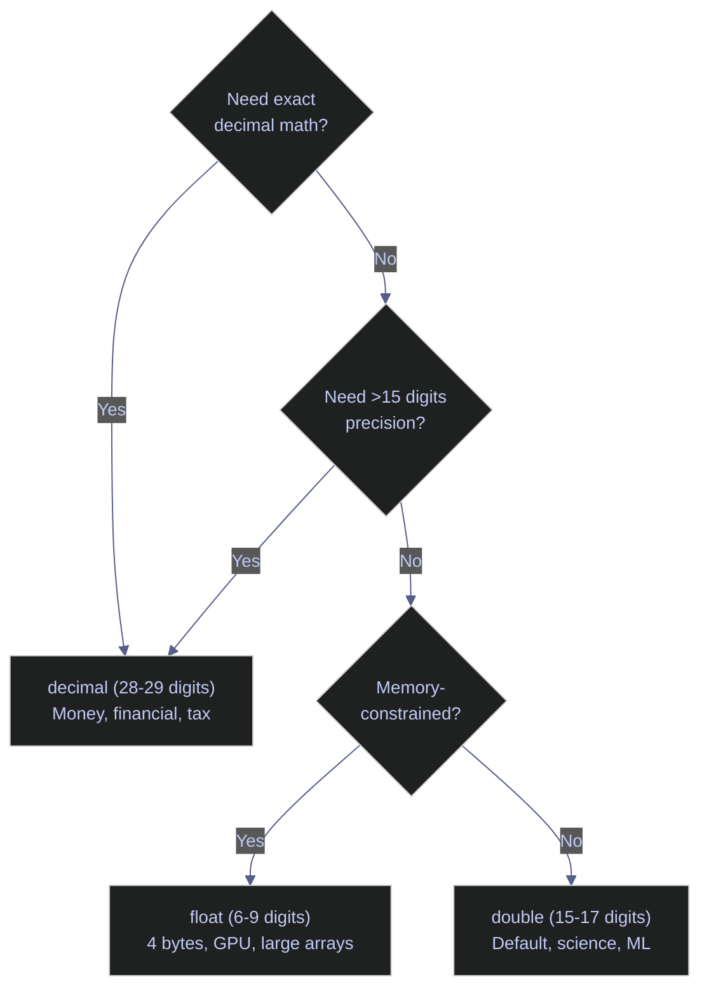
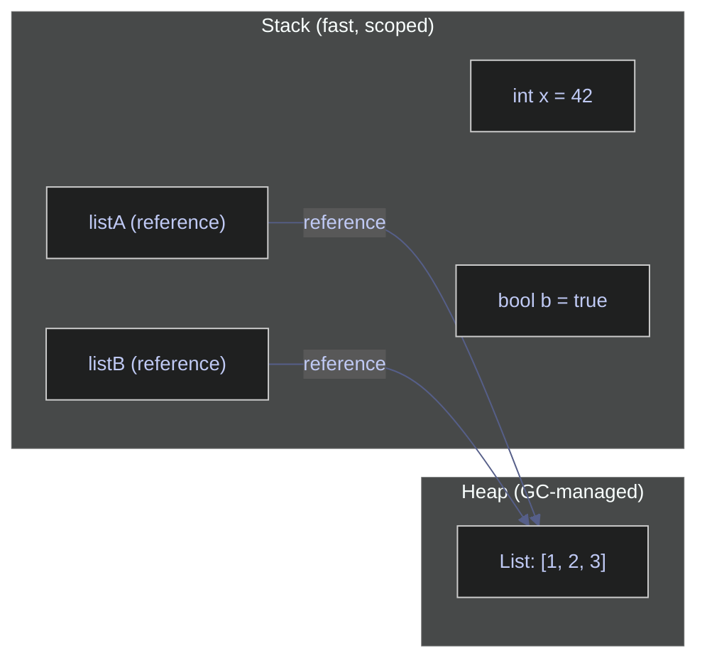
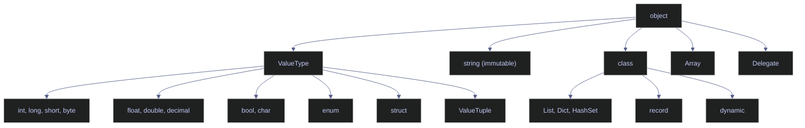

# 01. Basics - C#

> [!quote]+
>
> "The only way to learn a new programming language is by writing programs in it."
>
> — **Brian W. Kernighan & Dennis Ritchie**, *The C Programming Language* (1978)

> [!abstract]- Summary
>
> **Environment Setup** — verifies the .NET Interactive kernel, suppresses assembly version warnings, inspects the runtime version, OS, and working directory, loads NuGet packages with `#r "nuget:"`, and confirms required assembly availability.
>
> **Console I/O** — covers `Console.Write`/`Console.WriteLine` for output, string formatting via interpolation (`$"..."`), `String.Format`, and composite formatting; escape sequences and verbatim strings (`@"..."`); raw string literals (C# 11); ANSI color and style codes; numeric format specifiers (`C`, `D`, `E`, `F`, `N`, `P`, `X`); `Console.ReadLine` for input; and safe parsing with `int.TryParse`, `double.TryParse`, and validation loops.
>
> **Variables, Constants & Data Types** — static typing with explicit types and `var` inference; compile-time `const` vs runtime `readonly`; all ten integer types (`sbyte`–`ulong`, `nint`/`nuint`); three floating-point tiers (`float`/`double`/`decimal`); `bool`, `char`, `string`, `byte[]`; `null`, `Nullable<T>` (`T?`), `??` and `?.`; `struct`, `enum`, `ValueTuple`, `record`; collections (`List`, `Dictionary`, `HashSet`, `Queue`, `Stack`, `LinkedList`, sorted variants).
>
> **Operators** — arithmetic (including integer vs float division, `Math.Pow`, `Math.Floor`); comparison and reference equality (`ReferenceEquals`, `SequenceEqual`); logical short-circuit (`&&`, `||`, `!`); bitwise; compound assignment; ternary; null-coalescing (`??`, `??=`); pattern matching (`is`, `switch`); operator precedence.
>
> **Special Methods & Operator Overloading** — custom `operator` definitions; `IEquatable<T>`, `IComparable<T>`, `IEnumerable<T>`; implicit/explicit conversion operators; indexers; type inspection with `GetType`, `typeof`, `is`, `as`.
>
> **Value vs Reference Types** — storage context; copy vs shared-reference semantics; string immutability; boxing and unboxing; `struct` vs `class`; `ref`/`out`/`in` parameter modifiers.

> [!note]- Glossary
>
> **Variable**
> - Named storage location whose static type is known at compile time in ordinary C# code.
> - Used to store, retrieve, and pass values with compile-time type checking and tooling support.
>
> - Tip: `var x = 5;` infers `int` at compile time. The type is fixed after inference, so assigning a `string` later is a compile-time error.
>
> ---
>
> **Constant**
> - Value declared with `const` when it is a compile-time constant, or with `readonly` / `static readonly` when it is assigned once at runtime and then not changed.
> - Used to prevent accidental reassignment of values that are intended to stay fixed after definition or initialization.
>
> - Warning: use `readonly` or `static readonly` for values that depend on configuration, environment variables, constructor logic, or any other runtime computation.
>
> ---
>
> **Static typing**
> - Type system in which ordinary variable and expression types are determined and checked at compile time rather than being resolved dynamically at runtime.
> - Used to catch type mismatches early, enable refactoring tools, and support optimized generated code.
>
> - Note: `var` is compile-time type inference, not dynamic typing. `dynamic` defers member binding and many type checks to runtime.
>
> ---
>
> **`int`**
> - 32-bit signed integer type (`System.Int32`) with range −2,147,483,648 to 2,147,483,647.
> - Used as the default whole-number type for counters, loop indices, and general-purpose integer values.
>
> - Warning: integer overflow wraps in an `unchecked` context but throws `OverflowException` in a `checked` context. Do not assume overflow is always silent.
>
> ---
>
> **`long`**
> - 64-bit signed integer type (`System.Int64`) with a much larger range than `int`.
> - Used when values can exceed the `int` range, such as large identifiers, epoch-based timestamps, or high-volume counters.
>
> - Tip: `9_000_000_000L` is a `long` literal. Without the suffix, an out-of-range integer literal will not fit in `int`.
>
> ---
>
> **`float` / `double`**
> - Binary floating-point numeric types following IEEE 754, where `float` is 32-bit and `double` is 64-bit.
> - Used for scientific, statistical, and measurement-oriented values where binary rounding behavior is acceptable.
>
> - Warning: binary floating-point cannot represent many decimal fractions exactly. For currency and other exact base-10 arithmetic, use `decimal`.
>
> ---
>
> **`decimal`**
> - 128-bit decimal-based numeric type (`System.Decimal`) designed for high-precision base-10 arithmetic.
> - Used for financial calculations and any domain where decimal rounding must be controlled and binary floating-point error is unacceptable.
>
> - Warning: `19.99` is a `double`, while `19.99m` is a `decimal`. Omitting `m` gives the wrong numeric type for monetary values.
>
> ---
>
> **`bool`**
> - Boolean type that can hold only `true` or `false`.
> - Used for flags, conditions, and control-flow expressions that must evaluate explicitly to a boolean value.
>
> - Note: C# does not treat integers as booleans. `if (1)` is invalid, and boolean values do not implicitly behave like `1` and `0`.
>
> ---
>
> **`string`**
> - Immutable sequence of UTF-16 code units represented by `System.String`, with value-based equality for content comparison.
> - Used for textual data such as names, paths, JSON, SQL fragments, and messages.
>
> - Warning: repeated `+=` inside large loops creates many intermediate strings. Use `StringBuilder` when building large strings incrementally.
>
> ---
>
> **`char`**
> - Single UTF-16 code unit represented by `System.Char`.
> - Used for low-level character processing, lexical scanning, and APIs that operate on one code unit at a time.
>
> - Tip: `'a'` is a `char`. `"a"` is a one-character `string`. They are different types and are not interchangeable.
>
> ---
>
> **`byte` / `sbyte`**
> - One-byte integer types where `byte` is unsigned (0–255) and `sbyte` is signed (−128 to 127).
> - Used for binary data, protocol payloads, buffers, image channels, and low-level interop scenarios.
>
> - Warning: `byte` cannot represent negative values. Use `sbyte` only when a signed one-byte value is genuinely required. Most binary-data APIs in .NET use `byte`.
>
> ---
>
> **`null`**
> - Special value representing the absence of an object reference, or the absence of a value for nullable value types.
> - Used to model missing, optional, or not-yet-assigned values.
>
> - Warning: `NullReferenceException` remains a common runtime failure. Use null checks, null-conditional `?.`, null-coalescing `??`, and nullable reference type analysis to make null-handling explicit.
>
> ---
>
> **Value type**
> - Type whose variables contain the value directly, including built-in numeric types, `bool`, `struct`, `enum`, and nullable value types.
> - Used for compact data with value-copy semantics, predictable identity behavior, and efficient representation in many cases.
>
> - Note: value type does not simply mean "stack allocated". Value types are often stored inline, but not always literally on the stack. Their important semantic property is value-copy behavior, not a single storage location rule.
>
> ---
>
> **Reference type**
> - Type whose variables hold a reference to an object rather than containing the full object data directly, including `class`, arrays, delegates, and `string`.
> - Used for shared objects, polymorphic designs, and structures where identity and shared mutation matter.
>
> - Warning: assignment copies the reference, not the object. `var listB = listA;` makes both variables refer to the same list instance. Mutating through one variable is visible through the other.
>
> ---
>
> **Nullable (`T?`)**
> - Syntax for `Nullable<T>` on value types, adding a `null` state to a value type that normally cannot be null.
> - Used for optional numeric, date, and other value-type data, especially when modeling database columns or optional parameters.
>
> - Warning: accessing `.Value` when no value is present throws `InvalidOperationException`. Prefer `??`, pattern checks, or `GetValueOrDefault()`.
>
> ---
>
> **`var`**
> - Contextual keyword that asks the compiler to infer the variable’s static type from the right-hand side expression.
> - Used to reduce verbosity when the type is obvious or when the type would be cumbersome to repeat, such as with anonymous types or long generic names.
>
> - Tip: `var x = 3.14m;` infers `decimal`, while `var x = 3.14;` infers `double`. The compiler follows the literal's actual type rules.
>
> ---
>
> **`record`**
> - Type form designed for value-oriented data modeling, with compiler-generated members such as value-based equality and helpful printing behavior. `record` is a reference type; `record struct` is a value type.
> - Used for DTOs, immutable data carriers, and domain values where structural equality is more useful than identity-based equality.
>
> - Note: a `record` defaults to value-oriented equality semantics, while an ordinary `class` uses reference equality unless you override it manually.
>
> ---
>
> **`StringBuilder`**
> - Mutable text buffer in `System.Text` for building strings incrementally without allocating a new string on every append.
> - Used when many concatenation steps are required, especially inside loops or streaming text-generation workflows.
>
> - Tip: append incrementally with methods such as `Append` and `AppendLine`, then call `ToString()` once when the final string is needed.
>
> ---
>
> **Operator overloading**
> - Language feature that lets a type define custom behavior for operators such as `+`, `-`, `==`, or `<`.
> - Used to give domain-specific value types natural syntax, especially for mathematical or strongly modeled business values.
>
> - Warning: if you overload equality-related operators, also keep `Equals()` and `GetHashCode()` consistent so comparisons and hash-based collections behave correctly.
>
> ---
>
> **Checked / Unchecked**
> - Arithmetic contexts that control whether integral overflow raises an exception (`checked`) or wraps silently (`unchecked`).
> - Used to make overflow behavior explicit in domains where range errors matter, such as finance, counters, indexing, or safety-sensitive calculations.
>
> - Tip: project-wide checked settings can catch real bugs early, but they should be chosen consciously because they change numeric-failure behavior across the codebase.
>
> ---
>
> **NuGet**
> - Package manager for .NET libraries and tools, used to restore dependencies into a project or solution.
> - Used to declare, install, version, and update third-party packages and their transitive dependency graph.
>
> - Tip: central package management can reduce version drift across projects and make dependency governance easier in multi-project repositories.

This note covers the absolute foundations of C# as a programming language: how to set up and verify a .NET Interactive notebook environment, read and write console output, declare variables with static typing, work with every built-in data type, use all operator families, implement custom operator behavior via operator overloading, and understand the value-vs-reference type distinction that governs copy semantics, storage context, and mutation safety.

## Environment Setup

Covers .NET interactive notebook configuration, runtime version inspection, and assembly management. These cells verify the execution environment before running language examples.

### Interactive notebook directives

#### Suppress .NET assembly version warnings

The .NET Interactive kernel emits assembly version mismatch warnings that clutter notebook output. This cell reconfigures the C# kernel's script options to set the warning level to zero, silencing these diagnostics for the remainder of the session. Only needed in Polyglot Notebook / .NET Interactive environments.

*This example shows how to suppress .NET assembly version warnings.*

```csharp
using System.Collections;
using System.Numerics;
using System.Reflection;
using Microsoft.DotNet.Interactive;
using Microsoft.DotNet.Interactive.CSharp;

#r "nuget: Newtonsoft.Json"
using Newtonsoft.Json;
var csharpKernel = (CSharpKernel)Kernel.Root.FindKernelByName("csharp");
var optionsField = typeof(CSharpKernel).GetField("_scriptOptions",
    BindingFlags.NonPublic | BindingFlags.Instance);

var scriptOptions = optionsField.GetValue(csharpKernel);
var withWarningLevel = scriptOptions.GetType().GetMethod("WithWarningLevel");
var newOptions = withWarningLevel.Invoke(scriptOptions, new object[] { 0 });
optionsField.SetValue(csharpKernel, newOptions);
```

### Runtime and assembly inspection

#### Check .NET runtime version and operating system

`Environment.Version` returns the .NET runtime version, `Environment.OSVersion` reports the host OS, and `Environment.MachineName` identifies the machine. Use these to verify the notebook is running on the expected platform.

*This example shows how to check .NET runtime version and operating system.*

```csharp
Console.WriteLine(Environment.Version);
Console.WriteLine(Environment.OSVersion);
Console.WriteLine(Environment.MachineName);
```

```text
10.0.5
Microsoft Windows NT 10.0.26200.0
ELYSIUM
```

#### Inspect working directory and current user

`Environment.CurrentDirectory` returns the working directory where file path resolution starts. `Environment.UserName` returns the identity running the process. Useful for verifying notebook execution context before file I/O operations.

*This example shows how to inspect working directory and current user.*

```csharp
Console.WriteLine(Environment.CurrentDirectory);
Console.WriteLine(Environment.UserName);
```

```text
C:\Users\aperi\My Drive\VAULT
Alex
```

#### Load a NuGet package with the #r directive

The `#r "nuget: PackageName"` directive downloads and references a NuGet package at runtime inside .NET Interactive notebooks. After loading, the package's types become available via `using` statements. This cell confirms that `Newtonsoft.Json` is available and prints a few representative loaded assembly names from the current session.

*This example shows how to load a NuGet package with the #r directive.*

```csharp
Console.WriteLine($"{typeof(JsonConvert).Assembly.GetName().Name} loaded successfully");
Console.WriteLine(typeof(JsonConvert).Assembly.GetName().Name);
Console.WriteLine(typeof(System.Linq.Enumerable).Assembly.GetName().Name);
Console.WriteLine(typeof(System.Net.Http.HttpClient).Assembly.GetName().Name);
Console.WriteLine(typeof(System.Text.Json.JsonSerializer).Assembly.GetName().Name);
Console.WriteLine(typeof(System.Uri).Assembly.GetName().Name);
```

```text
Newtonsoft.Json loaded successfully
Newtonsoft.Json
System.Linq
System.Net.Http
System.Text.Json
System.Private.Uri
```

#### Verify that required assemblies are loaded

`Assembly.Load` attempts to load a named assembly into the current application domain. Wrapping it in a try/catch lets you confirm each dependency is available before running code that depends on it. This pattern is useful at the top of notebooks to fail fast if a required library is missing.

*This example shows how to verify that required assemblies are loaded.*

```csharp
var assemblies = new[] {
    "System.Linq",
    "System.Collections",
    "System.IO",
    "System.Net.Http",
    "System.Text.Json",
    "System.Threading.Tasks"
};

foreach (var name in assemblies)
{
    try
    {
        System.Reflection.Assembly.Load(name);
        Console.WriteLine($"  {name}: OK");
    }
    catch
    {
        Console.WriteLine($"  {name}: MISSING");
    }
}
```

```text
  System.Linq: OK
  System.Collections: OK
  System.IO: OK
  System.Net.Http: OK
  System.Text.Json: OK
  System.Threading.Tasks: OK
```

## Console I/O

Demonstrates output formatting, escape sequences, terminal styling, numeric format specifiers, and input parsing. C# console I/O revolves around `Console.Write`/`Console.WriteLine` for output and `Console.ReadLine` for input, with `TryParse` for safe type conversion.

### Output and string formatting

#### Concatenate strings with the + operator

The `+` operator creates a new string by joining its operands left to right. Each concatenation allocates a new string object, so for repeated joins in a loop, prefer `StringBuilder`. For a fixed number of operands, `+` is clear and efficient — the compiler optimizes small concatenation chains.

*This example shows how to concatenate strings with the + operator.*

```csharp
Console.WriteLine("one" + " | " + "two" + " | " + "three");
```

```text
one | two | three
```

#### Format strings with interpolation, String.Format, and composite formatting

C# offers three string formatting approaches. **String interpolation** (`$"..."`) embeds expressions directly in the string — preferred for readability. **`String.Format`** uses numbered placeholders (`{0}`, `{1}`) — useful when the format string comes from a resource file. **Composite formatting** passes placeholders directly to `Console.WriteLine` — a shorthand for `String.Format` when printing immediately. All three support format specifiers like `:F2` for two decimal places.

*This example shows how to format strings with interpolation, String.Format, and composite formatting.*

```csharp
string name = "Alice";
int age = 30;

Console.WriteLine($"Name: {name}, Age: {age}");
Console.WriteLine(string.Format("Name: {0}, Age: {1}", name, age));
Console.WriteLine("Name: {0}, Age: {1}", name, age);

Console.WriteLine($"Next year: {age + 1}");
Console.WriteLine($"Name uppercased: {name.ToUpper()}");
Console.WriteLine($"Pi to 2 decimals: {3.14159:F2}");
```

```text
Name: Alice, Age: 30
Name: Alice, Age: 30
Name: Alice, Age: 30
Next year: 31
Name uppercased: ALICE
Pi to 2 decimals: 3.14
```

#### Write output without a trailing newline using Console.Write

`Console.Write` prints text without appending a newline, so successive calls build up a single line. `Console.WriteLine` appends `Environment.NewLine` after the text. Use `Write` when constructing output incrementally (progress bars, inline prompts) and `WriteLine` for complete lines.

*This example shows how to write output without a trailing newline using Console.Write.*

```csharp
Console.Write("hello ");
Console.Write("world");
Console.WriteLine("!");
```

```text
hello world!
```

#### Join collection elements into a delimited string with string.Join

`string.Join(separator, values)` concatenates all elements with the separator between them. It accepts any `IEnumerable` or `params object[]`, so it works with arrays, lists, and even mixed-type arguments. C# has no `sep` parameter on `Console.WriteLine` like Python's `print(sep=...)` — use `string.Join` instead.

*This example shows how to join collection elements into a delimited string with string.Join.*

```csharp
var items = new[] { "a", "b", "c" };
Console.WriteLine(string.Join(", ", items));
Console.WriteLine(string.Join("", items));
Console.WriteLine(string.Join(" → ", items));
Console.WriteLine(string.Join("-", 2024, 3, 15));
```

```text
a, b, c
abc
a → b → c
2024-3-15
```

#### Redirect output to stderr or a file

`Console.Error` is a `TextWriter` that targets standard error. Use it for diagnostic messages that should not mix with normal output. `Console.SetOut` redirects `Console.Write`/`WriteLine` to any `TextWriter`, including a file stream.

*This example shows how to redirect output to stderr or a file.*

```csharp
Console.Error.WriteLine("This goes to stderr");
```

```text
This goes to stderr
```

### Escape sequences and terminal styling

#### Escape sequences and verbatim strings

Escape sequences insert special characters into string literals using a backslash prefix: `\t` (tab), `\n` (newline), `\\` (literal backslash), `\"` (double quote), `\uXXXX` (Unicode code point), and `\0` (null character). Verbatim strings (`@"..."`) disable escape processing — backslashes are treated as literal characters, which is ideal for file paths and regex patterns. Combine verbatim with interpolation using `$@"..."` to get both features.

*This example demonstrates escape sequences and verbatim strings.*

```csharp
Console.WriteLine("Tab:\tafter tab");
Console.WriteLine("Newline:\nafter newline");
Console.WriteLine("Backslash: \\");
Console.WriteLine("Quote: \"double\"");
Console.WriteLine("Unicode: \u2764 \u2605 \u2602");
Console.WriteLine("Null char: [\0] (invisible)");
Console.WriteLine(@"Verbatim string: \n \t not escaped");

Console.WriteLine("Regular:  C:\\Users\\file.txt");
Console.WriteLine(@"Verbatim: C:\Users\file.txt");
Console.WriteLine($@"Combined: C:\Users\{Environment.UserName}");
```

```text
Tab:	after tab
Newline:
after newline
Backslash: \
Quote: "double"
Unicode: ❤ ★ ☂
Null char: [] (invisible)
Verbatim string: \n \t not escaped
Regular:  C:\Users\file.txt
Verbatim: C:\Users\file.txt
Combined: C:\Users\Alex
```

#### Raw string literals — multi-line strings without escaping (C# 11)

Raw string literals (C# 11+) use three or more double quotes (`"""..."""`) to define strings that require no escape sequences at all. Whitespace indentation is trimmed based on the closing quotes' position. Combine with `$` for interpolation — use `{{` and `}}` to insert literal braces. Raw strings eliminate the need for `@` verbatim strings in most cases and are ideal for embedded JSON, SQL, XML, and regex patterns.

*This example demonstrates raw string literals — multi-line strings without escaping (C# 11).*

```csharp
string json = """
    {
        "name": "Alice",
        "age": 30
    }
    """;
Console.WriteLine(json);

string interpolated = $"""
    Name: {"Alice"}, Age: {30}
    """;
Console.WriteLine(interpolated);
```

```text
{
    "name": "Alice",
    "age": 30
}
Name: Alice, Age: 30
```

#### Apply ANSI color and style codes to terminal output

ANSI escape codes control text color, weight, and decoration in terminals that support them. The escape character in C# is `\x1b` (hex 1B = ESC). Each code is bracketed by `\x1b[` and terminated with `m`. Always reset with `\x1b[0m` to prevent style bleeding into subsequent output. In terminal applications use `\033` (octal) as an alternative escape prefix. Notebook environments may strip ANSI codes — the output below shows the raw escape sequences as the notebook does not interpret them.

*This example shows how to apply ANSI color and style codes to terminal output.*

```csharp
Console.WriteLine("\x1b[31mRed text\x1b[0m");
Console.WriteLine("\x1b[32mGreen text\x1b[0m");
Console.WriteLine("\x1b[1;34mBold blue text\x1b[0m");
Console.WriteLine("\x1b[43m\x1b[30mBlack on yellow\x1b[0m");
Console.WriteLine("\x1b[4mUnderlined\x1b[0m");
Console.WriteLine("\x1b[9mStrikethrough\x1b[0m");
Console.WriteLine("\x1b[3mItalic\x1b[0m\n");
```

```text
Red text
Green text
Bold blue text
Black on yellow
Underlined
Strikethrough
Italic
```

#### Common ANSI escape codes reference

Quick reference for the most frequently used ANSI escape code categories. Foreground color codes range from 30 (black) to 37 (white); background codes are the same values plus 10 (40–47). Extended 256-color and 24-bit RGB modes use `\x1b[38;5;Nm` and `\x1b[38;2;R;G;Bm` respectively.

*This example demonstrates common ANSI escape codes reference.*

```csharp
Console.WriteLine(@"\x1b[0m      Reset");
Console.WriteLine(@"\x1b[3m      Italic");
Console.WriteLine(@"\x1b[1m      Bold");
Console.WriteLine(@"\x1b[4m      Underline");
Console.WriteLine(@"\x1b[9m      Strikethrough");
Console.WriteLine(@"\x1b[30-37m  Foreground colors (black,red,green,yellow,blue,magenta,cyan,white)");
Console.WriteLine(@"\x1b[40-47m  Background colors (same order)");
```

```text
\x1b[0m      Reset
\x1b[3m      Italic
\x1b[1m      Bold
\x1b[4m      Underline
\x1b[9m      Strikethrough
\x1b[30-37m  Foreground colors (black,red,green,yellow,blue,magenta,cyan,white)
\x1b[40-47m  Background colors (same order)
```

### Numeric formatting

#### Format numbers with ToString() standard format specifiers

`ToString(format)` applies a standard numeric format string to produce culture-aware output. Common specifiers: `C` (currency, locale-sensitive symbol and grouping), `D` (decimal with zero-padding), `E` (scientific notation), `F` (fixed-point), `N` (number with thousands separator), `P` (percentage), and `X` (hexadecimal uppercase). A trailing digit controls precision — `D8` pads to 8 digits, `E2` uses 2 decimal places in the mantissa.

*This example shows how to format numbers with ToString() standard format specifiers.*

```csharp
int num = 42;
Console.WriteLine(num.ToString());
Console.WriteLine(num.ToString("X"));
Console.WriteLine(num.ToString("D8"));
Console.WriteLine(num.ToString("C"));
Console.WriteLine(num.ToString("E2"));
```

```text
42
2A
00000042
$42.00
4.20E+001
```

### Console input and parsing

#### Read a line of text from standard input with Console.ReadLine

`Console.ReadLine()` blocks until the user presses Enter, then returns the entire line as a `string` (or `null` if the input stream is closed). All console input arrives as text — numeric values must be parsed explicitly. In notebook environments, `ReadLine` is not interactive, so a hardcoded string simulates the input.

*This example shows how to read a line of text from standard input with Console.ReadLine.*

```csharp
string inputName = "Alice";
Console.WriteLine($"Hello, {inputName}!");
Console.WriteLine($"Type of input: {inputName.GetType()}");
```

```text
Hello, Alice!
Type of input: System.String
```

#### Parse a string to integer safely with int.TryParse

`int.TryParse(string, out int)` attempts to convert a string to a 32-bit integer without throwing an exception on failure. It returns `true` if parsing succeeds and writes the result to the `out` parameter; on failure it returns `false` and sets the `out` parameter to `0`. Always prefer `TryParse` over `int.Parse` for user input — `Parse` throws `FormatException` on invalid strings, which is expensive and disruptive.

*This example shows how to parse a string to integer safely with int.TryParse.*

```csharp
string ageStr = "30";

if (int.TryParse(ageStr, out int age))
{
    Console.WriteLine($"Your age is {age}, type: {age.GetType()}");
}
else
{
    Console.WriteLine($"'{ageStr}' is not a valid integer");
}
```

```text
Your age is 30, type: System.Int32
```

#### Parse a string to double safely with double.TryParse

`double.TryParse` works identically to `int.TryParse` but for 64-bit floating-point values. It respects the current culture's decimal separator (`CultureInfo.CurrentCulture`) — on systems where the decimal separator is a comma, `"19.99"` will fail unless you pass `CultureInfo.InvariantCulture`. For financial amounts, parse to `decimal` instead of `double` to avoid binary floating-point rounding.

*This example shows how to parse a string to double safely with double.TryParse.*

```csharp
string priceStr = "19.99";

if (double.TryParse(priceStr, out double price))
{
    Console.WriteLine($"Price: ${price:F2}, type: {price.GetType()}");
}
else
{
    Console.WriteLine($"'{priceStr}' is not a valid number");
}
```

```text
Price: $19.99, type: System.Double
```

#### Validate input in a loop until parsing succeeds

A common pattern for interactive console applications: loop on `Console.ReadLine` + `TryParse` until the user provides valid input. The notebook simulates this with an array of test inputs. `GetValidInt` rejects non-numeric strings, and `GetNonEmptyString` rejects whitespace-only input using `string.IsNullOrWhiteSpace`. In production, use a `while (true)` loop with `Console.ReadLine()` in place of the array iteration.

*This example shows how to validate input in a loop until parsing succeeds.*

```csharp
string[] testInputs = { "abc", "", "42" };

int GetValidInt(string[] inputs)
{
    foreach (var input in inputs)
    {
        Console.WriteLine($"'{input}'");
        if (int.TryParse(input, out int result))
        {
            Console.WriteLine($"  Valid integer: {result}");
            return result;
        }
        Console.WriteLine($"  '{input}' is not valid. Please enter a whole number.");
    }
    return 0;
}

string GetNonEmptyString(string[] inputs)
{
    foreach (var input in inputs)
    {
        Console.WriteLine($"'{input}'");
        if (!string.IsNullOrWhiteSpace(input))
        {
            Console.WriteLine($"  Valid string: {input.Trim()}");
            return input.Trim();
        }
        Console.WriteLine("  Input cannot be empty.");
    }
    return "";
}

GetValidInt(testInputs);
GetNonEmptyString(new[] { "", "  ", "Alice" });
```

```text
'abc'
  'abc' is not valid. Please enter a whole number.
''
  '' is not valid. Please enter a whole number.
'42'
  Valid integer: 42
''
  Input cannot be empty.
'  '
  Input cannot be empty.
'Alice'
  Valid string: Alice
```

## Variables, Constants & Data Types

Covers variable declaration, constants, type inference with `var`, the complete set of value and reference types, nullability, and the storage and lifetime rules that shape how C# manages data.

### Variable declaration and constants

#### Declare variables with explicit types or var inference

Declare with an explicit type (`int x = 10`) or let the compiler infer it (`var x = 10`) — both are statically typed at compile time. Use `var` for obvious types (LINQ, constructors, anonymous types) and explicit types when the right-hand side doesn't reveal the type (`int count = GetCount()`). Avoid `var` for numeric literals (`var x = 1` — ambiguous: `int`? `long`? `byte`?). `var` lets the compiler infer the type at compile time — `var z = 42` is inferred as `int` and remains statically typed.

*This example shows how to declare variables with explicit types or var inference.*

```csharp
int x = 10;
double y = 3.14;
string name = "Alice";
bool active = true;

var z = 42;

Console.WriteLine(x.GetType());
Console.WriteLine(y.GetType());
Console.WriteLine(name.GetType());
Console.WriteLine(active.GetType());
Console.WriteLine(z.GetType());
```

```text
System.Int32
System.Double
System.String
System.Boolean
System.Int32
```

> [!warning] Type inference does not make C# dynamically typed
>
> New C# users often read `var` as if it were Python-style rebinding, but the
> compiler still locks the variable to one concrete type at declaration time.
>
> > [!danger] Variables cannot change type after declaration
> >
> > C# is statically typed. `x = "string"` after declaring `int x` is a compile
> > error. Unlike Python, the type is fixed when the variable is declared.
>
> > [!success] Use `var` for inference without losing type safety
> >
> > `var x = 42;` infers `int` at compile time — the variable is still statically
> > typed, you just do not have to write the type explicitly.

#### Define compile-time and runtime constants with const and readonly

`const` values must be known at compile time and are embedded directly into the IL — use for truly fixed values like `Pi` or configuration keys that never change. `readonly` fields can be set once in the constructor at runtime — use for values computed at startup (e.g., connection strings from environment variables). `const` is implicitly `static`; `readonly` can be instance-level. Any attempt to reassign a constant (`Pi = 999`) is a compile error.

> [!info] readonly vs const
>
> `readonly` can be assigned in the constructor at runtime. `const` must be a compile-time literal. Use `readonly` for values computed at startup.

*This example shows how to define compile-time and runtime constants with const and readonly.*

```csharp
const double Pi = 3.14159;
const int MaxUsers = 100;
const string ApiUrl = "https://api.example.com";

Console.WriteLine($"Pi = {Pi}");
Console.WriteLine($"MaxUsers = {MaxUsers}");
Console.WriteLine($"ApiUrl = {ApiUrl}");
```

```text
Pi = 3.14159
MaxUsers = 100
ApiUrl = https://api.example.com
```

### Numeric types

#### Signed and unsigned integer types — sbyte through ulong and native-size

C# provides ten integer types across four widths (8, 16, 32, 64 bits), each available in signed and unsigned variants. `int` (32-bit signed) is the default for most use cases. Use `long` when values exceed ~2.1 billion, `byte` for raw binary data, and `uint`/`ulong` for interop or bit manipulation. The `nint`/`nuint` native-size types (C# 9+) match the platform pointer width — 32 bits on x86, 64 on x64. Suffix literals with `L` for long and `U` for unsigned. Digit separators (`_`) improve readability of large constants.

*This example demonstrates signed and unsigned integer types — sbyte through ulong and native-size.*

```csharp
Console.WriteLine($"{sbyte.MinValue} to {sbyte.MaxValue}");
Console.WriteLine($"{short.MinValue} to {short.MaxValue}");
Console.WriteLine($"{int.MinValue} to {int.MaxValue}");
Console.WriteLine($"{long.MinValue} to {long.MaxValue}");

Console.WriteLine();
Console.WriteLine($"{byte.MinValue} to {byte.MaxValue}");
Console.WriteLine($"{ushort.MinValue} to {ushort.MaxValue}");
Console.WriteLine($"{uint.MinValue} to {uint.MaxValue}");
Console.WriteLine($"{ulong.MinValue} to {ulong.MaxValue}");

long big = 9_000_000_000_000L;   // L suffix for long
uint positive = 4_000_000_000U;  // U suffix for uint

// Overflow: int.MaxValue + 1 wraps around (unchecked) or throws (checked)
// checked { int overflow = int.MaxValue + 1; } // throws OverflowException
```

```text
-128 to 127
-32768 to 32767
-2147483648 to 2147483647
-9223372036854775808 to 9223372036854775807

0 to 255
0 to 65535
0 to 4294967295
0 to 18446744073709551615
```

#### Detect integer overflow with checked and unchecked contexts

By default, integer arithmetic in C# is **unchecked** — overflow silently wraps around (`int.MaxValue + 1` becomes `int.MinValue`). The `checked` keyword enables overflow detection: any operation that exceeds the type's range throws `OverflowException`. Use `checked` blocks for financial calculations, counters, and any code where silent overflow would produce wrong results. The `unchecked` keyword explicitly opts out — useful inside a project-wide checked context.

*This example shows how to detect integer overflow with checked and unchecked contexts.*

```csharp
int max = int.MaxValue;
int uncheckedResult = unchecked(max + 1);
Console.WriteLine($"unchecked: {max} + 1 = {uncheckedResult}");

try
{
    int checkedResult = checked(max + 1);
}
catch (OverflowException ex)
{
    Console.WriteLine($"checked: {max} + 1 threw {ex.GetType().Name}");
}
```

```text
unchecked: 2147483647 + 1 = -2147483648
checked: 2147483647 + 1 threw OverflowException
```

> [!tip] Enable project-wide checked arithmetic
>
> Add `<CheckForOverflowUnderflow>true</CheckForOverflowUnderflow>` to your `.csproj` to make all integer arithmetic checked by default. Use `unchecked` for the rare cases where wrapping is intentional (hash functions, bit manipulation).

#### Floating-point types — float, double, decimal precision tiers

Three floating-point types with increasing precision: `float` (32-bit, ~7 digits), `double` (64-bit, ~15 digits), `decimal` (128-bit, 28-29 digits). `double` is the default for science and ML. `decimal` has exact base-10 representation (no `0.1+0.2` surprises) — required for money and financial math. `float` uses half the memory of `double`.

*This diagram summarizes when `float`, `double`, or `decimal` is usually the right fit.*



> [!warning] Numeric type choice matters most when precision errors become business bugs
>
> Binary floating-point is fine for many scientific and approximate calculations,
> but it becomes dangerous when you expect exact decimal behavior or exact
> equality.
>
> > [!danger] Financial math and exact float equality are the wrong fit for binary floating point
> >
> > Never use `float` or `double` for currency — use `decimal`. Never compare
> > floats with `==` for computed values — use `Math.Abs(a - b) < epsilon`.
>
> > [!success] Use `decimal` for money and epsilon comparisons for floating point
> >
> > Declare monetary amounts as `decimal amount = 9.99m;`. For floating-point
> > equality checks, use `Math.Abs(a - b) < 1e-9` or another tolerance chosen for
> > the precision your computation requires.

*This example demonstrates floating-point types — float, double, decimal precision tiers.*

```csharp
Console.WriteLine("=== Floating-Point Types ===");
Console.WriteLine($"{float.MinValue} to {float.MaxValue}, ~6-9 digits precision");
Console.WriteLine($"{double.MinValue} to {double.MaxValue}, ~15-17 digits precision");
Console.WriteLine($"{decimal.MinValue} to {decimal.MaxValue}, 28-29 digits precision");
```

```text
=== Floating-Point Types ===
-3.4028235E+38 to 3.4028235E+38, ~6-9 digits precision
-1.7976931348623157E+308 to 1.7976931348623157E+308, ~15-17 digits precision
-79228162514264337593543950335 to 79228162514264337593543950335, 28-29 digits precision
```

#### Specify floating-point type with literal suffixes — f, d, m

Without a suffix, a numeric literal with a decimal point defaults to `double`. The `f` suffix makes it `float` (required — `float x = 3.14;` is a compile error because `3.14` is `double`). The `m` suffix makes it `decimal` (also required). The `d` suffix explicitly marks `double` but is redundant since it is the default.

*This example demonstrates specify floating-point type with literal suffixes — f, d, m.*

```csharp
float f = 3.14f;
double d = 3.14;
decimal m = 3.14m;

Console.WriteLine(f.GetType());
Console.WriteLine(d.GetType());
Console.WriteLine(m.GetType());
```

```text
System.Single
System.Double
System.Decimal
```

#### Observe how var infers floating-point type from literal suffix

When you use `var`, the compiler determines the type entirely from the right-hand side. `var a = 3.14` infers `double`, `var b = 3.14f` infers `float` (`System.Single`), and `var e = 3.14m` infers `decimal`. This makes suffix choice critical with `var` — omitting `m` on a monetary value silently gives you `double` with binary rounding.

> [!warning] Literal suffixes decide the numeric type before `var` ever enters the picture
>
> The compiler treats unsuffixed decimal literals as `double`, which makes money
> examples and `float` declarations easy to get wrong by accident.
>
> > [!danger] Unsuffixed decimal literals default to `double`
> >
> > `float x = 3.14;` is a compile error because `3.14` is a `double` literal by
> > default. `decimal` also requires its own suffix.
>
> > [!success] Use the correct suffix for each floating-point type
> >
> > Write `float f = 3.14f;`, `decimal d = 9.99m;`, and `double x = 3.14;`. The
> > suffix is part of the type declaration at the literal itself.

*This example shows how to observe how var infers floating-point type from literal suffix.*

```csharp
var a = 3.14;
var b = 3.14f;
var c = 3.14d;
var e = 3.14m;
Console.WriteLine(a.GetType().Name);
Console.WriteLine(b.GetType().Name);
Console.WriteLine(c.GetType().Name);
Console.WriteLine(e.GetType().Name);
```

```text
Double
Single
Double
Decimal
```

#### Inspect special floating-point values — NaN, Infinity, and precision loss

IEEE 754 defines three special `double` values: `PositiveInfinity` (result of division by zero), `NegativeInfinity`, and `NaN` (Not a Number — result of `0.0/0.0` or `Math.Sqrt(-1)`). `NaN` is not equal to anything, including itself — use `double.IsNaN()` to test. The classic `0.1 + 0.2 != 0.3` rounding artifact is inherent to binary floating-point; `decimal` avoids it because it uses base-10 representation.

*This example shows how to inspect special floating-point values — NaN, Infinity, and precision loss.*

```csharp
Console.WriteLine(double.PositiveInfinity);
Console.WriteLine(double.NegativeInfinity);
Console.WriteLine(double.NaN);

Console.WriteLine();
Console.WriteLine($"0.1 + 0.2 = {0.1 + 0.2}");
Console.WriteLine($"0.1m + 0.2m = {0.1m + 0.2m}");
```

```text
∞
-∞
NaN

0.1 + 0.2 = 0.30000000000000004
0.1m + 0.2m = 0.3
```

#### Perform complex number arithmetic with System.Numerics.Complex

`Complex` represents a number with a real and imaginary part (e.g., `3 + 4i`). It lives in `System.Numerics` and supports standard arithmetic operators, conjugate, magnitude (absolute value), and phase. Use it for signal processing, physics simulations, or any domain that requires the complex plane. The magnitude of `(3, 4)` is `5` by the Pythagorean theorem.

*This example shows how to perform complex number arithmetic with System.Numerics.Complex.*

```csharp
var z = new Complex(3, 4);
Console.WriteLine($"z = {z}, type: {z.GetType()}");
Console.WriteLine($"Real: {z.Real}, Imaginary: {z.Imaginary}");
Console.WriteLine(Complex.Conjugate(z));
Console.WriteLine(z.Magnitude);
```

```text
z = <3; 4>, type: System.Numerics.Complex
Real: 3, Imaginary: 4
<3; -4>
5
```

### Boolean, byte arrays, and null handling

#### bool — true/false only, no implicit int conversion

The `bool` type holds exactly `true` or `false` — there is no implicit conversion to or from integers. `if (1)` and `true + true` are compile errors. When you need an integer representation, use `Convert.ToInt32(boolVal)` which returns `1` for `true` and `0` for `false`.

> [!info] bool Is Strict — No Numeric Conversion, No Truthy/Falsy
>
> C# has no implicit bool-to-int conversion. `true + true` and `int x = true` are compile errors. Use `Convert.ToInt32(boolVal)` if needed.
> `if ("hello")` and `if (1)` are also compile errors. C# requires explicit boolean expressions: `if (str != null && str.Length > 0)`.

*This example demonstrates bool — true/false only, no implicit int conversion.*

```csharp
bool a = true;
bool b = false;

Console.WriteLine(a.GetType());
Console.WriteLine(b.GetType());
Console.WriteLine($"Convert.ToInt32(true) = {Convert.ToInt32(true)}");
Console.WriteLine($"Convert.ToInt32(false) = {Convert.ToInt32(false)}");
```

```text
System.Boolean
System.Boolean
Convert.ToInt32(true) = 1
Convert.ToInt32(false) = 0
```

#### Convert between strings and byte arrays with UTF-8 encoding

`Encoding.UTF8.GetBytes(string)` encodes a string into a UTF-8 byte array, and `Encoding.UTF8.GetString(byte[])` decodes it back. UTF-8 is variable-width: ASCII characters use 1 byte, accented characters like `é` use 2 bytes, and emoji can use up to 4. This is why `"café"` encodes to 5 bytes (not 4) — the `é` requires two bytes (`195, 169`). Use `Encoding.ASCII` or `Encoding.Unicode` (UTF-16) when interoperating with systems that expect those encodings.

*This example shows how to convert between strings and byte arrays with UTF-8 encoding.*

```csharp
byte[] b1 = new byte[] { 104, 101, 108, 108, 111 };
Console.WriteLine(b1.GetType());
Console.WriteLine(System.Text.Encoding.UTF8.GetString(b1));   // As string

// Encoding/decoding
string text = "café";
byte[] encoded = System.Text.Encoding.UTF8.GetBytes(text);
string decoded = System.Text.Encoding.UTF8.GetString(encoded);
Console.WriteLine();
Console.WriteLine($"[{string.Join(", ", encoded)}]");
Console.WriteLine(decoded);   // decoded back
```

```text
System.Byte[]
hello

[99, 97, 102, 195, 169]
café
```

#### Understand null references and nullable value types

`null` represents the absence of an object reference, or the absence of a value in `Nullable<T>`. Attempting to access a member on a `null` reference throws `NullReferenceException`. Non-nullable value types such as `int`, `bool`, and ordinary `struct` values do not include a `null` state by default. Use the `?` suffix (`int?`, `double?`) to create a nullable value type backed by `Nullable<T>`, which adds a `HasValue` flag alongside the value.

> [!warning] Value types need an explicit nullable wrapper before they can represent absence
>
> Unlike reference types, ordinary value types do not carry a built-in null
> state. The extra state has to be requested explicitly.
>
> > [!danger] Plain value types cannot hold `null`
> >
> > `int x = null` is a compile error. A value type such as `int`, `bool`, or
> > `DateTime` needs `T?` before null becomes valid.
>
> > [!success] Use nullable value types when null is a real state
> >
> > `int? x = null;` declares a nullable int. Check with `x.HasValue` or
> > `x == null`. Unwrap with `x.Value` or `x.GetValueOrDefault(0)`. In C# 8+,
> > enable `#nullable enable` for compile-time null safety on reference types too.

*This example shows how to understand null references and nullable value types.*

```csharp
string s = null;

Console.WriteLine(s == null);   // s is null
Console.WriteLine(s is null);

int? x = null;
Console.WriteLine();
Console.WriteLine(x.HasValue);
x = 42;
Console.WriteLine(x.Value);
```

```text
True
True

False
42
```

#### Provide fallback values with ?? and safely access members with ?.

The null-coalescing operator `??` returns the left operand if it is non-null, otherwise the right operand — a concise replacement for `if (x != null) x else default`. The null-conditional operator `?.` short-circuits member access: `name?.Length` returns `null` (not `NullReferenceException`) when `name` is `null`, and the actual length otherwise. The return type becomes `int?` since the result may be null.

*This example shows how to provide fallback values with ?? and safely access members with ?..*

```csharp
string name = null;
Console.WriteLine(name ?? "Unknown");

Console.WriteLine($"name?.Length:{name?.Length}");
```

```text
Unknown
name?.Length:
```

### Type system reference — all built-in types

#### C# data type overview — value types vs reference types

C# has a strict **value type vs reference type** distinction, but storage location still depends on context.

- **Stack frames** usually hold the current method's local variables and references.
- **The managed heap** stores object instances whose lifetime is tracked by the Garbage Collector (GC).
- A value type variable stores its data directly; a reference type variable stores a reference to an object.

*This diagram shows a conceptual split between local variables and referenced heap objects.*



*This diagram summarizes the built-in type families rooted at `object` and `ValueType`.*



#### Integer types — complete reference with sizes and ranges

All ten integer types with their storage size, signedness, and boundary values. Use `sizeof()` to confirm size at compile time.

*This example demonstrates integer types — complete reference with sizes and ranges.*

```csharp
sbyte   sb = -128;        Console.WriteLine($"{sb}  ({sizeof(sbyte)} byte,  signed)");
byte    by = 255;         Console.WriteLine($"{by}  ({sizeof(byte)} byte,  unsigned)");
short   sh = -32768;      Console.WriteLine($"{sh}  ({sizeof(short)} bytes, signed)");
ushort  us = 65535;       Console.WriteLine($"{us}  ({sizeof(ushort)} bytes, unsigned)");
int     i  = -2147483648; Console.WriteLine($"{i}  ({sizeof(int)} bytes, signed)");
uint    ui = 4294967295;  Console.WriteLine($"{ui}  ({sizeof(uint)} bytes, unsigned)");
long    l  = -9223372036854775808; Console.WriteLine($"{l}  ({sizeof(long)} bytes, signed)");
ulong   ul = 18446744073709551615; Console.WriteLine($"{ul}  ({sizeof(ulong)} bytes, unsigned)");
nint    ni = -42;         Console.WriteLine($"{ni}  (native, signed)");
nuint   nui = 42;         Console.WriteLine($"{nui}  (native, unsigned)");
```

```text
-128  (1 byte,  signed)
255  (1 byte,  unsigned)
-32768  (2 bytes, signed)
65535  (2 bytes, unsigned)
-2147483648  (4 bytes, signed)
4294967295  (4 bytes, unsigned)
-9223372036854775808  (8 bytes, signed)
18446744073709551615  (8 bytes, unsigned)
-42  (native, signed)
42  (native, unsigned)
```

#### Floating-point types — size and precision reference

The three floating-point types at a glance with their byte size and digit precision.

*This example demonstrates floating-point types — size and precision reference.*

```csharp
float   fl = 3.14f;       Console.WriteLine($"{fl}  ({sizeof(float)} bytes, ~6-9 dig))");
double  db = 3.14159265;  Console.WriteLine($"{db}  ({sizeof(double)} bytes, ~15-17 dig)");
decimal dc = 3.14m;       Console.WriteLine($"{dc}  ({sizeof(decimal)} bytes, 28-29 dig)");
```

```text
3.14  (4 bytes, ~6-9 dig))
3.14159265  (8 bytes, ~15-17 dig)
3.14  (16 bytes, 28-29 dig)
```

#### Other value types — bool and char

`bool` occupies 1 byte (even though it stores a single bit) due to memory alignment. `char` is 2 bytes because C# uses UTF-16 encoding internally, where each `char` represents a single 16-bit code unit.

*This example demonstrates other value types — bool and char.*

```csharp
bool    bo = true;         Console.WriteLine($"{bo}  ({sizeof(bool)} byte)");
char    ch = 'A';          Console.WriteLine($"{ch}  ({sizeof(char)} bytes, Unicode))");
```

```text
True  (1 byte)
A  (2 bytes, Unicode))
```

#### Struct and enum — user-defined value types

`struct` and `enum` are user-defined value types. They are copied by value, although their physical storage still depends on context. Use `struct` for small, immutable data bundles (coordinates, RGB colors, date ranges) and `enum` for named constants backed by an integral type.

**struct** — user-defined value type for small, immutable data bundles.

*This example prints a placeholder line for a user-defined `struct` value type.*

```csharp
Console.WriteLine("(user-defined)  (value type)");
```

```text
(user-defined)  (value type)
```

**enum** — maps named constants to underlying integer values.

*This example prints a placeholder line for a user-defined `enum` value type.*

```csharp
Console.WriteLine("(user-defined)  (value type)");
```

```text
(user-defined)  (value type)
```

#### ValueTuple — lightweight value-type tuple with named fields

`ValueTuple` (C# 7+) is a value type that groups multiple values without defining a class or struct. Named fields like `(x: 3, y: 4)` improve readability over positional `Item1`/`Item2`. ValueTuples are mutable (fields can be reassigned), but best practice is to treat them as immutable.

*This example demonstrates valueTuple — lightweight value-type tuple with named fields.*

```csharp
var vt = (x: 3, y: 4);    Console.WriteLine($"{vt}  (value type)");
```

```text
(3, 4)  (value type)
```

#### String, object, and dynamic — reference types with special behavior

`string` is a reference type but immutable — every modification (concatenation, `Replace`, `Trim`) creates a new string object, leaving the original unchanged. `object` is the root of the entire type hierarchy — every type inherits from it. `dynamic` bypasses compile-time type checking and resolves members at runtime, similar to Python's duck typing — use sparingly, mainly for COM interop or working with untyped JSON.

*This example demonstrates string, object, and dynamic — reference types with special behavior.*

```csharp
string  str1 = "hello";   Console.WriteLine($"{str1}  (immutable ref type)");

object  obj = 42;          Console.WriteLine($"{obj}  (base of all types)");

dynamic dy = "hello";     Console.WriteLine($"{dy}  (runtime typed))");
```

```text
hello  (immutable ref type)
42  (base of all types)
hello  (runtime typed))
```

#### Array and List — fixed-size and dynamic-size indexed collections

`int[]` is a fixed-size, contiguous block of memory — fast random access by index, but the size cannot change after creation. `List<T>` is backed by an array that automatically resizes (doubles capacity) when full — use it as the default indexed collection. Both are reference types — assigning to another variable shares the same underlying data.

**int[]** — fixed-size array; size is set at creation and cannot change.

*This example creates a fixed-size `int[]` array and prints its contents.*

```csharp
int[] arr = {1, 2, 3};    Console.WriteLine($"{string.Join(",", arr)}  (fixed size))");
```

```text
1,2,3  (fixed size))
```

**List\<T\>** — dynamic-size collection backed by a resizing array.

*This example creates a dynamic `List<int>` collection and prints its contents.*

```csharp
var lst = new List<int>{1,2,3}; Console.WriteLine($"{string.Join(",", lst)}  (dynamic size)");
```

```text
1,2,3  (dynamic size)
```

#### Dictionary and HashSet — key-value and unique-element collections

`Dictionary<TKey, TValue>` maps keys to values with O(1) average lookup via hashing. `HashSet<T>` stores unique elements only — also O(1) for `Add`, `Contains`, and `Remove`. Both throw `ArgumentException` on duplicate key insertion (Dictionary) or silently ignore duplicates (HashSet).

*This example creates a `Dictionary` and a `HashSet` and prints their core shapes.*

```csharp
var dict = new Dictionary<string,int>{{"a",1}}; Console.WriteLine("a:1  (key-value)");

// HashSet<T>
var hs = new HashSet<int>{1,2,3}; Console.WriteLine($"{string.Join(",", hs)}  (unique elements)");
```

```text
a:1  (key-value)
1,2,3  (unique elements)
```

#### Queue and Stack — FIFO and LIFO ordered collections

`Queue<T>` is first-in-first-out: `Enqueue` adds to the back, `Dequeue` removes from the front — use for task queues, BFS, and message buffers. `Stack<T>` is last-in-first-out: `Push` adds to the top, `Pop` removes from the top — use for undo operations, DFS, and expression parsing.

*This example prints the conceptual roles of `Queue<T>` and `Stack<T>`.*

```csharp
var q = new Queue<int>();  Console.WriteLine("(FIFO)  (first in first out)");
var sk = new Stack<int>(); Console.WriteLine("(LIFO)  (last in first out))");
```

```text
(FIFO)  (first in first out)
(LIFO)  (last in first out))
```

#### LinkedList and sorted collections — specialized data structures

`LinkedList<T>` is a doubly-linked list — O(1) insertion and removal at any node (given a reference), but O(n) random access. `SortedSet<T>`, `SortedDictionary<K,V>`, and `SortedList<K,V>` maintain elements in sorted order automatically (backed by red-black trees or arrays), with O(log n) operations.

*This example prints the roles of `LinkedList<T>` and the main sorted collection types.*

```csharp
var ll = new LinkedList<int>(); Console.WriteLine("(doubly linked)");

// SortedSet, SortedDictionary, SortedList
Console.WriteLine("(sorted unique)))");
Console.WriteLine("(sorted k-v)");
```

```text
(doubly linked)
(sorted unique)))
(sorted k-v)
```

#### Nullable value types and legacy Tuple

`Nullable<T>` (shorthand `T?`) wraps a value type to add a `null` state — essential for database columns, optional parameters, and APIs that distinguish "no value" from "zero." Legacy `System.Tuple` is a reference type from .NET 4.0 with `Item1`/`Item2` properties — prefer `ValueTuple` (C# 7+) for new code.

*This example contrasts a nullable value type with the legacy reference-type `Tuple`.*

```csharp
int? nullable = null;      Console.WriteLine($"{nullable?.ToString() ?? "null"}  (nullable value)");

// Tuple (reference type — System.Tuple, older)
Console.WriteLine("(ref type, legacy)  (prefer ValueTuple)");
```

```text
null  (nullable value)
(ref type, legacy)  (prefer ValueTuple)
```

#### Class, interface, delegate, and record — reference type categories

`class` is the default OOP building block (mutable, reference semantics). `interface` defines a contract without implementation. `delegate` is a type-safe function pointer — the foundation of events and LINQ lambdas. `record` (C# 9+) is an immutable reference type with built-in value equality, `ToString`, and `with` expression support — ideal for DTOs and domain models.

*This example prints the main reference-type categories: class, interface, delegate, and record.*

```csharp
Console.WriteLine("(user-defined)  (reference type)");
Console.WriteLine("(contract)  (reference type)");
Console.WriteLine("(function ptr)  (reference type)");
Console.WriteLine("(immutable class)  (ref or value))");
```

```text
(user-defined)  (reference type)
(contract)  (reference type)
(function ptr)  (reference type)
(immutable class)  (ref or value))
```

### Value vs reference semantics

#### Why value and reference types affect assignment and equality

Assigning a value type (`int a = b`) copies the value, so the two variables are independent afterward. Assigning a reference type (`var listB = listA`) copies the reference, so mutating through one alias is visible through the other. This distinction affects equality (`==` compares values for value types, references for ordinary classes), null behavior, and function argument passing.

*This example demonstrates why value and reference types affect assignment and equality.*

```csharp
int a = 42;
int b = a;       // b gets a COPY
a = 100;
Console.WriteLine($"a = {a}, b = {b}");

var listA = new List<int> { 1, 2, 3 };
var listB = listA;     // listB points to SAME object
listA.Add(4);
Console.WriteLine($"listA = [{string.Join(",", listA)}]");
Console.WriteLine($"listB = [{string.Join(",", listB)}]");
Console.WriteLine($"Same object? {object.ReferenceEquals(listA, listB)}");
```

```text
a = 100, b = 42
listA = [1,2,3,4]
listB = [1,2,3,4]
Same object? True
```

#### String immutability and boxing/unboxing

Strings are reference types but behave like values because they are immutable — `+=` creates a new string, leaving the original unchanged. **Boxing** wraps a value type in an `object` on the managed heap (`object boxed = 42`); **unboxing** copies the stored value back into a value-type variable (`(int)boxed`). Each boxing step allocates a managed object, so avoid repeated boxing in hot paths by using generics instead of `object`.

*This example demonstrates string immutability and boxing/unboxing.*

```csharp
string strA = "hello";
string strB = strA;
strA += " world";    // creates a NEW string, doesn't modify original
Console.WriteLine($"strA = '{strA}'");
Console.WriteLine($"strB = '{strB}'");

int val = 42;
object boxed = val;    // boxing: int copied into a managed object
int unboxed = (int)boxed;  // unboxing: value copied out of the box
Console.WriteLine($"val={val}, boxed={boxed}, unboxed={unboxed}");
```

```text
strA = 'hello world'
strB = 'hello'
val=42, boxed=42, unboxed=42
```

#### Value types vs reference types summary

> [!info] Type system classification
>
> - **Value types:** `int`, `float`, `double`, `decimal`, `bool`, `char`, `struct`, `enum`, `ValueTuple`
> - **Reference types:** `string`, `object`, `class`, `array`, `List`, `Dict`, `delegate`, `interface`, `record`
> - **Special:** `string` is a reference type but immutable (acts like a value type)
> - `Nullable<T>` (`int?`) wraps value types to allow `null`

## Operators

Covers arithmetic, comparison, logical, bitwise, assignment, and null-handling operators. C# has no exponentiation operator (`**`) — use `Math.Pow`. No floor division operator (`//`) — use `Math.Floor`. No chained comparisons (`a < b < c`) — use `&&`.

### Arithmetic and comparison

#### Arithmetic operators — addition, subtraction, multiplication, division, modulo

The standard arithmetic operators work on numeric types with automatic promotion (e.g., `int + double` promotes to `double`). Integer division truncates toward zero (`17 / 5 = 3`). The modulo operator `%` returns the remainder with the sign of the dividend. C# has no `**` operator — use `Math.Pow(base, exponent)` which returns `double`.

*This example demonstrates arithmetic operators — addition, subtraction, multiplication, division, modulo.*

```csharp
int a = 17, b = 5;

Console.WriteLine($"{a} + {b}  = {a + b}");
Console.WriteLine($"{a} - {b}  = {a - b}");
Console.WriteLine($"{a} * {b}  = {a * b}");
Console.WriteLine($"{a} / {b}  = {a / b}");
Console.WriteLine($"{a} % {b}  = {a % b}");
Console.WriteLine($"-{a}       = {-a}");

Console.WriteLine($"{a} ^ {b}  = {Math.Pow(a, b)}");
```

```text
17 + 5  = 22
17 - 5  = 12
17 * 5  = 85
17 / 5  = 3
17 % 5  = 2
-17       = -17
17 ^ 5  = 1419857
```

#### Integer vs floating-point division behavior

When both operands are integers, division truncates the fractional part (rounds toward zero). To get a floating-point result, cast at least one operand to `double` or use a literal with a decimal point (`17.0 / 5`). For floor division (round toward negative infinity), use `Math.Floor` — this differs from truncation for negative numbers: `-7 / 2 = -3` (truncation) vs `Math.Floor(-7.0 / 2) = -4`.

*This example demonstrates integer vs floating-point division behavior.*

```csharp
Console.WriteLine($"17 / 5     = {17 / 5}");
Console.WriteLine($"17.0 / 5   = {17.0 / 5}");
Console.WriteLine($"17 / 5.0   = {17 / 5.0}");
Console.WriteLine($"(double)17/5 = {(double)17 / 5}");
Console.WriteLine($"-7 / 2     = {-7 / 2}");
Console.WriteLine($"-7 % 2     = {-7 % 2}");

Console.WriteLine($"Math.Floor(-7.0/2) = {Math.Floor(-7.0 / 2)}");
```

```text
17 / 5     = 3
17.0 / 5   = 3.4
17 / 5.0   = 3.4
(double)17/5 = 3.4
-7 / 2     = -3
-7 % 2     = -1
Math.Floor(-7.0/2) = -4
```

#### Comparison operators — equality, inequality, and relational

Comparison operators return `bool`. For value types, `==` compares values. For reference types, `==` compares references by default (except `string` and `record` which override to compare values). C# does not support chained comparisons — `a < b < c` is a compile error because `a < b` returns `bool`, and `bool < c` is not defined. Use `a < b && b < c` instead.

*This example demonstrates comparison operators — equality, inequality, and relational.*

```csharp
int a = 10, b = 20;

Console.WriteLine(a == b);
Console.WriteLine(a != b);
Console.WriteLine(a > b);
Console.WriteLine(a < b);
Console.WriteLine(a >= b);
Console.WriteLine(a <= b);

// No chained comparisons — must use && explicitly
int x = 15;

Console.WriteLine(10 < x && x < 20);
```

```text
False
True
False
True
False
True
True
```

#### Test reference equality and collection membership

`object.ReferenceEquals` checks whether two variables point to the same heap object. `SequenceEqual` (LINQ) compares two sequences element-by-element. `==` on `List<T>` compares references (not contents) — a common gotcha. For membership, use `.Contains()` for simple lookups and `.Any(predicate)` for conditional checks.

*This example shows how to test reference equality and collection membership.*

```csharp
var list1 = new List<int> { 1, 2, 3 };
var list2 = new List<int> { 1, 2, 3 };
var list3 = list1;
Console.WriteLine(list1.SequenceEqual(list2));
Console.WriteLine(object.ReferenceEquals(list1, list2));
Console.WriteLine(object.ReferenceEquals(list1, list3));
Console.WriteLine(list1 == list2);

// Membership — use .Contains() or LINQ .Any()

var fruits = new List<string> { "apple", "banana", "cherry" };
Console.WriteLine(fruits.Contains("banana"));
Console.WriteLine(!fruits.Contains("grape"));
Console.WriteLine("banana".Contains("an"));
Console.WriteLine(fruits.Any(f => f.Length > 5));
```

```text
True
False
True
False
True
True
True
True
```

### Logical and null-handling operators

#### Logical AND, OR, NOT with short-circuit evaluation

`&&` (logical AND) and `||` (logical OR) are short-circuit operators — the right operand is only evaluated if the left operand doesn't determine the result. `!` is logical negation. The non-short-circuit variants `&` and `|` always evaluate both sides — use them only when both sides must execute (rare).

*This example demonstrates logical AND, OR, NOT with short-circuit evaluation.*

```csharp
#nullable enable

Console.WriteLine(true && false);
Console.WriteLine(true || false);
Console.WriteLine(!true);
```

```text
False
True
False
```

#### No truthy/falsy — C# requires explicit bool comparison

Unlike Python or JavaScript, C# does not treat non-zero integers, non-empty strings, or non-null objects as `true`. Every `if` condition must evaluate to an explicit `bool` — anything else is a compile error.

> [!info] No truthy/falsy — C# requires explicit `bool` in all conditions
>
> - `if (list.Count > 0)` not `if (list)`
> - `if (str.Length > 0)` not `if (str)`
> - `if (x != 0)` not `if (x)`
> - `if (obj != null)` not `if (obj)`

#### Provide a default value for null with the ?? operator

The null-coalescing operator `??` returns the left operand if non-null, otherwise the right operand. It chains naturally: `a ?? b ?? c` returns the first non-null value. The return type is the non-nullable version of the left operand's type.

*This example shows how to provide a default value for null with the ?? operator.*

```csharp
string? name = null;
Console.WriteLine(name ?? "default");
name = "Alice";
Console.WriteLine(name ?? "default");
```

```text
default
Alice
```

#### Assign only when null with the ??= operator

`??=` assigns the right operand to the left variable only if the left is currently `null`. It is a shorthand for `if (val == null) val = fallback;`. Useful for lazy initialization patterns and providing default values on first access.

*This example shows how to assign only when null with the ??= operator.*

```csharp
string? val = null;
val ??= "fallback";   // assign only if null
Console.WriteLine(val);   // val ??= \"fallback\"
```

```text
fallback
```

### Bitwise operators and flags

#### Bitwise AND, OR, XOR, NOT, and shift operators

Bitwise operators work on the individual bits of integer values. AND (`&`) keeps bits set in both operands — use for masking. OR (`|`) sets bits from either operand — use for combining flags. XOR (`^`) flips bits that differ — use for toggling. NOT (`~`) inverts all bits. Left shift (`<<`) multiplies by powers of 2; right shift (`>>`) divides. The unsigned right shift `>>>` (C# 11+) fills with zeros instead of sign-extending.

*This example demonstrates bitwise AND, OR, XOR, NOT, and shift operators.*

```csharp
int a = 0b1100, b = 0b1010;

Console.WriteLine($"a = {Convert.ToString(a, 2).PadLeft(4, '0')} ({a}),  b = {Convert.ToString(b, 2).PadLeft(4, '0')} ({b})");
Console.WriteLine($"a & b  (AND)  = {Convert.ToString(a & b, 2).PadLeft(4, '0')} ({a & b})");
Console.WriteLine($"a | b  (OR)   = {Convert.ToString(a | b, 2).PadLeft(4, '0')} ({a | b})");
Console.WriteLine($"a ^ b  (XOR)  = {Convert.ToString(a ^ b, 2).PadLeft(4, '0')} ({a ^ b})");
Console.WriteLine($"~a     (NOT)  = {~a} (inverts all bits)");
Console.WriteLine($"a << 2 (LEFT) = {Convert.ToString(a << 2, 2).PadLeft(8, '0')} ({a << 2})");
Console.WriteLine($"a >> 1 (RIGHT)= {Convert.ToString(a >> 1, 2).PadLeft(4, '0')} ({a >> 1})");
Console.WriteLine($"a >>> 1 (UNSIGNED RIGHT) = {a >>> 1}");
```

```text
a = 1100 (12),  b = 1010 (10)
a & b  (AND)  = 1000 (8)
a | b  (OR)   = 1110 (14)
a ^ b  (XOR)  = 0110 (6)
~a     (NOT)  = -13 (inverts all bits)
a << 2 (LEFT) = 00110000 (48)
a >> 1 (RIGHT)= 0110 (6)
a >>> 1 (UNSIGNED RIGHT) = 6
```

#### Manage permission flags with plain int constants

A common pattern for permission systems: define each permission as a power of 2 (one bit), combine with `|`, test with `& != 0`, add with `|=`, and remove with `&= ~flag`. This manual approach works but the `[Flags]` enum (shown below) is preferred for type safety and readable `ToString` output.

*This example shows how to manage permission flags with plain int constants.*

```csharp
int READ = 0b100, WRITE = 0b010, EXECUTE = 0b001;
int perms = READ | WRITE;
Console.WriteLine(Convert.ToString(perms, 2).PadLeft(3, '0'));   // Permissions
Console.WriteLine($"Can read?    {(perms & READ) != 0}");
Console.WriteLine($"Can execute? {(perms & EXECUTE) != 0}");
perms |= EXECUTE;
Console.WriteLine(Convert.ToString(perms, 2).PadLeft(3, '0'));   // After +exec
perms &= ~WRITE;
Console.WriteLine($"After -write:{Convert.ToString(perms, 2).PadLeft(3, '0')}");
```

```text
110
Can read?    True
Can execute? False
111
After -write:101
```

#### Check even or odd with bitwise AND

The lowest bit of an integer determines parity: `n & 1` is `0` for even numbers and `1` for odd. This is faster than `n % 2` in theory, though modern compilers optimize both to the same instruction.

*This example shows how to check even or odd with bitwise AND.*

```csharp
int n = 42;
Console.WriteLine($"{n} is {((n & 1) == 0 ? "even" : "odd")}");
```

```text
42 is even
```

#### Swap two values without a temporary variable using XOR

XOR swap exploits the property that `a ^ a = 0` and `a ^ 0 = a`. Three XOR operations exchange two values without a temporary variable. This is a classic bit manipulation trick — in practice, use tuple deconstruction `(x, y) = (y, x)` for clarity.

*This example shows how to swap two values without a temporary variable using XOR.*

```csharp
int x = 5, y = 10;
x ^= y; y ^= x; x ^= y;
Console.WriteLine($"x={x}, y={y}");
```

```text
x=10, y=5
```

#### Define combinable bit flags with [Flags] enum

The `[Flags]` attribute marks an enum whose values can be combined with bitwise OR. Each member must be a power of 2 (one bit). `HasFlag` checks whether a specific flag is set. `ToString()` on a `[Flags]` enum returns comma-separated names instead of a raw integer, making debug output readable.

*This example defines a combinable `[Flags]` enum for permission bits.*

```csharp
[Flags]
enum Perms { None = 0, Read = 0b100, Write = 0b010, Execute = 0b001 }
```

#### Combine, check, add, and remove flags on a [Flags] enum

Use `|` to combine flags, `.HasFlag()` to test, `|=` to add, and `&= ~flag` to remove. The operations are identical to the plain-int approach above, but the `[Flags]` enum provides type safety, `ToString()` formatting, and self-documenting code.

*This example demonstrates combine, check, add, and remove flags on a [Flags] enum.*

```csharp
var perms = Perms.Read | Perms.Write;
Console.WriteLine(perms);   // Permissions
Console.WriteLine($"Can read?    {perms.HasFlag(Perms.Read)}");
Console.WriteLine($"Can execute? {perms.HasFlag(Perms.Execute)}");
perms |= Perms.Execute;
Console.WriteLine(perms);   // After +exec
perms &= ~Perms.Write;
Console.WriteLine($"After -write:{perms}");
```

```text
Write, Read
Can read?    True
Can execute? False
Execute, Write, Read
After -write:Execute, Read
```

### Assignment and compound operators

#### Compound assignment operators — arithmetic shorthand

Compound assignment operators combine an arithmetic operation with assignment: `x += 5` is equivalent to `x = x + 5`. Available for all arithmetic operators (`+=`, `-=`, `*=`, `/=`, `%=`). Note that `/=` on integers performs integer division.

*This example demonstrates compound assignment operators — arithmetic shorthand.*

```csharp
int x;
x = 10;  Console.WriteLine($"x = 10       → {x}");
x += 5;  Console.WriteLine($"x += 5       → {x}");
x -= 3;  Console.WriteLine($"x -= 3       → {x}");
x *= 2;  Console.WriteLine($"x *= 2       → {x}");
x /= 4;  Console.WriteLine($"x /= 4       → {x}");   // integer division (int/int)
x = 10;
x %= 3;  Console.WriteLine($"x %= 3       → {x}");
```

```text
x = 10       → 10
x += 5       → 15
x -= 3       → 12
x *= 2       → 24
x /= 4       → 6
x %= 3       → 1
```

#### Compound bitwise assignment — in-place bit manipulation

Bitwise compound operators modify a variable's bits in place: `&=` masks (keeps shared bits), `|=` sets bits, `^=` toggles bits, `<<=` shifts left, `>>=` shifts right. These are the workhorses of flag manipulation and low-level protocol handling.

*This example demonstrates compound bitwise assignment — in-place bit manipulation.*

```csharp
x = 0b1100;
x &= 0b1010; Console.WriteLine($"x &= 0b1010  → {Convert.ToString(x, 2).PadLeft(4, '0')}");
x = 0b1100;
x |= 0b1010; Console.WriteLine($"x |= 0b1010  → {Convert.ToString(x, 2).PadLeft(4, '0')}");
x = 0b1100;
x ^= 0b1010; Console.WriteLine($"x ^= 0b1010  → {Convert.ToString(x, 2).PadLeft(4, '0')}");
x = 8;
x >>= 2; Console.WriteLine($"x >>= 2      → {x}");
x <<= 3; Console.WriteLine($"x <<= 3      → {x}");
```

```text
x &= 0b1010  → 1000
x |= 0b1010  → 1110
x ^= 0b1010  → 0110
x >>= 2      → 2
x <<= 3      → 16
```

#### Flag manipulation pattern — add with |= and remove with &= ~

The two most common flag operations: `perms |= flag` sets a flag, and `perms &= ~flag` clears it. The `~` operator inverts all bits of the flag, creating a mask that preserves everything except the target bit. C# has no `**=` (use `x = Math.Pow(x, n)`) or `//=` (no floor division operator).

*This example demonstrates flag manipulation pattern — add with |= and remove with &= ~.*

```csharp
int READ = 0b100, WRITE = 0b010, EXECUTE = 0b001;
int perms = READ;
Console.WriteLine(Convert.ToString(perms, 2).PadLeft(3, '0'));   // Start
perms |= WRITE;
Console.WriteLine(Convert.ToString(perms, 2).PadLeft(3, '0'));   // perms |= WRITE: (|= adds a flag)
perms |= EXECUTE;
Console.WriteLine(Convert.ToString(perms, 2).PadLeft(3, '0'));   // perms |= EXEC: (|= adds a flag)
perms &= ~WRITE;
Console.WriteLine(Convert.ToString(perms, 2).PadLeft(3, '0'));   // perms &= ~WRITE: (&= ~ removes a flag)
```

```text
100
110
111
101
```

#### Prefix and postfix increment and decrement — ++x vs x++

Prefix (`++x`) increments the variable and returns the new value. Postfix (`x++`) returns the current value and then increments. The difference only matters when the expression is used inline (e.g., in an assignment or `Console.WriteLine`). In standalone statements (`x++;`), both are equivalent.

*This example demonstrates prefix and postfix increment and decrement — ++x vs x++.*

```csharp
x = 10;
Console.WriteLine($"x = {x}");
Console.WriteLine($"{x++}, then x = {x}");
Console.WriteLine($"{++x}, and x = {x}");
Console.WriteLine($"{x--}, then x = {x}");
Console.WriteLine($"{--x}, and x = {x}");
```

```text
x = 10
10, then x = 11
12, and x = 12
12, then x = 11
10, and x = 10
```

### Ternary and precedence

#### Ternary conditional, null-conditional, and null-coalescing in expressions

The ternary operator `condition ? trueValue : falseValue` is C#'s inline conditional — equivalent to a single-expression `if/else`. The null-conditional `?.` safely accesses members on potentially null references: `name?.Length` returns `null` instead of throwing `NullReferenceException`. The null-conditional indexer `?[]` does the same for array/list access.

*This example demonstrates ternary conditional, null-conditional, and null-coalescing in expressions.*

```csharp
int age = 20;
string status = age >= 18 ? "adult" : "minor";
Console.WriteLine($"age={age} → {status}");

// Null-conditional operators (C# only)

string? name = null;
Console.WriteLine($"name?.Length      :{name?.Length}");
Console.WriteLine($"name?.ToUpper()   :{name?.ToUpper()}");
name = "Alice";
Console.WriteLine(name?.Length);
Console.WriteLine(name?.ToUpper());

int[]? arr = null;
Console.WriteLine($"arr?[0]           :{arr?[0]}");
arr = new[] { 10, 20, 30 };
Console.WriteLine(arr?[0]);
```

```text
age=20 → adult
name?.Length      :
name?.ToUpper()   :
5
ALICE
arr?[0]           :
10
```

#### Operator precedence — evaluation order from highest to lowest

C# evaluates operators in a strict precedence order. Member access and postfix operators bind tightest (level 1), assignment binds loosest (level 15). When in doubt, use parentheses — they cost nothing at runtime and prevent subtle bugs like `1 + 2 << 3` evaluating as `(1 + 2) << 3 = 24` instead of the expected `1 + (2 << 3) = 17`.

*This example demonstrates operator precedence — evaluation order from highest to lowest.*

```csharp
var precedence = @"  1.  x.y, x?.y, f(), a[], x++, x--    Member access, invocation, index, postfix
  2.  +x, -x, !x, ~x, ++x, --x        Unary
  3.  x * y, x / y, x % y              Multiplicative
  4.  x + y, x - y                     Additive
  5.  x << y, x >> y, x >>> y          Shift
  6.  x < y, x > y, x <= y, x >= y    Relational, type testing (is, as)
  7.  x == y, x != y                   Equality
  8.  x & y                            Bitwise AND / logical AND
  9.  x ^ y                            Bitwise XOR / logical XOR
 10.  x | y                            Bitwise OR / logical OR
 11.  x && y                           Conditional AND (short-circuit)
 12.  x || y                           Conditional OR (short-circuit)
 13.  x ?? y                           Null-coalescing
 14.  c ? t : f                        Ternary conditional
 15.  x = y, x += y, x ??= y, etc.    Assignment
";
Console.WriteLine(precedence);
```

```text
  1.  x.y, x?.y, f(), a[], x++, x--    Member access, invocation, index, postfix
  2.  +x, -x, !x, ~x, ++x, --x        Unary
  3.  x * y, x / y, x % y              Multiplicative
  4.  x + y, x - y                     Additive
  5.  x << y, x >> y, x >>> y          Shift
  6.  x < y, x > y, x <= y, x >= y    Relational, type testing (is, as)
  7.  x == y, x != y                   Equality
  8.  x & y                            Bitwise AND / logical AND
  9.  x ^ y                            Bitwise XOR / logical XOR
 10.  x | y                            Bitwise OR / logical OR
 11.  x && y                           Conditional AND (short-circuit)
 12.  x || y                           Conditional OR (short-circuit)
 13.  x ?? y                           Null-coalescing
 14.  c ? t : f                        Ternary conditional
 15.  x = y, x += y, x ??= y, etc.    Assignment
```

#### Precedence examples and common gotchas

Multiplication binds tighter than addition (`2 + 3 * 4 = 14`). The shift operator `<<` binds looser than addition, which catches many developers off guard — `1 + 2 << 3` means `(1 + 2) << 3 = 24`, not `1 + (2 << 3) = 17`.

*This example evaluates expressions that show how operator precedence changes the result.*

```csharp
Console.WriteLine($"2 + 3 * 4     = {2 + 3 * 4}");
Console.WriteLine($"(2 + 3) * 4   = {(2 + 3) * 4}");
Console.WriteLine($"1 + 2 << 3    = {1 + 2 << 3}");
Console.WriteLine($"1 + (2 << 3)  = {1 + (2 << 3)}");
```

```text
2 + 3 * 4     = 14
(2 + 3) * 4   = 20
1 + 2 << 3    = 24
1 + (2 << 3)  = 17
```

> [!info] C#-specific operators (no direct equivalent in most languages)
>
> | Operator | Description |
> |---|---|
> | `++`, `--` | Prefix/postfix increment/decrement |
> | `?.` (null-conditional) | Safe member access, returns `null` if left side is `null` |
> | `??` (null-coalescing) | Returns right side if left is `null` |
> | `??=` (null-coalescing assignment) | Assigns only if `null` |
> | `>>>` (unsigned right shift) | Shifts without sign extension |
> | `switch` expression | Pattern-matching switch returning a value |

## Special Methods & Operator Overloading

Demonstrates how to implement custom operators, equality, comparison, iteration, indexing, and deconstruction on a user-defined type. These patterns apply to any mathematical or domain type where natural syntax improves readability.

### Custom operator implementation

#### Define a Vector class with operator overloading, equality, iteration, and deconstruction

Operators are `static` methods that enable natural syntax (`v1 + v2` instead of `Vector.Add(v1, v2)`). Implement `IEnumerable<T>` for LINQ, `IComparable<T>` for sorting, and override `Equals`+`GetHashCode` together for consistent equality. Use for mathematical types (vectors, matrices, money) where operators have clear, intuitive meaning.

> [!warning] Operator overloading only works when equality and semantics stay intuitive
>
> Overloaded syntax looks built-in to callers, so any surprise in behavior or
> equality semantics becomes especially hard to diagnose.
>
> > [!danger] Misaligned equality and mutable hash inputs break value-like types
> >
> > - **Overloading `==` without `Equals`/`GetHashCode`** — inconsistent equality
> > - **Non-intuitive operator semantics** — `+` should mean addition, not something else
> > - **Mutable classes with `GetHashCode`** — hash changes after dictionary insertion
>
> > [!success] Override equality together and keep overloaded types immutable
> >
> > Always override `Equals` and `GetHashCode` when overloading `==`. Make
> > classes that implement `GetHashCode` immutable so their hash value remains
> > constant for the lifetime of any dictionary entry. For value-like types,
> > consider using a `record` or `struct`, which handles much of this
> > automatically.

*This example defines an immutable `Vector` type with overloaded operators, indexing, iteration, and deconstruction.*

```csharp
#nullable enable

class Vector : IEnumerable<double>, IComparable<Vector>
{
    public double X { get; }
    public double Y { get; }

    public Vector(double x, double y) { X = x; Y = y; }

    // ToString
    public override string ToString() => $"Vector({X}, {Y})";

    public override bool Equals(object? obj) =>
        obj is Vector v && X == v.X && Y == v.Y;
    public override int GetHashCode() => HashCode.Combine(X, Y);

    public static Vector operator +(Vector a, Vector b) =>
        new Vector(a.X + b.X, a.Y + b.Y);

    public static Vector operator -(Vector a, Vector b) =>
        new Vector(a.X - b.X, a.Y - b.Y);

    public static Vector operator *(Vector v, double s) =>
        new Vector(v.X * s, v.Y * s);

    public static Vector operator -(Vector v) =>
        new Vector(-v.X, -v.Y);

    public static bool operator ==(Vector a, Vector b) => a.Equals(b);
    public static bool operator !=(Vector a, Vector b) => !a.Equals(b);

    public static bool operator <(Vector a, Vector b) => a.Magnitude < b.Magnitude;
    public static bool operator >(Vector a, Vector b) => a.Magnitude > b.Magnitude;

    public int CompareTo(Vector? other) =>
        other is null ? 1 : Magnitude.CompareTo(other.Magnitude);

    public double Magnitude => Math.Sqrt(X * X + Y * Y);

    // Indexer — this[int]
    public double this[int index] => index switch
    {
        0 => X,
        1 => Y,
        _ => throw new IndexOutOfRangeException()
    };

    public IEnumerator<double> GetEnumerator()
    {
        yield return X;
        yield return Y;
    }
    IEnumerator IEnumerable.GetEnumerator() => GetEnumerator();

    public void Deconstruct(out double x, out double y) { x = X; y = Y; }
}
```

#### Use overloaded operators for arithmetic on Vector instances

Once operators are defined, Vector instances support natural arithmetic syntax. `ToString()` controls how the object renders in string interpolation and `Console.WriteLine`. The magnitude property calculates the Euclidean distance from the origin.

*This example shows how to use overloaded operators for arithmetic on Vector instances.*

```csharp
var v1 = new Vector(3, 4);
var v2 = new Vector(1, 2);

Console.WriteLine(v1);
Console.WriteLine(v1);

Console.WriteLine(v1 + v2);
Console.WriteLine(v1 - v2);
Console.WriteLine(v1 * 3);
Console.WriteLine(-v1);
Console.WriteLine(v1.Magnitude);
```

```text
Vector(3, 4)
Vector(3, 4)
Vector(4, 6)
Vector(2, 2)
Vector(9, 12)
Vector(-3, -4)
5
```

#### Test equality, comparison, and hashing on custom types

`==` and `!=` call the overloaded operators (which delegate to `Equals`). `<` and `>` compare by magnitude. `GetHashCode` returns a stable hash for dictionary keys — `HashCode.Combine` is the recommended helper for multi-field hashes.

*This example shows how to test equality, comparison, and hashing on custom types.*

```csharp
Console.WriteLine(v1 == v2);
Console.WriteLine(v1 == new Vector(3, 4));   // v1 == Vector(3,4)
Console.WriteLine(v1 != v2);
Console.WriteLine(v1 < v2);
Console.WriteLine(v1 > v2);
Console.WriteLine(v1.GetHashCode() == new Vector(3, 4).GetHashCode());
```

```text
False
True
True
False
True
True
```

#### Access components by index, iterate, sort, and deconstruct a Vector

The `this[int]` indexer allows `v1[0]` syntax. `IEnumerable<double>` enables `foreach` and LINQ. `IComparable<Vector>` enables `List.Sort()`. `Deconstruct` enables `(double x, double y) = v1` tuple-style unpacking. C# requires operator pairs: if you define `==` you must also define `!=`; same for `<`/`>`.

*This example shows how to access components by index, iterate, sort, and deconstruct a Vector.*

```csharp
Console.WriteLine(v1[0]);
Console.WriteLine(v1[1]);

Console.WriteLine(string.Join(" ", v1));
Console.WriteLine($"[{string.Join(", ", v1)}]");

var vectors = new List<Vector> { new(5, 0), new(1, 1), new(3, 4) };
vectors.Sort();                                               // uses CompareTo
Console.WriteLine($"[{string.Join(", ", vectors)}]");

(double x, double y) = v1;                                   // Deconstruct
Console.WriteLine($"x={x}, y={y}");
```

```text
3
4
3 4
[3, 4]
[Vector(1, 1), Vector(5, 0), Vector(3, 4)]
x=3, y=4
```

### Type inspection and reflection

#### Inspect types at runtime with GetType, typeof, nameof, is, and as

`GetType()` returns the runtime type of an instance. `typeof(T)` returns the compile-time `Type` object without an instance. `nameof(x)` returns the variable name as a string (useful for exceptions and logging). `is` tests type compatibility and can destructure (`obj is string s`). `as` attempts a cast and returns `null` on failure instead of throwing.

*This example shows how to inspect types at runtime with GetType, typeof, nameof, is, and as.*

```csharp
var dog = new { Name = "Rex", Age = 5 };  // anonymous type for demo
Console.WriteLine(dog.GetType().ToString().Contains("AnonymousType"));   // GetType()
Console.WriteLine(dog.GetType().Name.Contains("AnonymousType"));   // GetType().Name
Console.WriteLine(nameof(dog));   // nameof()

int x = 42;
Console.WriteLine(x.GetType());
Console.WriteLine(x.GetType().Name);

object obj = "hello";
Console.WriteLine(obj is string);
Console.WriteLine(obj is int);
Console.WriteLine(typeof(string));
Console.WriteLine(typeof(string).IsClass);
```

```text
True
True
dog
System.Int32
Int32
True
False
System.String
True
```

#### Walk the inheritance chain and list implemented interfaces

`Type.BaseType` returns the direct parent type (or `null` for `object`). `Type.GetInterfaces()` lists all interfaces the type implements. This metadata is available for any .NET type and is the foundation of reflection-based frameworks (serializers, DI containers, ORMs).

*This example shows how to walk the inheritance chain and list implemented interfaces.*

```csharp
var type = typeof(List<int>);
Console.WriteLine(type.Name);   // Type
Console.WriteLine(type.BaseType?.Name);   // BaseType
Console.WriteLine(string.Join(", ", type.GetInterfaces().Select(i => i.Name)));   // Interfaces
```

```text
List`1
Object
IList`1, ICollection`1, IEnumerable`1, IEnumerable, IList, ICollection, IReadOnlyList`1, IReadOnlyCollection`1
```

#### Traverse the full inheritance chain to Object and count type members

Looping on `BaseType` walks from any type up to `Object` (the root of all .NET types). `GetProperties()`, `GetMethods()`, and `GetFields()` enumerate the type's members — useful for serialization, code generation, and diagnostic tools.

*This example shows how to traverse the full inheritance chain to Object and count type members.*

```csharp
var current = type;
while (current != null)
{
    Console.Write($"{current.Name} → ");
    current = current.BaseType;
}
Console.WriteLine("null");

var strType = typeof(string);
Console.WriteLine(strType.GetProperties().Length);   // Properties
Console.WriteLine(strType.GetMethods().Length);   // Methods
Console.WriteLine(strType.GetFields().Length);   // Fields
```

```text
List`1 → Object → null
2
177
1
```

#### Enumerate method signatures via reflection

`GetMethods()` returns `MethodInfo[]` — each entry exposes the method name, return type, and parameter list. This enables runtime discovery of APIs, which is how serializers like `System.Text.Json` and DI frameworks like `Microsoft.Extensions.DependencyInjection` work under the hood.

*This example shows how to enumerate method signatures via reflection.*

```csharp
foreach (var method in strType.GetMethods().Take(5))
    Console.WriteLine($"  {method.Name}({string.Join(", ", method.GetParameters().Select(p => p.ParameterType.Name))})");
```

```text
  Intern(String)
  IsInterned(String)
  Compare(String, String)
  Compare(String, String, Boolean)
  Compare(String, String, StringComparison)
```

#### Read assembly metadata — name, version, location, and namespace

`typeof(T).Assembly` returns the assembly containing a type. From there you can read the assembly name, version, physical file path, and any custom attributes. `Type.Namespace` and `Type.FullName` give the fully qualified type identity — critical for avoiding ambiguity in large codebases with multiple assemblies.

*This example shows how to read assembly metadata — name, version, location, and namespace.*

```csharp
var asm = typeof(string).Assembly;
Console.WriteLine(asm.GetName().Name);   // Assembly
Console.WriteLine(asm.GetName().Version);   // Version
Console.WriteLine(asm.Location);   // Location
Console.WriteLine(typeof(string).Namespace);   // Namespace
Console.WriteLine(typeof(string).FullName);   // FullName
```

```text
System.Private.CoreLib
10.0.0.0
C:\Program Files\dotnet\shared\Microsoft.NETCore.App\10.0.5\System.Private.CoreLib.dll
System
System.String
```

> [!info] Common built-in attributes
>
> | Attribute | Purpose |
> |---|---|
> | `[Obsolete]` | Marks deprecated members |
> | `[Serializable]` | Type can be serialized |
> | `[Flags]` | Bitwise enum |
> | `[Required]` | Property must be set |
> | `[MaxLength(50)]` | Validation constraint |
> | `[HttpGet]` | ASP.NET route attribute |

#### Check if a type has a specific attribute via reflection

`GetCustomAttributes()` returns all attributes applied to a type. Use LINQ `.Any()` to test for a specific attribute. This pattern is how frameworks discover configuration — e.g., ASP.NET finds `[HttpGet]` methods, xUnit finds `[Fact]` test methods, and `System.Text.Json` finds `[JsonPropertyName]` overrides.

*This example shows how to check if a type has a specific attribute via reflection.*

```csharp
Console.WriteLine(typeof(List<int>)
    .GetCustomAttributes()
    .Any(a => a is SerializableAttribute));
```

```text
True
```

## Value vs Reference Types & Mutability Reference

Comprehensive reference combining the value/reference distinction with the mutable/immutable distinction. These two axes are independent — understanding their four combinations is essential for predicting assignment behavior, equality semantics, null safety, and performance characteristics.

### Mutability matrix

#### Value type vs reference type — memory semantics overview

C# has two orthogonal distinctions:

1. **Value type vs reference type** — whether the variable stores the value directly or stores a reference
2. **Mutable vs immutable** — whether the value can be changed after creation

These distinctions are independent, so you can have all four combinations:

| Combination | Examples |
|---|---|
| value + mutable | `struct` (regular) |
| value + immutable | `readonly struct`, `record struct`, `int`, `bool`, `enum` |
| reference + mutable | `class`, `List<T>`, `Dictionary<K,V>` |
| reference + immutable | `string`, `record`, `ImmutableList<T>` |

**Value types** (copied by value):

| Type | Example | Mutable? | Notes |
|---|---|---|---|
| `int`, `long`, `short` | `42` | Immutable | all numeric types |
| `float`, `double` | `3.14` | Immutable | |
| `decimal` | `3.14m` | Immutable | exact decimal |
| `bool` | `true` | Immutable | |
| `char` | `'A'` | Immutable | |
| `enum` | `Color.Red` | Immutable | |
| `ValueTuple` | `(1, "hi")` | Mutable* | fields can be changed |
| `struct` | `new MyStruct()` | Mutable* | unless `readonly` |
| `record struct` | `new Point(3, 4)` | Immutable | value equality + immutable |

\* struct/ValueTuple fields are technically mutable, but best practice is to keep them immutable.

**Reference types** (reference copied on assignment):

| Type | Example | Mutable? | Notes |
|---|---|---|---|
| `string` | `"hello"` | Immutable | ref type but acts like value |
| `record` | `record Person(...)` | Immutable | value equality |
| `class` | `new MyClass()` | Mutable | default OOP type |
| `object` | `new object()` | Mutable | |
| `dynamic` | `dynamic x = ...` | Mutable | runtime-typed |
| `int[]` | `new int[5]` | Mutable | elements changeable, size fixed |
| `List<T>` | `new List<int>()` | Mutable | dynamic array |
| `Dictionary<K,V>` | `new Dictionary<...>()` | Mutable | key-value mapping |
| `HashSet<T>` | `new HashSet<int>()` | Mutable | unique elements |
| `Queue<T>` | `new Queue<int>()` | Mutable | FIFO |
| `Stack<T>` | `new Stack<int>()` | Mutable | LIFO |
| `delegate` | `Func<int,int>` | Immutable | function reference |

### Assignment, equality, and argument passing

#### Five reasons the value/reference distinction matters

The value/reference distinction affects every aspect of data handling in C#:

1. **Assignment**: value types copy the value, reference types copy the reference
2. **Equality**: value types compare by value, reference types compare by reference (except `string` and `record`)
3. **Null**: value types cannot be null (use `int?`), reference types can
4. **Performance**: boxing, copying, and object allocation still matter, but actual storage depends on context rather than a single stack-vs-heap rule
5. **Function arguments**: value-type parameters are copied unless you use `ref`, `in`, or `out`; reference-type parameters copy the reference, so methods can mutate the same object

#### struct assignment — value type copies are independent

Assigning a value type (`int`, `struct`, `enum`) copies the value, so the two variables are independent after the assignment. Use value types for small immutable data such as coordinates, amounts, or date parts. If a value becomes large or is copied frequently, measure the cost and consider `class` or `record` instead.

*This example demonstrates struct assignment — value type copies are independent.*

```csharp
int a = 10;
int b = a;
b = 99;
Console.WriteLine($"a = {a}, b = {b}");
```

```text
a = 10, b = 99
```

#### Reference type assignment shares the same heap object

Assigning a reference type copies the reference, not the object. Both variables now refer to the same instance, so mutations through either variable are visible through the other. This is the source of aliasing bugs: adding an element to `listB` also changes `listA` because they are the same list.

*This example demonstrates reference type assignment shares the same heap object.*

```csharp
var listA = new List<int> { 1, 2, 3 };
var listB = listA;
listB.Add(4);
Console.WriteLine($"listA = [{string.Join(",", listA)}]");
Console.WriteLine($"listB = [{string.Join(",", listB)}]");
Console.WriteLine($"Same? {object.ReferenceEquals(listA, listB)}");
```

```text
listA = [1,2,3,4]
listB = [1,2,3,4]
Same? True
```

#### String immutability — reference type but += creates a new object

Although `string` is a reference type, it is immutable — `+=` does not modify the original string. Instead, it allocates a new string on the heap containing the concatenated result. The original string referenced by `strB` remains unchanged. This is why string concatenation in a loop is O(n²) — use `StringBuilder` instead.

*This example demonstrates string immutability — reference type but += creates a new object.*

```csharp
string strA = "hello";
string strB = strA;
strA += " world";
Console.WriteLine($"strA = '{strA}'");
Console.WriteLine($"strB = '{strB}'");
```

```text
strA = 'hello world'
strB = 'hello'
```

> [!tip] Records compare by value
>
> `new Point(1,2) == new Point(1,2)` is `True` — records use value equality, unlike classes which compare by reference.

#### Demonstrate function argument passing — value types copy, reference types share

When a value type is passed to a method, the method receives a copy, so modifications inside the method do not affect the caller's variable. When a reference type is passed, the method receives a copy of the reference, so it can modify the object's contents (add to a list, change properties), but reassigning the parameter itself does not affect the caller's variable. Use `ref` to pass by reference (both value and reference types), `out` for method-initialized outputs, and `in` for read-only pass-by-reference.

*This example shows how to demonstrate function argument passing — value types copy, reference types share.*

```csharp
void TryModify(int val, List<int> lst)
{
    val = 999;          // modifies LOCAL copy only (value type)
    lst.Add(999);       // modifies the ORIGINAL list (reference type)
}
int num = 42;
var myList = new List<int> { 1, 2 };
TryModify(num, myList);
Console.WriteLine(num);   // num after
Console.WriteLine($"[{string.Join(",", myList)}]");   // list after
```

```text
42
[1,2,999]
```

#### Summary — value vs reference types rules of thumb

| Category | Examples | Notes |
|---|---|---|
| Value + Immutable | `int`, `bool`, `decimal`, `enum`, `record struct` | Safest |
| Value + Mutable | `struct`, `ValueTuple` | Avoid mutating |
| Reference + Immutable | `string`, `record`, `delegate` | Safe to share |
| Reference + Mutable | `class`, `List`, `Dict`, arrays | Careful with sharing |

## Decision Criteria

### Choose features by correctness requirement

#### Prefer `record` when a model should compare by value

If a data carrier should treat equal field values as equal data, `record` is a safer default than a mutable `class`. The generated `==`, `Equals`, and `ToString()` members make `record` a good fit for DTOs, messages, and configuration snapshots.

*This example shows `record` value equality and generated printing.*

```csharp
record Money(decimal Amount, string Currency);

var moneyA = new Money(10m, "USD");
var moneyB = new Money(10m, "USD");
Console.WriteLine(moneyA == moneyB);
Console.WriteLine(moneyA);
```

```text
True
Money { Amount = 10, Currency = USD }
```

#### Prefer `decimal` and `checked` when rounding and overflow are part of correctness

Use `decimal` for base-10 arithmetic and wrap overflow-sensitive integer code in `checked` when silent wraparound would be a bug. The combination matters in billing, limits, counters, and similar code paths where a wrong number is worse than a thrown exception.

*This example shows `decimal` arithmetic and `checked` overflow detection.*

```csharp
decimal amount = 19.99m * 3m;
Console.WriteLine(amount);

try
{
    checked
    {
        int max = int.MaxValue;
        Console.WriteLine(max + 1);
    }
}
catch (OverflowException ex)
{
    Console.WriteLine(ex.GetType().Name);
}
```

```text
59.97
OverflowException
```

## Operational Risks

### Treat defaults as observable behavior

#### Shared `List<T>` references propagate mutation

A variable of type `List<T>` stores a `reference`, so copying the variable creates an alias rather than a second list. If the caller expects isolation, clone the list or expose a read-only view before mutating it.

*This example shows how two variables can observe the same `List<T>` instance.*

```csharp
var original = new List<int> { 1, 2 };
var alias = original;
alias.Add(3);
Console.WriteLine($"[{string.Join(", ", original)}]");
Console.WriteLine(object.ReferenceEquals(original, alias));
```

```text
[1, 2, 3]
True
```

#### Repeated `string +=` hides allocation churn behind the same final text

`string` is immutable, so `+=` creates a new value each time even when the final output matches a `StringBuilder` version. Prefer `StringBuilder` when repeated append operations are part of a hot path or large loop.

*This example shows identical final text from `string +=` and `StringBuilder`.*

```csharp
string combined = "";
for (int i = 0; i < 3; i++)
    combined += i;

var sb = new StringBuilder();
for (int i = 0; i < 3; i++)
    sb.Append(i);

Console.WriteLine(combined);
Console.WriteLine(sb.ToString());
```

```text
012
012
```

## Recommended Patterns

### Keep basic code explicit

#### Combine `?.` and `??` when optional data is normal

`?.` keeps member access null-safe, and `??` supplies a fallback at the point of use. This is a good default for optional values such as `string?`, nullable DTO fields, and inputs read from `Console.ReadLine()`.

*This example shows null-safe access with `?.` and fallback values from `??`.*

```csharp
string? userName = null;
Console.WriteLine(userName?.ToUpper() ?? "UNKNOWN");

var presentName = "Alex";
Console.WriteLine(presentName?.ToUpper() ?? "UNKNOWN");
```

```text
UNKNOWN
ALEX
```

#### Use `switch` or `is` pattern matching instead of cast chains

Pattern matching keeps the type check and extraction in one place. That usually reads better than repeated casts and makes the runtime path explicit when the value arrives as `object`.

*This example shows a `switch` expression that dispatches on the runtime type.*

```csharp
object payload = 42;

var description = payload switch
{
    int number => $"int {number}",
    string text => $"string {text}",
    _ => payload.GetType().Name
};

Console.WriteLine(description);
```

```text
int 42
```

## C# Basics Troubleshooting

### Replace exception-driven flow with checked alternatives

#### Replace `int.Parse` with `int.TryParse` when input is uncertain

If input comes from `Console.ReadLine()`, a file, or an external API, `int.TryParse` returns a success flag instead of throwing `FormatException`. Reserve `int.Parse` for data that is already validated.

*This example contrasts `int.Parse` with `int.TryParse` on invalid input.*

```csharp
string raw = "abc";

try
{
    Console.WriteLine(int.Parse(raw));
}
catch (FormatException ex)
{
    Console.WriteLine(ex.GetType().Name);
}

Console.WriteLine(int.TryParse(raw, out var parsed));
Console.WriteLine(parsed);
```

```text
FormatException
False
0
```

#### Replace direct casts with `is` or `as` when runtime type is uncertain

A direct cast such as `(int)obj` is appropriate only when the runtime type is guaranteed. If the value may vary, use `is` pattern matching or `as` plus a null check to avoid `InvalidCastException`.

*This example shows a failing direct cast and a safe `is` pattern.*

```csharp
object candidate = "hello";

try
{
    Console.WriteLine((int)candidate);
}
catch (InvalidCastException ex)
{
    Console.WriteLine(ex.GetType().Name);
}

Console.WriteLine(candidate is string textValue ? textValue.ToUpperInvariant() : "not a string");
```

```text
InvalidCastException
HELLO
```

- **Data Architecture: Serialization** — [Serialization Formats](https://alp78.github.io/elysium/14-Data-Architecture/Pipeline-Patterns/serialization-formats) for when bytes, JSON, and Parquet choices matter in pipelines
