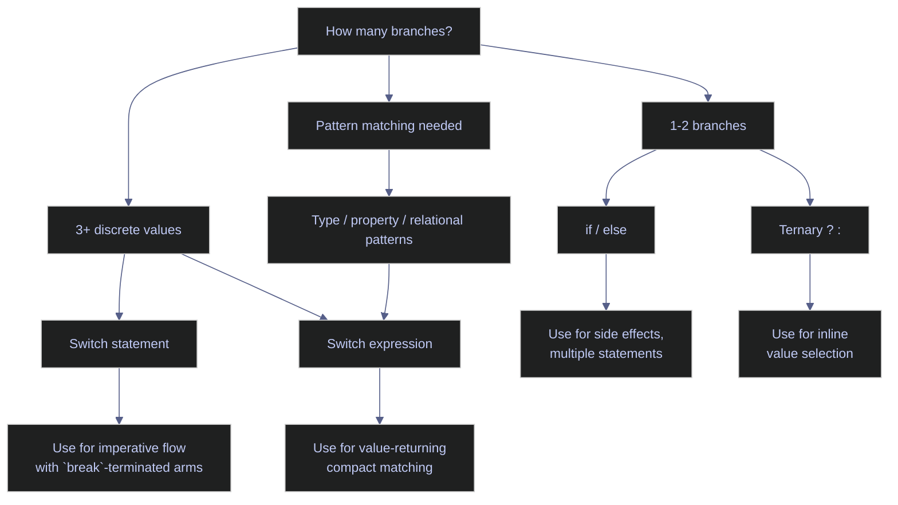
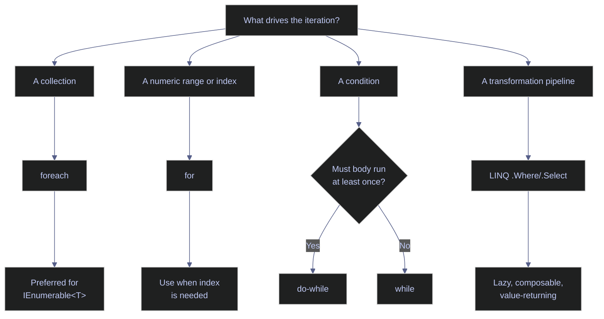

# 03. Control Flow - C#

> [!quote]+
>
> "The quality of programmers is a decreasing function of the density of go to statements in the programs they produce."
>
> — **Edsger W. Dijkstra**, *Go To Statement Considered Harmful* (1968)

> [!abstract]- Summary
>
> **Conditional Statements**
> - `if`/`else` chains require explicit `bool`; no truthy/falsy coercion — `if (1)` is a compile error.
> - Ternary `?:` and null-coalescing `??`/`??=` cover inline value selection and null defaults.
> - `switch` statement: imperative, mandatory `break`, supports constant labels, patterns, and `when` guards.
> - `switch` expression: value-returning, exhaustive pattern matching; missing `_` discard throws `SwitchExpressionException`.
> - Pattern types: type (`is int n`), property (`{ Month: 12 }`), relational (`>= 90`), logical combinators (`and`/`or`/`not`, C# 9+), list/positional (`[1, 2, ..]`, C# 11+).
>
> **Loops**
> - `for`: index-based, custom step, countdown; off-by-one risk with `<` vs `<=`.
> - `foreach`: iterates any `IEnumerable<T>`; loop variable is read-only; modifying the source throws `InvalidOperationException`.
> - `while`: condition-first — body may never execute.
> - `do-while`: body-first — always runs at least once.
> - Index simulation: `.Select((item, i) => ...)` LINQ overload; parallel pairing: `.Zip()`.
>
> **Loop Control**
> - `break` exits the innermost loop only; `continue` skips to next iteration.
> - No labeled `break` in C#; nested-loop escape uses `goto label` or method extraction with `return`.
>
> **Iterators & Generators**
> - `yield return` pauses execution and emits one value; method body deferred until first `MoveNext()`.
> - `yield break` terminates the iterator early; using plain `return` in an iterator is a compile error.
> - `GetEnumerator()` / `MoveNext()` / `Current` is the underlying protocol `foreach` wraps.
> - `SelectMany` flattens one level; recursive or `Stack<T>`-based flatten handles arbitrary depth.
> - Eager: `ToList()` materializes; lazy: query object re-executes on every enumeration.
>
> **LINQ & Functional Equivalents**
> - `Select` (map), `Where` (filter), `SelectMany` (flat-map) are lazy; nothing executes until `foreach` or `ToList()`.
> - Query syntax and method syntax compile to identical IL.
> - Materialization: `ToDictionary`, `ToHashSet`, `ToList`, `ToArray`.
> - Aggregation: `Aggregate` (general fold), `Sum`, `Max`, `Min`, `Count`, `Any`, `All`, `Average`.
> - Ordering: `OrderBy` / `OrderByDescending` + `ThenBy`; do not chain two `OrderBy` calls.
> - Infinite generators: pair with `Take(n)` or `TakeWhile` before materializing.

> [!note]- Glossary
>
> **`if`/`else`**
>
> - Evaluates an explicit `bool` expression and selects one code path. C# does not coerce arbitrary values to `true` or `false`.
> - `else if` chains evaluate top-down. Replace deep nesting with guard clauses or a `switch` expression.
> - Braces are recommended in production code even when short examples omit them for brevity.
>
> **Ternary operator**
>
> - Inline conditional expression `condition ? valueIfTrue : valueIfFalse`. The whole construct is a value, not a statement.
> - Keep chains shallow. For three or more tiers, a `switch` expression is easier to read and maintain.
>
> **Null-coalescing (`??`, `??=`)**
>
> - `a ?? b` returns `a` if non-null, otherwise `b`. `a ??= b` assigns `b` only when `a` is currently null — a one-line lazy initializer pattern.
> - Both operators short-circuit: the right operand is not evaluated if the left is non-null.
> - When `null` is a programmer error rather than a valid state, throw `ArgumentNullException` instead of silently substituting a default.
>
> **`switch` statement**
>
> - Imperative multi-branch dispatch on a value. Most `case` arms end with `break`; general fall-through is not allowed.
> - `case` arms can use constants, patterns, and `when` guards. Empty stacked labels remain useful for grouping multiple inputs.
> - The compiler warns when a `switch` over an `enum` omits members. Add `default` when future or invalid values must be handled explicitly.
>
> **`switch` expression**
>
> - Expression-based pattern dispatcher: `value switch { pattern => result, ... }`. Returns a value directly; each arm is `pattern => expression`, not a statement block.
> - Compiler verifies exhaustiveness — missing a `_` discard arm throws `SwitchExpressionException` at runtime when no pattern matches.
> - Close the expression with `_ => ...` or `_ => throw ...` so unmatched inputs do not escape into runtime failure.
>
> **Pattern matching**
>
> - Unified syntax for testing and destructuring values in `if` and `switch`. Types: type pattern (`is int n`), property pattern (`{ Length: > 5 }`), relational (`>= 90`), list/positional (`[1, 2, ..]`), logical combinators (`and`, `or`, `not`).
> - Patterns introduce new variables in scope (e.g., `int n` in `is int n`) — these can shadow outer variables if the same name is reused.
> - Logical combinators `and`/`or`/`not` arrived in C# 9. List and positional patterns arrived in C# 11.
>
> **`for` loop**
>
> - Index-based iteration: `for (init; condition; increment)`. The step expression can be any integer — positive, negative, or greater than 1 for non-unit strides.
> - The most common error is off-by-one: using `<=` when `<` is intended (or vice versa) in the condition.
> - Reserve `for` for explicit index access, custom stepping, or backward traversal. Prefer `foreach` for straightforward collection iteration.
>
> **`foreach`**
>
> - Iterates any type implementing `IEnumerable<T>` without exposing an index. The loop variable is read-only — reassigning it inside the body has no effect on the source collection.
> - Modifying the source collection during iteration throws `InvalidOperationException`. Snapshot with `.ToList()` first if mutation is required.
> - To remove or add items while iterating, snapshot with `.ToList()` first or collect changes and apply them after the loop completes.
>
> **`while` / `do-while`**
>
> - `while` evaluates the condition before each iteration — the body may never execute if the condition is false from the start. `do-while` executes the body first and then checks — guaranteeing at least one iteration.
> - Use `while` for polling and input validation where zero iterations is valid; use `do-while` for retry-at-least-once patterns and menu display.
> - Choose the construct that matches the guarantee you need: `do-while` for at least one pass, `while` when zero passes is valid.
>
> **`break` / `continue`**
>
> - `break` exits the innermost enclosing loop immediately; execution resumes after the loop body. `continue` skips the remainder of the current iteration and jumps to the next cycle.
> - Neither keyword propagates through nested loops — `break` in an inner loop does not exit the outer loop.
> - To exit nested loops, use `goto` with a label after the outer loop or extract the loop body into a method and `return`.
>
> **`goto`**
>
> - Unconditional jump to a labeled statement in the same method. In C#, its only accepted use is escaping nested loops by jumping to a label placed immediately after the outer loop.
> - Avoid for general flow control — it creates spaghetti code and makes reasoning about execution order difficult. Method extraction with `return` is usually cleaner.
> - Restrict `goto` to nested-loop escape. Other uses usually indicate a refactoring opportunity.
>
> **`yield return`**
>
> - Produces one value from an iterator method returning `IEnumerable<T>`. The compiler transforms the method into a state machine that pauses at each `yield return` and resumes on the next `MoveNext()` call.
> - The method body does not execute at call time — execution is deferred until the first enumeration. Place argument validation before the first `yield` in a non-iterator wrapper to ensure immediate checking.
> - Validate arguments before entering the iterator body when immediate failure semantics matter.
>
> **`yield break`**
>
> - Terminates an iterator method early — no further values are produced. Equivalent to `return` in a regular method. Using plain `return` (with no value) in an iterator is a compile error; `yield break` is mandatory.
> - Use for custom take-while logic, error boundaries, or when a sentinel value is encountered mid-sequence.
> - Prefer `.TakeWhile(...)` for simple prefix filtering. Use `yield break` when the stop condition depends on custom traversal logic.
>
> **LINQ**
>
> - Language-Integrated Query: a set of extension methods (`Select`, `Where`, `OrderBy`, `GroupBy`, `Aggregate`, etc.) that provide declarative, composable, lazy data transformation directly in C# syntax.
> - All LINQ methods return lazy `IEnumerable<T>` — nothing executes until the sequence is enumerated. Re-enumerating a deferred query re-executes the entire pipeline; materialize with `.ToList()` to prevent duplicate work.
> - Materialize once with `.ToList()` or `.ToArray()` when you need multiple passes over the same result.
>
> **`IEnumerable<T>`**
>
> - The standard iteration contract for forward-only, lazy sequences in .NET. Returned by LINQ methods, `yield return` iterators, and all standard collection types.
> - Enumerating the same `IEnumerable<T>` multiple times triggers multiple evaluations — particularly costly when backed by a database query, file read, or network call. Materialize with `.ToList()` or `.ToArray()` to cache results.
> - Do not enumerate an expensive raw sequence more than once unless re-execution is intentional.

## Conditional Statements

C# provides three families of conditional constructs: `if`/`else` chains for boolean branching, `switch` statements and expressions for multi-way value and pattern matching, and null-handling operators (`??`, `??=`, `is`) for safe navigation. Conditions must always be explicit `bool` — no implicit truthy/falsy conversion.

*Diagram: Conditional Statements.*


### Branching with if / else

Basic conditional branching evaluates explicit `bool` expressions top-down. C# has no truthy/falsy coercion, so every condition must resolve to `true` or `false`.

#### if / else if / else — explicit bool conditions

Conditions must be explicit `bool` expressions. `else if` chains evaluate top-down, so place the most restrictive condition first because each branch only runs if all earlier branches failed.

> [!tip] Brace style
>
> Braces reduce ambiguity during later edits. The short examples in this note sometimes omit them for brevity, but production code should prefer braced blocks and shallow nesting.

*Example: if / else if / else — explicit bool conditions.*
```csharp
int score = 85;
string grade;

if (score >= 90)
    grade = "A";
else if (score >= 80)
    grade = "B";
else if (score >= 70)
    grade = "C";
else if (score >= 60)
    grade = "D";
else
    grade = "F";
Console.WriteLine($"Score {score} → Grade {grade}");
```

```text
Score 85 → Grade B
```

#### Simple if — single condition without else

A standalone `if` checks one condition with no alternative branch. The body executes only when the condition is `true`.

*Example: Simple if — single condition without else.*
```csharp
int x = 10;
if (x > 0)
    Console.WriteLine($"{x} is positive");
```

```text
10 is positive
```

#### Nested ternary — ? : chains

`condition ? trueVal : falseVal` chains right-to-left. Compact for simple 2-3 tier classification. Don't nest more than 2 levels — use switch expression for complex cases.

*Example: Nested ternary — ? : chains.*
```csharp
int val = 15;
string label = val > 20 ? "high" : val > 10 ? "mid" : "low";
Console.WriteLine($"val={val} → {label}");
```

```text
val=15 → mid
```

#### No truthy/falsy — explicit bool conditions

C# requires explicit `bool` in every condition. `if (items)` and `if (str)` are compile errors, so use `items.Count > 0`, `string.IsNullOrEmpty(s)`, `x != 0`, or `obj != null`. This also blocks `if (x = 5)` bugs because assignment returns `int`, not `bool`. For null checks, `is null` is preferred over `== null` because `is` cannot be overloaded. Chained comparisons like `10 < x < 20` are also compile errors, so combine them with `&&`.

*Example: No truthy/falsy — explicit bool conditions.*
```csharp
#nullable enable
var items = new List<int> { 1, 2, 3 };
if (items.Count > 0)
    Console.WriteLine($"List has {items.Count} items");

string name = "";
if (string.IsNullOrEmpty(name))
    Console.WriteLine("Name is empty");

string? value = null;
if (value is null)
    Console.WriteLine("Value is null");

int x = 15;
if (10 < x && x < 20)
    Console.WriteLine($"{x} is between 10 and 20");
```

```text
List has 3 items
Name is empty
Value is null
15 is between 10 and 20
```

### Switch statements and expressions

The `switch` construct comes in two forms: the traditional statement (multi-line, imperative) and the modern expression (single-expression, value-returning). Switch expressions support relational, type, property, and combinatorial patterns — making them the preferred choice for most pattern matching scenarios in modern C#.

#### Switch statement — discrete value matching with mandatory break

Each non-empty `case` usually ends with `break`, because general fall-through is not allowed. Empty cases can stack to match multiple values, and `case` arms can use constants, patterns, and `when` guards. The compiler warns on missing `enum` cases.

*Example: Switch statement — discrete value matching with mandatory break.*
```csharp
string command = "quit";
switch (command)
{
    case "start":
        Console.WriteLine("Starting...");
        break;
    case "stop":
    case "quit":
    case "exit":
        Console.WriteLine("Stopping...");
        break;
    default:
        Console.WriteLine($"Unknown: {command}");
        break;
}
```

```text
Stopping...
```

#### Switch expression — compact value-returning form with or pattern and _ wildcard

Switch expressions return a value directly with the form
`variable switch { pattern => result, _ => default }`. The `or` pattern combines
multiple alternatives in one arm, and `_` acts as the discard wildcard for any
remaining unmatched input. The compiler can warn on incomplete coverage, but an
unmatched runtime value still needs an explicit fallback arm.

> [!warning] No wildcard arm means runtime failure
>
> Missing `_` causes `SwitchExpressionException` at runtime when no arm matches. Keep switch arms pure so unmatched inputs fail clearly.

> [!success] Close the expression with `_`
>
> Always close a switch expression with `_ => ...` to handle unmatched inputs gracefully. Keep arms side-effect-free and return values rather than mutating state.

*Example: Switch expression — compact value-returning form with or pattern and _ wildcard.*
```csharp
string command = "quit";
string result = command switch
{
    "start" => "Starting...",
    "stop" or "quit" or "exit" => "Stopping...",
    _ => $"Unknown: {command}"
};
Console.WriteLine(result);
```

```text
Stopping...
```

#### Switch expression — relational patterns

Switch arms support relational operators (`>=`, `<`, `>`, `<=`). First match wins — order arms from most restrictive to least. Placing `>= 70` before `>= 90` would incorrectly match 95 as "C".

*Example: Switch expression — relational patterns.*
```csharp
int score = 85;
string grade = score switch
{
    >= 90 => "A",
    >= 80 => "B",
    >= 70 => "C",
    >= 60 => "D",
    _ => "F"
};
Console.WriteLine($"Score {score} → Grade {grade}");
```

```text
Score 85 → Grade B
```

#### Switch expression — type patterns and when guard

> [!info] Type patterns
>
> - `int n => ...` — matches integers and binds to `n`
> - `when` adds a guard: `int n when n < 0 => ...`
> - Combines type checking and casting in one step — no explicit cast needed

*Example: Switch expression — type patterns and when guard.*
```csharp
object[] values = { 42, -5, "hello", new[] { 1, 2, 3 }, 3.14 };
foreach (var v in values)
{
    string desc = v switch
    {
        int n when n > 0 => $"positive int: {n}",
        int n            => $"non-positive int: {n}",
        string s         => $"string: '{s}'",
        int[] arr        => $"array starting with {arr[0]}, {arr.Length - 1} more",
        _                => $"other: {v.GetType().Name}"
    };
    Console.WriteLine($"  {v,-12} → {desc}");
}
```

```text
  42           → positive int: 42
  -5           → non-positive int: -5
  hello        → string: 'hello'
  System.Int32[] → array starting with 1, 2 more
  3.14         → other: Double
```

#### Switch expression — property patterns ({ Property: value })

> [!info] Property patterns
>
> - `{ PropertyName: value }` — matches when the property equals the value
> - Nest for multi-property: `{ Month: 12, Day: 25 }`
> - Combine with relational patterns or `or`

*Example: Switch expression — property patterns ({ Property: value }).*
```csharp
var date = new DateTime(2024, 12, 25);
string holiday = date switch
{
    { Month: 12, Day: 25 }                                       => "Christmas",
    { Month: 1, Day: 1 }                                         => "New Year",
    { DayOfWeek: DayOfWeek.Saturday or DayOfWeek.Sunday }        => "Weekend",
    _                                                             => "Regular day"
};
Console.WriteLine($"{date:yyyy-MM-dd} → {holiday}");
```

```text
2024-12-25 → Christmas
```

### Null handling and pattern matching

C# provides dedicated operators for null-safe programming that eliminate verbose `if (x != null)` checks and combine type testing with variable binding in a single expression.

#### Null-coalescing (??, ??=) and is pattern matching

> [!info] Null-handling operators
>
> - `??` — returns left if non-null, else right (replaces `x != null ? x : default`)
> - `??=` — assigns only when null (one-line lazy init: `_cache ??= LoadData()`)
> - `is` pattern — extracts and casts in one step: `if (obj is string s)`

When `null` is a contract violation rather than expected input, throw `ArgumentNullException` instead of masking the problem with `??`.

*Example: Null-coalescing (??, ??=) and is pattern matching.*
```csharp
#nullable enable

string? maybeNull = null;

string safe = maybeNull ?? "default";
Console.WriteLine(safe);

maybeNull ??= "fallback";
Console.WriteLine(maybeNull);

if (maybeNull is string notNull)
    Console.WriteLine($"Has value: {notNull}");
else
    Console.WriteLine("Is null");
```

```text
default
fallback
Has value: fallback
```

#### Logical pattern combinators — and, or, not (C# 9+)

C# 9 introduced `and`, `or`, and `not` as pattern combinators that compose with any pattern — relational, type, property, or constant. They replace verbose `&&`/`||` chains in `switch` arms and `is` expressions. `not` is especially useful for null-guard clauses: `if (obj is not null)` reads more naturally than `if (obj != null)`.

*Example: Logical pattern combinators — and, or, not (C# 9+).*
```csharp
int temperature = 22;
string comfort = temperature switch
{
    < 0 => "freezing",
    >= 0 and < 15 => "cold",
    >= 15 and <= 25 => "comfortable",
    > 25 and <= 35 => "warm",
    > 35 => "hot"
};
Console.WriteLine($"temp={temperature} → {comfort}");

object item = "hello";
if (item is not null and string s)
    Console.WriteLine($"Non-null string: {s}");
```

```text
temp=22 → comfortable
Non-null string: hello
```

#### List patterns — positional matching on collections (C# 11+)

List patterns match elements by position in arrays, lists, and spans. Use `_` for a single-element wildcard, `..` (slice pattern) for zero-or-more elements, and combine with relational or type patterns. List patterns make guard logic for sequences concise and declarative — especially useful for parsing command-line arguments, CSV rows, or protocol headers.

*Example: List patterns — positional matching on collections (C# 11+).*
```csharp
int[] numbers = { 1, 2, 3, 4, 5 };
string description = numbers switch
{
    [1, 2, ..]          => "starts with 1, 2",
    [_, _, _, ..]       => "at least 3 elements",
    []                  => "empty",
    _                   => "other"
};
Console.WriteLine(description);

var cmd = new[] { "git", "commit", "-m", "fix bug" };
string action = cmd switch
{
    ["git", "commit", "-m", var msg] => $"committing: {msg}",
    ["git", "push", ..]              => "pushing",
    ["git", ..]                      => "other git command",
    _                                => "unknown"
};
Console.WriteLine(action);
```

```text
starts with 1, 2
committing: fix bug
```

## Loops

C# provides four loop constructs: `for` (index-based), `foreach` (collection iteration), `while` (condition-first), and `do-while` (body-first). Prefer `foreach` for collection traversal — it eliminates off-by-one errors and works with any `IEnumerable<T>`. Use `for` when you need the index, and `while`/`do-while` for condition-driven repetition.

*Diagram: Loops.*


### Counted and collection iteration

Index-based `for` loops give explicit control over the counter, step, and direction. `foreach` iterates any `IEnumerable<T>` without exposing the index. Both support `break` and `continue` for early exit and skip.

#### for and foreach loops

`for (init; condition; increment)` runs while its condition stays true and gives
you explicit control over the index, step, and direction. `foreach (var item in
collection)` iterates any `IEnumerable<T>` without exposing the index directly
and is usually the clearer default when you are not mutating by position.

> [!warning] Modifying a collection during `foreach` invalidates the enumerator
>
> Don't modify a collection during `foreach` — throws `InvalidOperationException`. Use `for` loop or `ToList()` first.

> [!success] Snapshot or index the collection before mutating it
>
> To remove or add items while iterating, snapshot the collection first with `.ToList()`, then `foreach` over the snapshot while modifying the original. For indexed removal, iterate backwards with a `for` loop.

*Example: for and foreach loops.*
```csharp
for (int i = 0; i < 5; i++)
    Console.Write($"  {i}");
Console.WriteLine();
```

```text
  0  1  2  3  4
```

#### for loop — custom step increment

The step expression can be any integer — `i += 3` skips by three on each iteration. Use this pattern for sampling, pagination offsets, or any non-unit stride.

*Example: for loop — custom step increment.*
```csharp
for (int i = 0; i < 20; i += 3)
    Console.Write($"  {i}");
Console.WriteLine();
```

```text
  0  3  6  9  12  15  18
```

#### Count down with for

Decrement with a negative step: `for (int i = 10; i > 0; i -= 2)`. The step can be any integer — negative for counting down, greater than 1 for skipping. Watch the condition direction: use `i > 0` (not `i < 10`) when counting down.

*Example: Count down with for.*
```csharp
for (int i = 10; i > 0; i -= 2)
    Console.Write($"  {i}");
Console.WriteLine();
```

```text
  10  8  6  4  2
```

#### Iterate a collection with foreach

`foreach` iterates any type implementing `IEnumerable<T>` — arrays, lists, dictionaries, LINQ results, and custom collections. The loop variable is read-only; you cannot reassign it inside the body. For dictionaries, the loop variable is a `KeyValuePair<TKey, TValue>` that you can deconstruct.

*Example: Iterate a collection with foreach.*
```csharp
var languages = new[] { "C#", "Python", "Go" };
foreach (var lang in languages)
    Console.Write($"  {lang}");
Console.WriteLine();

var scores = new Dictionary<string, int> { ["Alice"] = 92, ["Bob"] = 85 };
foreach (var (name, score) in scores)
    Console.Write($"  {name}:{score}");
Console.WriteLine();
```

```text
  C#  Python  Go
  Alice:92  Bob:85
```

#### while — condition-first loop

`while` evaluates the condition before each iteration — the body may never execute if the condition is `false` from the start. Use for input validation loops and polling where zero iterations is a valid outcome.

*Example: while — condition-first loop.*
```csharp
int n = 3;
while (n > 0)
{
    Console.Write($"  {n}");
    n--;
}
Console.WriteLine();
```

```text
  3  2  1
```

#### do-while — body-first loop

`do-while` executes the body first, then checks the condition — guaranteeing at least one iteration. Use for retry-at-least-once logic, menu display, or input validation where the first pass must always run.

*Example: do-while — body-first loop.*
```csharp
int attempts = 0;
do
{
    attempts++;
    Console.Write($"  attempt-{attempts}");
} while (attempts < 3);
Console.WriteLine();
```

```text
  attempt-1  attempt-2  attempt-3
```

#### Enumerate with index using Select overload

C# has no built-in `enumerate` keyword. Use LINQ's `Select` overload that provides the index as a second parameter: `.Select((item, index) => ...)`.

*Example: Enumerate with index using Select overload.*
```csharp
var fruits = new[] { "apple", "banana", "cherry" };
foreach (var (fruit, i) in fruits.Select((f, i) => (f, i)))
    Console.Write($"  {i}:{fruit}");
Console.WriteLine();
```

```text
  0:apple  1:banana  2:cherry
```

#### Parallel iteration with Zip

`Zip` pairs elements from two sequences positionally and stops at the shorter sequence. Use for lock-step iteration of parallel collections — names with ages, keys with values, expected with actual.

*Example: Parallel iteration with Zip.*
```csharp
var names = new[] { "Alice", "Bob", "Charlie" };
var ages = new[] { 30, 25, 35 };
foreach (var pair in names.Zip(ages))
    Console.Write($"  {pair.First}={pair.Second}");
Console.WriteLine();
```

```text
  Alice=30  Bob=25  Charlie=35
```

## Loop Control

C# provides `break` to exit a loop, `continue` to skip to the next iteration, and `goto` as a last-resort mechanism for breaking out of nested loops. For complex loop logic, extracting to a method and using `return` is usually cleaner than `goto`.

### Control keywords

Keywords that alter loop execution: `break` exits immediately, `continue` skips to the next iteration, and `goto` jumps to a labeled statement (used only for nested loop escape).

#### break — exit the innermost loop

`break` exits the innermost enclosing loop immediately. Execution continues after the loop body. Works in `for`, `foreach`, `while`, and `do-while`. For complex flow, extract to a method with `return`.

*Example: break — exit the innermost loop.*
```csharp
for (int i = 0; i < 10; i++)
{
    if (i == 5)
    {
        Console.WriteLine($"  Breaking at {i}");
        break;
    }
    Console.Write($"  {i}");
}
Console.WriteLine();
```

```text
  0  1  2  3  4  Breaking at 5

```

#### continue — skip to the next iteration

`continue` skips the remainder of the current iteration and jumps to the next loop cycle. Use for filtering within a loop when a LINQ pipeline is not practical.

*Example: continue — skip to the next iteration.*
```csharp
for (int i = 0; i < 10; i++)
{
    if (i % 2 == 0)
        continue;
    Console.Write($"  {i}");
}
Console.WriteLine();
```

```text
  1  3  5  7  9
```

#### Breaking outer loops with goto

C# has no labeled `break`. The accepted idiom for escaping nested loops is `goto` to a label placed after the outer loop. Avoid `goto` for general flow control — it is only justified for this specific nested-break scenario.

*Example: Breaking outer loops with goto.*
```csharp
bool found = false;
for (int i = 0; i < 3; i++)
{
    for (int j = 0; j < 3; j++)
    {
        if (i == 1 && j == 1)
        {
            found = true;
            goto Done;
        }
    }
}
Done:
Console.WriteLine($"Found: {found}");
```

```text
Found: True
```

#### Breaking outer loops with return

Extract nested loop logic to a method and use `return` to exit all loops at once. This usually keeps control flow easier to follow than `goto`.

*Example: Breaking outer loops with return.*
```csharp
static int FindFirst(int[][] matrix, int target)
{
    for (int i = 0; i < matrix.Length; i++)
        for (int j = 0; j < matrix[i].Length; j++)
            if (matrix[i][j] == target)
                return i * 100 + j;
    return -1;
}
int[][] m = { new[] { 1, 2 }, new[] { 3, 4 } };
Console.WriteLine(FindFirst(m, 3));
```

```text
100
```

## Iterators & Generators

Iterator methods use `yield return` to produce values lazily — the compiler transforms them into state machines that pause between each value. This enables memory-efficient processing of large or infinite sequences, composable pipelines with LINQ, and custom traversal logic for trees and graphs.

### yield return and yield break

`yield return` pauses execution and emits one value; `yield break` terminates the iterator. The method body does not execute until the first `MoveNext()` call — not when the method is called.

#### yield return — lazy iterator method

A method returning `IEnumerable<T>` with `yield return` pauses execution, returns a value, and resumes on the next `MoveNext()`. The compiler transforms it into a state machine. Values are computed lazily — only when requested. Composable with LINQ.

> [!warning] The method body doesn't run
>
> The method body doesn't run until the first `MoveNext()` — not when the method is called.

> [!success] Validate eagerly, yield lazily
>
> Place argument validation before the first `yield` in a separate non-iterator wrapper method. This ensures validation runs immediately at call time, not deferred to first enumeration.

*Example: yield return — lazy iterator method.*
```csharp
IEnumerable<int> Countdown(int n)
{
    Console.WriteLine($"  Starting countdown from {n}");
    while (n > 0)
    {
        yield return n;

        n--;
    }
    Console.WriteLine("  Done!");
}

foreach (var val in Countdown(5))
    Console.Write($"  {val}");
Console.WriteLine();
```

```text
  Starting countdown from 5
  5  4  3  2  1  Done!
```

#### Manual iteration with GetEnumerator()

`GetEnumerator()` returns an `IEnumerator` with `MoveNext()` (advance + bool) and `Current` (value). `foreach` is syntactic sugar for this protocol. Use manual iteration for peeking ahead or interleaving enumerators.

*Example: Manual iteration with GetEnumerator().*
```csharp
IEnumerable<int> Countdown(int n)
{
    while (n > 0) { yield return n; n--; }
}

var enumerator = Countdown(3).GetEnumerator();
enumerator.MoveNext(); Console.WriteLine($"  next: {enumerator.Current}");
enumerator.MoveNext(); Console.WriteLine($"  next: {enumerator.Current}");
enumerator.MoveNext(); Console.WriteLine($"  next: {enumerator.Current}");
```

```text
  next: 3
  next: 2
  next: 1
```

### Flattening nested structures

Flattening converts nested collections into a single flat sequence. `SelectMany` handles one level; for arbitrary depth, use a `Stack<T>`-based iterative approach or recursive iterators.

#### SelectMany — flattens one level of nesting

`SelectMany` projects each element to a sequence and flattens the results into a single sequence: `nested.SelectMany(x => x)`. It only peels one layer — it is not recursive. For deeper nesting, use the iterative or recursive approaches below.

*Example: SelectMany — flattens one level of nesting.*
```csharp
var oneLevel = new[] { new[] { 1, 2 }, new[] { 3, 4 }, new[] { 5, 6 } };
Console.WriteLine(string.Join(", ", oneLevel.SelectMany(x => x)));
```

```text
1, 2, 3, 4, 5, 6
```

#### Iterative flatten with Stack&lt;T&gt;

Stack-based iterative flatten — no recursion, handles arbitrary depth in constant stack space. Avoids `StackOverflowException`. Watch out for strings (they're `IEnumerable` — causes infinite recursion if not checked).

*Example: Iterative flatten with Stack&lt;T&gt;.*
```csharp
var nested = new object[] { 1, new object[] { 2, 3 }, new object[] { 4, new object[] { 5, 6 } }, 7 };

List<int> FlattenIter(object[] input)
{
    var stack = new Stack<object>(input.Reverse());
    var result = new List<int>();
    while (stack.Count > 0)
    {
        var item = stack.Pop();
        if (item is object[] sub)
            foreach (var x in sub.Reverse())
                stack.Push(x);
        else if (item is int n)
            result.Add(n);
    }
    return result;
}
Console.WriteLine(string.Join(", ", FlattenIter(nested)));
```

```text
1, 2, 3, 4, 5, 6, 7
```

#### Recursive flatten with SelectMany

The LINQ variant uses `SelectMany` with a recursive lambda — more compact but still uses the call stack. Prefer the iterative `Stack<T>` version for untrusted input depth.

*Example: Recursive flatten with SelectMany.*
```csharp
var nested = new object[] { 1, new object[] { 2, 3 }, new object[] { 4, new object[] { 5, 6 } }, 7 };

IEnumerable<int> FlatLinq(IEnumerable<object> items) =>
    items.SelectMany(item => item is object[] sub ? FlatLinq(sub) : new[] { (int)item });
Console.WriteLine(string.Join(", ", FlatLinq(nested)));
```

```text
1, 2, 3, 4, 5, 6, 7
```

#### Eager evaluation — materialize with ToList()

`ToList()` forces immediate evaluation and caches the results in a concrete `List<T>`. Use when enumerating multiple times or when downstream code expects a materialized collection. Never call `ToList()` on infinite sequences.

*Example: Eager evaluation — materialize with ToList().*
```csharp
var squaresList = Enumerable.Range(0, 10).Select(x => x * x).ToList();
Console.WriteLine(string.Join(", ", squaresList));
```

```text
0, 1, 4, 9, 16, 25, 36, 49, 64, 81
```

#### Lazy evaluation — deferred query re-executes on each enumeration

Without `ToList()`, the query returns an iterator that re-executes on each enumeration. The type name (`RangeSelectIterator`) reveals no values have been computed yet. Both produce identical results, but the lazy version duplicates work on repeated enumeration.

*Example: Lazy evaluation — deferred query re-executes on each enumeration.*
```csharp
var squaresLazy = Enumerable.Range(0, 10).Select(x => x * x);
Console.WriteLine(squaresLazy.GetType().Name);
Console.WriteLine(string.Join(", ", squaresLazy));
```

```text
RangeSelectIterator`2
0, 1, 4, 9, 16, 25, 36, 49, 64, 81
```

#### yield break — early termination

`yield break` terminates the iterator immediately — no more values produced. Equivalent to `return` in a regular method. Use for custom take-while logic or error boundaries. For simple filtering, `.TakeWhile()` is shorter.

*Example: yield break — early termination.*
```csharp
IEnumerable<int> TakeWhilePositive(int[] arr)
{
    foreach (var n in arr)
    {
        if (n < 0) yield break;
        yield return n;
    }
}
Console.WriteLine(string.Join(", ", TakeWhilePositive(new[] { 3, 7, -2, 5 })));
```

```text
3, 7
```

#### Recursive iterator — flatten a deeply nested structure with yield return

Recursive iterator — calls itself for nested collections, `yield return` for leaves. Natural for tree/graph traversal. For untrusted/deep nesting, use the Stack approach to avoid `StackOverflowException`.

*Example: Recursive iterator — flatten a deeply nested structure with yield return.*
```csharp
IEnumerable<int> Flatten(IEnumerable<object> nested)
{
    foreach (var item in nested)
    {
        if (item is IEnumerable<object> sub)
            foreach (var inner in Flatten(sub))
                yield return inner;
        else if (item is int n)
            yield return n;
    }
}
var nestedArr = new object[] { 1, new object[] { 2, 3 }, new object[] { 4, new object[] { 5, 6 } }, 7 };
Console.WriteLine(string.Join(", ", Flatten(nestedArr)));
```

```text
1, 2, 3, 4, 5, 6, 7
```

## LINQ & Functional Equivalents

LINQ (Language Integrated Query) replaces imperative `foreach`/`if`/`Add` patterns with declarative pipelines. All LINQ methods are lazy — nothing executes until the result is enumerated (`foreach`, `ToList()`, `ToArray()`). Method syntax (`.Where().Select()`) and query syntax (`from x in items where ... select ...`) compile to identical IL.

### Core LINQ methods

The foundational LINQ operations: `Select` (map), `Where` (filter), `SelectMany` (flat-map), and query syntax as an alternative notation.

#### Select — transform each element (map)

`Select` projects each element into a new form — equivalent to `map` in functional languages. All LINQ methods are lazy and return `IEnumerable<T>`.

> [!warning] Don't use foreach with if
>
> Don't use `foreach` with `if` + add to list — use `.Where().Select()`. Don't enumerate a deferred query multiple times — materialize with `ToList()`.

> [!success] Prefer LINQ pipelines
>
> Replace manual `foreach`/`if`/`Add` patterns with `.Where().Select()` chains. Call `.ToList()` once at the end to materialize, then reuse the list freely without re-executing the query.

*Example: Select — transform each element (map).*
```csharp
var squares = Enumerable.Range(0, 10).Select(x => x * x).ToList();
Console.WriteLine(string.Join(", ", squares));
```

```text
0, 1, 4, 9, 16, 25, 36, 49, 64, 81
```

#### Where — filter elements by predicate

`Where` returns only elements satisfying the predicate — equivalent to `filter`. Chain with `Select` for filter-then-transform pipelines.

*Example: Where — filter elements by predicate.*
```csharp
var evens = Enumerable.Range(0, 20).Where(x => x % 2 == 0).ToList();
Console.WriteLine(string.Join(", ", evens));
```

```text
0, 2, 4, 6, 8, 10, 12, 14, 16, 18
```

#### Chaining Where and Select

Chain `.Where().Select()` fluently for filter-then-transform pipelines. The order matters — filtering first reduces the number of elements transformed.

*Example: Chaining Where and Select.*
```csharp
var words = new[] { "hello", "world", "csharp", "is", "great" };
var longUpper = words.Where(w => w.Length > 3).Select(w => w.ToUpper());
Console.WriteLine(string.Join(", ", longUpper));
```

```text
HELLO, WORLD, CSHARP, GREAT
```

#### SelectMany — flatten nested sequences

`SelectMany` projects each element to a sequence and flattens the results into a single `IEnumerable<T>`. It only peels one layer of nesting.

*Example: SelectMany — flatten nested sequences.*
```csharp
var matrix = new[] { new[] { 1, 2, 3 }, new[] { 4, 5, 6 }, new[] { 7, 8, 9 } };
var flat = matrix.SelectMany(row => row).ToList();
Console.WriteLine(string.Join(", ", flat));
```

```text
1, 2, 3, 4, 5, 6, 7, 8, 9
```

#### Query syntax vs method syntax

Query syntax (`from x in items where ... select ...`) reads like SQL. Method syntax (`.Where().Select()`) uses lambda chains. Both compile to identical IL. Use query syntax for complex joins; method syntax for simple pipelines.

*Example: Query syntax vs method syntax.*
```csharp
var words = new[] { "hello", "world", "csharp", "is", "great" };

var queryResult = from w in words
                  where w.Length > 3
                  orderby w.Length
                  select w.ToUpper();
Console.WriteLine(string.Join(", ", queryResult));

var methodResult = words.Where(w => w.Length > 3).OrderBy(w => w.Length).Select(w => w.ToUpper());
Console.WriteLine(string.Join(", ", methodResult));
```

```text
HELLO, WORLD, GREAT, CSHARP
HELLO, WORLD, GREAT, CSHARP
```

### Materialization and aggregation

Materialization converts lazy LINQ queries into concrete collections (`Dictionary`, `HashSet`, `List`). Aggregation reduces a sequence to a single value (`Sum`, `Count`, `Aggregate`).

#### ToDictionary and ToHashSet

> [!info] Materialization
>
> - `ToDictionary(keySelector, valueSelector)` — builds a `Dictionary` (O(1) lookup)
> - `ToHashSet()` — builds a `HashSet` (O(1) membership)
> - Both are eager — enumerate immediately

Duplicate keys in `ToDictionary` throw `ArgumentException`.

*Example: ToDictionary and ToHashSet.*
```csharp
var squaresDict = Enumerable.Range(0, 6).ToDictionary(x => x, x => x * x);
Console.WriteLine(string.Join(", ", squaresDict.Select(kv => $"{kv.Key}:{kv.Value}")));

var scores = new Dictionary<string, int> { ["Alice"] = 85, ["Bob"] = 92, ["Charlie"] = 78, ["Diana"] = 95 };
var passed = scores.Where(kv => kv.Value >= 80).ToDictionary(kv => kv.Key, kv => kv.Value);
Console.WriteLine(string.Join(", ", passed.Select(kv => $"{kv.Key}:{kv.Value}")));

var words = new[] { "hello", "world", "csharp", "is", "great" };
var uniqueLengths = words.Select(w => w.Length).ToHashSet();
Console.WriteLine(string.Join(", ", uniqueLengths));
```

```text
0:0, 1:1, 2:4, 3:9, 4:16, 5:25
Alice:85, Bob:92, Diana:95
5, 6, 2
```

`Where` on a dictionary yields `KeyValuePair<K,V>`, so call `ToDictionary` again when you need dictionary semantics. `ToHashSet` builds a deduplicated `HashSet<T>` with O(1) membership checks, but output order is not guaranteed.

#### Aggregate — general-purpose fold

`Aggregate(seed, (acc, x) => ...)` is the general fold — reduces a sequence to a single value by applying an accumulator function. The seed is the initial value. Use for custom reductions that built-in methods don't cover.

*Example: Aggregate — general-purpose fold.*
```csharp
var nums = new[] { 1, 2, 3, 4, 5 };
int total = nums.Aggregate(0, (acc, x) => acc + x);
Console.WriteLine(total);

int product = nums.Aggregate(1, (acc, x) => acc * x);
Console.WriteLine(product);
```

```text
15
120
```

#### Built-in aggregations — Sum, Max, Min, Any, All, Count, Average

Built-in shortcuts for common reductions. `Any(predicate)` short-circuits on first match — always prefer `Any()` over `Count() > 0`. `All(predicate)` returns `true` for empty sequences.

*Example: Built-in aggregations — Sum, Max, Min, Any, All, Count, Average.*
```csharp
var nums = new[] { 1, 2, 3, 4, 5 };
Console.WriteLine(nums.Sum());
Console.WriteLine(nums.Max());
Console.WriteLine(nums.Min());
Console.WriteLine(nums.All(x => x > 0));
Console.WriteLine(nums.Any(x => x > 3));
Console.WriteLine(nums.Count(x => x > 2));
Console.WriteLine(nums.Average());
```

```text
15
5
1
True
True
3
3
```

### Ordering and deferred execution

Sorting, chaining, and controlling when a LINQ pipeline actually executes.

#### Ordering — OrderBy, OrderByDescending with a key selector

> [!info] Ordering
>
> - `OrderBy(x => x.Property)` — sorts ascending
> - `OrderByDescending` — sorts descending
> - `ThenBy` / `ThenByDescending` — secondary sort
> - Stable sort — equal elements maintain relative order

Use `ThenBy` for secondary sort keys. A second `OrderBy` replaces the first ordering.

*Example: Ordering — OrderBy, OrderByDescending with a key selector.*
```csharp
var names = new[] { "Charlie", "Alice", "Bob", "Diana" };
Console.WriteLine(string.Join(", ", names.OrderBy(n => n)));
Console.WriteLine(string.Join(", ", names.OrderBy(n => n.Length)));
Console.WriteLine(string.Join(", ", names.OrderByDescending(n => n)));
Console.WriteLine(string.Join(", ", names.OrderBy(n => n[^1])));
```

```text
Alice, Bob, Charlie, Diana
Bob, Alice, Diana, Charlie
Diana, Charlie, Bob, Alice
Diana, Bob, Charlie, Alice
```

#### Deferred execution — chained LINQ pipeline materialized by ToList()

> [!info] Deferred execution
>
> - Each LINQ method returns a lazy `IEnumerable`
> - Chain declaratively: `.Where().Select().OrderBy().Take()`
> - Nothing executes until `foreach` or `ToList()`
> - Add conditions dynamically: `if (filter) query = query.Where(...)`

Materialize with `ToList()` when multiple passes are required; otherwise each enumeration reruns the pipeline.

*Example: Deferred execution — chained LINQ pipeline materialized by ToList().*
```csharp
var result = Enumerable.Range(1, 20)
    .Where(x => x % 2 == 0)
    .Select(x => x * x)
    .Where(x => x > 50)
    .OrderByDescending(x => x)
    .Take(3)
    .ToList();
Console.WriteLine(string.Join(", ", result));
```

```text
400, 324, 256
```

#### Infinite generator with yield return

`while(true)` with `yield return` produces an infinite sequence. Callers control consumption with `Take()`, `First()`, or `TakeWhile()`.

> [!danger] Infinite sequences cause OOM
>
> Never call `ToList()`, `Count()`, or `foreach` without `break` on infinite sequences — hangs or OOM.

> [!success] Always bound infinite sequences
>
> Always pair an infinite generator with `Take(n)`, `TakeWhile(...)`, or `First(...)` before materializing. This keeps memory bounded and gives callers explicit control over how many values are consumed.

*Example: Infinite generator with yield return.*
```csharp
IEnumerable<int> Naturals(int start = 0)
{
    while (true)
    {
        yield return start;
        start++;
    }
}
Console.WriteLine(string.Join(", ", Naturals().Take(5)));
Console.WriteLine(string.Join(", ", Naturals(10).Take(5)));
```

```text
0, 1, 2, 3, 4
10, 11, 12, 13, 14
```

#### Common sequence methods — Range, Reverse, Concat, Repeat

`Range` generates consecutive integers, `Reverse` reverses order, `Concat` appends sequences, and `Repeat` produces a single value `n` times. All return lazy `IEnumerable<T>`.

*Example: Common sequence methods — Range, Reverse, Concat, Repeat.*
```csharp
Console.WriteLine(string.Join(", ", Enumerable.Range(0, 5)));
Console.WriteLine(string.Join(", ", new[] { "a", "b" }.Select(s => s.ToUpper())));
Console.WriteLine(string.Join(", ", new[] { 1, 2, 3, 4 }.Where(x => x > 2)));
Console.WriteLine(string.Join(", ", new[] { 1, 2, 3 }.Reverse()));
Console.WriteLine(string.Join(", ", new[] { 1, 2 }.Concat(new[] { 3, 4 })));
Console.WriteLine(string.Join(", ", Enumerable.Repeat("x", 3)));
```

```text
0, 1, 2, 3, 4
A, B
3, 4
3, 2, 1
1, 2, 3, 4
x, x, x
```


## Operational Risks

### Runtime and evaluation hazards

#### Mutating a source collection during `foreach`

Changing the active source inside `foreach` invalidates the enumerator and raises `InvalidOperationException`. Snapshot with `.ToList()` when the loop body needs to remove or add items.

*Example: Mutating a source collection during `foreach`.*
```csharp
var source = new List<int> { 1, 2, 3 };
try
{
    foreach (var n in source)
    {
        source.Add(n);
    }
}
catch (InvalidOperationException ex)
{
    Console.WriteLine(ex.GetType().Name);
}

var safe = new List<int> { 1, 2, 3 };
foreach (var n in safe.ToList())
{
    if (n == 1)
    {
        safe.Remove(n);
    }
}
Console.WriteLine(string.Join(", ", safe));
```

```text
InvalidOperationException
2, 3
```

#### Non-exhaustive `switch` expressions

If a `switch` expression omits `_` and no arm matches, the runtime throws `SwitchExpressionException`. End every value-producing expression with `_ => ...` or `_ => throw ...`.

*Example: Non-exhaustive `switch` expressions.*
```csharp
int day = 3;
try
{
    _ = day switch
    {
        1 => "Mon",
        2 => "Tue"
    };
}
catch (Exception ex)
{
    Console.WriteLine(ex.GetType().Name);
}

string safeLabel = day switch
{
    1 => "Mon",
    2 => "Tue",
    _ => "Other"
};
Console.WriteLine(safeLabel);
```

```text
SwitchExpressionException
Other
```

#### Re-enumerating deferred `IEnumerable<int>`

A deferred query reruns its pipeline on every enumeration. Use `.ToList()` or `.ToArray()` when repeated passes over the same `IEnumerable<int>` would duplicate I/O or CPU work.

*Example: Re-enumerating deferred `IEnumerable<int>`.*
```csharp
int evaluations = 0;
var query = Enumerable.Range(1, 3).Select(x =>
{
    evaluations++;
    return x * 2;
});

Console.WriteLine(string.Join(", ", query));
Console.WriteLine(evaluations);
Console.WriteLine(string.Join(", ", query));
Console.WriteLine(evaluations);

var materialized = Enumerable.Range(1, 3).Select(x => x * 2).ToList();
Console.WriteLine(string.Join(", ", materialized));
```

```text
2, 4, 6
3
2, 4, 6
6
2, 4, 6
```

## Recommended Patterns

### Reference defaults

#### Prefer `switch` expressions for value selection

When a branch computes a value, `switch` expressions keep the mapping local and exhaustive. Pair them with `if (obj is string s && s.Length > 0)` style pattern tests for compact type-sensitive branching.

*Example: Prefer `switch` expressions for value selection.*
```csharp
int statusCode = 404;
string category = statusCode switch
{
    >= 200 and < 300 => "success",
    >= 400 and < 500 => "client error",
    _ => "other"
};
Console.WriteLine(category);
```

```text
client error
```

#### Prefer `foreach` when an index is unnecessary

Use `foreach` when the loop body only needs the current element. Switch to `for` or `.Select((item, index) => ...)` only when positional access is part of the requirement.

*Example: Prefer `foreach` when an index is unnecessary.*
```csharp
var languages = new[] { "C#", "F#", "VB" };
foreach (var language in languages)
{
    Console.WriteLine(language);
}
```

```text
C#
F#
VB
```

#### Compose transformations with `Where(...).Select(...)`

Declarative pipelines express filtering and projection more directly than manual `for` plus temporary list mutation. Materialize once with `.ToList()` when the result will be reused.

*Example: Compose transformations with `Where(...).Select(...)`.*
```csharp
var result = new[] { "alpha", "go", "beta" }
    .Where(word => word.Length > 2)
    .Select(word => word.ToUpperInvariant())
    .ToList();
Console.WriteLine(string.Join(", ", result));
```

```text
ALPHA, BETA
```

#### Stream values with `yield return` and cap infinite iterators with `Take(...)`

Use `yield return` when consumers should pull values lazily instead of paying for full materialization up front. Bound infinite generators with `Take(...)`, `TakeWhile(...)`, or `First(...)` before enumeration escapes into unbounded work.

*Example: Stream values with `yield return` and cap infinite iterators with `Take(...)`.*
```csharp
IEnumerable<int> Naturals(int start)
{
    while (true)
    {
        yield return start;
        start++;
    }
}

Console.WriteLine(string.Join(", ", Naturals(10).Take(5)));
```

```text
10, 11, 12, 13, 14
```

#### Use `Parallel.For` for independent CPU-bound work

`Parallel.For` and `Parallel.ForEach` are useful when each iteration is independent and CPU-bound. Keep side effects isolated so the loop can run in any scheduling order without changing the final result.

*Example: Use `Parallel.For` for independent CPU-bound work.*
```csharp
var squares = new int[4];
Parallel.For(0, squares.Length, i =>
{
    squares[i] = (i + 1) * (i + 1);
});
Console.WriteLine(string.Join(", ", squares));
```

```text
1, 4, 9, 16
```

## Troubleshooting

### Compiler and runtime diagnosis

#### Fix `CS0029` and null-chain failures with explicit checks

`CS0029` in an `if` condition means the expression is not a `bool`. Replace `if (x)` with `if (x != 0)` or a similar explicit test, and use `?.` plus `??` when a null chain can legally terminate early.

*Example: Fix `CS0029` and null-chain failures with explicit checks.*
```csharp
int x = 5;
string? label = null;

if (x != 0)
{
    Console.WriteLine("non-zero");
}

Console.WriteLine(label?.ToUpperInvariant() ?? "DEFAULT");
```

```text
non-zero
DEFAULT
```

#### Exit nested loops with `return` or targeted `goto`

`break` exits only the innermost loop. For nested search logic, extract the work into a method and `return`, or use a narrowly-scoped `goto` to a label immediately after the outer loop when method extraction is not practical.

*Example: Exit nested loops with `return` or targeted `goto`.*
```csharp
static bool Contains(int[][] matrix, int target)
{
    for (int i = 0; i < matrix.Length; i++)
    {
        for (int j = 0; j < matrix[i].Length; j++)
        {
            if (matrix[i][j] == target)
            {
                return true;
            }
        }
    }

    return false;
}

int[][] matrix = { new[] { 1, 2 }, new[] { 3, 4 } };
Console.WriteLine(Contains(matrix, 4));
```

```text
True
```

#### Use `yield return` and `yield break` inside iterators

Iterator methods cannot replace `yield return` with plain `return` for individual values. Use `yield return` for each produced element and `yield break` when the sequence must terminate early.

*Example: Use `yield return` and `yield break` inside iterators.*
```csharp
IEnumerable<int> NonNegativePrefix(int[] values)
{
    foreach (var value in values)
    {
        if (value < 0)
        {
            yield break;
        }

        yield return value;
    }
}

Console.WriteLine(string.Join(", ", NonNegativePrefix(new[] { 2, 4, -1, 8 })));
```

```text
2, 4
```

#### Rename pattern variables to avoid shadowing outer names

Pattern variables such as `if (input is int value)` introduce a new local name. If an outer `value` already exists, rename the pattern variable so the new binding does not shadow the surrounding state.

*Example: Rename pattern variables to avoid shadowing outer names.*
```csharp
string value = "outer";
object input = 42;

if (input is int number)
{
    Console.WriteLine($"{value}:{number}");
}
```

```text
outer:42
```

#### Prefer `for` on profiled hot paths

LINQ is usually clearer, but a tight loop over millions of elements can justify a plain `for` once a profiler shows allocation or dispatch overhead. Keep the `for` rewrite narrow and compare it against the original query to preserve behavior.

*Example: Prefer `for` on profiled hot paths.*
```csharp
var data = new[] { 1, 2, 3, 4, 5 };

int linqTotal = data.Where(x => x % 2 == 0).Sum();
int forTotal = 0;
for (int i = 0; i < data.Length; i++)
{
    if (data[i] % 2 == 0)
    {
        forTotal += data[i];
    }
}

Console.WriteLine($"{linqTotal}:{forTotal}");
```

```text
6:6
```
