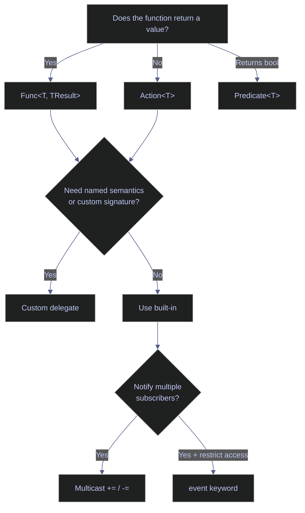

# 04. Functions - C#

> [!quote]+
>
> "The purpose of abstraction is not to be vague, but to create a new semantic level in which one can be absolutely precise."
>
> — **Edsger W. Dijkstra**, *The Humble Programmer*, ACM Turing lecture (1972)

> [!abstract]- Summary
>
> **Function Basics**
> - Methods are statically typed; all functions are class or struct members — no standalone functions in C#.
> - Return types are declared explicitly; `void` signals no return value; expression-bodied syntax (`=>`) eliminates braces for single-expression methods.
> - Local functions nest inside a method body; `static` local functions prevent accidental variable capture.
> - Tuples enable multiple return values without a dedicated class; prefer `record` for 3–4+ fields.
> - `Func<T, TResult>`, `Action<T>`, and `Predicate<T>` make functions first-class values for callbacks, strategy, pipelines, and DI.
>
> **Function-passing patterns**
> - Callbacks: `Action<string> onSuccess` / `Action<Exception> onError` — decouple operation from side effects.
> - Strategy: inject `Func<decimal, decimal>` to swap algorithms without modifying the consumer.
> - Pipeline: `List<Func<string, string>>` + `Aggregate` chains sequential transformations.
> - DI / testability: `Func<DateTime>? getNow = null` replaces `DateTime.UtcNow` with injectable time.
> - Progress: `Action<int, int, string>? onProgress` reported via null-conditional `?.Invoke()`.
>
> **Parameters**
> - Default values must be compile-time constants; named arguments (`ssl: false`) allow any order at call site.
> - `ref` — mutable pass-by-reference (caller must initialize); `out` — must assign before return; `in` — read-only reference for large structs.
> - `params T[]` collects variable arguments; must be last parameter; prefer `params ReadOnlySpan<T>` in .NET 8+.
> - No `**kwargs` equivalent — use anonymous objects or `Dictionary<string, object>` for dynamic key-value pairs.
>
> **Lambda Expressions**
> - Expression lambda: `x => x * x` — implicit return. Statement lambda: `(x) => { ... return ...; }` — explicit return.
> - Compiler infers parameter types from context; assign to `Func<T, TResult>` (returns value) or `Action<T>` (void).
> - LINQ methods (`Where`, `Select`, `OrderBy`, `MinBy`) accept lambdas as predicates, projections, and key selectors.
> - Closures capture the variable reference, not a snapshot — mutations are shared between lambda and enclosing scope.
>
> **Closures & Scope**
> - Block-level scoping: variables are inaccessible outside their `{}` block — compile error, not runtime surprise.
> - Closure factories return independent `Func<T>` instances, each with private encapsulated state (counter, validator).
> - `for` loop capture pitfall: all lambdas share the same loop variable and see its final value; fix by copying to a local inside the loop body. `foreach` captures per-iteration since C# 5.
>
> **Delegates & Events**
> - `delegate int MathOp(int a, int b)` declares a named signature type; prefer built-in `Func`/`Action`/`Predicate` to avoid ceremony.
> - Multicast delegates: `+=` chains handlers, `-=` removes; only the last handler's return value is kept — use `Action<T>` for fire-and-forget.
> - Method groups (`Action<string> h = PrintUpper`) are more concise than wrapping in a lambda when the signature already matches.
> - `event` restricts external code to `+=`/`-=`; only the declaring class can invoke — enforces observer pattern.
> - Always unsubscribe event handlers to prevent memory leaks; use `event?.Invoke()` to skip null check.
>
> **Method Overloading & Extension Methods**
> - Overloads: same name, different parameter types or counts; resolved at compile time; use `ThenBy` not chained `OrderBy` for secondary sorts.
> - Extension methods: static method in a static class with `this` on the first parameter; powers all of LINQ on `IEnumerable<T>`.
> - Avoid extending `object` — pollutes IntelliSense; extend the most specific type possible.

> [!note]- Glossary
>
> **Method**
>
> - A named function defined inside a class or struct. C# has no standalone functions — all code is a method.
> - The `static` modifier removes the instance requirement; instance methods receive an implicit `this` reference.
>
> > [!info] Static vs instance
> >
> > Static methods are called on the type (`ClassName.Method()`); instance methods are called on an object (`obj.Method()`). Confusing the two causes `CS0120` (object reference required) or unnecessary object instantiation.
>
>  ---
>
> **Return type**
>
> - Declared type of the value a method returns; `void` means no return value; the compiler enforces that all code paths return the declared type.
> - Expression-bodied members (`=>`) provide an implicit return for single-expression methods.
>
> > [!info] Return type enforcement
> >
> > Omitting `return` in any branch of a non-void method is `CS0161` — a compile error, not a runtime surprise. Every code path must return a value of the declared type.
>
>  ---
>
> **ref / out / in**
>
> - `ref` passes a variable by reference (read + write); `out` requires the callee to assign a value before returning; `in` passes a read-only reference to avoid copying large structs.
> - Both declaration and call site must carry the keyword, making the intent explicit and preventing accidental pass-by-value.
>
> > [!info] Parameter modifier semantics
> >
> > `out` parameters must be assigned on every code path before the method returns — `CS0177` if any path exits without assignment. `in` is only beneficial for large value types (`readonly struct`); for small types like `int`, the copy cost is negligible.
>
>  ---
>
> **params**
>
> - `params T[]` collects a variable number of arguments into an array; must be the last parameter; callers may pass individual values or an existing array.
> - In .NET 8+, prefer `params ReadOnlySpan<T>` to avoid heap allocation for small argument lists.
>
> > [!info] params overload resolution
> >
> > Mixing `params` with optional parameters can create ambiguous overloads that the compiler cannot resolve. Keep `params` in a dedicated overload separate from optional-parameter variants.
>
>  ---
>
> **Optional parameter**
>
> - Parameter with a compile-time-constant default value: `void F(int x = 10)`; callers may omit the argument to use the default.
> - Mutable objects (`new List<T>()`, arrays) cannot be defaults — only constants, `null`, and `default(T)` are allowed.
>
> > [!info] Optional parameter vs overloading
> >
> > Optional parameters reduce overload count for simple defaults but embed the default value at the call site at compile time. If the default changes in a later version, callers must be recompiled. For versioning-sensitive APIs, explicit overloads are safer.
>
>  ---
>
> **Func\<T\>**
>
> - Generic delegate type: `Func<TInput, TResult>` — the last type parameter is always the return type; up to 16 input parameters.
> - Assign a named method, lambda, or method group; pass as an argument or return from another method to make functions first-class values.
>
> > [!info] Func type parameter order
> >
> > `Func<int>` takes no parameters and returns `int`; `Func<int, int>` takes one `int` and returns `int`; `Func<int, string, bool>` takes `int` and `string` and returns `bool`. The return type is always last.
>
>  ---
>
> **Action\<T\>**
>
> - Generic delegate type for void-returning functions: `Action<TInput>`; used for side effects — logging, printing, state mutation.
> - Multicast-safe for fire-and-forget scenarios; use instead of `Func<T, Unit>` or custom void delegates.
>
> > [!info] Action vs Func for callbacks
> >
> > Use `Action<T>` when the callback performs a side effect and no return value is needed. Using `Func<T, void>` is a compile error — `void` is not a valid type argument. Always reach for `Action<T>` for void callbacks.
>
>  ---
>
> **Predicate\<T\>**
>
> - `Func<T, bool>` alias; accepted by `List<T>.FindAll`, `List<T>.Exists`, and `Array.Find`.
> - Modern C# and LINQ prefer `Func<T, bool>` directly — `Predicate<T>` survives only in older collection APIs.
>
> > [!info] Predicate vs Func\<T, bool\>
> >
> > `Predicate<T>` and `Func<T, bool>` are structurally identical but are distinct types — they cannot be assigned interchangeably without an explicit lambda wrapper. LINQ methods (`Where`, `Any`, `All`) take `Func<T, bool>`, not `Predicate<T>`.
>
>  ---
>
> **Lambda expression**
>
> - Anonymous function defined with `=>`: expression lambda `x => x * x` (implicit return) or statement lambda `(x) => { return x * x; }` (explicit return with braces).
> - Inferred as `Func<T, TResult>`, `Action<T>`, or `Predicate<T>` depending on context; the compiler resolves parameter types from the target delegate.
>
> > [!info] Expression vs statement lambda
> >
> > Expression lambdas support a single expression and return implicitly. Statement lambdas wrap multiple statements in `{}` and require an explicit `return`. Keep statement lambdas under 5 lines — extract longer logic to a named method for readability and testability.
>
>  ---
>
> **Closure**
>
> - Lambda or local function that captures variables from the enclosing scope; captured variables are stored on the heap and shared by reference between the lambda and the enclosing scope.
> - `foreach` in C# 5+ captures per-iteration automatically; `for` loops still share the same loop variable — fix by copying to a local inside the loop body.
>
> > [!info] Closure heap allocation
> >
> > Every closure that captures enclosing variables causes a heap allocation for a compiler-generated display class. Use `static` local functions to prevent capture and eliminate the allocation when the helper does not need enclosing state.
>
>  ---
>
> **Delegate**
>
> - A type-safe function pointer declared with the `delegate` keyword: `delegate int Op(int a, int b)` defines a type whose variables hold any matching method reference.
> - Built-in generics (`Func`, `Action`, `Predicate`) cover most scenarios; custom delegates add named semantics for event signatures and domain-specific contracts.
>
> > [!info] Delegate vs lambda
> >
> > The `delegate` keyword has two meanings: (1) declare a delegate type (`delegate int Op(int a, int b)`); (2) anonymous method syntax (`delegate(int a, int b) { return a + b; }` — older style replaced by lambdas). Multicast delegates chain handlers via `+=`; only the last handler's return value survives.
>
>  ---
>
> **Event**
>
> - A delegate field restricted by the `event` keyword: external subscribers can only use `+=` and `-=`; only the declaring class can invoke the event.
> - Prevents external code from accidentally replacing the invocation list or invoking the event directly — enforces the observer / publisher-subscriber pattern.
>
> > [!info] event vs raw delegate field
> >
> > A public `Action<string> OnClick;` field lets any caller invoke or reassign the entire handler list. `public event Action<string> OnClick;` limits external callers to `+=`/`-=` while keeping invocation internal. Always prefer `event` for public notification points. Use `event?.Invoke()` to skip the null check safely.
>
>  ---
>
> **Extension method**
>
> - Static method in a `static` class with `this` before the first parameter: `static int WordCount(this string s)` — enables `"hello".WordCount()` fluent syntax.
> - Does not modify the target type's source; LINQ is built entirely from extension methods on `IEnumerable<T>`.
>
> > [!info] Extension method resolution
> >
> > Extension methods require a `using` directive for the namespace of the static class. The compiler preferentially resolves instance methods before extension methods, so an extension method can never shadow a real member. Avoid extending `object` — it pollutes IntelliSense for every type in the codebase.
>
>  ---
>
> **Method overloading**
>
> - Multiple methods sharing a name but differing in parameter type or count; resolved at compile time with no runtime overhead.
> - Combining overloads with `params` or optional parameters can produce ambiguous call sites — keep overloads mutually unambiguous.
>
> > [!info] Overload resolution priority
> >
> > The compiler picks the most specific matching overload. An `int` argument matches `Format(int)` before `Format(double)` via implicit widening. When no single best match exists, the compiler emits an ambiguous call error — resolve with an explicit cast at the call site or by removing the ambiguous overload.
>
>  ---
>
> **Local function**
>
> - A function defined inside another method's body; has access to all enclosing variables and is invisible outside its parent method.
> - Add the `static` modifier to prevent variable capture and eliminate the associated heap allocation.
>
> > [!info] Static local function
> >
> > `static int Helper(int x) => x * 2;` declared inside a method cannot reference any enclosing variable — the compiler enforces this. Use `static` local functions for pure helpers that need no outer context; it makes the intent explicit and avoids accidental capture-induced allocations.

## Function Basics

C# methods are statically typed, requiring explicit return types and parameter types. Functions become first-class values through delegate types (`Func<T>`, `Action<T>`), enabling callbacks, strategy injection, pipelines, and dependency inversion. This section covers method definitions, delegate fundamentals, and common function-passing patterns.

### Defining and calling methods

Methods declare a return type, accept typed parameters, and support overloading (same name, different parameter lists). Local functions nest inside other methods for encapsulated helpers. Expression-bodied syntax (`=>`) provides a concise form for one-liners, and tuples enable multiple return values without a dedicated class.

> [!warning] Function signatures become contracts long before the implementation settles
>
> Small design shortcuts in return types or parameter shape spread into every call
> site and become hard to unwind later.
>
> > [!danger] Function anti-patterns
> >
> > - Returning `null` instead of a meaningful empty value or `Optional`
> > - Very long parameter lists — use a config object or builder
> > - Methods doing too much — single responsibility principle
>
> > [!success] Follow these instead
> >
> > - Return a typed result or throw a specific exception rather than `null`
> > - Use a config/options object or builder pattern when you need more than 3–4 parameters
> > - Keep each method focused on one responsibility — extract helpers freely

#### Method with return value

`string` and `int` methods return a typed value directly to the caller. The return type is declared before the method name, and the compiler enforces that every code path returns a value of that type.

*Runnable example showing a method with a return value.*
```csharp
string Greet(string name) { return $"Hello, {name}!"; }
Console.WriteLine(Greet("Alice"));
```

```text
Hello, Alice!
```

#### Void method — no return value

`void` methods perform side effects — printing, writing, mutating state — without returning a value. The compiler prevents callers from using the return value.

*Runnable example showing a `void` method with side effects.*
```csharp
void PrintGreeting(string name)
{
    Console.WriteLine($"  Hi, {name}!");
}
PrintGreeting("Bob");
```

```text
  Hi, Bob!
```

#### Local function — nested inside a method

A local function is defined inside another method's body, restricting its visibility to that scope. Useful for private helpers too small to justify a class-level method.

*Runnable example showing a local function nested inside a method.*
```csharp
void RunDemo()
{
    int Add(int a, int b) => a + b;
    Console.WriteLine($"  Local Add: {Add(3, 4)}");
}
RunDemo();
```

```text
  Local Add: 7
```

#### Expression-bodied methods — => syntax

The `=>` (expression-bodied) syntax eliminates braces and the `return` keyword for single-expression methods, reducing boilerplate for one-liners.

> [!info] Expression-bodied syntax
>
> - `type Method(params) => expression` — implicit return, no braces
> - Works for methods, properties, constructors, and operators

*Runnable example showing expression-bodied methods.*
```csharp
string GreetShort(string name) => $"Hello, {name}!";
int Square(int x) => x * x;
Console.WriteLine(GreetShort("Diana"));
Console.WriteLine(Square(5));
```

```text
Hello, Diana!
25
```

#### Tuple return — multiple values from one method

Tuples let a method return multiple values without defining a class or struct. Callers destructure the result with `var (a, b) = Method()`. For 3–4+ values, prefer a `record` or class for readability.

> [!info] Tuple return
>
> - `(int quotient, int remainder) Divide(int a, int b)` — named tuple fields
> - Callers destructure: `var (q, r) = Divide(17, 5)`
> - Use named fields for clarity; for 3–4+ values, prefer a `record` or class

*Runnable example showing tuple return and destructuring.*
```csharp
(int quotient, int remainder) Divide(int a, int b)
{
    return (a / b, a % b);
}
var (q, r) = Divide(17, 5);
Console.WriteLine($"17 / 5 = {q} remainder {r}");
Console.WriteLine(Divide(17, 5));
```

```text
17 / 5 = 3 remainder 2
(3, 2)
```

### Delegate types — Func, Action, Predicate

`Func<T, TResult>` stores a method that returns a value, `Action<T>` stores a void method, and `Predicate<T>` stores a boolean test. These built-in generic delegates make functions first-class values — you can assign methods to variables, pass them as arguments, and return them from other methods. This is the foundation for callbacks, LINQ, strategy pattern, and dependency injection in C#.

#### Func&lt;T, TResult&gt; — assign and call

`Func<T, TResult>` holds a reference to any method matching its return type — assign a named method, lambda, or method group to a `Func` variable and call it via the variable.

> [!info] Delegate types
>
> - `Func<T, TResult>` — holds a method that returns a value
> - `Action<T>` — holds a void method
> - Both store lambdas, named methods, or method groups — functions as first-class values
> - Use for callbacks, LINQ, strategy pattern, DI
> - For event handlers, use `EventHandler<T>`

*Runnable example showing `Func<T, TResult>` assignment and invocation.*
```csharp
Func<string, string> sayHello = Greet;
Console.WriteLine(sayHello("Eve"));
```

```text
Hello, Eve!
```

#### Action&lt;T&gt; — void delegate

`Action<T>` stores a void method — no return value. Assign a named method or lambda. Use for side effects: logging, printing, state mutation.

*Runnable example showing `Action<T>` for a void callback.*
```csharp
Action<string> printer = PrintGreeting;
printer("Frank");
```

```text
  Hi, Frank!
```

#### Pass a Func as argument

Pass `Func<T, TResult>` as a method parameter to let the caller inject any compatible function — the foundation for callbacks, the strategy pattern, and dependency injection.

*Runnable example showing a `Func<T, TResult>` passed as an argument.*
```csharp
string Apply(Func<string, string> func, string value) => func(value);
Console.WriteLine(Apply(Greet, "Grace"));
```

```text
Hello, Grace!
```

#### Return a Func — higher-order function

A method can return a `Func<T, TResult>`, creating a parameterized function factory. Each call captures the parameter in a closure, producing an independent function.

*Runnable example showing a factory that returns a `Func<T, TResult>`.*
```csharp
Func<int, int> MakeMultiplier(int n) => x => x * n;
var doubler = MakeMultiplier(2);
var tripler = MakeMultiplier(3);
Console.WriteLine(doubler(5));
Console.WriteLine(tripler(5));
```

```text
10
15
```

### Function-passing patterns

Functions stored as delegates unlock powerful composition patterns: callbacks decouple operations from their side effects, strategy pattern swaps algorithms at runtime, pipelines chain transformations sequentially, and dependency injection makes code testable by replacing real dependencies with fakes.

#### Callbacks — onSuccess / onError

A callback is a function passed as an argument to another function, to be called later when a specific event occurs. In C#, callbacks are implemented as `Action` or `Func` delegates. The caller decides what happens on success or failure by providing the callback — the called method doesn't need to know the details of error handling or notification.

Accept `Action<string> onSuccess` and `Action<Exception> onError` — the caller defines the response. Decouples the operation from its side effects.

*Runnable example showing success and failure callbacks.*
```csharp
void FetchData(string url, Action<string> onSuccess, Action<Exception> onError)
{
    try
    {
        string result = $"data from {url}";   // simulate fetch
        onSuccess(result);
    }
    catch (Exception ex) { onError(ex); }
}

FetchData("api/users",
    onSuccess: data => Console.WriteLine($"  Got: {data}"),
    onError: err => Console.WriteLine($"  Error: {err}"));
```

```text
Got: data from api/users
```

#### Strategy pattern — swap behavior via Func

The strategy pattern lets you swap an algorithm at runtime without changing the code that uses it. Instead of hardcoding a calculation (like a pricing formula or scoring method), you pass the algorithm as a `Func` parameter. Different callers can inject different strategies — one uses z-score normalization, another uses percentile ranking — through the same method signature.

Define interchangeable `Func<T, TResult>` for each strategy. Pass the desired one to the consumer — change behavior without modifying code (open/closed principle). Use for pricing rules, validation, sorting, formatters.

*Runnable example showing interchangeable pricing strategies.*
```csharp
Func<decimal, decimal> fullPrice = price => price;
Func<decimal, decimal> discount20 = price => price * 0.8m;
Func<decimal, decimal> memberDiscount = price => price * 0.7m;

decimal Calculate(decimal price, Func<decimal, decimal> strategy) => strategy(price);

Console.WriteLine($"  Full:     ${Calculate(100, fullPrice):F2}");
Console.WriteLine($"  20% off:  ${Calculate(100, discount20):F2}");
Console.WriteLine($"  Member:   ${Calculate(100, memberDiscount):F2}");
```

```text
Full:     $100.00
20% off:  $80.00
Member:   $70.00
```

#### Pipeline — chained Func steps with Aggregate

A pipeline chains multiple transformation steps where each step's output becomes the next step's input. In C#, you store steps as a `List<Func<T, T>>` and compose them with `Aggregate`. This mirrors the medallion architecture: raw data passes through validation, cleaning, and enrichment stages sequentially.

Store steps as `List<Func<string, string>>`. `Aggregate` folds the input through each step sequentially. Steps are composable — add, remove, reorder independently, each testable in isolation.

`Aggregate(seed, function)` folds the input through each step sequentially: `seed` is the starting value, `acc` is the running result (starts as seed, then the output of each step), and `step` is the current `Func<string, string>` from the list. Each iteration feeds the previous step's output as input to the next.

*Runnable example showing a `Func<T, T>` pipeline.*
```csharp
var steps = new List<Func<string, string>>
{
    s => s.Trim(),
    s => s.ToLower(),
    s => System.Text.RegularExpressions.Regex.Replace(s, @"\s+", " "),
};

string raw = "  Hello   World  ";
string result = steps.Aggregate(raw, (acc, step) => step(acc));
Console.WriteLine($"  '{raw}' -> '{result}'");
```

```text
'  Hello   World  ' -> 'hello world'
```

#### Dependency injection — inject fake time via Func

Dependency injection (DI) means passing dependencies into a method or class from outside rather than creating them internally. The classic example: instead of calling `DateTime.UtcNow` directly (which makes testing impossible), you accept a `Func<DateTime>` parameter. In production, it returns real time; in tests, it returns a fixed date so results are deterministic.

Accept `Func<DateTime> getNow` with default `DateTime.UtcNow`. Production uses the default; tests inject a fixed `DateTime` for deterministic results. No interface needed — `Func<DateTime>` is lightweight DI.

> [!tip] DI enables testability
>
> If a function calls `DateTime.UtcNow` directly, you can't test what happens at midnight, on weekends, or at year boundaries without waiting. Injecting time as a `Func<DateTime>` parameter makes every time-dependent scenario testable in milliseconds.

> [!warning] Time access should be injectable anywhere behavior depends on the clock
>
> Direct clock reads bake nondeterminism into otherwise testable code and make
> time-boundary bugs hard to reproduce.
>
> > [!danger] Do not read `DateTime.Now` directly in business logic
> >
> > Direct use of `DateTime.Now` or `DateTime.UtcNow` inside the method makes the
> > result untestable and nondeterministic.
>
> > [!success] Inject time as a dependency
> >
> > Accept `Func<DateTime>? getNow = null` with
> > `getNow ??= () => DateTime.UtcNow` as default. Production uses real time;
> > tests inject a fixed `DateTime` so the behavior stays deterministic.

*Runnable example showing injected time for production and test paths.*
```csharp
Dictionary<string, object> ProcessOrder(
    Dictionary<string, object> order,
    Func<DateTime>? getNow = null)
{
    getNow ??= () => DateTime.UtcNow;
    order["processed_at"] = getNow();
    return order;
}

var order1 = ProcessOrder(new Dictionary<string, object> { ["id"] = 1 });
Console.WriteLine($"  Production: {order1["processed_at"]}");

var order2 = ProcessOrder(
    new Dictionary<string, object> { ["id"] = 2 },
    getNow: () => new DateTime(2024, 1, 1, 12, 0, 0));
Console.WriteLine($"  Test:       {order2["processed_at"]}");
```

```text
Production: 25-Mar-26 1:21:14
Test:       01-Jan-24 12:00:00
```

#### Progress callback

A progress callback reports incremental status during a long-running operation. The caller provides an `Action` that receives progress updates (e.g., percentage complete, current item), allowing UI updates or logging without the core logic knowing how progress is displayed.

Accept `Action<int, int, string>?` (nullable). Call with `onProgress?.Invoke(current, total, message)`. Callers control the display — console, UI, logging, or nothing.

The `?.Invoke()` pattern is null-conditional: if `onProgress` is null, the call is skipped silently. `Invoke` calls the `Action` with `(current, total, item)` — equivalent to `onProgress(i + 1, items.Length, items[i])` but safe when the callback is null.

*Runnable example showing a nullable progress callback.*
```csharp
void LoadData(string[] items, Action<int, int, string>? onProgress = null)
{
    for (int i = 0; i < items.Length; i++)
        onProgress?.Invoke(i + 1, items.Length, items[i]);
}

LoadData(new[] { "users", "orders", "products" },
    onProgress: (curr, total, item) => Console.WriteLine($"  [{curr}/{total}] Loading {item}"));
```

```text
[1/3] Loading users
[2/3] Loading orders
[3/3] Loading products
```

#### Sorting with Func as key selector

LINQ's `OrderBy` accepts a `Func<T, TKey>` that extracts the sort key from each element. Chain `ThenBy` for secondary sorts — a second `OrderBy` replaces the first entirely. `MinBy`/`MaxBy` (C# 10+) select the element with the smallest or largest key.

> [!info] LINQ with Func
>
> - `OrderBy(x => x.Property)` — extracts the sort key
> - `ThenBy` — secondary sort
> - `GroupBy` + `Select` — aggregation over groups
> - Declarative and composable

> [!warning] Multi-column ordering only works when the primary sort is preserved
>
> A second `OrderBy` starts a new sort instead of refining the first one, which
> quietly discards your intended grouping.
>
> > [!danger] A second `OrderBy` replaces the previous sort
> >
> > `OrderBy(...).OrderBy(...)` discards the first ordering entirely. It does not
> > act like SQL `ORDER BY col1, col2`.
>
> > [!success] Chain `ThenBy` for multi-column sort
> >
> > Use `.OrderBy(e => e.Dept).ThenBy(e => e.Salary)` to apply a stable secondary
> > sort without discarding the primary one.

*Runnable example showing a key selector used with `OrderByDescending`.*
```csharp
var employees = new[]
{
    new { Name = "Alice", Dept = "Engineering", Salary = 95000 },
    new { Name = "Bob", Dept = "Sales", Salary = 65000 },
    new { Name = "Charlie", Dept = "Engineering", Salary = 110000 },
};
foreach (var e in employees.OrderByDescending(e => e.Salary))
    Console.WriteLine($"  {e.Name,-10} ${e.Salary:N0}");
```

```text
Charlie    $110,000
Alice      $95,000
Bob        $65,000
```

#### Common function-passing patterns

Quick reference for choosing the right function-passing approach. `Action<T>` covers callbacks and progress hooks, `Func<T, TResult>` covers strategies and key selectors, and `List<Func<T, T>>` plus `Aggregate` covers pipelines. Prefer the smallest delegate shape that matches the contract.

*Runnable example showing callback, strategy, and pipeline patterns together.*
```csharp
Action<string> onSuccess = msg => Console.WriteLine($"Success: {msg}");
Func<decimal, decimal> pricingStrategy = price => price * 0.8m;
var steps = new List<Func<string, string>> { s => s.Trim(), s => s.ToUpper() };

Console.WriteLine($"Price: {pricingStrategy(100):F2}");
onSuccess(steps.Aggregate("  refactor  ", (acc, step) => step(acc)));
```

```text
Price: 80.00
Success: REFACTOR
```

## Parameters

C# offers compile-time-checked parameter modes that give precise control over how values flow into and out of methods. Default and named arguments improve call-site readability, while `ref`, `out`, and `in` control mutability and copy semantics. `params` provides variable-length argument lists.

### Default and named parameters

Default values must be compile-time constants — no mutable default trap like Python. Named arguments (`Func(x: 5, y: 10)`) are self-documenting and allow any order at the call site.

#### Default and named parameters

Default values: `void Func(int x = 10)` — must be compile-time constants. Named arguments: `Func(x: 5, y: 10)` — self-documenting, any order. Parameter passing modes: `ref` (read+write), `out` (must assign before return), `in` (read-only reference), `params` (variable argument count as array).

*Runnable example showing default values and named arguments.*
```csharp
string Connect(string host, int port = 5432, bool ssl = true)
    => $"{host}:{port} ssl={ssl}";

Console.WriteLine(Connect("localhost"));
Console.WriteLine(Connect("db.example.com", 3306));
Console.WriteLine(Connect("db.example.com", ssl: false));
```

```text
localhost:5432 ssl=True
db.example.com:3306 ssl=True
db.example.com:5432 ssl=False
```

### Pass-by modes — ref, out, in

C# passes value types by copy by default. The `ref`, `out`, and `in` keywords change this behavior: `ref` passes a mutable reference, `out` forces the callee to assign a value, and `in` passes a read-only reference to avoid copying large structs.

#### ref — pass by reference

`ref` passes the variable itself — not a copy — so changes inside the method are visible to the caller. Both the declaration (`ref int x`) and call site (`ref val`) must use the `ref` keyword, making the intent explicit.

> [!info] Pass by reference
>
> - `ref int x` — passes the variable itself; changes are visible to the caller
> - Both sides must use the `ref` keyword
> - Variable must be initialized before passing
> - Use `out` for output-only scenarios (caller doesn't need to initialize)

*Runnable example showing `ref` mutation at the call site.*
```csharp
void DoubleIt(ref int x)
{
    x *= 2;
}
int val = 5;
DoubleIt(ref val);
Console.WriteLine(val);
```

```text
10
```

#### out — must-assign output

`out int result` requires the method to assign a value before returning — compiler enforces it. The `TryParse` pattern combines check + extraction in one line: `if (int.TryParse(s, out int n))`.

*Runnable example showing an `out` parameter.*
```csharp
bool TryDivide(int a, int b, out int result)
{
    if (b == 0) { result = 0; return false; }
    result = a / b;
    return true;
}
if (TryDivide(10, 3, out int answer))
    Console.WriteLine($"  out: {answer}");
```

```text
out: 3
```

#### in — read-only reference

`in` passes by reference but prevents modification — compiler enforces read-only. Avoids copy overhead for large structs (Matrix, Vector3D). Don't use for small types (`int`, `double`) — copy is just as fast.

*Runnable example showing an `in` parameter.*
```csharp
double Distance(in (double x, double y) point)
    => Math.Sqrt(point.x * point.x + point.y * point.y);
Console.WriteLine(Distance((3, 4)));
```

```text
5
```

### Variable arguments

`params` lets a method accept a variable number of arguments as an array. C# has no direct equivalent to Python's `**kwargs` — use anonymous objects or dictionaries for dynamic key-value pairs.

#### params — variable arguments

`params int[] numbers` accepts variable arguments — compiler creates the array. Must be the last parameter. `Total(1, 2, 3)` and `Total(myArray)` both work.

*Runnable example showing `params` collecting variable arguments.*
```csharp
int Total(params int[] numbers)
{
    return numbers.Sum();
}
Console.WriteLine(Total(1, 2, 3));
Console.WriteLine(Total(10, 20));

int[] nums = { 1, 2, 3, 4, 5 };
Console.WriteLine(Total(nums));
```

```text
6
30
15
```

#### No **kwargs — alternatives

C# has no `**kwargs` equivalent for collecting arbitrary keyword arguments. Instead, use anonymous objects for structured data, `Dictionary<string, object>` for dynamic keys, or named parameters with defaults for compile-time safety.

> [!info] C# has no kwargs equivalent
>
> - Anonymous object: `new { key = value }` (common in ASP.NET)
> - `Dictionary<string, object>` for dynamic keys
> - Named params with defaults for compile-time safety

An anonymous object `new { key = value }` simulates structured keyword arguments — the pattern used widely in ASP.NET for routing and view data. Properties are readable but the type has no name.

*Runnable example showing an anonymous object as structured data.*
```csharp
void LogEvent(string name, object data) =>
    Console.WriteLine($"  {name}: {data}");
LogEvent("click", new { page = "home", button = "submit" });
```

```text
click: { page = home, button = submit }
```

`Dictionary<string, object>` supports fully dynamic keys not known at compile time. Key-value pairs are explicit and enumerable at runtime.

*Runnable example showing a dictionary for dynamic keys.*
```csharp
void LogDict(string name, Dictionary<string, object> data) =>
    Console.WriteLine($"  {name}: {string.Join(", ", data.Select(kv => $"{kv.Key}={kv.Value}"))}");
LogDict("click", new Dictionary<string, object> { ["page"] = "home", ["button"] = "submit" });
```

```text
click: page=home, button=submit
```

## Lambda Expressions

Lambda expressions are anonymous functions defined inline with `=>`. They are the primary way to write short, throwaway functions for LINQ queries, event handlers, and callbacks. Lambdas capture variables from the enclosing scope (closures) and are assigned to `Func<T>`, `Action<T>`, or `Predicate<T>` delegate types.

### Lambda syntax

Expression lambdas and statement lambdas differ in body style. Expression lambdas (`x => x * x`) are single-expression with an implicit return. Statement lambdas (`(x) => { ... return ...; }`) support multiple statements with explicit `return`.

#### Lambda expressions

A lambda expression uses `=>` to separate parameters from the body. Single-expression lambdas return implicitly; multi-statement lambdas require braces and an explicit `return`. Assign to `Func<T, TResult>` for return values or `Action<T>` for void operations.

> [!info] Lambda syntax
>
> - `(params) => expression` — single-expression (return is implicit)
> - `(params) => { statements }` — multi-statement with explicit `return`
> - Assign to `Func<T, TResult>` (returns value) or `Action<T>` (void)
> - Lambdas capture enclosing scope variables automatically

> [!warning] Lambdas work best as small inline adapters, not hidden mini-methods
>
> Once a lambda starts branching, mutating state, or stretching over multiple
> lines, the call site stops being readable.
>
> > [!danger] Long or side-effecting lambdas hide too much logic inline
> >
> > Keep lambdas short (about 3 lines or fewer). Extract complex logic to named
> > methods. Do not use side-effecting lambdas inside LINQ — use `foreach`
> > instead.
>
> > [!success] Use named methods for complex logic
> >
> > Extract anything beyond 3 lines into a named method. Side-effecting
> > operations belong in `foreach` loops, not LINQ chains, which keeps each part
> > readable and independently testable.

*Runnable example showing simple lambda expressions.*
```csharp
Func<int, int> square = x => x * x;
Func<int, int, int> add = (a, b) => a + b;

Console.WriteLine(square(5));
Console.WriteLine(add(3, 4));
```

```text
25
7
```

#### Statement lambda — multi-line body with { }

When a lambda needs multiple statements (`if`/`else`, loops, `try`/`catch`), wrap the body in braces and use an explicit `return`. Statement lambdas still capture the enclosing scope. Keep them under 5 lines — extract longer logic to a named method.

> [!info] Statement lambda syntax
>
> - `(params) => { statements; return value; }` — braces and explicit `return` required
> - Supports `if`/`else`, loops, `try`/`catch`
> - Still captures enclosing scope
> - Keep under 5 lines — extract longer logic to a named method

*Runnable example showing a multi-line statement lambda.*
```csharp
Func<int, string> classify = (x) => {
    if (x > 0) return "positive";
    if (x < 0) return "negative";
    return "zero";
};
Console.WriteLine(classify(-5));
```

```text
negative
```

### Lambdas with LINQ

LINQ methods accept lambdas as predicates, projections, and key selectors. The compiler infers parameter types from the collection's element type, so you rarely need explicit type annotations.

#### OrderBy — sort with a lambda key selector

`OrderBy(n => expr)` sorts ascending by the value the lambda extracts from each element. The compiler infers the type of `n` from the collection. Pass a different key expression to change sort order without modifying the data.

*Runnable example showing `OrderBy` with lambda key selectors.*
```csharp
var names = new[] { "Charlie", "Alice", "Bob", "Diana" };
Console.WriteLine(string.Join(", ", names.OrderBy(n => n.Length)));
Console.WriteLine(string.Join(", ", names.OrderBy(n => n[^1])));
```

```text
Bob, Alice, Diana, Charlie
Diana, Bob, Charlie, Alice
```

#### Select — project each element with a lambda (map)

`Select(x => expr)` transforms each element into a new value — equivalent to `map`. Returns a lazy `IEnumerable<TResult>`; the compiler infers `x` as `int` from the array type.

*Runnable example showing `Select` as a projection.*
```csharp
var nums = new[] { 1, 2, 3, 4, 5 };
Console.WriteLine(string.Join(", ", nums.Select(x => x * x)));
```

```text
1, 4, 9, 16, 25
```

#### Where — filter elements with a predicate lambda

`Where(x => bool)` returns only elements where the predicate is `true` — equivalent to `filter`. Commonly chained with `Select` for filter-then-transform pipelines.

*Runnable example showing `Where` as a filter.*
```csharp
Console.WriteLine(string.Join(", ", nums.Where(x => x % 2 == 0)));
```

```text
2, 4
```

#### MinBy — select the element with the smallest key

`MinBy(p => key)` returns the full element (not just the key value) with the minimum key — C# 10+. Use `MaxBy` for the largest.

*Runnable example showing `MinBy` returning the full element.*
```csharp
var people = new[] { ("Alice", 30), ("Bob", 25), ("Charlie", 35) };
Console.WriteLine(people.MinBy(p => p.Item2));
```

```text
(Bob, 25)
```

### Delegate types and closures

`Action<T>` is for side-effect lambdas (void), `Predicate<T>` is for boolean tests used by `List.FindAll` and `Exists`, and closures capture variables by reference — changes to the captured variable are shared between the lambda and the enclosing scope.

#### Action, Predicate, and closure capture

`Action<T>` stores a void lambda — used for side effects like printing or logging. `Predicate<T>` stores a boolean test — used by `List.FindAll` and `List.Exists` for filtering. Both are specialized delegate types that avoid declaring custom delegates for common patterns.

> [!info] Delegate types and closures
>
> - `Action<T>` — side-effect lambdas (void)
> - `Predicate<T>` — boolean tests used by `List.FindAll`, `Exists`
> - Closures capture the **variable reference**, not its value — changes are shared

*Runnable example showing `Action<T>` and `Predicate<T>` together.*
```csharp
Action<string> shout = msg => Console.WriteLine($"  {msg.ToUpper()}!");
shout("hello");

Predicate<int> isEven = x => x % 2 == 0;
var list = new List<int> { 1, 2, 3, 4, 5, 6 };
Console.WriteLine(string.Join(", ", list.FindAll(isEven)));
Console.WriteLine(list.Exists(x => x > 5));
```

```text
HELLO!
2, 4, 6
True
```

#### Closure capture — variable, not value

Lambdas capture the **variable reference**, not a snapshot. If `multiplier` changes after the lambda is defined, the lambda uses the new value. When you need a frozen value, copy to a local variable first.

*Runnable example showing closure capture by reference.*
```csharp
int multiplier = 3;
Func<int, int> times = x => x * multiplier;
Console.WriteLine(times(5));
multiplier = 10;
Console.WriteLine(times(5));
```

```text
15
50
```

#### Lambdas vs named methods — when to use which

Use inline lambdas for short, single-use operations in LINQ, event handlers, and callbacks. Extract to a named method when the logic is reusable, exceeds 3 lines, or needs documentation. Statement lambdas bridge the gap for moderate complexity.

`Lambda`, `named method`, and `statement lambda` solve different shapes of the same problem. Keep the logic inline when it is brief and local, and promote it to a named method when reuse or documentation matters.

*Runnable example showing lambda, named method, and statement lambda choices.*
```csharp
int Square(int x) => x * x;

Func<int, int> lambda = x => x + 1;
Func<int, int> named = Square;
Func<int, int> statement = x => { return x - 1; };

Console.WriteLine(lambda(5));
Console.WriteLine(named(5));
Console.WriteLine(statement(5));
```

```text
6
25
4
```

> [!warning] Inline functions should be chosen by complexity and reuse, not habit
>
> Overusing either style hurts readability: giant lambdas hide behavior inline,
> while one-off named methods scatter trivial logic across the file.
>
> > [!danger] Choosing lambdas and named methods by habit leads to the wrong shape
> >
> > Do not write complex lambdas that should be methods. Do not create named
> > methods for trivial one-liners used once.
>
> > [!success] Use the right tool for the job
> >
> > Use an inline lambda for short, single-use LINQ predicates and callbacks.
> > Prefer a named method for anything reusable, longer than a few lines, or
> > requiring a doc comment.

## Closures & Scope

C# uses block-level scoping: variables are visible from declaration to the closing brace. Closures capture variables by reference — the lambda and enclosing scope share the same storage. This enables powerful factory patterns but introduces a well-known loop capture pitfall.

### Variable capture

Closures capture the variable reference, not a snapshot of its value. This means a returned lambda retains access to the enclosing method's locals even after the method returns, and mutations are visible from both sides.

#### Block scope — variables declared inside { } are local

Variables declared inside `{}` are local to that block and inaccessible outside it. C# enforces this at compile time — referencing an out-of-scope variable is a compilation error, not a runtime surprise.

*Runnable example showing block scope.*
```csharp
{
    int x = 10;
    Console.WriteLine($"  Inside block: {x}");
}
// x is not accessible here — block scope ended
```

```text
Inside block: 10
```

#### Closures capture variables

A lambda returned from a method retains access to the method's locals — the captured parameter lives on the heap as long as the closure exists. Each call to `MakeAdder` creates an independent closure with its own `n`, so `add5` and `add10` hold separate state.

*Runnable example showing a closure that captures a local variable.*
```csharp
Func<int, int> MakeAdder(int n)
{
    return x => x + n;
}
var add5 = MakeAdder(5);
var add10 = MakeAdder(10);
Console.WriteLine(add5(3));
Console.WriteLine(add10(3));
```

```text
8
13
```

#### Closure modifies outer variable

Closures can read AND modify captured variables — both the lambda and enclosing scope see the same variable. Use for simple counters in single-threaded code. For multi-threaded scenarios, use `Interlocked` or locks.

*Runnable example showing a closure mutating outer state.*
```csharp
int counter = 0;
Action increment = () => counter++;
increment();
increment();
increment();
Console.WriteLine(counter);
```

```text
3
```

### Closure factories

Closures that return functions create independent, encapsulated state — each call produces a new closure with its own captured variables. This pattern replaces simple classes for counters, validators, and parameterized logic.

#### Closure as state — counter factory

`MakeCounter()` returns `Func<int>` closing over a local `count`. Each call creates an independent counter with private, encapsulated state — no class needed.

*Runnable example showing a counter factory closure.*
```csharp
Func<int> MakeCounter(int start = 0)
{
    int count = start;
    return () => ++count;
}
var c1 = MakeCounter(10);
Console.WriteLine(c1());
Console.WriteLine(c1());

var c2 = MakeCounter(0);
Console.WriteLine(c2());
```

```text
11
12
1
```

#### Range validator factory — parameterized closure

`MakeRangeValidator(min, max)` returns `Func<int, bool>` that tests `[min, max]`. Each call creates an independent validator, composable with `items.Where(isValid)`.

*Runnable example showing a parameterized validator closure.*
```csharp
Func<int, bool> MakeRangeValidator(int min, int max)
    => value => value >= min && value <= max;

var isValidAge = MakeRangeValidator(0, 120);
var isValidScore = MakeRangeValidator(0, 100);
Console.WriteLine(isValidAge(25));
Console.WriteLine(isValidAge(150));
```

```text
True
False
```

### Closure pitfalls

The most common closure bug in C# involves lambdas created inside a `for` loop — all lambdas share the same loop variable and see its final value.

#### Loop capture gotcha — lambdas in a for loop

Lambdas created in a `for` loop capture the loop variable `i` itself — not its value at each iteration. After the loop, `i` has its final value, so all lambdas return the same result. The fix is to copy the loop variable into a new local inside the loop body. Note: `foreach` in C# 5+ captures per-iteration automatically.

> [!warning] Closures over `for` loops capture the variable, not the current value
>
> This is one of the most common closure bugs in C#: every lambda points at the
> same loop slot unless you create a fresh local.
>
> > [!danger] Lambdas in a `for` loop all see the final counter value
> >
> > Lambdas in a `for` loop capture the variable itself, so after the loop they
> > all see the final value. `foreach` in C# 5+ captures per iteration
> > automatically, but `for` does not.
>
> > [!success] Copy the loop variable before capturing
> >
> > Declare `int captured = i;` at the top of the loop body and close over
> > `captured` instead of `i`. Each iteration creates a new variable, so each
> > lambda holds an independent snapshot.

*Runnable example showing the loop capture fix.*
```csharp
var funcs = new List<Func<int>>();
for (int i = 0; i < 3; i++)
    funcs.Add(() => i);
Console.WriteLine(string.Join(", ", funcs.Select(f => f())));

var funcsGood = new List<Func<int>>();
for (int i = 0; i < 3; i++)
{
    int captured = i;
    funcsGood.Add(() => captured);
}
Console.WriteLine(string.Join(", ", funcsGood.Select(f => f())));
```

```text
3, 3, 3
0, 1, 2
```

## Delegates & Events

Delegates are type-safe function pointers — they declare a signature as a type and hold references to methods matching that signature. The built-in `Func<T>`, `Action<T>`, and `Predicate<T>` cover most cases; custom delegates add named semantics. Multicast delegates chain multiple handlers via `+=`, and the `event` keyword restricts delegate access to enforce the observer pattern.

*Decision flowchart for choosing a delegate shape.*


### Delegate fundamentals

Custom delegates define a named function signature: `delegate int MathOp(int a, int b)`. Variables of that type can hold any method matching the signature. Multicast delegates (`+=`) chain multiple handlers for observer/notification patterns.

#### Delegate, Func&lt;T&gt;, Action&lt;T&gt; — delegate type declarations

Delegates declare a function signature as a type — type-safe function pointers. Built-in: `Func<T, TResult>` (returns value), `Action<T>` (void), `Predicate<T>` (returns bool). Custom: `delegate int Op(int a, int b)`. Delegates can chain multiple methods via `+=` (multicast). Events are restricted delegates that only the owner can invoke.

> [!warning] Multicast delegates are for notifications, not meaningful return values
>
> Once multiple handlers are chained, the invocation list behaves like a fan-out
> side-effect mechanism rather than a reliable function result.
>
> > [!danger] Multicast delegates discard every return value except the last one
> >
> > With multicast delegates, only the **last** handler's return value is kept.
> > That makes them a poor fit for computations where each result matters.
>
> > [!success] Use `Action` for fire-and-forget multicasting
> >
> > When all subscribers perform side effects (logging, UI updates, pipeline
> > steps), use `Action<T>` so the multicast discard issue never matters.

*Runnable example showing delegate declaration and invocation.*
```csharp
int Add(int a, int b) => a + b;
int Multiply(int a, int b) => a * b;

MathOp op = Add;
Console.WriteLine(op(3, 4));
op = Multiply;
Console.WriteLine(op(3, 4));

delegate int MathOp(int a, int b);
```

```text
7
12
```

#### Multicast delegates — += to chain, invoke all subscribers

`+=` adds a handler, `-=` removes. Invoking calls all registered handlers in order. Observer pattern — multiple subscribers notified by one invoke. Don't forget to remove handlers to avoid memory leaks.

*Runnable example showing a multicast delegate chain.*
```csharp
Action<string> pipeline = msg => Console.WriteLine($"  Step 1: {msg}");
pipeline += msg => Console.WriteLine($"  Step 2: {msg.ToUpper()}");
pipeline += msg => Console.WriteLine($"  Step 3: {msg.Length} chars");

Console.WriteLine("Calling pipeline:");
pipeline("hello world");
```

```text
Step 1: hello world
Step 2: HELLO WORLD
Step 3: 11 chars
```

> [!info] Delegate removal
>
> Delegates support `-=` to remove handlers from the invocation list, enabling dynamic pipeline step management at runtime.

### Method groups and callbacks

A method group is a method name without parentheses — the compiler creates the delegate automatically. This is more concise than wrapping in a lambda and is the preferred style when the method signature already matches the delegate type.

#### Method groups and callbacks

`Action<string> h = PrintUpper` — no parentheses, no lambda wrapper. Compiler creates the delegate automatically. Works with LINQ: `.Select(Transform)`, `.Where(IsValid)`. Use lambda only when additional arguments or transformation are needed.

*Runnable example showing a method group assignment.*
```csharp
void PrintUpper(string s) => Console.WriteLine($"  {s.ToUpper()}");

Action<string> handler = PrintUpper;
handler("method group");
```

```text
METHOD GROUP
```

> [!info] Lambda vs method group in LINQ
>
> With LINQ you can pass a method directly instead of wrapping it in a lambda:
> `names.Select(Transform)` instead of `names.Select(n => Transform(n))`.
> However, instance methods like `string.ToUpper()` can't be used as method
> groups because they require an instance — use a lambda instead:
> `names.Select(n => n.ToUpper())`.

#### Callback via Action — processing with notification

`ProcessData` accepts `Action<int> onProcessed` called for each item. Caller defines the response — log, collect, display, or ignore. Decouples the algorithm from output handling.

*Runnable example showing a callback passed as `Action<int>`.*
```csharp
void ProcessData(int[] data, Action<int> onProcessed)
{
    foreach (var item in data)
    {
        var result = item * 2;
        onProcessed(result);
    }
}

Console.Write("Results: ");
ProcessData(new[] { 1, 2, 3 }, result => Console.Write($"{result} "));
Console.WriteLine();
```

```text
Results: 2 4 6
```

### Events

The `event` keyword wraps a delegate with access restrictions: external code can only subscribe (`+=`) and unsubscribe (`-=`), while only the declaring class can invoke the event. This enforces the observer pattern — publishers don't know their subscribers, and subscribers can't accidentally invoke or replace the handler list.

#### Event declaration and EventHandler&lt;T&gt; pattern

Declare events with `event EventHandler<TEventArgs>` where `TEventArgs` carries the event data. The standard pattern uses a protected `OnEventName` method to raise the event safely via `?.Invoke`. Subscribers attach with `+=` and detach with `-=`. Always unsubscribe when done to prevent memory leaks — the event holds a reference to the subscriber.

> [!warning] Event subscriptions create object-lifetime coupling
>
> The publisher holds a strong reference to each subscriber through the handler
> list. If the publisher outlives the subscriber, forgetting to detach becomes a
> memory leak.
>
> > [!danger] Unsubscribed events keep short-lived subscribers alive
> >
> > Event handlers keep subscribers alive via strong references. If a short-lived
> > object subscribes to a long-lived publisher's event and never unsubscribes,
> > the subscriber cannot be garbage collected.
>
> > [!success] Always unsubscribe
> >
> > Implement `IDisposable` on subscriber classes and unsubscribe in `Dispose()`.
> > For UI components, unsubscribe in teardown or close handlers. Consider weak
> > event patterns for long-lived publishers.

*Runnable example showing `EventHandler<TEventArgs>` with safe invocation.*
```csharp
class OrderEventArgs : EventArgs
{
    public int OrderId { get; }
    public decimal Total { get; }
    public OrderEventArgs(int id, decimal total) { OrderId = id; Total = total; }
}

class OrderProcessor
{
    public event EventHandler<OrderEventArgs>? OrderPlaced;

    public void PlaceOrder(int id, decimal total)
    {
        Console.WriteLine($"  Processing order {id}...");
        OrderPlaced?.Invoke(this, new OrderEventArgs(id, total));
    }
}

var processor = new OrderProcessor();
processor.OrderPlaced += (sender, e) => Console.WriteLine($"  Logger: Order {e.OrderId} placed (${e.Total})");
processor.OrderPlaced += (sender, e) => Console.WriteLine($"  Notifier: Email sent for order {e.OrderId}");
processor.PlaceOrder(101, 59.99m);
```

```text
Processing order 101...
Logger: Order 101 placed ($59.99)
Notifier: Email sent for order 101
```

> [!info] event vs delegate
>
> A raw `public Action<string> OnClick;` lets any code invoke or reassign the handler list. `public event Action<string> OnClick;` restricts external code to `+=`/`-=` only — the owner class controls invocation. Always prefer `event` for public notification points.

## Method Overloading & Extension Methods

Method overloading lets multiple methods share a name with different parameter types or counts — the compiler resolves the correct one. Extension methods add methods to existing types without modifying source code, enabling fluent APIs like LINQ.

> [!warning] Overloads should widen one concept, not hide multiple APIs behind one name
>
> Overloading stays readable only when every variant feels like the same operation
> with a different input shape.
>
> > [!danger] Overloading pitfalls
> >
> > - Overloads that do fundamentally different things — confusing API
> > - Too many overloads — use optional or named parameters or generics instead
> > - Ambiguous overloads cause compiler errors when it cannot decide
>
> > [!success] Clean overloading guidelines
> >
> > - All overloads should do the same logical operation on different input types
> > - Prefer optional or named parameters when the logic is identical; use generics when one method can handle all types
> > - If the compiler reports ambiguity, add an explicit cast at the call site or consolidate overloads

### Method overloading

Multiple methods can share a name if their parameter lists differ in type or count. The compiler resolves the correct overload at compile time — no runtime overhead, clean API, and backward-compatible when adding new overloads.

#### Method overloading — same name, different parameters

The compiler picks the most specific overload by argument types. `Format(42)` resolves to `Format(int)`, `Format(3.14)` to `Format(double)`. Numeric promotions: `int` can promote to `double` but not vice versa. Use generics when one method can handle all types.

*Runnable example showing overload resolution by argument type.*
```csharp
string Format(int value) => $"int: {value}";
string Format(double value) => $"double: {value:F2}";
string Format(string value) => $"string: '{value}'";
string Format(int a, int b) => $"two ints: {a} + {b} = {a + b}";

Console.WriteLine(Format(42));
Console.WriteLine(Format(3.14));
Console.WriteLine(Format("hello"));
Console.WriteLine(Format(10, 20));
```

```text
int: 42
double: 3.14
string: 'hello'
two ints: 10 + 20 = 30
```

### Extension methods

Extension methods add methods to existing types without modifying their source code — defined as static methods in a static class with `this` before the first parameter. LINQ is built entirely with extension methods on `IEnumerable<T>`.

#### Extension methods and LINQ

Define a static method in a static class with `this` before the first parameter: `static int WordCount(this string s)`. This enables fluent syntax: `"hello".WordCount()`. Don't extend `object` — it pollutes IntelliSense for all types.

> [!info] LINQ Is Built on Extension Methods
>
> Every LINQ method (`.Where`, `.Select`, `.OrderBy`) is an extension method on `IEnumerable<T>`.
> The simplified signature of `.Where`: `static IEnumerable<T> Where<T>(this IEnumerable<T> source, Func<T, bool> predicate)` — the `this` keyword before the first parameter makes it an extension method.

*Runnable example showing LINQ extension methods in use.*
```csharp
var nums = new[] { 1, 2, 3, 4, 5 };
Console.WriteLine(string.Join(", ", nums.Where(x => x > 2).Select(x => x * 10)));
```

```text
30, 40, 50
```

> [!example] C# Function Patterns
>
> > [!success] Applicability
> >
> > - **Typed callbacks and strategy pattern** — `Func<T>` and `Action<T>` provide compile-time-safe function passing without the boilerplate of custom delegate types.
> > - **Extension methods for fluent APIs** — add domain-specific methods to existing types (e.g., `.ToBusinessDay()` on `DateTime`) without modifying source code.
> > - **Events for observer pattern** — loosely coupled notification in UI, messaging, and pipeline architectures.
> > - **Method overloading for API ergonomics** — provide multiple entry points with different parameter sets while keeping a single implementation.
> > - **Local functions for scoped helpers** — keep helper logic close to its only caller; use `static` to prevent accidental capture.
>
> > [!failure] Limitations
> >
> > - **Lambda for complex logic** — statement lambdas with braces lose readability. Extract to a named method or local function.
> > - **Deep delegate chains** — multicast delegates with many subscribers become hard to debug. Consider a mediator pattern for complex event flows.
> > - **Extension methods on `object`** — pollutes IntelliSense for every type. Extend the most specific type possible.
> > - **`ref`/`out` in public APIs** — complicates the calling convention and breaks async compatibility. Prefer return tuples or result objects.

## Common Traps and Safe Patterns

### Capture a Fresh Local in `for` Closures

> [!warning] Loop-created closures need a per-iteration value to capture safely
>
> Without a fresh local, each lambda points at the same mutable loop variable.
>
> > [!danger] Captured loop variable in closures
> >
> > `for (int i = 0; i < 5; i++) { actions.Add(() => Console.Write(i)); }` makes
> > all actions print `5` because they capture the same variable `i`.
>
> > [!success] Copy to a local before closing over it
> >
> > Use `for (int i = 0; ...) { int local = i; actions.Add(() => Console.Write(local)); }`.
> > `foreach` is fixed since C# 5.

### Raise Events Only Through a Null-Safe Invocation Path

> [!warning] Events are optional subscriptions, so invocation must tolerate zero listeners
>
> An event is often unset, especially during startup, shutdown, or tests.
>
> > [!danger] Invoking a null event throws immediately
> >
> > `MyEvent(sender, args)` throws `NullReferenceException` if no subscribers are
> > attached.
>
> > [!success] Use null-conditional event invocation
> >
> > Raise the event with `MyEvent?.Invoke(sender, args)`.

### Reserve `in` for Readonly Value Types

> [!warning] `in` only improves performance when the passed struct can stay truly readonly
>
> If the callee touches a mutable struct through `in`, the compiler may create a
> defensive copy and erase the intended benefit.
>
> > [!danger] Mutable structs with `in` trigger defensive copies
> >
> > `in` creates a defensive copy of mutable structs to preserve readonly
> > semantics, which silently kills the performance benefit.
>
> > [!success] Use `in` only with `readonly struct`
> >
> > Only use `in` with `readonly struct` types. For mutable structs, use `ref` if
> > you need pass-by-reference.

## Recommendations

- **Prefer `Func<T>`/`Action<T>`** over custom delegate types — less boilerplate, wider ecosystem compatibility.
- **Use `static` local functions** when the helper doesn't need enclosing variables — avoids closure allocation.
- **Use expression-bodied members** (`=>`) for single-expression methods — more concise and idiomatic.
- **Always use `?.Invoke()`** for event invocation — prevents `NullReferenceException` on events with no subscribers.
- **Use `params ReadOnlySpan<T>`** (.NET 8+) instead of `params T[]` — avoids array allocation for small argument lists.
- **Use named arguments** for boolean parameters — `Process(data, verbose: true)` is clearer than `Process(data, true)`.
- **Prefer `out var`** inline declaration — `if (int.TryParse(s, out var n))` is more concise than pre-declaring the variable.
- **Avoid overloading with both `params` and optional parameters** — creates ambiguous call sites.

## Troubleshooting

#### `CS0161` and `out` assignments

`CS0161` means a non-void method has a path that does not return a value. `out` assignment errors mean a method can exit before assigning every `out` parameter. Return on every path and assign `out` values before any exit.

*Runnable example showing an `out` parameter on a successful path.*
```csharp
bool TryDivide(int a, int b, out int result)
{
    if (b == 0) { result = 0; return false; }
    result = a / b;
    return true;
}

if (TryDivide(10, 3, out int answer))
    Console.WriteLine(answer);
```

```text
3
```

#### `event?.Invoke()` and captured `for` variables

Use `event?.Invoke(...)` to avoid a null event invocation. If a lambda inside a `for` loop returns the same value for every item, copy the loop variable to a local before capturing it. For capture-free helpers, add `static` to local functions so the compiler rejects accidental outer-scope access.

*Runnable example showing safe null invocation and corrected loop capture.*
```csharp
Action? notify = null;
notify?.Invoke();
Console.WriteLine("No exception");

var funcs = new List<Func<int>>();
for (int i = 0; i < 3; i++)
{
    int captured = i;
    funcs.Add(() => captured);
}
Console.WriteLine(string.Join(", ", funcs.Select(f => f())));
```

```text
No exception
0, 1, 2
```

#### `using` directives, delegate signatures, and overload resolution

If an extension method is not found, add the `using` directive for its namespace. If a delegate assignment fails with `CS0123`, match the method signature to the `Func<T>` or `Action<T>` shape exactly. If overload resolution is ambiguous, make the argument type explicit or remove the ambiguous overload.

*Runnable example showing extension methods and explicit overload choice.*
```csharp
string Format(int value) => $"int: {value}";
string Format(double value) => $"double: {value:F2}";

Console.WriteLine(Format(42));
Console.WriteLine(Format((double)42));
Console.WriteLine(string.Join(", ", new[] { 1, 2, 3 }.Where(x => x > 1)));
```

```text
int: 42
double: 42.00
2, 3
```
