# 08. Error Handling - C#

> [!quote]
> "If debugging is the process of removing software bugs, then programming must be the process of putting them in."
>
> — **Edsger W. Dijkstra**, attributed remark (c. 1970s)

> [!abstract]- Summary
>
> **try / catch / finally**
> - `try` wraps risky code; `catch` blocks handle specific exception types top-to-bottom (first match wins); `finally` guarantees cleanup whether or not an exception occurred.
> - Exception filters (`catch (Ex ex) when (condition)`) add conditional logic without unwinding the stack.
> - `throw;` re-throws with the original stack trace intact; `throw ex;` resets the trace — never use `throw ex;`.
> - Exception chaining: `throw new WrapperException("msg", ex)` preserves the root cause in `InnerException`.
>
> **Exception Types and Hierarchy**
> - All exceptions inherit from `System.Exception`; `SystemException` covers most built-in runtime errors.
> - Key properties: `Message`, `StackTrace`, `InnerException` (root cause chain), `Data` (key-value diagnostic context).
> - Hierarchical catching: `catch (IOException)` matches both `FileNotFoundException` and `DirectoryNotFoundException`.
> - Common DE types: `FormatException` (parse failures), `KeyNotFoundException` (missing columns), `OverflowException` (checked arithmetic).
>
> **Custom Exceptions**
> - Subclass `Exception` to add structured fields (`RowNumber`, `ColumnName`, `RawValue`) that built-in types lack.
> - Always implement three standard constructors: parameterless, message-only, message+inner — required for serialization and wrapping.
> - Chain custom exceptions (`CsvParseException` → `PipelineException`) to expose the full error path from root cause to pipeline stage.
>
> **Resource Cleanup**
> - `IDisposable` exposes a single `Dispose()` method; `using (var r = ...) { }` calls it automatically at scope exit, even on exception.
> - `using var r = ...;` (C# 8+) disposes at end of enclosing method scope, reducing nesting.
> - `IAsyncDisposable` + `await using` covers async resources (async streams, async DB connections).
>
> **Data Engineering Patterns**
> - Error accumulation: return `ParseResult` records instead of throwing; partition valid/invalid rows; route errors to dead-letter tables.
> - `TryParse` avoids exceptions for expected bad data — orders of magnitude faster than `try/catch` per row at scale.
> - `AggregateException` wraps parallel task failures; use `.Flatten().InnerExceptions` to inspect all errors, not just the first.
> - Retry with exponential backoff: cap retries with `maxAttempts`, `throw` after exhaustion; use `catch when (attempt < max)` to avoid catching the final attempt.

> [!note]- Glossary
>
> **`try` / `catch` / `finally`**
>
> - The foundational structured exception handling construct in C#. `try { }` encloses code that may throw; one or more `catch (ExceptionType ex) { }` blocks handle specific types in top-to-bottom order (first match wins); `finally { }` executes unconditionally whether the `try` succeeded or threw.
> - Used for I/O operations, network calls, external data parsing, and any operation with failure modes outside the caller's control. For expected conditions such as format validation, prefer `TryParse` or null checks — exceptions carry runtime cost and obscure control flow.
>
> > [!warning] Catch order controls which handler fires
> >
> > Placing `catch (Exception)` before `catch (SqlException)` means all SQL errors are caught by the general handler and the specific retry logic never runs. Always order catch blocks from most specific subclass to most general base class.
>
> > ---
>
> **exception filter (`catch when`)**
>
> - `catch (Exception ex) when (condition)` adds a boolean guard to a catch block: the exception is caught only if the condition evaluates to `true`. Unlike catching and re-throwing, a `false` filter does not unwind the stack — the runtime skips the block and evaluates the next one.
> - Enables catching the same exception type differently based on runtime context, for example distinguishing transient from permanent errors, or strict mode from lenient mode, without duplicating catch logic.
>
> > [!warning] Filter expressions execute before stack unwind
> >
> > Side effects in a `when (...)` predicate (logging, mutations, I/O) run even when the filter returns `false` and the catch block never executes. Keep filter expressions pure — no mutations, no logging, no I/O.
>
> > ---
>
> **`throw` / `throw ex`**
>
> - `throw;` (bare) re-throws the active exception while preserving the original `StackTrace` intact — the trace still points to the actual error origin. `throw ex;` re-throws an exception object and resets `StackTrace` to the current line, destroying the information needed to locate the original fault.
> - Use bare `throw;` to propagate an exception up the call stack after partial handling. Use `throw new WrapperException("context", ex)` to add domain context while keeping the root cause accessible via `InnerException`. Never use `throw ex;`.
>
> > [!danger] `throw ex;` destroys the stack trace
> >
> > Once the original `StackTrace` is overwritten by `throw ex;`, the root cause line is permanently lost — even in a debugger. The only recovery is to reproduce the error in a fresh run.
>
> > ---
>
> **inner exception**
>
> - The `InnerException` property on `System.Exception` holds a reference to the original exception that caused the current one. Set it by passing the caught exception as the second constructor argument: `throw new PipelineException("msg", ex)`. The chain can be arbitrarily deep and is traversed by `ex.InnerException?.InnerException` or by iterating with `GetBaseException()`.
> - Essential for domain-specific wrapping: a `CsvParseException` wrapping a `FormatException` tells the caller both that the pipeline parse step failed and which low-level format violation caused it. Omitting the inner exception loses the root cause.
>
> > [!warning] Omitting the inner exception loses the root cause
> >
> > `throw new PipelineException("Parse failed")` without passing `ex` discards the original `FormatException`. Downstream catch blocks and logging tools see only the wrapper message with no evidence of what actually went wrong.
>
> > ---
>
> **`System.Exception`**
>
> - The root base class for all exception types in .NET. Key instance properties: `Message` (human-readable description), `StackTrace` (call chain at the point of throw), `InnerException` (chained cause), `Data` (`IDictionary` of arbitrary key-value diagnostic context). All custom and built-in exceptions inherit these.
> - `catch (Exception)` matches the entire hierarchy including critical runtime errors like `OutOfMemoryException` and `StackOverflowException` that should almost never be handled at the application level. Use specific types in production catch blocks; reserve `catch (Exception)` for top-level global handlers only.
>
> > [!danger] `catch (Exception)` catches unrecoverable runtime errors
> >
> > `OutOfMemoryException` and `StackOverflowException` inherit from `Exception`. Catching and swallowing them allows the process to continue in a corrupted state. Global handlers should log and re-throw, not suppress.
>
> > ---
>
> **custom exception**
>
> - A user-defined class that inherits from `Exception` (or a subclass) and adds structured domain-specific properties such as `RowNumber`, `ColumnName`, `PipelineName`, or `Stage`. Enables precise catching (`catch (CsvParseException)`) that is impossible with generic built-in types.
> - Always implement the three standard constructors: parameterless `()`, message-only `(string message)`, and message-plus-inner `(string message, Exception inner)`. These are required for `XmlSerializer`, binary serialization, and proper wrapping by higher-level exception types.
>
> > [!warning] Missing standard constructors breaks serialization and wrapping
> >
> > A custom exception without the three standard constructors cannot be serialized across AppDomain boundaries or wrapped by framework exception containers. At minimum, always include all three, even if the bodies simply delegate to `base(...)`.
>
> > ---
>
> **`IDisposable`**
>
> - A .NET interface with a single method `void Dispose()`. Implemented by classes that hold unmanaged resources — file handles, database connections, network sockets, GDI handles — to provide deterministic release. Without `Dispose()`, the resource remains allocated until the garbage collector finalizes the object, which may be indefinitely delayed in a long-running service.
> - The `using` statement and `using` declaration are the standard consumers of `IDisposable`. When implementing `IDisposable`, guard against double-dispose with a `_disposed` flag and throw `ObjectDisposedException` on method calls after disposal.
>
> > [!danger] Undisposed resources cause connection pool exhaustion
> >
> > A `SqlConnection` not wrapped in `using` holds a pool slot open indefinitely. In a service processing thousands of requests, pool exhaustion produces `SqlException: Timeout expired` errors with no obvious database-side cause.
>
> > ---
>
> **`using` statement**
>
> - `using (var resource = new T()) { body }` — a syntactic construct that guarantees `resource.Dispose()` is called at the closing brace, even if an exception is thrown inside the body. Equivalent to `try { body } finally { resource?.Dispose(); }`.
> - Works with any type that implements `IDisposable`. The resource variable is scoped to the block and cannot be used after the closing brace. Use for `StreamReader`, `SqlConnection`, `HttpClient` (when not DI-managed), transactions, and any other resource with a bounded lifetime.
>
> > [!warning] `using` only works with `IDisposable` types
> >
> > The compiler rejects `using` on a type that does not implement `IDisposable`. For async resources, use `await using` with `IAsyncDisposable` instead.
>
> > ---
>
> **`using` declaration**
>
> - `using var resource = new T();` (C# 8+) — disposes `resource` when it goes out of scope at the end of the enclosing block or method, not at an explicit closing brace. Reduces nesting for single-resource patterns compared to the block form.
> - The disposal point is the end of the enclosing scope, not the line where `using var` appears. If the resource must be disposed before the end of the method (e.g., to release a lock or close a file before subsequent code reads it), use the block form instead.
>
> > [!warning] Disposal occurs at end of enclosing scope, not at the `using` line
> >
> > If a `using var conn = ...` resource must be released before subsequent code in the same method (for example, to free a lock before reading the result), use the block `using (var conn = ...) { }` form to control the exact disposal boundary.
>
> > ---
>
> **`AggregateException`**
>
> - An exception container produced by `Task.WaitAll`, `Task.WhenAll`, and `Parallel.ForEach` when multiple concurrent operations fail. Holds a collection of individual exceptions in `InnerExceptions` (plural `IReadOnlyCollection<Exception>`). `InnerException` (singular) holds only the first entry — never use the singular property when multiple failures are possible.
> - `await Task.WhenAll(tasks)` unwraps `AggregateException` and throws the first inner exception directly; the full list is still accessible on the faulted task via `task.Exception!.Flatten().InnerExceptions`. `.Flatten()` unwraps nested `AggregateException` instances that arise when tasks themselves throw `AggregateException`.
>
> > [!warning] `InnerException` exposes only the first failure
> >
> > Using `catch (AggregateException ae) { log(ae.InnerException); }` silently discards all failures after the first. Always iterate `ae.Flatten().InnerExceptions` to capture every error from the parallel run.
>
> > ---
>
> **error accumulation**
>
> - A pipeline pattern where processing continues through all input records and failures are collected into a list or result type rather than thrown immediately. At the end of the run, valid records are routed to output and failures are routed to a dead-letter table or reported in aggregate.
> - Implemented with a `ParseResult` record or similar discriminated type that carries both the parsed value and an optional error string. Avoids the overhead of `try/catch` per row — `TryParse` and conditional checks are orders of magnitude faster at scale.
>
> > [!warning] Forgetting to inspect the error list silently swallows failures
> >
> > An error accumulation pattern that collects failures but never checks the list at the end is functionally equivalent to an empty catch block. Always assert or log `errors.Count` after the processing loop.
>
> > ---
>
> **retry with backoff**
>
> - A resilience pattern that re-attempts a failing async operation up to `maxAttempts` times, with an increasing delay (`delayMs * attempt`) between retries to avoid hammering a recovering service. Transient failures — network timeouts, connection resets, rate-limit responses — are candidates; permanent failures (invalid credentials, schema mismatch) should not be retried.
> - Implemented with `catch (Exception ex) when (attempt < maxAttempts)` so the final attempt is not caught and propagates naturally. Always `throw` after exhaustion rather than returning a default — silent fallback masks systematic failures.
>
> > [!danger] Retry without a maximum causes infinite loops
> >
> > A retry loop without a hard `maxAttempts` ceiling will retry indefinitely on a permanently failing endpoint, blocking the thread and consuming resources until the process is killed. Always set an explicit limit and re-throw after exhaustion.

C# uses structured exception handling with `try`/`catch`/`finally` blocks, a class-based exception hierarchy rooted in `System.Exception`, and the `using` pattern for deterministic resource cleanup. This note covers exception catching and filtering, the built-in exception type tree, custom domain exceptions, `IDisposable`/`using`, and data-engineering patterns like error accumulation and retry with exponential backoff.

## try / catch / finally

The `try`/`catch`/`finally` construct is C#'s primary error handling mechanism. `try` wraps risky code, `catch` blocks handle specific exception types (evaluated top-to-bottom, first match wins), and `finally` guarantees cleanup runs whether the try succeeded or threw. Exception filters (`catch when`) add conditional logic without stack unwinding.

### C# | Exceptions | try, catch, finally, throw

#### Basic try / catch

Wrap risky code in `try { }` and catch specific exception types in `catch (ExceptionType ex) { }`. Unmatched exceptions propagate up the call stack. Use for I/O operations, parsing external data, and network calls — not for expected conditions (use `TryParse`, `if`/`else`, or null checks).

> [!warning] Anti-patterns
>
> - **`catch (Exception)` everywhere** — hides bugs, catches too broadly
> - **Empty catch blocks** — silently swallows errors
> - **Exceptions for flow control** — slow; use `TryParse`/`if` instead

> [!success] Best practice
>
> Catch the most specific exception type applicable, always log or handle meaningfully, and use `TryParse`/null checks for expected conditions rather than exceptions for flow control.

```csharp
using System.IO;

try
{
    int[] arr = { 1, 2, 3 };
    Console.WriteLine(arr[10]);    // IndexOutOfRangeException
}
catch (IndexOutOfRangeException ex)
{
    Console.WriteLine($"Caught: {ex.Message}");
}
```

```text
Caught: Index was outside the bounds of the array.
```

> [!danger] catch (Exception) with empty body
>
> `catch (Exception)` with empty body silently hides bugs
> An empty `catch (Exception) { }` swallows *all* errors including `NullReferenceException`, `StackOverflowException` side effects, and data corruption. At minimum, log the exception. In production, prefer `catch (SpecificException)` and let unexpected errors propagate to global handlers.

> [!success] Always handle or log
>
> At minimum, log the exception before swallowing it. Prefer `catch (SpecificException)` blocks and let unexpected exceptions propagate to a global handler (e.g., `AppDomain.UnhandledException`) where they can be recorded and acted on.

> [!warning] async void methods
>
> `async void` methods — exceptions crash the process
> Exceptions thrown in `async void` methods cannot be caught by the caller — they propagate to the `SynchronizationContext` and crash the process. Always use `async Task` for async methods. The only acceptable use of `async void` is for event handlers in UI frameworks.

> [!success] Use async Task
>
> Always declare async methods as `async Task` or `async Task<T>`. This allows callers to `await` them, catch exceptions normally, and compose them with `Task.WhenAll`/`Task.WhenAny`. Reserve `async void` exclusively for UI event handlers.

#### Multiple catch blocks

Multiple catch blocks let you handle different exception types with different recovery strategies. C# evaluates them top-to-bottom and executes the FIRST matching block. Order matters: put the most specific exception types first and the most general (`Exception`) last — otherwise the general catch swallows everything and the specific blocks never execute.

> [!danger] Catch order matters
> `catch (Exception)` before `catch (SqlException)` means SQL errors are caught by the general handler and your SQL-specific retry logic never runs. The compiler warns about this in some cases, but not all. Always order: most specific → most general.

> [!success] Order most specific first
>
> Always order catch blocks from most specific subclass to most general base class. Place `catch (Exception)` last as a fallback only. This ensures each exception type receives the correct recovery logic.

#### Catch by arithmetic exception type

Three catch blocks handle the three possible outcomes of parsing and multiplying a string value: a valid result, a non-numeric input (`FormatException`), and a value that overflows during the `checked` multiplication (`OverflowException`). The general `Exception` fallback catches anything not covered by the two specific handlers.

```csharp
void ParseRow(string input)
{
    try
    {
        int value = int.Parse(input);
        int result = checked(value * 1000000);
        Console.WriteLine($"  Parsed: {result}");
    }
    catch (OverflowException ex)
    {
        Console.WriteLine($"  Overflow: {ex.Message}");
    }
    catch (FormatException ex)
    {
        Console.WriteLine($"  Format error: {ex.Message}");
    }
    catch (Exception ex)
    {
        Console.WriteLine($"  Unexpected: {ex.GetType().Name}: {ex.Message}");
    }
}

ParseRow("42");
ParseRow("not_a_number");
ParseRow("999999");
```

```text
Parsed: 42000000
Format error: The input string 'not_a_number' was not in a correct format.
Overflow: Arithmetic operation resulted in an overflow.
```

#### Catch by file I/O exception type

Three catch blocks distinguish between a missing file (`FileNotFoundException`), a permissions failure (`UnauthorizedAccessException`), and any other I/O error (`IOException`). The `IOException` base class acts as the general fallback for disk, network, or device errors not covered by the two specific handlers.

```csharp
void LoadFile(string path)
{
    try
    {
        var text = File.ReadAllText(path);
    }
    catch (FileNotFoundException)
    {
        Console.WriteLine($"  File not found: {path}");
    }
    catch (UnauthorizedAccessException)
    {
        Console.WriteLine($"  Permission denied: {path}");
    }
    catch (IOException ex)
    {
        Console.WriteLine($"  IO error: {ex.Message}");
    }
}

LoadFile("missing.csv");
LoadFile("C:\\Windows\\System32");
```

```text
File not found: missing.csv
Permission denied: C:\Windows\System32
```

#### catch when — conditional catch

`catch when` adds a boolean filter to a catch block: the exception is caught ONLY if the condition is true. Unlike catching and re-throwing, `catch when (false)` doesn't unwind the stack — the runtime skips the block entirely and tries the next one. This enables catching the same exception type differently based on context (e.g., transient vs permanent errors).

```csharp
void ParseValue(string input, bool strict)
{
    try
    {
        int.Parse(input);
    }
    catch (FormatException ex) when (strict)
    {
        throw new InvalidOperationException($"Strict mode: bad value '{input}'", ex);
    }
    catch (FormatException)
    {
        Console.WriteLine($"  Lenient mode: skipping bad value '{input}'");
    }
}

ParseValue("bad", false); // lenient — skips
try { ParseValue("bad", true); }
catch (InvalidOperationException ex) { Console.WriteLine($"  Strict caught: {ex.Message}"); }
```

```text
Lenient mode: skipping bad value 'bad'
Strict caught: Strict mode: bad value 'bad'
```

#### finally — always runs

```csharp
void ProcessWithCleanup(bool throwError)
{
    Console.WriteLine("  Opening resource...");
    try
    {
        Console.WriteLine("  Processing...");
        if (throwError) throw new InvalidOperationException("Something went wrong");
        Console.WriteLine("  Done.");
    }
    catch (InvalidOperationException ex)
    {
        Console.WriteLine($"  Error caught: {ex.Message}");
    }
    finally
    {
        Console.WriteLine("  Closing resource (finally)");
    }
}

ProcessWithCleanup(false);
ProcessWithCleanup(true);
```

```text
Opening resource...
Processing...
Done.
Closing resource (finally)

Opening resource...
Processing...
Error caught: Something went wrong
Closing resource (finally)
```

#### throw vs throw ex — preserving the stack trace

> [!danger] throw ex resets the stack trace
>
> `throw ex` resets the stack trace — use `throw` to preserve it
> `throw ex;` replaces the original stack trace with the current location, destroying the information needed to find the actual error source. Use bare `throw;` to re-throw with the original trace intact, or `throw new WrapperException("msg", ex)` to wrap with `InnerException`.

> [!success] Use bare throw or wrap with InnerException
>
> Use `throw;` to re-throw and preserve the full original stack trace, or `throw new WrapperException("context", ex)` to add domain context while keeping the root cause accessible via `InnerException`. Never use `throw ex;`.

```csharp
void Wrapper()
{
    try
    {
        throw new ArgumentException("bad input");
    }
    catch (ArgumentException ex)
    {
        throw new InvalidOperationException("Pipeline failed during validation", ex);
    }
}

try { Wrapper(); }
catch (InvalidOperationException ex)
{
    Console.WriteLine($"  Outer: {ex.Message}");
    Console.WriteLine($"  Caused by: {ex.InnerException?.Message}");
}
```

```text
Outer: Pipeline failed during validation
Caused by: bad input
```

## Exception Types and Hierarchy

All C# exceptions inherit from `System.Exception`. The built-in hierarchy branches into `SystemException` (runtime errors like `NullReferenceException`, `IOException`, `FormatException`) and application-level exceptions. Each exception carries `Message`, `StackTrace`, `InnerException` (for chained causes), and `Data` (key-value diagnostic context). Understanding the hierarchy enables precise catching — `catch (IOException)` handles both `FileNotFoundException` and `DirectoryNotFoundException`.

### C# | Exceptions | types and properties

#### Exception hierarchy — Message, StackTrace, InnerException, Data

> [!info] Exception hierarchy
>
> - All exceptions inherit from `Exception`; `SystemException` covers most built-in errors
> - `Message` — description of the error
> - `StackTrace` — call chain leading to the error
> - `InnerException` — wrapped cause (don't ignore — root cause may be buried)
> - `Data` — key-value diagnostic context
> - Hierarchical catching: `catch (SystemException)` handles the entire family

```mermaid
%%{init: {'theme': 'dark', 'themeVariables': {
  'primaryColor': '#292e42',
  'primaryTextColor': '#c0caf5',
  'primaryBorderColor': '#565f89',
  'lineColor': '#565f89',
  'secondaryColor': '#1a1b26',
  'tertiaryColor': '#24283b',
  'noteTextColor': '#c0caf5',
  'noteBkgColor': '#292e42',
  'textColor': '#c0caf5',
  'fontSize': '14px'
}}}%%
flowchart TD
    EX["Exception"]
    SYS["SystemException"]
    AGG["AggregateException"]
    CUSTOM["Custom exceptions"]

    ARG["ArgumentException"]
    ARGNULL["ArgumentNullException"]
    ARGRANGE["ArgumentOutOfRangeException"]

    ARITH["ArithmeticException"]
    DIV["DivideByZeroException"]
    OVF["OverflowException"]

    INV["InvalidOperationException"]
    NRE["NullReferenceException"]
    FMT["FormatException"]
    KNF["KeyNotFoundException"]

    IO["IOException"]
    FNF["FileNotFoundException"]
    DNF["DirectoryNotFoundException"]

    UA["UnauthorizedAccessException"]

    EX --> SYS
    EX --> AGG
    EX --> CUSTOM

    SYS --> ARG
    ARG --> ARGNULL
    ARG --> ARGRANGE

    SYS --> ARITH
    ARITH --> DIV
    ARITH --> OVF

    SYS --> INV
    SYS --> NRE
    SYS --> FMT
    SYS --> KNF

    SYS --> IO
    IO --> FNF
    IO --> DNF

    SYS --> UA

    style EX fill:#292e42,stroke:#7aa2f7,color:#c0caf5
    style SYS fill:#292e42,stroke:#bb9af7,color:#c0caf5
    style AGG fill:#292e42,stroke:#e0af68,color:#c0caf5
    style CUSTOM fill:#292e42,stroke:#565f89,color:#c0caf5,stroke-dasharray: 5 5
    style ARG fill:#1a1b26,stroke:#7dcfff,color:#c0caf5
    style ARGNULL fill:#1a1b26,stroke:#565f89,color:#c0caf5
    style ARGRANGE fill:#1a1b26,stroke:#565f89,color:#c0caf5
    style ARITH fill:#1a1b26,stroke:#7dcfff,color:#c0caf5
    style DIV fill:#1a1b26,stroke:#565f89,color:#c0caf5
    style OVF fill:#1a1b26,stroke:#565f89,color:#c0caf5
    style INV fill:#1a1b26,stroke:#7dcfff,color:#c0caf5
    style NRE fill:#1a1b26,stroke:#7dcfff,color:#c0caf5
    style FMT fill:#1a1b26,stroke:#7dcfff,color:#c0caf5
    style KNF fill:#1a1b26,stroke:#7dcfff,color:#c0caf5
    style IO fill:#1a1b26,stroke:#7dcfff,color:#c0caf5
    style FNF fill:#1a1b26,stroke:#565f89,color:#c0caf5
    style DNF fill:#1a1b26,stroke:#565f89,color:#c0caf5
    style UA fill:#1a1b26,stroke:#7dcfff,color:#c0caf5
```



#### Inspect exception properties

Catching an `ArgumentException` exposes its `Message`, `ParamName`, and runtime type via `GetType().Name`. These properties are available on all exception types — `ParamName` is specific to `ArgumentException` and its subclasses.

```csharp
#nullable enable

try
{
    throw new ArgumentException("Value cannot be negative", "salary");
}
catch (ArgumentException ex)
{
    Console.WriteLine($"  Message:    {ex.Message}");
    Console.WriteLine($"  ParamName:  {ex.ParamName}");
    Console.WriteLine($"  Type:       {ex.GetType().Name}");
}
```

```text
Message:    Value cannot be negative (Parameter 'salary')
ParamName:  salary
Type:       ArgumentException
```

#### Common exceptions in data engineering

```csharp
string[] csvRow = { "Alice", "not_a_number", "2024-01-15" };
try { int salary = int.Parse(csvRow[1]); }
catch (FormatException ex) { Console.WriteLine($"  Can't parse salary '{csvRow[1]}': {ex.Message}"); }

var row = new Dictionary<string, string> { ["name"] = "Alice", ["dept"] = "Eng" };
try { var salary = row["salary"]; }
catch (KeyNotFoundException)
{
    var salary = row.TryGetValue("salary", out var s) ? s : "0";
    Console.WriteLine($"  Column 'salary' missing, defaulting to: {salary}");
}

try { int total = checked(int.MaxValue + 1); }
catch (OverflowException ex) { Console.WriteLine($"  Overflow: {ex.Message}"); }
```

```text
Can't parse salary 'not_a_number': The input string 'not_a_number' was not in a correct format.
Column 'salary' missing, defaulting to: 0
Overflow: Arithmetic operation resulted in an overflow.
```

#### Common exceptions — NullReferenceException, ArgumentNullException, InvalidOperationException

```csharp
#nullable enable

string? optionalField = null;
int len = optionalField?.Length ?? 0;

void ProcessRecord(string record)
{
    ArgumentNullException.ThrowIfNull(record);
    Console.WriteLine($"  Processing: {record}");
}
try { ProcessRecord(null!); }
catch (ArgumentNullException ex) { Console.WriteLine($"  {ex.Message}"); }

var emptyList = new List<int>();
int safe = emptyList.FirstOrDefault();
```

```text
Safe null handling: length = 0
Value cannot be null. (Parameter 'record')
FirstOrDefault on empty: 0
```

#### Exception.Data — attaching context

```csharp
try
{
    var ex2 = new FormatException("Invalid salary value");
    ex2.Data["row"] = 42;
    ex2.Data["file"] = "salaries.csv";
    ex2.Data["value"] = "abc";
    throw ex2;
}
catch (FormatException ex)
{
    Console.WriteLine($"  Error: {ex.Message}");
    Console.WriteLine($"  Row:   {ex.Data["row"]}");
    Console.WriteLine($"  File:  {ex.Data["file"]}");
    Console.WriteLine($"  Value: {ex.Data["value"]}");
}
```

```text
Error: Invalid salary value
Row:   42
File:  salaries.csv
Value: abc
```

## Custom Exceptions

Custom exception classes add structured diagnostic fields (`RowNumber`, `ColumnName`, `RawValue`) that built-in types lack. They enable precise catching (`catch (CsvParseException)`) and preserve the full error chain via `InnerException`. Only create custom exceptions when you need context beyond what `FormatException` or `IOException` provide.

### C# | Exceptions | custom exception classes

#### Custom exception classes — domain-specific with structured context

Custom exceptions add structured diagnostic fields (`RowNumber`, `ColumnName`, `RawValue`) that built-in types lack. Type-safe catching (`catch (CsvParseException)`) is more precise than catching generic `Exception`. `InnerException` chain preserves full error history. Only create custom exceptions when you need extra context — otherwise built-in types like `FormatException` or `IOException` suffice.

```csharp
public class CsvParseException : Exception
{
    public int RowNumber { get; }
    public string ColumnName { get; }
    public string RawValue { get; }

    public CsvParseException() : base() { }
    public CsvParseException(string message) : base(message) { }
    public CsvParseException(string message, Exception inner) : base(message, inner) { }

    public CsvParseException(int rowNumber, string columnName, string rawValue, Exception inner = null)
        : base($"Row {rowNumber}: invalid value '{rawValue}' in column '{columnName}'", inner)
    {
        RowNumber = rowNumber;
        ColumnName = columnName;
        RawValue = rawValue;
    }
}

public class PipelineException : Exception
{
    public string PipelineName { get; }
    public string Stage { get; }

    public PipelineException() : base() { }
    public PipelineException(string message) : base(message) { }
    public PipelineException(string message, Exception inner) : base(message, inner) { }

    public PipelineException(string pipelineName, string stage, string message, Exception inner = null)
        : base($"[{pipelineName}/{stage}] {message}", inner)
    {
        PipelineName = pipelineName;
        Stage = stage;
    }
}
```

#### Using custom exceptions — catch, wrap, re-throw with context

```csharp
int ParseSalary(string value, int rowNum)
{
    try
    {
        return int.Parse(value);
    }
    catch (FormatException ex)
    {
        throw new CsvParseException(rowNum, "salary", value, ex);
    }
}

string[] rows = { "Alice,95000", "Bob,not_a_number", "Charlie,110000" };

foreach (var (row, idx) in rows.Select((r, i) => (r, i + 1)))
{
    var parts = row.Split(',');
    try
    {
        int salary = ParseSalary(parts[1], idx);
        Console.WriteLine($"  Row {idx}: {parts[0]} salary={salary:N0}");
    }
    catch (CsvParseException ex)
    {
        Console.WriteLine($"  SKIP row {ex.RowNumber}: column '{ex.ColumnName}' bad value '{ex.RawValue}'");
        Console.WriteLine($"         Caused by: {ex.InnerException?.Message}");
    }
}
```

```text
Row 1: Alice salary=95'000
SKIP row 2: column 'salary' bad value 'not_a_number'
       Caused by: The input string 'not_a_number' was not in a correct format.
Row 3: Charlie salary=110'000
```

#### Pipeline-level exception wrapping — inner exception chain

```csharp
void RunPipeline(string name)
{
    try
    {
        throw new CsvParseException(42, "amount", "$$$");
    }
    catch (CsvParseException ex)
    {
        throw new PipelineException(name, "transform", "Parse error in input file", ex);
    }
}

try { RunPipeline("sales_etl"); }
catch (PipelineException ex)
{
    Console.WriteLine($"  Pipeline: {ex.PipelineName}");
    Console.WriteLine($"  Stage:    {ex.Stage}");
    Console.WriteLine($"  Message:  {ex.Message}");
    if (ex.InnerException is CsvParseException csv)
        Console.WriteLine($"  Root:     row {csv.RowNumber}, col '{csv.ColumnName}', value '{csv.RawValue}'");
}
```

```text
Pipeline: sales_etl
Stage:    transform
Message:  [sales_etl/transform] Parse error in input file
Root:     row 42, col 'amount', value '$$$'
```

## Resource Cleanup — using and IDisposable

The `using` statement provides deterministic resource cleanup by calling `Dispose()` automatically at the end of the scope, even if an exception occurs. It expands to `try { body } finally { resource?.Dispose(); }`. Implement `IDisposable` on classes that hold unmanaged resources (file handles, database connections, network sockets) to guarantee cleanup.

### C# | IDisposable | using statement and pattern

#### using statement and declaration

```csharp
#nullable enable

var tempFile = Path.GetTempFileName();
File.WriteAllText(tempFile, "col1,col2,col3\n1,2,3\n4,5,6");

using (var reader = new StreamReader(tempFile))
{
    string? line;
    while ((line = reader.ReadLine()) != null)
        Console.WriteLine($"  Line: {line}");
}

void ReadCsvFile(string path)
{
    using var reader = new StreamReader(path);
    reader.ReadLine();
    reader.ReadLine();
}
ReadCsvFile(tempFile);
```

```text
Line: col1,col2,col3
Line: 1,2,3
Line: 4,5,6
Header: col1,col2,col3
First row: 1,2,3
```

#### Custom IDisposable

```csharp
public class CsvWriter : IDisposable
{
    private readonly StreamWriter _writer;
    private bool _disposed = false;

    public CsvWriter(string path)
    {
        _writer = new StreamWriter(path);
        _writer.WriteLine("name,salary,dept");
    }

    public void WriteRow(string name, int salary, string dept)
    {
        if (_disposed) throw new ObjectDisposedException(nameof(CsvWriter));
        _writer.WriteLine($"{name},{salary},{dept}");
    }

    public void Dispose()
    {
        if (!_disposed)
        {
            _writer.Flush();
            _writer.Dispose();
            _disposed = true;
            Console.WriteLine("  CsvWriter disposed (file flushed and closed)");
        }
    }
}
```

#### Using custom IDisposable — CsvWriter with `using`

```csharp
var outFile = Path.GetTempFileName();
using (var csv = new CsvWriter(outFile))
{
    csv.WriteRow("Alice", 95000, "Engineering");
    csv.WriteRow("Bob", 65000, "Sales");
}
Console.WriteLine(File.ReadAllText(outFile).Trim());

File.Delete(tempFile);
File.Delete(outFile);
```

```text
CsvWriter disposed (file flushed and closed)
name,salary,dept
Alice,95000,Engineering
Bob,65000,Sales
```

## Data Engineering — error accumulation and resilience patterns

In data pipelines, throwing on the first bad row kills the entire batch. Instead, use result types (`ParseResult`) to accumulate errors and valid records separately, then route errors to dead-letter tables for investigation. For transient failures (network timeouts, database connection drops), retry with exponential backoff. For parallel tasks, `AggregateException` collects all failures.

### C# | Error handling | result types and retry

#### ParseResult record — structured result type for error accumulation

`record ParseResult(Name, Salary, IsValid, Error)` captures both successful parses and failures. Process all rows, partition results into valid/invalid, route errors to dead-letter. No exceptions for expected bad data — faster than try/catch per row. Throwing on each bad row is 1000x slower at scale.

```csharp
#nullable enable
record ParseResult(string Name, int Salary, bool IsValid, string? Error);
```

#### TryParse pattern

```csharp
string[] values = { "42", "bad", "100", "", "999" };
foreach (var v in values)
{
    if (int.TryParse(v, out int result))
        Console.WriteLine($"  '{v}' → {result}");
    else
        Console.WriteLine($"  '{v}' → [invalid, skipped]");
}

DateTime.TryParse("2024-01-15", out var date);
Console.WriteLine($"  Date parsed: {date:yyyy-MM-dd}");
```

```text
'42' → 42
'bad' → [invalid, skipped]
'100' → 100
'' → [invalid, skipped]
'999' → 999
Date parsed: 2024-01-15
```

#### Error accumulation — ETL pattern

```csharp
ParseResult ParseEmployee(string csvLine, int rowNum)
{
    var parts = csvLine.Split(',');
    if (parts.Length < 2)
        return new ParseResult("", 0, false, $"Row {rowNum}: expected 2 columns, got {parts.Length}");
    if (!int.TryParse(parts[1].Trim(), out int salary))
        return new ParseResult("", 0, false, $"Row {rowNum}: invalid salary '{parts[1].Trim()}'");
    if (salary < 0)
        return new ParseResult("", 0, false, $"Row {rowNum}: salary cannot be negative ({salary})");
    return new ParseResult(parts[0].Trim(), salary, true, null);
}

string[] inputRows = {
    "Alice, 95000",
    "Bob, not_a_number",
    "Charlie",
    "Diana, 78000",
    "Eve, -500",
    "Frank, 72000",
};

var results = inputRows.Select((row, i) => ParseEmployee(row, i + 1)).ToList();
var good = results.Where(r => r.IsValid).ToList();
var bad  = results.Where(r => !r.IsValid).ToList();

Console.WriteLine($"  Processed: {results.Count} rows, Valid: {good.Count}, Rejected: {bad.Count}");
foreach (var r in good) Console.WriteLine($"    {r.Name,-10} ${r.Salary:N0}");
foreach (var r in bad)  Console.WriteLine($"    ERROR: {r.Error}");
```

```text
Processed: 6 rows, Valid: 3, Rejected: 3
  Alice      $95'000
  Diana      $78'000
  Frank      $72'000
  ERROR: Row 2: invalid salary 'not_a_number'
  ERROR: Row 3: expected 2 columns, got 1
  ERROR: Row 5: salary cannot be negative (-500)
```

#### AggregateException — parallel errors

When multiple tasks run in parallel and several fail, .NET wraps all their exceptions into a single `AggregateException`. Calling `.Wait()` or `.Result` on a faulted `Task` throws `AggregateException`, not the original exception. Use `.Flatten()` to unwrap nested AggregateExceptions, and `.Handle()` to process each inner exception individually.

> [!warning] await unwraps, .Result doesn't
> `await task` automatically unwraps the AggregateException and throws the first inner exception. `task.Result` throws the AggregateException itself. This means catch blocks behave differently depending on whether you use `await` or `.Result` — a common source of confusion in mixed async/sync code.

> [!success] Prefer await and inspect allTasks.Exception
>
> Use `await Task.WhenAll(tasks)` so the compiler unwraps cleanly, then access `allTasks.Exception!.Flatten().InnerExceptions` to inspect every failure. Avoid `.Result` or `.Wait()` in async code paths to prevent deadlocks and unexpected `AggregateException` wrapping.

```csharp
var tasks = new[]
{
    Task.Run(() => { throw new FormatException("Bad value in file A"); }),
    Task.Run(() => { /* succeeds */ }),
    Task.Run(() => { throw new IOException("File B not found"); }),
};

var allTasks = Task.WhenAll(tasks);
try
{
    await allTasks;
}
catch
{
    foreach (var ex in allTasks.Exception!.Flatten().InnerExceptions)
        Console.WriteLine($"  Task error: [{ex.GetType().Name}] {ex.Message}");
}
```

```text
Task error: [IOException] File B not found
Task error: [FormatException] Bad value in file A
```

#### Retry pattern for transient errors

```csharp
async Task<T> WithRetry<T>(Func<Task<T>> operation, int maxAttempts = 3, int delayMs = 100)
{
    for (int attempt = 1; attempt <= maxAttempts; attempt++)
    {
        try
        {
            return await operation();
        }
        catch (Exception ex) when (attempt < maxAttempts)
        {
            Console.WriteLine($"  Attempt {attempt} failed: {ex.Message}. Retrying...");
            await Task.Delay(delayMs * attempt);
        }
    }
    throw new InvalidOperationException("Unreachable");
}

int callCount = 0;
var data = await WithRetry(async () =>
{
    callCount++;
    if (callCount < 3) throw new IOException($"Connection timeout (attempt {callCount})");
    return "data loaded successfully";
});
Console.WriteLine($"  Result after {callCount} attempts: {data}");
```

```text
Attempt 1 failed: Connection timeout (attempt 1). Retrying...
Attempt 2 failed: Connection timeout (attempt 2). Retrying...
Result after 3 attempts: data loaded successfully
```

## Warnings

> [!warning] `throw ex;` resets the stack trace
>
> `throw ex;` inside a `catch` block replaces the original stack trace with a new one starting at the `throw` line — you lose the information about where the error actually originated.

> [!success] Correct pattern
>
> Use bare `throw;` to re-throw with the original stack trace preserved. Use `throw new DomainException("msg", ex)` to wrap with the original as `InnerException`.

> [!warning] `catch (Exception)` catches too broadly
>
> Catching the base `Exception` also catches `OutOfMemoryException`, `StackOverflowException`, and other critical runtime errors that should usually crash the process.

> [!success] Correct pattern
>
> Catch specific types: `catch (IOException ex)`, `catch (SqlException ex)`. Use `catch (Exception ex) when (...)` with filters for conditional handling.

> [!warning] Forgetting `using` or `Dispose()` on IDisposable resources
>
> Database connections, file streams, and HTTP clients hold unmanaged resources. Without `Dispose()`, the resource stays open until GC finalizes it — which may be never in a long-running service, causing connection pool exhaustion.

> [!success] Correct pattern
>
> Always wrap `IDisposable` in `using`: `using var conn = new SqlConnection(cs);`. For async resources, use `await using var stream = ...`.

> [!warning] Swallowing exceptions silently
>
> An empty `catch` block (`catch (Exception) { }`) hides errors. The failure is invisible — no log, no metric, no alert. Data corruption propagates silently downstream.

> [!success] Correct pattern
>
> At minimum, log the error: `catch (Exception ex) { logger.Warning("Skipping: {Error}", ex.Message); }`. In ETL pipelines, accumulate errors and report at the end.

## Recommendations

- **Catch the most specific exception type** — `catch (FileNotFoundException)` is better than `catch (IOException)` is better than `catch (Exception)`.
- **Use bare `throw;` to re-throw** — never `throw ex;`. Use `throw new DomainException("msg", ex)` when wrapping.
- **Use `using` for all IDisposable resources** — database connections, file streams, HTTP clients, transactions.
- **Use exception filters for conditional handling** — `catch (SqlException ex) when (ex.Number == 1205)` catches only deadlocks without catching all SQL errors.
- **Define custom exceptions with three standard constructors** — parameterless, message-only, message+inner. This ensures proper serialization and wrapping support.
- **Accumulate errors in ETL pipelines** — process all records, collect failures in a `List<Exception>`, report at the end. Use `AggregateException` to wrap multiple errors.
- **Use retry with exponential backoff for transient failures** — network timeouts, rate limits, and connection resets. Libraries like Polly provide production-grade retry policies.
- **Use `IAsyncDisposable` and `await using`** for async resources — ensures proper cleanup across `await` boundaries.

## Troubleshooting

| Problem | Cause | Fix |
|---|---|---|
| Stack trace shows wrong line number | Used `throw ex;` instead of `throw;` | Use bare `throw;` to preserve original stack trace |
| `InnerException` is `null` | Forgot to pass the original exception to the wrapper constructor | Use `throw new WrapperException("msg", originalEx)` |
| Connection pool exhaustion / `SqlException: Timeout expired` | `SqlConnection` not disposed — connections leak | Always wrap in `using var conn = ...` |
| `catch` block never executes | Catching the wrong exception type, or exception occurs outside `try` | Check the actual exception type in the debugger |
| Exception filter has side effects | Filter expression evaluated even when catch doesn't execute | Keep filters pure — no mutations or I/O |
| `AggregateException.InnerException` only shows first error | `InnerException` is singular — only the first of possibly many | Use `InnerExceptions` (plural) to access all errors, or `Flatten()` |
| `ObjectDisposedException` on resource access | Used a resource after its `using` scope ended | Ensure the `using` scope covers all usage of the resource |
| Retry loop runs forever | No maximum retry count | Always set `maxRetries` and `throw` after exhaustion |

