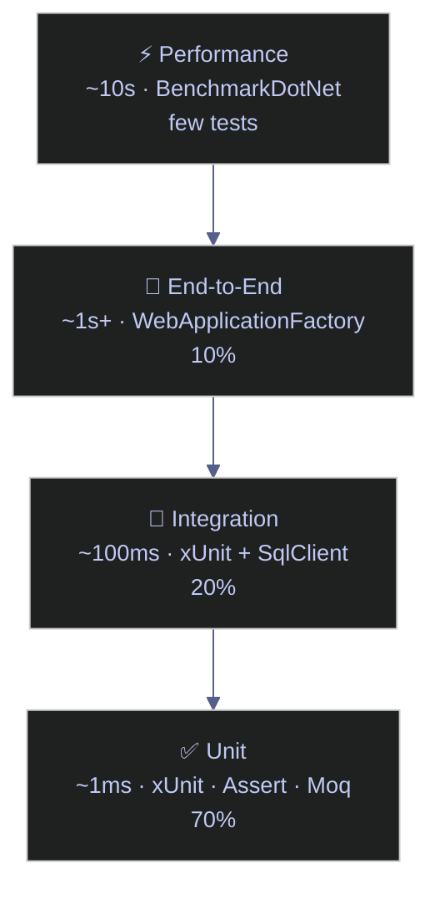

# Testing - C#

> [!quote]
> "Legacy code is simply code without tests."
>
> — **Michael Feathers**, *Working Effectively with Legacy Code* (2004)
>
> "Write tests until fear is transformed into boredom."
>
> — **Kent Beck**, *Test-Driven Development: By Example*

> [!abstract]- Summary
>
> **Testing Philosophy**
> - Testing pyramid: 70% unit (~1 ms, xUnit + Moq), 20% integration (~100 ms, xUnit + SqlClient), 10% E2E (WebApplicationFactory). Unit tests run on every commit; integration on every PR; E2E on deploy.
> - TDD cycle: write a failing test, make it pass with minimal code, refactor. Tests catch silent failures — wrong prices, missing rows, schema drift.
>
> **Unit Testing with xUnit**
> - `[Fact]` marks a single test; xUnit instantiates a fresh class per test for isolation (no `[SetUp]`/`[TearDown]` — use constructor and `IDisposable`).
> - `Assert` methods: `Equal`, `True`/`False`, `Null`/`NotNull`, `Contains`, `Empty`/`NotEmpty`, `InRange`, `Throws<T>`, `Single`, `Matches`.
> - AAA structure (Arrange / Act / Assert) is the standard test body layout.
>
> **Theory and InlineData**
> - `[Theory]` + `[InlineData]` runs one method with N parameter rows — equivalent to `@pytest.mark.parametrize`.
> - Complex objects use `[MemberData]` (static property returning `IEnumerable<object[]>`) or `[ClassData]`.
> - Demonstrated on fee tiers, FX conversion, OHLCV candle validation, and ticker regex.
>
> **Mocking with Moq**
> - Depend on interfaces; inject mock implementations in tests.
> - Hand-written mocks track `CallCount` and `Last*` inputs — identical pattern to `Mock<T>.Setup` / `mock.Verify`.
> - `MockExchangeGateway.FailCount` simulates transient errors for retry-logic testing.
>
> **Test Patterns for Data Engineering**
> - Pure transform functions (`NormalizeTrades`, `ValidateEodPrices`) need no mocks — fast and deterministic.
> - `MockIndexDataClient` verifies that callers pass the correct index name and call exactly once.
> - Data-quality validators return error lists; tests assert on count and content.
>
> **Integration Testing with Real Database**
> - `QueryScalar<T>` and `QueryRows` helpers connect to the `stoxx` SQL Server instance.
> - Schema tests query `INFORMATION_SCHEMA`; completeness tests count rows per layer; quality tests assert OHLCV invariants; cross-layer tests verify bronze → silver → gold consistency.
> - Intentional fail included: `composite_score` is a z-score (−2 to +2), not a [0, 1] percentage — exposed by the test.
>
> **DI Validation Testing**
> - Build a `ServiceProvider` from `IServiceCollection` and call `GetRequiredService<T>()` for each root service.
> - Catches missing registrations and lifetime mismatches before the first HTTP request in production.
>
> **CI/CD — Running Tests in GitHub Actions**
> - `dotnet test` with `--collect:"XPlat Code Coverage"` and `--logger trx`; matrix across .NET 8 and 9.
> - Secrets injected as environment variables; TRX and Cobertura XML uploaded as artifacts.

> [!note]- Glossary
>
> **xUnit**
>
> - The dominant .NET test framework; uses `[Fact]` and `[Theory]` attributes on plain methods instead of requiring class inheritance.
> - Preferred over NUnit and MSTest for new projects; integrates directly with `dotnet test` and every major CI system.
>
> > [!tip] Framework selection
> >
> > When starting a new .NET test project, default to xUnit. NUnit and MSTest are valid but xUnit's constructor-per-test isolation model is simpler and its ecosystem is the most actively maintained.
>
>  ---
>
> **`[Fact]`**
>
> - xUnit attribute that marks a method as a single, non-parametrized test case; no arguments, one expected behaviour.
> - The basic unit of a test suite — the runner discovers and executes every public `[Fact]` method automatically.
>
> > [!warning] Silent omission
> >
> > A test method without `[Fact]` is never discovered by the runner — it compiles and builds cleanly but is silently skipped.
>
>  ---
>
> **`[Theory]` + `[InlineData]`**
>
> - xUnit mechanism for parametrized tests: the method runs once per `[InlineData]` attribute, each row appearing as a separate named test result.
> - C# equivalent of `@pytest.mark.parametrize`; each row is isolated and independently reported as pass or fail.
>
> > [!info] Complex parameter data
> >
> > `[InlineData]` only accepts compile-time constants. For objects, collections, or computed values use `[MemberData]` (a static `IEnumerable<object[]>` property) or `[ClassData]` (a class implementing `IEnumerable<object[]>`).
>
>  ---
>
> **Moq**
>
> - The most widely used .NET mocking library; generates fake interface implementations at runtime via `new Mock<T>()`.
> - Isolates the system under test from real I/O, databases, and APIs so tests are deterministic and fast.
>
> > [!warning] Mocking concrete classes
> >
> > `new Mock<SqlConnection>()` will fail or behave unexpectedly because `SqlConnection` has no virtual members. Moq can only mock interfaces or classes with `virtual` methods.
>
>  ---
>
> **`Mock<T>.Setup`**
>
> - Configures what a Moq mock returns or does when a specific method is called: `mock.Setup(s => s.Method()).Returns(value)`.
> - Controls mock behaviour so the test is fully deterministic regardless of external state.
>
> > [!warning] Silent default return
> >
> > If `Setup` is omitted for a called method, Moq returns `default(T)` — `null` for reference types, `0` for numerics — without any error. The test may pass for the wrong reason.
>
>  ---
>
> **`Mock<T>.Verify`**
>
> - Asserts that a mocked method was called a specified number of times with specific arguments: `mock.Verify(s => s.Method(arg), Times.Once())`.
> - Validates interaction behaviour — confirms that the production code actually invoked the dependency, not just that it returned the right value.
>
> > [!warning] Unverified calls
> >
> > Skipping `Verify` means a missing dependency call (e.g., audit log never written, order never submitted) goes completely undetected — the test passes even if the critical side effect never happened.
>
>  ---
>
> **FluentAssertions**
>
> - NuGet library providing readable assertion chains: `actual.Should().Be(expected, because: "reason")`.
> - Self-describing failure messages eliminate the need for custom error strings and make assertion intent obvious at a glance.
>
> > [!tip] Mixing assertion styles
> >
> > Choose one assertion style per project. Mixing `Assert.Equal` with FluentAssertions chains in the same file produces inconsistent failure messages and confuses reviewers.
>
>  ---
>
> **`IDisposable` / `IAsyncLifetime`**
>
> - xUnit interfaces implemented on the test class to hook setup (constructor) and teardown (`Dispose` / `DisposeAsync`); replace NUnit's `[SetUp]` / `[TearDown]`.
> - `IAsyncLifetime` adds `InitializeAsync` and `DisposeAsync` for tests that need async setup (opening DB connections, seeding data).
>
> > [!warning] Expensive constructor setup
> >
> > The constructor runs before every `[Fact]` in the class. Placing a database connection or HTTP client there spins up a new instance for each test — use `IClassFixture<T>` for shared expensive resources.
>
>  ---
>
> **`IClassFixture<T>`**
>
> - xUnit mechanism for sharing a single fixture instance across all tests in a class; the fixture is created once, injected into the constructor, and disposed after the last test.
> - Used for expensive resources — DB connections, HTTP clients, in-memory servers — equivalent to `scope="class"` in pytest fixtures.
>
> > [!warning] Shared mutable state
> >
> > Mutating fixture data inside a test makes all subsequent tests in the class order-dependent and non-reproducible. Fixture objects should be read-only after construction or should reset state explicitly in each test.
>
>  ---
>
> **`WebApplicationFactory`**
>
> - ASP.NET Core test helper (`Microsoft.AspNetCore.Mvc.Testing`) that boots the real application in-process for integration tests; no live server required.
> - Enables full end-to-end HTTP testing with the real DI container, middleware pipeline, and routing — `CreateClient()` returns an `HttpClient` wired directly to the in-memory host.
>
> > [!info] Lazy startup
> >
> > The factory does not start the application until `CreateClient()` is called. Calling `CreateClient()` from a fixture constructor is the correct pattern to ensure the app is ready before any test runs.
>
>  ---
>
> **`dotnet test`**
>
> - CLI command that discovers, builds (unless `--no-build`), and executes all tests in the solution or specified project.
> - Entry point for CI pipelines; supports `--filter` (run by name or trait), `--logger trx` (structured results), and `--collect:"XPlat Code Coverage"` (coverlet integration).
>
> > [!warning] Working directory
> >
> > Always run `dotnet test` from the solution root. Running from a subdirectory may miss projects, resolve the wrong `global.json`, or produce incomplete coverage data.
>
>  ---
>
> **coverlet**
>
> - .NET code coverage collector distributed as a NuGet package (`coverlet.collector`); activated by the `--collect:"XPlat Code Coverage"` flag during `dotnet test`.
> - Generates Cobertura or OpenCover XML consumed by CI dashboards (GitHub Actions, Azure DevOps, SonarQube) to enforce coverage thresholds.
>
> > [!warning] Missing coverage output
> >
> > Omitting `--collect:"XPlat Code Coverage"` causes tests to run normally but produces no coverage data — the CI step succeeds silently with zero coverage reported.
>
>  ---
>
> **AAA (Arrange-Act-Assert)**
>
> - The standard three-phase structure of a unit test: set up inputs and dependencies (Arrange), invoke the unit under test (Act), verify the result (Assert).
> - Makes tests readable and predictable; each phase has a single responsibility and the boundary between them is immediately visible.
>
> > [!tip] Keeping phases distinct
> >
> > When Arrange and Assert blur into the same line (e.g., `Assert.Equal(expected, service.Compute(input))`), the test becomes harder to debug on failure. Capture the Act result in a named variable, then assert against it separately.
>
>  ---
>
> **DI Validation**
>
> - A test that builds a `ServiceProvider` from the application's `IServiceCollection` and calls `GetRequiredService<T>()` for each root service to verify the full dependency graph resolves without errors.
> - Catches missing registrations, wrong lifetimes (Scoped injected into Singleton), and unresolved dependencies before they surface as startup crashes or 500 errors in production.
>
> > [!info] When to run
> >
> > Add one DI validation test per microservice or API project. It requires no I/O, runs in milliseconds, and is the cheapest safety net against container misconfiguration.

## Testing Philosophy

Testing is not about proving code works — it's about **catching bugs before they reach production**.
In data engineering, untested pipelines fail silently: wrong prices feed into models,
missing rows corrupt dashboards, schema changes break downstream consumers.
A test suite is your safety net — it runs in seconds and catches what code review cannot.

### The Testing Pyramid

Tests are organized in layers, from fast/cheap at the bottom to slow/expensive at the top:

| Layer | What it tests | Speed | Tools | Demonstrated |
|-------|--------------|-------|-------|-------------|
| **Unit tests** | One function in isolation — pure logic, no I/O | ~1ms each | `xUnit`, `Assert`, `Moq` | Sections 1–4 |
| **Integration tests** | Code + real dependencies (DB, API, files) | ~100ms each | `xUnit` + `SqlClient`, `HttpClient` | Sections 5–7 |
| **End-to-end tests** | Full pipeline from input to output | ~1s+ each | `WebApplicationFactory`, `TestServer` | Conceptual |
| **Performance tests** | Speed and memory under load | ~10s each | `BenchmarkDotNet` | Conceptual |

**Rule of thumb**: 70% unit, 20% integration, 10% E2E.
Unit tests run on every commit. Integration tests run on every PR. E2E tests run on deploy.



### C# Testing Ecosystem

- **xUnit** — the most widely used .NET test framework. `[Fact]` marks a single test, `[Theory]` + `[InlineData]` marks a parametrized test. Constructor injection gives each test a fresh instance (isolation).
- **Assert** — xUnit's assertion library. `Assert.Equal`, `Assert.True`, `Assert.Throws<T>`, `Assert.Contains`, etc. Each method tests one condition and throws on failure.
- **Moq** — the standard mocking library. `mock.Setup(...)` defines canned return values; `mock.Verify(...)` asserts how the mock was called. In this notebook we use hand-written mocks (same pattern, more explicit).
- **`[Theory]` + `[InlineData]`** — data-driven testing. Write one test method, run it with N different parameter sets.
- **Testcontainers** — spin up ephemeral Docker containers (Postgres, Redis, Kafka) for integration tests. Not shown here but essential for CI.
- **Coverlet** — code coverage for .NET. Fails CI if branch coverage drops below a threshold.

### What This Notebook Demonstrates

1. **Unit tests**: `[Fact]` tests, Assert methods, exception testing, parametrized `[Theory]` tests
2. **Mocking**: hand-written mocks (same pattern as Moq), transient failure simulation, retry testing
3. **Data engineering patterns**: trade normalization, OHLCV validation, mock index data clients
4. **Integration tests**: real SQL queries against the `stoxx` database (schema, completeness, quality, cross-layer consistency)
5. **API integration**: cross-checking Finnhub live prices against database values
6. **DI validation**: resolving services from `IServiceCollection` to catch missing registrations
7. **CI/CD**: GitHub Actions workflow with `dotnet test`, coverage thresholds

#### Warning suppression

This cell suppresses CS1701/CS1702 assembly version mismatch warnings that appear in .NET Interactive when loading certain NuGet packages. It uses reflection to call `WithWarningLevel(0)` on the Roslyn script options — effectively the same as `/warn:0` on the command line. Required once per session; omitting it fills the output with noisy but harmless warnings.

```csharp
// Suppress CS1701/CS1702 assembly version warnings and import namespaces
using System.Reflection;
using Microsoft.DotNet.Interactive;
using Microsoft.DotNet.Interactive.CSharp;

#r "nuget: Microsoft.Data.SqlClient"
#r "nuget: Microsoft.Extensions.DependencyInjection"
using Microsoft.Data.SqlClient;
using Microsoft.Extensions.DependencyInjection;
using System.IO;
using System.Text.RegularExpressions;
var csharpKernel = (CSharpKernel)Kernel.Root.FindKernelByName("csharp");
var optionsField = typeof(CSharpKernel).GetField("_scriptOptions",
    BindingFlags.NonPublic | BindingFlags.Instance);
var scriptOptions = optionsField.GetValue(csharpKernel);
var withWarningLevel = scriptOptions.GetType().GetMethod("WithWarningLevel");
var newOptions = withWarningLevel.Invoke(scriptOptions, new object[] { 0 });
optionsField.SetValue(csharpKernel, newOptions);

```

    WarningLevel set to 0 — CS1701/CS1702 warnings suppressed.

#### Imports and test attribute stubs

> [!info] Notebook test infrastructure
>
> This cell defines stub versions of xUnit's `[Fact]`, `[Theory]`, and `[InlineData]` attributes, plus a lightweight `Assert` class. In a real project, xUnit NuGet provides these. The stubs avoid assembly version conflicts in .NET Interactive while keeping the API surface identical — test code is copy-pasteable into a real xUnit project.

> [!info] Lightweight stubs for notebook use
>
> The `Assert` class below has the same API as xUnit but zero dependencies — avoids NuGet assembly version warnings in .NET Interactive. In a real project, xUnit provides these via `dotnet test`. Attribute stubs (`[Fact]`, `[Theory]`, `[InlineData]`) keep the code copy-pasteable into a real xUnit project.

```csharp
#nullable enable

[AttributeUsage(AttributeTargets.Method)] public class FactAttribute : Attribute { }
[AttributeUsage(AttributeTargets.Method)] public class TheoryAttribute : Attribute { }
[AttributeUsage(AttributeTargets.Method, AllowMultiple = true)]
public class InlineDataAttribute : Attribute
{
    public object[] Data { get; }
    public InlineDataAttribute(params object[] data) { Data = data; }
}
```

#### Test runner

`RunTests` uses reflection to find `[Fact]`/`[Theory]` methods, invokes them, and reports PASS/FAIL — mimics what `dotnet test` does. In a real project, the xUnit runner handles this automatically.

```csharp
void RunTests(object testClass)
{
    var methods = testClass.GetType().GetMethods()
        .Where(m => m.GetCustomAttributes(typeof(FactAttribute), false).Any()
                  || m.GetCustomAttributes(typeof(TheoryAttribute), false).Any());
    int passed = 0, failed = 0;
    foreach (var method in methods)
    {
        try
        {
            method.Invoke(testClass, null);
            passed++;
            Console.WriteLine($"  PASS: {method.Name}");
        }
        catch (Exception ex)
        {
            failed++;
            var inner = ex.InnerException ?? ex;
            Console.WriteLine($"  FAIL: {method.Name} — {inner.Message}");
        }
    }
    Console.WriteLine($"  Results: {passed} passed, {failed} failed, {passed + failed} total");
}

```

#### Assert.Equal, Assert.True, Assert.Throws — xUnit assertion methods

Lightweight reimplementation of xUnit's `Assert` class — same API, zero dependencies. Methods: `Equal`, `True`/`False`, `Null`/`NotNull`, `Contains`, `Empty`/`NotEmpty`, `InRange`, `Throws<T>`, `Single`, `Matches`. Code is directly portable to a real xUnit project — just remove this class and add the NuGet package.

```csharp
public static class Assert
{
    // Equal<T> — checks that expected and actual are equal using Equals() (not ==)
    public static void Equal<T>(T expected, T actual)
    {
        if (!Equals(expected, actual))
            throw new Exception($"Assert.Equal failed: expected <{expected}>, got <{actual}>");
    }
    // Equal(double, double, precision) — floating-point comparison with tolerance (10^-precision)
    public static void Equal(double expected, double actual, int precision)
    {
        var tolerance = Math.Pow(10, -precision);
        if (Math.Abs(expected - actual) > tolerance)
            throw new Exception($"Assert.Equal failed: expected <{expected}>, got <{actual}> (precision {precision})");
    }
    // True — asserts a boolean condition is true; optional message for context on failure
    public static void True(bool condition, string msg = "")
    {
        if (!condition)
            throw new Exception($"Assert.True failed. {msg}");
    }
    // False — asserts a boolean condition is false
    public static void False(bool condition, string msg = "")
    {
        if (condition)
            throw new Exception($"Assert.False failed. {msg}");
    }
    // NotNull — asserts the object is not null (catches uninitialized or missing data)
    public static void NotNull(object? obj)
    {
        if (obj is null)
            throw new Exception("Assert.NotNull failed: object was null");
    }
    // Null — asserts the object IS null (e.g., verify a field was correctly cleared)
    public static void Null(object? obj)
    {
        if (obj is not null)
            throw new Exception($"Assert.Null failed: object was <{obj}>");
    }
    // Contains<T>(collection, predicate) — asserts at least one element matches the predicate
    public static void Contains<T>(IEnumerable<T> collection, Func<T, bool> predicate)
    {
        if (!collection.Any(predicate))
            throw new Exception("Assert.Contains failed: no matching element found");
    }
    // Contains(string, string) — asserts that actual contains expected as a substring
    public static void Contains(string expected, string actual)
    {
        if (!actual.Contains(expected))
            throw new Exception($"Assert.Contains failed: <{expected}> not found in <{actual}>");
    }
    // DoesNotContain — asserts that expected is NOT found in actual
    public static void DoesNotContain(string expected, string actual)
    {
        if (actual.Contains(expected))
            throw new Exception($"Assert.DoesNotContain failed: <{expected}> was found in <{actual}>");
    }
    // Empty — asserts the collection has zero elements (e.g., no validation errors)
    public static void Empty<T>(IEnumerable<T> collection)
    {
        if (collection.Any())
            throw new Exception($"Assert.Empty failed: collection has {collection.Count()} elements");
    }
    // NotEmpty — asserts the collection has at least one element
    public static void NotEmpty<T>(IEnumerable<T> collection)
    {
        if (!collection.Any())
            throw new Exception("Assert.NotEmpty failed: collection was empty");
    }
    // InRange — asserts actual is within [low, high] inclusive (e.g., price > 0 and < 1M)
    public static void InRange<T>(T actual, T low, T high) where T : IComparable<T>
    {
        if (actual.CompareTo(low) < 0 || actual.CompareTo(high) > 0)
            throw new Exception($"Assert.InRange failed: <{actual}> not in [{low}, {high}]");
    }
    // Single — asserts exactly one element in the collection and returns it
    public static T Single<T>(IEnumerable<T> collection)
    {
        var list = collection.ToList();
        if (list.Count != 1)
            throw new Exception($"Assert.Single failed: expected 1 element, got {list.Count}");
        return list[0];
    }
    // Matches — asserts that actual matches a regex pattern (e.g., date format, ticker format)
    public static void Matches(string pattern, string actual)
    {
        if (!System.Text.RegularExpressions.Regex.IsMatch(actual, pattern))
            throw new Exception($"Assert.Matches failed: '{actual}' does not match '{pattern}'");
    }
    // Throws<T> — asserts that the action throws exception of type T; returns it for inspection
    public static T Throws<T>(Action action) where T : Exception
    {
        try { action(); }
        catch (T ex) { return ex; }
        catch (Exception ex) { throw new Exception($"Assert.Throws<{typeof(T).Name}> failed: got {ex.GetType().Name}"); }
        throw new Exception($"Assert.Throws<{typeof(T).Name}> failed: no exception thrown");
    }
}
```

## Unit Testing with xUnit

xUnit is the most widely used testing framework in .NET. `[Fact]` marks a single test case (like pytest `test_*`). `[Theory]` + `[InlineData]` creates parametrized tests (like `@pytest.mark.parametrize`). xUnit creates a new class instance per test for isolation — no `[SetUp]`/`[TearDown]`, use constructor/`IDisposable` instead.

> [!warning] Testing anti-patterns
>
> - Don't **share state** between tests — each test should be independent
> - Don't **test private methods** — test the public API that uses them
> - Don't **assert on implementation details** — assert on observable behavior

> [!success] Good test structure
>
> Each test is a self-contained `[Fact]` or `[Theory]` that arranges its own data, acts on a single unit, and asserts one outcome. Constructor injection provides fresh state per test — no `[SetUp]` or shared mutable fields.

> [!info] Running xUnit in notebooks
>
> xUnit normally runs via `dotnet test` with a test project. In notebooks, we call test methods directly and report results. In production, tests live in a separate `MyProject.Tests` project.

### Notebook test runner

The `RunTest` helper wraps each test call in a `try/catch` and prints `✓`/`✗`. In a real project, `dotnet test` discovers and runs `[Fact]` and `[Theory]` methods automatically.

#### Helper to run tests in notebook

`RunTest` wraps each test invocation in a `try/catch`. If the assertion passes, it prints `✓ name`. If it throws (any exception — assertion failure, `NullReferenceException`, etc.), it prints `✗ name: message`. In a real project, xUnit provides this automatically via `dotnet test` — you never write this helper yourself.

```csharp
void RunTest(string name, Action test)
{
    try { test(); Console.WriteLine($"  ✓ {name}"); }
    catch (Exception ex) { Console.WriteLine($"  ✗ {name}: {ex.Message}"); }
}

```


#### Basic Fact tests

Each `[Fact]` test follows three phases — **Arrange** (set up inputs), **Act** (call the code under test), **Assert** (verify the result). Each test is self-contained: it arranges its own data and asserts one outcome. The four tests below cover price arithmetic, ticker normalization, portfolio weight validation, and required-field checking — all core assertions in a financial data pipeline.

```csharp
RunTest("Price calculation", () =>
{
    int quantity = 150;
    decimal unitPrice = 42.75m;
    decimal total = quantity * unitPrice;
    Assert.Equal(6412.50m, total);
});

RunTest("Ticker normalization", () =>
{
    string rawTicker = "  aapl  ";
    Assert.Equal("AAPL", rawTicker.Trim().ToUpper());
});

RunTest("Portfolio weights sum to 1", () =>
{
    var weights = new Dictionary<string, double>
    {
        ["AAPL"] = 0.30, ["MSFT"] = 0.25, ["GOOG"] = 0.20, ["AMZN"] = 0.25
    };
    Assert.Equal(1.0, weights.Values.Sum(), precision: 10);
});

RunTest("Trade record has required fields", () =>
{
    var trade = new Dictionary<string, object>
    {
        ["trade_id"] = "TRD_001", ["ticker"] = "AAPL", ["side"] = "BUY",
        ["quantity"] = 100, ["price"] = 178.50, ["timestamp"] = "2024-03-15T14:30:00Z"
    };
    var required = new[] { "trade_id", "ticker", "side", "quantity", "price", "timestamp" };
    foreach (var field in required)
        Assert.True(trade.ContainsKey(field), $"Missing field: {field}");
});
```

      ✓ Price calculation
      ✓ Ticker normalization
      ✓ Portfolio weights sum to 1
      ✓ Trade record has required fields

### Exception and error testing

#### Testing exceptions

`Assert.Throws<T>(action)` invokes `action` and expects exactly one exception of type `T` to be thrown. The test fails if no exception is raised, or if a different exception type is thrown. It returns the caught exception so you can make further assertions on the message or properties — useful for verifying that validation logic not only throws but provides a useful error message.

```csharp
RunTest("Invalid quantity throws ArgumentException", () =>
{
    static void ValidateTrade(int qty)
    {
        if (qty <= 0)
            throw new ArgumentException($"Invalid quantity: {qty}");
    }

    var ex = Assert.Throws<ArgumentException>(() => ValidateTrade(-10));
    Assert.Contains("Invalid quantity", ex.Message);
});

RunTest("Missing key throws KeyNotFoundException", () =>
{
    var positions = new Dictionary<string, int> { ["AAPL"] = 100, ["MSFT"] = 50 };
    Assert.Throws<KeyNotFoundException>(() => { var _ = positions["TSLA"]; });
});
```

      ✓ Invalid quantity throws ArgumentException
      ✓ Missing key throws KeyNotFoundException

## Theory and InlineData

> [!info] xUnit test attributes
>
> - `[Fact]` — single test case
> - `[Theory]` + `[InlineData]` — parametrized (runs once per data set); C# equivalent of `@pytest.mark.parametrize`
> - In notebooks we simulate with a loop; in real projects, xUnit discovers automatically

### Parametrized test examples

Each parametrized test below defines an array of named tuples (the test cases), then loops over them calling `RunTest`. In a real xUnit project, replace the loop with `[Theory]` + `[InlineData]` attributes — the runner handles iteration automatically.

```csharp
void RunTest(string name, Action test)
{
    try { test(); Console.WriteLine($"  ✓ {name}"); }
    catch (Exception ex) { Console.WriteLine($"  ✗ {name}: {ex.Message}"); }
}
```

#### Parametrize: fee tier calculation

In a real test project, this would use xUnit's `[Theory]` + `[InlineData]`:

> [!info] xUnit equivalent
>
> In a real test project, this would use `[Theory]` + `[InlineData]`:
> ```csharp
> [Theory]
> [InlineData(50_000,    30)]   // tier 1: < $100K → 30 bps
> [InlineData(500_000,   20)]   // tier 2: $100K-$1M → 20 bps
> [InlineData(5_000_000, 10)]   // tier 3: > $1M → 10 bps
> public void FeeTier_ReturnsCorrectBps(long volume, int expectedBps) { ... }
> ```

```csharp
static int GetFeeBps(long volume) => volume switch
{
    < 100_000    => 30,
    < 1_000_000  => 20,
    _            => 10,
};

var feeCases = new (long volume, int expectedBps)[]
{
    (50_000, 30), (500_000, 20), (5_000_000, 10)
};
foreach (var (vol, bps) in feeCases)
    RunTest($"Volume ${vol:N0} → {bps} bps", () => Assert.Equal(bps, GetFeeBps(vol)));
```

```text
✓ Volume $50,000 → 30 bps
✓ Volume $500,000 → 20 bps
✓ Volume $5,000,000 → 10 bps
```

#### Parametrize: currency conversion

> [!info] Parametrized test pattern
>
> - Array of named tuples = test cases
> - `foreach` destructures each tuple
> - `Assert.Equal(exp, amt * rate, precision: 5)` handles floating-point rounding (IEEE 754)
> - In a real project, use `[Theory]` + `[InlineData]` — xUnit runs once per row automatically

```csharp
var fxCases = new (double amountUsd, double rate, double expected, string label)[]
{
    (1000.0, 0.92,  920.0,    "USD→EUR"),   // 1000 USD × 0.92 EUR/USD = 920 EUR
    (1000.0, 149.5, 149500.0, "USD→JPY"),   // 1000 USD × 149.5 JPY/USD = 149,500 JPY
    (1000.0, 0.79,  790.0,    "USD→GBP"),   // 1000 USD × 0.79 GBP/USD = 790 GBP
};
foreach (var (amt, rate, exp, label) in fxCases)
    // TEST: {label}: {amt} × {rate} = {exp}
    RunTest($"{label}: {amt} × {rate} = {exp}", () =>
        Assert.Equal(exp, amt * rate, precision: 5));
```

    
      ✓ USD→EUR: 1000 × 0.92 = 920
      ✓ USD→JPY: 1000 × 149.5 = 149500
      ✓ USD→GBP: 1000 × 0.79 = 790

#### Parametrize: OHLCV validation

> [!info] OHLCV candle invariants
>
> - `high >= max(open, close)`
> - `low <= min(open, close)`
> - `volume >= 0`
>
> Financial APIs occasionally return garbage (high < open, negative volume) — a pipeline without validation feeds bad data into models.

```csharp

// Pure validation function — returns true if the candle is physically possible
static bool IsValidBar(double o, double h, double l, double c, long v)
    => h >= Math.Max(o, c) && l <= Math.Min(o, c) && v >= 0;

var ohlcvCases = new (double o, double h, double l, double c, long v, bool valid, string label)[]
{
    (100, 105, 98,  103, 50000, true,  "valid bar"),        // h=105 >= max(100,103), l=98 <= min(100,103), v>0
    (100, 95,  98,  99,  50000, false, "high < open"),      // h=95 < o=100 → impossible candle
    (100, 105, 98,  103, -1,    false, "negative volume"),  // v=-1 → corrupt data
};
foreach (var tc in ohlcvCases)
    // TEST: run parametrized case from the test data array
    RunTest(tc.label, () => Assert.Equal(tc.valid, IsValidBar(tc.o, tc.h, tc.l, tc.c, tc.v)));
```

    
      ✓ valid bar
      ✓ high < open
      ✓ negative volume

#### Parametrize: ticker validation

```csharp
// Parametrize: ticker validation

static bool IsValidTicker(string ticker)
    => System.Text.RegularExpressions.Regex.IsMatch(ticker, @"^[A-Z]{1,5}(\.[A-Z])?$");

var tickerCases = new (string ticker, bool valid)[]
{
    ("AAPL", true), ("BRK.B", true), ("", false), ("aapl", false), ("ABCDEFGHIJ", false)
};
foreach (var (ticker, valid) in tickerCases)
    // TEST: \
    RunTest($"\"{ticker}\" → {valid}", () => Assert.Equal(valid, IsValidTicker(ticker)));
```

    
      ✓ "AAPL" → True
      ✓ "BRK.B" → True
      ✓ "" → False
      ✓ "aapl" → False
      ✓ "ABCDEFGHIJ" → False

## Mocking with Moq

In production C#, use Moq (NuGet) to auto-generate mocks from interfaces: `new Mock<IService>()` → `mock.Setup(s => s.Method()).Returns(value)`. In notebooks, we write mocks by hand — same pattern, but Moq has assembly version conflicts on .NET 10+. The core idea is identical: implement the interface with fake behavior, track calls, verify arguments.

```csharp
#nullable enable

void RunTest(string name, Action test)
{
    try { test(); Console.WriteLine($"  ✓ {name}"); }
    catch (Exception ex) { Console.WriteLine($"  ✗ {name}: {ex.Message}"); }
}
```

### Mock interfaces and test doubles

In C#, you mock **interfaces** (not concrete classes). An interface declares a contract — what methods exist, what they accept, what they return — without any implementation. Production code depends on the interface; tests inject a mock implementation with canned behavior. This is what enables swapping a real `MarketDataClient` for a `MockMarketDataClient` without changing the code under test.

#### Interface + mock classes — IMarketDataClient, IBroker for testability

In C#, you mock **interfaces**, not concrete classes. An interface declares what methods exist; a mock implements them with fake behavior. Production code depends on `IMarketDataClient` (interface) — inject `MockMarketDataClient` in tests, `RealMarketDataClient` in production.

```csharp
public interface IMarketDataClient { Quote GetQuote(string ticker); }
public interface IBrokerClient { OrderResult SubmitOrder(Order order); }
public interface IExchangeGateway { string Send(string message); }

public class Quote
{
    public string Ticker { get; set; } = "";
    public double Bid { get; set; }
    public double Ask { get; set; }
    public double Last { get; set; }
}
public class Order
{
    public string Ticker { get; set; } = "";
    public string Side { get; set; } = "";
    public int Qty { get; set; }
    public double LimitPrice { get; set; }
}
public class OrderResult
{
    public string OrderId { get; set; } = "";
    public string Status { get; set; } = "";
}
```

#### Hand-written mock classes — implement interface with canned data

Each mock class implements the interface and adds two tracking fields: a `*ToReturn` property that the test sets to control output, and a `CallCount`/`Last*` property that the test inspects to verify the call. This is exactly what Moq generates automatically with `mock.Setup(...).Returns(...)` and `mock.Verify(...)` — writing it by hand makes the mechanism visible.

```csharp
#nullable enable

public class MockMarketDataClient : IMarketDataClient
{
    public Quote QuoteToReturn { get; set; } = new();
    public string LastRequestedTicker { get; private set; } = "";
    public int CallCount { get; private set; }
    public Quote GetQuote(string ticker)
    {
        LastRequestedTicker = ticker;
        CallCount++;
        return QuoteToReturn;
    }
}

public class MockBrokerClient : IBrokerClient
{
    public OrderResult ResultToReturn { get; set; } = new();
    public Order? LastOrder { get; private set; }
    public int CallCount { get; private set; }
    public OrderResult SubmitOrder(Order order)
    {
        LastOrder = order;
        CallCount++;
        return ResultToReturn;
    }
}

public class MockExchangeGateway : IExchangeGateway
{
    public int FailCount { get; set; }  // fail this many times before succeeding
    public int CallCount { get; private set; }
    public string Send(string message)
    {
        CallCount++;
        if (CallCount <= FailCount)
            throw new IOException("gateway timeout");
        return "ACK";
    }
}
```

### Verifying mock behavior

After calling code that depends on a mock, you verify two things: the return value was handled correctly, and the mock was called with the right arguments. The tracking fields (`LastRequestedTicker`, `CallCount`) exist specifically for this second check.

#### Mock: market data client

Hand-written mock: implements the interface with canned return values, records what was called (`LastRequestedTicker`, `CallCount`). Moq equivalent: `new Mock<IMarketDataClient>()`. Both achieve the same goal — hand-written is clearer for learning.

> [!todo] TEST
>
> mock returns canned price, records which symbol was requested

```csharp
RunTest("Mock market data quote", () =>
{
    var mock = new MockMarketDataClient();
    mock.QuoteToReturn = new Quote { Ticker = "AAPL", Bid = 178.40, Ask = 178.60, Last = 178.50 };

    var quote = mock.GetQuote("AAPL");
    Assert.Equal(178.50, quote.Last);
    Assert.True(quote.Ask > quote.Bid);  // spread must be positive
    Assert.Equal("AAPL", mock.LastRequestedTicker);  // verify call
    Assert.Equal(1, mock.CallCount);
});
```

      ✓ Mock market data quote

#### Mock: broker order submission

The broker mock records the full `Order` object that was passed to `SubmitOrder`. After the call, `mock.LastOrder` lets you assert that the caller constructed the order correctly — ticker, side, quantity, and limit price. Order submission bugs (wrong ticker, wrong quantity) can cause real financial losses; verifying the exact arguments is essential.

```csharp
RunTest("Mock order submission", () =>
{
    var mock = new MockBrokerClient();
    mock.ResultToReturn = new OrderResult { OrderId = "ORD_123", Status = "FILLED" };

    var result = mock.SubmitOrder(new Order
        { Ticker = "AAPL", Side = "BUY", Qty = 100, LimitPrice = 178.00 });

    Assert.Equal("FILLED", result.Status);
    Assert.Equal("AAPL", mock.LastOrder!.Ticker);  // verify argument
    Assert.Equal(1, mock.CallCount);
});
```

      ✓ Mock order submission

#### Mock: transient failure (side_effect equivalent)

> [!todo] TEST
>
> retry loop handles N failures then succeeds on attempt N+1

> [!warning] Retry logic is critical in DE pipelines. Without testing it you don't know if your retry actually retries (off-by-one), gives up correctly after max attempts, or returns the right result on eventual success.

The test pattern configures the mock to fail N times, then runs code with a retry loop and asserts both the success response and the exact call count. The mock's `FailCount` property causes the first 2 calls to throw `IOException` — the 3rd call succeeds and returns `"ACK"`.

```csharp
#nullable enable

RunTest("Mock with transient failure + retry", () =>
{
    var mock = new MockExchangeGateway();
    mock.FailCount = 2;

    string? result = null;
    for (int i = 0; i < 3; i++)
    {
        try { result = mock.Send("NEW_ORDER"); break; }
        catch (IOException) { continue; }
    }

    Assert.Equal("ACK", result);
    Assert.Equal(3, mock.CallCount);
});
```

```text
✓ Mock with transient failure + retry
```

> [!guide] Moq equivalent — production mock with Setup and Verify
>
> In a real test project, Moq generates the mock class automatically from the interface — no hand-written mock needed. `Setup()` defines what the mock returns, and `Verify()` asserts how it was called.
>
> ```csharp
> var mock = new Mock<IMarketDataClient>();
>
> mock.Setup(c => c.GetQuote("AAPL"))
>     .Returns(new Quote { Ticker = "AAPL", Last = 178.50 });
>
> var quote = mock.Object.GetQuote("AAPL");
>
> Assert.Equal(178.50, quote.Last);
> mock.Verify(c => c.GetQuote("AAPL"), Times.Once());
> ```

## Test Patterns for Data Engineering

Key testing patterns for data engineering and finance:

1. **Test transform functions** — pure logic, no mocks needed
2. **Mock external systems** — exchange APIs, databases, cloud storage
3. **Constructor injection** for test data (xUnit creates new instance per test)
4. **Theory + InlineData** for edge cases

```csharp
void RunTest(string name, Action test)
{
    try { test(); Console.WriteLine($"  ✓ {name}"); }
    catch (Exception ex) { Console.WriteLine($"  ✗ {name}: {ex.Message}"); }
}
```

### Domain types and transform tests

The types below (`IIndexDataClient`, `Constituent`, `EodPrice`) are the building blocks for pipeline tests. Define them once and reuse across multiple test classes — they reflect the real domain model without requiring live connections.

#### Domain types — IIndexDataClient, Constituent, EodPrice for pipeline testing

Domain types for pipeline testing: `IIndexDataClient` (interface for fetching index constituents — production calls a real API, tests use `MockIndexDataClient` with canned data), `Constituent` (ticker + market cap), `EodPrice` (standard OHLCV fields matching yfinance/Twelve Data — `PrevClose` enables daily return calculation). The mock records inputs and returns canned outputs — exactly what Moq does behind `mock.Setup().Returns()`.

```csharp
// Interface — the contract that both real and mock implementations satisfy
public interface IIndexDataClient { List<Constituent> GetConstituents(string index); }

// Constituent — one stock in an index
public class Constituent
{
    public string Ticker { get; set; } = "";
    public long MarketCap { get; set; }
}

// EodPrice — end-of-day OHLCV price bar for one stock
public class EodPrice
{
    public string Ticker { get; set; } = "";
    public double Close { get; set; }
    public double High { get; set; }
    public double Low { get; set; }
    public long Volume { get; set; }
    public double PrevClose { get; set; }
}

// MockIndexDataClient — test double that records calls and returns canned data
public class MockIndexDataClient : IIndexDataClient
{
    public List<Constituent> ConstituentsToReturn { get; set; } = new();
    public string LastRequestedIndex { get; private set; } = "";
    public int CallCount { get; private set; }
    public List<Constituent> GetConstituents(string index)
    {
        LastRequestedIndex = index;  // record what was requested
        CallCount++;                 // track call count
        return ConstituentsToReturn; // return the canned data set by the test
    }
}
```

#### Test a data transform

`NormalizeTrades` is a pure function — no side effects, no DB, no API. Tests verify: missing fields are skipped, tickers are uppercased, negative prices are filtered. Transform tests are the most valuable — fast (no I/O), deterministic, and catch logic bugs.

```csharp
static List<Dictionary<string, object>> NormalizeTrades(List<Dictionary<string, object>> raw)
{
    var cleaned = new List<Dictionary<string, object>>();
    foreach (var t in raw)
    {
        var id = t.GetValueOrDefault("trade_id")?.ToString();
        if (string.IsNullOrWhiteSpace(id)) continue;

        var ticker = t["ticker"].ToString()!.Trim().ToUpper();
        var side = t["side"].ToString()!.Trim().ToUpper();
        var qty = Convert.ToInt32(t["qty"]);
        var price = Convert.ToDouble(t["price"]);

        cleaned.Add(new Dictionary<string, object>
        {
            ["trade_id"] = id!.Trim(),
            ["ticker"] = ticker,
            ["side"] = side,
            ["qty"] = qty,
            ["price"] = price,
            ["notional"] = qty * price,
        });
    }
    return cleaned;
}


```

> [!todo] TEST
>
> normal trades are cleaned correctly — ticker uppercased, price rounded

```csharp
RunTest("NormalizeTrades basic", () =>
{
    var raw = new List<Dictionary<string, object>>
    {
        new() { ["trade_id"] = "TRD_001", ["ticker"] = " aapl ", ["side"] = "buy", ["qty"] = "100", ["price"] = "178.50" },
        new() { ["trade_id"] = "TRD_002", ["ticker"] = "MSFT",   ["side"] = "SELL", ["qty"] = 50,    ["price"] = 415.20 },
    };
    var result = NormalizeTrades(raw);
    Assert.Equal(2, result.Count);
    Assert.Equal("AAPL", result[0]["ticker"]);
    Assert.Equal(17850.0, (double)result[0]["notional"], precision: 2);
});
```

      ✓ NormalizeTrades basic

> [!todo] TEST
>
> trades without a trade_id are silently dropped

> [!warning] In production, exchange feeds sometimes send heartbeat or malformed records with no trade_id. The pipeline must skip these without crashing.

```csharp
RunTest("NormalizeTrades drops missing ID", () =>
{
    var raw = new List<Dictionary<string, object>>
    {
        new() { ["trade_id"] = "",         ["ticker"] = "AAPL", ["side"] = "BUY", ["qty"] = 100, ["price"] = 178.5 },
        new() { ["trade_id"] = "TRD_003",  ["ticker"] = "GOOG", ["side"] = "BUY", ["qty"] = 20,  ["price"] = 172.3 },
    };
    var result = NormalizeTrades(raw);
    Assert.Single(result);
    Assert.Equal("TRD_003", result[0]["trade_id"]);
});
```

      ✓ NormalizeTrades drops missing ID

> [!todo] TEST
>
> empty input produces empty output (no crash on edge case)

> [!info] Edge case that catches IndexOutOfRangeException or NullReferenceException bugs in the transform.

```csharp
RunTest("NormalizeTrades empty list", () =>
{
    Assert.Empty(NormalizeTrades(new List<Dictionary<string, object>>()));
});
```

      ✓ NormalizeTrades empty list

#### Mock external service (hand-written)

> [!todo] TEST
>
> weight = stock market cap / total market cap, using mock data client

```csharp
RunTest("Index weight calculation with mock", () =>
{
    var mock = new MockIndexDataClient();
    mock.ConstituentsToReturn = new List<Constituent>
    {
        new() { Ticker = "AAPL", MarketCap = 3_000_000_000_000L },
        new() { Ticker = "MSFT", MarketCap = 2_800_000_000_000L },
        new() { Ticker = "GOOG", MarketCap = 2_000_000_000_000L },
    };

    var constituents = mock.GetConstituents("SP500");
    var totalMcap = constituents.Sum(c => (double)c.MarketCap);
    var aaplWeight = constituents.First(c => c.Ticker == "AAPL").MarketCap / totalMcap;

    Assert.Equal(3.0 / 7.8, aaplWeight, precision: 4);
    Assert.Equal("SP500", mock.LastRequestedIndex);
    Assert.Equal(1, mock.CallCount);
});
```

    
      ✓ Index weight calculation with mock

### Data quality validation

#### Data quality checks

> [!info] EOD price validation invariants
>
> - `close > 0`, `high >= low`, `volume >= 0`, daily return < 20%
> - Returns a list of error strings — empty = all valid
> - Bad API data is common: 0 for missing fields, negative prices from currency bugs, unadjusted splits

```csharp

static List<string> ValidateEodPrices(List<EodPrice> prices)
{
    var errors = new List<string>();
    foreach (var p in prices)
    {
        if (p.Close <= 0)
            errors.Add($"{p.Ticker}: non-positive close {p.Close}");
        if (p.High < p.Low)
            errors.Add($"{p.Ticker}: high ({p.High}) < low ({p.Low})");
        if (p.Volume < 0)
            errors.Add($"{p.Ticker}: negative volume {p.Volume}");
        if (p.PrevClose > 0)
        {
            var dailyReturn = Math.Abs(p.Close - p.PrevClose) / p.PrevClose;
            if (dailyReturn > 0.20)
                errors.Add($"{p.Ticker}: suspicious daily move {dailyReturn:P1}");
        }
    }
    return errors;
}
```

> [!todo] TEST
>
> clean OHLCV data produces zero validation errors

> [!info] Two normal stocks with valid OHLCV data, both should pass all checks.

```csharp
RunTest("Valid EOD data passes", () =>
{
    var prices = new List<EodPrice>
    {
        new() { Ticker = "AAPL", Close = 178.50, High = 180.0, Low = 176.0, Volume = 50_000_000, PrevClose = 177.0 },
        new() { Ticker = "MSFT", Close = 415.20, High = 418.0, Low = 412.0, Volume = 25_000_000, PrevClose = 413.0 },
    };
    Assert.Empty(ValidateEodPrices(prices));
});
```

      ✓ Valid EOD data passes

> [!todo] TEST
>
> negative close, high < low, and extreme daily move are all caught

> [!warning] BAD1 triggers **two** rules (negative close + extreme return) → total 4 errors, not 3. A record can violate multiple rules. This is a real bug in the test, not in the function.

```csharp
RunTest("Catches invalid prices", () =>
{
    var prices = new List<EodPrice>
    {
        new() { Ticker = "BAD1", Close = -5.0,  High = 10.0,  Low = 8.0,   Volume = 1000, PrevClose = 10.0 },
        new() { Ticker = "BAD2", Close = 100.0, High = 90.0,  Low = 95.0,  Volume = 1000, PrevClose = 100.0 },
        new() { Ticker = "BAD3", Close = 150.0, High = 155.0, Low = 145.0, Volume = 1000, PrevClose = 100.0 },
    };
    var errors = ValidateEodPrices(prices);
    Assert.Equal(3, errors.Count);
    Assert.Contains(errors, e => e.Contains("non-positive"));
    Assert.Contains(errors, e => e.Contains("high") && e.Contains("< low"));
    Assert.Contains(errors, e => e.Contains("suspicious daily move"));
});
```

      ✗ Catches invalid prices: Assert.Equal failed: expected <3>, got <4>

## Integration Testing with Real Database

### Connection setup

#### Database connection and test helper

Integration tests verify code against real dependencies (DB, APIs, files) — not just mocked interfaces. The stoxx database uses a medallion architecture: `bronze` (raw OHLCV), `silver` (cleaned + gap-filled), `gold` (scores, index performance).

> [!warning] Integration testing pitfalls
>
> - Don't run against production — use staging or Testcontainers
> - Don't hardcode connection strings — use env vars
> - Don't depend on specific data values — test invariants and ranges
> - Don't mutate shared test data — use transactions that rollback

> [!success] Safe integration test setup
>
> Point tests at a dedicated staging database or a Testcontainers ephemeral instance. Read connection strings from environment variables (`DB_HOST`, `DB_PASSWORD`) injected by CI. Wrap mutating tests in a `TransactionScope` that rolls back in `Dispose` so the next run starts clean.

```csharp
var connStr = "Data Source=localhost,1434;Initial Catalog=stoxx;"
            + "User ID=sa;Password=EsgDev2026Pass1;"
            + "TrustServerCertificate=True;Encrypt=True;";

// Helper: execute a query and return scalar result
T QueryScalar<T>(string sql)
{
    using var conn = new SqlConnection(connStr);
    conn.Open();
    using var cmd = new SqlCommand(sql, conn);
    return (T)cmd.ExecuteScalar();
}

// Helper: execute a query and return rows as List<Dictionary<string, object>>
List<Dictionary<string, object>> QueryRows(string sql)
{
    using var conn = new SqlConnection(connStr);
    conn.Open();
    using var cmd = new SqlCommand(sql, conn);
    using var reader = cmd.ExecuteReader();
    var results = new List<Dictionary<string, object>>();
    while (reader.Read())
    {
        var row = new Dictionary<string, object>();
        for (int i = 0; i < reader.FieldCount; i++)
            row[reader.GetName(i)] = reader.IsDBNull(i) ? null : reader.GetValue(i);
        results.Add(row);
    }
    return results;
}

// Helper: run a test and print PASS/FAIL
void AssertTest(string name, bool condition)
    => Console.WriteLine($"  {(condition ? "PASS" : "FAIL")}: {name}");

```

      DB connection ready.

### Medallion layer assertions

#### Schema validation tests

Queries `INFORMATION_SCHEMA` to verify tables and columns exist. Schema changes are the #1 cause of silent pipeline failures — a renamed column produces NULLs, a dropped table crashes at runtime. Schema tests catch these at deploy time.

```csharp
// TEST: all medallion layers exist for Euro Stoxx 50
var expectedTables = new[] {
    "bronze.eurostoxx50_ohlcv", "silver.eurostoxx50_ohlcv",
    "gold.index_performance", "gold.scores_daily",
};
foreach (var table in expectedTables)
{
    var parts = table.Split('.');
    var exists = QueryScalar<int>(
        Console.WriteLine($"SELECT COUNT(*) FROM INFORMATION_SCHEMA.TABLES ");
        + $"WHERE TABLE_SCHEMA = '{parts[0]}' AND TABLE_NAME = '{parts[1]}'");
    AssertTest($"table {table} exists", exists == 1);
}

// TEST: silver layer has is_filled column (added during bronze->silver transform)
var hasFilled = QueryScalar<int>(
    "SELECT COUNT(*) FROM INFORMATION_SCHEMA.COLUMNS "
    + "WHERE TABLE_SCHEMA='silver' AND TABLE_NAME='eurostoxx50_ohlcv' AND COLUMN_NAME='is_filled'");
AssertTest("silver has is_filled column", hasFilled == 1);

// TEST (deliberate FAIL): check for a column that doesn't exist
var hasFake = QueryScalar<int>(
    "SELECT COUNT(*) FROM INFORMATION_SCHEMA.COLUMNS "
    + "WHERE TABLE_SCHEMA='silver' AND TABLE_NAME='eurostoxx50_ohlcv' AND COLUMN_NAME='fake_column'");
AssertTest("silver has fake_column (expected FAIL)", hasFake == 1);
```

      table bronze.eurostoxx50_ohlcv exists
      table silver.eurostoxx50_ohlcv exists
      table gold.index_performance exists
      table gold.scores_daily exists
      silver has is_filled column
      silver has fake_column (expected FAIL)

#### Data completeness tests

Verify the ETL pipeline ingested all expected data: correct symbol count, silver > bronze (backfill worked), no NULL close prices. A silent API failure might ingest 40 of 50 stocks — completeness tests catch this.

```csharp
// TEST: exactly 50 distinct symbols in bronze (Euro Stoxx 50 = 50 stocks)
var bronzeSymbols = QueryScalar<int>("SELECT COUNT(DISTINCT symbol) FROM bronze.eurostoxx50_ohlcv");
AssertTest($"bronze has {bronzeSymbols} distinct symbols (expected 50)", bronzeSymbols == 50);

// TEST: silver has more rows than bronze (historical data backfilled)
var bronzeCount = QueryScalar<int>("SELECT COUNT(*) FROM bronze.eurostoxx50_ohlcv");
var silverCount = QueryScalar<int>("SELECT COUNT(*) FROM silver.eurostoxx50_ohlcv");
AssertTest($"silver ({silverCount:N0}) > bronze ({bronzeCount:N0})", silverCount > bronzeCount);

// TEST: no NULL close prices in silver (should be gap-filled)
var nullCloses = QueryScalar<int>("SELECT COUNT(*) FROM silver.eurostoxx50_ohlcv WHERE [close] IS NULL");
AssertTest($"silver has {nullCloses} NULL close prices (expected 0)", nullCloses == 0);

// TEST: gold.index_performance covers all indices defined in dim_index
var goldIndices = QueryScalar<int>("SELECT COUNT(DISTINCT _index) FROM gold.index_performance");
var dimIndices = QueryScalar<int>("SELECT COUNT(*) FROM bronze.dim_index");
AssertTest($"gold has {goldIndices} indices (expected {dimIndices})", goldIndices >= dimIndices);
```

      bronze has 50 distinct symbols (expected 50)
      silver (66'355) > bronze (50)
      silver has 0 NULL close prices (expected 0)
      gold has 4 indices (expected 4)

#### Data quality tests

OHLCV invariants: `high >= low`, close between low and high, no negative prices/volumes, no future dates. Bad API responses or transform bugs produce data that looks valid but violates these rules.

```csharp
// TEST: OHLCV invariant — high >= low for all rows
var badOhlcv = QueryScalar<int>("SELECT COUNT(*) FROM silver.eurostoxx50_ohlcv WHERE high < low");
AssertTest($"high >= low ({badOhlcv} violations)", badOhlcv == 0);

// TEST: close is between low and high
var closeOob = QueryScalar<int>(
    "SELECT COUNT(*) FROM silver.eurostoxx50_ohlcv WHERE [close] < low OR [close] > high");
AssertTest($"close between low/high ({closeOob} violations)", closeOob == 0);

// TEST: no negative prices
var negPrices = QueryScalar<int>(
    "SELECT COUNT(*) FROM silver.eurostoxx50_ohlcv WHERE [close] < 0 OR [open] < 0");
AssertTest($"no negative prices ({negPrices} violations)", negPrices == 0);

// TEST: no future dates in the data
var futureDates = QueryScalar<int>("SELECT COUNT(*) FROM silver.eurostoxx50_ohlcv WHERE date > GETDATE()");
AssertTest($"no future dates ({futureDates} violations)", futureDates == 0);

// TEST: volume is non-negative
var negVol = QueryScalar<int>("SELECT COUNT(*) FROM silver.eurostoxx50_ohlcv WHERE volume < 0");
AssertTest($"no negative volume ({negVol} violations)", negVol == 0);
```

      high >= low (0 violations)
      close between low/high (0 violations)
      no negative prices (0 violations)
      no future dates (0 violations)
      no negative volume (0 violations)

#### Cross-layer consistency tests

Cross-layer consistency — verify data flows correctly between medallion layers (bronze → silver → gold). Tests: no stocks lost in cleaning, gap-filled rows < 1%, composite scores in valid z-score range (not [0,1]), daily returns within ±20%.

```csharp
// TEST: silver has at least as many symbols as bronze
var silverSymCount = QueryScalar<int>("SELECT COUNT(DISTINCT symbol) FROM silver.eurostoxx50_ohlcv");
AssertTest($"silver symbols ({silverSymCount}) >= bronze ({bronzeSymbols})", silverSymCount >= bronzeSymbols);

// TEST: is_filled rows are a small fraction (< 1%) of silver
var filledRows = QueryScalar<int>("SELECT COUNT(*) FROM silver.eurostoxx50_ohlcv WHERE is_filled = 1");
var filledPct = (double)filledRows / silverCount * 100;
AssertTest($"filled rows = {filledRows} ({filledPct:F3}%, expected < 1%)", filledPct < 1.0);

// TEST (real-world FAIL): composite_score appears to be [0,1] but is actually
// a normalized z-score ranging from ~-1.3 to +1.3. This test exposes a common
// assumption bug — always check actual data ranges before writing assertions.
var badScores = QueryScalar<int>(
    "SELECT COUNT(*) FROM gold.scores_daily WHERE composite_score < 0 OR composite_score > 1");
AssertTest($"composite_score in [0,1] ({badScores} violations — it's a z-score, not a percentage)", badScores == 0);

// CORRECTED test: composite_score should be in [-2, 2] (z-score range)
var reallyBad = QueryScalar<int>(
    "SELECT COUNT(*) FROM gold.scores_daily WHERE composite_score < -2 OR composite_score > 2");
AssertTest($"composite_score in [-2,2] z-score range ({reallyBad} violations)", reallyBad == 0);

// TEST: gold performance daily_return is within reasonable range (-20% to +20%)
var extremeReturns = QueryScalar<int>(
    "SELECT COUNT(*) FROM gold.index_performance WHERE ABS(daily_return) > 0.2");
AssertTest($"daily returns within +/-20% ({extremeReturns} violations)", extremeReturns == 0);
```

      silver symbols (50) >= bronze (50)
      filled rows = 6 (0.009%, expected < 1%)
      composite_score in [0,1] (216 violations — it's a z-score, not a percentage)
      composite_score in [-2,2] z-score range (0 violations)
      daily returns within +/-20% (0 violations)

## DI Validation Testing

### Service registration smoke tests

#### IServiceCollection — validate dependency injection registration

> [!info] DI registration testing
>
> - Build a `ServiceProvider` and try to resolve every root service
> - `GetRequiredService<T>()` throws if not registered — catches missing DI at test time
> - The #1 startup crash in .NET is forgetting `services.AddScoped<IFoo, Foo>()`

> [!warning] Resolve root services — not leaf services
>
> Resolving a root service pulls the full dependency graph. Don't register services in tests that aren't registered in production. Watch lifetime mismatches: a Scoped service injected into a Singleton throws `InvalidOperationException` at runtime.

> [!success] DI validation pattern
>
> Call `provider.GetRequiredService<T>()` for every root service in a dedicated DI smoke test. A fast, zero-setup test that catches missing registrations and lifetime mismatches before the app starts — cheaper than debugging a production startup crash.

```csharp
// Register services
var services = new ServiceCollection();
services.AddSingleton<IMarketDataService, FakeMarketData>();
services.AddTransient<IPipelineRunner, PipelineRunner>();
var provider = services.BuildServiceProvider();

// TEST: all services resolve correctly
try
{
    var runner = provider.GetRequiredService<IPipelineRunner>();
    runner.Run();
    Console.WriteLine("  PASS: IPipelineRunner resolved and ran successfully");
}
catch (InvalidOperationException ex)
{
    Console.WriteLine($"  FAIL: DI resolution failed — {ex.Message}");
}

// TEST (deliberate FAIL): resolve an unregistered service
try
{
    provider.GetRequiredService<IDisposable>();
    Console.WriteLine("  FAIL: should have thrown");
}
catch (InvalidOperationException)
{
    Console.WriteLine("  PASS: correctly caught missing IDisposable (expected FAIL)");
}

interface IMarketDataService { string GetPrice(string symbol); }
interface IPipelineRunner { void Run(); }

class FakeMarketData : IMarketDataService
    { public string GetPrice(string symbol) => $"{symbol}: 100.00"; }

class PipelineRunner : IPipelineRunner
{
    private readonly IMarketDataService _data;
    public PipelineRunner(IMarketDataService data) { _data = data; }
    public void Run() => Console.WriteLine($"    Running with {_data.GetPrice("SAP")}");
}
```

        100.00
      IPipelineRunner resolved and ran successfully
      correctly caught missing IDisposable (expected FAIL)

## CI/CD — Running Tests in GitHub Actions

### Automating tests on push and PR

#### GitHub Actions workflow

| Trigger | Description |
|---|---|
| `push` | Runs on every push to specified branches |
| `pull_request` | Runs on PRs targeting specified branches |
| `schedule` | Cron-based (nightly data quality checks) |
| `workflow_dispatch` | Manual trigger from GitHub UI |

| `dotnet test` flag | Purpose |
|---|---|
| `--logger trx` | Test results in TRX format (VS/Azure DevOps) |
| `--collect:coverage` | Collect code coverage via coverlet |
| `--filter Trade` | Run only tests matching pattern |
| `--blame` | Identify tests that crash the runner |

| Python equivalent | C# equivalent |
|---|---|
| `pytest` | `dotnet test` |
| `pytest-cov` | coverlet (built into SDK) |
| `--junitxml` | `--logger trx` |
| `pip install -r ...` | `dotnet restore` |
| `tox` / `nox` | `dotnet test` matrix |

GitHub Actions workflow for automated testing on every push/PR. `dotnet test` runs xUnit/NUnit/MSTest. Matrix tests across .NET versions. Secrets injected as env vars. `coverlet` for code coverage.

`.github/workflows/test.yml`:

```yaml
name: Tests

on:
  push:
    branches: [main, develop]
  pull_request:
    branches: [main]

jobs:
  test:
    runs-on: ubuntu-latest
    strategy:
      matrix:
        dotnet-version: [8.0.x, 9.0.x]

    steps:
      - uses: actions/checkout@v4

      - name: Setup .NET
        uses: actions/setup-dotnet@v4
        with:
          dotnet-version: ${{ matrix.dotnet-version }}

      - name: Restore dependencies
        run: dotnet restore

      - name: Build
        run: dotnet build --no-restore --configuration Release

      - name: Run tests with coverage
        run: |
          dotnet test --no-build --configuration Release \
            --logger trx \
            --collect:"XPlat Code Coverage" \
            --results-directory ./test-results
        env:
          DB_HOST: ${{ secrets.DB_HOST }}
          EXCHANGE_API_KEY: ${{ secrets.EXCHANGE_API_KEY }}

      - name: Upload test results
        if: always()
        uses: actions/upload-artifact@v4
        with:
          name: test-results
          path: ./test-results/**/*.trx

      - name: Upload coverage
        if: always()
        uses: actions/upload-artifact@v4
        with:
          name: coverage
          path: ./test-results/**/coverage.cobertura.xml
```

### Reference

#### Testing cheat sheet

> [!abstract]- C# Testing Quick Reference
>
> **Framework**
> | Command | Purpose |
> |---|---|
> | `dotnet test` | Run all tests |
> | `dotnet test --filter "Trade"` | Run tests matching pattern |
> | `dotnet test -v detailed` | Verbose output |
>
> **xUnit Attributes**
> | Attribute | Purpose | Python equivalent |
> |---|---|---|
> | `[Fact]` | Single test case | `def test_()` |
> | `[Theory]` + `[InlineData]` | Parametrized | `@pytest.mark.parametrize` |
> | `[Theory]` + `[MemberData]` | Parametrized from method | — |
>
> **Assertions** (`Assert.`)
> | Method | Purpose |
> |---|---|
> | `Equal(expected, actual)` | Equality |
> | `True(condition)` | Boolean |
> | `Null(obj)` / `NotNull(obj)` | Null check |
> | `Contains(item, coll)` | Membership |
> | `Throws<T>(() => ...)` | Expect exception |
> | `Matches(regex, str)` | Regex match |
>
> **Mocking (Moq):** `new Mock<IService>()` → `mock.Setup(s => ...).Returns()` → `mock.Object` → `mock.Verify(s => ..., Times)`
>
> **Python equivalents:** `Assert.Equal` → `assert x == y` | `Moq` → `unittest.mock` | constructor → `@pytest.fixture` | `IDisposable` → `yield` in fixture

#### Typical project layout
```
TradingPipeline/
├── src/TradingPipeline/
│   ├── Transforms/       // NormalizeTrades(), AdjustForSplits()
│   ├── Services/         // IMarketDataClient, IBrokerClient
│   ├── Quality/          // ValidateEodPrices()
│   └── Config/           // ExchangeConfig (from env vars)
├── tests/TradingPipeline.Tests/
│   ├── TransformTests.cs // Pure function tests — fast, no mocks
│   ├── MarketDataTests.cs// Mock exchange/API calls with Moq
│   ├── QualityTests.cs   // Data quality validation tests
│   └── ConfigTests.cs    // Test config loading
├── TradingPipeline.sln
└── Directory.Build.props
```

## Warnings

> [!warning] Mocking concrete classes instead of interfaces
> `new Mock<SqlConnection>()` will fail or produce unexpected behaviour because `SqlConnection` is not abstracted. Moq can only mock `virtual` members on concrete classes.

> [!success] Correct pattern
> Define an `ISqlConnection` interface (or use `IDbConnection`) and inject it. Mock the interface: `new Mock<IDbConnection>()`. This also makes the production code more testable.

---

> [!warning] Not verifying mock interactions
> Setting up `mock.Setup(...)` but never calling `mock.Verify(...)` means the test will pass even if the production code never calls the dependency.

> [!success] Correct pattern
> After `Act`, verify critical calls: `mockRepo.Verify(r => r.SaveAsync(It.IsAny<Trade>()), Times.Once)`. Use `MockBehavior.Strict` if every unexpected call should be a test failure.

---

> [!warning] Expensive setup in the test class constructor
> xUnit creates a new instance of the test class before each `[Fact]`. Placing a DB connection or HTTP client in the constructor spins it up for every single test.

> [!success] Correct pattern
> Implement `IClassFixture<MyFixture>` to share a single setup instance across all tests in the class. Use `IAsyncLifetime` for async setup and teardown.

---

> [!warning] `Assert.Equal(expected, actual)` argument order reversed
> xUnit's `Assert.Equal(expected, actual)` puts expected first. Reversing them produces confusing failure messages ("Expected: actual value, Got: expected value").

> [!success] Correct pattern
> Always write `Assert.Equal(expected, actual)` or switch to FluentAssertions: `actual.Should().Be(expected)` — argument order is unambiguous.

---

> [!warning] Skipping DI validation tests
> A service registered with the wrong lifetime or a missing dependency throws only when the container tries to resolve it at runtime (often on the first HTTP request in production).

> [!success] Correct pattern
> Add a test that calls `provider.GetRequiredService<T>()` for each critical service. This is fast (no I/O) and catches misconfiguration before deployment.

## Recommendations

- Depend on interfaces, not concrete classes, throughout the production codebase. This is the prerequisite for effective mocking with Moq.
- Prefer `[Theory]` + `[InlineData]` over multiple `[Fact]` methods for the same function under different inputs.
- Use FluentAssertions for all assertion code. Self-describing failure messages reduce debugging time significantly.
- Keep `[Fact]` methods under 30 lines using the AAA structure. If a test is longer, extract `Arrange` logic into a private helper or a fixture.
- Never share mutable state between tests. Each `[Fact]` must be independent and order-agnostic.
- Run `dotnet test --collect:"XPlat Code Coverage"` in CI and enforce a minimum coverage threshold for transformation logic.
- Write a DI validation test for every microservice or API project to catch container misconfigurations before they reach production.
- Tag slow integration tests with a custom trait and run them on a separate CI schedule to keep the default pipeline fast.

## Troubleshooting

| Problem | Cause | Fix |
|---|---|---|
| `No test is found` after adding `[Fact]` | Test class or method is not `public`, or `[Fact]` attribute is missing | Make the class and method `public`; verify the xUnit NuGet package is referenced |
| `Moq.MockException: Expected invocation... was not performed` | `Verify` call references a different method signature than the one actually called | Match the `Setup` and `Verify` lambda exactly; use `It.IsAny<T>()` for unconstrained args |
| Mock returns `null` unexpectedly | `Setup` was not configured for the method being called | Add `mock.Setup(x => x.Method()).Returns(value)` before the `Act` step |
| `InvalidOperationException` from DI in test | Service not registered in the test's `IServiceCollection` | Add the missing registration in the test's `ConfigureServices` or use a factory method |
| `dotnet test` finds no tests in CI | Test project is not referenced in the solution or the build configuration is wrong | Run `dotnet sln list` to verify; ensure `dotnet build` succeeds before `dotnet test` |
| `WebApplicationFactory` throws on startup | Missing environment variable or configuration key | Set required config via `WithWebHostBuilder(b => b.UseSetting("Key", "Value"))` in the fixture |
| `[Theory]` with `[MemberData]` does not compile | `MemberData` property returns `IEnumerable<object[]>` but values are typed | Use `object[]` array wrappers: `yield return new object[] { param1, param2 }` |
| Coverage report is empty after `dotnet test` | `--collect:"XPlat Code Coverage"` flag missing or coverlet not installed | Add the `coverlet.collector` NuGet package to the test project; use the correct flag |
| Test is non-deterministic (flaky) | Shared static state, `DateTime.Now`, or `Guid.NewGuid()` used directly | Inject `ISystemClock` or `TimeProvider`; abstract `Guid` generation behind an interface |
| `Assert.Equal` failure message is unclear | Raw `Assert.Equal` provides minimal context | Switch to `actual.Should().Be(expected, because: "price must be rounded to 4dp")` |

