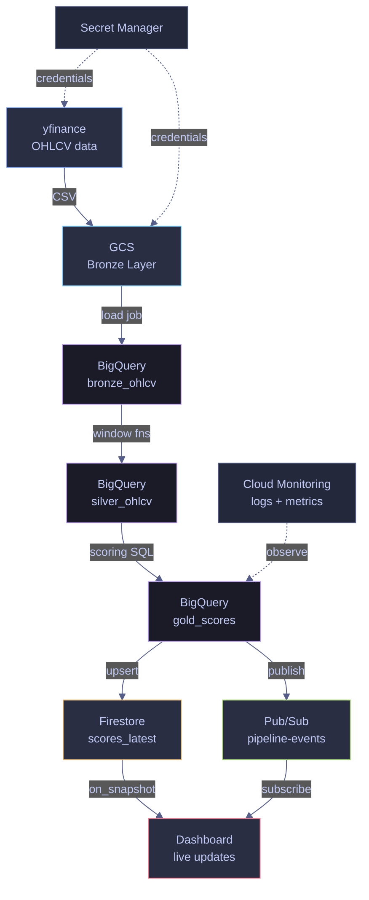

# 17. GCP - C#


> [!quote]
> "Everything fails all the time, so plan for failure and nothing fails."
>
> — **Werner Vogels**, CTO of Amazon

This note covers the Google Cloud Platform .NET SDK — authentication, Cloud Storage, BigQuery, Pub/Sub, Firestore, Secret Manager, and Cloud Monitoring — with executable examples. Every concept is paired with its Python equivalent in [[17-py-gcp]].

### Key terms used in this note

| Term | Plain-English definition | Why it matters here | Common mistake / confusion |
|---|---|---|---|
| **ADC (Application Default Credentials)** | `GoogleCredential.GetApplicationDefault()` — auto-discovers credentials from env vars, gcloud CLI, or metadata server. | Zero-config auth in GCP environments. | Setting `GOOGLE_APPLICATION_CREDENTIALS` to a non-existent path — silent auth failures. |
| **StorageClient** | `Google.Cloud.Storage.V1` client for Cloud Storage operations. | Upload, download, list objects in GCS buckets. | Client is thread-safe — create once and reuse, don't create per-request. |
| **BigQueryClient** | `Google.Cloud.BigQuery.V2` client for BigQuery operations. | Run SQL queries, load data, manage tables. | `ExecuteQuery` is synchronous — use `CreateQueryJob` for long-running queries. |
| **PublisherClient** | `Google.Cloud.PubSub.V1` async publisher. Created with `CreateAsync()`. | Publish messages to Pub/Sub topics. | `PublisherClient` batches messages internally — call `ShutdownAsync()` to flush. |
| **FirestoreDb** | `Google.Cloud.Firestore` client for Firestore document operations. | Pipeline metadata, config state, operational data. | Firestore has a 1MB document size limit and 500 writes/sec per document. |
| **SecretManagerServiceClient** | `Google.Cloud.SecretManager.V1` client for reading secrets. | API keys, database passwords — never hardcode. | Access secrets at runtime, not at static initialization — supports rotation. |

### What this note covers

- **Authentication & Setup** — ADC, service accounts, credential configuration
- **Cloud Storage** — upload, download, list with `StorageClient`
- **BigQuery** — query, load, streaming insert with `BigQueryClient`
- **Pub/Sub** — publish/subscribe with `PublisherClient`/`SubscriberClient`
- **Firestore** — documents, collections, batch writes
- **Secret Manager** — read secrets with `SecretManagerServiceClient`
- **Cloud Monitoring** — custom metrics and structured logging

## How the Pipeline Works

The index ETL pipeline moves market data through three layers — Bronze (raw), Silver (cleaned), Gold (scored) — using GCP-managed services at each stage. Secret Manager and Cloud Monitoring are cross-cutting concerns that apply throughout.



## Topics Covered
- Authentication & Setup
- Cloud Storage (GCS)
- BigQuery
- Pub/Sub
- Firestore (+ real-time listeners)
- Secret Manager
- Cloud Monitoring

## Authentication & Setup

**Pipeline role:** The foundation — every GCP service call is authenticated via a service account key. The key file (JSON) is set via `GOOGLE_APPLICATION_CREDENTIALS` env var. All `Google.Cloud.*` libraries auto-detect it via the ADC (Application Default Credentials) chain: env var → `gcloud auth` → metadata server.

### NuGet packages and warning suppression

Run this cell once before any others. It installs all required GCP SDK NuGet packages and suppresses CS1701/CS1702 assembly version warnings — these appear because packages targeting .NET 8/9 report version mismatches on .NET 10, but are harmless. The warning suppression uses reflection to set the internal `_scriptOptions.WarningLevel` to 0 on the .NET Interactive kernel.

```csharp
using System.Reflection;
using Microsoft.DotNet.Interactive;
using Microsoft.DotNet.Interactive.CSharp;

#r "nuget: Google.Cloud.BigQuery.V2"
#r "nuget: Google.Cloud.Firestore"
#r "nuget: Google.Cloud.Monitoring.V3"
#r "nuget: Google.Cloud.PubSub.V1"
#r "nuget: Google.Cloud.SecretManager.V1"
#r "nuget: Google.Cloud.Storage.V1"
#r "nuget: Microsoft.Bcl.AsyncInterfaces"
using Google.Api;
using Google.Apis.Auth.OAuth2;
using Google.Cloud.BigQuery.V2;
using Google.Cloud.Firestore;
using Google.Cloud.Monitoring.V3;
using Google.Cloud.PubSub.V1;
using Google.Cloud.SecretManager.V1;
using Google.Cloud.Storage.V1;
using Google.Protobuf.WellKnownTypes;
using Google.Protobuf;
using System.IO;
using System.Net.Http.Headers;
using System.Net.Http;
using System.Text.Json;
using System.Text;
var csharpKernel = (CSharpKernel)Kernel.Root.FindKernelByName("csharp");
var optionsField = typeof(CSharpKernel).GetField("_scriptOptions",
    BindingFlags.NonPublic | BindingFlags.Instance);

var scriptOptions = optionsField.GetValue(csharpKernel);
var withWarningLevel = scriptOptions.GetType().GetMethod("WithWarningLevel");
var newOptions = withWarningLevel.Invoke(scriptOptions, new object[] { 0 });
optionsField.SetValue(csharpKernel, newOptions);
```

```text
WarningLevel set to 0 — CS1701/CS1702 warnings suppressed.
```

### Connect and verify credentials

`GoogleCredential.GetApplicationDefault()` reads the ADC chain and returns whichever credential is available: a service account key (when `GOOGLE_APPLICATION_CREDENTIALS` is set), user credentials from `gcloud auth application-default login`, or the GCE metadata server inside Cloud Run / GKE. Checking `.UnderlyingCredential.GetType().Name` confirms which source was used.

```csharp
var projectId = "index-lab-2";
var region = "europe-west1";
var bucketName = $"{projectId}-index-data";
var bqDataset = "index_data";

var creds = GoogleCredential.GetApplicationDefault();
Console.WriteLine(creds.UnderlyingCredential.GetType().Name);  // credential type
Console.WriteLine(projectId);   // project
Console.WriteLine(bucketName);  // bucket
```

```text
UserCredential
index-lab-2
index-lab-2-index-data
```

## Cloud Storage (GCS)

**Pipeline role: BRONZE LAYER** — Raw data lands here first. yfinance OHLCV data is fetched and uploaded as CSV to `gs://bucket/bronze/ohlcv/`. GCS is the data lake — immutable, versioned, cheap storage. Downstream services (BigQuery, pipelines) read from here. For the CLI equivalents of these operations (`gsutil`, `gcloud storage`, lifecycle policies), see [gcs-object-operations](https://alp78.github.io/elysium/06-GCP/Storage/gcs-object-operations).

`StorageClient.Create()` authenticates via the ADC chain and returns a client scoped to the project. All object operations go through this single client instance.

### Object operations

#### Create the GCS client

`StorageClient.Create()` reads credentials from the ADC chain (same as `GoogleCredential.GetApplicationDefault()`). The client is thread-safe and should be reused across operations.

```csharp
var storageClient = StorageClient.Create();
```

#### List objects in a prefix

`ListObjects(bucket, prefix)` returns a lazy `IEnumerable<Google.Apis.Storage.v1.Data.Object>` — it pages through results automatically. Prefixes simulate folder hierarchy in GCS's flat namespace.

```csharp
foreach (var obj in storageClient.ListObjects(bucketName, "bronze/"))
    Console.WriteLine($"  {obj.Name,-50} {obj.Size,10:N0} bytes");
```

```text
  bronze/.keep                                                0 bytes
  bronze/ohlcv/20260322_ohlcv.csv                        35,426 bytes
```

#### Upload an object from a stream

`UploadObject(bucket, objectName, contentType, stream)` writes a stream to GCS. Passing a `MemoryStream` avoids writing a temp file. The object name becomes the full blob path including any prefix.

```csharp
var csvContent = "symbol,date,close\nASML.AS,2026-03-20,685.40\nMC.PA,2026-03-20,890.20";
var csvBytes = Encoding.UTF8.GetBytes(csvContent);
var blobName = $"bronze/ohlcv/{DateTime.Now:yyyyMMdd}_test_cs.csv";

using var stream = new MemoryStream(csvBytes);
storageClient.UploadObject(bucketName, blobName, "text/csv", stream);
Console.WriteLine($"  Uploaded: gs://{bucketName}/{blobName} ({csvBytes.Length} bytes)");
```

```text
  Uploaded: gs://index-lab-2-index-data/bronze/ohlcv/20260322_test_cs.csv (67 bytes)
```

#### Download an object to a stream

`DownloadObject(bucket, objectName, stream)` writes the blob content into any writable `Stream`. Reading from a `MemoryStream` after download gives you the raw bytes without touching the filesystem.

```csharp
using var ms = new MemoryStream();
storageClient.DownloadObject(bucketName, blobName, ms);
var downloaded = Encoding.UTF8.GetString(ms.ToArray());
Console.WriteLine($"  Downloaded ({ms.Length} bytes):");
foreach (var line in downloaded.Split('\n'))
    Console.WriteLine($"    {line}");
```

```text
  Downloaded (67 bytes):
    symbol,date,close
    ASML.AS,2026-03-20,685.40
    MC.PA,2026-03-20,890.20
```

#### Delete an object

`DeleteObject(bucket, objectName)` removes a single blob. In production, bronze-layer data is kept immutable — only delete test or staging objects.

```csharp
storageClient.DeleteObject(bucketName, blobName);
Console.WriteLine($"  Deleted: {blobName}");
```

```text
  Deleted: bronze/ohlcv/20260322_test_cs.csv
```

## BigQuery

**Pipeline role: SILVER + GOLD LAYERS** — The analytics engine. Bronze data loaded from GCS is queried with SQL window functions to produce daily returns (silver) and composite momentum scores (gold). BigQuery is serverless — no cluster to manage, queries scale automatically.

`BigQueryClient.Create(projectId)` authenticates via ADC and targets the specified project. All query and load operations use this client. The Python equivalent is `bigquery.Client(project=PROJECT_ID)`.

> [!info] C# notebook shows read-only queries
> This notebook reads from tables pre-populated by the Python pipeline run. Loading data and running transform jobs (silver/gold SQL) is demonstrated in the Python file. In a production C# service you would use `bqClient.CreateLoadJob()` and `bqClient.CreateQueryJob()` for the full ETL flow.

### Execute SQL queries

#### Create the BigQuery client

`BigQueryClient.Create(projectId)` returns a client that wraps the BigQuery REST API. It authenticates via the same ADC chain as all other Google Cloud clients.

```csharp
var bqClient = BigQueryClient.Create(projectId);
```

#### Query the bronze OHLCV table

`ExecuteQuery(sql, parameters)` runs a synchronous query and returns a `BigQueryResults` — an `IEnumerable<BigQueryRow>` that pages results automatically. Row values are accessed by column name as `object` and must be cast or formatted explicitly.

```csharp
var sql = $@"
    SELECT symbol, date, ROUND(close, 2) AS close, volume
    FROM `{projectId}.{bqDataset}.bronze_ohlcv`
    ORDER BY date DESC, symbol
    LIMIT 10";

var results = bqClient.ExecuteQuery(sql, parameters: null);
Console.WriteLine($"{"Symbol",-10} {"Date",-12} {"Close",10} {"Volume",14}");
Console.WriteLine(new string('─', 50));
foreach (var row in results)
    Console.WriteLine($"  {row["symbol"],-10} {row["date"],-12} {row["close"],10} {row["volume"],14}");
```

```text
Symbol     Date              Close         Volume
──────────────────────────────────────────────────
  ASML.AS    20-Mar-26 0:00:00     1128.2        2685518
  MC.PA      20-Mar-26 0:00:00     457.95        1359678
  SAP.DE     20-Mar-26 0:00:00     153.82        9371857
  SIE.DE     20-Mar-26 0:00:00     203.75        3770741
  TTE.PA     20-Mar-26 0:00:00      76.96       13084381
  ASML.AS    19-Mar-26 0:00:00     1168.6        1057331
  MC.PA      19-Mar-26 0:00:00     460.25         772011
  SAP.DE     19-Mar-26 0:00:00        160        3819500
  SIE.DE     19-Mar-26 0:00:00      210.3        2407185
  TTE.PA     19-Mar-26 0:00:00      78.59       13162837
```

#### Query the gold scores table

The gold layer holds one row per ticker with pre-computed momentum scores and composite rankings. This query reads the final pipeline output — the same data written to Firestore for dashboard access.

```csharp
var goldSql = $@"
    SELECT symbol, ROUND(close, 2) AS close,
        ROUND(momentum_score * 100, 2) AS momentum_pct,
        ROUND(volume_score, 2) AS vol_ratio,
        composite_rank
    FROM `{projectId}.{bqDataset}.gold_scores`
    ORDER BY composite_rank";

foreach (var row in bqClient.ExecuteQuery(goldSql, parameters: null))
    Console.WriteLine($"  {row["composite_rank"],2}. {row["symbol"],-10} close={row["close"],8}  momentum={row["momentum_pct"],+6}%  vol={row["vol_ratio"]}");
```

```text
   1. TTE.PA     close=   76.96  momentum= 12.82%  vol=1.61
   2. ASML.AS    close=  1128.2  momentum= -6.15%  vol=3.01
   3. SAP.DE     close=  153.82  momentum=  -8.7%  vol=2.84
   4. MC.PA      close=  457.95  momentum= -10.9%  vol=1.97
   5. SIE.DE     close=  203.75  momentum=-13.24%  vol=2.33
```

## Pub/Sub

**Pipeline role: EVENT BUS** — Decouples pipeline steps. After each ETL stage completes, a message is published ("ohlcv_loaded", "silver_computed", "gold_scored"). Downstream consumers (dashboards, alerting, other pipelines) subscribe to these events. Enables async, event-driven architecture. For topic/subscription management and dead-letter configuration via `gcloud`, see [pubsub-messaging](https://alp78.github.io/elysium/06-GCP/Serverless/pubsub-messaging).

Messages are published to **topics** (named channels) and consumed via **subscriptions** (pull or push). Each message carries a `ByteString` payload plus optional string attributes. Messages must be acknowledged after processing — unacknowledged messages are redelivered after the ack deadline.

### Publish and pull messages

#### Publish pipeline events

`PublisherClient.CreateAsync(topicName)` creates a batching, async publisher that buffers messages and sends them in batches for throughput. Each `PublishAsync` call returns the server-assigned `messageId`. Call `ShutdownAsync` to flush pending messages before the client goes out of scope.

```csharp
var topicName = TopicName.FromProjectTopic(projectId, "pipeline-events");
var subName = SubscriptionName.FromProjectSubscription(projectId, "pipeline-events-sub");

var publisher = await PublisherClient.CreateAsync(topicName);

var events = new[] { "ohlcv_loaded_cs", "silver_computed_cs", "gold_scored_cs" };
foreach (var evt in events)
{
    var msgId = await publisher.PublishAsync(new PubsubMessage
    {
        Data = ByteString.CopyFromUtf8($"{{\"event\": \"{evt}\", \"source\": \"csharp\"}}"),
        Attributes = { ["pipeline"] = "index_etl" }
    });
    Console.WriteLine($"  Published: {evt} (msg_id={msgId})");
}
await publisher.ShutdownAsync(TimeSpan.FromSeconds(5));
await Task.Delay(2000);  // allow messages to propagate
```

```text
  Published: ohlcv_loaded_cs (msg_id=18105610464022399)
  Published: silver_computed_cs (msg_id=18105731398234272)
  Published: gold_scored_cs (msg_id=18105493728682506)
```

#### Pull and acknowledge messages

`SubscriberServiceApiClient` performs synchronous batch pulls — suited for scripts and notebooks. In production services use `SubscriberClient` for streaming pull, which manages ack deadlines automatically. Messages must be acknowledged via their `AckId` or they will be redelivered.

```csharp
var subscriber = SubscriberServiceApiClient.Create();
var response = subscriber.Pull(subName, maxMessages: 10);

var ackIds = new List<string>();
foreach (var msg in response.ReceivedMessages)
{
    var data = msg.Message.Data.ToStringUtf8();
    Console.WriteLine($"  {msg.Message.PublishTime:HH:mm:ss} | {data}");
    ackIds.Add(msg.AckId);
}

if (ackIds.Count > 0)
{
    subscriber.Acknowledge(subName, ackIds);
    Console.WriteLine($"\n  Acknowledged {ackIds.Count} messages");
}
```

```text
  13:37:42 | {"event": "ohlcv_loaded_cs", "source": "csharp"}
  13:37:42 | {"event": "silver_computed_cs", "source": "csharp"}
  13:37:42 | {"event": "gold_scored_cs", "source": "csharp"}

  Acknowledged 3 messages
```

## Firestore

**Pipeline role: REAL-TIME LAYER** — The live dashboard backend. Gold scores and pulse snapshots are written here for instant access. Firestore supports real-time listeners — dashboards get push notifications when data changes, without polling. Think of it as the "hot" layer vs BigQuery's "warm" layer.

Data is organized into **collections** (groups of documents) containing **documents** (JSON-like records). `FirestoreDb.Create(projectId)` returns the SDK client. `SetAsync` upserts a document — it creates or overwrites the entire document atomically.

> [!bug] .NET 10 SDK read and listener incompatibility
> `FirestoreDb` SDK reads (`.GetSnapshotAsync()`) and real-time listeners (`.Listen()`) hit a missing assembly exception on .NET 10 Interactive due to a `Microsoft.Bcl.AsyncInterfaces` version conflict. Writes via `SetAsync` and `DeleteAsync` work correctly.

> [!success] Workaround: Firestore REST API for reads
> Use the Firestore REST API directly with an OAuth2 bearer token obtained via `GoogleCredential.GetApplicationDefault()`. SDK reads and listeners work correctly in .NET 8/9 projects — this workaround is only needed in .NET Interactive on .NET 10.

### Write and read documents

#### Write documents with SetAsync

`SetAsync(data)` upserts the document — if it exists, all fields are replaced. Use `UpdateAsync` to merge only specific fields. `Timestamp.GetCurrentTimestamp()` writes a server-side Firestore timestamp.

```csharp
var firestoreDb = FirestoreDb.Create(projectId);

var scores = new[]
{
    new { Symbol = "ASML.AS", Close = 685.40, Rank = 1 },
    new { Symbol = "MC.PA",   Close = 890.20, Rank = 2 },
    new { Symbol = "SAP.DE",  Close = 245.80, Rank = 3 },
};

foreach (var s in scores)
{
    var docRef = firestoreDb.Collection("scores_latest_cs").Document(s.Symbol);
    await docRef.SetAsync(new Dictionary<string, object>
    {
        ["symbol"] = s.Symbol,
        ["close"] = s.Close,
        ["composite_rank"] = s.Rank,
        ["updated_at"] = Timestamp.GetCurrentTimestamp(),
    });
}
Console.WriteLine($"  Written {scores.Length} documents");
```

```text
  Written 3 documents
```

#### Read a collection via the REST API

Obtain an OAuth2 token scoped to `datastore` and call the Firestore REST endpoint directly. The response is standard JSON — parse with `JsonDocument` and navigate the typed-value structure (`doubleValue`, `stringValue`, etc.) that Firestore REST uses.

```csharp
var credential = Google.Apis.Auth.OAuth2.GoogleCredential.GetApplicationDefault()
    .CreateScoped("https://www.googleapis.com/auth/datastore");
var token = await credential.UnderlyingCredential.GetAccessTokenForRequestAsync();

var httpClient = new HttpClient();
httpClient.DefaultRequestHeaders.Authorization = new AuthenticationHeaderValue("Bearer", token);

var restUrl = $"https://firestore.googleapis.com/v1/projects/{projectId}/databases/(default)/documents/pulse_live";
var response = await httpClient.GetAsync(restUrl);
var jsonDoc = JsonDocument.Parse(await response.Content.ReadAsStringAsync());

if (!jsonDoc.RootElement.TryGetProperty("documents", out var documents))
{
    Console.WriteLine("  No pulse data yet. Run: python pulse_scheduler.py --once");
}
else
{
    foreach (var fdoc in documents.EnumerateArray())
    {
        var symbol = fdoc.GetProperty("name").GetString().Split("/")[^1];
        var fields = fdoc.GetProperty("fields");

        var price = fields.TryGetProperty("current_price", out var pv)
            ? pv.GetProperty("doubleValue").GetDouble().ToString("F2") : "N/A";
        var chgPct = fields.TryGetProperty("price_change_pct", out var cv)
            ? (double?)cv.GetProperty("doubleValue").GetDouble() : null;
        var chgStr = chgPct.HasValue ? string.Format("{0:+0.00}%", chgPct.Value) : "N/A";

        Console.WriteLine($"  {symbol,-10}  price={price,10}  change={chgStr,8}");
    }
}

foreach (var s in scores)
    await firestoreDb.Collection("scores_latest_cs").Document(s.Symbol).DeleteAsync();
Console.WriteLine($"\n  Cleaned up {scores.Length} score documents");
```

```text
  ASML.AS     price=   1128.20  change=  -3.46%
  MC.PA       price=    457.95  change=  -0.50%
  SAP.DE      price=    153.82  change=  -3.86%
  SIE.DE      price=    203.75  change=  -3.11%
  TTE.PA      price=     76.96  change=  -2.07%

  Cleaned up 3 score documents
```

### Poll for live updates via REST

#### Poll pulse_live on an interval

Because `Listen()` is unavailable on .NET 10 Interactive, polling simulates real-time awareness. Each poll fetches the full collection and compares prices against the previous poll to detect `NEW` / `CHANGED` / `UNCHANGED` states. In a .NET 8/9 project, replace this with `firestoreDb.Collection("pulse_live").Listen(snapshot => { ... })` for true push delivery.

```csharp
var cred = Google.Apis.Auth.OAuth2.GoogleCredential.GetApplicationDefault()
    .CreateScoped("https://www.googleapis.com/auth/datastore");
var accessToken = await cred.UnderlyingCredential.GetAccessTokenForRequestAsync();

var client = new HttpClient();
client.DefaultRequestHeaders.Authorization = new AuthenticationHeaderValue("Bearer", accessToken);
var apiUrl = $"https://firestore.googleapis.com/v1/projects/{projectId}/databases/(default)/documents/pulse_live";

Console.WriteLine("Polling pulse_live every 30s for 2 minutes...\n");
var previousPrices = new Dictionary<string, string>();
var pollCount = 0;

for (int i = 0; i < 4; i++)
{
    pollCount++;
    var parsed = JsonDocument.Parse(await (await client.GetAsync(apiUrl)).Content.ReadAsStringAsync());
    Console.WriteLine($"[Poll #{pollCount} at {DateTime.Now:HH:mm:ss}]");

    if (parsed.RootElement.TryGetProperty("documents", out var docs))
    {
        foreach (var fdoc in docs.EnumerateArray())
        {
            var sym = fdoc.GetProperty("name").GetString().Split("/")[^1];
            var fields = fdoc.GetProperty("fields");

            var priceStr = fields.TryGetProperty("current_price", out var pv)
                ? pv.GetProperty("doubleValue").GetDouble().ToString("F2") : "N/A";
            var change = fields.TryGetProperty("price_change_pct", out var cv)
                ? (double?)cv.GetProperty("doubleValue").GetDouble() : null;

            var status = !previousPrices.ContainsKey(sym) ? "NEW"
                : previousPrices[sym] != priceStr ? "CHANGED" : "UNCHANGED";
            previousPrices[sym] = priceStr;

            var chgStr = change.HasValue ? string.Format("{0:+0.00}%", change.Value) : "N/A";
            Console.WriteLine($"  [{status,-9}] {sym,-10}  price={priceStr,10}  change={chgStr,8}");
        }
    }
    if (i < 3) { Console.WriteLine("  Next poll in 30s...\n"); await Task.Delay(30_000); }
}
Console.WriteLine($"\nPolling complete. {pollCount} polls, {previousPrices.Count} tickers tracked.");
```

```text
Polling pulse_live every 30s for 2 minutes...

[Poll #1 at 14:38:00]
  [NEW      ] ASML.AS     price=   1128.20  change=  -3.46%
  [NEW      ] MC.PA       price=    457.95  change=  -0.50%
  [NEW      ] SAP.DE      price=    153.82  change=  -3.86%
  [NEW      ] SIE.DE      price=    203.75  change=  -3.11%
  [NEW      ] TTE.PA      price=     76.96  change=  -2.07%
  Next poll in 30s...

[Poll #2 at 14:38:30]
  [UNCHANGED] ASML.AS     price=   1128.20  change=  -3.46%
  [UNCHANGED] MC.PA       price=    457.95  change=  -0.50%
  [UNCHANGED] SAP.DE      price=    153.82  change=  -3.86%
  [UNCHANGED] SIE.DE      price=    203.75  change=  -3.11%
  [UNCHANGED] TTE.PA      price=     76.96  change=  -2.07%
  Next poll in 30s...

[Poll #3 at 14:39:00]
  [UNCHANGED] ASML.AS     price=   1128.20  change=  -3.46%
  [UNCHANGED] MC.PA       price=    457.95  change=  -0.50%
  [UNCHANGED] SAP.DE      price=    153.82  change=  -3.86%
  [UNCHANGED] SIE.DE      price=    203.75  change=  -3.11%
  [UNCHANGED] TTE.PA      price=     76.96  change=  -2.07%
  Next poll in 30s...

[Poll #4 at 14:39:30]
  [UNCHANGED] ASML.AS     price=   1128.20  change=  -3.46%
  [UNCHANGED] MC.PA       price=    457.95  change=  -0.50%
  [UNCHANGED] SAP.DE      price=    153.82  change=  -3.86%
  [UNCHANGED] SIE.DE      price=    203.75  change=  -3.11%
  [UNCHANGED] TTE.PA      price=     76.96  change=  -2.07%

Polling complete. 4 polls, 5 tickers tracked.
```

## Secret Manager

**Pipeline role: CREDENTIAL VAULT** — All secrets (DB passwords, API keys, connection strings) live here. Pipeline code retrieves them at runtime — never hardcoded, never in git. Supports versioning and rotation. In production, Cloud Run and GKE inject secrets automatically.

A **secret** is a named container. Each update creates a new immutable **version** — old versions can be disabled or destroyed for rotation. `SecretManagerServiceClient.Create()` authenticates via ADC.

> [!info] Secret lifecycle not shown in C#
> This notebook demonstrates read and list only. Creating secrets, adding versions, and deleting secrets is demonstrated in the Python file — the API structure is identical (`CreateSecret`, `AddSecretVersion`, `DeleteSecret`).

### Read and list secrets

#### Read the latest version of a secret

`AccessSecretVersion(name)` fetches the secret payload for a specific version. Using `versions/latest` always retrieves the current active version. The response payload is a `ByteString` — call `.ToStringUtf8()` to decode. Never print or log raw secret values.

```csharp
var smClient = SecretManagerServiceClient.Create();

foreach (var secretId in new[] { "index-db-password", "index-api-key" })
{
    var name = $"projects/{projectId}/secrets/{secretId}/versions/latest";
    var response = smClient.AccessSecretVersion(name);
    var value = response.Payload.Data.ToStringUtf8();
    var masked = value[..3] + new string('*', value.Length - 3);
    Console.WriteLine($"  {secretId}: {masked}");
}
```

```text
  index-db-password: Esg************
  index-api-key: dem***************
```

#### List all secrets in the project

`ListSecrets` returns a lazy paginated enumerable of `Secret` objects. Each `Secret` has a `SecretName` property that parses the resource path — use `.SecretId` to extract just the name.

```csharp
foreach (var secret in smClient.ListSecrets(new Google.Cloud.SecretManager.V1.ListSecretsRequest { Parent = $"projects/{projectId}" }))
    Console.WriteLine($"  {secret.SecretName.SecretId}");
```

```text
  index-api-key
  index-db-password
```

## Cloud Monitoring

**Pipeline role: OBSERVABILITY** — Two components: Cloud Logging (structured log entries for every pipeline event) and Cloud Monitoring (custom metrics for quantitative KPIs). Enables alerting ("pipeline failed", "row count dropped 50%"), dashboards, and post-mortem debugging.

Custom metrics are written as **time series** — a metric type identifier, a monitored resource (e.g., `global`), and one or more `Point` values with timestamps. Data appears in Metrics Explorer within ~60 seconds of writing.

> [!info] Cloud Logging not shown in C#
> Writing structured log entries via the Cloud Logging SDK (`Google.Cloud.Logging.V2`) is demonstrated in the Python file. The C# equivalent is `LoggingServiceV2Client` with `WriteLogEntries`. This notebook focuses on custom metrics only.

### Write custom metrics

#### Write a data point to a custom metric

`CreateTimeSeries` writes one or more time series points to Cloud Monitoring. The metric type string must follow the `custom.googleapis.com/` prefix convention. Cloud Monitoring can return transient `Internal` gRPC errors — a retry loop with backoff handles these gracefully.

```csharp
var metricClient = MetricServiceClient.Create();
var projectName = $"projects/{projectId}";

var now = DateTimeOffset.UtcNow;
var timeSeries = new TimeSeries
{
    Metric = new Google.Api.Metric
    {
        Type = "custom.googleapis.com/index_pipeline/rows_loaded",
    },
    Resource = new MonitoredResource { Type = "global" },
};
timeSeries.Points.Add(new Point
{
    Interval = new TimeInterval
    {
        EndTime = Google.Protobuf.WellKnownTypes.Timestamp.FromDateTimeOffset(now),
    },
    Value = new TypedValue { Int64Value = 250 },
});

for (int attempt = 1; attempt <= 3; attempt++)
{
    try
    {
        metricClient.CreateTimeSeries(projectName, new[] { timeSeries });
        break;
    }
    catch (Grpc.Core.RpcException ex) when (ex.StatusCode == Grpc.Core.StatusCode.Internal && attempt < 3)
    {
        Console.WriteLine($"  Retry {attempt}/3: {ex.Status.Detail[..50]}...");
        await Task.Delay(3000 * attempt);
    }
}
Console.WriteLine("  Wrote metric: rows_loaded = 250");
Console.WriteLine($"  Logs:    https://console.cloud.google.com/logs?project={projectId}");
Console.WriteLine($"  Metrics: https://console.cloud.google.com/monitoring/metrics-explorer?project={projectId}");
```

```text
  Wrote metric: rows_loaded = 250
  Logs:    https://console.cloud.google.com/logs?project=index-lab-2
  Metrics: https://console.cloud.google.com/monitoring/metrics-explorer?project=index-lab-2
```

## Summary

> [!abstract]- GCP C# Quick Reference
>
> | Service | Pattern | Description |
> |---|---|---|
> | **Auth** | `GoogleCredential.GetApplicationDefault()` | Auto-detect ADC |
> | **GCS** | `StorageClient.Create()` | Create client |
> | **GCS** | `client.UploadObject(bucket, name, type, stream)` | Upload |
> | **GCS** | `client.DownloadObject(bucket, name, stream)` | Download |
> | **BigQuery** | `BigQueryClient.Create(projectId)` | Create client |
> | **BigQuery** | `client.ExecuteQuery(sql, params)` | Run SQL |
> | **BigQuery** | `client.InsertRows(datasetId, tableId, rows)` | Insert rows |
> | **Pub/Sub** | `PublisherClient.CreateAsync(topicName)` | Create publisher |
> | **Pub/Sub** | `publisher.PublishAsync(message)` | Publish |
> | **Firestore** | `FirestoreDb.Create(projectId)` | Create client |
> | **Firestore** | `collection.Document(id).SetAsync(data)` | Write document |
> | **Secrets** | `client.AccessSecretVersion(name)` | Read secret |
> | **Monitoring** | `client.CreateTimeSeries(project, timeSeries)` | Write metric |
>
> **Python equivalents:** `StorageClient` → `storage.Client()` | `BigQueryClient` → `bigquery.Client()` | `PublisherClient` → `pubsub_v1.PublisherClient()` | `FirestoreDb` → `firestore.Client()`

## Warnings

> [!warning] BigQuery charges by bytes scanned
>
> `SELECT *` on a large table scans everything and bills per-TB. A single careless query can cost hundreds of dollars.

> [!success] Correct pattern
>
> Select only needed columns. Use partitioned/clustered tables. Set `MaximumBytesBilled` to cap query cost.

> [!warning] `PublisherClient` batches internally — data loss on crash
>
> Messages are buffered in memory. If the process crashes before `ShutdownAsync()`, buffered messages are lost.

> [!success] Correct pattern
>
> Always call `await publisher.ShutdownAsync(TimeSpan.FromSeconds(15))` in a `finally` block or `IAsyncDisposable`.

## Recommendations

- **Use ADC for authentication** — `GoogleCredential.GetApplicationDefault()` works everywhere: local dev, GKE, Cloud Run.
- **Create GCP clients once and reuse** — they are thread-safe and manage connection pools internally.
- **Use `SecretManagerServiceClient` for all secrets** — never hardcode credentials in source code or config files.
- **Use partitioned BigQuery tables** — reduces scan scope and query cost.
- **Call `ShutdownAsync()` on `PublisherClient`** — flushes buffered messages before process exit.

## Troubleshooting

| Problem | Cause | Fix |
|---|---|---|
| `InvalidOperationException: The Application Default Credentials are not available` | No ADC configured | Run `gcloud auth application-default login` or set `GOOGLE_APPLICATION_CREDENTIALS` |
| BigQuery `403 Access Denied` | Service account lacks BigQuery permissions | Grant `roles/bigquery.dataEditor` or `roles/bigquery.jobUser` |
| Pub/Sub messages lost on shutdown | `PublisherClient` not flushed | Call `await publisher.ShutdownAsync(timeout)` |
| Firestore `PermissionDenied` | Missing Firestore IAM role | Grant `roles/datastore.user` to the service account |
| Secret Manager `NotFound` | Wrong secret name or version | Check `projects/{project}/secrets/{name}/versions/latest` format |

## Cross-References

- **Python equivalent** — [[17-py-gcp]] covers the same GCP services with Python client libraries
- **Database** — [[16-cs-database]] covers SQL database access patterns
- **Async** — [[12-cs-asyncconcurrency]] covers async patterns used in GCP client operations
- **Error handling** — [[08-cs-errorhandling]] covers retry and exception patterns for cloud operations
