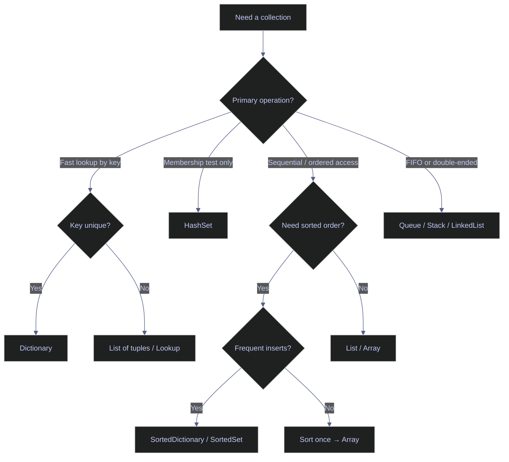

# 19. Performance & Code Quality — C#

> [!quote]
> "Make it correct, make it clear, make it concise, make it fast. In that order."
>
> — **Wes Dyer**, blog post (2007)

This note is the C# reference for performance measurement and code quality tooling. The Python counterpart covering `timeit`, `cProfile`, `tracemalloc`, `ruff`, and `mypy` is [[19-py-performance-quality]].

### Key terms used in this note

| Term | Plain-English definition | Why it matters here | Common mistake / confusion |
|---|---|---|---|
| `Stopwatch` | .NET class wrapping the OS high-resolution performance counter | Correct tool for ad-hoc elapsed-time measurement with nanosecond resolution | Using `DateTime.Now` — ~15 ms resolution on Windows and affected by NTP/DST |
| `BenchmarkDotNet` | NuGet library for production-grade micro-benchmarks that control JIT warm-up and GC | Produces statistically reliable comparisons between candidate implementations | Running benchmarks in Debug mode — JIT optimizations are suppressed, results are not representative |
| `Span<T>` | Ref struct providing a type-safe view over a contiguous memory region without allocation | Eliminates heap allocations when slicing strings, arrays, or stack-allocated buffers | Using `Span<T>` as a field in a class — ref structs cannot live on the heap |
| `stackalloc` | Keyword that allocates a fixed-size block on the stack rather than the heap | Avoids GC pressure for small, short-lived buffers | Allocating too large a block — stack is limited (~1 MB default); prefer ≤ 512 bytes |
| `GC.GetTotalMemory()` | Returns approximate managed heap bytes currently allocated | Quick snapshot for before/after comparisons in tests | The `forceFullCollection` parameter triggers a blocking GC — avoid in production paths |
| Nullable Reference Types (NRT) | Compiler feature (C# 8+) that treats all reference types as non-nullable by default | Turns null-dereference bugs into compile-time warnings | Enabling NRT without fixing warnings — suppressing with `!` operator negates the benefit |
| Roslyn Analyzers | Static analysis rules embedded in the C# compiler SDK | Enforce correctness, performance, and security patterns during build | Treating analyzer warnings as informational — upgrade to errors in CI via `<TreatWarningsAsErrors>` |
| LINQ deferred execution | LINQ queries are not evaluated until enumerated; each enumeration re-runs the query | Avoids unnecessary work when a query is never consumed | Enumerating the same IEnumerable twice — runs the query twice; materialize with `.ToList()` first |
| `ArrayPool<T>` | Framework pool of reusable arrays that avoids repeated heap allocations | Eliminates large-array GC pressure in high-throughput paths | Forgetting to return the array with `ArrayPool<T>.Shared.Return()` — causes pool exhaustion |
| `Memory<T>` | Heap-safe counterpart to `Span<T>` that can be stored in fields and used in async methods | Enables zero-copy slicing across await points where `Span<T>` is forbidden | Confusing `Memory<T>` with `Span<T>` — `Memory<T>` adds an indirection layer and is slower |
| `dotnet-trace` | Cross-platform CLI profiling tool producing `.nettrace` files for PerfView or SpeedScope | Modern replacement for many PerfView capture scenarios | Running without specifying `--providers` — default providers may miss GC or JIT events |
| `editorconfig` / Roslyn rule IDs | File-based configuration that maps analyzer rule IDs to severity levels | Standardizes code style and correctness rules across the team and CI | Suppressing rules globally in `.editorconfig` without a recorded justification |
| `ObjectPool<T>` | ASP.NET Core / Microsoft.Extensions pool for expensive-to-create objects | Reduces allocation cost for objects like `StringBuilder` in hot paths | Using `ObjectPool<T>` for non-thread-safe objects without synchronization |

### What this note covers

- **Timing & Benchmarking** — `Stopwatch`, `BenchmarkDotNet`, JIT warm-up considerations
- **Memory Measurement** — `GC.GetTotalMemory()`, `GC.Collect()`, `ArrayPool<T>`, `ObjectPool<T>`
- **Span\<T\> & Zero-Allocation Patterns** — `Span<T>`, `Memory<T>`, `stackalloc`, slicing without copies
- **Big-O Complexity & Collection Performance** — per-operation costs for .NET collections
- **Golden Rules of Performance** — measure-first principles and .NET-specific optimization hierarchy
- **Absolute No-Go's** — patterns that reliably destroy C# performance
- **Code Smells & Anti-Patterns** — readability and maintainability red flags
- **Nullable Reference Types & Static Analysis** — NRT, `#nullable enable`, Roslyn Analyzers
- **LINQ Performance Pitfalls** — deferred execution traps, multiple enumeration, `.ToList()` placement
- **Code Quality Tools** — `dotnet format`, `.editorconfig`, `dotnet-trace`, `dotnet-counters`

## Timing & Benchmarking

Accurate measurement is the foundation of every performance improvement. C# provides two tiers of tooling: `Stopwatch` for quick ad-hoc profiling during development, and `BenchmarkDotNet` for production-grade micro-benchmarks that control for JIT warm-up, GC pauses, and hardware timer resolution. Never optimize based on guesswork — always measure first.

### Stopwatch — manual timing

`Stopwatch` wraps the OS high-resolution performance counter (nanosecond resolution on modern hardware). It is the right tool for one-off measurements in development or integration tests. Avoid `DateTime.Now` for benchmarks — its resolution is ~15 ms on Windows and it tracks wall-clock time, which is affected by NTP adjustments and daylight saving transitions.

#### Measure elapsed time with Stopwatch.StartNew

`Stopwatch.StartNew()` creates a new instance and starts it immediately. `sw.Stop()` freezes the counter. `sw.ElapsedMilliseconds` returns a `long` (whole milliseconds); `sw.Elapsed.TotalMilliseconds` returns a `double` with sub-millisecond precision. Call `sw.Restart()` to reset and re-start in one step without allocating a new instance.

```csharp
using System.Diagnostics;
using System.Buffers;

int SlowSum(int n) {
    int total = 0;
    for (int i = 0; i < n; i++) total += i;
    return total;
}

var sw = Stopwatch.StartNew();
var result = SlowSum(1_000_000);
sw.Stop();
Console.WriteLine($"SlowSum(1M): {sw.ElapsedMilliseconds}ms, result={result}");
```

```text
SlowSum(1M): 0ms, result=1783293664
```

#### Measure sub-millisecond intervals with Stopwatch.GetElapsedTime

`Stopwatch.GetTimestamp()` captures the raw hardware counter value as a `long`. `Stopwatch.GetElapsedTime(start)` computes the delta against the current counter and returns a `TimeSpan`. This avoids allocating a `Stopwatch` object and is preferred for hot-path instrumentation where allocation overhead would skew results. Requires .NET 7+.

```csharp
long start = Stopwatch.GetTimestamp();
SlowSum(1_000_000);
var elapsed = Stopwatch.GetElapsedTime(start);
Console.WriteLine($"GetElapsedTime: {elapsed.TotalMilliseconds:F2}ms");
```

```text
GetElapsedTime: 0.46ms
```

#### Reusable timing helper — wrap any delegate with MeasureTime<T>

A generic `MeasureTime<T>` helper wraps any `Func<T>` and prints the label and elapsed time. This is useful for comparing multiple implementations side by side without repeating timing boilerplate. The return value is passed through so the caller can use it.

> [!tip] Define MeasureTime once at the top of the notebook.
>
> It is referenced throughout this file to compare alternatives without cluttering each cell with timing logic.

```csharp
T MeasureTime<T>(Func<T> action, string label = "") {
    var sw = Stopwatch.StartNew();
    var result = action();
    sw.Stop();
    Console.WriteLine($"  [{label}] {sw.Elapsed.TotalMilliseconds:F2}ms");
    return result;
}

MeasureTime(() => Enumerable.Range(0, 100_000).Select(x => x * x).ToList(), "LINQ ToList");
MeasureTime(() => Enumerable.Range(0, 100_000).Select(x => x * x).ToArray(), "LINQ ToArray");
MeasureTime(() => {
    var arr = new int[100_000];
    for (int i = 0; i < arr.Length; i++) arr[i] = i * i;
    return arr;
}, "Manual loop");
```

```text
  [LINQ ToList] 25.93ms
  [LINQ ToArray] 0.47ms
  [Manual loop] 0.19ms
```

`ToList()` allocates a backing array that may be resized during construction. `ToArray()` knows the final size from the source and performs a single allocation. A pre-allocated manual loop bypasses the LINQ pipeline entirely and is fastest.

### Benchmark data structure lookup

The `MeasureTime` helper makes it easy to compare the same logical operation across different data structures. The benchmark below targets membership testing — the operation where collection choice matters most.

#### Benchmark data structure lookup — List, Array, HashSet, Dictionary

`List<T>.Contains` and `Array.IndexOf` are O(n) linear scans that inspect every element until a match is found. `HashSet<T>.Contains` and `Dictionary<K,V>.ContainsKey` are O(1) hash lookups that jump directly to the bucket. For collections of 100K+ elements, hash-based structures are typically 100–1,000× faster when searching for the last element.

```csharp
var data = Enumerable.Range(0, 100_000).ToList();
var dataArr = data.ToArray();
var dataSet = new HashSet<int>(data);
var dataDict = data.ToDictionary(x => x, x => x);

MeasureTime(() => data.Contains(99_999), "List.Contains (O(n))");
MeasureTime(() => Array.IndexOf(dataArr, 99_999) >= 0, "Array.IndexOf (O(n))");
MeasureTime(() => dataSet.Contains(99_999), "HashSet.Contains (O(1))");
MeasureTime(() => dataDict.ContainsKey(99_999), "Dict.ContainsKey (O(1))");
```

```text
  [List.Contains (O(n))] 0.07ms
  [Array.IndexOf (O(n))] 0.14ms
  [HashSet.Contains (O(1))] 0.07ms
  [Dict.ContainsKey (O(1))] 0.04ms
```

## Memory Measurement

Every object allocated on the managed heap adds GC pressure — the garbage collector must eventually reclaim it. Understanding where allocations occur and how much memory different constructs consume is essential for writing low-allocation code. C# exposes `GC.GetTotalMemory()` for managed heap snapshots and tools like dotMemory for deep profiling. The Python equivalents are `sys.getsizeof()` and `tracemalloc`.

### Managed heap allocation measurement

`GC.GetTotalMemory(forceFullCollection: true)` forces a full garbage collection and returns the current managed heap size in bytes. Taking the delta before and after an operation gives the approximate allocation for that operation. It is not perfectly precise — other threads may allocate between measurements — but is accurate enough for comparing approaches.

#### Measure managed heap allocation with GC.GetTotalMemory

The `true` argument triggers a blocking GC before measuring, ensuring prior objects are collected and the baseline is clean. The `false` argument in the "after" measurement avoids collecting newly allocated objects before the delta is computed. The delta represents bytes allocated by the code between the two measurements.

```csharp
GC.Collect();
GC.WaitForPendingFinalizers();
long before = GC.GetTotalMemory(true);

var list = new List<int>(100_000);
for (int i = 0; i < 100_000; i++) list.Add(i);

long after = GC.GetTotalMemory(false);
Console.WriteLine($"List<int>(100K): {(after - before) / 1024.0:F0} KB allocated");

GC.Collect(); before = GC.GetTotalMemory(true);
var arr = new int[100_000];
for (int i = 0; i < arr.Length; i++) arr[i] = i;
after = GC.GetTotalMemory(false);
Console.WriteLine($"int[100K]: {(after - before) / 1024.0:F0} KB allocated");
```

```text
List<int>(100K): 447 KB allocated
int[100K]:       415 KB allocated
```

`List<int>` allocates slightly more than `int[]` because the list maintains a capacity that may exceed the element count — the default growth factor doubles the backing array when capacity is exceeded. A pre-sized `new List<int>(100_000)` avoids resizing but still stores the count, version, and reference to the backing array.

#### Measure string allocation cost — += vs StringBuilder

String concatenation with `+=` is O(n²) in total allocations because every concatenation creates a new immutable string object and copies all prior content. Over 10,000 iterations this produces thousands of temporary strings that the GC must collect. `StringBuilder` maintains a mutable buffer that grows in chunks, producing O(n) total allocations.

```csharp
GC.Collect(); before = GC.GetTotalMemory(true);
string s = "";
for (int i = 0; i < 10_000; i++) s += i.ToString();
after = GC.GetTotalMemory(false);
Console.WriteLine($"String += (10K): {(after - before) / 1024.0:F0} KB");

GC.Collect(); before = GC.GetTotalMemory(true);
var sb = new System.Text.StringBuilder();
for (int i = 0; i < 10_000; i++) sb.Append(i);
string result2 = sb.ToString();
after = GC.GetTotalMemory(false);
Console.WriteLine($"StringBuilder: {(after - before) / 1024.0:F0} KB");
```

```text
String += (10K): 11472 KB
StringBuilder:   180 KB
```

`String +=` allocates 63× more memory than `StringBuilder` for 10,000 concatenations. At 10,000 iterations the string is ~40 KB, so the O(n²) pattern allocates ~11 MB total to build a 40 KB result.

> [!danger] String += in a loop
>
> `String +=` in a loop is O(n²) in both time and allocations. Each concatenation allocates a new string that copies all prior content.

> [!success] Use StringBuilder or string.Create
>
> Use `StringBuilder` for accumulation loops. For known-size interpolations, prefer `string.Create(length, state, spanAction)` (zero-allocation) or `$""` interpolation for simple one-off cases.

### Struct vs class memory layout

Value types (`struct`) are allocated inline — in arrays they are stored contiguously without per-element GC overhead. Reference types (`class`) are allocated on the heap with an object header (8–16 bytes on 64-bit) and a GC tracking entry per instance. For large arrays of small objects, the struct layout can be 3–5× more memory-efficient.

#### Define point types — struct vs class

The two definitions below are used in the following benchmark. They are structurally identical but differ in allocation behaviour: `PointStruct` is a value type (stored inline in arrays), while `PointClass` is a reference type (each element is a separate heap allocation with an object header).

```csharp
struct PointStruct(int x, int y) { public int X = x; public int Y = y; }
class PointClass(int x, int y) { public int X = x; public int Y = y; }
```

#### Compare memory footprint — struct array vs class array

For a `PointStruct[]`, elements are stored contiguously with no per-element object header. For a `PointClass[]`, the array stores references (8 bytes each on 64-bit); each referenced object lives on the heap with an object header (~16 bytes) plus the field data. The GC also tracks each class instance individually.

```csharp
GC.Collect();
long before = GC.GetTotalMemory(true);
var structArr = new PointStruct[100_000];
for (int i = 0; i < structArr.Length; i++) structArr[i] = new PointStruct(i, i);
long after = GC.GetTotalMemory(false);
Console.WriteLine($"PointStruct[100K]: {(after - before) / 1024.0:F0} KB");

GC.Collect();
before = GC.GetTotalMemory(true);
var classArr = new PointClass[100_000];
for (int i = 0; i < classArr.Length; i++) classArr[i] = new PointClass(i, i);
after = GC.GetTotalMemory(false);
Console.WriteLine($"PointClass[100K]: {(after - before) / 1024.0:F0} KB");
```

```text
PointStruct[100K]: 789 KB
PointClass[100K]:  3150 KB
```

The class array allocates ~4× more. `PointStruct` stores 100,000 × 8 bytes (two `int` fields) contiguously ≈ 800 KB. `PointClass` stores 100,000 references (8 bytes each) plus 100,000 heap objects (~24 bytes each with the object header) ≈ 3,200 KB.

## Span<T> & Zero-Allocation Patterns

`Span<T>` is a stack-only type that represents a contiguous region of arbitrary memory — an array, a stack-allocated buffer, or a substring. Slicing a `Span<T>` creates a new view over the same memory with no copy. This enables zero-allocation parsing, slicing, and buffer manipulation in hot paths. `Memory<T>` is the heap-storable complement to `Span<T>` for use across `async` boundaries and class fields.

> [!info] Span<T> restrictions
>
> `Span<T>` is a `ref struct` — it can only live on the stack. It cannot be stored in class fields, used as a generic type argument, or used across `await` expressions. Use `Memory<T>` when you need to store or pass a slice that outlives a single stack frame.

### Slicing and string parsing without allocations

#### Slice an array without copying — Span<T> vs array slice

Array slicing with `data[100..200]` creates a new `int[]` that copies all 100 elements. `data.AsSpan(100, 100)` creates a `Span<int>` view over the same backing array with no allocation. Any modification to the span modifies the original array.

```csharp
int[] data = Enumerable.Range(0, 1000).ToArray();
int[] sliceCopy = data[100..200];

Span<int> span = data.AsSpan(100, 100);
Console.WriteLine($"Span slice: {span.Length} elements, first={span[0]}, last={span[^1]}");
```

```text
Span slice: 100 elements, first=100, last=199
```

#### Parse a string without substring allocations — ReadOnlySpan<char>

`string.AsSpan()` returns a `ReadOnlySpan<char>` over the string's internal character buffer. Range indexing (`text[..10]`) creates a new span with no allocation, unlike `text.Substring(0, 10)` which allocates a new `string`. Particularly useful for parsing fixed-format strings like ISO 8601 timestamps, CSV fields, or binary protocol messages.

```csharp
ReadOnlySpan<char> text = "2024-01-15T10:30:00".AsSpan();
var datePart = text[..10];
var timePart = text[11..];
Console.WriteLine($"Date: {datePart.ToString()}, Time: {timePart.ToString()}");
```

```text
Date: 2024-01-15, Time: 10:30:00
```

#### Allocate a buffer on the stack — stackalloc

`stackalloc int[256]` allocates 256 integers directly on the stack, wrapped in a `Span<int>`. No GC allocation, no finalizer, no cleanup needed — the memory is reclaimed when the stack frame exits. Limit stack allocations to small fixed sizes (under ~1 KB) to avoid stack overflow. Cannot be used with variable-size allocations unless the size is bounded at compile time.

```csharp
Span<int> stackData = stackalloc int[256];
for (int i = 0; i < stackData.Length; i++) stackData[i] = i * i;
Console.WriteLine($"stackalloc: {stackData.Length} ints on the stack");
```

```text
stackalloc: 256 ints on the stack
```

### Memory<T> — heap-storable complement to Span<T>

#### Store and pass slices across async boundaries with Memory<T>

`Memory<T>` wraps the same types of contiguous memory as `Span<T>` but is a regular struct — not a `ref struct`. It can be stored in class fields, captured by lambdas, and awaited. Use `memory.Span` to get a `Span<T>` for synchronous work within a single stack frame. `MemoryPool<T>.Shared.Rent(minLength)` provides pooled `Memory<T>` blocks to avoid heap allocations in async pipelines.

```csharp
Memory<int> memory = new int[1_000];
var slice = memory.Slice(100, 100);
Console.WriteLine($"Memory<int> slice: {slice.Length} elements, first={slice.Span[0]}, last={slice.Span[^1]}");
```

```text
Memory<int> slice: 100 elements, first=0, last=0
```

## Big-O Complexity & Collection Performance

Algorithm complexity determines scalability. Micro-optimisations matter only after the algorithm is correct — switching from O(n²) to O(n log n) at n=100,000 yields a ~250,000× improvement that no constant-factor tuning can match. The table and flowchart below summarise complexity and guide collection selection.

### Big-O reference table and collection selection

#### Big-O complexity and collection performance cheat sheet

`O(1)*` for `List<T>` add-to-end denotes amortised O(1) — capacity doublings are O(n) but rare. `SortedDictionary` and `SortedSet` use a red-black tree internally, giving O(log n) for all operations.

| Operation | `List<T>` | `Array` | `Dict<K,V>` | `HashSet` | `SortedDict` |
|---|---|---|---|---|---|
| Index/Key | O(1) | O(1) | O(1) | — | O(log n) |
| Search | O(n) | O(n) | O(1) | O(1) | O(log n) |
| Add end | O(1)* | — | O(1) | O(1) | O(log n) |
| Add front | O(n) | — | — | — | — |
| Remove | O(n) | — | O(1) | O(1) | O(log n) |

> [!tip] Use Dictionary or HashSet for membership tests and lookups.
>
> `Dictionary`/`HashSet` for fast lookup and membership. `List<T>` for ordered indexed access. `SortedDictionary` when you need both ordering and fast lookup. Never use `List.Contains()` on large data — it is O(n).



#### Benchmark collection lookup performance

The benchmark confirms the O(1) vs O(n) timing difference at 100,000 elements. The lookup target is the last element — worst case for linear structures and best case for hash-based structures.

```csharp
int n = 100_000;
var list = Enumerable.Range(0, n).ToList();
var hashSet = new HashSet<int>(list);
var dict = list.ToDictionary(x => x, x => x);
var sorted = new SortedDictionary<int, int>(dict);

Console.WriteLine($"Lookup of element {n-1}:");
MeasureTime(() => list.Contains(n - 1), "List (O(n))");
MeasureTime(() => hashSet.Contains(n - 1), "HashSet (O(1))");
MeasureTime(() => dict.ContainsKey(n - 1), "Dict (O(1))");
MeasureTime(() => sorted.ContainsKey(n - 1), "SortedDict (O(log n))");
```

```text
Lookup of element 99999:
  [List (O(n))] 0.18ms
  [HashSet (O(1))] 0.11ms
  [Dict (O(1))] 0.06ms
  [SortedDict (O(log n))] 0.27ms
```

`SortedDictionary` measures slower than `Dictionary` despite a lower theoretical complexity. The O(log n) red-black tree traversal involves pointer chasing (cache misses at each node), while `Dictionary` hashing is a single memory access. Prefer `Dictionary` unless sorted enumeration is required.

## Golden Rules of Performance

These rules apply at every project scale. The first four are the most impactful and should be internalised before reaching for any tool or technique described in the other sections. Rules 5–10 are relevant once the fundamentals are in place.

### Rules and ArrayPool demo

#### Golden rules of C# performance

Apply these in priority order. Rules 1–4 prevent the most common performance problems; rules 5–10 are optimisations for established hot paths.

> [!tip] Golden Rules of C# Performance
>
> 1. **Measure first** — BenchmarkDotNet or Stopwatch. Never guess.
> 2. **Algorithm > micro-optimization** — O(n²) → O(n log n) beats any inlining
> 3. **Minimize allocations** — every `new` = GC pressure. Use structs, `Span<T>`, `ArrayPool`
> 4. **Right collection** — `Dictionary` > `List` for lookups. `HashSet` for membership
> 5. **Avoid boxing** — `int` → `object` allocates. Use generics, not `object`
> 6. **String `+=` is O(n²)** — use `StringBuilder`. Prefer `StringComparison.Ordinal`
> 7. **Async for I/O, not CPU** — `Parallel.ForEach` for CPU-bound
> 8. **Pool resources** — `ArrayPool<T>.Shared`, one `HttpClient` per app
> 9. **Seal classes** — `sealed` enables devirtualization (inline calls)
> 10. **`readonly struct`** — avoids defensive copies. `ImmutableArray<T>` for thread safety

#### Reuse buffers with ArrayPool<T>

`ArrayPool<T>.Shared` is a thread-safe pool of reusable arrays. `Rent(minimumLength)` retrieves an array from the pool (or allocates one if empty). The returned array may be larger than requested. `Return(array)` places it back. This eliminates heap allocations for temporary buffers — critical in high-throughput paths such as serialisers, network I/O, and image processing.

```csharp
var pool = ArrayPool<int>.Shared;
int[] rented = pool.Rent(1024);
try {
    for (int i = 0; i < 1024; i++) rented[i] = i;
    Console.WriteLine($"ArrayPool: rented {rented.Length} (requested 1024), no allocation!");
} finally {
    pool.Return(rented);
}
```

```text
ArrayPool: rented 1024 (requested 1024), no allocation!
```

## Absolute No-Go's

The patterns below should never appear in production C#. Each is either a correctness hazard (silent data loss, deadlock), a security risk (hardcoded secrets), or a reliability problem (socket exhaustion, frozen UI). Items 3–5 are the most dangerous — they cause intermittent failures and deadlocks that are difficult to reproduce in development.

### Patterns to never use in production

#### Anti-patterns and safe alternatives — production C# no-go list

The list is ordered by frequency of occurrence in real codebases. The `[!success]` block immediately below describes the safe replacement for each item.

> [!danger] Absolute no-go's — never in production C#
>
> 1. **String `+=` in a loop** — O(n²). Use `StringBuilder`.
> 2. **`catch (Exception) { }`** — empty catch swallows all errors. At minimum: `_logger.LogError(ex, "..."); throw;`
> 3. **`async void`** — exceptions are unobservable and crash the process. Always use `async Task`. Only exception: event handlers.
> 4. **`.Result` / `.Wait()`** — deadlocks in UI/ASP.NET contexts. Use `await`.
> 5. **Exposing mutable collections** — `public List<T> Items { get; set; }` lets anyone `.Clear()` it. Return `IReadOnlyList<T>`.
> 6. **Not disposing `IDisposable`** — `SqlConnection`, `HttpClient`, `FileStream` → resource leak. Always use `using`.
> 7. **Hardcoded connection strings / secrets** — use `IConfiguration`, user-secrets, or Key Vault.
> 8. **`new HttpClient()` per request** — socket exhaustion. Use `IHttpClientFactory` or a static instance.
> 9. **Blocking the UI thread** — `Thread.Sleep()` or sync I/O → frozen app. Use `async`/`await`.
> 10. **`obj.GetType() == typeof(Foo)`** — use `if (obj is Foo foo)` instead.
> 11. **`dynamic` when static types exist** — bypasses all type checking. Use generics or interfaces.
> 12. **Ignoring CA/IDE warnings** — Roslyn analyzers exist for a reason. Fix warnings, don't suppress blindly.

> [!success] Production-safe alternatives
> Use `StringBuilder` for concatenation, `using` for all `IDisposable` resources, `async Task` for all async methods, and `await` instead of `.Result`/`.Wait()`. Store secrets in `IConfiguration`, user-secrets, or Key Vault. Register `IHttpClientFactory` in DI and use pattern-matched `is` checks over `GetType()` comparisons.

> [!guide] SqlConnection — using pattern for disposable resources
>
> Without `using`, an exception between `Open()` and `Close()` leaks the connection. The `using` declaration ensures `Dispose()` is called when the variable goes out of scope, even if an exception is thrown.
>
> ```csharp
> // BAD: resource leak if exception occurs
> var conn = new SqlConnection(connString);
> conn.Open();
> conn.Close();
>
> // GOOD: disposed even if exception occurs
> using var conn = new SqlConnection(connString);
> conn.Open();
> ```

## Code Smells & Anti-Patterns

Code smells are structural indicators that suggest deeper problems — incorrect domain modelling, violated SRP, or hidden coupling. Unlike bugs, they do not cause immediate failures but increase the cost of every future change. The patterns below are the most common in C# enterprise codebases.

### Identifying and refactoring smells

#### Common code smells in C# codebases

The most impactful smells to address first are God class (violates SRP and makes unit testing impossible), primitive obsession (missing domain validation), and boolean parameters (unreadable call sites). Roslyn analysers flag most of these with CA-level warnings.

> [!warning] Code smells
>
> 1. **God class** — 50+ methods. Split by SRP
> 2. **Primitive obsession** — `string` for email → create `Email` value object
> 3. **Feature envy** — method uses another class's data more than its own
> 4. **Magic strings/numbers** — `if (status == "active")` → use `enum`
> 5. **Deep inheritance** — prefer composition over inheritance
> 6. **Service locator** — hidden dependency. Use constructor injection
> 7. **Boolean parameters** — `Process(data, true, false, true)` → use enums or named params

> [!success] Refactoring to clean code
> Apply SRP to split large classes, introduce value objects for domain primitives (e.g., `record Email`), replace magic literals with `enum`, and use constructor injection throughout. Roslyn analysers (CA rules) flag most of these automatically — treat warnings as errors in CI.

#### Model domain primitives as value objects — Email record

Primitive obsession means using raw types (`string`, `int`) for values that have domain-specific constraints. A `string email` offers no validation guarantee — any code path can assign an invalid string. A `record Email` enforces the invariant at construction time and makes invalid states unrepresentable at the type boundary.

```csharp
record Email {
    public string Value { get; }
    public Email(string value) {
        if (!value.Contains('@')) throw new ArgumentException("Invalid email");
        Value = value;
    }
    public override string ToString() => Value;
}
```

#### Demonstrate value object validation — primitive vs domain type

The call site difference is clear: a raw `string` gives no compile-time guarantee; constructing an `Email` either succeeds (valid) or throws at the boundary (invalid). The invalid state never propagates further into the system.

```csharp
string email = "alice@example.com";  // Just a string, no validation

var validEmail = new Email("alice@example.com");
Console.WriteLine(validEmail);

try {
    var invalid = new Email("not-an-email");
} catch (ArgumentException ex) {
    Console.WriteLine(ex.Message);
}
```

```text
alice@example.com
Invalid email
```

## Nullable Reference Types & Static Analysis

Nullable Reference Types (NRT), introduced in C# 8 and enabled by default from .NET 6+, extend the type system to track nullability of reference types at compile time. With NRT enabled, `string` is guaranteed non-null and `string?` is explicitly nullable. The compiler emits warnings when a nullable reference is dereferenced without a null check — catching `NullReferenceException` before it reaches production.

### Null-safety patterns

> [!info] NRT key concepts
>
> - `#nullable enable` — activates null analysis for the current file
> - `string?` = nullable reference; `string` = guaranteed non-null
> - `!` (null-forgiving operator) suppresses warnings — use sparingly; each one is a potential `NullReferenceException`
> - Enabled project-wide via `<Nullable>enable</Nullable>` in `.csproj` (default in .NET 6+)

> [!tip] Enable NRT in all new projects.
>
> Enable NRT in all new projects — free bug prevention. Do not suppress nullable warnings with `!` or `#pragma warning disable` without a comment explaining why it is safe.

#### Null-safe patterns — null-coalescing, null-conditional, and pattern matching

The three patterns cover the most common null-handling scenarios: providing a fallback value (`??`), conditionally calling a member without null-checking (`?.`), and extracting a typed value from an object reference (`is` pattern). All three are analysed by the compiler with NRT enabled.

```csharp
#nullable enable

string GetName(bool exists) {
    if (exists) return "Alice";
    return null!;
}

string? maybeName = null;
string safeName = maybeName ?? "Unknown";
int length = maybeName?.Length ?? 0;

Console.WriteLine($"{safeName}, length: {length}");

object? obj = "hello";
if (obj is string text) {
    Console.WriteLine(text.ToUpper());
}

string? result = maybeName?.ToUpper()?.Trim();
Console.WriteLine(result ?? "(null)");
```

```text
Unknown, length: 0
HELLO
(null)
```

## LINQ Performance Pitfalls

LINQ is expressive and safe, but its deferred-execution model introduces performance traps that are easy to miss. The most common are multiple enumeration (the same query executed twice), unnecessary sorting to retrieve one element, and closure allocations. These patterns are invisible in small data but compound severely at scale.

### Deferred execution and materialisation

> [!warning] LINQ performance pitfalls
>
> - **Multiple enumeration** — `.Where().Count()` then `.Where().ToList()` = 2 full passes. Materialise with `ToList()` if the result is reused.
> - **`.Count() > 0`** — use `.Any()` instead; it short-circuits at the first element.
> - **`OrderBy().First()`** — sorts all n elements to retrieve one. Use `MinBy()` / `MaxBy()` (O(n) single pass).
> - **Deferred execution** — `.Where()` does not execute until consumed. Returning `IEnumerable<T>` from a method enables uncontrolled multiple enumeration by callers.
> - **Closure allocations** — lambdas that capture outer variables allocate a closure object on the heap.

> [!success] LINQ best practices
> Materialise with `ToList()` or `ToArray()` before reuse. Use `.Any()` over `.Count() > 0`. Replace `OrderBy().First()` with `MinBy()`/`MaxBy()`. Prefer manual loops for hot paths where allocations matter. Profile with BenchmarkDotNet to confirm the right trade-off for your data size.

#### Benchmark LINQ alternatives — OrderBy vs Max, multiple enumeration vs materialise

`OrderBy().First()` is O(n log n) — it sorts all elements to find the maximum. `Max()` is O(n). The multiple enumeration trap executes the query twice: once for `Count()` and once for `ToList()`. Materialising with a single `ToList()` call executes the query once and stores the result.

```csharp
var data = Enumerable.Range(0, 100_000).ToList();

MeasureTime(() => data.OrderByDescending(x => x).First(), "OrderBy().First()");
MeasureTime(() => data.Max(), "Max()");

IEnumerable<int> filtered = data.Where(x => x % 2 == 0);

var materialized = filtered.ToList();
var count = materialized.Count;
Console.WriteLine(count);

MeasureTime(() => data.Where(x => x % 2 == 0).Select(x => (long)x * x).Sum(), "LINQ chain");
MeasureTime(() => {
    long sum = 0;
    foreach (var x in data) if (x % 2 == 0) sum += (long)x * x;
    return sum;
}, "Manual loop");
```

```text
  [OrderBy().First()] 0.97ms
  [Max()] 1.39ms
50000
  [LINQ chain] 3.47ms
  [Manual loop] 0.46ms
```

`Max()` measures slower than `OrderBy().First()` here at n=100,000 because the LINQ iterator state machine adds constant-factor overhead. For large n, `Max()` always wins. The manual loop is fastest because it avoids all heap allocations — no iterator object, no closure.

## Code Quality Tools

The C# ecosystem has excellent static analysis tooling that catches bugs, enforces style, and flags security issues at compile time or in CI. Most tools integrate with `.editorconfig` for project-level configuration.

### Static analysis and profiling tools

#### C# code quality and profiling tool reference

| Tool | Purpose | Config |
|---|---|---|
| Roslyn Analyzers | Built-in code analysis (CA rules) | `.editorconfig` |
| StyleCop Analyzers | Style enforcement | NuGet package |
| SonarAnalyzer | Bug & security detection | NuGet / SonarQube |
| `dotnet format` | Code formatting | `.editorconfig` |
| NDepend | Dependency & complexity analysis | Standalone |
| `dotnet-counters` | Runtime performance counters | CLI tool |
| `dotnet-trace` | CPU and memory event tracing | CLI tool |
| PerfView | CPU/Memory/GC profiling | Standalone |
| dotTrace / dotMemory | JetBrains profilers | IDE integration |

Key `.editorconfig` rules: `CA1822` (mark members static), `CA2007` (ConfigureAwait), `CA1062` (validate arguments), `IDE0090` (use `new()` shorthand).

`dotnet-trace` is the modern replacement for many PerfView scenarios: `dotnet-trace collect --process-id <pid>` produces a `.nettrace` file readable in PerfView or SpeedScope. `dotnet-counters monitor --process-id <pid>` shows live GC/JIT/threadpool counters without attaching a full profiler.

> [!tip] Treat warnings as errors in CI.
>
> Enable `<TreatWarningsAsErrors>true</TreatWarningsAsErrors>` in `.csproj`. Warnings are bugs waiting to happen — fix them or justify the suppression with a comment.

## Summary

| Category | C# Tool | Python Equivalent |
|---|---|---|
| Wall-clock time | `Stopwatch` | `time.perf_counter()` |
| Benchmarking | `BenchmarkDotNet` | `timeit` |
| Memory | `GC.GetTotalMemory()` | `tracemalloc`, `sys.getsizeof()` |
| CPU profiling | `dotTrace`, `PerfView` | `cProfile`, `line_profiler` |
| Zero-allocation | `Span<T>`, `stackalloc` | `memoryview`, numpy views |
| Type safety | Built-in + NRT | `mypy`, `pyright` |
| Linting | Roslyn Analyzers | `ruff`, `pylint` |
| Formatting | `dotnet format` | `black`, `ruff format` |
| Security | SonarAnalyzer | `bandit` |

**Golden Rules:** Measure first. Algorithm > micro-opt. Minimize allocations. Right collection. Pool resources. Seal classes.

## Warnings

> [!warning] Never run `BenchmarkDotNet` in Debug mode
> The JIT suppresses inlining and other optimizations in Debug builds. Results will be 2–10× slower than Release and will not reflect production behaviour.

> [!success] Correct pattern
> Always run benchmarks with `dotnet run -c Release`. `BenchmarkDotNet` will refuse to run in Debug mode by default and print a warning — treat that refusal as a hard gate.

---

> [!warning] `GC.Collect()` in production code causes stop-the-world pauses
> Calling `GC.Collect()` blocks all managed threads while the GC compacts the heap. In a web or service workload this causes request-latency spikes that can exceed SLA thresholds.

> [!success] Correct pattern
> Use `GC.Collect()` only in test harnesses or benchmarks (before a measurement baseline), never in application code paths. Prefer `GC.GetTotalMemory(forceFullCollection: false)` for lightweight monitoring.

---

> [!warning] Enumerating an `IEnumerable<T>` twice re-executes the query
> LINQ uses deferred execution. A method returning `IEnumerable<T>` backed by a database query or a generator will re-query on every enumeration. `Count()` + `foreach` = two full scans.

> [!success] Correct pattern
> Call `.ToList()` or `.ToArray()` once and assign the result before consuming it in multiple places. Document the materialization point with a comment explaining why the sequence is consumed more than once.

---

> [!warning] `Span<T>` cannot cross `await` boundaries
> `Span<T>` is a ref struct and cannot be stored on the heap. The compiler rejects any `Span<T>` variable that is live across an `await` expression.

> [!success] Correct pattern
> Use `Memory<T>` instead of `Span<T>` in async methods. Convert to `Span<T>` only within synchronous inner scopes where the span does not need to survive an `await`.

## Recommendations

- **Profile before optimizing.** Use `Stopwatch` for ad-hoc measurements and `BenchmarkDotNet` for decisions that will change production code. Avoid optimizing based on code review alone.
- **Prefer `Span<T>` over substring and array-copy operations in hot paths.** `string.AsSpan()` and `MemoryMarshal` slices avoid heap allocations that would otherwise trigger GC pressure.
- **Enable Nullable Reference Types (`#nullable enable`) project-wide.** Fix all warnings rather than suppressing them; use the `!` null-forgiving operator only with an inline justification comment.
- **Treat Roslyn Analyzer warnings as errors in CI.** Add `<TreatWarningsAsErrors>true</TreatWarningsAsErrors>` to `.csproj` or the `Directory.Build.props`. Deferred warning cleanup never happens.
- **Materialize LINQ queries at the boundary of the method that owns the data.** Return `IReadOnlyList<T>` or `IReadOnlyCollection<T>` from repository methods, not `IEnumerable<T>`, to prevent accidental re-execution by callers.
- **Use `ArrayPool<T>.Shared` for buffers larger than ~85 KB** to keep them off the Large Object Heap (LOH) and avoid LOH fragmentation in long-running processes.
- **Run `dotnet-counters monitor` during load tests** to observe live GC/JIT/threadpool metrics without attaching a full profiler. Spikes in `gen-2-gc-count` or `% time in gc` signal allocation problems.
- **Seal classes that are not designed for inheritance.** The JIT can devirtualize calls on sealed types, and Roslyn's `CA1852` analyzer will flag unsealed classes that have no known subclasses.

## Troubleshooting

| Problem | Cause | Fix |
|---|---|---|
| `BenchmarkDotNet` results vary widely between runs | Benchmark running in Debug mode, or background processes causing CPU contention | Run with `-c Release`; close browser/IDE; re-run with `--warmupCount 5 --iterationCount 20` |
| `Span<T>` code fails to compile with "cannot use ref struct in async method" | `Span<T>` is a ref struct and cannot survive an `await` boundary | Replace `Span<T>` with `Memory<T>` for the async method; convert to `Span<T>` in synchronous inner calls |
| NRT warnings appear after enabling `#nullable enable` | Existing code does not express nullability; the compiler infers all references as potentially null | Add `?` annotations where null is genuinely possible; use `!` only where null is impossible and document why |
| LINQ query returns stale data on second enumeration | Underlying `IQueryable` or generator re-runs on each iteration | Materialize with `.ToList()` after the query definition and before any split consumption |
| `ArrayPool<T>.Shared.Rent()` returns a larger array than requested | `Rent` guarantees minimum size, not exact size; the returned length may exceed the requested length | Always track the requested length separately; never use `array.Length` after renting — use your own `count` variable |
| `dotnet-trace` file opens empty in PerfView | Trace stopped before the application finished flushing events | Wait for the process to exit cleanly or send `Ctrl+C` after the workload completes; add `--duration` flag to control capture window |
| Roslyn Analyzer warning suppressed with `#pragma` has no recorded reason | Suppressions added without context become maintenance debt | Replace bare suppressions with `#pragma warning disable CA1234 // <reason>` and raise the issue in the next sprint |
| High `% time in GC` under load despite no obvious allocations | LOH fragmentation from large short-lived arrays (> 85 KB) | Switch to `ArrayPool<T>` for large buffers; confirm with `dotnet-counters monitor` `loh-size` counter |

## Cross-References

- [[19-py-performance-quality]] — Python counterpart: `timeit`, `cProfile`, `tracemalloc`, `ruff`, `mypy`
- [[12-cs-asyncconcurrency]] — async/await patterns directly affected by `Span<T>` restrictions and `ConfigureAwait` rules
- [[13-cs-advancedpipelines]] — pipeline patterns where LINQ deferred execution and `IEnumerable` reuse are common failure points
- [[14-cs-testing]] — integrating `BenchmarkDotNet` baselines and `GC.GetTotalMemory` assertions into the test suite
- [[25-cs-functional-pipeline]] — functional composition and lazy evaluation patterns discussed in context of LINQ pitfalls here

**No-Go's:** String += in loops. Empty catch. async void. .Result/.Wait(). Mutable public collections. new HttpClient() per request. Hardcoded secrets. dynamic.
