# 24. Streaming & Real-Time Data — WebSocket, SSE, Pub/Sub, Firestore

> [!quote] Stream Processing Framing
>
> "Turning the database inside out: take the implementation detail that was previously hidden inside the database, and make it a first-class citizen."
>
> — **Martin Kleppmann**, *Making Sense of Stream Processing* (2016)

> [!abstract]- Summary
>
> **Technologies Overview**
> - Protocol comparison table: WebSocket (full-duplex TCP, sub-ms), SSE (server→client HTTP, ~10–50ms), Pub/Sub (gRPC decoupled, 50–200ms), Firestore Listener (gRPC push, 100–500ms).
> - Sequence diagram illustrates message flow for all four patterns.
>
> **Setup**
> - NuGet packages: `DotNetEnv`, `Google.Cloud.PubSub.V1`, `Google.Cloud.Firestore`, `Plotly.NET`, `Newtonsoft.Json`.
> - GCP clients initialised via `GOOGLE_APPLICATION_CREDENTIALS`; Windows timer resolution set to 1ms via `timeBeginPeriod(1)` to avoid 15.6ms measurement distortion.
> - Shared OHLCV tick generator (`GenerateTick`) produces synthetic data for 5 European equity symbols across all patterns.
>
> **WebSocket Streaming**
> - Local `HttpListener` server broadcasts ticks at ~100 msg/s; `ClientWebSocket` client collects 1,000 post-warmup measurements.
> - One-way latency via embedded `Stopwatch.GetTimestamp()`: p50 = 69µs, p99 = 158µs.
>
> **Server-Sent Events (SSE)**
> - Local `HttpListener` SSE server streams `text/event-stream`; client reads with `StreamReader.ReadLineAsync()` in a loop.
> - One-way latency: p50 = 58µs, p99 = 154µs — slightly lower than WebSocket on localhost due to HTTP.sys kernel-mode buffering.
>
> **Google Cloud Pub/Sub**
> - `SubscriberClient` started before publishing to pre-warm the gRPC stream; `PublisherClient` publishes 550 ticks at ~50 msg/s.
> - End-to-end delivery latency (europe-west1): p50 = 44ms, p99 = 54ms, avg = 43ms, with 468 captured post-warmup measurements during the 60-second wait window.
>
> **Firestore Real-Time Listener**
> - `Listen()` callback registered on a collection; 550 documents written one-at-a-time via `SetAsync` to trigger individual notifications.
> - Write-to-notification latency: p50 = 41ms, p99 = 58ms, avg = 41ms.
>
> **Latency Comparison**
> - Local protocols compared separately from GCP services (mixing localhost with cross-continent RTT is meaningless).
> - gRPC RTT baseline to GCP: p50 = 33ms; Pub/Sub overhead = 10ms, Firestore overhead = 8ms.
> - Plotly.NET renders interactive HTML charts embedded via `<iframe>`.
>
> **Enterprise Transfer & Streaming Patterns (Reference)**
> - Architecture reference for MFT gateways, GCS Transfer Service, and Cloud Interconnect — no runnable code.
> - Decision criteria map common scenarios to the correct pattern and rationale.

> [!note]- Glossary
>
> **`ClientWebSocket`**
> - .NET client-side WebSocket class in `System.Net.WebSockets` used to open, send on, receive from, and close a WebSocket connection.
> - Used to maintain a persistent bidirectional connection to a WebSocket server after the initial HTTP upgrade handshake.
> - Call `CloseAsync(...)` before disposal when possible so the peer receives a normal close frame instead of an abrupt TCP teardown.
>
> ---
>
> **`IAsyncEnumerable<T>`**
> - C# interface representing an asynchronous sequence whose items are consumed with `await foreach`.
> - Used to model streams of values that arrive over time without blocking a thread between items.
> - Fits pull-based streaming APIs where the consumer controls iteration and full Rx-style composition is unnecessary.
>
> ---
>
> **`CancellationToken`**
> - Struct used to signal cooperative cancellation to async operations, loops, and long-running workflows.
> - Used to stop streaming reads, background message loops, and network operations cleanly when the caller or host is shutting down.
> - Cancellation only works if the token reaches the actual I/O call or wait point inside the stream loop.
>
> ---
>
> **`Channel<T>`**
> - High-performance in-process producer/consumer queue from `System.Threading.Channels` with async read and write APIs.
> - Used to decouple message ingestion from downstream processing while supporting backpressure and avoiding manual locking.
> - Prefer `Channel.CreateBounded<T>(...)` when memory growth matters and producers can outrun consumers.
>
> ---
>
> **`Google.Cloud.PubSub.V1`**
> - Official Google Cloud Pub/Sub client library for .NET, providing high-level publisher and subscriber APIs on top of gRPC.
> - Used to publish messages, consume subscriptions, and rely on library-managed batching, retries, and stream handling instead of reimplementing those concerns manually.
> - Treat its long-lived clients as reusable dependencies and shut them down deliberately during application exit.
>
> ---
>
> **At-least-once delivery**
> - Delivery guarantee in which a message is delivered one or more times, so duplicates are possible even when the system is working as designed.
> - Used to describe Pub/Sub-style messaging semantics where reliability is favored over a guarantee of exactly one delivery attempt.
> - Design handlers to be idempotent so duplicate delivery does not create duplicate side effects.
>
> ---
>
> **Ack deadline**
> - Time window during which a subscriber is expected to acknowledge a delivered Pub/Sub message before it becomes eligible for redelivery.
> - Used to bound how long a message can remain in-flight without confirmation from the subscriber.
> - Size the deadline and lease-extension strategy to real handler latency so redelivery does not become normal behavior.
>
> ---
>
> **`HttpResponseMessage` streaming**
> - Pattern of reading an HTTP response body incrementally from a stream instead of buffering the whole body into memory first.
> - Used for long-lived or unbounded responses such as Server-Sent Events, large downloads, and chunked streaming APIs.
> - For open-ended streams, prefer `ReadAsStreamAsync()` over `ReadAsStringAsync()` so the consumer can process events incrementally.
>
> ---
>
> **Firestore `Listen()`**
> - Firestore SDK operation that opens a persistent listener and invokes callbacks when documents in the watched query or collection change.
> - Used to receive near-real-time change notifications without polling Firestore repeatedly.
> - Stop the returned listener explicitly during shutdown so the background gRPC stream does not remain open.
>
> ---
>
> **Dead-letter topic**
> - Pub/Sub topic that receives messages after they exceed the configured maximum delivery attempts on the primary subscription path.
> - Used to quarantine poison messages so they stop cycling endlessly through the main processing path.
> - Dead-lettering only helps if operators monitor the topic and inspect what failed.
>
> ---
>
> **`SubscriberClient`**
> - High-level .NET Pub/Sub subscriber class that manages streaming pulls, ack-deadline extension, concurrency, and reconnection behavior for you.
> - Used as the preferred production subscriber abstraction when you want the library to handle most operational mechanics of message consumption.
> - Prefer it over lower-level pull APIs unless you need to manage leasing, flow control, or retries yourself.
>
> ---
>
> **`PublisherClient`**
> - High-level .NET Pub/Sub publisher class that batches messages and handles retry behavior under the hood.
> - Used to publish efficiently at scale without creating a fresh gRPC publishing stack for every message.
> - Reuse publisher instances instead of creating a new `PublisherClient` per message, which defeats batching and adds connection overhead.

## Technologies Overview

Comparison of the four streaming protocols used in this notebook — from lowest-latency local TCP to managed cloud services.

| Technology | Protocol | Direction | Latency | Use Case |
|------------|----------|-----------|---------|----------|
| **WebSocket** | TCP (upgrade from HTTP) | Full-duplex (bi-directional) | Sub-ms to ~10ms | Live trading, gaming, collaborative editing |
| **SSE (Server-Sent Events)** | HTTP/1.1 long-lived | Server → Client only | ~10-50ms | Dashboards, notifications, AI chat streaming |
| **Google Cloud Pub/Sub** | gRPC | Decoupled (pub/sub) | 50-200ms | Event-driven pipelines, microservices, IoT |
| **Firestore Listener** | gRPC (bi-directional stream) | Server → Client push | 100-500ms | Mobile sync, live dashboards, cache invalidation |

**WebSocket** opens a persistent TCP connection where both sides can send messages at any time — the lowest-latency option.

**SSE** is a simpler one-way alternative: the server holds an HTTP connection open and pushes `text/event-stream` lines.

**Pub/Sub** is a managed message bus — publishers and subscribers are fully decoupled. Messages are durably stored until acknowledged.

**Firestore Listener** uses gRPC bidirectional streaming. The server pushes document-level change events as they happen.

*This sequence diagram compares the message flow and directionality of the four streaming patterns covered in this note.*

```mermaid
%%{init: {'theme': 'dark', 'themeVariables': {
  'primaryColor': '#292e42',
  'primaryTextColor': '#c0caf5',
  'primaryBorderColor': '#565f89',
  'lineColor': '#565f89',
  'secondaryColor': '#1a1b26',
  'tertiaryColor': '#24283b',
  'noteTextColor': '#c0caf5',
  'noteBkgColor': '#292e42',
  'textColor': '#c0caf5',
  'fontSize': '14px'
}}}%%
sequenceDiagram
    participant P as Publisher / Client
    participant S as Server / Broker
    participant L as Listener / Subscriber

    rect rgb(41, 46, 66)
    Note over P,L: WebSocket — full-duplex TCP
    P->>S: Upgrade: websocket
    S-->>L: tick stream (sub-ms latency)
    L-->>S: commands / acks
    end

    rect rgb(26, 27, 38)
    Note over P,L: SSE — server → client only
    L->>S: GET /stream (HTTP)
    S-->>L: text/event-stream (~10–50ms)
    end

    rect rgb(41, 46, 66)
    Note over P,L: Pub/Sub — decoupled message bus
    P->>S: Publish message (gRPC)
    Note over S: Durable queue
    S-->>L: StreamingPull delivery (50–200ms)
    L->>S: Ack
    end

    rect rgb(26, 27, 38)
    Note over P,L: Firestore — document change push
    P->>S: Write document (gRPC)
    S-->>L: Listen callback (100–500ms)
    end
```



> [!tip] Related pattern
>
> For the architectural context of where streaming fits within the broader data platform — including how real-time feeds connect to batch pipelines — see [streaming-architecture](https://alp78.github.io/elysium/14-Data-Architecture/Architectures/streaming-architecture).

## Setup

Kernel configuration, NuGet package loading, GCP client initialization, and shared data-generation utilities used across all streaming patterns below.

### Setup | .NET Interactive | environment and dependencies

Configures the .NET Interactive kernel and loads all required packages and GCP clients.

#### Suppress .NET Interactive assembly version warnings

The `.NET Interactive` kernel emits CS1701 and CS1702 warnings when NuGet package assembly versions differ from the runtime. This cell uses reflection to access the C# kernel's private `_scriptOptions` field and set the warning level to 0, silencing all compile-time warnings in subsequent cells.

*This setup cell suppresses assembly-version warnings in the `.NET Interactive` C# kernel.*

```csharp
using System.Reflection;
using Microsoft.DotNet.Interactive;
using Microsoft.DotNet.Interactive.CSharp;

var csharpKernel = (CSharpKernel)Kernel.Root.FindKernelByName("csharp");
var optionsField = typeof(CSharpKernel).GetField("_scriptOptions",
    BindingFlags.NonPublic | BindingFlags.Instance);
var scriptOptions = optionsField.GetValue(csharpKernel);
var withWarningLevel = scriptOptions.GetType().GetMethod("WithWarningLevel");
var newOptions = withWarningLevel.Invoke(scriptOptions, new object[] { 0 });
optionsField.SetValue(csharpKernel, newOptions);
```

```text
(no visible output)
```

#### Load NuGet packages and namespace imports

External libraries used throughout the notebook: `DotNetEnv` for `.env` loading, `Google.Cloud.PubSub.V1` and `Google.Cloud.Firestore` for GCP streaming, `Newtonsoft.Json` for serialization, and `Plotly.NET` for latency charts.

*This setup cell loads the NuGet packages and namespace imports used throughout the notebook.*

```csharp
#r "nuget: DotNetEnv"
#r "nuget: Google.Cloud.PubSub.V1"
#r "nuget: Google.Cloud.Firestore"
#r "nuget: Microsoft.Bcl.AsyncInterfaces, 9.0.5"
#r "nuget: Newtonsoft.Json"
#r "nuget: Plotly.NET, 5.1.0"
#r "nuget: Plotly.NET.Interactive, 5.0.0"
#r "nuget: Plotly.NET.CSharp, 0.13.0"

using System;
using System.Collections.Concurrent;
using System.Collections.Generic;
using System.Diagnostics;
using System.IO;
using System.Linq;
using System.Net;
using System.Net.Http;
using System.Net.WebSockets;
using System.Text;
using System.Threading;
using System.Threading.Tasks;
using DotNetEnv;
using Google.Cloud.Firestore;
using Google.Cloud.PubSub.V1;
using Newtonsoft.Json;
using Plotly.NET;
using Plotly.NET.CSharp;
using Plotly.NET.LayoutObjects;
```

```text
(no visible output)
```

#### Set Windows timer resolution and initialize GCP clients

Windows has a default timer resolution of 15.6ms — any `Task.Delay(10)` rounds up to that value, distorting latency measurements. The `timeBeginPeriod(1)` P/Invoke sets resolution to 1ms for the duration of this notebook. The cell also loads `.env` variables, sets the `GOOGLE_APPLICATION_CREDENTIALS` path, and creates `PublisherServiceApiClient`, `SubscriberServiceApiClient`, and `FirestoreDb` clients for all GCP operations that follow.

*This setup cell enables 1 ms timer resolution and initializes the shared Google Cloud clients.*

```csharp
[System.Runtime.InteropServices.DllImport("winmm.dll")]
static extern uint timeBeginPeriod(uint period);
[System.Runtime.InteropServices.DllImport("winmm.dll")]
static extern uint timeEndPeriod(uint period);
timeBeginPeriod(1);

DotNetEnv.Env.Load();

var PROJECT_ID   = "seclab-dev-ap-26";
var REGION       = "europe-west1";
var BUCKET_NAME  = $"{PROJECT_ID}-data";
var FIRESTORE_DB = "seclab-scores";
var SA_KEY_PATH  = Environment.GetEnvironmentVariable("GCP_SA_KEY_PATH") ?? "./gcp-sa-key.json";

Environment.SetEnvironmentVariable("GOOGLE_APPLICATION_CREDENTIALS", SA_KEY_PATH);

var publisher  = await new PublisherServiceApiClientBuilder().BuildAsync();
var subscriber = await new SubscriberServiceApiClientBuilder().BuildAsync();
var fsDb       = new FirestoreDbBuilder { ProjectId = PROJECT_ID, DatabaseId = FIRESTORE_DB }.Build();

Console.WriteLine($"  Project:   {PROJECT_ID}");
Console.WriteLine($"  Firestore: {FIRESTORE_DB}");
```

```text
  Project:   seclab-dev-ap-26
  Firestore: seclab-scores
```

### Setup | data generation | formatting helpers and OHLCV tick simulation

Shared utility functions and a synthetic OHLCV tick generator used as the data source for all four streaming patterns.

#### Format time and rate values as human-readable strings

Two utility functions used throughout the notebook. `FmtTime` converts milliseconds to the most readable unit (µs, ms, s, or min). `FmtRate` converts a message count and elapsed duration into a throughput rate (msg/s, K msg/s, or M msg/s).

*These helper functions format latency and throughput values for the later benchmark output cells.*

```csharp
string FmtTime(double ms)
{
    if (ms < 1) return $"{ms * 1000:F0}µs";
    if (ms < 1000) return $"{ms:F0}ms";
    if (ms < 60_000) return $"{ms / 1000:F1}s";
    var m = (int)(ms / 60_000); var s = (ms % 60_000) / 1000;
    return s == 0 ? $"{m}min" : $"{m}m{s:F0}s";
}

string FmtRate(int n, double ms)
{
    if (ms <= 0) return "-";
    var rate = n / (ms / 1000.0);
    if (rate < 1000) return $"{rate:F0} msg/s";
    if (rate < 1_000_000) return $"{rate / 1000:F1}K msg/s";
    return $"{rate / 1_000_000:F1}M msg/s";
}
```

```text
(no visible output)
```

#### Generate simulated OHLCV ticks with random-walk price movement

Produces synthetic tick data for 5 European equity symbols (ASML, SAP, Siemens, LVMH, TotalEnergies). Each call to `GenerateTick()` applies a small random-walk price change (±0.2%) and returns a dictionary with symbol, timestamp, price, volume, bid, and ask fields. This function is the data source for all streaming patterns below.

*This generator emits synthetic OHLCV ticks that the later transport examples publish and consume.*

```csharp
var SYMBOLS = new[] { "ASML.AS", "SAP.DE", "SIE.DE", "MC.PA", "TTE.PA" };
var rng = new Random();
var prices = SYMBOLS.ToDictionary(s => s, s => 50.0 + rng.NextDouble() * 850);

Dictionary<string, object> GenerateTick()
{
    var symbol = SYMBOLS[rng.Next(SYMBOLS.Length)];
    var price = prices[symbol];
    var change = price * (rng.NextDouble() * 0.004 - 0.002);
    prices[symbol] = price + change;
    return new Dictionary<string, object>
    {
        ["symbol"] = symbol,
        ["timestamp"] = DateTime.UtcNow.ToString("o"),
        ["price"] = Math.Round(prices[symbol], 4),
        ["volume"] = rng.Next(100, 10_000),
        ["bid"] = Math.Round(prices[symbol] - rng.NextDouble() * 0.5, 4),
        ["ask"] = Math.Round(prices[symbol] + rng.NextDouble() * 0.5, 4),
    };
}

for (int i = 0; i < 3; i++)
{
    var tick = GenerateTick();
    Console.WriteLine($"  {tick["symbol"],-8} {tick["price"],10} vol={tick["volume"]}");
}
```

```text
  ASML.AS    494.3035 vol=327
  MC.PA      231.8838 vol=2458
  TTE.PA      832.032 vol=1651
```

## WebSocket Streaming

Full-duplex, persistent TCP connection. The server pushes ticks as they occur without polling.
Typical fit: low-latency dashboards, live order books, collaborative editing, and other sessions that need bidirectional messaging.

### WebSocket | System.Net.WebSockets | server and client

Local WebSocket server broadcasting simulated ticks, with a client that measures one-way latency using `Stopwatch.GetTimestamp()` embedded in each message.

#### Run WebSocket server and client for simulated tick feed using System.Net.WebSockets over TCP

Starts a local `HttpListener` WebSocket server in a background thread that broadcasts ticks at ~100 msg/s.
The client connects, receives ticks for 3 seconds, and collects them.

**Scenario:** Real-time price dashboards, algorithmic trading, live order book feeds.
**When NOT to use:** One-shot request/response — use REST instead.

*This server cell starts a local `HttpListener` endpoint and broadcasts serialized ticks over `System.Net.WebSockets`.*

```csharp
var WS_PORT = 8775;
var wsRunning = true;
var wsListener = new HttpListener();
wsListener.Prefixes.Add($"http://localhost:{WS_PORT}/");
wsListener.Start();

_ = Task.Run(async () =>
{
    while (wsRunning)
    {
        var ctx = await wsListener.GetContextAsync();
        if (!ctx.Request.IsWebSocketRequest) { ctx.Response.StatusCode = 400; ctx.Response.Close(); continue; }
        var wsCtx = await ctx.AcceptWebSocketAsync(null);
        _ = Task.Run(async () =>
        {
            var ws = wsCtx.WebSocket;
            while (ws.State == WebSocketState.Open && wsRunning)
            {
                var tickData = GenerateTick();
                tickData["send_ts"] = Stopwatch.GetTimestamp();
                var tick = JsonConvert.SerializeObject(tickData);
                var bytes = System.Text.Encoding.UTF8.GetBytes(tick);
                await ws.SendAsync(bytes, WebSocketMessageType.Text, true, CancellationToken.None);
                await Task.Delay(10);
            }
        });
    }
});
Console.WriteLine($"  WebSocket server running on ws://localhost:{WS_PORT}");
```

```text
  WebSocket server running on ws://localhost:8775
```

#### WebSocket streaming client — receive ticks for 3 seconds

Connects to the local WebSocket server and receives 1,000 ticks (after 100 warmup messages). Each tick carries a `send_ts` from `Stopwatch.GetTimestamp()`, allowing one-way latency measurement in microseconds without clock synchronization.

*This client cell consumes the local WebSocket feed and computes one-way latency from the embedded `send_ts` timestamp.*

```csharp
var NUM_WS = 1_000;
var WARMUP_WS = 100;
var wsLatUs = new List<double>(NUM_WS);
var wsClient = new ClientWebSocket();
await wsClient.ConnectAsync(new Uri($"ws://localhost:{WS_PORT}"), CancellationToken.None);

var buffer = new byte[4096];
var freq = (double)Stopwatch.Frequency;
int wsCount = 0;

GC.Collect(); GC.WaitForPendingFinalizers(); GC.Collect();
while (wsLatUs.Count < NUM_WS)
{
    var result = await wsClient.ReceiveAsync(buffer, CancellationToken.None);
    var recvTs = Stopwatch.GetTimestamp();
    wsCount++;
    if (wsCount <= WARMUP_WS) continue;
    var msg = System.Text.Encoding.UTF8.GetString(buffer, 0, result.Count);
    var tick = JsonConvert.DeserializeObject<Dictionary<string, object>>(msg)!;
    var sendTs = Convert.ToInt64(tick["send_ts"]);
    wsLatUs.Add((recvTs - sendTs) / freq * 1_000_000);
}

wsRunning = false;
wsClient.Abort();
wsListener.Stop();

wsLatUs.Sort();
var wsP50 = wsLatUs[wsLatUs.Count / 2];
var wsP99 = wsLatUs[(int)(wsLatUs.Count * 0.99)];
Console.WriteLine($"  {wsLatUs.Count} one-way measurements");
Console.WriteLine($"  p50: {wsP50:F0}µs  p99: {wsP99:F0}µs");
```

```text
  1000 one-way measurements
  p50: 69µs  p99: 158µs
```

## Server-Sent Events (SSE)

One-directional server-to-client push over HTTP. Simpler than WebSocket, text-only, and easier to route through standard HTTP infrastructure.
Typical fit: dashboards, notification feeds, and token-streaming responses where the client does not need a persistent upstream channel.

### SSE | HttpListener | server and client

Local HttpListener SSE server streaming ticks as `text/event-stream`, with a client that parses events and measures one-way latency using the same `Stopwatch.GetTimestamp()` approach as WebSocket.

#### Run SSE server and client for simulated tick feed using HttpListener over HTTP

Starts a local HttpListener SSE server that streams ticks as `text/event-stream`.

**Scenario:** Live dashboards, notification feeds, AI chat token streaming.
**When NOT to use:** Bi-directional communication — use WebSocket. Binary data — use gRPC.

The inner `catch` block silently swallows exceptions triggered when the client disconnects mid-stream.

*This server cell exposes an SSE endpoint and flushes serialized ticks as `data:` frames over `text/event-stream`.*

```csharp
var SSE_PORT = 8776;
var sseRunning = true;
var sseListener = new HttpListener();
sseListener.Prefixes.Add($"http://localhost:{SSE_PORT}/");
sseListener.Start();

_ = Task.Run(async () =>
{
    while (sseRunning)
    {
        try
        {
            var ctx = await sseListener.GetContextAsync();
            ctx.Response.ContentType = "text/event-stream";
            ctx.Response.Headers.Add("Cache-Control", "no-cache");
            var output = ctx.Response.OutputStream;
            _ = Task.Run(async () =>
            {
                try
                {
                    while (sseRunning)
                    {
                        var tickData = GenerateTick();
                        tickData["send_ts"] = Stopwatch.GetTimestamp();
                        var tick = JsonConvert.SerializeObject(tickData);
                        var data = System.Text.Encoding.UTF8.GetBytes($"data: {tick}\n\n");
                        await output.WriteAsync(data);
                        await output.FlushAsync();
                        await Task.Delay(10);
                    }
                }
                catch { }
            });
        }
        catch { if (!sseRunning) break; }
    }
});
Console.WriteLine($"  SSE server running on http://localhost:{SSE_PORT}");
```

```text
  SSE server running on http://localhost:8776
```

#### SSE client — receive ticks for 3 seconds

Connects to the SSE endpoint and reads 1,000 `data:` lines (after 100 warmup). Each line is parsed from JSON and the embedded `send_ts` is compared to a `Stopwatch.GetTimestamp()` at receive time to compute one-way latency in microseconds.

*This client cell reads the SSE response stream line-by-line and computes one-way latency for each tick event.*

```csharp
var NUM_SSE = 1_000;
var WARMUP_SSE = 100;
var sseLatUs = new List<double>(NUM_SSE);
var httpClient = new HttpClient();
var stream = await httpClient.GetStreamAsync($"http://localhost:{SSE_PORT}");
var reader = new StreamReader(stream);
var freq2 = (double)Stopwatch.Frequency;

int sseCount = 0;
GC.Collect(); GC.WaitForPendingFinalizers(); GC.Collect();
while (sseLatUs.Count < NUM_SSE)
{
    var line = await reader.ReadLineAsync();
    var recvTs = Stopwatch.GetTimestamp();
    sseCount++;
    if (sseCount <= WARMUP_SSE) continue;
    if (line != null && line.StartsWith("data: "))
    {
        var tick = JsonConvert.DeserializeObject<Dictionary<string, object>>(line[6..])!;
        var sendTs = Convert.ToInt64(tick["send_ts"]);
        sseLatUs.Add((recvTs - sendTs) / freq2 * 1_000_000);
    }
}

sseRunning = false;
sseListener.Stop();

sseLatUs.Sort();
var sseP50 = sseLatUs[sseLatUs.Count / 2];
var sseP99 = sseLatUs[(int)(sseLatUs.Count * 0.99)];
Console.WriteLine($"  {sseLatUs.Count} one-way measurements");
Console.WriteLine($"  p50: {sseP50:F0}µs  p99: {sseP99:F0}µs");
```

```text
  1000 one-way measurements
  p50: 58µs  p99: 154µs
```

## Google Cloud Pub/Sub

Managed message bus with at-least-once delivery, auto-scaling, and dead-letter queues.
Decouples publishers from subscribers — the backbone of event-driven architectures in GCP.

### Pub/Sub | Google.Cloud.PubSub.V1 | topic, subscriber, publisher

Creates a topic and subscription, starts a streaming subscriber, publishes 550 ticks total (50 warmup + 500 measured) at a steady ~50 msg/s rate, and measures end-to-end delivery latency using a custom `send_ts` attribute (same-machine clock, no NTP drift).

#### Create Pub/Sub topic and subscription

Creates the topic and subscription used for tick streaming. Both operations are idempotent — if the resource already exists, the `GetTopic`/`GetSubscription` call succeeds and creation is skipped.

*This setup cell ensures the benchmark topic and subscription exist before the streaming pull begins.*

```csharp
var TOPIC_ID = "tick-feed";
var SUB_ID   = "tick-feed-sub";
var topicName = new TopicName(PROJECT_ID, TOPIC_ID);
var subName   = new SubscriptionName(PROJECT_ID, SUB_ID);

try { publisher.GetTopic(topicName); Console.WriteLine($"  Topic exists: {topicName}"); }
catch { publisher.CreateTopic(topicName); Console.WriteLine($"  Created topic: {topicName}"); }

try { subscriber.GetSubscription(subName); Console.WriteLine($"  Subscription exists: {subName}"); }
catch { subscriber.CreateSubscription(subName, topicName, null, 10); Console.WriteLine($"  Created subscription: {subName}"); }
```

```text
  Topic exists: projects/seclab-dev-ap-26/topics/tick-feed
  Subscription exists: projects/seclab-dev-ap-26/subscriptions/tick-feed-sub
```

#### Start streaming subscriber using Google.Cloud.PubSub.V1 SubscriberClient over gRPC

Starts the subscriber before publishing so the gRPC stream is established when messages arrive. The captured output preserved below shows that only 468 post-warmup samples arrived within the 60-second wait window, so the note retains that real result instead of normalizing it to 500.

*This benchmark cell starts `SubscriberClient`, publishes the tick stream, and records the observed delivery latencies.*

```csharp
var NUM_PS = 500;
var WARMUP_PS = 50;
var psLatMs = new ConcurrentBag<double>();
var psCount = 0;
var psDone = new ManualResetEventSlim(false);

var subClient = await new SubscriberClientBuilder { SubscriptionName = subName }.BuildAsync();
var subTask = subClient.StartAsync(async (msg, ct) =>
{
    var recvTime = DateTimeOffset.UtcNow.ToUnixTimeMilliseconds() / 1000.0;
    var sendTs = double.Parse(msg.Attributes["send_ts"]);
    var latency = (recvTime - sendTs) * 1000;
    var n = Interlocked.Increment(ref psCount);
    if (n > WARMUP_PS) psLatMs.Add(latency);
    if (psLatMs.Count >= NUM_PS) psDone.Set();
    return SubscriberClient.Reply.Ack;
});
await Task.Delay(2000);

// Publish at steady ~50 msg/s
var pubClient = await new PublisherClientBuilder { TopicName = topicName }.BuildAsync();
var totalPs = WARMUP_PS + NUM_PS;
for (int n = 0; n < totalPs; n++)
{
    var tick = GenerateTick();
    var sendTs = DateTimeOffset.UtcNow.ToUnixTimeMilliseconds() / 1000.0;
    var data = JsonConvert.SerializeObject(tick);
    await pubClient.PublishAsync(new PubsubMessage
    {
        Data = Google.Protobuf.ByteString.CopyFromUtf8(data),
        Attributes = { ["send_ts"] = sendTs.ToString() },
    });
    await Task.Delay(20);
}
Console.WriteLine($"  Published {totalPs} messages");

psDone.Wait(TimeSpan.FromSeconds(60));
await subClient.StopAsync(CancellationToken.None);

var psSorted = psLatMs.OrderBy(x => x).ToList();
var psAvgLatency = psSorted.Average();
var psP50 = psSorted[psSorted.Count / 2];
var psP99 = psSorted[(int)(psSorted.Count * 0.99)];
Console.WriteLine($"  {psSorted.Count} delivery latency measurements");
Console.WriteLine($"  p50: {psP50:F0}ms  p99: {psP99:F0}ms  avg: {psAvgLatency:F0}ms");
```

```text
  Published 550 messages
  468 delivery latency measurements
  p50: 44ms  p99: 54ms  avg: 43ms
```

## Firestore Real-Time Listener

Firestore’s `Listen()` pushes document changes to the client in real-time over gRPC.
The same mechanism that powers live sync in Firebase mobile apps and dashboards.

### Firestore | Google.Cloud.Firestore | listener, writes, cleanup

Registers a `Listen` callback, writes 550 documents at ~50 doc/s, measures write-to-notification latency, and cleans up. Same measurement pattern as Pub/Sub — custom `send_ts` field with same-machine clock.

#### Register Firestore real-time listener using Google.Cloud.Firestore Listen over gRPC

Registers a callback on every document change. Runs as a background gRPC stream.

**Scenario:** Live dashboards, mobile sync, cache invalidation.
**When NOT to use:** High-throughput ingestion (>1K writes/s) — use Pub/Sub.

*This listener cell subscribes to collection changes and records latency from each write to each `Listen()` callback.*

```csharp
var FS_RT_COLLECTION = "realtime_ticks";
var NUM_FS = 500;
var WARMUP_FS = 50;
var fsLatMs = new ConcurrentBag<double>();
var fsCount = 0;
var fsDone = new ManualResetEventSlim(false);

var fsListener = fsDb.Collection(FS_RT_COLLECTION).Listen(snapshot =>
{
    var recvTime = DateTimeOffset.UtcNow.ToUnixTimeMilliseconds() / 1000.0;
    foreach (var change in snapshot.Changes)
    {
        if (change.ChangeType == DocumentChange.Type.Added && change.Document.ContainsField("send_ts"))
        {
            var sendTs = change.Document.GetValue<double>("send_ts");
            var latency = (recvTime - sendTs) * 1000;
            var n = Interlocked.Increment(ref fsCount);
            if (n > WARMUP_FS) fsLatMs.Add(latency);
            if (fsLatMs.Count >= NUM_FS) fsDone.Set();
        }
    }
});
await Task.Delay(1000);
Console.WriteLine($"  Listener registered on {FS_RT_COLLECTION}");
```

```text
  Listener registered on realtime_ticks
```

#### Write documents to Firestore using repeated `SetAsync(...)` calls over gRPC

Writes 550 documents (50 warmup + 500 measured) one at a time at a steady ~50 doc/s rate. Each document carries a `send_ts` field for latency measurement. Individual `SetAsync` calls are used instead of batch writes so each document triggers a separate listener notification.

*This write cell emits one Firestore document per tick so the listener receives one notification per write.*

```csharp
var totalFs = WARMUP_FS + NUM_FS;
var colRef = fsDb.Collection(FS_RT_COLLECTION);
for (int n = 0; n < totalFs; n++)
{
    var tick = GenerateTick();
    tick["send_ts"] = DateTimeOffset.UtcNow.ToUnixTimeMilliseconds() / 1000.0;
    tick["seq"] = n;
    await colRef.Document($"tick_{n:D4}").SetAsync(tick);
    await Task.Delay(20);
}
Console.WriteLine($"  Wrote {totalFs} documents");
```

```text
  Wrote 550 documents
```

#### Measure Firestore listener latency from Listen change events over gRPC

Waits for the listener to receive all events, computes write-to-receive latency.

*This analysis cell stops the listener and calculates the observed Firestore delivery latency percentiles.*

```csharp
fsDone.Wait(TimeSpan.FromSeconds(60));
await fsListener.StopAsync();

var fsSorted = fsLatMs.OrderBy(x => x).ToList();
var fsAvgLatency = fsSorted.Count > 0 ? fsSorted.Average() : 0;
var fsP50 = fsSorted.Count > 0 ? fsSorted[fsSorted.Count / 2] : 0;
var fsP99 = fsSorted.Count > 0 ? fsSorted[(int)(fsSorted.Count * 0.99)] : 0;
Console.WriteLine($"  {fsSorted.Count} delivery latency measurements");
Console.WriteLine($"  p50: {fsP50:F0}ms  p99: {fsP99:F0}ms  avg: {fsAvgLatency:F0}ms");
```

```text
  500 delivery latency measurements
  p50: 41ms  p99: 58ms  avg: 41ms
```

#### Cleanup Firestore real-time collection

Deletes all test documents created during the listener benchmark to leave the collection empty.

*This cleanup cell removes the benchmark documents from the Firestore collection.*

```csharp
for (int i = 0; i < totalFs; i++)
    await fsDb.Collection(FS_RT_COLLECTION).Document($"tick_{i:D4}").DeleteAsync();
Console.WriteLine($"  Deleted {totalFs} documents");
```

```text
  Deleted 550 documents
```

## Latency Comparison

Two separate comparisons keep local transport measurements separate from the managed-service RTT baseline. The `WebSocket` and `SSE` numbers reflect `localhost` behavior, while the GCP results include a measured `33ms` network round trip plus service overhead.

### Latency | Plotly.NET | local protocols

Both local protocols are sub-millisecond on localhost — network RTT dominates in production. Plotly.NET renders results as interactive HTML charts embedded via `<iframe>`.

#### Local protocols — WebSocket vs SSE latency (localhost, no network)

Compares p50 one-way latency for both local protocols. Both are sub-millisecond on localhost — in production, network RTT dominates. C# uses HTTP.sys kernel-mode handling for both `HttpListener` (SSE) and WebSocket, which gives different performance characteristics than Python's user-space asyncio.

*This chart cell compares the observed local `WebSocket` and `SSE` latency percentiles.*

```csharp
var localMethods = new[] { "WebSocket", "SSE" };
var localLatencies = new[] { wsP50, sseP50 };
var localTexts = localLatencies.Select(v => $"{v:F0}µs").ToArray();

Console.WriteLine($"  WebSocket: p50={wsP50:F0}µs  p99={wsP99:F0}µs  ({wsLatUs.Count} msgs)");
Console.WriteLine($"  SSE:       p50={sseP50:F0}µs  p99={sseP99:F0}µs  ({sseLatUs.Count} msgs)");

Plotly.NET.CSharp.Chart.Column<double, string, string>(
    values: localLatencies, Keys: localMethods, Name: "p50 latency",
    MultiText: localTexts, TextPosition: StyleParam.TextPosition.Outside)
.WithTitle("Local Streaming — p50 One-Way Latency (µs, lower = better)")
.WithYAxisStyle(Title.init("Latency (µs)"))
.WithSize(700, 450)
.WithLayout(Layout.init<string>(
    PaperBGColor: Color.fromString("transparent"),
    PlotBGColor: Color.fromString("transparent"),
    Font: Font.init(Color: Color.fromHex("#cccccc")),
    Margin: Margin.init<int, int, int, int, int, int>(Top: 50)))
```

```text
  WebSocket: p50=69µs  p99=158µs  (1000 msgs)
  SSE:       p50=58µs  p99=154µs  (1000 msgs)
```

<iframe src="/static/plotly/sr_cs_01.html" width="100%" height="500" style="border:none;border-radius:8px;" loading="lazy"></iframe>

### Latency | Plotly.NET | GCP managed services

Isolates network RTT from protocol overhead by measuring raw gRPC round-trip time to GCP as a baseline, then stacking Pub/Sub and Firestore delivery latency on top. Both services show ~10ms of protocol overhead beyond the ~33ms network RTT — the bottleneck is network + server processing, not the client language.

#### GCP managed services — Pub/Sub vs Firestore (europe-west1)

Measures raw gRPC RTT to GCP using a minimal Firestore metadata call (50 samples), then compares total delivery latency for Pub/Sub and Firestore against that baseline.

*This probe cell measures the raw gRPC round-trip time used as the managed-service baseline.*

```csharp
var rttSamples = new List<double>();
for (int r = 0; r < 50; r++)
{
    var t0 = Stopwatch.GetTimestamp();
    await fsDb.Collection("rtt_probe").Limit(1).GetSnapshotAsync();
    var t1 = Stopwatch.GetTimestamp();
    rttSamples.Add((t1 - t0) / (double)Stopwatch.Frequency * 1000); // ms
}
rttSamples.Sort();
var rttP50Ms = rttSamples[rttSamples.Count / 2];
Console.WriteLine($"  gRPC RTT to GCP (50 samples): p50={rttP50Ms:F0}ms");
```

```text
  gRPC RTT to GCP (50 samples): p50=33ms
```

*This chart cell separates the measured network RTT baseline from the additional `Pub/Sub` and Firestore service overhead.*

```csharp
var psOverheadMs = Math.Max(0, psAvgLatency - rttP50Ms);
var fsOverheadMs = Math.Max(0, fsAvgLatency - rttP50Ms);

Console.WriteLine($"  Network RTT baseline:  {rttP50Ms:F0}ms");
Console.WriteLine($"  Pub/Sub total:         {psAvgLatency:F0}ms  overhead: {psOverheadMs:F0}ms");
Console.WriteLine($"  Firestore total:       {fsAvgLatency:F0}ms  overhead: {fsOverheadMs:F0}ms");

var gcpLabels = new[] { "Pub/Sub", "Firestore" };
var gcpRtt = new[] { rttP50Ms, rttP50Ms };
var gcpOverhead = new[] { psOverheadMs, fsOverheadMs };
var gcpTotals = new[] { psAvgLatency, fsAvgLatency };
var gcpTotalTexts = gcpTotals.Select(v => $"{v:F0}ms").ToArray();

Plotly.NET.CSharp.Chart.Combine(new[] {
    Chart2D.Chart.StackedColumn<double, string, string, string, string>(
        values: gcpRtt, Keys: gcpLabels, Name: "Network RTT",
        MarkerColor: Plotly.NET.Color.fromString("#555")),
    Chart2D.Chart.StackedColumn<double, string, string, string, string>(
        values: gcpOverhead, Keys: gcpLabels, Name: "Protocol overhead",
        MarkerColor: Plotly.NET.Color.fromString("#636EFA"),
        MultiText: gcpTotalTexts, TextPosition: StyleParam.TextPosition.Outside),
})
.WithTitle("GCP Managed Services — Latency Breakdown (ms)")
.WithYAxisStyle(Title.init("Latency (ms)"))
.WithSize(700, 450)
.WithLayout(Layout.init<string>(
    PaperBGColor: Color.fromString("transparent"),
    PlotBGColor: Color.fromString("transparent"),
    Font: Font.init(Color: Color.fromHex("#cccccc")),
    Margin: Margin.init<int, int, int, int, int, int>(Top: 60)))
```

```text
  Network RTT baseline:  33ms
  Pub/Sub total:         43ms  overhead: 10ms
  Firestore total:       41ms  overhead: 8ms
```

<iframe src="/static/plotly/sr_cs_02.html" width="100%" height="500" style="border:none;border-radius:8px;" loading="lazy"></iframe>

#### Cleanup Pub/Sub resources

Deletes the subscription and topic created for the latency benchmark. Both operations are wrapped in try/catch — if the resource was already deleted, the error is silently caught.

*This cleanup cell removes the Pub/Sub resources created for the benchmark run.*

```csharp
try { subscriber.DeleteSubscription(subName); Console.WriteLine($"  Deleted subscription"); }
catch { Console.WriteLine($"  Subscription already deleted"); }
try { publisher.DeleteTopic(topicName); Console.WriteLine($"  Deleted topic"); }
catch { Console.WriteLine($"  Topic already deleted"); }
```

```text
  Deleted subscription
  Deleted topic
```

## Enterprise Transfer & Streaming Patterns (Reference)

Production patterns for large-scale data movement that complement the real-time transports above. This section is reference-only and does not add new live service benchmarks.

### Enterprise patterns | reference architecture

Architecture reference for large-scale data movement — MFT gateways, GCS Transfer Service, and dedicated interconnect options — with decision guidance for selecting the right pattern.

#### `MFT` gateways for controlled partner exchange

Use `MFT` when an external partner workflow depends on `SFTP`, `AS2`, checksum validation, approval steps, or audit trails. It is a better fit than a streaming transport when file-level governance, resumability, and compliance controls matter more than per-message latency.

#### `Storage Transfer Service` for scheduled bulk movement

Use `Storage Transfer Service` when the workload is repetitive, bandwidth-heavy, or cross-cloud enough that retry orchestration and progress tracking should move out of application code. It fits large backfills, scheduled partner drops, and object-store replication better than handwritten copy loops.

#### Public internet vs `Interconnect` bandwidth envelope

| Method | Bandwidth | Latency | Use Case |
|--------|-----------|---------|----------|
| Public internet | Variable | High | Dev, small transfers |
| Transfer Acceleration | 2-5x faster | Medium | Cross-continent uploads |
| Dedicated Interconnect | 10-100 Gbps | Low | Production pipelines |
| Partner Interconnect | 50 Mbps-50 Gbps | Low | Smaller dedicated link |

## Decision Criteria

### Choose `WebSocket` for bidirectional low-latency sessions

Choose `WebSocket` when the client must both receive server pushes and send low-latency commands on the same long-lived connection. It fits `order-entry`, collaborative editing, and any session where polling or half-duplex delivery would distort the control path.

### Choose `SSE` for one-way `HTTP` event delivery

Choose `SSE` when the server only needs to stream text events and the deployment path benefits from standard `HTTP` semantics, proxy friendliness, and reconnect behavior. It is simpler than `WebSocket` when the client does not need a persistent upstream message channel.

### Choose `Pub/Sub` for decoupled event pipelines

Choose `Pub/Sub` when publishers and subscribers must scale independently, tolerate duplicate delivery, and continue processing even if consumers are temporarily offline. The correct mental model is `at-least-once` fan-out, not a direct user session.

### Choose Firestore `Listen()` for document-centric sync

Choose Firestore `Listen()` when the consumer wants live document state rather than an append-only event bus. It fits dashboards, mobile sync, and cache invalidation where the application already centers on Firestore collections and document snapshots.

### Choose batch transfer for bulk movement

Choose `Storage Transfer Service`, `BigQuery` loads, or `Interconnect` when the workload is dominated by bytes moved rather than per-message latency. Nightly ETL, cross-cloud replication, and partner file exchange are batch-transfer problems, not `WebSocket` or `SSE` problems.

## Operational Risks

### `ClientWebSocket` teardown without `CloseAsync(...)`

If `ClientWebSocket` is disposed or aborted without a normal close handshake, the peer sees an abrupt disconnect and the application loses the chance to distinguish expected shutdown from transport failure. Put `CloseAsync(...)` in the normal shutdown path and reserve `Abort()` for failure recovery.

### Leaving `SubscriberClient` or Firestore `Listen()` running at shutdown

`SubscriberClient.StartAsync()` and Firestore `Listen()` both keep background gRPC work alive until explicitly stopped. Application shutdown should call `StopAsync()` on both handles so the host does not hang with active streams.

### Reading an SSE body with `ReadAsStringAsync()`

`ReadAsStringAsync()` assumes the response will finish, which is incompatible with an open-ended `text/event-stream`. Use `ReadAsStreamAsync()` and process lines incrementally so the consumer can react to each event as it arrives.

### Assuming managed-service latency equals local transport latency

The local `WebSocket` and `SSE` numbers measure in-process `localhost` transport costs, while the GCP figures include a real measured `33ms` network round trip. Compare local transports against each other and managed services against the RTT baseline, not against raw localhost microsecond numbers.

## Recommended Patterns

### Use `Channel<T>` to separate ingress from processing

A receive loop that only performs `ChannelWriter.WriteAsync(...)` is easier to reason about than a loop that mixes network I/O, business logic, and persistence. A bounded `Channel<T>` also gives explicit backpressure instead of silent queue growth.

### Thread `CancellationToken` through every async wait

Long-lived streaming loops only stop cleanly if `CancellationToken` reaches `ReceiveAsync(...)`, `ReadLineAsync(...)`, `Task.Delay(...)`, and any downstream I/O. Accepting a token at the API boundary but not passing it forward makes the stream effectively unkillable.

### Reuse long-lived Pub/Sub clients and design for duplicates

`PublisherClient` and `SubscriberClient` are meant to be shared across the application lifetime. Pair that reuse with idempotent handlers because `at-least-once` delivery means duplicate messages are normal, not exceptional.

### Prefer `IAsyncEnumerable<T>` for pull-based application APIs

If your application layer wants consumers to process streamed values with `await foreach`, `IAsyncEnumerable<T>` is usually the cleanest public contract. Reach for `IObservable<T>` only when you specifically need reactive composition semantics rather than straightforward sequential consumption.

### Monitor dead-letter paths and rehearse recovery

A `dead-letter topic` is only valuable if operators watch it, and reconnect logic is only trustworthy if it has been exercised under failure. Monitor `subscription/num_undelivered_messages` and rehearse network interruption scenarios before treating the pipeline as production-ready.

## Troubleshooting

### `WebSocketException` immediately after connect

Immediate closure usually means the server rejected the upgrade because of the URL, headers, authentication, or TLS scheme. Verify the `ws://` versus `wss://` endpoint, confirm required headers in `ClientWebSocket.Options`, and make sure the server is listening on the expected path.

### Duplicate `Pub/Sub` deliveries

Repeated delivery is usually an `AckDeadline` or handler-failure problem, not a broker bug. Increase the ack window to match real handler latency, catch failures inside the handler, and only return `SubscriberClient.Reply.Ack` after the side effects succeed.

### `Grpc.Core.RpcException: StatusCode=Unauthenticated`

This error points to missing or expired Application Default Credentials or an invalid `GOOGLE_APPLICATION_CREDENTIALS` path. Reauthenticate with `gcloud auth application-default login` or point the process to a valid service-account key file.

### `SubscriberClient.StartAsync(...)` receives nothing

If the streaming pull stays idle, check whether the subscription actually has messages and whether the code is pointing at the intended `TopicName` and `SubscriptionName`. A manual publish test is the fastest way to separate naming mistakes from empty input.

### SSE messages arrive in bursts

Burst delivery usually means an intermediary is buffering the response instead of forwarding each event frame immediately. Disable proxy buffering for the SSE path or emit headers such as `X-Accel-Buffering: no` where the reverse proxy supports them.

### Firestore listener callbacks contain unexpected initial data

Firestore listeners can replay the current snapshot after connect or reconnect, so the first callback is not always a brand-new mutation. Inspect `DocumentChange.ChangeType` and treat `Added`, `Modified`, and `Removed` as separate cases instead of assuming every callback is an incremental update.

### `ChannelWriter.WriteAsync(...)` blocks indefinitely

A blocked bounded channel means producers are outrunning consumers and backpressure is working as configured. Increase capacity, speed up the consumer, or switch to an explicit `TryWrite(...)` plus drop/log policy if load shedding is acceptable.

### The process does not exit after `Ctrl+C`

Shutdown hangs usually trace back to an active `SubscriberClient`, Firestore listener, or other task waiting without a linked cancellation source. Wire application lifetime events to `CancellationTokenSource`, then stop every long-lived stream explicitly in the termination path.
