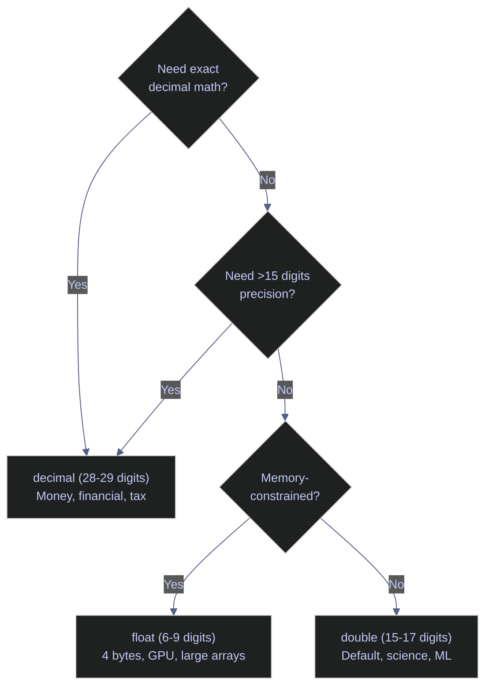
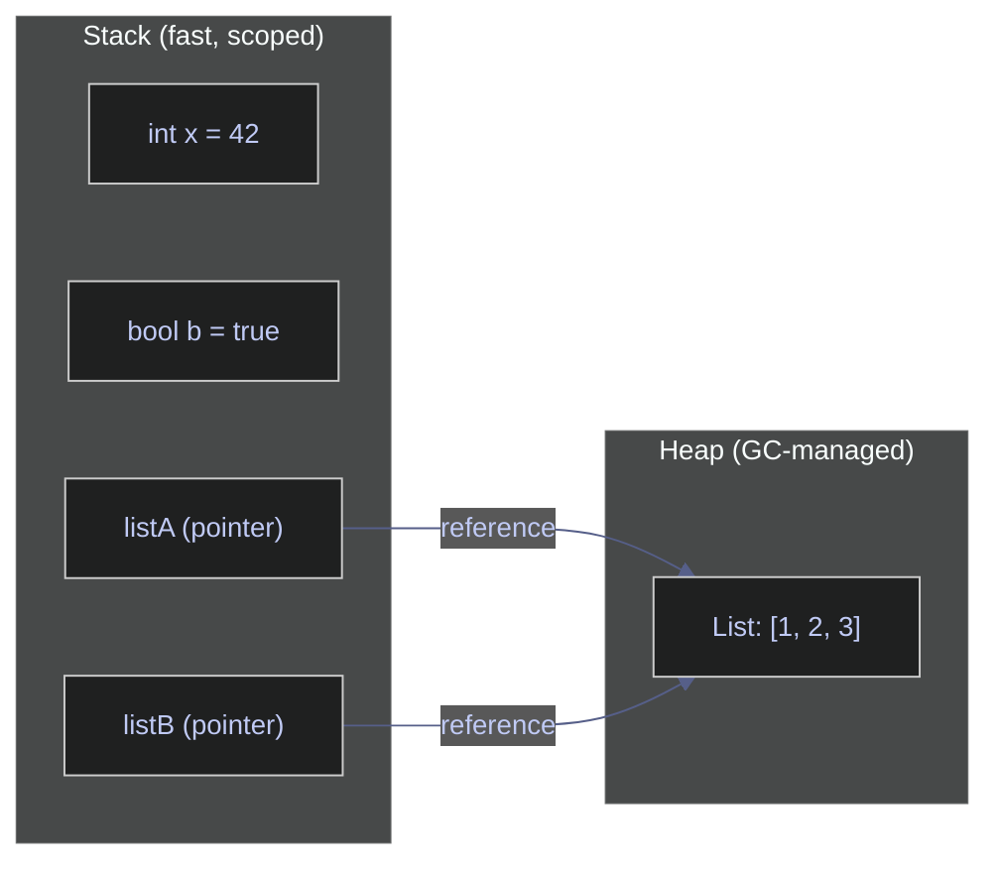
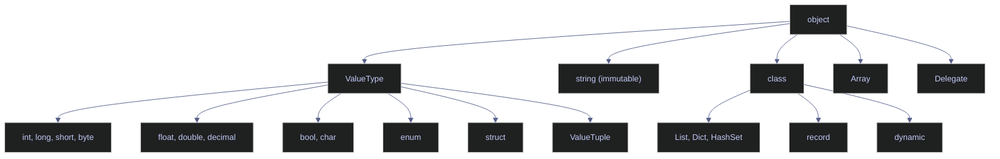

# 01. Basics - C#

> [!quote]
> "The only way to learn a new programming language is by writing programs in it."
>
> — **Brian W. Kernighan & Dennis Ritchie**, *The C Programming Language* (1978)


## Environment Setup

Covers .NET interactive notebook configuration, runtime version inspection, and assembly management. These cells verify the execution environment before running language examples.

### Interactive notebook directives

#### Suppress .NET assembly version warnings

The .NET Interactive kernel emits assembly version mismatch warnings that clutter notebook output. This cell reconfigures the C# kernel's script options to set the warning level to zero, silencing these diagnostics for the remainder of the session. Only needed in Polyglot Notebook / .NET Interactive environments.

```csharp
using System.Collections;
using System.Numerics;
using System.Reflection;
using Microsoft.DotNet.Interactive;
using Microsoft.DotNet.Interactive.CSharp;

#r "nuget: Newtonsoft.Json"
using Newtonsoft.Json;
var csharpKernel = (CSharpKernel)Kernel.Root.FindKernelByName("csharp");
var optionsField = typeof(CSharpKernel).GetField("_scriptOptions",
    BindingFlags.NonPublic | BindingFlags.Instance);

var scriptOptions = optionsField.GetValue(csharpKernel);
var withWarningLevel = scriptOptions.GetType().GetMethod("WithWarningLevel");
var newOptions = withWarningLevel.Invoke(scriptOptions, new object[] { 0 });
optionsField.SetValue(csharpKernel, newOptions);
```

### Runtime and assembly inspection

#### Check .NET runtime version and operating system

`Environment.Version` returns the .NET runtime version, `Environment.OSVersion` reports the host OS, and `Environment.MachineName` identifies the machine. Use these to verify the notebook is running on the expected platform.

```csharp
Console.WriteLine(Environment.Version);
Console.WriteLine(Environment.OSVersion);
Console.WriteLine(Environment.MachineName);
```

```text
10.0.4
Microsoft Windows NT 10.0.26200.0
ELYSIUM
```

#### Inspect working directory and current user

`Environment.CurrentDirectory` returns the working directory where file path resolution starts. `Environment.UserName` returns the identity running the process. Useful for verifying notebook execution context before file I/O operations.

```csharp
Console.WriteLine(Environment.CurrentDirectory);
Console.WriteLine(Environment.UserName);
```

```text
c:\Users\aperi\DEV\LANG
Alex
```

#### Load a NuGet package with the #r directive

The `#r "nuget: PackageName"` directive downloads and references a NuGet package at runtime inside .NET Interactive notebooks. After loading, the package's types become available via `using` statements. This cell loads `Newtonsoft.Json` (done in the suppress-warnings cell above) and then lists the first five loaded assemblies alphabetically to confirm it is present.

```csharp
foreach (var asm in AppDomain.CurrentDomain.GetAssemblies()
    .OrderBy(a => a.GetName().Name)
    .Take(5))
{
    Console.WriteLine($"{asm.GetName().Name} == {asm.GetName().Version}");
}
```

```text
Newtonsoft.Json loaded successfully
Anonymously Hosted DynamicMethods Assembly == 0.0.0.0
AsyncIO == 0.1.69.0
FSharp.Compiler.Service == 43.10.103.0
FSharp.Core == 10.0.0.0
FSharp.DependencyManager.Nuget == 10.0.103.0
```

#### Verify that required assemblies are loaded

`Assembly.Load` attempts to load a named assembly into the current application domain. Wrapping it in a try/catch lets you confirm each dependency is available before running code that depends on it. This pattern is useful at the top of notebooks to fail fast if a required library is missing.

```csharp
var assemblies = new[] {
    "System.Linq",
    "System.Collections",
    "System.IO",
    "System.Net.Http",
    "System.Text.Json",
    "System.Threading.Tasks"
};

foreach (var name in assemblies)
{
    try
    {
        System.Reflection.Assembly.Load(name);
        Console.WriteLine($"  {name}: OK");
    }
    catch
    {
        Console.WriteLine($"  {name}: MISSING");
    }
}
```

```text
  OK
  OK
  OK
  OK
  OK
  OK
```

## Console I/O

Demonstrates output formatting, escape sequences, terminal styling, numeric format specifiers, and input parsing. C# console I/O revolves around `Console.Write`/`Console.WriteLine` for output and `Console.ReadLine` for input, with `TryParse` for safe type conversion.

### Output and string formatting

#### Concatenate strings with the + operator

The `+` operator creates a new string by joining its operands left to right. Each concatenation allocates a new string object, so for repeated joins in a loop, prefer `StringBuilder`. For a fixed number of operands, `+` is clear and efficient — the compiler optimizes small concatenation chains.

```csharp
Console.WriteLine("one" + " | " + "two" + " | " + "three");
```

```text
one | two | three
```

#### Format strings with interpolation, String.Format, and composite formatting

C# offers three string formatting approaches. **String interpolation** (`$"..."`) embeds expressions directly in the string — preferred for readability. **`String.Format`** uses numbered placeholders (`{0}`, `{1}`) — useful when the format string comes from a resource file. **Composite formatting** passes placeholders directly to `Console.WriteLine` — a shorthand for `String.Format` when printing immediately. All three support format specifiers like `:F2` for two decimal places.

```csharp
string name = "Alice";
int age = 30;

Console.WriteLine($"Name: {name}, Age: {age}");
Console.WriteLine(string.Format("Name: {0}, Age: {1}", name, age));
Console.WriteLine("Name: {0}, Age: {1}", name, age);

Console.WriteLine($"Next year: {age + 1}");
Console.WriteLine($"Name uppercased: {name.ToUpper()}");
Console.WriteLine($"Pi to 2 decimals: {3.14159:F2}");
```

```text
30
30
30
31
ALICE
3.14
```

#### Write output without a trailing newline using Console.Write

`Console.Write` prints text without appending a newline, so successive calls build up a single line. `Console.WriteLine` appends `Environment.NewLine` after the text. Use `Write` when constructing output incrementally (progress bars, inline prompts) and `WriteLine` for complete lines.

```csharp
Console.Write("hello ");
Console.Write("world");
Console.WriteLine("!");
```

```text
hello world!
```

#### Join collection elements into a delimited string with string.Join

`string.Join(separator, values)` concatenates all elements with the separator between them. It accepts any `IEnumerable` or `params object[]`, so it works with arrays, lists, and even mixed-type arguments. C# has no `sep` parameter on `Console.WriteLine` like Python's `print(sep=...)` — use `string.Join` instead.

```csharp
var items = new[] { "a", "b", "c" };
Console.WriteLine(string.Join(", ", items));
Console.WriteLine(string.Join("", items));
Console.WriteLine(string.Join(" → ", items));
Console.WriteLine(string.Join("-", 2024, 3, 15));
```

```text
a, b, c
abc
a → b → c
2024-3-15
```

#### Redirect output to stderr or a file

`Console.Error` is a `TextWriter` that targets standard error. Use it for diagnostic messages that should not mix with normal output. `Console.SetOut` redirects `Console.Write`/`WriteLine` to any `TextWriter`, including a file stream.

```csharp
Console.Error.WriteLine("This goes to stderr");
```

```text
This goes to stderr
```

### Escape sequences and terminal styling

#### Escape sequences and verbatim strings

Escape sequences insert special characters into string literals using a backslash prefix: `\t` (tab), `\n` (newline), `\\` (literal backslash), `\"` (double quote), `\uXXXX` (Unicode code point), and `\0` (null character). Verbatim strings (`@"..."`) disable escape processing — backslashes are treated as literal characters, which is ideal for file paths and regex patterns. Combine verbatim with interpolation using `$@"..."` to get both features.

```csharp
Console.WriteLine("Tab:\tafter tab");
Console.WriteLine("Newline:\nafter newline");
Console.WriteLine("Backslash: \\");
Console.WriteLine("Quote: \"double\"");
Console.WriteLine("Unicode: \u2764 \u2605 \u2602");
Console.WriteLine("Null char: [\0] (invisible)");
Console.WriteLine(@"Verbatim string: \n \t not escaped");

Console.WriteLine("Regular:  C:\\Users\\file.txt");
Console.WriteLine(@"Verbatim: C:\Users\file.txt");
Console.WriteLine($@"Combined: C:\Users\{Environment.UserName}");
```
```text
after tab
after newline
\
"double"
❤ ★ ☂
[] (invisible)
\n \t not escaped
C:\Users\file.txt
C:\Users\file.txt
C:\Users\Alex
```

#### Raw string literals — multi-line strings without escaping (C# 11)

Raw string literals (C# 11+) use three or more double quotes (`"""..."""`) to define strings that require no escape sequences at all. Whitespace indentation is trimmed based on the closing quotes' position. Combine with `$` for interpolation — use `{{` and `}}` to insert literal braces. Raw strings eliminate the need for `@` verbatim strings in most cases and are ideal for embedded JSON, SQL, XML, and regex patterns.

```csharp
string json = """
    {
        "name": "Alice",
        "age": 30
    }
    """;
Console.WriteLine(json);

string interpolated = $"""
    Name: {"Alice"}, Age: {30}
    """;
Console.WriteLine(interpolated);
```

```text
{
    "name": "Alice",
    "age": 30
}
Name: Alice, Age: 30
```

#### Apply ANSI color and style codes to terminal output

ANSI escape codes control text color, weight, and decoration in terminals that support them. The escape character in C# is `\x1b` (hex 1B = ESC). Each code is bracketed by `\x1b[` and terminated with `m`. Always reset with `\x1b[0m` to prevent style bleeding into subsequent output. In terminal applications use `\033` (octal) as an alternative escape prefix. Notebook environments may strip ANSI codes — the output below shows the raw escape sequences as the notebook does not interpret them.

```csharp
Console.WriteLine("\x1b[31mRed text\x1b[0m");
Console.WriteLine("\x1b[32mGreen text\x1b[0m");
Console.WriteLine("\x1b[1;34mBold blue text\x1b[0m");
Console.WriteLine("\x1b[43m\x1b[30mBlack on yellow\x1b[0m");
Console.WriteLine("\x1b[4mUnderlined\x1b[0m");
Console.WriteLine("\x1b[9mStrikethrough\x1b[0m");
Console.WriteLine("\x1b[3mItalic\x1b[0m\n");
```
```text
Red text
Green text
Bold blue text
Black on yellow
Underlined
Strikethrough
Italic
```

#### Common ANSI escape codes reference

Quick reference for the most frequently used ANSI escape code categories. Foreground color codes range from 30 (black) to 37 (white); background codes are the same values plus 10 (40–47). Extended 256-color and 24-bit RGB modes use `\x1b[38;5;Nm` and `\x1b[38;2;R;G;Bm` respectively.

```csharp
Console.WriteLine(@"\x1b[0m      Reset");
Console.WriteLine(@"\x1b[3m      Italic");
Console.WriteLine(@"\x1b[1m      Bold");
Console.WriteLine(@"\x1b[4m      Underline");
Console.WriteLine(@"\x1b[9m      Strikethrough");
Console.WriteLine(@"\x1b[30-37m  Foreground colors (black,red,green,yellow,blue,magenta,cyan,white)");
Console.WriteLine(@"\x1b[40-47m  Background colors (same order)");
```

```text
\x1b[0m      Reset
\x1b[3m      Italic
\x1b[1m      Bold
\x1b[4m      Underline
\x1b[9m      Strikethrough
\x1b[30-37m  Foreground colors (black,red,green,yellow,blue,magenta,cyan,white)
\x1b[40-47m  Background colors (same order)
```

### Numeric formatting

#### Format numbers with ToString() standard format specifiers

`ToString(format)` applies a standard numeric format string to produce culture-aware output. Common specifiers: `C` (currency, locale-sensitive symbol and grouping), `D` (decimal with zero-padding), `E` (scientific notation), `F` (fixed-point), `N` (number with thousands separator), `P` (percentage), and `X` (hexadecimal uppercase). A trailing digit controls precision — `D8` pads to 8 digits, `E2` uses 2 decimal places in the mantissa.

```csharp
int num = 42;
Console.WriteLine(num.ToString());
Console.WriteLine(num.ToString("X"));
Console.WriteLine(num.ToString("D8"));
Console.WriteLine(num.ToString("C"));
Console.WriteLine(num.ToString("E2"));
```

```text
42
2A
00000042
$42.00
4.20E+001
```

### Console input and parsing

#### Read a line of text from standard input with Console.ReadLine

`Console.ReadLine()` blocks until the user presses Enter, then returns the entire line as a `string` (or `null` if the input stream is closed). All console input arrives as text — numeric values must be parsed explicitly. In notebook environments, `ReadLine` is not interactive, so a hardcoded string simulates the input.

```csharp
string inputName = "Alice";
Console.WriteLine($"Hello, {inputName}!");
Console.WriteLine($"Type of input: {inputName.GetType()}");
```

```text
Hello, Alice!
System.String
```

#### Parse a string to integer safely with int.TryParse

`int.TryParse(string, out int)` attempts to convert a string to a 32-bit integer without throwing an exception on failure. It returns `true` if parsing succeeds and writes the result to the `out` parameter; on failure it returns `false` and sets the `out` parameter to `0`. Always prefer `TryParse` over `int.Parse` for user input — `Parse` throws `FormatException` on invalid strings, which is expensive and disruptive.

```csharp
string ageStr = "30";

if (int.TryParse(ageStr, out int age))
{
    Console.WriteLine($"Your age is {age}, type: {age.GetType()}");
}
else
{
    Console.WriteLine($"'{ageStr}' is not a valid integer");
}
```

```text
System.Int32
```

#### Parse a string to double safely with double.TryParse

`double.TryParse` works identically to `int.TryParse` but for 64-bit floating-point values. It respects the current culture's decimal separator (`CultureInfo.CurrentCulture`) — on systems where the decimal separator is a comma, `"19.99"` will fail unless you pass `CultureInfo.InvariantCulture`. For financial amounts, parse to `decimal` instead of `double` to avoid binary floating-point rounding.

```csharp
string priceStr = "19.99";

if (double.TryParse(priceStr, out double price))
{
    Console.WriteLine($"Price: ${price:F2}, type: {price.GetType()}");
}
else
{
    Console.WriteLine($"'{priceStr}' is not a valid number");
}
```

```text
System.Double
```

#### Validate input in a loop until parsing succeeds

A common pattern for interactive console applications: loop on `Console.ReadLine` + `TryParse` until the user provides valid input. The notebook simulates this with an array of test inputs. `GetValidInt` rejects non-numeric strings, and `GetNonEmptyString` rejects whitespace-only input using `string.IsNullOrWhiteSpace`. In production, use a `while (true)` loop with `Console.ReadLine()` in place of the array iteration.

```csharp
string[] testInputs = { "abc", "", "42" };

int GetValidInt(string[] inputs)
{
    foreach (var input in inputs)
    {
        Console.WriteLine($"Trying: '{input}'");
        if (int.TryParse(input, out int result))
        {
            Console.WriteLine($"  Valid integer: {result}");
            return result;
        }
        Console.WriteLine($"  '{input}' is not valid. Please enter a whole number.");
    }
    return 0;
}

string GetNonEmptyString(string[] inputs)
{
    foreach (var input in inputs)
    {
        Console.WriteLine($"Trying: '{input}'");
        if (!string.IsNullOrWhiteSpace(input))
        {
            Console.WriteLine($"  Valid string: {input.Trim()}");
            return input.Trim();
        }
        Console.WriteLine("  Input cannot be empty.");
    }
    return "";
}

GetValidInt(testInputs);
GetNonEmptyString(new[] { "", "  ", "Alice" });
```

```text
'abc'
  'abc' is not valid. Please enter a whole number.
''
  '' is not valid. Please enter a whole number.
'42'
  Valid integer: 42
''
  Input cannot be empty.
'  '
  Input cannot be empty.
'Alice'
  Valid string: Alice
```

## Variables, Constants & Data Types

Covers variable declaration, constants, type inference with `var`, the complete set of value and reference types, nullability, and the stack/heap memory model that governs how C# manages data.

### Variable declaration and constants

#### Declare variables with explicit types or var inference

Declare with an explicit type (`int x = 10`) or let the compiler infer it (`var x = 10`) — both are statically typed at compile time. Use `var` for obvious types (LINQ, constructors, anonymous types) and explicit types when the right-hand side doesn't reveal the type (`int count = GetCount()`). Avoid `var` for numeric literals (`var x = 1` — ambiguous: `int`? `long`? `byte`?). `var` lets the compiler infer the type at compile time — `var z = 42` is inferred as `int` and remains statically typed.

```csharp
int x = 10;
double y = 3.14;
string name = "Alice";
bool active = true;

var z = 42;

Console.WriteLine($"x = {x}, type: {x.GetType()}");
Console.WriteLine($"y = {y}, type: {y.GetType()}");
Console.WriteLine($"name = {name}, type: {name.GetType()}");
Console.WriteLine($"active = {active}, type: {active.GetType()}");
Console.WriteLine($"z = {z}, type: {z.GetType()}");
```

```text
System.Int32
System.Double
System.String
System.Boolean
System.Int32
```

> [!warning] Variables Cannot Change Type
> C# is statically typed. `x = "string"` after declaring `int x` is a compile error. Unlike Python, types are fixed at declaration.

> [!success] Use var for type inference without sacrificing type safety
> `var x = 42;` infers `int` at compile time — the variable is still statically typed, you just don't have to write the type explicitly. `x = "string"` would still be a compile error.


#### Define compile-time and runtime constants with const and readonly

`const` values must be known at compile time and are embedded directly into the IL — use for truly fixed values like `Pi` or configuration keys that never change. `readonly` fields can be set once in the constructor at runtime — use for values computed at startup (e.g., connection strings from environment variables). `const` is implicitly `static`; `readonly` can be instance-level. Any attempt to reassign a constant (`Pi = 999`) is a compile error.

```csharp
const double Pi = 3.14159;
const int MaxUsers = 100;
const string ApiUrl = "https://api.example.com";

Console.WriteLine(Pi);
Console.WriteLine(MaxUsers);
Console.WriteLine(ApiUrl);
```

> [!info] readonly vs const
> `readonly` can be assigned in the constructor at runtime. `const` must be a compile-time literal. Use `readonly` for values computed at startup.

```text
Pi = 3.14159
MaxUsers = 100
ApiUrl = https://api.example.com
```

### Numeric types

#### Signed and unsigned integer types — sbyte through ulong and native-size

C# provides ten integer types across four widths (8, 16, 32, 64 bits), each available in signed and unsigned variants. `int` (32-bit signed) is the default for most use cases. Use `long` when values exceed ~2.1 billion, `byte` for raw binary data, and `uint`/`ulong` for interop or bit manipulation. The `nint`/`nuint` native-size types (C# 9+) match the platform pointer width — 32 bits on x86, 64 on x64. Suffix literals with `L` for long and `U` for unsigned. Digit separators (`_`) improve readability of large constants.

```csharp

Console.WriteLine($"sbyte   (8-bit):  {sbyte.MinValue} to {sbyte.MaxValue}");
Console.WriteLine($"short   (16-bit): {short.MinValue} to {short.MaxValue}");
Console.WriteLine($"int     (32-bit): {int.MinValue} to {int.MaxValue}");
Console.WriteLine($"long    (64-bit): {long.MinValue} to {long.MaxValue}");

// Unsigned integers

Console.WriteLine($"byte    (8-bit):  {byte.MinValue} to {byte.MaxValue}");
Console.WriteLine($"ushort  (16-bit): {ushort.MinValue} to {ushort.MaxValue}");
Console.WriteLine($"uint    (32-bit): {uint.MinValue} to {uint.MaxValue}");
Console.WriteLine($"ulong   (64-bit): {ulong.MinValue} to {ulong.MaxValue}");

long big = 9_000_000_000_000L;   // L suffix for long
uint positive = 4_000_000_000U;  // U suffix for uint

// Overflow: int.MaxValue + 1 wraps around (unchecked) or throws (checked)
// checked { int overflow = int.MaxValue + 1; } // throws OverflowException
```
```text
-128 to 127
-32768 to 32767
-2147483648 to 2147483647
-9223372036854775808 to 9223372036854775807

0 to 255
0 to 65535
0 to 4294967295
0 to 18446744073709551615
```

#### Detect integer overflow with checked and unchecked contexts

By default, integer arithmetic in C# is **unchecked** — overflow silently wraps around (`int.MaxValue + 1` becomes `int.MinValue`). The `checked` keyword enables overflow detection: any operation that exceeds the type's range throws `OverflowException`. Use `checked` blocks for financial calculations, counters, and any code where silent overflow would produce wrong results. The `unchecked` keyword explicitly opts out — useful inside a project-wide checked context.

```csharp
int max = int.MaxValue;
int uncheckedResult = unchecked(max + 1);
Console.WriteLine($"unchecked: {max} + 1 = {uncheckedResult}");

try
{
    int checkedResult = checked(max + 1);
}
catch (OverflowException ex)
{
    Console.WriteLine($"checked: {max} + 1 threw {ex.GetType().Name}");
}
```

```text
unchecked: 2147483647 + 1 = -2147483648
checked: 2147483647 + 1 threw OverflowException
```

> [!tip] Enable project-wide checked arithmetic
> Add `<CheckForOverflowUnderflow>true</CheckForOverflowUnderflow>` to your `.csproj` to make all integer arithmetic checked by default. Use `unchecked` for the rare cases where wrapping is intentional (hash functions, bit manipulation).

#### Floating-point types — float, double, decimal precision tiers

Three floating-point types with increasing precision: `float` (32-bit, ~7 digits), `double` (64-bit, ~15 digits), `decimal` (128-bit, 28-29 digits). `double` is the default for science and ML. `decimal` has exact base-10 representation (no `0.1+0.2` surprises) — required for money and financial math. `float` uses half the memory of `double`.



> [!danger] Financial math
>
> Never use `float`/`double` for currency — always use `decimal`. Never compare floats with `==` — use `Math.Abs(a-b) < epsilon`.

> [!success] Use decimal for money, epsilon comparison for floats
> Declare monetary amounts as `decimal amount = 9.99m;`. For float equality checks, use `Math.Abs(a - b) < 1e-9` where `1e-9` is your tolerance (epsilon), chosen based on the precision your computation requires.

```csharp
Console.WriteLine($"float   (32-bit): {float.MinValue} to {float.MaxValue}, ~6-9 digits precision");
Console.WriteLine($"double  (64-bit): {double.MinValue} to {double.MaxValue}, ~15-17 digits precision");
Console.WriteLine($"decimal (128-bit): {decimal.MinValue} to {decimal.MaxValue}, 28-29 digits precision");
```
```text
=== Floating-Point Types ===
-3.4028235E+38 to 3.4028235E+38, ~6-9 digits precision
-1.7976931348623157E+308 to 1.7976931348623157E+308, ~15-17 digits precision
-79228162514264337593543950335 to 79228162514264337593543950335, 28-29 digits precision
```

#### Specify floating-point type with literal suffixes — f, d, m

Without a suffix, a numeric literal with a decimal point defaults to `double`. The `f` suffix makes it `float` (required — `float x = 3.14;` is a compile error because `3.14` is `double`). The `m` suffix makes it `decimal` (also required). The `d` suffix explicitly marks `double` but is redundant since it is the default.

```csharp
float f = 3.14f;
double d = 3.14;
decimal m = 3.14m;

Console.WriteLine($"\nfloat:   {f}, type: {f.GetType()}");
Console.WriteLine($"double:  {d}, type: {d.GetType()}");
Console.WriteLine($"decimal: {m}, type: {m.GetType()}");
```
```text
System.Single
System.Double
System.Decimal
```

#### Observe how var infers floating-point type from literal suffix

When you use `var`, the compiler determines the type entirely from the right-hand side. `var a = 3.14` infers `double`, `var b = 3.14f` infers `float` (`System.Single`), and `var e = 3.14m` infers `decimal`. This makes suffix choice critical with `var` — omitting `m` on a monetary value silently gives you `double` with binary rounding.

```csharp
var a = 3.14;
var b = 3.14f;
var c = 3.14d;
var e = 3.14m;
Console.WriteLine(a.GetType().Name);
Console.WriteLine(b.GetType().Name);
Console.WriteLine(c.GetType().Name);
Console.WriteLine(e.GetType().Name);
```

> [!warning] Float Requires f Suffix
> Numeric literals are `double` by default. `float x = 3.14;` is a compile error. Use `3.14f` for float, `3.14m` for decimal.

> [!success] Use the correct suffix for each floating-point type
> `float f = 3.14f;` — `f` suffix. `decimal d = 9.99m;` — `m` suffix. `double` needs no suffix: `double x = 3.14;` is the default.

    
```text
Double
Single
Double
Decimal
```

#### Inspect special floating-point values — NaN, Infinity, and precision loss

IEEE 754 defines three special `double` values: `PositiveInfinity` (result of division by zero), `NegativeInfinity`, and `NaN` (Not a Number — result of `0.0/0.0` or `Math.Sqrt(-1)`). `NaN` is not equal to anything, including itself — use `double.IsNaN()` to test. The classic `0.1 + 0.2 != 0.3` rounding artifact is inherent to binary floating-point; `decimal` avoids it because it uses base-10 representation.

```csharp
Console.WriteLine(double.PositiveInfinity);
Console.WriteLine(double.NegativeInfinity);
Console.WriteLine(double.NaN);

Console.WriteLine(0.1 + 0.2);
Console.WriteLine(0.1m + 0.2m);
```
```text
∞
-∞
NaN

0.1 + 0.2 = 0.30000000000000004
0.1m + 0.2m = 0.3
```

#### Perform complex number arithmetic with System.Numerics.Complex

`Complex` represents a number with a real and imaginary part (e.g., `3 + 4i`). It lives in `System.Numerics` and supports standard arithmetic operators, conjugate, magnitude (absolute value), and phase. Use it for signal processing, physics simulations, or any domain that requires the complex plane. The magnitude of `(3, 4)` is `5` by the Pythagorean theorem.

```csharp
var z = new Complex(3, 4);
Console.WriteLine($"z = {z}, type: {z.GetType()}");
Console.WriteLine($"Real: {z.Real}, Imaginary: {z.Imaginary}");
Console.WriteLine(Complex.Conjugate(z));
Console.WriteLine(z.Magnitude);
```
```text
System.Numerics.Complex
4
<3; -4>
5
```

### Boolean, byte arrays, and null handling

#### bool — true/false only, no implicit int conversion

The `bool` type holds exactly `true` or `false` — there is no implicit conversion to or from integers. `if (1)` and `true + true` are compile errors. When you need an integer representation, use `Convert.ToInt32(boolVal)` which returns `1` for `true` and `0` for `false`.

```csharp
bool a = true;
bool b = false;

Console.WriteLine($"a = {a}, type: {a.GetType()}");
Console.WriteLine($"b = {b}, type: {b.GetType()}");

// Explicit conversion
Console.WriteLine(Convert.ToInt32(true));
Console.WriteLine(Convert.ToInt32(false));
```

> [!info] bool Is Strict — No Numeric Conversion, No Truthy/Falsy
> C# has no implicit bool-to-int conversion. `true + true` and `int x = true` are compile errors. Use `Convert.ToInt32(boolVal)` if needed.
> `if ("hello")` and `if (1)` are also compile errors. C# requires explicit boolean expressions: `if (str != null && str.Length > 0)`.

```text
System.Boolean
System.Boolean
Convert.ToInt32(true) = 1
Convert.ToInt32(false) = 0
```

#### Convert between strings and byte arrays with UTF-8 encoding

`Encoding.UTF8.GetBytes(string)` encodes a string into a UTF-8 byte array, and `Encoding.UTF8.GetString(byte[])` decodes it back. UTF-8 is variable-width: ASCII characters use 1 byte, accented characters like `é` use 2 bytes, and emoji can use up to 4. This is why `"café"` encodes to 5 bytes (not 4) — the `é` requires two bytes (`195, 169`). Use `Encoding.ASCII` or `Encoding.Unicode` (UTF-16) when interoperating with systems that expect those encodings.

```csharp
byte[] b1 = new byte[] { 104, 101, 108, 108, 111 };
Console.WriteLine($"b1 = [{string.Join(", ", b1)}], type: {b1.GetType()}");
Console.WriteLine(System.Text.Encoding.UTF8.GetString(b1));   // As string

// Encoding/decoding
string text = "café";
byte[] encoded = System.Text.Encoding.UTF8.GetBytes(text);
string decoded = System.Text.Encoding.UTF8.GetString(encoded);
Console.WriteLine($"\n'{text}' encoded: [{string.Join(", ", encoded)}]");
Console.WriteLine(decoded);   // decoded back
```
```text
System.Byte[]
hello

[99, 97, 102, 195, 169]
café
```

#### Understand null references and nullable value types

`null` represents the absence of a value for reference types. Attempting to access a member on a `null` reference throws `NullReferenceException` — the most common runtime error in C#. Value types (`int`, `bool`, `struct`) cannot be `null` by default because they live on the stack with no reference to dereference. Use the `?` suffix (`int?`, `double?`) to create a nullable value type backed by `Nullable<T>`, which adds a `HasValue` flag alongside the value.

> [!warning] Value Types Cannot Be Null
> `int x = null` is a compile error. Use `int? x = null` (nullable value type) when null is needed.

> [!success] Use nullable value types (T?) when null is a valid state
> `int? x = null;` declares a nullable int. Check with `x.HasValue` or `x == null`. Unwrap with `x.Value` (throws if null) or `x.GetValueOrDefault(0)` (returns 0 if null). In C# 8+, enable `#nullable enable` for compile-time null safety on reference types too.

```csharp
string s = null;

Console.WriteLine(s == null);   // s is null
Console.WriteLine(s is null);

// Nullable value types — use ? suffix
int? x = null;              // nullable int
double? y = null;           // nullable double
Console.WriteLine($"\nx = {x}, hasValue: {x.HasValue}");
x = 42;
Console.WriteLine($"x = {x}, hasValue: {x.HasValue}, value: {x.Value}");
```
```text
True
True

False
42
```

#### Provide fallback values with ?? and safely access members with ?.

The null-coalescing operator `??` returns the left operand if it is non-null, otherwise the right operand — a concise replacement for `if (x != null) x else default`. The null-conditional operator `?.` short-circuits member access: `name?.Length` returns `null` (not `NullReferenceException`) when `name` is `null`, and the actual length otherwise. The return type becomes `int?` since the result may be null.

```csharp
string name = null;
Console.WriteLine(name ?? "Unknown");

Console.WriteLine(name?.Length);
```
```text
Unknown
name?.Length:
```

### Type system reference — all built-in types

#### C# data type overview — value types vs reference types

C# has a strict **VALUE vs REFERENCE** type distinction.

- **STACK**: Fast, small, auto-managed memory. Each method call gets a stack frame.
  When the method returns, its stack frame is discarded. No garbage collector needed.
  Value types live here (`int`, `bool`, `struct`, etc.)

- **HEAP**: Large, shared memory pool managed by the Garbage Collector (GC).
  Objects persist until no references point to them, then GC reclaims the memory.
  Reference types live here (`class`, `string`, `List`, `array`, etc.)
  A variable on the stack holds a POINTER to the heap object.





#### Integer types — complete reference with sizes and ranges

All ten integer types with their storage size, signedness, and boundary values. Use `sizeof()` to confirm size at compile time.

```csharp

sbyte   sb = -128;        Console.WriteLine($"sbyte:    {sb,20}  ({sizeof(sbyte)} byte,  signed)");
byte    by = 255;         Console.WriteLine($"byte:     {by,20}  ({sizeof(byte)} byte,  unsigned)");
short   sh = -32768;      Console.WriteLine($"short:    {sh,20}  ({sizeof(short)} bytes, signed)");
ushort  us = 65535;        Console.WriteLine($"ushort:   {us,20}  ({sizeof(ushort)} bytes, unsigned)");
int     i  = -2147483648;  Console.WriteLine($"int:      {i,20}  ({sizeof(int)} bytes, signed)");
uint    ui = 4294967295;   Console.WriteLine($"uint:     {ui,20}  ({sizeof(uint)} bytes, unsigned)");
long    l  = -9223372036854775808; Console.WriteLine($"long:     {l,20}  ({sizeof(long)} bytes, signed)");
ulong   ul = 18446744073709551615; Console.WriteLine($"ulong:    {ul,20}  ({sizeof(ulong)} bytes, unsigned)");
nint    ni = -42;          Console.WriteLine($"nint:     {ni,20}  (native, signed)");
nuint   nui = 42;          Console.WriteLine($"nuint:    {nui,20}  (native, unsigned)");
```
```text
-128  (1 byte,  signed)
255  (1 byte,  unsigned)
-32768  (2 bytes, signed)
65535  (2 bytes, unsigned)
-2147483648  (4 bytes, signed)
4294967295  (4 bytes, unsigned)
-9223372036854775808  (8 bytes, signed)
18446744073709551615  (8 bytes, unsigned)
-42  (native, signed)
42  (native, unsigned)
```

#### Floating-point types — size and precision reference

The three floating-point types at a glance with their byte size and digit precision.

```csharp

float   fl = 3.14f;       Console.WriteLine($"float:    {fl,20}  ({sizeof(float)} bytes, ~6-9 dig))");
double  db = 3.14159265;  Console.WriteLine($"double:   {db,20}  ({sizeof(double)} bytes, ~15-17 dig)");
decimal dc = 3.14m;       Console.WriteLine($"decimal:  {dc,20}  ({sizeof(decimal)} bytes, 28-29 dig)");
```
```text
3.14  (4 bytes, ~6-9 dig))
3.14159265  (8 bytes, ~15-17 dig)
3.14  (16 bytes, 28-29 dig)
```

#### Other value types — bool and char

`bool` occupies 1 byte (even though it stores a single bit) due to memory alignment. `char` is 2 bytes because C# uses UTF-16 encoding internally, where each `char` represents a single 16-bit code unit.

```csharp

bool    bo = true;         Console.WriteLine($"bool:     {bo,20}  ({sizeof(bool)} byte)");
char    ch = 'A';          Console.WriteLine($"char:     {ch,20}  ({sizeof(char)} bytes, Unicode))");
```
```text
True  (1 byte)
A  (2 bytes, Unicode))
```

#### Struct and enum — user-defined value types

`struct` and `enum` are user-defined value types that live on the stack. Use `struct` for small, immutable data bundles (coordinates, RGB colors, date ranges) — keep them under 16 bytes to avoid expensive copy overhead. `enum` maps named constants to underlying integer values.

**struct** — user-defined value type for small, immutable data bundles.

```csharp

Console.WriteLine($"struct:   {"(user-defined)",20}  (value type)");
```
```text
(user-defined)  (value type)
```

**enum** — maps named constants to underlying integer values.

```csharp

Console.WriteLine($"enum:     {"(user-defined)",20}  (value type)");
```
```text
(user-defined)  (value type)
```

#### ValueTuple — lightweight value-type tuple with named fields

`ValueTuple` (C# 7+) is a value type that groups multiple values without defining a class or struct. Named fields like `(x: 3, y: 4)` improve readability over positional `Item1`/`Item2`. ValueTuples are mutable (fields can be reassigned), but best practice is to treat them as immutable.

```csharp

var vt = (x: 3, y: 4);    Console.WriteLine($"ValueTuple:{vt,19}  (value type)");
```
```text
(3, 4)  (value type)
```

#### String, object, and dynamic — reference types with special behavior

`string` is a reference type but immutable — every modification (concatenation, `Replace`, `Trim`) creates a new string object, leaving the original unchanged. `object` is the root of the entire type hierarchy — every type inherits from it. `dynamic` bypasses compile-time type checking and resolves members at runtime, similar to Python's duck typing — use sparingly, mainly for COM interop or working with untyped JSON.

```csharp
string  str1 = "hello";   Console.WriteLine($"string:   {str1,20}  (immutable ref type)");

object  obj = 42;          Console.WriteLine($"object:   {obj,20}  (base of all types)");

dynamic dy = "hello";     Console.WriteLine($"dynamic:  {dy,20}  (runtime typed))");
```
```text
hello  (immutable ref type)
42  (base of all types)
hello  (runtime typed))
```

#### Array and List — fixed-size and dynamic-size indexed collections

`int[]` is a fixed-size, contiguous block of memory — fast random access by index, but the size cannot change after creation. `List<T>` is backed by an array that automatically resizes (doubles capacity) when full — use it as the default indexed collection. Both are reference types — assigning to another variable shares the same underlying data.

**int[]** — fixed-size array; size is set at creation and cannot change.

```csharp

int[] arr = {1, 2, 3};    Console.WriteLine($"int[]:    {string.Join(",", arr),20}  (fixed size))");
```
```text
1,2,3  (fixed size))
```

**List\<T\>** — dynamic-size collection backed by a resizing array.

```csharp

var lst = new List<int>{1,2,3}; Console.WriteLine($"List<T>:  {string.Join(",", lst),20}  (dynamic size)");
```
```text
1,2,3  (dynamic size)
```

#### Dictionary and HashSet — key-value and unique-element collections

`Dictionary<TKey, TValue>` maps keys to values with O(1) average lookup via hashing. `HashSet<T>` stores unique elements only — also O(1) for `Add`, `Contains`, and `Remove`. Both throw `ArgumentException` on duplicate key insertion (Dictionary) or silently ignore duplicates (HashSet).

```csharp

var dict = new Dictionary<string,int>{{"a",1}}; Console.WriteLine($"Dict<K,V>:{"a:1",20}  (key-value)");

// HashSet<T>
var hs = new HashSet<int>{1,2,3}; Console.WriteLine($"HashSet:  {string.Join(",", hs),20}  (unique elements)");
```
```text
a:1  (key-value)
1,2,3  (unique elements)
```

#### Queue and Stack — FIFO and LIFO ordered collections

`Queue<T>` is first-in-first-out: `Enqueue` adds to the back, `Dequeue` removes from the front — use for task queues, BFS, and message buffers. `Stack<T>` is last-in-first-out: `Push` adds to the top, `Pop` removes from the top — use for undo operations, DFS, and expression parsing.

```csharp

var q = new Queue<int>();  Console.WriteLine($"Queue<T>: {"(FIFO)",20}  (first in first out)");
var sk = new Stack<int>(); Console.WriteLine($"Stack<T>: {"(LIFO)",20}  (last in first out))");
```
```text
(FIFO)  (first in first out)
(LIFO)  (last in first out))
```

#### LinkedList and sorted collections — specialized data structures

`LinkedList<T>` is a doubly-linked list — O(1) insertion and removal at any node (given a reference), but O(n) random access. `SortedSet<T>`, `SortedDictionary<K,V>`, and `SortedList<K,V>` maintain elements in sorted order automatically (backed by red-black trees or arrays), with O(log n) operations.

```csharp

var ll = new LinkedList<int>(); Console.WriteLine($"LinkedList:{"(doubly linked)",19}");

// SortedSet, SortedDictionary, SortedList
Console.WriteLine($"SortedSet:{"(sorted unique)",20}))");
Console.WriteLine($"SortedDict:{"(sorted k-v)",19}");
```
```text
(doubly linked)
(sorted unique)))
(sorted k-v)
```

#### Nullable value types and legacy Tuple

`Nullable<T>` (shorthand `T?`) wraps a value type to add a `null` state — essential for database columns, optional parameters, and APIs that distinguish "no value" from "zero." Legacy `System.Tuple` is a reference type from .NET 4.0 with `Item1`/`Item2` properties — prefer `ValueTuple` (C# 7+) for new code.

```csharp

int? nullable = null;      Console.WriteLine($"int?:     {nullable?.ToString() ?? "null",20}  (nullable value)");

// Tuple (reference type — System.Tuple, older)
Console.WriteLine($"Tuple:    {"(ref type, legacy)",20}  (prefer ValueTuple)");
```
```text
null  (nullable value)
(ref type, legacy)  (prefer ValueTuple)
```

#### Class, interface, delegate, and record — reference type categories

`class` is the default OOP building block (mutable, reference semantics). `interface` defines a contract without implementation. `delegate` is a type-safe function pointer — the foundation of events and LINQ lambdas. `record` (C# 9+) is an immutable reference type with built-in value equality, `ToString`, and `with` expression support — ideal for DTOs and domain models.

```csharp

Console.WriteLine($"class:    {"(user-defined)",20}  (reference type)");
Console.WriteLine($"interface:{"(contract)",20}  (reference type)");
Console.WriteLine($"delegate: {"(function ptr)",20}  (reference type)");
Console.WriteLine($"record:   {"(immutable class)",20}  (ref or value))");
```
```text
(user-defined)  (reference type)
(contract)  (reference type)
(function ptr)  (reference type)
(immutable class)  (ref or value))
```

### Value vs reference semantics

#### Why value and reference types affect assignment and equality

Assigning a value type (`int a = b`) copies all data — the two variables are independent afterward. Assigning a reference type (`var listB = listA`) copies the pointer — both variables now point to the same heap object, so mutating through one is visible through the other. This distinction affects equality (`==` compares values for value types, references for classes), null behavior, function argument passing, and thread safety.

```csharp

int a = 42;
int b = a;       // b gets a COPY
a = 100;
Console.WriteLine($"a = {a}, b = {b}");

var listA = new List<int> { 1, 2, 3 };
var listB = listA;     // listB points to SAME object
listA.Add(4);
Console.WriteLine(string.Join(",", listA));   // listA
Console.WriteLine(string.Join(",", listB));   // listB
Console.WriteLine(object.ReferenceEquals(listA, listB));   // Same object?
```
```text
a = 100, b = 42
listA = [1,2,3,4]
listB = [1,2,3,4]
Same object? True
```

#### String immutability and boxing/unboxing

Strings are reference types but behave like values because they are immutable — `+=` creates a new string, leaving the original unchanged. **Boxing** wraps a value type in an `object` on the heap (`object boxed = 42`); **unboxing** extracts it back (`(int)boxed`). Each box/unbox cycle involves a heap allocation and copy — avoid in hot paths by using generics instead of `object`.

```csharp

string strA = "hello";
string strB = strA;
strA += " world";    // creates a NEW string, doesn't modify original
Console.WriteLine(strA);
Console.WriteLine(strB);

int val = 42;
object boxed = val;    // boxing: int copied to heap
int unboxed = (int)boxed;  // unboxing: copied back to stack
Console.WriteLine($"val={val}, boxed={boxed}, unboxed={unboxed}");
```
```text
strA = 'hello world'
strB = 'hello'
val=42, boxed=42, unboxed=42
```

#### Value types vs reference types summary

> [!info] Type system classification
> - **Value types:** `int`, `float`, `double`, `decimal`, `bool`, `char`, `struct`, `enum`, `ValueTuple`
> - **Reference types:** `string`, `object`, `class`, `array`, `List`, `Dict`, `delegate`, `interface`, `record`
> - **Special:** `string` is a reference type but immutable (acts like a value type)
> - `Nullable<T>` (`int?`) wraps value types to allow `null`

## Operators

Covers arithmetic, comparison, logical, bitwise, assignment, and null-handling operators. C# has no exponentiation operator (`**`) — use `Math.Pow`. No floor division operator (`//`) — use `Math.Floor`. No chained comparisons (`a < b < c`) — use `&&`.

### Arithmetic and comparison

#### Arithmetic operators — addition, subtraction, multiplication, division, modulo

The standard arithmetic operators work on numeric types with automatic promotion (e.g., `int + double` promotes to `double`). Integer division truncates toward zero (`17 / 5 = 3`). The modulo operator `%` returns the remainder with the sign of the dividend. C# has no `**` operator — use `Math.Pow(base, exponent)` which returns `double`.

```csharp
int a = 17, b = 5;

Console.WriteLine($"{a} + {b}  = {a + b}");
Console.WriteLine($"{a} - {b}  = {a - b}");
Console.WriteLine($"{a} * {b}  = {a * b}");
Console.WriteLine($"{a} / {b}  = {a / b}");
Console.WriteLine($"{a} % {b}  = {a % b}");
Console.WriteLine($"-{a}       = {-a}");

Console.WriteLine($"{a} ^ {b}  = {Math.Pow(a, b)}");
```
```text
17 + 5  = 22
17 - 5  = 12
17 * 5  = 85
17 / 5  = 3
17 % 5  = 2
-17       = -17
17 ^ 5  = 1419857
```

#### Integer vs floating-point division behavior

When both operands are integers, division truncates the fractional part (rounds toward zero). To get a floating-point result, cast at least one operand to `double` or use a literal with a decimal point (`17.0 / 5`). For floor division (round toward negative infinity), use `Math.Floor` — this differs from truncation for negative numbers: `-7 / 2 = -3` (truncation) vs `Math.Floor(-7.0 / 2) = -4`.

```csharp

Console.WriteLine(17 / 5);
Console.WriteLine(17.0 / 5);
Console.WriteLine(17 / 5.0);
Console.WriteLine((double)17 / 5);
Console.WriteLine(-7 / 2);
Console.WriteLine(-7 % 2);

Console.WriteLine(Math.Floor(-7.0 / 2));
```
```text
17 / 5     = 3
17.0 / 5   = 3.4
17 / 5.0   = 3.4
(double)17/5 = 3.4
-7 / 2     = -3
-7 % 2     = -1
Math.Floor(-7.0/2) = -4
```

#### Comparison operators — equality, inequality, and relational

Comparison operators return `bool`. For value types, `==` compares values. For reference types, `==` compares references by default (except `string` and `record` which override to compare values). C# does not support chained comparisons — `a < b < c` is a compile error because `a < b` returns `bool`, and `bool < c` is not defined. Use `a < b && b < c` instead.

```csharp
int a = 10, b = 20;

Console.WriteLine($"{a} == {b}  : {a == b}");
Console.WriteLine($"{a} != {b}  : {a != b}");
Console.WriteLine($"{a} > {b}   : {a > b}");
Console.WriteLine($"{a} < {b}   : {a < b}");
Console.WriteLine($"{a} >= {b}  : {a >= b}");
Console.WriteLine($"{a} <= {b}  : {a <= b}");

// No chained comparisons — must use && explicitly
int x = 15;

Console.WriteLine($"10 < {x} && {x} < 20 : {10 < x && x < 20}");
```
```text
False
True
False
True
False
True
True
```

#### Test reference equality and collection membership

`object.ReferenceEquals` checks whether two variables point to the same heap object. `SequenceEqual` (LINQ) compares two sequences element-by-element. `==` on `List<T>` compares references (not contents) — a common gotcha. For membership, use `.Contains()` for simple lookups and `.Any(predicate)` for conditional checks.

```csharp

var list1 = new List<int> { 1, 2, 3 };
var list2 = new List<int> { 1, 2, 3 };
var list3 = list1;
Console.WriteLine(list1.SequenceEqual(list2));
Console.WriteLine(object.ReferenceEquals(list1, list2));
Console.WriteLine(object.ReferenceEquals(list1, list3));
Console.WriteLine(list1 == list2);

// Membership — use .Contains() or LINQ .Any()

var fruits = new List<string> { "apple", "banana", "cherry" };
Console.WriteLine(fruits.Contains("banana"));
Console.WriteLine(!fruits.Contains("grape"));
Console.WriteLine("banana".Contains("an"));
Console.WriteLine(fruits.Any(f => f.Length > 5));
```
```text
True
False
True
False
True
True
True
True
```

### Logical and null-handling operators

#### Logical AND, OR, NOT with short-circuit evaluation

`&&` (logical AND) and `||` (logical OR) are short-circuit operators — the right operand is only evaluated if the left operand doesn't determine the result. `!` is logical negation. The non-short-circuit variants `&` and `|` always evaluate both sides — use them only when both sides must execute (rare).

```csharp
#nullable enable

Console.WriteLine(true && false);
Console.WriteLine(true || false);
Console.WriteLine(!true);
```
```text
False
True
False
```

#### No truthy/falsy — C# requires explicit bool comparison

Unlike Python or JavaScript, C# does not treat non-zero integers, non-empty strings, or non-null objects as `true`. Every `if` condition must evaluate to an explicit `bool` — anything else is a compile error.

> [!info] No truthy/falsy — C# requires explicit `bool` in all conditions
> - `if (list.Count > 0)` not `if (list)`
> - `if (str.Length > 0)` not `if (str)`
> - `if (x != 0)` not `if (x)`
> - `if (obj != null)` not `if (obj)`

#### Provide a default value for null with the ?? operator

The null-coalescing operator `??` returns the left operand if non-null, otherwise the right operand. It chains naturally: `a ?? b ?? c` returns the first non-null value. The return type is the non-nullable version of the left operand's type.

```csharp

string? name = null;
Console.WriteLine(name ?? "default");
name = "Alice";
Console.WriteLine(name ?? "default");
```
```text
default
Alice
```

#### Assign only when null with the ??= operator

`??=` assigns the right operand to the left variable only if the left is currently `null`. It is a shorthand for `if (val == null) val = fallback;`. Useful for lazy initialization patterns and providing default values on first access.

```csharp

string? val = null;
val ??= "fallback";   // assign only if null
Console.WriteLine(val);   // val ??= \"fallback\"
```
```text
fallback
```

### Bitwise operators and flags

#### Bitwise AND, OR, XOR, NOT, and shift operators

Bitwise operators work on the individual bits of integer values. AND (`&`) keeps bits set in both operands — use for masking. OR (`|`) sets bits from either operand — use for combining flags. XOR (`^`) flips bits that differ — use for toggling. NOT (`~`) inverts all bits. Left shift (`<<`) multiplies by powers of 2; right shift (`>>`) divides. The unsigned right shift `>>>` (C# 11+) fills with zeros instead of sign-extending.

```csharp
int a = 0b1100, b = 0b1010;

Console.WriteLine($"a = {Convert.ToString(a, 2).PadLeft(4, '0')} ({a}),  b = {Convert.ToString(b, 2).PadLeft(4, '0')} ({b})");
Console.WriteLine($"a & b  (AND)  = {Convert.ToString(a & b, 2).PadLeft(4, '0')} ({a & b})");
Console.WriteLine($"a | b  (OR)   = {Convert.ToString(a | b, 2).PadLeft(4, '0')} ({a | b})");
Console.WriteLine($"a ^ b  (XOR)  = {Convert.ToString(a ^ b, 2).PadLeft(4, '0')} ({a ^ b})");
Console.WriteLine(~a);   // ~a (NOT) = (inverts all bits)
Console.WriteLine($"a << 2 (LEFT) = {Convert.ToString(a << 2, 2).PadLeft(8, '0')} ({a << 2})");
Console.WriteLine($"a >> 1 (RIGHT)= {Convert.ToString(a >> 1, 2).PadLeft(4, '0')} ({a >> 1})");
Console.WriteLine(a >>> 1);   // a >>> 1 (UNSIGNED RIGHT)
```
```text
a = 1100 (12),  b = 1010 (10)
a & b  (AND)  = 1000 (8)
a | b  (OR)   = 1110 (14)
a ^ b  (XOR)  = 0110 (6)
~a     (NOT)  = -13 (inverts all bits)
a << 2 (LEFT) = 00110000 (48)
a >> 1 (RIGHT)= 0110 (6)
a >>> 1 (UNSIGNED RIGHT) = 6
```

#### Manage permission flags with plain int constants

A common pattern for permission systems: define each permission as a power of 2 (one bit), combine with `|`, test with `& != 0`, add with `|=`, and remove with `&= ~flag`. This manual approach works but the `[Flags]` enum (shown below) is preferred for type safety and readable `ToString` output.

```csharp

int READ = 0b100, WRITE = 0b010, EXECUTE = 0b001;
int perms = READ | WRITE;
Console.WriteLine(Convert.ToString(perms, 2).PadLeft(3, '0'));   // Permissions
Console.WriteLine((perms & READ) != 0);   // Can read?
Console.WriteLine((perms & EXECUTE) != 0);   // Can execute?
perms |= EXECUTE;
Console.WriteLine(Convert.ToString(perms, 2).PadLeft(3, '0'));   // After +exec
perms &= ~WRITE;
Console.WriteLine(Convert.ToString(perms, 2).PadLeft(3, '0'));   // After -write
```
```text
110
Can read?    True
Can execute? False
111
After -write:101
```

#### Check even or odd with bitwise AND

The lowest bit of an integer determines parity: `n & 1` is `0` for even numbers and `1` for odd. This is faster than `n % 2` in theory, though modern compilers optimize both to the same instruction.

```csharp

int n = 42;
Console.WriteLine($"\n{n} is {((n & 1) == 0 ? "even" : "odd")}");
```
```text
42 is even
```

#### Swap two values without a temporary variable using XOR

XOR swap exploits the property that `a ^ a = 0` and `a ^ 0 = a`. Three XOR operations exchange two values without a temporary variable. This is a classic bit manipulation trick — in practice, use tuple deconstruction `(x, y) = (y, x)` for clarity.

```csharp

int x = 5, y = 10;
x ^= y; y ^= x; x ^= y;
Console.WriteLine($"Swapped: x={x}, y={y}");
```
```text
x=10, y=5
```

#### Define combinable bit flags with [Flags] enum

The `[Flags]` attribute marks an enum whose values can be combined with bitwise OR. Each member must be a power of 2 (one bit). `HasFlag` checks whether a specific flag is set. `ToString()` on a `[Flags]` enum returns comma-separated names instead of a raw integer, making debug output readable.

```csharp

[Flags]
enum Perms { None = 0, Read = 0b100, Write = 0b010, Execute = 0b001 }
```

#### Combine, check, add, and remove flags on a [Flags] enum

Use `|` to combine flags, `.HasFlag()` to test, `|=` to add, and `&= ~flag` to remove. The operations are identical to the plain-int approach above, but the `[Flags]` enum provides type safety, `ToString()` formatting, and self-documenting code.

```csharp

var perms = Perms.Read | Perms.Write;
Console.WriteLine(perms);   // Permissions
Console.WriteLine(perms.HasFlag(Perms.Read));   // Can read?
Console.WriteLine(perms.HasFlag(Perms.Execute));   // Can execute?
perms |= Perms.Execute;
Console.WriteLine(perms);   // After +exec
perms &= ~Perms.Write;
Console.WriteLine(perms);   // After -write
```
```text
Write, Read
Can read?    True
Can execute? False
Execute, Write, Read
After -write:Execute, Read
```

### Assignment and compound operators

#### Compound assignment operators — arithmetic shorthand

Compound assignment operators combine an arithmetic operation with assignment: `x += 5` is equivalent to `x = x + 5`. Available for all arithmetic operators (`+=`, `-=`, `*=`, `/=`, `%=`). Note that `/=` on integers performs integer division.

```csharp

int x;
x = 10;  Console.WriteLine($"x = 10       → {x}");
x += 5;  Console.WriteLine($"x += 5       → {x}");
x -= 3;  Console.WriteLine($"x -= 3       → {x}");
x *= 2;  Console.WriteLine($"x *= 2       → {x}");
x /= 4;  Console.WriteLine($"x /= 4       → {x}");   // integer division (int/int)
x = 10;
x %= 3;  Console.WriteLine($"x %= 3       → {x}");
```
```text
x = 10       → 10
x += 5       → 15
x -= 3       → 12
x *= 2       → 24
x /= 4       → 6
x %= 3       → 1
```

#### Compound bitwise assignment — in-place bit manipulation

Bitwise compound operators modify a variable's bits in place: `&=` masks (keeps shared bits), `|=` sets bits, `^=` toggles bits, `<<=` shifts left, `>>=` shifts right. These are the workhorses of flag manipulation and low-level protocol handling.

```csharp

x = 0b1100;
x &= 0b1010; Console.WriteLine($"x &= 0b1010  → {Convert.ToString(x, 2).PadLeft(4, '0')}");
x = 0b1100;
x |= 0b1010; Console.WriteLine($"x |= 0b1010  → {Convert.ToString(x, 2).PadLeft(4, '0')}");
x = 0b1100;
x ^= 0b1010; Console.WriteLine($"x ^= 0b1010  → {Convert.ToString(x, 2).PadLeft(4, '0')}");
x = 8;
x >>= 2; Console.WriteLine($"x >>= 2      → {x}");
x <<= 3; Console.WriteLine($"x <<= 3      → {x}");
```
```text
x &= 0b1010  → 1000
x |= 0b1010  → 1110
x ^= 0b1010  → 0110
x >>= 2      → 2
x <<= 3      → 16
```

#### Flag manipulation pattern — add with |= and remove with &= ~

The two most common flag operations: `perms |= flag` sets a flag, and `perms &= ~flag` clears it. The `~` operator inverts all bits of the flag, creating a mask that preserves everything except the target bit. C# has no `**=` (use `x = Math.Pow(x, n)`) or `//=` (no floor division operator).

```csharp

int READ = 0b100, WRITE = 0b010, EXECUTE = 0b001;
int perms = READ;
Console.WriteLine(Convert.ToString(perms, 2).PadLeft(3, '0'));   // Start
perms |= WRITE;
Console.WriteLine(Convert.ToString(perms, 2).PadLeft(3, '0'));   // perms |= WRITE: (|= adds a flag)
perms |= EXECUTE;
Console.WriteLine(Convert.ToString(perms, 2).PadLeft(3, '0'));   // perms |= EXEC: (|= adds a flag)
perms &= ~WRITE;
Console.WriteLine(Convert.ToString(perms, 2).PadLeft(3, '0'));   // perms &= ~WRITE: (&= ~ removes a flag)
```
```text
100
110
111
101
```

#### Prefix and postfix increment and decrement — ++x vs x++

Prefix (`++x`) increments the variable and returns the new value. Postfix (`x++`) returns the current value and then increments. The difference only matters when the expression is used inline (e.g., in an assignment or `Console.WriteLine`). In standalone statements (`x++;`), both are equivalent.

```csharp

x = 10;
Console.WriteLine(x);
Console.WriteLine($"x++ (post): {x++}, then x = {x}");
Console.WriteLine($"++x (pre):  {++x}, and x = {x}");
Console.WriteLine($"x-- (post): {x--}, then x = {x}");
Console.WriteLine($"--x (pre):  {--x}, and x = {x}");
```
```text
x = 10
10, then x = 11
12, and x = 12
12, then x = 11
10, and x = 10
```

### Ternary and precedence

#### Ternary conditional, null-conditional, and null-coalescing in expressions

The ternary operator `condition ? trueValue : falseValue` is C#'s inline conditional — equivalent to a single-expression `if/else`. The null-conditional `?.` safely accesses members on potentially null references: `name?.Length` returns `null` instead of throwing `NullReferenceException`. The null-conditional indexer `?[]` does the same for array/list access.

```csharp

int age = 20;
string status = age >= 18 ? "adult" : "minor";
Console.WriteLine($"age={age} → {status}");

// Null-conditional operators (C# only)

string? name = null;
Console.WriteLine(name?.Length);
Console.WriteLine(name?.ToUpper());
name = "Alice";
Console.WriteLine(name?.Length);
Console.WriteLine(name?.ToUpper());

int[]? arr = null;
Console.WriteLine(arr?[0]);
arr = new[] { 10, 20, 30 };
Console.WriteLine(arr?[0]);
```
```text
age=20 → adult
name?.Length      : 
name?.ToUpper()   : 
5
ALICE
arr?[0]           : 
10
```

#### Operator precedence — evaluation order from highest to lowest

C# evaluates operators in a strict precedence order. Member access and postfix operators bind tightest (level 1), assignment binds loosest (level 15). When in doubt, use parentheses — they cost nothing at runtime and prevent subtle bugs like `1 + 2 << 3` evaluating as `(1 + 2) << 3 = 24` instead of the expected `1 + (2 << 3) = 17`.

```csharp

var precedence = @"
  1.  x.y, x?.y, f(), a[], x++, x--    Member access, invocation, index, postfix
  2.  +x, -x, !x, ~x, ++x, --x        Unary
  3.  x * y, x / y, x % y              Multiplicative
  4.  x + y, x - y                     Additive
  5.  x << y, x >> y, x >>> y          Shift
  6.  x < y, x > y, x <= y, x >= y    Relational, type testing (is, as)
  7.  x == y, x != y                   Equality
  8.  x & y                            Bitwise AND / logical AND
  9.  x ^ y                            Bitwise XOR / logical XOR
 10.  x | y                            Bitwise OR / logical OR
 11.  x && y                           Conditional AND (short-circuit)
 12.  x || y                           Conditional OR (short-circuit)
 13.  x ?? y                           Null-coalescing
 14.  c ? t : f                        Ternary conditional
 15.  x = y, x += y, x ??= y, etc.    Assignment
";
Console.WriteLine(precedence);
```
```text
  1.  x.y, x?.y, f(), a[], x++, x--    Member access, invocation, index, postfix
  2.  +x, -x, !x, ~x, ++x, --x        Unary
  3.  x * y, x / y, x % y              Multiplicative
  4.  x + y, x - y                     Additive
  5.  x << y, x >> y, x >>> y          Shift
  6.  x < y, x > y, x <= y, x >= y    Relational, type testing (is, as)
  7.  x == y, x != y                   Equality
  8.  x & y                            Bitwise AND / logical AND
  9.  x ^ y                            Bitwise XOR / logical XOR
 10.  x | y                            Bitwise OR / logical OR
 11.  x && y                           Conditional AND (short-circuit)
 12.  x || y                           Conditional OR (short-circuit)
 13.  x ?? y                           Null-coalescing
 f                        Ternary conditional
 15.  x = y, x += y, x ??= y, etc.    Assignment
```

#### Precedence examples and common gotchas

Multiplication binds tighter than addition (`2 + 3 * 4 = 14`). The shift operator `<<` binds looser than addition, which catches many developers off guard — `1 + 2 << 3` means `(1 + 2) << 3 = 24`, not `1 + (2 << 3) = 17`.

```csharp
Console.WriteLine($"2 + 3 * 4     = {2 + 3 * 4}");
Console.WriteLine($"(2 + 3) * 4   = {(2 + 3) * 4}");
Console.WriteLine($"1 + 2 << 3    = {1 + 2 << 3}");
Console.WriteLine($"1 + (2 << 3)  = {1 + (2 << 3)}");

```
```text
2 + 3 * 4     = 14
(2 + 3) * 4   = 20
1 + 2 << 3    = 24
1 + (2 << 3)  = 17
```

> [!info] C#-specific operators (no direct equivalent in most languages)
>
> | Operator | Description |
> |---|---|
> | `++`, `--` | Prefix/postfix increment/decrement |
> | `?.` (null-conditional) | Safe member access, returns `null` if left side is `null` |
> | `??` (null-coalescing) | Returns right side if left is `null` |
> | `??=` (null-coalescing assignment) | Assigns only if `null` |
> | `>>>` (unsigned right shift) | Shifts without sign extension |
> | `switch` expression | Pattern-matching switch returning a value |

## Special Methods & Operator Overloading

Demonstrates how to implement custom operators, equality, comparison, iteration, indexing, and deconstruction on a user-defined type. These patterns apply to any mathematical or domain type where natural syntax improves readability.

### Custom operator implementation

#### Define a Vector class with operator overloading, equality, iteration, and deconstruction

Operators are `static` methods that enable natural syntax (`v1 + v2` instead of `Vector.Add(v1, v2)`). Implement `IEnumerable<T>` for LINQ, `IComparable<T>` for sorting, and override `Equals`+`GetHashCode` together for consistent equality. Use for mathematical types (vectors, matrices, money) where operators have clear, intuitive meaning.

> [!warning] Anti-patterns
>
> - **Overloading `==` without `Equals`/`GetHashCode`** — inconsistent equality
> - **Non-intuitive operator semantics** — `+` should mean addition, not something else
> - **Mutable classes with `GetHashCode`** — hash changes after dictionary insertion

> [!success] Override Equals and GetHashCode together, keep overloaded types immutable
> Always override `Equals` and `GetHashCode` when overloading `==`. Make classes that implement `GetHashCode` immutable — their hash value must remain constant for the lifetime of any dictionary entry. For value-like types, consider using a `record` or `struct` which handles these automatically.

```csharp
#nullable enable

class Vector : IEnumerable<double>, IComparable<Vector>
{
    public double X { get; }
    public double Y { get; }

    public Vector(double x, double y) { X = x; Y = y; }

    // ToString
    public override string ToString() => $"Vector({X}, {Y})";

    public override bool Equals(object? obj) =>
        obj is Vector v && X == v.X && Y == v.Y;
    public override int GetHashCode() => HashCode.Combine(X, Y);

    public static Vector operator +(Vector a, Vector b) =>
        new Vector(a.X + b.X, a.Y + b.Y);

    public static Vector operator -(Vector a, Vector b) =>
        new Vector(a.X - b.X, a.Y - b.Y);

    public static Vector operator *(Vector v, double s) =>
        new Vector(v.X * s, v.Y * s);

    public static Vector operator -(Vector v) =>
        new Vector(-v.X, -v.Y);

    public static bool operator ==(Vector a, Vector b) => a.Equals(b);
    public static bool operator !=(Vector a, Vector b) => !a.Equals(b);

    public static bool operator <(Vector a, Vector b) => a.Magnitude < b.Magnitude;
    public static bool operator >(Vector a, Vector b) => a.Magnitude > b.Magnitude;

    public int CompareTo(Vector? other) =>
        other is null ? 1 : Magnitude.CompareTo(other.Magnitude);

    public double Magnitude => Math.Sqrt(X * X + Y * Y);

    // Indexer — this[int]
    public double this[int index] => index switch
    {
        0 => X,
        1 => Y,
        _ => throw new IndexOutOfRangeException()
    };

    public IEnumerator<double> GetEnumerator()
    {
        yield return X;
        yield return Y;
    }
    IEnumerator IEnumerable.GetEnumerator() => GetEnumerator();

    public void Deconstruct(out double x, out double y) { x = X; y = Y; }
}
```

#### Use overloaded operators for arithmetic on Vector instances

Once operators are defined, Vector instances support natural arithmetic syntax. `ToString()` controls how the object renders in string interpolation and `Console.WriteLine`. The magnitude property calculates the Euclidean distance from the origin.

```csharp
var v1 = new Vector(3, 4);
var v2 = new Vector(1, 2);

Console.WriteLine(v1);
Console.WriteLine(v1);

Console.WriteLine(v1 + v2);
Console.WriteLine(v1 - v2);
Console.WriteLine(v1 * 3);
Console.WriteLine(-v1);
Console.WriteLine(v1.Magnitude);
```
```text
Vector(3, 4)
Vector(3, 4)
Vector(4, 6)
Vector(2, 2)
Vector(9, 12)
Vector(-3, -4)
5
```

#### Test equality, comparison, and hashing on custom types

`==` and `!=` call the overloaded operators (which delegate to `Equals`). `<` and `>` compare by magnitude. `GetHashCode` returns a stable hash for dictionary keys — `HashCode.Combine` is the recommended helper for multi-field hashes.

```csharp

Console.WriteLine(v1 == v2);
Console.WriteLine(v1 == new Vector(3, 4));   // v1 == Vector(3,4)
Console.WriteLine(v1 != v2);
Console.WriteLine(v1 < v2);
Console.WriteLine(v1 > v2);
Console.WriteLine(v1.GetHashCode());
```
```text
False
True
True
False
True
351542680
```

#### Access components by index, iterate, sort, and deconstruct a Vector

The `this[int]` indexer allows `v1[0]` syntax. `IEnumerable<double>` enables `foreach` and LINQ. `IComparable<Vector>` enables `List.Sort()`. `Deconstruct` enables `(double x, double y) = v1` tuple-style unpacking. C# requires operator pairs: if you define `==` you must also define `!=`; same for `<`/`>`.

```csharp

Console.WriteLine(v1[0]);
Console.WriteLine(v1[1]);

foreach (var val in v1) Console.Write($"{val} ");            // IEnumerable
Console.WriteLine(string.Join(", ", v1));   // ToList

var vectors = new List<Vector> { new(5, 0), new(1, 1), new(3, 4) };
vectors.Sort();                                               // uses CompareTo
Console.WriteLine(string.Join(", ", vectors));   // Sorted

(double x, double y) = v1;                                   // Deconstruct
Console.WriteLine($"Deconstructed: x={x}, y={y}");
```
```text
3
4
3 4
[3, 4]
[Vector(1, 1), Vector(5, 0), Vector(3, 4)]
x=3, y=4
== must have !=   |   < must have >
```

### Type inspection and reflection

#### Inspect types at runtime with GetType, typeof, nameof, is, and as

`GetType()` returns the runtime type of an instance. `typeof(T)` returns the compile-time `Type` object without an instance. `nameof(x)` returns the variable name as a string (useful for exceptions and logging). `is` tests type compatibility and can destructure (`obj is string s`). `as` attempts a cast and returns `null` on failure instead of throwing.

```csharp

var dog = new { Name = "Rex", Age = 5 };  // anonymous type for demo
Console.WriteLine(dog.GetType());   // GetType()
Console.WriteLine(dog.GetType().Name);   // GetType().Name
Console.WriteLine(nameof(dog));   // nameof()

int x = 42;
Console.WriteLine(x.GetType());
Console.WriteLine(x.GetType().Name);

object obj = "hello";
Console.WriteLine(obj is string);
Console.WriteLine(obj is int);
Console.WriteLine(typeof(string));
Console.WriteLine(typeof(string).IsClass);
```
```text
<>f__AnonymousType0#140`2[System.String,System.Int32]
<>f__AnonymousType0#140`2
dog
System.Int32
Int32
True
False
System.String
True
```

#### Walk the inheritance chain and list implemented interfaces

`Type.BaseType` returns the direct parent type (or `null` for `object`). `Type.GetInterfaces()` lists all interfaces the type implements. This metadata is available for any .NET type and is the foundation of reflection-based frameworks (serializers, DI containers, ORMs).

```csharp

var type = typeof(List<int>);
Console.WriteLine(type.Name);   // Type
Console.WriteLine(type.BaseType?.Name);   // BaseType
Console.WriteLine(string.Join(", ", type.GetInterfaces().Select(i => i.Name)));   // Interfaces
```
```text
List`1
Object
IList`1, ICollection`1, IEnumerable`1, IEnumerable, IList, ICollection, IReadOnlyList`1, IReadOnlyCollection`1
```

#### Traverse the full inheritance chain to Object and count type members

Looping on `BaseType` walks from any type up to `Object` (the root of all .NET types). `GetProperties()`, `GetMethods()`, and `GetFields()` enumerate the type's members — useful for serialization, code generation, and diagnostic tools.

```csharp

var current = type;
while (current != null)
{
    Console.Write($"{current.Name} → ");
    current = current.BaseType;
}

var strType = typeof(string);
Console.WriteLine(strType.GetProperties().Length);   // Properties
Console.WriteLine(strType.GetMethods().Length);   // Methods
Console.WriteLine(strType.GetFields().Length);   // Fields
```
```text
List`1 → Object → null
2
177
1
```

#### Enumerate method signatures via reflection

`GetMethods()` returns `MethodInfo[]` — each entry exposes the method name, return type, and parameter list. This enables runtime discovery of APIs, which is how serializers like `System.Text.Json` and DI frameworks like `Microsoft.Extensions.DependencyInjection` work under the hood.

```csharp

foreach (var method in strType.GetMethods().Take(5))
    Console.WriteLine($"  {method.Name}({string.Join(", ", method.GetParameters().Select(p => p.ParameterType.Name))})");
```
```text
  Intern(String)
  IsInterned(String)
  Compare(String, String)
  Compare(String, String, Boolean)
  Compare(String, String, StringComparison)
```

#### Read assembly metadata — name, version, location, and namespace

`typeof(T).Assembly` returns the assembly containing a type. From there you can read the assembly name, version, physical file path, and any custom attributes. `Type.Namespace` and `Type.FullName` give the fully qualified type identity — critical for avoiding ambiguity in large codebases with multiple assemblies.

```csharp

var asm = typeof(string).Assembly;
Console.WriteLine(asm.GetName().Name);   // Assembly
Console.WriteLine(asm.GetName().Version);   // Version
Console.WriteLine(asm.Location);   // Location
Console.WriteLine(typeof(string).Namespace);   // Namespace
Console.WriteLine(typeof(string).FullName);   // FullName
```
```text
System.Private.CoreLib
10.0.0.0
C:\Program Files\dotnet\shared\Microsoft.NETCore.App\10.0.4\System.Private.CoreLib.dll
System
System.String
```

> [!info] Common built-in attributes
>
> | Attribute | Purpose |
> |---|---|
> | `[Obsolete]` | Marks deprecated members |
> | `[Serializable]` | Type can be serialized |
> | `[Flags]` | Bitwise enum |
> | `[Required]` | Property must be set |
> | `[MaxLength(50)]` | Validation constraint |
> | `[HttpGet]` | ASP.NET route attribute |

#### Check if a type has a specific attribute via reflection

`GetCustomAttributes()` returns all attributes applied to a type. Use LINQ `.Any()` to test for a specific attribute. This pattern is how frameworks discover configuration — e.g., ASP.NET finds `[HttpGet]` methods, xUnit finds `[Fact]` test methods, and `System.Text.Json` finds `[JsonPropertyName]` overrides.

```csharp

Console.WriteLine($"\nList<int> is serializable: {typeof(List<int>)
.GetCustomAttributes()
.Any(a => a is SerializableAttribute)}");
```
```text
True
```

## Value vs Reference Types & Mutability Reference

Comprehensive reference combining the value/reference distinction with the mutable/immutable distinction. These two axes are independent — understanding their four combinations is essential for predicting assignment behavior, equality semantics, null safety, and performance characteristics.

### Mutability matrix

#### Value type vs reference type — memory semantics overview

C# has TWO orthogonal distinctions:
1. **VALUE vs REFERENCE** type — where it lives in memory (stack vs heap)
2. **MUTABLE vs IMMUTABLE** — can it be changed after creation?

These are INDEPENDENT — you can have all four combinations:

| Combination | Examples |
|---|---|
| value + mutable | `struct` (regular) |
| value + immutable | `readonly struct`, `record struct`, `int`, `bool`, `enum` |
| reference + mutable | `class`, `List<T>`, `Dictionary<K,V>` |
| reference + immutable | `string`, `record`, `ImmutableList<T>` |

**Value types** (stack, COPIED on assignment):

| Type | Example | Mutable? | Notes |
|---|---|---|---|
| `int`, `long`, `short` | `42` | Immutable | all numeric types |
| `float`, `double` | `3.14` | Immutable | |
| `decimal` | `3.14m` | Immutable | exact decimal |
| `bool` | `true` | Immutable | |
| `char` | `'A'` | Immutable | |
| `enum` | `Color.Red` | Immutable | |
| `ValueTuple` | `(1, "hi")` | Mutable* | fields can be changed |
| `struct` | `new MyStruct()` | Mutable* | unless `readonly` |
| `record struct` | `new Point(3, 4)` | Immutable | value equality + immutable |

\* struct/ValueTuple fields are technically mutable, but best practice is to keep them immutable.

**Reference types** (heap, REFERENCE copied on assignment):

| Type | Example | Mutable? | Notes |
|---|---|---|---|
| `string` | `"hello"` | Immutable | ref type but acts like value |
| `record` | `record Person(...)` | Immutable | value equality |
| `class` | `new MyClass()` | Mutable | default OOP type |
| `object` | `new object()` | Mutable | |
| `dynamic` | `dynamic x = ...` | Mutable | runtime-typed |
| `int[]` | `new int[5]` | Mutable | elements changeable, size fixed |
| `List<T>` | `new List<int>()` | Mutable | dynamic array |
| `Dictionary<K,V>` | `new Dictionary<...>()` | Mutable | key-value mapping |
| `HashSet<T>` | `new HashSet<int>()` | Mutable | unique elements |
| `Queue<T>` | `new Queue<int>()` | Mutable | FIFO |
| `Stack<T>` | `new Stack<int>()` | Mutable | LIFO |
| `delegate` | `Func<int,int>` | Immutable | function reference |

### Assignment, equality, and argument passing

#### Five reasons the value/reference distinction matters

The value/reference distinction affects every aspect of data handling in C#:

1. **Assignment**: value types copy all data, reference types copy the pointer
2. **Equality**: value types compare by value, reference types compare by reference (except `string` and `record`)
3. **Null**: value types cannot be null (use `int?`), reference types can
4. **Performance**: value types live on the stack (fast allocation, no GC), reference types on the heap (GC-managed)
5. **Function arguments**: value types are copied (caller's copy unchanged), reference types pass the pointer (callee can modify the object's contents)

#### struct assignment — value type copies are independent

Assigning a value type (`int`, `struct`, `enum`) copies all data — after copying, the two variables are completely independent. No aliasing surprises, thread-safe by default. Use for small immutable data (coordinates, amounts, dates, colors). For large data structures (>16 bytes), copying becomes expensive — use `class` or `record` instead.

```csharp
int a = 10;
int b = a;
b = 99;
Console.WriteLine($"a = {a}, b = {b}");
```
```text
a = 10, b = 99
```

#### Reference type assignment shares the same heap object

Assigning a reference type copies the pointer, not the object. Both variables now refer to the same instance — mutations through either variable are visible through the other. This is the source of aliasing bugs: adding an element to `listB` also changes `listA` because they are the same list.

```csharp

var listA = new List<int> { 1, 2, 3 };
var listB = listA;
listB.Add(4);
Console.WriteLine(string.Join(",", listA));   // listA
Console.WriteLine(string.Join(",", listB));   // listB
Console.WriteLine(object.ReferenceEquals(listA, listB));   // Same?
```
```text
listA = [1,2,3,4]
listB = [1,2,3,4]
Same? True
```

#### String immutability — reference type but += creates a new object

Although `string` is a reference type, it is immutable — `+=` does not modify the original string. Instead, it allocates a new string on the heap containing the concatenated result. The original string referenced by `strB` remains unchanged. This is why string concatenation in a loop is O(n²) — use `StringBuilder` instead.

```csharp

string strA = "hello";
string strB = strA;
strA += " world";
Console.WriteLine(strA);
Console.WriteLine(strB);
```
```text
strA = 'hello world'
strB = 'hello'
```

> [!tip] Records compare by value
> `new Point(1,2) == new Point(1,2)` is `True` — records use value equality, unlike classes which compare by reference.

#### Demonstrate function argument passing — value types copy, reference types share

When a value type is passed to a method, the method receives a copy — modifications inside the method do not affect the caller's variable. When a reference type is passed, the method receives a copy of the pointer — it can modify the object's contents (add to a list, change properties), but reassigning the parameter itself does not affect the caller's variable. Use `ref` to pass by reference (both value and reference types), `out` for method-initialized outputs, and `in` for read-only pass-by-reference.

```csharp

void TryModify(int val, List<int> lst)
{
    val = 999;          // modifies LOCAL copy only (value type)
    lst.Add(999);       // modifies the ORIGINAL list (reference type)
}
int num = 42;
var myList = new List<int> { 1, 2 };
TryModify(num, myList);
Console.WriteLine(num);   // num after
Console.WriteLine(string.Join(",", myList));   // list after
```
```text
42
[1,2,999]
```

#### Summary — value vs reference types rules of thumb

| Category | Examples | Notes |
|---|---|---|
| Value + Immutable | `int`, `bool`, `decimal`, `enum`, `record struct` | Safest |
| Value + Mutable | `struct`, `ValueTuple` | Avoid mutating |
| Reference + Immutable | `string`, `record`, `delegate` | Safe to share |
| Reference + Mutable | `class`, `List`, `Dict`, arrays | Careful with sharing |
