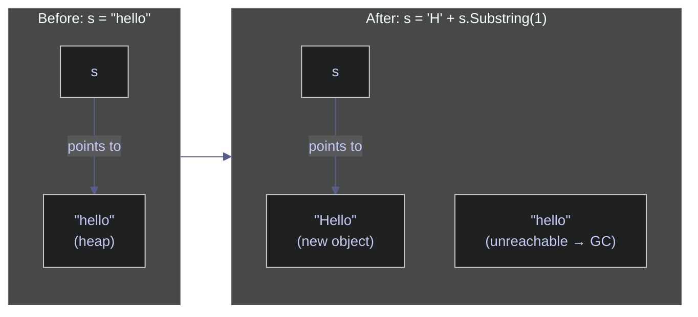
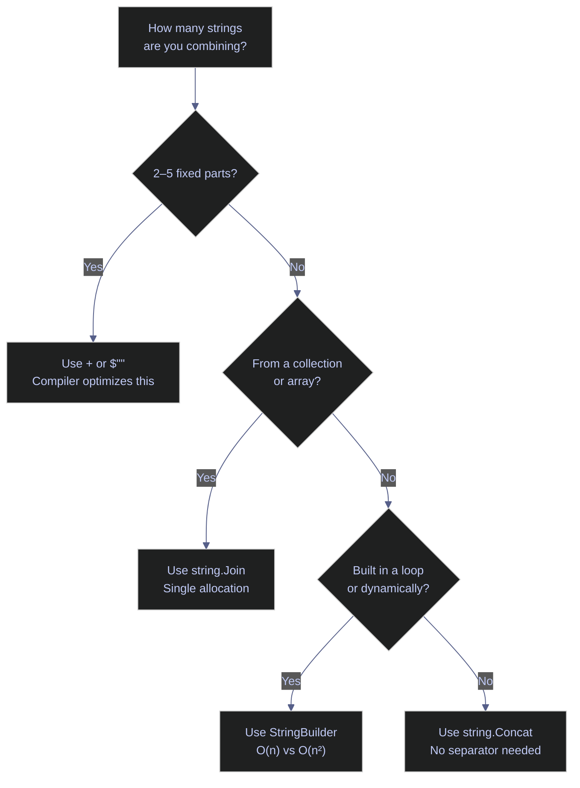

# 02. Strings - C#

> [!quote]
> "In our daily lives as programmers, we process text strings a lot. So I tried to work hard on text processing, namely the string class and regular expressions."
>
> — **Yukihiro Matsumoto**, creator of Ruby

## String Creation & Basics

This section covers the fundamental building blocks of string handling in C#: literal syntax, type conversions, construction patterns, and the immutability guarantee that shapes how strings behave at runtime.

### Literals and declaration

C# provides several literal syntaxes for creating strings, from standard double-quoted literals to verbatim and raw string literals that simplify paths and multiline content.

#### Declare a string and a char

`string` (alias for `System.String`) represents an immutable sequence of UTF-16 characters. `char` represents a single Unicode character occupying 2 bytes. Double quotes delimit strings; single quotes delimit `char` values.

```csharp
using System.Diagnostics;
using System.Globalization;
using System.Text;
using System.Text.RegularExpressions;

string s1 = "hello";
char c1 = 'A';
s1
$"Char: '{c1}' (type: {c1.GetType().Name})"
```

```text
"hello"
'A' (type: Char)
```

#### Disable escape processing with verbatim strings

Prefix a string literal with `@` to create a verbatim string where backslashes are treated as literal characters. This eliminates double-backslash escaping for file paths, regex patterns, and any text containing backslashes. Verbatim and escaped strings produce identical runtime values.

```csharp
string s2 = @"C:\Users\new\test";
string s3 = "C:\\Users\\new\\test";
s2
s3
s2 == s3
```

```text
C:\Users\new\test
C:\Users\new\test
Same? True
```

#### Create multiline strings with verbatim and raw literals

Verbatim strings (`@""`) preserve line breaks exactly as written. Raw string literals (C# 11+) use triple quotes (`"""`) and automatically trim leading whitespace based on the indentation of the closing delimiter, making them ideal for embedded SQL, JSON, or XML.

```csharp
string s4 = @"This is
a multiline
string";
s4

string s5 = """
    This is a
    raw string literal
    """;
s5
```

```text
This is
a multiline
string
This is a
raw string literal
```

### Conversion and construction

Methods for converting other types to strings, assembling strings from parts, and checking for empty or null values.

#### Convert other types to string with ToString and Convert

Every type in C# inherits `ToString()` from `System.Object`, making it the universal conversion path. `Convert.ToString()` adds null safety — it returns `string.Empty` instead of throwing on `null`. For nullable references, chain `?.ToString()` with `??` to supply a fallback.

```csharp
#nullable enable
42.ToString()
3.14.ToString()
true.ToString()
Convert.ToString(42)

object? obj = null;
obj?.ToString() ?? "(null)"
```

```text
'42'
'3.14'
'True'
'42'
'(null)'
```

#### Repeat and concatenate strings

C# has no `*` operator for string repetition. Use `new string(char, count)` for single-character repeats, or `string.Concat` with `Enumerable.Repeat` for multi-character patterns. The `+` operator concatenates strings and is optimized by the compiler for small, fixed concatenations.

```csharp
new string('*', 5)
string.Concat(Enumerable.Repeat("ha", 3))
"hello" + " " + "world"
```

```text
'*****'
'hahaha'
'hello world'
```

#### Check for empty, null, and whitespace strings

C# strings have three distinct "nothing" states: `null` (no object), `""` (empty string with zero length), and whitespace-only (contains only spaces, tabs, or newlines). `string.IsNullOrEmpty` catches the first two; `string.IsNullOrWhiteSpace` catches all three. Prefer `string.Empty` over `""` for clarity when declaring empty strings.

> [!tip] IsNullOrEmpty vs IsNullOrWhiteSpace
> Use `IsNullOrWhiteSpace` when validating user input or external data — whitespace-only strings are almost never meaningful. Reserve `IsNullOrEmpty` for internal logic where whitespace may be intentional (e.g., formatting strings).

```csharp
string empty = "";
empty == ""
string.Empty
empty.Length
string.IsNullOrEmpty(" ")
string.IsNullOrEmpty("")
string.IsNullOrEmpty(null)
string.IsNullOrWhiteSpace("  ")
string.IsNullOrWhiteSpace("")
```

```text
True
""
0
False
True
True
True
True
```

### Immutability

The single most important property of `System.String` — every operation that appears to modify a string actually allocates a new object and returns it. Understanding this shapes how you write performant string code.

#### Understand string immutability and its implications

Once a `string` is created, its character sequence cannot change. Indexing into a string with assignment (`s[0] = 'H'`) is a compile error. Any transformation — `ToUpper()`, `Replace()`, `Substring()`, or concatenation — allocates a new `string` on the heap. The original is unchanged and becomes eligible for garbage collection if no other reference points to it.

> [!warning] Anti-pattern — concatenation in loops
> Each `+=` in a loop creates a new string object, copying all previous characters. For *n* iterations this is O(n²) in both time and allocations.

> [!success] Correct pattern
> Use `StringBuilder` for loop-based construction, `string.Join` for collections, and `+` or `$""` only for small, fixed concatenations (2–5 parts).

```csharp
string s = "hello";
s = 'H' + s.Substring(1);
s
```

```text
Hello
```

The diagram below shows what happens in memory. The variable `s` is reassigned to point to a new string object; the original `"hello"` is not modified — it becomes unreachable and is collected by the GC.



## Indexing & Slicing

Accessing individual characters and extracting substrings. C# uses 0-based indexing, hat (`^`) indexing from the end, and Range syntax (`..`) for slicing — all without allocating intermediate collections.

### Accessing characters and substrings

Direct character access by position, substring extraction, and Range syntax for slicing.

#### Indexing (0-based)

> [!info] Indexing and slicing
>
> - `s[i]` — returns a `char` at position `i`
> - `s[^i]` — indexes from the end (`^1` = last char), eliminating `s[s.Length - i]`
> - `s[a..b]` — substring via Range syntax (C# 8+), right-exclusive (`s[0..5]` = indices 0-4)
> - No step/stride support — use LINQ for every-nth-char
> - For pattern extraction, use Regex or Split instead of index math

```csharp
string s = "Hello, World!";

s[0]
s[1]
s[^1]
s[^2]
s[0..5]
s[..5]
s[7..]
s[^6..]
s[7..12]
```

```text
'H'
'e'
'!'
'd'
'Hello'
'Hello'
'World!'
'World!'
'World'
```

#### Extract substrings and stride through characters

`Substring(startIndex)` and `Substring(startIndex, length)` are the classic APIs; Range syntax (`s[7..]`) is the modern equivalent. C# has no built-in step/stride parameter — use LINQ `Where` with an index predicate for every-nth-character patterns, or `Reverse()` to reverse a string.

```csharp
s.Substring(7)
s.Substring(7, 5)

new string(s.Where((c, i) => i % 2 == 0).ToArray())
new string(s.Reverse().ToArray())

char[] arr = s.ToCharArray();
Array.Reverse(arr);
new string(arr)
```

```text
'World!'
'World'
'Hlo ol!'
'!dlroW ,olleH'
'!dlroW ,olleH'
```

#### Handle out-of-range access

Accessing a character beyond the string length throws `IndexOutOfRangeException`. Using a Range that exceeds bounds throws `ArgumentOutOfRangeException`. Neither returns `null` or a default — C# fails fast on invalid access.

> [!danger] No silent failure
> Unlike some languages that return empty strings or `None` for out-of-range access, C# throws immediately. Always validate indices against `s.Length` when working with dynamic positions.

> [!success] Safe access pattern
> Check bounds before indexing, or use `TryGetValue`-style patterns with ranges:
> ```csharp
> string safe = index < s.Length ? s[index].ToString() : "(out of range)";
> ```

```text
s[100]    → IndexOutOfRangeException
s[0..100] → ArgumentOutOfRangeException (range must be within bounds)
```

### Iterating characters

Three patterns for walking through a string character by character: `foreach` for simple iteration, LINQ `Select` for index-value pairs, and the classic `for` loop for index-based access.

#### Iterate with foreach

`foreach` yields each `char` in sequence. Combined with Range syntax, you can iterate over a substring without allocating a copy in older runtimes (C# 8+ Range on `string` returns a new `string`, but the iteration itself is straightforward).

```csharp
foreach (char ch in s[..5])
    Console.Write($"{ch} ");
```

```text
H e l l o
```

#### Enumerate characters with LINQ Select

LINQ's `Select` overload provides both the character and its index as a tuple, similar to Python's `enumerate()`. Destructure the tuple in the `foreach` header for clean access.

```csharp
foreach (var (ch, i) in s[..5].Select((c, i) => (c, i)))
    Console.WriteLine($"  [{i}] = '{ch}'");
```

```text
  [0] = 'H'
  [1] = 'e'
  [2] = 'l'
  [3] = 'l'
  [4] = 'o'
```

#### Iterate with a for loop

The classic index-based `for` loop gives direct control over start, end, and step. Prefer this when you need to skip characters, iterate in reverse, or access adjacent indices within the loop body.

```csharp
for (int i = 0; i < 5; i++)
    Console.WriteLine($"  [{i}] = '{s[i]}'");
```

```text
  [0] = 'H'
  [1] = 'e'
  [2] = 'l'
  [3] = 'l'
  [4] = 'o'
```

## String Methods

The built-in methods on `System.String` for transforming case, trimming whitespace, inspecting content, searching, splitting, joining, and encoding. All transformation methods return new strings — the original is never modified.

### Case conversion

Methods for changing letter case. C# provides `ToUpper()`, `ToLower()`, and `ToTitleCase()` (via `TextInfo`). There are no built-in `swapcase` or `casefold` equivalents.

#### Case Methods

> [!info] Case methods
>
> - `ToUpper()` / `ToLower()` — convert all characters
> - `ToTitleCase()` — via `CultureInfo.CurrentCulture.TextInfo`, capitalizes each word
> - No built-in `swapcase` or `casefold`
> - Culture-aware: `ToUpper(CultureInfo)` handles locale-specific rules (e.g., Turkish `i` → `İ`)

> [!warning] Anti-pattern
>
> Don't use `ToUpper()` for case-insensitive comparison — use `StringComparison.OrdinalIgnoreCase` instead.

> [!success] Correct pattern
>
> Use `StringComparison.OrdinalIgnoreCase` directly in `string.Equals`, `IndexOf`, `StartsWith`, or `Contains` — no intermediate uppercase string is created and locale edge cases (e.g., Turkish `I`) are avoided:
> ```csharp
> // Anti-pattern
> if (s.ToUpper() == "HELLO") { }
>
> // Correct
> if (string.Equals(s, "hello", StringComparison.OrdinalIgnoreCase)) { }
> if (s.Contains("hello", StringComparison.OrdinalIgnoreCase)) { }
> ```

```csharp
#nullable enable

string s = "  Hello, World!  ";

"hello world".ToUpper()
"HELLO WORLD".ToLower()
CultureInfo.CurrentCulture.TextInfo.ToTitleCase("hello world")
```

```text
'HELLO WORLD'
'hello world'
'Hello World'
```

### Whitespace and padding

Methods for stripping leading/trailing whitespace (or custom characters) and padding strings to a fixed width.

#### Trim, TrimStart, TrimEnd, and Pad

`Trim()` removes whitespace from both ends; `TrimStart()`/`TrimEnd()` remove from one side only. Pass a `char` argument to trim specific characters instead of whitespace. `PadLeft`/`PadRight` extend a string to a target width, filling with spaces or a specified character — useful for tabular output and zero-padding.

```csharp
s.Trim()
s.TrimStart()
s.TrimEnd()
"Hello!!".Trim('!')
"hello".PadLeft(20)
"hello".PadRight(20)
"hello".PadLeft(20, '*')
"42".PadLeft(8, '0')
```

```text
'Hello, World!'
'Hello, World!  '
'  Hello, World!'
'Hello'
'               hello'
'hello               '
'***************hello'
'00000042'
```

### Character and content checks

Inspecting individual characters and testing whole strings for content categories.

#### Check character categories with char.IsXxx

The `char` struct provides static methods to classify individual characters: `IsLetter`, `IsDigit`, `IsWhiteSpace`, `IsUpper`, `IsLower`, and others. These are Unicode-aware — `IsLetter` returns `true` for letters in any script, not just ASCII.

```csharp
char.IsLetter('A')
char.IsDigit('5')
char.IsWhiteSpace(' ')
char.IsUpper('A')
char.IsLower('a')
```

```text
True
True
True
True
True
```

#### Test whole strings with LINQ All

C# has no built-in `str.isalpha()` or `str.isdigit()` like Python. Instead, combine LINQ's `All` method with `char.IsXxx` predicates to test whether every character in a string satisfies a condition.

```csharp
"Hello".All(char.IsLetter)
"12345".All(char.IsDigit)
"Hello123".All(char.IsLetterOrDigit)
"HELLO".All(char.IsUpper)
"hello".All(char.IsLower)
"Hello".All(c => c < 128)
```

```text
True
True
True
True
True
True
```

### Search and location

Methods for finding substrings by position or existence.

#### Search with IndexOf, Contains, StartsWith, EndsWith

`IndexOf` returns the 0-based position of the first occurrence (or `-1` if not found). Pass a `startIndex` to search from a specific position. `LastIndexOf` searches from the end. `Contains`, `StartsWith`, and `EndsWith` return `bool` for existence checks. All support a `StringComparison` overload for case-insensitive matching. C# has no built-in occurrence counter — split on the target and subtract one, or use `Regex.Matches(...).Count`.

```csharp
s = "Hello, World! Hello, C#!";
s.IndexOf("Hello")
s.IndexOf("Hello", 1)
s.LastIndexOf("Hello")
s.IndexOf("Java")
s.Contains("World")
s.StartsWith("Hello")
s.EndsWith("!")

int count = s.Split("Hello").Length - 1;
count
```

```text
0
14
14
-1
True
True
True
2
```

### Comparison and ordering

Methods for comparing strings for equality and sort order — distinct from searching by position.

#### Compare strings for ordering with string.Compare and CompareTo

`string.Compare` returns a negative, zero, or positive `int` indicating sort order. `CompareTo` is the instance-method equivalent but defaults to `CurrentCulture` comparison — making it culture-sensitive and inappropriate for programmatic keys. `string.CompareOrdinal` performs a fast code-point-by-code-point comparison without culture rules — use it for identifiers, keys, and paths where linguistic sorting is irrelevant.

> [!question] Ordinal vs culture-aware comparison
> Use `StringComparison.Ordinal` (or `OrdinalIgnoreCase`) for internal identifiers, dictionary keys, file paths, and protocol strings. Use `StringComparison.CurrentCulture` only when displaying sorted results to users where locale-specific ordering matters (e.g., German ä sorting near a).

```csharp
string.Compare("apple", "banana")
string.Compare("banana", "apple")
string.Compare("apple", "apple")
"apple".CompareTo("banana")
string.Compare("hello", "HELLO", StringComparison.OrdinalIgnoreCase)
string.CompareOrdinal("hello", "HELLO")
```

```text
-1
1
0
-1
0
32
```

### Replace, split, and join

Methods for substituting substrings, tokenizing strings into arrays, and reassembling arrays into strings.

#### Replace substrings and split strings into arrays

`Replace` substitutes all occurrences — there is no max-count parameter (use `Regex.Replace` with a count for first-only replacement). `Split` tokenizes a string by a delimiter and returns a `string[]`. Pass an `int` count to limit the number of resulting parts. Splitting on `null` with `RemoveEmptyEntries` splits on any whitespace and discards empty segments, equivalent to Python's `str.split()`.

```csharp
s.Replace("Hello", "Hi")

string csv = "apple,banana,cherry";
string.Join(", ", csv.Split(','))
string.Join(", ", csv.Split(',', 2))
string words = "  hello  world  ";
string.Join(", ", words.Split((char[]?)null, StringSplitOptions.RemoveEmptyEntries))
string.Join(", ", words.Split(' '))
```

```text
'Hi, World! Hi, C#!'
[apple, banana, cherry]
[apple, banana,cherry]
[hello, world]
[, , hello, , world, , ]
```

#### Control split behavior with StringSplitOptions and rejoin with Join

`StringSplitOptions.RemoveEmptyEntries` discards empty segments from consecutive delimiters. `TrimEntries` (.NET 5+) trims whitespace from each segment after splitting. `string.Join` reassembles an array with a separator; `string.Concat` joins without any separator.

```csharp
string.Join(", ", "a,,b,,c".Split(',', StringSplitOptions.RemoveEmptyEntries))
string.Join(", ", " a , b , c ".Split(',', StringSplitOptions.TrimEntries))

string[] parts = { "hello", "world", "csharp" };
string.Join(' ', parts)
string.Join(", ", parts)
string.Join("->", parts)
string.Concat(parts)
```

```text
[a, b, c]
[a, b, c]
'hello world csharp'
'hello, world, csharp'
'hello->world->csharp'
'helloworldcsharp'
```

### Encoding

Converting between strings (UTF-16 in memory) and byte arrays for I/O, hashing, or network transmission.

#### Convert between strings and byte arrays with Encoding

`Encoding.UTF8.GetBytes` serializes a string to a UTF-8 byte array; `GetString` reverses the process. Use `Encoding.ASCII` for 7-bit ASCII or `Encoding.Unicode` for UTF-16LE. For pure ASCII strings, UTF-8 and ASCII produce identical bytes.

> [!tip] BOM awareness
> `Encoding.UTF8` does not emit a BOM (byte order mark). Use `new UTF8Encoding(true)` if a BOM is required for file interoperability.

```csharp
byte[] utf8 = System.Text.Encoding.UTF8.GetBytes("hello");
byte[] ascii = System.Text.Encoding.ASCII.GetBytes("hello");
string.Join(", ", utf8)
string.Join(", ", ascii)
System.Text.Encoding.UTF8.GetString(utf8)
```

```text
[104, 101, 108, 108, 111]
[104, 101, 108, 108, 111]
'hello'
```

## String Formatting

Embedding values into strings and controlling how numbers, dates, and currencies are displayed. C# offers three mechanisms: string interpolation (`$""`), `String.Format`, and `ToString` with format specifiers.

### Interpolation and composite formatting

The primary ways to embed expressions into string literals.

#### Embed values with string interpolation

String interpolation (`$""`) is the preferred approach. Expressions inside `{...}` are evaluated at runtime and converted to strings. You can place any valid C# expression inside the braces — arithmetic, method calls, ternary operators. For alignment and format specifiers, use the syntax `{expr,alignment:format}`.

```csharp
string name = "Alice";
int age = 30;
double n = 1234567.89123;
double pct = 0.856;

$"Name: {name}, Age: {age}"
age + 1
name.ToUpper()
```

```text
Name: Alice, Age: 30
31
ALICE
```

#### Format strings with String.Format (composite formatting)

`String.Format` is the older API that uses numbered placeholders (`{0}`, `{1}`). It is still useful when the format string is stored externally (resource files, config) or constructed dynamically — interpolation requires a compile-time literal. The placeholder syntax supports the same alignment and format specifiers as interpolation: `{index,alignment:format}`.

```csharp
String.Format("Name: {0}, Age: {1}", name, age)
String.Format("{0:C2}", 1234.5)
String.Format("{0,-20}|{1,10}", "Left", "Right")
```

```text
Name: Alice, Age: 30
$1,234.50
Left                |     Right
```

### Numeric format specifiers

Standard format strings passed to `ToString("X")` or inside interpolation braces `{value:X}` control how numbers are displayed.

#### Format numbers with standard specifiers

| Specifier | Meaning | Example |
|---|---|---|
| `F` | Fixed-point | `1234567.89` |
| `N` | Number with group separator | `1,234,567.89` |
| `E` | Scientific notation | `1.23E+06` |
| `G` | General (compact) | `1235` |
| `P` | Percentage (multiplies by 100) | `85.6%` |
| `C` | Currency (locale-aware) | `$1,234,567.89` |
| `D` | Decimal (integers only) | `255` |
| `X`/`x` | Hexadecimal upper/lower | `FF` / `ff` |

Append a digit to control precision: `F2` = 2 decimal places, `D8` = zero-padded to 8 digits. Use `Convert.ToString(value, base)` for binary (base 2) or octal (base 8).

```csharp
n.ToString("F2")
n.ToString("F0")
n.ToString("N2")
n.ToString("E2")
n.ToString("G4")
pct.ToString("P1")
n.ToString("C2")

int x = 255;
x.ToString("D")
x.ToString("X")
x.ToString("x")
x.ToString("D8")
Convert.ToString(x, 2)
Convert.ToString(x, 8)
```

```text
1234567.89
1234568
1'234'567.89
1.235E+06
1.235E+06
85.6%
$1,234,567.89
255
FF
ff
00000255
11111111
377
```

### Alignment and culture-specific formatting

Controlling field width for tabular output and formatting numbers according to locale conventions.

#### Align strings and format currencies by culture

`PadLeft`/`PadRight` align strings within a fixed-width field. For culture-specific formatting, pass a `CultureInfo` instance to `ToString` — the runtime uses the culture's number group separator, decimal separator, and currency symbol. This is essential for financial applications that must display amounts in the user's locale.

```csharp
string s = "hi";
s.PadLeft(10, '*')
s.PadRight(10, '*')

double amt = 1234567.89;
amt.ToString("C2", new CultureInfo("en-US"))
amt.ToString("C2", new CultureInfo("fr-FR"))
amt.ToString("C0", new CultureInfo("ja-JP"))
amt.ToString("C2", new CultureInfo("zh-CN"))
amt.ToString("C2", new CultureInfo("pt-BR"))
amt.ToString("C2", new CultureInfo("en-GB"))
```

```text
'********hi'
'hi********'
$1,234,567.89
1 234 567,89 €
￥1,234,568
¥1,234,567.89
R$ 1.234.567,89
£1,234,567.89
```

## Efficient String Building (StringBuilder)

Strategies for building strings without the O(n²) penalty of repeated concatenation. `StringBuilder` for loops, `string.Join` for collections, and `+` for small fixed concatenations.



### StringBuilder

`StringBuilder` maintains a mutable internal `char[]` buffer, appending in place without allocating new string objects on every operation.

#### Compare StringBuilder vs string + performance

> [!info] StringBuilder
>
> - Modifies an internal char buffer in place — `Append`/`AppendLine`/`Insert`/`Replace`
> - O(n) for n appends vs O(n²) for `string +` in a loop
> - Pre-allocate capacity for known sizes: `new StringBuilder(1024)`
> - Use for building strings in loops, large template assembly, CSV generation
> - For simple concatenation (2–5 strings), `+` or `$""` is cleaner; for collections, `string.Join`

The benchmark below demonstrates the difference: 50,000 `+=` operations take seconds because each creates a new string copying all prior characters, while `StringBuilder.Append` completes in under a millisecond.

```csharp
var sw = Stopwatch.StartNew();
string result = "";
for (int i = 0; i < 50000; i++)
    result += i.ToString();
sw.Stop();
var t1 = sw.Elapsed.TotalSeconds;
$"+ in loop (50k):     {t1:F4}s  len={result.Length}"

sw.Restart();
var sb = new StringBuilder();
for (int i = 0; i < 50000; i++)
    sb.Append(i);
result = sb.ToString();
sw.Stop();
var t2 = sw.Elapsed.TotalSeconds;
$"StringBuilder (50k): {t2:F4}s  len={result.Length}"
t1/t2
```

```text
4.2222s  len=238890
0.0005s  len=238890
StringBuilder is 8989.1x faster
```

#### Build strings with Append, Insert, Replace, Remove

`Append` adds to the end, `AppendLine` adds a string plus a newline, `Insert` places text at a specific index, `Replace` swaps substrings in place, and `Remove` deletes a range. Pre-allocate capacity with the constructor to avoid internal buffer resizing when the final size is known.

```csharp
sb = new StringBuilder("Hello");
sb.Append(", ");
sb.Append("World!");
sb.AppendLine();
sb.AppendLine($"Number: {42}");
sb.Insert(0, ">>> ");
sb.Replace("World", "C#");
sb
sb.Length
sb.Capacity

var sb2 = new StringBuilder(1000);
sb2.Capacity
```

```text
>>> Hello, C#!
42

28
33
1000
```

### Join and Concat

For assembling strings from collections or a small number of parts without `StringBuilder`.

#### Assemble strings with string.Join and string.Concat

`string.Join` inserts a separator between each element of a collection — the single most efficient way to build delimited output (CSV rows, log lines). `string.Concat` joins without a separator. For 2–5 known parts, the `+` operator is fine — the compiler optimizes small fixed concatenations into a single `string.Concat` call.

```csharp
var items = Enumerable.Range(0, 5).Select(i => $"item_{i}");
string.Join(", ", items)
string.Concat(Enumerable.Range(0, 5))

string first = "Hello";
string last = "World";
string full = first + " " + last;
full
```

```text
'item_0, item_1, item_2, item_3, item_4'
'01234'
'Hello World'
```

### High-performance string processing with Span

For hot paths where allocation pressure matters, `ReadOnlySpan<char>` and `string.Create` avoid intermediate string objects entirely.

#### Slice strings without allocation using AsSpan

`string.AsSpan()` returns a `ReadOnlySpan<char>` — a stack-only view into the string's character buffer with zero allocation. Many BCL methods (`int.Parse`, `Regex`, `MemoryExtensions`) accept spans directly, allowing parsing and inspection without creating substring copies.

```csharp
string data = "2026-04-04|AAPL|182.50";
ReadOnlySpan<char> span = data.AsSpan();

ReadOnlySpan<char> date = span[..10];
ReadOnlySpan<char> ticker = span[11..15];
ReadOnlySpan<char> price = span[16..];

date.ToString()
ticker.ToString()
double.Parse(price)
```

```text
2026-04-04
AAPL
182.5
```

#### Build strings with string.Create

`string.Create` allocates exactly one string and lets you write directly into its buffer via a `SpanAction<char, TState>`. This avoids the temporary allocations that `StringBuilder` or concatenation would produce.

```csharp
string result = string.Create(11, (first: "Hello", sep: ' ', last: "World"), (span, state) =>
{
    state.first.AsSpan().CopyTo(span);
    span[5] = state.sep;
    state.last.AsSpan().CopyTo(span[6..]);
});
result
```

```text
Hello World
```

## Regular Expressions

The `System.Text.RegularExpressions` namespace provides pattern matching, extraction, replacement, and splitting. Always use verbatim strings (`@""`) for patterns to avoid double-escaping backslashes.

### Matching and capturing

Finding patterns in text and extracting matched groups.

#### Find matches with Regex.Match, Matches, and IsMatch

> [!info] Regex
>
> - `Regex.Match` — returns the first match (check `.Success`)
> - `Regex.Matches` — returns all matches as `MatchCollection`
> - Use `@""` verbatim strings to avoid double-escaping backslashes
> - `Groups[0]` is the full match; `Groups[1..n]` are capture groups
> - For simple `Contains`/`StartsWith` checks, string methods are faster

> [!warning] Anti-patterns
>
> - **Not checking `.Success`** before reading `.Value` — empty match is not null
> - **Recompiling the same pattern in a loop** — cache with `new Regex()`

> [!success] Correct patterns
>
> Always check `.Success` before accessing match data, and cache compiled `Regex` instances outside loops:
> ```csharp
> // Anti-pattern: no Success check
> string val = Regex.Match(text, @"\d+").Value;  // returns "" if no match — silent bug
>
> // Correct: guard with Success
> var m = Regex.Match(text, @"\d+");
> if (m.Success) Console.WriteLine(m.Value);
>
> // Anti-pattern: recompile every iteration
> foreach (var line in lines)
>     Regex.IsMatch(line, @"\d{3}-\d{4}");
>
> // Correct: compile once, reuse
> var pat = new Regex(@"\d{3}-\d{4}", RegexOptions.Compiled);
> foreach (var line in lines)
>     pat.IsMatch(line);
> ```

`Regex.Match` returns the first match; `Regex.Matches` returns all matches as a `MatchCollection`. `Regex.IsMatch` is a quick boolean check that avoids allocating match objects when you only need yes/no.

```csharp
string text = "Contact us at support@email.com or sales@company.org. Call 123-456-7890 or 987-654-3210.";

var match = Regex.Match(text, @"\d{3}-\d{3}-\d{4}");
if (match.Success)
    Console.WriteLine($"Found: {match.Value} at [{match.Index}:{match.Index + match.Length}]");

var phones = Regex.Matches(text, @"\d{3}-\d{3}-\d{4}");
var emails = Regex.Matches(text, @"[\w.+-]+@[\w-]+\.[\w.]+");
string.Join(", ", phones.Select(m => m.Value))
string.Join(", ", emails.Select(m => m.Value))

foreach (Match m in phones)
    Console.WriteLine($"  {m.Value} at [{m.Index}:{m.Index + m.Length}]");

Regex.IsMatch("12345", @"^\d+$")
Regex.IsMatch("123a5", @"^\d+$")
```

```text
123-456-7890 at [59:71]
123-456-7890, 987-654-3210
support@email.com, sales@company.org.
  123-456-7890 at [59:71]
  987-654-3210 at [75:87]
True
False
```

#### Extract sub-matches with capture groups

Parentheses `(...)` in a pattern create numbered capture groups accessible via `Groups[1]`, `Groups[2]`, etc. (`Groups[0]` is always the full match). Named groups `(?<name>...)` use angle brackets (not `P<>` as in Python) and are accessed via `Groups["name"]`.

```csharp
match = Regex.Match(text, @"(\d{3})-(\d{3})-(\d{4})");
if (match.Success)
{
    Console.WriteLine($"Full:     {match.Groups[0].Value}");
    Console.WriteLine($"Area:     {match.Groups[1].Value}");
    Console.WriteLine($"Mid:      {match.Groups[2].Value}");
    Console.WriteLine($"Last:     {match.Groups[3].Value}");
}

match = Regex.Match(text, @"(?<user>[\w.+-]+)@(?<domain>[\w-]+\.[\w.]+)");
if (match.Success)
{
    Console.WriteLine($"User:     {match.Groups["user"].Value}");
    Console.WriteLine($"Domain:   {match.Groups["domain"].Value}");
}
```

```text
123-456-7890
123
456
7890
support
email.com
```

### Replace, split, and compilation

Transforming text with pattern-based replacement, splitting on patterns, and pre-compiling for performance.

#### Replace, split, and compile regex patterns

`Regex.Replace` substitutes matches — pass a string for static replacement, a `MatchEvaluator` lambda for dynamic transformation, or `$1`/`$2` backreferences for group rearrangement. `Regex.Split` tokenizes on a pattern instead of a fixed delimiter. For patterns used repeatedly, instantiate `new Regex(..., RegexOptions.Compiled)` once — this precompiles the pattern to IL, avoiding re-parsing on each call.

```csharp
Regex.Replace(text, @"\d{3}-\d{3}-\d{4}", "***-***-****")

Regex.Replace("price: 50, qty: 3", @"\d+", m => (int.Parse(m.Value) * 2).ToString())

Regex.Replace("user@host", @"(\w+)@(\w+)", "$2/$1")

string.Join(", ", Regex.Split("Hello World. How are you? Fine!", @"[.!?]\s*"))
string.Join(", ", Regex.Split("a , b , c", @"\s*,\s*"))

var phonePat = new Regex(@"\d{3}-\d{3}-\d{4}", RegexOptions.Compiled);
string.Join(", ", phonePat.Matches(text).Select(m => m.Value))
phonePat.Replace(text, "REDACTED")
```

```text
Contact us at support@email.com or sales@company.org. Call ***-***-**** or ***-***-****.
6
host/user
Hello World, How are you, Fine, 
a, b, c
123-456-7890, 987-654-3210
Contact us at support@email.com or sales@company.org. Call REDACTED or REDACTED.
```

### Syntax reference

Quick-reference tables for regex syntax elements.

#### Regex syntax — characters, quantifiers, anchors, groups

A condensed reference for .NET regex syntax. All patterns apply to `System.Text.RegularExpressions`.

```text
CHARACTERS
.         Any character (except newline)
\d        Digit [0-9]              \D  Non-digit
\w        Word char [a-zA-Z0-9_]   \W  Non-word
\s        Whitespace [ \t\n\r]     \S  Non-whitespace
\b        Word boundary             \B  Non-word boundary

QUANTIFIERS
*         0 or more (greedy)        *?  0 or more (lazy)
+         1 or more (greedy)        +?  1 or more (lazy)
?         0 or 1 (optional)         ??  0 or 1 (lazy)
{n}       Exactly n                 {n,m}  Between n and m
{n,}      n or more                 {n,m}? Between n and m (lazy)

ANCHORS
^         Start of string/line      $   End of string/line
\A        Start of string only      \Z  End of string only

GROUPS
(...)     Capture group             (?:...)  Non-capture group
(?<name>...)  Named group (C# uses <> not P<>)
\1, \2    Backreference by number   \k<name> By name

LOOKAROUND
(?=...)   Lookahead (positive)      (?!...)  Lookahead (negative)
(?<=...)  Lookbehind (positive)     (?<!...) Lookbehind (negative)

CHARACTER CLASSES
[abc]     Any of a, b, c            [^abc]  NOT a, b, c
[a-z]     Range a through z         [a-zA-Z0-9]  Alphanumeric
|         OR (alternation)
```

### Options and flags

`RegexOptions` flags modify matching behavior. Combine multiple flags with bitwise OR (`|`).

#### Control matching with RegexOptions flags

`IgnoreCase` enables case-insensitive matching. `Multiline` makes `^` and `$` match line boundaries instead of string boundaries. `Singleline` makes `.` match newline characters (these two are independent despite the confusing names). `IgnorePatternWhitespace` allows formatting patterns with whitespace and inline `#` comments for readability.

```csharp
string text = "Hello\nworld\nHELLO";

var ic = Regex.Matches(text, @"hello", RegexOptions.IgnoreCase);
string.Join(", ", ic.Select(m => m.Value))

var ml = Regex.Matches(text, @"^\w+", RegexOptions.Multiline);
string.Join(", ", ml.Select(m => m.Value))

Regex.IsMatch(text, @"Hello.world", RegexOptions.Singleline)
```

```text
Hello, HELLO
Hello, world, HELLO
True
```

#### Write readable patterns with IgnorePatternWhitespace

`IgnorePatternWhitespace` ignores unescaped whitespace in the pattern and enables `#` comments. This makes complex patterns self-documenting. Combine flags with bitwise OR to apply multiple options.

```csharp
var pattern = new Regex(@"
    (\d{3})     # area code
    [-.]        # separator
    (\d{3})     # first 3 digits
    [-.]        # separator
    (\d{4})     # last 4 digits
", RegexOptions.IgnorePatternWhitespace);
var m2 = pattern.Match("Call 123-456-7890");
if (m2.Success) Console.WriteLine($"Verbose:     {m2.Groups[1]}-{m2.Groups[2]}-{m2.Groups[3]}");
```

```text
123-456-7890
```

```csharp
var combined = Regex.Matches(text, @"^hello", RegexOptions.IgnoreCase | RegexOptions.Multiline);
string.Join(", ", combined.Select(m => m.Value))
```

```text
Hello, HELLO
```

#### RegexOptions summary table

| Option | Effect |
|---|---|
| `IgnoreCase` | Case-insensitive matching |
| `Multiline` | `^` and `$` match line boundaries |
| `Singleline` | `.` matches newline characters |
| `IgnorePatternWhitespace` | Whitespace in pattern is ignored, enables comments |
| `Compiled` | Precompiles regex to IL for repeated use |
| `RightToLeft` | Search proceeds right to left |
| `ExplicitCapture` | Only named groups capture, `(...)` becomes non-capturing |
| `NonBacktracking` | .NET 7+, guaranteed linear time (no catastrophic backtracking) |

### Common patterns

Ready-to-use validation patterns for frequently matched formats.

#### Common regex patterns for validation

| Pattern | Regex |
|---|---|
| Email | `^[\w.+-]+@[\w-]+\.[\w.]+$` |
| URL | `https?://[\w./\-?=&#]+` |
| IPv4 | `\b\d{1,3}(\.\d{1,3}){3}\b` |
| Date (YYYY-MM-DD) | `\d{4}-(?:0[1-9]\|1[0-2])-(?:0[1-9]\|[12]\d\|3[01])` |
| Time (HH:MM) | `(?:[01]\d\|2[0-3]):[0-5]\d` |
| Hex color | `^#[0-9a-fA-F]{6}$` |
| Phone (US) | `\(?\d{3}\)?[-.\s]?\d{3}[-.\s]?\d{4}` |
| Zip code (US) | `\d{5}(-\d{4})?` |
| Strong password | `^(?=.*[a-z])(?=.*[A-Z])(?=.*\d)(?=.*[@$!%*?&]).{8,}$` |

```csharp
var patterns = new (string name, string pat)[] {
    ("email",           @"^[\w.+-]+@[\w-]+\.[\w.]+$"),
    ("URL",             @"https?://[\w./\-?=&#]+"),
    ("IPv4",            @"\b\d{1,3}(\.\d{1,3}){3}\b"),
    ("date YYYY-MM-DD", @"\d{4}-(?:0[1-9]|1[0-2])-(?:0[1-9]|[12]\d|3[01])"),
    ("time HH:MM",      @"(?:[01]\d|2[0-3]):[0-5]\d"),
    ("hex color",       @"^#[0-9a-fA-F]{6}$"),
    ("phone US",        @"\(?\d{3}\)?[-.\s]?\d{3}[-.\s]?\d{4}"),
    ("zip code US",     @"\d{5}(-\d{4})?"),
    ("strong password", @"^(?=.*[a-z])(?=.*[A-Z])(?=.*\d)(?=.*[@$!%*?&]).{8,}$"),
};
foreach (var (pname, pat) in patterns)
    Console.WriteLine($"  {pname,-20}: {pat}");
```

```text
email               : ^[\w.+-]+@[\w-]+\.[\w.]+$
URL                 : https?://[\w./\-?=&#]+
IPv4                : \b\d{1,3}(\.\d{1,3}){3}\b
date YYYY-MM-DD     : \d{4}-(?:0[1-9]|1[0-2])-(?:0[1-9]|[12]\d|3[01])
time HH:MM          : (?:[01]\d|2[0-3]):[0-5]\d
hex color           : ^#[0-9a-fA-F]{6}$
phone US            : \(?\d{3}\)?[-.\s]?\d{3}[-.\s]?\d{4}
zip code US         : \d{5}(-\d{4})?
strong password     : ^(?=.*[a-z])(?=.*[A-Z])(?=.*\d)(?=.*[@$!%*?&]).{8,}$
```

### Source-generated regex (.NET 7+)

The `[GeneratedRegex]` attribute replaces `RegexOptions.Compiled` with build-time source generation — faster startup, AOT-compatible, and trim-safe.

#### Use GeneratedRegex for compile-time regex generation

Decorate a `partial` method returning `Regex` with `[GeneratedRegex]`. The source generator emits optimized matching code at compile time, eliminating the runtime IL-emit cost of `RegexOptions.Compiled`. The generated code is also compatible with Native AOT and trimming, which `Compiled` is not.

> [!tip] When to use GeneratedRegex vs Compiled
> Use `[GeneratedRegex]` for all patterns known at compile time — it is strictly better than `Compiled` in every dimension (startup, throughput, AOT). Reserve `new Regex(..., RegexOptions.Compiled)` only when the pattern is constructed dynamically at runtime. Analyzer `SYSLIB1045` automatically flags existing `Regex` usages that can be converted, with a one-click fixer in Visual Studio.

```csharp
// Requires: partial class containing the method
// partial class MyRegexHelper
// {
//     [GeneratedRegex(@"\d{3}-\d{3}-\d{4}", RegexOptions.IgnoreCase)]
//     private static partial Regex PhonePattern();
//
//     // Usage:
//     // var match = PhonePattern().Match(text);
// }
```
