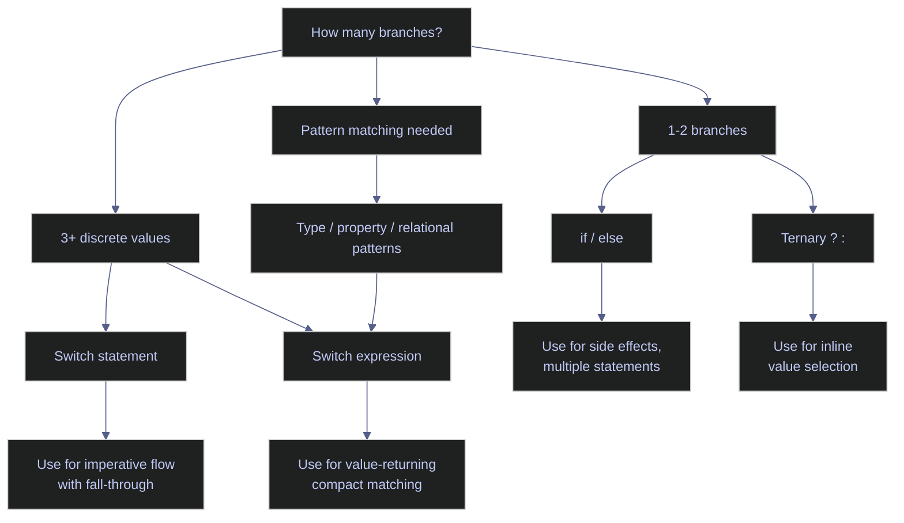
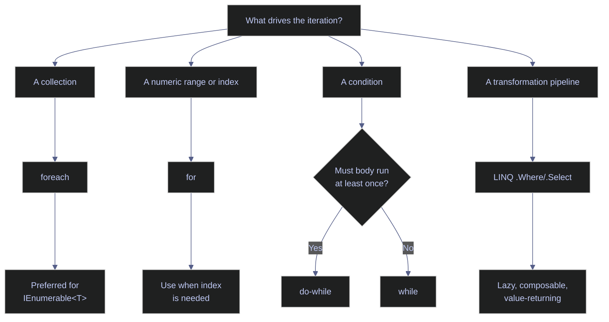

# 03. Control Flow - C#

> [!quote]
> "The quality of programmers is a decreasing function of the density of go to statements in the programs they produce."
>
> — **Edsger W. Dijkstra**, *Go To Statement Considered Harmful* (1968)

C# control flow covers conditional branching (`if`/`else`, `switch`, ternary), loops (`for`, `foreach`, `while`), iterator methods with `yield return`, and LINQ pipelines as functional equivalents to imperative loops. C# enforces explicit `bool` conditions — there is no truthy/falsy coercion — and pattern matching (type, property, relational, list) integrates deeply into both `switch` and `if` expressions.

## Conditional Statements

C# provides three families of conditional constructs: `if`/`else` chains for boolean branching, `switch` statements and expressions for multi-way value and pattern matching, and null-handling operators (`??`, `??=`, `is`) for safe navigation. Conditions must always be explicit `bool` — no implicit truthy/falsy conversion.



### Branching with if / else

Basic conditional branching evaluates explicit `bool` expressions top-down. C# has no truthy/falsy coercion, so every condition must resolve to `true` or `false`.

#### if / else if / else — explicit bool conditions

Conditions must be explicit `bool` expressions — no truthy/falsy (unlike Python/JS). `else if` chains evaluate top-down — first match wins. Place the most restrictive condition first, since each branch is only reached if all conditions above it failed.

> [!warning] Always use braces
>
> Always use braces — omitting them leads to bugs when adding statements later. Don't use deep `if`/`else` nesting — extract to methods or use switch expressions.

> [!success] Best practice
>
> Always wrap `if`/`else` bodies in braces, even for single-line branches. Replace deep nesting with guard clauses or switch expressions to keep methods flat and readable.

```csharp
int score = 85;
string grade;

if (score >= 90)
    grade = "A";
else if (score >= 80)
    grade = "B";
else if (score >= 70)
    grade = "C";
else if (score >= 60)
    grade = "D";
else
    grade = "F";
$"Score {score} → Grade {grade}"

int x = 10;
if (x > 0)
    Console.WriteLine($"{x} is positive");
```

```text
Score 85 → Grade B
10 is positive
```

#### Nested ternary — ? : chains

`condition ? trueVal : falseVal` chains right-to-left. Compact for simple 2-3 tier classification. Don't nest more than 2 levels — use switch expression for complex cases.

```csharp
int val = 15;
string label = val > 20 ? "high" : val > 10 ? "mid" : "low";
$"val={val} → {label}"
```

```text
val=15 → mid
```

#### No truthy/falsy — explicit bool conditions

C# requires explicit `bool` in every condition — no truthy/falsy. `if (items)`, `if (str)` are compile errors — use `items.Count > 0`, `string.IsNullOrEmpty(s)`, `x != 0`, or `obj != null`. This prevents `if (x = 5)` bugs (assignment returns `int`, not `bool`). For null checks, `is null` is preferred over `== null` because `is` cannot be overloaded. Chained comparisons like `10 < x < 20` are also compile errors — use `&&` to combine conditions.

```csharp
#nullable enable
var items = new List<int> { 1, 2, 3 };
if (items.Count > 0)
    Console.WriteLine($"List has {items.Count} items");

string name = "";
if (string.IsNullOrEmpty(name))
    Console.WriteLine("Name is empty");

string? value = null;
if (value is null)
    Console.WriteLine("Value is null");

if (10 < x && x < 20)
    Console.WriteLine($"{x} is between 10 and 20");
```

```text
List has 3 items
Name is empty
Value is null
```

### Switch statements and expressions

The `switch` construct comes in two forms: the traditional statement (multi-line, imperative) and the modern expression (single-expression, value-returning). Switch expressions support relational, type, property, and combinatorial patterns — making them the preferred choice for most pattern matching scenarios in modern C#.

#### Switch statement — discrete value matching with mandatory break

Each case must end with `break` (no fall-through — compile error in C#, unlike C). Empty cases can stack for multiple values. Only constants allowed in case labels. The compiler warns on missing enum cases.

```csharp
string command = "quit";
switch (command)
{
    case "start":
        Console.WriteLine("Starting...");
        break;
    case "stop":
    case "quit":
    case "exit":
        Console.WriteLine("Stopping...");
        break;
    default:
        Console.WriteLine($"Unknown: {command}");
        break;
}
```

```text
Stopping...
```

#### Switch expression — compact value-returning form with or pattern and _ wildcard

> [!info] Switch expression syntax
>
> - `variable switch { pattern => result, _ => default }` — returns a value directly
> - `or` pattern combines cases
> - `_` is the discard wildcard
> - Compiler warns if cases are incomplete

> [!warning] Missing _ default causes MatchFailureException
>
> Missing `_` default causes `MatchFailureException` at runtime. Keep switch arms pure — no side effects.

> [!success] Always add a wildcard arm
>
> Always close a switch expression with `_ => ...` to handle unmatched inputs gracefully. Keep arms side-effect-free and return values rather than mutating state.

```csharp
string result = command switch
{
    "start" => "Starting...",
    "stop" or "quit" or "exit" => "Stopping...",
    _ => $"Unknown: {command}"
};
result
```

```text
Stopping...
```

#### Switch expression — relational patterns

Switch arms support relational operators (`>=`, `<`, `>`, `<=`). First match wins — order arms from most restrictive to least. Placing `>= 70` before `>= 90` would incorrectly match 95 as "C".

```csharp
grade = score switch
{
    >= 90 => "A",
    >= 80 => "B",
    >= 70 => "C",
    >= 60 => "D",
    _ => "F"
};
$"Score {score} → Grade {grade}"
```

```text
Score 85 → Grade B
```

#### Switch expression — type patterns and when guard

> [!info] Type patterns
>
> - `int n => ...` — matches integers and binds to `n`
> - `when` adds a guard: `int n when n < 0 => ...`
> - Combines type checking and casting in one step — no explicit cast needed

```csharp
object[] values = { 42, -5, "hello", new[] { 1, 2, 3 }, 3.14 };
foreach (var v in values)
{
    string desc = v switch
    {
        int n when n > 0 => $"positive int: {n}",
        int n            => $"non-positive int: {n}",
        string s         => $"string: '{s}'",
        int[] arr        => $"array starting with {arr[0]}, {arr.Length - 1} more",
        _                => $"other: {v.GetType().Name}"
    };
    Console.WriteLine($"  {v,-12} → {desc}");
}
```

```text
  42           → positive int: 42
  -5           → non-positive int: -5
  hello        → string: 'hello'
  System.Int32[] → array starting with 1, 2 more
  3.14         → other: Double
```

#### Switch expression — property patterns ({ Property: value })

> [!info] Property patterns
>
> - `{ PropertyName: value }` — matches when the property equals the value
> - Nest for multi-property: `{ Month: 12, Day: 25 }`
> - Combine with relational patterns or `or`

```csharp
var date = new DateTime(2024, 12, 25);
string holiday = date switch
{
    { Month: 12, Day: 25 }                                       => "Christmas",
    { Month: 1, Day: 1 }                                         => "New Year",
    { DayOfWeek: DayOfWeek.Saturday or DayOfWeek.Sunday }        => "Weekend",
    _                                                             => "Regular day"
};
$"{date:yyyy-MM-dd} → {holiday}"
```

```text
2024-12-25 → Christmas
```

### Null handling and pattern matching

C# provides dedicated operators for null-safe programming that eliminate verbose `if (x != null)` checks and combine type testing with variable binding in a single expression.

#### Null-coalescing (??, ??=) and is pattern matching

> [!info] Null-handling operators
>
> - `??` — returns left if non-null, else right (replaces `x != null ? x : default`)
> - `??=` — assigns only when null (one-line lazy init: `_cache ??= LoadData()`)
> - `is` pattern — extracts and casts in one step: `if (obj is string s)`
>
> > [!warning] When null is an error, throw `ArgumentNullException` instead of using `??`.

```csharp
#nullable enable

string? maybeNull = null;

string safe = maybeNull ?? "default";
safe

maybeNull ??= "fallback";
maybeNull

if (maybeNull is string notNull)
    Console.WriteLine($"Has value: {notNull}");
else
    Console.WriteLine("Is null");
```

```text
default
fallback
Has value: fallback
```

#### Logical pattern combinators — and, or, not (C# 9+)

C# 9 introduced `and`, `or`, and `not` as pattern combinators that compose with any pattern — relational, type, property, or constant. They replace verbose `&&`/`||` chains in `switch` arms and `is` expressions. `not` is especially useful for null-guard clauses: `if (obj is not null)` reads more naturally than `if (obj != null)`.

```csharp
int temperature = 22;
string comfort = temperature switch
{
    < 0 => "freezing",
    >= 0 and < 15 => "cold",
    >= 15 and <= 25 => "comfortable",
    > 25 and <= 35 => "warm",
    > 35 => "hot"
};
$"temp={temperature} → {comfort}"

object item = "hello";
if (item is not null and string s)
    Console.WriteLine($"Non-null string: {s}");
```

```text
temp=22 → comfortable
Non-null string: hello
```

#### List patterns — positional matching on collections (C# 11+)

List patterns match elements by position in arrays, lists, and spans. Use `_` for a single-element wildcard, `..` (slice pattern) for zero-or-more elements, and combine with relational or type patterns. List patterns make guard logic for sequences concise and declarative — especially useful for parsing command-line arguments, CSV rows, or protocol headers.

```csharp
int[] numbers = { 1, 2, 3, 4, 5 };
string description = numbers switch
{
    [1, 2, ..]          => "starts with 1, 2",
    [_, _, _, ..]       => "at least 3 elements",
    []                  => "empty",
    _                   => "other"
};
description

var cmd = new[] { "git", "commit", "-m", "fix bug" };
string action = cmd switch
{
    ["git", "commit", "-m", var msg] => $"committing: {msg}",
    ["git", "push", ..]              => "pushing",
    ["git", ..]                      => "other git command",
    _                                => "unknown"
};
action
```

```text
starts with 1, 2
committing: fix bug
```

## Loops

C# provides four loop constructs: `for` (index-based), `foreach` (collection iteration), `while` (condition-first), and `do-while` (body-first). Prefer `foreach` for collection traversal — it eliminates off-by-one errors and works with any `IEnumerable<T>`. Use `for` when you need the index, and `while`/`do-while` for condition-driven repetition.



### Counted and collection iteration

Index-based `for` loops give explicit control over the counter, step, and direction. `foreach` iterates any `IEnumerable<T>` without exposing the index. Both support `break` and `continue` for early exit and skip.

#### for and foreach loops

> [!info] Loop types
>
> - `for (init; condition; increment)` — runs while condition is true
> - `foreach (var item in collection)` — iterates any `IEnumerable<T>`
> - Prefer `foreach` — cleaner, no off-by-one errors

> [!warning] Don't modify a collection during foreach
>
> Don't modify a collection during `foreach` — throws `InvalidOperationException`. Use `for` loop or `ToList()` first.

> [!success] Safe modification pattern
>
> To remove or add items while iterating, snapshot the collection first with `.ToList()`, then `foreach` over the snapshot while modifying the original. For indexed removal, iterate backwards with a `for` loop.

```csharp
for (int i = 0; i < 5; i++)
    Console.Write($"  {i}");
Console.WriteLine();

for (int i = 0; i < 20; i += 3)
    Console.Write($"  {i}");
Console.WriteLine();
```

```text
  0  1  2  3  4
  0  3  6  9  12  15  18
```

#### Count down with for

Decrement with a negative step: `for (int i = 10; i > 0; i -= 2)`. The step can be any integer — negative for counting down, greater than 1 for skipping. Watch the condition direction: use `i > 0` (not `i < 10`) when counting down.

```csharp
for (int i = 10; i > 0; i -= 2)
    Console.Write($"  {i}");
Console.WriteLine();
```

```text
  10  8  6  4  2
```

#### Iterate a collection with foreach

`foreach` iterates any type implementing `IEnumerable<T>` — arrays, lists, dictionaries, LINQ results, and custom collections. The loop variable is read-only; you cannot reassign it inside the body. For dictionaries, the loop variable is a `KeyValuePair<TKey, TValue>` that you can deconstruct.

```csharp
var languages = new[] { "C#", "Python", "Go" };
foreach (var lang in languages)
    Console.Write($"  {lang}");
Console.WriteLine();

var scores = new Dictionary<string, int> { ["Alice"] = 92, ["Bob"] = 85 };
foreach (var (name, score) in scores)
    Console.Write($"  {name}:{score}");
Console.WriteLine();
```

```text
  C#  Python  Go
  Alice:92  Bob:85
```

#### while and do-while loops

`while` evaluates the condition before each iteration — the body may never execute. `do-while` executes the body first, then checks the condition — guaranteeing at least one iteration. Use `while` for input validation loops and polling. Use `do-while` when the first pass must always run (e.g., menu display, retry-at-least-once logic).

```csharp
int n = 3;
while (n > 0)
{
    Console.Write($"  {n}");
    n--;
}
Console.WriteLine();

int attempts = 0;
do
{
    attempts++;
    Console.Write($"  attempt-{attempts}");
} while (attempts < 3);
Console.WriteLine();
```

```text
  3  2  1
  attempt-1  attempt-2  attempt-3
```

#### Enumerate with index using Select overload

C# has no built-in `enumerate` keyword. Use LINQ's `Select` overload that provides the index as a second parameter: `.Select((item, index) => ...)`. For parallel iteration of two sequences, use `Zip` which pairs elements positionally and stops at the shorter sequence.

```csharp
var fruits = new[] { "apple", "banana", "cherry" };
foreach (var (fruit, i) in fruits.Select((f, i) => (f, i)))
    Console.Write($"  {i}:{fruit}");
Console.WriteLine();

var names = new[] { "Alice", "Bob", "Charlie" };
var ages = new[] { 30, 25, 35 };
foreach (var pair in names.Zip(ages))
    Console.Write($"  {pair.First}={pair.Second}");
Console.WriteLine();
```

```text
  0:apple  1:banana  2:cherry
  Alice=30  Bob=25  Charlie=35
```

## Loop Control

C# provides `break` to exit a loop, `continue` to skip to the next iteration, and `goto` as a last-resort mechanism for breaking out of nested loops. For complex loop logic, extracting to a method and using `return` is usually cleaner than `goto`.

### Control keywords

Keywords that alter loop execution: `break` exits immediately, `continue` skips to the next iteration, and `goto` jumps to a labeled statement (used only for nested loop escape).

#### break, continue, goto

> [!info] Loop control
>
> - `break` — exits the innermost loop immediately
> - `continue` — skips to the next iteration
> - Both work in `for`, `foreach`, `while`, and `do-while`
> - For complex flow, extract to a method with `return`

```csharp
for (int i = 0; i < 10; i++)
{
    if (i == 5)
    {
        Console.WriteLine($"  Breaking at {i}");
        break;
    }
    Console.Write($"  {i}");
}
Console.WriteLine();

for (int i = 0; i < 10; i++)
{
    if (i % 2 == 0)
        continue;
    Console.Write($"  {i}");
}
Console.WriteLine();
```

```text
  0  1  2  3  4  Breaking at 5

  1  3  5  7  9
```

#### Breaking outer loops with goto and return

C# has no labeled `break`. Two patterns for escaping nested loops: (1) `goto` to a label placed after the outer loop — the accepted idiom for nested loop breaking. (2) Extract the logic to a method and use `return` to exit all loops at once. Avoid `goto` for general flow control — it is only justified for this specific nested-break scenario.

```csharp
bool found = false;
for (int i = 0; i < 3; i++)
{
    for (int j = 0; j < 3; j++)
    {
        if (i == 1 && j == 1)
        {
            found = true;
            goto Done;
        }
    }
}
Done:
Console.WriteLine($"Found: {found}");

static int FindFirst(int[][] matrix, int target)
{
    for (int i = 0; i < matrix.Length; i++)
        for (int j = 0; j < matrix[i].Length; j++)
            if (matrix[i][j] == target)
                return i * 100 + j;
    return -1;
}
int[][] m = { new[] { 1, 2 }, new[] { 3, 4 } };
Console.WriteLine(FindFirst(m, 3));
```

```text
Found: True
100
```

## Iterators & Generators

Iterator methods use `yield return` to produce values lazily — the compiler transforms them into state machines that pause between each value. This enables memory-efficient processing of large or infinite sequences, composable pipelines with LINQ, and custom traversal logic for trees and graphs.

### yield return and yield break

`yield return` pauses execution and emits one value; `yield break` terminates the iterator. The method body does not execute until the first `MoveNext()` call — not when the method is called.

#### yield return — lazy iterator method

A method returning `IEnumerable<T>` with `yield return` pauses execution, returns a value, and resumes on the next `MoveNext()`. The compiler transforms it into a state machine. Values are computed lazily — only when requested. Composable with LINQ.

> [!warning] The method body doesn't run
>
> The method body doesn't run until the first `MoveNext()` — not when the method is called.

> [!success] Validate eagerly, yield lazily
>
> Place argument validation before the first `yield` in a separate non-iterator wrapper method. This ensures validation runs immediately at call time, not deferred to first enumeration.

```csharp
IEnumerable<int> Countdown(int n)
{
    Console.WriteLine($"  Starting countdown from {n}");
    while (n > 0)
    {
        yield return n;

        n--;
    }
    Console.WriteLine("  Done!");
}

foreach (var val in Countdown(5))
    Console.Write($"  {val}");
Console.WriteLine();
```

```text
  Starting countdown from 5
  5  4  3  2  1  Done!
```

#### Manual iteration with GetEnumerator()

`GetEnumerator()` returns an `IEnumerator` with `MoveNext()` (advance + bool) and `Current` (value). `foreach` is syntactic sugar for this protocol. Use manual iteration for peeking ahead or interleaving enumerators.

```csharp
IEnumerable<int> Countdown(int n)
{
    while (n > 0) { yield return n; n--; }
}

var enumerator = Countdown(3).GetEnumerator();
enumerator.MoveNext(); Console.WriteLine($"  next: {enumerator.Current}");
enumerator.MoveNext(); Console.WriteLine($"  next: {enumerator.Current}");
enumerator.MoveNext(); Console.WriteLine($"  next: {enumerator.Current}");
```

```text
  next: 3
  next: 2
  next: 1
```

### Flattening nested structures

Flattening converts nested collections into a single flat sequence. `SelectMany` handles one level; for arbitrary depth, use a `Stack<T>`-based iterative approach or recursive iterators.

#### SelectMany — flattens one level of nesting

`SelectMany` projects each element to a sequence and flattens the results into a single sequence: `nested.SelectMany(x => x)`. It only peels one layer — it is not recursive. For deeper nesting, use the iterative or recursive approaches below.

```csharp
var oneLevel = new[] { new[] { 1, 2 }, new[] { 3, 4 }, new[] { 5, 6 } };
string.Join(", ", oneLevel.SelectMany(x => x))
```

```text
1, 2, 3, 4, 5, 6
```

#### Iterative flatten with Stack&lt;T&gt;

Stack-based iterative flatten — no recursion, handles arbitrary depth in constant stack space. Avoids `StackOverflowException`. Watch out for strings (they're `IEnumerable` — causes infinite recursion if not checked).

```csharp
var nested = new object[] { 1, new object[] { 2, 3 }, new object[] { 4, new object[] { 5, 6 } }, 7 };

List<int> FlattenIter(object[] input)
{
    var stack = new Stack<object>(input.Reverse());
    var result = new List<int>();
    while (stack.Count > 0)
    {
        var item = stack.Pop();
        if (item is object[] sub)
            foreach (var x in sub.Reverse())
                stack.Push(x);
        else if (item is int n)
            result.Add(n);
    }
    return result;
}
string.Join(", ", FlattenIter(nested))

IEnumerable<int> FlatLinq(IEnumerable<object> items) =>
    items.SelectMany(item => item is object[] sub ? FlatLinq(sub) : new[] { (int)item });
string.Join(", ", FlatLinq(nested))
```

The iterative approach uses a `Stack` to avoid recursion, making it safe for arbitrarily deep nesting. The LINQ variant is more compact but still uses the call stack — prefer the iterative version for untrusted input depth.

```text
1, 2, 3, 4, 5, 6, 7
1, 2, 3, 4, 5, 6, 7
```

#### Eager vs lazy evaluation — ToList() vs deferred

LINQ queries are lazy — nothing executes until enumerated (`foreach`, `ToList`, `ToArray`). Without `ToList()`, the query re-executes on each enumeration. Use `ToList()` when enumerating multiple times or caching results. Never `ToList()` on infinite sequences.

```csharp
var squaresList = Enumerable.Range(0, 10).Select(x => x * x).ToList();
string.Join(", ", squaresList)

var squaresLazy = Enumerable.Range(0, 10).Select(x => x * x);
squaresLazy.GetType().Name
string.Join(", ", squaresLazy)
```

The eager list materializes immediately; the lazy query returns an iterator whose type name (`RangeSelectIterator`) reveals it has not yet computed any values. Both produce identical results when enumerated, but the lazy version re-executes on each enumeration.

```text
0, 1, 4, 9, 16, 25, 36, 49, 64, 81
RangeSelectIterator`2
0, 1, 4, 9, 16, 25, 36, 49, 64, 81
```

#### yield break — early termination

`yield break` terminates the iterator immediately — no more values produced. Equivalent to `return` in a regular method. Use for custom take-while logic or error boundaries. For simple filtering, `.TakeWhile()` is shorter.

```csharp
IEnumerable<int> TakeWhilePositive(int[] arr)
{
    foreach (var n in arr)
    {
        if (n < 0) yield break;
        yield return n;
    }
}
string.Join(", ", TakeWhilePositive(new[] { 3, 7, -2, 5 }))
```

```text
3, 7
```

#### Recursive iterator — flatten a deeply nested structure with yield return

Recursive iterator — calls itself for nested collections, `yield return` for leaves. Natural for tree/graph traversal. For untrusted/deep nesting, use the Stack approach to avoid `StackOverflowException`.

```csharp
IEnumerable<int> Flatten(IEnumerable<object> nested)
{
    foreach (var item in nested)
    {
        if (item is IEnumerable<object> sub)
            foreach (var inner in Flatten(sub))
                yield return inner;
        else if (item is int n)
            yield return n;
    }
}
var nestedArr = new object[] { 1, new object[] { 2, 3 }, new object[] { 4, new object[] { 5, 6 } }, 7 };
string.Join(", ", Flatten(nestedArr))
```

```text
1, 2, 3, 4, 5, 6, 7
```

## LINQ & Functional Equivalents

LINQ (Language Integrated Query) replaces imperative `foreach`/`if`/`Add` patterns with declarative pipelines. All LINQ methods are lazy — nothing executes until the result is enumerated (`foreach`, `ToList()`, `ToArray()`). Method syntax (`.Where().Select()`) and query syntax (`from x in items where ... select ...`) compile to identical IL.

### Core LINQ methods

The foundational LINQ operations: `Select` (map), `Where` (filter), `SelectMany` (flat-map), and query syntax as an alternative notation.

#### LINQ basics — Select, Where, chaining, and SelectMany

> [!info] Core LINQ methods
>
> - `Select` — transforms each element (map)
> - `Where` — filters elements (filter)
> - `SelectMany` — flattens nested sequences
> - Chain fluently: `.Where(...).Select(...).Take(...)`
> - All lazy — nothing executes until enumeration (`foreach` or `ToList()`)

> [!warning] Don't use foreach with if
>
> Don't use `foreach` with `if` + add to list — use `.Where().Select()`. Don't enumerate a deferred query multiple times — materialize with `ToList()`.

> [!success] Prefer LINQ pipelines
>
> Replace manual `foreach`/`if`/`Add` patterns with `.Where().Select()` chains. Call `.ToList()` once at the end to materialize, then reuse the list freely without re-executing the query.

```csharp
var squares = Enumerable.Range(0, 10).Select(x => x * x).ToList();
string.Join(", ", squares)

var evens = Enumerable.Range(0, 20).Where(x => x % 2 == 0).ToList();
string.Join(", ", evens)

var words = new[] { "hello", "world", "csharp", "is", "great" };
var longUpper = words.Where(w => w.Length > 3).Select(w => w.ToUpper());
string.Join(", ", longUpper)

var matrix = new[] { new[] { 1, 2, 3 }, new[] { 4, 5, 6 }, new[] { 7, 8, 9 } };
var flat = matrix.SelectMany(row => row).ToList();
string.Join(", ", flat)
```

```text
0, 1, 4, 9, 16, 25, 36, 49, 64, 81
0, 2, 4, 6, 8, 10, 12, 14, 16, 18
HELLO, WORLD, CSHARP, GREAT
1, 2, 3, 4, 5, 6, 7, 8, 9
```

#### Query syntax vs method syntax

Query syntax (`from x in items where ... select ...`) reads like SQL. Method syntax (`.Where().Select()`) uses lambda chains. Both compile to identical IL. Use query syntax for complex joins; method syntax for simple pipelines.

```csharp
var words = new[] { "hello", "world", "csharp", "is", "great" };

var queryResult = from w in words
                  where w.Length > 3
                  orderby w.Length
                  select w.ToUpper();
string.Join(", ", queryResult)

var methodResult = words.Where(w => w.Length > 3).OrderBy(w => w.Length).Select(w => w.ToUpper());
string.Join(", ", methodResult)
```

```text
HELLO, WORLD, GREAT, CSHARP
HELLO, WORLD, GREAT, CSHARP
```

### Materialization and aggregation

Materialization converts lazy LINQ queries into concrete collections (`Dictionary`, `HashSet`, `List`). Aggregation reduces a sequence to a single value (`Sum`, `Count`, `Aggregate`).

#### ToDictionary and ToHashSet

> [!info] Materialization
>
> - `ToDictionary(keySelector, valueSelector)` — builds a `Dictionary` (O(1) lookup)
> - `ToHashSet()` — builds a `HashSet` (O(1) membership)
> - Both are eager — enumerate immediately
>
> > [!warning] Duplicate keys in `ToDictionary` throw `ArgumentException`.

```csharp
var squaresDict = Enumerable.Range(0, 6).ToDictionary(x => x, x => x * x);
string.Join(", ", squaresDict.Select(kv => $"{kv.Key}:{kv.Value}"))

var scores = new Dictionary<string, int> { ["Alice"] = 85, ["Bob"] = 92, ["Charlie"] = 78, ["Diana"] = 95 };
var passed = scores.Where(kv => kv.Value >= 80).ToDictionary(kv => kv.Key, kv => kv.Value);
string.Join(", ", passed.Select(kv => $"{kv.Key}:{kv.Value}"))

var words = new[] { "hello", "world", "csharp", "is", "great" };
var uniqueLengths = words.Select(w => w.Length).ToHashSet();
string.Join(", ", uniqueLengths)
```

`Where` on a dictionary yields `KeyValuePair<K,V>` — re-materialize with `ToDictionary`. `ToHashSet` builds a deduplicated `HashSet<T>` with O(1) membership testing.

```text
0:0, 1:1, 2:4, 3:9, 4:16, 5:25
Alice:85, Bob:92, Diana:95
5, 6, 2
```

#### Aggregate and built-in aggregations (Sum, Max, Any, All)

> [!info] Aggregation
>
> - `Aggregate(seed, (acc, x) => ...)` — the general fold
> - Built-in shortcuts: `Sum()`, `Max()`, `Min()`, `Average()`, `Count()`
> - `Any(predicate)` / `All(predicate)` — boolean checks; `Any()` short-circuits on first match
> - Don't use `Count() > 0` when `Any()` suffices

```csharp
var nums = new[] { 1, 2, 3, 4, 5 };
int total = nums.Aggregate(0, (acc, x) => acc + x);
total

int product = nums.Aggregate(1, (acc, x) => acc * x);
product

nums.Sum()
nums.Max()
nums.Min()
nums.All(x => x > 0)
nums.Any(x => x > 3)
nums.Count(x => x > 2)
nums.Average()
```

```text
15
120
15
5
1
True
True
3
3
```

### Ordering and deferred execution

Sorting, chaining, and controlling when a LINQ pipeline actually executes.

#### Ordering — OrderBy, OrderByDescending with a key selector

> [!info] Ordering
>
> - `OrderBy(x => x.Property)` — sorts ascending
> - `OrderByDescending` — sorts descending
> - `ThenBy` / `ThenByDescending` — secondary sort
> - Stable sort — equal elements maintain relative order
>
> > [!warning] Don't chain two `OrderBy` calls — the second replaces the first. Use `ThenBy` for secondary sort.

```csharp
var names = new[] { "Charlie", "Alice", "Bob", "Diana" };
string.Join(", ", names.OrderBy(n => n))
string.Join(", ", names.OrderBy(n => n.Length))
string.Join(", ", names.OrderByDescending(n => n))
string.Join(", ", names.OrderBy(n => n[^1]))
```

```text
Alice, Bob, Charlie, Diana
Bob, Alice, Diana, Charlie
Diana, Charlie, Bob, Alice
Diana, Bob, Charlie, Alice
```

#### Deferred execution — chained LINQ pipeline materialized by ToList()

> [!info] Deferred execution
>
> - Each LINQ method returns a lazy `IEnumerable`
> - Chain declaratively: `.Where().Select().OrderBy().Take()`
> - Nothing executes until `foreach` or `ToList()`
> - Add conditions dynamically: `if (filter) query = query.Where(...)`
>
> > [!warning] Don't enumerate the same deferred query multiple times — it duplicates work. Materialize with `ToList()` if you need multiple passes.

```csharp
var result = Enumerable.Range(1, 20)
    .Where(x => x % 2 == 0)
    .Select(x => x * x)
    .Where(x => x > 50)
    .OrderByDescending(x => x)
    .Take(3)
    .ToList();
string.Join(", ", result)
```

```text
400, 324, 256
```

#### Infinite generator and common sequence methods

> [!info] Infinite sequences
>
> - `while(true)` with `yield return` produces an infinite sequence
> - Callers control consumption with `Take()`, `First()`, `TakeWhile()`
> - Common methods: `Take`, `Skip`, `Distinct`, `Zip`, `Chunk`, `Concat`

> [!danger] Infinite sequences cause OOM
>
> Never call `ToList()`, `Count()`, or `foreach` without `break` on infinite sequences — hangs or OOM.

> [!success] Always bound infinite sequences
>
> Always pair an infinite generator with `Take(n)`, `TakeWhile(...)`, or `First(...)` before materializing. This keeps memory bounded and gives callers explicit control over how many values are consumed.

```csharp
IEnumerable<int> Naturals(int start = 0)
{
    while (true)
    {
        yield return start;
        start++;
    }
}
string.Join(", ", Naturals().Take(5))
string.Join(", ", Naturals(10).Take(5))

string.Join(", ", Enumerable.Range(0, 5))
string.Join(", ", new[] { "a", "b" }.Select(s => s.ToUpper()))
string.Join(", ", new[] { 1, 2, 3, 4 }.Where(x => x > 2))
string.Join(", ", new[] { 1, 2, 3 }.Reverse())
string.Join(", ", new[] { 1, 2 }.Concat(new[] { 3, 4 }))
string.Join(", ", Enumerable.Repeat("x", 3))
```

`Range` generates consecutive integers, `Reverse` reverses order, `Concat` appends sequences, and `Repeat` produces a single value `n` times. All return lazy `IEnumerable<T>`.

```text
0, 1, 2, 3, 4
10, 11, 12, 13, 14
0, 1, 2, 3, 4
A, B
3, 4
3, 2, 1
1, 2, 3, 4
x, x, x
```
