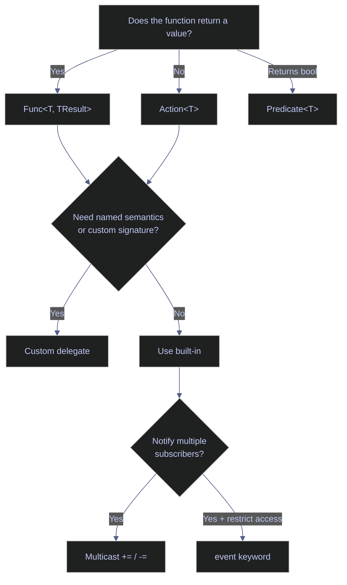

# 04. Functions - C#

> [!quote]
> "The purpose of abstraction is not to be vague, but to create a new semantic level in which one can be absolutely precise."
>
> — **Edsger W. Dijkstra**, *The Humble Programmer*, ACM Turing lecture (1972)

C# functions are typed, statically resolved, and composable via delegates. This page covers method definitions, delegate types (`Func<T>`, `Action<T>`), lambda expressions, closures, extension methods, and the event system — with executable examples and output cells throughout.

## Function Basics

C# methods are statically typed, requiring explicit return types and parameter types. Functions become first-class values through delegate types (`Func<T>`, `Action<T>`), enabling callbacks, strategy injection, pipelines, and dependency inversion. This section covers method definitions, delegate fundamentals, and common function-passing patterns.

### Defining and calling methods

Methods declare a return type, accept typed parameters, and support overloading (same name, different parameter lists). Local functions nest inside other methods for encapsulated helpers. Expression-bodied syntax (`=>`) provides a concise form for one-liners, and tuples enable multiple return values without a dedicated class.

> [!warning] Function anti-patterns
>
> - Returning `null` instead of a meaningful empty value or `Optional`
> - Very long parameter lists — use a config object or builder
> - Methods doing too much — single responsibility principle

> [!success] Follow these instead
>
> - Return a typed result or throw a specific exception rather than `null`
> - Use a config/options object or builder pattern when you need more than 3–4 parameters
> - Keep each method focused on one responsibility — extract helpers freely

#### Method with return value

`string` and `int` methods return a typed value directly to the caller. The return type is declared before the method name, and the compiler enforces that every code path returns a value of that type.

```csharp
string Greet(string name) { return $"Hello, {name}!"; }
Console.WriteLine(Greet("Alice"));
```

```text
Hello, Alice!
```

#### Void method — no return value

`void` methods perform side effects — printing, writing, mutating state — without returning a value. The compiler prevents callers from using the return value.

```csharp
void PrintGreeting(string name)
{
    Console.WriteLine($"  Hi, {name}!");
}
PrintGreeting("Bob");
```

```text
  Hi, Bob!
```

#### Local function — nested inside a method

A local function is defined inside another method's body, restricting its visibility to that scope. Useful for private helpers too small to justify a class-level method.

```csharp
void RunDemo()
{
    int Add(int a, int b) => a + b;
    Console.WriteLine($"  Local Add: {Add(3, 4)}");
}
RunDemo();
```

```text
  Local Add: 7
```

#### Expression-bodied methods — => syntax

The `=>` (expression-bodied) syntax eliminates braces and the `return` keyword for single-expression methods, reducing boilerplate for one-liners.

> [!info] Expression-bodied syntax
>
> - `type Method(params) => expression` — implicit return, no braces
> - Works for methods, properties, constructors, and operators

```csharp
string GreetShort(string name) => $"Hello, {name}!";
int Square(int x) => x * x;
Console.WriteLine(GreetShort("Diana"));
Console.WriteLine(Square(5));
```

```text
Hello, Diana!
25
```

#### Tuple return — multiple values from one method

Tuples let a method return multiple values without defining a class or struct. Callers destructure the result with `var (a, b) = Method()`. For 3–4+ values, prefer a `record` or class for readability.

> [!info] Tuple return
>
> - `(int quotient, int remainder) Divide(int a, int b)` — named tuple fields
> - Callers destructure: `var (q, r) = Divide(17, 5)`
> - Use named fields for clarity; for 3–4+ values, prefer a `record` or class

```csharp
(int quotient, int remainder) Divide(int a, int b)
{
    return (a / b, a % b);
}
var (q, r) = Divide(17, 5);
Console.WriteLine($"17 / 5 = {q} remainder {r}");
Console.WriteLine(Divide(17, 5));
```

```text
17 / 5 = 3 remainder 2
(3, 2)
```

### Delegate types — Func, Action, Predicate

`Func<T, TResult>` stores a method that returns a value, `Action<T>` stores a void method, and `Predicate<T>` stores a boolean test. These built-in generic delegates make functions first-class values — you can assign methods to variables, pass them as arguments, and return them from other methods. This is the foundation for callbacks, LINQ, strategy pattern, and dependency injection in C#.

#### Func&lt;T, TResult&gt; — assign and call

`Func<T, TResult>` holds a reference to any method matching its return type — assign a named method, lambda, or method group to a `Func` variable and call it via the variable.

> [!info] Delegate types
>
> - `Func<T, TResult>` — holds a method that returns a value
> - `Action<T>` — holds a void method
> - Both store lambdas, named methods, or method groups — functions as first-class values
> - Use for callbacks, LINQ, strategy pattern, DI
> - For event handlers, use `EventHandler<T>`

```csharp
Func<string, string> sayHello = Greet;
Console.WriteLine(sayHello("Eve"));
```

```text
Hello, Eve!
```

#### Action&lt;T&gt; — void delegate

`Action<T>` stores a void method — no return value. Assign a named method or lambda. Use for side effects: logging, printing, state mutation.

```csharp
Action<string> printer = PrintGreeting;
printer("Frank");
```

```text
  Hi, Frank!
```

#### Pass a Func as argument

Pass `Func<T, TResult>` as a method parameter to let the caller inject any compatible function — the foundation for callbacks, the strategy pattern, and dependency injection.

```csharp
string Apply(Func<string, string> func, string value) => func(value);
Console.WriteLine(Apply(Greet, "Grace"));
```

```text
Hello, Grace!
```

#### Return a Func — higher-order function

A method can return a `Func<T, TResult>`, creating a parameterized function factory. Each call captures the parameter in a closure, producing an independent function.

```csharp
Func<int, int> MakeMultiplier(int n) => x => x * n;
var doubler = MakeMultiplier(2);
var tripler = MakeMultiplier(3);
Console.WriteLine(doubler(5));
Console.WriteLine(tripler(5));
```

```text
10
15
```

### Function-passing patterns

Functions stored as delegates unlock powerful composition patterns: callbacks decouple operations from their side effects, strategy pattern swaps algorithms at runtime, pipelines chain transformations sequentially, and dependency injection makes code testable by replacing real dependencies with fakes.

#### Callbacks — onSuccess / onError

A callback is a function passed as an argument to another function, to be called later when a specific event occurs. In C#, callbacks are implemented as `Action` or `Func` delegates. The caller decides what happens on success or failure by providing the callback — the called method doesn't need to know the details of error handling or notification.

Accept `Action<string> onSuccess` and `Action<Exception> onError` — the caller defines the response. Decouples the operation from its side effects.

```csharp
void FetchData(string url, Action<string> onSuccess, Action<Exception> onError)
{
    try
    {
        string result = $"data from {url}";   // simulate fetch
        onSuccess(result);
    }
    catch (Exception ex) { onError(ex); }
}

FetchData("api/users",
    onSuccess: data => Console.WriteLine($"  Got: {data}"),
    onError: err => Console.WriteLine($"  Error: {err}"));
```

```text
Got: data from api/users
```

#### Strategy pattern — swap behavior via Func

The strategy pattern lets you swap an algorithm at runtime without changing the code that uses it. Instead of hardcoding a calculation (like a pricing formula or scoring method), you pass the algorithm as a `Func` parameter. Different callers can inject different strategies — one uses z-score normalization, another uses percentile ranking — through the same method signature.

Define interchangeable `Func<T, TResult>` for each strategy. Pass the desired one to the consumer — change behavior without modifying code (open/closed principle). Use for pricing rules, validation, sorting, formatters.

```csharp
Func<decimal, decimal> fullPrice = price => price;
Func<decimal, decimal> discount20 = price => price * 0.8m;
Func<decimal, decimal> memberDiscount = price => price * 0.7m;

decimal Calculate(decimal price, Func<decimal, decimal> strategy) => strategy(price);

Console.WriteLine($"  Full:     ${Calculate(100, fullPrice):F2}");
Console.WriteLine($"  20% off:  ${Calculate(100, discount20):F2}");
Console.WriteLine($"  Member:   ${Calculate(100, memberDiscount):F2}");
```

```text
Full:     $100.00
20% off:  $80.00
Member:   $70.00
```

#### Pipeline — chained Func steps with Aggregate

A pipeline chains multiple transformation steps where each step's output becomes the next step's input. In C#, you store steps as a `List<Func<T, T>>` and compose them with `Aggregate`. This mirrors the medallion architecture: raw data passes through validation, cleaning, and enrichment stages sequentially.

Store steps as `List<Func<string, string>>`. `Aggregate` folds the input through each step sequentially. Steps are composable — add, remove, reorder independently, each testable in isolation.

`Aggregate(seed, function)` folds the input through each step sequentially: `seed` is the starting value, `acc` is the running result (starts as seed, then the output of each step), and `step` is the current `Func<string, string>` from the list. Each iteration feeds the previous step's output as input to the next.

```csharp
var steps = new List<Func<string, string>>
{
    s => s.Trim(),
    s => s.ToLower(),
    s => System.Text.RegularExpressions.Regex.Replace(s, @"\s+", " "),
};

string raw = "  Hello   World  ";
string result = steps.Aggregate(raw, (acc, step) => step(acc));
Console.WriteLine($"  '{raw}' -> '{result}'");
```

```text
'  Hello   World  ' -> 'hello world'
```

#### Dependency injection — inject fake time via Func

Dependency injection (DI) means passing dependencies into a method or class from outside rather than creating them internally. The classic example: instead of calling `DateTime.UtcNow` directly (which makes testing impossible), you accept a `Func<DateTime>` parameter. In production, it returns real time; in tests, it returns a fixed date so results are deterministic.

Accept `Func<DateTime> getNow` with default `DateTime.UtcNow`. Production uses the default; tests inject a fixed `DateTime` for deterministic results. No interface needed — `Func<DateTime>` is lightweight DI.

> [!tip] DI enables testability
> If a function calls `DateTime.UtcNow` directly, you can't test what happens at midnight, on weekends, or at year boundaries without waiting. Injecting time as a `Func<DateTime>` parameter makes every time-dependent scenario testable in milliseconds.

> [!warning] Don't use DateTime.Now directly
>
> Don't use `DateTime.Now` directly — untestable and non-deterministic.

> [!success] Inject time as a dependency
>
> Accept `Func<DateTime>? getNow = null` with `getNow ??= () => DateTime.UtcNow` as default. Production uses real time; tests inject a fixed `DateTime` — fully deterministic.

```csharp
Dictionary<string, object> ProcessOrder(
    Dictionary<string, object> order,
    Func<DateTime>? getNow = null)
{
    getNow ??= () => DateTime.UtcNow;
    order["processed_at"] = getNow();
    return order;
}

var order1 = ProcessOrder(new Dictionary<string, object> { ["id"] = 1 });
Console.WriteLine($"  Production: {order1["processed_at"]}");

var order2 = ProcessOrder(
    new Dictionary<string, object> { ["id"] = 2 },
    getNow: () => new DateTime(2024, 1, 1, 12, 0, 0));
Console.WriteLine($"  Test:       {order2["processed_at"]}");
```

```text
Production: 25-Mar-26 1:21:14
Test:       01-Jan-24 12:00:00
```

#### Progress callback

A progress callback reports incremental status during a long-running operation. The caller provides an `Action` that receives progress updates (e.g., percentage complete, current item), allowing UI updates or logging without the core logic knowing how progress is displayed.

Accept `Action<int, int, string>?` (nullable). Call with `onProgress?.Invoke(current, total, message)`. Callers control the display — console, UI, logging, or nothing.

The `?.Invoke()` pattern is null-conditional: if `onProgress` is null, the call is skipped silently. `Invoke` calls the `Action` with `(current, total, item)` — equivalent to `onProgress(i + 1, items.Length, items[i])` but safe when the callback is null.

```csharp
void LoadData(string[] items, Action<int, int, string>? onProgress = null)
{
    for (int i = 0; i < items.Length; i++)
        onProgress?.Invoke(i + 1, items.Length, items[i]);
}

LoadData(new[] { "users", "orders", "products" },
    onProgress: (curr, total, item) => Console.WriteLine($"  [{curr}/{total}] Loading {item}"));
```

```text
[1/3] Loading users
[2/3] Loading orders
[3/3] Loading products
```

#### Sorting with Func as key selector

LINQ's `OrderBy` accepts a `Func<T, TKey>` that extracts the sort key from each element. Chain `ThenBy` for secondary sorts — a second `OrderBy` replaces the first entirely. `MinBy`/`MaxBy` (C# 10+) select the element with the smallest or largest key.

> [!info] LINQ with Func
>
> - `OrderBy(x => x.Property)` — extracts the sort key
> - `ThenBy` — secondary sort
> - `GroupBy` + `Select` — aggregation over groups
> - Declarative and composable

> [!warning] OrderBy replaces previous sort
>
> `OrderBy` then another `OrderBy` **replaces** the first — use `ThenBy` for secondary sort.

> [!success] Chain ThenBy for multi-column sort
>
> Use `.OrderBy(e => e.Dept).ThenBy(e => e.Salary)` to apply a stable secondary sort without discarding the primary one.

```csharp
var employees = new[]
{
    new { Name = "Alice", Dept = "Engineering", Salary = 95000 },
    new { Name = "Bob", Dept = "Sales", Salary = 65000 },
    new { Name = "Charlie", Dept = "Engineering", Salary = 110000 },
};
foreach (var e in employees.OrderByDescending(e => e.Salary))
    Console.WriteLine($"  {e.Name,-10} ${e.Salary:N0}");
```

```text
Charlie    $110,000
Alice      $95,000
Bob        $65,000
```

#### Common function-passing patterns

Quick reference for choosing the right function-passing approach — each pattern maps to a C# delegate signature.

| Pattern | C# signature | Use case |
|---|---|---|
| **Callbacks** | `Action<string> onSuccess, Action<Exception> onError` | Success/error hooks |
| **Strategy** | `Func<decimal, decimal> pricingStrategy` | Swap algorithms |
| **Pipeline** | `List<Func<string, string>> steps` + `Aggregate` | Chain processing steps |
| **DI / Testing** | `Func<DateTime> getNow` | Inject fake time |
| **Events** | `Action<int, int, string> onProgress` | Progress hooks |
| **Sorting** | `.OrderBy(e => e.Salary)` — `Func<T, TKey>` | Key selector |

## Parameters

C# offers compile-time-checked parameter modes that give precise control over how values flow into and out of methods. Default and named arguments improve call-site readability, while `ref`, `out`, and `in` control mutability and copy semantics. `params` provides variable-length argument lists.

### Default and named parameters

Default values must be compile-time constants — no mutable default trap like Python. Named arguments (`Func(x: 5, y: 10)`) are self-documenting and allow any order at the call site.

#### Default and named parameters

Default values: `void Func(int x = 10)` — must be compile-time constants. Named arguments: `Func(x: 5, y: 10)` — self-documenting, any order. Parameter passing modes: `ref` (read+write), `out` (must assign before return), `in` (read-only reference), `params` (variable argument count as array).

```csharp
string Connect(string host, int port = 5432, bool ssl = true)
    => $"{host}:{port} ssl={ssl}";

Console.WriteLine(Connect("localhost"));
Console.WriteLine(Connect("db.example.com", 3306));
Console.WriteLine(Connect("db.example.com", ssl: false));
```

```text
localhost:5432 ssl=True
db.example.com:3306 ssl=True
db.example.com:5432 ssl=False
```

### Pass-by modes — ref, out, in

C# passes value types by copy by default. The `ref`, `out`, and `in` keywords change this behavior: `ref` passes a mutable reference, `out` forces the callee to assign a value, and `in` passes a read-only reference to avoid copying large structs.

#### ref — pass by reference

`ref` passes the variable itself — not a copy — so changes inside the method are visible to the caller. Both the declaration (`ref int x`) and call site (`ref val`) must use the `ref` keyword, making the intent explicit.

> [!info] Pass by reference
>
> - `ref int x` — passes the variable itself; changes are visible to the caller
> - Both sides must use the `ref` keyword
> - Variable must be initialized before passing
> - Use `out` for output-only scenarios (caller doesn't need to initialize)

```csharp
void DoubleIt(ref int x)
{
    x *= 2;
}
int val = 5;
DoubleIt(ref val);
Console.WriteLine(val);
```

```text
10
```

#### out — must-assign output

`out int result` requires the method to assign a value before returning — compiler enforces it. The `TryParse` pattern combines check + extraction in one line: `if (int.TryParse(s, out int n))`.

```csharp
bool TryDivide(int a, int b, out int result)
{
    if (b == 0) { result = 0; return false; }
    result = a / b;
    return true;
}
if (TryDivide(10, 3, out int answer))
    Console.WriteLine($"  out: {answer}");
```

```text
out: 3
```

#### in — read-only reference

`in` passes by reference but prevents modification — compiler enforces read-only. Avoids copy overhead for large structs (Matrix, Vector3D). Don't use for small types (`int`, `double`) — copy is just as fast.

```csharp
double Distance(in (double x, double y) point)
    => Math.Sqrt(point.x * point.x + point.y * point.y);
Console.WriteLine(Distance((3, 4)));
```

```text
5
```

### Variable arguments

`params` lets a method accept a variable number of arguments as an array. C# has no direct equivalent to Python's `**kwargs` — use anonymous objects or dictionaries for dynamic key-value pairs.

#### params — variable arguments

`params int[] numbers` accepts variable arguments — compiler creates the array. Must be the last parameter. `Total(1, 2, 3)` and `Total(myArray)` both work.

```csharp
int Total(params int[] numbers)
{
    return numbers.Sum();
}
Console.WriteLine(Total(1, 2, 3));
Console.WriteLine(Total(10, 20));

int[] nums = { 1, 2, 3, 4, 5 };
Console.WriteLine(Total(nums));
```

```text
6
30
15
```

#### No **kwargs — alternatives

C# has no `**kwargs` equivalent for collecting arbitrary keyword arguments. Instead, use anonymous objects for structured data, `Dictionary<string, object>` for dynamic keys, or named parameters with defaults for compile-time safety.

> [!info] C# has no kwargs equivalent
>
> - Anonymous object: `new { key = value }` (common in ASP.NET)
> - `Dictionary<string, object>` for dynamic keys
> - Named params with defaults for compile-time safety

An anonymous object `new { key = value }` simulates structured keyword arguments — the pattern used widely in ASP.NET for routing and view data. Properties are readable but the type has no name.

```csharp
void LogEvent(string name, object data) =>
    Console.WriteLine($"  {name}: {data}");
LogEvent("click", new { page = "home", button = "submit" });
```

```text
click: { page = home, button = submit }
```

`Dictionary<string, object>` supports fully dynamic keys not known at compile time. Key-value pairs are explicit and enumerable at runtime.

```csharp
void LogDict(string name, Dictionary<string, object> data) =>
    Console.WriteLine($"  {name}: {string.Join(", ", data.Select(kv => $"{kv.Key}={kv.Value}"))}");
LogDict("click", new Dictionary<string, object> { ["page"] = "home", ["button"] = "submit" });
```

```text
click: page=home, button=submit
```

## Lambda Expressions

Lambda expressions are anonymous functions defined inline with `=>`. They are the primary way to write short, throwaway functions for LINQ queries, event handlers, and callbacks. Lambdas capture variables from the enclosing scope (closures) and are assigned to `Func<T>`, `Action<T>`, or `Predicate<T>` delegate types.

### Lambda syntax

Expression lambdas and statement lambdas differ in body style. Expression lambdas (`x => x * x`) are single-expression with an implicit return. Statement lambdas (`(x) => { ... return ...; }`) support multiple statements with explicit `return`.

#### Lambda expressions

A lambda expression uses `=>` to separate parameters from the body. Single-expression lambdas return implicitly; multi-statement lambdas require braces and an explicit `return`. Assign to `Func<T, TResult>` for return values or `Action<T>` for void operations.

> [!info] Lambda syntax
>
> - `(params) => expression` — single-expression (return is implicit)
> - `(params) => { statements }` — multi-statement with explicit `return`
> - Assign to `Func<T, TResult>` (returns value) or `Action<T>` (void)
> - Lambdas capture enclosing scope variables automatically

> [!warning] Keep lambdas short (≤3 lines).
>
> Keep lambdas short (≤3 lines). Extract complex logic to named methods. Don't use lambdas with side effects in LINQ — use `foreach`.

> [!success] Named methods for complex logic
>
> Extract anything beyond 3 lines into a named method. Side-effecting operations belong in `foreach` loops, not LINQ chains — keeps each part readable and independently testable.

```csharp
Func<int, int> square = x => x * x;
Func<int, int, int> add = (a, b) => a + b;

Console.WriteLine(square(5));
Console.WriteLine(add(3, 4));
```

```text
25
7
```

#### Statement lambda — multi-line body with { }

When a lambda needs multiple statements (`if`/`else`, loops, `try`/`catch`), wrap the body in braces and use an explicit `return`. Statement lambdas still capture the enclosing scope. Keep them under 5 lines — extract longer logic to a named method.

> [!info] Statement lambda syntax
>
> - `(params) => { statements; return value; }` — braces and explicit `return` required
> - Supports `if`/`else`, loops, `try`/`catch`
> - Still captures enclosing scope
> - Keep under 5 lines — extract longer logic to a named method

```csharp
Func<int, string> classify = (x) => {
    if (x > 0) return "positive";
    if (x < 0) return "negative";
    return "zero";
};
Console.WriteLine(classify(-5));
```

```text
negative
```

### Lambdas with LINQ

LINQ methods accept lambdas as predicates, projections, and key selectors. The compiler infers parameter types from the collection's element type, so you rarely need explicit type annotations.

#### OrderBy — sort with a lambda key selector

`OrderBy(n => expr)` sorts ascending by the value the lambda extracts from each element. The compiler infers the type of `n` from the collection. Pass a different key expression to change sort order without modifying the data.

```csharp
var names = new[] { "Charlie", "Alice", "Bob", "Diana" };
Console.WriteLine(string.Join(", ", names.OrderBy(n => n.Length)));
Console.WriteLine(string.Join(", ", names.OrderBy(n => n[^1])));
```

```text
Bob, Alice, Diana, Charlie
Diana, Bob, Charlie, Alice
```

#### Select — project each element with a lambda (map)

`Select(x => expr)` transforms each element into a new value — equivalent to `map`. Returns a lazy `IEnumerable<TResult>`; the compiler infers `x` as `int` from the array type.

```csharp
var nums = new[] { 1, 2, 3, 4, 5 };
Console.WriteLine(string.Join(", ", nums.Select(x => x * x)));
```

```text
1, 4, 9, 16, 25
```

#### Where — filter elements with a predicate lambda

`Where(x => bool)` returns only elements where the predicate is `true` — equivalent to `filter`. Commonly chained with `Select` for filter-then-transform pipelines.

```csharp
Console.WriteLine(string.Join(", ", nums.Where(x => x % 2 == 0)));
```

```text
2, 4
```

#### MinBy — select the element with the smallest key

`MinBy(p => key)` returns the full element (not just the key value) with the minimum key — C# 10+. Use `MaxBy` for the largest.

```csharp
var people = new[] { ("Alice", 30), ("Bob", 25), ("Charlie", 35) };
Console.WriteLine(people.MinBy(p => p.Item2));
```

```text
(Bob, 25)
```

### Delegate types and closures

`Action<T>` is for side-effect lambdas (void), `Predicate<T>` is for boolean tests used by `List.FindAll` and `Exists`, and closures capture variables by reference — changes to the captured variable are shared between the lambda and the enclosing scope.

#### Action, Predicate, and closure capture

`Action<T>` stores a void lambda — used for side effects like printing or logging. `Predicate<T>` stores a boolean test — used by `List.FindAll` and `List.Exists` for filtering. Both are specialized delegate types that avoid declaring custom delegates for common patterns.

> [!info] Delegate types and closures
>
> - `Action<T>` — side-effect lambdas (void)
> - `Predicate<T>` — boolean tests used by `List.FindAll`, `Exists`
> - Closures capture the **variable reference**, not its value — changes are shared

```csharp
Action<string> shout = msg => Console.WriteLine($"  {msg.ToUpper()}!");
shout("hello");

Predicate<int> isEven = x => x % 2 == 0;
var list = new List<int> { 1, 2, 3, 4, 5, 6 };
Console.WriteLine(string.Join(", ", list.FindAll(isEven)));
Console.WriteLine(list.Exists(x => x > 5));
```

```text
HELLO!
2, 4, 6
True
```

#### Closure capture — variable, not value

Lambdas capture the **variable reference**, not a snapshot. If `multiplier` changes after the lambda is defined, the lambda uses the new value. When you need a frozen value, copy to a local variable first.

```csharp
int multiplier = 3;
Func<int, int> times = x => x * multiplier;
Console.WriteLine(times(5));
multiplier = 10;
Console.WriteLine(times(5));
```

```text
15
50
```

#### Lambdas vs named methods — when to use which

Use inline lambdas for short, single-use operations in LINQ, event handlers, and callbacks. Extract to a named method when the logic is reusable, exceeds 3 lines, or needs documentation. Statement lambdas bridge the gap for moderate complexity.

| Use | When |
|---|---|
| **Lambda** | LINQ, event handlers, callbacks, short inline logic |
| **Named method** | Reusable, complex, needs documentation |
| **Statement lambda** | Multi-line body with braces and explicit `return` |

> [!warning] Lambda vs method choice
>
> Don't write complex lambdas that should be methods. Don't create named methods for trivial one-liners used once.

> [!success] Right tool for the right job
>
> Inline lambda for short, single-use LINQ predicates and callbacks; named method for anything reusable, > 3 lines, or that needs a doc comment.

## Closures & Scope

C# uses block-level scoping: variables are visible from declaration to the closing brace. Closures capture variables by reference — the lambda and enclosing scope share the same storage. This enables powerful factory patterns but introduces a well-known loop capture pitfall.

### Variable capture

Closures capture the variable reference, not a snapshot of its value. This means a returned lambda retains access to the enclosing method's locals even after the method returns, and mutations are visible from both sides.

#### Block scope — variables declared inside { } are local

Variables declared inside `{}` are local to that block and inaccessible outside it. C# enforces this at compile time — referencing an out-of-scope variable is a compilation error, not a runtime surprise.

```csharp
{
    int x = 10;
    Console.WriteLine($"  Inside block: {x}");
}
// x is not accessible here — block scope ended
```

```text
Inside block: 10
```

#### Closures capture variables

A lambda returned from a method retains access to the method's locals — the captured parameter lives on the heap as long as the closure exists. Each call to `MakeAdder` creates an independent closure with its own `n`, so `add5` and `add10` hold separate state.

```csharp
Func<int, int> MakeAdder(int n)
{
    return x => x + n;
}
var add5 = MakeAdder(5);
var add10 = MakeAdder(10);
Console.WriteLine(add5(3));
Console.WriteLine(add10(3));
```

```text
8
13
```

#### Closure modifies outer variable

Closures can read AND modify captured variables — both the lambda and enclosing scope see the same variable. Use for simple counters in single-threaded code. For multi-threaded scenarios, use `Interlocked` or locks.

```csharp
int counter = 0;
Action increment = () => counter++;
increment();
increment();
increment();
Console.WriteLine(counter);
```

```text
3
```

### Closure factories

Closures that return functions create independent, encapsulated state — each call produces a new closure with its own captured variables. This pattern replaces simple classes for counters, validators, and parameterized logic.

#### Closure as state — counter factory

`MakeCounter()` returns `Func<int>` closing over a local `count`. Each call creates an independent counter with private, encapsulated state — no class needed.

```csharp
Func<int> MakeCounter(int start = 0)
{
    int count = start;
    return () => ++count;
}
var c1 = MakeCounter(10);
Console.WriteLine(c1());
Console.WriteLine(c1());

var c2 = MakeCounter(0);
Console.WriteLine(c2());
```

```text
11
12
1
```

#### Range validator factory — parameterized closure

`MakeRangeValidator(min, max)` returns `Func<int, bool>` that tests `[min, max]`. Each call creates an independent validator, composable with `items.Where(isValid)`.

```csharp
Func<int, bool> MakeRangeValidator(int min, int max)
    => value => value >= min && value <= max;

var isValidAge = MakeRangeValidator(0, 120);
var isValidScore = MakeRangeValidator(0, 100);
Console.WriteLine(isValidAge(25));
Console.WriteLine(isValidAge(150));
```

```text
True
False
```

### Closure pitfalls

The most common closure bug in C# involves lambdas created inside a `for` loop — all lambdas share the same loop variable and see its final value.

#### Loop capture gotcha — lambdas in a for loop

Lambdas created in a `for` loop capture the loop variable `i` itself — not its value at each iteration. After the loop, `i` has its final value, so all lambdas return the same result. The fix is to copy the loop variable into a new local inside the loop body. Note: `foreach` in C# 5+ captures per-iteration automatically.

> [!danger] Lambdas in a for loop
>
> Lambdas in a `for` loop capture the variable itself — after the loop, all see the final value. Fix: `int captured = i` inside the loop body. Note: `foreach` in C# 5+ captures per-iteration automatically.

> [!success] Copy the loop variable before capturing
>
> Declare `int captured = i;` at the top of the loop body and close over `captured` instead of `i`. Each iteration creates a new variable, so each lambda holds an independent snapshot.

```csharp
var funcs = new List<Func<int>>();
for (int i = 0; i < 3; i++)
    funcs.Add(() => i);
Console.WriteLine(string.Join(", ", funcs.Select(f => f())));

var funcsGood = new List<Func<int>>();
for (int i = 0; i < 3; i++)
{
    int captured = i;
    funcsGood.Add(() => captured);
}
Console.WriteLine(string.Join(", ", funcsGood.Select(f => f())));
```

```text
3, 3, 3
0, 1, 2
```

## Delegates & Events

Delegates are type-safe function pointers — they declare a signature as a type and hold references to methods matching that signature. The built-in `Func<T>`, `Action<T>`, and `Predicate<T>` cover most cases; custom delegates add named semantics. Multicast delegates chain multiple handlers via `+=`, and the `event` keyword restricts delegate access to enforce the observer pattern.



### Delegate fundamentals

Custom delegates define a named function signature: `delegate int MathOp(int a, int b)`. Variables of that type can hold any method matching the signature. Multicast delegates (`+=`) chain multiple handlers for observer/notification patterns.

#### Delegate, Func&lt;T&gt;, Action&lt;T&gt; — delegate type declarations

Delegates declare a function signature as a type — type-safe function pointers. Built-in: `Func<T, TResult>` (returns value), `Action<T>` (void), `Predicate<T>` (returns bool). Custom: `delegate int Op(int a, int b)`. Delegates can chain multiple methods via `+=` (multicast). Events are restricted delegates that only the owner can invoke.

> [!warning] Multicast delegate return values
>
> With multicast delegates, only the **last** handler's return value is kept. Use `Func`/`Action` for simple cases — custom delegate types add unnecessary ceremony.

> [!success] Use Action for fire-and-forget multicasting
>
> When all subscribers perform side effects (logging, UI updates, pipeline steps), use `Action<T>` — return values are irrelevant and the multicast discard issue never arises.

```csharp
int Add(int a, int b) => a + b;
int Multiply(int a, int b) => a * b;

MathOp op = Add;
Console.WriteLine(op(3, 4));
op = Multiply;
Console.WriteLine(op(3, 4));

delegate int MathOp(int a, int b);
```

```text
7
12
```

#### Multicast delegates — += to chain, invoke all subscribers

`+=` adds a handler, `-=` removes. Invoking calls all registered handlers in order. Observer pattern — multiple subscribers notified by one invoke. Don't forget to remove handlers to avoid memory leaks.

```csharp
Action<string> pipeline = msg => Console.WriteLine($"  Step 1: {msg}");
pipeline += msg => Console.WriteLine($"  Step 2: {msg.ToUpper()}");
pipeline += msg => Console.WriteLine($"  Step 3: {msg.Length} chars");

Console.WriteLine("Calling pipeline:");
pipeline("hello world");
```

```text
Step 1: hello world
Step 2: HELLO WORLD
Step 3: 11 chars
```

> [!info] Delegate removal
> Delegates support `-=` to remove handlers from the invocation list, enabling dynamic pipeline step management at runtime.

### Method groups and callbacks

A method group is a method name without parentheses — the compiler creates the delegate automatically. This is more concise than wrapping in a lambda and is the preferred style when the method signature already matches the delegate type.

#### Method groups and callbacks

`Action<string> h = PrintUpper` — no parentheses, no lambda wrapper. Compiler creates the delegate automatically. Works with LINQ: `.Select(Transform)`, `.Where(IsValid)`. Use lambda only when additional arguments or transformation are needed.

```csharp
void PrintUpper(string s) => Console.WriteLine($"  {s.ToUpper()}");

Action<string> handler = PrintUpper;
handler("method group");
```

```text
METHOD GROUP
```

> [!info] Lambda vs method group in LINQ
>
> With LINQ you can pass a method directly instead of wrapping it in a lambda:
> `names.Select(Transform)` instead of `names.Select(n => Transform(n))`.
> However, instance methods like `string.ToUpper()` can't be used as method
> groups because they require an instance — use a lambda instead:
> `names.Select(n => n.ToUpper())`.

#### Callback via Action — processing with notification

`ProcessData` accepts `Action<int> onProcessed` called for each item. Caller defines the response — log, collect, display, or ignore. Decouples the algorithm from output handling.

```csharp
void ProcessData(int[] data, Action<int> onProcessed)
{
    foreach (var item in data)
    {
        var result = item * 2;
        onProcessed(result);
    }
}

Console.Write("Results: ");
ProcessData(new[] { 1, 2, 3 }, result => Console.Write($"{result} "));
Console.WriteLine();
```

```text
Results: 2 4 6
```

### Events

The `event` keyword wraps a delegate with access restrictions: external code can only subscribe (`+=`) and unsubscribe (`-=`), while only the declaring class can invoke the event. This enforces the observer pattern — publishers don't know their subscribers, and subscribers can't accidentally invoke or replace the handler list.

#### Event declaration and EventHandler&lt;T&gt; pattern

Declare events with `event EventHandler<TEventArgs>` where `TEventArgs` carries the event data. The standard pattern uses a protected `OnEventName` method to raise the event safely via `?.Invoke`. Subscribers attach with `+=` and detach with `-=`. Always unsubscribe when done to prevent memory leaks — the event holds a reference to the subscriber.

> [!warning] Memory leaks from unsubscribed events
>
> Event handlers keep subscribers alive via strong references. If a short-lived object subscribes to a long-lived publisher's event and never unsubscribes, the subscriber can't be garbage collected.

> [!success] Always unsubscribe
>
> Implement `IDisposable` on subscriber classes and unsubscribe in `Dispose()`. For UI components, unsubscribe in teardown/close handlers. Consider weak event patterns for long-lived publishers.

```csharp
class OrderEventArgs : EventArgs
{
    public int OrderId { get; }
    public decimal Total { get; }
    public OrderEventArgs(int id, decimal total) { OrderId = id; Total = total; }
}

class OrderProcessor
{
    public event EventHandler<OrderEventArgs>? OrderPlaced;

    public void PlaceOrder(int id, decimal total)
    {
        Console.WriteLine($"  Processing order {id}...");
        OrderPlaced?.Invoke(this, new OrderEventArgs(id, total));
    }
}

var processor = new OrderProcessor();
processor.OrderPlaced += (sender, e) => Console.WriteLine($"  Logger: Order {e.OrderId} placed (${e.Total})");
processor.OrderPlaced += (sender, e) => Console.WriteLine($"  Notifier: Email sent for order {e.OrderId}");
processor.PlaceOrder(101, 59.99m);
```

```text
Processing order 101...
Logger: Order 101 placed ($59.99)
Notifier: Email sent for order 101
```

> [!info] event vs delegate
>
> A raw `public Action<string> OnClick;` lets any code invoke or reassign the handler list. `public event Action<string> OnClick;` restricts external code to `+=`/`-=` only — the owner class controls invocation. Always prefer `event` for public notification points.

## Method Overloading & Extension Methods

Method overloading lets multiple methods share a name with different parameter types or counts — the compiler resolves the correct one. Extension methods add methods to existing types without modifying source code, enabling fluent APIs like LINQ.

> [!warning] Overloading pitfalls
>
> - Overloads that do fundamentally different things — confusing API
> - Too many overloads — use optional/named parameters or generics instead
> - Ambiguous overloads cause compiler errors when it can't decide

> [!success] Clean overloading guidelines
>
> - All overloads should do the same logical operation on different input types
> - Prefer optional/named parameters when the logic is identical; use generics when one method can handle all types
> - If the compiler reports ambiguity, add an explicit cast at the call site or consolidate overloads

### Method overloading

Multiple methods can share a name if their parameter lists differ in type or count. The compiler resolves the correct overload at compile time — no runtime overhead, clean API, and backward-compatible when adding new overloads.

#### Method overloading — same name, different parameters

The compiler picks the most specific overload by argument types. `Format(42)` resolves to `Format(int)`, `Format(3.14)` to `Format(double)`. Numeric promotions: `int` can promote to `double` but not vice versa. Use generics when one method can handle all types.

```csharp
string Format(int value) => $"int: {value}";
string Format(double value) => $"double: {value:F2}";
string Format(string value) => $"string: '{value}'";
string Format(int a, int b) => $"two ints: {a} + {b} = {a + b}";

Console.WriteLine(Format(42));
Console.WriteLine(Format(3.14));
Console.WriteLine(Format("hello"));
Console.WriteLine(Format(10, 20));
```

```text
int: 42
double: 3.14
string: 'hello'
two ints: 10 + 20 = 30
```

### Extension methods

Extension methods add methods to existing types without modifying their source code — defined as static methods in a static class with `this` before the first parameter. LINQ is built entirely with extension methods on `IEnumerable<T>`.

#### Extension methods and LINQ

Define a static method in a static class with `this` before the first parameter: `static int WordCount(this string s)`. This enables fluent syntax: `"hello".WordCount()`. Don't extend `object` — it pollutes IntelliSense for all types.

> [!info] LINQ Is Built on Extension Methods
>
> Every LINQ method (`.Where`, `.Select`, `.OrderBy`) is an extension method on `IEnumerable<T>`.
> The simplified signature of `.Where`: `static IEnumerable<T> Where<T>(this IEnumerable<T> source, Func<T, bool> predicate)` — the `this` keyword before the first parameter makes it an extension method.

```csharp
var nums = new[] { 1, 2, 3, 4, 5 };
Console.WriteLine(string.Join(", ", nums.Where(x => x > 2).Select(x => x * 10)));
```

```text
30, 40, 50
```
