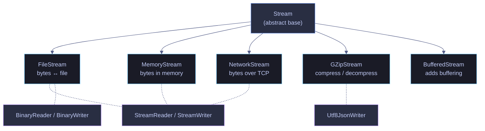

# 09. File I/O & Serialization - C#

> [!quote]
> "Tape is dead. Disk is tape. Flash is disk. RAM locality is king."
>
> — **Jim Gray**, Turing Award lecture (1998)

```csharp
using System.IO;
using System.Diagnostics;
using System.IO.MemoryMappedFiles;
using System.Threading;
using System.Security.Cryptography;
using System.Net;
using System.Text;
using System.Text.Json;
using System.Text.Json.Serialization;
using System.Reflection;
using Microsoft.DotNet.Interactive;
using Microsoft.DotNet.Interactive.CSharp;

var csharpKernel = (CSharpKernel)Kernel.Root.FindKernelByName("csharp");
var optionsField = typeof(CSharpKernel).GetField("_scriptOptions",
    BindingFlags.NonPublic | BindingFlags.Instance);

var scriptOptions = optionsField.GetValue(csharpKernel);
var withWarningLevel = scriptOptions.GetType().GetMethod("WithWarningLevel");
var newOptions = withWarningLevel.Invoke(scriptOptions, new object[] { 0 });
optionsField.SetValue(csharpKernel, newOptions);

// WarningLevel set to 0 — CS1701/CS1702 warnings suppressed.
```

    WarningLevel set to 0 — CS1701/CS1702 warnings suppressed.

## Read, Write, Append Files

The `System.IO` namespace provides two tiers of file access: static convenience methods on the `File` class for simple one-shot operations, and `StreamReader`/`StreamWriter` for buffered, line-by-line processing of large files. All text methods default to UTF-8 encoding — always pass `Encoding.UTF8` explicitly to avoid platform-dependent behavior.

### File class — static read/write methods

#### File.WriteAllText and File.ReadAllText | read or write an entire file in one call

`File.WriteAllText` creates or overwrites a file with a single string. `File.ReadAllText` loads the entire file contents into memory as one string. `File.ReadAllLines` returns a `string[]` with one element per line. These are the simplest file I/O methods — ideal for small files (configs, metadata, pipeline manifests) where the entire content fits comfortably in memory.

> [!info] File class — one-line read/write
>
> - `WriteAllText` — creates or overwrites a file
> - `ReadAllText` — reads entire file into a string
> - UTF-8 by default

> [!warning] Don't use on huge files
>
> `File.ReadAllText` and `File.ReadAllLines` load the entire file into memory. For multi-GB data lake exports, use `StreamReader` for line-by-line processing instead.

```csharp
#nullable enable

var tmpDir = Path.Combine(Path.GetTempPath(), "fileio_cs_" + Guid.NewGuid().ToString("N")[..8]);
Directory.CreateDirectory(tmpDir);
$"Working dir: {tmpDir}"

var stagingFile = Path.Combine(tmpDir, "pipeline_output.txt");
var content = "pipeline_id|status|rows_processed\n"
            + "etl_001|success|15000\n"
            + "etl_002|failed|0\n"
            + "etl_003|success|8200\n";
File.WriteAllText(stagingFile, content, Encoding.UTF8);
$"  Written: {Path.GetFileName(stagingFile)} ({new FileInfo(stagingFile).Length} bytes)"

var text = File.ReadAllText(stagingFile, Encoding.UTF8);
$"  Content ({text.Length} chars): {text[..50]}..."

string[] allLines = File.ReadAllLines(stagingFile, Encoding.UTF8);
$"  Lines: {allLines.Length}"
foreach (var (line, i) in allLines.Select((l, i) => (l, i)))
    $"  [{i}]: {line}"
```

    C:\Users\aperi\AppData\Local\Temp\fileio_cs_da9b60f9
    
      pipeline_output.txt (97 bytes)
      pipeline_id|status|rows_processed
    etl_001|success|...
      4
      [0]: pipeline_id|status|rows_processed
      [1]: etl_001|success|15000
      [2]: etl_002|failed|0
      [3]: etl_003|success|8200

### StreamReader and StreamWriter — buffered line-by-line I/O

#### StreamReader and StreamWriter | read and write files with buffered streams

`StreamReader` reads a file line by line, keeping only one line in memory at a time — use it for large files (multi-GB exports, log files) where `File.ReadAllText` would exhaust memory. `StreamWriter` buffers writes and flushes in batches, making it more efficient than `File.WriteAllText` for many small writes. Both wrap a `FileStream` internally and handle encoding conversion.

> [!info] StreamWriter for Buffered Writing
> `StreamWriter` buffers writes and flushes in batches — more efficient than `WriteAllText` for many small writes.

```csharp
using (var reader = new StreamReader(stagingFile, Encoding.UTF8))
{
    string? line;
    int lineNum = 0;
    while ((line = reader.ReadLine()) != null)
        $"  Line {lineNum++}: {line}"
}

var logFile = Path.Combine(tmpDir, "etl_log.txt");
using (var writer = new StreamWriter(logFile, append: false, Encoding.UTF8))
{
    writer.WriteLine("timestamp|level|message");
    writer.WriteLine("2024-01-15T03:00:00|INFO|Pipeline started");
    writer.WriteLine("2024-01-15T03:00:05|INFO|Extracted 1.5M rows from BigQuery");
    writer.WriteLine("2024-01-15T03:00:12|INFO|Loaded to GCS");
}
$"  Written: {Path.GetFileName(logFile)}"
```

      pipeline_id|status|rows_processed
      etl_001|success|15000
      etl_002|failed|0
      etl_003|success|8200
      etl_log.txt

### Append, binary I/O, and path operations

#### File.AppendAllText | append text to an existing file

`File.AppendAllText` adds text to the end of a file without truncating existing content — equivalent to `open()` with mode `'a'` in Python. Creates the file if it doesn't exist. `StreamWriter` with `append: true` provides buffered appending for multiple writes.

```csharp
File.AppendAllText(logFile, "2024-01-15T03:01:00|WARN|Slow query detected\n", Encoding.UTF8);
using (var writer = new StreamWriter(logFile, append: true, Encoding.UTF8))
    writer.WriteLine("2024-01-15T03:02:00|INFO|Pipeline completed");

var lines = File.ReadAllLines(logFile);
$"  Total lines: {lines.Length}, Last: {lines[^1]}"
```

```text
  Total lines: 6, Last: 2024-01-15T03:02:00|INFO|Pipeline completed
```

#### File.WriteAllBytes and File.ReadAllBytes | binary file I/O

`File.WriteAllBytes` writes a `byte[]` to a file in one call. `File.ReadAllBytes` reads the entire file into a `byte[]`. Use for non-text data such as image headers, binary protocols, or inspection of raw file signatures. For large binary files (>100MB), prefer `FileStream` with buffered reads.

```csharp
var binFile = Path.Combine(tmpDir, "sample.bin");
byte[] pngMagic = { 0x89, 0x50, 0x4E, 0x47 };
File.WriteAllBytes(binFile, pngMagic);
byte[] raw = File.ReadAllBytes(binFile);
BitConverter.ToString(raw)
```

```text
89-50-4E-47
```

#### Path and Directory operations | cross-platform path manipulation

`System.IO.Path` provides static methods for extracting path components (`GetFileName`, `GetExtension`, `GetDirectoryName`) and joining segments (`Combine`). Always use `Path.Combine` instead of string concatenation — it handles platform-specific path separators automatically. `Directory.GetFiles` lists all files in a directory.

```csharp
var p = @"/data/lake/raw/events/2024/01/events.parquet";
Path.GetFileName(p)
Path.GetExtension(p)
Path.GetDirectoryName(p)
Path.Combine(tmpDir, "output", "data.csv")

foreach (var f in Directory.GetFiles(tmpDir))
    Path.GetFileName(f)

Directory.Delete(tmpDir, recursive: true);
```

```text
events.parquet
.parquet
\data\lake\raw\events\2024\01
C:\Users\aperi\AppData\Local\Temp\fileio_cs_da9b60f9\output\data.csv
  etl_log.txt
  pipeline_output.txt
  sample.bin
```

## CSV Files

C# has no built-in CSV module like Python's `csv`. For simple, controlled data (no commas in values), write with `StreamWriter` and parse with `string.Split(',')`. For production data with quoting, embedded commas, or custom delimiters, use the `CsvHelper` NuGet package.

### Manual CSV — StreamWriter and string.Split

#### Write and read CSV manually

Write header + rows with `string.Join`. Read with `Split(',')`. Works for simple data without commas or quotes. For production CSV with quoting, use `CsvHelper`.

> [!warning] Manual Split breaks on quoted commas
>
> Manual `Split` breaks on quoted commas — use `CsvHelper` for user-facing CSV.

> [!success] Use CsvHelper for production CSV
>
> `CsvHelper` handles quoted commas, escaped quotes, and custom delimiters correctly. Use `string.Split` only for controlled internal data where field values are guaranteed to never contain commas.

```csharp
#nullable enable

var tmpDir = Path.Combine(Path.GetTempPath(), "csv_cs_" + Guid.NewGuid().ToString("N")[..8]);
Directory.CreateDirectory(tmpDir);

var csvFile = Path.Combine(tmpDir, "pipeline_runs.csv");
using (var writer = new StreamWriter(csvFile, false, Encoding.UTF8))
{
    writer.WriteLine("pipeline_id,status,rows_processed,duration_s");
    writer.WriteLine("etl_001,success,15000,2.3");
    writer.WriteLine("etl_002,failed,0,0.1");
    writer.WriteLine("etl_003,success,8200,1.7");
}
$"  Written: {Path.GetFileName(csvFile)}"

using (var reader = new StreamReader(csvFile, Encoding.UTF8))
{
    var header = reader.ReadLine()?.Split(',');
    $"  Header: [{string.Join(", ", header!)}]"
    string? line;
    while ((line = reader.ReadLine()) != null)
    {
        var parts = line.Split(',');
        $"  {parts[0]}: {parts[1]}, {int.Parse(parts[2]):N0} rows"
    }
}
```

      pipeline_runs.csv
      [pipeline_id, status, rows_processed, duration_s]
      etl_001: success, 15'000 rows
      etl_002: failed, 0 rows
      etl_003: success, 8'200 rows

#### CSV quoting and DictReader pattern | safe field quoting and named-column access

`CsvQuote` wraps fields containing commas, quotes, or newlines in double quotes per RFC 4180. `ReadCsvAsDict` maps each row to a `Dictionary<string, string>` using the header as keys — equivalent to Python's `csv.DictReader`. Access columns by name (`row["status"]`) instead of fragile positional indexing (`parts[1]`).

```csharp
string CsvQuote(string value)
{
    if (value.Contains(',') || value.Contains('"') || value.Contains('\n'))
        return $"\"{value.Replace("\"", "\"\"")}\"";
    return value;
}

string CsvRow(params string[] fields) =>
    string.Join(",", fields.Select(CsvQuote));

List<Dictionary<string, string>> ReadCsvAsDict(string path)
{
    var results = new List<Dictionary<string, string>>();
    using var reader = new StreamReader(path, Encoding.UTF8);
    var headerLine = reader.ReadLine();
    if (headerLine == null) return results;
    var columns = headerLine.Split(',');
    string? line;
    while ((line = reader.ReadLine()) != null)
    {
        var values = line.Split(',');
        var row = new Dictionary<string, string>();
        for (int i = 0; i < columns.Length && i < values.Length; i++)
            row[columns[i]] = values[i];
        results.Add(row);
    }
    return results;
}

var rows = ReadCsvAsDict(csvFile);
foreach (var row in rows)
    $"  {row["pipeline_id"]}: {row["status"]}"
```

      etl_001: success
      etl_002: failed
      etl_003: success

### Delimiters and in-memory CSV

#### Custom delimiters — pipe and tab

Pipe-delimited (`|`) and tab-delimited (TSV) formats are common in legacy data warehouses and BigQuery/Redshift exports. Parse them the same way as CSV by splitting on the delimiter character instead of `,`.

```csharp
var pipeData = "id|name|region\n1|Alice|EMEA\n2|Bob|APAC";
foreach (var line in pipeData.Split('\n'))
    $"  Pipe: [{string.Join(", ", line.Split('|'))}]"
```

      [id, name, region]
      [1, Alice, EMEA]
      [2, Bob, APAC]

#### In-memory CSV — StringWriter | build CSV payload without disk I/O

`StringWriter` builds a CSV string entirely in memory — useful for constructing API payloads or cloud upload content without writing to disk first. Call `ToString()` to retrieve the completed CSV string.

```csharp
var sw = new StringWriter();
sw.WriteLine("event_id,event_type,timestamp");
sw.WriteLine("evt_001,page_view,2024-01-15T10:30:00Z");
sw.ToString().TrimEnd()   // In-memory CSV

// Cleanup
Directory.Delete(tmpDir, recursive: true);
```

      event_id,event_type,timestamp
    evt_001,page_view,2024-01-15T10:30:00Z

### CsvHelper — production CSV handling

#### CsvHelper | NuGet library for robust CSV with header mapping

`CsvHelper` (NuGet: `dotnet add package CsvHelper`) is the standard C# library for production CSV. It handles quoted commas, escaped quotes, custom delimiters, header mapping, and lazy streaming. Records are yielded one at a time via `GetRecords<T>()` — memory-efficient for large files. Use `ClassMap<T>` for custom column mapping. This is the C# equivalent of Python's `csv.DictReader` with type conversion.

> [!example] Pipeline run log — read and write typed CSV records
>
> A positional `record` maps directly to CSV columns. `GetRecords<T>()` lazily streams rows one at a time — memory-efficient for large files. Writing is the inverse: pass a collection of records to `WriteRecords()` and CsvHelper serializes each field with proper quoting.
>
> ```csharp
> using CsvHelper;
> using CsvHelper.Configuration;
> using System.Globalization;
>
> record PipelineRun(string PipelineId, string Status, int RowsProcessed, double DurationS);
>
> // Read CSV → typed records
> using var reader = new StreamReader("pipeline_runs.csv");
> using var csv = new CsvReader(reader, CultureInfo.InvariantCulture);
> foreach (var run in csv.GetRecords<PipelineRun>())
>     Console.WriteLine($"{run.PipelineId}: {run.Status}, {run.RowsProcessed:N0} rows");
>
> // Write typed records → CSV
> using var writer = new StreamWriter("output.csv");
> using var csvOut = new CsvWriter(writer, CultureInfo.InvariantCulture);
> csvOut.WriteRecords(records);
> ```

> [!tip] CsvHelper vs manual Split
>
> Use `string.Split(',')` only for controlled internal data where you guarantee no commas in values. For anything user-facing, cross-system, or with unknown data quality, use `CsvHelper` — it handles RFC 4180 quoting, BOM detection, and custom delimiters automatically.

## JSON

`System.Text.Json` is the built-in JSON library in .NET (since .NET Core 3.0). It provides `JsonSerializer` for typed serialization/deserialization, `JsonDocument` for read-only DOM access, and `Utf8JsonReader`/`Utf8JsonWriter` for high-performance streaming. For naming conventions (PascalCase → snake_case), configure `JsonSerializerOptions` once and reuse the instance.

> [!info] System.Text.Json vs Newtonsoft.Json
>
> `Newtonsoft.Json` (a.k.a. `Json.NET`) was the de facto standard before .NET Core 3.0. It supports `JObject` dynamic access, `JsonPath` queries, and richer customization. New projects should use `System.Text.Json` for performance and AOT compatibility. Migrate from Newtonsoft only if you need features like `[JsonConverter]` with complex inheritance or `JsonPath`.

### System.Text.Json | JsonSerializer

#### JsonSerializerOptions — configure camelCase, indentation, encoding

> [!info] JsonSerializerOptions
>
> - `WriteIndented` — pretty print
> - `PropertyNamingPolicy` — camelCase for APIs
> - `Encoder` — Unicode handling
> - Reuse one instance — don't create new options per call

The setup cell below creates a shared `JsonSerializerOptions` instance (reused by all subsequent cells) and defines a `PipelineRun` record with `[JsonPropertyName]` attributes to map PascalCase C# properties to snake_case JSON keys.

```csharp
#nullable enable

var jsonOptions = new JsonSerializerOptions
{
    WriteIndented = true,
    PropertyNamingPolicy = JsonNamingPolicy.SnakeCaseLower,
    DefaultIgnoreCondition = JsonIgnoreCondition.WhenWritingNull,
};

var tmpDir = Path.Combine(Path.GetTempPath(), "json_cs_" + Guid.NewGuid().ToString("N")[..8]);
Directory.CreateDirectory(tmpDir);

record PipelineRun(
    [property: JsonPropertyName("pipeline_id")] string PipelineId,
    [property: JsonPropertyName("status")] string Status,
    [property: JsonPropertyName("rows_processed")] int RowsProcessed,
    [property: JsonPropertyName("started_at")] DateTime StartedAt,
    [property: JsonPropertyName("cost_usd")] decimal CostUsd,
    [property: JsonPropertyName("error_message")] string? ErrorMessage = null
);
```

#### Serialize — object to JSON string

`JsonSerializer.Serialize` converts any C# object (anonymous types, records, classes) to a JSON string. Properties are renamed according to the `PropertyNamingPolicy` set in options. Anonymous types serialize by their property names.

```csharp
var pipelineMeta = new
{
    PipelineId = "etl_events_daily",
    Schedule = "0 3 * * *",
    Source = new { Type = "bigquery", Dataset = "raw_events", Table = "clickstream" },
    Tags = new[] { "production", "clickstream", "daily" },
    RowCount = 1_500_000,
};
JsonSerializer.Serialize(pipelineMeta, jsonOptions)
```

    {
      "pipeline_id": "etl_events_daily",
      "schedule": "0 3 * * *",
      "source": {
        "type": "bigquery",
        "dataset": "raw_events",
        "table": "clickstream"
      },
      "tags": [
        "production",
        "clickstream",
        "daily"
      ],
      "row_count": 1500000
    }

#### Typed record serialization with JsonPropertyName | PascalCase to snake_case mapping

When serializing a record or class with `[JsonPropertyName]` attributes, the attribute value takes precedence over the naming policy. Set `DefaultIgnoreCondition = WhenWritingNull` to omit null-valued properties from the output — useful for optional fields like `error_message`.

```csharp
var run = new PipelineRun(
    PipelineId: "etl_events_daily",
    Status: "success",
    RowsProcessed: 1_500_000,
    StartedAt: new DateTime(2024, 1, 15, 3, 0, 0),
    CostUsd: 0.45m,
    ErrorMessage: null      // omitted due to WhenWritingNull
);
JsonSerializer.Serialize(run, jsonOptions)
```

    {
      "pipeline_id": "etl_events_daily",
      "status": "success",
      "rows_processed": 1500000,
      "started_at": "2024-01-15T03:00:00",
      "cost_usd": 0.45
    }

#### Deserialize — JSON string to typed object

`JsonSerializer.Deserialize<T>` parses a JSON string into a typed C# object. Property matching uses `[JsonPropertyName]` attributes or the `PropertyNamingPolicy`. The result is nullable — use the `!` operator or null-check before accessing properties.

```csharp
var jsonInput = @"{
    ""pipeline_id"": ""etl_purchases"",
    ""status"": ""failed"",
    ""rows_processed"": 0,
    ""started_at"": ""2024-01-15T04:00:00"",
    ""cost_usd"": 0.01,
    ""error_message"": ""Source table not found""
}";

var run2 = JsonSerializer.Deserialize<PipelineRun>(jsonInput, jsonOptions);
run2!.PipelineId     // Pipeline
run2.Status          // Status
run2.ErrorMessage    // Error
```

      etl_purchases
      failed
      Source table not found

### File I/O and dynamic JSON parsing

#### JSON file I/O and JsonDocument | persist to disk and query without a class

Combine `JsonSerializer.Serialize` with `File.WriteAllText` to persist JSON to disk, and `File.ReadAllText` with `Deserialize<T>` to load it back. For JSON with an unknown or dynamic schema (API responses, config files), use `JsonDocument.Parse` to navigate the tree without defining a class — access properties via `GetProperty` and typed getters (`GetString`, `GetInt64`, `GetBoolean`).

```csharp
var jsonFile = Path.Combine(tmpDir, "pipeline_config.json");
File.WriteAllText(jsonFile, JsonSerializer.Serialize(run, jsonOptions), Encoding.UTF8);
var loaded = JsonSerializer.Deserialize<PipelineRun>(File.ReadAllText(jsonFile), jsonOptions);
$"  Loaded: {loaded!.PipelineId}, {loaded.RowsProcessed:N0} rows"

var apiResponse = @"{
    ""status"": ""completed"",
    ""job_id"": ""bq_job_12345"",
    ""statistics"": {
        ""total_bytes_processed"": 524288000,
        ""total_rows"": 1500000,
        ""cache_hit"": false
    }
}";

{
    using var doc = JsonDocument.Parse(apiResponse);
    var root = doc.RootElement;
    root.GetProperty("job_id").GetString()                // Job
    var stats = root.GetProperty("statistics");
    stats.GetProperty("total_rows").GetInt64()              // Rows
    stats.GetProperty("cache_hit").GetBoolean()             // Cache hit
}
```

      etl_events_daily, 1'500'000 rows
    
      bq_job_12345
      1'500'000
      False

### Streaming JSON formats

#### JSON Lines (JSONL) | one JSON object per line for streaming

JSONL is the standard format for BigQuery exports/imports, Kafka messages, and streaming pipelines. Each line is a complete, valid JSON object — no surrounding array, no commas between lines. Write with one `JsonSerializer.Serialize` per line (no indentation). Read with one `JsonDocument.Parse` per line.

```csharp
var events = new[]
{
    new { EventId = "evt_001", Type = "page_view", UserId = 1001, Ts = "2024-01-15T10:30:00Z" },
    new { EventId = "evt_002", Type = "purchase",  UserId = 1002, Ts = "2024-01-15T10:31:00Z" },
    new { EventId = "evt_003", Type = "logout",    UserId = 1001, Ts = "2024-01-15T10:35:00Z" },
};

var jsonlFile = Path.Combine(tmpDir, "events.jsonl");
var compactOptions = new JsonSerializerOptions { PropertyNamingPolicy = JsonNamingPolicy.SnakeCaseLower };

using (var writer = new StreamWriter(jsonlFile, false, Encoding.UTF8))
    foreach (var evt in events)
        writer.WriteLine(JsonSerializer.Serialize(evt, compactOptions));

using (var reader = new StreamReader(jsonlFile, Encoding.UTF8))
{
    string? line;
    while ((line = reader.ReadLine()) != null)
    {
        using var lineDoc = JsonDocument.Parse(line);
        var r = lineDoc.RootElement;
        $"  {r.GetProperty("event_id")}: {r.GetProperty("type")} by user {r.GetProperty("user_id")}"
    }
}
```

      evt_001: page_view by user 1001
      evt_002: purchase by user 1002
      evt_003: logout by user 1001

#### Utf8JsonWriter — write JSON directly to a byte stream

`Utf8JsonWriter` writes JSON tokens directly to a `Stream` or `IBufferWriter<byte>` as UTF-8 bytes — no intermediate string allocations. Use for high-throughput scenarios (logging, metrics export) where `JsonSerializer.Serialize` would create too much GC pressure. Call `WriteStartObject`, property writers, and `WriteEndObject` to construct the JSON structure imperatively.

```csharp
{
    var ms = new MemoryStream();
    var utf8Writer = new Utf8JsonWriter(ms, new JsonWriterOptions { Indented = true });
    utf8Writer.WriteStartObject();
    utf8Writer.WriteString("pipeline_id", "etl_events_daily");
    utf8Writer.WriteString("status", "success");
    utf8Writer.WriteNumber("rows_processed", 1_500_000);
    utf8Writer.WriteEndObject();
    utf8Writer.Flush();
    Encoding.UTF8.GetString(ms.ToArray())   // Utf8JsonWriter output
}

// Cleanup
Directory.Delete(tmpDir, recursive: true);
```

      Utf8JsonWriter:
    {
      "pipeline_id": "etl_events_daily",
      "status": "success",
      "rows_processed": 1500000
    }

## YAML

YAML is the standard configuration format for dbt, Airflow, Kubernetes, and Docker Compose. It uses indentation for structure (like Python), supports comments (`#`), and is more readable than JSON for config files. C# parses YAML via the `YamlDotNet` NuGet package.

### YAML format and syntax

#### YAML format and comparison with JSON

YAML uses indentation (like Python), supports comments (`#`), anchors, multi-line strings (`|` and `>`). Standard config for dbt, Airflow, K8s, Docker Compose. Requires `YamlDotNet` NuGet. Don't use YAML for API payloads (JSON is the standard) or rely on type coercion (`"yes"` → boolean `true`).

JSON is strict: double quotes required, no comments, no trailing commas.

```json
{
    "pipeline": {
        "name": "etl_events_daily",
        "schedule": "0 3 * * *",
        "owner": "data-team"
    },
    "source": {
        "type": "bigquery",
        "dataset": "raw_events"
    }
}
```

#### YAML equivalent of the JSON config

The same pipeline configuration expressed in YAML — notice the cleaner syntax, support for inline comments, and lack of quoting requirements. YAML supports block lists (items prefixed with `-`) and inline lists (`[a, b, c]`).

YAML supports inline comments (`#`), block lists (items prefixed with `-`), and inline list syntax (`[a, b, c]`).

```yaml
# Pipeline configuration (YAML supports comments — JSON does not)
pipeline:
  name: etl_events_daily
  schedule: "0 3 * * *"
  owner: data-team

source:
  type: bigquery
  dataset: raw_events
  partitioned_by: event_date

quality_checks:
  - name: row_count_check
    min_rows: 1000
  - name: null_check
    columns: [event_id, user_id]

tags: [production, clickstream, daily]
```

### YamlDotNet — serialize and deserialize YAML in C#

#### YamlDotNet usage pattern | DeserializerBuilder and SerializerBuilder

`YamlDotNet` provides a builder pattern for creating serializers and deserializers. Use `UnderscoredNamingConvention` to map PascalCase C# properties to snake_case YAML keys. This cell shows pseudo-code — `YamlDotNet` must be installed via NuGet (`dotnet add package YamlDotNet`) and requires a concrete `PipelineConfig` class definition.

```csharp
var deserializer = new DeserializerBuilder()
    .WithNamingConvention(UnderscoredNamingConvention.Instance)
    .Build();
var config = deserializer.Deserialize<PipelineConfig>(yamlString);

var serializer = new SerializerBuilder()
    .WithNamingConvention(UnderscoredNamingConvention.Instance)
    .Build();
string yaml = serializer.Serialize(config);

var config2 = deserializer.Deserialize<PipelineConfig>(File.ReadAllText("config.yaml"));
```

#### Multi-document YAML | multiple documents in one file with --- separator

Some tools (Kubernetes manifests, dbt model configs) use multiple YAML documents in a single file, separated by `---`. `YamlDotNet` does not have a built-in `safe_load_all` equivalent — parse each document by splitting on `---` first, or use the `YamlStream` API to iterate documents.

> [!example] Parse a multi-document YAML file with YamlStream
>
> `YamlStream.Load()` reads all documents separated by `---` into a `Documents` collection. Each document's `RootNode` is cast to `YamlMappingNode` for key-value access. Keys are looked up via `YamlScalarNode` instances.
>
> ```csharp
> var yamlStream = new YamlStream();
> yamlStream.Load(new StringReader(multiDocYaml));
> foreach (var doc in yamlStream.Documents)
> {
>     var root = (YamlMappingNode)doc.RootNode;
>     var name = root.Children[new YamlScalarNode("name")];
> }
> ```

#### JSON vs YAML comparison | when to use each format

| Feature | JSON | YAML |
|---|---|---|
| Comments | No | Yes (`#`) |
| Quoting | Required (double quotes) | Optional |
| Trailing commas | No | N/A |
| Readability | Compact | Human-friendly |
| Use case | APIs, data exchange | Config files (dbt, Airflow, K8s) |
| C# package | `System.Text.Json` | `YamlDotNet` |
| Security | Safe | Use `SafeYaml` / `safe_load` only |
| Multi-document | No | Yes (`---` separator) |

## Serialization, Deserialization, and Streams

For an architecture-level comparison of when to choose JSON, CSV, Parquet, or Avro across the full pipeline, see [serialization-formats](https://alp78.github.io/elysium/14-Data-Architecture/Pipeline-Patterns/serialization-formats). The `GZipStream` and `DeflateStream` wrappers used with these streams map to the codec decisions covered in [compression](https://alp78.github.io/elysium/01-Shell/File-Operations/compression).

### System.IO stream hierarchy

#### Stream class hierarchy | FileStream, MemoryStream, NetworkStream, and wrappers

All I/O in .NET flows through the abstract `Stream` class. Concrete implementations handle different backends (file, memory, network, compression). Wrappers like `StreamReader`/`StreamWriter`, `BinaryReader`/`BinaryWriter`, and `Utf8JsonWriter` sit on top of any stream to provide typed access. Always dispose streams with `using` statements.

> [!info] Stream hierarchy
>
> - `Stream` — abstract base class
> - `FileStream` — files | `MemoryStream` — in-memory | `NetworkStream` — network
> - `StreamReader`/`StreamWriter` — wrap streams for text I/O
> - Uniform API with async support; always dispose streams



```csharp
#nullable enable

var tmpDir = Path.Combine(Path.GetTempPath(), "streams_cs_" + Guid.NewGuid().ToString("N")[..8]);
Directory.CreateDirectory(tmpDir);
```

### In-memory streams

#### MemoryStream — in-memory byte stream

`MemoryStream` stores bytes in a resizable memory buffer — no disk I/O. Use for building payloads for cloud uploads, unit testing, or piping data between components. Write with `Write(byte[])`, rewind with `Seek(0, SeekOrigin.Begin)`, and retrieve all bytes with `ToArray()`.

```csharp
using (var ms = new MemoryStream())
{
    byte[] header = Encoding.UTF8.GetBytes("PIPELINE_DATA\n");
    ms.Write(header, 0, header.Length);
    byte[] payload = Encoding.UTF8.GetBytes("etl_001|success|15000\n");
    ms.Write(payload);

    $"  Position: {ms.Position}, Length: {ms.Length} bytes"

    ms.Seek(0, SeekOrigin.Begin);
    Encoding.UTF8.GetString(ms.ToArray()).TrimEnd()   // Content
}
```

      36, Length: 36 bytes
      PIPELINE_DATA
    etl_001|success|15000

#### MemoryStream + StreamWriter | build CSV in memory for cloud upload

Wrap a `MemoryStream` in a `StreamWriter` to build text content (CSV, JSON) in memory. Pass `leaveOpen: true` so disposing the writer doesn't close the underlying stream — you still need it for the upload. Rewind with `Seek(0)` before reading or uploading.

```csharp
{
    var uploadStream = new MemoryStream();
    using (var writer = new StreamWriter(uploadStream, Encoding.UTF8, leaveOpen: true))
    {
        writer.WriteLine("event_id,type,user_id");
        writer.WriteLine("evt_001,page_view,1001");
        writer.WriteLine("evt_002,purchase,1002");
        writer.Flush();
    }
    uploadStream.Seek(0, SeekOrigin.Begin);
    $"  Upload payload: {uploadStream.Length} bytes"
    Encoding.UTF8.GetString(uploadStream.ToArray()).TrimEnd()   // Preview
}
```

    
      73 bytes
      event_id,type,user_id
    evt_001,page_view,1001
    evt_002,purchase,1002

#### StringWriter / StringReader | text streams in memory

`StringWriter` builds a string incrementally — equivalent to Python's `io.StringIO`. Use for constructing text payloads (pipe-delimited rows, log entries) without disk I/O. `StringReader` reads a string line by line, behaving like a file opened for reading.

```csharp
var sw = new StringWriter();
sw.WriteLine("pipeline_id|status|rows");
sw.WriteLine("etl_001|success|15000");
sw.WriteLine("etl_002|failed|0");
var builtString = sw.ToString();
builtString.TrimEnd()   // StringWriter output
```

      pipeline_id|status|rows
    etl_001|success|15000
    etl_002|failed|0

#### StringReader — line-by-line parsing of in-memory text

`StringReader` wraps an existing string and exposes `ReadLine()` — useful for parsing multi-line text (CSV data, log output) without writing it to disk first.

```csharp
var sr = new StringReader(builtString);
string? line;
int lineNum = 0;
while ((line = sr.ReadLine()) != null)
    $"  StringReader line {lineNum++}: {line}"
```

      pipeline_id|status|rows
      etl_001|success|15000
      etl_002|failed|0

### Binary serialization

#### BinaryWriter | write primitive types in compact binary format

`BinaryWriter` writes C# primitives (`int`, `double`, `bool`, `string`) directly to a stream as compact binary data. Each type has a fixed byte size (`int` = 4 bytes, `double` = 8 bytes, `bool` = 1 byte). Strings are length-prefixed. The reader must read in the exact same order and types — there is no self-describing schema.

```csharp
var binFile = Path.Combine(tmpDir, "sensor_data.bin");
using (var fs = new FileStream(binFile, FileMode.Create))
using (var bw = new BinaryWriter(fs))
{
    bw.Write(42);    bw.Write(23.5);  bw.Write(true);   // sensor 42
    bw.Write(43);    bw.Write(19.8);  bw.Write(false);  // sensor 43
    bw.Write(44);    bw.Write(31.2);  bw.Write(true);   // sensor 44
}
new FileInfo(binFile).Length   // bytes written
```

      39 bytes

#### BinaryReader — read back in same order and types

`BinaryReader` reads primitives from a stream in the exact order they were written. Call the typed read method matching each value: `ReadInt32()` for `int`, `ReadDouble()` for `double`, `ReadBoolean()` for `bool`. A mismatch in read order corrupts all subsequent values.

```csharp
using (var fs = new FileStream(binFile, FileMode.Open))
using (var br = new BinaryReader(fs))
{
    while (fs.Position < fs.Length)
    {
        var id = br.ReadInt32();      // 4 bytes → int
        var val = br.ReadDouble();    // 8 bytes → double
        var alert = br.ReadBoolean(); // 1 byte → bool
        $"  Sensor {id}: {val:F1}, alert={alert}"
    }
}
```

      23.5, alert=True
      19.8, alert=False
      31.2, alert=True

#### Binary in memory | BinaryWriter and BinaryReader on MemoryStream

Combine `BinaryWriter`/`BinaryReader` with `MemoryStream` to serialize primitives in memory — useful for building binary protocol messages or testing serialization logic without disk I/O.

```csharp
{
    var binaryMs = new MemoryStream();
    using (var bw = new BinaryWriter(binaryMs, Encoding.UTF8, leaveOpen: true))
    {
        bw.Write(42);       // int32 — 4 bytes
        bw.Write(23.5);     // double — 8 bytes
        bw.Write(true);     // bool — 1 byte
        bw.Write("EMEA");   // string — length-prefixed (1 byte length + 4 bytes "EMEA")
    }
    binaryMs.Seek(0, SeekOrigin.Begin);
    var brMem = new BinaryReader(binaryMs);
    $"  From memory: sensor={brMem.ReadInt32()}, value={brMem.ReadDouble():F1}, " +
    $"alert={brMem.ReadBoolean()}, region={brMem.ReadString()}"
}
```

      sensor=42, value=23.5, alert=True, region=EMEA

### FileStream — low-level byte I/O

#### FileStream | read and write with seek and buffer control

`FileStream` provides direct byte-level access to a file with explicit control over mode (`Create`, `Open`), access (`Read`, `Write`), and seek position. Use for random-access patterns (reading a specific offset), appending raw bytes, or when you need fine-grained buffer management. For sequential text I/O, `StreamReader`/`StreamWriter` are simpler.

```csharp
var rawFile = Path.Combine(tmpDir, "raw_data.bin");

// Write raw bytes
using (var fs = new FileStream(rawFile, FileMode.Create, FileAccess.Write))
{
    byte[] data = { 0x01, 0x02, 0x03, 0x04, 0x05 };
    fs.Write(data);
    fs.Length   // bytes written
}

// Read with Seek — skip first 2 bytes, read 3
using (var fs = new FileStream(rawFile, FileMode.Open, FileAccess.Read))
{
    fs.Seek(2, SeekOrigin.Begin);
    var buffer = new byte[3];
    int bytesRead = fs.Read(buffer, 0, buffer.Length);
    $"  Read {bytesRead} bytes from offset 2: [{string.Join(", ", buffer.Select(b => $"0x{b:X2}"))}]"
}

// Cleanup
Directory.Delete(tmpDir, recursive: true);
```

      Wrote 5 bytes
      [0x03, 0x04, 0x05]

## Async File I/O

### Async file methods — ReadAllTextAsync, StreamReader, StreamWriter

#### Async read and write

Async versions of every I/O method (`ReadAllTextAsync`, `ReadLineAsync`, `ReadAsync`) release the thread during I/O — essential for web servers handling concurrent requests. Same API, just add `Async` suffix and `await`.

> [!warning] Don't use .Result or .Wait()
>
> Don't use `.Result` or `.Wait()` on async methods — deadlock risk. Don't forget `CancellationToken` for graceful shutdown. Don't mix sync and async in the same code path.

> [!success] Always await async methods
>
> Use `await` throughout the call chain. Pass a `CancellationToken` from the caller to every async I/O method to support graceful shutdown. Use `await using` for `IAsyncDisposable` resources like `StreamWriter`.

```csharp
var tmpDir = Path.Combine(Path.GetTempPath(), "async_cs_" + Guid.NewGuid().ToString("N")[..8]);
Directory.CreateDirectory(tmpDir);
var asyncFile = Path.Combine(tmpDir, "data.txt");

await File.WriteAllTextAsync(asyncFile, "line1\nline2\nline3\n", Encoding.UTF8);

var content = await File.ReadAllTextAsync(asyncFile, Encoding.UTF8);
content.TrimEnd().Replace("\n", ", ")   // Read async

var cts = new CancellationTokenSource();
using (var reader = new StreamReader(asyncFile, Encoding.UTF8))
{
    string? line;
    int lineNum = 0;
    while ((line = await reader.ReadLineAsync(cts.Token)) != null)
        $"    Async line {lineNum++}: {line}"
}

var asyncLog = Path.Combine(tmpDir, "log.txt");
await using (var writer = new StreamWriter(asyncLog, false, Encoding.UTF8))
{
    await writer.WriteLineAsync("2024-01-15 INFO Pipeline started");
    await writer.WriteLineAsync("2024-01-15 INFO Processing 1M rows");
    await writer.FlushAsync();
}
await File.ReadAllTextAsync(asyncLog)   // Async log

Directory.Delete(tmpDir, recursive: true);
```

      Written async
      line1, line2, line3
        line1
        line2
        line3
      2024-01-15 INFO Pipeline started
    2024-01-15 INFO Processing 1M rows

## Advanced JSON Patterns

### Compile-time and zero-allocation JSON

#### System.Text.Json Source Generators — AOT-friendly serialization

`[JsonSerializable]` generates serialization code at compile time — no reflection, 2–5x faster, zero allocations, AOT-compatible. Required for Native AOT. Use for high-throughput APIs (>1000 req/s), serverless (cold start), hot paths. Overkill for prototyping.

> [!info] Source generators require a partial
>
> Source generators require a partial class in a real project. The pattern below demonstrates the API — actual codegen needs a `.csproj`.

**Step 1 — Define your type.** A positional `record` maps directly to the JSON shape.

```csharp
public record StockQuote(string Symbol, double Price, DateTime Timestamp);
```

**Step 2 — Create a source-generated context.** Decorate a `partial` class inheriting `JsonSerializerContext` with `[JsonSerializable]` for each type the generator should handle. `JsonSourceGenerationOptions` configures naming policy globally for the context.

```csharp
[JsonSourceGenerationOptions(PropertyNamingPolicy = JsonKnownNamingPolicy.SnakeCaseLower)]
[JsonSerializable(typeof(StockQuote))]
[JsonSerializable(typeof(List<StockQuote>))]
partial class QuoteContext : JsonSerializerContext { }
```

**Step 3 — Serialize and deserialize using the context.** Pass the generated type info instead of default options. The result is reflection-free, AOT-compatible, and 2–5x faster than the default serializer.

```csharp
var json = JsonSerializer.Serialize(quote, QuoteContext.Default.StockQuote);
var parsed = JsonSerializer.Deserialize(json, QuoteContext.Default.StockQuote);
```

#### Utf8JsonReader — forward-only zero-allocation parsing

`Utf8JsonReader` is a forward-only, zero-allocation reader that processes UTF-8 encoded JSON one token at a time. It operates on `ReadOnlySpan<byte>`, consuming constant memory regardless of JSON size. Use for extracting specific fields from large JSON arrays or streams without deserializing the entire document.

```csharp
{
    var utf8Data = Encoding.UTF8.GetBytes(@"[
      {""symbol"": ""SAP.DE"", ""close"": 166.52, ""volume"": 82621},
      {""symbol"": ""ASML.AS"", ""close"": 685.40, ""volume"": 45000},
      {""symbol"": ""TTE.PA"", ""close"": 58.20, ""volume"": 120000}
    ]");

    var reader = new Utf8JsonReader(utf8Data);
    var symbols = new List<string>();
    string? currentProp = null;

    // Walk through every token — constant memory regardless of JSON size
    while (reader.Read())
    {
        switch (reader.TokenType)
        {
            case JsonTokenType.PropertyName:
                currentProp = reader.GetString();
                break;
            case JsonTokenType.String when currentProp == "symbol":
                symbols.Add(reader.GetString()!);
                break;
        }
    }

    $"  Extracted {symbols.Count} symbols: [{string.Join(", ", symbols)}]"
    // Memory: zero heap allocations during parsing (only the result list)
}
```

      [SAP.DE, ASML.AS, TTE.PA]
      zero heap allocations during parsing (only the result list)

## Memory-Mapped Files

### MemoryMappedFile — OS-paged virtual address space

#### MemoryMappedFile — OS-paged random access

Maps a file into virtual address space — OS pages data into RAM on demand. Access any offset without loading the whole file. Use for huge files (>1GB), random access, IPC shared memory. Don't use for sequential reads (StreamReader is simpler) or files <1MB.

**Step 1 — Create a test file.** Write a 1 MB binary file with a known byte pattern (`byte[i] = i % 256`) so random-access reads can be verified.

```csharp
var tmpDir = Path.Combine(Path.GetTempPath(), "mmf_cs_" + Guid.NewGuid().ToString("N")[..8]);
Directory.CreateDirectory(tmpDir);
var mmfFile = Path.Combine(tmpDir, "large_data.bin");

var data = new byte[1024 * 1024];
for (int i = 0; i < data.Length; i++) data[i] = (byte)(i % 256);
File.WriteAllBytes(mmfFile, data);
```

**Step 2 — Memory-map the file and read at arbitrary offsets.** `CreateFromFile` maps the file into virtual address space — the OS pages data into RAM on demand without allocating the full 1 MB. `CreateViewAccessor` opens a window at a specific offset and length; only that page is loaded.

```csharp
using (var mmf = MemoryMappedFile.CreateFromFile(mmfFile, FileMode.Open))
{
    using (var accessor = mmf.CreateViewAccessor(500_000, 4))
    {
        var b0 = accessor.ReadByte(0);
        var b1 = accessor.ReadByte(1);
        Console.WriteLine($"  Bytes at offset 500000: {b0}, {b1}");
        Console.WriteLine($"  Expected: {500000 % 256}, {500001 % 256}");
    }

    using (var accessor = mmf.CreateViewAccessor(0, 100))
    {
        var buffer = new byte[10];
        accessor.ReadArray(0, buffer, 0, 10);
        Console.WriteLine($"  First 10 bytes: [{string.Join(", ", buffer)}]");
    }
}

Directory.Delete(tmpDir, recursive: true);
```

```text
Bytes at offset 500000: 32, 33
Expected: 32, 33
First 10 bytes: [0, 1, 2, 3, 4, 5, 6, 7, 8, 9]
```

Named memory-mapped files enable inter-process shared memory — both processes read and write the same memory region without serialization:

```csharp
// Process A
var mmf = MemoryMappedFile.CreateNew("shared_data", 1024);

// Process B
var mmf = MemoryMappedFile.OpenExisting("shared_data");
```

## System.IO.Pipelines

### PipeReader and PipeWriter — producer-consumer buffer

#### PipeReader and PipeWriter

`Pipe` is a producer-consumer buffer. `PipeWriter` writes bytes, `PipeReader` reads without copying (zero-allocation). Buffer manages growth and recycling automatically. Built-in backpressure. Used internally by ASP.NET Core (Kestrel) for HTTP parsing. Don't use for simple file reads.

> [!info] This demonstrates the pattern
>
> This demonstrates the pattern — real usage requires a continuous data source (network stream, log pipe).

The production pattern parses newline-delimited records from a network stream. Create a `Pipe`, then run the producer and consumer concurrently.

```csharp
var pipe = new Pipe();
```

**Producer — fill the pipe from a stream.** `GetMemory` borrows a buffer from the pool, `ReadAsync` fills it from the source, `Advance` tells the pipe how many bytes were written, and `FlushAsync` signals the consumer that data is available. `CompleteAsync` signals end-of-stream.

```csharp
async Task FillPipeAsync(Stream source, PipeWriter writer)
{
    while (true)
    {
        Memory<byte> buffer = writer.GetMemory(4096);
        int bytesRead = await source.ReadAsync(buffer);
        if (bytesRead == 0) break;
        writer.Advance(bytesRead);
        await writer.FlushAsync();
    }
    await writer.CompleteAsync();
}
```

**Consumer — read records from the pipe.** `ReadAsync` waits for data and returns a `ReadOnlySequence<byte>` spanning the available bytes. After finding and processing a delimited record, `AdvanceTo` marks how far the reader has consumed and examined, releasing buffer memory. The pipe provides built-in backpressure — if the consumer falls behind, the producer blocks on `FlushAsync`.

```csharp
async Task ReadPipeAsync(PipeReader reader)
{
    while (true)
    {
        ReadResult result = await reader.ReadAsync();
        ReadOnlySequence<byte> buffer = result.Buffer;
        reader.AdvanceTo(consumed, examined);
        if (result.IsCompleted) break;
    }
}
```

## High-Performance Parsing with Span

### ReadOnlySpan&lt;char&gt; — zero-allocation text parsing

#### Zero-allocation CSV parsing with ReadOnlySpan&lt;char&gt;

> [!info] Zero-allocation CSV parsing
>
> - `AsSpan()` — creates a zero-allocation view
> - `IndexOf` finds delimiters; `Slice` creates sub-views without new strings
> - Orders of magnitude less GC pressure than `Split`
> - Use for high-throughput parsing (>100MB, millions of rows); for normal CSV, `Split` suffices

```csharp
// Traditional: line.Split(',') — allocates N strings per line
var csvLine = "SAP.DE,2024-03-12,166.52,168.00,165.30,82621";
var parts = csvLine.Split(','); // allocates string[] + 6 strings
$"  Split: {parts[0]}, close={parts[2]}"

// Span-based: zero allocations until you need the final value
{
    ReadOnlySpan<char> span = csvLine.AsSpan();
    int fieldIndex = 0;
    ReadOnlySpan<char> symbol = default;
    ReadOnlySpan<char> close = default;

    // Walk through the span, slicing at each comma
    while (span.Length > 0)
    {
        int comma = span.IndexOf(',');
        var field = comma >= 0 ? span[..comma] : span;

        if (fieldIndex == 0) symbol = field;      // "SAP.DE" — no allocation
        else if (fieldIndex == 2) close = field;   // "166.52" — no allocation

        fieldIndex++;
        span = comma >= 0 ? span[(comma + 1)..] : ReadOnlySpan<char>.Empty;
    }

    // Only allocate when you need the final value
    var closeValue = double.Parse(close);
    $"  Span: {symbol.ToString()}, close={closeValue}"
    // Allocations: 0 during parsing, 1 string for final ToString()
}
```

      SAP.DE, close=166.52
      SAP.DE, close=166.52
      0 during parsing, 1 string for final ToString()

## Encoding and Decoding

### Character encoding — UTF-8, ASCII, UTF-16, Latin-1

`Encoding.UTF8.GetBytes(string)` converts text to bytes. `.GetString(bytes)` converts back. C# strings are internally UTF-16; APIs/files use UTF-8. Always specify encoding explicitly — without it, you get mojibake or data corruption.

> [!danger] Never use Encoding.Default (varies by
>
> Never use `Encoding.Default` (varies by OS) or ASCII for non-English text (silently loses characters like `€`).

> [!success] Always specify Encoding.UTF8 explicitly
>
> Pass `Encoding.UTF8` to every `StreamReader`, `StreamWriter`, `File.ReadAllText`, and `File.WriteAllText` call. UTF-8 is the correct default for files, APIs, and cross-platform code.

#### Encoding.UTF8 — variable-length ASCII-compatible encoding

UTF-8 is the internet standard. ASCII characters use 1 byte, multi-byte sequences handle the full Unicode range. `GetBytes` encodes, `GetString` decodes. Roundtrips are lossless for all Unicode text.

```csharp
var text = "Euro Stoxx 50: SAP €166.52, ASML €685.40";

var utf8Bytes = Encoding.UTF8.GetBytes(text);
var utf8Back = Encoding.UTF8.GetString(utf8Bytes);
Console.WriteLine($"  UTF-8: {utf8Bytes.Length} bytes, roundtrip={text == utf8Back}");
```

```text
UTF-8: 44 bytes, roundtrip=True
```

#### Encoding.ASCII — 7-bit lossy encoding

ASCII maps only the first 128 code points. Any character outside that range (like `€`) is silently replaced with `?` — data loss with no warning.

```csharp
var asciiBytes = Encoding.ASCII.GetBytes(text);
var asciiBack = Encoding.ASCII.GetString(asciiBytes);
Console.WriteLine($"  ASCII: {asciiBytes.Length} bytes, roundtrip={text == asciiBack}");
Console.WriteLine($"  {asciiBack}");
```

```text
ASCII: 40 bytes, roundtrip=False
Euro Stoxx 50: SAP ?166.52, ASML ?685.40
```

#### Encoding.Unicode — UTF-16 internal format

UTF-16 is C#'s internal string representation. Every character uses at least 2 bytes (4 for supplementary characters), making it roughly 2x larger than UTF-8 for ASCII-heavy text.

```csharp
var utf16Bytes = Encoding.Unicode.GetBytes(text);
Console.WriteLine($"  UTF-16: {utf16Bytes.Length} bytes");
```

```text
UTF-16: 80 bytes
```

#### Encoding.Latin1 — single-byte Western European legacy encoding

ISO 8859-1 covers Western European characters in a single byte. It handles `€` differently than Unicode — roundtrip failures indicate characters outside the Latin-1 range. Found in some legacy financial systems and mainframe feeds.

```csharp
var latin1Bytes = Encoding.Latin1.GetBytes(text);
var latin1Back = Encoding.Latin1.GetString(latin1Bytes);
Console.WriteLine($"  Latin-1: {latin1Bytes.Length} bytes, roundtrip={text == latin1Back}");
```

```text
Latin-1: 40 bytes, roundtrip=False
```

#### Encoding.UTF8.GetPreamble — detect BOM

The Byte Order Mark is a 3-byte prefix (`0xEF, 0xBB, 0xBF`) that some editors prepend to UTF-8 files. `GetPreamble()` returns the BOM bytes for a given encoding — useful for detecting or stripping BOMs when reading files from external sources.

```csharp
var bom = Encoding.UTF8.GetPreamble();
Console.WriteLine($"  UTF-8 BOM: [{string.Join(", ", bom.Select(b => $"0x{b:X2}"))}] ({bom.Length} bytes)");
```

```text
UTF-8 BOM: [0xEF, 0xBB, 0xBF] (3 bytes)
```

### Data encoding — Base64, Hex, URL

Base64 encodes arbitrary binary data as printable ASCII characters (A–Z, a–z, 0–9, +, /). The output is ~33% larger than the input. Use for embedding binary data in JSON, XML, or email (MIME). URL-safe Base64 replaces `+` and `/` with `-` and `_` and strips padding `=`.

#### ToBase64String / FromBase64String — encode and decode text

`ToBase64String` encodes a byte array as a Base64 string. To encode a string, first convert it to bytes with `Encoding.UTF8.GetBytes`. Decoding reverses the process: `FromBase64String` returns the original byte array, then `GetString` recovers the text.

```csharp
var original = "SAP.DE|2024-03-12|166.52";
var base64 = Convert.ToBase64String(Encoding.UTF8.GetBytes(original));
var decoded = Encoding.UTF8.GetString(Convert.FromBase64String(base64));
Console.WriteLine($"  Original: {original}");
Console.WriteLine($"  Base64:   {base64}");
Console.WriteLine($"  Roundtrip: {original == decoded}");
```

```text
Original: SAP.DE|2024-03-12|166.52
Base64:   U0FQLkRFfDIwMjQtMDMtMTJ8MTY2LjUy
Roundtrip: True
```

#### ToBase64String — encode raw binary data

Pass any byte array directly — hash digests, encrypted payloads, image headers. No text conversion needed since the input is already bytes.

```csharp
var rawBytes = new byte[] { 0x89, 0x50, 0x4E, 0x47 };
var b64Bytes = Convert.ToBase64String(rawBytes);
Console.WriteLine($"  Raw:    {BitConverter.ToString(rawBytes)}");
Console.WriteLine($"  Base64: {b64Bytes}");
```

```text
Raw:    89-50-4E-47
Base64: iVBORw==
```

#### URL-safe Base64 — replace unsafe characters

Standard Base64 uses `+` and `/` which are reserved in URLs. URL-safe Base64 replaces them with `-` and `_` and strips the padding `=` characters. Use this variant when embedding Base64 in query strings or JWT tokens.

```csharp
var urlSafe = base64.Replace("+", "-").Replace("/", "_").TrimEnd('=');
Console.WriteLine($"  Standard: {base64}");
Console.WriteLine($"  URL-safe: {urlSafe}");
```

```text
Standard: U0FQLkRFfDIwMjQtMDMtMTJ8MTY2LjUy
URL-safe: U0FQLkRFfDIwMjQtMDMtMTJ8MTY2LjUy
```

#### Convert.ToHexString / FromHexString — hexadecimal encoding

Hexadecimal encodes each byte as two characters (0–9, A–F). The output is exactly 2x the input size. Standard format for displaying hash digests (SHA-256, MD5), debugging binary data, and comparing byte sequences. `Convert.ToHexString` was added in .NET 5.

```csharp
var hashBytes = new byte[] { 0xDE, 0xAD, 0xBE, 0xEF, 0xCA, 0xFE };
var hex = Convert.ToHexString(hashBytes);           // .NET 5+
var hexLower = Convert.ToHexString(hashBytes).ToLower();
var backToBytes = Convert.FromHexString(hex);
BitConverter.ToString(hashBytes)          // Bytes
hex                                       // Hex
hexLower                                  // Hex lower
hashBytes.SequenceEqual(backToBytes)      // Roundtrip

// SHA-256 hash displayed as hex (standard format)
var sha256 = SHA256.HashData(Encoding.UTF8.GetBytes("SAP.DE"));
Convert.ToHexString(sha256).ToLower()     // SHA-256 of "SAP.DE"
$"  Length: {sha256.Length} bytes = {sha256.Length * 2} hex chars"
```

      [DE-AD-BE-EF-CA-FE]
      DEADBEEFCAFE
      deadbeefcafe
      True
    
      SHA-256 of "SAP.DE": a80ae49a0c54581271b2fa37bc9113425072ca8b559941b00b916d37af0c4e58
      32 bytes = 64 hex chars

#### Uri.EscapeDataString — encode and decode URL components

URL encoding (percent-encoding) replaces unsafe characters with `%XX` hex pairs so they can be safely included in URLs. `Uri.EscapeDataString` is the modern API — it encodes spaces as `%20`.

`EscapeDataString` replaces unsafe characters (`=`, `+`, `%`, `&`, spaces) with `%XX` hex pairs. `UnescapeDataString` reverses the encoding. This is the modern API — spaces become `%20`.

```csharp
var raw = "SAP.DE close=166.52 change=+2.5% sector=Tech&Finance";
var escaped = Uri.EscapeDataString(raw);
var unescaped = Uri.UnescapeDataString(escaped);
Console.WriteLine($"  Raw:       {raw}");
Console.WriteLine($"  Escaped:   {escaped}");
Console.WriteLine($"  Roundtrip: {raw == unescaped}");
```

```text
Raw:       SAP.DE close=166.52 change=+2.5% sector=Tech&Finance
Escaped:   SAP.DE%20close%3D166.52%20change%3D%2B2.5%25%20sector%3DTech%26Finance
Roundtrip: True
```

#### Uri.EscapeDataString — build safe API URLs with encoded parameters

Encode each query parameter value individually with `EscapeDataString` before interpolating into the URL. This prevents characters like `&` in values from being interpreted as parameter separators.

```csharp
var symbol = "BRK.B";
var note = "Q1 2024 earnings & revenue";
var url = $"https://api.example.com/quote?symbol={Uri.EscapeDataString(symbol)}"
        + $"&note={Uri.EscapeDataString(note)}";
Console.WriteLine($"  {url}");
```

```text
https://api.example.com/quote?symbol=BRK.B&note=Q1%202024%20earnings%20%26%20revenue
```

#### WebUtility.UrlEncode — HTML form-style encoding

`WebUtility.UrlEncode` is the older API that encodes spaces as `+` instead of `%20`. This follows the `application/x-www-form-urlencoded` format used in HTML form submissions. Prefer `Uri.EscapeDataString` for REST APIs.

```csharp
var webEncoded = WebUtility.UrlEncode(raw);
Console.WriteLine($"  WebUtility:      {webEncoded}");
Console.WriteLine($"  EscapeDataString: {escaped}");
```

```text
WebUtility:      SAP.DE+close%3D166.52+change%3D%2B2.5%25+sector%3DTech%26Finance
EscapeDataString: SAP.DE%20close%3D166.52%20change%3D%2B2.5%25%20sector%3DTech%26Finance
```

#### Encoding comparison — same data in UTF-8, Base64, Hex, and URL formats

Demonstrates the same string encoded in all four formats side by side — showing the size overhead of each encoding. UTF-8 is the most compact for ASCII-heavy text, while Hex is the most verbose (2x).

```csharp
var sample = "SAP €166.52";
var sampleBytes = Encoding.UTF8.GetBytes(sample);

sample                                                                // Original
$"  UTF-8 bytes: [{string.Join(", ", sampleBytes.Select(b => $"0x{b:X2}"))}]"
Convert.ToBase64String(sampleBytes)                                   // Base64
Convert.ToHexString(sampleBytes)                                      // Hex
Uri.EscapeDataString(sample)                                          // URL

$"  {"Format",-15} {"Output",-40} {"Size",5}"
$"  {new string('-', 62)}"
$"  {"UTF-8",-15} {sampleBytes.Length + " bytes",-40} {sampleBytes.Length,5}"
$"  {"Base64",-15} {Convert.ToBase64String(sampleBytes).Length + " chars",-40} {Convert.ToBase64String(sampleBytes).Length,5}"
$"  {"Hex",-15} {Convert.ToHexString(sampleBytes).Length + " chars",-40} {Convert.ToHexString(sampleBytes).Length,5}"
$"  {"URL",-15} {Uri.EscapeDataString(sample).Length + " chars",-40} {Uri.EscapeDataString(sample).Length,5}"
```

      SAP €166.52
      [0x53, 0x41, 0x50, 0x20, 0xE2, 0x82, 0xAC, 0x31, 0x36, 0x36, 0x2E, 0x35, 0x32]
      U0FQIOKCrDE2Ni41Mg==
      53415020E282AC3136362E3532
      SAP%20%E2%82%AC166.52
    
      Format          Output                                    Size
      --------------------------------------------------------------
      UTF-8           13 bytes                                    13
      Base64          20 chars                                    20
      Hex             26 chars                                    26
      URL             21 chars                                    21
