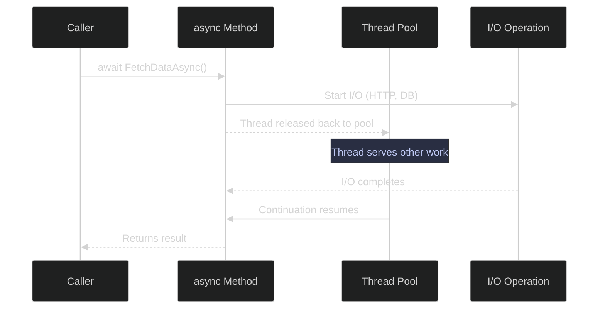
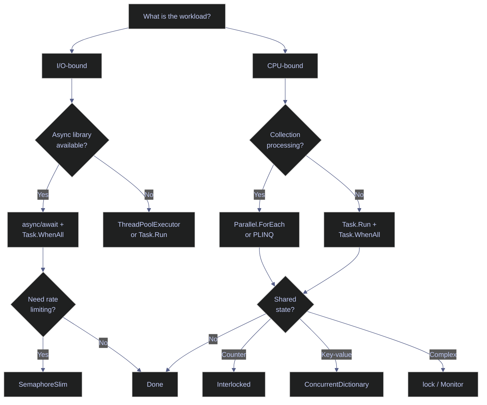

# 12. Async & Concurrency - C#

> [!quote]
> "Everybody who learns concurrency thinks they understand it, ends up finding mysterious races they thought weren't possible, and discovers that they didn't actually understand it yet after all."
>
> — **Herb Sutter**, *The Free Lunch Is Over*, Dr. Dobb's Journal (2005)

```csharp
using System.Diagnostics;
using System.Threading;
using System.Threading.Channels;
using System.Net.Http;
using System.Collections.Concurrent;
using System.Security.Cryptography;
using System.Runtime.CompilerServices;
```

## Async and Await

> [!info] Async fundamentals
>
> - `async` — marks a method as asynchronous, returning `Task` or `Task<T>`
> - `await` — pauses the method until the awaited task completes; the thread is released to the pool, not blocked
> - The thread pool manages threads automatically

**Why async matters for data engineering:** API calls (BigQuery, GCS, REST) are I/O-bound — async lets you overlap them. A pipeline that fetches 10 APIs sequentially in 10s can do it in ~1s with async.



> [!warning] Async pitfalls
>
> - **`.Result` or `.Wait()`** — deadlocks in UI/web contexts; always `await`
> - **`async void`** — exceptions are unobservable; use `async Task`
> - **`await` in a loop** when `Task.WhenAll` works — sequential instead of concurrent
> - For **CPU-bound work**, use `Task.Run` or `Parallel` instead

> [!success] Correct async pattern
>
> Always `await` async methods directly. Use `async Task` (never `async void`) for all non-event-handler methods. Use `Task.WhenAll` to run independent I/O-bound tasks concurrently. Use `Task.Run` only for CPU-bound work.

> [!danger] .Result and .Wait() cause deadlocks
>
> `.Result` and `.Wait()` cause deadlocks in synchronization contexts
> Calling `.Result` or `.Wait()` on a `Task` from a thread with a `SynchronizationContext` (ASP.NET, WinForms, WPF) blocks the thread that the `await` continuation needs to resume on, causing a permanent deadlock. Always use `await` instead. In rare cases where sync-over-async is unavoidable, use `Task.Run(() => AsyncMethod()).Result` to escape the context.

> [!success] Use await instead
>
> Replace `.Result`/`.Wait()` with `await`. If you must call async code from a sync context (e.g., legacy code), wrap in `Task.Run(() => MyMethodAsync()).GetAwaiter().GetResult()` to avoid capturing the synchronization context.

> [!danger] async void
>
> `async void` — exceptions are unobservable and crash the process
> Exceptions in `async void` methods propagate to the `SynchronizationContext` and terminate the process. The caller has no `Task` to `await` or catch. Always use `async Task`. The only valid use of `async void` is UI event handlers (`async void Button_Click`).

> [!success] Use async Task
>
> Declare all async methods as `async Task` or `async Task<T>`. This makes exceptions observable and awaitable. Reserve `async void` exclusively for UI event handlers where the framework requires it.

> [!tip] ConfigureAwait(false) in library code
>
> In library code (not UI or ASP.NET controllers), add `.ConfigureAwait(false)` after every `await` to avoid capturing the synchronization context. This prevents deadlocks when callers use `.Result` and improves performance by skipping context marshaling.

### Basic async/await

#### async/await Task — basic async method

`async` marks a method as asynchronous, changing its return type to `Task<T>`. Inside the body, `await` pauses execution at each asynchronous operation and releases the thread back to the pool. When the awaited operation completes, execution resumes from where it left off. The calling code receives a `Task<T>` that it can `await` in turn.

```csharp
async Task<Dictionary<string, object>> FetchDataAsync(string source, double delaySeconds)
{
    Console.WriteLine($"  [{DateTime.Now:HH:mm:ss}] Starting fetch: {source}");
    await Task.Delay(TimeSpan.FromSeconds(delaySeconds));
    Console.WriteLine($"  [{DateTime.Now:HH:mm:ss}] Completed fetch: {source}");
    return new Dictionary<string, object>
    {
        ["source"] = source,
        ["rows"] = (int)(delaySeconds * 1000)
    };
}
```

### Task.WhenAll and Task.WhenAny — concurrent waiting strategies

#### Task.WhenAll — sequential vs concurrent execution

Awaiting each async call one-by-one serializes the operations — each waits for the previous to complete. The total time equals the sum of all delays. Starting all tasks first and awaiting them together with `Task.WhenAll` overlaps the I/O, reducing total time to the longest single delay.

```csharp
var sw = Stopwatch.StartNew();
var r1 = await FetchDataAsync("users_api", 1.0);
var r2 = await FetchDataAsync("events_api", 0.8);
var r3 = await FetchDataAsync("products_api", 0.5);
sw.Stop();
Console.WriteLine($"  Total: {sw.Elapsed.TotalSeconds:F2}s (sum of all delays)");
```

```text
[06:36:58] Starting fetch: users_api
[06:36:59] Completed fetch: users_api
[06:36:59] Starting fetch: events_api
[06:37:00] Completed fetch: events_api
[06:37:00] Starting fetch: products_api
[06:37:00] Completed fetch: products_api
2.32s (sum of all delays)
```

#### Concurrent execution with Task.WhenAll

Calling an async method without `await` starts the task immediately and returns a `Task<T>` handle. `Task.WhenAll` accepts multiple task handles and returns a single task that completes when all inputs finish. The total wall-clock time equals the slowest individual task instead of the sum.

```csharp
sw.Restart();
var t1 = FetchDataAsync("users_api", 1.0);
var t2 = FetchDataAsync("events_api", 0.8);
var t3 = FetchDataAsync("products_api", 0.5);
var results = await Task.WhenAll(t1, t2, t3);
sw.Stop();
Console.WriteLine($"  Total: {sw.Elapsed.TotalSeconds:F2}s (max of all delays)");
Console.WriteLine($"  Results: {results.Length} dictionaries");
```

```text
[06:37:03] Starting fetch: users_api
[06:37:03] Starting fetch: events_api
[06:37:03] Starting fetch: products_api
[06:37:03] Completed fetch: products_api
[06:37:04] Completed fetch: events_api
[06:37:04] Completed fetch: users_api
1.01s (max of all delays)
3 dictionaries
```

#### Task.WhenAll and Task.WhenAny — define helper for waiting strategies

Helper method used in subsequent cells to demonstrate error handling and racing patterns. The optional `fail` parameter lets you simulate transient failures.

```csharp
async Task<string> FetchTableAsync(string name, double delay, bool fail = false)
{
    await Task.Delay(TimeSpan.FromSeconds(delay));
    if (fail) throw new InvalidOperationException($"Fetch failed: {name}");
    return $"{name}: {(int)(delay * 1000)} rows";
}
```

#### Task.WhenAll with error handling

When any task in `Task.WhenAll` throws, the combined task's `.Exception` property contains an `AggregateException` with every inner error. Catch the `await`, then iterate `Flatten().InnerExceptions` to inspect all failures — not just the first one.

```csharp
var allTask = Task.WhenAll(
    FetchTableAsync("events", 0.3),
    FetchTableAsync("users", 0.2, fail: true),
    FetchTableAsync("products", 0.1)
);

try
{
    await allTask;
}
catch
{
    foreach (var ex in allTask.Exception!.Flatten().InnerExceptions)
        Console.WriteLine(ex.Message);
}
```

```text
Fetch failed: users
```

#### Task.WhenAny — first to complete wins

`Task.WhenAny` returns the first task to complete from a set. Useful for racing replica endpoints or implementing timeout fallbacks. The remaining tasks continue running in the background — cancel them with a `CancellationToken` to avoid wasted work.

```csharp
var tasks = new[]
{
    FetchTableAsync("replica-us", 0.5),
    FetchTableAsync("replica-eu", 0.3),
    FetchTableAsync("replica-asia", 0.8),
};

var fastest = await Task.WhenAny(tasks);
await fastest
```

```text
replica-eu: 300 rows
```

### CancellationToken — cooperative cancellation

#### CancellationToken — cooperative cancellation mechanism

A CancellationToken is a cooperative cancellation mechanism — you pass it to async methods, and they periodically check `token.IsCancellationRequested` or call `token.ThrowIfCancellationRequested()` to stop early. The caller creates a `CancellationTokenSource`, which controls when cancellation is triggered (timeout, user action, or programmatic). Cancellation is cooperative: the called code must actively check the token — it's not forcefully killed.

> [!warning] Cancellation is not instant
> Passing a CancellationToken doesn't kill the operation immediately. The code must CHECK the token at regular intervals. A long-running SQL query or HTTP call won't stop until it returns — only then does the next token check abort. For true preemption, the underlying API must support cancellation natively (e.g., `HttpClient` does, raw socket reads may not).

> [!success] Design for cooperative cancellation
>
> Call `ct.ThrowIfCancellationRequested()` at logical checkpoints within loops and between pipeline stages. Pass the token to all awaited calls (e.g., `Task.Delay(ms, ct)`, `HttpClient.GetAsync(url, ct)`) so they short-circuit immediately when cancelled.

```csharp
async Task<string> LongRunningExportAsync(string table, CancellationToken ct)
{
    Console.WriteLine(table);
    for (int i = 0; i < 10; i++)
    {
        ct.ThrowIfCancellationRequested();
        await Task.Delay(500, ct);
        Console.WriteLine($"  {table}: chunk {i + 1}/10");
    }
    return $"{table}: export complete";
}
```

#### CancellationTokenSource — cancel after timeout

`CancellationTokenSource.CancelAfter` triggers automatic cancellation after a specified duration. This prevents runaway operations — essential for production pipelines with SLA deadlines. Create a `CancellationTokenSource`, call `CancelAfter(TimeSpan)`, and pass `cts.Token` to the async method.

```csharp
var cts = new CancellationTokenSource();
cts.CancelAfter(TimeSpan.FromSeconds(2));

try
{
    var result = await LongRunningExportAsync("huge_events", cts.Token);
    Console.WriteLine($"  {result}");
}
catch (OperationCanceledException)
{
    //   Export cancelled after 2s timeout
}
```

```text
huge_events
huge_events: chunk 1/10
huge_events: chunk 2/10
huge_events: chunk 3/10
Export cancelled after 2s timeout
```

#### CancellationTokenSource.Cancel — manual cooperative cancellation

`CancellationTokenSource.Cancel()` triggers cancellation immediately from external code. This allows supervisory logic to stop operations based on runtime conditions such as resource limits, user action, or downstream failure. Share the `CancellationToken` with the async method, then call `cts.Cancel()` from the controlling code.

```csharp
var cts2 = new CancellationTokenSource();
var exportTask = LongRunningExportAsync("daily_clicks", cts2.Token);

_ = Task.Run(async () =>
{
    await Task.Delay(1500);
    cts2.Cancel();
});

try
{
    await exportTask;
}
catch (OperationCanceledException)
{
    //   Export was manually cancelled
}
```

```text
daily_clicks
daily_clicks: chunk 1/10
daily_clicks: chunk 2/10
[Supervisor] Cancelling export...
Export was manually cancelled
```

## Async patterns

### SemaphoreSlim — async rate limiting

#### SemaphoreSlim — limit concurrent async operations

`SemaphoreSlim` controls how many async operations run concurrently. `WaitAsync()` blocks if the semaphore count is at zero; `Release()` increments the count when the operation finishes. Use it to rate-limit API calls, database connections, or any resource with a concurrency cap. Always release in a `finally` block to prevent deadlocks on exceptions.

```csharp
async Task<string> FetchWithLimitAsync(SemaphoreSlim sem, string url)
{
    await sem.WaitAsync();
    try
    {
        var delay = Random.Shared.Next(100, 500);
        await Task.Delay(delay);
        return $"{url} ({delay}ms)";
    }
    finally
    {
        sem.Release();
    }
}

var sem = new SemaphoreSlim(3);
var sw = Stopwatch.StartNew();
var tasks = Enumerable.Range(0, 10)
    .Select(i => FetchWithLimitAsync(sem, $"https://api.example.com/page/{i}"))
    .ToArray();
var results = await Task.WhenAll(tasks);
sw.Stop();
Console.WriteLine($"  Fetched {results.Length} pages in {sw.Elapsed.TotalSeconds:F2}s");
foreach (var r in results.Take(3))
    Console.WriteLine($"    {r}");
Console.WriteLine($"    ... ({results.Length - 3} more)");
```

```text
Fetched 10 pages in 1.33s
  https://api.example.com/page/0 (175ms)
  https://api.example.com/page/1 (397ms)
  https://api.example.com/page/2 (491ms)
  ... (7 more)
```

### Retry patterns

#### Retry with exponential backoff — async transient error recovery

Transient errors (network timeouts, rate limits, temporary service unavailability) are common in distributed systems. Exponential backoff retries with increasing delays — 100ms, 200ms, 400ms, 800ms — to avoid hammering a failing service. The `when` clause in the catch block limits retries to non-final attempts, letting the last failure propagate.

```csharp
var attemptCount = 0;

async Task<string> FlakyApiAsync(string endpoint)
{
    attemptCount++;
    if (attemptCount < 3)
        throw new HttpRequestException($"Connection refused (attempt {attemptCount})");
    return $"{endpoint}: ok";
}

async Task<T> RetryWithBackoffAsync<T>(Func<Task<T>> action, int maxRetries = 5, int baseDelayMs = 100)
{
    for (int attempt = 0; attempt < maxRetries; attempt++)
    {
        try
        {
            return await action();
        }
        catch (Exception ex) when (attempt < maxRetries - 1)
        {
            var delay = baseDelayMs * (int)Math.Pow(2, attempt);
            Console.WriteLine($"  Attempt {attempt + 1} failed: {ex.Message}. Retrying in {delay}ms...");
            await Task.Delay(delay);
        }
    }
    throw new InvalidOperationException("Unreachable");
}

attemptCount = 0;
var apiResult = await RetryWithBackoffAsync(() => FlakyApiAsync("/data/events"));
Console.WriteLine($"  Success on attempt {attemptCount}: {apiResult}");
```

```text
Connection refused (attempt 1). Retrying in 100ms...
Connection refused (attempt 2). Retrying in 200ms...
/data/events: ok
```

### Channel&lt;T&gt; — async producer-consumer

#### Channel&lt;T&gt; — produce events into a bounded channel

A Channel is a thread-safe async queue for passing data between producers and consumers. Producers write with `WriteAsync`, consumers read with `ReadAllAsync`. Channels are bounded (backpressure when full) or unbounded (unlimited buffer). They're the modern replacement for `BlockingCollection` in async code — fully async, no thread blocking.

```csharp
var channel = Channel.CreateBounded<Dictionary<string, string>>(5);
var processedCount = 0;

var producerTask = Task.Run(async () =>
{
    var types = new[] { "click", "view", "purchase" };
    for (int i = 0; i < 12; i++)
    {
        var evt = new Dictionary<string, string>
            { ["id"] = $"evt_{i:D3}", ["type"] = types[Random.Shared.Next(types.Length)] };
        await channel.Writer.WriteAsync(evt);
        await Task.Delay(50);
    }
    channel.Writer.Complete();
});
```

#### Channel&lt;T&gt; — consume events with multiple workers

The consumer uses `await foreach` over `ReadAllAsync()` to pull items until the channel is marked complete. Multiple consumers can read from the same channel — the channel distributes items automatically (each item goes to exactly one consumer).

```csharp
async Task ConsumeAsync(string workerName, ChannelReader<Dictionary<string, string>> reader)
{
    await foreach (var evt in reader.ReadAllAsync())
    {
        await Task.Delay(Random.Shared.Next(20, 100));
        Interlocked.Increment(ref processedCount);
    }
}

sw.Restart();
await Task.WhenAll(
    producerTask,
    ConsumeAsync("worker-1", channel.Reader),
    ConsumeAsync("worker-2", channel.Reader),
    ConsumeAsync("worker-3", channel.Reader)
);
sw.Stop();
Console.WriteLine($"  Processed {processedCount} events in {sw.Elapsed.TotalSeconds:F2}s with 3 workers");
```

```text
Processed 12 events in 0.78s with 3 workers
```

### IAsyncEnumerable&lt;T&gt; — async streaming

#### IAsyncEnumerable&lt;T&gt; — async streaming with yield

`IAsyncEnumerable<T>` enables streaming data one item at a time asynchronously. Instead of loading an entire result set into memory, you `yield return` each item as it becomes available. The consumer processes items as they arrive using `await foreach`. Essential for streaming database results, paginated API responses, or large file processing where loading everything into memory would be impractical.

```csharp
async IAsyncEnumerable<string> FetchPagesAsync(int totalPages, int itemsPerPage)
{
    for (int page = 1; page <= totalPages; page++)
    {
        await Task.Delay(100);
        Console.WriteLine($"  Fetching page {page}...");
        for (int i = 0; i < itemsPerPage; i++)
            yield return $"page{page}_item{i + 1}";
    }
}

var sw = Stopwatch.StartNew();
int count = 0;
await foreach (var item in FetchPagesAsync(3, 2))
{
    count++;
    Console.WriteLine(item);
}
Console.WriteLine($"  Total: {count} items in {sw.ElapsedMilliseconds}ms");
```

```text
Fetching page 1...
  page1_item1
  page1_item2
Fetching page 2...
  page2_item1
  page2_item2
Fetching page 3...
  page3_item1
  page3_item2
6 items in 326ms
```

#### IAsyncEnumerable with cancellation and LINQ

The `[EnumeratorCancellation]` attribute lets the compiler pass the token from `.WithCancellation()` directly to the generator's `CancellationToken` parameter. The generator checks the token between yields, enabling graceful stream termination when a timeout or external cancel fires.

```csharp
async IAsyncEnumerable<int> GenerateNumbersAsync(
    [EnumeratorCancellation] CancellationToken ct = default)
{
    int n = 0;
    while (!ct.IsCancellationRequested)
    {
        await Task.Delay(50, ct);
        yield return n++;
    }
}

var cts = new CancellationTokenSource(200);
var collected = new List<int>();
try
{
    await foreach (var n in GenerateNumbersAsync().WithCancellation(cts.Token))
        collected.Add(n);
}
catch (OperationCanceledException) { }
Console.WriteLine($"  Collected {collected.Count} items before cancellation: [{string.Join(", ", collected)}]");
```

```text
[0, 1, 2]
```

#### IAsyncEnumerable with break — early exit disposes the enumerator

Using `break` inside `await foreach` disposes the async enumerator, which stops the producer cleanly. No remaining pages are fetched — the generator's `finally` blocks run and resources are released. This makes `IAsyncEnumerable` safe for unbounded or large streams where you only need the first N items.

```csharp
count = 0;
await foreach (var item in FetchPagesAsync(10, 3))
{
    Console.WriteLine($"    {item}");
    count++;
    if (count >= 5) break;
}
```

```text
First 5 from paginated source:
Fetching page 1...
  page1_item1
  page1_item2
  page1_item3
Fetching page 2...
  page2_item1
  page2_item2
```

### ValueTask&lt;T&gt; — avoiding allocation on hot paths

#### ValueTask&lt;T&gt; — return synchronous results without heap allocation

`ValueTask<T>` is a `readonly struct` that wraps either a `Task<T>` or a raw `TResult` value. When a method frequently completes synchronously (cache hit, buffered read), `ValueTask<T>` avoids the heap allocation that `Task<T>` requires on every call. Use it only when **both** conditions hold: the method is likely to complete synchronously **and** it is called so frequently that the allocation cost is measurable in profiling. `Task<T>` is the correct default for all other cases.

> [!danger] ValueTask can only be consumed once
>
> A `ValueTask<T>` must be awaited exactly once. Awaiting it a second time, calling `.AsTask()` more than once, or reading `.Result` before completion are all undefined behavior. If you need to await the same result multiple times, call `.AsTask()` once and work with the returned `Task<T>` from that point.

> [!success] Default to Task, switch to ValueTask only after profiling
>
> Use `Task<T>` by default. Only switch to `ValueTask<T>` when profiling shows measurable allocation pressure on a hot path. For synchronous completion with no result, return `Task.CompletedTask` or `ValueTask.CompletedTask` instead of allocating a new task.

The cell defines `GetConfigAsync`, which checks a local `_cache` dictionary first and returns a `new ValueTask<string>(cached)` — no heap allocation — on a hit. On a miss it falls through to `LoadFromDbAsync`, wrapping the resulting `Task<string>` in a `ValueTask<string>`. Calling the method with a cached key (`"config_a"`) and an uncached key (`"config_c"`) shows the allocation-free synchronous path versus the deferred async path, with the result added to the cache for future hits.

```csharp
private readonly Dictionary<string, string> _cache = new()
{
    ["config_a"] = "value_a",
    ["config_b"] = "value_b"
};

ValueTask<string> GetConfigAsync(string key)
{
    if (_cache.TryGetValue(key, out var cached))
        return new ValueTask<string>(cached);

    return new ValueTask<string>(LoadFromDbAsync(key));
}

async Task<string> LoadFromDbAsync(string key)
{
    await Task.Delay(100);
    var value = $"db_{key}";
    _cache[key] = value;
    return value;
}

var hit = await GetConfigAsync("config_a");
Console.WriteLine($"  Cache hit: {hit}");
var miss = await GetConfigAsync("config_c");
Console.WriteLine($"  Cache miss (loaded): {miss}");
```

```text
Cache hit: value_a
Cache miss (loaded): db_config_c
```

### TaskCompletionSource — wrapping callbacks as Tasks

#### TaskCompletionSource&lt;T&gt; — bridge callback-based APIs to async/await

`TaskCompletionSource<T>` creates a `Task<T>` whose lifecycle you control manually. You expose `tcs.Task` to callers, then resolve it later by calling `SetResult`, `SetException`, or `SetCanceled` from a callback, event handler, or external trigger. This is the standard pattern for wrapping legacy callback-based (APM) or event-based (EAP) APIs into modern `Task`-based async code.

> [!tip] Use TrySet* variants for multiple completion paths
>
> When wrapping event-based APIs where multiple events may fire (success, error, cancellation), use `TrySetResult`, `TrySetException`, and `TrySetCanceled` instead of their throwing counterparts. The `Try` variants return `false` if the task is already completed, avoiding `InvalidOperationException`.

The cell defines `WaitForSignalAsync`, which creates a `TaskCompletionSource<string>`, registers a cancellation callback that calls `TrySetCanceled`, then fires a background `Task.Run` that resolves the TCS via `TrySetResult("signal_received")` after 500 ms. It is called twice — once successfully (signal arrives before cancellation) and once with a 100 ms `CancellationTokenSource` that fires before the signal, demonstrating how `TCS.Task` behaves under both normal resolution and cancellation.

```csharp
async Task<string> WaitForSignalAsync(CancellationToken ct = default)
{
    var tcs = new TaskCompletionSource<string>();

    ct.Register(() => tcs.TrySetCanceled());

    _ = Task.Run(async () =>
    {
        await Task.Delay(500);
        tcs.TrySetResult("signal_received");
    });

    return await tcs.Task;
}

var signal = await WaitForSignalAsync();
Console.WriteLine($"  {signal}");

var cts = new CancellationTokenSource(100);
try
{
    await WaitForSignalAsync(cts.Token);
}
catch (TaskCanceledException)
{
    Console.WriteLine($"  Cancelled before signal arrived");
}
```

```text
signal_received
Cancelled before signal arrived
```

## Tasks and Parallelism

> [!info] Task and parallel APIs
>
> - `Task.Run()` — schedules work on the thread pool (returns a `Task`)
> - `Parallel.ForEach()` — partitions a collection, processes on multiple threads, blocks until done
> - `Parallel.ForEachAsync()` (.NET 6+) — async version
> - C# has **no GIL** — multiple threads execute truly in parallel

> [!warning] CPU parallelism pitfalls
>
> - `Task.Run` for I/O-bound work — use `async`/`await` instead (no thread needed)
> - Too many `Task.Run` calls — thread pool exhaustion
> - Shared mutable state without locking — race conditions

> [!success] Match the tool to the workload
>
> Use `async`/`await` for I/O-bound operations (no thread consumed while waiting). Use `Task.Run` or `Parallel.ForEach` for CPU-bound work. Protect shared state with `lock`, `Interlocked`, or `ConcurrentDictionary` — never share plain mutable fields across threads.

### Task.Run — thread pool offloading

#### Task.Run — offload CPU work to thread pool

`Task.Run` schedules a delegate on the thread pool and returns a `Task` representing its completion. Use it for CPU-bound work that would block the calling thread. Each `Task.Run` call consumes a thread pool thread — use `Task.WhenAll` to await multiple parallel computations. C# has no GIL, so multiple threads execute truly in parallel on separate cores.

The cell hashes 8 random 100 KB payloads first sequentially (plain `Select`) and then in parallel using `Task.Run` inside a `Select` projection, collecting all parallel tasks with `Task.WhenAll`. It measures elapsed time for both passes and prints a speedup ratio, then confirms `seqHashes.SequenceEqual(parHashes)` to verify correctness — the hashes must match regardless of scheduling order.

```csharp
string ComputeHash(byte[] data)
{
    for (int i = 0; i < 100; i++)
        data = SHA256.HashData(data);
    return Convert.ToHexString(data)[..16];
}

var payloads = Enumerable.Range(0, 8)
    .Select(_ => RandomNumberGenerator.GetBytes(100 * 1024))
    .ToArray();

var sw = Stopwatch.StartNew();
var seqHashes = payloads.Select(ComputeHash).ToArray();
var seqTime = sw.Elapsed;
Console.WriteLine($"  {seqHashes.Length} hashes in {seqTime.TotalSeconds:F2}s");

Console.WriteLine($"\n=== Task.Run (thread pool, {Environment.ProcessorCount} cores) ===");
sw.Restart();
var parallelTasks = payloads.Select(p => Task.Run(() => ComputeHash(p))).ToArray();
var parHashes = await Task.WhenAll(parallelTasks);
var parTime = sw.Elapsed;
Console.WriteLine($"  {parHashes.Length} hashes in {parTime.TotalSeconds:F2}s");
Console.WriteLine($"  Speedup: {seqTime / parTime:F1}x");
Console.WriteLine(seqHashes.SequenceEqual(parHashes));
```

```text
8 hashes in 0.00s

8 hashes in 0.00s
0.5x
True
```

### Parallel class — data parallelism

#### Parallel.ForEach — partition and process

`Parallel.ForEach` partitions a collection and processes items in parallel using the thread pool. It blocks the calling thread until all iterations complete. Use `MaxDegreeOfParallelism` to cap threads — without it, the runtime auto-tunes based on core count and workload.

The cell hashes the same 8 payloads using `Parallel.ForEach` over an index range, storing each result into `hashResults[i]` directly by index — safe because each iteration writes to a distinct array slot. `MaxDegreeOfParallelism = 4` caps thread usage, and the final `SequenceEqual` check confirms the parallel output matches the sequential baseline computed earlier.

```csharp
var hashResults = new string[payloads.Length];
sw.Restart();
Parallel.ForEach(
    Enumerable.Range(0, payloads.Length),
    new ParallelOptions { MaxDegreeOfParallelism = 4 },
    i => hashResults[i] = ComputeHash(payloads[i])
);
sw.Stop();
Console.WriteLine($"  {hashResults.Length} hashes in {sw.Elapsed.TotalSeconds:F2}s (max 4 threads)");
Console.WriteLine(seqHashes.SequenceEqual(hashResults));
```

```text
8 hashes in 0.00s (max 4 threads)
True
```

#### Parallel.ForEachAsync — async I/O with controlled concurrency

`Parallel.ForEachAsync` (.NET 6+) is the async counterpart of `Parallel.ForEach`. It accepts an `async` lambda and respects `await` — no thread is blocked while waiting for I/O. Ideal for fetching many API endpoints or database tables concurrently with a concurrency cap.

The cell generates 10 table names and "fetches" each one with a random `Task.Delay` of 100–500 ms inside the async lambda, appending results to a `ConcurrentBag<string>`. With `MaxDegreeOfParallelism = 3`, at most 3 tables are in-flight at once, so the total time is roughly the time to process ceil(10/3) batches rather than the sum of all delays.

```csharp
var tables = Enumerable.Range(0, 10).Select(i => $"table_{i:D2}").ToArray();
var fetchedTables = new System.Collections.Concurrent.ConcurrentBag<string>();

var sw = Stopwatch.StartNew();
await Parallel.ForEachAsync(
    tables,
    new ParallelOptions { MaxDegreeOfParallelism = 3 },
    async (table, ct) =>
    {
        await Task.Delay(Random.Shared.Next(100, 500), ct);
        fetchedTables.Add($"{table}: {Random.Shared.Next(100, 10000)} rows");
    }
);
sw.Stop();
Console.WriteLine($"  Fetched {fetchedTables.Count} tables in {sw.Elapsed.TotalSeconds:F2}s");
foreach (var t in fetchedTables.Take(3))
    Console.WriteLine($"    {t}");
```

```text
Fetched 10 tables in 1.20s
  table_08: 1841 rows
  table_09: 6788 rows
  table_07: 2097 rows
```

### PLINQ — Parallel LINQ

#### PLINQ — query large collections in parallel

`AsParallel()` converts a LINQ query into a parallel query that partitions data across threads. `WithDegreeOfParallelism` caps the thread count. PLINQ preserves LINQ semantics (Where, Select, etc.) but executes them concurrently. Most effective on large datasets (100K+ items) where the per-item work is non-trivial.

The cell builds 1 million CSV-formatted event strings, then applies `AsParallel().WithDegreeOfParallelism(4)` to filter out `user_000` records, parse each CSV line into an anonymous type, and apply a second `Value > 50.0` filter — all in parallel. The timed result shows how many records survive both filters and how long the parallel pass takes, providing the baseline for comparison in the next cell.

```csharp
var rawRecords = Enumerable.Range(0, 1_000_000)
    .Select(i => $"evt_{i:D7},user_{i % 100:D3},{i * 0.01:F2}")
    .ToArray();

sw.Restart();
var parsed = rawRecords
    .AsParallel()
    .WithDegreeOfParallelism(4)
    .Where(r => !r.Contains("user_000"))
    .Select(r => { var p = r.Split(','); return new { EventId = p[0], User = p[1], Value = double.Parse(p[2]) }; })
    .Where(r => r.Value > 50.0)
    .ToArray();
sw.Stop();
Console.WriteLine($"  Parsed {rawRecords.Length:N0} -> {parsed.Length:N0} filtered in {sw.Elapsed.TotalSeconds:F2}s");
```

#### PLINQ vs sequential — speedup comparison

Sequential baseline comparison to demonstrate PLINQ speedup on large datasets. The difference is most visible when per-item processing is CPU-bound (parsing, transformation, aggregation).

The cell runs the identical two-stage filter-and-parse pipeline from the previous cell without `AsParallel()`, using plain LINQ on the same `rawRecords` array. The elapsed time is printed alongside the PLINQ time so the reader can directly compare the two numbers and see that PLINQ is faster when per-item work is CPU-bound and the collection is large.

```csharp
sw.Restart();
var seqParsed = rawRecords
    .Where(r => !r.Contains("user_000"))
    .Select(r => { var p = r.Split(','); return new { EventId = p[0], User = p[1], Value = double.Parse(p[2]) }; })
    .Where(r => r.Value > 50.0)
    .ToArray();
sw.Stop();
Console.WriteLine($"  Sequential: {sw.Elapsed.TotalSeconds:F2}s  |  PLINQ was faster on large data");
```

```text
Parsed 1'000'000 records -> 985'050 filtered in 0.10s
{ EventId = evt_0005001, User = user_001, Value = 50.01 }
0.16s  |  PLINQ was faster on large data
```

## Threading and Concurrency

> [!info] Threading primitives
>
> - `new Thread(method)` — creates an OS thread
> - `.Start()` — begins execution; `.Join()` — blocks until complete
> - `lock` — mutual exclusion (sugar for `Monitor.Enter`/`Exit`)
> - `Interlocked` — atomic operations without locks (`Increment`, `Add`, `Exchange`)
> - `IsBackground = true` — daemon thread that dies when main exits

> [!tip] In modern C#, prefer Task/async
>
> In modern C#, prefer `Task`/`async` over raw threads. Use threads only when you need explicit control (priority, apartment state, dedicated long-running work).

> [!warning] Threading pitfalls
>
> - Creating threads for short work — use `Task.Run` (thread pool) instead
> - Not joining threads — orphaned threads may prevent shutdown
> - Shared mutable state without synchronization — race conditions

> [!success] Use the thread pool for short-lived work
>
> Use `Task.Run` for short CPU-bound work — it draws from the managed thread pool, avoiding OS thread creation overhead. Always `Join` or `await` threads you start. Mark background threads with `IsBackground = true` so they don't prevent process shutdown.

### Thread class — OS threads

#### Thread class — basic thread creation and Join

The `Thread` class creates an OS-level thread. Call `.Start()` to begin execution and `.Join()` to block the caller until the thread completes. Pass state through the `Start(object?)` parameter. Use `ConcurrentBag<T>` or another thread-safe collection to gather results from multiple threads. In modern C#, prefer `Task.Run` for short-lived work — use raw threads only when you need explicit control over thread priority, apartment state, or dedicated long-running work.

The cell creates three `Thread` instances, each receiving a `(name, delay)` tuple via `Start(state)`. Each thread sleeps for its assigned delay (simulating work), then appends its name to a shared `ConcurrentBag<string>`. The main thread calls `Join()` on each thread in sequence to wait for all three to finish, then prints the collected results — demonstrating explicit thread lifecycle control and safe result aggregation.

```csharp
#nullable enable
var threadResults = new System.Collections.Concurrent.ConcurrentBag<string>();

void WorkerMethod(object? state)
{
    var (name, delay) = ((string, int))state!;
    Console.WriteLine($"  [{Thread.CurrentThread.ManagedThreadId}] {name} starting");
    Thread.Sleep(delay);
    threadResults.Add($"{name} done");
    Console.WriteLine($"  [{Thread.CurrentThread.ManagedThreadId}] {name} finished");
}

var threads = new List<Thread>();
foreach (var (name, delay) in new[] { ("fetch_users", 300), ("fetch_events", 500), ("fetch_products", 200) })
{
    var t = new Thread(WorkerMethod) { Name = $"T-{name}" };
    threads.Add(t);
    t.Start((name, delay));  // pass state to the thread
}

// Join — wait for all threads to finish
foreach (var t in threads)
    t.Join();

Console.WriteLine($"  Results: [{string.Join(", ", threadResults)}]");
```

```text
[104] fetch_users starting
[102] fetch_events starting
[101] fetch_products starting
[101] fetch_products finished
[104] fetch_users finished
[102] fetch_events finished
[fetch_events done, fetch_users done, fetch_products done]
```

> [!danger] ++ and += are not atomic
>
> `++` and `+=` are not atomic — they cause race conditions without synchronization
> `counter++` in C# compiles to read-increment-write which can interleave across threads. Use `lock`, `Interlocked.Increment`, or `ConcurrentDictionary` for thread-safe mutation. Unlike Python's GIL, C# has true parallelism, making races more frequent and harder to reproduce.

> [!success] Use Interlocked or lock for shared counters
>
> Replace `counter++` with `Interlocked.Increment(ref counter)` for simple integer counters — it's lock-free and faster than `lock`. For compound operations or non-integer types, use `lock(obj) { ... }`. For aggregation over keys, use `ConcurrentDictionary.AddOrUpdate`.

### Race conditions and synchronization

#### Threading race condition demo (WITHOUT lock)

Without synchronization, `counter++` compiles to separate read-increment-write instructions that interleave across threads. Two threads can read the same value, both increment, and one update is lost. Unlike Python's GIL, C# has true parallelism, making races more frequent and harder to reproduce.

The cell starts 4 threads that each increment `unsafeCounter` 100,000 times using bare `unsafeCounter++`, with no synchronization. After all threads `Join`, the actual count is printed alongside the expected 400,000 — the result is typically less, proving that increments were lost to interleaving. The output message flags the discrepancy as a race condition.

```csharp
var unsafeCounter = 0;

void IncrementUnsafe()
{
    for (int i = 0; i < 100_000; i++)
        unsafeCounter++;
}

unsafeCounter = 0;
var unsafeThreads = Enumerable.Range(0, 4)
    .Select(_ => new Thread(IncrementUnsafe))
    .ToArray();
foreach (var t in unsafeThreads) t.Start();
foreach (var t in unsafeThreads) t.Join();
Console.WriteLine($"  Expected: 400,000");
Console.WriteLine($"  Got:      {unsafeCounter:N0}  {(unsafeCounter != 400_000 ? "(WRONG — race condition!)" : "(got lucky this time)")}");
```

```text
Expected: 400,000
Got:      398'731  (WRONG — race condition!)
```

#### lock statement — fix race condition with mutual exclusion

The `lock` statement (syntactic sugar for `Monitor.Enter`/`Monitor.Exit`) ensures only one thread enters the critical section at a time. Lock on a dedicated `object` instance — never lock on `this`, `typeof()`, or string literals, as external code might lock on the same reference and cause deadlocks.

The cell repeats the same 4-thread × 100,000-increment pattern as the race condition demo, but wraps each `safeCounter++` in `lock (lockObj) { ... }`. After all threads `Join`, the result is exactly 400,000 every time — the lock serializes access to the critical section, eliminating lost updates at the cost of contention overhead.

```csharp
var safeCounter = 0;
var lockObj = new object();

void IncrementSafe()
{
    for (int i = 0; i < 100_000; i++)
    {
        lock (lockObj)
        {
            safeCounter++;
        }
    }
}

safeCounter = 0;
var safeThreads = Enumerable.Range(0, 4)
    .Select(_ => new Thread(IncrementSafe))
    .ToArray();
foreach (var t in safeThreads) t.Start();
foreach (var t in safeThreads) t.Join();
Console.WriteLine($"  Expected: 400,000");
Console.WriteLine($"  Got:      {safeCounter:N0}  (correct — lock prevents race)");
```

```text
Expected: 400,000
Got:      400'000  (correct — lock prevents race)
```

#### Interlocked — lock-free atomic operations

`Interlocked` provides atomic operations using CPU-level instructions (compare-and-swap). `Interlocked.Increment` guarantees the read-increment-write sequence is indivisible — no other thread can interleave. Faster than `lock` for simple counters because there's no kernel transition. Also supports `Add`, `Exchange`, and `CompareExchange` for more complex atomic operations.

The cell runs the same 4-thread × 100,000-increment pattern a third time, replacing `counter++` with `Interlocked.Increment(ref atomicCounter)`. The final count is always exactly 400,000, confirming atomicity — and unlike the `lock` version, no mutex object or kernel transition is required, making this the lowest-overhead option for simple integer counters.

```csharp
var atomicCounter = 0;

void IncrementAtomic()
{
    for (int i = 0; i < 100_000; i++)
        Interlocked.Increment(ref atomicCounter);
}

atomicCounter = 0;
var atomicThreads = Enumerable.Range(0, 4)
    .Select(_ => new Thread(IncrementAtomic))
    .ToArray();
foreach (var t in atomicThreads) t.Start();
foreach (var t in atomicThreads) t.Join();
Console.WriteLine($"  Expected: 400,000");
Console.WriteLine($"  Got:      {atomicCounter:N0}  (correct — atomic operation)");
```

```text
Expected: 400,000
Got:      400'000  (correct — atomic operation)
```

### Thread-safe collections

#### ConcurrentDictionary — thread-safe aggregation

`ConcurrentDictionary` is a dictionary that multiple threads can read and write simultaneously without explicit locking. It uses fine-grained locking internally (lock striping), so concurrent writes to different keys don't block each other. Use `AddOrUpdate` and `GetOrAdd` for atomic read-modify-write operations.

> [!danger] AddOrUpdate is not atomic end-to-end
> The update delegate in `AddOrUpdate` may be called multiple times if there's contention — it's optimistic, not locked. Don't put side effects (database writes, API calls) inside the delegate. Only use it for pure computations.

> [!success] Keep delegates pure
>
> Ensure the `AddOrUpdate` factory and update delegates are pure functions — no I/O, no side effects, no external calls. For operations that must be atomic with side effects, use `lock` or a dedicated synchronization primitive instead.

The cell simulates 100,000 events cycling through four event types and tallies them using `ConcurrentDictionary.AddOrUpdate` — inserting with a seed value of `1` on first encounter, then incrementing `oldVal + 1` on each subsequent hit. `Parallel.For` drives the concurrent writes, and the final counts for all four keys should sum to exactly 100,000, confirming that no increments were lost despite concurrent access.

```csharp
var eventCounts = new ConcurrentDictionary<string, int>();
var eventTypes = new[] { "click", "view", "purchase", "signup" };

Parallel.For(0, 100_000, i =>
{
    var evtType = eventTypes[i % eventTypes.Length];
    eventCounts.AddOrUpdate(evtType, 1, (key, oldVal) => oldVal + 1);
});

foreach (var kvp in eventCounts.OrderBy(k => k.Key))
    Console.WriteLine($"    {kvp.Key}: {kvp.Value:N0}");
Console.WriteLine($"  Total: {eventCounts.Values.Sum():N0}");  // Total
```

```text
Event counts (100K events across 4 types):
  click: 25'000
  purchase: 25'000
  signup: 25'000
  view: 25'000
100'000
```

#### BlockingCollection — thread concurrency producer-consumer

`BlockingCollection` is the synchronous (thread-based) equivalent of Channel. Producers call `Add()` (blocks if bounded and full), consumers call `Take()` (blocks if empty). Use `GetConsumingEnumerable()` for a foreach-friendly consumer loop. Prefer `Channel<T>` in async code; use `BlockingCollection` only when working with thread-based (non-async) consumers.

The cell creates a `BlockingCollection<string>` with a bound of 5, then starts a producer thread that adds 20 events with 20 ms spacing before calling `CompleteAdding()`. Three consumer threads each iterate over `GetConsumingEnumerable()`, sleeping a random 10–50 ms per item to simulate variable processing. After all threads `Join`, the output shows how many events each worker handled — demonstrating that `BlockingCollection` distributes work across consumers and signals completion cleanly via `CompleteAdding`.

```csharp
var collection = new BlockingCollection<string>(boundedCapacity: 5);
var processed = new ConcurrentBag<string>();
var sw = Stopwatch.StartNew();

var producerThread = new Thread(() =>
{
    for (int i = 0; i < 20; i++)
    {
        collection.Add($"evt_{i:D3}");
        Thread.Sleep(20);
    }
    collection.CompleteAdding();
});

void Consume(string name)
{
    foreach (var item in collection.GetConsumingEnumerable())
    {
        Thread.Sleep(Random.Shared.Next(10, 50));
        processed.Add($"{name}: {item}");
    }
}

var consumers = Enumerable.Range(1, 3)
    .Select(i => new Thread(() => Consume($"worker-{i}")))
    .ToArray();

producerThread.Start();
foreach (var c in consumers) c.Start();
producerThread.Join();
foreach (var c in consumers) c.Join();
sw.Stop();

Console.WriteLine($"  Processed {processed.Count} events in {sw.Elapsed.TotalSeconds:F2}s");
foreach (var g in processed.GroupBy(p => p.Split(":")[0]).OrderBy(g => g.Key))
    Console.WriteLine($"    {g.Key}: {g.Count()} events");
```

```text
Processed 20 events in 0.63s
  worker-1: 7 events
  worker-2: 7 events
  worker-3: 6 events
```

## Advanced Synchronization

### ReaderWriterLockSlim — read-heavy locking

#### ReaderWriterLockSlim — concurrent reads with exclusive writes

A synchronization primitive optimized for read-heavy workloads. `EnterReadLock()` allows multiple threads to hold read locks simultaneously, while `EnterWriteLock()` grants exclusive access — blocking all readers and other writers. The "Slim" variant is lighter than `ReaderWriterLock` (no OS kernel object). Use for in-memory caches, lookup tables, and shared dictionaries where reads vastly outnumber writes (>90% reads). For write-heavy workloads, a plain `lock` is better.

> [!warning] ReaderWriterLockSlim is not async-safe
>
> `ReaderWriterLockSlim` is thread-affine — you cannot hold the lock across an `await` because the continuation may run on a different thread. Use `SemaphoreSlim` for async-safe mutual exclusion, or restructure to hold the lock only during synchronous sections.

> [!success] Use SemaphoreSlim(1,1) for async reader-writer patterns
>
> When you need mutual exclusion in async code, use `SemaphoreSlim(1, 1)` as an async-compatible lock. For more sophisticated async reader-writer patterns, consider `System.Threading.Channels` or an immutable snapshot pattern.

> [!info] ReaderWriterLockSlim
>
> - `EnterReadLock` — allows multiple concurrent readers
> - `EnterWriteLock` — gives exclusive access (blocks readers and other writers)
> - `UpgradeableReadLock` — promotes a reader to writer without releasing
> - Optimized for read-heavy workloads; for write-heavy, a simple `lock` is better

> [!warning] Always release in finally
>
> Always release in `finally` — deadlock on exception otherwise.

> [!success] Wrap lock operations in try/finally
>
> Always pair `EnterReadLock`/`EnterWriteLock` with `ExitReadLock`/`ExitWriteLock` inside a `try/finally` block. This guarantees the lock is released even if an exception is thrown, preventing permanent deadlock for all waiting threads.

The cell builds a shared `Dictionary<string, string>` representing an ETL status cache. Five reader tasks call `EnterReadLock` concurrently to read `"ETL_001"` — all five can hold the read lock simultaneously. A single writer task calls `EnterWriteLock` to update `"ETL_002"` to `"completed"`, which blocks until all readers exit. The final print shows the dictionary state after the concurrent mix of reads and the exclusive write completes.

```csharp
var rwLock = new ReaderWriterLockSlim();
var cache = new Dictionary<string, string>
{
    ["ETL_001"] = "success",
    ["ETL_002"] = "running",
};

var readTasks = Enumerable.Range(0, 5).Select(i => Task.Run(() =>
{
    rwLock.EnterReadLock();
    try
    {
        var status = cache.GetValueOrDefault("ETL_001", "unknown");
        Console.WriteLine($"  Reader {i}: ETL_001 = {status}");
    }
    finally { rwLock.ExitReadLock(); }
}));

var writeTask = Task.Run(() =>
{
    rwLock.EnterWriteLock();
    try
    {
        cache["ETL_002"] = "completed";
    }
    finally { rwLock.ExitWriteLock(); }
});

await Task.WhenAll(readTasks.Append(writeTask));
Console.WriteLine($"  Final cache: {string.Join(", ", cache.Select(kv => $"{kv.Key}={kv.Value}"))}");
```

All five readers execute concurrently (no blocking between them), while the writer waits for exclusive access. The output order depends on scheduling — readers may interleave with the writer.

```text
updated ETL_002 → completed
ETL_001 = success
ETL_001 = success
ETL_001 = success
ETL_001 = success
ETL_001 = success
ETL_001=success, ETL_002=completed
```

### Thread signaling primitives

#### ManualResetEventSlim and CountdownEvent — thread signaling

`ManualResetEventSlim` is a gate: threads call `Wait()` to block until another thread calls `Set()`, which unblocks all waiters simultaneously. Use it to hold workers at a starting line until initialization completes.

`CountdownEvent` is initialized with count N. Each `Signal()` decrements the count, and `Wait()` blocks until the count reaches 0. Use it when the main thread needs to wait for N workers to report ready — like a phased initialization where each component signals completion.

The cell demonstrates both primitives back-to-back. First, a `ManualResetEventSlim` gate (initialized to `false`) holds three worker tasks at `gate.Wait()` until the main flow calls `gate.Set()` after 200 ms, releasing all three simultaneously. Then a `CountdownEvent(3)` is set up: three setup tasks each signal after staggered delays, and `countdown.Wait()` on the main flow blocks until all three have signaled — confirming that all components finished initialization before proceeding.

```csharp
var gate = new ManualResetEventSlim(false);

var workers = Enumerable.Range(0, 3).Select(i => Task.Run(() =>
{
    Console.WriteLine($"  Worker {i}: waiting for signal...");
    gate.Wait();
    Console.WriteLine($"  Worker {i}: proceeding!");
})).ToArray();

await Task.Delay(200);
gate.Set();
await Task.WhenAll(workers);

var countdown = new CountdownEvent(3);

var setupTasks = Enumerable.Range(0, 3).Select(i => Task.Run(async () =>
{
    await Task.Delay(50 * (i + 1));
    Console.WriteLine($"  Worker {i}: setup done");
    countdown.Signal();
})).ToArray();

countdown.Wait();
```

```text
waiting for signal...
waiting for signal...
waiting for signal...
initialization done, signaling workers
proceeding!
proceeding!
proceeding!

setup done
setup done
setup done
all 3 workers finished setup, proceeding
```

#### Barrier — phased synchronization

A Barrier synchronizes multiple threads at a checkpoint: all participants must arrive at the barrier before any can proceed to the next phase. This is useful when parallel tasks must complete a step before the next step can begin — like a data pipeline where all partition loads must finish before the merge step starts. Each call to `SignalAndWait()` blocks until all participants have signaled.

The cell creates a `Barrier(3)` with a post-phase callback that prints the completed phase number. Three worker tasks simulate a two-phase ETL pipeline: each calls `SignalAndWait()` after its "extract" step and again after its "transform" step. No worker begins transforming until all three have finished extracting, and no worker begins loading until all three have finished transforming — enforced automatically by the two barrier checkpoints.

```csharp
var barrier = new Barrier(
    3,
    b => Console.WriteLine($"  === All workers reached phase {b.CurrentPhaseNumber} ===")
);

var phasedWorkers = Enumerable.Range(0, 3).Select(i => Task.Run(async () =>
{
    await Task.Delay(50 * (i + 1));
    Console.WriteLine($"  Worker {i}: extract done");
    barrier.SignalAndWait();

    await Task.Delay(30 * (i + 1));
    Console.WriteLine($"  Worker {i}: transform done");
    barrier.SignalAndWait();

    Console.WriteLine($"  Worker {i}: load done");
})).ToArray();

await Task.WhenAll(phasedWorkers);
```

```text
extract done
extract done
extract done
transform done
transform done
transform done
load done
load done
load done
```

### PeriodicTimer — async scheduled polling

#### PeriodicTimer — modern scheduled polling

`PeriodicTimer` (introduced in .NET 6) provides async-friendly periodic ticking without thread blocking. Unlike `System.Timers.Timer` (callback-based, easy to overlap) or `Task.Delay` in a loop (drift accumulation), `PeriodicTimer` provides a clean `WaitForNextTickAsync()` that respects cancellation tokens and doesn't fire overlapping callbacks.

The cell creates a `PeriodicTimer` with a 100 ms interval and a `CancellationTokenSource` that fires after 350 ms. The `while (await timer.WaitForNextTickAsync(...))` loop increments a tick counter and prints a timestamp on each tick, then exits when the cancellation token fires and `WaitForNextTickAsync` throws `OperationCanceledException`. The output shows three ticks at ~100 ms intervals before the timer is stopped and disposed.

```csharp
var timer = new PeriodicTimer(TimeSpan.FromMilliseconds(100));
var timerCts = new CancellationTokenSource(350);
int ticks = 0;

try
{
    while (await timer.WaitForNextTickAsync(timerCts.Token))
    {
        ticks++;
        Console.WriteLine($"  Tick {ticks} at {DateTime.Now:HH:mm:ss.fff}");
    }
}
catch (OperationCanceledException) { }

Console.WriteLine($"  Timer stopped after {ticks} ticks");
timer.Dispose();
```

```text
Tick 1 at 06:36:48.456
Tick 2 at 06:36:48.549
Tick 3 at 06:36:48.642
Timer stopped after 3 ticks
```

### Concurrency decision guide

#### Choosing the right concurrency tool

Use this decision tree to select the right concurrency primitive based on your workload characteristics. Start with the workload type (I/O-bound vs CPU-bound) and narrow by coordination needs.



| Workload | Tool | When to use |
|---|---|---|
| I/O-bound (async) | `async`/`await` + `Task.WhenAll` | HTTP, DB, file I/O with async APIs |
| I/O-bound (sync libs) | `Task.Run` / `ThreadPoolExecutor` | Blocking I/O (legacy libraries) |
| CPU-bound (collection) | `Parallel.ForEach` / PLINQ | Transform, hash, parse large collections |
| CPU-bound (mixed) | `Task.Run` + `Task.WhenAll` | Individual CPU tasks on thread pool |
| Rate limiting | `SemaphoreSlim` | Cap concurrent API calls or connections |
| Producer-consumer (async) | `Channel<T>` | Async pipeline stages |
| Producer-consumer (threads) | `BlockingCollection` | Thread-based pipeline stages |
| Read-heavy cache | `ReaderWriterLockSlim` | Many readers, rare writers (>90% reads) |
| Phased sync | `Barrier` | All workers must reach checkpoint before next phase |
| Gate/signal | `ManualResetEventSlim` | Hold workers until initialization completes |
| Countdown | `CountdownEvent` | Wait for N workers to report ready |
| Periodic polling | `PeriodicTimer` | Async-friendly scheduled checks (.NET 6+) |
