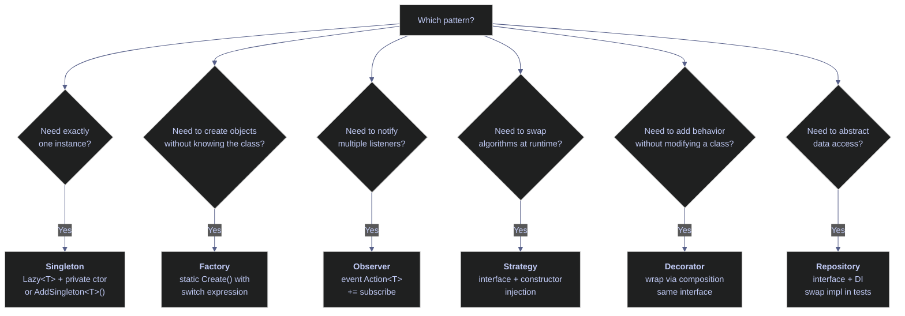

# 18. Design Patterns & Architecture - C#

> [!quote]
> "When I see patterns in my programs, I consider it a sign of trouble. The shape of a program should reflect only the problem it needs to solve."
>
> — **Paul Graham**, *Revenge of the Nerds*, essay (2002)


```csharp
// Suppress CS1701 assembly version warnings (NuGet packages on .NET 10).
using System.Reflection;
using Microsoft.DotNet.Interactive;
using Microsoft.DotNet.Interactive.CSharp;

using System.ComponentModel.DataAnnotations;
var csharpKernel = (CSharpKernel)Kernel.Root.FindKernelByName("csharp");
var optionsField = typeof(CSharpKernel).GetField("_scriptOptions",
    BindingFlags.NonPublic | BindingFlags.Instance);
var scriptOptions = optionsField.GetValue(csharpKernel);
var withWarningLevel = scriptOptions.GetType().GetMethod("WithWarningLevel");
var newOptions = withWarningLevel.Invoke(scriptOptions, new object[] { 0 });
optionsField.SetValue(csharpKernel, newOptions);
```

```text
WarningLevel set to 0.
```

## Dependency Injection

Interface defines the contract (what, not how). Constructor injection passes dependencies via the constructor. .NET's built-in `IServiceCollection` container offers three lifetimes: `AddTransient` (new per request), `AddScoped` (one per HTTP request), `AddSingleton` (one for the entire app). Python equivalent: just pass objects via `__init__` (no container needed).

> [!warning] Anti-pattern — hardcoded dependencies
> A class that creates its own database connection or API client internally (`new SqlConnection("prod-host")`) cannot be tested in isolation. Changing the provider means changing the class itself.

> [!success] Inject dependencies via constructor
> Pass dependencies as constructor parameters typed to interfaces. Production code passes real implementations; tests pass mocks — zero changes to the service class in either case.

```csharp
// ─── Production wiring ───
var prodRepo = new SqlRepository("Server=prod-db;Database=stoxx");
var prodNotifier = new SlackNotifier();
var prodService = new PipelineService(prodRepo, prodNotifier);
var result = prodService.Run("ASML.AS");
result

// ─── Test wiring — swap mocks ───
var mockRepo = new MockRepository();
var mockNotifier = new MockNotifier();
var testService = new PipelineService(mockRepo, mockNotifier);
result = testService.Run("TEST.XX");
result
string.Join(", ", mockRepo.Saved)
string.Join(", ", mockNotifier.Messages)

// ─── Type declarations ───

public interface IDataRepository
{
    List<Dictionary<string, object>> GetPrices(string ticker);
    int SaveScores(List<Dictionary<string, object>> scores);
}

public interface INotificationService
{
    void Notify(string message);
}

public class SqlRepository : IDataRepository
{
    public SqlRepository(string connectionString)
    {
        Console.WriteLine($"  SqlRepository connected to: {connectionString[..Math.Min(30, connectionString.Length)]}...");
    }
    public List<Dictionary<string, object>> GetPrices(string ticker)
        => new() { new() { ["ticker"] = ticker, ["close"] = 178.50 } };
    public int SaveScores(List<Dictionary<string, object>> scores)
    {
        Console.WriteLine($"  SqlRepository: saved {scores.Count} scores");
        return scores.Count;
    }
}

public class MockRepository : IDataRepository
{
    public List<string> Saved { get; } = new();
    public List<Dictionary<string, object>> GetPrices(string ticker)
        => new() { new() { ["ticker"] = ticker, ["close"] = 100.0 } };
    public int SaveScores(List<Dictionary<string, object>> scores)
    {
        Saved.AddRange(scores.Select(s => s["ticker"].ToString()!));
        return scores.Count;
    }
}

public class SlackNotifier : INotificationService
{
    public void Notify(string message) => Console.WriteLine($"  Slack: {message}");
}

public class MockNotifier : INotificationService
{
    public List<string> Messages { get; } = new();
    public void Notify(string message) => Messages.Add(message);
}

public class PipelineService
{
    private readonly IDataRepository _repo;
    private readonly INotificationService _notifier;

    public PipelineService(IDataRepository repo, INotificationService notifier)
    {
        _repo = repo;
        _notifier = notifier;
    }

    public string Run(string ticker)
    {
        var prices = _repo.GetPrices(ticker);
        var score = new Dictionary<string, object> { ["ticker"] = ticker, ["momentum"] = 0.85 };
        _repo.SaveScores(new() { score });
        _notifier.Notify($"Pipeline done: {ticker} scored 0.85");
        return $"{ticker}: momentum=0.85";
    }
}
```

```text
Server=prod-db;Database=stoxx...
saved 1 scores
Pipeline done: ASML.AS scored 0.85
ASML.AS: momentum=0.85

TEST.XX: momentum=0.85
TEST.XX
Pipeline done: TEST.XX scored 0.85
```

## Design Patterns

Design patterns are reusable solutions to common software design problems. In data engineering, they structure pipelines for testability, extensibility, and separation of concerns. The patterns below — singleton, factory, observer, strategy, decorator, and repository — appear frequently in production index-calculation and ETL codebases.

### Singleton — ensure exactly one instance of a class

The Singleton pattern ensures a class has exactly one instance throughout the application's lifetime and provides a global access point to it. In data engineering, singletons are common for database connection pools, configuration managers, and logging services — resources that are expensive to create and should be shared. `Lazy<T>` with a private constructor is the simplest thread-safe implementation — the runtime guarantees the delegate runs exactly once, even under concurrent access.

> [!warning] Singleton and testing
> Singletons make unit testing difficult because they carry global state between tests. Test A modifies the singleton's state, and Test B sees the modified state. Prefer dependency injection with a singleton LIFETIME (registered once in the DI container) over the classic Singleton pattern — it gives you the same single-instance behavior but with testability.

> [!success] Testable singleton via DI
> Register the dependency as `AddSingleton<T>()` in `IServiceCollection`. The DI container manages the single instance — tests can inject a mock or a fresh instance per test suite, eliminating shared state between test runs.

```csharp
var c1 = AppConfig.Instance;
var c2 = AppConfig.Instance;
object.ReferenceEquals(c1, c2)
c1.ProjectId

public class AppConfig
{
    private static readonly Lazy<AppConfig> _instance = new(() => new AppConfig());
    public static AppConfig Instance => _instance.Value;

    public string ProjectId { get; } = "index-lab-2";
    public string Region { get; } = "europe-west1";
    public int BatchSize { get; } = 5000;

    private AppConfig() { Console.WriteLine("  Config loaded (once)"); }
}
```

```text
Config loaded (once)
c1 == c2: True
index-lab-2
```

### Factory — create objects without specifying the exact class

The Factory pattern encapsulates object creation behind a static method or class, so the caller specifies *what* it needs (e.g., `"gcs"`) without knowing *which* concrete class gets instantiated. This decouples the consumer from the implementation — adding a new storage backend means adding one new class and one new case in the factory, with zero changes to calling code. In C#, a `switch` expression in a static method is the most concise form.

```csharp
foreach (var provider in new[] { "gcs", "s3", "local" })
{
    var client = StorageFactory.Create(provider);
    $"{provider,-5} -> {client.Upload("data.csv", new byte[100])}"
}

public interface IStorageClient
{
    string Upload(string path, byte[] data);
}

public class GCSClient : IStorageClient
{
    public string Upload(string path, byte[] data) => $"gs://bucket/{path} ({data.Length} bytes)";
}
public class S3Client : IStorageClient
{
    public string Upload(string path, byte[] data) => $"s3://bucket/{path} ({data.Length} bytes)";
}
public class LocalClient : IStorageClient
{
    public string Upload(string path, byte[] data) => $"file://{path} ({data.Length} bytes)";
}

public static class StorageFactory
{
    public static IStorageClient Create(string provider) => provider switch
    {
        "gcs" => new GCSClient(),
        "s3" => new S3Client(),
        "local" => new LocalClient(),
        _ => throw new ArgumentException($"Unknown: {provider}")
    };
}
```

```text
gcs   -> gs://bucket/data.csv (100 bytes)
s3    -> s3://bucket/data.csv (100 bytes)
local -> file://data.csv (100 bytes)
```

### Observer — one-to-many event notification

The Observer pattern establishes a one-to-many relationship: when one object (the subject) changes state, all its dependents (observers) are notified automatically. In C#, this is built into the language with events and delegates — the subject exposes an `event`, and observers subscribe with `+=`. Common in data pipelines: a price feed publishes updates, and multiple consumers (dashboard, alerting system, persistence layer) each react independently.

```csharp
var bus = new EventBus();
bus.StepCompleted += data => Console.WriteLine($"  [LOG]    {data.Step}: {data.Status}");
bus.StepCompleted += data => { if (data.Rows > 0) Console.WriteLine($"  [METRIC] rows={data.Rows}"); };
bus.StepCompleted += data => { if (data.Status == "error") Console.WriteLine($"  [ALERT]  {data.Message}"); };

bus.Publish(new StepEvent("ohlcv_load", "ok", 306, ""));
bus.Publish(new StepEvent("gold_score", "error", 0, "BQ timeout"));

public record StepEvent(string Step, string Status, int Rows, string Message);

public class EventBus
{
    public event Action<StepEvent>? StepCompleted;
    public void Publish(StepEvent data) => StepCompleted?.Invoke(data);
}
```

```text
[LOG]    ohlcv_load: ok
[METRIC] rows=306
[LOG]    gold_score: error
[ALERT]  BQ timeout
```

### Strategy — swap algorithms at runtime

The Strategy pattern encapsulates interchangeable algorithms behind a common interface, letting you swap behavior at runtime without modifying the code that uses it. Instead of an `if/else` chain selecting a scoring method, you inject the scoring function as a parameter. Each strategy (z-score normalization, percentile ranking, equal weighting) implements the same interface. The caller picks which strategy to use; the pipeline doesn't care which one it got.

```csharp
var prices = new double[] { 685, 690, 680, 695, 710, 700, 685 };
string.Join(", ", prices)

foreach (IScoringStrategy strategy in new IScoringStrategy[] { new MomentumStrategy(), new VolatilityStrategy() })
{
    var scorer = new StockScorer(strategy);
    var score = scorer.Evaluate("ASML.AS", prices);
    $"{strategy.Name,-15} score={score:+0.0000;-0.0000}"
}

public interface IScoringStrategy
{
    string Name { get; }
    double Score(double[] prices);
}

public class MomentumStrategy : IScoringStrategy
{
    public string Name => "Momentum";
    public double Score(double[] prices)
    {
        if (prices.Length == 0) return 0;
        var avg = prices.Average();
        return (prices[^1] - avg) / avg;
    }
}

public class VolatilityStrategy : IScoringStrategy
{
    public string Name => "Volatility";
    public double Score(double[] prices)
    {
        if (prices.Length < 2) return 0;
        var avg = prices.Average();
        var variance = prices.Select(p => Math.Pow(p - avg, 2)).Average();
        return -(Math.Sqrt(variance) / avg);
    }
}

public class StockScorer
{
    private readonly IScoringStrategy _strategy;
    public StockScorer(IScoringStrategy strategy) => _strategy = strategy;
    public double Evaluate(string ticker, double[] prices) => _strategy.Score(prices);
}
```

```text
[685, 690, 680, 695, 710, 700, 685]
Momentum        score=-0.0103
Volatility      score=-0.0138
```

### Decorator — wrap an object with additional behavior

The Decorator pattern wraps an existing object with additional behavior while preserving the same interface — the caller doesn't know whether it's talking to the original object or a decorated one. In C#, the .NET standard library uses this pattern extensively: `BufferedStream` wraps any `Stream` to add buffering, `LoggingHandler` wraps `HttpMessageHandler` to add request logging. In data pipelines, a `RetryRepository` can wrap any `IDataRepository` to add retry logic without modifying the original implementation. Not to be confused with C# attributes (`[Attribute]`), which are metadata annotations — the decorator *pattern* is about composing behavior at runtime through wrapping.

### Repository — abstract data access behind a clean interface

The Repository pattern abstracts data access behind a clean interface so that pipeline code depends on the abstraction, not the storage technology. `repo.GetPrices("ASML.AS")` works identically whether the data comes from SQL Server, BigQuery, a CSV file, or a mock. Combined with dependency injection (demonstrated in the DI section above), this is the foundation for testable data pipelines — swap `SqlRepository` for `MockRepository` in tests without changing any pipeline logic.

## Data Validation

Attribute-based validation built into .NET: decorate properties with `[Required]`, `[Range]`, `[StringLength]`, or `[RegularExpression]`, then call `Validator.TryValidateObject()` to validate and collect all errors at once. In ASP.NET, model binding auto-validates incoming requests — no explicit call needed. For complex cross-field rules (e.g., "high must be ≥ low"), implement `IValidatableObject.Validate()` on the model class, or use the FluentValidation library for rule-builder syntax.

```csharp
var validRecord = new OhlcvRecord
{
    Symbol = "ASML.AS", Date = new DateTime(2026, 3, 20),
    Open = 685.0, High = 710.0, Low = 680.0, Close = 700.0, Volume = 1_500_000
};
var (isValid, errors) = Validate(validRecord);
isValid  // valid

var badRecords = new OhlcvRecord[]
{
    new() { Symbol = "", Date = DateTime.Now, Open = -5, High = 10, Low = 8, Close = 9, Volume = 100 },
    new() { Symbol = "X", Date = DateTime.Now, Open = 10, High = 5, Low = 8, Close = 9, Volume = -1 },
};

foreach (var r in badRecords)
{
    var (ok, errs) = Validate(r);
    $"Symbol=\"{r.Symbol}\" Open={r.Open} High={r.High} Vol={r.Volume}"
    foreach (var e in errs)
        e.ErrorMessage
}

// ─── Helper ───
static (bool, List<ValidationResult>) Validate(object obj)
{
    var results = new List<ValidationResult>();
    var ctx = new ValidationContext(obj);
    var ok = Validator.TryValidateObject(obj, ctx, results, validateAllProperties: true);
    return (ok, results);
}

// ─── Type declarations ───

public class OhlcvRecord : IValidatableObject
{
    [Required(ErrorMessage = "Symbol is required")]
    [StringLength(20, MinimumLength = 1)]
    public string Symbol { get; set; } = "";

    [Required]
    public DateTime Date { get; set; }

    [Range(0.001, double.MaxValue, ErrorMessage = "Price must be positive")]
    public double Open { get; set; }

    [Range(0.001, double.MaxValue)]
    public double High { get; set; }

    [Range(0.001, double.MaxValue)]
    public double Low { get; set; }

    [Range(0.001, double.MaxValue)]
    public double Close { get; set; }

    [Range(0, long.MaxValue, ErrorMessage = "Volume cannot be negative")]
    public long Volume { get; set; }

    public IEnumerable<ValidationResult> Validate(ValidationContext ctx)
    {
        if (High < Low)
            yield return new ValidationResult($"High ({High}) must be >= Low ({Low})", new[] { "High" });
    }
}
```

```text
True

Symbol="" Open=-5 High=10 Vol=100
  -> Symbol is required
  -> Price must be positive
Symbol="X" Open=10 High=5 Vol=-1
  -> Volume cannot be negative
```

## Reflection

Reflection lets you examine a type's properties, methods, and constructors at runtime — and invoke them dynamically without compile-time knowledge of the type. This is the foundation of ORMs (mapping database columns to class properties), serializers (JSON/XML), DI containers (auto-resolving constructor parameters), and test frameworks (discovering test methods). The tradeoff is performance: reflection calls are 10-100× slower than direct calls, so avoid them in hot loops.

> [!warning] Reflection performance
> `GetProperty().GetValue()` uses late binding on every call. If you need to read properties in a tight loop (e.g., mapping 100K database rows), cache the `PropertyInfo` objects or use compiled expressions / source generators instead. A single reflection call is fine; a million is not.

> [!success] Cache PropertyInfo for hot paths
> Retrieve `PropertyInfo` objects once at startup and store them in a static dictionary. For maximum throughput, compile them into typed delegates with `Expression.Lambda<Func<T, object>>()` — this brings reflection-based access down to near-direct-call performance.

```csharp
var order = new TradeOrder("ASML.AS", "BUY", 100, 685.40);
var type = order.GetType();

type.Name       // type name
type.FullName   // full name
type.IsClass    // is class
type.IsSealed   // is sealed

// ─── Properties ───
foreach (var prop in type.GetProperties())
{
    var value = prop.GetValue(order);
    $"{prop.Name,-12} {prop.PropertyType.Name,-10} = {value}"
}

// ─── Methods ───
foreach (var method in type.GetMethods(BindingFlags.Public | BindingFlags.Instance | BindingFlags.DeclaredOnly))
{
    var parms = string.Join(", ", method.GetParameters().Select(p => $"{p.ParameterType.Name} {p.Name}"));
    $"{method.ReturnType.Name} {method.Name}({parms})"
}

// ─── Dynamic property access ───
foreach (var name in new[] { "Ticker", "Side", "Quantity", "Price" })
{
    var prop = type.GetProperty(name);
    if (prop != null)
        $"{name} = {prop.GetValue(order)}"
}

// ─── Constructor inspection ───
foreach (var ctor in type.GetConstructors())
{
    foreach (var p in ctor.GetParameters())
        $"{p.Name}: {p.ParameterType.Name}"
}

// ─── Create instance via reflection ───
var newOrder = Activator.CreateInstance(type, "MC.PA", "SELL", 50, 890.20);
newOrder

// ─── Type declaration ───

public class TradeOrder
{
    public string Ticker { get; }
    public string Side { get; }
    public int Quantity { get; }
    public double Price { get; }
    public double Notional => Quantity * Price;

    public TradeOrder(string ticker, string side, int quantity, double price)
    {
        Ticker = ticker; Side = side; Quantity = quantity; Price = price;
    }

    public override string ToString() => $"TradeOrder({Ticker}, {Side}, {Quantity}, {Price})";
}
```

```text
TradeOrder
Submission#9+TradeOrder
True
False

Ticker       String     = ASML.AS
Side         String     = BUY
Quantity     Int32      = 100
Price        Double     = 685.4
Notional     Double     = 68540

String get_Ticker()
String get_Side()
Int32 get_Quantity()
Double get_Price()
Double get_Notional()
String ToString()

Ticker = ASML.AS
Side = BUY
Quantity = 100
Price = 685.4

ticker: String
side: String
quantity: Int32
price: Double

TradeOrder(MC.PA, SELL, 50, 890.2)
```

The output walks through four reflection capabilities: type metadata (`TradeOrder`, `IsClass: True`), property enumeration with types and values, method discovery (public instance methods declared on the type, not inherited), dynamic property access by name (equivalent to Python's `getattr()`), constructor parameter inspection, and dynamic instantiation via `Activator.CreateInstance()`.

## Project Structure & Best Practices

A well-organized C# solution separates domain logic from infrastructure, wires dependencies at the entry point, and mirrors the folder structure in test projects. The layout below follows the Clean Architecture pattern used in production index-calculation pipelines.

### Recommended project layout

```text
IndexPipeline/
├── IndexPipeline.sln                # Solution file
│
├── src/
│   ├── IndexPipeline.Core/          # Domain layer (no dependencies)
│   │   ├── Interfaces/              # IDataRepository, INotificationService
│   │   ├── Models/                  # OhlcvRecord, PipelineConfig
│   │   └── Services/                # PipelineService (depends on interfaces only)
│   │
│   ├── IndexPipeline.Infra/         # Infrastructure (implements interfaces)
│   │   ├── Repositories/            # SqlRepository, BigQueryRepository
│   │   ├── Storage/                 # GCSClient, LocalClient
│   │   └── Notifications/           # SlackNotifier, PubSubNotifier
│   │
│   └── IndexPipeline.Api/           # Entry point (ASP.NET Minimal API)
│       ├── Program.cs               # DI wiring, app.MapGet/Post
│       └── appsettings.json         # Configuration
│
├── tests/
│   ├── IndexPipeline.Core.Tests/    # Unit tests (mock infra)
│   └── IndexPipeline.Infra.Tests/   # Integration tests
│
└── docker/
    └── Dockerfile                   # Multi-stage build
```

### Key principles

**Dependency inversion** — Core defines interfaces. Infra implements them. Core NEVER references Infra. The API project wires them together via DI in `Program.cs`.

**Constructor injection** — `builder.Services.AddScoped<IDataRepository, SqlRepository>()` registers the mapping. The .NET DI container auto-resolves the full dependency graph at runtime.

**Validate at boundaries** — DataAnnotations on DTOs catch invalid input on entry. FluentValidation handles complex cross-field rules. Internal code trusts the validated models — no redundant checks downstream.

**Configuration** — `appsettings.json` + environment variables via `IConfiguration`. Bind sections to strongly-typed options with `builder.Services.Configure<PipelineOptions>(config)`.

**Test the logic, mock the boundary** — Unit-test `PipelineService` with `MockRepository` (no database needed). Integration-test `SqlRepository` against a real database to catch query/schema drift.

## Summary



> [!abstract]- C# Design Patterns Quick Reference
>
> | Pattern | C# | Usage |
> |---|---|---|
> | **Dependency Injection** | `interface IRepo` + `class SqlRepo : IRepo` | Constructor injection, `AddScoped<IRepo, SqlRepo>()` |
> | **Singleton** | `static readonly Lazy<T>` | Thread-safe; or `AddSingleton<T>()` via DI |
> | **Factory** | `static IClient Create(string type)` | `type switch { "gcs" => new GCS(), ... }` |
> | **Observer** | `event Action<T> EventName` | `+=` subscribe, `?.Invoke(data)` publish |
> | **Strategy** | `interface IStrategy` | Inject algorithm via constructor |
> | **Decorator** | `class Wrapper : IService` | Wraps inner instance, adds behavior |
> | **Repository** | `interface IRepo` + `class SqlRepo : IRepo` | Abstract data access, swap in tests |
> | **Validation** | `[Required]`, `[Range]`, `[StringLength]` | DataAnnotations + `IValidatableObject` for cross-field |
> | **Reflection** | `obj.GetType()`, `type.GetProperties()` | `prop.GetValue(obj)`, `Activator.CreateInstance()` |
>
> **Python equivalents:** `interface` → `ABC`+`abstractmethod` | constructor injection → `__init__(dep)` | `AddSingleton<T>()` → module-level instance | `event Action<T>` → callback list | DataAnnotations → Pydantic `Field()` | `System.Reflection` → `type()`, `dir()`, `inspect`
