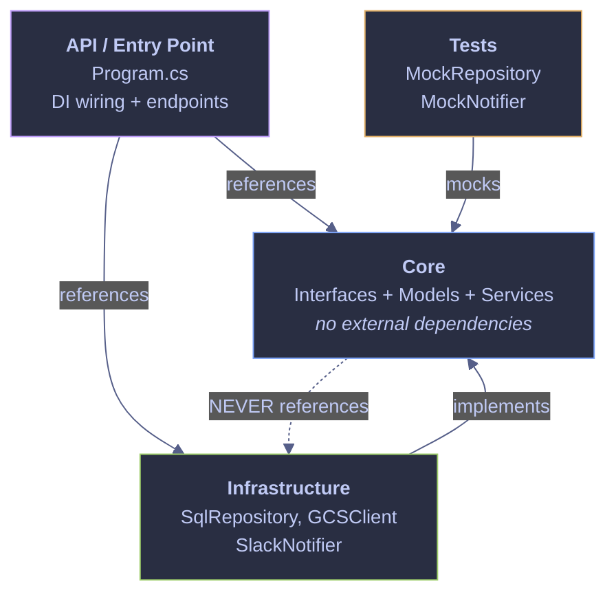
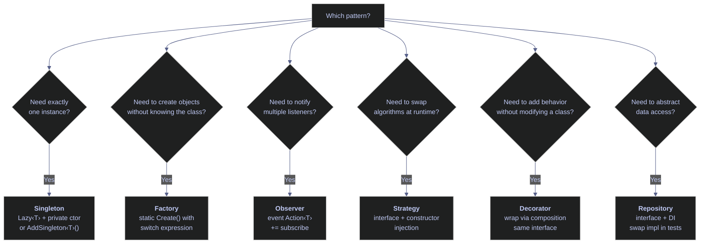

# 18. Design Patterns & Architecture - C#

> [!quote]
> "When I see patterns in my programs, I consider it a sign of trouble. The shape of a program should reflect only the problem it needs to solve."
>
> — **Paul Graham**, *Revenge of the Nerds*, essay (2002)


```csharp
// Suppress CS1701 assembly version warnings (NuGet packages on .NET 10).
using System.Reflection;
using Microsoft.DotNet.Interactive;
using Microsoft.DotNet.Interactive.CSharp;

using System.ComponentModel.DataAnnotations;
var csharpKernel = (CSharpKernel)Kernel.Root.FindKernelByName("csharp");
var optionsField = typeof(CSharpKernel).GetField("_scriptOptions",
    BindingFlags.NonPublic | BindingFlags.Instance);
var scriptOptions = optionsField.GetValue(csharpKernel);
var withWarningLevel = scriptOptions.GetType().GetMethod("WithWarningLevel");
var newOptions = withWarningLevel.Invoke(scriptOptions, new object[] { 0 });
optionsField.SetValue(csharpKernel, newOptions);
```

```text
WarningLevel set to 0.
```

## Dependency Injection

Dependency Injection (DI) is a design principle where a class receives its collaborators from the outside rather than creating them internally. The class declares *what* it needs (interfaces), and the caller decides *which* concrete implementation to provide. This decouples business logic from infrastructure — a pipeline service works identically whether it talks to SQL Server, BigQuery, or a mock.

In C#, constructor injection is the standard approach: dependencies are passed as constructor parameters typed to interfaces. .NET's built-in `IServiceCollection` container manages object lifetimes automatically — `AddTransient<T>()` creates a new instance per request, `AddScoped<T>()` creates one per HTTP request, and `AddSingleton<T>()` creates one for the entire application. Python equivalent: pass objects via `__init__` (no container needed — the language's dynamic nature makes a DI framework optional).

> [!warning] Anti-pattern — hardcoded dependencies
> A class that creates its own database connection or API client internally (`new SqlConnection("prod-host")`) cannot be tested in isolation. Changing the provider means changing the class itself.

> [!success] Inject dependencies via constructor
> Pass dependencies as constructor parameters typed to interfaces. Production code passes real implementations; tests pass mocks — zero changes to the service class in either case.

> [!tip] C# 12 primary constructors simplify injection
> Starting with C# 12 (.NET 8+), classes can declare constructor parameters directly on the class declaration — eliminating the boilerplate of private fields and explicit constructors:
> ```csharp
> public class PipelineService(IDataRepository repo, INotificationService notifier)
> {
>     public string Run(string ticker) => repo.GetPrices(ticker).Count.ToString();
> }
> ```
> The parameters are captured as fields automatically. This is syntactic sugar — the DI container and injection pattern remain identical.

### Interface contracts

Interfaces define what operations are available without specifying how they work. Every consumer programs against these rather than concrete classes.

#### IDataRepository — data access contract

Declares `GetPrices` and `SaveScores` — same signature whether the backend is SQL Server, BigQuery, or an in-memory mock.

```csharp
public interface IDataRepository
{
    List<Dictionary<string, object>> GetPrices(string ticker);
    int SaveScores(List<Dictionary<string, object>> scores);
}
```

#### INotificationService — notification contract

Single-method contract for pipeline notifications.

```csharp
public interface INotificationService
{
    void Notify(string message);
}
```

### Production implementations

Each concrete class implements one interface and handles the actual I/O — database queries, Slack API calls, etc.

#### SqlRepository — database-backed data access

Connects to SQL Server, implements both retrieval and persistence. Connection string is injected — the repository does not decide where to connect.

```csharp
public class SqlRepository : IDataRepository
{
    public SqlRepository(string connectionString)
    {
        Console.WriteLine($"  SqlRepository connected to: {connectionString[..Math.Min(30, connectionString.Length)]}...");
    }
    public List<Dictionary<string, object>> GetPrices(string ticker)
        => new() { new() { ["ticker"] = ticker, ["close"] = 178.50 } };
    public int SaveScores(List<Dictionary<string, object>> scores)
    {
        Console.WriteLine($"  SqlRepository: saved {scores.Count} scores");
        return scores.Count;
    }
}
```

#### SlackNotifier — Slack channel notifications

Sends formatted pipeline notifications to a Slack channel.

```csharp
public class SlackNotifier : INotificationService
{
    public void Notify(string message) => Console.WriteLine($"  Slack: {message}");
}
```

### Test doubles

Test doubles replace production dependencies with in-memory alternatives. No database, no network — tests run in milliseconds.

#### MockRepository — in-memory data access

Returns hardcoded prices, captures every saved score in a list. After the test, inspect `Saved` to verify correct tickers.

```csharp
public class MockRepository : IDataRepository
{
    public List<string> Saved { get; } = new();
    public List<Dictionary<string, object>> GetPrices(string ticker)
        => new() { new() { ["ticker"] = ticker, ["close"] = 100.0 } };
    public int SaveScores(List<Dictionary<string, object>> scores)
    {
        Saved.AddRange(scores.Select(s => s["ticker"].ToString()!));
        return scores.Count;
    }
}
```

#### MockNotifier — notification capture

Collects notification messages instead of sending them. Inspect `Messages` after the run.

```csharp
public class MockNotifier : INotificationService
{
    public List<string> Messages { get; } = new();
    public void Notify(string message) => Messages.Add(message);
}
```

### Pipeline service

The service class depends only on the two interfaces — it has no knowledge of SQL, Slack, or mocks.

#### PipelineService — constructor-injected orchestrator

Constructor receives both dependencies. `Run` fetches prices, computes a score, persists it, notifies.

```csharp
public class PipelineService
{
    private readonly IDataRepository _repo;
    private readonly INotificationService _notifier;

    public PipelineService(IDataRepository repo, INotificationService notifier)
    {
        _repo = repo;
        _notifier = notifier;
    }

    public string Run(string ticker)
    {
        var prices = _repo.GetPrices(ticker);
        var score = new Dictionary<string, object> { ["ticker"] = ticker, ["momentum"] = 0.85 };
        _repo.SaveScores(new() { score });
        _notifier.Notify($"Pipeline done: {ticker} scored 0.85");
        return $"{ticker}: momentum=0.85";
    }
}
```

### Wiring — production vs. test

The same `PipelineService` class is used in both contexts. Only the objects passed to its constructor change.

#### Production wiring

`SqlRepository` connects to the prod database, `SlackNotifier` sends to the team channel.

```csharp
var prodRepo = new SqlRepository("Server=prod-db;Database=stoxx");
var prodNotifier = new SlackNotifier();
var prodService = new PipelineService(prodRepo, prodNotifier);
var result = prodService.Run("ASML.AS");
result
```

```text
  SqlRepository connected to: Server=prod-db;Database=stoxx...
  SqlRepository: saved 1 scores
  Slack: Pipeline done: ASML.AS scored 0.85
ASML.AS: momentum=0.85
```

#### Test wiring — swap mocks with zero code changes

Replace every dependency with a mock. `PipelineService` constructor is identical. After the run, inspect the mock's captured state.

```csharp
var mockRepo = new MockRepository();
var mockNotifier = new MockNotifier();
var testService = new PipelineService(mockRepo, mockNotifier);
result = testService.Run("TEST.XX");
result
string.Join(", ", mockRepo.Saved)
string.Join(", ", mockNotifier.Messages)
```

```text
TEST.XX: momentum=0.85
TEST.XX
Pipeline done: TEST.XX scored 0.85
```

## Design Patterns

Design patterns are reusable solutions to common software design problems. In data engineering, they structure pipelines for testability, extensibility, and separation of concerns. The patterns below — singleton, factory, observer, strategy, decorator, and repository — appear frequently in production index-calculation and ETL codebases.

### Singleton — ensure exactly one instance of a class

The Singleton pattern ensures a class has exactly one instance throughout the application's lifetime and provides a global access point to it. In data engineering, singletons are common for database connection pools, configuration managers, and logging services — resources that are expensive to create and should be shared. `Lazy<T>` with a private constructor is the simplest thread-safe implementation — the runtime guarantees the delegate runs exactly once, even under concurrent access.

> [!warning] Singleton and testing
> Singletons make unit testing difficult because they carry global state between tests. Test A modifies the singleton's state, and Test B sees the modified state. Prefer dependency injection with a singleton LIFETIME (registered once in the DI container) over the classic Singleton pattern — it gives you the same single-instance behavior but with testability.

> [!success] Testable singleton via DI
> Register the dependency as `AddSingleton<T>()` in `IServiceCollection`. The DI container manages the single instance — tests can inject a mock or a fresh instance per test suite, eliminating shared state between test runs.

#### AppConfig — singleton with Lazy\<T>

A private constructor prevents external instantiation. `Lazy<T>` wraps the creation delegate — the runtime guarantees it runs exactly once, even under concurrent access. The static `Instance` property exposes the single instance.

```csharp
public class AppConfig
{
    private static readonly Lazy<AppConfig> _instance = new(() => new AppConfig());
    public static AppConfig Instance => _instance.Value;

    public string ProjectId { get; } = "index-lab-2";
    public string Region { get; } = "europe-west1";
    public int BatchSize { get; } = 5000;

    private AppConfig() { Console.WriteLine("  Config loaded (once)"); }
}
```

#### Verifying single-instance behavior

Both calls to `Instance` return the same reference — the constructor runs only once. `ReferenceEquals` confirms both variables point to the exact same object in memory.

```csharp
var c1 = AppConfig.Instance;
var c2 = AppConfig.Instance;
object.ReferenceEquals(c1, c2)
c1.ProjectId
```

```text
Config loaded (once)
c1 == c2: True
index-lab-2
```

### Factory — create objects without specifying the exact class

The Factory pattern encapsulates object creation behind a static method or class, so the caller specifies *what* it needs (e.g., `"gcs"`) without knowing *which* concrete class gets instantiated. This decouples the consumer from the implementation — adding a new storage backend means adding one new class and one new case in the factory, with zero changes to calling code. In C#, a `switch` expression in a static method is the most concise form.

#### IStorageClient and concrete backends

The common interface declares a single `Upload` method. Three implementations — GCS, S3, and local filesystem — each format the upload result differently. Adding a new backend means adding one class.

```csharp
public interface IStorageClient
{
    string Upload(string path, byte[] data);
}

public class GCSClient : IStorageClient
{
    public string Upload(string path, byte[] data) => $"gs://bucket/{path} ({data.Length} bytes)";
}
public class S3Client : IStorageClient
{
    public string Upload(string path, byte[] data) => $"s3://bucket/{path} ({data.Length} bytes)";
}
public class LocalClient : IStorageClient
{
    public string Upload(string path, byte[] data) => $"file://{path} ({data.Length} bytes)";
}
```

#### StorageFactory — creation logic

The static factory method maps a provider string to a concrete class using a switch expression. The caller never references `GCSClient` or `S3Client` directly.

```csharp
public static class StorageFactory
{
    public static IStorageClient Create(string provider) => provider switch
    {
        "gcs" => new GCSClient(),
        "s3" => new S3Client(),
        "local" => new LocalClient(),
        _ => throw new ArgumentException($"Unknown: {provider}")
    };
}
```

#### Provider-agnostic usage

The loop creates three different clients through the factory. Each call to `Upload` returns a provider-specific path — the consuming code is identical regardless of backend.

```csharp
foreach (var provider in new[] { "gcs", "s3", "local" })
{
    var client = StorageFactory.Create(provider);
    $"{provider,-5} -> {client.Upload("data.csv", new byte[100])}"
}
```

```text
gcs   -> gs://bucket/data.csv (100 bytes)
s3    -> s3://bucket/data.csv (100 bytes)
local -> file://data.csv (100 bytes)
```

### Observer — one-to-many event notification

The Observer pattern establishes a one-to-many relationship: when one object (the subject) changes state, all its dependents (observers) are notified automatically. In C#, this is built into the language with events and delegates — the subject exposes an `event`, and observers subscribe with `+=`. Common in data pipelines: a price feed publishes updates, and multiple consumers (dashboard, alerting system, persistence layer) each react independently.

#### StepEvent and EventBus

`StepEvent` is an immutable record carrying step name, status, row count, and message. `EventBus` holds a list of subscribers per event type — `Publish` iterates the list and invokes each callback.

```csharp
public record StepEvent(string Step, string Status, int Rows, string Message);

public class EventBus
{
    public event Action<StepEvent>? StepCompleted;
    public void Publish(StepEvent data) => StepCompleted?.Invoke(data);
}
```

#### Subscribe handlers and publish events

Three handlers subscribe to `StepCompleted` — a logger, a metric emitter, and an alerter. Publishing an event invokes all three. The `ohlcv_load` event triggers LOG + METRIC; the `gold_score` error triggers LOG + ALERT.

```csharp
var bus = new EventBus();
bus.StepCompleted += data => Console.WriteLine($"  [LOG]    {data.Step}: {data.Status}");
bus.StepCompleted += data => { if (data.Rows > 0) Console.WriteLine($"  [METRIC] rows={data.Rows}"); };
bus.StepCompleted += data => { if (data.Status == "error") Console.WriteLine($"  [ALERT]  {data.Message}"); };

bus.Publish(new StepEvent("ohlcv_load", "ok", 306, ""));
bus.Publish(new StepEvent("gold_score", "error", 0, "BQ timeout"));
```

```text
[LOG]    ohlcv_load: ok
[METRIC] rows=306
[LOG]    gold_score: error
[ALERT]  BQ timeout
```

### Strategy — swap algorithms at runtime

The Strategy pattern encapsulates interchangeable algorithms behind a common interface, letting you swap behavior at runtime without modifying the code that uses it. Instead of an `if/else` chain selecting a scoring method, you inject the scoring function as a parameter. Each strategy (z-score normalization, percentile ranking, equal weighting) implements the same interface. The caller picks which strategy to use; the pipeline doesn't care which one it got.

#### IScoringStrategy — algorithm contract

Declares `Name` and `Score` — every strategy implements these two members.

```csharp
public interface IScoringStrategy
{
    string Name { get; }
    double Score(double[] prices);
}
```

#### MomentumStrategy

Scores based on the most recent price relative to the mean — positive means latest price is above average, suggesting upward momentum.

```csharp
public class MomentumStrategy : IScoringStrategy
{
    public string Name => "Momentum";
    public double Score(double[] prices)
    {
        if (prices.Length == 0) return 0;
        var avg = prices.Average();
        return (prices[^1] - avg) / avg;
    }
}
```

#### VolatilityStrategy

Scores using coefficient of variation (std dev / mean), negated so lower volatility scores higher — penalizes erratic price swings.

```csharp
public class VolatilityStrategy : IScoringStrategy
{
    public string Name => "Volatility";
    public double Score(double[] prices)
    {
        if (prices.Length < 2) return 0;
        var avg = prices.Average();
        var variance = prices.Select(p => Math.Pow(p - avg, 2)).Average();
        return -(Math.Sqrt(variance) / avg);
    }
}
```

#### StockScorer — strategy consumer

The context class receives any `IScoringStrategy` via constructor. `Evaluate` delegates to the injected strategy — the scorer does not know or care which algorithm it uses.

```csharp
public class StockScorer
{
    private readonly IScoringStrategy _strategy;
    public StockScorer(IScoringStrategy strategy) => _strategy = strategy;
    public double Evaluate(string ticker, double[] prices) => _strategy.Score(prices);
}
```

#### Evaluating with different strategies

The same ASML.AS price series is scored with both strategies. Momentum shows a slight negative score (latest below mean), and Volatility returns a small negative penalty.

```csharp
var prices = new double[] { 685, 690, 680, 695, 710, 700, 685 };
string.Join(", ", prices)

foreach (IScoringStrategy strategy in new IScoringStrategy[] { new MomentumStrategy(), new VolatilityStrategy() })
{
    var scorer = new StockScorer(strategy);
    var score = scorer.Evaluate("ASML.AS", prices);
    $"{strategy.Name,-15} score={score:+0.0000;-0.0000}"
}
```

```text
[685, 690, 680, 695, 710, 700, 685]
Momentum        score=-0.0103
Volatility      score=-0.0138
```

### Decorator — wrap an object with additional behavior

The Decorator pattern wraps an existing object with additional behavior while preserving the same interface — the caller doesn't know whether it's talking to the original object or a decorated one. In C#, the .NET standard library uses this pattern extensively: `BufferedStream` wraps any `Stream` to add buffering, `LoggingHandler` wraps `HttpMessageHandler` to add request logging. In data pipelines, a `RetryRepository` can wrap any `IDataRepository` to add retry logic without modifying the original implementation. Not to be confused with C# attributes (`[Attribute]`), which are metadata annotations — the decorator *pattern* is about composing behavior at runtime through wrapping.

### Repository — abstract data access behind a clean interface

The Repository pattern abstracts data access behind a clean interface so that pipeline code depends on the abstraction, not the storage technology. `repo.GetPrices("ASML.AS")` works identically whether the data comes from SQL Server, BigQuery, a CSV file, or a mock. Combined with dependency injection (demonstrated in the DI section above), this is the foundation for testable data pipelines — swap `SqlRepository` for `MockRepository` in tests without changing any pipeline logic.

## Data Validation

Attribute-based validation built into .NET: decorate properties with `[Required]`, `[Range]`, `[StringLength]`, or `[RegularExpression]`, then call `Validator.TryValidateObject()` to validate and collect all errors at once. In ASP.NET, model binding auto-validates incoming requests — no explicit call needed. For complex cross-field rules (e.g., "high must be ≥ low"), implement `IValidatableObject.Validate()` on the model class, or use the FluentValidation library for rule-builder syntax.

### Attribute-based validation with DataAnnotations

.NET's DataAnnotations library decorates model properties with constraint attributes. At validation time, `Validator.TryValidateObject()` checks every attribute and collects all violations in a single pass.

#### OhlcvRecord — validated price model

Each property carries an attribute — `[Required]`, `[Range]`, `[StringLength]`. `IValidatableObject.Validate()` adds the High >= Low cross-field check.

```csharp
public class OhlcvRecord : IValidatableObject
{
    [Required(ErrorMessage = "Symbol is required")]
    [StringLength(20, MinimumLength = 1)]
    public string Symbol { get; set; } = "";

    [Required]
    public DateTime Date { get; set; }

    [Range(0.001, double.MaxValue, ErrorMessage = "Price must be positive")]
    public double Open { get; set; }

    [Range(0.001, double.MaxValue)]
    public double High { get; set; }

    [Range(0.001, double.MaxValue)]
    public double Low { get; set; }

    [Range(0.001, double.MaxValue)]
    public double Close { get; set; }

    [Range(0, long.MaxValue, ErrorMessage = "Volume cannot be negative")]
    public long Volume { get; set; }

    public IEnumerable<ValidationResult> Validate(ValidationContext ctx)
    {
        if (High < Low)
            yield return new ValidationResult($"High ({High}) must be >= Low ({Low})", new[] { "High" });
    }
}
```

#### Validate helper

Creates a `ValidationContext`, runs `TryValidateObject` with `validateAllProperties: true`, returns bool and error list.

```csharp
static (bool, List<ValidationResult>) Validate(object obj)
{
    var results = new List<ValidationResult>();
    var ctx = new ValidationContext(obj);
    var ok = Validator.TryValidateObject(obj, ctx, results, validateAllProperties: true);
    return (ok, results);
}
```

#### Valid record — passes all constraints

Well-formed OHLCV record. `TryValidateObject` returns `true`.

```csharp
var validRecord = new OhlcvRecord
{
    Symbol = "ASML.AS", Date = new DateTime(2026, 3, 20),
    Open = 685.0, High = 710.0, Low = 680.0, Close = 700.0, Volume = 1_500_000
};
var (isValid, errors) = Validate(validRecord);
isValid
```

```text
True
```

#### Invalid records — caught at the boundary

Each record triggers a different rule: negative price fails `[Range]`, High < Low fails `IValidatableObject`, empty symbol fails `[StringLength]`, negative volume fails `[Range]`.

```csharp
var badRecords = new OhlcvRecord[]
{
    new() { Symbol = "", Date = DateTime.Now, Open = -5, High = 10, Low = 8, Close = 9, Volume = 100 },
    new() { Symbol = "X", Date = DateTime.Now, Open = 10, High = 5, Low = 8, Close = 9, Volume = -1 },
};

foreach (var r in badRecords)
{
    var (ok, errs) = Validate(r);
    $"Symbol=\"{r.Symbol}\" Open={r.Open} High={r.High} Vol={r.Volume}"
    foreach (var e in errs)
        e.ErrorMessage
}
```

```text
Symbol="" Open=-5 High=10 Vol=100
  -> Symbol is required
  -> Price must be positive
Symbol="X" Open=10 High=5 Vol=-1
  -> Volume cannot be negative
```

## Reflection

Reflection lets you examine a type's properties, methods, and constructors at runtime — and invoke them dynamically without compile-time knowledge of the type. This is the foundation of ORMs (mapping database columns to class properties), serializers (JSON/XML), DI containers (auto-resolving constructor parameters), and test frameworks (discovering test methods). The tradeoff is performance: reflection calls are 10-100× slower than direct calls, so avoid them in hot loops.

> [!warning] Reflection performance
> `GetProperty().GetValue()` uses late binding on every call. If you need to read properties in a tight loop (e.g., mapping 100K database rows), cache the `PropertyInfo` objects or use compiled expressions / source generators instead. A single reflection call is fine; a million is not.

> [!success] Cache PropertyInfo for hot paths
> Retrieve `PropertyInfo` objects once at startup and store them in a static dictionary. For maximum throughput, compile them into typed delegates with `Expression.Lambda<Func<T, object>>()` — this brings reflection-based access down to near-direct-call performance.

### Inspecting types at runtime

Reflection operates on a target object. The `TradeOrder` class below serves as the inspection target for every example in this section.

#### TradeOrder — inspection target

Simple trade model with four constructor params, a computed `Notional` property, and a custom `ToString`.

```csharp
public class TradeOrder
{
    public string Ticker { get; }
    public string Side { get; }
    public int Quantity { get; }
    public double Price { get; }
    public double Notional => Quantity * Price;

    public TradeOrder(string ticker, string side, int quantity, double price)
    {
        Ticker = ticker; Side = side; Quantity = quantity; Price = price;
    }

    public override string ToString() => $"TradeOrder({Ticker}, {Side}, {Quantity}, {Price})";
}
```

#### Type metadata — inspect a type's identity and characteristics

Every .NET object carries a `Type` reference accessible via `GetType()`. The `Type` object exposes the type's name, namespace-qualified full name, and classification flags (`IsClass`, `IsSealed`, `IsValueType`). Use this as the entry point for all further reflection — once you have the `Type`, you can enumerate properties, methods, and constructors.

```csharp
var order = new TradeOrder("ASML.AS", "BUY", 100, 685.40);
var type = order.GetType();

type.Name
type.FullName
type.IsClass
type.IsSealed
```

```text
TradeOrder
Submission#9+TradeOrder
True
False
```

#### Property enumeration — list all public properties and their values

`GetProperties()` returns a `PropertyInfo[]` for every public property on the type. Each `PropertyInfo` exposes the property's name, CLR type (`PropertyType`), and can read the current value from an instance via `GetValue()`. This is how ORMs map database columns to class members — iterate properties, match by name, and assign values.

```csharp
foreach (var prop in type.GetProperties())
{
    var value = prop.GetValue(order);
    $"{prop.Name,-12} {prop.PropertyType.Name,-10} = {value}"
}
```

```text
Ticker       String     = ASML.AS
Side         String     = BUY
Quantity     Int32      = 100
Price        Double     = 685.4
Notional     Double     = 68540
```

#### Method discovery — enumerate declared methods

`GetMethods()` returns `MethodInfo[]` for the type's methods. Without binding flags, it includes inherited members from `object` (`Equals`, `GetHashCode`). Adding `BindingFlags.DeclaredOnly` restricts the result to methods defined directly on the type — useful when you need to discover domain-specific behavior without noise from the base class. Test frameworks use this to find `[Test]`-attributed methods automatically.

```csharp
foreach (var method in type.GetMethods(BindingFlags.Public | BindingFlags.Instance | BindingFlags.DeclaredOnly))
{
    var parms = string.Join(", ", method.GetParameters().Select(p => $"{p.ParameterType.Name} {p.Name}"));
    $"{method.ReturnType.Name} {method.Name}({parms})"
}
```

```text
String get_Ticker()
String get_Side()
Int32 get_Quantity()
Double get_Price()
Double get_Notional()
String ToString()
```

#### Dynamic property access by name — read properties without compile-time knowledge

`GetProperty(name)` retrieves a single `PropertyInfo` by its string name — the C# equivalent of Python's `getattr()`. This is the core mechanism behind JSON serializers (System.Text.Json, Newtonsoft) and ORMs (Entity Framework, Dapper): given a column name from a database row or a JSON key, look up the matching property and set its value. Returns `null` if the name doesn't match, so always check before calling `GetValue()`.

```csharp
foreach (var name in new[] { "Ticker", "Side", "Quantity", "Price" })
{
    var prop = type.GetProperty(name);
    if (prop != null)
        $"{name} = {prop.GetValue(order)}"
}
```

```text
Ticker = ASML.AS
Side = BUY
Quantity = 100
Price = 685.4
```

#### Constructor inspection — discover constructor parameters

`GetConstructors()` returns `ConstructorInfo[]` for all public constructors. Each `ConstructorInfo` exposes its parameters (name, type, position) via `GetParameters()`. DI containers use this to auto-resolve dependencies: read the constructor, look up each parameter type in the service registry, and create the object with all dependencies injected — no manual wiring needed.

```csharp
foreach (var ctor in type.GetConstructors())
{
    foreach (var p in ctor.GetParameters())
        $"{p.Name}: {p.ParameterType.Name}"
}
```

```text
ticker: String
side: String
quantity: Int32
price: Double
```

#### Dynamic instantiation — create objects without compile-time type knowledge

`Activator.CreateInstance(type, args)` constructs an object at runtime by finding a constructor whose parameter types match the provided arguments. This is how ORMs hydrate entity objects from database rows — the ORM knows the `Type` and the column values, but not the concrete class at compile time. Also used by plugin systems that load assemblies dynamically and instantiate classes by name.

```csharp
var newOrder = Activator.CreateInstance(type, "MC.PA", "SELL", 50, 890.20);
newOrder
```

```text
TradeOrder(MC.PA, SELL, 50, 890.2)
```

## Project Structure & Best Practices

A well-organized C# solution separates domain logic from infrastructure, wires dependencies at the entry point, and mirrors the folder structure in test projects. The layout below follows the Clean Architecture pattern used in production index-calculation pipelines.



### Recommended project layout

```text
IndexPipeline/
├── IndexPipeline.sln                # Solution file
│
├── src/
│   ├── IndexPipeline.Core/          # Domain layer (no dependencies)
│   │   ├── Interfaces/              # IDataRepository, INotificationService
│   │   ├── Models/                  # OhlcvRecord, PipelineConfig
│   │   └── Services/                # PipelineService (depends on interfaces only)
│   │
│   ├── IndexPipeline.Infra/         # Infrastructure (implements interfaces)
│   │   ├── Repositories/            # SqlRepository, BigQueryRepository
│   │   ├── Storage/                 # GCSClient, LocalClient
│   │   └── Notifications/           # SlackNotifier, PubSubNotifier
│   │
│   └── IndexPipeline.Api/           # Entry point (ASP.NET Minimal API)
│       ├── Program.cs               # DI wiring, app.MapGet/Post
│       └── appsettings.json         # Configuration
│
├── tests/
│   ├── IndexPipeline.Core.Tests/    # Unit tests (mock infra)
│   └── IndexPipeline.Infra.Tests/   # Integration tests
│
└── docker/
    └── Dockerfile                   # Multi-stage build
```

### Key principles

**Dependency inversion** — Core defines interfaces. Infra implements them. Core NEVER references Infra. The API project wires them together via DI in `Program.cs`.

**Constructor injection** — `builder.Services.AddScoped<IDataRepository, SqlRepository>()` registers the mapping. The .NET DI container auto-resolves the full dependency graph at runtime.

**Validate at boundaries** — DataAnnotations on DTOs catch invalid input on entry. FluentValidation handles complex cross-field rules. Internal code trusts the validated models — no redundant checks downstream.

**Configuration** — `appsettings.json` + environment variables via `IConfiguration`. Bind sections to strongly-typed options with `builder.Services.Configure<PipelineOptions>(config)`.

**Test the logic, mock the boundary** — Unit-test `PipelineService` with `MockRepository` (no database needed). Integration-test `SqlRepository` against a real database to catch query/schema drift.

## Summary



> [!abstract]- C# Design Patterns Quick Reference
>
> | Pattern | C# | Usage |
> |---|---|---|
> | **Dependency Injection** | `interface IRepo` + `class SqlRepo : IRepo` | Constructor injection, `AddScoped<IRepo, SqlRepo>()` |
> | **Singleton** | `static readonly Lazy<T>` | Thread-safe; or `AddSingleton<T>()` via DI |
> | **Factory** | `static IClient Create(string type)` | `type switch { "gcs" => new GCS(), ... }` |
> | **Observer** | `event Action<T> EventName` | `+=` subscribe, `?.Invoke(data)` publish |
> | **Strategy** | `interface IStrategy` | Inject algorithm via constructor |
> | **Decorator** | `class Wrapper : IService` | Wraps inner instance, adds behavior |
> | **Repository** | `interface IRepo` + `class SqlRepo : IRepo` | Abstract data access, swap in tests |
> | **Validation** | `[Required]`, `[Range]`, `[StringLength]` | DataAnnotations + `IValidatableObject` for cross-field |
> | **Reflection** | `obj.GetType()`, `type.GetProperties()` | `prop.GetValue(obj)`, `Activator.CreateInstance()` |
>
> **Python equivalents:** `interface` → `ABC`+`abstractmethod` | constructor injection → `__init__(dep)` | `AddSingleton<T>()` → module-level instance | `event Action<T>` → callback list | DataAnnotations → Pydantic `Field()` | `System.Reflection` → `type()`, `dir()`, `inspect`
