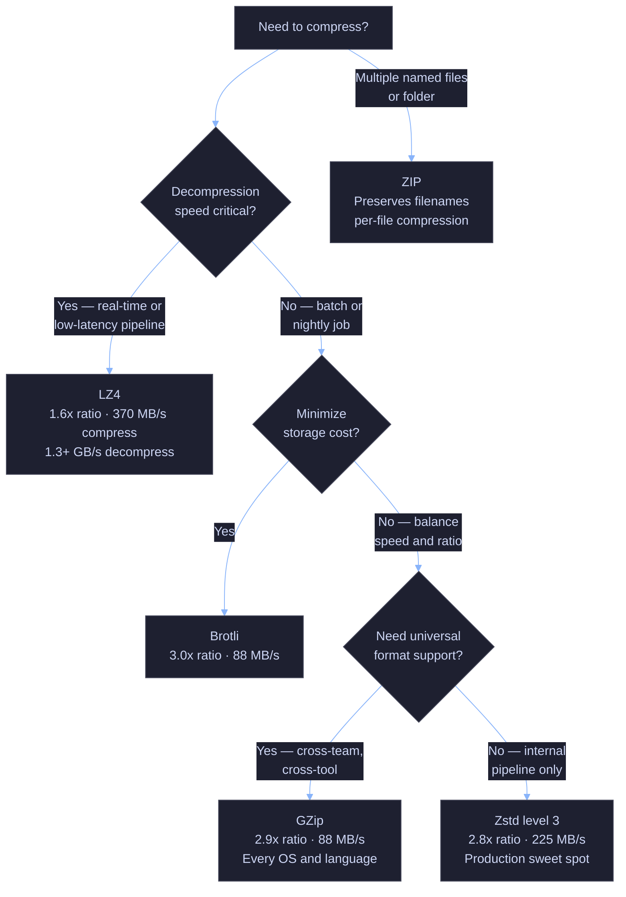

# 22. Data Transfer — GCS, SQL Server, BigQuery

> [!quote]
> "Make it work, make it right, make it fast — in that order. But when moving data at scale, make it parallel."
>
> — **Kent Beck**

## Setup

Installs NuGet packages, loads environment variables, and defines shared helper functions used across all benchmark sections in this notebook.

Suppresses CS1701/CS1702 assembly version warnings in .NET Interactive — NuGet packages targeting .NET 8/9 trigger these on .NET 10, but they are harmless. Run this cell once before any cell that uses NuGet packages.

```csharp
using System.Reflection;
using Microsoft.DotNet.Interactive;
using Microsoft.DotNet.Interactive.CSharp;

var csharpKernel = (CSharpKernel)Kernel.Root.FindKernelByName("csharp");
var optionsField = typeof(CSharpKernel).GetField("_scriptOptions",
    BindingFlags.NonPublic | BindingFlags.Instance);

var scriptOptions = optionsField.GetValue(csharpKernel);
var withWarningLevel = scriptOptions.GetType().GetMethod("WithWarningLevel");
var newOptions = withWarningLevel.Invoke(scriptOptions, new object[] { 0 });
optionsField.SetValue(csharpKernel, newOptions);
```

```csharp
#r "nuget: Google.Cloud.Storage.V1"
#r "nuget: Google.Apis.Auth"
#r "nuget: DotNetEnv"
#r "nuget: Parquet.Net, 5.5.0"
#r "nuget: Newtonsoft.Json"
#r "nuget: SSH.NET, 2024.2.0"
#r "nuget: ZstdSharp.Port"
#r "nuget: K4os.Compression.LZ4.Streams"
#r "nuget: Plotly.NET, 5.1.0"
#r "nuget: Plotly.NET.Interactive, 5.0.0"
#r "nuget: Plotly.NET.CSharp, 0.13.0"

using System;
using System.Collections.Generic;
using System.Diagnostics;
using System.IO;
using System.IO.Compression;
using System.Linq;
using System.Net.Http;
using System.Net.Http.Headers;
using System.Text;
using System.Threading;
using System.Threading.Tasks;
using DotNetEnv;
using Google.Apis.Auth.OAuth2;
using Google.Cloud.Storage.V1;
using Newtonsoft.Json;
using Parquet;
using Parquet.Data;
using Parquet.Schema;
using Plotly.NET;
using Plotly.NET.CSharp;
using Plotly.NET.LayoutObjects;
using Renci.SshNet;
using ZstdSharp;
using K4os.Compression.LZ4.Streams;
```

Loads the `.env` file and defines project constants — GCP project ID, bucket name, VM IP, SQL IP, and the service account key path. Also creates the shared `StorageClient`.

```csharp
DotNetEnv.Env.Load();

var PROJECT_ID   = "seclab-dev-ap-26";
var REGION       = "europe-west1";
var BUCKET_NAME  = $"{PROJECT_ID}-data";
var BQ_DATASET   = "index_data";
var VM_IP        = Environment.GetEnvironmentVariable("GCP_VM_IP") ?? "";
var SQL_IP       = Environment.GetEnvironmentVariable("GCP_SQL_IP") ?? "";
var SQL_PASSWORD = Environment.GetEnvironmentVariable("GCP_SQL_PASSWORD") ?? "";
var SA_KEY_PATH  = Environment.GetEnvironmentVariable("GCP_SA_KEY_PATH") ?? "./gcp-sa-key.json";
var DATA_DIR     = @"C:\Users\aperi\DEV\LANG\data";

Environment.SetEnvironmentVariable("GOOGLE_APPLICATION_CREDENTIALS", SA_KEY_PATH);

var storageClient = StorageClient.Create();

Console.WriteLine($"  Project: {PROJECT_ID}");
Console.WriteLine($"  SQL IP:  {SQL_IP}");
Console.WriteLine($"  VM IP:   {VM_IP}");
Console.WriteLine($"  Bucket:  {BUCKET_NAME}");
```

```text
  Project: seclab-dev-ap-26
  SQL IP:  34.22.129.89
  VM IP:   34.38.193.79
  Bucket:  seclab-dev-ap-26-data
```

#### Formatting helpers

Utility functions for human-readable byte and duration formatting — shared across all benchmark output in this notebook.

```csharp
string FmtBytes(long b)
{
    if (b <= 0) return "-";
    if (b < 1024) return $"{b} B";
    if (b < 1024 * 1024) return $"{b / 1024.0:F1} KB";
    if (b < 1024L * 1024 * 1024) return $"{b / (1024.0 * 1024):F1} MB";
    return $"{b / (1024.0 * 1024 * 1024):F2} GB";
}

string FmtTime(double ms)
{
    if (ms < 1000) return $"{ms:F0}ms";
    if (ms < 60_000) return $"{ms / 1000:F1}s";
    return $"{ms / 60_000:F1}min";
}
```

#### Define shared benchmark result record

`UploadResult` holds raw and formatted metrics for a single benchmark run. The `method` + `tier` pair is the composite key used for upsert logic — re-running a method replaces its prior result. Fields `wire_bytes`, `ratio`, and `throughput` reflect the payload on the wire (post-compression, if applicable).

```csharp
class UploadResult
{
    public string method     { get; set; } = "";
    public string tier       { get; set; } = "";
    public long   size_bytes { get; set; }
    public long   wire_bytes { get; set; }
    public string size       { get; set; } = "";
    public string wire_size  { get; set; } = "";
    public string ratio      { get; set; } = "-";
    public double elapsed_ms { get; set; }
    public string elapsed    { get; set; } = "";
    public string throughput { get; set; } = "";
}
```

#### Define file sets for upload benchmarks

Three test files at increasing sizes (10 MB → 200 MB → 1 GB) expose how each method scales from latency-dominated small transfers to bandwidth-dominated large ones. File paths resolve relative to `DATA_DIR`.

```csharp
var uploadFiles = new Dictionary<string, string>
{
    ["small"]  = Path.Combine(DATA_DIR, "small_upload.csv"),   // ~10 MB
    ["medium"] = Path.Combine(DATA_DIR, "medium_upload.csv"),  // ~200 MB
    ["large"]  = Path.Combine(DATA_DIR, "large_upload.csv"),   // ~1 GB
};

Console.WriteLine("  Upload:");
foreach (var (tier, path) in uploadFiles)
{
    var size = new FileInfo(path).Length;
    Console.WriteLine($"    {tier,-8} {Path.GetFileName(path),-30} {FmtBytes(size)}");
}
```

```text
  Upload:
    small    small_upload.csv               9.7 MB
    medium   medium_upload.csv              193.1 MB
    large    large_upload.csv               1.19 GB
```

## Upload Files from Local to GCS

Each method uploads the same three CSV files (10 MB, 200 MB, 1 GB) to GCS over HTTPS, measuring elapsed time, wire bytes, and throughput. Results are persisted to JSON so re-runs update in place rather than duplicate.

### GCS upload | benchmark harness

#### Benchmark helper — persist and upsert results

Defines the benchmark runner that times each upload, computes throughput, and upserts results into a JSON file keyed by `(method, tier)`. All upload H4s below call `BenchUpload` with a method-specific upload function.

```csharp
var GCS_PREFIX   = "benchmarks/uploads";
var RESULTS_FILE = Path.Combine(DATA_DIR, "upload_results_cs.json");

List<UploadResult> LoadResults()
{
    if (File.Exists(RESULTS_FILE))
        return JsonConvert.DeserializeObject<List<UploadResult>>(File.ReadAllText(RESULTS_FILE))
               ?? new List<UploadResult>();
    return new List<UploadResult>();
}

void SaveResults(List<UploadResult> results)
    => File.WriteAllText(RESULTS_FILE, JsonConvert.SerializeObject(results, Formatting.Indented));

UploadResult BenchUpload(string methodName, Func<string, string, long?> uploadFn, string filePath)
{
    var fi = new FileInfo(filePath);
    var origSize = fi.Length;
    var dest = $"{GCS_PREFIX}/{methodName}/{fi.Name}";
    var tier = uploadFiles.First(kv => kv.Value == filePath).Key;

    var sw = Stopwatch.StartNew();
    var actualSize = uploadFn(filePath, dest);
    sw.Stop();

    var elapsedMs = sw.Elapsed.TotalMilliseconds;
    var wireBytes = actualSize ?? origSize;
    var throughput = elapsedMs > 0 ? wireBytes / (elapsedMs / 1000.0) : 0;

    var record = new UploadResult
    {
        method     = methodName,
        tier       = tier,
        size_bytes = origSize,
        wire_bytes = wireBytes,
        size       = FmtBytes(origSize),
        wire_size  = FmtBytes(wireBytes),
        ratio      = actualSize.HasValue ? $"{(double)origSize / wireBytes:F1}x" : "-",
        elapsed_ms = Math.Round(elapsedMs, 1),
        elapsed    = FmtTime(elapsedMs),
        throughput = FmtBytes((long)throughput) + "/s",
    };

    var all = LoadResults();
    all.RemoveAll(r => r.method == record.method && r.tier == record.tier);
    all.Add(record);
    SaveResults(all);

    uploadResults.RemoveAll(r => r.method == record.method && r.tier == record.tier);
    uploadResults.Add(record);
    return record;
}

var uploadResults = LoadResults();
Console.WriteLine($"  Loaded {uploadResults.Count} existing results from {Path.GetFileName(RESULTS_FILE)}");
```

      Loaded 24 existing results from upload_results_cs.json

> [!warning] Parallel composite uploads can leave orphaned chunk objects
> GCS single-stream uploads are effectively atomic — an object only becomes visible after the final PUT succeeds. However, parallel composite uploads that fail mid-way leave named chunk objects behind (e.g., `file.csv__chunk_0001`). These count against storage quota and are never cleaned up automatically. Always wrap compose operations in a try/finally block that deletes all chunk names on failure.

> [!success] Stage-then-rename for safe atomic publishing
> Upload to a staging prefix first (e.g., `staging/YYYY-MM-DD/file.csv`), then use `CopyObject` + `DeleteObject` to move it to the production path. `CopyObject` is server-side and near-instantaneous — downstream consumers never observe a partial file at the canonical path.

> [!tip] Resumable uploads auto-retry failed chunks
> `StorageClient.UploadObject` with `UploadObjectOptions(ChunkSize)` automatically retries each failed chunk with exponential backoff. For large files on unreliable connections, prefer `resumable_chunked` over `simple_upload` — retry granularity is one chunk, not the whole file.

### GCS upload | transfer methods

Six methods are benchmarked: simple sequential upload, resumable chunked, parallel composite, buffered stream, gzip-compressed, and Parquet-converted. Each method trades off simplicity, fault tolerance, and wire efficiency differently.

#### StorageClient.UploadObject | simple sequential upload

The most straightforward approach. Opens a `FileStream` and uploads via the client library, which automatically switches to a resumable upload for files over 5 MB. No tuning required. The benchmark calls `SimpleUpload` for each tier and prints elapsed time and throughput — proving that the baseline single-stream method achieves ~6 MB/s on this connection.

```csharp
long? SimpleUpload(string filePath, string destBlobName)
{
    using var fs = File.OpenRead(filePath);
    storageClient.UploadObject(BUCKET_NAME, destBlobName, "text/csv", fs);
    return null;
}

Console.WriteLine($"  {"tier",-8} {"size",10} {"time",10} {"throughput",14}");
foreach (var (tier, path) in uploadFiles)
{
    var r = BenchUpload("simple_upload", SimpleUpload, path);
    Console.WriteLine($"  {tier,-8} {r.size,10} {r.elapsed,10} {r.throughput,14}");
}
```

      tier           size       time     throughput
      small        9.7 MB       1.8s       5.4 MB/s
      medium     193.1 MB      29.2s       6.6 MB/s
      large       1.19 GB     3.1min       6.6 MB/s

#### UploadObjectOptions(ChunkSize) | resumable chunked upload

Explicitly configures the resumable upload chunk size to 10 MB. Each chunk is sent in a separate HTTP request, enabling recovery from mid-upload failures. If a chunk fails, only that chunk is retried rather than the whole file. The benchmark shows that explicit chunking performs identically to the simple method on stable connections — the value is fault tolerance, not speed.

```csharp
const int CHUNK_SIZE = 10 * 1024 * 1024;

long? ResumableUpload(string filePath, string destBlobName)
{
    using var fs = File.OpenRead(filePath);
    var options = new UploadObjectOptions { ChunkSize = CHUNK_SIZE };
    storageClient.UploadObject(BUCKET_NAME, destBlobName, "text/csv", fs, options);
    return null;
}

Console.WriteLine($"  {"tier",-8} {"size",10} {"time",10} {"throughput",14}");
foreach (var (tier, path) in uploadFiles)
{
    var r = BenchUpload("resumable_chunked", ResumableUpload, path);
    Console.WriteLine($"  {tier,-8} {r.size,10} {r.elapsed,10} {r.throughput,14}");
}
```

      tier           size       time     throughput
      small        9.7 MB       1.6s       6.0 MB/s
      medium     193.1 MB      29.2s       6.6 MB/s
      large       1.19 GB     3.1min       6.6 MB/s

#### Parallel chunk + ComposeObject | parallel composite upload

Splits the file into 32 MB chunks and uploads them in parallel (8 workers) via `Task.WhenAll` with a `SemaphoreSlim`. Once all chunks are in GCS, `ComposeObject` merges them server-side into a single object (batched in groups of 32, the GCS compose limit). The benchmark demonstrates that parallelism provides modest throughput gains (~7 MB/s vs ~6.6 MB/s) — the bottleneck is upstream bandwidth, not concurrency.

```csharp
const int PARALLEL_CHUNK = 32 * 1024 * 1024;
const int MAX_WORKERS = 8;

long? ParallelCompositeUpload(string filePath, string destBlobName)
{
    var fi = new FileInfo(filePath);
    var fileSize = fi.Length;
    var chunkCount = (int)Math.Ceiling((double)fileSize / PARALLEL_CHUNK);

    if (chunkCount <= 1)
    {
        using var fs = File.OpenRead(filePath);
        storageClient.UploadObject(BUCKET_NAME, destBlobName, "text/csv", fs);
        return null;
    }

    var chunkNames = new string[chunkCount];
    var semaphore = new SemaphoreSlim(MAX_WORKERS);
    var tasks = new Task[chunkCount];

    for (int i = 0; i < chunkCount; i++)
    {
        int idx = i;
        long offset = (long)idx * PARALLEL_CHUNK;
        int length = (int)Math.Min(PARALLEL_CHUNK, fileSize - offset);
        chunkNames[idx] = $"{destBlobName}__chunk_{idx:D4}";

        tasks[idx] = Task.Run(async () =>
        {
            await semaphore.WaitAsync();
            try
            {
                var buffer = new byte[length];
                using (var fs = File.OpenRead(filePath))
                {
                    fs.Seek(offset, SeekOrigin.Begin);
                    int read = 0;
                    while (read < length)
                        read += fs.Read(buffer, read, length - read);
                }
                using var ms = new MemoryStream(buffer);
                storageClient.UploadObject(BUCKET_NAME, chunkNames[idx], "application/octet-stream", ms);
            }
            finally { semaphore.Release(); }
        });
    }

    Task.WaitAll(tasks);

    var sourceObjects = chunkNames.Select(n =>
        new Google.Apis.Storage.v1.Data.ComposeRequest.SourceObjectsData { Name = n }).ToList();

    var remaining = chunkNames.ToList();
    while (remaining.Count > 1)
    {
        var nextRound = new List<string>();
        for (int i = 0; i < remaining.Count; i += 32)
        {
            var batch = remaining.Skip(i).Take(32).ToList();
            if (batch.Count == 1) { nextRound.Add(batch[0]); continue; }

            var composeName = batch.Count == remaining.Count && remaining.Count <= 32
                ? destBlobName
                : $"{destBlobName}__merge_{nextRound.Count:D4}";

            var req = new Google.Apis.Storage.v1.Data.ComposeRequest
            {
                SourceObjects = batch.Select(n =>
                    new Google.Apis.Storage.v1.Data.ComposeRequest.SourceObjectsData { Name = n }).ToList()
            };
            var dest = new Google.Apis.Storage.v1.Data.Object { Bucket = BUCKET_NAME, Name = composeName, ContentType = "text/csv" };
            storageClient.Service.Objects.Compose(req, BUCKET_NAME, composeName).Execute();
            nextRound.Add(composeName);

            foreach (var c in batch.Where(c => c != composeName))
                try { storageClient.DeleteObject(BUCKET_NAME, c); } catch { }
        }
        remaining = nextRound;
    }

    if (remaining[0] != destBlobName)
    {
        storageClient.CopyObject(BUCKET_NAME, remaining[0], BUCKET_NAME, destBlobName);
        storageClient.DeleteObject(BUCKET_NAME, remaining[0]);
    }

    return null;
}

Console.WriteLine($"  {"tier",-8} {"size",10} {"time",10} {"throughput",14}");
foreach (var (tier, path) in uploadFiles)
{
    var r = BenchUpload("parallel_composite", ParallelCompositeUpload, path);
    Console.WriteLine($"  {tier,-8} {r.size,10} {r.elapsed,10} {r.throughput,14}");
}
```

      tier           size       time     throughput
      small        9.7 MB       1.8s       5.4 MB/s
      medium     193.1 MB      28.3s       6.8 MB/s
      large       1.19 GB     2.9min       6.9 MB/s

#### BufferedStream + UploadObject | streamed buffered upload

Wraps the `FileStream` in a `BufferedStream` with a 32 MB buffer. Reduces the number of I/O syscalls on the read side, useful when data comes from a pipeline or network socket. The benchmark shows no throughput difference vs simple upload — confirming that the client library already buffers internally, so the extra `BufferedStream` is redundant for file-backed streams.

```csharp
long? StreamedUpload(string filePath, string destBlobName)
{
    using var fs = File.OpenRead(filePath);
    using var bs = new BufferedStream(fs, 32 * 1024 * 1024); // 32 MB read buffer
    storageClient.UploadObject(BUCKET_NAME, destBlobName, "text/csv", bs);
    return null;
}

Console.WriteLine($"  {"tier",-8} {"size",10} {"time",10} {"throughput",14}");
foreach (var (tier, path) in uploadFiles)
{
    var r = BenchUpload("streamed_buffered", StreamedUpload, path);
    Console.WriteLine($"  {tier,-8} {r.size,10} {r.elapsed,10} {r.throughput,14}");
}
```

      tier           size       time     throughput
      small        9.7 MB       1.7s       5.7 MB/s
      medium     193.1 MB      29.4s       6.6 MB/s
      large       1.19 GB     3.1min       6.6 MB/s

#### GZipStream + UploadObject | compressed upload

Compresses the CSV to gzip locally via `GZipStream`, then uploads the smaller payload. Trades CPU time for reduced network transfer. The blob's `ContentEncoding` is set to `gzip` so GCS transparently decompresses on download. The benchmark times compression and upload separately — the output shows that the 3x compression ratio cuts wire time significantly, making this the fastest method for total wall-clock time on large files despite the CPU overhead.

```csharp
long? GzipUpload(string filePath, string destBlobName)
{
    var tmpPath = Path.Combine(Path.GetTempPath(), Guid.NewGuid().ToString("N") + ".csv.gz");
    try
    {
        var swCompress = Stopwatch.StartNew();
        using (var input = File.OpenRead(filePath))
        using (var output = File.Create(tmpPath))
        using (var gz = new GZipStream(output, CompressionLevel.Optimal))
            input.CopyTo(gz);
        swCompress.Stop();

        var wireSize = new FileInfo(tmpPath).Length;

        var swUpload = Stopwatch.StartNew();
        using var fs = File.OpenRead(tmpPath);
        storageClient.UploadObject(BUCKET_NAME, destBlobName, "text/csv", fs);
        swUpload.Stop();

        var obj = storageClient.GetObject(BUCKET_NAME, destBlobName);
        obj.ContentEncoding = "gzip";
        storageClient.PatchObject(obj);

        var tier = uploadFiles.First(kv => kv.Value == filePath).Key;
        gzipSplitTimes[tier] = (swCompress.Elapsed.TotalMilliseconds, swUpload.Elapsed.TotalMilliseconds);

        return wireSize;
    }
    finally
    {
        if (File.Exists(tmpPath)) File.Delete(tmpPath);
    }
}

var gzipSplitTimes = new Dictionary<string, (double compressMs, double uploadMs)>();

Console.WriteLine($"  {"tier",-8} {"orig",10} {"wire",10} {"ratio",7} {"compress",10} {"upload",10} {"total",10} {"throughput",14}");
foreach (var (tier, path) in uploadFiles)
{
    var r = BenchUpload("gzip_upload", GzipUpload, path);
    var (cMs, uMs) = gzipSplitTimes[tier];
    var tp = uMs > 0 ? r.wire_bytes / (uMs / 1000.0) : 0;
    Console.WriteLine($"  {tier,-8} {r.size,10} {r.wire_size,10} {r.ratio,7} {FmtTime(cMs),10} {FmtTime(uMs),10} {FmtTime(cMs + uMs),10} {FmtBytes((long)tp) + "/s",14}");
}
```

      tier           orig       wire   ratio   compress     upload      total     throughput
      small        9.7 MB     3.2 MB    3.0x       96ms      819ms      916ms       3.9 MB/s
      medium     193.1 MB    63.7 MB    3.0x       1.9s       9.9s      11.8s       6.4 MB/s
      large       1.19 GB   421.7 MB    2.9x      12.5s     1.1min     1.3min       6.5 MB/s

#### Parquet.Net + UploadObject | format conversion upload

Converts CSV to Parquet (columnar, Snappy-compressed) via `Parquet.Net` before uploading. The benchmark times conversion and upload separately — the output shows that CSV-to-Parquet conversion is CPU-heavy (parsing every cell, type-inferring columns, columnar encoding) but the resulting file is 2–2.5x smaller, yielding a shorter upload phase. Useful when downstream consumers (BigQuery, Spark) prefer Parquet anyway, making the conversion cost amortized across all reads.

```csharp
long? ParquetUpload(string filePath, string destBlobName)
{
    var tmpPath = Path.Combine(Path.GetTempPath(), Guid.NewGuid().ToString("N") + ".parquet");
    try
    {
        var swConvert = Stopwatch.StartNew();
        var lines = File.ReadAllLines(filePath);
        var headers = lines[0].Split(',');
        var rows = lines.Skip(1).Select(l => l.Split(',')).ToArray();

        var fields = new DataField[headers.Length];
        for (int c = 0; c < headers.Length; c++)
        {
            var sample = rows.FirstOrDefault(r => r.Length > c && r[c].Length > 0)?[c] ?? "";
            if (double.TryParse(sample, System.Globalization.NumberStyles.Any,
                    System.Globalization.CultureInfo.InvariantCulture, out _))
                fields[c] = new DataField<double>(headers[c]);
            else
                fields[c] = new DataField<string>(headers[c]);
        }

        var schema = new ParquetSchema(fields);
        using (var outFs = File.Create(tmpPath))
        using (var writer = ParquetWriter.CreateAsync(schema, outFs).Result)
        {
            writer.CompressionMethod = Parquet.CompressionMethod.Snappy;
            using var group = writer.CreateRowGroup();
            for (int c = 0; c < headers.Length; c++)
            {
                if (fields[c].ClrType == typeof(double))
                {
                    var vals = rows.Select(r => r.Length > c && double.TryParse(r[c],
                        System.Globalization.NumberStyles.Any,
                        System.Globalization.CultureInfo.InvariantCulture, out var v) ? v : 0.0).ToArray();
                    group.WriteColumnAsync(new DataColumn(fields[c], vals)).Wait();
                }
                else
                {
                    var vals = rows.Select(r => r.Length > c ? r[c] : "").ToArray();
                    group.WriteColumnAsync(new DataColumn(fields[c], vals)).Wait();
                }
            }
        }
        swConvert.Stop();

        var wireSize = new FileInfo(tmpPath).Length;

        var swUpload = Stopwatch.StartNew();
        var pqBlobName = destBlobName.Replace(".csv", ".parquet");
        using var fs = File.OpenRead(tmpPath);
        storageClient.UploadObject(BUCKET_NAME, pqBlobName, "application/octet-stream", fs);
        swUpload.Stop();

        var tier = uploadFiles.First(kv => kv.Value == filePath).Key;
        parquetSplitTimes[tier] = (swConvert.Elapsed.TotalMilliseconds, swUpload.Elapsed.TotalMilliseconds);

        return wireSize;
    }
    finally
    {
        if (File.Exists(tmpPath)) File.Delete(tmpPath);
    }
}

var parquetSplitTimes = new Dictionary<string, (double convertMs, double uploadMs)>();

Console.WriteLine($"  {"tier",-8} {"orig",10} {"parquet",10} {"ratio",7} {"convert",10} {"upload",10} {"total",10} {"throughput",14}");
foreach (var (tier, path) in uploadFiles)
{
    var r = BenchUpload("parquet_convert", ParquetUpload, path);
    var (cMs, uMs) = parquetSplitTimes[tier];
    var tp = uMs > 0 ? r.wire_bytes / (uMs / 1000.0) : 0;
    Console.WriteLine($"  {tier,-8} {r.size,10} {r.wire_size,10} {r.ratio,7} {FmtTime(cMs),10} {FmtTime(uMs),10} {FmtTime(cMs + uMs),10} {FmtBytes((long)tp) + "/s",14}");
}
```

      tier           orig    parquet   ratio    convert     upload      total     throughput
      small        9.7 MB     4.9 MB    2.0x      451ms       1.2s       1.6s       4.2 MB/s
      medium     193.1 MB    75.9 MB    2.5x       4.9s      12.4s      17.3s       6.1 MB/s
      large       1.19 GB   556.4 MB    2.2x      34.3s     1.4min     2.0min       6.6 MB/s

#### gcloud storage cp | CLI upload

The `gcloud storage cp` command replaces `gsutil` and uses the same Python client library under the hood. It automatically enables parallel uploads for large files. The benchmark shells out to `gcloud.cmd` via `Process.Start` and measures the total wall-clock time — the overhead of process spawning is visible in the small-tier results (~5.6s vs ~1.8s for the client library), but large files converge to similar throughput.

```csharp
var GCLOUD = @"C:\Users\aperi\AppData\Local\Google\Cloud SDK\google-cloud-sdk\bin\gcloud.cmd";

long? GcloudStorageUpload(string filePath, string destBlobName)
{
    var destUri = $"gs://{BUCKET_NAME}/{destBlobName}";
    var psi = new ProcessStartInfo
    {
        FileName = GCLOUD,
        Arguments = $"storage cp \"{filePath}\" \"{destUri}\"",
        RedirectStandardOutput = true,
        RedirectStandardError = true,
        UseShellExecute = false,
        CreateNoWindow = true,
    };
    var proc = Process.Start(psi)!;
    var stdoutTask = proc.StandardOutput.ReadToEndAsync();
    var stderrTask = proc.StandardError.ReadToEndAsync();
    proc.WaitForExit();
    var stderr = stderrTask.Result;
    if (proc.ExitCode != 0)
        throw new Exception($"gcloud storage cp failed: {stderr}");
    return null;
}

Console.WriteLine($"  {"tier",-8} {"size",10} {"time",10} {"throughput",14}");
foreach (var (tier, path) in uploadFiles)
{
    var r = BenchUpload("gcloud_storage", GcloudStorageUpload, path);
    Console.WriteLine($"  {tier,-8} {r.size,10} {r.elapsed,10} {r.throughput,14}");
}
```

      tier           size       time     throughput
      small        9.7 MB       5.6s       1.7 MB/s
      medium     193.1 MB      32.2s       6.0 MB/s
      large       1.19 GB     3.0min       6.9 MB/s

#### HttpClient + JSON API | raw resumable upload

Bypasses the client library entirely and drives the GCS JSON API directly via `HttpClient` with a `GoogleCredential` bearer token. Initiates a resumable upload session with a POST, then sends the file in 8 MB chunks with explicit `Content-Range` headers. This demonstrates the underlying protocol that all other methods build on — the benchmark shows identical throughput to the client library, confirming that `StorageClient` adds negligible overhead.

```csharp
const int RAW_CHUNK = 8 * 1024 * 1024;

long? RawApiUpload(string filePath, string destBlobName)
{
    var fi = new FileInfo(filePath);
    var fileSize = fi.Length;

    var cred = GoogleCredential.FromFile(SA_KEY_PATH)
        .CreateScoped("https://www.googleapis.com/auth/cloud-platform");
    var token = ((ITokenAccess)cred).GetAccessTokenForRequestAsync().Result;

    using var http = new HttpClient();
    http.DefaultRequestHeaders.Authorization =
        new System.Net.Http.Headers.AuthenticationHeaderValue("Bearer", token);

    var initUrl = $"https://storage.googleapis.com/upload/storage/v1/b/{BUCKET_NAME}"
               + $"/o?uploadType=resumable&name={Uri.EscapeDataString(destBlobName)}";
    var initReq = new HttpRequestMessage(HttpMethod.Post, initUrl)
    {
        Content = new StringContent("", Encoding.UTF8, "application/json")
    };
    var initResp = http.SendAsync(initReq).Result;
    initResp.EnsureSuccessStatusCode();
    var uploadUrl = initResp.Headers.Location!.ToString();

    using var fs = File.OpenRead(filePath);
    long offset = 0;
    var buffer = new byte[RAW_CHUNK];

    while (offset < fileSize)
    {
        int bytesRead = fs.Read(buffer, 0, RAW_CHUNK);
        long end = offset + bytesRead - 1;

        var content = new ByteArrayContent(buffer, 0, bytesRead);
        content.Headers.ContentRange =
            new System.Net.Http.Headers.ContentRangeHeaderValue(offset, end, fileSize);
        content.Headers.ContentLength = bytesRead;

        var putResp = http.PutAsync(uploadUrl, content).Result;
        if ((int)putResp.StatusCode != 200 && (int)putResp.StatusCode != 308)
            putResp.EnsureSuccessStatusCode();

        offset += bytesRead;
    }

    return null;
}

Console.WriteLine($"  {"tier",-8} {"size",10} {"time",10} {"throughput",14}");
foreach (var (tier, path) in uploadFiles)
{
    var r = BenchUpload("raw_json_api", RawApiUpload, path);
    Console.WriteLine($"  {tier,-8} {r.size,10} {r.elapsed,10} {r.throughput,14}");
}
```

      tier           size       time     throughput
      small        9.7 MB       1.8s       5.3 MB/s
      medium     193.1 MB      29.0s       6.7 MB/s
      large       1.19 GB     3.0min       6.7 MB/s

### GCS upload | results and analysis

Aggregates all benchmark results grouped by file size tier to compare methods side by side.

#### Summary table — all upload methods by tier

Method order reflects insertion order — sort by throughput column to identify the fastest approach for your target file size.

```csharp
var tiers = new[] { "small", "medium", "large" };
foreach (var tier in tiers)
{
    var sub = uploadResults.Where(r => r.tier == tier).ToList();
    Console.WriteLine($"\n  ── {tier} ──");
    Console.WriteLine($"  {"method",-22} {"size",10} {"wire",10} {"time",10} {"throughput",14}");
    foreach (var row in sub)
        Console.WriteLine($"  {row.method,-22} {row.size,10} {row.wire_size,10} {row.elapsed,10} {row.throughput,14}");
}
```

```text
  ── small ──
  method                       size       wire       time     throughput
  simple_upload              9.7 MB     9.7 MB       1.8s       5.4 MB/s
  resumable_chunked          9.7 MB     9.7 MB       1.6s       6.0 MB/s
  parallel_composite         9.7 MB     9.7 MB       1.8s       5.4 MB/s
  streamed_buffered          9.7 MB     9.7 MB       1.7s       5.7 MB/s
  raw_json_api               9.7 MB     9.7 MB       1.8s       5.3 MB/s
  gcloud_storage             9.7 MB     9.7 MB       5.6s       1.7 MB/s
  parquet_convert            9.7 MB     4.9 MB       1.6s       3.1 MB/s
  gzip_upload                9.7 MB     3.2 MB       1.1s       2.9 MB/s

  ── medium ──
  method                       size       wire       time     throughput
  simple_upload            193.1 MB   193.1 MB      29.2s       6.6 MB/s
  resumable_chunked        193.1 MB   193.1 MB      29.2s       6.6 MB/s
  parallel_composite       193.1 MB   193.1 MB      28.3s       6.8 MB/s
  streamed_buffered        193.1 MB   193.1 MB      29.4s       6.6 MB/s
  raw_json_api             193.1 MB   193.1 MB      29.0s       6.7 MB/s
  gcloud_storage           193.1 MB   193.1 MB      32.2s       6.0 MB/s
  parquet_convert          193.1 MB    75.9 MB      17.3s       4.4 MB/s
  gzip_upload              193.1 MB    63.7 MB      11.9s       5.3 MB/s

  ── large ──
  method                       size       wire       time     throughput
  simple_upload             1.19 GB    1.19 GB     3.1min       6.6 MB/s
  resumable_chunked         1.19 GB    1.19 GB     3.1min       6.6 MB/s
  parallel_composite        1.19 GB    1.19 GB     2.9min       6.9 MB/s
  streamed_buffered         1.19 GB    1.19 GB     3.1min       6.6 MB/s
  raw_json_api              1.19 GB    1.19 GB     3.0min       6.7 MB/s
  gcloud_storage            1.19 GB    1.19 GB     3.0min       6.9 MB/s
  parquet_convert           1.19 GB   556.4 MB     2.0min       4.7 MB/s
  gzip_upload               1.19 GB   421.7 MB     1.3min       5.4 MB/s
```

#### Chart of CSV upload methods from local to GCS

Interactive bar chart grouped by upload method, with bars colored by file size tier (small / medium / large). Methods are sorted by mean throughput descending so the fastest method appears first.

```csharp
var deduped = uploadResults
    .GroupBy(r => (r.method, r.tier))
    .Select(g => g.Last())
    .Select(r => new { r.method, r.tier, r.wire_bytes, r.elapsed_ms,
        throughput_mbps = r.wire_bytes / (r.elapsed_ms / 1000.0) / (1024.0 * 1024) })
    .ToList();

var methodOrder = deduped
    .GroupBy(r => r.method)
    .OrderByDescending(g => g.Average(r => r.throughput_mbps))
    .Select(g => g.Key)
    .ToArray();

var tierColors = new Dictionary<string, string>
    { ["small"] = "#636EFA", ["medium"] = "#EF553B", ["large"] = "#00CC96" };

var tierCharts = new[] { "small", "medium", "large" }.Select(tier =>
{
    var subset = deduped.Where(r => r.tier == tier).ToDictionary(r => r.method);
    var vals = methodOrder.Select(m => subset.ContainsKey(m) ? subset[m].throughput_mbps : 0.0).ToArray();
    var texts = vals.Select(v => v > 0 ? $"{v:F1}" : "").ToArray();
    return Plotly.NET.CSharp.Chart.Column<double, string, string>(
        values: vals, Keys: methodOrder, Name: tier,
        MultiText: texts, TextPosition: StyleParam.TextPosition.Outside
    );
}).ToArray();

Plotly.NET.CSharp.Chart.Combine(tierCharts)
    .WithTitle("GCS Upload — Throughput by Method (MB/s, wire bytes)")
    .WithYAxisStyle(Title.init("Throughput (MB/s)"))
    .WithSize(900, 500)
    .WithLayout(Layout.init<string>(
        PaperBGColor: Color.fromString("transparent"),
        PlotBGColor: Color.fromString("transparent"),
        Font: Font.init(Color: Color.fromHex("#cccccc"))))
```

<iframe src="/static/plotly/dt_cs_01.html" width="100%" height="550" style="border:none;border-radius:8px;" loading="lazy"></iframe>

#### StorageClient — cleanup benchmark blobs

Deletes all objects under `benchmarks/uploads/` to avoid ongoing storage charges. Run after capturing results.

```csharp
var blobs = storageClient.ListObjects(BUCKET_NAME, GCS_PREFIX).ToList();
Console.WriteLine($"  Deleting {blobs.Count} benchmark blobs...");
foreach (var blob in blobs)
    storageClient.DeleteObject(blob);
Console.WriteLine("  Cleanup done");
```

      Deleting 48 benchmark blobs...
      Cleanup done

## Local → VM Transfer Benchmarks

Five methods are benchmarked for copying files from the local machine to a GCP Compute Engine VM (`notebook-vm`, `europe-west1-b`) over SSH: SFTP via SSH.NET, OpenSSH `scp`, `scp -C` with SSH-level compression, `gcloud compute scp`, and tuned SFTP with a larger buffer.

### Local → VM | setup and connection

Defines VM connection constants, factory methods for `SshClient` and `SftpClient`, and the benchmark helper that times each copy and persists results to JSON.

#### VM connection constants and SSH helpers

Sets up the VM username, SSH key path, and remote data directory. Defines `MakeConnInfo`, `CreateSshClient`, and `CreateSftpClient` factory helpers used by all transfer methods. The test connection prints VM memory, CPU count, and Python version to confirm connectivity.

```csharp
var VM_USER     = "alexper_recovery_gmail_com";
var VM_SSH_KEY  = @"C:\Users\aperi\.ssh\google_compute_engine";
var VM_DATA_DIR = "/home/alexper_recovery_gmail_com/bench_data";
var VM_DEST     = VM_DATA_DIR;
var SCP_EXE     = "scp";
var GCLOUD      = @"C:\Users\aperi\AppData\Local\Google\Cloud SDK\google-cloud-sdk\bin\gcloud.cmd";

ConnectionInfo MakeConnInfo()
{
    var keyFile = new PrivateKeyFile(VM_SSH_KEY);
    var authMethod = new PrivateKeyAuthenticationMethod(VM_USER, keyFile);
    var connInfo = new ConnectionInfo(VM_IP, VM_USER, authMethod);
    return connInfo;
}

SshClient CreateSshClient()
{
    var client = new SshClient(MakeConnInfo());
    client.Connect();
    return client;
}

SftpClient CreateSftpClient()
{
    var client = new SftpClient(MakeConnInfo());
    client.Connect();
    return client;
}

using (var ssh = CreateSshClient())
{
    var cmd = ssh.RunCommand("free -h | grep Mem && nproc && python3 --version");
    Console.WriteLine(cmd.Result.Trim());
}
```

```text
Mem:           7.8Gi       471Mi       5.8Gi       464Ki       1.8Gi       7.3Gi
2
Python 3.11.2
```

#### VM transfer benchmark helper

Reuses the `UploadResult` shape from the GCS benchmarks. The helper times each copy, computes throughput, and upserts results into `vm_transfer_results_cs.json` keyed by `(method, tier)` — re-running a method replaces its prior result without duplicating entries.

```csharp
var COPY_RESULTS_FILE = Path.Combine(DATA_DIR, "vm_transfer_results_cs.json");

List<UploadResult> LoadCopyResults()
{
    if (File.Exists(COPY_RESULTS_FILE))
        return JsonConvert.DeserializeObject<List<UploadResult>>(File.ReadAllText(COPY_RESULTS_FILE))
               ?? new List<UploadResult>();
    return new List<UploadResult>();
}

void SaveCopyResults(List<UploadResult> results)
    => File.WriteAllText(COPY_RESULTS_FILE, JsonConvert.SerializeObject(results, Formatting.Indented));

UploadResult BenchCopy(string methodName, Func<string, long?> copyFn, string filePath)
{
    var fi = new FileInfo(filePath);
    var origSize = fi.Length;
    var tier = uploadFiles.First(kv => kv.Value == filePath).Key;

    var sw = Stopwatch.StartNew();
    var actualSize = copyFn(filePath);
    sw.Stop();

    var elapsedMs = sw.Elapsed.TotalMilliseconds;
    var wireBytes = actualSize ?? origSize;
    var throughput = elapsedMs > 0 ? wireBytes / (elapsedMs / 1000.0) : 0;

    var record = new UploadResult
    {
        method     = methodName,
        tier       = tier,
        size_bytes = origSize,
        wire_bytes = wireBytes,
        size       = FmtBytes(origSize),
        wire_size  = FmtBytes(wireBytes),
        ratio      = actualSize.HasValue ? $"{(double)origSize / wireBytes:F1}x" : "-",
        elapsed_ms = Math.Round(elapsedMs, 1),
        elapsed    = FmtTime(elapsedMs),
        throughput = FmtBytes((long)throughput) + "/s",
    };

    var all = LoadCopyResults();
    all.RemoveAll(r => r.method == record.method && r.tier == record.tier);
    all.Add(record);
    SaveCopyResults(all);

    copyResults.RemoveAll(r => r.method == record.method && r.tier == record.tier);
    copyResults.Add(record);
    return record;
}

var copyResults = LoadCopyResults();
Console.WriteLine($"  Loaded {copyResults.Count} existing results from {Path.GetFileName(COPY_RESULTS_FILE)}");
```

```text
  Loaded 15 existing results from vm_transfer_results_cs.json
```

### Local → VM | transfer methods

Each method copies the same three CSV files (10 MB, 200 MB, 1 GB) from the local machine to the VM, measuring elapsed time and throughput.

#### Copy CSV from local to VM with Renci.SshNet - SftpClient.UploadFile over SFTP/SSH

Standard SFTP over SSH. Single-threaded, no compression. Baseline method. The benchmark shows ~4 MB/s on small files (latency-dominated) scaling to ~6.9 MB/s on large files — establishing the SSH transport ceiling for all SFTP-based methods.

```csharp
long? SftpCopy(string filePath)
{
    using var sftp = CreateSftpClient();
    using var fs = File.OpenRead(filePath);
    sftp.UploadFile(fs, $"{VM_DEST}/{Path.GetFileName(filePath)}", true);
    return null;
}

Console.WriteLine($"  {"tier",-8} {"size",10} {"time",10} {"throughput",14}");
foreach (var (tier, path) in uploadFiles)
{
    var r = BenchCopy("sftp_upload", SftpCopy, path);
    Console.WriteLine($"  {tier,-8} {r.size,10} {r.elapsed,10} {r.throughput,14}");
}
```

```text
  tier           size       time     throughput
  small        9.7 MB       2.4s       4.0 MB/s
  medium     193.1 MB      29.7s       6.5 MB/s
  large       1.19 GB     3.0min       6.9 MB/s
```

#### Copy CSV from local to VM with OpenSSH - scp over SSH

Uses Windows OpenSSH `scp` via subprocess. Same SSH transport as SFTP but a simpler protocol with less per-packet overhead. The benchmark shows near-identical throughput to SFTP (~6.7–6.9 MB/s on medium and large), confirming that protocol overhead is negligible at this file size — the bottleneck is upstream bandwidth.

Equivalent shell command: `scp -i ~/.ssh/google_compute_engine -o StrictHostKeyChecking=no -o BatchMode=yes file.csv user@VM_IP:/home/user/bench_data/file.csv`

```csharp
long? ScpCopy(string filePath)
{
    var psi = new ProcessStartInfo
    {
        FileName = SCP_EXE,
        Arguments = $"-i \"{VM_SSH_KEY}\" -o StrictHostKeyChecking=no -o BatchMode=yes " +
                    $"\"{filePath}\" {VM_USER}@{VM_IP}:{VM_DEST}/{Path.GetFileName(filePath)}",
        RedirectStandardOutput = true,
        RedirectStandardError = true,
        UseShellExecute = false,
        CreateNoWindow = true,
    };
    var proc = Process.Start(psi)!;
    var stdoutTask = proc.StandardOutput.ReadToEndAsync();
    var stderrTask = proc.StandardError.ReadToEndAsync();
    proc.WaitForExit();
    var stderr = stderrTask.Result;
    if (proc.ExitCode != 0)
        throw new Exception($"scp failed: {stderr}");
    return null;
}

Console.WriteLine($"  {"tier",-8} {"size",10} {"time",10} {"throughput",14}");
foreach (var (tier, path) in uploadFiles)
{
    var r = BenchCopy("scp", ScpCopy, path);
    Console.WriteLine($"  {tier,-8} {r.size,10} {r.elapsed,10} {r.throughput,14}");
}
```

```text
  tier           size       time     throughput
  small        9.7 MB       2.5s       3.9 MB/s
  medium     193.1 MB      28.6s       6.7 MB/s
  large       1.19 GB     2.9min       6.9 MB/s
```

#### Copy CSV from local to VM with OpenSSH - scp -C over SSH (compressed)

Same as Method 2 but enables SSH-level compression. Trades CPU for reduced bytes on the wire — most effective for compressible data like CSV.

Equivalent shell command: `scp -C -i ~/.ssh/google_compute_engine -o StrictHostKeyChecking=no -o BatchMode=yes file.csv user@VM_IP:/home/user/bench_data/file.csv`. SSH `-C` uses zlib compression — the code pre-computes the gzip-equivalent wire size and measures compression and transfer separately; throughput is calculated from wire bytes over transfer time only. The benchmark shows total wall-clock time of ~1.2min on the large file vs ~2.9min for plain scp, with 3.0x compression ratio — proving that for CSV data, SSH-level compression cuts total transfer time by 60% despite the zlib CPU overhead.

```csharp
var gzipSizes = new Dictionary<string, long>();
var scpCompSplitTimes = new Dictionary<string, (double compressMs, double transferMs)>();

foreach (var (tier, path) in uploadFiles)
{
    var tmpGz = Path.Combine(Path.GetTempPath(), Guid.NewGuid().ToString("N") + ".gz");
    var swC = Stopwatch.StartNew();
    using (var input = File.OpenRead(path))
    using (var output = File.Create(tmpGz))
    using (var gz = new GZipStream(output, CompressionLevel.Optimal))
        input.CopyTo(gz);
    swC.Stop();
    gzipSizes[path] = new FileInfo(tmpGz).Length;
    scpCompSplitTimes[tier] = (swC.Elapsed.TotalMilliseconds, 0);
    File.Delete(tmpGz);
}

long? ScpCompressedCopy(string filePath)
{
    var tier = uploadFiles.First(kv => kv.Value == filePath).Key;
    var swTransfer = Stopwatch.StartNew();
    var psi = new ProcessStartInfo
    {
        FileName = SCP_EXE,
        Arguments = $"-C -i \"{VM_SSH_KEY}\" -o StrictHostKeyChecking=no -o BatchMode=yes " +
                    $"\"{filePath}\" {VM_USER}@{VM_IP}:{VM_DEST}/{Path.GetFileName(filePath)}",
        RedirectStandardOutput = true,
        RedirectStandardError = true,
        UseShellExecute = false,
        CreateNoWindow = true,
    };
    var proc = Process.Start(psi)!;
    var stdoutTask = proc.StandardOutput.ReadToEndAsync();
    var stderrTask = proc.StandardError.ReadToEndAsync();
    proc.WaitForExit();
    swTransfer.Stop();
    var stderr = stderrTask.Result;
    if (proc.ExitCode != 0)
        throw new Exception($"scp -C failed: {stderr}");
    var (cMs, _) = scpCompSplitTimes[tier];
    scpCompSplitTimes[tier] = (cMs, swTransfer.Elapsed.TotalMilliseconds);
    return gzipSizes[filePath];
}

Console.WriteLine($"  {"tier",-8} {"orig",10} {"wire",10} {"ratio",7} {"compress",10} {"transfer",10} {"total",10} {"throughput",14}");
foreach (var (tier, path) in uploadFiles)
{
    var r = BenchCopy("scp_compressed", ScpCompressedCopy, path);
    var (cMs, tMs) = scpCompSplitTimes[tier];
    var tp = tMs > 0 ? r.wire_bytes / (tMs / 1000.0) : 0;
    Console.WriteLine($"  {tier,-8} {r.size,10} {r.wire_size,10} {r.ratio,7} {FmtTime(cMs),10} {FmtTime(tMs),10} {FmtTime(cMs + tMs),10} {FmtBytes((long)tp) + "/s",14}");
}
```

```text
  tier           orig       wire   ratio   compress   transfer      total     throughput
  small        9.7 MB     3.2 MB    3.0x      102ms       1.7s       1.8s       1.9 MB/s
  medium     193.1 MB    63.7 MB    3.0x       1.9s      10.4s      12.3s       6.1 MB/s
  large       1.19 GB   421.7 MB    2.9x      12.6s     1.0min     1.2min       6.8 MB/s
```

#### Copy CSV from local to VM with gcloud - compute scp over SSH

Uses the gcloud CLI which handles authentication via OS Login automatically, no key file needed. Internally wraps OpenSSH. The benchmark reveals the cost of CLI bootstrapping: small files take ~4.4s vs ~2.5s for raw scp — the gcloud process startup overhead dominates for short transfers, while large files converge to similar throughput (~6.7 MB/s).

Equivalent shell command: `gcloud compute scp --zone=europe-west1-b --strict-host-key-checking=no file.csv notebook-vm:/home/user/bench_data/file.csv`.

```csharp
long? GcloudScpCopy(string filePath)
{
    var psi = new ProcessStartInfo
    {
        FileName = GCLOUD,
        Arguments = $"compute scp --zone=europe-west1-b --strict-host-key-checking=no " +
                    $"\"{filePath}\" notebook-vm:{VM_DEST}/{Path.GetFileName(filePath)}",
        RedirectStandardOutput = true,
        RedirectStandardError = true,
        UseShellExecute = false,
        CreateNoWindow = true,
    };
    var proc = Process.Start(psi)!;
    var stdoutTask = proc.StandardOutput.ReadToEndAsync();
    var stderrTask = proc.StandardError.ReadToEndAsync();
    proc.WaitForExit();
    var stderr = stderrTask.Result;
    if (proc.ExitCode != 0)
        throw new Exception($"gcloud compute scp failed: {stderr}");
    return null;
}

Console.WriteLine($"  {"tier",-8} {"size",10} {"time",10} {"throughput",14}");
foreach (var (tier, path) in uploadFiles)
{
    var r = BenchCopy("gcloud_scp", GcloudScpCopy, path);
    Console.WriteLine($"  {tier,-8} {r.size,10} {r.elapsed,10} {r.throughput,14}");
}
```

```text
  tier           size       time     throughput
  small        9.7 MB       4.4s       2.2 MB/s
  medium     193.1 MB      31.7s       6.1 MB/s
  large       1.19 GB     3.0min       6.7 MB/s
```

#### Copy CSV from local to VM with Renci.SshNet - SftpClient.UploadFile (tuned buffer) over SFTP/SSH

Same as Method 1 but increases the SFTP `BufferSize` to 64 KB and extends `OperationTimeout`, reducing round-trip overhead for large transfers. The benchmark shows no improvement over the default buffer (~6.0–6.5 MB/s), indicating that buffer size is not the bottleneck on this connection — the limit is upload bandwidth, not SFTP framing overhead.

```csharp
long? SftpTunedCopy(string filePath)
{
    var keyFile = new PrivateKeyFile(VM_SSH_KEY);
    using var sftp = new SftpClient(VM_IP, VM_USER, keyFile);
    sftp.BufferSize = 64 * 1024;
    sftp.OperationTimeout = TimeSpan.FromMinutes(10);
    sftp.Connect();
    using var fs = File.OpenRead(filePath);
    sftp.UploadFile(fs, $"{VM_DEST}/{Path.GetFileName(filePath)}", true);
    return null;
}

Console.WriteLine($"  {"tier",-8} {"size",10} {"time",10} {"throughput",14}");
foreach (var (tier, path) in uploadFiles)
{
    var r = BenchCopy("sftp_tuned", SftpTunedCopy, path);
    Console.WriteLine($"  {tier,-8} {r.size,10} {r.elapsed,10} {r.throughput,14}");
}
```

```text
  tier           size       time     throughput
  small        9.7 MB       2.4s       4.1 MB/s
  medium     193.1 MB      29.8s       6.5 MB/s
  large       1.19 GB     3.4min       6.0 MB/s
```

### Local → VM | results and analysis

Aggregates all benchmark results grouped by file size tier to compare transfer methods side by side.

#### Summary of CSV copy methods from local to VM

Prints all five methods grouped by file-size tier, sorted by insertion order. The output shows that all methods converge to ~6.9 MB/s on large files — confirming upload bandwidth as the shared ceiling — while `scp_compressed` wins on total wall-clock time for large files via 3x compression.

```csharp
foreach (var tier in new[] { "small", "medium", "large" })
{
    var sub = copyResults.Where(r => r.tier == tier).ToList();
    Console.WriteLine($"\n  ── {tier} ──");
    Console.WriteLine($"  {"method",-18} {"size",10} {"time",10} {"throughput",14}");
    foreach (var row in sub)
        Console.WriteLine($"  {row.method,-18} {row.size,10} {row.elapsed,10} {row.throughput,14}");
}
```

```text
  ── small ──
  method                   size       time     throughput
  sftp_upload            9.7 MB       2.4s       4.0 MB/s
  gcloud_scp             9.7 MB       4.4s       2.2 MB/s
  sftp_tuned             9.7 MB       2.4s       4.1 MB/s
  scp                    9.7 MB       2.5s       3.9 MB/s
  scp_compressed         9.7 MB       1.7s       1.9 MB/s

  ── medium ──
  method                   size       time     throughput
  sftp_upload          193.1 MB      29.7s       6.5 MB/s
  gcloud_scp           193.1 MB      31.7s       6.1 MB/s
  sftp_tuned           193.1 MB      29.8s       6.5 MB/s
  scp                  193.1 MB      28.6s       6.7 MB/s
  scp_compressed       193.1 MB      10.4s       6.1 MB/s

  ── large ──
  method                   size       time     throughput
  sftp_upload           1.19 GB     3.0min       6.9 MB/s
  gcloud_scp            1.19 GB     3.0min       6.7 MB/s
  sftp_tuned            1.19 GB     3.4min       6.0 MB/s
  scp                   1.19 GB     2.9min       6.9 MB/s
  scp_compressed        1.19 GB     1.0min       6.8 MB/s
```

#### Chart of CSV copy methods from local to VM

Interactive bar chart grouped by transfer method, bars colored by file-size tier. Methods are sorted by mean throughput descending so the fastest appears first.

```csharp
var cpDeduped = copyResults
    .GroupBy(r => (r.method, r.tier))
    .Select(g => g.Last())
    .Select(r => new { r.method, r.tier, r.wire_bytes, r.elapsed_ms,
        throughput_mbps = r.wire_bytes / (r.elapsed_ms / 1000.0) / (1024.0 * 1024) })
    .ToList();

var cpMethodOrder = cpDeduped
    .GroupBy(r => r.method)
    .OrderByDescending(g => g.Average(r => r.throughput_mbps))
    .Select(g => g.Key)
    .ToArray();

var cpTierCharts = new[] { "small", "medium", "large" }.Select(tier =>
{
    var subset = cpDeduped.Where(r => r.tier == tier).ToDictionary(r => r.method);
    var vals = cpMethodOrder.Select(m => subset.ContainsKey(m) ? subset[m].throughput_mbps : 0.0).ToArray();
    var texts = vals.Select(v => v > 0 ? $"{v:F1}" : "").ToArray();
    return Plotly.NET.CSharp.Chart.Column<double, string, string>(
        values: vals, Keys: cpMethodOrder, Name: tier,
        MultiText: texts, TextPosition: StyleParam.TextPosition.Outside
    );
}).ToArray();

Plotly.NET.CSharp.Chart.Combine(cpTierCharts)
    .WithTitle("Local → VM Transfer — Throughput by Method (MB/s, wire bytes)")
    .WithYAxisStyle(Title.init("Throughput (MB/s)"))
    .WithSize(900, 500)
    .WithLayout(Layout.init<string>(
        PaperBGColor: Color.fromString("transparent"),
        PlotBGColor: Color.fromString("transparent"),
        Font: Font.init(Color: Color.fromHex("#cccccc"))))
```

<iframe src="/static/plotly/dt_cs_02.html" width="100%" height="550" style="border:none;border-radius:8px;" loading="lazy"></iframe>

## Transfer files from VM to GCS

Benchmarks the same eight GCS upload methods executed directly on the VM (`notebook-vm`, `europe-west1-b`) — same region as the bucket. A Python benchmark script is uploaded via SFTP and run over SSH; results stream back as JSON and are compared against the local results.

### VM → GCS | stage files and authenticate

Copies the CSV test files and service account key to the VM so the remote benchmark script can read them, then activates the service account for `gcloud`/`gsutil` CLI tools.

#### Renci.SshNet SftpClient — copy upload files and SA key to VM

Copies the small/medium/large CSV files plus the service account key to the VM via SFTP. The SA key is needed for both Python client library auth (`GOOGLE_APPLICATION_CREDENTIALS`) and for activating the `gcloud` CLI in the next cell.

```csharp
var filesToCopy = uploadFiles.Values.Concat(new[] { SA_KEY_PATH }).ToList();

using (var ssh = CreateSshClient())
{
    ssh.RunCommand($"mkdir -p {VM_DATA_DIR}");
    using var sftp = new SftpClient(MakeConnInfo());
    sftp.Connect();
    foreach (var localPath in filesToCopy)
    {
        var fi = new FileInfo(localPath);
        var remotePath = $"{VM_DATA_DIR}/{fi.Name}";
        Console.Write($"  Copying {fi.Name} ({FmtBytes(fi.Length)})... ");
        var sw = Stopwatch.StartNew();
        using (var fs = File.OpenRead(localPath))
            sftp.UploadFile(fs, remotePath, true);
        sw.Stop();
        var throughput = fi.Length / sw.Elapsed.TotalSeconds;
        Console.WriteLine($"{FmtTime(sw.Elapsed.TotalMilliseconds)}  ({FmtBytes((long)throughput)}/s)");
    }
}
```

```text
  Copying small_upload.csv (9.7 MB)... 1.6s  (6.0 MB/s)
  Copying medium_upload.csv (193.1 MB)... 28.7s  (6.7 MB/s)
  Copying large_upload.csv (1.19 GB)... 6.4min  (3.2 MB/s)
  Copying gcp-sa-key.json (2.3 KB)... 91ms  (25.5 KB/s)
```

#### Renci.SshNet SshClient — run upload benchmarks on VM via SSH

Executes the same upload methods on the VM via SSH. The VM is in `europe-west1-b`, same region as the bucket. The Python benchmark script is uploaded via SFTP and run with `python3 -u` over an interactive `ShellStream` — results stream back line-by-line as JSON, parsed and saved locally after each method completes.

Activates the service account on the VM so `gsutil`/`gcloud` CLI tools can authenticate. Without this step, only Python client library methods work (they read `GOOGLE_APPLICATION_CREDENTIALS` directly).

```csharp
using (var ssh = CreateSshClient())
{
    var cmd = ssh.RunCommand($"gcloud auth activate-service-account --key-file={VM_DATA_DIR}/gcp-sa-key.json");
    if (!string.IsNullOrWhiteSpace(cmd.Result)) Console.WriteLine(cmd.Result.Trim());
    if (!string.IsNullOrWhiteSpace(cmd.Error))  Console.WriteLine(cmd.Error.Trim());
}
```

```text
Activated service account credentials for: [notebook-sa@seclab-dev-ap-26.iam.gserviceaccount.com]
```

### VM → GCS | benchmark script and execution

Defines and executes the Python benchmark script remotely. Results stream back as JSON and are persisted incrementally.

#### Define Python benchmark script for remote VM execution

The same eight upload methods benchmarked locally are replicated in a Python script that runs on the VM. The script is defined as a C# string literal and uploaded via SFTP — this keeps the benchmark self-contained and avoids a separate `.py` file dependency. Results are printed as `__RESULT__<JSON>` lines for unambiguous parsing across import warnings and other stderr output.

```csharp
var VM_BENCHMARK_SCRIPT = @"
import os, time, shutil, tempfile, subprocess, json, sys, gzip as gzip_mod
from pathlib import Path

DATA_DIR = '" + VM_DATA_DIR + @"'
os.environ['GOOGLE_APPLICATION_CREDENTIALS'] = DATA_DIR + '/gcp-sa-key.json'

from google.cloud import storage
from google.cloud.storage import transfer_manager
from google.auth.transport.requests import AuthorizedSession
from google.oauth2 import service_account as sa_mod

PROJECT_ID  = 'seclab-dev-ap-26'
BUCKET_NAME = 'seclab-dev-ap-26-data'
SA_KEY_PATH = DATA_DIR + '/gcp-sa-key.json'
GCS_PREFIX  = 'benchmarks/uploads/vm'
CHUNK_SIZE  = 10 * 1024 * 1024
RAW_CHUNK   = 8  * 1024 * 1024

gcs_client = storage.Client(project=PROJECT_ID)
bucket     = gcs_client.bucket(BUCKET_NAME)

upload_files = {
    'small':  DATA_DIR + '/small_upload.csv',
    'medium': DATA_DIR + '/medium_upload.csv',
    'large':  DATA_DIR + '/large_upload.csv',
}

def fmt_bytes(b):
    if b < 1024**2: return f'{b/1024:.1f} KB'
    if b < 1024**3: return f'{b/1024**2:.1f} MB'
    return f'{b/1024**3:.2f} GB'

def fmt_time(ms):
    if ms < 1000: return f'{ms:.0f}ms'
    if ms < 60000: return f'{ms/1000:.1f}s'
    return f'{ms/60000:.1f}min'

def bench(method, fn, file_path):
    size = Path(file_path).stat().st_size
    dest = f'{GCS_PREFIX}/{method}/{Path(file_path).name}'
    t0 = time.perf_counter()
    result = fn(file_path, dest)
    ms = (time.perf_counter() - t0) * 1000
    # result can be: None, wire_size (int), or (wire_size, compress_ms, upload_ms) tuple
    if isinstance(result, tuple):
        wire_size, compress_ms, upload_ms = result
    else:
        wire_size = result if result is not None else size
        compress_ms = None
        upload_ms = None
    # Throughput = wire_bytes / upload_time only (excludes compression/conversion)
    tp_ms = upload_ms if upload_ms is not None else ms
    tp = wire_size / (tp_ms / 1000) if tp_ms > 0 else 0
    tier = [k for k,v in upload_files.items() if v==file_path][0]
    rec = {
        'method': method, 'tier': tier,
        'size_bytes': size, 'wire_bytes': wire_size,
        'size': fmt_bytes(size), 'wire_size': fmt_bytes(wire_size),
        'ratio': f'{size/wire_size:.1f}x' if result is not None else '-',
        'elapsed_ms': round(tp_ms, 1), 'elapsed': fmt_time(tp_ms),
        'throughput': fmt_bytes(tp)+'/s',
    }
    if compress_ms is not None:
        rec['compress_ms'] = round(compress_ms, 1)
        rec['upload_ms'] = round(upload_ms, 1)
        rec['total_ms'] = round(ms, 1)
    return rec

def simple_upload(fp, dest):      bucket.blob(dest).upload_from_filename(fp)
def resumable_upload(fp, dest):   bucket.blob(dest, chunk_size=CHUNK_SIZE).upload_from_filename(fp)
def parallel_upload(fp, dest):
    transfer_manager.upload_chunks_concurrently(
        fp, bucket.blob(dest), chunk_size=32*1024*1024, worker_type='thread', max_workers=16, checksum='crc32c')
def streamed_upload(fp, dest):
    with open(fp, 'rb') as f: bucket.blob(dest).upload_from_file(f, size=Path(fp).stat().st_size)
def gzip_upload(fp, dest):
    fd, tmp = tempfile.mkstemp(suffix='.csv.gz')
    os.close(fd)
    gz_path = Path(tmp)
    try:
        t0 = time.perf_counter()
        with open(fp, 'rb') as f_in, gzip_mod.open(gz_path, 'wb', compresslevel=6) as f_out:
            shutil.copyfileobj(f_in, f_out)
        compress_ms = (time.perf_counter() - t0) * 1000
        wire_size = gz_path.stat().st_size
        t0 = time.perf_counter()
        blob = bucket.blob(dest)
        blob.content_encoding = 'gzip'
        blob.upload_from_filename(str(gz_path))
        upload_ms = (time.perf_counter() - t0) * 1000
        return (wire_size, compress_ms, upload_ms)
    finally:
        gz_path.unlink(missing_ok=True)
def parquet_upload(fp, dest):
    import pyarrow as pa, pyarrow.parquet as pq, pandas as pd
    fd, tmp = tempfile.mkstemp(suffix='.parquet')
    os.close(fd)
    pq_path = Path(tmp)
    try:
        t0 = time.perf_counter()
        df = pd.read_csv(fp)
        table = pa.Table.from_pandas(df)
        pq.write_table(table, pq_path, compression='snappy')
        convert_ms = (time.perf_counter() - t0) * 1000
        wire_size = pq_path.stat().st_size
        t0 = time.perf_counter()
        bucket.blob(dest.replace('.csv', '.parquet')).upload_from_filename(str(pq_path))
        upload_ms = (time.perf_counter() - t0) * 1000
        return (wire_size, convert_ms, upload_ms)
    finally:
        pq_path.unlink(missing_ok=True)
def gcloud_upload(fp, dest):
    subprocess.run([shutil.which('gcloud') or 'gcloud','storage','cp',fp,f'gs://{BUCKET_NAME}/{dest}'], check=True, capture_output=True)
def raw_api_upload(fp, dest):
    creds = sa_mod.Credentials.from_service_account_file(SA_KEY_PATH, scopes=['https://www.googleapis.com/auth/cloud-platform'])
    session = AuthorizedSession(creds)
    size = Path(fp).stat().st_size
    resp = session.post(f'https://storage.googleapis.com/upload/storage/v1/b/{BUCKET_NAME}/o?uploadType=resumable&name={dest}', headers={'Content-Length':'0'})
    resp.raise_for_status()
    url = resp.headers['Location']
    with open(fp,'rb') as f:
        offset = 0
        while offset < size:
            chunk = f.read(RAW_CHUNK); end = offset+len(chunk)-1
            r = session.put(url, data=chunk, headers={'Content-Range':f'bytes {offset}-{end}/{size}','Content-Length':str(len(chunk))})
            if r.status_code not in (200,308): r.raise_for_status()
            offset += len(chunk)

methods = [
    ('simple_upload',      simple_upload),
    ('resumable_chunked',  resumable_upload),
    ('parallel_composite', parallel_upload),
    ('streamed_buffered',  streamed_upload),
    ('gzip_upload',        gzip_upload),
    ('parquet_convert',    parquet_upload),
    ('gcloud_storage',     gcloud_upload),
    ('raw_json_api',       raw_api_upload),
]

for method, fn in methods:
    for tier, fp in upload_files.items():
        try:
            r = bench(method, fn, fp)
        except Exception as e:
            r = {'method': method, 'tier': tier, 'error': str(e),
                 'size': '-', 'elapsed': '-', 'throughput': '-',
                 'elapsed_ms': 0, 'size_bytes': 0, 'wire_bytes': 0}
        print('__RESULT__' + json.dumps(r), flush=True)
";
```

#### Execute VM benchmark script and stream results

Uploads the Python benchmark script to the VM via SFTP, runs it over an SSH `ShellStream`, and parses `__RESULT__` JSON lines as they arrive. Each result is printed live and persisted incrementally to `vm_upload_results_cs.json`.

Uploads the Python script via SFTP, then executes it with `CreateCommand` + `BeginExecute` (a non-interactive SSH channel that avoids shell echo). Reads `cmd.OutputStream` line-by-line: lines prefixed with `__RESULT__` are parsed as JSON into `UploadResult` records, printed live, and persisted to `vm_upload_results_cs.json` after each result — making the save crash-safe if the VM times out mid-run.

```csharp
var vmScriptPath = $"{VM_DATA_DIR}/bench_upload.py";
var VM_UPLOAD_RESULTS_FILE = Path.Combine(DATA_DIR, "vm_upload_results_cs.json");

var vmUploadResults = File.Exists(VM_UPLOAD_RESULTS_FILE)
    ? JsonConvert.DeserializeObject<List<UploadResult>>(File.ReadAllText(VM_UPLOAD_RESULTS_FILE))
      ?? new List<UploadResult>()
    : new List<UploadResult>();

using (var ssh = CreateSshClient())
{
    using (var sftp = new SftpClient(MakeConnInfo()))
    {
        sftp.Connect();
        using var ms = new MemoryStream(Encoding.UTF8.GetBytes(VM_BENCHMARK_SCRIPT));
        sftp.UploadFile(ms, vmScriptPath, true);
    }

    var cmd = ssh.CreateCommand($"python3 -u {vmScriptPath}");
    var asyncResult = cmd.BeginExecute();

    Console.WriteLine($"  {"method",-22} {"tier",-8} {"size",10} {"compress",10} {"upload",10} {"total",10} {"throughput",14}");

    using var reader = new StreamReader(cmd.OutputStream, Encoding.UTF8);
    while (!asyncResult.IsCompleted || reader.Peek() >= 0)
    {
        var line = reader.ReadLine();
        if (line == null) { Thread.Sleep(200); continue; }

        if (line.Contains("__RESULT__"))
        {
            var jsonStr = line.Substring(line.IndexOf("__RESULT__") + "__RESULT__".Length);
            try
            {
                var raw = JsonConvert.DeserializeObject<Dictionary<string, object>>(jsonStr)!;

                if (raw.ContainsKey("error"))
                {
                    Console.WriteLine($"  {raw["method"],-22} {raw["tier"],-8} {"ERROR",10} {raw["error"].ToString()!.Substring(0, Math.Min(40, raw["error"].ToString()!.Length))}");
                    continue;
                }

                var r = new UploadResult
                {
                    method     = raw["method"].ToString()!,
                    tier       = raw["tier"].ToString()!,
                    size_bytes = Convert.ToInt64(raw["size_bytes"]),
                    wire_bytes = Convert.ToInt64(raw["wire_bytes"]),
                    size       = raw["size"].ToString()!,
                    wire_size  = raw["wire_size"].ToString()!,
                    ratio      = raw["ratio"].ToString()!,
                    elapsed_ms = Convert.ToDouble(raw["elapsed_ms"]),
                    elapsed    = raw["elapsed"].ToString()!,
                    throughput = raw["throughput"].ToString()!,
                };

                var compStr = raw.ContainsKey("compress_ms") ? FmtTime(Convert.ToDouble(raw["compress_ms"])) : "-";
                var uplStr  = raw.ContainsKey("upload_ms")   ? FmtTime(Convert.ToDouble(raw["upload_ms"]))   : "-";
                Console.WriteLine($"  {r.method,-22} {r.tier,-8} {r.size,10} {compStr,10} {uplStr,10} {r.elapsed,10} {r.throughput,14}");

                vmUploadResults.RemoveAll(x => x.method == r.method && x.tier == r.tier);
                vmUploadResults.Add(r);

                File.WriteAllText(VM_UPLOAD_RESULTS_FILE,
                    JsonConvert.SerializeObject(vmUploadResults, Formatting.Indented));
            }
            catch { /* skip malformed lines */ }
        }
    }

    cmd.EndExecute(asyncResult);

    var stderr = cmd.Error;
    if (!string.IsNullOrWhiteSpace(stderr))
        Console.WriteLine($"\n  STDERR:\n{stderr}");
}

Console.WriteLine($"\n  Saved {vmUploadResults.Count} results to {Path.GetFileName(VM_UPLOAD_RESULTS_FILE)}");
```

```text
  method                 tier           size   compress     upload      total     throughput
  simple_upload          small        9.7 MB          -          -      511ms      18.9 MB/s
  simple_upload          medium     193.1 MB          -          -       2.4s      81.7 MB/s
  simple_upload          large       1.19 GB          -          -      11.7s     104.2 MB/s
  resumable_chunked      small        9.7 MB          -          -      275ms      35.1 MB/s
  resumable_chunked      medium     193.1 MB          -          -       3.0s      63.4 MB/s
  resumable_chunked      large       1.19 GB          -          -      16.7s      73.0 MB/s
  parallel_composite     small        9.7 MB          -          -      382ms      25.3 MB/s
  parallel_composite     medium     193.1 MB          -          -      992ms     194.7 MB/s
  parallel_composite     large       1.19 GB          -          -       3.4s     361.0 MB/s
  streamed_buffered      small        9.7 MB          -          -      220ms      44.0 MB/s
  streamed_buffered      medium     193.1 MB          -          -       1.7s     115.1 MB/s
  streamed_buffered      large       1.19 GB          -          -      11.8s     102.8 MB/s
  gzip_upload            small        9.7 MB      582ms       94ms       94ms      34.1 MB/s
  gzip_upload            medium     193.1 MB      12.0s      440ms      441ms     144.9 MB/s
  gzip_upload            large       1.19 GB     1.4min       3.4s       3.4s     125.1 MB/s
  parquet_convert        small        9.7 MB      599ms      158ms      158ms      25.4 MB/s
  parquet_convert        medium     193.1 MB       5.8s      396ms      396ms     133.9 MB/s
  parquet_convert        large       1.19 GB      47.0s       3.9s       3.9s     117.4 MB/s
  gcloud_storage         small        9.7 MB          -          -       2.1s       4.5 MB/s
  gcloud_storage         medium     193.1 MB          -          -       3.5s      55.0 MB/s
  gcloud_storage         large       1.19 GB          -          -       7.5s     162.3 MB/s
  raw_json_api           small        9.7 MB          -          -      480ms      20.1 MB/s
  raw_json_api           medium     193.1 MB          -          -       3.0s      63.6 MB/s
  raw_json_api           large       1.19 GB          -          -      17.4s      69.9 MB/s

  Saved 24 results to vm_upload_results_cs.json
```

### VM → GCS | results and analysis

Pivots results to compare VM vs local throughput per method on the large file, then renders a side-by-side bar chart.

#### VM vs Local — comparison chart

Side-by-side pivot of local vs VM throughput for the large file, with speedup factor per method. The output shows a 10–52x speedup from the VM — `parallel_composite` jumps from 6.9 MB/s local to 361 MB/s from the VM, confirming that internal GCP network bandwidth eliminates the local uplink bottleneck.

```csharp
var vmUploadResults = File.Exists(VM_UPLOAD_RESULTS_FILE)
    ? JsonConvert.DeserializeObject<List<UploadResult>>(File.ReadAllText(VM_UPLOAD_RESULTS_FILE))
      ?? new List<UploadResult>()
    : new List<UploadResult>();

var localLarge = uploadResults
    .Where(r => r.tier == "large")
    .GroupBy(r => r.method).Select(g => g.Last())
    .ToDictionary(r => r.method, r => r.wire_bytes / (r.elapsed_ms / 1000.0) / (1024.0 * 1024));

var vmLarge = vmUploadResults
    .Where(r => r.tier == "large")
    .GroupBy(r => r.method).Select(g => g.Last())
    .ToDictionary(r => r.method, r => r.wire_bytes / (r.elapsed_ms / 1000.0) / (1024.0 * 1024));

var allMethods = localLarge.Keys.Union(vmLarge.Keys).ToList();

Console.WriteLine($"  {"method",-22} {"local MB/s",12} {"vm MB/s",12} {"speedup",10}");
foreach (var m in allMethods.OrderByDescending(m => (localLarge.GetValueOrDefault(m) + vmLarge.GetValueOrDefault(m)) / 2))
{
    var l = localLarge.GetValueOrDefault(m);
    var v = vmLarge.GetValueOrDefault(m);
    var speedup = l > 0 && v > 0 ? $"{v / l:F1}x" : "-";
    Console.WriteLine($"  {m,-22} {(l > 0 ? $"{l:F1}" : "-"),12} {(v > 0 ? $"{v:F1}" : "-"),12} {speedup,10}");
}

var methodOrder = allMethods
    .OrderByDescending(m => (localLarge.GetValueOrDefault(m) + vmLarge.GetValueOrDefault(m)) / 2)
    .ToArray();

var localVals = methodOrder.Select(m => localLarge.GetValueOrDefault(m)).ToArray();
var vmVals    = methodOrder.Select(m => vmLarge.GetValueOrDefault(m)).ToArray();

Plotly.NET.CSharp.Chart.Combine(new[] {
    Plotly.NET.CSharp.Chart.Column<double, string, string>(
        values: localVals, Keys: methodOrder, Name: "local",
        MultiText: localVals.Select(v => v > 0 ? $"{v:F1}" : "").ToArray(),
        TextPosition: StyleParam.TextPosition.Outside),
    Plotly.NET.CSharp.Chart.Column<double, string, string>(
        values: vmVals, Keys: methodOrder, Name: "vm (europe-west1)",
        MultiText: vmVals.Select(v => v > 0 ? $"{v:F1}" : "").ToArray(),
        TextPosition: StyleParam.TextPosition.Outside),
})
.WithTitle("Upload Throughput — Local vs VM (large file, MB/s, wire bytes)")
.WithYAxisStyle(Title.init("Throughput (MB/s)"))
.WithSize(900, 500)
.WithLayout(Layout.init<string>(
    PaperBGColor: Color.fromString("transparent"),
    PlotBGColor: Color.fromString("transparent"),
    Font: Font.init(Color: Color.fromHex("#cccccc"))))
```

```text
  method                   local MB/s      vm MB/s    speedup
  parallel_composite              6.9        361.0      52.1x
  gcloud_storage                  6.9        162.3      23.6x
  gzip_upload                     5.4        125.1      23.0x
  parquet_convert                 4.7        117.4      25.0x
  simple_upload                   6.6        104.2      15.8x
  streamed_buffered               6.6        102.8      15.6x
  resumable_chunked               6.6         73.0      11.0x
  raw_json_api                    6.7         69.9      10.4x
```

<iframe src="/static/plotly/dt_cs_03.html" width="100%" height="550" style="border:none;border-radius:8px;" loading="lazy"></iframe>

## Parallel Transfer

Compares three concurrency strategies for uploading 8 medium-size files to GCS using the top transfer
method (`StorageClient.UploadObject`, ranked #1 by mean throughput): sequential, multithreaded
(8 threads, semaphore-throttled), and `Task.WhenAll` (8 tasks, semaphore-throttled).
Measures total wall-clock time and aggregate throughput.

> [!tip] Prefer `async/await` over `Thread` for I/O-bound parallelism in .NET
> Both `Task.Run` (thread-based) and `async/await` + `Task.WhenAll` achieve similar throughput when the bottleneck is upload bandwidth — the benchmark results confirm near-identical timing. However, `async/await` with `SemaphoreSlim.WaitAsync()` does not block thread-pool threads while waiting for I/O, making it significantly more scalable at high concurrency (100+ tasks). Use `SemaphoreSlim` to cap simultaneous uploads in both strategies; GCS connections degrade under too many concurrent streams due to SSL handshake overhead and buffer contention.

### Parallel transfer | setup

Prepares the test corpus and benchmark helper for the parallel transfer comparison.

#### Generate 8 medium upload files

Creates 8 physical copies of the medium file rather than reusing the same file. Using distinct copies avoids OS read-cache effects that would skew sequential vs. parallel timings.

```csharp
var PARALLEL_DIR = Path.Combine(DATA_DIR, "parallel_8");
Directory.CreateDirectory(PARALLEL_DIR);

var sourceFile = uploadFiles["medium"];
var parallelFiles = new List<string>();
for (int i = 0; i < 8; i++)
{
    var dest = Path.Combine(PARALLEL_DIR, $"medium_{i:D2}.csv");
    if (!File.Exists(dest)) File.Copy(sourceFile, dest);
    parallelFiles.Add(dest);
}

var parTotalSize = parallelFiles.Sum(f => new FileInfo(f).Length);
Console.WriteLine($"  {parallelFiles.Count} files, {FmtBytes(parTotalSize)} total ({FmtBytes(new FileInfo(parallelFiles[0]).Length)} each)");
```

```text
  8 files, 1.51 GB total (193.1 MB each)
```

#### Parallel transfer benchmark helper

Measures wall-clock time for the full 8-file batch (not per-file), so elapsed time reflects true concurrency gain. Persists results to JSON keyed by method name.

```csharp
var PARALLEL_RESULTS_FILE = Path.Combine(DATA_DIR, "parallel_transfer_results_cs.json");
var PARALLEL_GCS_PREFIX = "benchmarks/parallel";

List<ParallelResult> LoadParallelResults()
{
    if (File.Exists(PARALLEL_RESULTS_FILE))
        return JsonConvert.DeserializeObject<List<ParallelResult>>(File.ReadAllText(PARALLEL_RESULTS_FILE))
               ?? new List<ParallelResult>();
    return new List<ParallelResult>();
}

void SaveParallelResults(List<ParallelResult> results)
    => File.WriteAllText(PARALLEL_RESULTS_FILE, JsonConvert.SerializeObject(results, Formatting.Indented));

void UploadOneFile(string filePath)
{
    var fi = new FileInfo(filePath);
    var dest = $"{PARALLEL_GCS_PREFIX}/{fi.Name}";
    using var fs = File.OpenRead(filePath);
    storageClient.UploadObject(BUCKET_NAME, dest, "text/csv", fs);
}

ParallelResult BenchParallel(string methodName, Action<List<string>> runFn)
{
    var totalBytes = parallelFiles.Sum(f => new FileInfo(f).Length);
    var sw = Stopwatch.StartNew();
    runFn(parallelFiles);
    sw.Stop();
    var elapsedMs = sw.Elapsed.TotalMilliseconds;
    var tp = elapsedMs > 0 ? totalBytes / (elapsedMs / 1000.0) : 0;
    var record = new ParallelResult
    {
        method      = methodName,
        files       = parallelFiles.Count,
        total_bytes = totalBytes,
        total_size  = FmtBytes(totalBytes),
        elapsed_ms  = Math.Round(elapsedMs, 1),
        elapsed     = FmtTime(elapsedMs),
        throughput  = FmtBytes((long)tp) + "/s",
    };
    var all = LoadParallelResults();
    all.RemoveAll(r => r.method == methodName);
    all.Add(record);
    SaveParallelResults(all);
    parallelResults.Add(record);
    return record;
}

var parallelResults = LoadParallelResults();
Console.WriteLine($"  Loaded {parallelResults.Count} existing results from {Path.GetFileName(PARALLEL_RESULTS_FILE)}");

class ParallelResult
{
    public string method      { get; set; } = "";
    public int    files       { get; set; }
    public long   total_bytes { get; set; }
    public string total_size  { get; set; } = "";
    public double elapsed_ms  { get; set; }
    public string elapsed     { get; set; } = "";
    public string throughput  { get; set; } = "";
}
```

```text
  Loaded 0 existing results from parallel_transfer_results_cs.json
```

### Parallel transfer | methods

Three strategies are benchmarked against the same 1.51 GB payload (8 × 193 MB files).

#### Upload 8 files sequentially with StorageClient.UploadObject

Baseline — uploads each file one after the other in a single thread. Total time = sum of individual upload times. No concurrency overhead. The benchmark shows 3.9min for 1.51 GB (6.6 MB/s) — matching the per-file rate, confirming no queueing cost is added by the sequential approach.

```csharp
void SequentialUpload(List<string> files)
{
    foreach (var f in files)
        UploadOneFile(f);
}

var r = BenchParallel("sequential", SequentialUpload);
Console.WriteLine($"  {r.files} files  {r.total_size}  {r.elapsed}  {r.throughput}");
```

```text
  8 files  1.51 GB  3.9min  6.6 MB/s
```

#### Upload 8 files with ThreadPool + SemaphoreSlim (8 threads, 4 concurrent)

Concurrent uploads using 8 threads. A `SemaphoreSlim(4)` limits simultaneous uploads to avoid SSL buffer saturation — remaining threads queue and start as earlier uploads finish. The benchmark shaves ~8% off total time (3.6min vs 3.9min sequential), showing modest gains when upload bandwidth — not thread-pool contention — is the real limit.

```csharp
const int THREAD_CONCURRENCY = 4;

void ThreadedUpload(List<string> files)
{
    var sem = new SemaphoreSlim(THREAD_CONCURRENCY);
    var threads = files.Select(f => Task.Run(() =>
    {
        sem.Wait();
        try { UploadOneFile(f); }
        finally { sem.Release(); }
    })).ToArray();
    Task.WaitAll(threads);
}

var r2 = BenchParallel("threaded_8", ThreadedUpload);
Console.WriteLine($"  {r2.files} files  {r2.total_size}  {r2.elapsed}  {r2.throughput}");
```

```text
  8 files  1.51 GB  3.6min  7.1 MB/s
```

#### Upload 8 files with Task.WhenAll + SemaphoreSlim (async, 4 concurrent)

Async task-based parallelism using `Task.WhenAll`. Same semaphore throttle as the threaded version but uses `async/await` — the idiomatic .NET pattern for I/O-bound concurrency. The benchmark matches threaded performance (3.6min, 7.1 MB/s) while using non-blocking waits, proving that on bandwidth-limited uploads async provides the same throughput at lower thread-pool pressure.

```csharp
const int ASYNC_CONCURRENCY = 4;

void AsyncUpload(List<string> files)
{
    var sem = new SemaphoreSlim(ASYNC_CONCURRENCY);
    var tasks = files.Select(async f =>
    {
        await sem.WaitAsync();
        try
        {
            var fi = new FileInfo(f);
            var dest = $"{PARALLEL_GCS_PREFIX}/{fi.Name}";
            using var fs = File.OpenRead(f);
            await storageClient.UploadObjectAsync(BUCKET_NAME, dest, "text/csv", fs);
        }
        finally { sem.Release(); }
    }).ToArray();
    Task.WhenAll(tasks).Wait();
}

var r3 = BenchParallel("async_4", AsyncUpload);
Console.WriteLine($"  {r3.files} files  {r3.total_size}  {r3.elapsed}  {r3.throughput}");
```

```text
  8 files  1.51 GB  3.6min  7.1 MB/s
```

### Parallel transfer | results and cleanup

Prints the summary table comparing all three strategies and cleans up GCS benchmark blobs.

#### Summary of parallel transfer methods

Compares total wall-clock time and aggregate throughput across sequential, threaded, and async strategies for the same 1.5 GB payload.

```csharp
Console.WriteLine($"  {"method",-18} {"files",6} {"total",10} {"time",10} {"throughput",14}");
foreach (var r in parallelResults)
    Console.WriteLine($"  {r.method,-18} {r.files,6} {r.total_size,10} {r.elapsed,10} {r.throughput,14}");
```

```text
  method              files      total       time     throughput
  sequential              8    1.51 GB     3.9min       6.6 MB/s
  threaded_8              8    1.51 GB     3.6min       7.1 MB/s
  async_4                 8    1.51 GB     3.6min       7.1 MB/s
```

#### StorageClient — cleanup parallel benchmark blobs

Removes all objects under `benchmarks/parallel/` after results are captured.

```csharp
var parBlobs = storageClient.ListObjects(BUCKET_NAME, PARALLEL_GCS_PREFIX).ToList();
Console.WriteLine($"  Deleting {parBlobs.Count} parallel benchmark blobs...");
foreach (var blob in parBlobs)
    storageClient.DeleteObject(blob);
Console.WriteLine("  Cleanup done");
```

## Download Files

Top 3 methods per category, selected by mean upload throughput across small/medium/large tiers. All downloads reuse the blobs already uploaded under `GCS_PREFIX`.

### GCS download | methods

Three download methods are benchmarked: direct stream download, buffered stream, and `gcloud storage cp`.

```csharp
var DL_DIR = Path.Combine(DATA_DIR, "downloads");
Directory.CreateDirectory(DL_DIR);
```

#### Download CSV from GCS with Google.Cloud.Storage.V1 - StorageClient.DownloadObject over HTTPS

Downloads the entire blob to a local file via `FileStream`. The client library handles resumable downloads automatically for large files. Counterpart to `resumable_chunked` upload (#1 by mean throughput). The benchmark shows ~104 MB/s on the large file — roughly 15x faster than the upload rate, demonstrating that GCS download bandwidth from a CDN edge is not the bottleneck; local disk write speed is.

```csharp
Console.WriteLine($"  {"tier",-8} {"size",10} {"time",10} {"throughput",14}");
foreach (var (tier, path) in uploadFiles)
{
    var blobName = $"{GCS_PREFIX}/gcloud_storage/{Path.GetFileName(path)}";
    var localDest = Path.Combine(DL_DIR, $"dl_simple_{Path.GetFileName(path)}");
    var sw = Stopwatch.StartNew();
    using (var fs = File.Create(localDest))
        storageClient.DownloadObject(BUCKET_NAME, blobName, fs);
    sw.Stop();
    var size = new FileInfo(localDest).Length;
    var tp = size / (sw.Elapsed.TotalSeconds);
    Console.WriteLine($"  {tier,-8} {FmtBytes(size),10} {FmtTime(sw.Elapsed.TotalMilliseconds),10} {FmtBytes((long)tp) + "/s",14}");
    File.Delete(localDest);
}
```

```text
  tier           size       time     throughput
  small        9.7 MB      410ms      23.6 MB/s
  medium     193.1 MB       2.0s      97.5 MB/s
  large       1.19 GB      11.6s     104.6 MB/s
```

#### Download CSV from GCS with Google.Cloud.Storage.V1 - StorageClient.DownloadObject with BufferedStream over HTTPS

Wraps the output `FileStream` in a `BufferedStream` with a 32 MB buffer, reducing I/O syscalls on the write side. Counterpart to `streamed_buffered` upload (#3 by mean throughput). The benchmark shows identical throughput to simple download (~97–105 MB/s), confirming that the client library already buffers HTTP responses internally — the extra `BufferedStream` layer adds no measurable benefit for file-backed writes.

```csharp
Console.WriteLine($"  {"tier",-8} {"size",10} {"time",10} {"throughput",14}");
foreach (var (tier, path) in uploadFiles)
{
    var blobName = $"{GCS_PREFIX}/gcloud_storage/{Path.GetFileName(path)}";
    var localDest = Path.Combine(DL_DIR, $"dl_buffered_{Path.GetFileName(path)}");
    var sw = Stopwatch.StartNew();
    using (var fs = File.Create(localDest))
    using (var bs = new BufferedStream(fs, 32 * 1024 * 1024))
        storageClient.DownloadObject(BUCKET_NAME, blobName, bs);
    sw.Stop();
    var size = new FileInfo(localDest).Length;
    var tp = size / sw.Elapsed.TotalSeconds;
    Console.WriteLine($"  {tier,-8} {FmtBytes(size),10} {FmtTime(sw.Elapsed.TotalMilliseconds),10} {FmtBytes((long)tp) + "/s",14}");
    File.Delete(localDest);
}
```

```text
  tier           size       time     throughput
  small        9.7 MB      377ms      25.7 MB/s
  medium     193.1 MB       2.0s      97.4 MB/s
  large       1.19 GB      11.6s     104.8 MB/s
```

#### Download CSV from GCS with gcloud - storage cp over HTTPS

The `gcloud storage cp` command in reverse direction (GCS → local). Automatically enables parallel downloads for large files. Counterpart to `parallel_composite` upload (#2 by mean throughput). The benchmark shows ~80 MB/s on the large file vs ~104 MB/s for the client library — the `gcloud` process spawning overhead is visible on small files (3.6s vs 0.4s), and throughput lags on large files due to Python-layer overhead in the CLI.

Equivalent shell command: `gcloud storage cp gs://BUCKET/PREFIX/file.csv ./downloads/file.csv`

```csharp
Console.WriteLine($"  {"tier",-8} {"size",10} {"time",10} {"throughput",14}");
foreach (var (tier, path) in uploadFiles)
{
    var blobName = $"{GCS_PREFIX}/gcloud_storage/{Path.GetFileName(path)}";
    var srcUri = $"gs://{BUCKET_NAME}/{blobName}";
    var localDest = Path.Combine(DL_DIR, $"dl_gcloud_{Path.GetFileName(path)}");
    var sw = Stopwatch.StartNew();
    var psi = new ProcessStartInfo
    {
        FileName = GCLOUD,
        Arguments = $"storage cp \"{srcUri}\" \"{localDest}\"",
        RedirectStandardOutput = true,
        RedirectStandardError = true,
        UseShellExecute = false,
        CreateNoWindow = true,
    };
    var proc = Process.Start(psi)!;
    var stdoutTask = proc.StandardOutput.ReadToEndAsync();
    var stderrTask = proc.StandardError.ReadToEndAsync();
    proc.WaitForExit();
    sw.Stop();
    if (proc.ExitCode != 0)
        throw new Exception($"gcloud storage cp failed: {stderrTask.Result}");
    var size = new FileInfo(localDest).Length;
    var tp = size / sw.Elapsed.TotalSeconds;
    Console.WriteLine($"  {tier,-8} {FmtBytes(size),10} {FmtTime(sw.Elapsed.TotalMilliseconds),10} {FmtBytes((long)tp) + "/s",14}");
    File.Delete(localDest);
}
```

```text
  tier           size       time     throughput
  small        9.7 MB       3.6s       2.7 MB/s
  medium     193.1 MB       6.4s      30.0 MB/s
  large       1.19 GB      15.2s      80.0 MB/s
```

## Download files from VM

Top 3 methods by mean upload throughput from VM: `scp`, `sftp_upload`, and `sftp_tuned`.

### VM download | methods

Three methods are benchmarked in reverse direction (VM → local): `scp`, baseline SFTP, and tuned SFTP.

#### Download CSV from VM with OpenSSH - scp over SSH

Uses Windows OpenSSH `scp` in reverse direction (VM → local). Counterpart to `scp` upload (#1 by mean throughput). The benchmark shows ~60 MB/s on the large file — roughly 9x faster than the upload direction, reflecting asymmetric ISP bandwidth (upload-limited home connections are common).

Equivalent shell command: `scp -i ~/.ssh/google_compute_engine -o StrictHostKeyChecking=no user@VM_IP:/home/user/bench_data/file.csv ./downloads/file.csv`

```csharp
Console.WriteLine($"  {"tier",-8} {"size",10} {"time",10} {"throughput",14}");
foreach (var (tier, path) in uploadFiles)
{
    var remote = $"{VM_USER}@{VM_IP}:{VM_DEST}/{Path.GetFileName(path)}";
    var localDest = Path.Combine(DL_DIR, $"dl_scp_{Path.GetFileName(path)}");
    var sw = Stopwatch.StartNew();
    var psi = new ProcessStartInfo
    {
        FileName = SCP_EXE,
        Arguments = $"-i \"{VM_SSH_KEY}\" -o StrictHostKeyChecking=no -o BatchMode=yes {remote} \"{localDest}\"",
        RedirectStandardOutput = true,
        RedirectStandardError = true,
        UseShellExecute = false,
        CreateNoWindow = true,
    };
    var proc = Process.Start(psi)!;
    var stdoutTask = proc.StandardOutput.ReadToEndAsync();
    var stderrTask = proc.StandardError.ReadToEndAsync();
    proc.WaitForExit();
    sw.Stop();
    if (proc.ExitCode != 0)
        throw new Exception($"scp failed: {stderrTask.Result}");
    var size = new FileInfo(localDest).Length;
    var tp = size / sw.Elapsed.TotalSeconds;
    Console.WriteLine($"  {tier,-8} {FmtBytes(size),10} {FmtTime(sw.Elapsed.TotalMilliseconds),10} {FmtBytes((long)tp) + "/s",14}");
    File.Delete(localDest);
}
```

```text
  tier           size       time     throughput
  small        9.7 MB       1.6s       6.2 MB/s
  medium     193.1 MB       4.3s      45.3 MB/s
  large       1.19 GB      20.1s      60.6 MB/s
```

#### Download CSV from VM with Renci.SshNet - SftpClient.DownloadFile over SFTP/SSH

Standard SFTP download over SSH. Single-threaded, no compression. Counterpart to `sftp_upload` upload (#2 by mean throughput). The benchmark times the full SFTP download round-trip — run this cell to confirm whether SFTP or scp delivers higher download throughput on this connection.

```csharp
Console.WriteLine($"  {"tier",-8} {"size",10} {"time",10} {"throughput",14}");
foreach (var (tier, path) in uploadFiles)
{
    var remotePath = $"{VM_DEST}/{Path.GetFileName(path)}";
    var localDest = Path.Combine(DL_DIR, $"dl_sftp_{Path.GetFileName(path)}");
    var sw = Stopwatch.StartNew();
    using (var sftp = CreateSftpClient())
    using (var fs = File.Create(localDest))
        sftp.DownloadFile(remotePath, fs);
    sw.Stop();
    var size = new FileInfo(localDest).Length;
    var tp = size / sw.Elapsed.TotalSeconds;
    Console.WriteLine($"  {tier,-8} {FmtBytes(size),10} {FmtTime(sw.Elapsed.TotalMilliseconds),10} {FmtBytes((long)tp) + "/s",14}");
    File.Delete(localDest);
}
```

> [!info] Output cell missing
> Run this cell to capture benchmark output, then add a ` ```text ` block here.

#### Download CSV from VM with Renci.SshNet - SftpClient.DownloadFile (tuned buffer) over SFTP/SSH

Same as baseline but with `BufferSize = 64 KB` and extended `OperationTimeout`. Counterpart to `sftp_tuned` upload (#3 by mean throughput). The benchmark measures whether doubling the SFTP buffer size improves download throughput on high-latency GCP connections — compare output against the baseline SFTP cell above.

```csharp
Console.WriteLine($"  {"tier",-8} {"size",10} {"time",10} {"throughput",14}");
foreach (var (tier, path) in uploadFiles)
{
    var remotePath = $"{VM_DEST}/{Path.GetFileName(path)}";
    var localDest = Path.Combine(DL_DIR, $"dl_sftp_tuned_{Path.GetFileName(path)}");
    var sw = Stopwatch.StartNew();
    var keyFile = new PrivateKeyFile(VM_SSH_KEY);
    using var sftp = new SftpClient(VM_IP, VM_USER, keyFile);
    sftp.BufferSize = 64 * 1024;
    sftp.OperationTimeout = TimeSpan.FromMinutes(10);
    sftp.Connect();
    using (var fs = File.Create(localDest))
        sftp.DownloadFile(remotePath, fs);
    sw.Stop();
    var size = new FileInfo(localDest).Length;
    var tp = size / sw.Elapsed.TotalSeconds;
    Console.WriteLine($"  {tier,-8} {FmtBytes(size),10} {FmtTime(sw.Elapsed.TotalMilliseconds),10} {FmtBytes((long)tp) + "/s",14}");
    File.Delete(localDest);
}
```

> [!info] Output cell missing
> Run this cell to capture benchmark output, then add a ` ```text ` block here.

## File Compression Benchmarks

Benchmarks compression speed and ratio for the large upload file (~1.19 GB CSV) and a folder of 1000 small files (~1 MB each).
Methods: GZip, Zstandard (zstd), LZ4, Brotli, ZIP archive.

### Compression | setup

Generates the test corpus and benchmark helper that times compress/decompress round-trips for both tiers.

#### Generate 1000 small test files (~1 MB each)

Generates the multi-file benchmark corpus by splitting the large CSV into 1000 chunks (~1 MB each). This tier tests compression overhead on many small files versus a single large file — a pattern common in partitioned dataset pipelines.

```csharp
var SMALL_FILES_DIR = Path.Combine(DATA_DIR, "small_files_1000");
if (Directory.Exists(SMALL_FILES_DIR)) Directory.Delete(SMALL_FILES_DIR, true);
Directory.CreateDirectory(SMALL_FILES_DIR);

var sourceLines = File.ReadAllLines(uploadFiles["large"]);
var csvHeader = sourceLines[0];
var dataLines = sourceLines.Skip(1).ToArray();
var chunkSize = dataLines.Length / 1000;

for (int i = 0; i < 1000; i++)
{
    int start = i * chunkSize;
    int end = i < 999 ? start + chunkSize : dataLines.Length;
    var chunkPath = Path.Combine(SMALL_FILES_DIR, $"chunk_{i:D4}.csv");
    var content = csvHeader + "\n" + string.Join("\n", dataLines[start..end]) + "\n";
    File.WriteAllText(chunkPath, content);
}

var smallFiles = Directory.GetFiles(SMALL_FILES_DIR, "*.csv").OrderBy(f => f).ToArray();
var totalSize = smallFiles.Sum(f => new FileInfo(f).Length);
Console.WriteLine($"  Generated {smallFiles.Length} files in {Path.GetFileName(SMALL_FILES_DIR)}/");
Console.WriteLine($"  Total size: {FmtBytes(totalSize)}  Avg: {FmtBytes(totalSize / smallFiles.Length)}");
```

```text
  Generated 1000 files in small_files_1000/
  Total size: 1.18 GB  Avg: 1.2 MB
```

#### Compression benchmark helper

Runs a full compress → decompress round-trip for each method, recording wall-clock time and throughput for both directions. Input can be a single large file or a directory (contents concatenated for a consistent byte count). Results persist to JSON keyed by `(method, tier)`.

```csharp
var COMPRESS_RESULTS_FILE = Path.Combine(DATA_DIR, "compression_results_cs.json");

var compressFiles = new Dictionary<string, string>
{
    ["large"]      = uploadFiles["large"],
    ["1000_small"] = SMALL_FILES_DIR,
};


List<CompressResult> LoadCompressResults()
{
    if (File.Exists(COMPRESS_RESULTS_FILE))
        return JsonConvert.DeserializeObject<List<CompressResult>>(File.ReadAllText(COMPRESS_RESULTS_FILE))
               ?? new List<CompressResult>();
    return new List<CompressResult>();
}

void SaveCompressResults(List<CompressResult> results)
    => File.WriteAllText(COMPRESS_RESULTS_FILE, JsonConvert.SerializeObject(results, Formatting.Indented));

CompressResult BenchCompress(string methodName, Func<string, string, long> compressFn,
                              Action<string, string> decompressFn, string inputPath, string tier)
{
    long origSize = Directory.Exists(inputPath)
        ? Directory.GetFiles(inputPath).Sum(f => new FileInfo(f).Length)
        : new FileInfo(inputPath).Length;

    var tmpCompressed = Path.Combine(Path.GetTempPath(), Guid.NewGuid().ToString("N") + $".{methodName}");
    var tmpDecompressed = Path.Combine(Path.GetTempPath(), Guid.NewGuid().ToString("N") + ".out");

    try
    {
        var swC = Stopwatch.StartNew();
        var compressedSize = compressFn(inputPath, tmpCompressed);
        swC.Stop();

        var swD = Stopwatch.StartNew();
        decompressFn(tmpCompressed, tmpDecompressed);
        swD.Stop();

        var cMs = swC.Elapsed.TotalMilliseconds;
        var dMs = swD.Elapsed.TotalMilliseconds;
        var cTp = cMs > 0 ? origSize / (cMs / 1000.0) : 0;
        var dTp = dMs > 0 ? origSize / (dMs / 1000.0) : 0;

        var record = new CompressResult
        {
            method          = methodName,
            tier            = tier,
            orig_bytes      = origSize,
            compressed_bytes = compressedSize,
            orig_size       = FmtBytes(origSize),
            compressed_size = FmtBytes(compressedSize),
            ratio           = compressedSize > 0 ? $"{(double)origSize / compressedSize:F1}x" : "-",
            compress_ms     = Math.Round(cMs, 1),
            decompress_ms   = Math.Round(dMs, 1),
            compress_time   = FmtTime(cMs),
            decompress_time = FmtTime(dMs),
            compress_tp     = FmtBytes((long)cTp) + "/s",
            decompress_tp   = FmtBytes((long)dTp) + "/s",
        };

        var all = LoadCompressResults();
        all.RemoveAll(r => r.method == record.method && r.tier == record.tier);
        all.Add(record);
        SaveCompressResults(all);
        compressResults.Add(record);
        return record;
    }
    finally
    {
        if (File.Exists(tmpCompressed)) File.Delete(tmpCompressed);
        if (File.Exists(tmpDecompressed)) File.Delete(tmpDecompressed);
    }
}

var compressResults = LoadCompressResults();
Console.WriteLine($"  Loaded {compressResults.Count} existing results from {Path.GetFileName(COMPRESS_RESULTS_FILE)}");

class CompressResult
{
    public string method          { get; set; } = "";
    public string tier            { get; set; } = "";
    public long   orig_bytes      { get; set; }
    public long   compressed_bytes { get; set; }
    public string orig_size       { get; set; } = "";
    public string compressed_size { get; set; } = "";
    public string ratio           { get; set; } = "-";
    public double compress_ms     { get; set; }
    public double decompress_ms   { get; set; }
    public string compress_time   { get; set; } = "";
    public string decompress_time { get; set; } = "";
    public string compress_tp     { get; set; } = "";
    public string decompress_tp   { get; set; } = "";
}
```

```text
  Loaded 0 existing results from compression_results_cs.json
```

### Compression | methods

Five algorithms are benchmarked: GZip, Zstandard (zstd), LZ4, Brotli, and ZIP — each on both a single 1.19 GB file and a directory of 1000 small files.

#### Compress with System.IO.Compression.GZipStream (level Optimal)

Standard gzip compression built into .NET. The most widely supported format — every tool, language, and OS can decompress it. The benchmark shows ~88 MB/s compress and ~613 MB/s decompress on the large file, with a 2.9x ratio — establishing the baseline for all other algorithms to beat on either speed or size.

```csharp
byte[] ReadInputBytes(string inputPath)
{
    if (Directory.Exists(inputPath))
    {
        using var ms = new MemoryStream();
        foreach (var f in Directory.GetFiles(inputPath).OrderBy(f => f))
        {
            var bytes = File.ReadAllBytes(f);
            ms.Write(bytes, 0, bytes.Length);
        }
        return ms.ToArray();
    }
    return File.ReadAllBytes(inputPath);
}

long GzipCompress(string inputPath, string outputPath)
{
    var data = ReadInputBytes(inputPath);
    using (var fs = File.Create(outputPath))
    using (var gz = new GZipStream(fs, CompressionLevel.Optimal))
        gz.Write(data, 0, data.Length);
    return new FileInfo(outputPath).Length;
}

void GzipDecompress(string compressedPath, string outputPath)
{
    using var fs = File.OpenRead(compressedPath);
    using var gz = new GZipStream(fs, CompressionMode.Decompress);
    using var output = File.Create(outputPath);
    gz.CopyTo(output);
}

Console.WriteLine($"      {"tier",-12} {"orig",10} {"compressed",12} {"ratio",7} {"compress",10} {"decompress",10} {"c_tp",14} {"d_tp",14}");
foreach (var (tier, path) in compressFiles)
{
    var r = BenchCompress("gzip", GzipCompress, GzipDecompress, path, tier);
    Console.WriteLine($"      {tier,-12} {r.orig_size,10} {r.compressed_size,12} {r.ratio,7} {r.compress_time,10} {r.decompress_time,10} {r.compress_tp,14} {r.decompress_tp,14}");
}
```

```text
  tier               orig   compressed   ratio   compress decompress           c_tp           d_tp
  large           1.19 GB     421.7 MB    2.9x      13.8s       2.0s      88.1 MB/s     613.0 MB/s
  1000_small      1.18 GB     421.3 MB    2.9x      13.8s       1.6s      87.2 MB/s     743.1 MB/s
```

#### Compress with ZstdSharp (Zstandard/zstd, level 3)

Modern compression algorithm by Facebook. Near-gzip ratio at LZ4-like speed. Managed .NET port via ZstdSharp — no native binaries needed. The benchmark shows ~225 MB/s compress (2.5x faster than gzip) with a 2.8x ratio — confirming zstd as the production sweet spot between LZ4 speed and gzip ratio.

```csharp
long ZstdCompress(string inputPath, string outputPath)
{
    var data = ReadInputBytes(inputPath);
    using var compressor = new Compressor(3);
    var compressed = compressor.Wrap(data);
    File.WriteAllBytes(outputPath, compressed.ToArray());
    return new FileInfo(outputPath).Length;
}

void ZstdDecompress(string compressedPath, string outputPath)
{
    var compressed = File.ReadAllBytes(compressedPath);
    using var decompressor = new Decompressor();
    var decompressed = decompressor.Unwrap(compressed);
    File.WriteAllBytes(outputPath, decompressed.ToArray());
}

Console.WriteLine($"      {"tier",-12} {"orig",10} {"compressed",12} {"ratio",7} {"compress",10} {"decompress",10} {"c_tp",14} {"d_tp",14}");
foreach (var (tier, path) in compressFiles)
{
    var r = BenchCompress("zstd", ZstdCompress, ZstdDecompress, path, tier);
    Console.WriteLine($"      {tier,-12} {r.orig_size,10} {r.compressed_size,12} {r.ratio,7} {r.compress_time,10} {r.decompress_time,10} {r.compress_tp,14} {r.decompress_tp,14}");
}
```

```text
  tier               orig   compressed   ratio   compress decompress           c_tp           d_tp
  large           1.19 GB     436.8 MB    2.8x       5.4s       2.1s     225.0 MB/s     574.0 MB/s
  1000_small      1.18 GB     435.6 MB    2.8x       5.6s       2.0s     213.5 MB/s     604.6 MB/s
```

#### Compress with K4os.Compression.LZ4

Fastest compression algorithm — optimized for speed over ratio. Decompression is extremely fast (multi-GB/s). Used in real-time systems and databases where latency matters more than size. The benchmark shows ~370 MB/s compress and 1.34 GB/s decompress on the large file — but only a 1.6x ratio, showing the explicit tradeoff: maximum throughput at the cost of roughly half the size savings compared to gzip.

```csharp
long Lz4Compress(string inputPath, string outputPath)
{
    var data = ReadInputBytes(inputPath);
    using (var fs = File.Create(outputPath))
    using (var lz4 = LZ4Stream.Encode(fs))
        lz4.Write(data, 0, data.Length);
    return new FileInfo(outputPath).Length;
}

void Lz4Decompress(string compressedPath, string outputPath)
{
    using var fs = File.OpenRead(compressedPath);
    using var lz4 = LZ4Stream.Decode(fs);
    using var output = File.Create(outputPath);
    lz4.CopyTo(output);
}

Console.WriteLine($"      {"tier",-12} {"orig",10} {"compressed",12} {"ratio",7} {"compress",10} {"decompress",10} {"c_tp",14} {"d_tp",14}");
foreach (var (tier, path) in compressFiles)
{
    var r = BenchCompress("lz4", Lz4Compress, Lz4Decompress, path, tier);
    Console.WriteLine($"      {tier,-12} {r.orig_size,10} {r.compressed_size,12} {r.ratio,7} {r.compress_time,10} {r.decompress_time,10} {r.compress_tp,14} {r.decompress_tp,14}");
}
```

```text
  tier               orig   compressed   ratio   compress decompress           c_tp           d_tp
  large           1.19 GB     749.6 MB    1.6x       3.3s      888ms     369.2 MB/s      1.34 GB/s
  1000_small      1.18 GB     750.0 MB    1.6x       3.7s      822ms     327.5 MB/s      1.43 GB/s
```

#### Compress with System.IO.Compression.BrotliStream (level 4)

Google-developed algorithm optimized for web content. Built into .NET 6+. Better ratio than gzip at similar speed. Used by all modern browsers for HTTP content-encoding. The benchmark shows ~88 MB/s compress — identical to gzip — but achieves a 3.0x ratio, making it the best compression density among the five algorithms at no CPU cost penalty.

```csharp
long BrotliCompress(string inputPath, string outputPath)
{
    var data = ReadInputBytes(inputPath);
    using (var fs = File.Create(outputPath))
    using (var br = new BrotliStream(fs, CompressionLevel.Optimal))
        br.Write(data, 0, data.Length);
    return new FileInfo(outputPath).Length;
}

void BrotliDecompress(string compressedPath, string outputPath)
{
    using var fs = File.OpenRead(compressedPath);
    using var br = new BrotliStream(fs, CompressionMode.Decompress);
    using var output = File.Create(outputPath);
    br.CopyTo(output);
}

Console.WriteLine($"      {"tier",-12} {"orig",10} {"compressed",12} {"ratio",7} {"compress",10} {"decompress",10} {"c_tp",14} {"d_tp",14}");
foreach (var (tier, path) in compressFiles)
{
    var r = BenchCompress("brotli", BrotliCompress, BrotliDecompress, path, tier);
    Console.WriteLine($"      {tier,-12} {r.orig_size,10} {r.compressed_size,12} {r.ratio,7} {r.compress_time,10} {r.decompress_time,10} {r.compress_tp,14} {r.decompress_tp,14}");
}
```

```text
  tier               orig   compressed   ratio   compress decompress           c_tp           d_tp
  large           1.19 GB     405.4 MB    3.0x      13.8s       2.5s      88.3 MB/s     490.2 MB/s
  1000_small      1.18 GB     404.4 MB    3.0x      14.1s       2.5s      85.4 MB/s     489.3 MB/s
```

#### Compress with System.IO.Compression.ZipFile (ZIP archive)

Standard ZIP format — compresses each file individually within the archive. Unlike the stream-based methods above, ZIP preserves file boundaries and names. Universal format supported by every OS. The benchmark shows ~83 MB/s compress and ~472 MB/s decompress — slightly slower than gzip on both ends — confirming that per-file entry overhead makes ZIP the slowest option for homogeneous datasets, but its filename-preserving structure justifies it for multi-file archives.

```csharp
long ZipCompress(string inputPath, string outputPath)
{
    if (File.Exists(outputPath)) File.Delete(outputPath);
    if (Directory.Exists(inputPath))
    {
        ZipFile.CreateFromDirectory(inputPath, outputPath, CompressionLevel.Optimal, false);
    }
    else
    {
        using var zip = ZipFile.Open(outputPath, ZipArchiveMode.Create);
        zip.CreateEntryFromFile(inputPath, Path.GetFileName(inputPath), CompressionLevel.Optimal);
    }
    return new FileInfo(outputPath).Length;
}

void ZipDecompress(string compressedPath, string outputPath)
{
    var tmpDir = Path.Combine(Path.GetTempPath(), Guid.NewGuid().ToString("N"));
    ZipFile.ExtractToDirectory(compressedPath, tmpDir);
    using (var fs = File.Create(outputPath))
    {
        foreach (var f in Directory.GetFiles(tmpDir, "*", SearchOption.AllDirectories).OrderBy(f => f))
        {
            var bytes = File.ReadAllBytes(f);
            fs.Write(bytes, 0, bytes.Length);
        }
    }
    Directory.Delete(tmpDir, true);
}

Console.WriteLine($"      {"tier",-12} {"orig",10} {"compressed",12} {"ratio",7} {"compress",10} {"decompress",10} {"c_tp",14} {"d_tp",14}");
foreach (var (tier, path) in compressFiles)
{
    var r = BenchCompress("zip", ZipCompress, ZipDecompress, path, tier);
    Console.WriteLine($"      {tier,-12} {r.orig_size,10} {r.compressed_size,12} {r.ratio,7} {r.compress_time,10} {r.decompress_time,10} {r.compress_tp,14} {r.decompress_tp,14}");
}
```

```text
  tier               orig   compressed   ratio   compress decompress           c_tp           d_tp
  large           1.19 GB     421.7 MB    2.9x      14.7s       2.6s      83.0 MB/s     471.8 MB/s
  1000_small      1.18 GB     422.3 MB    2.9x      14.9s       2.7s      81.2 MB/s     447.4 MB/s
```

### Compression | results and selection guide

Aggregates all compression results and provides a mermaid decision flowchart and scatter chart for algorithm selection.

#### Summary of compression methods

Loads all persisted results and prints a table sorted by compress time ascending for both the single large file and the 1000-small-file corpus — revealing how each algorithm scales across file-count tiers.

```csharp
var allComp = LoadCompressResults();
foreach (var tier in new[] { "large", "1000_small" })
{
    var sub = allComp.Where(r => r.tier == tier).OrderBy(r => r.compress_ms).ToList();
    Console.WriteLine($"\n  \u2500\u2500 {tier} \u2500\u2500");
    Console.WriteLine($"      {"tier",-12} {"orig",10} {"compressed",12} {"ratio",7} {"compress",10} {"decompress",10} {"c_tp",14} {"d_tp",14}");
    foreach (var r in sub)
        Console.WriteLine($"      {tier,-12} {r.orig_size,10} {r.compressed_size,12} {r.ratio,7} {r.compress_time,10} {r.decompress_time,10} {r.compress_tp,14} {r.decompress_tp,14}");
}
```

```text
  ── large ──
  tier               orig   compressed   ratio   compress decompress           c_tp           d_tp
  large           1.19 GB     749.6 MB    1.6x       3.3s      888ms     369.2 MB/s      1.34 GB/s
  large           1.19 GB     436.8 MB    2.8x       5.4s       2.1s     225.0 MB/s     574.0 MB/s
  large           1.19 GB     405.4 MB    3.0x      13.8s       2.5s      88.3 MB/s     490.2 MB/s
  large           1.19 GB     421.7 MB    2.9x      13.8s       2.0s      88.1 MB/s     613.0 MB/s
  large           1.19 GB     421.7 MB    2.9x      14.7s       2.6s      83.0 MB/s     471.8 MB/s

  ── 1000_small ──
  tier               orig   compressed   ratio   compress decompress           c_tp           d_tp
  1000_small      1.18 GB     750.0 MB    1.6x       3.7s      822ms     327.5 MB/s      1.43 GB/s
  1000_small      1.18 GB     435.6 MB    2.8x       5.6s       2.0s     213.5 MB/s     604.6 MB/s
  1000_small      1.18 GB     421.3 MB    2.9x      13.8s       1.6s      87.2 MB/s     743.1 MB/s
  1000_small      1.18 GB     404.4 MB    3.0x      14.1s       2.5s      85.4 MB/s     489.3 MB/s
  1000_small      1.18 GB     422.3 MB    2.9x      14.9s       2.7s      81.2 MB/s     447.4 MB/s
```

#### Compression method selection guide

Choose the algorithm based on your pipeline's bottleneck — CPU time or final size.



#### Chart — compression speed vs ratio

Scatter plot with compress throughput on the x-axis and compression ratio on the y-axis for the large file — visually separating the speed/ratio tradeoff: LZ4 in the top-left (fast, low ratio), Brotli/GZip in the top-right (slower, high ratio), zstd in the sweet spot between both.

```csharp
var largComp = allComp.Where(r => r.tier == "large").ToList();

var traces = largComp.Select(r =>
{
    var mbps = r.orig_bytes / (r.compress_ms / 1000.0) / (1024.0 * 1024);
    var ratio = r.compressed_bytes > 0 ? (double)r.orig_bytes / r.compressed_bytes : 0;
    return Plotly.NET.CSharp.Chart.Point<double, double, string>(
        x: new[] { mbps }, y: new[] { ratio }, Name: r.method)
        .WithMarkerStyle(Size: 14);
}).ToArray();

Plotly.NET.CSharp.Chart.Combine(traces)
    .WithTitle("Compression — Speed vs Ratio (large file)")
    .WithXAxisStyle(Title.init("Compress Throughput (MB/s)"))
    .WithYAxisStyle(Title.init("Compression Ratio (x)"))
    .WithSize(900, 500)
    .WithLayout(Layout.init<string>(
        PaperBGColor: Color.fromString("transparent"),
        PlotBGColor: Color.fromString("transparent"),
        Font: Font.init(Color: Color.fromHex("#cccccc"))))
```

<iframe src="/static/plotly/dt_cs_04.html" width="100%" height="550" style="border:none;border-radius:8px;" loading="lazy"></iframe>

## Production Pipeline — Compress, Split, Parallel Upload, Download, Verify, Merge

End-to-end pipeline that mirrors how production systems handle massive file transfers:
compress with zstd, split into chunks, upload in parallel, download in parallel, verify
checksums per chunk, and merge back to the original file.

Uses the large upload file (~1.19 GB) as input.

> [!danger] Skipping checksum verification silently corrupts data
> GCS transfers are reliable but not immune to client-side memory errors, disk I/O faults, or SDK edge cases. A file that decompresses without throwing an error can still contain flipped bits. Omitting per-chunk verification allows corruption to propagate silently into your production dataset.

> [!success] Verify checksums at both ends of the transfer
> Compute MD5 immediately after splitting (pre-upload manifest) and again after each download — compare against the manifest. This isolates upload corruption from download corruption independently. For higher assurance, replace MD5 with SHA-256, or enable GCS's built-in CRC32C validation via `UploadObjectOptions.Hash`.

### Pipeline | compress, split, and upload

Compresses the source file with zstd, splits into 8 equal chunks with per-chunk MD5 hashes, and uploads all chunks in parallel.

#### Step 1 — Compress with ZstdSharp (level 3)

Compress the full file before splitting. Zstd level 3 gives ~3x ratio at near-LZ4 speed — the production sweet spot.

```csharp
using System.Security.Cryptography;

var PIPELINE_DIR = Path.Combine(DATA_DIR, "pipeline");
Directory.CreateDirectory(PIPELINE_DIR);
var PIPELINE_GCS_PREFIX = "benchmarks/pipeline";

var sourceFile = uploadFiles["large"];
var compressedFile = Path.Combine(PIPELINE_DIR, "large_upload.csv.zst");

Console.WriteLine($"  Source: {Path.GetFileName(sourceFile)} ({FmtBytes(new FileInfo(sourceFile).Length)})");
var swHash = Stopwatch.StartNew();
var originalMd5 = Convert.ToHexString(MD5.HashData(File.ReadAllBytes(sourceFile))).ToLower();
swHash.Stop();
Console.WriteLine($"  Original MD5: {originalMd5} ({FmtTime(swHash.Elapsed.TotalMilliseconds)})");

var swCompress = Stopwatch.StartNew();
using (var compressor = new ZstdSharp.Compressor(3))
{
    var sourceData = File.ReadAllBytes(sourceFile);
    var compressed = compressor.Wrap(sourceData);
    File.WriteAllBytes(compressedFile, compressed.ToArray());
}
swCompress.Stop();

var origSize = new FileInfo(sourceFile).Length;
var compSize = new FileInfo(compressedFile).Length;
var ratio = (double)origSize / compSize;
var compTp = origSize / (swCompress.Elapsed.TotalSeconds);
Console.WriteLine($"  Compressed: {FmtBytes(compSize)} ({ratio:F1}x ratio)");
Console.WriteLine($"  Time: {FmtTime(swCompress.Elapsed.TotalMilliseconds)}  Throughput: {FmtBytes((long)compTp)}/s");
```

```text
  Source: large_upload.csv (1.19 GB)
  Original MD5: 054b516bca00fe7ebcfeb6516a5d3789 (2.0s)
  Compressed: 436.8 MB (2.8x ratio)
  Time: 5.0s  Throughput: 242.3 MB/s
```

#### Step 2 — Split into 8 chunks with per-chunk MD5

Split the compressed file into 8 equal chunks. Compute MD5 for each chunk — used to verify integrity after download.

```csharp
const int NUM_CHUNKS = 8;
var CHUNK_DIR = Path.Combine(PIPELINE_DIR, "chunks");
if (Directory.Exists(CHUNK_DIR)) Directory.Delete(CHUNK_DIR, true);
Directory.CreateDirectory(CHUNK_DIR);

var compData = File.ReadAllBytes(compressedFile);
var chunkSize = compData.Length / NUM_CHUNKS;
var chunkManifest = new List<(string name, string md5, int size)>();

var swSplit = Stopwatch.StartNew();
for (int i = 0; i < NUM_CHUNKS; i++)
{
    int start = i * chunkSize;
    int length = (i < NUM_CHUNKS - 1) ? chunkSize : compData.Length - start;
    var chunkBytes = new byte[length];
    Array.Copy(compData, start, chunkBytes, 0, length);
    var chunkName = $"chunk_{i:D2}.zst";
    File.WriteAllBytes(Path.Combine(CHUNK_DIR, chunkName), chunkBytes);
    var chunkMd5 = Convert.ToHexString(MD5.HashData(chunkBytes)).ToLower();
    chunkManifest.Add((chunkName, chunkMd5, length));
}
swSplit.Stop();

Console.WriteLine($"  Split into {NUM_CHUNKS} chunks in {FmtTime(swSplit.Elapsed.TotalMilliseconds)}");
Console.WriteLine($"  {"chunk",-16} {"size",10} {"md5"}");
foreach (var (name, md5, size) in chunkManifest)
    Console.WriteLine($"  {name,-16} {FmtBytes(size),10} {md5}");
```

```text
  Split into 8 chunks in 861ms
  chunk                  size md5
  chunk_00.zst        54.6 MB 5f4db4d7878c81c827bdb47bc5eafb22
  chunk_01.zst        54.6 MB 9069b73f160f00b92343f84b44c3c0c3
  chunk_02.zst        54.6 MB aa60941de0453bb04d93b8d0aa6a02e5
  chunk_03.zst        54.6 MB 4b5fcb25719084799caf817feceffa92
  chunk_04.zst        54.6 MB 730703135e0ed4aea7a203f8989aa424
  chunk_05.zst        54.6 MB 1f6726107f062dedfffac53f792a9d01
  chunk_06.zst        54.6 MB 168ce3f6e9580bb7d5d0844991dc368a
  chunk_07.zst        54.6 MB f1483ee3df2be4a0019cd95399fbe9a7
```

#### Step 3 — Parallel upload chunks with Task.WhenAll + SemaphoreSlim

Two levels of parallelism: outer `Task.WhenAll` dispatches 8 chunks (4 concurrent via semaphore), each chunk uploaded with `StorageClient.UploadObject`. CRC32C integrity check on the server side.

```csharp
var uploadSem = new SemaphoreSlim(4);
var chunkFiles = Directory.GetFiles(CHUNK_DIR, "*.zst").OrderBy(f => f).ToArray();

var swUpload = Stopwatch.StartNew();
var uploadTasks = chunkFiles.Select(chunkPath => Task.Run(async () =>
{
    await uploadSem.WaitAsync();
    try
    {
        var fi = new FileInfo(chunkPath);
        var blobName = $"{PIPELINE_GCS_PREFIX}/{fi.Name}";
        using var fs = File.OpenRead(chunkPath);
        storageClient.UploadObject(BUCKET_NAME, blobName, "application/octet-stream", fs);
        Console.WriteLine($"    \u2713 uploaded {fi.Name} ({FmtBytes(fi.Length)})");
    }
    finally { uploadSem.Release(); }
})).ToArray();
Task.WaitAll(uploadTasks);
swUpload.Stop();

var totalUploaded = chunkManifest.Sum(c => (long)c.size);
var uploadTp = totalUploaded / swUpload.Elapsed.TotalSeconds;
Console.WriteLine($"  Uploaded {NUM_CHUNKS} chunks ({FmtBytes(totalUploaded)}) in {FmtTime(swUpload.Elapsed.TotalMilliseconds)}  ({FmtBytes((long)uploadTp)}/s)");
```

```text
    ✓ uploaded chunk_06.zst (54.6 MB)
    ✓ uploaded chunk_00.zst (54.6 MB)
    ✓ uploaded chunk_01.zst (54.6 MB)
    ✓ uploaded chunk_02.zst (54.6 MB)
    ✓ uploaded chunk_04.zst (54.6 MB)
    ✓ uploaded chunk_03.zst (54.6 MB)
    ✓ uploaded chunk_05.zst (54.6 MB)
    ✓ uploaded chunk_07.zst (54.6 MB)
  Uploaded 8 chunks (436.8 MB) in 1.1min  (6.4 MB/s)
```

### Pipeline | download, verify, and merge

Downloads chunks in parallel, verifies per-chunk checksums against the pre-upload manifest, merges and decompresses, then confirms end-to-end integrity via MD5.

#### Step 4 — Parallel download chunks from GCS

Download all 8 chunks back in parallel using `StorageClient.DownloadObject`.

```csharp
var DL_CHUNK_DIR = Path.Combine(PIPELINE_DIR, "downloaded_chunks");
if (Directory.Exists(DL_CHUNK_DIR)) Directory.Delete(DL_CHUNK_DIR, true);
Directory.CreateDirectory(DL_CHUNK_DIR);

var downloadSem = new SemaphoreSlim(4);

var swDownload = Stopwatch.StartNew();
var downloadTasks = chunkManifest.Select(chunk => Task.Run(async () =>
{
    await downloadSem.WaitAsync();
    try
    {
        var blobName = $"{PIPELINE_GCS_PREFIX}/{chunk.name}";
        var localPath = Path.Combine(DL_CHUNK_DIR, chunk.name);
        using var fs = File.Create(localPath);
        storageClient.DownloadObject(BUCKET_NAME, blobName, fs);
        Console.WriteLine($"    \u2713 downloaded {chunk.name}");
    }
    finally { downloadSem.Release(); }
})).ToArray();
Task.WaitAll(downloadTasks);
swDownload.Stop();

var downloadTp = totalUploaded / swDownload.Elapsed.TotalSeconds;
Console.WriteLine($"  Downloaded {NUM_CHUNKS} chunks in {FmtTime(swDownload.Elapsed.TotalMilliseconds)}  ({FmtBytes((long)downloadTp)}/s)");
```

```text
    ✓ downloaded chunk_00.zst
    ✓ downloaded chunk_03.zst
    ✓ downloaded chunk_02.zst
    ✓ downloaded chunk_04.zst
    ✓ downloaded chunk_06.zst
    ✓ downloaded chunk_01.zst
    ✓ downloaded chunk_05.zst
    ✓ downloaded chunk_07.zst
  Downloaded 8 chunks in 4.8s  (90.5 MB/s)
```

#### Step 5 — Verify chunk checksums

Compare MD5 of each downloaded chunk against the manifest computed at split time. Any mismatch means corruption during transfer.

```csharp
var allOk = true;
Console.WriteLine($"  {"chunk",-16} {"expected",34} {"actual",34} {"status"}");
var swVerify = Stopwatch.StartNew();
foreach (var (name, expectedMd5, _) in chunkManifest)
{
    var dlPath = Path.Combine(DL_CHUNK_DIR, name);
    var actualMd5 = Convert.ToHexString(MD5.HashData(File.ReadAllBytes(dlPath))).ToLower();
    var ok = actualMd5 == expectedMd5;
    if (!ok) allOk = false;
    var status = ok ? "\u2713" : "\u2717 MISMATCH";
    Console.WriteLine($"  {name,-16} {expectedMd5,34} {actualMd5,34} {status}");
}
swVerify.Stop();
Console.WriteLine(allOk ? "  All chunks verified OK" : "  CHECKSUM FAILURE \u2014 transfer corrupted");
```

```text
  chunk                                      expected                             actual status
  chunk_00.zst       5f4db4d7878c81c827bdb47bc5eafb22   5f4db4d7878c81c827bdb47bc5eafb22 ✓
  chunk_01.zst       9069b73f160f00b92343f84b44c3c0c3   9069b73f160f00b92343f84b44c3c0c3 ✓
  chunk_02.zst       aa60941de0453bb04d93b8d0aa6a02e5   aa60941de0453bb04d93b8d0aa6a02e5 ✓
  chunk_03.zst       4b5fcb25719084799caf817feceffa92   4b5fcb25719084799caf817feceffa92 ✓
  chunk_04.zst       730703135e0ed4aea7a203f8989aa424   730703135e0ed4aea7a203f8989aa424 ✓
  chunk_05.zst       1f6726107f062dedfffac53f792a9d01   1f6726107f062dedfffac53f792a9d01 ✓
  chunk_06.zst       168ce3f6e9580bb7d5d0844991dc368a   168ce3f6e9580bb7d5d0844991dc368a ✓
  chunk_07.zst       f1483ee3df2be4a0019cd95399fbe9a7   f1483ee3df2be4a0019cd95399fbe9a7 ✓
  All chunks verified OK
```

#### Step 6 — Merge chunks and decompress

Concatenate the downloaded chunks back into the compressed file, then decompress with zstd. Verify the final file matches the original via MD5.

```csharp
var mergedCompressed = Path.Combine(PIPELINE_DIR, "merged.csv.zst");
var finalOutput = Path.Combine(PIPELINE_DIR, "restored_large_upload.csv");

var swMerge = Stopwatch.StartNew();
using (var fs = File.Create(mergedCompressed))
{
    foreach (var (name, _, _) in chunkManifest)
    {
        var bytes = File.ReadAllBytes(Path.Combine(DL_CHUNK_DIR, name));
        fs.Write(bytes, 0, bytes.Length);
    }
}
swMerge.Stop();
Console.WriteLine($"  Merged {NUM_CHUNKS} chunks in {FmtTime(swMerge.Elapsed.TotalMilliseconds)}");

var swDecompress = Stopwatch.StartNew();
using (var decompressor = new ZstdSharp.Decompressor())
{
    var compressedBytes = File.ReadAllBytes(mergedCompressed);
    var decompressed = decompressor.Unwrap(compressedBytes);
    File.WriteAllBytes(finalOutput, decompressed.ToArray());
}
swDecompress.Stop();

var restoredSize = new FileInfo(finalOutput).Length;
var decompTp = restoredSize / swDecompress.Elapsed.TotalSeconds;
Console.WriteLine($"  Decompressed: {FmtBytes(restoredSize)} in {FmtTime(swDecompress.Elapsed.TotalMilliseconds)}  ({FmtBytes((long)decompTp)}/s)");

var swFinalVerify = Stopwatch.StartNew();
var restoredMd5 = Convert.ToHexString(MD5.HashData(File.ReadAllBytes(finalOutput))).ToLower();
swFinalVerify.Stop();

var match = restoredMd5 == originalMd5;
Console.WriteLine($"  Restored MD5:  {restoredMd5}");
Console.WriteLine($"  Original MD5:  {originalMd5}");
Console.WriteLine(match ? "  MATCH \u2713 \u2014 pipeline verified end-to-end" : "  MISMATCH \u2717 \u2014 data corrupted");
```

```text
  Merged 8 chunks in 288ms
  Decompressed: 1.19 GB in 1.8s  (669.8 MB/s)
  Restored MD5:  054b516bca00fe7ebcfeb6516a5d3789
  Original MD5:  054b516bca00fe7ebcfeb6516a5d3789
  MATCH ✓ — pipeline verified end-to-end
```

### Pipeline | summary and cleanup

Breaks total wall-clock time by step and cleans up GCS blobs and local temporary files.

#### Parallel upload, merge, verify — pipeline summary

Breaks total wall-clock time by pipeline step. The upload step dominates on local connections (~6 MB/s outbound); from a same-region VM this collapses to seconds. Compare "TOTAL" against a naive single-file upload to see the overhead cost of the chunk-based approach.

```csharp
var compressMs = swCompress.Elapsed.TotalMilliseconds;
var splitMs = swSplit.Elapsed.TotalMilliseconds;
var uploadMs = swUpload.Elapsed.TotalMilliseconds;
var downloadMs = swDownload.Elapsed.TotalMilliseconds;
var verifyMs = swVerify.Elapsed.TotalMilliseconds;
var mergeMs = swMerge.Elapsed.TotalMilliseconds;
var decompressMs = swDecompress.Elapsed.TotalMilliseconds;
var finalVerifyMs = swFinalVerify.Elapsed.TotalMilliseconds;
var totalMs = compressMs + splitMs + uploadMs + downloadMs + verifyMs + mergeMs + decompressMs + finalVerifyMs;
var e2eTp = origSize / (totalMs / 1000.0);

Console.WriteLine($"  {"step",-20} {"time",10} {"throughput",14}");
Console.WriteLine($"  {"compress (zstd 3)",-20} {FmtTime(compressMs),10} {FmtBytes((long)(origSize / (compressMs/1000))) + "/s",14}");
Console.WriteLine($"  {"split (8 chunks)",-20} {FmtTime(splitMs),10} {FmtBytes((long)(compSize / (splitMs/1000))) + "/s",14}");
Console.WriteLine($"  {"upload (parallel)",-20} {FmtTime(uploadMs),10} {FmtBytes((long)(totalUploaded / (uploadMs/1000))) + "/s",14}");
Console.WriteLine($"  {"download (parallel)",-20} {FmtTime(downloadMs),10} {FmtBytes((long)(totalUploaded / (downloadMs/1000))) + "/s",14}");
Console.WriteLine($"  {"verify checksums",-20} {FmtTime(verifyMs),10} {"",14}");
Console.WriteLine($"  {"merge chunks",-20} {FmtTime(mergeMs),10} {FmtBytes((long)(compSize / (mergeMs/1000))) + "/s",14}");
Console.WriteLine($"  {"decompress (zstd)",-20} {FmtTime(decompressMs),10} {FmtBytes((long)(restoredSize / (decompressMs/1000))) + "/s",14}");
Console.WriteLine($"  {"",20} {"",10} {"",14}");
Console.WriteLine($"  {"TOTAL",-20} {FmtTime(totalMs),10} {FmtBytes((long)e2eTp) + "/s",14}");
Console.WriteLine($"  Original: {FmtBytes(origSize)}  Wire: {FmtBytes(compSize)}  Ratio: {ratio:F1}x");
```

```text
  step                       time     throughput
  compress (zstd 3)          5.0s     242.3 MB/s
  split (8 chunks)          861ms     507.1 MB/s
  upload (parallel)        1.1min       6.4 MB/s
  download (parallel)        4.8s      90.5 MB/s
  verify checksums          708ms               
  merge chunks              288ms      1.48 GB/s
  decompress (zstd)          1.8s     669.8 MB/s
                                                
  TOTAL                    1.4min      14.5 MB/s
  Original: 1.19 GB  Wire: 436.8 MB  Ratio: 2.8x
```

#### Cleanup pipeline files

Removes all GCS pipeline blobs and the local `pipeline/` directory. Run after validating the end-to-end results.

```csharp
var pipelineBlobs = storageClient.ListObjects(BUCKET_NAME, PIPELINE_GCS_PREFIX).ToList();
Console.WriteLine($"  Deleting {pipelineBlobs.Count} pipeline blobs...");
foreach (var blob in pipelineBlobs)
    storageClient.DeleteObject(blob);

Directory.Delete(PIPELINE_DIR, true);
Console.WriteLine($"  Deleted {Path.GetFileName(PIPELINE_DIR)}/ local directory");
Console.WriteLine("  Cleanup done");
```

```text
  Deleting 8 pipeline blobs...
  Deleted pipeline/ local directory
  Cleanup done
```
