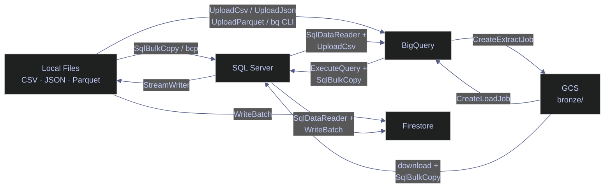

# 23. Data Ingestion — SQL Server, BigQuery, Firestore

> [!quote]
> "Data is a precious thing and will last longer than the systems themselves."
>
> — **Tim Berners-Lee**, attributed remark (c. 2006)

This notebook benchmarks bulk-load performance into SQL Server, BigQuery, and Firestore across three file tiers (2.5K / 75K / 750K rows) and four source formats (CSV, JSON, Parquet, GCS). Results are persisted to JSON for cross-session comparison and visualised with Plotly.



```csharp
// Suppress CS1701/CS1702 assembly version warnings in .NET Interactive.
// NuGet packages targeting .NET 8/9 trigger these on .NET 10 — harmless.
// Run this cell ONCE before any cells that use NuGet packages.

using System.Reflection;
using Microsoft.DotNet.Interactive;
using Microsoft.DotNet.Interactive.CSharp;

var csharpKernel = (CSharpKernel)Kernel.Root.FindKernelByName("csharp");
var optionsField = typeof(CSharpKernel).GetField("_scriptOptions",
    BindingFlags.NonPublic | BindingFlags.Instance);

var scriptOptions = optionsField.GetValue(csharpKernel);
var withWarningLevel = scriptOptions.GetType().GetMethod("WithWarningLevel");
var newOptions = withWarningLevel.Invoke(scriptOptions, new object[] { 0 });
optionsField.SetValue(csharpKernel, newOptions);
```

```csharp
#r "nuget: Microsoft.Data.SqlClient"
#r "nuget: Google.Cloud.BigQuery.V2"
#r "nuget: Google.Cloud.Firestore"
#r "nuget: Microsoft.Bcl.AsyncInterfaces"
#r "nuget: Google.Cloud.Storage.V1"
#r "nuget: DotNetEnv"
#r "nuget: Parquet.Net, 5.5.0"
#r "nuget: Newtonsoft.Json"
#r "nuget: Polars.NET, 0.4.0"
#r "nuget: Polars.NET.Native.win-x64, 0.4.0"
#r "nuget: Plotly.NET, 5.1.0"
#r "nuget: Plotly.NET.Interactive, 5.0.0"
#r "nuget: Plotly.NET.CSharp, 0.13.0"

using System;
using System.Collections.Generic;
using System.Data;
using System.Diagnostics;
using System.IO;
using System.Linq;
using System.Text;
using System.Threading;
using System.Threading.Tasks;
using DotNetEnv;
using Google.Cloud.BigQuery.V2;
using Google.Cloud.Firestore;
using Google.Cloud.Storage.V1;
using Microsoft.Data.SqlClient;
using Newtonsoft.Json;
using Newtonsoft.Json.Linq;
using Parquet;
using Parquet.Data;
using Parquet.Schema;
using Polars.CSharp;
using static Polars.CSharp.Polars;
using Microsoft.DotNet.Interactive.Formatting;
using Plotly.NET;
using Plotly.NET.CSharp;
using Plotly.NET.LayoutObjects;
```

Loads `.env` and defines project constants.

```csharp
DotNetEnv.Env.Load();

var PROJECT_ID    = "seclab-dev-ap-26";
var REGION        = "europe-west1";
var BUCKET_NAME   = $"{PROJECT_ID}-data";
var BQ_DATASET    = "index_data";
var FIRESTORE_DB  = "seclab-scores";
var SQL_IP        = Environment.GetEnvironmentVariable("GCP_SQL_IP") ?? "";
var SQL_PASSWORD  = Environment.GetEnvironmentVariable("GCP_SQL_PASSWORD") ?? "";
var SA_KEY_PATH   = Environment.GetEnvironmentVariable("GCP_SA_KEY_PATH") ?? "./gcp-sa-key.json";
var DATA_DIR      = @"C:\Users\aperi\DEV\LANG\data";
var CHUNK_SIZE    = 10_000;

Environment.SetEnvironmentVariable("GOOGLE_APPLICATION_CREDENTIALS", SA_KEY_PATH);

var SQL_BENCH_TABLE = "dbo.ohlcv_bench";
var BQ_BENCH_TABLE  = $"{PROJECT_ID}.{BQ_DATASET}.ohlcv_bench";
var FS_COLLECTION   = "ohlcv_bench";

var bqClient      = BigQueryClient.Create(PROJECT_ID);
var storageClient = StorageClient.Create();
var fsDb          = new FirestoreDbBuilder { ProjectId = PROJECT_ID, DatabaseId = FIRESTORE_DB }.Build();

var SQL_CONN = $"Server={SQL_IP},1433;Database=stoxx;User Id=sqlserver;Password={SQL_PASSWORD};"
             + "Encrypt=True;TrustServerCertificate=True;Connection Timeout=15;";

SqlConnection CreateSqlConnection() => new SqlConnection(SQL_CONN);

var BCP    = "bcp";
var BQ_CLI = @"C:\Users\aperi\AppData\Local\Google\Cloud SDK\google-cloud-sdk\bin\bq.cmd";
var GCLOUD = @"C:\Users\aperi\AppData\Local\Google\Cloud SDK\google-cloud-sdk\bin\gcloud.cmd";

void SqlTruncate(string table)
{
    using var conn = CreateSqlConnection();
    conn.Open();
    new SqlCommand($"TRUNCATE TABLE {table}", conn).ExecuteNonQuery();
}

async Task FsDeleteCollection(string collection)
{
    var snapshot = await fsDb.Collection(collection).Select(Array.Empty<string>()).GetSnapshotAsync();
    var batch = fsDb.StartBatch();
    foreach (var doc in snapshot.Documents)
        batch.Delete(doc.Reference);
    if (snapshot.Count > 0) await batch.CommitAsync();
}

using (var conn = CreateSqlConnection())
{
    conn.Open();
    Console.WriteLine($"  SQL Server: {conn.ServerVersion}");
}
Console.WriteLine($"  BigQuery:   {BQ_DATASET} ({PROJECT_ID})");
Console.WriteLine($"  Firestore:  {FIRESTORE_DB} ({PROJECT_ID})");
Console.WriteLine($"  GCS:        gs://{BUCKET_NAME}");

Formatter.Register<DataFrame>((df, writer) =>
{
    var html = df.ToHtml();
    html = System.Text.RegularExpressions.Regex.Replace(html, @"(>|>)&quot;(.+?)&quot;(<|<)", @"$1$2$3");
    html = System.Text.RegularExpressions.Regex.Replace(html, @">""(.+?)""<", @">$1<");
    var css = @"<style>.pl-dataframe,.pl-dataframe *{background:transparent!important;background-color:transparent!important;color:var(--vscode-editor-foreground,inherit)!important}.pl-dataframe{font-size:14px!important;border-collapse:collapse;width:auto}.pl-dataframe td,.pl-dataframe th{padding:6px 12px!important;text-align:left;border:1px solid var(--vscode-panel-border,#555)!important}.pl-dataframe th{font-weight:bold}.pl-dataframe .pl-dtype{font-size:11px;opacity:0.5}</style>";
    writer.Write(css + html);
}, "text/html");
Formatter.Register<Polars.CSharp.Series>((s, writer) =>
{
    var sdf = DataFrame.FromSeries(s);
    var shtml = sdf.ToHtml();
    shtml = System.Text.RegularExpressions.Regex.Replace(shtml, @"(>|>)&quot;(.+?)&quot;(<|<)", @"$1$2$3");
    shtml = System.Text.RegularExpressions.Regex.Replace(shtml, @">""(.+?)""<", @">$1<");
    var scss = @"<style>.pl-dataframe,.pl-dataframe *{background:transparent!important;color:var(--vscode-editor-foreground,inherit)!important}.pl-dataframe{font-size:14px!important;border-collapse:collapse}.pl-dataframe td,.pl-dataframe th{padding:6px 12px!important;text-align:left;border:1px solid var(--vscode-panel-border,#555)!important}.pl-dataframe th{font-weight:bold}.pl-dataframe .pl-dtype{font-size:11px;opacity:0.5}</style>";
    writer.Write(scss + shtml);
}, "text/html");
```

      SQL Server: 16.00.4236
      BigQuery:   index_data (seclab-dev-ap-26)
      Firestore:  seclab-scores (seclab-dev-ap-26)
      GCS:        gs://seclab-dev-ap-26-data

## Setup

Helper functions and benchmark infrastructure shared across all ingestion sections. Run these cells once before executing any benchmark.

### Setup | helpers and infrastructure

#### Formatting helpers

Human-readable formatters for row counts, elapsed time, byte sizes, and throughput rates. Used in every benchmark output row and summary table.

```csharp
string FmtRows(int n)
{
    if (n < 1000) return n.ToString();
    if (n < 1_000_000) return $"{n / 1000.0:F1}K";
    return $"{n / 1_000_000.0:F1}M";
}

string FmtTime(double ms)
{
    if (ms < 1000) return $"{ms:F0}ms";
    if (ms < 60_000) return $"{ms / 1000:F1}s";
    var m = (int)(ms / 60_000); var s = (ms % 60_000) / 1000;
    return s == 0 ? $"{m}min" : $"{m}m{s:F0}s";
}

string FmtSize(long b)
{
    if (b < 1024) return $"{b} B";
    if (b < 1024 * 1024) return $"{b / 1024.0:F0} KB";
    if (b < 1024L * 1024 * 1024) return $"{b / (1024.0 * 1024):F2} MB";
    return $"{b / (1024.0 * 1024 * 1024):F2} GB";
}

string FmtRate(int rows, double ms)
{
    if (ms <= 0) return "-";
    var rate = rows / (ms / 1000.0);
    if (rate < 1000) return $"{rate:F0} rows/s";
    if (rate < 1_000_000) return $"{rate / 1000:F1}K rows/s";
    return $"{rate / 1_000_000:F1}M rows/s";
}
```

#### Define file tiers for ingestion benchmarks

Three file tiers (small 2.5K, medium 75K, large 750K rows) with paths for CSV, JSON, and Parquet formats. Row counts are derived from the CSV files at runtime and reused across all benchmark functions.

```csharp
var tierNames = new[] { "small", "medium", "large" };
var tiers = new Dictionary<string, Dictionary<string, string>>();
var tierRows = new Dictionary<string, int>();

foreach (var tier in tierNames)
{
    tiers[tier] = new Dictionary<string, string>
    {
        ["csv"]     = Path.Combine(DATA_DIR, $"ingest_{tier}.csv"),
        ["json"]    = Path.Combine(DATA_DIR, $"ingest_{tier}.json"),
        ["parquet"] = Path.Combine(DATA_DIR, $"ingest_{tier}.parquet"),
    };
    tierRows[tier] = File.ReadLines(tiers[tier]["csv"]).Count() - 1;
}

var dfTiers = new DataFrame(
    Series.From("tier", tierNames),
    Series.From("rows", tierNames.Select(t => tierRows[t]).ToArray()),
    Series.From("CSV", tierNames.Select(t => FmtSize(new FileInfo(tiers[t]["csv"]).Length)).ToArray()),
    Series.From("JSON", tierNames.Select(t => FmtSize(new FileInfo(tiers[t]["json"]).Length)).ToArray()),
    Series.From("Parquet", tierNames.Select(t => FmtSize(new FileInfo(tiers[t]["parquet"]).Length)).ToArray())
);
dfTiers
```

<style>.pl-dataframe,.pl-dataframe *{background:transparent!important;background-color:transparent!important;color:var(--vscode-editor-foreground,inherit)!important}.pl-dataframe{font-size:14px!important;border-collapse:collapse;width:auto}.pl-dataframe td,.pl-dataframe th{padding:6px 12px!important;text-align:left;border:1px solid var(--vscode-panel-border,#555)!important}.pl-dataframe th{font-weight:bold}.pl-dataframe .pl-dtype{font-size:11px;opacity:0.5}</style>
<style>
.pl-dataframe { font-family: 'Consolas', 'Monaco', monospace; font-size: 13px; border-collapse: collapse; border: 1px solid #e0e0e0; }
.pl-dataframe th { background-color: #f0f0f0; font-weight: bold; text-align: left; padding: 6px 12px; border-bottom: 2px solid #ccc; }
.pl-dataframe td { padding: 6px 12px; border-bottom: 1px solid #f0f0f0; white-space: pre; color: #333; }
.pl-dataframe tr:nth-child(even) { background-color: #f9f9f9; }
.pl-dataframe tr:hover { background-color: #f1f1f1; }
.pl-dtype { font-size: 10px; color: #999; display: block; margin-top: 2px; font-weight: normal; }
.pl-null { color: #d0d0d0; font-style: italic; }
.pl-dim { font-family: sans-serif; font-size: 12px; color: #666; margin-bottom: 8px; }
</style><div class='pl-dim'>Polars DataFrame: <b>(3 rows, 5 columns)</b></div><table class='pl-dataframe'><thead><tr><th>tier<span class='pl-dtype'>utf8view</span></th><th>rows<span class='pl-dtype'>int32</span></th><th>CSV<span class='pl-dtype'>utf8view</span></th><th>JSON<span class='pl-dtype'>utf8view</span></th><th>Parquet<span class='pl-dtype'>utf8view</span></th></tr></thead><tbody><tr><td>small</td><td>2500</td><td>190 KB</td><td>468 KB</td><td>130 KB</td></tr><tr><td>medium</td><td>75000</td><td>5.66 MB</td><td>13.81 MB</td><td>2.96 MB</td></tr><tr><td>large</td><td>750000</td><td>57.31 MB</td><td>138.85 MB</td><td>18.89 MB</td></tr></tbody></table>

#### Ingestion benchmark helper

Times a single ingestion function and upserts the result into an in-memory list and a persistent JSON file, keyed by `(method, tier)`. Existing entries for the same key are replaced — re-running a benchmark updates the stored result without accumulating duplicates.

```csharp
var INGEST_RESULTS_FILE = Path.Combine(DATA_DIR, "ingestion_results_cs.json");

List<IngestResult> LoadIngestResults()
{
    if (File.Exists(INGEST_RESULTS_FILE))
        return JsonConvert.DeserializeObject<List<IngestResult>>(File.ReadAllText(INGEST_RESULTS_FILE))
               ?? new List<IngestResult>();
    return new List<IngestResult>();
}

void SaveIngestResults(List<IngestResult> results)
    => File.WriteAllText(INGEST_RESULTS_FILE, JsonConvert.SerializeObject(results, Formatting.Indented));

IngestResult BenchIngest(string methodName, Func<int> ingestFn, string tierName)
{
    var sw = Stopwatch.StartNew();
    var rowCount = ingestFn();
    sw.Stop();
    var ms = sw.Elapsed.TotalMilliseconds;
    var record = new IngestResult
    {
        method     = methodName,
        tier       = tierName,
        rows       = rowCount,
        rows_fmt   = FmtRows(rowCount),
        elapsed_ms = Math.Round(ms, 1),
        elapsed    = FmtTime(ms),
        rate       = FmtRate(rowCount, ms),
        rate_raw   = ms > 0 ? Math.Round(rowCount / (ms / 1000.0), 1) : 0,
    };
    var all = LoadIngestResults();
    all.RemoveAll(r => r.method == methodName && r.tier == tierName);
    all.Add(record);
    SaveIngestResults(all);
    ingestResults.RemoveAll(r => r.method == methodName && r.tier == tierName);
    ingestResults.Add(record);
    return record;
}

var ingestResults = LoadIngestResults();
Console.WriteLine($"  Loaded {ingestResults.Count} existing results from {Path.GetFileName(INGEST_RESULTS_FILE)}");

class IngestResult
{
    public string method    { get; set; } = "";
    public string tier      { get; set; } = "";
    public int    rows      { get; set; }
    public string rows_fmt  { get; set; } = "";
    public double elapsed_ms { get; set; }
    public string elapsed   { get; set; } = "";
    public string rate      { get; set; } = "";
    public double rate_raw  { get; set; }
}
```

      Loaded 26 existing results from ingestion_results_cs.json

## Schema Setup

The SQL Server DDL below follows the same [bronze-layer-loading](https://alp78.github.io/elysium/04-SQL-Server/Medallion-Project/bronze-layer-loading) patterns used in the medallion architecture. BigQuery schema and load configuration align with [data-loading-and-export](https://alp78.github.io/elysium/06-GCP/BigQuery/data-loading-and-export).

### Schema Setup | staging tables

#### Create staging table in SQL Server

Creates `dbo.ohlcv_bench` if it does not already exist. All columns use `NVARCHAR` to accept raw string values without conversion — type coercion happens downstream in the medallion pipeline.

```csharp
using (var conn = CreateSqlConnection())
{
    conn.Open();
    var sql = @"
        IF NOT EXISTS (SELECT * FROM sys.tables WHERE name = 'ohlcv_bench')
        CREATE TABLE dbo.ohlcv_bench (
            id           NVARCHAR(20),
            symbol       NVARCHAR(50),
            date         NVARCHAR(20),
            [open]       NVARCHAR(30),
            high         NVARCHAR(30),
            low          NVARCHAR(30),
            [close]      NVARCHAR(30),
            adj_close    NVARCHAR(30),
            volume       NVARCHAR(30),
            dividends    NVARCHAR(30),
            stock_splits NVARCHAR(30),
            is_filled    NVARCHAR(10)
        )";
    new SqlCommand(sql, conn).ExecuteNonQuery();
    var count = (int)new SqlCommand("SELECT COUNT(*) FROM dbo.ohlcv_bench", conn).ExecuteScalar();
    Console.WriteLine($"  ohlcv_bench table ready ({count} existing rows)");
}
```

      ohlcv_bench table ready (750000 existing rows)

#### Create staging table in BigQuery

Creates `ohlcv_bench` in the `index_data` dataset with a fully typed schema. `GetOrCreateTable` is idempotent — safe to re-run without error if the table already exists.

```csharp
var bqSchema = new TableSchemaBuilder
{
    { "id", BigQueryDbType.Int64 },
    { "symbol", BigQueryDbType.String },
    { "date", BigQueryDbType.Date },
    { "open", BigQueryDbType.Float64 },
    { "high", BigQueryDbType.Float64 },
    { "low", BigQueryDbType.Float64 },
    { "close", BigQueryDbType.Float64 },
    { "adj_close", BigQueryDbType.Float64 },
    { "volume", BigQueryDbType.Int64 },
    { "dividends", BigQueryDbType.Float64 },
    { "stock_splits", BigQueryDbType.Float64 },
    { "is_filled", BigQueryDbType.Bool },
}.Build();

bqClient.GetOrCreateTable(BQ_DATASET, "ohlcv_bench", bqSchema);
Console.WriteLine($"  BigQuery {BQ_DATASET}.ohlcv_bench table ready");
```

      BigQuery index_data.ohlcv_bench table ready

## Local → SQL Server Ingestion

Load OHLCV data from local CSV, JSON, and Parquet files into Cloud SQL for SQL Server using three distinct methods: row-by-row ADO.NET (baseline), `SqlBulkCopy` (managed bulk insert), and `bcp` (native CLI bulk load).

### SqlClient / bcp | local CSV, JSON, Parquet to SQL Server

#### Ingest CSV into SQL Server from local using Microsoft.Data.SqlClient ExecuteNonQuery over TLS

Row-by-row parameterised INSERT via `ExecuteNonQuery`. One network round-trip per row over TLS. Simplest pattern but slowest — included as a baseline to quantify the cost of naive ingestion. Only practical for datasets under a few hundred rows.

> [!warning] Row-by-row INSERT does not scale
>
> At ~40 rows/s over an encrypted TLS connection, loading 750K rows takes over 5 hours. Every row incurs a full SQL parse, plan-cache lookup, and network round-trip.

> [!success] Use SqlBulkCopy or bcp for any real volume
>
> `SqlBulkCopy` streams all rows via the TDS bulk-insert protocol in a single connection — 500–900× faster at large tier. For flat-file loads, `bcp` is marginally faster still (no managed layer overhead).

```csharp
int AdoInsert(string tier)
{
    SqlTruncate(SQL_BENCH_TABLE);
    var lines = File.ReadAllLines(tiers[tier]["csv"]);
    var headers = lines[0].Trim().Split(',');
    var cols = string.Join(", ", headers.Select(h => $"[{h}]"));
    var parms = string.Join(", ", headers.Select((_, i) => $"@p{i}"));
    var sql = $"INSERT INTO {SQL_BENCH_TABLE} ({cols}) VALUES ({parms})";

    using var conn = CreateSqlConnection();
    conn.Open();
    foreach (var line in lines.Skip(1))
    {
        var vals = line.Split(',');
        using var cmd = new SqlCommand(sql, conn);
        for (int i = 0; i < headers.Length; i++)
            cmd.Parameters.AddWithValue($"@p{i}", vals[i]);
        cmd.ExecuteNonQuery();
    }
    return lines.Length - 1;
}

Console.WriteLine($"  {"tier",-8} {"rows",8} {"time",10} {"rate",14}");
foreach (var tier in new[] { "small", "medium" })
{
    var r = BenchIngest("ado_executenonquery", () => AdoInsert(tier), tier);
    Console.WriteLine($"  {tier,-8} {r.rows_fmt,8} {r.elapsed,10} {r.rate,14}");
}
```

      tier         rows       time           rate
      small        2.5K       1m5s      38 rows/s
      medium      75.0K      32m5s      39 rows/s

#### Ingest CSV into SQL Server from local using Microsoft.Data.SqlClient SqlBulkCopy over TLS

.NET’s native bulk insert — streams rows via the TDS protocol’s bulk insert path.
Equivalent to `pyodbc.fast_executemany` but faster (native TDS bulk protocol, not parameterised batches).

```csharp
int BulkCopyInsert(string tier)
{
    SqlTruncate(SQL_BENCH_TABLE);
    var lines = File.ReadAllLines(tiers[tier]["csv"]);
    var headers = lines[0].Trim().Split(',');
    var dt = new DataTable();
    foreach (var h in headers) dt.Columns.Add(h);
    foreach (var line in lines.Skip(1))
        dt.Rows.Add(line.Trim().Split(','));

    using var conn = CreateSqlConnection();
    conn.Open();
    using var bulk = new SqlBulkCopy(conn)
    {
        DestinationTableName = SQL_BENCH_TABLE,
        BatchSize = CHUNK_SIZE,
        BulkCopyTimeout = 300,
    };
    foreach (var h in headers)
        bulk.ColumnMappings.Add(h, h);
    bulk.WriteToServer(dt);
    return dt.Rows.Count;
}

Console.WriteLine($"  {"tier",-8} {"rows",8} {"time",10} {"rate",14}");
foreach (var tier in tierNames)
{
    var r = BenchIngest("sqlbulkcopy", () => BulkCopyInsert(tier), tier);
    Console.WriteLine($"  {tier,-8} {r.rows_fmt,8} {r.elapsed,10} {r.rate,14}");
}
```

      tier         rows       time           rate
      small        2.5K      357ms    7.0K rows/s
      medium      75.0K       2.7s   27.3K rows/s
      large      750.0K      21.5s   34.9K rows/s

#### Ingest CSV into SQL Server from local using bcp (Bulk Copy Program) over TDS

The `bcp` CLI sends rows via the native TDS bulk-insert protocol, bypassing the .NET managed layer and the SQL parser entirely. Marginally faster than `SqlBulkCopy` at large tier and requires no C# DataTable allocation.

> [!warning] Do not hardcode credentials in CLI arguments
>
> Passing `-P <password>` on the command line exposes the credential in process listings (`ps aux`, Windows Event Log, shell history). On a shared or cloud host this is a security risk.

> [!success] Use a trusted connection or runtime-injected credentials
>
> Pass `-T` to use Windows Integrated Authentication, or read the password from an environment variable at runtime — never interpolate it directly into the argument string.

```csharp
int BcpImport(string tier)
{
    SqlTruncate(SQL_BENCH_TABLE);
    var psi = new ProcessStartInfo
    {
        FileName = BCP,
        Arguments = $"dbo.ohlcv_bench in \"{tiers[tier]["csv"]}\" "
                  + $"-S {SQL_IP},1433 -U sqlserver -P {SQL_PASSWORD} "
                  + $"-d stoxx -c -t , -F 2 -b {CHUNK_SIZE} -u",
        RedirectStandardOutput = true,
        RedirectStandardError = true,
        UseShellExecute = false,
        CreateNoWindow = true,
    };
    var proc = Process.Start(psi)!;
    var stdout = proc.StandardOutput.ReadToEndAsync();
    var stderr = proc.StandardError.ReadToEndAsync();
    proc.WaitForExit();
    if (proc.ExitCode != 0)
        Console.WriteLine($"    bcp error: {stdout.Result} {stderr.Result}");
    return tierRows[tier];
}

Console.WriteLine($"  {"tier",-8} {"rows",8} {"time",10} {"rate",14}");
foreach (var tier in tierNames)
{
    var r = BenchIngest("bcp_import", () => BcpImport(tier), tier);
    Console.WriteLine($"  {tier,-8} {r.rows_fmt,8} {r.elapsed,10} {r.rate,14}");
}
```

      tier         rows       time           rate
      small        2.5K      489ms    5.1K rows/s
      medium      75.0K       2.4s   30.9K rows/s
      large      750.0K      20.6s   36.3K rows/s

#### Ingest JSON into SQL Server from local using Microsoft.Data.SqlClient SqlBulkCopy over TLS

Reads newline-delimited JSON, parses with Newtonsoft, bulk-copies via `SqlBulkCopy`.
Same bulk-insert throughput as CSV once parsed — the JSON parsing is the overhead.

```csharp
int JsonBulkInsert(string tier)
{
    SqlTruncate(SQL_BENCH_TABLE);
    var lines = File.ReadAllLines(tiers[tier]["json"]);
    var dt = new DataTable();
    var first = JObject.Parse(lines[0]);
    foreach (var prop in first.Properties()) dt.Columns.Add(prop.Name);
    foreach (var line in lines)
    {
        var obj = JObject.Parse(line);
        dt.Rows.Add(obj.Properties().Select(p => p.Value.ToString()).ToArray());
    }

    using var conn = CreateSqlConnection();
    conn.Open();
    using var bulk = new SqlBulkCopy(conn) { DestinationTableName = SQL_BENCH_TABLE, BatchSize = CHUNK_SIZE };
    foreach (System.Data.DataColumn col in dt.Columns) bulk.ColumnMappings.Add(col.ColumnName, col.ColumnName);
    bulk.WriteToServer(dt);
    return dt.Rows.Count;
}

Console.WriteLine($"  {"tier",-8} {"rows",8} {"time",10} {"rate",14}");
foreach (var tier in tierNames)
{
    var r = BenchIngest("json_sqlbulkcopy", () => JsonBulkInsert(tier), tier);
    Console.WriteLine($"  {tier,-8} {r.rows_fmt,8} {r.elapsed,10} {r.rate,14}");
}
```

      tier         rows       time           rate
      small        2.5K      190ms   13.2K rows/s
      medium      75.0K       2.6s   28.5K rows/s
      large      750.0K      22.7s   33.1K rows/s

#### Ingest Parquet into SQL Server from local using Parquet.Net + SqlBulkCopy over TLS

Reads Parquet columnar data with Parquet.Net, pivots to row-based DataTable, bulk-copies.
Parquet files are smaller and faster to parse than CSV — columnar layout enables skip-reads.

```csharp
int ParquetBulkInsert(string tier)
{
    SqlTruncate(SQL_BENCH_TABLE);
    using var fs = File.OpenRead(tiers[tier]["parquet"]);
    using var reader = ParquetReader.CreateAsync(fs).Result;
    var dt = new DataTable();
    foreach (var field in reader.Schema.DataFields) dt.Columns.Add(field.Name);

    for (int rg = 0; rg < reader.RowGroupCount; rg++)
    {
        using var rgReader = reader.OpenRowGroupReader(rg);
        var columns = reader.Schema.DataFields.Select(f => rgReader.ReadColumnAsync(f).Result).ToArray();
        var rowCount = columns[0].Data.Length;
        for (int row = 0; row < rowCount; row++)
        {
            var vals = columns.Select(c => c.Data.GetValue(row)?.ToString() ?? "").ToArray();
            dt.Rows.Add(vals);
        }
    }

    using var conn = CreateSqlConnection();
    conn.Open();
    using var bulk = new SqlBulkCopy(conn) { DestinationTableName = SQL_BENCH_TABLE, BatchSize = CHUNK_SIZE };
    foreach (System.Data.DataColumn col in dt.Columns) bulk.ColumnMappings.Add(col.ColumnName, col.ColumnName);
    bulk.WriteToServer(dt);
    return dt.Rows.Count;
}

Console.WriteLine($"  {"tier",-8} {"rows",8} {"time",10} {"rate",14}");
foreach (var tier in tierNames)
{
    var r = BenchIngest("parquet_sqlbulkcopy", () => ParquetBulkInsert(tier), tier);
    Console.WriteLine($"  {tier,-8} {r.rows_fmt,8} {r.elapsed,10} {r.rate,14}");
}
```

      tier         rows       time           rate
      small        2.5K      194ms   12.9K rows/s
      medium      75.0K       2.1s   35.0K rows/s
      large      750.0K      20.7s   36.2K rows/s

## Local → BigQuery Ingestion

Upload local CSV, JSON, and Parquet files into BigQuery using the `Google.Cloud.BigQuery.V2` managed client and the `bq` CLI. All paths use HTTPS to the BigQuery Jobs API; BigQuery handles server-side parsing.

### BigQueryClient / bq CLI | local CSV, JSON, Parquet to BigQuery

#### Ingest CSV into BigQuery from local using Google.Cloud.BigQuery.V2 UploadCsv over HTTPS

Uploads the CSV file directly via the BigQuery jobs API. Server-side parsing — the file is streamed as-is.

```csharp
int BqLoadCsv(string tier)
{
    using var fs = File.OpenRead(tiers[tier]["csv"]);
    var job = bqClient.UploadCsv(BQ_DATASET, "ohlcv_bench", null, fs,
        new UploadCsvOptions { SkipLeadingRows = 1, WriteDisposition = WriteDisposition.WriteTruncate });
    var completed = job.PollUntilCompleted().ThrowOnAnyError();
    return (int)(completed.Resource.Statistics.Load?.OutputRows ?? 0);
}

Console.WriteLine($"  {"tier",-8} {"rows",8} {"time",10} {"rate",14}");
foreach (var tier in tierNames)
{
    var r = BenchIngest("bq_load_csv", () => BqLoadCsv(tier), tier);
    Console.WriteLine($"  {tier,-8} {r.rows_fmt,8} {r.elapsed,10} {r.rate,14}");
}
```

      tier         rows       time           rate
      small        2.5K      11.3s     222 rows/s
      medium      75.0K       6.8s   11.0K rows/s
      large      750.0K      24.4s   30.7K rows/s

#### Ingest JSON into BigQuery from local using Google.Cloud.BigQuery.V2 UploadJson over HTTPS

Uploads newline-delimited JSON. BigQuery parses each line as a row — schema must match.

```csharp
int BqLoadJson(string tier)
{
    using var fs = File.OpenRead(tiers[tier]["json"]);
    var job = bqClient.UploadJson(BQ_DATASET, "ohlcv_bench", null, fs,
        new UploadJsonOptions { WriteDisposition = WriteDisposition.WriteTruncate });
    var completed = job.PollUntilCompleted().ThrowOnAnyError();
    return (int)(completed.Resource.Statistics.Load?.OutputRows ?? 0);
}

Console.WriteLine($"  {"tier",-8} {"rows",8} {"time",10} {"rate",14}");
foreach (var tier in tierNames)
{
    var r = BenchIngest("bq_load_json", () => BqLoadJson(tier), tier);
    Console.WriteLine($"  {tier,-8} {r.rows_fmt,8} {r.elapsed,10} {r.rate,14}");
}
```

      tier         rows       time           rate
      small        2.5K       5.8s     429 rows/s
      medium      75.0K       7.7s    9.7K rows/s
      large      750.0K      31.5s   23.8K rows/s

#### Ingest Parquet into BigQuery from local using Google.Cloud.BigQuery.V2 UploadParquet over HTTPS

Parquet carries its own schema — BigQuery reads column types from the file footer. Fastest local format.

```csharp
int BqLoadParquet(string tier)
{
    using var fs = File.OpenRead(tiers[tier]["parquet"]);
    var job = bqClient.UploadParquet(BQ_DATASET, "ohlcv_bench", fs,
        new UploadParquetOptions { WriteDisposition = WriteDisposition.WriteTruncate });
    var completed = job.PollUntilCompleted().ThrowOnAnyError();
    return (int)(completed.Resource.Statistics.Load?.OutputRows ?? 0);
}

Console.WriteLine($"  {"tier",-8} {"rows",8} {"time",10} {"rate",14}");
foreach (var tier in tierNames)
{
    var r = BenchIngest("bq_load_parquet", () => BqLoadParquet(tier), tier);
    Console.WriteLine($"  {tier,-8} {r.rows_fmt,8} {r.elapsed,10} {r.rate,14}");
}
```

      tier         rows       time           rate
      small        2.5K       6.0s     415 rows/s
      medium      75.0K       6.1s   12.2K rows/s
      large      750.0K       8.6s   87.4K rows/s

#### Ingest CSV into BigQuery from local using bq CLI load over HTTPS

Command-line load without writing C# code. Same underlying API as `UploadCsv`.

```csharp
int BqCliLoad(string tier)
{
    var psi = new ProcessStartInfo
    {
        FileName = BQ_CLI,
        Arguments = $"load --source_format=CSV --skip_leading_rows=1 --replace "
                  + $"{BQ_DATASET}.ohlcv_bench \"{tiers[tier]["csv"]}\"",
        RedirectStandardOutput = true,
        RedirectStandardError = true,
        UseShellExecute = false,
        CreateNoWindow = true,
    };
    var proc = Process.Start(psi)!;
    proc.StandardOutput.ReadToEndAsync();
    proc.StandardError.ReadToEndAsync();
    proc.WaitForExit();
    return tierRows[tier];
}

Console.WriteLine($"  {"tier",-8} {"rows",8} {"time",10} {"rate",14}");
foreach (var tier in tierNames)
{
    var r = BenchIngest("bq_cli_load", () => BqCliLoad(tier), tier);
    Console.WriteLine($"  {tier,-8} {r.rows_fmt,8} {r.elapsed,10} {r.rate,14}");
}
```

      tier         rows       time           rate
      small        2.5K       5.8s     431 rows/s
      medium      75.0K       7.9s    9.5K rows/s
      large      750.0K      20.8s   36.1K rows/s

## Local → Firestore Ingestion

Write OHLCV rows as documents into a Firestore collection using the `Google.Cloud.Firestore` client over gRPC. Each CSV row becomes a document; `Set()` overwrites by document ID, making re-runs safe without a prior delete.

### FirestoreDb | local CSV to Firestore

#### Ingest CSV into Firestore from local using Google.Cloud.Firestore WriteBatch over gRPC

Batches up to 500 documents per gRPC call. Each `CommitAsync()` is a single atomic operation — all 500 writes succeed or none do. `Set()` overwrites existing documents by ID, so no prior delete is needed.

> [!warning] Firestore batch limit is 500 documents
>
> A `WriteBatch` that accumulates more than 500 operations throws `InvalidArgument` at commit time. Always flush and start a new batch when the counter reaches 500.

> [!success] Pattern: counter-flush loop
>
> Maintain a `batchCount` counter alongside the batch object. On every 500th document, call `batch.CommitAsync().Wait()` and reset both the batch and the counter. After the loop, check `batchCount > 0` and commit the final partial batch to avoid silently dropping the tail.

```csharp
int FsBatchWrite(string tier)
{
    var lines = File.ReadAllLines(tiers[tier]["csv"]);
    var headers = lines[0].Trim().Split(',');
    int count = 0;
    var batch = fsDb.StartBatch();
    int batchCount = 0;

    foreach (var line in lines.Skip(1))
    {
        var vals = line.Split(',');
        var data = new Dictionary<string, object>();
        for (int i = 0; i < headers.Length; i++) data[headers[i]] = vals[i];
        var docRef = fsDb.Collection(FS_COLLECTION).Document(count.ToString());
        batch.Set(docRef, data);
        count++;
        batchCount++;
        if (batchCount >= 500)
        {
            batch.CommitAsync().Wait();
            batch = fsDb.StartBatch();
            batchCount = 0;
        }
    }
    if (batchCount > 0) batch.CommitAsync().Wait();
    return count;
}

Console.WriteLine($"  {"tier",-8} {"rows",8} {"time",10} {"rate",14}");
foreach (var tier in tierNames)
{
    var r = BenchIngest("fs_batch_write", () => FsBatchWrite(tier), tier);
    Console.WriteLine($"  {tier,-8} {r.rows_fmt,8} {r.elapsed,10} {r.rate,14}");
}
```

      tier         rows       time           rate
      small        2.5K       6.2s     406 rows/s
      medium      75.0K      3m18s     378 rows/s
      large      750.0K      8m21s    1.5K rows/s

> [!info] No BulkWriter equivalent in the C# Firestore client
>
> The Python `google-cloud-firestore` SDK exposes `BulkWriter`, which manages batching, retry logic, and rate limiting automatically — delivering 2–5× higher throughput than manual batch writes. The C# `Google.Cloud.Firestore` client (v3.x) does not expose an equivalent API. For high-volume C# Firestore ingestion, implement parallel batch dispatch manually or see the Python counterpart for the BulkWriter pattern.

## GCS → BigQuery Ingestion

Server-side load — BigQuery reads files directly from GCS over Google's internal network. No data passes through the local machine, making this the standard production pattern for data lake pipelines.

### BigQueryClient | GCS to BigQuery load jobs

#### Ingest CSV into BigQuery from GCS using Google.Cloud.BigQuery.V2 CreateLoadJob over internal network

Server-side load — BigQuery reads directly from GCS. No data passes through local machine.

```csharp
int BqGcsCsv(string tier)
{
    var uri = $"gs://{BUCKET_NAME}/bronze/csv/ingest_{tier}.csv";
    var tRef = new Google.Apis.Bigquery.v2.Data.TableReference
        { ProjectId = PROJECT_ID, DatasetId = BQ_DATASET, TableId = "ohlcv_bench" };
    var job = bqClient.CreateLoadJob(uri, tRef, null,
        new CreateLoadJobOptions
        {
            SourceFormat = FileFormat.Csv,
            SkipLeadingRows = 1,
            WriteDisposition = WriteDisposition.WriteTruncate,
            Autodetect = true,
        });
    var completed = job.PollUntilCompleted().ThrowOnAnyError();
    return (int)(completed.Resource.Statistics.Load?.OutputRows ?? 0);
}

Console.WriteLine($"  {"tier",-8} {"rows",8} {"time",10} {"rate",14}");
foreach (var tier in tierNames)
{
    var r = BenchIngest("bq_gcs_csv", () => BqGcsCsv(tier), tier);
    Console.WriteLine($"  {tier,-8} {r.rows_fmt,8} {r.elapsed,10} {r.rate,14}");
}
```

      tier         rows       time           rate
      small        2.5K       5.9s     427 rows/s
      medium      75.0K       5.5s   13.7K rows/s
      large      750.0K      10.5s   71.2K rows/s

#### Ingest Parquet into BigQuery from GCS using Google.Cloud.BigQuery.V2 CreateLoadJob over internal network

Parquet is the fastest GCS→BQ path — columnar, compressed, schema embedded.

```csharp
int BqGcsParquet(string tier)
{
    var uri = $"gs://{BUCKET_NAME}/bronze/parquet/ingest_{tier}.parquet";
    var tRef = new Google.Apis.Bigquery.v2.Data.TableReference
        { ProjectId = PROJECT_ID, DatasetId = BQ_DATASET, TableId = "ohlcv_bench" };
    var job = bqClient.CreateLoadJob(uri, tRef, null,
        new CreateLoadJobOptions
        {
            SourceFormat = FileFormat.Parquet,
            WriteDisposition = WriteDisposition.WriteTruncate,
        });
    var completed = job.PollUntilCompleted().ThrowOnAnyError();
    return (int)(completed.Resource.Statistics.Load?.OutputRows ?? 0);
}

Console.WriteLine($"  {"tier",-8} {"rows",8} {"time",10} {"rate",14}");
foreach (var tier in tierNames)
{
    var r = BenchIngest("bq_gcs_parquet", () => BqGcsParquet(tier), tier);
    Console.WriteLine($"  {tier,-8} {r.rows_fmt,8} {r.elapsed,10} {r.rate,14}");
}
```

      tier         rows       time           rate
      small        2.5K       5.4s     460 rows/s
      medium      75.0K       5.5s   13.7K rows/s
      large      750.0K       5.5s  136.0K rows/s

## GCS → SQL Server Ingestion

Two-hop pipeline: download the file from GCS into a `MemoryStream`, then bulk-insert into SQL Server via `SqlBulkCopy`. There is no direct GCS→SQL path; the local machine acts as the transfer relay.

### StorageClient + SqlBulkCopy | GCS to SQL Server

#### Ingest CSV into SQL Server from GCS using Google.Cloud.Storage.V1 download + SqlBulkCopy over TLS

Two-hop pipeline: download from GCS to memory, then bulk-insert to SQL Server.

```csharp
int GcsToBulkCopy(string tier)
{
    SqlTruncate(SQL_BENCH_TABLE);
    var blobName = $"bronze/csv/ingest_{tier}.csv";
    using var ms = new MemoryStream();
    storageClient.DownloadObject(BUCKET_NAME, blobName, ms);
    ms.Seek(0, SeekOrigin.Begin);
    var lines = new StreamReader(ms).ReadToEnd().Split('\n', StringSplitOptions.RemoveEmptyEntries);
    var headers = lines[0].Trim().Split(',');
    var dt = new DataTable();
    foreach (var h in headers) dt.Columns.Add(h);
    foreach (var line in lines.Skip(1))
        dt.Rows.Add(line.Trim().Split(','));

    using var conn = CreateSqlConnection();
    conn.Open();
    using var bulk = new SqlBulkCopy(conn) { DestinationTableName = SQL_BENCH_TABLE, BatchSize = CHUNK_SIZE };
    foreach (var h in headers) bulk.ColumnMappings.Add(h, h);
    bulk.WriteToServer(dt);
    return dt.Rows.Count;
}

Console.WriteLine($"  {"tier",-8} {"rows",8} {"time",10} {"rate",14}");
foreach (var tier in tierNames)
{
    var r = BenchIngest("gcs_csv_sqlbulkcopy", () => GcsToBulkCopy(tier), tier);
    Console.WriteLine($"  {tier,-8} {r.rows_fmt,8} {r.elapsed,10} {r.rate,14}");
}
```

      tier         rows       time           rate
      small        2.5K      450ms    5.6K rows/s
      medium      75.0K       2.6s   29.1K rows/s
      large      750.0K      22.2s   33.7K rows/s

## Cross-Service Transfers

Move data between SQL Server, BigQuery, and Firestore using two-hop in-memory bridges. Each function self-populates the source database before transferring, so benchmarks are repeatable without manual setup.

### Cross-service | SQL Server ↔ BigQuery ↔ Firestore

#### Transfer data from SQL Server to BigQuery using SqlDataReader + UploadCsv over TLS/HTTPS

Two-hop bridge via local memory: query SQL Server, write CSV to MemoryStream, upload to BigQuery. The function populates `ohlcv_bench` with the correct tier first, then transfers.

```csharp
int SqlToBq(string tier)
{
    // Step 1: ensure SQL Server has the right data for this tier
    SqlTruncate(SQL_BENCH_TABLE);
    var lines = File.ReadAllLines(tiers[tier]["csv"]);
    var headers = lines[0].Trim().Split(',');
    var dt = new DataTable();
    foreach (var h in headers) dt.Columns.Add(h);
    foreach (var line in lines.Skip(1)) dt.Rows.Add(line.Trim().Split(','));
    using (var conn = CreateSqlConnection())
    {
        conn.Open();
        using var bulk = new SqlBulkCopy(conn) { DestinationTableName = SQL_BENCH_TABLE, BatchSize = CHUNK_SIZE };
        foreach (var h in headers) bulk.ColumnMappings.Add(h, h);
        bulk.WriteToServer(dt);
    }

    // Step 2: read from SQL Server and stream to BigQuery
    using var conn2 = CreateSqlConnection();
    conn2.Open();
    using var cmd = new SqlCommand($"SELECT TOP {tierRows[tier]} * FROM {SQL_BENCH_TABLE}", conn2);
    using var reader = cmd.ExecuteReader();
    var ms = new MemoryStream();
    var writer = new StreamWriter(ms);
    var cols = Enumerable.Range(0, reader.FieldCount).Select(j => reader.GetName(j)).ToArray();
    writer.WriteLine(string.Join(",", cols));
    int count = 0;
    while (reader.Read())
    {
        var vals = Enumerable.Range(0, reader.FieldCount).Select(j => reader.IsDBNull(j) ? "" : reader.GetValue(j).ToString());
        writer.WriteLine(string.Join(",", vals));
        count++;
    }
    writer.Flush();
    ms.Seek(0, SeekOrigin.Begin);
    bqClient.UploadCsv(BQ_DATASET, "ohlcv_bench", null, ms,
        new UploadCsvOptions { SkipLeadingRows = 1, WriteDisposition = WriteDisposition.WriteTruncate });
    return count;
}

Console.WriteLine($"  {"tier",-8} {"rows",8} {"time",10} {"rate",14}");
foreach (var tier in tierNames)
{
    var r = BenchIngest("sql_to_bq", () => SqlToBq(tier), tier);
    Console.WriteLine($"  {tier,-8} {r.rows_fmt,8} {r.elapsed,10} {r.rate,14}");
}
```

      tier         rows       time           rate
      small        2.5K       1.3s    2.0K rows/s
      medium      75.0K       4.2s   17.7K rows/s
      large      750.0K      34.0s   22.1K rows/s

#### Transfer data from BigQuery to SQL Server using BigQueryClient.ExecuteQuery + SqlBulkCopy over HTTPS/TLS

Two-hop bridge in reverse: query BigQuery, build DataTable, SqlBulkCopy to SQL Server. The function populates `ohlcv_bench` with the correct tier first, then transfers.

```csharp
int BqToSql(string tier)
{
    // Step 1: ensure BigQuery has the right data for this tier
    using var fs = File.OpenRead(tiers[tier]["csv"]);
    var loadJob = bqClient.UploadCsv(BQ_DATASET, "ohlcv_bench", null, fs,
        new UploadCsvOptions { SkipLeadingRows = 1, WriteDisposition = WriteDisposition.WriteTruncate });
    loadJob.PollUntilCompleted().ThrowOnAnyError();

    // Step 2: query BQ and bulk copy to SQL Server
    SqlTruncate(SQL_BENCH_TABLE);
    var query = $"SELECT * FROM `{PROJECT_ID}.{BQ_DATASET}.ohlcv_bench`";
    var result = bqClient.ExecuteQuery(query, parameters: null);
    var dt = new DataTable();
    foreach (var field in result.Schema.Fields) dt.Columns.Add(field.Name);
    int count = 0;
    foreach (var row in result)
    {
        dt.Rows.Add(row.RawRow.F.Select(f => f.V?.ToString() ?? "").ToArray());
        count++;
    }

    using var conn = CreateSqlConnection();
    conn.Open();
    using var bulk = new SqlBulkCopy(conn) { DestinationTableName = SQL_BENCH_TABLE, BatchSize = CHUNK_SIZE };
    foreach (System.Data.DataColumn col in dt.Columns) bulk.ColumnMappings.Add(col.ColumnName, col.ColumnName);
    bulk.WriteToServer(dt);
    return count;
}

Console.WriteLine($"  {"tier",-8} {"rows",8} {"time",10} {"rate",14}");
foreach (var tier in tierNames)
{
    var r = BenchIngest("bq_to_sql", () => BqToSql(tier), tier);
    Console.WriteLine($"  {tier,-8} {r.rows_fmt,8} {r.elapsed,10} {r.rate,14}");
}
```

      tier         rows       time           rate
      small        2.5K       6.8s     365 rows/s
      medium      75.0K      15.3s    4.9K rows/s
      large      750.0K      1m24s    8.9K rows/s

#### Transfer data from SQL Server to Firestore using SqlDataReader + WriteBatch over TLS/gRPC

Query SQL Server, batch-write documents to Firestore. Bridge from relational to document store.

```csharp
int SqlToFs(string tier)
{
    // Step 1: ensure SQL Server has the right data for this tier
    SqlTruncate(SQL_BENCH_TABLE);
    var lines = File.ReadAllLines(tiers[tier]["csv"]);
    var headers = lines[0].Trim().Split(',');
    var dtLoad = new DataTable();
    foreach (var h in headers) dtLoad.Columns.Add(h);
    foreach (var line in lines.Skip(1)) dtLoad.Rows.Add(line.Trim().Split(','));
    using (var conn = CreateSqlConnection())
    {
        conn.Open();
        using var bulk = new SqlBulkCopy(conn) { DestinationTableName = SQL_BENCH_TABLE, BatchSize = CHUNK_SIZE };
        foreach (var h in headers) bulk.ColumnMappings.Add(h, h);
        bulk.WriteToServer(dtLoad);
    }

    // Step 2: read from SQL Server and write to Firestore
    using var conn2 = CreateSqlConnection();
    conn2.Open();
    using var cmd = new SqlCommand($"SELECT TOP {tierRows[tier]} * FROM {SQL_BENCH_TABLE}", conn2);
    using var reader = cmd.ExecuteReader();
    var cols = Enumerable.Range(0, reader.FieldCount).Select(j => reader.GetName(j)).ToArray();
    int count = 0;
    var batch = fsDb.StartBatch();
    int batchCount = 0;
    while (reader.Read())
    {
        var data = new Dictionary<string, object>();
        for (int j = 0; j < cols.Length; j++)
            data[cols[j]] = reader.IsDBNull(j) ? "" : reader.GetValue(j).ToString();
        batch.Set(fsDb.Collection(FS_COLLECTION).Document(count.ToString()), data);
        count++;
        batchCount++;
        if (batchCount >= 500) { batch.CommitAsync().Wait(); batch = fsDb.StartBatch(); batchCount = 0; }
    }
    if (batchCount > 0) batch.CommitAsync().Wait();
    return count;
}

Console.WriteLine($"  {"tier",-8} {"rows",8} {"time",10} {"rate",14}");
foreach (var tier in tierNames)
{
    var r = BenchIngest("sql_to_firestore", () => SqlToFs(tier), tier);
    Console.WriteLine($"  {tier,-8} {r.rows_fmt,8} {r.elapsed,10} {r.rate,14}");
}
```

      tier         rows       time           rate
      small        2.5K       7.7s     324 rows/s
      medium      75.0K      3m47s     331 rows/s
      large      750.0K     38m25s     325 rows/s

## Export

Export data out of SQL Server and BigQuery for downstream consumption. SQL Server exports stream directly to a local CSV file; BigQuery exports are server-side to GCS.

### Export | SQL Server and BigQuery

#### Export SQL Server to CSV using SqlDataReader + StreamWriter over TLS

Query SQL Server, write rows to local CSV. Simple streaming export.

```csharp
var EXPORT_DIR = Path.Combine(DATA_DIR, "exports");
Directory.CreateDirectory(EXPORT_DIR);

int SqlExport(string tier)
{
    using var conn = CreateSqlConnection();
    conn.Open();
    using var cmd = new SqlCommand($"SELECT TOP {tierRows[tier]} * FROM dbo.ohlcv_bench", conn);
    using var reader = cmd.ExecuteReader();
    var path = Path.Combine(EXPORT_DIR, $"export_{tier}.csv");
    using var writer = new StreamWriter(path);
    var cols = Enumerable.Range(0, reader.FieldCount).Select(i => reader.GetName(i));
    writer.WriteLine(string.Join(",", cols));
    int count = 0;
    while (reader.Read())
    {
        var vals = Enumerable.Range(0, reader.FieldCount).Select(i => reader.IsDBNull(i) ? "" : reader.GetValue(i).ToString());
        writer.WriteLine(string.Join(",", vals));
        count++;
    }
    return count;
}

Console.WriteLine($"  {"tier",-8} {"rows",8} {"time",10} {"rate",14}");
foreach (var tier in tierNames)
{
    var r = BenchIngest("sql_export_csv", () => SqlExport(tier), tier);
    Console.WriteLine($"  {tier,-8} {r.rows_fmt,8} {r.elapsed,10} {r.rate,14}");
}
```

      tier         rows       time           rate
      small        2.5K       92ms   27.1K rows/s
      medium      75.0K       1.7s   45.4K rows/s
      large      750.0K       9.4s   79.4K rows/s

#### Export BigQuery to GCS using BigQueryClient.CreateExtractJob over internal network

Server-side export — BigQuery writes directly to GCS. No local data transfer.

```csharp
int BqExport(string tier)
{
    // Create temp table with correct row count for this tier
    var tempTable = $"export_temp_{tier}";
    bqClient.ExecuteQuery(
        Console.WriteLine($"CREATE OR REPLACE TABLE `{PROJECT_ID}.{BQ_DATASET}.{tempTable}` AS ");
        + $"SELECT * FROM `{PROJECT_ID}.{BQ_DATASET}.ohlcv_bench` LIMIT {tierRows[tier]}",
        parameters: null).ThrowOnAnyError();

    var destUri = $"gs://{BUCKET_NAME}/exports/ohlcv_{tier}.csv";
    var job = bqClient.CreateExtractJob(BQ_DATASET, tempTable, destUri,
        new CreateExtractJobOptions { DestinationFormat = FileFormat.Csv });
    job.PollUntilCompleted().ThrowOnAnyError();

    var rows = (int)bqClient.GetTable(BQ_DATASET, tempTable).Resource.NumRows.GetValueOrDefault();
    bqClient.DeleteTable(BQ_DATASET, tempTable);
    return rows;
}

Console.WriteLine($"  {"tier",-8} {"rows",8} {"time",10} {"rate",14}");
foreach (var tier in tierNames)
{
    var r = BenchIngest("bq_export_gcs", () => BqExport(tier), tier);
    Console.WriteLine($"  {tier,-8} {r.rows_fmt,8} {r.elapsed,10} {r.rate,14}");
}
```

      tier         rows       time           rate
      small        2.5K       8.5s     296 rows/s
      medium      75.0K       7.5s   10.0K rows/s
      large      750.0K      15.3s   49.1K rows/s

## Summary

Aggregated benchmark results across all methods, loaded from the persisted JSON file. Results are grouped by ingestion category and rendered as Polars DataFrames with Plotly bar charts.

```csharp
var allResults = LoadIngestResults();
Console.WriteLine($"  {allResults.Count} total benchmark results");
```

      53 total benchmark results

### Summary | benchmark charts

#### SQL Server Ingestion Benchmark

SQL Server ingestion results grouped by method, displaying rows, elapsed time, and throughput. The bar chart compares all methods across all three tiers.

```csharp
var methods = new[] { "ado_executenonquery", "sqlbulkcopy", "bcp_import", "json_sqlbulkcopy", "parquet_sqlbulkcopy", "gcs_csv_sqlbulkcopy" };
var subset = allResults.Where(r => methods.Contains(r.method)).ToList();

var dfSummary = new DataFrame(
    Series.From("method", subset.Select(r => r.method).ToArray()),
    Series.From("tier", subset.Select(r => r.tier).ToArray()),
    Series.From("rows", subset.Select(r => r.rows_fmt).ToArray()),
    Series.From("time", subset.Select(r => r.elapsed).ToArray()),
    Series.From("rate", subset.Select(r => r.rate).ToArray())
);
dfSummary
```

<style>.pl-dataframe,.pl-dataframe *{background:transparent!important;background-color:transparent!important;color:var(--vscode-editor-foreground,inherit)!important}.pl-dataframe{font-size:14px!important;border-collapse:collapse;width:auto}.pl-dataframe td,.pl-dataframe th{padding:6px 12px!important;text-align:left;border:1px solid var(--vscode-panel-border,#555)!important}.pl-dataframe th{font-weight:bold}.pl-dataframe .pl-dtype{font-size:11px;opacity:0.5}</style>
<style>
.pl-dataframe { font-family: 'Consolas', 'Monaco', monospace; font-size: 13px; border-collapse: collapse; border: 1px solid #e0e0e0; }
.pl-dataframe th { background-color: #f0f0f0; font-weight: bold; text-align: left; padding: 6px 12px; border-bottom: 2px solid #ccc; }
.pl-dataframe td { padding: 6px 12px; border-bottom: 1px solid #f0f0f0; white-space: pre; color: #333; }
.pl-dataframe tr:nth-child(even) { background-color: #f9f9f9; }
.pl-dataframe tr:hover { background-color: #f1f1f1; }
.pl-dtype { font-size: 10px; color: #999; display: block; margin-top: 2px; font-weight: normal; }
.pl-null { color: #d0d0d0; font-style: italic; }
.pl-dim { font-family: sans-serif; font-size: 12px; color: #666; margin-bottom: 8px; }
</style><div class='pl-dim'>Polars DataFrame: <b>(17 rows, 5 columns)</b></div><table class='pl-dataframe'><thead><tr><th>method<span class='pl-dtype'>utf8view</span></th><th>tier<span class='pl-dtype'>utf8view</span></th><th>rows<span class='pl-dtype'>utf8view</span></th><th>time<span class='pl-dtype'>utf8view</span></th><th>rate<span class='pl-dtype'>utf8view</span></th></tr></thead><tbody><tr><td>ado_executenonquery</td><td>small</td><td>2.5K</td><td>1m5s</td><td>38 rows/s</td></tr><tr><td>ado_executenonquery</td><td>medium</td><td>75.0K</td><td>32m5s</td><td>39 rows/s</td></tr><tr><td>sqlbulkcopy</td><td>small</td><td>2.5K</td><td>357ms</td><td>7.0K rows/s</td></tr><tr><td>sqlbulkcopy</td><td>medium</td><td>75.0K</td><td>2.7s</td><td>27.3K rows/s</td></tr><tr><td>sqlbulkcopy</td><td>large</td><td>750.0K</td><td>21.5s</td><td>34.9K rows/s</td></tr><tr><td>bcp_import</td><td>small</td><td>2.5K</td><td>489ms</td><td>5.1K rows/s</td></tr><tr><td>bcp_import</td><td>medium</td><td>75.0K</td><td>2.4s</td><td>30.9K rows/s</td></tr><tr><td>bcp_import</td><td>large</td><td>750.0K</td><td>20.6s</td><td>36.3K rows/s</td></tr><tr><td>json_sqlbulkcopy</td><td>small</td><td>2.5K</td><td>190ms</td><td>13.2K rows/s</td></tr><tr><td>json_sqlbulkcopy</td><td>medium</td><td>75.0K</td><td>2.6s</td><td>28.5K rows/s</td></tr><tr><td colspan='5'>... 7 more rows ...</td></tr></tbody></table>

```csharp
var tierOrder = new[] { "small", "medium", "large" };
var tierColors = new Dictionary<string, string>
    { ["small"] = "#636EFA", ["medium"] = "#EF553B", ["large"] = "#00CC96" };

var chartMethods = subset.Select(r => r.method).Distinct()
    .OrderByDescending(m => subset.Where(r => r.method == m).Average(r => r.rate_raw)).ToArray();

var tierCharts = tierOrder.Select(tier =>
{
    var tierData = subset.Where(r => r.tier == tier).ToDictionary(r => r.method);
    var vals = chartMethods.Select(m => tierData.ContainsKey(m) ? tierData[m].rate_raw / 1000.0 : 0.0).ToArray();
    var texts = vals.Select(v => v > 0 ? $"{v:F1}" : "").ToArray();
    return Plotly.NET.CSharp.Chart.Column<double, string, string>(
        values: vals, Keys: chartMethods, Name: tier,
        MultiText: texts, TextPosition: StyleParam.TextPosition.Outside);
}).ToArray();

Plotly.NET.CSharp.Chart.Combine(tierCharts)
    .WithTitle("SQL Server Ingestion — Throughput by Method (K rows/s)")
    .WithYAxisStyle(Title.init("Throughput (K rows/s)"))
    .WithSize(900, 500)
    .WithLayout(Layout.init<string>(
        PaperBGColor: Color.fromString("transparent"),
        PlotBGColor: Color.fromString("transparent"),
        Font: Font.init(Color: Color.fromHex("#cccccc"))))
```

<iframe src="/static/plotly/di_cs_01.html" width="100%" height="550" style="border:none;border-radius:8px;" loading="lazy"></iframe>

#### BigQuery Ingestion Benchmark

BigQuery ingestion results grouped by method, comparing local upload formats and GCS load jobs across all three tiers. The bar chart highlights the throughput advantage of GCS Parquet at large tier.

```csharp
var methods = new[] { "bq_load_csv", "bq_load_json", "bq_load_parquet", "bq_cli_load", "bq_gcs_csv", "bq_gcs_parquet" };
var subset = allResults.Where(r => methods.Contains(r.method)).ToList();

var dfSummary = new DataFrame(
    Series.From("method", subset.Select(r => r.method).ToArray()),
    Series.From("tier", subset.Select(r => r.tier).ToArray()),
    Series.From("rows", subset.Select(r => r.rows_fmt).ToArray()),
    Series.From("time", subset.Select(r => r.elapsed).ToArray()),
    Series.From("rate", subset.Select(r => r.rate).ToArray())
);
dfSummary
```

<style>.pl-dataframe,.pl-dataframe *{background:transparent!important;background-color:transparent!important;color:var(--vscode-editor-foreground,inherit)!important}.pl-dataframe{font-size:14px!important;border-collapse:collapse;width:auto}.pl-dataframe td,.pl-dataframe th{padding:6px 12px!important;text-align:left;border:1px solid var(--vscode-panel-border,#555)!important}.pl-dataframe th{font-weight:bold}.pl-dataframe .pl-dtype{font-size:11px;opacity:0.5}</style>
<style>
.pl-dataframe { font-family: 'Consolas', 'Monaco', monospace; font-size: 13px; border-collapse: collapse; border: 1px solid #e0e0e0; }
.pl-dataframe th { background-color: #f0f0f0; font-weight: bold; text-align: left; padding: 6px 12px; border-bottom: 2px solid #ccc; }
.pl-dataframe td { padding: 6px 12px; border-bottom: 1px solid #f0f0f0; white-space: pre; color: #333; }
.pl-dataframe tr:nth-child(even) { background-color: #f9f9f9; }
.pl-dataframe tr:hover { background-color: #f1f1f1; }
.pl-dtype { font-size: 10px; color: #999; display: block; margin-top: 2px; font-weight: normal; }
.pl-null { color: #d0d0d0; font-style: italic; }
.pl-dim { font-family: sans-serif; font-size: 12px; color: #666; margin-bottom: 8px; }
</style><div class='pl-dim'>Polars DataFrame: <b>(18 rows, 5 columns)</b></div><table class='pl-dataframe'><thead><tr><th>method<span class='pl-dtype'>utf8view</span></th><th>tier<span class='pl-dtype'>utf8view</span></th><th>rows<span class='pl-dtype'>utf8view</span></th><th>time<span class='pl-dtype'>utf8view</span></th><th>rate<span class='pl-dtype'>utf8view</span></th></tr></thead><tbody><tr><td>bq_load_json</td><td>small</td><td>2.5K</td><td>5.8s</td><td>429 rows/s</td></tr><tr><td>bq_load_json</td><td>medium</td><td>75.0K</td><td>7.7s</td><td>9.7K rows/s</td></tr><tr><td>bq_load_json</td><td>large</td><td>750.0K</td><td>31.5s</td><td>23.8K rows/s</td></tr><tr><td>bq_load_parquet</td><td>small</td><td>2.5K</td><td>6.0s</td><td>415 rows/s</td></tr><tr><td>bq_load_parquet</td><td>medium</td><td>75.0K</td><td>6.1s</td><td>12.2K rows/s</td></tr><tr><td>bq_load_parquet</td><td>large</td><td>750.0K</td><td>8.6s</td><td>87.4K rows/s</td></tr><tr><td>bq_cli_load</td><td>small</td><td>2.5K</td><td>5.8s</td><td>431 rows/s</td></tr><tr><td>bq_cli_load</td><td>medium</td><td>75.0K</td><td>7.9s</td><td>9.5K rows/s</td></tr><tr><td>bq_cli_load</td><td>large</td><td>750.0K</td><td>20.8s</td><td>36.1K rows/s</td></tr><tr><td>bq_gcs_csv</td><td>small</td><td>2.5K</td><td>5.9s</td><td>427 rows/s</td></tr><tr><td colspan='5'>... 8 more rows ...</td></tr></tbody></table>

```csharp
var tierOrder = new[] { "small", "medium", "large" };
var tierColors = new Dictionary<string, string>
    { ["small"] = "#636EFA", ["medium"] = "#EF553B", ["large"] = "#00CC96" };

var chartMethods = subset.Select(r => r.method).Distinct()
    .OrderByDescending(m => subset.Where(r => r.method == m).Average(r => r.rate_raw)).ToArray();

var tierCharts = tierOrder.Select(tier =>
{
    var tierData = subset.Where(r => r.tier == tier).ToDictionary(r => r.method);
    var vals = chartMethods.Select(m => tierData.ContainsKey(m) ? tierData[m].rate_raw / 1000.0 : 0.0).ToArray();
    var texts = vals.Select(v => v > 0 ? $"{v:F1}" : "").ToArray();
    return Plotly.NET.CSharp.Chart.Column<double, string, string>(
        values: vals, Keys: chartMethods, Name: tier,
        MultiText: texts, TextPosition: StyleParam.TextPosition.Outside);
}).ToArray();

Plotly.NET.CSharp.Chart.Combine(tierCharts)
    .WithTitle("BigQuery Ingestion — Throughput by Method (K rows/s)")
    .WithYAxisStyle(Title.init("Throughput (K rows/s)"))
    .WithSize(900, 500)
    .WithLayout(Layout.init<string>(
        PaperBGColor: Color.fromString("transparent"),
        PlotBGColor: Color.fromString("transparent"),
        Font: Font.init(Color: Color.fromHex("#cccccc"))))
```

<iframe src="/static/plotly/di_cs_02.html" width="100%" height="550" style="border:none;border-radius:8px;" loading="lazy"></iframe>

#### Firestore Ingestion Benchmark

Firestore batch-write results across all three tiers. The bar chart illustrates the ~400 rows/s ceiling imposed by sequential gRPC batch commits.

```csharp
var methods = new[] { "fs_batch_write" };
var subset = allResults.Where(r => methods.Contains(r.method)).ToList();

var dfSummary = new DataFrame(
    Series.From("method", subset.Select(r => r.method).ToArray()),
    Series.From("tier", subset.Select(r => r.tier).ToArray()),
    Series.From("rows", subset.Select(r => r.rows_fmt).ToArray()),
    Series.From("time", subset.Select(r => r.elapsed).ToArray()),
    Series.From("rate", subset.Select(r => r.rate).ToArray())
);
dfSummary
```

<style>.pl-dataframe,.pl-dataframe *{background:transparent!important;background-color:transparent!important;color:var(--vscode-editor-foreground,inherit)!important}.pl-dataframe{font-size:14px!important;border-collapse:collapse;width:auto}.pl-dataframe td,.pl-dataframe th{padding:6px 12px!important;text-align:left;border:1px solid var(--vscode-panel-border,#555)!important}.pl-dataframe th{font-weight:bold}.pl-dataframe .pl-dtype{font-size:11px;opacity:0.5}</style>
<style>
.pl-dataframe { font-family: 'Consolas', 'Monaco', monospace; font-size: 13px; border-collapse: collapse; border: 1px solid #e0e0e0; }
.pl-dataframe th { background-color: #f0f0f0; font-weight: bold; text-align: left; padding: 6px 12px; border-bottom: 2px solid #ccc; }
.pl-dataframe td { padding: 6px 12px; border-bottom: 1px solid #f0f0f0; white-space: pre; color: #333; }
.pl-dataframe tr:nth-child(even) { background-color: #f9f9f9; }
.pl-dataframe tr:hover { background-color: #f1f1f1; }
.pl-dtype { font-size: 10px; color: #999; display: block; margin-top: 2px; font-weight: normal; }
.pl-null { color: #d0d0d0; font-style: italic; }
.pl-dim { font-family: sans-serif; font-size: 12px; color: #666; margin-bottom: 8px; }
</style><div class='pl-dim'>Polars DataFrame: <b>(3 rows, 5 columns)</b></div><table class='pl-dataframe'><thead><tr><th>method<span class='pl-dtype'>utf8view</span></th><th>tier<span class='pl-dtype'>utf8view</span></th><th>rows<span class='pl-dtype'>utf8view</span></th><th>time<span class='pl-dtype'>utf8view</span></th><th>rate<span class='pl-dtype'>utf8view</span></th></tr></thead><tbody><tr><td>fs_batch_write</td><td>small</td><td>2.5K</td><td>6.2s</td><td>406 rows/s</td></tr><tr><td>fs_batch_write</td><td>medium</td><td>75.0K</td><td>3m18s</td><td>378 rows/s</td></tr><tr><td>fs_batch_write</td><td>large</td><td>750.0K</td><td>8m21s</td><td>1.5K rows/s</td></tr></tbody></table>

```csharp
var tierOrder = new[] { "small", "medium", "large" };
var tierColors = new Dictionary<string, string>
    { ["small"] = "#636EFA", ["medium"] = "#EF553B", ["large"] = "#00CC96" };

var chartMethods = subset.Select(r => r.method).Distinct()
    .OrderByDescending(m => subset.Where(r => r.method == m).Average(r => r.rate_raw)).ToArray();

var tierCharts = tierOrder.Select(tier =>
{
    var tierData = subset.Where(r => r.tier == tier).ToDictionary(r => r.method);
    var vals = chartMethods.Select(m => tierData.ContainsKey(m) ? tierData[m].rate_raw / 1000.0 : 0.0).ToArray();
    var texts = vals.Select(v => v > 0 ? $"{v:F1}" : "").ToArray();
    return Plotly.NET.CSharp.Chart.Column<double, string, string>(
        values: vals, Keys: chartMethods, Name: tier,
        MultiText: texts, TextPosition: StyleParam.TextPosition.Outside);
}).ToArray();

Plotly.NET.CSharp.Chart.Combine(tierCharts)
    .WithTitle("Firestore Ingestion — Throughput by Method (K rows/s)")
    .WithYAxisStyle(Title.init("Throughput (K rows/s)"))
    .WithSize(900, 500)
    .WithLayout(Layout.init<string>(
        PaperBGColor: Color.fromString("transparent"),
        PlotBGColor: Color.fromString("transparent"),
        Font: Font.init(Color: Color.fromHex("#cccccc"))))
```

<iframe src="/static/plotly/di_cs_03.html" width="100%" height="550" style="border:none;border-radius:8px;" loading="lazy"></iframe>

#### Cross-Service Transfers Benchmark

Cross-service transfer results comparing SQL Server→BigQuery, BigQuery→SQL Server, and SQL Server→Firestore paths. The bar chart shows that SQL→BQ is the fastest cross-service path due to streaming CSV upload.

```csharp
var methods = new[] { "sql_to_bq", "bq_to_sql", "sql_to_firestore" };
var subset = allResults.Where(r => methods.Contains(r.method)).ToList();

var dfSummary = new DataFrame(
    Series.From("method", subset.Select(r => r.method).ToArray()),
    Series.From("tier", subset.Select(r => r.tier).ToArray()),
    Series.From("rows", subset.Select(r => r.rows_fmt).ToArray()),
    Series.From("time", subset.Select(r => r.elapsed).ToArray()),
    Series.From("rate", subset.Select(r => r.rate).ToArray())
);
dfSummary
```

<style>.pl-dataframe,.pl-dataframe *{background:transparent!important;background-color:transparent!important;color:var(--vscode-editor-foreground,inherit)!important}.pl-dataframe{font-size:14px!important;border-collapse:collapse;width:auto}.pl-dataframe td,.pl-dataframe th{padding:6px 12px!important;text-align:left;border:1px solid var(--vscode-panel-border,#555)!important}.pl-dataframe th{font-weight:bold}.pl-dataframe .pl-dtype{font-size:11px;opacity:0.5}</style>
<style>
.pl-dataframe { font-family: 'Consolas', 'Monaco', monospace; font-size: 13px; border-collapse: collapse; border: 1px solid #e0e0e0; }
.pl-dataframe th { background-color: #f0f0f0; font-weight: bold; text-align: left; padding: 6px 12px; border-bottom: 2px solid #ccc; }
.pl-dataframe td { padding: 6px 12px; border-bottom: 1px solid #f0f0f0; white-space: pre; color: #333; }
.pl-dataframe tr:nth-child(even) { background-color: #f9f9f9; }
.pl-dataframe tr:hover { background-color: #f1f1f1; }
.pl-dtype { font-size: 10px; color: #999; display: block; margin-top: 2px; font-weight: normal; }
.pl-null { color: #d0d0d0; font-style: italic; }
.pl-dim { font-family: sans-serif; font-size: 12px; color: #666; margin-bottom: 8px; }
</style><div class='pl-dim'>Polars DataFrame: <b>(9 rows, 5 columns)</b></div><table class='pl-dataframe'><thead><tr><th>method<span class='pl-dtype'>utf8view</span></th><th>tier<span class='pl-dtype'>utf8view</span></th><th>rows<span class='pl-dtype'>utf8view</span></th><th>time<span class='pl-dtype'>utf8view</span></th><th>rate<span class='pl-dtype'>utf8view</span></th></tr></thead><tbody><tr><td>sql_to_bq</td><td>small</td><td>2.5K</td><td>1.3s</td><td>2.0K rows/s</td></tr><tr><td>sql_to_bq</td><td>medium</td><td>75.0K</td><td>4.2s</td><td>17.7K rows/s</td></tr><tr><td>sql_to_bq</td><td>large</td><td>750.0K</td><td>34.0s</td><td>22.1K rows/s</td></tr><tr><td>bq_to_sql</td><td>small</td><td>2.5K</td><td>6.8s</td><td>365 rows/s</td></tr><tr><td>bq_to_sql</td><td>medium</td><td>75.0K</td><td>15.3s</td><td>4.9K rows/s</td></tr><tr><td>bq_to_sql</td><td>large</td><td>750.0K</td><td>1m24s</td><td>8.9K rows/s</td></tr><tr><td>sql_to_firestore</td><td>small</td><td>2.5K</td><td>7.7s</td><td>324 rows/s</td></tr><tr><td>sql_to_firestore</td><td>medium</td><td>75.0K</td><td>3m47s</td><td>331 rows/s</td></tr><tr><td>sql_to_firestore</td><td>large</td><td>750.0K</td><td>38m25s</td><td>325 rows/s</td></tr></tbody></table>

```csharp
var tierOrder = new[] { "small", "medium", "large" };
var tierColors = new Dictionary<string, string>
    { ["small"] = "#636EFA", ["medium"] = "#EF553B", ["large"] = "#00CC96" };

var chartMethods = subset.Select(r => r.method).Distinct()
    .OrderByDescending(m => subset.Where(r => r.method == m).Average(r => r.rate_raw)).ToArray();

var tierCharts = tierOrder.Select(tier =>
{
    var tierData = subset.Where(r => r.tier == tier).ToDictionary(r => r.method);
    var vals = chartMethods.Select(m => tierData.ContainsKey(m) ? tierData[m].rate_raw / 1000.0 : 0.0).ToArray();
    var texts = vals.Select(v => v > 0 ? $"{v:F1}" : "").ToArray();
    return Plotly.NET.CSharp.Chart.Column<double, string, string>(
        values: vals, Keys: chartMethods, Name: tier,
        MultiText: texts, TextPosition: StyleParam.TextPosition.Outside);
}).ToArray();

Plotly.NET.CSharp.Chart.Combine(tierCharts)
    .WithTitle("Cross-Service Transfers — Throughput by Method (K rows/s)")
    .WithYAxisStyle(Title.init("Throughput (K rows/s)"))
    .WithSize(900, 500)
    .WithLayout(Layout.init<string>(
        PaperBGColor: Color.fromString("transparent"),
        PlotBGColor: Color.fromString("transparent"),
        Font: Font.init(Color: Color.fromHex("#cccccc"))))
```

<iframe src="/static/plotly/di_cs_04.html" width="100%" height="550" style="border:none;border-radius:8px;" loading="lazy"></iframe>

#### Data Exports Benchmark

Export benchmark results comparing SQL Server CSV streaming and BigQuery→GCS extract jobs. The bar chart shows SQL Server local export as the faster path at small/medium tier, while BQ→GCS scales better at large tier.

```csharp
var methods = new[] { "sql_export_csv", "bq_export_gcs" };
var subset = allResults.Where(r => methods.Contains(r.method)).ToList();

var dfSummary = new DataFrame(
    Series.From("method", subset.Select(r => r.method).ToArray()),
    Series.From("tier", subset.Select(r => r.tier).ToArray()),
    Series.From("rows", subset.Select(r => r.rows_fmt).ToArray()),
    Series.From("time", subset.Select(r => r.elapsed).ToArray()),
    Series.From("rate", subset.Select(r => r.rate).ToArray())
);
dfSummary
```

<style>.pl-dataframe,.pl-dataframe *{background:transparent!important;background-color:transparent!important;color:var(--vscode-editor-foreground,inherit)!important}.pl-dataframe{font-size:14px!important;border-collapse:collapse;width:auto}.pl-dataframe td,.pl-dataframe th{padding:6px 12px!important;text-align:left;border:1px solid var(--vscode-panel-border,#555)!important}.pl-dataframe th{font-weight:bold}.pl-dataframe .pl-dtype{font-size:11px;opacity:0.5}</style>
<style>
.pl-dataframe { font-family: 'Consolas', 'Monaco', monospace; font-size: 13px; border-collapse: collapse; border: 1px solid #e0e0e0; }
.pl-dataframe th { background-color: #f0f0f0; font-weight: bold; text-align: left; padding: 6px 12px; border-bottom: 2px solid #ccc; }
.pl-dataframe td { padding: 6px 12px; border-bottom: 1px solid #f0f0f0; white-space: pre; color: #333; }
.pl-dataframe tr:nth-child(even) { background-color: #f9f9f9; }
.pl-dataframe tr:hover { background-color: #f1f1f1; }
.pl-dtype { font-size: 10px; color: #999; display: block; margin-top: 2px; font-weight: normal; }
.pl-null { color: #d0d0d0; font-style: italic; }
.pl-dim { font-family: sans-serif; font-size: 12px; color: #666; margin-bottom: 8px; }
</style><div class='pl-dim'>Polars DataFrame: <b>(6 rows, 5 columns)</b></div><table class='pl-dataframe'><thead><tr><th>method<span class='pl-dtype'>utf8view</span></th><th>tier<span class='pl-dtype'>utf8view</span></th><th>rows<span class='pl-dtype'>utf8view</span></th><th>time<span class='pl-dtype'>utf8view</span></th><th>rate<span class='pl-dtype'>utf8view</span></th></tr></thead><tbody><tr><td>sql_export_csv</td><td>small</td><td>2.5K</td><td>92ms</td><td>27.1K rows/s</td></tr><tr><td>sql_export_csv</td><td>medium</td><td>75.0K</td><td>1.7s</td><td>45.4K rows/s</td></tr><tr><td>sql_export_csv</td><td>large</td><td>750.0K</td><td>9.4s</td><td>79.4K rows/s</td></tr><tr><td>bq_export_gcs</td><td>small</td><td>2.5K</td><td>8.5s</td><td>296 rows/s</td></tr><tr><td>bq_export_gcs</td><td>medium</td><td>75.0K</td><td>7.5s</td><td>10.0K rows/s</td></tr><tr><td>bq_export_gcs</td><td>large</td><td>750.0K</td><td>15.3s</td><td>49.1K rows/s</td></tr></tbody></table>

```csharp
var tierOrder = new[] { "small", "medium", "large" };
var tierColors = new Dictionary<string, string>
    { ["small"] = "#636EFA", ["medium"] = "#EF553B", ["large"] = "#00CC96" };

var chartMethods = subset.Select(r => r.method).Distinct()
    .OrderByDescending(m => subset.Where(r => r.method == m).Average(r => r.rate_raw)).ToArray();

var tierCharts = tierOrder.Select(tier =>
{
    var tierData = subset.Where(r => r.tier == tier).ToDictionary(r => r.method);
    var vals = chartMethods.Select(m => tierData.ContainsKey(m) ? tierData[m].rate_raw / 1000.0 : 0.0).ToArray();
    var texts = vals.Select(v => v > 0 ? $"{v:F1}" : "").ToArray();
    return Plotly.NET.CSharp.Chart.Column<double, string, string>(
        values: vals, Keys: chartMethods, Name: tier,
        MultiText: texts, TextPosition: StyleParam.TextPosition.Outside);
}).ToArray();

Plotly.NET.CSharp.Chart.Combine(tierCharts)
    .WithTitle("Data Exports — Throughput by Method (K rows/s)")
    .WithYAxisStyle(Title.init("Throughput (K rows/s)"))
    .WithSize(900, 500)
    .WithLayout(Layout.init<string>(
        PaperBGColor: Color.fromString("transparent"),
        PlotBGColor: Color.fromString("transparent"),
        Font: Font.init(Color: Color.fromHex("#cccccc"))))
```

<iframe src="/static/plotly/di_cs_05.html" width="100%" height="550" style="border:none;border-radius:8px;" loading="lazy"></iframe>

#### Cleanup staging tables

Drops `dbo.ohlcv_bench` and `dbo.firestore_audit_log` from SQL Server, deletes the BigQuery staging table, and removes the local exports directory.

```csharp
using (var conn = CreateSqlConnection())
{
    conn.Open();
    var dropCmd = new SqlCommand("IF OBJECT_ID('dbo.ohlcv_bench','U') IS NOT NULL DROP TABLE dbo.ohlcv_bench", conn);
    dropCmd.CommandTimeout = 120;
    dropCmd.ExecuteNonQuery();
    var dropCmd2 = new SqlCommand("IF OBJECT_ID('dbo.firestore_audit_log','U') IS NOT NULL DROP TABLE dbo.firestore_audit_log", conn);
    dropCmd2.CommandTimeout = 120;
    dropCmd2.ExecuteNonQuery();
    Console.WriteLine("  SQL Server staging tables dropped");
}

try { bqClient.DeleteTable(BQ_DATASET, "ohlcv_bench"); }
catch (Google.GoogleApiException) { /* already deleted */ }
Console.WriteLine("  BigQuery staging table dropped");

Console.WriteLine("  Firestore: documents left in place (overwrite-safe)");

if (Directory.Exists(Path.Combine(DATA_DIR, "exports")))
    Directory.Delete(Path.Combine(DATA_DIR, "exports"), true);
Console.WriteLine("  Local exports cleaned up");
```

      SQL Server staging tables dropped
      BigQuery staging table dropped
      Firestore: documents left in place (overwrite-safe)
      Local exports cleaned up

> [!info] Firestore has no collection drop API
>
> Overwritten docs remain after cleanup. To remove them, call `FsDeleteCollection` after a kernel restart with `Microsoft.Bcl.AsyncInterfaces` loaded.
