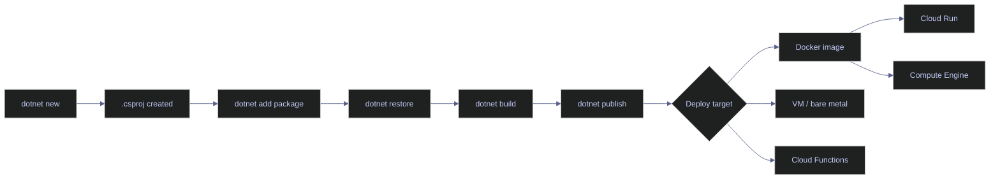
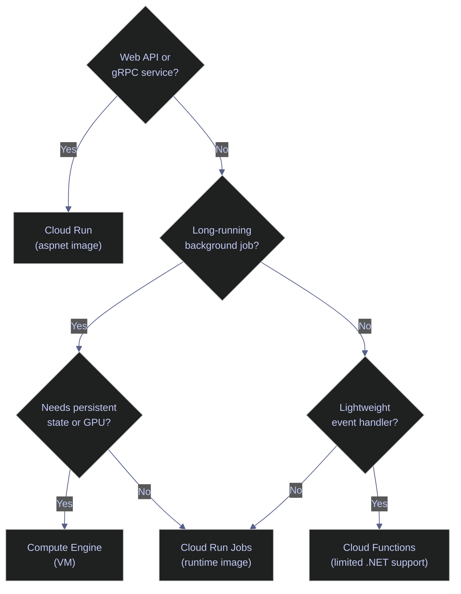

# 26. Environments & Dependency Management - C#

> [!quote]
> "Dependency management is the dark matter of software engineering — invisible but responsible for most of the catastrophic failures."
>
> — **Attributed to various DevOps practitioners**


## Why Environments Exist — isolation across projects and machines

Unlike Python, C# has better dependency isolation by default. NuGet packages are restored per-project via the `.csproj` file, so two projects on the same machine can reference different versions of `Newtonsoft.Json` without conflict. The isolation problem in .NET is about **SDK versions**, **global tools**, and **runtime versions** — not package versions.

The scenario that causes pain: your machine has .NET SDK 9.0 installed. CI has 8.0. Your project compiles locally using 9.0 features, but the CI build fails on language version mismatches. Or worse, it succeeds with subtly different behavior because the runtime resolves a different assembly version.

> [!info] C# Project Isolation by Default
>
> Unlike Python, NuGet packages in .NET are restored into a per-project `obj/`
> folder and referenced via the `.csproj` file. Two projects on the same machine
> can use different versions of the same package without conflict. The isolation
> problem in C# is about SDK VERSIONS and global tools, not package versions.

> [!danger] The Runtime Version Mismatch
>
> A project targeting `net8.0` compiles and runs correctly on a machine with
> .NET 8 SDK. Deploy it to a server with only .NET 6 runtime installed and you
> get a cryptic startup failure — no compile error, no warning, just a crash.
> Always verify the target runtime is installed on deployment targets.

> [!success] Verify the runtime before deploying
>
> Run `dotnet --list-runtimes` on the target server before deploying. For containers, pin the base image tag: `mcr.microsoft.com/dotnet/runtime:8.0` guarantees the correct runtime is present in the image.




## dotnet new — create projects and solution files

Every .NET project starts with `dotnet new`. The template creates a `.csproj` file that defines the SDK version, target framework, and dependency list. The `.csproj` file IS the environment definition.

### Project templates

The `dotnet new` command scaffolds projects from built-in templates. Each template generates a `.csproj` file with appropriate defaults for its project type.

#### dotnet new console — create a console application

Creates a new console application with a `Program.cs` entry point and a `.csproj` targeting the current LTS framework. Use this for CLI tools, background services, data pipelines, and any application that runs without a web server. The `-n` flag sets the project name and creates a matching subdirectory.

```bash
dotnet new console -n DataPipeline
```

```text
The template "Console App" was created successfully.
```

#### dotnet new classlib — create a reusable library

Creates a class library project — a DLL with no entry point. Use this for shared business logic, data access layers, or utility code that multiple applications reference. The output is a `.csproj` with no `<OutputType>` element, defaulting to `Library`.

```bash
dotnet new classlib -n DataPipeline.Core
```

#### dotnet new sln — create a solution to group projects

A solution file (`.sln`) groups multiple projects for coordinated building and IDE support. `dotnet sln add` registers each project's `.csproj` path in the solution. Visual Studio, Rider, and `dotnet build` all use the `.sln` to discover and build projects in dependency order.

```bash
dotnet new sln -n DataPipeline
dotnet sln add DataPipeline/DataPipeline.csproj
dotnet sln add DataPipeline.Core/DataPipeline.Core.csproj
```

> [!info] The .csproj File IS the Environment
>
> In Python, the environment (venv) and the dependency spec (requirements.txt)
> are separate things. In C#, the `.csproj` file IS both — it declares the SDK
> version, target framework, AND all dependencies. There is no "activate" step.
> `dotnet build` reads `.csproj`, restores packages, and compiles. The project
> file is the single source of truth.

### Project configuration and restore

Once a project is created, the `.csproj` file defines its build behavior and dependencies. Understanding its structure is the first step toward managing .NET environments.

#### Minimal .csproj structure after creation

After `dotnet new console`, the generated `.csproj` contains four key properties. `OutputType` determines whether the build produces an executable or library. `TargetFramework` selects the .NET version to compile against. `Nullable` enables nullable reference type analysis at compile time. `ImplicitUsings` auto-imports common namespaces (`System`, `System.Collections.Generic`, `System.Linq`) so `Program.cs` can omit boilerplate `using` statements.

```xml
<Project Sdk="Microsoft.NET.Sdk">
  <PropertyGroup>
    <OutputType>Exe</OutputType>
    <TargetFramework>net8.0</TargetFramework>
    <Nullable>enable</Nullable>
    <ImplicitUsings>enable</ImplicitUsings>
  </PropertyGroup>
</Project>
```

#### dotnet restore — download and cache NuGet packages

Downloads all NuGet packages declared in the `.csproj` file and caches them in the global packages directory (`~/.nuget/packages/`). Restore is idempotent — running it twice produces the same result. It runs implicitly as part of `dotnet build`, but running it explicitly in CI makes the dependency resolution step visible and independently debuggable.

```bash
dotnet restore
```

> [!warning] Never Commit bin/ and obj/
>
> The `bin/` and `obj/` directories contain build outputs and restored NuGet
> packages. They are machine-specific and regenerated by `dotnet restore` and
> `dotnet build`. Add both to `.gitignore`. The `.csproj` file is what gets
> committed — it is the reproducible specification.

> [!success] Add to .gitignore at project creation
>
> Add `bin/`, `obj/`, `*.user`, and `.vs/` to `.gitignore` immediately after `dotnet new`. Commit the `.gitignore` alongside the `.csproj` so all contributors share the same exclusions from the first commit.

#### Standard .gitignore entries for .NET projects

These entries prevent build artifacts and IDE-specific files from entering source control. `bin/` and `obj/` are regenerated by every build. `*.user` and `*.suo` contain per-developer IDE preferences. `.vs/` holds Visual Studio's workspace cache.

```text
bin/
obj/
*.user
*.suo
.vs/
```

> [!tip] VS Code and Rider Auto-Detection
>
> Both VS Code (with the C# Dev Kit extension) and JetBrains Rider
> automatically detect `.csproj` and `.sln` files in the project root.
> They run `dotnet restore` on open and provide IntelliSense for all
> referenced packages. No manual configuration needed.


## dotnet add package — install NuGet packages

NuGet is the package manager for .NET. The `dotnet add package` command modifies the `.csproj` file, adding a `<PackageReference>` element. Packages are downloaded from `nuget.org` and cached locally.

### Package installation

Adding and removing packages modifies the `.csproj` file directly. Each `dotnet add package` call inserts a `<PackageReference>` element, and `dotnet remove package` deletes it.

#### dotnet add package — add latest version

Installs the latest stable version of a package from `nuget.org` and adds a `<PackageReference>` to the `.csproj` file. NuGet resolves the version at install time — the resolved version appears in the `.csproj` and is used for all subsequent restores.

```bash
dotnet add package Dapper
```

#### dotnet add package --version — pin to an exact version

The `--version` flag pins the package to an exact version instead of resolving the latest. Use this for production applications where reproducibility matters — every restore installs exactly this version.

```bash
dotnet add package Dapper --version 2.1.28
```

#### dotnet add package — multiple packages for a data pipeline

There is no batch install command in .NET — each package is added individually. For a data engineering project, a typical dependency set includes an ORM (Dapper), validation (FluentValidation), resilience (Polly), serialization (Newtonsoft.Json or System.Text.Json), and a database driver.

```bash
dotnet add package Dapper --version 2.1.28
dotnet add package FluentValidation --version 11.9.0
dotnet add package Polly --version 8.2.1
dotnet add package Newtonsoft.Json --version 13.0.3
dotnet add package System.Data.SqlClient --version 4.8.6
```

#### dotnet remove package — remove a dependency

Removes the `<PackageReference>` entry from `.csproj`. Unlike Python's `pip uninstall`, this does not leave orphaned transitive dependencies — the next `dotnet restore` recalculates the dependency tree and only retains what is still needed.

```bash
dotnet remove package Newtonsoft.Json
```

### Version configuration and caching

NuGet supports exact pins, floating versions, and version ranges. Understanding how versions are recorded in `.csproj` determines whether restores are reproducible or drift over time.

#### PackageReference in .csproj — how dependencies are recorded

Each `dotnet add package` call creates a `<PackageReference>` element inside an `<ItemGroup>`. The `Include` attribute is the package ID on nuget.org, and `Version` is the pinned version string. Only direct dependencies appear here — transitive dependencies are resolved at restore time and recorded in `obj/project.assets.json`.

```xml
<ItemGroup>
  <PackageReference Include="Dapper" Version="2.1.28" />
  <PackageReference Include="FluentValidation" Version="11.9.0" />
  <PackageReference Include="Polly" Version="8.2.1" />
</ItemGroup>
```

> [!info] Transitive Dependencies in .NET
>
> When you install `Polly`, NuGet also resolves Polly's own dependencies.
> These transitive dependencies are recorded in `obj/project.assets.json`
> but NOT in your `.csproj` — only your DIRECT dependencies appear there.
> Run `dotnet list package --include-transitive` to see the full tree.

#### Version ranges in .csproj — flexible version constraints

NuGet supports three version specification styles. Exact versions (`2.1.28`) are deterministic and recommended for applications. Floating versions (`2.1.*`) resolve to the latest matching patch at restore time — useful for library development where you want to test against the newest patch. Range notation uses brackets and parentheses: `[` means inclusive, `)` means exclusive.

```xml
<!-- Exact version (recommended for applications) -->
<PackageReference Include="Dapper" Version="2.1.28" />

<!-- Floating patch version (library development) -->
<PackageReference Include="Dapper" Version="2.1.*" />

<!-- Range: >= 2.0.0 and < 3.0.0 -->
<PackageReference Include="Dapper" Version="[2.0.0,3.0.0)" />
```

> [!warning] Floating Versions in Applications
>
> Floating versions like `2.1.*` are acceptable for library development
> where you want to test against the latest patch. For applications deployed
> to production, ALWAYS pin exact versions. A floating version means two
> restores a week apart can produce different dependency trees — and different
> runtime behavior.

> [!success] Pin exact versions in production .csproj
>
> Use `<PackageReference Include="Dapper" Version="2.1.28" />` (no wildcard). To find the latest stable version before pinning, run `dotnet add package Dapper` once, then copy the resolved version from `dotnet list package` into the `.csproj`.

#### NuGet cache location — where packages are stored on disk

NuGet maintains several caches: the global packages directory (`~/.nuget/packages/`), an HTTP response cache, a temp directory for extraction, and a plugins cache. The `dotnet nuget locals` command reveals the absolute path of each cache on the current machine.

```bash
dotnet nuget locals all --list
```

```
http-cache: C:\Users\aperi\AppData\Local\NuGet\v3-cache
global-packages: C:\Users\aperi\.nuget\packages
temp: C:\Users\aperi\AppData\Local\Temp\NuGetScratch
plugins-cache: C:\Users\aperi\AppData\Local\NuGet\plugins-cache
```

> [!tip] NuGet Global Cache Is Shared
>
> Unlike Python's per-venv `site-packages`, NuGet caches packages globally
> at `~/.nuget/packages/`. When two projects reference `Dapper 2.1.28`,
> the package is downloaded once. This saves disk space and speeds up
> restores — but it means `dotnet nuget locals all --clear` affects ALL
> projects on the machine.


## Pinning and Locking Dependencies — deterministic restores

By default, `.csproj` pins direct dependency versions. But transitive dependencies are resolved at restore time — meaning different machines can get different versions of transitive packages. Lock files close this gap.

### Package auditing

Before enabling lock files, inspect what is currently installed. These commands reveal direct and transitive dependencies and flag packages with newer versions available.

#### dotnet list package — show all packages and versions

Lists all direct `<PackageReference>` entries from the `.csproj` with their requested and resolved versions. The "Requested" column shows what the `.csproj` specifies; "Resolved" shows what NuGet actually installed after version resolution. When these differ, a floating version or range is in use.

```bash
dotnet list package
```

```
Project 'DataPipeline' has the following package references
   [net8.0]:
   Top-level Package      Requested   Resolved
   > Dapper               2.1.28      2.1.28
   > FluentValidation     11.9.0      11.9.0
   > Polly                8.2.1       8.2.1
```

#### dotnet list package --outdated — find packages with newer versions

Queries nuget.org for each direct dependency and shows packages where a newer stable version exists. The "Latest" column shows the newest available version. Use this before a dependency update cycle to identify what needs attention.

```bash
dotnet list package --outdated
```

```
   [net8.0]:
   Top-level Package      Requested   Resolved   Latest
   > Dapper               2.1.28      2.1.28     2.1.35
   > Polly                8.2.1       8.2.1      8.3.0
```

### Lock file configuration

Lock files record the exact resolved version of every package — direct and transitive — so that restores are deterministic across machines and time.

#### Enable NuGet lock files — opt-in via .csproj property

Adding this property to the `.csproj` causes `dotnet restore` to generate a `packages.lock.json` file alongside the project. This file records every resolved package version, including transitives, with content hashes for integrity verification. Commit the lock file to source control.

```xml
<PropertyGroup>
  <RestorePackagesWithLockFile>true</RestorePackagesWithLockFile>
</PropertyGroup>
```

> [!info] NuGet Lock Files Are Opt-In
>
> Unlike npm's `package-lock.json` (created by default), NuGet lock files
> require explicit opt-in. Without them, `dotnet restore` resolves "latest
> matching version" each time — two restores a week apart can produce
> different dependency trees. For production, enable lock files and restore
> with `--locked-mode` in CI.

#### dotnet restore --locked-mode — fail if lock file is out of date

In locked mode, `dotnet restore` refuses to update the lock file. If the `.csproj` has changed (a package was added or version bumped) but the lock file was not regenerated, restore fails with an error instead of silently updating. This is the CI-safe mode — it catches lock file drift as a build failure rather than a runtime surprise.

```bash
dotnet restore --locked-mode
```

> [!danger] Without --locked-mode, CI Restores Are Non-Deterministic
>
> Even with a lock file committed to Git, `dotnet restore` without
> `--locked-mode` will silently UPDATE the lock file if `.csproj` changed.
> In CI, this means the build uses different transitive versions than
> what was tested locally. Always pass `--locked-mode` in CI pipelines
> to catch lock file drift as a build failure, not a runtime surprise.

> [!success] Enable lock files and enforce them in CI
>
> Add `<RestorePackagesWithLockFile>true</RestorePackagesWithLockFile>` to the `<PropertyGroup>` in `.csproj`, commit the generated `packages.lock.json`, then use `dotnet restore --locked-mode` in all CI pipeline steps.

#### packages.lock.json — what the lock file looks like

The lock file is a JSON document keyed by target framework. Each entry records the package type (`Direct` or `Transitive`), the requested version constraint, the resolved version, and a content hash for integrity verification. Direct dependencies show both `requested` and `resolved`; transitive dependencies show only `resolved`.

```json
{
  "version": 1,
  "dependencies": {
    "net8.0": {
      "Dapper": {
        "type": "Direct",
        "requested": "[2.1.28, )",
        "resolved": "2.1.28",
        "contentHash": "sLbr+EBPcM..."
      },
      "System.Data.SqlClient": {
        "type": "Transitive",
        "resolved": "4.8.6",
        "contentHash": "..."
      }
    }
  }
}
```


## dotnet add/remove — upgrade and manage packages

Package maintenance is an ongoing activity. Dependencies accumulate security patches, bug fixes, and breaking changes. Regular audits prevent dependency rot.

### Package updates

Upgrading a package reuses the same `dotnet add package` command — NuGet replaces the existing `<PackageReference>` version. There is no separate "upgrade" command.

#### dotnet add package --version — upgrade to a specific version

To upgrade a package, run `dotnet add package` with the new `--version`. NuGet overwrites the existing version in the `.csproj`. The old version is removed from the dependency tree on the next restore — no manual cleanup needed.

```bash
dotnet add package Polly --version 8.3.0
```

#### dotnet outdated — third-party tool for solution-wide audit

`dotnet-outdated-tool` is a global .NET tool that scans an entire solution for outdated packages in a single pass. It color-codes results by severity (major, minor, patch) and can auto-update with `--upgrade`. Install it once as a global tool and run it from the solution root.

```bash
dotnet tool install --global dotnet-outdated-tool
dotnet outdated
```

```
DataPipeline.csproj
  Dapper          2.1.28  ->  2.1.35  (patch)
  Polly           8.2.1   ->  8.3.0   (minor)
```

> [!tip] dotnet outdated vs dotnet list package --outdated
>
> `dotnet list package --outdated` is built-in but only works on one project
> at a time. `dotnet-outdated-tool` scans the ENTIRE solution, color-codes
> major/minor/patch updates, and can auto-update with `dotnet outdated --upgrade`.
> For solutions with 5+ projects, the third-party tool saves significant time.

### Cache and centralized management

NuGet's global cache speeds up restores but can cause stale state. For large solutions, Central Package Management (CPM) eliminates version skew across projects.

#### dotnet nuget locals all --clear — purge the NuGet cache

Deletes all cached packages, HTTP responses, and temp files across every NuGet cache directory. Use this as a troubleshooting step when restore produces corrupt or stale results — not as routine maintenance, since the next restore for any project on the machine will re-download everything.

```bash
dotnet nuget locals all --clear
```

> [!warning] Clearing NuGet Cache Affects All Projects
>
> `dotnet nuget locals all --clear` deletes cached packages for EVERY project
> on the machine. The next `dotnet restore` for any project will re-download
> everything. Use this as a troubleshooting step, not routine maintenance.

> [!success] Use targeted cache clearing when possible
>
> To clear only the temp or http cache without removing all downloaded packages, use `dotnet nuget locals http-cache --clear` or `dotnet nuget locals temp --clear`. Reserve `all --clear` for cases where restore is producing genuinely corrupt results.

#### Central Package Management — Directory.Packages.props

For solutions with many projects sharing the same dependencies, Central Package Management (CPM) consolidates version declarations into a single file.

```xml
<!-- Directory.Packages.props — in the solution root -->
<Project>
  <PropertyGroup>
    <ManagePackageVersionsCentrally>true</ManagePackageVersionsCentrally>
  </PropertyGroup>
  <ItemGroup>
    <PackageVersion Include="Dapper" Version="2.1.28" />
    <PackageVersion Include="FluentValidation" Version="11.9.0" />
    <PackageVersion Include="Polly" Version="8.2.1" />
    <PackageVersion Include="Newtonsoft.Json" Version="13.0.3" />
  </ItemGroup>
</Project>
```

```xml
<!-- Individual .csproj — no Version attribute needed -->
<ItemGroup>
  <PackageReference Include="Dapper" />
  <PackageReference Include="Polly" />
</ItemGroup>
```

> [!tip] Central Package Management for Monorepos
>
> When a solution has 10+ projects, each pinning its own version of
> `Newtonsoft.Json`, upgrading means editing 10 files. With CPM, you edit
> `Directory.Packages.props` once. Every project in the solution picks up
> the new version on the next restore. This eliminates version skew between
> projects in the same repository.

### dotnet tool | local and global CLI tools

.NET supports installing CLI tools as NuGet packages. Global tools are installed machine-wide and available in any directory. Local tools are declared in a `dotnet-tools.json` manifest file committed to the repository — `dotnet tool restore` installs them, making the toolset reproducible across machines.

#### Install and manage global tools

Global tools install to `~/.dotnet/tools/` and are available system-wide. Use these for utilities you want available everywhere (formatters, analyzers, outdated-package checkers).

```bash
dotnet tool install --global dotnet-format
dotnet tool list --global
dotnet tool update --global dotnet-format
dotnet tool uninstall --global dotnet-format
```

#### Create and restore local tool manifests

Local tools are scoped to a repository. The manifest file (`dotnet-tools.json`) records exact tool versions so all contributors use the same tooling. Run `dotnet tool restore` in CI to install them.

```bash
dotnet new tool-manifest
dotnet tool install dotnet-format
dotnet tool restore
```

```json
{
  "version": 1,
  "isRoot": true,
  "tools": {
    "dotnet-format": {
      "version": "5.1.250801",
      "commands": ["dotnet-format"]
    }
  }
}
```

> [!tip] Local Tool Manifests for CI Reproducibility
>
> Commit `.config/dotnet-tools.json` to the repository and run
> `dotnet tool restore` in CI before any tool-dependent steps. This
> ensures CI uses the same tool versions as local development —
> no "works on my machine" for formatters or analyzers.

### Private NuGet feeds — nuget.config

Enterprise environments often host internal packages on private feeds (Azure DevOps Artifacts, GCP Artifact Registry, GitHub Packages). A `nuget.config` file in the repository root configures additional package sources beyond the public `nuget.org`.

#### Configure a private NuGet feed

The `nuget.config` file declares package sources. `dotnet restore` queries all configured sources in order. Credentials can be stored in the config file (for CI) or managed via credential providers.

```xml
<?xml version="1.0" encoding="utf-8"?>
<configuration>
  <packageSources>
    <add key="nuget.org" value="https://api.nuget.org/v3/index.json" />
    <add key="internal" value="https://pkgs.dev.azure.com/org/_packaging/feed/nuget/v3/index.json" />
  </packageSources>
  <packageSourceCredentials>
    <internal>
      <add key="Username" value="PAT" />
      <add key="ClearTextPassword" value="%NUGET_PAT%" />
    </internal>
  </packageSourceCredentials>
</configuration>
```

> [!danger] Don't Commit Credentials in nuget.config
>
> Never hardcode tokens or passwords in `nuget.config`. Use environment
> variable substitution (`%NUGET_PAT%` on Windows, `${NUGET_PAT}` in
> CI) or configure credentials via `dotnet nuget update source` on each
> machine. In CI, inject the PAT as a secret environment variable.

> [!success] Use environment variables for feed credentials
>
> Store the PAT in a CI secret (e.g., `NUGET_PAT` in GitHub Actions) and reference it with `%NUGET_PAT%` in `nuget.config`. The config file is safe to commit — no credential is embedded. Each developer and CI runner provides the token via their own environment.


## dotnet --info — inspect the environment

When something fails, the first question is always "which SDK, which runtime, which packages?" These commands answer that.

### SDK and runtime inspection

These commands reveal which SDK, runtimes, and architecture the current environment is using. Run them from the project directory — if a `global.json` exists, the output reflects the resolved SDK after lookup.

#### dotnet --info — full SDK and runtime information

Prints the active SDK version, all installed SDKs and runtimes, the operating system, and the runtime identifier (RID). This is the single most useful diagnostic command — it answers "what is my environment actually using?" in one output.

```bash
dotnet --info
```

```
.NET SDK:
 Version:           8.0.300
 Commit:            abcdef1234
 Workload version:  8.0.300-manifests.abcdef12

Runtime Environment:
 OS Name:     Windows
 OS Version:  10.0.26200
 OS Platform: Windows
 RID:         win-x64

.NET SDKs installed:
  8.0.300 [C:\Program Files\dotnet\sdk]
  9.0.100 [C:\Program Files\dotnet\sdk]

.NET runtimes installed:
  Microsoft.NETCore.App 8.0.8 [...]
  Microsoft.NETCore.App 9.0.0 [...]
```

#### dotnet --list-sdks — all installed SDKs

Lists every .NET SDK installed on the machine with its version and installation path. Multiple SDKs can coexist — `global.json` determines which one a given project uses.

```bash
dotnet --list-sdks
```

```
8.0.300 [C:\Program Files\dotnet\sdk]
9.0.100 [C:\Program Files\dotnet\sdk]
```

#### dotnet --list-runtimes — all installed runtimes

Lists every .NET runtime installed on the machine. Multiple runtime types exist: `Microsoft.NETCore.App` (core runtime for all .NET apps), `Microsoft.AspNetCore.App` (adds web server support), and `Microsoft.WindowsDesktop.App` (adds WPF/WinForms). A deployed application needs the matching runtime type and version on the target machine.

```bash
dotnet --list-runtimes
```

```
Microsoft.AspNetCore.App 8.0.8 [C:\Program Files\dotnet\shared\Microsoft.AspNetCore.App]
Microsoft.NETCore.App 8.0.8 [C:\Program Files\dotnet\shared\Microsoft.NETCore.App]
Microsoft.NETCore.App 9.0.0 [C:\Program Files\dotnet\shared\Microsoft.NETCore.App]
```

### Package and cache inspection

Beyond SDK versions, you often need to inspect what packages are installed and where NuGet is caching them.

#### dotnet list package --include-transitive — full dependency tree

Shows both direct dependencies (from `.csproj`) and transitive dependencies (pulled in by your direct dependencies). This reveals the full set of assemblies that ship with your application. Use it to audit for unexpected or vulnerable transitive packages.

```bash
dotnet list package --include-transitive
```

```
   [net8.0]:
   Top-level Package          Requested   Resolved
   > Dapper                   2.1.28      2.1.28
   > Polly                    8.2.1       8.2.1

   Transitive Package                     Resolved
   > Microsoft.Extensions.DependencyInjection.Abstractions   8.0.0
   > System.Diagnostics.DiagnosticSource                     8.0.0
```

> [!question] Which SDK Is My Build Actually Using?
>
> Run `dotnet --info` in the project directory — NOT the home directory.
> If a `global.json` exists in the project or any parent directory, it
> overrides the default SDK. The output of `dotnet --info` reflects the
> resolved SDK after `global.json` lookup. If the pinned SDK version
> isn't installed, you'll get an error — not a silent fallback.

#### dotnet nuget locals all --list — show cache locations

Prints the absolute path of each NuGet cache directory on the current machine. Useful for verifying where packages are being resolved from, especially when troubleshooting restore issues or auditing disk usage.

```bash
dotnet nuget locals all --list
```


## The .csproj Lifecycle — from creation to publication

The `.csproj` file is the single artifact that defines a .NET project's identity, dependencies, build settings, and target framework. Understanding its structure is essential for managing environments.

### Project file structure

The `.csproj` XML is divided into `<PropertyGroup>` elements (project-level settings) and `<ItemGroup>` elements (collections of references). Understanding these sections is essential for managing environments across projects.

#### Full .csproj for a data engineering project

A production-ready `.csproj` combines framework targeting, nullable analysis, implicit usings, lock file support, and pinned package references into a single declarative file. This file is the complete environment specification — no separate manifest or lock activation step is needed beyond the property flag.

```xml
<Project Sdk="Microsoft.NET.Sdk">
  <PropertyGroup>
    <OutputType>Exe</OutputType>
    <TargetFramework>net8.0</TargetFramework>
    <Nullable>enable</Nullable>
    <ImplicitUsings>enable</ImplicitUsings>
    <RestorePackagesWithLockFile>true</RestorePackagesWithLockFile>
  </PropertyGroup>
  <ItemGroup>
    <PackageReference Include="Dapper" Version="2.1.28" />
    <PackageReference Include="FluentValidation" Version="11.9.0" />
    <PackageReference Include="Polly" Version="8.2.1" />
    <PackageReference Include="Newtonsoft.Json" Version="13.0.3" />
    <PackageReference Include="System.Data.SqlClient" Version="4.8.6" />
  </ItemGroup>
</Project>
```

> [!info] PropertyGroup vs ItemGroup
>
> `<PropertyGroup>` contains project-level settings: target framework,
> output type, nullable context, etc. `<ItemGroup>` contains collections:
> package references, project references, file includes. A `.csproj` can
> have multiple of each — commonly one `PropertyGroup` for settings and
> one `ItemGroup` for NuGet packages, another for project references.

#### TargetFramework — which .NET version to compile against

The `<TargetFramework>` element determines which .NET version the compiler targets. It controls available APIs, language features, and the runtime required to execute the output. Multi-targeting with `<TargetFrameworks>` (plural) compiles the project once per listed framework, producing separate output assemblies — this is for NuGet libraries, not applications.

```xml
<!-- Single target -->
<TargetFramework>net8.0</TargetFramework>

<!-- Multi-targeting (libraries that support multiple runtimes) -->
<TargetFrameworks>net8.0;net9.0</TargetFrameworks>
```

> [!warning] TargetFramework vs TargetFrameworks
>
> Note the plural `s`. `<TargetFramework>` (singular) targets one runtime.
> `<TargetFrameworks>` (plural) multi-targets — the project compiles once
> per framework, producing separate outputs. Using the wrong one silently
> ignores additional frameworks. Multi-targeting is for libraries; applications
> should target a single framework.

> [!success] Use singular TargetFramework for applications
>
> Application projects should always use `<TargetFramework>net8.0</TargetFramework>` (singular). Reserve `<TargetFrameworks>net8.0;net9.0</TargetFrameworks>` for NuGet library packages that must support multiple runtime versions.

### Build and publish

Building compiles source code into assemblies. Publishing produces deployment-ready output by copying the compiled assemblies, dependencies, and optionally the .NET runtime into a single output directory.

#### dotnet build — compile the project

Compiles the project and its dependencies into assemblies in the `bin/` directory. Debug mode (default) includes debug symbols and disables optimizations for easier debugging. Release mode enables compiler optimizations and strips debug information for production performance.

```bash
dotnet build
dotnet build -c Release
```

#### dotnet publish — produce deployment-ready output

Produces a deployment-ready directory containing the compiled application, all NuGet dependencies as DLLs, and configuration files. The `-o` flag sets the output directory. Framework-dependent publish (default) produces a small output (~5 MB) but requires the .NET runtime on the target machine. Self-contained publish bundles the runtime into the output (~80 MB) for targets without .NET installed.

```bash
dotnet publish -c Release -o ./publish
```

```bash
dotnet publish -c Release -o ./publish --self-contained
```

> [!tip] Framework-Dependent vs Self-Contained
>
> Framework-dependent publish (default) produces a small output but requires
> .NET runtime on the target machine. Self-contained publish includes the
> runtime — the output is 60-80 MB larger but runs anywhere without .NET
> installed. For Docker containers, use framework-dependent (the base image
> has the runtime). For bare VM deployment, self-contained is safer.

#### Directory.Build.props — shared properties across projects

MSBuild automatically imports `Directory.Build.props` from the current directory and all parent directories. Place it in the solution root to apply common settings (target framework, nullable context, warnings-as-errors) to every project without duplicating configuration. Individual `.csproj` files can still override any property.

```xml
<Project>
  <PropertyGroup>
    <TargetFramework>net8.0</TargetFramework>
    <Nullable>enable</Nullable>
    <ImplicitUsings>enable</ImplicitUsings>
    <TreatWarningsAsErrors>true</TreatWarningsAsErrors>
  </PropertyGroup>
</Project>
```

> [!info] Directory.Build.props Auto-Import
>
> MSBuild automatically imports `Directory.Build.props` from the current
> directory and all parent directories. Place it in the solution root to
> apply settings to every project. Individual `.csproj` files can still
> override properties. This is distinct from `Directory.Packages.props`
> (Central Package Management) — `.Build.props` handles build settings,
> `.Packages.props` handles dependency versions.

### Multi-project solutions

When a solution has multiple projects that depend on each other, `<ProjectReference>` links them at build time. MSBuild builds projects in dependency order automatically.

#### Project references — multi-project solutions

A `<ProjectReference>` element tells MSBuild that this project depends on another project in the same solution. The referenced project is compiled first, and its output assembly is added to this project's references. Use relative paths to the referenced `.csproj` file.

```xml
<ItemGroup>
  <ProjectReference Include="..\DataPipeline.Core\DataPipeline.Core.csproj" />
</ItemGroup>
```

```bash
dotnet build DataPipeline.sln
```


## global.json — pin the .NET SDK version per repository

Without a `global.json`, `dotnet build` uses whatever SDK is installed on the machine. This leads to "works on my machine" failures when developers have different SDK versions.

### Creation and structure

A `global.json` file pins the SDK version for a repository. Place it in the repo root and commit it — all contributors and CI will use the same SDK band.

#### dotnet new globaljson — create a global.json file

Generates a `global.json` file in the current directory with the specified SDK version. The `--sdk-version` flag sets the version to pin, and the default `rollForward` policy is `latestPatch` unless overridden.

```bash
dotnet new globaljson --sdk-version 8.0.300
```

#### global.json structure — SDK version and rollforward policy

The file has a single `sdk` object with two properties. `version` specifies the base SDK version to use. `rollForward` controls how much version flexibility is allowed when the exact version is not installed.

```json
{
  "sdk": {
    "version": "8.0.300",
    "rollForward": "latestPatch"
  }
}
```

> [!warning] Without global.json, SDK Version Floats
>
> Without a `global.json`, `dotnet build` uses whatever SDK is installed —
> which may be 9.0 on your machine and 8.0 in CI. This causes subtle build
> differences and "works on my machine" failures. Always create a `global.json`
> in the repo root to pin the SDK version for all contributors.

> [!success] Create global.json at repository initialization
>
> Run `dotnet new globaljson --sdk-version 8.0.300 --roll-forward latestPatch` in the repo root and commit the resulting file alongside the solution. CI and all contributors will use the same SDK band automatically.

### Version resolution policies

The `rollForward` policy determines how .NET resolves the SDK when the exact pinned version is not installed. Choosing the right policy balances stability against flexibility.

#### rollForward policies — control version resolution

Each policy level allows progressively more version flexibility. `disable` requires an exact match. `latestPatch` (recommended) allows security and bug-fix patches within the same feature band. `latestMajor` effectively disables pinning.

| Policy | Behavior |
|---|---|
| `disable` | Exact match only — fails if 8.0.300 not installed |
| `patch` | Latest patch of 8.0.3xx |
| `latestPatch` | Latest patch of 8.0.3xx (recommended) |
| `feature` | Latest feature band of 8.0.xxx |
| `latestFeature` | Latest feature band of 8.0.xxx |
| `minor` | Latest minor of 8.x.xxx |
| `latestMinor` | Latest minor of 8.x.xxx |
| `major` | Any installed SDK (effectively disables pinning) |
| `latestMajor` | Latest installed SDK |

> [!tip] Use latestPatch for Most Projects
>
> `latestPatch` is the sweet spot: it pins the major.minor.feature band
> (8.0.3xx) but allows patch updates (8.0.301, 8.0.302). Patches contain
> security fixes and bug fixes — never breaking changes. This gives you
> security updates without risking feature-level differences.

#### SDK resolution order — how .NET finds global.json

> [!info] SDK resolution order
> .NET searches **up** the directory tree for `global.json`, starting from the current directory:
> 1. `/repo/src/MyProject/` — current dir
> 2. `/repo/src/` — parent
> 3. `/repo/` — usually where it lives
> 4. `/` — stops here
>
> The first `global.json` found wins.

> [!question] Why Does My Build Use the Wrong SDK?
>
> If `dotnet --info` shows a different SDK than your `global.json` specifies,
> check for a `global.json` in a PARENT directory. .NET uses the FIRST one
> it finds walking up the tree. A stale `global.json` in your home directory
> or a parent folder silently overrides the project-level one.


## Dockerfile multi-stage — build and deploy .NET in containers

Docker is the standard way to deploy .NET applications. Multi-stage builds separate the build environment (SDK image) from the runtime environment (runtime image), reducing the final image size by 85%.

### Single-project builds

The standard .NET Docker pattern uses two stages: an SDK image for compilation and a runtime image for execution. The SDK image (~1.5 GB) contains compilers and build tools. The runtime image (~200 MB) contains only what is needed to run the application.

#### Multi-stage Dockerfile for a .NET data pipeline

Stage 1 uses the SDK image to restore packages and compile the project. The `.csproj` is copied first so the restore layer is cached independently of source code changes. Stage 2 copies only the published output into the runtime image — no compiler, no source code, no build artifacts reach production.

```dockerfile
FROM mcr.microsoft.com/dotnet/sdk:8.0 AS build
WORKDIR /src
COPY *.csproj .
RUN dotnet restore
COPY . .
RUN dotnet publish -c Release -o /app
```

```dockerfile
FROM mcr.microsoft.com/dotnet/runtime:8.0
WORKDIR /app
COPY --from=build /app .
ENTRYPOINT ["dotnet", "DataPipeline.dll"]
```

> [!tip] Multi-Stage Builds Reduce Image Size by 85%
>
> The SDK image (1.5 GB) contains compilers and build tools. The runtime
> image (200 MB) contains only what's needed to RUN the app. Multi-stage
> builds compile in the SDK stage and copy only the published output to
> the runtime stage. Your production container has no compiler, no source
> code, no build artifacts — just the published DLLs and the runtime.

> [!danger] COPY . . Before dotnet restore Breaks Layer Caching
>
> If you `COPY . .` before `dotnet restore`, Docker invalidates the restore
> cache every time ANY source file changes — even a one-line fix. Always
> copy `*.csproj` first, restore, THEN copy source code. This way the
> restore layer is cached unless dependencies actually change. For solutions
> with multiple projects, copy all `.csproj` files before restoring.

> [!success] Copy .csproj files first, then restore, then source
>
> Structure the Dockerfile as: `COPY *.csproj .` → `RUN dotnet restore` → `COPY . .` → `RUN dotnet publish`. The restore layer rebuilds only when `.csproj` changes, keeping average build times under 30 seconds for unchanged dependencies.

### Multi-project and ASP.NET builds

Solutions with multiple projects require copying all `.csproj` files before restore to maintain layer caching. ASP.NET applications need a different base image that includes the web server runtime.

#### Multi-project Dockerfile — solution with multiple projects

For solutions with project references, copy the `.sln` file and every `.csproj` into the correct subdirectory structure before running restore. This preserves the Docker layer cache — the restore layer is only invalidated when a `.csproj` changes, not on every source edit. The publish command targets the specific entry-point project.

```dockerfile
FROM mcr.microsoft.com/dotnet/sdk:8.0 AS build
WORKDIR /src
COPY *.sln .
COPY DataPipeline/*.csproj DataPipeline/
COPY DataPipeline.Core/*.csproj DataPipeline.Core/
RUN dotnet restore
COPY . .
RUN dotnet publish DataPipeline/DataPipeline.csproj \
    -c Release -o /app
```

```dockerfile
FROM mcr.microsoft.com/dotnet/runtime:8.0
WORKDIR /app
COPY --from=build /app .
ENTRYPOINT ["dotnet", "DataPipeline.dll"]
```

#### ASP.NET Core — use the aspnet base image

For web APIs and gRPC services, the runtime stage must use the `aspnet` base image instead of `runtime`. The `aspnet` image includes the ASP.NET Core runtime (Kestrel web server, middleware pipeline, routing). Using the plain `runtime` image for a web app causes a missing assembly error at startup.

```dockerfile
FROM mcr.microsoft.com/dotnet/aspnet:8.0
WORKDIR /app
COPY --from=build /app .
ENTRYPOINT ["dotnet", "DataPipeline.Api.dll"]
```

> [!warning] runtime vs aspnet Base Images
>
> `mcr.microsoft.com/dotnet/runtime:8.0` runs console apps and background
> services. `mcr.microsoft.com/dotnet/aspnet:8.0` adds the ASP.NET Core
> runtime for web APIs and gRPC services. Using `runtime` for a web app
> fails at startup with a missing assembly error. Using `aspnet` for a
> console app works but wastes 50 MB on unused web components.

> [!success] Match the base image to the project type
>
> Console apps and background services: `mcr.microsoft.com/dotnet/runtime:8.0`. Web APIs and gRPC services: `mcr.microsoft.com/dotnet/aspnet:8.0`. If unsure, check the project SDK — `Microsoft.NET.Sdk.Web` needs the `aspnet` image; `Microsoft.NET.Sdk` needs `runtime`.

#### .dockerignore — keep the build context clean

A `.dockerignore` file excludes files from the Docker build context, reducing the context size sent to the Docker daemon and preventing build artifacts from leaking into the image. Without it, `COPY . .` sends everything — including `bin/`, `obj/`, and IDE files — into the build.

```text
bin/
obj/
.vs/
*.user
*.suo
```


## GitHub Actions — .NET environments in CI/CD

GitHub Actions provides `actions/setup-dotnet` to install the .NET SDK. Combined with NuGet caching, builds complete in seconds after the first run.

### Build and test workflows

The core CI pattern installs the SDK with `actions/setup-dotnet`, restores in locked mode, builds, and tests — each step reusing the output of the previous step via `--no-restore` and `--no-build` flags.

#### Basic .NET CI workflow

This workflow runs on every push and pull request. It installs the .NET SDK, restores packages in locked mode (failing if the lock file drifts), builds without redundant restore, and runs tests without redundant build. Each step is isolated so failures are easy to diagnose.

```yaml
name: .NET CI

on: [push, pull_request]

jobs:
  build:
    runs-on: ubuntu-latest
    steps:
      - uses: actions/checkout@v4

      - uses: actions/setup-dotnet@v4
        with:
          dotnet-version: '8.0.x'

      - run: dotnet restore --locked-mode
      - run: dotnet build --no-restore
      - run: dotnet test --no-build --verbosity normal
```

> [!tip] Cache NuGet Packages in CI
>
> ```yaml
> - uses: actions/cache@v4
>   with:
>     path: ~/.nuget/packages
>     key: nuget-${{ hashFiles('**/*.csproj') }}
> ```
> This caches the NuGet global packages directory between runs. When
> `.csproj` files haven't changed, restore skips downloads entirely.
> Build times drop from minutes to seconds for large dependency trees.

### Docker deployment in CI

Building and pushing Docker images in CI completes the pipeline from source code to deployed container. The image tag uses the git SHA for traceability.

#### CI with Docker build and push

This workflow authenticates to Google Container Registry using a service account key stored in GitHub secrets, builds the Docker image with the multi-stage Dockerfile, and pushes it tagged with the commit SHA. The SHA tag ensures every deployment is traceable to an exact commit.

```yaml
jobs:
  docker:
    runs-on: ubuntu-latest
    steps:
      - uses: actions/checkout@v4

      - uses: docker/login-action@v3
        with:
          registry: gcr.io
          username: _json_key
          password: ${{ secrets.GCP_SA_KEY }}

      - uses: docker/build-push-action@v5
        with:
          push: true
          tags: gcr.io/${{ secrets.GCP_PROJECT }}/data-pipeline:${{ github.sha }}
```

> [!info] --no-restore and --no-build Flags
>
> Each `dotnet` command (restore, build, test, publish) implicitly runs
> the preceding steps. `dotnet test` will restore AND build before testing.
> In CI, use `--no-restore` and `--no-build` to prevent redundant work:
> restore once, build once (reusing restore), test once (reusing build).
> This cuts CI time and makes failures easier to diagnose — you know
> exactly which step failed.

#### Matrix builds — test across multiple .NET versions

Matrix strategies run the same workflow steps against multiple SDK versions in parallel. This is useful for libraries that must support multiple .NET runtimes. For application projects with a single target framework, a matrix is unnecessary — pin to one version.

```yaml
strategy:
  matrix:
    dotnet-version: ['8.0.x', '9.0.x']

steps:
  - uses: actions/setup-dotnet@v4
    with:
      dotnet-version: ${{ matrix.dotnet-version }}
  - run: dotnet build
  - run: dotnet test
```

> [!warning] global.json and setup-dotnet Conflict
>
> If your repo has a `global.json` pinning SDK 8.0.300, but your CI matrix
> installs 9.0.x, the build uses 8.0.300 anyway — `global.json` takes
> precedence. For matrix testing across SDKs, either remove `global.json`
> from the repo or use a CI step that overwrites it per matrix entry.

> [!success] Align global.json with setup-dotnet version
>
> In a standard (non-matrix) CI pipeline, set `dotnet-version: '8.0.x'` in `actions/setup-dotnet` and set `"rollForward": "latestPatch"` in `global.json`. Both resolve to the same SDK band, eliminating the conflict without needing to remove `global.json`.


## GCP deployment — .NET on Google Cloud Platform

GCP supports .NET on Compute Engine (VMs), Cloud Run (containers), and Cloud Functions (limited). The deployment pattern depends on the target service.



### VM deployment

Compute Engine VMs are standard Linux or Windows machines — the environment setup is identical to any server, with the .NET runtime installed via the OS package manager.

#### Compute Engine — deploy to a VM

Install the .NET runtime on the target VM using `apt-get`, copy the published output with `gcloud compute scp`, and run the application with `dotnet`. For locked-down VMs where installing the runtime is not an option, use self-contained publish (`--self-contained -r linux-x64`) to bundle the runtime into the deployment artifact.

```bash
sudo apt-get update
sudo apt-get install -y dotnet-runtime-8.0
gcloud compute scp ./publish/* my-vm:/opt/data-pipeline/ \
    --zone=us-central1-a
dotnet /opt/data-pipeline/DataPipeline.dll
```

> [!tip] Self-Contained Publish for VMs Without .NET Installed
>
> If installing the .NET runtime on the VM is not an option (locked-down
> image, compliance restrictions), publish self-contained:
> `dotnet publish -c Release --self-contained -r linux-x64`.
> The output includes the .NET runtime — no installation required on the
> target machine. The trade-off is a larger deployment artifact (~80 MB).

### Container deployment

Cloud Run is the natural fit for .NET on GCP — it runs your standard Docker image with no framework-specific adapter, auto-scales to zero, and supports environment variables and Secret Manager integration.

#### Cloud Run — deploy a containerized .NET app

`gcloud builds submit` builds the Docker image using Cloud Build (GCP's hosted Docker build service) and pushes it to Container Registry. `gcloud run deploy` creates or updates a Cloud Run service pointing at that image. Environment variables and secrets are injected at deploy time, not baked into the image.

```bash
gcloud builds submit --tag gcr.io/my-project/data-pipeline
gcloud run deploy data-pipeline \
    --image gcr.io/my-project/data-pipeline \
    --platform managed \
    --region us-central1 \
    --memory 512Mi \
    --set-env-vars "DB_CONNECTION=Server=..."
```

#### Cloud Run with environment variables

Environment variables are set with `--set-env-vars` (comma-separated key=value pairs) for non-sensitive configuration. For secrets like database passwords, `--set-secrets` references GCP Secret Manager entries — the secret value is injected as an environment variable at container startup without appearing in the image or deploy command history. In .NET, `IConfiguration` reads environment variables automatically, overriding `appsettings.json` values.

```bash
gcloud run deploy data-pipeline \
    --image gcr.io/my-project/data-pipeline \
    --set-env-vars "ENV=production,LOG_LEVEL=Warning"
gcloud run deploy data-pipeline \
    --image gcr.io/my-project/data-pipeline \
    --set-secrets "DB_PASSWORD=db-password:latest"
```

> [!danger] Don't Bake Connection Strings Into Docker Images
>
> Hardcoding `"Server=prod-db;Password=secret"` in `appsettings.json`
> and building it into the Docker image means anyone with image pull access
> sees your credentials. Use environment variables or GCP Secret Manager.
> In .NET, `IConfiguration` reads environment variables automatically —
> they override `appsettings.json` values with no code changes.

> [!success] Inject secrets at runtime via environment variables or Secret Manager
>
> Store connection strings in GCP Secret Manager and reference them with `--set-secrets` on `gcloud run deploy`. `IConfiguration` in .NET reads them as environment variables automatically — no code changes, no credentials in source control or Docker images.

### Serverless deployment

Cloud Functions supports .NET but with a smaller ecosystem than Python or Node.js. Cold start times are longer due to JIT compilation, and documentation is sparser.

#### Cloud Functions — .NET support (limited)

.NET Cloud Functions use a specific project template (`gcf-http`) that scaffolds the function handler. The `--runtime dotnet8` flag tells GCP which runtime to use. The `--entry-point` must match the fully qualified class name implementing the function interface.

```bash
dotnet new gcf-http -n MyFunction
gcloud functions deploy my-function \
    --runtime dotnet8 \
    --trigger-http \
    --entry-point MyFunction.Function
```

> [!info] Cloud Functions for .NET Is Less Common
>
> GCP Cloud Functions supports .NET, but the ecosystem is smaller than
> Python or Node.js. Documentation is sparser, cold start times are longer
> (JIT compilation), and most GCP examples are Python-first. For .NET
> workloads on GCP, Cloud Run is the more natural fit — it runs your
> standard Docker image with no framework-specific adapter.


## Terraform — provisioning infrastructure for .NET deployments

Terraform deploys the infrastructure where .NET applications run. It doesn't know about NuGet, `.csproj`, or `dotnet`. Its job is to point infrastructure at the right Docker image and configure environment variables.

### Infrastructure deployment

Terraform provisions the GCP resources where .NET containers run. It points infrastructure at Docker images and configures environment variables — it has no knowledge of NuGet, `.csproj`, or `dotnet restore`.

#### Cloud Run service in Terraform

This resource creates a Cloud Run service pointing at a Docker image. Environment variables are set in the `env` blocks — non-sensitive values are inline, and secrets reference GCP Secret Manager. Resource limits (memory, CPU) control the container's allocation.

```hcl
resource "google_cloud_run_service" "pipeline" {
  name     = "data-pipeline"
  location = "us-central1"

  template {
    spec {
      containers {
        image = "gcr.io/my-project/data-pipeline:latest"

        env {
          name  = "DOTNET_ENVIRONMENT"
          value = "Production"
        }

        env {
          name = "DB_PASSWORD"
          value_from {
            secret_key_ref {
              name = google_secret_manager_secret.db_password.secret_id
              key  = "latest"
            }
          }
        }

        resources {
          limits = {
            memory = "512Mi"
            cpu    = "1"
          }
        }
      }
    }
  }
}
```

> [!info] Terraform Deploys Containers, Not Environments
>
> Terraform doesn't know about NuGet, `.csproj`, or `dotnet restore`. It
> deploys infrastructure: VMs, Cloud Run services, Cloud Functions. The
> environment is baked INTO the Docker image (previous section) or
> configured via platform settings. Terraform's job is to point the
> infrastructure at the right image and set the right environment variables.

#### Environment variables via Terraform — the configuration bridge

Terraform variables parameterize deployments by environment (staging, production). A map variable keyed by environment name provides different configuration values for each stage. The `var.log_level[var.environment]` lookup selects the correct value at plan/apply time.

```hcl
variable "environment" {
  type    = string
  default = "staging"
}

variable "log_level" {
  type = map(string)
  default = {
    staging    = "Debug"
    production = "Warning"
  }
}
```

```hcl
env {
  name  = "LOG_LEVEL"
  value = var.log_level[var.environment]
}
```


## Anti-patterns — common .NET environment mistakes

These mistakes show up repeatedly in production incidents. Each one has caused real outages or hours of debugging.

### Common mistakes

The table below consolidates the most frequent .NET environment mistakes, their impact, and the corresponding fix. Each one has caused real outages or hours of debugging in production systems.

#### Anti-pattern table — what breaks and how to fix it

| Anti-Pattern | Why It's Bad | Fix |
|---|---|---|
| No `global.json` in repo | SDK version floats between machines | `dotnet new globaljson --sdk-version 8.0.300` |
| Committing `bin/` and `obj/` | Bloats repo, platform-specific binaries | Add both to `.gitignore` |
| Using SDK image for production | 1.5 GB image with unnecessary compilers | Multi-stage build, runtime image for final stage |
| Floating version ranges (`*`) in .csproj | Non-deterministic restores | Pin exact versions or enable lock files |
| Not using `--locked-mode` in CI | CI may install different versions than dev | Enable lock file + `dotnet restore --locked-mode` |
| `COPY . .` before `dotnet restore` | Invalidates Docker layer cache on every change | Copy `.csproj` first, restore, then copy source |
| Hardcoding connection strings | Secrets in source control and Docker images | Use environment variables or Secret Manager |
| No `--no-restore` in CI build step | Restores packages twice (restore + build) | Chain: `restore`, `build --no-restore`, `test --no-build` |
| Using `dotnet:latest` Docker tag | .NET version changes without notice | Pin: `mcr.microsoft.com/dotnet/sdk:8.0` |
| Ignoring vulnerability warnings | Known CVEs in transitive dependencies | `dotnet list package --vulnerable` and update |

> [!danger] The "Works on My Machine" Root Cause
>
> 90% of "works on my machine" failures trace back to ONE of these:
> 1. Different SDK version (8.0 vs 9.0 — no `global.json`)
> 2. Different package versions (no lock file, floating versions)
> 3. Missing environment variable (set locally, not set in CI/production)
>
> Pin SDK versions, lock dependencies, document env vars. The environment
> that isn't specified is the environment that breaks.

> [!success] The three-fix checklist
>
> 1. Add `global.json` with `"rollForward": "latestPatch"` to the repo root.
> 2. Enable `RestorePackagesWithLockFile` in `.csproj` and use `--locked-mode` in CI.
> 3. Document all required environment variables in a `.env.example` file and validate them at startup.

#### dotnet list package --vulnerable — check for known CVEs

Audits all direct and transitive dependencies against the NuGet vulnerability database. Run this in CI as a gate — a transitive dependency with a critical CVE means your application is vulnerable even if your own code is secure. NuGet Central Vulnerability Auditing (enabled by default in .NET 8) warns during restore, but warnings are easy to ignore — make it a CI build failure instead.

```bash
dotnet list package --vulnerable
```

> [!warning] Vulnerability Warnings Are Easy to Miss
>
> `dotnet restore` in .NET 8+ prints vulnerability warnings to the console,
> but they do not fail the build by default. In a CI log with hundreds of
> lines, these warnings scroll past unnoticed. Add `dotnet list package --vulnerable`
> as a separate CI step that fails on any finding.

> [!success] Make vulnerability checks a CI gate
>
> Add `dotnet list package --vulnerable --include-transitive` as a dedicated CI step after restore. Fail the build if the command produces output. This catches vulnerable transitive dependencies that your own `.csproj` never directly references.


## Quick reference — environment management cheat sheet

### C# environment commands

| Task | C# (.csproj + NuGet) |
|---|---|
| Create project | `dotnet new console -n MyApp` |
| Activate environment | *(not needed — project-scoped)* |
| Install package | `dotnet add package Dapper --version 2.1.28` |
| Install from spec | `dotnet restore` |
| List packages | `dotnet list package` |
| Show transitive deps | `dotnet list package --include-transitive` |
| Check outdated | `dotnet list package --outdated` |
| Lock dependencies | Enable `packages.lock.json` in .csproj |
| Uninstall package | `dotnet remove package Dapper` |
| Pin SDK version | `global.json` with SDK version |
| Environment spec file | `.csproj` |
| Dev-only extras | Separate test project `.csproj` |
| Docker pattern | Multi-stage: SDK build, runtime copy |
| CI setup | `actions/setup-dotnet@v4` |
| Gitignore | `bin/`, `obj/`, `*.user`, `.vs/` |
| Check vulnerabilities | `dotnet list package --vulnerable` |
| Clear cache | `dotnet nuget locals all --clear` |
| Publish for deploy | `dotnet publish -c Release -o ./publish` |

### Python vs C# side-by-side comparison

This table maps equivalent commands between the two ecosystems for quick cross-reference when switching between Python and C# projects.

| Task | Python (venv + pip) | C# (.csproj + NuGet) |
|---|---|---|
| Create environment | `python -m venv .venv` | `dotnet new console -n MyApp` |
| Activate | `source .venv/bin/activate` | *(not needed — project-scoped)* |
| Install package | `pip install pandas==2.1.4` | `dotnet add package Dapper --version 2.1.28` |
| Install from spec | `pip install -r requirements.txt` | `dotnet restore` |
| List packages | `pip list` | `dotnet list package` |
| Show one package | `pip show pandas` | *(check .csproj or `dotnet list package`)* |
| Check outdated | `pip list --outdated` | `dotnet list package --outdated` |
| Freeze/lock | `pip freeze > requirements.txt` | Enable `packages.lock.json` |
| Uninstall | `pip uninstall pandas` | `dotnet remove package Dapper` |
| Upgrade pip/SDK | `pip install --upgrade pip` | Install new SDK version |
| Pin language version | `python3.12 -m venv .venv` | `global.json` with SDK version |
| Environment spec file | `requirements.txt` | `.csproj` |
| Dev-only extras | `requirements-dev.txt` | Separate test project `.csproj` |
| Docker pattern | `COPY requirements.txt` then `pip install` then `COPY .` | Multi-stage: SDK build, runtime copy |
| CI setup | `actions/setup-python@v5` | `actions/setup-dotnet@v4` |
| Gitignore | `.venv/`, `__pycache__/`, `*.pyc` | `bin/`, `obj/`, `*.user` |


## Related

- [File I/O](https://alp78.github.io/elysium/02-Programming-Languages/CSharp/09_cs_fileio_serialization) — File I/O patterns in .NET projects
- [Functional Pipeline](https://alp78.github.io/elysium/02-Programming-Languages/CSharp/25_cs_functional_pipeline) — Production pipeline using .csproj + NuGet
- [Docker](https://alp78.github.io/elysium/09-Docker/container-lifecycle) — Docker container management
- [CI/CD](https://alp78.github.io/elysium/10-GitHub-Actions/github-actions-ci-cd) — CI/CD setup with .NET environments
- [Environment Strategy](https://alp78.github.io/elysium/14-Data-Architecture/Pipeline-Patterns/environment-management-strategy) — Cross-cutting environment strategy
