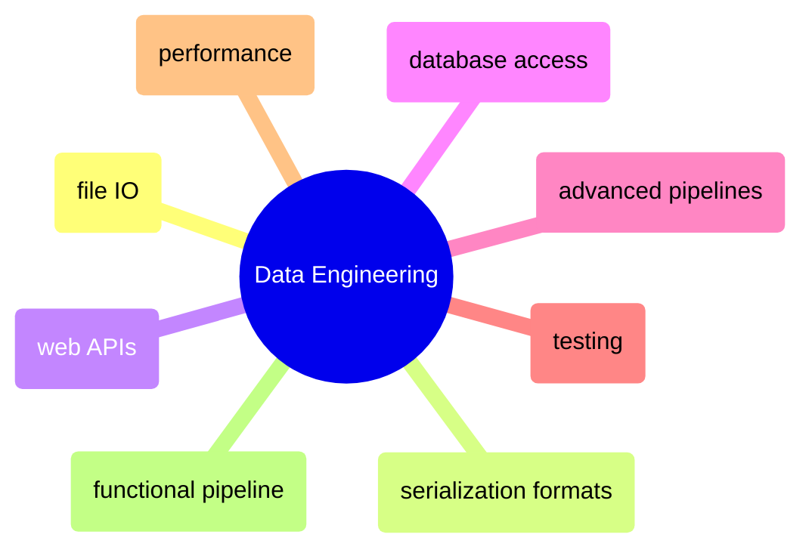

# Data Engineering

File I/O, serialization, APIs, database access, pipelines, testing, and performance — the applied data engineering side of Python and C#.

> [!abstract]- File I/O and Serialization
>
> - Read, write, and append files — [[09-py-fileio-serialization#Read, Write, Append Files|py]] · [[09-cs-fileio-serialization#Read, Write, Append Files|cs]]
> - CSV files — [[09-py-fileio-serialization#CSV Files|py]] · [[09-cs-fileio-serialization#CSV Files|cs]]
> - JSON — [[09-py-fileio-serialization#JSON|py]] · [[09-cs-fileio-serialization#JSON|cs]]
> - YAML — [[09-py-fileio-serialization#YAML|py]] · [[09-cs-fileio-serialization#YAML|cs]]
> - Serialization, deserialization, and streams — [[09-py-fileio-serialization#Serialization, Deserialization, and Streams|py]] · [[09-cs-fileio-serialization#Serialization, Deserialization, and Streams|cs]]
> - Encoding and decoding — [[09-py-fileio-serialization#Encoding and Decoding|py]] · [[09-cs-fileio-serialization#Encoding and Decoding|cs]]

> [!abstract]- Serialization Formats
>
> - Parquet files — [[10-py-serialization-formats#Parquet Files|py]] · [[10-cs-serialization-formats#Parquet Files|cs]]
> - Enterprise message serialization (Protobuf, Avro) — [[10-py-serialization-formats#Enterprise Message Serialization|py]] · [[10-cs-serialization-formats#Protocol Buffers (Protobuf)|cs]]
> - Format performance benchmark — [[10-py-serialization-formats#Format Performance Benchmark|py]] · [[10-cs-serialization-formats#Format Performance Benchmark|cs]]

> [!abstract]- Web APIs
>
> - HTTP clients and REST API calls — [[15-py-webapis#HTTP Clients & REST API Calls|py]] · [[15-cs-webapis#HTTP Clients & REST API Calls|cs]]
> - REST API patterns for data engineering — [[15-py-webapis#REST API Patterns for Data Engineering|py]] · [[15-cs-webapis#REST API Patterns for Data Engineering|cs]]
> - Building a REST API — [[15-py-webapis#Building a REST API (FastAPI)|py]] · [[15-cs-webapis#Building a REST API (ASP.NET Minimal APIs)|cs]]
> - Data validation for production APIs — [[15-py-webapis#Pydantic — Data Validation for Production APIs|py]] · [[15-cs-webapis#Data Validation — Records, Data Annotations, and FluentValidation|cs]]

> [!abstract]- Database Access
>
> - SQLite embedded database — [[16-py-database#SQLite — Built-in Embedded Database|py]] · [[16-cs-database#SQLite — Lightweight Embedded Database|cs]]
> - SQL Server connectivity — [[16-py-database#SQL Server — pyodbc (ODBC Driver 18)|py]] · [[16-cs-database#SQL Server|cs]]
> - ORM and micro-ORM — [[16-py-database#SQLAlchemy — ORM|py]] · [[16-cs-database#Dapper — Micro-ORM|cs]]
> - DuckDB embedded analytical database — [[16-py-database#DuckDB — Embedded Analytical SQL Database|py]] · [[16-cs-database#DuckDB — Embedded Analytical SQL Database|cs]]
> - Querying files directly — [[16-py-database#Querying Files — DuckDB vs Polars vs Pandas|py]] · [[16-cs-database#Querying Files — DuckDB SQL vs Polars.NET DataFrame|cs]]

> [!abstract]- Advanced Pipelines
>
> - Async generators and TPL Dataflow — [[13-py-advancedpipelines#Async Generators with Real APIs|py]] · [[13-cs-advancedpipelines#TPL Dataflow|cs]]
> - Parallel API ingestion — [[13-py-advancedpipelines#Parallel API Ingestion|py]] · [[13-cs-advancedpipelines#Parallel API Ingestion|cs]]
> - Cross-process execution — [[13-py-advancedpipelines#Cross-Process Execution|py]] · [[13-cs-advancedpipelines#Cross-Process Execution|cs]]

> [!abstract]- Testing
>
> - Testing philosophy and the testing pyramid — [[14-py-testing#Testing Philosophy|py]] · [[14-cs-testing#Testing Philosophy|cs]]
> - Unit testing (pytest vs xUnit) — [[14-py-testing#Unit Testing with pytest|py]] · [[14-cs-testing#Unit Testing with xUnit|cs]]
> - Mocking and patching — [[14-py-testing#Mocking and Patching|py]] · [[14-cs-testing#Mocking with Moq|cs]]
> - Test patterns for data engineering — [[14-py-testing#Test Patterns for Data Engineering|py]] · [[14-cs-testing#Test Patterns for Data Engineering|cs]]
> - Integration testing with real database — [[14-py-testing#Integration Testing with Real Database|py]] · [[14-cs-testing#Integration Testing with Real Database|cs]]

> [!abstract]- Performance and Code Quality
>
> - Timing and benchmarking — [[19-py-performance-quality#Timing & Benchmarking|py]] · [[19-cs-performance-quality#Timing & Benchmarking|cs]]
> - Memory profiling and measurement — [[19-py-performance-quality#Memory Profiling|py]] · [[19-cs-performance-quality#Memory Measurement|cs]]
> - Big-O complexity and algorithmic thinking — [[19-py-performance-quality#Big-O Complexity & Algorithmic Thinking|py]] · [[19-cs-performance-quality#Big-O Complexity & Collection Performance|cs]]
> - Code smells and anti-patterns — [[19-py-performance-quality#Code Smells & Anti-Patterns|py]] · [[19-cs-performance-quality#Code Smells & Anti-Patterns|cs]]
> - Golden rules of performance — [[19-py-performance-quality#Golden Rules of Performance|py]] · [[19-cs-performance-quality#Golden Rules of Performance|cs]]

> [!abstract]- Functional Pipeline (End-to-End)
>
> - Pydantic/FluentValidation DTOs — [[25-py-functional-pipeline#2. Pydantic DTOs — Schema Validation at Every Boundary|py]] · [[25-cs-functional-pipeline#2. Records + FluentValidation — Schema Validation at Every Boundary|cs]]
> - SQL Server schema and medallion tables — [[25-py-functional-pipeline#4. SQL Server Schema — Medallion Tables + Lineage|py]] · [[25-cs-functional-pipeline#4. SQL Server Schema — Medallion Tables + Lineage|cs]]
> - Bronze layer ingestion — [[25-py-functional-pipeline#6. Bronze Layer — Landing Zone + Incremental Ingestion|py]] · [[25-cs-functional-pipeline#6. Bronze Layer — Landing Zone + Incremental Ingestion|cs]]
> - Silver layer cleaning and enrichment — [[25-py-functional-pipeline#7. Silver Layer — Cleaning & Enrichment|py]] · [[25-cs-functional-pipeline#7. Silver Layer — Cleaning & Enrichment|cs]]
> - Gold layer aggregations — [[25-py-functional-pipeline#8. Gold Layer — Aggregations & Mart Tables|py]] · [[25-cs-functional-pipeline#8. Gold Layer — Aggregations & Mart Tables|cs]]
> - Lineage review and audit — [[25-py-functional-pipeline#10. Lineage Review — Pipeline Execution Audit|py]] · [[25-cs-functional-pipeline#10. Lineage Review — Pipeline Execution Audit|cs]]
