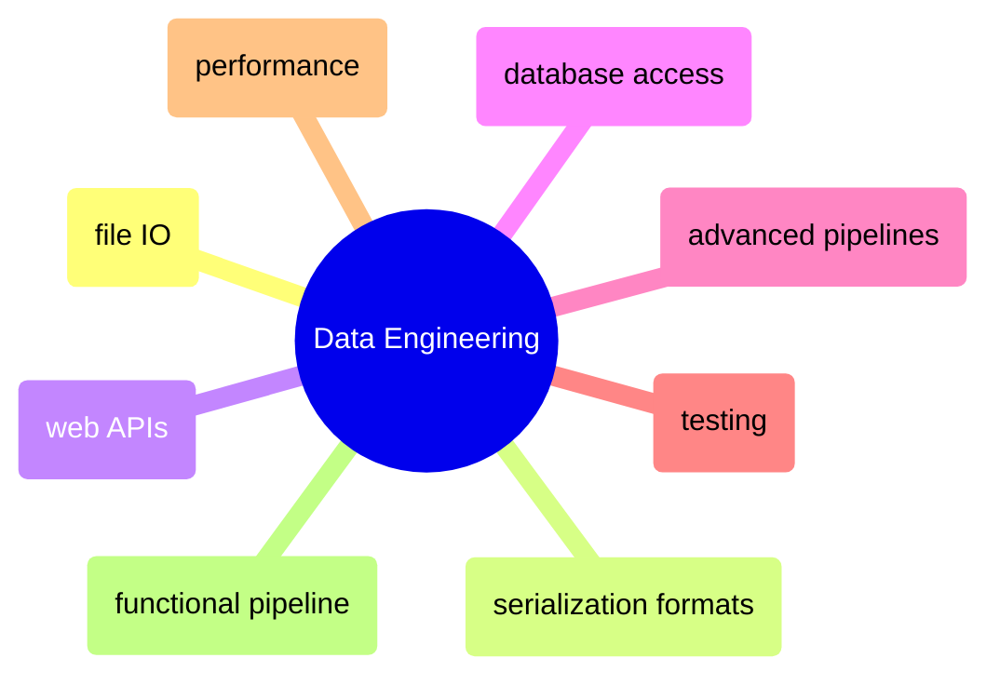

# Data Engineering

File I/O, serialization, APIs, database access, pipelines, testing, and performance — the applied data engineering side of Python and C#.

> [!abstract]- File I/O and Serialization
>
> - Read, write, and append files — [[09_py_fileio_serialization#Read, Write, Append Files|py]] · [[09_cs_fileio_serialization#Read, Write, Append Files|cs]]
> - CSV files — [[09_py_fileio_serialization#CSV Files|py]] · [[09_cs_fileio_serialization#CSV Files|cs]]
> - JSON — [[09_py_fileio_serialization#JSON|py]] · [[09_cs_fileio_serialization#JSON|cs]]
> - YAML — [[09_py_fileio_serialization#YAML|py]] · [[09_cs_fileio_serialization#YAML|cs]]
> - Serialization, deserialization, and streams — [[09_py_fileio_serialization#Serialization, Deserialization, and Streams|py]] · [[09_cs_fileio_serialization#Serialization, Deserialization, and Streams|cs]]
> - Encoding and decoding — [[09_py_fileio_serialization#Encoding and Decoding|py]] · [[09_cs_fileio_serialization#Encoding and Decoding|cs]]

> [!abstract]- Serialization Formats
>
> - Parquet files — [[10_py_serialization_formats#Parquet Files|py]] · [[10_cs_serialization_formats#Parquet Files|cs]]
> - Enterprise message serialization (Protobuf, Avro) — [[10_py_serialization_formats#Enterprise Message Serialization|py]] · [[10_cs_serialization_formats#Protocol Buffers (Protobuf)|cs]]
> - Format performance benchmark — [[10_py_serialization_formats#Format Performance Benchmark|py]] · [[10_cs_serialization_formats#Format Performance Benchmark|cs]]

> [!abstract]- Web APIs
>
> - HTTP clients and REST API calls — [[15_py_webapis#HTTP Clients & REST API Calls|py]] · [[15_cs_webapis#HTTP Clients & REST API Calls|cs]]
> - REST API patterns for data engineering — [[15_py_webapis#REST API Patterns for Data Engineering|py]] · [[15_cs_webapis#REST API Patterns for Data Engineering|cs]]
> - Building a REST API — [[15_py_webapis#Building a REST API (FastAPI)|py]] · [[15_cs_webapis#Building a REST API (ASP.NET Minimal APIs)|cs]]
> - Data validation for production APIs — [[15_py_webapis#Pydantic — Data Validation for Production APIs|py]] · [[15_cs_webapis#Data Validation — Records, Data Annotations, and FluentValidation|cs]]

> [!abstract]- Database Access
>
> - SQLite embedded database — [[16_py_database#SQLite — Built-in Embedded Database|py]] · [[16_cs_database#SQLite — Lightweight Embedded Database|cs]]
> - SQL Server connectivity — [[16_py_database#SQL Server — pyodbc (ODBC Driver 18)|py]] · [[16_cs_database#SQL Server|cs]]
> - ORM and micro-ORM — [[16_py_database#SQLAlchemy — ORM|py]] · [[16_cs_database#Dapper — Micro-ORM|cs]]
> - DuckDB embedded analytical database — [[16_py_database#DuckDB — Embedded Analytical SQL Database|py]] · [[16_cs_database#DuckDB — Embedded Analytical SQL Database|cs]]
> - Querying files directly — [[16_py_database#Querying Files — DuckDB vs Polars vs Pandas|py]] · [[16_cs_database#Querying Files — DuckDB SQL vs Polars.NET DataFrame|cs]]

> [!abstract]- Advanced Pipelines
>
> - Async generators and TPL Dataflow — [[13_py_advancedpipelines#Async Generators with Real APIs|py]] · [[13_cs_advancedpipelines#TPL Dataflow|cs]]
> - Parallel API ingestion — [[13_py_advancedpipelines#Parallel API Ingestion|py]] · [[13_cs_advancedpipelines#Parallel API Ingestion|cs]]
> - Cross-process execution — [[13_py_advancedpipelines#Cross-Process Execution|py]] · [[13_cs_advancedpipelines#Cross-Process Execution|cs]]

> [!abstract]- Testing
>
> - Testing philosophy and the testing pyramid — [[14_py_testing#Testing Philosophy|py]] · [[14_cs_testing#Testing Philosophy|cs]]
> - Unit testing (pytest vs xUnit) — [[14_py_testing#Unit Testing with pytest|py]] · [[14_cs_testing#Unit Testing with xUnit|cs]]
> - Mocking and patching — [[14_py_testing#Mocking and Patching|py]] · [[14_cs_testing#Mocking with Moq|cs]]
> - Test patterns for data engineering — [[14_py_testing#Test Patterns for Data Engineering|py]] · [[14_cs_testing#Test Patterns for Data Engineering|cs]]
> - Integration testing with real database — [[14_py_testing#Integration Testing with Real Database|py]] · [[14_cs_testing#Integration Testing with Real Database|cs]]

> [!abstract]- Performance and Code Quality
>
> - Timing and benchmarking — [[19_py_performance_quality#Timing & Benchmarking|py]] · [[19_cs_performance_quality#Timing & Benchmarking|cs]]
> - Memory profiling and measurement — [[19_py_performance_quality#Memory Profiling|py]] · [[19_cs_performance_quality#Memory Measurement|cs]]
> - Big-O complexity and algorithmic thinking — [[19_py_performance_quality#Big-O Complexity & Algorithmic Thinking|py]] · [[19_cs_performance_quality#Big-O Complexity & Collection Performance|cs]]
> - Code smells and anti-patterns — [[19_py_performance_quality#Code Smells & Anti-Patterns|py]] · [[19_cs_performance_quality#Code Smells & Anti-Patterns|cs]]
> - Golden rules of performance — [[19_py_performance_quality#Golden Rules of Performance|py]] · [[19_cs_performance_quality#Golden Rules of Performance|cs]]

> [!abstract]- Functional Pipeline (End-to-End)
>
> - Pydantic/FluentValidation DTOs — [[25_py_functional_pipeline#2. Pydantic DTOs — Schema Validation at Every Boundary|py]] · [[25_cs_functional_pipeline#2. Records + FluentValidation — Schema Validation at Every Boundary|cs]]
> - SQL Server schema and medallion tables — [[25_py_functional_pipeline#4. SQL Server Schema — Medallion Tables + Lineage|py]] · [[25_cs_functional_pipeline#4. SQL Server Schema — Medallion Tables + Lineage|cs]]
> - Bronze layer ingestion — [[25_py_functional_pipeline#6. Bronze Layer — Landing Zone + Incremental Ingestion|py]] · [[25_cs_functional_pipeline#6. Bronze Layer — Landing Zone + Incremental Ingestion|cs]]
> - Silver layer cleaning and enrichment — [[25_py_functional_pipeline#7. Silver Layer — Cleaning & Enrichment|py]] · [[25_cs_functional_pipeline#7. Silver Layer — Cleaning & Enrichment|cs]]
> - Gold layer aggregations — [[25_py_functional_pipeline#8. Gold Layer — Aggregations & Mart Tables|py]] · [[25_cs_functional_pipeline#8. Gold Layer — Aggregations & Mart Tables|cs]]
> - Lineage review and audit — [[25_py_functional_pipeline#10. Lineage Review — Pipeline Execution Audit|py]] · [[25_cs_functional_pipeline#10. Lineage Review — Pipeline Execution Audit|cs]]
