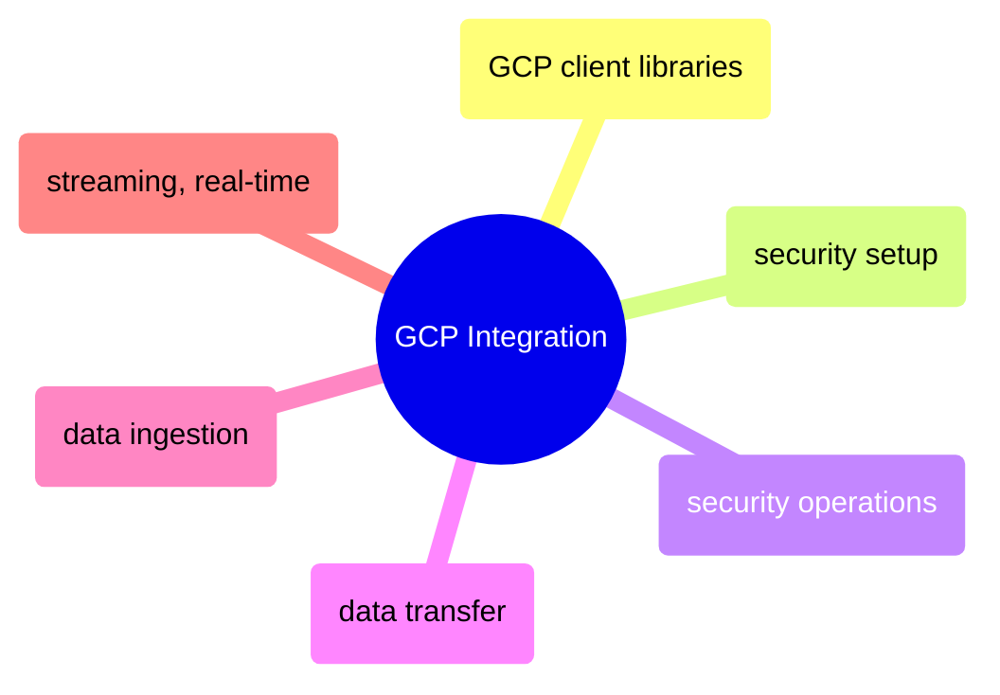

# GCP Integration

Google Cloud Platform client libraries, security, data transfer, ingestion, and streaming in Python and C#.

> [!abstract]- GCP Client Libraries
>
> - Authentication and setup — [[17-py-gcp#Authentication & Setup|py]] · [[17-cs-gcp#Authentication & Setup|cs]]
> - Cloud Storage (GCS) — [[17-py-gcp#Cloud Storage (GCS)|py]] · [[17-cs-gcp#Cloud Storage (GCS)|cs]]
> - BigQuery — [[17-py-gcp#BigQuery|py]] · [[17-cs-gcp#BigQuery|cs]]
> - Pub/Sub — [[17-py-gcp#Pub|py]] · [[17-cs-gcp#Pub|cs]]
> - Firestore — [[17-py-gcp#Firestore|py]] · [[17-cs-gcp#Firestore|cs]]
> - Secret Manager — [[17-py-gcp#Secret Manager|py]] · [[17-cs-gcp#Secret Manager|cs]]

> [!abstract]- Security Setup (Python only)
>
> - GCP project and billing — [[20-py-security-setup#GCP Project|py]]
> - Service account and IAM role bindings — [[20-py-security-setup#Service Account|py]]
> - Cloud KMS and Secret Manager — [[20-py-security-setup#Cloud KMS|py]]
> - Cloud Storage and Compute Engine — [[20-py-security-setup#Cloud Storage|py]]
> - Cloud SQL — [[20-py-security-setup#Cloud SQL|py]]
> - Workload Identity Federation — [[20-py-security-setup#Workload Identity Federation|py]]

> [!abstract]- Security Operations
>
> - Identity and authentication — [[21-py-security-operations#Identity and Authentication|py]] · [[21-cs-security-operations#Identity and Authentication|cs]]
> - Secret Manager lifecycle — [[21-py-security-operations#Secret Manager — Secure Secret Lifecycle|py]] · [[21-cs-security-operations#Secret Manager — Secure Secret Lifecycle|cs]]
> - Cloud KMS encryption and key management — [[21-py-security-operations#Cloud KMS — Encryption and Key Management|py]] · [[21-cs-security-operations#Cloud KMS — Encryption and Key Management|cs]]
> - Cloud SQL authentication and encryption — [[21-py-security-operations#Cloud SQL — SQL Server Authentication and Encryption|py]] · [[21-cs-security-operations#Cloud SQL — SQL Server Authentication and Encryption|cs]]
> - BigQuery secure data operations — [[21-py-security-operations#BigQuery — Secure Data Operations|py]] · [[21-cs-security-operations#BigQuery — Secure Data Operations|cs]]
> - Cloud Storage encryption and access control — [[21-py-security-operations#Cloud Storage — Encryption and Access Control|py]] · [[21-cs-security-operations#Cloud Storage — Encryption and Access Control|cs]]

> [!abstract]- Data Transfer
>
> - Upload files from local to GCS — [[22-py-data-transfer#Upload files from Local to GCS|py]] · [[22-cs-data-transfer#Data Transfer Methods|cs]]
> - Copy files from local to VM — [[22-py-data-transfer#Copy files from Local to VM|py]] · [[22-cs-data-transfer#Local → VM Transfer Benchmarks|cs]]
> - Transfer files from VM to GCS — [[22-py-data-transfer#Transfer files from VM to GCS|py]] · [[22-cs-data-transfer#Transfer files from VM to GCS|cs]]
> - Parallel transfer — [[22-py-data-transfer#Parallel Transfer|py]] · [[22-cs-data-transfer#Parallel Transfer|cs]]
> - File compression benchmarks — [[22-py-data-transfer#File Compression Benchmarks|py]] · [[22-cs-data-transfer#File Compression Benchmarks|cs]]

> [!abstract]- Data Ingestion
>
> - Local to SQL Server ingestion — [[23-py-data-ingestion#Local → SQL Server Ingestion|py]] · [[23-cs-data-ingestion#Local → SQL Server Ingestion|cs]]
> - Local to BigQuery ingestion — [[23-py-data-ingestion#Local → BigQuery Ingestion|py]] · [[23-cs-data-ingestion#Local → BigQuery Ingestion|cs]]
> - GCS to BigQuery ingestion — [[23-py-data-ingestion#GCS → BigQuery Ingestion|py]] · [[23-cs-data-ingestion#GCS → BigQuery Ingestion|cs]]
> - Cross-service transfers — [[23-py-data-ingestion#Cross-Service Transfers|py]] · [[23-cs-data-ingestion#Cross-Service Transfers|cs]]
> - Export — [[23-py-data-ingestion#Export|py]] · [[23-cs-data-ingestion#Export|cs]]

> [!abstract]- Streaming and Real-Time
>
> - WebSocket streaming — [[24-py-streaming-realtime#WebSocket Streaming|py]] · [[24-cs-streaming-realtime#WebSocket Streaming|cs]]
> - Server-Sent Events (SSE) — [[24-py-streaming-realtime#Server-Sent Events (SSE)|py]] · [[24-cs-streaming-realtime#Server-Sent Events (SSE)|cs]]
> - Google Cloud Pub/Sub — [[24-py-streaming-realtime#Google Cloud Pub|py]] · [[24-cs-streaming-realtime#Google Cloud Pub|cs]]
> - Firestore real-time listener — [[24-py-streaming-realtime#Firestore Real-Time Listener|py]] · [[24-cs-streaming-realtime#Firestore Real-Time Listener|cs]]
> - Latency comparison — [[24-py-streaming-realtime#Latency Comparison|py]] · [[24-cs-streaming-realtime#Latency Comparison|cs]]
