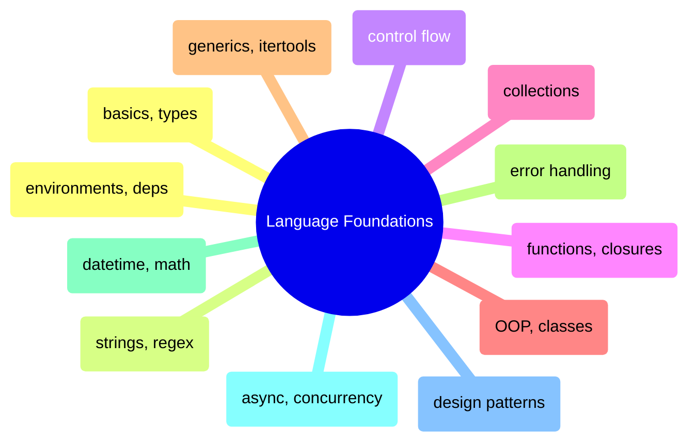

# Language Foundations

Core programming concepts in Python and C# — from basics and types through OOP, async, and design patterns.

> [!abstract]- Basics, Types, and Operators
>
> - Environment setup and runtime info — [[01-py-basics#Environment Setup|py]] · [[01-cs-basics#Environment Setup|cs]]
> - Console input and output — [[01-py-basics#Console I|py]] · [[01-cs-basics#Console I|cs]]
> - Variables, constants, and data types — [[01-py-basics#Variables, Constants & Data Types|py]] · [[01-cs-basics#Variables, Constants & Data Types|cs]]
> - Arithmetic, comparison, logical, and bitwise operators — [[01-py-basics#Operators|py]] · [[01-cs-basics#Operators|cs]]
> - Magic methods and operator overloading — [[01-py-basics#Magic Methods (Dunder Methods)|py]] · [[01-cs-basics#Special Methods & Operator Overloading|cs]]

> [!abstract]- Strings and Regular Expressions
>
> - String creation, immutability, and raw strings — [[02-py-strings#String Creation & Basics|py]] · [[02-cs-strings#String Creation & Basics|cs]]
> - Indexing, slicing, and substrings — [[02-py-strings#Indexing & Slicing|py]] · [[02-cs-strings#Indexing & Slicing|cs]]
> - String methods for cleaning and transformation — [[02-py-strings#String Methods|py]] · [[02-cs-strings#String Methods|cs]]
> - Formatting and interpolation — [[02-py-strings#String Formatting|py]] · [[02-cs-strings#String Formatting|cs]]
> - Efficient string building — [[02-py-strings#Efficient String Building|py]] · [[02-cs-strings#Efficient String Building (StringBuilder)|cs]]
> - Regular expressions — [[02-py-strings#Regular Expressions|py]] · [[02-cs-strings#Regular Expressions|cs]]

> [!abstract]- Control Flow
>
> - Conditionals and branching — [[03-py-control-flow#Conditional Statements|py]] · [[03-cs-control-flow#Conditional Statements|cs]]
> - Loops and iteration — [[03-py-control-flow#Loops|py]] · [[03-cs-control-flow#Loops|cs]]
> - Break, continue, and loop control — [[03-py-control-flow#Loop Control (break, continue, pass)|py]] · [[03-cs-control-flow#Loop Control|cs]]
> - Iterators and generators — [[03-py-control-flow#Iterators & Generators (yield)|py]] · [[03-cs-control-flow#Iterators & Generators|cs]]
> - Comprehensions, LINQ, and functional tools — [[03-py-control-flow#Comprehensions & Functional Tools|py]] · [[03-cs-control-flow#LINQ & Functional Equivalents|cs]]

> [!abstract]- Functions and Closures
>
> - Function basics and signatures — [[04-py-functions#Function Basics|py]] · [[04-cs-functions#Function Basics|cs]]
> - Parameters and argument passing — [[04-py-functions#Parameters|py]] · [[04-cs-functions#Parameters|cs]]
> - Lambda expressions — [[04-py-functions#Lambda Expressions|py]] · [[04-cs-functions#Lambda Expressions|cs]]
> - Closures and variable scope — [[04-py-functions#Closures & Scope|py]] · [[04-cs-functions#Closures & Scope|cs]]
> - Decorators and delegates — [[04-py-functions#Decorators|py]] · [[04-cs-functions#Delegates & Events|cs]]

> [!abstract]- Collections
>
> - Lists and dynamic arrays — [[05-py-collections#Lists (Dynamic Arrays)|py]] · [[05-cs-collections#Arrays and Lists|cs]]
> - Dictionaries and hash maps — [[05-py-collections#Dictionaries|py]] · [[05-cs-collections#Dictionaries|cs]]
> - Sets and uniqueness — [[05-py-collections#Sets|py]] · [[05-cs-collections#Sets|cs]]
> - Tuples and enums — [[05-py-collections#Tuples & Enums|py]] · [[05-cs-collections#Tuples and Enums|cs]]
> - Stacks, queues, and deques — [[05-py-collections#Stacks, Queues & Deques|py]] · [[05-cs-collections#Stacks, Queues, and Linked Lists|cs]]

> [!abstract]- Object-Oriented Programming
>
> - Classes and objects — [[06-py-oop#Classes & Objects|py]] · [[06-cs-oop#Classes & Objects|cs]]
> - Inheritance and polymorphism — [[06-py-oop#Inheritance & Polymorphism|py]] · [[06-cs-oop#Inheritance & Polymorphism|cs]]
> - Abstract classes and interfaces — [[06-py-oop#Abstract Classes & Interfaces|py]] · [[06-cs-oop#Abstract Classes & Interfaces|cs]]
> - Encapsulation and access control — [[06-py-oop#Encapsulation & Access Control|py]] · [[06-cs-oop#Encapsulation & Access Modifiers|cs]]
> - Dataclasses and records — [[06-py-oop#Dataclasses & Records|py]] · [[06-cs-oop#Records & Init-Only Properties|cs]]

> [!abstract]- Generics and Itertools/LINQ
>
> - Generic types and type constraints — [[07-py-generics-linq#Generics|py]] · [[07-cs-generics-linq#Generics|cs]]
> - Analytics with Pandas/Polars vs LINQ — [[07-py-generics-linq#Pandas vs Polars Analytics|py]] · [[07-cs-generics-linq#Advanced LINQ|cs]]
> - Aggregations — [[07-py-generics-linq#Aggregations|py]] · [[07-cs-generics-linq#Aggregations|cs]]
> - Window functions — [[07-py-generics-linq#Window Functions|py]] · [[07-cs-generics-linq#Window Functions|cs]]
> - Joins — [[07-py-generics-linq#Joins|py]] · [[07-cs-generics-linq#Joins|cs]]

> [!abstract]- Error Handling
>
> - Try, catch, and finally — [[08-py-errorhandling#try|py]] · [[08-cs-errorhandling#try|cs]]
> - Exception types and hierarchy — [[08-py-errorhandling#Exception Types and Hierarchy|py]] · [[08-cs-errorhandling#Exception Types and Hierarchy|cs]]
> - Custom exceptions — [[08-py-errorhandling#Custom Exceptions|py]] · [[08-cs-errorhandling#Custom Exceptions|cs]]
> - Resource cleanup and context managers — [[08-py-errorhandling#Context Managers — with statement|py]] · [[08-cs-errorhandling#Resource Cleanup — using and IDisposable|cs]]
> - Data engineering resilience patterns — [[08-py-errorhandling#Data Engineering — error accumulation and resilience patterns|py]] · [[08-cs-errorhandling#Data Engineering — error accumulation and resilience patterns|cs]]

> [!abstract]- DateTime, Math, and Utilities
>
> - Date and time handling — [[11-py-datetimemathutils#Date and Time|py]] · [[11-cs-datetimemathutils#Date and Time|cs]]
> - Math and random — [[11-py-datetimemathutils#Math and Random|py]] · [[11-cs-datetimemathutils#Math and Random|cs]]
> - Logging — [[11-py-datetimemathutils#Logging|py]] · [[11-cs-datetimemathutils#Logging|cs]]
> - Configuration and environment variables — [[11-py-datetimemathutils#Configuration and Environment Variables|py]] · [[11-cs-datetimemathutils#Configuration and Environment Variables|cs]]

> [!abstract]- Async and Concurrency
>
> - Async and await fundamentals — [[12-py-asyncconcurrency#Async and Await|py]] · [[12-cs-asyncconcurrency#Async and Await|cs]]
> - Tasks and parallelism — [[12-py-asyncconcurrency#Tasks and Parallelism|py]] · [[12-cs-asyncconcurrency#Tasks and Parallelism|cs]]
> - Threading and concurrency — [[12-py-asyncconcurrency#Threading and Concurrency|py]] · [[12-cs-asyncconcurrency#Threading and Concurrency|cs]]

> [!abstract]- Design Patterns
>
> - Dependency injection — [[18-py-designpatterns#Dependency Injection|py]] · [[18-cs-designpatterns#Dependency Injection|cs]]
> - Design patterns (Singleton, Factory, Observer, Strategy) — [[18-py-designpatterns#Design Patterns|py]] · [[18-cs-designpatterns#Design Patterns|cs]]
> - Data validation — [[18-py-designpatterns#Data Validation|py]] · [[18-cs-designpatterns#Data Validation|cs]]
> - Reflection and introspection — [[18-py-designpatterns#Reflection|py]] · [[18-cs-designpatterns#Reflection|cs]]
> - Project structure and best practices — [[18-py-designpatterns#Project Structure & Best Practices|py]] · [[18-cs-designpatterns#Project Structure & Best Practices|cs]]

> [!abstract]- Environments and Dependencies
>
> - Creating virtual environments — [[26-py-environments#venv — create and activate virtual environments|py]] · [[26-cs-environments#dotnet new — create projects and solution files|cs]]
> - Installing packages — [[26-py-environments#pip — install and manage packages|py]] · [[26-cs-environments#dotnet add package — install NuGet packages|cs]]
> - Pinning and freezing — [[26-py-environments#pip freeze — pin dependencies for reproducibility|py]] · [[26-cs-environments#Pinning and Locking Dependencies|cs]]
> - Docker patterns — [[26-py-environments#Docker — Python environments in containers|py]] · [[26-cs-environments#Docker — multi-stage builds for .NET|cs]]
> - CI/CD setup — [[26-py-environments#GitHub Actions — Python in CI|py]] · [[26-cs-environments#GitHub Actions — .NET in CI|cs]]
> - Anti-patterns — [[26-py-environments#Anti-Patterns and Common Mistakes|py]] · [[26-cs-environments#Anti-Patterns and Common Mistakes|cs]]
