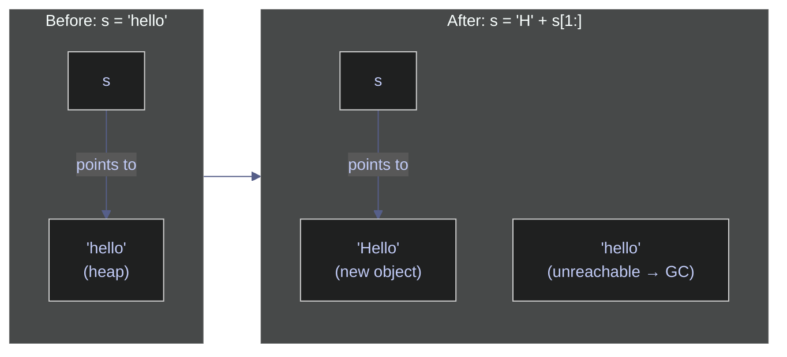
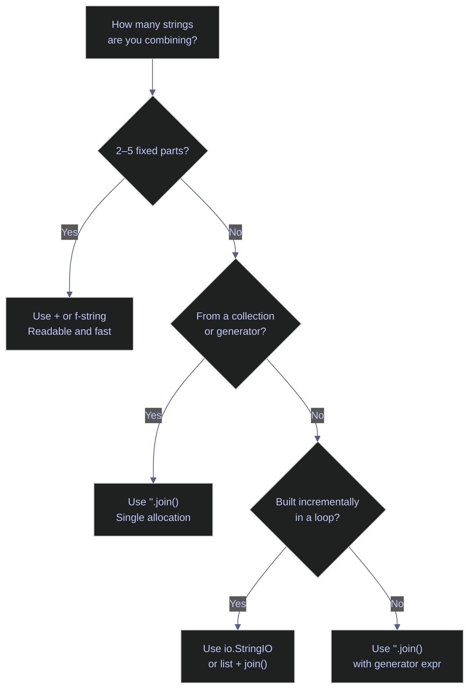

# 02. Strings - Python

> [!quote]
> "In our daily lives as programmers, we process text strings a lot. So I tried to work hard on text processing, namely the string class and regular expressions."
>
> — **Yukihiro Matsumoto**, creator of Ruby

## String Creation & Basics

This section covers the fundamental building blocks of string handling in Python: literal syntax, type conversions, construction patterns, and the immutability guarantee that shapes how strings behave at runtime.

### Literals and declaration

Python strings are sequences of Unicode code points. Single quotes and double quotes are interchangeable; triple quotes create multiline strings; and the `r""` prefix disables escape processing.

#### Declare strings with single and double quotes

`str` is Python's only text type — there is no separate `char` type. A single character is simply a string of length 1. Single quotes (`'...'`) and double quotes (`"..."`) produce identical `str` objects. Choose whichever avoids internal escaping.

```python
import io
import re
import time
import locale

s1 = 'hello'
s2 = "hello"
print(s1)
print(f"Double quotes: \"{s2}\"")
print(s1 == s2)
```

```text
'hello'
"hello"
True
```

#### Create multiline and raw strings

Triple-quoted strings (`"""..."""` or `'''...'''`) preserve embedded newlines. Raw strings (`r"..."`) treat backslashes as literal characters — essential for regex patterns and Windows file paths. Both can be combined (`r"""..."""`).

```python
s3 = """This is
a multiline
string"""
s4 = '''Also works
with single
quotes'''
print(s3)

s5 = r"C:\Users\new\test"
s6 = "C:\\Users\\new\\test"
print(s5)
print(s6)
print(s5 == s6)
```

```text
This is
a multiline
string

C:\Users\new\test
C:\Users\new\test
True
```

### Conversion and construction

Methods for converting other types to strings, assembling strings from parts, and checking for empty values.

#### Convert other types to string with str()

`str()` calls the object's `__str__` method (or `__repr__` as fallback) to produce a human-readable string representation. Unlike C#'s `ToString()`, `str(None)` returns the string `"None"` rather than throwing.

```python
print(str(42))
print(str(3.14))
print(str(True))
print(str([1,2,3]))
print(str(None))
```

```text
'42'
'3.14'
'True'
'[1, 2, 3]'
'None'
```

#### Repeat and concatenate strings

The `*` operator repeats a string *n* times — a feature C# lacks. The `+` operator concatenates strings. The compiler does not optimize `+` in loops, so reserve it for small fixed concatenations.

```python
print('ha' * 3)
print('hello' + ' ' + 'world')
```

```text
'hahaha'
'hello world'
```

#### Check for empty strings and truthiness

Empty strings are falsy in Python — `bool('')` returns `False`. This means you can test for emptiness with `if not s:` instead of `if s == ""` or `if len(s) == 0`. Any non-empty string is truthy.

> [!tip] Idiomatic emptiness check
> Prefer `if not s:` over `if s == ""` or `if len(s) == 0`. The boolean test is the Pythonic convention and handles `None` gracefully when combined with `if not s:` (both `None` and `""` are falsy).

```python
empty = ""
print(empty == '')
print(len(empty))
print(bool(''))
print(bool('a'))
```

```text
True
0
False
True
```

### Immutability

The single most important property of Python strings — every operation that appears to modify a string actually allocates a new object and returns it. Understanding this shapes how you write performant string code.

#### Understand string immutability and its implications

Once a `str` is created, its character sequence cannot change. Item assignment (`s[0] = 'H'`) raises `TypeError`. Any transformation — `upper()`, `replace()`, slicing, or concatenation — allocates a new `str` on the heap. The original is unchanged and becomes eligible for garbage collection if no other reference points to it.

> [!warning] Anti-pattern — concatenation in loops
> Each `+=` in a loop creates a new string object, copying all previous characters. For *n* iterations this is O(n²) in both time and allocations. CPython may optimize simple cases, but this is not guaranteed.

> [!success] Correct pattern
> Use `"".join()` for loop-based construction, or `io.StringIO` for incremental writes. Reserve `+` for small, fixed concatenations (2–5 parts).

```python
s = 'H' + s[1:]
print(s)
```

```text
Hello
```

The diagram below shows what happens in memory. The variable `s` is reassigned to point to a new string object; the original `"hello"` is not modified — it becomes unreachable and is collected by the GC.



## Indexing & Slicing

Accessing individual characters and extracting substrings. Python uses 0-based indexing, negative indexing from the end, and slice syntax (`start:stop:step`) with full stride support — more powerful than C#'s Range syntax.

### Accessing characters and substrings

Direct character access by position, substring extraction via slicing, and stride patterns.

#### Access characters and substrings by index and slice

Python strings support 0-based indexing with `[]`, negative indexing from the end, and slice syntax `[start:stop:step]` with full stride support. Slicing never raises an exception — out-of-range indices are silently clamped.

> [!info] Indexing and slicing
>
> - `s[i]` — access by index (0-based)
> - `s[-1]` — last character (eliminates `len(s)-1`)
> - `s[a:b]` — slice from `a` to `b` (right-exclusive)
> - `s[::2]` — every 2nd char; `s[::-1]` — reverse
> - Slicing never raises `IndexError` — out-of-range indices are silently clamped
> - For pattern extraction, use regex or split instead of index math

```python
print(s[0])
print(s[1])
print(s[-1])
print(s[-2])
print(s[0:5])
print(s[:5])
print(s[7:])
print(s[-6:])
print(s[::2])
print(s[::-1])
print(s[7:12])
print(s[2:10:2])
```

```text
'H'
'e'
'!'
'd'
'Hello'
'Hello'
'World!'
'World!'
'Hlo ol!'
'!dlroW ,olleH'
'World'
'lo o'
```

### Iterating characters and out-of-range behavior

Python slicing silently clamps out-of-range indices — no exception is raised. Direct indexing (`s[100]`) raises `IndexError`.

#### Handle out-of-range access and iterate characters

Slicing beyond the string length returns as many characters as available — `s[0:100]` returns the full string without error. Direct index access (`s[100]`) raises `IndexError`. Use `for ch in s` for simple iteration or `enumerate()` for index-value pairs (equivalent to C#'s LINQ `Select` with index).

> [!info] Slicing vs indexing — different error behavior
> `s[100]` raises `IndexError`, but `s[0:100]` silently returns the whole string. This is by design — slicing is intended to be forgiving, while indexing expects a valid position.

```python
s[0:100]

print("Chars:", end=" ")
for ch in s[:5]:
    print(ch, end=" ")

for i, ch in enumerate(s[:5]):
    print(f"  [{i}] = '{ch}'")
```

```text
'Hello, World!'
H e l l o
  [0] = 'H'
  [1] = 'e'
  [2] = 'l'
  [3] = 'l'
  [4] = 'o'
```

## String Methods

The built-in methods on `str` for transforming case, trimming whitespace, inspecting content, searching, splitting, joining, and encoding. All transformation methods return new strings — the original is never modified.

### Case conversion

Methods for changing letter case. Python provides `upper()`, `lower()`, `title()`, `capitalize()`, `swapcase()`, and `casefold()` — richer than C#'s set.

#### Convert case with upper, lower, title, capitalize, swapcase, casefold

Python provides six case-conversion methods. `upper()` and `lower()` convert all characters. `title()` capitalizes the first letter of each word, while `capitalize()` only capitalizes the first character of the string. `swapcase()` inverts case, and `casefold()` performs aggressive Unicode-aware lowering for case-insensitive comparison.

> [!info] Case methods
>
> - `casefold()` — more aggressive than `lower()`, handles Unicode (`"Straße"` → `"strasse"`)
> - Use `casefold()` for case-insensitive comparison, not `lower()`
> - `title()` / `capitalize()` — handle word boundaries automatically
> - All methods are Unicode-aware
> - For locale-sensitive rules (Turkish `i`), use the `locale` module

```python
s = "  Hello, World!  "

print('hello world'.upper())
print('HELLO WORLD'.lower())
print('hello world'.title())
print('hello world'.capitalize())
print('Hello World'.swapcase())
print('Straße'.casefold())
```

```text
'HELLO WORLD'
'hello world'
'Hello World'
'Hello world'
'hELLO wORLD'
'strasse'
```

### Whitespace and padding

Methods for stripping leading/trailing whitespace (or custom characters) and padding strings to a fixed width.

#### Trim with strip and pad with ljust, rjust, center, zfill

`strip()` removes whitespace from both ends; `lstrip()`/`rstrip()` from one side. Pass a string argument to strip specific characters. `ljust`/`rjust`/`center` pad to a target width — Python adds `center()` and `zfill()` which C# lacks natively.

```python
s.lstrip()
s.rstrip()
'Hello!!'.strip('!')
'hello'.center(20)
'hello'.center(20, '*')
'hello'.ljust(20)
'hello'.rjust(20)
'42'.zfill(8)
```

```text
'Hello, World!'
'Hello, World!  '
'  Hello, World!'
'Hello'
'       hello        '
'*******hello********'
'hello               '
'               hello'
'00000042'
```

### Character and content checks

Python provides built-in `str.isXxx()` methods — unlike C# where you must combine `char.IsXxx` with LINQ.

#### Test string content with isalpha, isdigit, isnumeric, and more

Python provides built-in `str.isXxx()` methods that return `True` if all characters satisfy the condition and the string is non-empty. Notable distinctions: `isnumeric()` is broader than `isdigit()` (it includes fractions like `½`), `isdecimal()` is the strictest (only `0-9`), and `isprintable()` returns `False` for control characters like `\n`.

> [!tip] isdigit vs isnumeric vs isdecimal
> `isdecimal()` accepts only `0-9` characters. `isdigit()` also accepts superscripts and subscripts. `isnumeric()` is the broadest — it includes fractions like `½` and Roman numerals. For parsing numbers, `isdecimal()` is usually what you want.

```python
checks = {
    "isalpha()":    "Hello",
    "isdigit()":    "12345",
    "isalnum()":    "Hello123",
    "isspace()":    "   ",
    "isupper()":    "HELLO",
    "islower()":    "hello",
    "istitle()":    "Hello World",
    "isascii()":    "Hello",
    "isnumeric()":  "½",
    "isdecimal()":  "12345",
    "isidentifier()": "my_var",
    "isprintable()":  "hello\n",
}
for method, example in checks.items():
    result = getattr(example, method.replace('()', ''))()
    print(f"  '{example:12}'.{method:18} = {result}")
```

```text
'Hello       '.isalpha()          = True
'12345       '.isdigit()          = True
'Hello123    '.isalnum()          = True
'            '.isspace()          = True
'HELLO       '.isupper()          = True
'hello       '.islower()          = True
'Hello World '.istitle()          = True
'Hello       '.isascii()          = True
'½           '.isnumeric()        = True
'12345       '.isdecimal()        = True
'my_var      '.isidentifier()     = True
'hello\n     '.isprintable()      = False
```

### Search and location

Methods for finding substrings by position or existence.

#### Search with find, index, count, startswith, endswith

`find` returns the 0-based position of the first occurrence (or `-1` if not found). `index` is identical but raises `ValueError` instead of returning `-1`. `rfind`/`rindex` search from the right. `count` returns the number of non-overlapping occurrences. The `in` operator is the idiomatic way to check for substring existence.

```python
print(s.find('Hello'))
print(s.find('Hello', 1))
print(s.rfind('Hello'))
print(s.find('Java'))
print(s.index('World'))
print(s.count('Hello'))
print(s.startswith('Hello'))
print(s.endswith('!'))
print('World' in s)
```

```text
0
14
14
-1
7
2
True
True
True
```

### Comparison and ordering

Python strings support direct comparison with `<`, `>`, `==` using lexicographic (Unicode code point) ordering — no explicit `Compare` method needed.

#### Compare strings for ordering

Python's comparison operators (`<`, `>`, `<=`, `>=`, `==`, `!=`) compare strings lexicographically by Unicode code point — equivalent to C#'s `StringComparison.Ordinal`. For locale-aware sorting (e.g., German ä near a), use `locale.strcoll`. For custom sort keys, use `functools.cmp_to_key`.

> [!info] C# parity
> Python's `<` operator is equivalent to `string.CompareOrdinal` in C#. There is no built-in case-insensitive comparison operator — use `s1.casefold() == s2.casefold()` or `s1.lower() == s2.lower()`.

```python
print("apple" < "banana")
print("banana" > "apple")
print("apple" == "apple")
print("hello" == "HELLO")
print("hello".casefold() == "HELLO".casefold())
```

```text
True
True
True
False
True
```

### Replace, split, and join

Methods for substituting substrings, tokenizing strings into arrays, and reassembling them. Python's `str.split()` and `str.join()` are richer than C#'s — with `rsplit`, `splitlines`, `partition`, and `expandtabs`.

#### Replace substrings and split strings

`replace` substitutes occurrences and accepts an optional max-count parameter (unlike C# which always replaces all). `split` tokenizes on a delimiter — with no arguments it splits on any whitespace and strips empties, equivalent to C#'s `Split(null, RemoveEmptyEntries)`. `rsplit` splits from the right. `splitlines` handles all line endings (`\n`, `\r\n`, `\r`). `partition`/`rpartition` split into exactly three parts `(before, sep, after)`.

```python
print(s.replace('Hello', 'Hi'))
print(s.replace('Hello', 'Hi', 1))

csv = "apple,banana,cherry"
print(csv.split(','))
print(csv.split(',', 1))

words = "  hello  world  "
print(words.split())
print(words.split(' '))

print(csv.rsplit(',', 1))

lines = "line1\nline2\nline3"
print(lines.splitlines())

print(csv.partition(','))
print(csv.rpartition(','))
```

```text
'  Hi, World!  '
'  Hi, World!  '
['apple', 'banana', 'cherry']
['apple', 'banana,cherry']
['hello', 'world']
['', '', 'hello', '', 'world', '', '']
['apple,banana', 'cherry']
['line1', 'line2', 'line3']
('apple', ',', 'banana,cherry')
('apple,banana', ',', 'cherry')
```

#### Rejoin strings with join and expandtabs

`str.join(iterable)` is called on the separator string, not on the list — the opposite of C#'s `string.Join(separator, collection)`. `expandtabs` replaces tab characters with spaces aligned to tab stops.

```python
parts = ["hello", "world", "python"]
print(' '.join(parts))
print(', '.join(parts))
print('->'.join(parts))
print(''.join(parts))

tab_str = "a\tb\tc"
print(tab_str.expandtabs(4))
```

```text
'hello world python'
'hello, world, python'
'hello->world->python'
'helloworldpython'
'a   b   c'
```

### Encoding and translation

Converting between strings and bytes, and performing character-level replacements.

#### Translate characters and encode to bytes

`str.maketrans` builds a translation table mapping characters to replacements (or `None` for deletion). `translate` applies the table in a single pass — faster than chained `replace` calls for multiple substitutions. `encode` converts a `str` to `bytes` using a specified codec; `bytes.decode` reverses the process.

> [!info] C# parity
> C# has no direct equivalent of `str.translate`/`str.maketrans`. The closest approach is `Regex.Replace` with a character class, or a manual loop with `StringBuilder`.

```python
table = str.maketrans("aeiou", "12345")
print('hello world'.translate(table))

table2 = str.maketrans("", "", "aeiou")
print('hello world'.translate(table2))

print('hello'.encode('utf-8'))
print('hello'.encode('ascii'))
```

```text
'h2ll4 w4rld'
'hll wrld'
b'hello'
b'hello'
```

## String Formatting

Embedding values into strings and controlling how numbers, dates, and currencies are displayed. Python offers three mechanisms: f-strings (`f""`), `str.format()`, and the legacy `%` operator.

### f-strings and format()

The primary ways to embed expressions into string literals.

#### Embed values with f-strings, format(), and % operator

> [!info] f-string syntax
>
> - `f"..."` embeds any expression in `{braces}`
> - Format specifiers: `f"{n:.2f}"` | method calls: `f"{s.upper()}"` | expressions: `f"{a + 1}"`
> - Faster than `.format()` and more readable
> - Use f-strings for all new code; `.format()` when the template is a variable

> [!danger] Injection risk
>
> Never use f-strings in SQL or shell commands — use parameterized queries. For logging, use `logger.info("msg %s", val)` for lazy evaluation.

> [!success] Correct pattern
>
> Use parameterized queries for SQL: `cursor.execute("SELECT * FROM users WHERE id = %s", (user_id,))`. For logging, use lazy `%s` formatting: `logger.info("User %s logged in", username)` — the string is only built if the log level is active.

f-strings (`f""`, Python 3.6+) are the preferred approach — any expression inside `{...}` is evaluated at runtime. `str.format()` uses numbered or named placeholders and is useful when the format string is stored in a variable. The `%` operator is the legacy C-style approach, still common in logging.

```python
name, age = "Alice", 30
n = 1234567.89123
pct = 0.856

print(f"Name: {name}, Age: {age}")
print(age + 1)
print(name.upper())

print("Name: {}, Age: {}".format(name, age))
print("Name: {0}, Age: {1}, {0} again".format(name, age))
print("Name: {n}, Age: {a}".format(n=name, a=age))

print("Name: %s, Age: %d, Pi: %.2f" % (name, age, 3.14))
```

```text
Name: Alice, Age: 30
31
ALICE
Name: Alice, Age: 30
Name: Alice, Age: 30, Alice again
Name: Alice, Age: 30
Name: Alice, Age: 30, Pi: 3.14
```

### Numeric format specifiers

Format specifiers inside f-string braces control numeric display: `{value:.2f}`, `{value:,.0f}`, `{value:#x}`.

#### Format numbers with f-string specifiers

| Specifier | Meaning | Example |
|---|---|---|
| `.2f` | Fixed-point, 2 decimals | `1234567.89` |
| `,.2f` | Fixed with comma separator | `1,234,567.89` |
| `.2e` | Scientific notation | `1.23e+06` |
| `.4g` | General (compact) | `1.235e+06` |
| `.1%` | Percentage (multiplies by 100) | `85.6%` |
| `d` | Decimal integer | `255` |
| `b` | Binary | `11111111` |
| `o` | Octal | `377` |
| `x`/`X` | Hexadecimal lower/upper | `ff` / `FF` |
| `#x` | Hex with `0x` prefix | `0xff` |

```python
print(f"{n:.2f}")
print(f"{n:.0f}")
print(f"{n:,.2f}")
print(f"{n:.2e}")
print(f"{n:.4g}")
print(f"{pct:.1%}")

x = 255
print(f"{x:d}")
print(f"{x:b}")
print(f"{x:o}")
print(f"{x:x}")
print(f"{x:X}")
print(f"{x:#x}")
print(f"{x:08d}")
```

```text
1234567.89
1234568
1,234,567.89
1.23e+06
1.235e+06
85.6%
255
11111111
377
ff
FF
0xff
00000255
```

### Alignment and locale currency

Controlling field width for tabular output and formatting numbers according to locale conventions.

#### Align strings and format currencies by locale

f-string alignment uses `<` (left), `>` (right), `^` (center) with an optional fill character. For locale-aware currency, Python's `locale` module depends on system locale availability. The `babel` library is more reliable and portable for production currency formatting.

```python
s = "hi"
print(f"{s:<10}")
print(f"{s:>10}")
print(f"{s:^10}")
print(f"{s:*^10}")
print(f"{42:+d}")
print(f"{42: d}")

try:
    locale.setlocale(locale.LC_ALL, 'en_US.UTF-8')
    print(f"US:  {locale.currency(1234567.89, grouping=True)}")
except:
    print("(locale not available)")

try:
    from babel.numbers import format_currency
    print(f"EUR: {format_currency(1234567.89, 'EUR', locale='de_DE')}")
    print(f"JPY: {format_currency(1234567.89, 'JPY', locale='ja_JP')}")
    print(f"BRL: {format_currency(1234567.89, 'BRL', locale='pt_BR')}")
except ImportError:
    print("(babel not installed — pip install babel)")
```

```text
'hi        '
'        hi'
'    hi    '
'****hi****'
+42
42
$1,234,567.89
EUR: 1.234.567,89 €
JPY: ￥1,234,568
BRL: R$ 1.234.567,89
```

## Efficient String Building

Strategies for building strings without the O(n²) penalty of repeated concatenation. `"".join()` for collections, `io.StringIO` for incremental writes, and `+` for small fixed concatenations.



> [!warning] Don't use += in loops
>
> Each iteration copies the growing string into a new object. CPython may optimize simple cases, but this is not guaranteed. Always consider the building strategy for more than ~10 concatenations. For 2–5 concatenations, `+` is fine.

> [!success] Correct pattern
>
> Use `"".join(parts)` for O(n) string assembly: `result = "".join(str(i) for i in range(50000))`. For incremental writes, use `io.StringIO`: `buf = io.StringIO(); buf.write(...); result = buf.getvalue()`.

### join and StringIO

Python's equivalents of C#'s `StringBuilder` and `string.Join`.

#### Compare += vs join() performance

The benchmark below demonstrates the difference: 50,000 `+=` operations are ~15x slower than a single `"".join()` call because `join` pre-calculates the final size and copies each part exactly once.

```python
start = time.perf_counter()
result = ""
for i in range(50000):
    result += str(i)
t1 = time.perf_counter() - start
print(f"+ in loop (50k):     {t1:.4f}s  len={len(result)}")

start = time.perf_counter()
result = "".join(str(i) for i in range(50000))
t2 = time.perf_counter() - start
print(f"join() (50k):        {t2:.4f}s  len={len(result)}")
print(f"join is {t1/t2:.1f}x faster")
```

```text
0.0542s  len=238890
0.0037s  len=238890
join is 14.7x faster
```

#### Build strings with io.StringIO and list accumulation

`io.StringIO` provides a file-like write interface for incremental string building — the Python equivalent of C#'s `StringBuilder`. Alternatively, accumulate parts in a `list` and call `"".join()` at the end. Generator expressions inside `join()` are the most concise pattern.

```python
buf = io.StringIO()
buf.write("Hello")
buf.write(", ")
buf.write("World!")
buf.write(f" Number: {42}")
result = buf.getvalue()
result
buf.close()

parts = []
for i in range(5):
    parts.append(f"item_{i}")
result = ", ".join(parts)
result

result = ", ".join(f"item_{i}" for i in range(5))
result
```

```text
'Hello, World! Number: 42'
'item_0, item_1, item_2, item_3, item_4'
'item_0, item_1, item_2, item_3, item_4'
```

> [!info] C# parity — no zero-copy string slicing
> C# offers `ReadOnlySpan<char>` and `string.Create` for zero-allocation string processing. Python has no equivalent — every slice creates a new `str` object. `memoryview` exists for bytes but not for strings. For hot-path string parsing, consider operating on `bytes` with `memoryview` instead.

#### Use + for small fixed concatenations

For 2–5 known parts, the `+` operator is perfectly readable and efficient. Python does not optimize `+` in loops, but for small fixed concatenations the overhead is negligible.

```python
first = "Hello"
last = "World"
full = first + " " + last
print(full)
```

```text
'Hello World'
```

## Regular Expressions

The `re` module provides pattern matching, extraction, replacement, and splitting. Always use raw strings (`r""`) for patterns to avoid double-escaping backslashes.

### Matching and capturing

Finding patterns in text and extracting matched groups.

#### Find matches with re.search, findall, finditer, match, fullmatch

`re.search` scans the entire string and returns the first match (or `None`). `re.findall` returns all non-overlapping matches as a list of strings. `re.finditer` yields match objects for iteration with position info. `re.match` only matches at the **start** of the string. `re.fullmatch` requires the **entire** string to match.

```python
text = "Contact us at support@email.com or sales@company.org. Call 123-456-7890 or 987-654-3210."

match = re.search(r'\d{3}-\d{3}-\d{4}', text)
if match:
    print(f"Found: {match.group()} at [{match.start()}:{match.end()}]")

phones = re.findall(r'\d{3}-\d{3}-\d{4}', text)
emails = re.findall(r'[\w.+-]+@[\w-]+\.[\w.]+', text)
phones
emails

for m in re.finditer(r'\d{3}-\d{3}-\d{4}', text):
    print(f"  {m.group()} at [{m.start()}:{m.end()}]")

bool(re.match(r'Contact', text))
bool(re.match(r'support', text))
bool(re.fullmatch(r'\d+', '12345'))
bool(re.fullmatch(r'\d+', '123a5'))
```

```text
Found: 123-456-7890 at [59:71]
['123-456-7890', '987-654-3210']
['support@email.com', 'sales@company.org.']
  123-456-7890 at [59:71]
  987-654-3210 at [75:87]
True
False
True
False
```

#### Extract sub-matches with capture groups

Parentheses `(...)` create numbered capture groups accessible via `match.group(1)`, `match.group(2)`, etc. (`group(0)` is the full match). `match.groups()` returns all groups as a tuple. Named groups `(?P<name>...)` use the `P<>` syntax (unlike C#'s `<>`) and are accessed via `match.group('name')` or `match.groupdict()`.

```python
match = re.search(r'(\d{3})-(\d{3})-(\d{4})', text)
if match:
    print(f"Full:     {match.group(0)}")
    print(f"Groups:   {match.groups()}")
    print(f"Area:     {match.group(1)}")

match = re.search(r'(?P<user>[\w.+-]+)@(?P<domain>[\w-]+\.[\w.]+)', text)
if match:
    print(f"User:     {match.group('user')}")
    print(f"Domain:   {match.group('domain')}")
    print(f"GroupDict:{match.groupdict()}")
```

```text
Full:     123-456-7890
Groups:   ('123', '456', '7890')
Area:     123
User:     support
Domain:   email.com
GroupDict:{'user': 'support', 'domain': 'email.com'}
```

### Replace, split, and compilation

Transforming text with pattern-based replacement, splitting on patterns, and pre-compiling for performance.

#### Replace, split, and compile regex patterns

`re.sub` substitutes matches — pass a string for static replacement, a lambda for dynamic transformation, or `\1`/`\2` backreferences for group rearrangement. `re.split` tokenizes on a pattern instead of a fixed delimiter. `re.compile` pre-compiles a pattern into a reusable object — the Python equivalent of C#'s `new Regex(..., Compiled)`.

```python
print(re.sub(r'\d{3}-\d{3}-\d{4}', '***-***-****', text))

print(re.sub(r'\d+', lambda m: str(int(m.group()) * 2), "price: 50, qty: 3"))

print(re.sub(r'(\w+)@(\w+)', r'\2/\1', "user@host"))

print(re.split(r'[.!?]\s*', "Hello World. How are you? Fine!"))
print(re.split(r'\s*,\s*', "a , b , c"))

phone_pat = re.compile(r'\d{3}-\d{3}-\d{4}')
print(phone_pat.findall(text))
print(phone_pat.sub('REDACTED', text))
```

```text
Contact us at support@email.com or sales@company.org. Call ***-***-**** or ***-***-****.
price: 100, qty: 6
host/user
['Hello World', 'How are you', 'Fine', '']
['a', 'b', 'c']
['123-456-7890', '987-654-3210']
Contact us at support@email.com or sales@company.org. Call REDACTED or REDACTED.
```

### Syntax reference

Quick-reference tables for regex syntax elements.

#### Regex syntax — characters, quantifiers, anchors, groups

A condensed reference for Python's `re` module syntax. Named groups use `(?P<name>...)` (with `P`) — unlike C#'s `(?<name>...)`.

```text
CHARACTERS
.         Any character (except newline)
\d        Digit [0-9]              \D  Non-digit
\w        Word char [a-zA-Z0-9_]   \W  Non-word
\s        Whitespace [ \t\n\r]     \S  Non-whitespace
\b        Word boundary             \B  Non-word boundary

QUANTIFIERS
*         0 or more (greedy)        *?  0 or more (lazy)
+         1 or more (greedy)        +?  1 or more (lazy)
?         0 or 1 (optional)         ??  0 or 1 (lazy)
{n}       Exactly n                 {n,m}  Between n and m
{n,}      n or more                 {n,m}? Between n and m (lazy)

ANCHORS
^         Start of string/line      $   End of string/line
\A        Start of string only      \Z  End of string only

GROUPS
(...)     Capture group             (?:...)  Non-capture group
(?P<name>...) Named group           (?P=name) Backreference
\1, \2    Backreference by number

LOOKAROUND
(?=...)   Lookahead (positive)      (?!...)  Lookahead (negative)
(?<=...)  Lookbehind (positive)     (?<!...) Lookbehind (negative)

CHARACTER CLASSES
[abc]     Any of a, b, c            [^abc]  NOT a, b, c
[a-z]     Range a through z         [a-zA-Z0-9]  Alphanumeric
|         OR (alternation)
```

### Options and flags

`re` flags modify matching behavior. Combine multiple flags with bitwise OR (`|`).

#### Control matching with re flags

`re.IGNORECASE` enables case-insensitive matching. `re.MULTILINE` makes `^` and `$` match line boundaries. `re.DOTALL` makes `.` match newline characters. `re.VERBOSE` allows formatting patterns with whitespace and inline `#` comments for readability — the Python equivalent of C#'s `IgnorePatternWhitespace`.

```python
text = "Hello\nworld\nHELLO"
print(re.findall(r'hello', text, re.IGNORECASE))
print(re.findall(r'^\w+', text, re.MULTILINE))
print(bool(re.search(r'Hello.world', text, re.DOTALL)))

pattern = re.compile(r"""
    (\d{3})     # area code
    [-.]        # separator
    (\d{3})     # first 3 digits
    [-.]        # separator
    (\d{4})     # last 4 digits
""", re.VERBOSE)
print(pattern.findall('Call 123-456-7890'))

print(re.findall(r'^hello', text, re.IGNORECASE | re.MULTILINE))
```

```text
['Hello', 'HELLO']
['Hello', 'world', 'HELLO']
True
[('123', '456', '7890')]
['Hello', 'HELLO']
```

> [!info] C# parity — no source-generated regex
> C# (.NET 7+) offers `[GeneratedRegex]` for compile-time regex generation. Python's `re.compile()` is the closest equivalent — it caches the compiled pattern at runtime. There is no build-time code generation for Python regex.

### Common patterns

Ready-to-use validation patterns for frequently matched formats.

#### Common regex patterns for validation

| Pattern | Regex |
|---|---|
| Email | `^[\w.+-]+@[\w-]+\.[\w.]+$` |
| URL | `https?://[\w./\-?=&#]+` |
| IPv4 | `\b\d{1,3}(\.\d{1,3}){3}\b` |
| Date (YYYY-MM-DD) | `\d{4}-(?:0[1-9]\|1[0-2])-(?:0[1-9]\|[12]\d\|3[01])` |
| Time (HH:MM) | `(?:[01]\d\|2[0-3]):[0-5]\d` |
| Hex color | `^#[0-9a-fA-F]{6}$` |
| Phone (US) | `\(?\d{3}\)?[-.\s]?\d{3}[-.\s]?\d{4}` |
| Zip code (US) | `\d{5}(-\d{4})?` |
| Strong password | `^(?=.*[a-z])(?=.*[A-Z])(?=.*\d)(?=.*[@$!%*?&]).{8,}$` |

```python
patterns = {
    "email":          r'^[\w.+-]+@[\w-]+\.[\w.]+$',
    "URL":            r'https?://[\w./\-?=&#]+',
    "IPv4":           r'\b\d{1,3}(\.\d{1,3}){3}\b',
    "date YYYY-MM-DD":r'\d{4}-(?:0[1-9]|1[0-2])-(?:0[1-9]|[12]\d|3[01])',
    "time HH:MM":     r'(?:[01]\d|2[0-3]):[0-5]\d',
    "hex color":      r'^#[0-9a-fA-F]{6}$',
    "phone US":       r'\(?\d{3}\)?[-.\s]?\d{3}[-.\s]?\d{4}',
    "zip code US":    r'\d{5}(-\d{4})?',
    "strong password": r'^(?=.*[a-z])(?=.*[A-Z])(?=.*\d)(?=.*[@$!%*?&]).{8,}$',
}
for name, pat in patterns.items():
    print(f"  {name:20}: {pat}")
```

```text
email               : ^[\w.+-]+@[\w-]+\.[\w.]+$
URL                 : https?://[\w./\-?=&#]+
IPv4                : \b\d{1,3}(\.\d{1,3}){3}\b
date YYYY-MM-DD     : \d{4}-(?:0[1-9]|1[0-2])-(?:0[1-9]|[12]\d|3[01])
time HH:MM          : (?:[01]\d|2[0-3]):[0-5]\d
hex color           : ^#[0-9a-fA-F]{6}$
phone US            : \(?\d{3}\)?[-.\s]?\d{3}[-.\s]?\d{4}
zip code US         : \d{5}(-\d{4})?
strong password     : ^(?=.*[a-z])(?=.*[A-Z])(?=.*\d)(?=.*[@$!%*?&]).{8,}$
```
