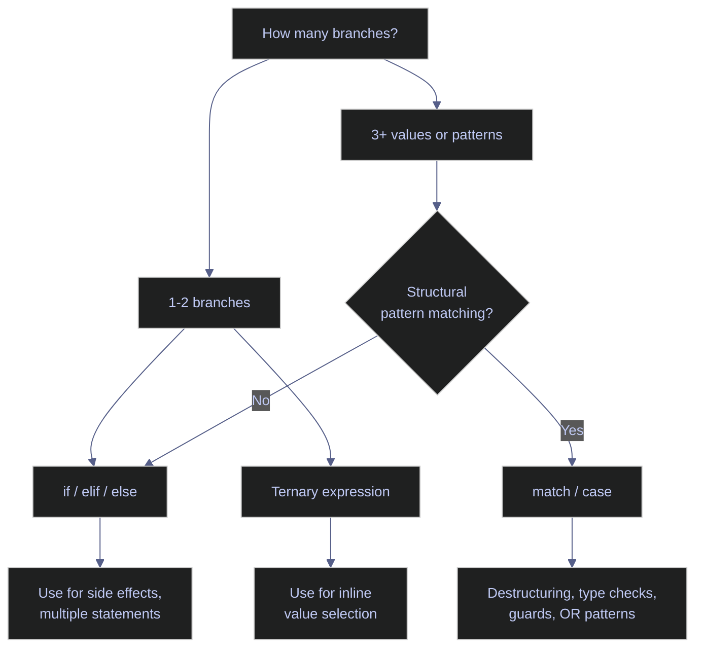
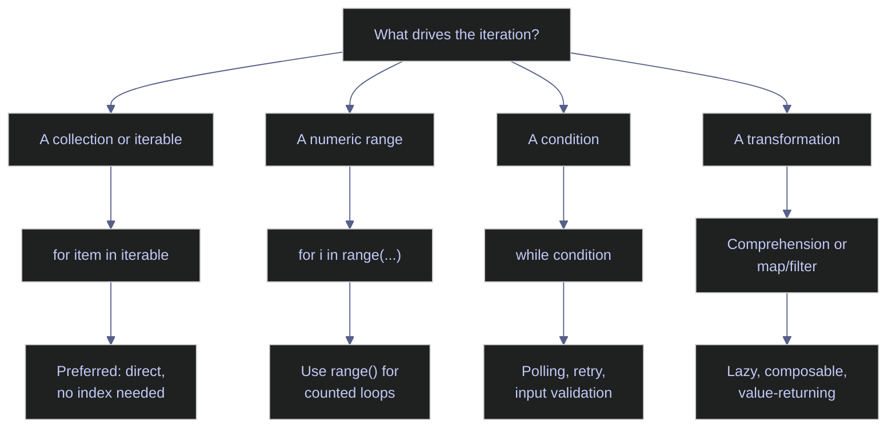

# 03. Control Flow - Python

> [!quote]
> "The quality of programmers is a decreasing function of the density of go to statements in the programs they produce."
>
> — **Edsger W. Dijkstra**, *Go To Statement Considered Harmful* (1968)

Python control flow covers conditional branching (`if`/`elif`/`else`, ternary, `match`/`case`), loops (`for`, `while`), generators with `yield`, and comprehensions as functional equivalents to imperative loops. Python embraces truthy/falsy coercion, chained comparisons, and structural pattern matching (3.10+) — a fundamentally different approach to conditions compared to C#'s explicit `bool` requirement.

## Conditional Statements

Python provides two families of conditional constructs: `if`/`elif`/`else` chains with full truthy/falsy support and chained comparisons, and `match`/`case` (3.10+) for structural pattern matching with destructuring, type checking, and guards.



### Branching with if / elif / else

Basic conditional branching uses indentation-based blocks. Python supports truthy/falsy coercion, chained comparisons (`10 < x < 20`), and inline ternary expressions.

#### if / elif / else — indentation-based branching

Python uses indentation (not braces) to define blocks. Conditions don't need parentheses. `elif` chains for multiple tiers — one keyword instead of `else if`, fewer nesting levels.

Conditional chains check conditions top-to-bottom — the **first matching condition wins**, all subsequent branches are skipped. Put the most specific threshold first (`>=90` before `>=80` before `>=70`). Truthy/falsy: `False`, `0`, `""`, `[]`, `{}`, `None` are falsy; everything else is truthy. Chained comparisons: `10 < x < 20` means `10 < x and x < 20`.

> [!warning] Control flow pitfalls
>
> - Deep `if`/`elif` nesting — extract to functions or use `match`/`case`
> - Redundant `else` after `return` — `if cond: return x; return y` is cleaner
> - Mixing tabs and spaces — causes `IndentationError`

> [!success] Correct pattern
>
> Extract deeply nested branches into named functions. Use early `return` to flatten logic: `if not cond: return; do_work()`. Configure your editor to use 4 spaces consistently — never mix tabs and spaces.

```python
from functools import reduce
from itertools import chain, cycle, repeat, accumulate, product, islice
from more_itertools import collapse
import io, pandas as pd, sys

score = 85
if score >= 90:
    grade = "A"
elif score >= 80:
    grade = "B"
elif score >= 70:
    grade = "C"
elif score >= 60:
    grade = "D"
else:
    grade = "F"
print(f"Score {score} → Grade {grade}")
```

```text
Score 85 → Grade B
```

#### Simple if — single condition without else

A standalone `if` with no `elif` or `else` — the body runs only when the condition is truthy. Python allows the body on the same line for single statements.

```python
x = 10
if x > 0: print(f"{x} is positive")
```

```text
10 is positive
```

#### Ternary operator — inline conditional expression

Inline conditional: `value_if_true if condition else value_if_false`. Reads like natural English. Can nest, but readability drops fast — avoid nesting beyond 2 levels.

```python
age = 20
status = "adult" if age >= 18 else "minor"
print(f"age={age} → {status}")
```

```text
age=20 → adult
```

#### Nested ternary — chained inline conditions

Ternary expressions can chain: `a if c1 else b if c2 else c`. Readability drops fast — avoid nesting beyond 2 levels. For 3+ tiers, use `if`/`elif`/`else` or `match`/`case`.

```python
val = 15
label = "high" if val > 20 else "mid" if val > 10 else "low"
print(f"val={val} → {label}")
```

```text
val=15 → mid
```

#### Truthy/falsy and chained comparisons

> [!info] Truthy/falsy
>
> - `if items:` — `True` for non-empty collections
> - Falsy values: `0`, `0.0`, `""`, `None`, `[]`, `{}`, `set()`
> - Chained comparisons: `0 < x < 100` evaluates `x` only once
> - `and`/`or` return operands: `name = user or "Anonymous"`

> [!warning] Don't use if x == True
>
> Don't use `if x == True` — just `if x`. But be careful with truthy checks when `0` or `""` is legitimate data — be explicit in those cases.

> [!success] Correct pattern
>
> Use `if x:` for truthy checks. When `0`, `""`, or `False` are valid data values, be explicit: `if x is not None:` or `if count != 0:`. Reserve `if x == True` / `if x is True` only when you need to distinguish `True` from other truthy values.

```python
items = [1, 2, 3]
if items:
    print(f"List has {len(items)} items")

name = ""
if not name:
    print("Name is empty")

value = None
if value is None:
    print("Value is None")

x = 15
if 10 < x < 20:
    print(f"{x} is between 10 and 20")
```

```text
List has 3 items
Name is empty
Value is None
15 is between 10 and 20
```

### Pattern matching with match / case

Python 3.10 introduced structural pattern matching with `match`/`case`. Unlike C#'s switch, Python's `match` destructures values, binds variables, and tests types in one step — the pattern shape IS the condition.

#### match/case — pattern matching

> [!info] Pattern matching (Python 3.10+)
>
> - `match`/`case` — tests against patterns, not just equality
> - `|` for OR, `_` for wildcard, `if` for guards, variable binding
> - First match wins

> [!warning] Bare variable names in case
>
> Bare variable names in `case` **capture** (don't compare) — use literals or guards. Don't forget the `_` default — unmatched values silently pass through.

> [!success] Correct pattern
>
> Use string literals for equality: `case "start":`. For variable comparison, use a guard: `case cmd if cmd == expected:`. Always add a `case _:` wildcard as the final branch to handle unmatched values explicitly.

```python
command = "quit"
match command:
    case "start":
        print("Starting...")
    case "stop" | "quit" | "exit":
        print("Stopping...")
    case str(cmd) if cmd.startswith("go"):
        cmd
    case _:
        command
```

```text
Stopping...
```

#### match with destructuring

`case (x, 0)` binds `x` from a 2-tuple where second is 0. `case {"key": val}` matches dict structure. Combines validation and extraction in one step — the shape IS the condition.

```python
point = (3, 0)
match point:
    case (0, 0):
        print("Origin")
    case (x, 0):
        print(f"On x-axis at {x}")
    case (0, y):
        print(f"On y-axis at {y}")
    case (x, y):
        print(f"Point at ({x}, {y})")
```

```text
On x-axis at 3
```

#### match with type checking

> [!info] Type patterns
>
> - `case int(n)` — matches integers and binds to `n`
> - Combine with guards: `case int(n) if n > 0`
> - Replaces `isinstance()` chains with clean pattern syntax

```python
def describe(value):
    match value:
        case int(n) if n > 0:
            return f"positive int: {n}"
        case int(n):
            return f"non-positive int: {n}"
        case str(s):
            return f"string: '{s}'"
        case [first, *rest]:
            return f"list starting with {first}, {len(rest)} more"
        case _:
            return f"other: {type(value).__name__}"

for v in [42, -5, "hello", [1, 2, 3], 3.14]:
    print(f"  {str(v):12} → {describe(v)}")
```

```text
  42           → positive int: 42
  -5           → non-positive int: -5
  hello        → string: 'hello'
  [1, 2, 3]    → list starting with 1, 2 more
  3.14         → other: float
```

## Loops

Python provides two loop constructs: `for` (iterates any iterable) and `while` (condition-driven). There is no C-style `for(i=0; i<n; i++)` — use `range()` instead. Python has no `do-while` — use `while True: ... if cond: break`. The `for`/`else` construct runs the `else` block only when no `break` occurred.



### for loop and iterables

The `for` loop iterates any object implementing the iterator protocol (`__iter__`/`__next__`): lists, tuples, strings, dicts, ranges, generators, and files. Use `enumerate()` for indices and `zip()` for parallel iteration.

#### for loops — iteration over iterables

> [!info] Loop types
>
> - `for` — iterates over any iterable (list, range, dict, generator)
> - `while` — repeats until the condition is false
> - `for i in range(n)` — replaces C-style `for(i=0; i<n; i++)`
> - `for`/`else` — the `else` block runs only if no `break` occurred
> - No `do-while` — use `while True: ... if cond: break`

> [!warning] Loop anti-patterns
>
> - `for i in range(len(items))` — use `for item in items` or `enumerate()`
> - `while True` without `break` — always have an exit condition
> - Modifying a list during iteration — use a copy or comprehension

> [!success] Correct pattern
>
> Iterate directly: `for item in items:` or with index: `for i, item in enumerate(items):`. For `while True`, always include a clear exit: `if condition: break`. To filter during iteration, build a new list: `items = [x for x in items if keep(x)]`.

```python
for fruit in ["apple", "banana", "cherry"]:
    print(f"  {fruit}")
```

```text
  apple
  banana
  cherry
```

#### Generate sequences with range()

> [!info] range() forms
>
> - `range(stop)`, `range(start, stop)`, `range(start, stop, step)`
> - Stop is exclusive; negative step for countdown
> - Lazy — constant memory regardless of size; `500 in range(1000)` is O(1)

```python
for i in range(5):
    print(f"  {i}", end=" ")
print()

for i in range(2, 8):
    print(f"  {i}", end=" ")
print()
```

```text
  0  1  2  3  4
  2  3  4  5  6  7
```

#### range() with step — custom stride and countdown

The third argument sets the step. Positive step for skipping forward, negative step for counting down. The stop value is always exclusive.

```python
for i in range(0, 20, 3):
    print(f"  {i}", end=" ")
print()

for i in range(10, 0, -2):
    print(f"  {i}", end=" ")
print()
```

```text
  0  3  6  9  12  15  18
  10  8  6  4  2
```

#### Iterating strings and dicts — .items(), .values(), .keys()

Strings yield characters one at a time. Dicts yield keys by default; `.items()` for `(key, value)`, `.values()` for values only. Don't use `for key in dict: dict[key]` — use `for k, v in dict.items()`.

```python
for ch in "Hello":
    print(f"  '{ch}'", end=" ")
print()

d = {"name": "Alice", "age": 30, "city": "NYC"}
for key in d:
    print(f"  {key} = {d[key]}")

for key, value in d.items():
    print(f"  {key}: {value}")
```

```text
  'H'  'e'  'l'  'l'  'o'
  name = Alice
  age = 30
  city = NYC
  name: Alice
  age: 30
  city: NYC
```

#### enumerate and zip

> [!info] Enumerate and zip
>
> - `enumerate(iterable, start=0)` — yields `(index, element)`
> - `zip(a, b)` — yields `(a_i, b_i)`, stopping at the shortest
> - Both are lazy; use `enumerate` instead of `range(len(items))`
>
> > [!warning] `zip` with unequal lengths silently truncates — use `zip_longest` if needed.

```python
for i, fruit in enumerate(["apple", "banana", "cherry"]):
    print(f"  [{i}] {fruit}")

for i, fruit in enumerate(["apple", "banana"], start=1):
    print(f"  [{i}] {fruit}")
```

```text
  [0] apple
  [1] banana
  [2] cherry
  [1] apple
  [2] banana
```

#### Parallel iteration with zip

`zip(a, b)` yields `(a_i, b_i)` tuples, stopping at the shortest iterable. Use for lock-step iteration of parallel sequences — names with ages, keys with values, expected with actual.

```python
names = ["Alice", "Bob", "Charlie"]
ages = [30, 25, 35]
for name, age in zip(names, ages):
    print(f"  {name} is {age}")
```

```text
  Alice is 30
  Bob is 25
  Charlie is 35
```

### while loops and for / else

`while` repeats until the condition is false. Python's unique `for`/`else` construct runs the `else` block only when no `break` occurred — useful for search patterns. Python has no `do-while`; use `while True: ... if cond: break` instead.

#### while — condition-first loop

`while` repeats until the condition is false. The body may never execute if the condition is `false` from the start. Use for polling, retry, input validation, and any loop where the iteration count is not known in advance.

```python
count = 0
while count < 5:
    print(f"  count = {count}")
    count += 1
```

```text
  count = 0
  count = 1
  count = 2
  count = 3
  count = 4
```

#### for/else — search found/not found idiom

The `else` block runs only when no `break` occurred — it signals "search completed without finding a match." Use exclusively for search patterns.

> [!warning] The else in for/else runs
>
> The `else` in `for`/`else` runs when there's **no** `break` — the name is counterintuitive. Don't use it for non-search patterns.

```python
for n in [2, 4, 6, 8]:
    if n % 3 == 0:
        print(f"  Found multiple of 3: {n}")
        break
else:
    print("  No multiple of 3 found")
```

```text
  Found multiple of 3: 6
```

#### do-while workaround — while True with break

Python has no `do-while`. Use `while True: body; if cond: break` to guarantee at least one execution before checking the exit condition.

```python
while True:
    val = 42
    print(f"  Got value: {val}")
    if val > 0:
        break
```

```text
  Got value: 42
```

#### Nested loops — Cartesian iteration

Nested `for` loops produce the Cartesian product of two ranges. For deeper nesting, prefer `itertools.product()` to keep the code flat and readable.

```python
for i in range(3):
    for j in range(3):
        print(f"  ({i},{j})", end="")
    print()
```

```text
  (0,0)  (0,1)  (0,2)
  (1,0)  (1,1)  (1,2)
  (2,0)  (2,1)  (2,2)
```

## Loop Control

Python provides `break` to exit a loop, `continue` to skip to the next iteration, and `pass` as a no-op placeholder. Python has no labeled break or `goto` — for multi-level exit, use a flag variable or extract to a function with `return`. The walrus operator (`:=`) enables assignment within loop conditions.

### Control keywords

Keywords that alter loop execution and flow: `break` exits immediately, `continue` skips to the next iteration, `pass` is a no-op placeholder, and `:=` enables inline assignment in conditions.

#### break — exit the innermost loop

> [!info] Loop control
>
> - `break` — exits the innermost loop immediately (does NOT exit outer loops)
> - `continue` — skips to the next iteration
> - `pass` — no-op placeholder for empty blocks
> - Python has no labeled break — none of these affect outer loops
> - Walrus operator (`:=`) — assigns a value AND returns it in one expression

```python
for i in range(10):
    if i == 5:
        print(f"  Breaking at {i}")
        break
    print(f"  {i}", end=" ")
```

```text
  0  1  2  3  4  Breaking at 5
```

#### continue — skip to the next iteration

`continue` jumps to the next iteration, skipping the remaining body. Use for filtering within a loop when a comprehension is not practical — avoids nested `if`/`else` blocks.

```python
for i in range(10):
    if i % 2 == 0:
        continue
    print(f"  {i}", end=" ")
```

```text
  1  3  5  7  9
```

#### pass — no-op placeholder

`pass` is a no-op statement for syntactically required but intentionally empty blocks: stubs, placeholder classes, and `except` blocks during development.

> [!warning] Don't use pass in production
>
> Don't use `pass` in production `except` blocks — at minimum log the error.

> [!success] Correct pattern
>
> In `except` blocks, always handle or log: `except ValueError as e: logger.warning("Invalid input: %s", e)`. Use `pass` only as a temporary placeholder during development or for intentionally empty class/function stubs.

```python
for i in range(5):
    if i == 3:
        pass
    else:
        print(f"  {i}", end=" ")

class Placeholder:
    pass
```

```text
  0  1  2  4
```

#### Nested break behavior — only exits the innermost loop

In nested loops, `break` affects only the innermost loop — outer loops continue. Python has no labeled break. For multi-level exit, use a flag + break, or extract to a function and `return`.

```python
for i in range(3):
    for j in range(3):
        if j == 2:
            break
        print(f"  ({i},{j})", end="")
    print()
```

```text
  (0,0)  (0,1)
  (1,0)  (1,1)
  (2,0)  (2,1)
```

#### Breaking outer loops with a flag

Set a flag variable in the inner loop, then check it in the outer loop. Verbose but explicit — works when extraction to a function is not practical.

```python
found = False
for i in range(3):
    for j in range(3):
        if i == 1 and j == 1:
            found = True
            break
    if found:
        break
print(f"  Broke at ({i},{j})")
```

```text
  Broke at (1,1)
```

#### Breaking outer loops with return

Wrap nested loops in a function and use `return` to exit all loops at once. Cleaner and more Pythonic than flag variables.

```python
def find_pair():
    for i in range(3):
        for j in range(3):
            if i == 1 and j == 1:
                return (i, j)
    return None
print(find_pair())
```

```text
(1, 1)
```

#### Walrus operator — :=

`(var := expr)` assigns and returns the value in one expression. Eliminates the "read-before-loop" duplication. Also works in comprehensions: `[y for x in data if (y := f(x)) > 0]`. Don't overuse — simple assignments are clearer with `=`.

```python
reader = io.StringIO("line1\nline2\nline3\n")
while (line := reader.readline()):
    print(f"  '{line.strip()}'")
```

```text
  'line1'
  'line2'
  'line3'
```

#### Walrus in if conditions and comprehensions

`:=` in an `if` condition assigns and tests in one expression — eliminates a separate assignment line. In comprehensions, it captures an intermediate computation for reuse in both the filter and the output expression.

```python
data = "Hello World"
if (n := len(data)) > 5:
    print(f"  String has {n} chars (> 5)")

results = [y for x in range(10) if (y := x ** 2) > 20]
print(results)
```

```text
  String has 11 chars (> 5)
[25, 36, 49, 64, 81]
```

## Iterators & Generators

Generator functions use `yield` to produce values lazily — Python suspends execution at each `yield` and resumes on the next `next()` call. This enables memory-efficient processing of large or infinite sequences, composable pipelines, and custom traversal logic. `yield from` delegates to sub-generators in a single expression — Python's equivalent to C#'s `foreach (var x in sub) yield return x`.

### Generator functions and expressions

`yield` turns a function into a generator. Generator expressions `(x for x in ...)` are the lazy counterpart to list comprehensions. Both are single-use — exhausted after one pass.

#### Generator functions — yield for lazy sequences

A function with `yield` becomes a generator. Each `next()` call resumes execution until the next `yield` — state is preserved between calls. Values are computed lazily (on demand, not upfront). Generators are single-use — exhausted after one pass.

Key concepts: `yield from` delegates to sub-generators, generator expressions `(x for x in ...)` are lazy comprehensions, `StopIteration` signals exhaustion, and the iterator protocol requires `__iter__()` + `__next__()`.

> [!warning] Generator pitfalls
>
> - Returning a list when `yield` would be lazier
> - Calling `list()` on a generator just to iterate — defeats lazy evaluation
> - Generators are single-use — exhausted after one pass

> [!success] Correct pattern
>
> Use `yield` to return values lazily: `def gen(): yield item`. Iterate directly with `for item in gen():` — no need to call `list()` first. If you need multiple passes, call the generator function again to create a fresh iterator.

```python
def countdown(n):
    print(f"  Starting countdown from {n}")
    while n > 0:
        yield n
        n -= 1
    print("  Done!")

for val in countdown(5):
    print(f"  {val}", end=" ")
```

```text
  Starting countdown from 5
  5  4  3  2  1  Done!
```

#### Manual iteration with next()

`next(gen)` returns the next yielded value. Raises `StopIteration` when exhausted — use `next(gen, default)` to return a default instead. Use for peeking at the first element or partial consumption.

```python
gen = countdown(3)
print(next(gen))
print(next(gen))
print(next(gen))
```

```text
  Starting countdown from 3
3
2
1
```

#### List vs generator expression

> [!info] List vs generator expression
>
> - `[expr for x in iter]` — creates a list in memory (eager)
> - `(expr for x in iter)` — creates a generator (lazy, on-demand, constant memory)
> - As a function arg, parentheses can be omitted: `sum(x**2 for x in range(n))`
> - Use **generators** for large/streaming data; **lists** when you need indexing, `len()`, or multiple passes

```python
squares_list = [x**2 for x in range(10)]
print(squares_list)
```

```text
[0, 1, 4, 9, 16, 25, 36, 49, 64, 81]
```

#### Generator expression — lazy on-demand evaluation

`(expr for x in iter)` creates a generator that computes values on demand. As a function argument, outer parentheses can be omitted: `sum(x**2 for x in range(n))`. Generators are single-use — exhausted after one pass.

```python
squares_gen = (x**2 for x in range(10))
print(squares_gen)
print(list(squares_gen))
```

```text
<generator object <genexpr> at 0x...>
[0, 1, 4, 9, 16, 25, 36, 49, 64, 81]
```

#### Memory comparison — list vs generator

The list stores all 100,000 values in memory (~800 KB), while the generator object uses a constant ~192 bytes regardless of how many values it will produce. Use generators for large or streaming data; lists when you need indexing, `len()`, or multiple passes.

```python
big_list = [x for x in range(100000)]
big_gen = (x for x in range(100000))
print(f"List size:      {sys.getsizeof(big_list):>8} bytes")
print(f"Generator size: {sys.getsizeof(big_gen):>8} bytes")
```

```text
List size:        800984 bytes
Generator size:      192 bytes
```

#### yield from

`yield from iterable` replaces `for item in iterable: yield item` in one line. Enables recursive generators (flatten) and delegation to sub-generators. Watch out: `yield from` on strings yields each character separately, and deep recursion may hit the limit.

```python
def flatten(nested):
    for item in nested:
        if isinstance(item, list):
            yield from flatten(item)
        else:
            yield item

nested = [1, [2, 3], [4, [5, 6]], 7]
print(list(flatten(nested)))
```

```text
[1, 2, 3, 4, 5, 6, 7]
```

### Infinite generators and itertools

Infinite generators use `while True` with `yield` to produce unbounded sequences. The `itertools` module provides composable, memory-efficient iterator building blocks. All are lazy — values are computed on demand.

#### Infinite generator with yield

`while True` with `yield` produces infinite values. Callers control consumption with `islice`, `break`, or `zip`. Zero storage — values computed on demand.

> [!danger] Never call list() or len()
>
> Never call `list()` or `len()` on an infinite generator — hangs or OOM. Always limit with `islice` or `break`.

> [!success] Correct pattern
>
> Use `itertools.islice` to safely take a finite number of values: `list(islice(naturals(), 10))`. In loops, use `break` to exit when the desired condition is met: `for n in naturals(): if n > 100: break`.

```python
def naturals(start=0):
    n = start
    while True:
        yield n
        n += 1

print(list(islice(naturals(), 5)))
print(list(islice(naturals(10), 5)))
```

```text
[0, 1, 2, 3, 4]
[10, 11, 12, 13, 14]
```

#### Built-in lazy iterators — range, enumerate, zip, map, filter, reversed

`range`, `enumerate`, `zip`, `map`, `filter`, and `reversed` are all lazy built-in iterators — wrap in `list()` to materialize. They consume constant memory regardless of input size.

```python
print(list(range(5)))
print(list(enumerate('abc')))
print(list(zip([1,2], ['a','b'])))
print(list(map(str.upper, ['a','b'])))
print(list(filter(lambda x: x > 2, [1,2,3,4])))
print(list(reversed([1,2,3])))
```

```text
[0, 1, 2, 3, 4]
[(0, 'a'), (1, 'b'), (2, 'c')]
[(1, 'a'), (2, 'b')]
['A', 'B']
[3, 4]
[3, 2, 1]
```

#### itertools — chain, cycle, repeat, accumulate, product

> [!info] Key itertools functions (all lazy generators)
>
> - `chain` — joins iterables end-to-end
> - `cycle` — repeats infinitely
> - `repeat` — yields same value *n* times
> - `accumulate` — computes running totals
> - `product` — Cartesian product
>
> > [!warning] Never `list(cycle(...))` — infinite memory.

```python
print(list(chain([1,2], [3,4])))
print(list(repeat('x', 3)))
print(list(accumulate([1,2,3,4])))
print(list(product('ab', '12')))
```

```text
[1, 2, 3, 4]
['x', 'x', 'x']
[1, 3, 6, 10]
[('a', '1'), ('a', '2'), ('b', '1'), ('b', '2')]
```

#### Iterator protocol — __iter__ and __next__

Define `__iter__(self)` returning `self` and `__next__(self)` raising `StopIteration` when done. Makes any class usable in `for` loops, `list()`, and all iteration contexts. Use for complex stateful iteration — for simple sequences, generator functions are much less code.

```python
class Squares:
    def __init__(self, n):
        self.n = n
        self.i = 0
    def __iter__(self):
        return self
    def __next__(self):
        if self.i >= self.n:
            raise StopIteration
        val = self.i ** 2
        self.i += 1
        return val

print(list(Squares(5)))
```

```text
[0, 1, 4, 9, 16]
```

### Flattening nested structures

Flattening converts nested collections into a single flat sequence. Python offers multiple approaches depending on depth and dependencies: `chain.from_iterable` (1 level), `more_itertools.collapse` (any depth), stack-based iterative (no dependencies), and `pd.json_normalize` (nested dicts).

#### Flatten nested iterables — four approaches

Four flatten approaches, each suited to a different nesting depth: `chain.from_iterable` (1 level), `more_itertools.collapse` (any depth), stack-based iterative (no dependencies), `pd.json_normalize` (nested dicts).

```python
nested = [1, [2, 3], [4, [5, 6]], 7]
```

#### itertools chain.from_iterable and more_itertools collapse

`chain.from_iterable` flattens exactly one level — inner lists stay nested. Stdlib, lazy, no external dependency. For arbitrary depth, use `more_itertools.collapse`.

```python
one_level = list(chain.from_iterable([[1, 2], [3, 4], [5, 6]]))
print(one_level)
```

```text
[1, 2, 3, 4, 5, 6]
```

#### more_itertools collapse — arbitrary depth

`collapse` from `more_itertools` flattens any depth of nesting in one call. External dependency, but the simplest solution for deeply nested structures.

```python
nested = [1, [2, 3], [4, [5, 6]], 7]
print(list(collapse(nested)))
```

```text
[1, 2, 3, 4, 5, 6, 7]
```

#### Iterative Flatten with Stack

Stack-based iterative flatten — no recursion, no depth limits, handles arbitrarily deep nesting safely. Watch out: strings are iterable and cause infinite loops if not checked.

```python
def flatten_iter(nested):
    """Flatten using an explicit stack — no recursion needed."""
    stack = list(reversed(nested))
    result = []
    while stack:
        item = stack.pop()
        if isinstance(item, list):
            stack.extend(reversed(item))
        else:
            result.append(item)
    return result

nested = [1, [2, 3], [4, [5, 6]], 7]
print(flatten_iter(nested))
```

```text
[1, 2, 3, 4, 5, 6, 7]
```

#### pandas json_normalize

`pd.json_normalize` takes a list of nested dicts, flattens nested keys into dot-separated column names, and handles missing keys with NaN. One-line flatten for API responses and JSON files.

```python
nested_records = [
    {"name": "Alice", "address": {"city": "NYC", "zip": "10001"}},
    {"name": "Bob", "address": {"city": "LA", "zip": "90001"}},
]
df = pd.json_normalize(nested_records)
print(df)
```

```text
    name address.city address.zip
0  Alice          NYC       10001
1    Bob           LA       90001
```

#### Flatten approach summary

| Scenario | Approach |
|---|---|
| 1 level deep | `list(chain.from_iterable(nested))` |
| Any depth | `list(collapse(nested))` (more-itertools) |
| No dependencies | Iterative with stack (no recursion needed) |
| Nested JSON | `pd.json_normalize(records)` |

## Comprehensions & Functional Tools

Comprehensions are Python's declarative syntax for building lists, dicts, and sets in a single expression. They replace imperative `for`/`append` patterns with concise, readable, and faster alternatives. Functional tools (`map`, `filter`, `reduce`, `sorted`) provide composable transformations — prefer comprehensions with lambdas, but use `map`/`filter` when you already have a named function.

### Comprehensions

List, dict, and set comprehensions build new collections from iterables with optional filtering. They are optimized at bytecode level and faster than equivalent `for` loops.

#### List comprehension — concise collection building

`[expr for item in iterable if condition]` — builds a new list by applying an expression to each element, optionally filtering with `if`. More readable than `map`/`filter`/`lambda` and faster than equivalent `for` loops (optimized at bytecode level).

> [!warning] Don't use comprehensions for side
>
> Don't use comprehensions for side effects (printing, writing). Don't nest beyond 2 levels — use explicit loops instead.

> [!success] Correct pattern
>
> Use comprehensions only to build collections: `squares = [x**2 for x in range(10)]`. For side effects (printing, writing, mutating), use an explicit `for` loop. Keep nesting to 2 levels maximum; beyond that, extract the inner logic into a named function.

```python
squares = [x**2 for x in range(10)]
print(squares)
```

```text
[0, 1, 4, 9, 16, 25, 36, 49, 64, 81]
```

#### List comprehension with filter — if clause

Adding `if condition` filters elements before the expression is applied. Only elements satisfying the predicate appear in the output list.

```python
evens = [x for x in range(20) if x % 2 == 0]
print(evens)
```

```text
[0, 2, 4, 6, 8, 10, 12, 14, 16, 18]
```

#### List comprehension with filter and transform

Combine `if` filtering with an expression transform in a single comprehension — the Pythonic equivalent of a `.Where().Select()` chain.

```python
words = ["hello", "world", "python", "is", "great"]
long_upper = [w.upper() for w in words if len(w) > 3]
print(long_upper)
```

```text
['HELLO', 'WORLD', 'PYTHON', 'GREAT']
```

#### Nested comprehensions

`[expr for outer in iter1 for inner in iter2]` — outer loop first, then inner (same order as nested `for` loops). One-line flatten: `[n for row in matrix for n in row]`. Don't nest beyond 2 levels.

```python
matrix = [[1, 2, 3], [4, 5, 6], [7, 8, 9]]
flat = [n for row in matrix for n in row]
print(flat)

grid = [[(i, j) for j in range(3)] for i in range(3)]
print(grid)
```

```text
[1, 2, 3, 4, 5, 6, 7, 8, 9]
[[(0, 0), (0, 1), (0, 2)], [(1, 0), (1, 1), (1, 2)], [(2, 0), (2, 1), (2, 2)]]
```

#### Dict and set comprehensions

> [!info] Dict and set comprehensions
>
> - `{k: v for item in iterable}` — builds a dict
> - `{expr for item}` — builds a set (auto-deduplicates)
> - Both support `if` filtering
> - Invert a dict: `{v: k for k, v in d.items()}`
>
> > [!warning] Dict with duplicate keys — last value wins silently.

```python
squares_dict = {x: x**2 for x in range(6)}
print(squares_dict)

original = {"a": 1, "b": 2, "c": 3}
swapped = {v: k for k, v in original.items()}
print(swapped)

scores = {"Alice": 85, "Bob": 92, "Charlie": 78, "Diana": 95}
passed = {name: score for name, score in scores.items() if score >= 80}
print(passed)
```

```text
{0: 0, 1: 1, 2: 4, 3: 9, 4: 16, 5: 25}
{1: 'a', 2: 'b', 3: 'c'}
{'Alice': 85, 'Bob': 92, 'Diana': 95}
```

#### Set comprehension — auto-deduplicated collection

`{expr for item in iterable}` builds a `set` — automatically deduplicates. Use for extracting unique values from a sequence.

```python
words = ["hello", "world", "python", "is", "great"]
unique_lengths = {len(w) for w in words}
print(unique_lengths)
```

```text
{2, 5, 6}
```

### Functional programming

`map`, `filter`, and `reduce` provide functional-style transformations. Built-in aggregations (`sum`, `max`, `min`, `any`, `all`) are preferred over `reduce` for common operations — they are implemented in C and short-circuit where applicable.

#### map and filter

> [!info] Map and filter
>
> - `map(func, iterable)` — applies `func` to every element
> - `filter(pred, iterable)` — keeps elements where `pred` is True
> - Both are lazy; best with named functions (`map(str.upper, words)`)
> - With lambdas, comprehensions are almost always clearer

```python
nums = [1, 2, 3, 4, 5]
doubled = list(map(lambda x: x * 2, nums))
print(doubled)

doubled2 = [x * 2 for x in nums]
print(doubled2)
```

```text
[2, 4, 6, 8, 10]
[2, 4, 6, 8, 10]
```

#### filter — keep elements matching a predicate

`filter(pred, iterable)` keeps elements where `pred` returns `True`. Lazy — wrap in `list()` to materialize. With lambdas, a list comprehension with `if` is usually clearer.

```python
nums = [1, 2, 3, 4, 5]
evens = list(filter(lambda x: x % 2 == 0, nums))
print(evens)
```

```text
[2, 4]
```

#### reduce — general-purpose fold

`reduce(func, iterable, initial)` applies `func` cumulatively, folding the sequence into a single value. The third argument is the initial accumulator. Use for custom reductions that built-in functions don't cover.

```python
nums = [1, 2, 3, 4, 5]
total = reduce(lambda acc, x: acc + x, nums, 0)
print(total)

product = reduce(lambda acc, x: acc * x, nums, 1)
print(product)
```

```text
15
120
```

#### Built-in aggregations — sum, max, min, any, all

Prefer built-ins over `reduce` for common operations — they are implemented in C and short-circuit where applicable. `any()` stops on the first `True`; `all()` stops on the first `False`.

```python
nums = [1, 2, 3, 4, 5]
print(sum(nums))
print(max(nums))
print(min(nums))
print(all(x > 0 for x in nums))
print(any(x > 3 for x in nums))
```

```text
15
5
1
True
True
```

#### sorted() with key function — custom sort order, multi-key, reverse

> [!info] Sorting
>
> - `sorted(iterable, key=func)` — returns a new sorted list
> - `list.sort()` — sorts in place
> - `key` extracts the comparison value: `key=len`, `key=str.lower`, `key=lambda x: x[1]`
> - `reverse=True` — descending order
> - Python's sort is **stable** — equal elements keep original order
> - Multiple sort keys — return a tuple: `key=lambda x: (x[0], -x[1])`

```python
names = ["Charlie", "Alice", "Bob", "Diana"]
print(sorted(names))
print(sorted(names, key=len))
print(sorted(names, reverse=True))
print(sorted(names, key=lambda n: n[-1]))
```

```text
['Alice', 'Bob', 'Charlie', 'Diana']
['Bob', 'Alice', 'Diana', 'Charlie']
['Diana', 'Charlie', 'Bob', 'Alice']
['Diana', 'Bob', 'Charlie', 'Alice']
```

#### Choosing the right iteration construct

| Construct | Use when |
|---|---|
| **Comprehension** | Simple transform/filter → new collection |
| **`for` loop** | Side effects, complex logic, multiple statements |
| **`map`/`filter`** | You already have a named function |
| **Generator** | Lazy pipeline, large data, memory-constrained |

> [!warning] Avoid nested comprehensions with more
>
> Avoid nested comprehensions with more than 2 levels — use explicit loops instead. Don't use comprehensions for side effects; don't use `for` loops when a comprehension would be cleaner.

> [!success] Correct pattern
>
> Keep comprehensions to one or two levels: `[n for row in matrix for n in row]`. For 3+ levels, break out the inner logic: `def process_row(row): return [transform(n) for n in row]`, then `[n for row in matrix for n in process_row(row)]`.
