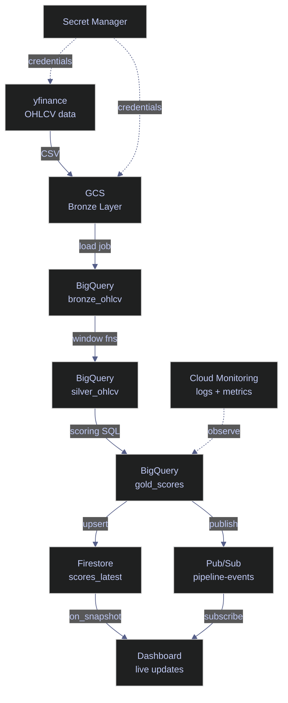

# 17. GCP - Python

> [!quote]
> "Everything fails all the time, so plan for failure and nothing fails."
>
> — **Werner Vogels**, CTO of Amazon


## How the Pipeline Works

The index ETL pipeline moves market data through three layers — Bronze (raw), Silver (cleaned), Gold (scored) — using GCP-managed services at each stage. Secret Manager and Cloud Monitoring are cross-cutting concerns that apply throughout.



## Topics Covered
- Authentication & Setup
- Cloud Storage (GCS)
- BigQuery
- Pub/Sub
- Firestore (+ real-time listeners)
- Secret Manager
- Cloud Monitoring

## Authentication & Setup

**Pipeline role:** The foundation — every GCP service call is authenticated via a service account key. The key file (JSON) is set via `GOOGLE_APPLICATION_CREDENTIALS` env var. All libraries auto-detect it.

Service Account (SA) — non-human identity with specific roles. `GOOGLE_APPLICATION_CREDENTIALS` env var points to the JSON key file — all `google-cloud-*` libraries auto-detect it via the ADC chain: env var → `gcloud auth application-default login` → GCE metadata server.

### Imports and project constants

All `google-cloud-*` libraries follow the same pattern: import the service module and call `Client(project=PROJECT_ID)`. No explicit credential initialization is needed — each client reads the ADC chain automatically on construction.

```python
import io
import json
import os
import time
import threading
from datetime import datetime, timedelta

from google.api import metric_pb2
from google.cloud import bigquery, firestore, monitoring_v3, pubsub_v1, secretmanager, storage
from google.protobuf.timestamp_pb2 import Timestamp
import google.cloud.logging as cloud_logging
import pandas as pd
import yfinance as yf

PROJECT_ID = "index-lab-2"
REGION = "europe-west1"
BUCKET_NAME = f"{PROJECT_ID}-index-data"
BQ_DATASET = "index_data"
```

### Verify credentials

`GOOGLE_APPLICATION_CREDENTIALS` must point to a service account JSON key file. If the env var is not set, each client falls back to the next step in the ADC chain. In a Cloud Run or GKE environment the metadata server provides credentials automatically — no key file needed.

```python
creds_path = os.environ.get('GOOGLE_APPLICATION_CREDENTIALS', 'NOT SET')
print(creds_path)                                                          # path
print(os.path.exists(creds_path) if creds_path != 'NOT SET' else False)   # file exists
print(PROJECT_ID)                                                          # project
print(REGION)                                                              # region
```

```text
NOT SET
False
index-lab-2
europe-west1
```

## Cloud Storage (GCS)

**Pipeline role: BRONZE LAYER** — Raw data lands here first. yfinance OHLCV data is fetched and uploaded as CSV to `gs://bucket/bronze/ohlcv/`. GCS is the data lake — immutable, versioned, cheap storage. Downstream services (BigQuery, pipelines) read from here. For the CLI equivalents of these operations (`gsutil cp`, `gcloud storage cp`, lifecycle rules), see [gcs-object-operations](https://alp78.github.io/elysium/06-GCP/Storage/gcs-object-operations).

GCS organizes data into **buckets** (globally unique top-level containers) containing **blobs** (objects identified by path). Prefixes like `bronze/`, `silver/`, `gold/` simulate a folder hierarchy. C# equivalent: `Google.Cloud.Storage.V1` (`StorageClient`).

### Fetch source data and upload to GCS

#### Create the GCS client and bucket reference

`storage.Client(project=PROJECT_ID)` authenticates via ADC and returns a project-scoped client. `gcs.bucket(BUCKET_NAME)` returns a local `Bucket` object — no network call is made until an operation is issued against it.

```python
gcs = storage.Client(project=PROJECT_ID)
bucket = gcs.bucket(BUCKET_NAME)
tickers = ["ASML.AS", "MC.PA", "SAP.DE", "SIE.DE", "TTE.PA"]
```

#### Fetch OHLCV data from yfinance

`yf.Ticker(ticker).history()` calls the Yahoo Finance API and returns a DataFrame with OHLCV columns. `auto_adjust=False` preserves both the `Close` and `Adj Close` columns — adjusted close accounts for splits and dividends, while raw close is used for index calculations.

```python
end_date = datetime.now()
start_date = end_date - timedelta(days=90)

all_data = []
for ticker in tickers:
    df = yf.Ticker(ticker).history(start=start_date, end=end_date, interval='1d', auto_adjust=False)
    if df.empty:
        print(f"  {ticker}: no data")
        continue
    df = df.reset_index()
    df['symbol'] = ticker
    df['Date'] = df['Date'].dt.strftime('%Y-%m-%d')
    all_data.append(df)
    print(f"  {ticker}: {len(df)} rows")

ohlcv_df = pd.concat(all_data, ignore_index=True)
print(f"\nTotal: {len(ohlcv_df)} rows")
```

```text
  ASML.AS: 62 rows
  MC.PA: 62 rows
  SAP.DE: 60 rows
  SIE.DE: 60 rows
  TTE.PA: 62 rows

Total: 306 rows
```

#### Upload a CSV to GCS

`blob.upload_from_string(data, content_type)` writes bytes or a string directly to GCS — no temp file needed. The blob path (`bronze/ohlcv/YYYYMMDD_ohlcv.csv`) follows the Hive-style partition convention for BigQuery compatibility.

```python
csv_buffer = ohlcv_df.to_csv(index=False)
blob_path = f"bronze/ohlcv/{datetime.now().strftime('%Y%m%d')}_ohlcv.csv"
bucket.blob(blob_path).upload_from_string(csv_buffer, content_type='text/csv')
print(f"  Uploaded: gs://{BUCKET_NAME}/{blob_path} ({len(csv_buffer):,} bytes)")
```

```text
  Uploaded: gs://index-lab-2-index-data/bronze/ohlcv/20260322_ohlcv.csv (35,426 bytes)
```

### Object operations

#### List objects in a prefix

`gcs.list_blobs(bucket, prefix)` returns a lazy iterator of `Blob` objects — it pages through results automatically. Passing `max_results` caps the response for preview purposes.

```python
for blob in gcs.list_blobs(BUCKET_NAME, prefix="bronze/", max_results=10):
    print(f"  {blob.name:50s} {blob.size or 0:>10,} bytes")
```

```text
  bronze/.keep                                                0 bytes
  bronze/ohlcv/20260322_ohlcv.csv                        35,426 bytes
```

#### Download an object and read as DataFrame

`bucket.blob(path).download_as_text()` fetches the object content as a UTF-8 string. Wrapping in `io.StringIO` lets `pd.read_csv` parse it without writing to disk.

```python
downloaded = bucket.blob(blob_path).download_as_text()
df_check = pd.read_csv(io.StringIO(downloaded))
print(f"  Downloaded: {len(df_check)} rows, {len(df_check.columns)} columns")
print(list(df_check.columns))
print(sorted(df_check["symbol"].unique()))
```

```text
  Downloaded: 306 rows, 10 columns
  ['Date', 'Open', 'High', 'Low', 'Close', 'Adj Close', 'Volume', 'Dividends', 'Stock Splits', 'symbol']
  ['ASML.AS', 'MC.PA', 'SAP.DE', 'SIE.DE', 'TTE.PA']
```

## BigQuery

**Pipeline role: SILVER + GOLD LAYERS** — The analytics engine. Bronze data is loaded from GCS into BigQuery tables. SQL transforms compute daily returns (silver) and composite scores (gold). BigQuery handles petabyte-scale data with serverless SQL — no infrastructure to manage.

A **dataset** is a container for tables (like a schema in SQL Server). Tables use columnar storage with partitioning and clustering for performance. Data is loaded via **load jobs** (from GCS, DataFrames, or JSONL) and queried with standard SQL on Google's distributed engine. C# equivalent: `Google.Cloud.BigQuery.V2` (`BigQueryClient`).

> [!info] Python shows the full ETL; C# shows read-only queries
> This notebook runs the complete pipeline: load → silver transform → gold transform → query. The C# notebook reads from tables already populated by this run. In a production C# service, `BigQueryClient.CreateLoadJob()` and `CreateQueryJob()` handle these same operations.

### Load data into BigQuery

#### Create the BigQuery client

`bigquery.Client(project=PROJECT_ID)` authenticates via ADC. All load jobs and queries go through this single client instance.

```python
bq = bigquery.Client(project=PROJECT_ID)
```

#### Load a DataFrame into the bronze table

`load_table_from_dataframe(df, table_id, job_config)` converts the DataFrame to Parquet internally and submits a load job. `WRITE_TRUNCATE` replaces all existing data — use `WRITE_APPEND` to add rows. Calling `job.result()` blocks until the job completes. BigQuery partitioning requires the `date` column to be a Python `datetime.date` object, not a string.

```python
load_df = ohlcv_df.rename(columns={
    'Date': 'date', 'Open': 'open', 'High': 'high', 'Low': 'low',
    'Close': 'close', 'Adj Close': 'adj_close', 'Volume': 'volume',
    'Dividends': 'dividends', 'Stock Splits': 'stock_splits',
})
load_df['date'] = pd.to_datetime(load_df['date']).dt.date
load_df['_ingested_at'] = datetime.now(tz=__import__('datetime').timezone.utc)
load_df = load_df[['symbol', 'date', 'open', 'high', 'low', 'close', 'adj_close',
                   'volume', 'dividends', 'stock_splits', '_ingested_at']]

table_id = f'{PROJECT_ID}.{BQ_DATASET}.bronze_ohlcv'
job = bq.load_table_from_dataframe(
    load_df, table_id,
    job_config=bigquery.LoadJobConfig(write_disposition='WRITE_TRUNCATE')
)
job.result()
print(f"  Loaded {job.output_rows} rows into {table_id}")
```

```text
  Loaded 306 rows into index-lab-2.index_data.bronze_ohlcv
```

### Transform with SQL

#### Bronze → Silver: compute daily returns

`bq.query(sql, job_config)` submits an asynchronous query job. Setting `destination` in `QueryJobConfig` writes results directly to a table. The `LAG` window function computes the previous day's close per ticker, and `SAFE_DIVIDE` avoids division-by-zero on the first row of each partition.

```python
silver_sql = f'''
    SELECT *,
        SAFE_DIVIDE(close - LAG(close) OVER (PARTITION BY symbol ORDER BY date),
                    LAG(close) OVER (PARTITION BY symbol ORDER BY date)) AS daily_return,
        FALSE AS is_filled
    FROM `{PROJECT_ID}.{BQ_DATASET}.bronze_ohlcv`
'''

silver_table = f'{PROJECT_ID}.{BQ_DATASET}.silver_ohlcv'
job = bq.query(silver_sql, job_config=bigquery.QueryJobConfig(
    destination=silver_table, write_disposition='WRITE_TRUNCATE'
))
job.result()
print(f"  Silver table: {bq.get_table(silver_table).num_rows} rows")
```

```text
  Silver table: 306 rows
```

#### Silver → Gold: compute momentum scores and rankings

This query uses a CTE to compute rolling 30-day moving averages and volatility, then selects only the latest row per ticker (`rn = 1`). `RANK()` orders tickers by momentum score descending — rank 1 is the strongest momentum.

```python
gold_sql = f'''
    WITH latest AS (
        SELECT symbol, date AS score_date, close, daily_return, volume,
            AVG(close) OVER (PARTITION BY symbol ORDER BY date ROWS BETWEEN 29 PRECEDING AND CURRENT ROW) AS sma_30,
            STDDEV(daily_return) OVER (PARTITION BY symbol ORDER BY date ROWS BETWEEN 29 PRECEDING AND CURRENT ROW) AS volatility_30d,
            AVG(CAST(volume AS FLOAT64)) OVER (PARTITION BY symbol ORDER BY date ROWS BETWEEN 9 PRECEDING AND CURRENT ROW) AS avg_volume_10d,
            ROW_NUMBER() OVER (PARTITION BY symbol ORDER BY date DESC) AS rn
        FROM `{PROJECT_ID}.{BQ_DATASET}.silver_ohlcv`
    )
    SELECT symbol, score_date, close, daily_return,
        volatility_30d, avg_volume_10d,
        SAFE_DIVIDE(close - sma_30, sma_30) AS momentum_score,
        SAFE_DIVIDE(CAST(volume AS FLOAT64), avg_volume_10d) AS volume_score,
        RANK() OVER (ORDER BY SAFE_DIVIDE(close - sma_30, sma_30) DESC) AS composite_rank,
        CURRENT_TIMESTAMP() AS _scored_at
    FROM latest WHERE rn = 1
'''

gold_table = f'{PROJECT_ID}.{BQ_DATASET}.gold_scores'
job = bq.query(gold_sql, job_config=bigquery.QueryJobConfig(
    destination=gold_table, write_disposition='WRITE_TRUNCATE'
))
job.result()
print(f"  Gold scores: {bq.get_table(gold_table).num_rows} rows")
```

```text
  Gold scores: 5 rows
```

#### Query and display gold scores

`bq.query(sql)` without a `job_config` runs a standard read query. Iterating the result returns `Row` objects with named attribute access (`row.symbol`, `row.close`).

```python
results = bq.query(f'''
    SELECT symbol, score_date, ROUND(close, 2) AS close,
        ROUND(momentum_score * 100, 2) AS momentum_pct,
        ROUND(volume_score, 2) AS vol_ratio,
        composite_rank
    FROM `{gold_table}` ORDER BY composite_rank
''')
for row in results:
    print(f"  {row.composite_rank:>2d}. {row.symbol:10s} close={row.close:>8.2f}  momentum={row.momentum_pct:>+6.2f}%  vol_ratio={row.vol_ratio:.2f}")
```

```text
   1. TTE.PA     close=   76.96  momentum=+12.82%  vol_ratio=1.61
   2. ASML.AS    close= 1128.20  momentum= -6.15%  vol_ratio=3.01
   3. SAP.DE     close=  153.82  momentum= -8.70%  vol_ratio=2.84
   4. MC.PA      close=  457.95  momentum=-10.90%  vol_ratio=1.97
   5. SIE.DE     close=  203.75  momentum=-13.24%  vol_ratio=2.33
```

## Pub/Sub

**Pipeline role: EVENT BUS** — Decouples pipeline steps. After each ETL stage completes, a message is published ("ohlcv_loaded", "silver_computed", "gold_scored"). Downstream consumers (dashboards, alerting, other pipelines) subscribe to these events. Enables async, event-driven architecture. For topic/subscription management and dead-letter configuration via `gcloud`, see [pubsub-messaging](https://alp78.github.io/elysium/06-GCP/Serverless/pubsub-messaging).

Messages are published to **topics** (named channels) and consumed via **subscriptions** (pull or push). Each message carries a bytes payload plus optional string attributes as metadata. Messages must be **acknowledged** after processing — unacknowledged messages are redelivered after the ack deadline. C# equivalent: `Google.Cloud.PubSub.V1` (`PublisherClient`, `SubscriberClient`).

### Publish and pull messages

#### Publish pipeline events to a topic

`publisher.publish(topic_path, data, **attributes)` submits a message and returns a `Future`. Calling `.result()` blocks until the server confirms delivery and returns the message ID. Extra keyword arguments become string attributes on the message — useful for routing and filtering by downstream subscribers.

```python
TOPIC = "pipeline-events"
SUBSCRIPTION = "pipeline-events-sub"

publisher = pubsub_v1.PublisherClient()
subscriber = pubsub_v1.SubscriberClient()
topic_path = publisher.topic_path(PROJECT_ID, TOPIC)
sub_path = subscriber.subscription_path(PROJECT_ID, SUBSCRIPTION)

events = [
    {"event": "ohlcv_loaded", "table": "bronze_ohlcv", "rows": len(ohlcv_df), "tickers": tickers},
    {"event": "silver_computed", "table": "silver_ohlcv", "status": "success"},
    {"event": "gold_scored", "table": "gold_scores", "status": "success"},
]

for event in events:
    data = json.dumps(event).encode('utf-8')
    future = publisher.publish(topic_path, data, source='notebook', pipeline='index_etl')
    msg_id = future.result()
    print(f"  Published: {event['event']} (msg_id={msg_id})")

time.sleep(2)  # allow messages to propagate
```

```text
  Published: ohlcv_loaded (msg_id=18105666298433432)
  Published: silver_computed (msg_id=18105683355927302)
  Published: gold_scored (msg_id=18105673114676996)
```

#### Pull and acknowledge messages

`subscriber.pull(request={...})` performs a synchronous batch pull — suited for notebooks and batch scripts. In production services use the streaming `subscriber.subscribe(subscription, callback)` for continuous delivery. Unacknowledged messages are redelivered after the ack deadline (default 60 seconds).

```python
response = subscriber.pull(request={'subscription': sub_path, 'max_messages': 10})

ack_ids = []
for msg in response.received_messages:
    data = json.loads(msg.message.data.decode('utf-8'))
    attrs = dict(msg.message.attributes)
    print(f"  [{msg.message.publish_time.strftime('%H:%M:%S')}] {data['event']:20s} | attrs={attrs}")
    ack_ids.append(msg.ack_id)

if ack_ids:
    subscriber.acknowledge(request={'subscription': sub_path, 'ack_ids': ack_ids})
    print(f"\n  Acknowledged {len(ack_ids)} messages")
else:
    print("  No messages to pull")
```

```text
  [13:48:15] ohlcv_loaded         | attrs={'pipeline': 'index_etl', 'source': 'notebook'}
  [13:48:16] silver_computed      | attrs={'pipeline': 'index_etl', 'source': 'notebook'}
  [13:48:16] gold_scored          | attrs={'pipeline': 'index_etl', 'source': 'notebook'}

  Acknowledged 3 messages
```

## Firestore

**Pipeline role: REAL-TIME LAYER** — The live dashboard backend. Gold scores and pulse snapshots are written here for instant access. Firestore supports real-time listeners — dashboards get push notifications when data changes, without polling. Think of it as the "hot" layer vs BigQuery's "warm" layer.

Data is organized into **collections** (groups of documents, like tables) containing **documents** (JSON-like records with fields, like rows). Documents can have **subcollections** for nested hierarchies. Firestore's killer feature is **real-time listeners** — push notifications on data changes without polling. C# equivalent: `Google.Cloud.Firestore` (`FirestoreDb`).

> [!info] Python has true push listener; C# uses REST polling
> Python's `collection.on_snapshot(callback)` registers a gRPC stream that fires instantly on every document change — no polling required. The C# notebook uses a REST polling loop as a workaround for a .NET 10 Interactive SDK compatibility issue. In a .NET 8/9 project, `FirestoreDb.Collection().Listen()` provides equivalent push behavior.

### Write and read documents

#### Batch write gold scores to Firestore

`db.batch()` creates a write batch that buffers `set`, `update`, and `delete` operations. `batch.commit()` sends all operations in a single network round-trip — more efficient than individual writes for bulk updates. `batch.set(doc_ref, data)` upserts the document.

```python
db = firestore.Client(project=PROJECT_ID)
bq = bigquery.Client(project=PROJECT_ID)

results = bq.query(f'SELECT * FROM `{PROJECT_ID}.{BQ_DATASET}.gold_scores` ORDER BY composite_rank')

batch = db.batch()
count = 0
for row in results:
    doc_ref = db.collection('scores_latest').document(row.symbol)
    batch.set(doc_ref, {
        'symbol': row.symbol,
        'close': row.close,
        'daily_return': row.daily_return,
        'momentum_score': row.momentum_score,
        'volume_score': row.volume_score,
        'composite_rank': row.composite_rank,
        'updated_at': datetime.now(tz=__import__("datetime").timezone.utc),
    })
    count += 1

batch.commit()
print(f"  Written {count} scores to Firestore (scores_latest collection)")
```

```text
  Written 5 scores to Firestore (scores_latest collection)
```

#### Read a collection with stream()

`db.collection('name').stream()` fetches all documents in the collection as a lazy iterator. `doc.to_dict()` converts the Firestore document fields to a plain Python dict.

```python
docs = db.collection('pulse_live').stream()
pulse_count = 0
for doc in docs:
    d = doc.to_dict() or {}
    price = d.get('current_price', 'N/A')
    chg_pct = d.get('price_change_pct')
    vol_ratio = d.get('volume_ratio')
    ts = d.get('timestamp', '')
    print(f"  {doc.id:10s}  price={price:>10}  change={f'{chg_pct:+.2f}%' if chg_pct else 'N/A':>8s}  "
          f"vol_ratio={f'{vol_ratio:.2f}' if vol_ratio else 'N/A':>6s}  ts={ts[-8:]}")
    pulse_count += 1

if pulse_count == 0:
    print('  No pulse data yet. Run: python pulse_scheduler.py --once')
```

```text
  ASML.AS     price=    1128.2  change=  -3.46%  vol_ratio=  3.01  ts=03+00:00
  MC.PA       price=    457.95  change=  -0.50%  vol_ratio=  1.97  ts=59+00:00
  SAP.DE      price=    153.82  change=  -3.86%  vol_ratio=  2.84  ts=74+00:00
  SIE.DE      price=    203.75  change=  -3.11%  vol_ratio=  2.33  ts=01+00:00
  TTE.PA      price=     76.96  change=  -2.07%  vol_ratio=  1.61  ts=45+00:00
```

### Subscribe to real-time changes

#### Register an on_snapshot listener

`collection.on_snapshot(callback)` opens a persistent gRPC stream to Firestore. The callback fires immediately with the current state (change type `ADDED` for every existing document), then fires again on every subsequent change (`MODIFIED`, `REMOVED`). Call `listener.unsubscribe()` to release the stream.

> [!tip] Run pulse_scheduler.py first
> Run `pulse_scheduler.py --minutes 5` in a separate terminal before starting this cell. The scheduler writes to `pulse_live` every 60 seconds, which triggers `MODIFIED` events in the listener.

```python
db = firestore.Client(project=PROJECT_ID)
events_received = []

def on_snapshot(doc_snapshot, changes, read_time):
    for change in changes:
        doc = change.document
        d = doc.to_dict() or {}
        change_type = change.type.name  # ADDED, MODIFIED, REMOVED
        price = d.get('current_price', 'N/A')
        chg_pct = d.get('price_change_pct')
        ts = d.get('timestamp', '')[-8:]
        events_received.append({'symbol': doc.id, 'type': change_type, 'price': price})
        print(f"  [{change_type:8s}] {doc.id:10s}  price={price:>10}  "
              f"change={f'{chg_pct:+.2f}%' if chg_pct else 'N/A':>8s}  ts={ts}")

print('Listening to pulse_live collection...')
print('(Run pulse_scheduler.py in another terminal to see live updates)\n')

listener = db.collection('pulse_live').on_snapshot(on_snapshot)

LISTEN_SECONDS = 120
print(f'Listening for {LISTEN_SECONDS}s...\n')
time.sleep(LISTEN_SECONDS)

listener.unsubscribe()
print(len(events_received))

if events_received:
    from collections import Counter
    type_counts = Counter(e['type'] for e in events_received)
    print(f'  ADDED:    {type_counts.get("ADDED", 0)} (initial state)')
    print(f'  MODIFIED: {type_counts.get("MODIFIED", 0)} (live updates from scheduler)')
    print(f'  REMOVED:  {type_counts.get("REMOVED", 0)}')
```

```text
Listening to pulse_live collection...
(Run pulse_scheduler.py in another terminal to see live updates)

Listening for 120s...

  [ADDED   ] ASML.AS     price=    1128.2  change=  -3.46%  ts=03+00:00
  [ADDED   ] MC.PA       price=    457.95  change=  -0.50%  ts=59+00:00
  [ADDED   ] SAP.DE      price=    153.82  change=  -3.86%  ts=74+00:00
  [ADDED   ] SIE.DE      price=    203.75  change=  -3.11%  ts=01+00:00
  [ADDED   ] TTE.PA      price=     76.96  change=  -2.07%  ts=45+00:00
  [MODIFIED] ASML.AS     price=    1128.2  change=  -3.46%  ts=13+00:00
  [MODIFIED] MC.PA       price=    457.95  change=  -0.50%  ts=43+00:00
  [MODIFIED] SAP.DE      price=    153.82  change=  -3.86%  ts=69+00:00
  [MODIFIED] SIE.DE      price=    203.75  change=  -3.11%  ts=16+00:00
  [MODIFIED] TTE.PA      price=     76.96  change=  -2.07%  ts=56+00:00
  [MODIFIED] ASML.AS     price=    1128.2  change=  -3.46%  ts=66+00:00
  [MODIFIED] MC.PA       price=    457.95  change=  -0.50%  ts=59+00:00
  [MODIFIED] SAP.DE      price=    153.82  change=  -3.86%  ts=59+00:00
  [MODIFIED] SIE.DE      price=    203.75  change=  -3.11%  ts=10+00:00
  [MODIFIED] TTE.PA      price=     76.96  change=  -2.07%  ts=78+00:00

Listener stopped. Total events received: 15
  ADDED:    5 (initial state)
  MODIFIED: 10 (live updates from scheduler)
  REMOVED:  0
```

## Secret Manager

**Pipeline role: CREDENTIAL VAULT** — All secrets (DB passwords, API keys, connection strings) live here. Pipeline code retrieves them at runtime — never hardcoded, never in git. Supports versioning and rotation. In production, Cloud Run and GKE inject secrets automatically. For the broader secrets management strategy including rotation policies and workload identity, see [secrets-management](https://alp78.github.io/elysium/06-GCP/Security/secrets-management).

A **secret** is a named container for sensitive data. Each update creates a new immutable **version** — old versions can be disabled or destroyed for rotation. Secrets are retrieved at runtime via **access** calls (latest or specific version). C# equivalent: `Google.Cloud.SecretManager.V1` (`SecretManagerServiceClient`).

> [!info] Python shows full secret lifecycle; C# shows read and list only
> This notebook demonstrates create, add version, read, list, and delete. The C# notebook covers read and list. The API structure is identical in both languages — use `CreateSecret`, `AddSecretVersion`, and `DeleteSecret` in C# for the same lifecycle operations.

### Read and list secrets

#### Read the latest version of a secret

`sm.access_secret_version(request={'name': name})` fetches the payload for a specific version. Using `versions/latest` always retrieves the current active version. The payload is bytes — decode with `.decode('utf-8')`. Never print or log raw secret values in production.

```python
sm = secretmanager.SecretManagerServiceClient()

for secret_id in ['index-db-password', 'index-api-key']:
    name = f'projects/{PROJECT_ID}/secrets/{secret_id}/versions/latest'
    response = sm.access_secret_version(request={'name': name})
    value = response.payload.data.decode('utf-8')
    masked = value[:3] + '*' * (len(value) - 3)
    print(f"  {secret_id}: {masked}")
```

```text
  index-db-password: Esg************
  index-api-key: dem***************
```

### Manage secret lifecycle

#### Create a secret and add a version

`create_secret` creates the named container. The value is stored separately via `add_secret_version` — this separation allows rotating values without changing the secret name. Each version is immutable; old versions can be disabled or destroyed for rotation.

```python
parent = f'projects/{PROJECT_ID}'
try:
    sm.create_secret(request={
        'parent': parent,
        'secret_id': 'index-notebook-demo',
        'secret': {'replication': {'automatic': {}}},
    })
    print('  Created secret: index-notebook-demo')
except Exception as e:
    if 'ALREADY_EXISTS' in str(e):
        print('  Secret already exists: index-notebook-demo')

sm.add_secret_version(request={
    'parent': f'{parent}/secrets/index-notebook-demo',
    'payload': {'data': b'my-secret-value-v1'},
})
print('  Added version 1')

resp = sm.access_secret_version(request={
    'name': f'{parent}/secrets/index-notebook-demo/versions/latest'
})
print(resp.payload.data.decode())  # Value
```

```text
  Created secret: index-notebook-demo
  Added version 1
  Value: my-secret-value-v1
```

#### List all secrets and delete a secret

`list_secrets` returns a paginated iterator of `Secret` resource objects. The full resource name has the format `projects/{project}/secrets/{id}` — split on `/` to extract the ID. `delete_secret` removes the container and all its versions permanently.

```python
for secret in sm.list_secrets(request={'parent': parent}):
    print(f'  {secret.name.split("/")[-1]}')

sm.delete_secret(request={'name': f'{parent}/secrets/index-notebook-demo'})
print('\n  Deleted: index-notebook-demo')
```

```text
  index-api-key
  index-db-password
  index-notebook-demo

  Deleted: index-notebook-demo
```

## Cloud Monitoring

**Pipeline role: OBSERVABILITY** — Two components: Cloud Logging (structured log entries for every pipeline event) and Cloud Monitoring (custom metrics for quantitative KPIs). Enables alerting ("pipeline failed", "row count dropped 50%"), dashboards, and post-mortem debugging.

**Cloud Logging** writes structured log entries queryable in Log Explorer. **Custom metrics** write time series data (row counts, latency, errors) viewable in Metrics Explorer. **Alerts** trigger notifications when metrics cross thresholds. C# equivalent for metrics: `Google.Cloud.Monitoring.V3` (`MetricServiceClient`); for logging: `Google.Cloud.Logging.V2` (`LoggingServiceV2Client`).

> [!info] Python covers Cloud Logging; C# covers custom metrics only
> This notebook demonstrates both Cloud Logging (`log_struct`) and custom metrics. The C# notebook focuses on custom metrics — the Cloud Logging C# equivalent uses `LoggingServiceV2Client.WriteLogEntries()` with the same structured payload pattern.

### Write structured logs

#### Log pipeline events to Cloud Logging

`logger.log_struct(data, severity)` writes a JSON-structured log entry to the named log stream. Entries are queryable in Log Explorer by `logName`, `severity`, timestamp, and any field in the JSON payload. Valid severity values: `DEBUG`, `INFO`, `WARNING`, `ERROR`, `CRITICAL`.

```python
log_client = cloud_logging.Client(project=PROJECT_ID)
logger = log_client.logger('index-pipeline')

logger.log_struct({
    'event': 'pipeline_completed',
    'rows_loaded': len(ohlcv_df),
    'tickers': tickers,
    'status': 'success',
}, severity='INFO')
print("  Wrote INFO log: pipeline_completed")

logger.log_struct({
    'event': 'scores_computed',
    'table': 'gold_scores',
    'rows': 5,
}, severity='INFO')
print("  Wrote INFO log: scores_computed")
```

```text
  Wrote INFO log: pipeline_completed
  Wrote INFO log: scores_computed
```

### Write custom metrics

#### Register a metric descriptor

Before writing data points, register the metric type with `create_metric_descriptor`. This is idempotent — subsequent calls with the same type return `ALREADY_EXISTS`. The descriptor defines the metric kind (`GAUGE` for point-in-time values, `CUMULATIVE` for counters) and the value type (`INT64`, `DOUBLE`, etc.).

```python
metric_client = monitoring_v3.MetricServiceClient()
project_name = f'projects/{PROJECT_ID}'

descriptor = metric_pb2.MetricDescriptor()
descriptor.type = "custom.googleapis.com/index_pipeline/rows_loaded"
descriptor.metric_kind = metric_pb2.MetricDescriptor.MetricKind.GAUGE
descriptor.value_type = metric_pb2.MetricDescriptor.ValueType.INT64
descriptor.description = "Number of OHLCV rows loaded per pipeline run"

try:
    metric_client.create_metric_descriptor(
        request={'name': project_name, 'metric_descriptor': descriptor}
    )
    print("  Created metric: custom.googleapis.com/index_pipeline/rows_loaded")
except Exception as e:
    if 'ALREADY_EXISTS' in str(e):
        print("  Metric already exists")
    else:
        print(f'  {e}')
```

```text
  Created metric: custom.googleapis.com/index_pipeline/rows_loaded
```

#### Write a data point to a custom metric

`create_time_series` writes one or more time series points. The `TimeSeries` object specifies the metric type and monitored resource, and the `Point` carries the timestamp interval and value. Data appears in Metrics Explorer within ~60 seconds.

```python
now = time.time()
interval = monitoring_v3.TimeInterval(
    {'end_time': {'seconds': int(now), 'nanos': int((now % 1) * 1e9)}})
point = monitoring_v3.Point({'interval': interval, 'value': {'int64_value': len(ohlcv_df)}})

series = monitoring_v3.TimeSeries()
series.metric.type = "custom.googleapis.com/index_pipeline/rows_loaded"
series.resource.type = "global"
series.points = [point]

metric_client.create_time_series(request={'name': project_name, 'time_series': [series]})
print(f"  Wrote metric: rows_loaded = {len(ohlcv_df)}")
print(f"  Logs:    https://console.cloud.google.com/logs?project={PROJECT_ID}")
print(f"  Metrics: https://console.cloud.google.com/monitoring/metrics-explorer?project={PROJECT_ID}")
```

```text
  Wrote metric: rows_loaded = 306
  Logs:    https://console.cloud.google.com/logs?project=index-lab-2
  Metrics: https://console.cloud.google.com/monitoring/metrics-explorer?project=index-lab-2
```

## Summary

> [!abstract]- GCP Python Quick Reference
>
> | Service | Pattern | Description |
> |---|---|---|
> | **Auth** | `os.environ['GOOGLE_APPLICATION_CREDENTIALS']` | Service account key |
> | **Auth** | `Client(project=PROJECT_ID)` | All libraries use this |
> | **GCS** | `storage.Client()` | Create client |
> | **GCS** | `bucket.blob(path).upload_from_string(data)` | Upload |
> | **GCS** | `bucket.blob(path).download_as_text()` | Download |
> | **GCS** | `client.list_blobs(bucket, prefix=...)` | List objects |
> | **BigQuery** | `client.load_table_from_dataframe(df, table)` | Load DataFrame |
> | **BigQuery** | `client.query(sql)` | Run SQL query |
> | **BigQuery** | `job.result()` | Wait for completion |
> | **Pub/Sub** | `publisher.publish(topic, data, **attrs)` | Publish message |
> | **Pub/Sub** | `subscriber.pull(subscription, max_messages)` | Pull messages |
> | **Firestore** | `db.collection('name').document('id').set({})` | Write document |
> | **Firestore** | `db.collection('name').stream()` | Read all docs |
> | **Firestore** | `db.batch()` | Batch writes |
> | **Secrets** | `sm.access_secret_version(name)` | Read secret |
> | **Monitoring** | `logger.log_struct({...}, severity='INFO')` | Structured log |
>
> **C# equivalents:** `google-cloud-storage` → `Google.Cloud.Storage.V1` | `google-cloud-bigquery` → `Google.Cloud.BigQuery.V2` | `google-cloud-pubsub` → `Google.Cloud.PubSub.V1` | `google-cloud-firestore` → `Google.Cloud.Firestore` | `google-cloud-secret-mgr` → `Google.Cloud.SecretManager.V1`
