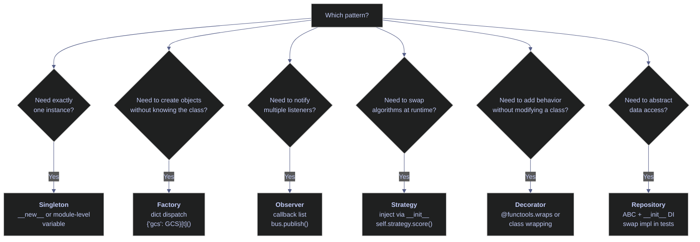

# 18. Design Patterns & Architecture - Python

> [!quote]
> "When I see patterns in my programs, I consider it a sign of trouble. The shape of a program should reflect only the problem it needs to solve."
>
> — **Paul Graham**, *Revenge of the Nerds*, essay (2002)

## Dependency Injection

> [!tip] Related pattern
>
> dbt's `ref()` and `source()` functions implement dependency injection at the SQL layer — models declare their dependencies explicitly rather than hardcoding table names, enabling the same swap-and-test pattern shown below. See [dbt-core-concepts](https://alp78.github.io/elysium/11-dbt/Foundations/dbt-core-concepts) for details.

A class receives its dependencies (DB connection, API client, logger) through its constructor, NOT by creating them internally. This enables testability (swap real DB for mock), flexibility (swap providers), and single responsibility. In Python, no framework is needed — just pass objects via `__init__`. C# equivalent: `Microsoft.Extensions.DependencyInjection` (`builder.Services.AddXxx`).

> [!warning] Anti-pattern — hardcoded dependencies
>
> ```python
> class PipelineService:
>     def __init__(self):
>         self.db = PostgresConnection("prod-host")  # hardcoded!
> ```
> Instead, inject via constructor: `def __init__(self, db, storage):`

> [!success] Inject dependencies via constructor
>
> ```python
> class PipelineService:
>     def __init__(self, db: DatabaseClient, storage: StorageClient):
>         self.db = db          # injected — swap for mock in tests
>         self.storage = storage
>
> # Production
> svc = PipelineService(db=PostgresConnection("prod-host"), storage=GCSClient())
> # Test
> svc = PipelineService(db=MockDatabase(), storage=MockStorage())
> ```

```python
from abc import ABC, abstractmethod

# ─── Define interfaces (abstract base classes) ───

from datetime import date
from pydantic import BaseModel, Field, model_validator, ValidationError
from typing import Callable
from typing import Optional
import inspect
class DataRepository(ABC):
    """Interface for data access — could be SQL, BigQuery, CSV, mock."""
    @abstractmethod
    def get_prices(self, ticker: str) -> list[dict]:
        ...

    @abstractmethod
    def save_scores(self, scores: list[dict]) -> int:
        ...

class NotificationService(ABC):
    """Interface for notifications — could be email, Slack, Pub/Sub, mock."""
    @abstractmethod
    def notify(self, message: str) -> None:
        ...

# ─── Concrete implementations ───

class SqlRepository(DataRepository):
    """Real implementation — talks to a database."""
    def __init__(self, connection_string: str):
        self.conn_str = connection_string
        print(f"  SqlRepository connected to: {connection_string[:30]}...")

    def get_prices(self, ticker: str) -> list[dict]:
        # In production: cursor.execute("SELECT * FROM prices WHERE ticker=?", ticker)
        return [{"ticker": ticker, "close": 178.50, "date": "2026-03-20"}]

    def save_scores(self, scores: list[dict]) -> int:
        print(f"  SqlRepository: saved {len(scores)} scores to database")
        return len(scores)

class MockRepository(DataRepository):
    """Test implementation — no database needed."""
    def __init__(self):
        self.saved: list[dict] = []

    def get_prices(self, ticker: str) -> list[dict]:
        return [{"ticker": ticker, "close": 100.0, "date": "2026-01-01"}]

    def save_scores(self, scores: list[dict]) -> int:
        self.saved.extend(scores)
        return len(scores)

class SlackNotifier(NotificationService):
    def notify(self, message: str) -> None:
        print(f"  Slack: {message}")

class MockNotifier(NotificationService):
    def __init__(self):
        self.messages: list[str] = []
    def notify(self, message: str) -> None:
        self.messages.append(message)

# ─── Service that uses DI ───

class PipelineService:
    """Orchestrates the pipeline — dependencies injected via constructor."""
    def __init__(self, repo: DataRepository, notifier: NotificationService):
        self.repo = repo
        self.notifier = notifier

    def run(self, ticker: str) -> dict:
        prices = self.repo.get_prices(ticker)
        score = {"ticker": ticker, "momentum": 0.85, "rank": 1}
        self.repo.save_scores([score])
        self.notifier.notify(f"Pipeline done: {ticker} scored {score['momentum']}")
        return score

# ─── Production wiring ───
prod_service = PipelineService(
    repo=SqlRepository("Server=prod-db;Database=stoxx"),
    notifier=SlackNotifier(),
)
result = prod_service.run("ASML.AS")
result

# ─── Test wiring — swap implementations, same PipelineService ───
mock_repo = MockRepository()
mock_notifier = MockNotifier()
test_service = PipelineService(repo=mock_repo, notifier=mock_notifier)
result = test_service.run("TEST.XX")
result
mock_repo.saved
mock_notifier.messages
```

```text
SqlRepository connected to: Server=prod-db;Database=stoxx...
SqlRepository: saved 1 scores to database
Slack: Pipeline done: ASML.AS scored 0.85
{'ticker': 'ASML.AS', 'momentum': 0.85, 'rank': 1}

{'ticker': 'TEST.XX', 'momentum': 0.85, 'rank': 1}
[{'ticker': 'TEST.XX', 'momentum': 0.85, 'rank': 1}]
['Pipeline done: TEST.XX scored 0.85']
```

## Design Patterns

Design patterns are reusable solutions to common software design problems. In data engineering, they structure pipelines for testability, extensibility, and separation of concerns. The patterns below — singleton, factory, observer, strategy, decorator, and repository — appear frequently in production index-calculation and ETL codebases. Python's first-class functions and duck typing make many patterns lighter than their C# counterparts.

### Singleton — ensure exactly one instance of a class

Ensures a class has exactly ONE instance — useful for database connection pools, configuration managers, or loggers. In Python, the `__new__` method controls instance creation (it runs *before* `__init__`): if an instance already exists, return it instead of creating a new one. The `__init__` guard (`if self._initialized: return`) prevents re-running setup on subsequent calls. Singletons make testing harder (global state) — prefer DI with a single instance when possible.

> [!tip] Modules are natural singletons
>
> In Python, a module is only imported once. A database connection created at module level (`conn = create_connection()`) is effectively a singleton. No pattern needed.

```python
class Config:
    """Singleton configuration — only one instance ever created."""
    _instance = None

    def __new__(cls):
        if cls._instance is None:
            cls._instance = super().__new__(cls)
            cls._instance._initialized = False
        return cls._instance

    def __init__(self):
        if self._initialized:
            return
        self._initialized = True
        self.project_id = "index-lab-2"
        self.region = "europe-west1"
        self.batch_size = 5000
        print(f"  Config loaded (project={self.project_id})")

c1 = Config()
c2 = Config()  # same instance — __init__ skipped
c1 is c2  # True
c1.project_id

# ─── Simpler alternative: module-level singleton ───
# Just create the instance at module level. Python modules are singletons.
# _config = {"project_id": "index-lab-2", "region": "europe-west1"}
# def get_config(): return _config
```

```text
Config loaded (project=index-lab-2)
True
index-lab-2
```

### Factory — create objects without specifying the exact class

Creates objects without specifying the exact class — select the right implementation based on config or environment. A factory function or method decides which class to instantiate based on input. `create_parser("csv")` returns a CSVParser; `create_parser("json")` returns a JSONParser. The caller doesn't need to know the concrete classes. In Python, use a function or `@classmethod` that returns the right subclass. C# equivalent: static factory method, or `IServiceProvider.GetService<T>()`.

```python
class StorageClient(ABC):
    @abstractmethod
    def upload(self, path: str, data: bytes) -> str: ...

class GCSClient(StorageClient):
    def upload(self, path: str, data: bytes) -> str:
        return f"gs://bucket/{path} ({len(data)} bytes)"

class S3Client(StorageClient):
    def upload(self, path: str, data: bytes) -> str:
        return f"s3://bucket/{path} ({len(data)} bytes)"

class LocalClient(StorageClient):
    def upload(self, path: str, data: bytes) -> str:
        return f"file://{path} ({len(data)} bytes)"

# ─── Factory function ───

def create_storage_client(provider: str = "gcs") -> StorageClient:
    """Factory: create storage client based on provider name."""
    clients = {
        "gcs": GCSClient,
        "s3": S3Client,
        "local": LocalClient,
    }
    if provider not in clients:
        raise ValueError(f"Unknown provider: {provider}. Choose from: {list(clients.keys())}")
    return clients[provider]()

for provider in ["gcs", "s3", "local"]:
    client = create_storage_client(provider)
    result = client.upload("bronze/data.csv", b"OHLCV data")
    print(f"  {provider:5s} -> {result}")
```

```text
gcs   -> gs://bucket/bronze/data.csv (10 bytes)
s3    -> s3://bucket/bronze/data.csv (10 bytes)
local -> file://bronze/data.csv (10 bytes)
```

### Observer — one-to-many event notification

One-to-many notification: when a subject changes state, all registered observers are notified. In Python, implement with callbacks (list of functions) or the built-in `property` setter that triggers notifications. Notifies multiple listeners when something happens — pipeline events (step completed, error occurred, data ready). Multiple consumers react to the same event without coupling. C# equivalent: `event`/`delegate` pattern, or `IObservable<T>`. GCP equivalent: Pub/Sub (same pattern, distributed).

```python
class PipelineEventBus:
    """Simple observer/event bus — subscribe to events, publish notifications."""
    def __init__(self):
        self._subscribers: dict[str, list[Callable]] = {}

    def subscribe(self, event: str, callback: Callable) -> None:
        """Register a callback for an event type."""
        self._subscribers.setdefault(event, []).append(callback)

    def publish(self, event: str, data: dict) -> None:
        """Notify all subscribers of an event."""
        for callback in self._subscribers.get(event, []):
            callback(data)

# ─── Subscribers (observers) ───

def log_handler(data: dict):
    print(f"  [LOG]   {data}")

def alert_handler(data: dict):
    if data.get("status") == "error":
        print(f"  [ALERT] Pipeline error: {data.get('message')}")

def metrics_handler(data: dict):
    if "rows" in data:
        print(f"  [METRIC] rows_loaded = {data['rows']}")

# ─── Wire up and use ───
bus = PipelineEventBus()
bus.subscribe("step_completed", log_handler)
bus.subscribe("step_completed", metrics_handler)
bus.subscribe("step_completed", alert_handler)

# Simulate pipeline events
bus.publish("step_completed", {"step": "ohlcv_load", "status": "ok", "rows": 306})
bus.publish("step_completed", {"step": "silver_transform", "status": "ok", "rows": 306})
bus.publish("step_completed", {"step": "gold_score", "status": "error", "message": "BQ timeout"})
```

```text
[LOG]   {'step': 'ohlcv_load', 'status': 'ok', 'rows': 306}
[METRIC] rows_loaded = 306
[LOG]   {'step': 'silver_transform', 'status': 'ok', 'rows': 306}
[METRIC] rows_loaded = 306
[LOG]   {'step': 'gold_score', 'status': 'error', 'message': 'BQ timeout'}
[ALERT] Pipeline error: BQ timeout
```

### Strategy — swap algorithms at runtime

Swap algorithms at runtime by passing functions or objects with a common interface. Instead of if/else chains selecting a scoring method, accept the scoring function as a parameter. Python's first-class functions make this trivial: just pass the function directly. Useful for different scoring algorithms, export formats, or retry policies. The context class delegates to a strategy object. C# equivalent: interface + DI, or `Func<T>` delegate.

```python
class ScoringStrategy(ABC):
    """Interface for different scoring algorithms."""
    @abstractmethod
    def score(self, prices: list[float]) -> float: ...

    @abstractmethod
    def name(self) -> str: ...

class MomentumStrategy(ScoringStrategy):
    """Score based on price momentum (last vs average)."""
    def score(self, prices: list[float]) -> float:
        if not prices: return 0.0
        avg = sum(prices) / len(prices)
        return (prices[-1] - avg) / avg
    def name(self) -> str: return "Momentum"

class VolatilityStrategy(ScoringStrategy):
    """Score based on price volatility (lower = better)."""
    def score(self, prices: list[float]) -> float:
        if len(prices) < 2: return 0.0
        avg = sum(prices) / len(prices)
        variance = sum((p - avg) ** 2 for p in prices) / len(prices)
        return -(variance ** 0.5 / avg)  # negative: lower vol = higher score
    def name(self) -> str: return "Volatility"

class MeanReversionStrategy(ScoringStrategy):
    """Score based on distance from mean (farther below = higher score)."""
    def score(self, prices: list[float]) -> float:
        if not prices: return 0.0
        avg = sum(prices) / len(prices)
        return (avg - prices[-1]) / avg  # below avg = positive score
    def name(self) -> str: return "MeanReversion"

# ─── Context class that uses a strategy ───

class StockScorer:
    """Scores stocks using a pluggable strategy."""
    def __init__(self, strategy: ScoringStrategy):
        self.strategy = strategy  # injected

    def evaluate(self, ticker: str, prices: list[float]) -> dict:
        return {
            "ticker": ticker,
            "strategy": self.strategy.name(),
            "score": round(self.strategy.score(prices), 4),
        }

# ─── Same data, different strategies ───
prices = [685.0, 690.0, 680.0, 695.0, 710.0, 700.0, 685.0]
prices

for strategy in [MomentumStrategy(), VolatilityStrategy(), MeanReversionStrategy()]:
    scorer = StockScorer(strategy)
    result = scorer.evaluate("ASML.AS", prices)
    print(f"  {result['strategy']:15s} score={result['score']:+.4f}")
```

```text
[685.0, 690.0, 680.0, 695.0, 710.0, 700.0, 685.0]

Momentum        score=-0.0103
Volatility      score=-0.0138
MeanReversion   score=+0.0103
```

### Decorator — wrap an object with additional behavior

Not to be confused with Python's `@decorator` syntax (which is a language feature). The decorator PATTERN wraps an object with additional behavior while keeping the same interface. Example: a `LoggingConnection` wraps a `DatabaseConnection`, adding logging to every query without modifying the original class. In Python, function decorators (`@functools.wraps`) are the most common form, but the OOP pattern applies when you need to compose behaviors on class instances.

### Repository — abstract data access behind a clean interface

Abstracts data access behind a clean interface. `repo.get_prices(symbol, date)` works whether the data comes from SQL Server, BigQuery, a CSV file, or a mock. The pipeline code depends on the interface, not the storage technology. Combined with dependency injection, this is the foundation for testable data pipelines — swap `SqlRepository` for `MockRepository` in tests without changing any pipeline logic.

## Data Validation

Pydantic validates data at construction time using Python type hints — if the input doesn't match the schema, a `ValidationError` is raised before bad data enters the pipeline. This catches problems at the boundary (API input, file parse, config load) rather than deep inside transformation logic where the root cause is harder to trace.

> [!info] Pydantic data validation
>
> - Define data shape with type hints — validates on construction, raises `ValidationError` if invalid
> - `Field()` — adds constraints (min, max, regex, default)
> - `model_validate()` — parses dict → model
> - `model_dump()` — serializes model → dict
> - Catches bad data at the boundary (API input, file load, config parse) before it flows into pipelines
> - C# equivalent: `DataAnnotations` (`[Required]`, `[Range]`) + FluentValidation

```python
# ─── Model definitions ───

class OhlcvRecord(BaseModel):
    """Validated OHLCV record — catches bad data before pipeline ingestion."""
    symbol: str = Field(..., min_length=1, max_length=20, description="Ticker symbol")
    trade_date: date = Field(..., description="Trading date")
    open: float = Field(..., gt=0, description="Opening price")
    high: float = Field(..., gt=0)
    low: float = Field(..., gt=0)
    close: float = Field(..., gt=0)
    volume: int = Field(..., ge=0)

    @model_validator(mode="after")
    def high_gte_low(self):
        if self.high < self.low:
            raise ValueError(f"high ({self.high}) must be >= low ({self.low})")
        return self

class PipelineConfig(BaseModel):
    """Validated pipeline configuration."""
    name: str = Field(..., pattern=r"^[a-z][a-z0-9_]*$")
    batch_size: int = Field(default=5000, ge=100, le=100_000)
    max_retries: int = Field(default=3, ge=0, le=10)
    source_bucket: str = Field(..., min_length=3)
    destination_table: str
    dry_run: bool = False

# ─── Valid data ───
record = OhlcvRecord(
    symbol="ASML.AS", trade_date=date(2026, 3, 20),
    open=685.0, high=710.0, low=680.0, close=700.0, volume=1_500_000
)
record
record.model_dump()  # Dict

config = PipelineConfig(
    name="events_etl",
    source_bucket="index-lab-2-data",
    destination_table="index_data.bronze_ohlcv",
)
config  # Config

# ─── Invalid data — caught at boundary ───
bad_inputs = [
    {"label": "Negative price", "data": {"symbol": "X", "trade_date": "2026-01-01", "open": -5, "high": 10, "low": 8, "close": 9, "volume": 100}},
    {"label": "High < Low", "data": {"symbol": "X", "trade_date": "2026-01-01", "open": 10, "high": 5, "low": 8, "close": 9, "volume": 100}},
    {"label": "Empty symbol", "data": {"symbol": "", "trade_date": "2026-01-01", "open": 10, "high": 12, "low": 8, "close": 11, "volume": 100}},
    {"label": "Bad config name", "data": {"name": "Bad-Name!", "source_bucket": "b", "destination_table": "t"}},
]

for case in bad_inputs:
    try:
        if "symbol" in case["data"]:
            OhlcvRecord(**case["data"])
        else:
            PipelineConfig(**case["data"])
        print(f"  {case['label']}: PASSED (unexpected)")
    except ValidationError as e:
        print(f"  {case['label']}: CAUGHT — {e.errors()[0]['msg']}")
```

```text
symbol='ASML.AS' trade_date=datetime.date(2026, 3, 20) open=685.0 high=710.0 low=680.0 close=700.0 volume=1500000
{'symbol': 'ASML.AS', 'trade_date': datetime.date(2026, 3, 20), 'open': 685.0, 'high': 710.0, 'low': 680.0, 'close': 700.0, 'volume': 1500000}
name='events_etl' batch_size=5000 max_retries=3 source_bucket='index-lab-2-data' destination_table='index_data.bronze_ohlcv' dry_run=False

Negative price: CAUGHT — Input should be greater than 0
High < Low: CAUGHT — Value error, high (5.0) must be >= low (8.0)
Empty symbol: CAUGHT — String should have at least 1 character
Bad config name: CAUGHT — String should match pattern '^[a-z][a-z0-9_]*$'
```

## Reflection / Introspection

Python is deeply introspective — you can inspect any object's type, attributes, methods, source code, and module at runtime. C# equivalent: `System.Reflection` (`typeof`, `GetType`, `GetProperties`, `GetMethods`). Use cases include plugin systems, serializers, ORMs, debugging, and documentation generation.

```python
class TradeOrder:
    """Sample class to inspect."""
    MAX_QUANTITY = 1_000_000

    def __init__(self, ticker: str, side: str, quantity: int, price: float):
        self.ticker = ticker
        self.side = side
        self.quantity = quantity
        self.price = price

    def notional(self) -> float:
        return self.quantity * self.price

    def __repr__(self) -> str:
        return f"TradeOrder({self.ticker}, {self.side}, {self.quantity}, {self.price})"

order = TradeOrder("ASML.AS", "BUY", 100, 685.40)

# ─── type() and isinstance() ───
type(order)
type(order).__name__
isinstance(order, TradeOrder)

# ─── dir() — list all attributes and methods ───
public = [m for m in dir(order) if not m.startswith("_")]
public

# ─── vars() / __dict__ — instance attributes ───
vars(order)

# ─── getattr() / hasattr() — dynamic attribute access ───
for attr in ["ticker", "side", "quantity", "notional"]:
    if hasattr(order, attr):
        val = getattr(order, attr)
        if callable(val):
            print(f"  {attr}() = {val()}")
        else:
            print(f"  {attr} = {val}")

# ─── inspect module — deeper introspection ───
inspect.isclass(TradeOrder)  # Is class
[m[0] for m in inspect.getmembers(order, predicate=inspect.ismethod)]  # Methods
try:
    print(f"  Source file: {inspect.getfile(TradeOrder)}")
except OSError:
    print("  Source file: <notebook cell> (no file on disk)")

# ─── Signature introspection ───
sig = inspect.signature(TradeOrder.__init__)
for name, param in sig.parameters.items():
    if name == "self": continue
    print(f"  {name}: {param.annotation.__name__ if param.annotation != inspect.Parameter.empty else 'Any'}")
```

```text
<class '__main__.TradeOrder'>
TradeOrder
isinstance(order, TradeOrder): True

['MAX_QUANTITY', 'notional', 'price', 'quantity', 'side', 'ticker']

{'ticker': 'ASML.AS', 'side': 'BUY', 'quantity': 100, 'price': 685.4}

ticker = ASML.AS
side = BUY
quantity = 100
notional() = 68540.0

True
['__init__', '__repr__', 'notional']
<notebook cell> (no file on disk)

ticker: str
side: str
quantity: int
price: float
```

The output demonstrates Python's introspection toolkit: `type()` returns the class object, `dir()` lists all public attributes and methods (filtered to exclude dunder names), `vars()` returns the instance's `__dict__` (instance attributes only — class attributes like `MAX_QUANTITY` and methods are excluded), `getattr()` with `callable()` distinguishes data attributes from methods, `inspect.getmembers()` finds methods, and `inspect.signature()` extracts constructor parameter names and type annotations.

## Project Structure & Best Practices

A well-organized Python project separates concerns by responsibility (fetching, transforming, loading), keeps configuration external, and mirrors the source layout in tests. The structure below follows the package conventions used in production index-calculation pipelines.

### Recommended project layout

```text
index-pipeline/
├── pyproject.toml           # Project metadata, dependencies, tool config
├── requirements.txt         # Pinned dependencies (pip freeze)
├── .env                     # Local env vars (NEVER commit)
├── .gitignore               # Ignore .env, __pycache__, .venv, *.pyc
│
├── src/                     # Source code
│   ├── __init__.py
│   ├── config.py            # Configuration (env vars, defaults)
│   ├── models.py            # Pydantic models (OhlcvRecord, PipelineConfig)
│   ├── db.py                # Database connection factory
│   │
│   ├── fetchers/            # Data ingestion
│   │   ├── __init__.py
│   │   ├── ohlcv.py         # yfinance OHLCV fetcher
│   │   └── signals.py       # Daily/quarterly signal fetcher
│   │
│   ├── transforms/          # Bronze → Silver → Gold
│   │   ├── __init__.py
│   │   ├── clean.py         # Bronze → Silver (dedup, gap-fill)
│   │   └── score.py         # Silver → Gold (z-scores, ranks)
│   │
│   ├── loaders/             # Write to storage/DB
│   │   ├── __init__.py
│   │   ├── bigquery.py      # BigQuery loader
│   │   └── firestore.py     # Firestore writer
│   │
│   └── services/            # Business logic
│       ├── __init__.py
│       └── pipeline.py      # PipelineService (DI, orchestration)
│
├── tests/                   # Test code (mirrors src/)
│   ├── conftest.py          # Shared fixtures
│   ├── test_transforms.py   # Pure function tests
│   ├── test_loaders.py      # Mock external services
│   └── test_pipeline.py     # Integration tests
│
└── scripts/                 # CLI entry points
    ├── run_pipeline.py      # python scripts/run_pipeline.py --step ohlcv
    └── setup_index.py       # One-time index setup
```

### Key principles

**Separation of concerns** — `fetchers/` only fetch, `transforms/` only transform, `loaders/` only write. No fetcher should know about BigQuery. No loader should know about yfinance.

**Dependency injection** — `PipelineService` receives `DataRepository` and `NotificationService` via `__init__`. Tests swap in `MockRepository`. Production wires `SqlRepository`.

**Validate at boundaries** — Use Pydantic models when data enters the system (API input, file parse, config). Internal code trusts the validated models — no redundant checks downstream.

**Configuration from environment** — Never hardcode credentials, hosts, or bucket names. Use `os.environ.get()` with defaults, or Pydantic `BaseSettings` for typed config with automatic env-var binding.

**Test the transform, mock the boundary** — Transforms are pure functions — test directly with known inputs and expected outputs. Loaders and fetchers touch external systems — mock them with `unittest.mock` or `pytest-mock`.

## Summary



> [!abstract]- Design Patterns Quick Reference
>
> | Pattern | Python | Usage |
> |---|---|---|
> | **Dependency Injection** | `def __init__(self, repo)` | Inject via constructor; `Service(SqlRepo())` in prod, `Service(MockRepo())` in test |
> | **Singleton** | `def __new__(cls)` | Create once, return same. Better: module-level variable (modules ARE singletons) |
> | **Factory** | `def create_client(t)` | `return {"gcs": GCS, "s3": S3}[t]()` — return right subclass |
> | **Observer** | `bus.subscribe("event", cb)` | Register listeners, `bus.publish("event", data)` notifies all |
> | **Strategy** | `def __init__(self, strategy)` | Inject algorithm, delegate via `self.strategy.evaluate()` |
> | **Decorator** | `class Wrapper(Interface)` | Wraps inner instance via composition, or `@functools.wraps` for functions |
> | **Repository** | `class Repo(ABC)` | Abstract data access, swap `SqlRepo` / `MockRepo` via DI |
> | **Validation** | `class Model(BaseModel)` | Pydantic auto-validates on creation with type hints + `Field()` |
> | **Reflection** | `type()`, `dir()`, `getattr()` | Type checking, attribute listing, dynamic access, `inspect.signature()` |
>
> **C# equivalents:** `ABC`/`abstractmethod` → `interface` | `__init__(dep)` → constructor injection | `AddSingleton<T>()` → DI lifetime | `Pydantic` → DataAnnotations + FluentValidation | `inspect` → `System.Reflection`
