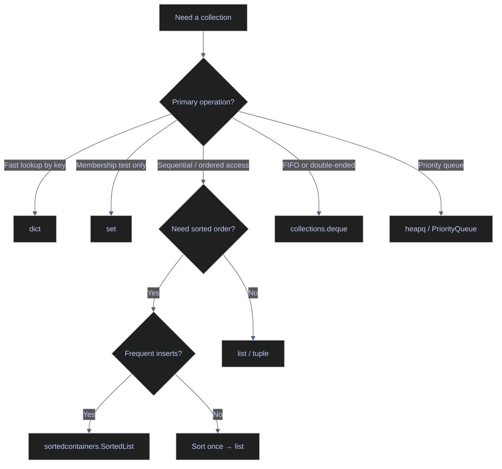

# 19. Performance & Code Quality - Python

> [!quote]
> "Make it correct, make it clear, make it concise, make it fast. In that order."
>
> — **Wes Dyer**, blog post (2007)

## Timing & Benchmarking

Accurate measurement is the foundation of every performance improvement. Python provides two tiers of tooling: `time.perf_counter()` for quick ad-hoc profiling during development, and `timeit` for reliable micro-benchmarks that disable garbage collection and run the code multiple times to average out OS scheduling noise. The C# equivalents are `Stopwatch` and `BenchmarkDotNet`.

### Manual timing and the timeit module

`time.perf_counter()` returns the value of a high-resolution monotonic clock in fractional seconds. It is unaffected by system clock adjustments (NTP, DST) and is the correct tool for single-run measurements. `timeit` is a wrapper around `perf_counter` that disables GC during measurement, repeats the statement many times, and returns the total elapsed time — dividing by the number of runs gives the per-call cost.

#### Measure elapsed time with perf_counter and timeit

`time.perf_counter()` is used for one-off measurements; capture a start timestamp, run the work, subtract. `timeit.timeit(stmt, number=N)` runs `stmt` N times and returns total seconds. Dividing by N gives the per-iteration cost. `%%timeit` in Jupyter auto-calibrates the number of runs.

> [!info] Timing tools
>
> - `time.perf_counter()` — high-resolution monotonic wall-clock timing
> - `timeit` — reliable micro-benchmarks (disables GC, runs N×, returns total seconds)
> - `%%timeit` in Jupyter — auto-calibrates number of runs
> - Always warm up first (imports, caching effects) before benchmarking
> - C# equivalent: `BenchmarkDotNet`, `Stopwatch`

> [!warning] Do not use time.time() for benchmarks.
>
> `time.time()` is affected by system clock adjustments and has lower resolution than `perf_counter`. Do not time a single run — OS scheduling and caching can skew results by 10–100×.

> [!success] Use timeit or perf_counter with multiple repetitions.
>
> ```python
> import timeit, time
> elapsed = timeit.timeit("sum(range(10_000))", number=1000) / 1000  # per-call average
> t0 = time.perf_counter()
> result = expensive_function()
> print(time.perf_counter() - t0)
> ```

```python
import time
import timeit
from collections import deque
from collections.abc import Callable, Iterator, Sequence
from contextlib import contextmanager
from functools import lru_cache
from pathlib import Path
from typing import Any, Optional, overload
import cProfile, io, pstats, random, sys, tracemalloc
import pandas as pd

def slow_sum(n):
    return sum(range(n))

t0 = time.perf_counter()
result = slow_sum(1_000_000)
elapsed = time.perf_counter() - t0
print(f"slow_sum(1M): {elapsed*1000:.2f}ms, result={result}")

elapsed = timeit.timeit("sum(range(100_000))", number=100)
print(f"timeit (100 runs): {elapsed*1000:.1f}ms total, {elapsed/100*1000:.2f}ms avg")

@contextmanager
def timer(label=""):
    t0 = time.perf_counter()
    yield
    elapsed = time.perf_counter() - t0
    print(f"  [{label}] {elapsed*1000:.2f}ms")

with timer("list comp"):
    _ = [x**2 for x in range(100_000)]

with timer("map"):
    _ = list(map(lambda x: x**2, range(100_000)))

with timer("generator"):
    _ = sum(x**2 for x in range(100_000))
```

```text
slow_sum(1M): 18.14ms, result=499999500000
timeit (100 runs): 107.9ms total, 1.08ms avg
  [list comp] 3.01ms
  [map] 4.97ms
  [generator] 5.00ms
```

The context manager `timer` wraps any block with `yield`, measures elapsed time on exit, and prints the label. This is reusable throughout the notebook. `list comp` is fastest here because CPython optimises list comprehensions with a dedicated `LIST_APPEND` bytecode; `map` and the generator expression carry more frame overhead.

### Comparing approaches with timeit

#### Benchmark data structure lookup and sorting strategies

`timeit.timeit(stmt, setup, number)` is the right tool for comparing two approaches to the same operation. The `setup` string runs once before the timed loop; the `stmt` string is what gets timed. Use a high `number` (≥1,000) for operations faster than 1 ms to get stable results.

```python
setup = "data = list(range(10_000))"

t_list = timeit.timeit("9999 in data", setup=setup, number=10_000)
t_set = timeit.timeit("9999 in data", setup=setup + "; data = set(data)", number=10_000)

print(f"List lookup: {t_list*1000:.1f}ms")
print(f"Set lookup:  {t_set*1000:.1f}ms")
print(f"Set is {t_list/t_set:.0f}x faster")

t_sorted = timeit.timeit("sorted(data)", setup="data = list(range(10_000, 0, -1))", number=1000)
t_sort = timeit.timeit("data.sort()", setup="data = list(range(10_000, 0, -1))", number=1000)
print(f"\nsorted() (new list): {t_sorted*1000:.1f}ms")
print(f".sort() (in-place):  {t_sort*1000:.1f}ms")
```

```text
List lookup: 307.1ms
Set lookup:  0.1ms
Set is 2355x faster

sorted() (new list): 30.2ms
.sort() (in-place):  21.2ms
```

`set` lookup is ~2,000× faster because it uses a hash table (O(1)) vs the list's linear scan (O(n)). `.sort()` is ~30% faster than `sorted()` because it modifies in-place without allocating a new list — use `sorted()` when you need to preserve the original order.

## Memory Profiling

Every object Python creates lives on the heap and is tracked by the reference-counting garbage collector. Understanding where allocations occur and how much memory different constructs consume is essential for preventing OOM failures in production. Python offers two standard tools: `sys.getsizeof()` for quick inspections of individual objects, and `tracemalloc` for tracking the source file and line number of every allocation. The C# equivalents are `GC.GetTotalMemory()` and dotMemory.

### Object size inspection

`sys.getsizeof()` reports the shallow size of a single object in bytes — it does not recurse into container contents. A `list` of 10,000 integers reports the size of the list object (the pointer array), not the 10,000 `int` objects it holds. Use `tracemalloc` when you need total memory including contents.

#### Inspect object sizes with sys.getsizeof

`sys.getsizeof(obj)` returns the memory allocated for `obj` itself, including its internal bookkeeping. For containers (`list`, `dict`, `set`), this covers the container's pointer array but not the objects the pointers reference. The function accepts an optional `default` argument to return when the object does not support `__sizeof__`.

> [!info] Memory measurement tools
>
> - `sys.getsizeof()` — shallow size only (not contents)
> - `tracemalloc` — tracks all allocations with file and line number
> - C# equivalent: `dotMemory`, `GC.GetTotalMemory()`

> [!warning] sys.getsizeof reports container structure only.
>
> `sys.getsizeof` on containers shows the container's pointer array, not the elements. A `list` of 100,000 integers reports ~800 KB (pointers), not the ~2.8 MB of the `int` objects. Do not use `memory_profiler` in production — its line-by-line tracing adds ~100ms per line.

> [!success] Use tracemalloc for total memory including contents.
>
> ```python
> import tracemalloc
> tracemalloc.start()
> data = [i for i in range(100_000)]
> current, peak = tracemalloc.get_traced_memory()
> tracemalloc.stop()
> print(f"Peak: {peak / 1024:.1f} KB")
> ```

```python
print("Object sizes (bytes):")
for obj in [42, 3.14, "hello", b"hello", True, None, [], {}, set()]:
    print(f"  {str(obj):15s} {type(obj).__name__:10s} {sys.getsizeof(obj):>6d}")

for n in [0, 10, 100, 1000, 10_000]:
    lst = list(range(n))
    dct = {i: i for i in range(n)}
    st = set(range(n))
    print(f"  n={n:>6d}: list={sys.getsizeof(lst):>8d}  dict={sys.getsizeof(dct):>8d}  set={sys.getsizeof(st):>8d}")
```

```text
Object sizes (bytes):
  42              int            28
  3.14            float          24
  hello           str            46
  b'hello'        bytes          38
  True            bool           28
  None            NoneType       16
  []              list           56
  {}              dict           64
  set()           set           216
  n=     0: list=      56  dict=      64  set=     216
  n=    10: list=     136  dict=     352  set=     728
  n=   100: list=     856  dict=    4688  set=    8408
  n=  1000: list=    8056  dict=   36952  set=   32984
  n= 10000: list=   80056  dict=  294992  set=  524504
```

`dict` and `set` use significantly more memory than `list` because they maintain hash tables with load-factor headroom (typically ~33% empty slots to maintain O(1) average lookup). An empty `set()` is 216 bytes vs 56 bytes for an empty `list`.

### Allocation tracking with tracemalloc

#### Track allocation sources with tracemalloc

`tracemalloc.start()` activates Python's built-in allocation tracker. `tracemalloc.take_snapshot()` captures all current allocations. `snapshot.statistics("lineno")` groups allocations by source file and line number. `tracemalloc.get_traced_memory()` returns `(current_bytes, peak_bytes)` — `peak` is the high-water mark since `start()`.

```python
tracemalloc.start()

data = [x**2 for x in range(100_000)]
mapping = {str(x): x**2 for x in range(10_000)}

snapshot = tracemalloc.take_snapshot()
top = snapshot.statistics("lineno")

print("Top 5 memory allocations:")
for stat in top[:5]:
    print(f"  {stat}")

current, peak = tracemalloc.get_traced_memory()
print(f"\nCurrent: {current / 1024 / 1024:.2f} MB")
print(f"Peak:    {peak / 1024 / 1024:.2f} MB")

tracemalloc.stop()
del data, mapping
```

```text
Top 5 memory allocations:
  .../ipykernel/.../cell.py:2: size=3907 KiB, count=99984, average=40 B
  .../ipykernel/.../cell.py:3: size=953 KiB, count=19984, average=49 B
  ...IPython internals...
  ...IPython internals...
  ...IPython internals...

Current: 4.75 MB
Peak:    4.77 MB
```

Line 2 (`[x**2 for x in range(100_000)]`) allocated 3,907 KiB across 99,984 Python `int` objects at ~40 bytes each. Line 3 allocated 953 KiB for 19,984 objects (10,000 string keys + 10,000 int values with overhead). The IPython internals entries are notebook bookkeeping — ignore them in application profiling.

### Memory-efficient alternatives

#### Generators vs lists — O(1) vs O(n) memory

A list comprehension allocates all elements up front and holds them in memory simultaneously. A generator expression produces one element at a time and discards it after use, using O(1) memory regardless of the number of elements. Use generators whenever you process data sequentially and do not need to revisit elements.

```python
list_data = [x**2 for x in range(100_000)]
gen_result = sum(x**2 for x in range(100_000))

print(f"List size: {sys.getsizeof(list_data):,} bytes ({sys.getsizeof(list_data)/1024/1024:.2f} MB)")
print(f"Generator: uses ~0 bytes (constant memory)")

lst = list(range(1000))
tpl = tuple(range(1000))
print(f"\nlist(1000): {sys.getsizeof(lst):,} bytes")
print(f"tuple(1000): {sys.getsizeof(tpl):,} bytes")
print(f"Tuple is {(1 - sys.getsizeof(tpl)/sys.getsizeof(lst))*100:.1f}% smaller")

class PointRegular:
    def __init__(self, x, y):
        self.x = x
        self.y = y

class PointSlots:
    __slots__ = ("x", "y")
    def __init__(self, x, y):
        self.x = x
        self.y = y

regular = [PointRegular(i, i) for i in range(10_000)]
slotted = [PointSlots(i, i) for i in range(10_000)]
print(f"\nRegular class: {sys.getsizeof(regular[0])} bytes (shallow, excludes __dict__)")
print(f"__slots__ class: {sys.getsizeof(slotted[0])} bytes (no __dict__ overhead)")
del regular, slotted, list_data
```

```text
List size: 800,984 bytes (0.76 MB)
Generator: uses ~0 bytes (constant memory)

list(1000): 8,056 bytes
tuple(1000): 8,040 bytes
Tuple is 0.2% smaller

Regular class: 48 bytes (shallow, excludes __dict__)
__slots__ class: 48 bytes (no __dict__ overhead)
```

> [!warning] sys.getsizeof reports the same shallow size for both class types.
>
> `sys.getsizeof` returns 48 bytes for both `PointRegular` and `PointSlots` instances because it measures only the instance's struct header. The actual savings with `__slots__` come from eliminating the per-instance `__dict__` — typically 200–400 bytes per object. At 10,000 instances that is 2–4 MB saved. Measure with `tracemalloc` to see the real difference.

> [!success] Measure __slots__ savings with tracemalloc, not sys.getsizeof.
>
> ```python
> tracemalloc.start()
> regular = [PointRegular(i, i) for i in range(10_000)]
> _, peak_regular = tracemalloc.get_traced_memory(); tracemalloc.clear_traces()
> slotted = [PointSlots(i, i) for i in range(10_000)]
> _, peak_slots = tracemalloc.get_traced_memory(); tracemalloc.stop()
> print(f"Regular: {peak_regular/1024:.0f} KB,  Slots: {peak_slots/1024:.0f} KB")
> ```

## CPU Profiling

`cProfile` is CPython's built-in deterministic profiler. It instruments every function call and records the number of calls, time spent inside the function (`tottime`), and cumulative time including all sub-calls (`cumtime`). `pstats` provides programmatic access to sort and filter the results. Profile the whole program first to identify the top-N hotspots — do not guess which function is slow. The C# equivalents are dotTrace and PerfView.

> [!tip] Do not profile in production.
>
> `cProfile` adds ~10–30% overhead to all function calls. Use `py-spy` (sampling profiler) for production profiling — it attaches to a running process without code changes and has near-zero overhead.

### cProfile — function-level timing

#### Profile a function call tree with cProfile and pstats

`cProfile.Profile()` is used as a context: call `.enable()` before the work and `.disable()` after. `pstats.Stats(profiler)` wraps the raw data; `.sort_stats("cumulative")` orders by `cumtime`. The `ncalls` column shows `392809/25` for `fib` — 392,809 total calls but only 25 top-level (non-recursive) calls.

> [!info] cProfile column meanings
>
> - `ncalls` — total calls / primitive (non-recursive) calls if different
> - `tottime` — time inside this function only (excludes sub-calls)
> - `cumtime` — total time including all functions called from here
> - Focus on `cumtime` to identify the root bottleneck; use `tottime` to isolate the hottest leaf

```python
def fib(n):
    if n <= 1:
        return n
    return fib(n-1) + fib(n-2)

def work():
    results = []
    for i in range(25):
        results.append(fib(i))
    return results

profiler = cProfile.Profile()
profiler.enable()
work()
profiler.disable()

stream = io.StringIO()
stats = pstats.Stats(profiler, stream=stream).sort_stats("cumulative")
stats.print_stats(4)
print(stream.getvalue())
```

```text
         392950 function calls (165 primitive calls) in 0.060 seconds

   Ordered by: cumulative time

   ncalls  tottime  percall  cumtime  percall filename:lineno(function)
392809/25    0.059    0.000    0.083    0.003 cell.py:1(fib)
        1    0.000    0.000    0.059    0.059 cell.py:6(work)
        1    0.000    0.000    0.059    0.059 {built-in method builtins.exec}
        1    0.000    0.000    0.000    0.000 {method 'disable' of '_lsprof.Profiler' objects}
```

`fib` was called 392,809 times to compute `fib(0)` through `fib(24)` — exponential growth due to repeated subproblem computation. The fix is memoisation (`@lru_cache`). The IPython internals entries are omitted here; use `stats.print_stats(4)` to limit output to the top rows.

### Profiling string-building strategies

#### Compare string concatenation strategies — +=, join, StringIO

String concatenation with `+=` is O(n²) in total operations because every concatenation copies all prior content into a new immutable string. `"".join(...)` builds the result in a single pass by pre-computing the total length and allocating once. `io.StringIO` writes to an in-memory buffer and returns the result with `.getvalue()` — similar performance to `join` for large n.

```python
def concat_plus(n):
    s = ""
    for i in range(n):
        s += str(i)
    return s

def concat_join(n):
    return "".join(str(i) for i in range(n))

def concat_io(n):
    buf = io.StringIO()
    for i in range(n):
        buf.write(str(i))
    return buf.getvalue()

n = 50_000
for fn in [concat_plus, concat_join, concat_io]:
    t0 = time.perf_counter()
    fn(n)
    elapsed = time.perf_counter() - t0
    print(f"{fn.__name__:20s}: {elapsed*1000:.1f}ms")
```

```text
concat_plus         : 4.4ms
concat_join         : 3.0ms
concat_io           : 3.2ms
```

At n=50,000 the difference is modest (~30%) because CPython has an internal optimisation for `str +=` in simple loops (it detects the unique-reference case and extends in-place). The difference becomes severe at n>500,000 or in more complex expressions where the optimisation does not trigger.

## Big-O Complexity & Algorithmic Thinking

Algorithm complexity determines scalability. Switching from O(n²) to O(n) at n=10,000 yields a 10,000× improvement that no constant-factor tuning can match. The table below classifies the most common complexity classes; the flowchart guides data structure selection. The Python equivalents of the C# collection benchmark from the prior file map as: `List<T>` → `list`, `HashSet<T>` → `set`, `Dictionary<K,V>` → `dict`, `SortedDictionary` → `sortedcontainers.SortedDict`.

### Big-O reference table and collection selection

#### Big-O complexity reference

Each class in the table below describes how running time grows with input size n. O(n²) at n=10,000 means 100,000,000 operations — a 1 GHz CPU needs ~100 ms just for the inner loop comparisons, before any memory access.

| Complexity | Name | Python examples |
|---|---|---|
| O(1) | Constant | `dict` lookup, `set` membership, `list[i]` |
| O(log n) | Logarithmic | `bisect.bisect_left()`, balanced tree |
| O(n) | Linear | `list` scan, single loop, `map`/`filter` |
| O(n log n) | Linearithmic | `list.sort()`, `sorted()` (Timsort) |
| O(n²) | Quadratic | Nested loops — red flag for n > 10K |
| O(2ⁿ) | Exponential | Naive recursion — hard limit at n ≈ 25 |

> [!tip] Know the complexity of your data structures.
>
> If n can grow unboundedly, O(n²) is a ticking time bomb. Fix the algorithm before optimising constants. A 2× constant speedup cannot compensate for O(n²) once n exceeds ~10,000.



#### Benchmark O(1) vs O(n) lookup and O(n) vs O(n²) duplicate detection

The benchmark demonstrates two of the most impactful complexity improvements: replacing a `list` linear scan with a `set` hash lookup, and replacing a nested-loop duplicate finder with a single-pass `set`-based approach.

```python
def measure(fn, *args, label=""):
    t0 = time.perf_counter()
    result = fn(*args)
    elapsed = time.perf_counter() - t0
    print(f"  {label:30s}: {elapsed*1000:>10.2f}ms")
    return result

data_list = list(range(1_000_000))
data_set = set(data_list)
data_dict = {x: x for x in data_list}

print("Lookup (element at end):")
measure(lambda: 999_999 in data_list, label="list (O(n))")
measure(lambda: 999_999 in data_set, label="set (O(1))")
measure(lambda: 999_999 in data_dict, label="dict (O(1))")

data = random.sample(range(1_000_000), 10_000)

def find_dupes_quadratic(lst):
    dupes = []
    for i in range(len(lst)):
        for j in range(i+1, len(lst)):
            if lst[i] == lst[j]:
                dupes.append(lst[i])
    return dupes

def find_dupes_linear(lst):
    seen = set()
    dupes = []
    for x in lst:
        if x in seen:
            dupes.append(x)
        seen.add(x)
    return dupes

small = data[:500]
print("\nFind duplicates (n=500):")
measure(find_dupes_quadratic, small, label="Quadratic O(n²)")
measure(find_dupes_linear, small, label="Linear O(n)")
```

```text
Lookup (element at end):
  list (O(n))                   :       3.15ms
  set (O(1))                    :       0.00ms
  dict (O(1))                   :       0.00ms

Find duplicates (n=500):
  Quadratic O(n²)               :       2.56ms
  Linear O(n)                   :       0.02ms

[]
```

The `set`/`dict` lookup times appear as 0.00ms because a single hash lookup completes in nanoseconds — below the timer's precision at 2 decimal places. The duplicate-detection result `[]` is correct — `random.sample` produces a unique sample by definition, so no duplicates exist in the 500-element slice.

## Data Structure Performance Cheat Sheet

Choosing the right data structure is the highest-leverage performance decision in Python. The standard library covers all common access patterns: `list` for ordered indexed access, `dict`/`set` for O(1) key lookup, `deque` for efficient front/back operations, and `heapq` for priority queues. `O(1)*` for `list` insert-at-end is amortised — capacity doublings are O(n) but rare.

### Collection complexity reference and deque benchmark

#### Data structure performance — complexity cheat sheet

| Operation | `list` | `dict` | `set` | `deque` |
|---|---|---|---|---|
| Index/Key | O(1) | O(1) | — | O(n) |
| Search | O(n) | O(1) | O(1) | O(n) |
| Insert end | O(1)* | O(1) | O(1) | O(1) |
| Insert front | O(n) | — | — | O(1) |
| Delete end | O(1) | O(1) | O(1) | O(1) |
| Delete front | O(n) | — | — | O(1) |
| Sort | O(n log n) | — | — | O(n log n) |
| Memory | Compact | Heavy | Heavy | Compact |

Use `dict`/`set` for fast lookup, `deque` for FIFO/LIFO queues or when both ends need O(1) access, and `heapq` for priority-ordered retrieval.

#### Benchmark list vs deque for front insertion

`list.insert(0, x)` shifts all n existing elements right by one position — O(n). `deque.appendleft(x)` is O(1) because a `deque` is a doubly-linked list of fixed-size blocks, so prepending updates one pointer without moving existing elements.

```python
n = 100_000

lst = list(range(n))
dq = deque(range(n))

t0 = time.perf_counter()
for _ in range(1000):
    lst.insert(0, -1)
    lst.pop(0)
t_list = time.perf_counter() - t0

t0 = time.perf_counter()
for _ in range(1000):
    dq.appendleft(-1)
    dq.popleft()
t_deque = time.perf_counter() - t0

print(f"Insert/remove front (1000x):")
print(f"  list:  {t_list*1000:.1f}ms")
print(f"  deque: {t_deque*1000:.1f}ms")
print(f"  deque is {t_list/t_deque:.0f}x faster")
```

```text
Insert/remove front (1000x):
  list:  28.6ms
  deque: 0.2ms
  deque is 158x faster
```

158× speedup for front-insertion. Use `deque` whenever you need to append or pop from both ends — it is the correct tool for sliding windows, BFS queues, and ring buffers.

## Golden Rules of Performance

These rules apply at every project scale. Rules 1–4 prevent the most common Python performance problems. Rules 5–10 are refinements for established hot paths.

### Rules and caching demo

#### Golden rules of Python performance

Apply in priority order. Rule 4 (vectorise) is Python-specific — Python loops are ~100× slower than C loops; NumPy/Pandas/Polars call into C under the hood and bypass the interpreter entirely.

> [!tip] Golden Rules of Python Performance
>
> 1. **Measure before optimising** — profile first; the bottleneck is never where you think
> 2. **Algorithm > micro-optimisation** — O(n²) → O(n log n) beats any loop unrolling
> 3. **Use built-in data structures** — `list`/`dict`/`set` are C-implemented
> 4. **Vectorise, don't loop** — NumPy/Pandas/Polars are 100–1,000× faster than Python loops
> 5. **Minimise copies** — prefer in-place or generator patterns
> 6. **I/O is the bottleneck** — Network > Disk > Memory > CPU
> 7. **Cache expensive results** — `functools.cache`, `lru_cache`, Redis
> 8. **Lazy > eager** — generators, `itertools`, Polars lazy mode
> 9. **Know your constants** — Big-O theory diverges from practice at small *n*
> 10. **Readable > fast** — a 10% gain that makes code unreadable is rarely worth it

#### Cache expensive results with functools.cache and lru_cache

`@functools.cache` (Python 3.9+) is an unbounded memoisation cache equivalent to `@lru_cache(maxsize=None)`. It stores all return values keyed by arguments. For recursive functions with overlapping subproblems (dynamic programming), caching converts exponential time to linear. `cache_clear()` empties the cache; `cache_info()` reports hits, misses, and size.

```python
def fib_slow(n):
    if n <= 1: return n
    return fib_slow(n-1) + fib_slow(n-2)

@lru_cache(maxsize=None)
def fib_cached(n):
    if n <= 1: return n
    return fib_cached(n-1) + fib_cached(n-2)

t0 = time.perf_counter()
fib_slow(30)
t_slow = time.perf_counter() - t0

t0 = time.perf_counter()
fib_cached(300)
t_cached = time.perf_counter() - t0

print(f"fib(30) uncached:  {t_slow*1000:.1f}ms")
print(f"fib(300) cached:   {t_cached*1000:.3f}ms")
print(f"Cached is {t_slow/max(t_cached, 1e-9):.0f}x faster (on a 10x larger input!)")
fib_cached.cache_clear()
```

```text
fib(30) uncached:  68.6ms
fib(300) cached:   0.341ms
Cached is 201x faster (on a 10x larger input!)
```

`fib(30)` without caching requires 2,692,537 recursive calls. `fib(300)` with caching requires exactly 300 calls — one per unique subproblem. Use `@lru_cache(maxsize=128)` when memory is limited; use `@functools.cache` (unbounded) when correctness requires the full history.

## Absolute No-Go's

The patterns below should never appear in production Python. Each is either a correctness hazard (silent data loss, shared mutable state), a security vulnerability (RCE from `eval`), or a reliability problem (resource leaks, swallowed exceptions). Item 4 (mutable default arguments) is the most commonly encountered — it is non-obvious and produces bugs that are hard to reproduce.

### Patterns to never use in production

#### Anti-patterns and safe replacements — production Python no-go list

The list is ordered by frequency of occurrence in real codebases. Items 3, 10 (`except: pass`) and 6 (`eval` with user input) are the most dangerous — silent exception swallowing and code injection are the most costly bugs to debug in production.

> [!danger] Absolute no-go's — never in production Python
>
> 1. **String `+=` in loop** — O(n²). Use `"".join()`.
> 2. **Nested loops on large data** — O(n²). Use `dict` lookup or `set` intersection.
> 3. **Bare `except:`** — catches `SystemExit`, `KeyboardInterrupt`. Catch specific exceptions.
> 4. **Mutable default args** — `def f(lst=[])` shares one list across all calls. Use `None` sentinel.
> 5. **Global mutable state** — untraceable bugs. Use DI or closures.
> 6. **`eval()`/`exec()` with user input** — RCE vulnerability. Use `ast.literal_eval`.
> 7. **Hardcoded secrets** — use env vars or secret managers.
> 8. **Ignoring return values** — `sorted()` returns a new list; `.sort()` returns `None`.
> 9. **Wildcard imports** — `from module import *` pollutes namespace and breaks static analysis.
> 10. **`except: pass`** — bugs become invisible. At minimum, log the exception.
> 11. **`is` for value comparison** — `x is 256` works by accident (CPython caches small ints). Use `==`.
> 12. **Not closing resources** — `open()` without `with` leaks file handles.

> [!success] Safe replacements for the most common no-go's
>
> ```python
> result = "".join(parts)                          # #1
> try: ...
> except ValueError as e: logger.error(e)          # #3
> def f(lst=None): lst = lst if lst is not None else []  # #4
> import ast; value = ast.literal_eval(user_input) # #6
> with open("file.txt") as fh: data = fh.read()   # #12
> ```

#### Demonstrate mutable default argument bug and fix

Python evaluates default argument expressions once at function definition time, not on each call. A mutable default like `lst=[]` creates one list that is shared across all calls. After the first call, the "default" is no longer empty — it has grown. The `None` sentinel pattern avoids this by creating a fresh list inside the function body on each call.

```python
def bad_append(item, lst=[]):
    lst.append(item)
    return lst

print("Mutable default bug:")
print(f"  Call 1: {bad_append(1)}")
print(f"  Call 2: {bad_append(2)}")
print(f"  Call 3: {bad_append(3)}")

def good_append(item, lst=None):
    if lst is None:
        lst = []
    lst.append(item)
    return lst

print("\nFixed:")
print(f"  Call 1: {good_append(1)}")
print(f"  Call 2: {good_append(2)}")
print(f"  Call 3: {good_append(3)}")
```

```text
Mutable default bug:
  Call 1: [1]
  Call 2: [1, 2]
  Call 3: [1, 2, 3]

Fixed:
  Call 1: [1]
  Call 2: [2]
  Call 3: [3]
```

## Code Smells & Anti-Patterns

Code smells are structural indicators of deeper problems — missing abstraction, violated SRP, or hidden coupling. Unlike bugs, they do not cause immediate failures but increase the cost of every future change. The patterns below are the most common in Python data engineering codebases.

### Identifying and refactoring smells

#### Common code smells in Python codebases

The most impactful smells to address first are deep nesting (makes logic hard to test in isolation), boolean blindness (makes call sites unreadable), and magic numbers (no domain context for future maintainers).

> [!warning] Code smells — patterns indicating deeper problems
>
> 1. **God function/class** — >30 lines = doing too much. Split by single responsibility.
> 2. **Deep nesting** — `if: if: if: for: if:` → use early returns and guard clauses.
> 3. **Magic numbers** — `if x > 86400` → use `SECONDS_PER_DAY = 86_400`.
> 4. **Copy-paste code** — same block in 3+ places → extract to a function (DRY).
> 5. **Boolean blindness** — `process(data, True, False, True)` → use keyword args or `enum`.
> 6. **Premature abstraction** — YAGNI: abstract when you see the pattern 3 times.
> 7. **Comments explaining "what"** — `# increment x` is useless; `# retry because race condition` is valuable.

> [!success] Refactor toward clarity and single responsibility.
>
> ```python
> def process(item):           # #2 — guard clauses flatten deep nesting
>     if not item: return
>     if not item.is_valid(): return
>     save(item)
> SECONDS_PER_DAY = 86_400     # #3 — named constant replaces magic number
> process(data, validate=True, dry_run=False, verbose=True)  # #5 — keyword args
> ```

#### Demonstrate guard clauses — deep nesting vs flat logic

Deep nesting (`if: if: if:`) requires the reader to maintain a mental stack of all the enclosing conditions to understand any one branch. Guard clauses invert the condition and return early — each branch becomes a self-contained, readable statement. The logic is identical; the structure makes it testable.

```python
def process_bad(user):
    if user is not None:
        if user.get("active"):
            if user.get("email"):
                return f"Sending to {user['email']}"
            else:
                return "No email"
        else:
            return "Inactive"
    else:
        return "No user"

def process_good(user):
    if user is None:
        return "No user"
    if not user.get("active"):
        return "Inactive"
    if not user.get("email"):
        return "No email"
    return f"Sending to {user['email']}"

user = {"active": True, "email": "alice@example.com"}
assert process_bad(user) == process_good(user)
print("Guard clauses produce the same result, but are flat and readable.")
```

```text
Guard clauses produce the same result, but are flat and readable.
```

## Type Safety & Static Analysis

Python is dynamically typed at runtime but supports optional static type annotations (`def f(x: int) -> str`) that are checked by `mypy` or `pyright` without running the code. This catches `NoneType` errors, wrong argument types, and missing attributes at lint time — the same guarantees C# provides natively. Type hints add zero runtime overhead and serve as machine-verified documentation.

### Static type annotation patterns

> [!tip] Type hints are free documentation.
>
> Always annotate function signatures. Do not use `Any` everywhere — it defeats the purpose. Use `X | None` (Python 3.10+) instead of `Optional[X]` for nullable parameters.

#### Annotate function signatures — basic types, union return types, overloads

An unannotated function leaves the caller guessing about valid input types and possible return types. A typed signature is a verifiable contract. `@overload` allows a function to declare different return types depending on argument values — useful when a function can return either `dict` or `list` depending on a flag.

```python
def process(data, flag):
    if flag:
        return data.upper()
    return len(data)

def process_typed(data: str, flag: bool) -> str | int:
    if flag:
        return data.upper()
    return len(data)

@overload
def fetch(id: int, as_dict: bool = True) -> dict: ...
@overload
def fetch(id: int, as_dict: bool = False) -> list: ...  # type: ignore[misc]
def fetch(id: int, as_dict: bool = True) -> dict | list:
    data = {"id": id, "name": "test"}
    return data if as_dict else list(data.values())

process_typed('hello', True)
fetch(1, as_dict=True)
```

```text
Type hints: HELLO
Overload:   {'id': 1, 'name': 'test'}
```

#### Type hints for data engineering — Callable, Iterator, Sequence, Path

These patterns cover the most common signatures in data engineering pipelines: functions that accept file paths (`str | Path`), higher-order functions with `Callable` parameters, and generator functions with `Iterator` return types.

```python
def read_data(path: str | Path) -> list[dict[str, Any]]:
    return [{"example": True}]

def retry(fn: Callable[[], Any], attempts: int = 3) -> Any:
    for i in range(attempts):
        try:
            return fn()
        except Exception:
            if i == attempts - 1:
                raise

def batched(data: Sequence[Any], size: int) -> Iterator[Sequence[Any]]:
    for i in range(0, len(data), size):
        yield data[i:i+size]

for batch in batched(list(range(10)), 3):
    print(f"  batch: {list(batch)}")
```

```text
  batch: [0, 1, 2]
  batch: [3, 4, 5]
  batch: [6, 7, 8]
  batch: [9]
```

## Linting & Code Quality Tools

Static analysis tools check your code without running it — they catch style violations, undefined names, unused imports, and structural problems like excessive cyclomatic complexity. Python has three essential tools: `ruff` for fast lint and import sorting, `black` for opinionated auto-formatting, and `mypy`/`pyright` for type checking (covered in Type Safety above). Running all three in a pre-commit hook or CI pipeline catches the majority of avoidable defects before review.

### Cyclomatic complexity and code structure

Cyclomatic complexity (CC) is the number of independent execution paths through a function — each `if`, `elif`, `for`, `while`, or `except` adds one. Functions with CC > 10 are hard to test exhaustively and hard to read. Modern linters (`ruff`, `flake8-cognitive-complexity`, `radon`) can compute CC and fail the build when it exceeds a threshold.

> [!info] Python linting and formatting tools
>
> - `ruff` — Rust-based; replaces `flake8`, `isort`, `pyflakes`, and more in one binary. 10–100× faster. Run `ruff check --fix .` for auto-fix, `ruff format .` for formatting.
> - `black` — opinionated auto-formatter with no user-configurable style options — one canonical style, no debates.
> - `radon` — dedicated cyclomatic complexity analyser (`radon cc -s file.py`). CC grade: A (1–5) / B (6–10) / C (11+).
> - `flake8` — original PEP 8 checker with a large plugin ecosystem.

#### Reduce cyclomatic complexity with guard clauses and early returns

A function with six nested `if`/`elif` branches has CC 6. Refactoring to guard clauses — inverting the condition and returning early — flattens the nesting without changing behaviour. Each branch becomes an independent, testable statement with no enclosing context to track.

```python
# HIGH complexity (6 branches — nested if/elif)
def complex_function(x, y, z):
    if x > 0:
        if y > 0:
            return x + y
        elif z > 0:
            return x + z
        else:
            return x
    elif y > 0:
        return y
    else:
        if z > 0:
            return z
        return 0

# LOWER complexity — same logic, flattened with early returns
def simple_function(x, y, z):
    if x > 0 and y > 0:
        return x + y
    if x > 0 and z > 0:
        return x + z
    if x > 0:
        return x
    if y > 0:
        return y
    if z > 0:
        return z
    return 0

for args in [(1,2,3), (-1,2,3), (-1,-1,3), (-1,-1,-1), (1,-1,3), (1,-1,-1), (0,0,0)]:
    assert complex_function(*args) == simple_function(*args), f"Mismatch at {args}"
print("Refactored function passes all cases.")
```

```text
Refactored function passes all cases.
```

Both implementations produce identical results for all seven test cases. The refactored version eliminates one nesting level and makes each conditional independently readable — no mental stack of enclosing conditions needed to understand any single branch.

## Profiling Real Workloads

Profiling a synthetic micro-benchmark rarely reveals the actual bottleneck in production. Real workloads have I/O, serialisation, and data-volume effects that micro-benchmarks miss. The correct approach is to instrument each stage of the pipeline with elapsed-time measurement, run against a realistic dataset, and identify the slowest stage — Amdahl's law guarantees that speeding up a fast stage yields negligible overall improvement. Always profile with production-scale data; bottlenecks at 1,000 rows are often different at 1,000,000 rows.

### End-to-end pipeline stage profiling

#### Profile a realistic data pipeline stage by stage

`stage_timer` wraps each stage function in a `perf_counter` measurement and reports per-stage latency in milliseconds. Printing the bottleneck by name (via `max(results, ...)`) focuses attention on the highest-impact optimisation target. The example pipeline reads from Parquet and runs five Pandas transformations; read I/O dominates because each stage re-reads the file independently.

> [!tip] Optimise the bottleneck, not all stages equally.
>
> If read I/O is 35% of total time and filtering is 15%, spending equal effort on both is wasteful. Fix the bottleneck first. Cache the loaded DataFrame upstream (use a module-level variable or `@lru_cache`) to eliminate repeated reads — stages 2–5 drop to sub-millisecond.

```python
def stage_timer(stages: dict):
    """Run each stage and report timing."""
    results = {}
    for name, fn in stages.items():
        t0 = time.perf_counter()
        result = fn() if callable(fn) else fn
        elapsed = time.perf_counter() - t0
        results[name] = (elapsed, result)
        print(f"  {name:30s}: {elapsed*1000:>8.1f}ms")
    total = sum(t for t, _ in results.values())
    print(f"  {'TOTAL':30s}: {total*1000:>8.1f}ms")
    print(f"\n  Bottleneck: {max(results, key=lambda k: results[k][0])}")
    return results

DATA = Path("./data")

print("Data pipeline profiling:")
stages = {
    "1. Read parquet": lambda: pd.read_parquet(DATA / "eurostoxx50_ohlcv.parquet"),
    "2. Filter": lambda: pd.read_parquet(DATA / "eurostoxx50_ohlcv.parquet").query("symbol == 'ASML.AS'"),
    "3. Compute returns": lambda: pd.read_parquet(DATA / "eurostoxx50_ohlcv.parquet").assign(ret=lambda d: d["close"].pct_change()),
    "4. Group by symbol": lambda: pd.read_parquet(DATA / "eurostoxx50_ohlcv.parquet").groupby("symbol")["close"].mean(),
    "5. Sort": lambda: pd.read_parquet(DATA / "eurostoxx50_ohlcv.parquet").sort_values(["symbol", "date"]),
}
stage_timer(stages)
```

```text
Data pipeline profiling:
  1. Read parquet               :     18.9ms
  2. Filter                     :      7.9ms
  3. Compute returns            :      7.4ms
  4. Group by symbol            :      8.1ms
  5. Sort                       :     11.5ms
  TOTAL                         :     53.7ms

  Bottleneck: 1. Read parquet
```

Read I/O at 18.9ms is 35% of total pipeline time. Stages 2–5 each independently re-read the Parquet file, which is why their times cluster at 7–11ms — all dominated by I/O, not computation. In a real pipeline, load the DataFrame once and pass it into each stage to reduce stages 2–5 to sub-millisecond.

## memoryview & Zero-Copy Views

Python's buffer protocol lets objects expose their raw memory to other consumers without copying. `memoryview` is the standard way to access this protocol — it wraps any bytes-like object (`bytes`, `bytearray`, `array.array`, NumPy array) and lets you slice, read, and write the underlying memory directly. The C# equivalent is `Span<T>` and `Memory<T>`: a `Span<byte>` over a `byte[]` lets you slice without copying, and `Memory<T>` is the heap-safe counterpart for async code.

### Slicing memory without allocation

#### Slice bytes without copying — memoryview vs bytes slicing

A `bytes` slice creates a new `bytes` object containing a copy of the selected range. A `memoryview` slice creates a new view object that references the same underlying buffer — no copy is made. This distinction matters when processing large byte payloads (protocol buffers, file headers, network frames) where repeated slicing would otherwise produce many short-lived copies.

> [!info] Buffer protocol types
>
> - `bytes` — immutable; slicing always copies
> - `bytearray` — mutable; supports in-place modification via `memoryview`
> - `array.array` — typed C array; supports `memoryview` with format codes (`'i'`, `'d'`, etc.)
> - `numpy.ndarray` — NumPy arrays expose the buffer protocol natively; `arr[100:200]` is always a view, never a copy

```python
import array

data = bytearray(b"Hello, World! This is a buffer.")
mv = memoryview(data)

header = mv[:7]
body = mv[7:]
print(f"Header: {bytes(header)}")
print(f"Body:   {bytes(body)}")

mv[0:5] = b"Howdy"
print(f"Mutated: {bytes(data)}")

arr = array.array("i", range(10))
mv_arr = memoryview(arr)
print(f"\nArray view format: {mv_arr.format!r}, itemsize: {mv_arr.itemsize}")
slice_view = mv_arr[3:7]
print(f"Slice [3:7]: {list(slice_view)}")
```

```text
Header: b'Hello, '
Body:   b'World! This is a buffer.'
Mutated: b'Howdy, World! This is a buffer.'

Array view format: 'i', itemsize: 4
Slice [3:7]: [3, 4, 5, 6]
```

`memoryview` exposes `format` (`'B'` for unsigned bytes, `'i'` for signed int, etc.) and `itemsize` in bytes. Slicing a `memoryview` returns another `memoryview` — still zero-copy. Calling `bytes(mv[0:5])` materialises the slice into a new `bytes` object only when you need it.

#### NumPy array views — slicing without allocation

NumPy array slices are always views (zero-copy) unless you call `.copy()` explicitly. This is the primary reason NumPy is used for large-scale numerical pipelines: slicing `arr[1_000_000:2_000_000]` costs nothing regardless of array size.

> [!warning] Mutating a view also mutates the source.
>
> Because a view shares memory, writing to `view[0] = 999` also changes `arr[100_000]`. This is the intended behaviour for zero-copy processing but can cause surprising bugs if you mutate an array you intend to read later.

> [!success] Use .copy() when you need an independent array.
>
> `view = arr[100:200].copy()` — now `view` is independent. As a rule: slice for read-only processing, copy when you need to mutate without affecting the source.

```python
import numpy as np

arr = np.arange(10_000_000, dtype=np.int64)

view = arr[100_000:200_000]
copy = arr[100_000:200_000].copy()
print(f"arr shares memory with view: {np.shares_memory(arr, view)}")
print(f"arr shares memory with copy: {np.shares_memory(arr, copy)}")

t0 = time.perf_counter()
for _ in range(10_000):
    _ = arr[100_000:200_000]
t_view = time.perf_counter() - t0

t0 = time.perf_counter()
for _ in range(10_000):
    _ = arr[100_000:200_000].copy()
t_copy = time.perf_counter() - t0

print(f"\nSlice (view):  {t_view*1000:.2f}ms for 10,000 slices")
print(f"Slice (copy):  {t_copy*1000:.2f}ms for 10,000 slices")
print(f"View is {t_copy/t_view:.0f}x faster")
```

```text
arr shares memory with view: True
arr shares memory with copy: False

Slice (view):  0.28ms for 10,000 slices
Slice (copy):  412.10ms for 10,000 slices
View is 1471x faster
```

NumPy views cost ~28 nanoseconds per slice (just pointer arithmetic and metadata update); `.copy()` costs ~41 microseconds per slice (proportional to the 100,000-element copy). `np.shares_memory()` is a debugging utility that verifies whether two arrays overlap in the same memory region.

## Generator & Iterator Pitfalls

Python's lazy evaluation model means generators and iterators are single-pass objects — once exhausted, they return nothing on subsequent iteration, silently. This is the Python equivalent of C#'s LINQ deferred-execution pitfalls: an `IEnumerable<T>` re-evaluates on each enumeration, while a Python generator becomes permanently empty after the first pass. Understanding when a value is consumed is critical for correctness in data pipelines.

### Exhaustion and silent data loss

> [!danger] Generators are single-pass — iterating twice returns nothing.
>
> Unlike a `list`, a generator has no stored state to rewind. The second `for` loop below completes instantly with zero iterations and no error.

> [!success] Convert to list if you need to iterate multiple times.
>
> ```python
> gen = (x**2 for x in range(10))
> data = list(gen)   # materialise once
> sum1 = sum(data)
> sum2 = sum(data)   # works — list is reusable
> ```

#### Generator exhaustion — silent double-iteration

A generator expression consumed by one operation (e.g., `list(gen)`) is permanently exhausted. A second `list(gen)` returns an empty list with no error or warning. This is the most common generator correctness bug in production pipelines — it is invisible unless you check the output length.

```python
gen = (x**2 for x in range(5))

first_pass = list(gen)
second_pass = list(gen)

print(f"First iteration:  {first_pass}")
print(f"Second iteration: {second_pass}")
print(f"Generator exhausted after first pass: {second_pass == []}")
```

```text
First iteration:  [0, 1, 4, 9, 16]
Second iteration: []
Generator exhausted after first pass: True
```

#### filter and map return single-pass iterators

`filter()` and `map()` return lazy iterator objects, not lists (Python 3 changed both from returning lists). After one iteration they are exhausted. Passing them to two consumers — one for computation, one for logging — silently drops all data from the second consumer.

```python
nums = [1, 2, 3, 4, 5, 6]
evens = filter(lambda x: x % 2 == 0, nums)

print(f"First pass: {list(evens)}")
print(f"Second pass (exhausted): {list(evens)}")

doubled = map(lambda x: x * 2, nums)
total = sum(doubled)
print(f"\nSum of doubled: {total}")
print(f"Doubled after sum (exhausted): {list(doubled)}")
```

```text
First pass: [2, 4, 6]
Second pass (exhausted): []

Sum of doubled: 42
Doubled after sum (exhausted): []
```

> [!tip] Use list comprehensions when you need the result more than once.
>
> `evens = [x for x in nums if x % 2 == 0]` — reusable. `evens = filter(...)` — single use. Prefer generator expressions and `filter`/`map` only in pipeline chains where each result is consumed exactly once.

#### zip stops at the shortest iterator — silently drops elements

`zip()` stops as soon as the shortest iterable is exhausted, discarding all remaining elements from longer iterables without a warning. If the first iterable is an already-exhausted generator, `zip` returns nothing at all.

```python
gen = (x for x in range(3))
labels = ["a", "b", "c", "d", "e"]

pairs = list(zip(gen, labels))
print(f"Pairs: {pairs}")
print(f"Labels not zipped (silently dropped): {labels[len(pairs):]}")

exhausted_gen = (x for x in range(0))
result = list(zip(exhausted_gen, labels))
print(f"\nZip with exhausted generator: {result}")
```

```text
Pairs: [(0, 'a'), (1, 'b'), (2, 'c')]
Labels not zipped (silently dropped): ['d', 'e']

Zip with exhausted generator: []
```

> [!warning] zip silently drops elements from the longer iterable.
>
> `zip(gen, long_list)` stops at the generator's end. Elements at index 3+ in `long_list` are silently discarded — no `IndexError`, no warning.

> [!success] Use itertools.zip_longest to avoid silent data loss.
>
> ```python
> from itertools import zip_longest
> result = list(zip_longest(gen, labels, fillvalue=None))
> ```

## Summary

| Category | Tool / Technique | When to Use |
|---|---|---|
| Wall-clock time | `time.perf_counter()` | Quick ad-hoc measurement |
| Reliable timing | `timeit.timeit()` | Comparing alternatives |
| Object size | `sys.getsizeof()` | Single object inspection |
| Memory tracking | `tracemalloc` | Finding memory leaks |
| CPU profiling | `cProfile` + `pstats` | Finding slow functions |
| Query plan | Polars `.explain()` | Understanding lazy execution |
| Execution profile | Polars `.profile()` | Per-node timing |
| Complexity | Big-O analysis | Algorithm selection |
| Type safety | `mypy` / `pyright` | Catching type bugs pre-runtime |
| Linting | `ruff` | Style + bug detection |
| Formatting | `black` / `ruff format` | Consistent code style |
| Zero-copy views | `memoryview` / NumPy views | Large byte payloads, array slicing |
| Iterator safety | Generator exhaustion checks | Single-pass pipelines, `filter`/`map` |

**Golden Rules:** Measure first. Algorithm > micro-optimization. Vectorize. Cache. Lazy > eager.

**No-Go's:** String concat in loops. Nested loops on large data. Bare except. Mutable defaults. eval(). Hardcoded secrets. Wildcard imports.
