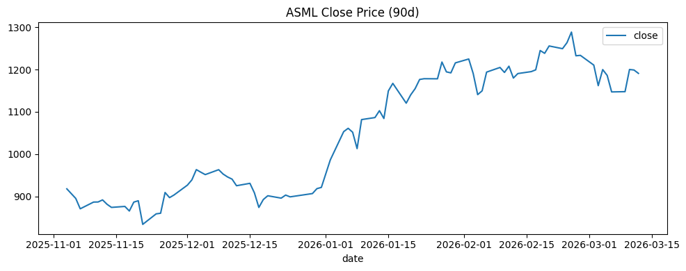
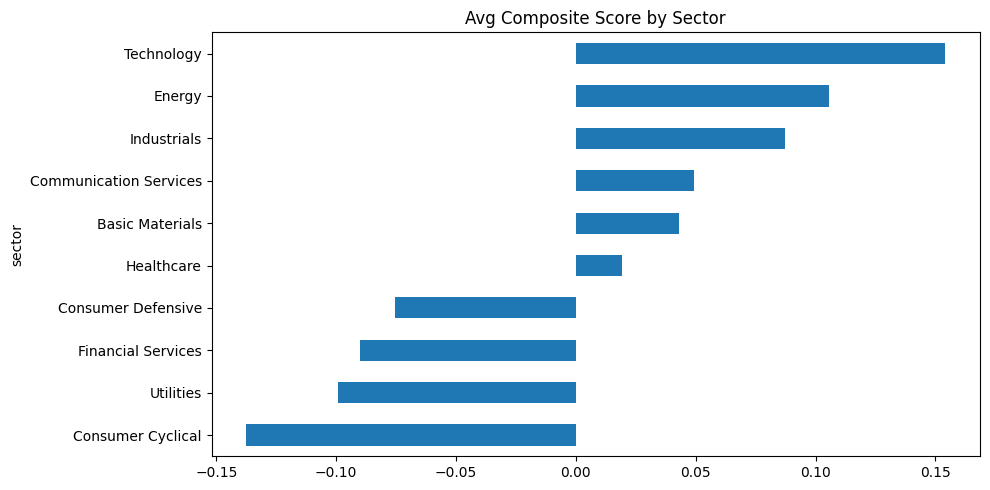
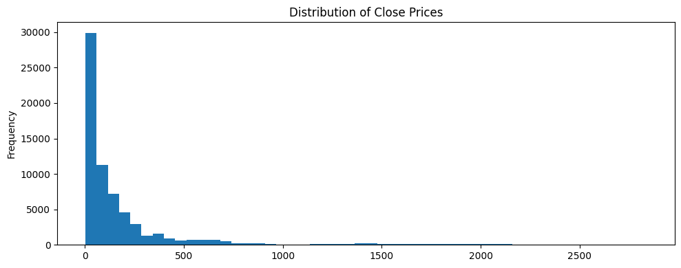
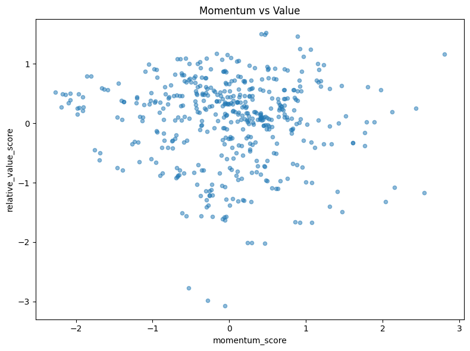
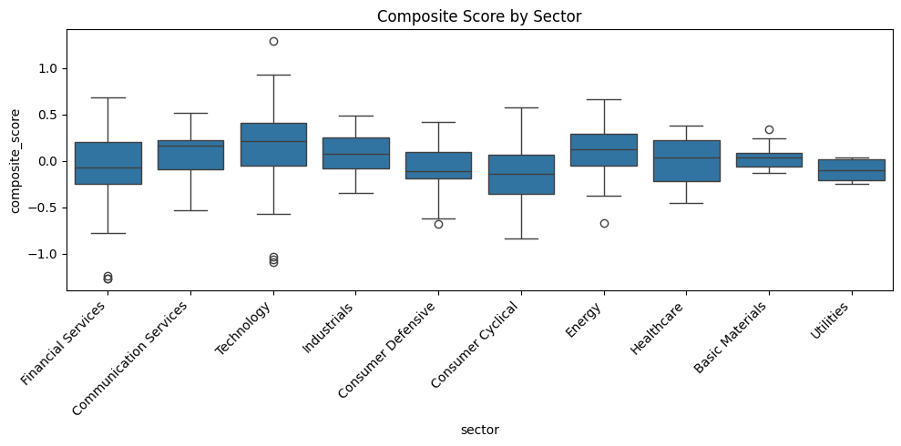
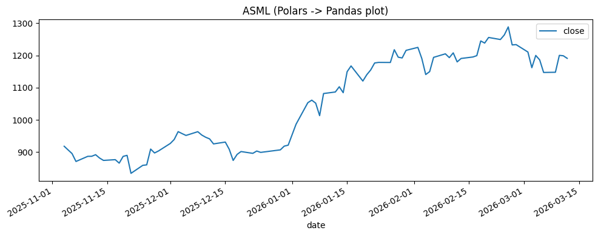

# 09 — Visualization & SQL Interface

Plotting and SQL queries against DataFrames.


```python
import pandas as pd
import polars as pl
import polars.selectors as cs
import numpy as np
from pathlib import Path
from IPython.display import display, Markdown

DATA = Path("../data")

# Core datasets
ohlcv_pd = pd.read_parquet(DATA / "eurostoxx50_ohlcv.parquet")  # 66K rows, daily OHLCV
ohlcv_pl = pl.read_parquet(DATA / "eurostoxx50_ohlcv.parquet")
dim_pd = pd.read_parquet(DATA / "index_dim.parquet")            # 169 rows, stock metadata
dim_pl = pl.read_parquet(DATA / "index_dim.parquet")
scores_pd = pd.read_parquet(DATA / "scores_daily.parquet")      # 466 rows, composite scores
scores_pl = pl.read_parquet(DATA / "scores_daily.parquet")

print(f"OHLCV: {ohlcv_pd.shape}, Dim: {dim_pd.shape}, Scores: {scores_pd.shape}")
```

## Pandas Built-in: Line Plot

This cell demonstrates:
- **Sort**: Reorder rows by column values (Pandas).
- **Plot**: Create a chart from DataFrame data. Uses matplotlib.
- **Tail**: Return the last N rows.


```python
asml=ohlcv_pd[ohlcv_pd["symbol"]=="ASML.AS"].sort_values("date").tail(90)
asml.plot(x="date",y="close",title="ASML Close Price (90d)",figsize=(10,4))
plt.tight_layout()
plt.show()
```


    

    


## Bar Plot

This cell demonstrates:
- **Group By**: Split rows into groups by one or more columns, then apply aggregate functions to each group independently.
- **Sort**: Reorder rows by column values (Pandas).
- **Plot**: Create a chart from DataFrame data. Uses matplotlib.


```python
scores_pd.groupby("sector")["composite_score"].mean().sort_values().plot.barh(title="Avg Composite Score by Sector",figsize=(10,5))
plt.tight_layout()
plt.show()
```


    

    


## Histogram

This cell demonstrates:
- **Plot**: Create a chart from DataFrame data. Uses matplotlib.


```python
ohlcv_pd["close"].plot.hist(bins=50,title="Distribution of Close Prices",figsize=(10,4))
plt.tight_layout()
plt.show()
```


    

    


## Scatter

This cell demonstrates:
- **Plot**: Create a chart from DataFrame data. Uses matplotlib.


```python
scores_pd.plot.scatter(x="momentum_score",y="relative_value_score",alpha=0.5,title="Momentum vs Value",figsize=(8,6))
plt.tight_layout()
plt.show()
```


    

    


## Seaborn

This cell demonstrates:
- **Seaborn**: Statistical visualization. Takes Pandas DataFrames.


```python
fig,ax=plt.subplots(figsize=(10,5))
sns.boxplot(data=scores_pd,x="sector",y="composite_score",ax=ax)
ax.set_title("Composite Score by Sector")
plt.xticks(rotation=45,ha="right")
plt.tight_layout()
plt.show()
```


    

    


## Polars to Pandas for Plotting

This cell demonstrates:
- **Filter**: Keep only rows matching a condition.
- **Sort**: Reorder rows by column values.
- **To Pandas**: Convert Polars DataFrame to Pandas. May copy data.
- **Plot**: Create a chart from DataFrame data. Uses matplotlib.


```python
asml_pl=ohlcv_pl.filter(pl.col("symbol")=="ASML.AS").sort("date").tail(90)
asml_pl.to_pandas().plot(x="date",y="close",title="ASML (Polars -> Pandas plot)",figsize=(10,4))
plt.tight_layout()
plt.show()
```


    

    


## Summary

| Library | Best For |
|---|---|
| df.plot() | Quick exploration |
| Matplotlib | Full control |
| Seaborn | Statistical plots |
| Polars .plot | Built-in Altair (experimental) |

---
# Part 2: SQL Interface

## Polars SQLContext

This cell demonstrates:
- **Collect**: Execute the lazy query plan and return results.
- **SQL Context**: Register Polars DataFrames as SQL tables, query with standard SQL.


```python
ctx=pl.SQLContext(ohlcv=ohlcv,dim=dim,scores=scores)
display(ctx.execute("SELECT * FROM ohlcv LIMIT 5").collect())
```


<div><style>
.dataframe > thead > tr,
.dataframe > tbody > tr {
  text-align: right;
  white-space: pre-wrap;
}
</style>
<small>shape: (5, 12)</small><table border="1" class="dataframe"><thead><tr><th>id</th><th>symbol</th><th>date</th><th>open</th><th>high</th><th>low</th><th>close</th><th>adj_close</th><th>volume</th><th>dividends</th><th>stock_splits</th><th>is_filled</th></tr><tr><td>i64</td><td>str</td><td>date</td><td>f64</td><td>f64</td><td>f64</td><td>f64</td><td>f64</td><td>i64</td><td>f64</td><td>f64</td><td>bool</td></tr></thead><tbody><tr><td>21160</td><td>&quot;ABI.BR&quot;</td><td>2021-01-04</td><td>58.15</td><td>58.85</td><td>56.78</td><td>57.21</td><td>53.5761</td><td>1513937</td><td>0.0</td><td>0.0</td><td>false</td></tr><tr><td>21161</td><td>&quot;ABI.BR&quot;</td><td>2021-01-05</td><td>56.9</td><td>57.98</td><td>56.75</td><td>57.18</td><td>53.548</td><td>1382722</td><td>0.0</td><td>0.0</td><td>false</td></tr><tr><td>21162</td><td>&quot;ABI.BR&quot;</td><td>2021-01-06</td><td>57.96</td><td>58.94</td><td>57.39</td><td>58.77</td><td>55.037</td><td>1370204</td><td>0.0</td><td>0.0</td><td>false</td></tr><tr><td>21163</td><td>&quot;ABI.BR&quot;</td><td>2021-01-07</td><td>58.68</td><td>58.86</td><td>57.88</td><td>58.4</td><td>54.6905</td><td>1469911</td><td>0.0</td><td>0.0</td><td>false</td></tr><tr><td>21164</td><td>&quot;ABI.BR&quot;</td><td>2021-01-08</td><td>58.16</td><td>58.4</td><td>57.43</td><td>57.86</td><td>54.1848</td><td>1428681</td><td>0.0</td><td>0.0</td><td>false</td></tr></tbody></table></div>


```python
display(ctx.execute("""
    SELECT symbol, AVG(close) as avg_close, COUNT(*) as days
    FROM ohlcv
    GROUP BY symbol
    ORDER BY avg_close DESC
    LIMIT 10
""").collect())
```


<div><style>
.dataframe > thead > tr,
.dataframe > tbody > tr {
  text-align: right;
  white-space: pre-wrap;
}
</style>
<small>shape: (10, 3)</small><table border="1" class="dataframe"><thead><tr><th>symbol</th><th>avg_close</th><th>days</th></tr><tr><td>str</td><td>f64</td><td>u32</td></tr></thead><tbody><tr><td>&quot;RMS.PA&quot;</td><td>1761.555748</td><td>1331</td></tr><tr><td>&quot;ADYEN.AS&quot;</td><td>1545.976409</td><td>1331</td></tr><tr><td>&quot;ASML.AS&quot;</td><td>671.348911</td><td>1331</td></tr><tr><td>&quot;MC.PA&quot;</td><td>662.404508</td><td>1331</td></tr><tr><td>&quot;RHM.DE&quot;</td><td>544.661533</td><td>1324</td></tr><tr><td>&quot;ARGX.BR&quot;</td><td>413.691961</td><td>1331</td></tr><tr><td>&quot;OR.PA&quot;</td><td>377.544365</td><td>1331</td></tr><tr><td>&quot;MUV2.DE&quot;</td><td>374.659932</td><td>1324</td></tr><tr><td>&quot;RACE.MI&quot;</td><td>289.753823</td><td>1321</td></tr><tr><td>&quot;ALV.DE&quot;</td><td>252.193731</td><td>1324</td></tr></tbody></table></div>


```python
display(ctx.execute("""
    SELECT ohlcv.symbol, dim.short_name, dim.sector, ohlcv.close
    FROM ohlcv
    JOIN dim USING (symbol)
    WHERE dim.country = 'Germany'
    ORDER BY ohlcv.close DESC
    LIMIT 10
""").collect())
```


<div><style>
.dataframe > thead > tr,
.dataframe > tbody > tr {
  text-align: right;
  white-space: pre-wrap;
}
</style>
<small>shape: (10, 4)</small><table border="1" class="dataframe"><thead><tr><th>symbol</th><th>short_name</th><th>sector</th><th>close</th></tr><tr><td>str</td><td>str</td><td>str</td><td>f64</td></tr></thead><tbody><tr><td>&quot;RHM.DE&quot;</td><td>&quot;RHEINMETALL AG&quot;</td><td>&quot;Industrials&quot;</td><td>1988.5</td></tr><tr><td>&quot;RHM.DE&quot;</td><td>&quot;RHEINMETALL AG&quot;</td><td>&quot;Industrials&quot;</td><td>1988.5</td></tr><tr><td>&quot;RHM.DE&quot;</td><td>&quot;RHEINMETALL AG&quot;</td><td>&quot;Industrials&quot;</td><td>1986.0</td></tr><tr><td>&quot;RHM.DE&quot;</td><td>&quot;RHEINMETALL AG&quot;</td><td>&quot;Industrials&quot;</td><td>1978.5</td></tr><tr><td>&quot;RHM.DE&quot;</td><td>&quot;RHEINMETALL AG&quot;</td><td>&quot;Industrials&quot;</td><td>1978.5</td></tr><tr><td>&quot;RHM.DE&quot;</td><td>&quot;RHEINMETALL AG&quot;</td><td>&quot;Industrials&quot;</td><td>1962.5</td></tr><tr><td>&quot;RHM.DE&quot;</td><td>&quot;RHEINMETALL AG&quot;</td><td>&quot;Industrials&quot;</td><td>1962.5</td></tr><tr><td>&quot;RHM.DE&quot;</td><td>&quot;RHEINMETALL AG&quot;</td><td>&quot;Industrials&quot;</td><td>1960.5</td></tr><tr><td>&quot;RHM.DE&quot;</td><td>&quot;RHEINMETALL AG&quot;</td><td>&quot;Industrials&quot;</td><td>1951.0</td></tr><tr><td>&quot;RHM.DE&quot;</td><td>&quot;RHEINMETALL AG&quot;</td><td>&quot;Industrials&quot;</td><td>1950.0</td></tr></tbody></table></div>


## Window Functions in SQL

This cell demonstrates:
- **Rolling Window**: Compute statistics over a sliding window of N consecutive rows (e.g., 7-day moving average).
- **Filter**: Keep only rows matching a condition.
- **Select**: Choose specific columns, optionally transforming them.
- **With Columns**: Add new columns or replace existing ones. All original columns are kept.


```python
# Polars SQL does not yet support custom ROWS BETWEEN frames.
# Use the expression API for rolling windows instead:
result = (
    ctx.execute("""
        SELECT symbol, date, close,
            AVG(close) OVER (PARTITION BY symbol ORDER BY date) as cumulative_avg
        FROM ohlcv
        WHERE symbol = 'ASML.AS'
        ORDER BY date DESC
        LIMIT 10
    """).collect()
)
display(result)

# For SMA-7, use the expression API:
sma_result = (
    ohlcv
    .filter(pl.col("symbol") == "ASML.AS")
    .sort("date")
    .with_columns(pl.col("close").rolling_mean(7).alias("sma_7"))
    .select("symbol", "date", "close", "sma_7")
    .sort("date", descending=True)
    .head(10)
)
display(sma_result)
```


<div><style>
.dataframe > thead > tr,
.dataframe > tbody > tr {
  text-align: right;
  white-space: pre-wrap;
}
</style>
<small>shape: (10, 4)</small><table border="1" class="dataframe"><thead><tr><th>symbol</th><th>date</th><th>close</th><th>cumulative_avg</th></tr><tr><td>str</td><td>date</td><td>f64</td><td>f64</td></tr></thead><tbody><tr><td>&quot;ASML.AS&quot;</td><td>2026-03-12</td><td>1190.8</td><td>671.348911</td></tr><tr><td>&quot;ASML.AS&quot;</td><td>2026-03-11</td><td>1198.8</td><td>671.348911</td></tr><tr><td>&quot;ASML.AS&quot;</td><td>2026-03-10</td><td>1200.0</td><td>671.348911</td></tr><tr><td>&quot;ASML.AS&quot;</td><td>2026-03-09</td><td>1147.6</td><td>671.348911</td></tr><tr><td>&quot;ASML.AS&quot;</td><td>2026-03-06</td><td>1147.0</td><td>671.348911</td></tr><tr><td>&quot;ASML.AS&quot;</td><td>2026-03-05</td><td>1186.0</td><td>671.348911</td></tr><tr><td>&quot;ASML.AS&quot;</td><td>2026-03-04</td><td>1199.8</td><td>671.348911</td></tr><tr><td>&quot;ASML.AS&quot;</td><td>2026-03-03</td><td>1161.8</td><td>671.348911</td></tr><tr><td>&quot;ASML.AS&quot;</td><td>2026-03-02</td><td>1210.4</td><td>671.348911</td></tr><tr><td>&quot;ASML.AS&quot;</td><td>2026-02-27</td><td>1233.4</td><td>671.348911</td></tr></tbody></table></div>


<div><style>
.dataframe > thead > tr,
.dataframe > tbody > tr {
  text-align: right;
  white-space: pre-wrap;
}
</style>
<small>shape: (10, 4)</small><table border="1" class="dataframe"><thead><tr><th>symbol</th><th>date</th><th>close</th><th>sma_7</th></tr><tr><td>str</td><td>date</td><td>f64</td><td>f64</td></tr></thead><tbody><tr><td>&quot;ASML.AS&quot;</td><td>2026-03-12</td><td>1190.8</td><td>1181.428571</td></tr><tr><td>&quot;ASML.AS&quot;</td><td>2026-03-11</td><td>1198.8</td><td>1177.285714</td></tr><tr><td>&quot;ASML.AS&quot;</td><td>2026-03-10</td><td>1200.0</td><td>1178.942857</td></tr><tr><td>&quot;ASML.AS&quot;</td><td>2026-03-09</td><td>1147.6</td><td>1183.714286</td></tr><tr><td>&quot;ASML.AS&quot;</td><td>2026-03-06</td><td>1147.0</td><td>1195.828571</td></tr><tr><td>&quot;ASML.AS&quot;</td><td>2026-03-05</td><td>1186.0</td><td>1216.028571</td></tr><tr><td>&quot;ASML.AS&quot;</td><td>2026-03-04</td><td>1199.8</td><td>1227.085714</td></tr><tr><td>&quot;ASML.AS&quot;</td><td>2026-03-03</td><td>1161.8</td><td>1234.142857</td></tr><tr><td>&quot;ASML.AS&quot;</td><td>2026-03-02</td><td>1210.4</td><td>1247.542857</td></tr><tr><td>&quot;ASML.AS&quot;</td><td>2026-02-27</td><td>1233.4</td><td>1251.514286</td></tr></tbody></table></div>


## DuckDB Integration

This cell demonstrates:
- **To Pandas**: Convert Polars DataFrame to Pandas. May copy data.
- **DuckDB**: Embedded analytical DB. Queries Pandas/Polars directly with SQL.


```python
try:
    import duckdb
    conn=duckdb.connect()
    ohlcv_pd=ohlcv.to_pandas()
    display(conn.execute("SELECT symbol,AVG(close) as avg FROM ohlcv_pd GROUP BY symbol ORDER BY avg DESC LIMIT 5").df())
except ImportError:
    print("pip install duckdb for DuckDB integration")
```


<div>
<style scoped>
    .dataframe tbody tr th:only-of-type {
        vertical-align: middle;
    }

    .dataframe tbody tr th {
        vertical-align: top;
    }

    .dataframe thead th {
        text-align: right;
    }
</style>
<table border="1" class="dataframe">
  <thead>
    <tr style="text-align: right;">
      <th></th>
      <th>symbol</th>
      <th>avg</th>
    </tr>
  </thead>
  <tbody>
    <tr>
      <th>0</th>
      <td>RMS.PA</td>
      <td>1761.555748</td>
    </tr>
    <tr>
      <th>1</th>
      <td>ADYEN.AS</td>
      <td>1545.976409</td>
    </tr>
    <tr>
      <th>2</th>
      <td>ASML.AS</td>
      <td>671.348911</td>
    </tr>
    <tr>
      <th>3</th>
      <td>MC.PA</td>
      <td>662.404508</td>
    </tr>
    <tr>
      <th>4</th>
      <td>RHM.DE</td>
      <td>544.661533</td>
    </tr>
  </tbody>
</table>
</div>


## Summary

| Feature | Polars SQL | DuckDB |
|---|---|---|
| Setup | pl.SQLContext() | duckdb.connect() |
| Input | Polars DataFrames | Pandas/Polars/Arrow |
| Output | LazyFrame | Pandas DataFrame |
| SQL dialect | Standard SQL | PostgreSQL-like |
