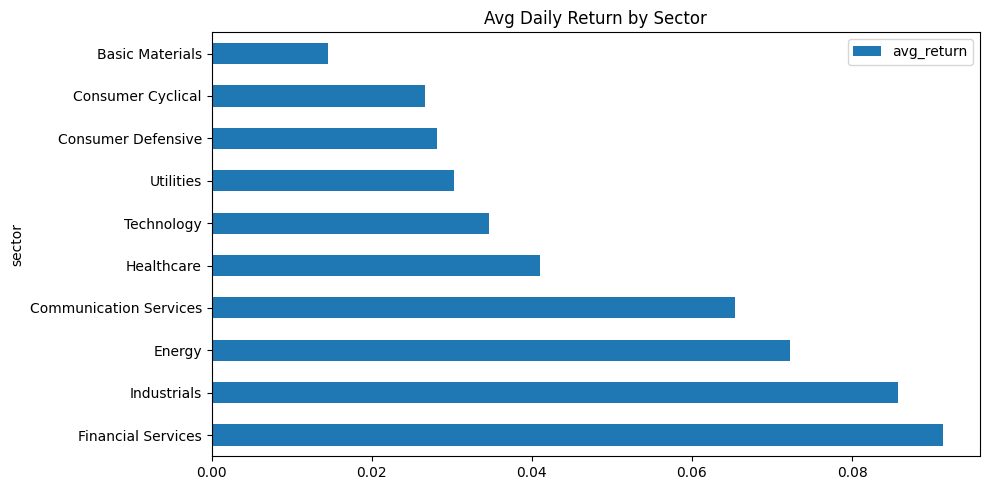

# 10 — Real-World Project, Testing & Migration

End-to-end analysis, validation, Pandas-to-Polars guide.


```python
import pandas as pd
import polars as pl
import polars.selectors as cs
import numpy as np
from pathlib import Path
from IPython.display import display, Markdown

DATA = Path("../data")

# Core datasets
ohlcv_pd = pd.read_parquet(DATA / "eurostoxx50_ohlcv.parquet")  # 66K rows, daily OHLCV
ohlcv_pl = pl.read_parquet(DATA / "eurostoxx50_ohlcv.parquet")
dim_pd = pd.read_parquet(DATA / "index_dim.parquet")            # 169 rows, stock metadata
dim_pl = pl.read_parquet(DATA / "index_dim.parquet")
scores_pd = pd.read_parquet(DATA / "scores_daily.parquet")      # 466 rows, composite scores
scores_pl = pl.read_parquet(DATA / "scores_daily.parquet")

print(f"OHLCV: {ohlcv_pd.shape}, Dim: {dim_pd.shape}, Scores: {scores_pd.shape}")
```

## Load All Data

This cell demonstrates:
- **Join**: Combine two DataFrames by matching rows on shared key columns.
- **Select**: Choose specific columns, optionally transforming them.
- **Head**: Return the first N rows.

## Enrich with Company Info

This cell demonstrates:
- **Join**: Combine two DataFrames by matching rows on shared key columns.
- **Select**: Choose specific columns, optionally transforming them.
- **Head**: Return the first N rows.


```python
enriched=ohlcv_pl.join(dim_pl.select("symbol","short_name","sector","country"),on="symbol",how="left")
display(enriched.select("symbol","short_name","date","close","sector").head(5))
```


<div><style>
.dataframe > thead > tr,
.dataframe > tbody > tr {
  text-align: right;
  white-space: pre-wrap;
}
</style>
<small>shape: (5, 5)</small><table border="1" class="dataframe"><thead><tr><th>symbol</th><th>short_name</th><th>date</th><th>close</th><th>sector</th></tr><tr><td>str</td><td>str</td><td>date</td><td>f64</td><td>str</td></tr></thead><tbody><tr><td>&quot;ABI.BR&quot;</td><td>&quot;AB INBEV&quot;</td><td>2021-01-04</td><td>57.21</td><td>&quot;Consumer Defensive&quot;</td></tr><tr><td>&quot;ABI.BR&quot;</td><td>&quot;AB INBEV&quot;</td><td>2021-01-05</td><td>57.18</td><td>&quot;Consumer Defensive&quot;</td></tr><tr><td>&quot;ABI.BR&quot;</td><td>&quot;AB INBEV&quot;</td><td>2021-01-06</td><td>58.77</td><td>&quot;Consumer Defensive&quot;</td></tr><tr><td>&quot;ABI.BR&quot;</td><td>&quot;AB INBEV&quot;</td><td>2021-01-07</td><td>58.4</td><td>&quot;Consumer Defensive&quot;</td></tr><tr><td>&quot;ABI.BR&quot;</td><td>&quot;AB INBEV&quot;</td><td>2021-01-08</td><td>57.86</td><td>&quot;Consumer Defensive&quot;</td></tr></tbody></table></div>


## Compute Returns

This cell demonstrates:
- **Window (.over)**: Compute a value per row based on its group, without collapsing rows. Like SQL OVER(PARTITION BY).
- **Shift (Lag/Lead)**: Access the previous row (shift(1)) or next row (shift(-1)) within each group.
- **Filter**: Keep only rows matching a condition.
- **Select**: Choose specific columns, optionally transforming them.


```python
with_ret=enriched.sort("symbol","date").with_columns(
    ((pl.col("close")-pl.col("close").shift(1).over("symbol"))/pl.col("close").shift(1).over("symbol")*100).round(2).alias("daily_return")
)
display(with_ret.filter(pl.col("symbol")=="ASML.AS").select("symbol","date","close","daily_return").tail(10))
```


<div><style>
.dataframe > thead > tr,
.dataframe > tbody > tr {
  text-align: right;
  white-space: pre-wrap;
}
</style>
<small>shape: (10, 4)</small><table border="1" class="dataframe"><thead><tr><th>symbol</th><th>date</th><th>close</th><th>daily_return</th></tr><tr><td>str</td><td>date</td><td>f64</td><td>f64</td></tr></thead><tbody><tr><td>&quot;ASML.AS&quot;</td><td>2026-02-27</td><td>1233.4</td><td>0.08</td></tr><tr><td>&quot;ASML.AS&quot;</td><td>2026-03-02</td><td>1210.4</td><td>-1.86</td></tr><tr><td>&quot;ASML.AS&quot;</td><td>2026-03-03</td><td>1161.8</td><td>-4.02</td></tr><tr><td>&quot;ASML.AS&quot;</td><td>2026-03-04</td><td>1199.8</td><td>3.27</td></tr><tr><td>&quot;ASML.AS&quot;</td><td>2026-03-05</td><td>1186.0</td><td>-1.15</td></tr><tr><td>&quot;ASML.AS&quot;</td><td>2026-03-06</td><td>1147.0</td><td>-3.29</td></tr><tr><td>&quot;ASML.AS&quot;</td><td>2026-03-09</td><td>1147.6</td><td>0.05</td></tr><tr><td>&quot;ASML.AS&quot;</td><td>2026-03-10</td><td>1200.0</td><td>4.57</td></tr><tr><td>&quot;ASML.AS&quot;</td><td>2026-03-11</td><td>1198.8</td><td>-0.1</td></tr><tr><td>&quot;ASML.AS&quot;</td><td>2026-03-12</td><td>1190.8</td><td>-0.67</td></tr></tbody></table></div>


## Sector Performance

This cell demonstrates:
- **Group By**: Split rows into groups by one or more columns, then apply aggregate functions to each group independently.
- **Aggregation**: Compute summary statistics (mean, sum, count, min, max) for each group. Returns one row per group.
- **Filter**: Keep only rows matching a condition.
- **Sort**: Reorder rows by column values.


```python
sector=with_ret.filter(pl.col("daily_return").is_not_null()).group_by("sector").agg(
    pl.col("daily_return").mean().round(4).alias("avg_return"),
    pl.col("daily_return").std().round(4).alias("volatility"),
    pl.col("symbol").n_unique().alias("stocks"),
).sort("avg_return",descending=True)
display(sector)
```


<div><style>
.dataframe > thead > tr,
.dataframe > tbody > tr {
  text-align: right;
  white-space: pre-wrap;
}
</style>
<small>shape: (10, 4)</small><table border="1" class="dataframe"><thead><tr><th>sector</th><th>avg_return</th><th>volatility</th><th>stocks</th></tr><tr><td>str</td><td>f64</td><td>f64</td><td>u32</td></tr></thead><tbody><tr><td>&quot;Financial Services&quot;</td><td>0.0914</td><td>1.689</td><td>11</td></tr><tr><td>&quot;Industrials&quot;</td><td>0.0857</td><td>1.9855</td><td>10</td></tr><tr><td>&quot;Energy&quot;</td><td>0.0723</td><td>1.4732</td><td>2</td></tr><tr><td>&quot;Communication Services&quot;</td><td>0.0654</td><td>1.2328</td><td>1</td></tr><tr><td>&quot;Healthcare&quot;</td><td>0.041</td><td>1.9143</td><td>4</td></tr><tr><td>&quot;Technology&quot;</td><td>0.0346</td><td>2.3335</td><td>5</td></tr><tr><td>&quot;Utilities&quot;</td><td>0.0303</td><td>1.2918</td><td>2</td></tr><tr><td>&quot;Consumer Defensive&quot;</td><td>0.0282</td><td>1.3438</td><td>4</td></tr><tr><td>&quot;Consumer Cyclical&quot;</td><td>0.0267</td><td>1.9485</td><td>9</td></tr><tr><td>&quot;Basic Materials&quot;</td><td>0.0145</td><td>1.4817</td><td>2</td></tr></tbody></table></div>


## Top Performers

This cell demonstrates:
- **Select**: Choose specific columns, optionally transforming them.
- **Sort**: Reorder rows by column values.
- **Head**: Return the first N rows.


```python
display(scores_pl.sort("composite_rank").head(10).select("symbol","short_name","sector","composite_score","composite_rank","current_price"))
```


<div><style>
.dataframe > thead > tr,
.dataframe > tbody > tr {
  text-align: right;
  white-space: pre-wrap;
}
</style>
<small>shape: (10, 6)</small><table border="1" class="dataframe"><thead><tr><th>symbol</th><th>short_name</th><th>sector</th><th>composite_score</th><th>composite_rank</th><th>current_price</th></tr><tr><td>str</td><td>str</td><td>str</td><td>f64</td><td>i64</td><td>f64</td></tr></thead><tbody><tr><td>&quot;BNP.PA&quot;</td><td>&quot;BNP PARIBAS ACT.A&quot;</td><td>&quot;Financial Services&quot;</td><td>0.683947</td><td>1</td><td>89.32</td></tr><tr><td>&quot;BNP.PA&quot;</td><td>&quot;BNP PARIBAS ACT.A&quot;</td><td>&quot;Financial Services&quot;</td><td>0.663971</td><td>1</td><td>86.35</td></tr><tr><td>&quot;BNP.PA&quot;</td><td>&quot;BNP PARIBAS ACT.A&quot;</td><td>&quot;Financial Services&quot;</td><td>0.679599</td><td>1</td><td>87.44</td></tr><tr><td>&quot;DVN&quot;</td><td>&quot;Devon Energy Corporation&quot;</td><td>&quot;Energy&quot;</td><td>0.665507</td><td>1</td><td>45.36</td></tr><tr><td>&quot;8001.T&quot;</td><td>&quot;ITOCHU CORP&quot;</td><td>&quot;Industrials&quot;</td><td>0.478444</td><td>1</td><td>2066.5</td></tr><tr><td>&quot;6981.T&quot;</td><td>&quot;MURATA MANUFACTURING CO&quot;</td><td>&quot;Technology&quot;</td><td>0.494602</td><td>1</td><td>3783.0</td></tr><tr><td>&quot;6981.T&quot;</td><td>&quot;MURATA MANUFACTURING CO&quot;</td><td>&quot;Technology&quot;</td><td>0.546581</td><td>1</td><td>3720.0</td></tr><tr><td>&quot;MU&quot;</td><td>&quot;Micron Technology, Inc.&quot;</td><td>&quot;Technology&quot;</td><td>0.925838</td><td>1</td><td>400.77</td></tr><tr><td>&quot;MU&quot;</td><td>&quot;Micron Technology, Inc.&quot;</td><td>&quot;Technology&quot;</td><td>0.862677</td><td>1</td><td>370.3</td></tr><tr><td>&quot;MU&quot;</td><td>&quot;Micron Technology, Inc.&quot;</td><td>&quot;Technology&quot;</td><td>1.287144</td><td>1</td><td>418.69</td></tr></tbody></table></div>


## Visualize

This cell demonstrates:
- **To Pandas**: Convert Polars DataFrame to Pandas. May copy data.
- **Plot**: Create a chart from DataFrame data. Uses matplotlib.


```python
sector.to_pandas().plot.barh(x="sector",y="avg_return",title="Avg Daily Return by Sector",figsize=(10,5))
plt.tight_layout()
plt.show()
```


    

    


---
# Part 2: Testing & Debugging


```python
ohlcv_pl=pl.read_parquet(DATA/"eurostoxx50_ohlcv.parquet")
```

## Polars assert_frame_equal

This cell demonstrates:
- **Assert Equal**: Verify two DataFrames are identical. Raises error if different.


```python
from polars.testing import assert_frame_equal, assert_series_equal
df1=pl.DataFrame({"a":[1,2,3],"b":[4.0,5.0,6.0]})
df2=pl.DataFrame({"a":[1,2,3],"b":[4.0,5.0,6.0]})
assert_frame_equal(df1,df2)
print("Frames equal")
```

    Frames equal
    

## Pandas assert_frame_equal

This cell demonstrates:
- **Assert Equal**: Verify two DataFrames are identical. Raises error if different.


```python
from pandas.testing import assert_frame_equal as pd_afe
df1=pd.DataFrame({"a":[1,2,3]})
df2=pd.DataFrame({"a":[1,2,3]})
pd_afe(df1,df2)
print("Pandas frames equal")
```

    Pandas frames equal
    

## Debugging Chains

This cell demonstrates:
- **Filter**: Keep only rows matching a condition.
- **Select**: Choose specific columns, optionally transforming them.
- **With Columns**: Add new columns or replace existing ones. All original columns are kept.
- **Sort**: Reorder rows by column values.


```python
step1=ohlcv_pl.filter(pl.col("symbol")=="ASML.AS")
print(f"After filter: {step1.shape}")
step2=step1.sort("date").with_columns(((pl.col("close")-pl.col("open"))/pl.col("open")*100).round(2).alias("ret"))
print(f"After with_columns: {step2.shape}")
display(step2.select("date","close","ret").tail(5))
```

    After filter: (1331, 12)
    After with_columns: (1331, 13)
    


<div><style>
.dataframe > thead > tr,
.dataframe > tbody > tr {
  text-align: right;
  white-space: pre-wrap;
}
</style>
<small>shape: (5, 3)</small><table border="1" class="dataframe"><thead><tr><th>date</th><th>close</th><th>ret</th></tr><tr><td>date</td><td>f64</td><td>f64</td></tr></thead><tbody><tr><td>2026-03-06</td><td>1147.0</td><td>-3.29</td></tr><tr><td>2026-03-09</td><td>1147.6</td><td>7.05</td></tr><tr><td>2026-03-10</td><td>1200.0</td><td>0.98</td></tr><tr><td>2026-03-11</td><td>1198.8</td><td>0.88</td></tr><tr><td>2026-03-12</td><td>1190.8</td><td>-0.33</td></tr></tbody></table></div>


## Data Validation

This cell demonstrates:
- **Filter**: Keep only rows matching a condition.
- **Null Detection**: Check which values are missing (Polars).
- **pl.col**: Reference a column by name. The foundation of all Polars expressions.


```python
def validate(df):
    errors=[]
    if df.filter(pl.col("close").is_null()).height>0: errors.append("null closes")
    if df.filter(pl.col("high")<pl.col("low")).height>0: errors.append("high<low")
    if df.filter(pl.col("close")<0).height>0: errors.append("negative prices")
    return errors
print(f"Validation: {validate(ohlcv_pl) or 'PASS'}")
```

    Validation: PASS
    

---
# Part 3: Pandas to Polars Migration Guide


```python
ohlcv_pd=pd.read_parquet(DATA/"eurostoxx50_ohlcv.parquet")
ohlcv_pl=pl.read_parquet(DATA/"eurostoxx50_ohlcv.parquet")
```

## Concepts to Unlearn

This cell demonstrates:
- **Sort**: Reorder rows by column values.
- **Set Index**: Make a column the DataFrame index (Pandas only). Polars has no index.


```python
# Pandas: index
df_pd=ohlcv_pd.set_index("date")
print(f"Pandas index: {df_pd.index.name}")
# Polars: no index
df_pl=ohlcv_pl.sort("date")
print("Polars: just use sort/filter")
```

    Pandas index: date
    Polars: just use sort/filter
    

### 2. No inplace

This cell demonstrates:
- **Sort**: Reorder rows by column values.
- **inplace (Anti-pattern)**: Mutate in place. Polars never does this. Prefer returning new DataFrames.


```python
df=ohlcv_pd.copy()
df.sort_values("date",inplace=True)
print("Pandas: mutated")
df2=ohlcv_pl.sort("date")
print(f"Polars: original {ohlcv_pl.shape}, new {df2.shape}")
```

    Pandas: mutated
    Polars: original (66355, 12), new (66355, 12)
    

### 3. No iloc/loc

This cell demonstrates:
- **Select**: Choose specific columns, optionally transforming them.
- **Head**: Return the first N rows.


```python
# Pandas
display(ohlcv_pd.iloc[0:3,1:4])
# Polars
display(ohlcv_pl.select(ohlcv_pl.columns[1:4]).head(3))
```


<div>
<style scoped>
    .dataframe tbody tr th:only-of-type {
        vertical-align: middle;
    }

    .dataframe tbody tr th {
        vertical-align: top;
    }

    .dataframe thead th {
        text-align: right;
    }
</style>
<table border="1" class="dataframe">
  <thead>
    <tr style="text-align: right;">
      <th></th>
      <th>symbol</th>
      <th>date</th>
      <th>open</th>
    </tr>
  </thead>
  <tbody>
    <tr>
      <th>0</th>
      <td>ABI.BR</td>
      <td>2021-01-04</td>
      <td>58.15</td>
    </tr>
    <tr>
      <th>1</th>
      <td>ABI.BR</td>
      <td>2021-01-05</td>
      <td>56.90</td>
    </tr>
    <tr>
      <th>2</th>
      <td>ABI.BR</td>
      <td>2021-01-06</td>
      <td>57.96</td>
    </tr>
  </tbody>
</table>
</div>


<div><style>
.dataframe > thead > tr,
.dataframe > tbody > tr {
  text-align: right;
  white-space: pre-wrap;
}
</style>
<small>shape: (3, 3)</small><table border="1" class="dataframe"><thead><tr><th>symbol</th><th>date</th><th>open</th></tr><tr><td>str</td><td>date</td><td>f64</td></tr></thead><tbody><tr><td>&quot;ABI.BR&quot;</td><td>2021-01-04</td><td>58.15</td></tr><tr><td>&quot;ABI.BR&quot;</td><td>2021-01-05</td><td>56.9</td></tr><tr><td>&quot;ABI.BR&quot;</td><td>2021-01-06</td><td>57.96</td></tr></tbody></table></div>


## Translation Table

This cell demonstrates:
- **Group By**: Split rows into groups by one or more columns, then apply aggregate functions to each group independently.
- **Aggregation**: Compute summary statistics (mean, sum, count, min, max) for each group. Returns one row per group.
- **Join**: Combine two DataFrames by matching rows on shared key columns.
- **Merge**: Combine two DataFrames by matching rows on shared key columns (Pandas).


```python
table = '''
| Pandas | Polars |
|---|---|
| df["col"] | df.select("col") |
| df[["a","b"]] | df.select("a","b") |
| df.loc[mask] | df.filter(expr) |
| df.iloc[0:5] | df.head(5) |
| df.assign(new=expr) | df.with_columns(expr.alias("new")) |
| df.sort_values("col") | df.sort("col") |
| df.groupby().agg() | df.group_by().agg() |
| df.merge(right) | df.join(right) |
| pd.concat([a,b]) | pl.concat([a,b]) |
| df.melt() | df.unpivot() |
| df.isna() | df.is_null() |
| df.fillna(val) | df.fill_null(val) |
| df.rename(columns=d) | df.rename(d) |
'''
display(Markdown(table))
```


| Pandas | Polars |
|---|---|
| df["col"] | df.select("col") |
| df[["a","b"]] | df.select("a","b") |
| df.loc[mask] | df.filter(expr) |
| df.iloc[0:5] | df.head(5) |
| df.assign(new=expr) | df.with_columns(expr.alias("new")) |
| df.sort_values("col") | df.sort("col") |
| df.groupby().agg() | df.group_by().agg() |
| df.merge(right) | df.join(right) |
| pd.concat([a,b]) | pl.concat([a,b]) |
| df.melt() | df.unpivot() |
| df.isna() | df.is_null() |
| df.fillna(val) | df.fill_null(val) |
| df.rename(columns=d) | df.rename(d) |


## When to Use Which

| Use Pandas | Use Polars |
|---|---|
| Mature ecosystem (sklearn, seaborn) | Performance |
| Small data (<100K) | Large data (>1M) |
| Interactive exploration | Production pipelines |
| Legacy codebase | Greenfield projects |

## Common Anti-Patterns

This cell demonstrates:
- **With Columns**: Add new columns or replace existing ones. All original columns are kept.
- **iterrows (Anti-pattern)**: Row-by-row iteration. Extremely slow. Use vectorized operations.
- **pl.col**: Reference a column by name. The foundation of all Polars expressions.


```python
# Anti-pattern: iterrows
print("BAD: for _, row in df.iterrows() -- always vectorize!")
print("GOOD Pandas: df[col1] - df[col2]")
print("GOOD Polars: df.with_columns(pl.col(a) - pl.col(b))")
```

    BAD: for _, row in df.iterrows() -- always vectorize!
    GOOD Pandas: df[col1] - df[col2]
    GOOD Polars: df.with_columns(pl.col(a) - pl.col(b))
    

## Summary

Polars is not a drop-in Pandas replacement. It is a different mental model:
- Pandas = rows and indexes (spreadsheet)
- Polars = expressions and transforms (SQL/functional)
