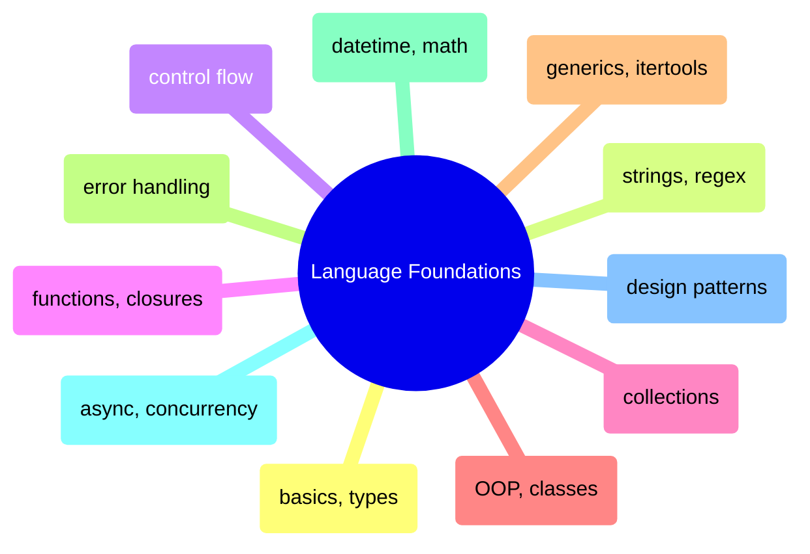
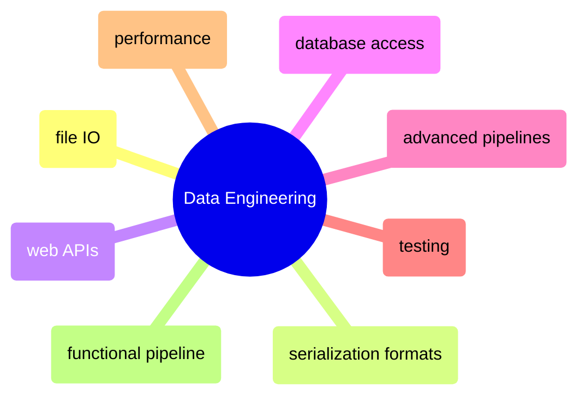
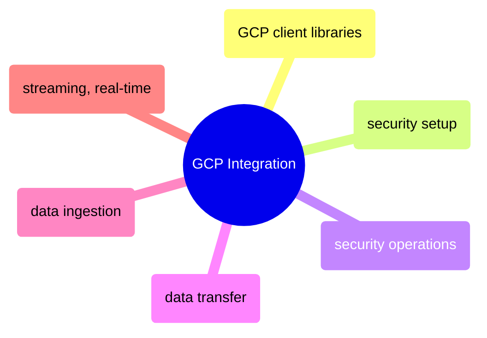

# MOC: Programming Languages

Python and C# for data engineering — 25 topics, each with paired notebooks
showing the same concepts in both languages. Expand any topic to browse
sections and jump to the specific heading in either language.

> [!example]- Language Foundations
>
> > [!abstract]- Basics, Types, and Operators
> >
> > - Environment setup and runtime info — [[01_py_basics#Environment Setup|py]] · [[01_cs_basics#Environment Setup|cs]]
> > - Console input and output — [[01_py_basics#Console I|py]] · [[01_cs_basics#Console I|cs]]
> > - Variables, constants, and data types — [[01_py_basics#Variables, Constants & Data Types|py]] · [[01_cs_basics#Variables, Constants & Data Types|cs]]
> > - Arithmetic, comparison, logical, and bitwise operators — [[01_py_basics#Operators|py]] · [[01_cs_basics#Operators|cs]]
> > - Magic methods and operator overloading — [[01_py_basics#Magic Methods (Dunder Methods)|py]] · [[01_cs_basics#Special Methods & Operator Overloading|cs]]
>
> > [!abstract]- Strings and Regular Expressions
> >
> > - String creation, immutability, and raw strings — [[02_py_strings#String Creation & Basics|py]] · [[02_cs_strings#String Creation & Basics|cs]]
> > - Indexing, slicing, and substrings — [[02_py_strings#Indexing & Slicing|py]] · [[02_cs_strings#Indexing & Slicing|cs]]
> > - String methods for cleaning and transformation — [[02_py_strings#String Methods|py]] · [[02_cs_strings#String Methods|cs]]
> > - Formatting and interpolation — [[02_py_strings#String Formatting|py]] · [[02_cs_strings#String Formatting|cs]]
> > - Efficient string building — [[02_py_strings#Efficient String Building|py]] · [[02_cs_strings#Efficient String Building (StringBuilder)|cs]]
> > - Regular expressions — [[02_py_strings#Regular Expressions|py]] · [[02_cs_strings#Regular Expressions|cs]]
>
> > [!abstract]- Control Flow
> >
> > - Conditionals and branching — [[03_py_control_flow#Conditional Statements|py]] · [[03_cs_control_flow#Conditional Statements|cs]]
> > - Loops and iteration — [[03_py_control_flow#Loops|py]] · [[03_cs_control_flow#Loops|cs]]
> > - Break, continue, and loop control — [[03_py_control_flow#Loop Control (break, continue, pass)|py]] · [[03_cs_control_flow#Loop Control|cs]]
> > - Iterators and generators — [[03_py_control_flow#Iterators & Generators (yield)|py]] · [[03_cs_control_flow#Iterators & Generators|cs]]
> > - Comprehensions, LINQ, and functional tools — [[03_py_control_flow#Comprehensions & Functional Tools|py]] · [[03_cs_control_flow#LINQ & Functional Equivalents|cs]]
>
> > [!abstract]- Functions and Closures
> >
> > - Function basics and signatures — [[04_py_functions#Function Basics|py]] · [[04_cs_functions#Function Basics|cs]]
> > - Parameters and argument passing — [[04_py_functions#Parameters|py]] · [[04_cs_functions#Parameters|cs]]
> > - Lambda expressions — [[04_py_functions#Lambda Expressions|py]] · [[04_cs_functions#Lambda Expressions|cs]]
> > - Closures and variable scope — [[04_py_functions#Closures & Scope|py]] · [[04_cs_functions#Closures & Scope|cs]]
> > - Decorators and delegates — [[04_py_functions#Decorators|py]] · [[04_cs_functions#Delegates & Events|cs]]
>
> > [!abstract]- Collections
> >
> > - Lists and dynamic arrays — [[05_py_collections#Lists (Dynamic Arrays)|py]] · [[05_cs_collections#Arrays and Lists|cs]]
> > - Dictionaries and hash maps — [[05_py_collections#Dictionaries|py]] · [[05_cs_collections#Dictionaries|cs]]
> > - Sets and uniqueness — [[05_py_collections#Sets|py]] · [[05_cs_collections#Sets|cs]]
> > - Tuples and enums — [[05_py_collections#Tuples & Enums|py]] · [[05_cs_collections#Tuples and Enums|cs]]
> > - Stacks, queues, and deques — [[05_py_collections#Stacks, Queues & Deques|py]] · [[05_cs_collections#Stacks, Queues, and Linked Lists|cs]]
>
> > [!abstract]- Object-Oriented Programming
> >
> > - Classes and objects — [[06_py_oop#Classes & Objects|py]] · [[06_cs_oop#Classes & Objects|cs]]
> > - Inheritance and polymorphism — [[06_py_oop#Inheritance & Polymorphism|py]] · [[06_cs_oop#Inheritance & Polymorphism|cs]]
> > - Abstract classes and interfaces — [[06_py_oop#Abstract Classes & Interfaces|py]] · [[06_cs_oop#Abstract Classes & Interfaces|cs]]
> > - Encapsulation and access control — [[06_py_oop#Encapsulation & Access Control|py]] · [[06_cs_oop#Encapsulation & Access Modifiers|cs]]
> > - Dataclasses and records — [[06_py_oop#Dataclasses & Records|py]] · [[06_cs_oop#Records & Init-Only Properties|cs]]
>
> > [!abstract]- Generics and Itertools/LINQ
> >
> > - Generic types and type constraints — [[07_py_generics_linq#Generics|py]] · [[07_cs_generics_linq#Generics|cs]]
> > - Analytics with Pandas/Polars vs LINQ — [[07_py_generics_linq#Pandas vs Polars Analytics|py]] · [[07_cs_generics_linq#Advanced LINQ|cs]]
> > - Aggregations — [[07_py_generics_linq#Aggregations|py]] · [[07_cs_generics_linq#Aggregations|cs]]
> > - Window functions — [[07_py_generics_linq#Window Functions|py]] · [[07_cs_generics_linq#Window Functions|cs]]
> > - Joins — [[07_py_generics_linq#Joins|py]] · [[07_cs_generics_linq#Joins|cs]]
>
> > [!abstract]- Error Handling
> >
> > - Try, catch, and finally — [[08_py_errorhandling#try|py]] · [[08_cs_errorhandling#try|cs]]
> > - Exception types and hierarchy — [[08_py_errorhandling#Exception Types and Hierarchy|py]] · [[08_cs_errorhandling#Exception Types and Hierarchy|cs]]
> > - Custom exceptions — [[08_py_errorhandling#Custom Exceptions|py]] · [[08_cs_errorhandling#Custom Exceptions|cs]]
> > - Resource cleanup and context managers — [[08_py_errorhandling#Context Managers — with statement|py]] · [[08_cs_errorhandling#Resource Cleanup — using and IDisposable|cs]]
> > - Data engineering resilience patterns — [[08_py_errorhandling#Data Engineering — error accumulation and resilience patterns|py]] · [[08_cs_errorhandling#Data Engineering — error accumulation and resilience patterns|cs]]
>
> > [!abstract]- DateTime, Math, and Utilities
> >
> > - Date and time handling — [[11_py_datetimemathutils#Date and Time|py]] · [[11_cs_datetimemathutils#Date and Time|cs]]
> > - Math and random — [[11_py_datetimemathutils#Math and Random|py]] · [[11_cs_datetimemathutils#Math and Random|cs]]
> > - Logging — [[11_py_datetimemathutils#Logging|py]] · [[11_cs_datetimemathutils#Logging|cs]]
> > - Configuration and environment variables — [[11_py_datetimemathutils#Configuration and Environment Variables|py]] · [[11_cs_datetimemathutils#Configuration and Environment Variables|cs]]
>
> > [!abstract]- Async and Concurrency
> >
> > - Async and await fundamentals — [[12_py_asyncconcurrency#Async and Await|py]] · [[12_cs_asyncconcurrency#Async and Await|cs]]
> > - Tasks and parallelism — [[12_py_asyncconcurrency#Tasks and Parallelism|py]] · [[12_cs_asyncconcurrency#Tasks and Parallelism|cs]]
> > - Threading and concurrency — [[12_py_asyncconcurrency#Threading and Concurrency|py]] · [[12_cs_asyncconcurrency#Threading and Concurrency|cs]]
>
> > [!abstract]- Design Patterns
> >
> > - Dependency injection — [[18_py_designpatterns#Dependency Injection|py]] · [[18_cs_designpatterns#Dependency Injection|cs]]
> > - Design patterns (Singleton, Factory, Observer, Strategy) — [[18_py_designpatterns#Design Patterns|py]] · [[18_cs_designpatterns#Design Patterns|cs]]
> > - Data validation — [[18_py_designpatterns#Data Validation|py]] · [[18_cs_designpatterns#Data Validation|cs]]
> > - Reflection and introspection — [[18_py_designpatterns#Reflection|py]] · [[18_cs_designpatterns#Reflection|cs]]
> > - Project structure and best practices — [[18_py_designpatterns#Project Structure & Best Practices|py]] · [[18_cs_designpatterns#Project Structure & Best Practices|cs]]

> [!example]- Data Engineering
>
> > [!abstract]- File I/O and Serialization
> >
> > - Read, write, and append files — [[09_py_fileio_serialization#Read, Write, Append Files|py]] · [[09_cs_fileio_serialization#Read, Write, Append Files|cs]]
> > - CSV files — [[09_py_fileio_serialization#CSV Files|py]] · [[09_cs_fileio_serialization#CSV Files|cs]]
> > - JSON — [[09_py_fileio_serialization#JSON|py]] · [[09_cs_fileio_serialization#JSON|cs]]
> > - YAML — [[09_py_fileio_serialization#YAML|py]] · [[09_cs_fileio_serialization#YAML|cs]]
> > - Serialization, deserialization, and streams — [[09_py_fileio_serialization#Serialization, Deserialization, and Streams|py]] · [[09_cs_fileio_serialization#Serialization, Deserialization, and Streams|cs]]
> > - Encoding and decoding — [[09_py_fileio_serialization#Encoding and Decoding|py]] · [[09_cs_fileio_serialization#Encoding and Decoding|cs]]
>
> > [!abstract]- Serialization Formats
> >
> > - Parquet files — [[10_py_serialization_formats#Parquet Files|py]] · [[10_cs_serialization_formats#Parquet Files|cs]]
> > - Enterprise message serialization (Protobuf, Avro) — [[10_py_serialization_formats#Enterprise Message Serialization|py]] · [[10_cs_serialization_formats#Protocol Buffers (Protobuf)|cs]]
> > - Format performance benchmark — [[10_py_serialization_formats#Format Performance Benchmark|py]] · [[10_cs_serialization_formats#Format Performance Benchmark|cs]]
>
> > [!abstract]- Web APIs
> >
> > - HTTP clients and REST API calls — [[15_py_webapis#HTTP Clients & REST API Calls|py]] · [[15_cs_webapis#HTTP Clients & REST API Calls|cs]]
> > - REST API patterns for data engineering — [[15_py_webapis#REST API Patterns for Data Engineering|py]] · [[15_cs_webapis#REST API Patterns for Data Engineering|cs]]
> > - Building a REST API — [[15_py_webapis#Building a REST API (FastAPI)|py]] · [[15_cs_webapis#Building a REST API (ASP.NET Minimal APIs)|cs]]
> > - Data validation for production APIs — [[15_py_webapis#Pydantic — Data Validation for Production APIs|py]] · [[15_cs_webapis#Data Validation — Records, Data Annotations, and FluentValidation|cs]]
>
> > [!abstract]- Database Access
> >
> > - SQLite embedded database — [[16_py_database#SQLite — Built-in Embedded Database|py]] · [[16_cs_database#SQLite — Lightweight Embedded Database|cs]]
> > - SQL Server connectivity — [[16_py_database#SQL Server — pyodbc (ODBC Driver 18)|py]] · [[16_cs_database#SQL Server|cs]]
> > - ORM and micro-ORM — [[16_py_database#SQLAlchemy — ORM|py]] · [[16_cs_database#Dapper — Micro-ORM|cs]]
> > - DuckDB embedded analytical database — [[16_py_database#DuckDB — Embedded Analytical SQL Database|py]] · [[16_cs_database#DuckDB — Embedded Analytical SQL Database|cs]]
> > - Querying files directly — [[16_py_database#Querying Files — DuckDB vs Polars vs Pandas|py]] · [[16_cs_database#Querying Files — DuckDB SQL vs Polars.NET DataFrame|cs]]
>
> > [!abstract]- Advanced Pipelines
> >
> > - Async generators and TPL Dataflow — [[13_py_advancedpipelines#Async Generators with Real APIs|py]] · [[13_cs_advancedpipelines#TPL Dataflow|cs]]
> > - Parallel API ingestion — [[13_py_advancedpipelines#Parallel API Ingestion|py]] · [[13_cs_advancedpipelines#Parallel API Ingestion|cs]]
> > - Cross-process execution — [[13_py_advancedpipelines#Cross-Process Execution|py]] · [[13_cs_advancedpipelines#Cross-Process Execution|cs]]
>
> > [!abstract]- Testing
> >
> > - Testing philosophy and the testing pyramid — [[14_py_testing#Testing Philosophy|py]] · [[14_cs_testing#Testing Philosophy|cs]]
> > - Unit testing (pytest vs xUnit) — [[14_py_testing#Unit Testing with pytest|py]] · [[14_cs_testing#Unit Testing with xUnit|cs]]
> > - Mocking and patching — [[14_py_testing#Mocking and Patching|py]] · [[14_cs_testing#Mocking with Moq|cs]]
> > - Test patterns for data engineering — [[14_py_testing#Test Patterns for Data Engineering|py]] · [[14_cs_testing#Test Patterns for Data Engineering|cs]]
> > - Integration testing with real database — [[14_py_testing#Integration Testing with Real Database|py]] · [[14_cs_testing#Integration Testing with Real Database|cs]]
>
> > [!abstract]- Performance and Code Quality
> >
> > - Timing and benchmarking — [[19_py_performance_quality#Timing & Benchmarking|py]] · [[19_cs_performance_quality#Timing & Benchmarking|cs]]
> > - Memory profiling and measurement — [[19_py_performance_quality#Memory Profiling|py]] · [[19_cs_performance_quality#Memory Measurement|cs]]
> > - Big-O complexity and algorithmic thinking — [[19_py_performance_quality#Big-O Complexity & Algorithmic Thinking|py]] · [[19_cs_performance_quality#Big-O Complexity & Collection Performance|cs]]
> > - Code smells and anti-patterns — [[19_py_performance_quality#Code Smells & Anti-Patterns|py]] · [[19_cs_performance_quality#Code Smells & Anti-Patterns|cs]]
> > - Golden rules of performance — [[19_py_performance_quality#Golden Rules of Performance|py]] · [[19_cs_performance_quality#Golden Rules of Performance|cs]]
>
> > [!abstract]- Functional Pipeline (End-to-End)
> >
> > - Pydantic/FluentValidation DTOs — [[25_py_functional_pipeline#2. Pydantic DTOs — Schema Validation at Every Boundary|py]] · [[25_cs_functional_pipeline#2. Records + FluentValidation — Schema Validation at Every Boundary|cs]]
> > - SQL Server schema and medallion tables — [[25_py_functional_pipeline#4. SQL Server Schema — Medallion Tables + Lineage|py]] · [[25_cs_functional_pipeline#4. SQL Server Schema — Medallion Tables + Lineage|cs]]
> > - Bronze layer ingestion — [[25_py_functional_pipeline#6. Bronze Layer — Landing Zone + Incremental Ingestion|py]] · [[25_cs_functional_pipeline#6. Bronze Layer — Landing Zone + Incremental Ingestion|cs]]
> > - Silver layer cleaning and enrichment — [[25_py_functional_pipeline#7. Silver Layer — Cleaning & Enrichment|py]] · [[25_cs_functional_pipeline#7. Silver Layer — Cleaning & Enrichment|cs]]
> > - Gold layer aggregations — [[25_py_functional_pipeline#8. Gold Layer — Aggregations & Mart Tables|py]] · [[25_cs_functional_pipeline#8. Gold Layer — Aggregations & Mart Tables|cs]]
> > - Lineage review and audit — [[25_py_functional_pipeline#10. Lineage Review — Pipeline Execution Audit|py]] · [[25_cs_functional_pipeline#10. Lineage Review — Pipeline Execution Audit|cs]]

> [!example]- GCP Integration
>
> > [!abstract]- GCP Client Libraries
> >
> > - Authentication and setup — [[17_py_gcp#Authentication & Setup|py]] · [[17_cs_gcp#Authentication & Setup|cs]]
> > - Cloud Storage (GCS) — [[17_py_gcp#Cloud Storage (GCS)|py]] · [[17_cs_gcp#Cloud Storage (GCS)|cs]]
> > - BigQuery — [[17_py_gcp#BigQuery|py]] · [[17_cs_gcp#BigQuery|cs]]
> > - Pub/Sub — [[17_py_gcp#Pub|py]] · [[17_cs_gcp#Pub|cs]]
> > - Firestore — [[17_py_gcp#Firestore|py]] · [[17_cs_gcp#Firestore|cs]]
> > - Secret Manager — [[17_py_gcp#Secret Manager|py]] · [[17_cs_gcp#Secret Manager|cs]]
>
> > [!abstract]- Security Setup (Python only)
> >
> > - GCP project and billing — [[20_py_security_setup#GCP Project|py]]
> > - Service account and IAM role bindings — [[20_py_security_setup#Service Account|py]]
> > - Cloud KMS and Secret Manager — [[20_py_security_setup#Cloud KMS|py]]
> > - Cloud Storage and Compute Engine — [[20_py_security_setup#Cloud Storage|py]]
> > - Cloud SQL — [[20_py_security_setup#Cloud SQL|py]]
> > - Workload Identity Federation — [[20_py_security_setup#Workload Identity Federation|py]]
>
> > [!abstract]- Security Operations
> >
> > - Identity and authentication — [[21_py_security_operations#Identity and Authentication|py]] · [[21_cs_security_operations#Identity and Authentication|cs]]
> > - Secret Manager lifecycle — [[21_py_security_operations#Secret Manager — Secure Secret Lifecycle|py]] · [[21_cs_security_operations#Secret Manager — Secure Secret Lifecycle|cs]]
> > - Cloud KMS encryption and key management — [[21_py_security_operations#Cloud KMS — Encryption and Key Management|py]] · [[21_cs_security_operations#Cloud KMS — Encryption and Key Management|cs]]
> > - Cloud SQL authentication and encryption — [[21_py_security_operations#Cloud SQL — SQL Server Authentication and Encryption|py]] · [[21_cs_security_operations#Cloud SQL — SQL Server Authentication and Encryption|cs]]
> > - BigQuery secure data operations — [[21_py_security_operations#BigQuery — Secure Data Operations|py]] · [[21_cs_security_operations#BigQuery — Secure Data Operations|cs]]
> > - Cloud Storage encryption and access control — [[21_py_security_operations#Cloud Storage — Encryption and Access Control|py]] · [[21_cs_security_operations#Cloud Storage — Encryption and Access Control|cs]]
>
> > [!abstract]- Data Transfer
> >
> > - Upload files from local to GCS — [[22_py_data_transfer#Upload files from Local to GCS|py]] · [[22_cs_data_transfer#Data Transfer Methods|cs]]
> > - Copy files from local to VM — [[22_py_data_transfer#Copy files from Local to VM|py]] · [[22_cs_data_transfer#Local → VM Transfer Benchmarks|cs]]
> > - Transfer files from VM to GCS — [[22_py_data_transfer#Transfer files from VM to GCS|py]] · [[22_cs_data_transfer#Transfer files from VM to GCS|cs]]
> > - Parallel transfer — [[22_py_data_transfer#Parallel Transfer|py]] · [[22_cs_data_transfer#Parallel Transfer|cs]]
> > - File compression benchmarks — [[22_py_data_transfer#File Compression Benchmarks|py]] · [[22_cs_data_transfer#File Compression Benchmarks|cs]]
>
> > [!abstract]- Data Ingestion
> >
> > - Local to SQL Server ingestion — [[23_py_data_ingestion#Local → SQL Server Ingestion|py]] · [[23_cs_data_ingestion#Local → SQL Server Ingestion|cs]]
> > - Local to BigQuery ingestion — [[23_py_data_ingestion#Local → BigQuery Ingestion|py]] · [[23_cs_data_ingestion#Local → BigQuery Ingestion|cs]]
> > - GCS to BigQuery ingestion — [[23_py_data_ingestion#GCS → BigQuery Ingestion|py]] · [[23_cs_data_ingestion#GCS → BigQuery Ingestion|cs]]
> > - Cross-service transfers — [[23_py_data_ingestion#Cross-Service Transfers|py]] · [[23_cs_data_ingestion#Cross-Service Transfers|cs]]
> > - Export — [[23_py_data_ingestion#Export|py]] · [[23_cs_data_ingestion#Export|cs]]
>
> > [!abstract]- Streaming and Real-Time
> >
> > - WebSocket streaming — [[24_py_streaming_realtime#WebSocket Streaming|py]] · [[24_cs_streaming_realtime#WebSocket Streaming|cs]]
> > - Server-Sent Events (SSE) — [[24_py_streaming_realtime#Server-Sent Events (SSE)|py]] · [[24_cs_streaming_realtime#Server-Sent Events (SSE)|cs]]
> > - Google Cloud Pub/Sub — [[24_py_streaming_realtime#Google Cloud Pub|py]] · [[24_cs_streaming_realtime#Google Cloud Pub|cs]]
> > - Firestore real-time listener — [[24_py_streaming_realtime#Firestore Real-Time Listener|py]] · [[24_cs_streaming_realtime#Firestore Real-Time Listener|cs]]
> > - Latency comparison — [[24_py_streaming_realtime#Latency Comparison|py]] · [[24_cs_streaming_realtime#Latency Comparison|cs]]

## Cross-References

- [[moc-dataframes|DataFrames]] — Pandas and Polars operations using Python and C# foundations
- [[moc-shell|Shell]] — Scripts often orchestrated from shell
- [[moc-data-architecture|Data Architecture]] — Architecture theory behind the functional pipeline
