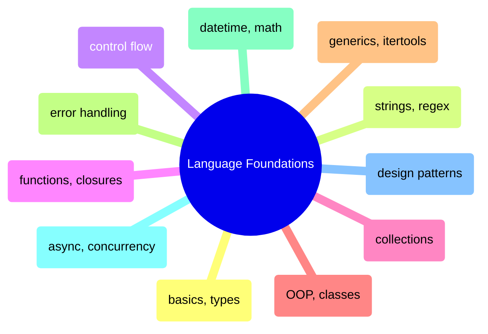
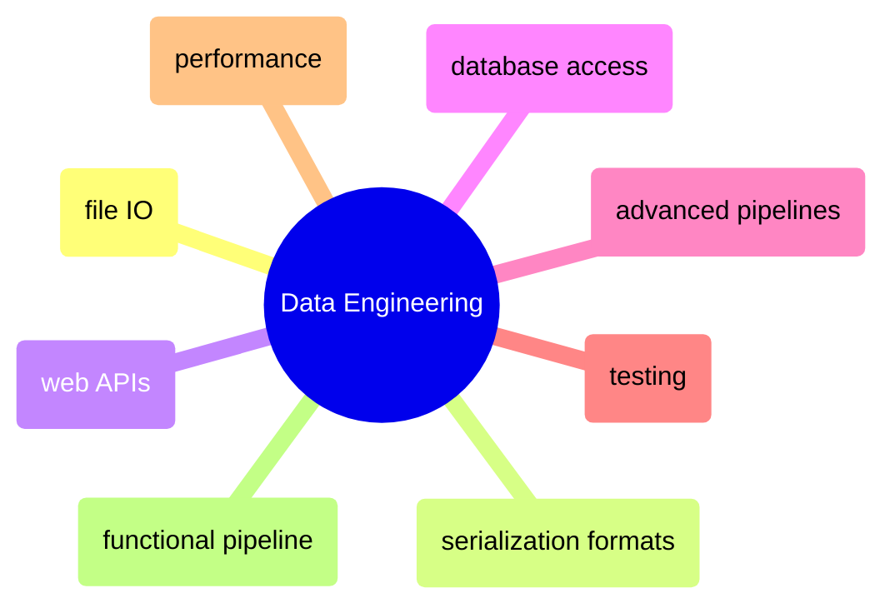
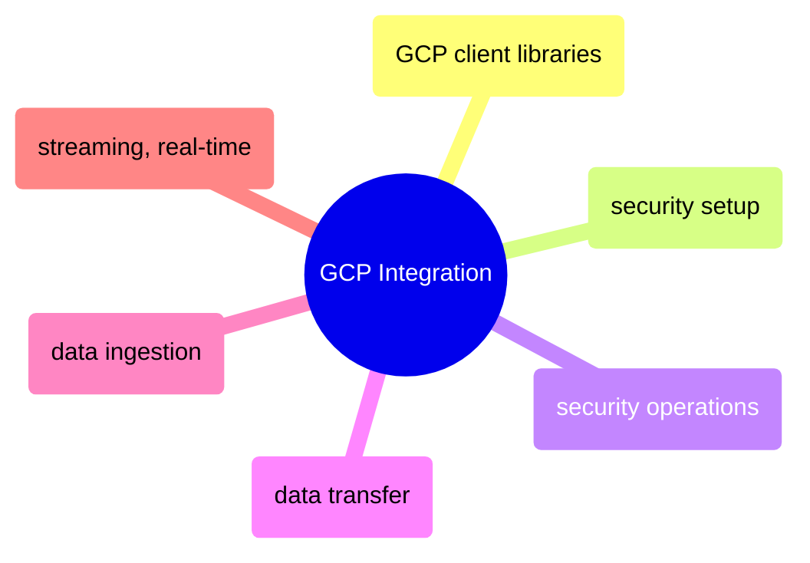

# MOC: Programming Languages

Python and C# for data engineering — 25 topics, each with paired notebooks
showing the same concepts in both languages. Expand any domain to browse
its sub-MOC.

> [!guide]+ Language Foundations
>
> [[domain-language-foundations]]
>
> Core programming concepts in Python and C# — from basics and types through OOP, async, and design patterns.

> [!guide]+ Data Engineering
>
> [[domain-data-engineering]]
>
> File I/O, serialization, APIs, database access, pipelines, testing, and performance — the applied data engineering side of Python and C#.

> [!guide]+ GCP Integration
>
> [[domain-gcp-integration]]
>
> Google Cloud Platform client libraries, security, data transfer, ingestion, and streaming in Python and C#.

## Cross-References

- [DataFrames](https://alp78.github.io/elysium/03-Dataframes/moc-dataframes) — Pandas and Polars operations using Python and C# foundations
- [Shell](https://alp78.github.io/elysium/01-Shell/moc-shell) — Scripts often orchestrated from shell
- [Data Architecture](https://alp78.github.io/elysium/14-Data-Architecture/moc-data-architecture) — Architecture theory behind the functional pipeline
