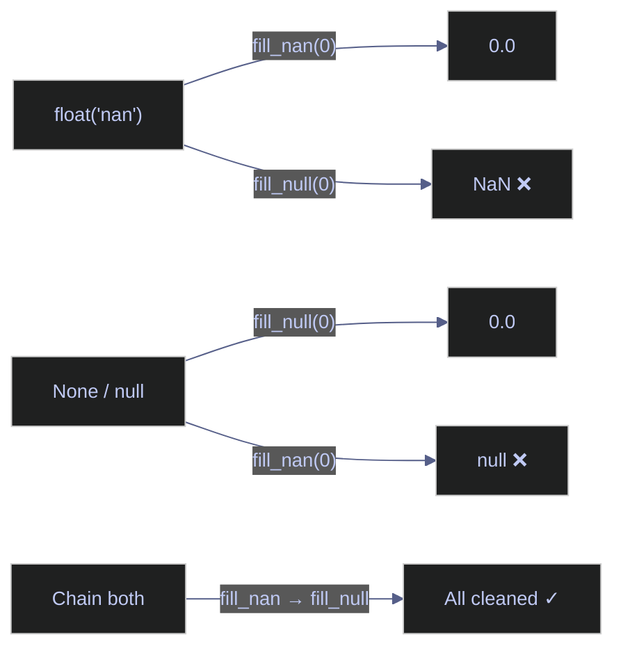

# 04 — Missing Data, Strings & DateTime

> [!quote]
> "Life is dirty. So is your data. Get used to it."
>
> — **Oz du Soleil**

Three foundational topics for every data pipeline: detecting and filling missing values, cleaning and transforming string columns, and parsing, extracting, and computing with dates and times. Each operation is shown side by side in Pandas (index-based, eager) and Polars (expression-based, lazy-capable) so you can compare idioms and behavior directly.

## Key terms used in this note

| Term | Definition | Purpose | Common mistake / confusion |
|---|---|---|---|
| **null** | An absent or missing value. Polars uses Arrow-native null (bitmask); Pandas uses `NaN` (float) or `pd.NA`. | Represents genuinely missing data that must be detected, filled, or dropped before downstream operations. | `NaN` is a float value — inserting it into an integer column silently promotes the column to `float64` in Pandas. Polars nulls preserve the dtype. |
| **NaN** | "Not a Number" — IEEE 754 float sentinel. In Pandas, doubles as the default missing-value marker. | Signals undefined arithmetic or missing data in Pandas. | `NaN != NaN` is `True` — equality checks against NaN always fail. Polars distinguishes `NaN` (a float value) from `null` (absence). |
| **pd.NA** | Pandas experimental missing-value sentinel that works with nullable dtypes (`Int64`, `StringDtype`, `BooleanDtype`). | Provides type-preserving missingness for Pandas nullable extension types. | Not interchangeable with `NaN` — mixing `pd.NA` and `NaN` in the same column causes unpredictable behavior. |
| **fill_null / fillna** | Methods that replace missing values with a specified constant, strategy (forward, backward, mean, median), or expression. | Prepares data for operations that do not tolerate nulls (joins, aggregations, ML models). | Forward-fill on unsorted data propagates values in the wrong direction. Always sort by the relevant key (e.g., date) before forward-filling. |
| **drop_nulls / dropna** | Methods that remove rows containing null/NaN values. | Eliminates incomplete records when missing data cannot be reliably filled. | Dropping nulls on the wrong subset of columns removes valid rows. Always pass `subset=` to target specific columns. |
| **interpolate** | Method that estimates missing values from surrounding data points (linear, polynomial, etc.). | Fills gaps in time-series data where forward/backward fill is too coarse. | Interpolation requires sorted data and assumes the gap pattern is regular. Irregular gaps produce misleading fills. |
| **.str accessor** | Pandas/Polars namespace that exposes string methods on a Series (`.str.lower()`, `.str.contains()`, `.str.replace()`). | Applies vectorized string operations without Python loops. | Pandas `.str` works on `object` or `StringDtype` columns only. Polars `.str` requires a `String`/`Utf8` column — `.cast(pl.String)` first if needed. |
| **regex** | Regular expression — a pattern language for matching, extracting, and replacing text. | Powers advanced string extraction (e.g., parsing tickers from mixed-format strings). | Pandas `.str.contains()` uses regex by default. Polars `.str.contains()` uses literal matching by default — pass `literal=False` for regex. |
| **.dt accessor** | Pandas/Polars namespace that exposes datetime methods on a Series (`.dt.year`, `.dt.month`, `.dt.weekday()`). | Extracts date/time components for grouping, filtering, and feature engineering. | Pandas `.dt.weekday` is a property (no parentheses). Polars `.dt.weekday()` is a method (requires parentheses). |
| **Timestamp / Date / Datetime** | Pandas: `pd.Timestamp` (nanosecond precision). Polars: `pl.Date` (calendar date) and `pl.Datetime` (date + time with configurable precision). | Represents points in time for time-series operations. | Pandas `Timestamp` has a max date of ~2262 due to nanosecond storage. Polars `Datetime` supports microsecond precision, extending the range. |
| **timezone** | A region-specific offset from UTC (e.g., `Europe/Berlin`, `US/Eastern`). | Converts wall-clock times to a common reference for cross-region comparison. | Naive datetimes (no timezone) cannot be compared with aware datetimes. Always localize or convert before arithmetic. |
| **resample / group_by_dynamic** | Pandas: `.resample("ME")` groups a DatetimeIndex into regular intervals. Polars: `.group_by_dynamic("date", every="1mo")` does the same on any date column. | Aggregates time-series data into fixed intervals (daily, weekly, monthly). | Pandas `resample` requires a DatetimeIndex — use `.set_index()` first. Polars `group_by_dynamic` requires the data to be sorted by the time column. |
| **rolling window** | A sliding window of fixed size that moves across rows, computing an aggregate (mean, sum, std) at each position. | Smooths noisy time-series data and computes moving averages. | Pandas `.rolling(n)` requires `n >= 1` and returns NaN for the first `n-1` rows. Polars `.rolling_mean(n)` returns null for incomplete windows. |
| **shift / lag** | Moves values up or down by *n* positions, filling the gap with null/NaN. | Creates lag features (e.g., yesterday's close) for time-series analysis. | A positive `n` shifts values down (introduces lag). A negative `n` shifts values up (introduces lead). Easy to confuse direction. |
| **cumulative operations** | Running aggregates that grow with each row: `cum_sum`, `cum_max`, `cum_min`, `cum_count`. | Computes running totals, running highs/lows, and monotonic counters. | Cumulative operations do not reset at group boundaries by default. Use `.over("group")` in Polars or `groupby().cumsum()` in Pandas for grouped cumulatives. |

## What this note covers

- **Missing data** — null representations, detection (`isna`, `is_null`, `null_count`), dropping, filling (constant, forward, backward, interpolation), and strategy comparison
- **String operations** — case transforms, contains/starts_with/ends_with, extract/split, replace, length/slicing, concatenation, strip/pad, regex extraction
- **DateTime operations** — type system, parsing, `.dt` accessor, `date_range`, rolling windows, shifting/lagging, resampling, and cumulative operations

---

```python
import pandas as pd
import polars as pl
import polars.selectors as cs
import numpy as np
from pathlib import Path

from IPython.display import display, Markdown
html_formatter = get_ipython().display_formatter.formatters['text/html'] # type: ignore
html_formatter.for_type(pd.DataFrame, lambda df: df.to_html())
html_formatter.for_type(pd.Series, lambda s: s.to_frame().to_html())

pl.Config.set_tbl_rows(100)
pd.set_option("display.max_rows", 100)

DATA = Path("../data")

# Core datasets
ohlcv_pd = pd.read_parquet(DATA / "eurostoxx50_ohlcv.parquet")  # 66K rows, daily OHLCV
ohlcv_pl = pl.read_parquet(DATA / "eurostoxx50_ohlcv.parquet")
dim_pd = pd.read_parquet(DATA / "index_dim.parquet")            # 169 rows, stock metadata
dim_pl = pl.read_parquet(DATA / "index_dim.parquet")
scores_pd = pd.read_parquet(DATA / "scores_daily.parquet")      # 466 rows, composite scores
scores_pl = pl.read_parquet(DATA / "scores_daily.parquet")

print(f"OHLCV: {ohlcv_pd.shape}, Dim: {dim_pd.shape}, Scores: {scores_pd.shape}")
```

    OHLCV: (66355, 12), Dim: (169, 26), Scores: (466, 36)

```python
# Additional datasets
usa_pd = pd.read_parquet(DATA / "stoxxusa50_ohlcv.parquet")
usa_pl = pl.read_parquet(DATA / "stoxxusa50_ohlcv.parquet")
signals_pd = pd.read_parquet(DATA / "signals_daily.parquet")
signals_pl = pl.read_parquet(DATA / "signals_daily.parquet")
cal_pd = pd.read_parquet(DATA / "trading_calendar.parquet")
cal_pl = pl.read_parquet(DATA / "trading_calendar.parquet")
perf_pd = pd.read_parquet(DATA / "index_performance.parquet")
perf_pl = pl.read_parquet(DATA / "index_performance.parquet")
```

## Null Representations

> [!danger] Pandas integer columns with nulls
>
> Pandas integer columns with nulls silently upcast to float64
> A column of `[1, 2, None, 4]` becomes `[1.0, 2.0, NaN, 4.0]` — the integers are now
> floats. This breaks join keys (`1.0 != 1` in string comparisons) and produces
> unexpected results in groupby. Fix: use `pd.Int64Dtype()` (nullable integer) or
> `dtype_backend="pyarrow"` when reading data.
>
> Polars uses a single `null` representation for all types — no silent type coercion.

> [!success] Use nullable integer dtype to prevent silent float coercion
>
> Declare integer columns with nullable dtype so nulls stay as `pd.NA` instead of
> being upcast to float: `pd.array([1, 2, None, 4], dtype="Int64")`. When reading
> files, use `pd.read_parquet(..., dtype_backend="numpy_nullable")` or
> `dtype_backend="pyarrow"` to get nullable integers across all columns automatically.

> [!warning] NaN != NaN in Pandas
>
> `NaN != NaN` in Pandas — equality comparisons on missing values
> `np.nan == np.nan` returns `False`. This means `df[df["col"] == np.nan]` matches
> **nothing**. Always use `df["col"].isna()` or `df["col"].isnull()` to detect missing
> values. Polars `null == null` also returns `null` (not True), requiring `.is_null()`.

> [!success] Always use `.isna()` / `.is_null()` to detect missing values
>
> Never compare against `np.nan` directly. Use `df["col"].isna()` (Pandas) or
> `pl.col("col").is_null()` (Polars). To filter rows with missing values:
> `df[df["col"].isna()]` in Pandas, `df.filter(pl.col("col").is_null())` in Polars.

Pandas has three null representations depending on the dtype: `NaN` (float columns), `None` (object columns), and `pd.NA` (nullable extension types). Polars uses a single `null` for all data types — no silent type coercion ever occurs.

### Null Type Behavior

#### Pandas | Null representation as NaN

Pandas coerces `None` in a float series to `NaN`. The resulting dtype is `float64` regardless of the original intent.

_Creates a float Series mixing `None` and `np.nan` at positions 1 and 3, confirming both collapse to `NaN` and the Series dtype becomes `float64` regardless of intent._

```python
pd_s = pd.Series([1.0, None, 3.0, np.nan, 5.0])
print(f"Pandas: {pd_s.tolist()}, dtype: {pd_s.dtype}")
```

    Pandas: [1.0, nan, 3.0, nan, 5.0], dtype: float64

#### Polars | Null representation as native null

Polars uses `null` for all types. `None` in a Python list becomes `null` in the Polars Series. The dtype stays `Float64` — no coercion.

_Creates a `Float64` Series from a Python list with `None` at positions 1 and 3, confirming Polars preserves the original dtype and reports missing values as `None` — not `NaN` — with no silent type coercion._

```python
pl_s = pl.Series([1.0, None, 3.0, None, 5.0])
print(f"Polars: {pl_s.to_list()}, dtype: {pl_s.dtype}")
```

    Polars: [1.0, None, 3.0, None, 5.0], dtype: Float64

## Detection

Quantifying missing values per column is the first step in any data quality assessment. It reveals which columns have gaps and how severe the problem is — guiding the decision to drop, fill, or investigate.

### Counting Nulls per Column

#### Pandas | Count nulls per column with isna().sum()

`isna()` returns a boolean DataFrame of the same shape. Chaining `.sum()` counts `True` values per column. Sorting descending puts the most problematic columns first.

_Calls `isna().sum()` on the 19-column `signals_pd` DataFrame and sorts by descending null count, surfacing `ev_to_ebitda` (71 nulls) and `dividend_yield` (35 nulls) as the most problematic columns._

```python
print("=== Pandas nulls ===")
display(signals_pd.isna().sum().sort_values(ascending=False).to_frame("null_count").head(10))
```

    === Pandas nulls ===

<table>
  <thead>
    <tr>
      <th></th>
      <th>null_count</th>
    </tr>
  </thead>
  <tbody>
    <tr>
      <th>ev_to_ebitda</th>
      <td>71</td>
    </tr>
    <tr>
      <th>dividend_yield</th>
      <td>35</td>
    </tr>
    <tr>
      <th>recommendation_mean</th>
      <td>14</td>
    </tr>
    <tr>
      <th>beta</th>
      <td>8</td>
    </tr>
    <tr>
      <th>symbol</th>
      <td>0</td>
    </tr>
    <tr>
      <th>id</th>
      <td>0</td>
    </tr>
    <tr>
      <th>_index</th>
      <td>0</td>
    </tr>
    <tr>
      <th>price_to_book</th>
      <td>0</td>
    </tr>
    <tr>
      <th>forward_pe</th>
      <td>0</td>
    </tr>
    <tr>
      <th>current_price</th>
      <td>0</td>
    </tr>
  </tbody>
</table>

#### Polars | Count nulls per column with null_count()

`null_count()` returns a single-row DataFrame where each value is the null count for that column. This is a metadata operation in Polars — extremely fast even on large DataFrames.

_Calls `null_count()` on `signals_pl` to return a single-row DataFrame of per-column null counts in one metadata pass — confirming `ev_to_ebitda` has 71 nulls and `dividend_yield` has 35._

```python
print("=== Polars nulls ===")
display(signals_pl.null_count())
```

    === Polars nulls ===

<div><!-- shape: (1, 19) --><table><thead><tr><th>id</th><th>_index</th><th>symbol</th><th>signal_date</th><th>current_price</th><th>forward_pe</th><th>price_to_book</th><th>ev_to_ebitda</th><th>dividend_yield</th><th>market_cap</th><th>beta</th><th>fifty_two_week_change</th><th>sandp_52_week_change</th><th>fifty_day_average</th><th>two_hundred_day_average</th><th>dist_from_52_week_high</th><th>target_median_price</th><th>recommendation_mean</th><th>upside_potential</th></tr><tr><td>u32</td><td>u32</td><td>u32</td><td>u32</td><td>u32</td><td>u32</td><td>u32</td><td>u32</td><td>u32</td><td>u32</td><td>u32</td><td>u32</td><td>u32</td><td>u32</td><td>u32</td><td>u32</td><td>u32</td><td>u32</td><td>u32</td></tr></thead><tbody><tr><td>0</td><td>0</td><td>0</td><td>0</td><td>0</td><td>0</td><td>0</td><td>71</td><td>35</td><td>0</td><td>8</td><td>0</td><td>0</td><td>0</td><td>0</td><td>0</td><td>0</td><td>14</td><td>0</td></tr></tbody></table></div>

### Filtering Null Rows

#### Polars | Filter rows where a column is null

`is_null()` returns a boolean expression. Pass it to `filter()` to keep only rows with null values in the specified column. Chain with `select()` to pick columns of interest.

_Filters `signals_pl` to rows where `forward_pe` is null and selects three columns, returning an empty table because all `forward_pe` values are present in this dataset._

```python
signals_pl.filter(pl.col("forward_pe").is_null()).select("symbol", "signal_date", "forward_pe").head(5)
```

<div><!-- shape: (0, 3) --><table><thead><tr><th>symbol</th><th>signal_date</th><th>forward_pe</th></tr><tr><td>str</td><td>date</td><td>f64</td></tr></thead><tbody></tbody></table></div>

## Dropping Nulls

Remove rows that contain missing values. Use this when nulls are random, few in number, and the remaining dataset is large enough to be representative. The `subset` parameter limits the check to specific columns — without it, any null in any column triggers removal.

### Dropping Rows with Nulls

#### Pandas | Drop rows with dropna()

`dropna(subset=[...])` removes rows where any of the specified columns is NaN. Without `subset`, it drops rows with any null in any column.

_Drops rows from `signals_pd` where `forward_pe` or `price_to_book` is null and prints row counts before and after — both show 466 rows because no rows in this dataset have nulls in those columns._

```python
print(f"Before: {len(signals_pd)}")
cleaned_pd = signals_pd.dropna(subset=["forward_pe", "price_to_book"])
print(f"After: {len(cleaned_pd)}")
```

    Before: 466
    After: 466

#### Polars | Drop rows with drop_nulls()

`drop_nulls(subset=[...])` is the Polars equivalent. It returns a new DataFrame (Polars DataFrames are immutable). Without `subset`, it drops rows with null in any column.

_Drops rows from `signals_pl` where `forward_pe` or `price_to_book` is null and prints `height` before and after — both show 466, confirming no rows are removed because the specified columns have no nulls._

```python
print(f"Before: {signals_pl.height}")
cleaned_pl = signals_pl.drop_nulls(subset=["forward_pe", "price_to_book"])
print(f"After: {cleaned_pl.height}")
```

    Before: 466
    After: 466

## Filling Nulls

Replace missing values with a substitute instead of dropping the row. The choice of fill strategy depends on the nature of the data and the downstream use case — a literal default for known constants, forward/backward fill for time-series, or statistical imputation for analytical columns.

### Literal Fill

#### Pandas | Fill nulls with a literal using fillna()

`fillna()` accepts a scalar value or a dictionary mapping column names to fill values. It returns a new DataFrame by default (use `inplace=True` to mutate, though this is discouraged in modern Pandas).

_Fills null values in `forward_pe` with `0.0` using a dict mapping and displays the first 5 rows of `symbol` and `forward_pe` — since none of the top rows have nulls, all values are unchanged._

```python
display(signals_pd[["symbol", "forward_pe"]].fillna({"forward_pe": 0.0}).head(5))
```

<table>
  <thead>
    <tr>
      <th></th>
      <th>symbol</th>
      <th>forward_pe</th>
    </tr>
  </thead>
  <tbody>
    <tr>
      <th>0</th>
      <td>ASML.AS</td>
      <td>32.141113</td>
    </tr>
    <tr>
      <th>1</th>
      <td>MC.PA</td>
      <td>18.854280</td>
    </tr>
    <tr>
      <th>2</th>
      <td>RMS.PA</td>
      <td>36.034904</td>
    </tr>
    <tr>
      <th>3</th>
      <td>OR.PA</td>
      <td>25.504032</td>
    </tr>
    <tr>
      <th>4</th>
      <td>SAP.DE</td>
      <td>19.631992</td>
    </tr>
  </tbody>
</table>

#### Polars | Fill nulls with a literal using fill_null()

`fill_null(value)` replaces all null entries in the column with the given value. It works inside a `select()` or `with_columns()` expression. Polars does not have `inplace` — all operations return new DataFrames.

_Uses `fill_null(0.0)` inside `select()` to replace null `forward_pe` values with zero, then displays the first 5 rows — all top values are non-null so the output matches the original._

```python
display(signals_pl.select("symbol", pl.col("forward_pe").fill_null(0.0)).head(5))
```

<div><!-- shape: (5, 2) --><table><thead><tr><th>symbol</th><th>forward_pe</th></tr><tr><td>str</td><td>f64</td></tr></thead><tbody><tr><td>ASML.AS</td><td>32.141113</td></tr><tr><td>MC.PA</td><td>18.85428</td></tr><tr><td>RMS.PA</td><td>36.034904</td></tr><tr><td>OR.PA</td><td>25.504032</td></tr><tr><td>SAP.DE</td><td>19.631992</td></tr></tbody></table></div>

### Forward / Backward Fill

Forward fill (LOCF — Last Observation Carried Forward) propagates the last non-null value forward through subsequent nulls. Backward fill does the reverse. These are the standard strategies for time-series data where the previous or next known value is the best estimate.

> [!tip] Apply directional fill within groups
>
> When your DataFrame contains multiple symbols, always apply forward/backward fill per group (e.g., `group_by("symbol")` then fill) rather than across the entire DataFrame. Otherwise, the last value from one symbol bleeds into the first null of the next.

#### Pandas | Forward fill with ffill()

`ffill()` (or `fillna(method="forward")`) propagates the last valid value forward. Operates on the entire DataFrame or on specific columns.

_Filters ASML.AS rows sorted by date, takes the last 10, and applies `ffill()` across the slice — demonstrating that each column's last valid value would be carried forward over any null gaps._

```python
asml_pd = ohlcv_pd[ohlcv_pd["symbol"] == "ASML.AS"].sort_values("date")[["date", "close", "dividends"]].tail(10)
display(asml_pd.ffill())
```

<table>
  <thead>
    <tr>
      <th></th>
      <th>date</th>
      <th>close</th>
      <th>dividends</th>
    </tr>
  </thead>
  <tbody>
    <tr>
      <th>11955</th>
      <td>2026-02-27</td>
      <td>1233.4</td>
      <td>0.0</td>
    </tr>
    <tr>
      <th>11956</th>
      <td>2026-03-02</td>
      <td>1210.4</td>
      <td>0.0</td>
    </tr>
    <tr>
      <th>11957</th>
      <td>2026-03-03</td>
      <td>1161.8</td>
      <td>0.0</td>
    </tr>
    <tr>
      <th>11958</th>
      <td>2026-03-04</td>
      <td>1199.8</td>
      <td>0.0</td>
    </tr>
    <tr>
      <th>11959</th>
      <td>2026-03-05</td>
      <td>1186.0</td>
      <td>0.0</td>
    </tr>
    <tr>
      <th>11960</th>
      <td>2026-03-06</td>
      <td>1147.0</td>
      <td>0.0</td>
    </tr>
    <tr>
      <th>11961</th>
      <td>2026-03-09</td>
      <td>1147.6</td>
      <td>0.0</td>
    </tr>
    <tr>
      <th>11962</th>
      <td>2026-03-10</td>
      <td>1200.0</td>
      <td>0.0</td>
    </tr>
    <tr>
      <th>11963</th>
      <td>2026-03-11</td>
      <td>1198.8</td>
      <td>0.0</td>
    </tr>
    <tr>
      <th>11964</th>
      <td>2026-03-12</td>
      <td>1190.8</td>
      <td>0.0</td>
    </tr>
  </tbody>
</table>

#### Polars | Forward and backward fill with fill_null(strategy=)

Polars' `fill_null(strategy="forward")` and `fill_null(strategy="backward")` replace nulls using directional propagation. Both are expression-based — combine with `select()` or `with_columns()`.

_Demonstrates forward and backward fill on the `dividends` column of the last 10 ASML.AS rows, producing `div_ffill` and `div_bfill` alias columns side by side — all dividends are `0.0` in this window so no fill is triggered._

```python
asml_pl = ohlcv_pl.filter(pl.col("symbol") == "ASML.AS").sort("date").tail(10)
display(asml_pl.select(
    "date", "close", "dividends",
    pl.col("dividends").fill_null(strategy="forward").alias("div_ffill"),
    pl.col("dividends").fill_null(strategy="backward").alias("div_bfill"),
))
```

<div><!-- shape: (10, 5) --><table><thead><tr><th>date</th><th>close</th><th>dividends</th><th>div_ffill</th><th>div_bfill</th></tr><tr><td>date</td><td>f64</td><td>f64</td><td>f64</td><td>f64</td></tr></thead><tbody><tr><td>2026-02-27</td><td>1233.4</td><td>0.0</td><td>0.0</td><td>0.0</td></tr><tr><td>2026-03-02</td><td>1210.4</td><td>0.0</td><td>0.0</td><td>0.0</td></tr><tr><td>2026-03-03</td><td>1161.8</td><td>0.0</td><td>0.0</td><td>0.0</td></tr><tr><td>2026-03-04</td><td>1199.8</td><td>0.0</td><td>0.0</td><td>0.0</td></tr><tr><td>2026-03-05</td><td>1186.0</td><td>0.0</td><td>0.0</td><td>0.0</td></tr><tr><td>2026-03-06</td><td>1147.0</td><td>0.0</td><td>0.0</td><td>0.0</td></tr><tr><td>2026-03-09</td><td>1147.6</td><td>0.0</td><td>0.0</td><td>0.0</td></tr><tr><td>2026-03-10</td><td>1200.0</td><td>0.0</td><td>0.0</td><td>0.0</td></tr><tr><td>2026-03-11</td><td>1198.8</td><td>0.0</td><td>0.0</td><td>0.0</td></tr><tr><td>2026-03-12</td><td>1190.8</td><td>0.0</td><td>0.0</td><td>0.0</td></tr></tbody></table></div>

### Mean / Median Imputation

Replace nulls with a summary statistic of the column. Mean imputation preserves the column's central tendency; median is more robust to outliers. Both assume the data is stationary — if there is a trend (e.g., prices rising over time), imputing with a global mean is misleading.

#### Pandas | Fill with column mean using fillna()

Compute the mean separately, then pass it to `fillna()`. Use `.assign()` for method chaining that keeps the original column alongside the filled version.

_Computes the `forward_pe` column mean (27.55) separately, then fills null PE values with it via `.assign()`, producing a `pe_filled` column that replaces nulls while retaining the original for comparison._

```python
mean_pe = signals_pd["forward_pe"].mean()
print(f"Mean PE: {mean_pe:.2f}")
display(signals_pd[["symbol", "forward_pe"]].assign(pe_filled=signals_pd["forward_pe"].fillna(mean_pe)).head(5))
```

    Mean PE: 27.55

<table>
  <thead>
    <tr>
      <th></th>
      <th>symbol</th>
      <th>forward_pe</th>
      <th>pe_filled</th>
    </tr>
  </thead>
  <tbody>
    <tr>
      <th>0</th>
      <td>ASML.AS</td>
      <td>32.141113</td>
      <td>32.141113</td>
    </tr>
    <tr>
      <th>1</th>
      <td>MC.PA</td>
      <td>18.854280</td>
      <td>18.854280</td>
    </tr>
    <tr>
      <th>2</th>
      <td>RMS.PA</td>
      <td>36.034904</td>
      <td>36.034904</td>
    </tr>
    <tr>
      <th>3</th>
      <td>OR.PA</td>
      <td>25.504032</td>
      <td>25.504032</td>
    </tr>
    <tr>
      <th>4</th>
      <td>SAP.DE</td>
      <td>19.631992</td>
      <td>19.631992</td>
    </tr>
  </tbody>
</table>

#### Polars | Fill with mean or median using expression-based fill_null()

Polars computes the statistic inside the expression engine: `fill_null(pl.col("c").mean())`. No need to compute the value in Python first — the engine handles it in a single pass.

_Creates `pe_mean_filled` and `pe_median_filled` columns in a single `select()` call — Polars evaluates the mean and median of `forward_pe` within the expression engine without a separate Python computation step._

```python
display(signals_pl.select(
    "symbol", "forward_pe",
    pl.col("forward_pe").fill_null(pl.col("forward_pe").mean()).alias("pe_mean_filled"),
    pl.col("forward_pe").fill_null(pl.col("forward_pe").median()).alias("pe_median_filled"),
).head(5))
```

<div><!-- shape: (5, 4) --><table><thead><tr><th>symbol</th><th>forward_pe</th><th>pe_mean_filled</th><th>pe_median_filled</th></tr><tr><td>str</td><td>f64</td><td>f64</td><td>f64</td></tr></thead><tbody><tr><td>ASML.AS</td><td>32.141113</td><td>32.141113</td><td>32.141113</td></tr><tr><td>MC.PA</td><td>18.85428</td><td>18.85428</td><td>18.85428</td></tr><tr><td>RMS.PA</td><td>36.034904</td><td>36.034904</td><td>36.034904</td></tr><tr><td>OR.PA</td><td>25.504032</td><td>25.504032</td><td>25.504032</td></tr><tr><td>SAP.DE</td><td>19.631992</td><td>19.631992</td><td>19.631992</td></tr></tbody></table></div>

### NaN vs Null Distinction

#### Polars | fill_nan vs fill_null

Polars makes a strict distinction between `null` (missing value, applies to all types) and `NaN` (IEEE 754 floating-point "Not a Number", only for float columns). `fill_null()` handles `null`; `fill_nan()` handles `NaN`. You often need both to clean a float column completely.

> [!warning] NaN and null are different in Polars
>
> `float("nan")` in Python becomes `NaN` in Polars, which is NOT `null`. A `fill_null(0)` will leave NaN values untouched, and `fill_nan(0)` will leave nulls untouched. Chain both to handle all missing-like values: `col.fill_nan(0).fill_null(0)`.

> [!success] Chain fill_nan then fill_null for complete cleaning
>
> Always apply `fill_nan()` first, then `fill_null()`. If you do it the other way, `fill_null()` converts nulls to the fill value but leaves NaN, and `fill_nan()` then converts NaN — the result is the same, but `fill_nan → fill_null` is the conventional order.



_Constructs a 4-element Series containing `1.0`, `float("nan")`, `None`, and `4.0`, then applies `fill_null(0)`, `fill_nan(0)`, and both chained — demonstrating that only the chained call clears all missing-like values._

```python
s = pl.Series([1.0, float("nan"), None, 4.0])
print(f"Original: {s.to_list()}")
print(f"fill_null(0): {s.fill_null(0).to_list()}")
print(f"fill_nan(0):  {s.fill_nan(0).to_list()}")
print(f"Both:         {s.fill_nan(0).fill_null(0).to_list()}")
```

    Original: [1.0, nan, None, 4.0]
    fill_null(0): [1.0, nan, 0.0, 4.0]
    fill_nan(0):  [1.0, 0.0, None, 4.0]
    Both:         [1.0, 0.0, 0.0, 4.0]

### Coalesce

#### Polars | Coalesce

`pl.coalesce()` returns the first non-null value across multiple columns for each row. This is the Polars equivalent of SQL's `COALESCE()` and Pandas' `combine_first()`. Use it to build fallback chains — for example, use the primary data source if available, else the secondary, else a default.

_Builds a 4-row DataFrame with primary and secondary columns that have alternating nulls, then applies `pl.coalesce()` to return the first non-null value per row — always preferring `primary` → `secondary` → `fallback`._

```python
df = pl.DataFrame({"primary": [100.0, None, 300.0, None], "secondary": [None, 200.0, None, 400.0], "fallback": [50.0, 50.0, 50.0, 50.0]})
display(df.with_columns(pl.coalesce("primary", "secondary", "fallback").alias("best")))
```

<div><!-- shape: (4, 4) --><table><thead><tr><th>primary</th><th>secondary</th><th>fallback</th><th>best</th></tr><tr><td>f64</td><td>f64</td><td>f64</td><td>f64</td></tr></thead><tbody><tr><td>100.0</td><td>null</td><td>50.0</td><td>100.0</td></tr><tr><td>null</td><td>200.0</td><td>50.0</td><td>200.0</td></tr><tr><td>300.0</td><td>null</td><td>50.0</td><td>300.0</td></tr><tr><td>null</td><td>400.0</td><td>50.0</td><td>400.0</td></tr></tbody></table></div>

### Interpolation

Linear interpolation estimates missing values by drawing a straight line between the nearest non-null neighbors. Ideal for continuous measurements (price, temperature, sensor readings) where the true value likely falls between adjacent observations. Leading/trailing nulls remain unfilled — interpolation requires values on both sides.

#### Pandas | Interpolate with interpolate()

`interpolate()` performs linear interpolation by default (other methods available: `'polynomial'`, `'spline'`, etc.). Operates on the column's positional index, not on datetime values.

_Sets rows 5 through 7 of the last 20 ASML.AS close prices to `NaN`, then linearly interpolates them by positional index — filling the three gaps with evenly spaced values between the surrounding valid closes (1238.2 → 1288.4)._

```python
asml_pd2 = ohlcv_pd[ohlcv_pd["symbol"] == "ASML.AS"].sort_values("date").tail(20).copy()
asml_pd2.iloc[5:8, asml_pd2.columns.get_loc("close")] = np.nan # type: ignore
display(asml_pd2[["date", "close"]].assign(interpolated=asml_pd2["close"].interpolate()).head(10))
```

<table>
  <thead>
    <tr>
      <th></th>
      <th>date</th>
      <th>close</th>
      <th>interpolated</th>
    </tr>
  </thead>
  <tbody>
    <tr>
      <th>11945</th>
      <td>2026-02-13</td>
      <td>1190.4</td>
      <td>1190.40</td>
    </tr>
    <tr>
      <th>11946</th>
      <td>2026-02-16</td>
      <td>1195.0</td>
      <td>1195.00</td>
    </tr>
    <tr>
      <th>11947</th>
      <td>2026-02-17</td>
      <td>1199.2</td>
      <td>1199.20</td>
    </tr>
    <tr>
      <th>11948</th>
      <td>2026-02-18</td>
      <td>1244.8</td>
      <td>1244.80</td>
    </tr>
    <tr>
      <th>11949</th>
      <td>2026-02-19</td>
      <td>1238.2</td>
      <td>1238.20</td>
    </tr>
    <tr>
      <th>11950</th>
      <td>2026-02-20</td>
      <td>NaN</td>
      <td>1250.75</td>
    </tr>
    <tr>
      <th>11951</th>
      <td>2026-02-23</td>
      <td>NaN</td>
      <td>1263.30</td>
    </tr>
    <tr>
      <th>11952</th>
      <td>2026-02-24</td>
      <td>NaN</td>
      <td>1275.85</td>
    </tr>
    <tr>
      <th>11953</th>
      <td>2026-02-25</td>
      <td>1288.4</td>
      <td>1288.40</td>
    </tr>
    <tr>
      <th>11954</th>
      <td>2026-02-26</td>
      <td>1232.4</td>
      <td>1232.40</td>
    </tr>
  </tbody>
</table>

#### Polars | Interpolate with interpolate()

Polars' `interpolate()` also uses linear interpolation based on positional index. It works as an expression — combine with `select()` or `with_columns()`.

_Replicates the same three-gap scenario in Polars by injecting `null` at positions 5–7, then uses `interpolate()` as an expression inside `select()` to fill the nulls with linearly spaced values matching the Pandas result._

```python
asml_pl2 = ohlcv_pl.filter(pl.col("symbol") == "ASML.AS").sort("date").tail(20)
vals = asml_pl2["close"].to_list()
for i in range(5, 8): vals[i] = None
asml_null = asml_pl2.with_columns(pl.Series("close", vals))
display(asml_null.select("date", "close", pl.col("close").interpolate().alias("interpolated")).head(10))
```

<div><!-- shape: (10, 3) --><table><thead><tr><th>date</th><th>close</th><th>interpolated</th></tr><tr><td>date</td><td>f64</td><td>f64</td></tr></thead><tbody><tr><td>2026-02-13</td><td>1190.4</td><td>1190.4</td></tr><tr><td>2026-02-16</td><td>1195.0</td><td>1195.0</td></tr><tr><td>2026-02-17</td><td>1199.2</td><td>1199.2</td></tr><tr><td>2026-02-18</td><td>1244.8</td><td>1244.8</td></tr><tr><td>2026-02-19</td><td>1238.2</td><td>1238.2</td></tr><tr><td>2026-02-20</td><td>null</td><td>1250.75</td></tr><tr><td>2026-02-23</td><td>null</td><td>1263.3</td></tr><tr><td>2026-02-24</td><td>null</td><td>1275.85</td></tr><tr><td>2026-02-25</td><td>1288.4</td><td>1288.4</td></tr><tr><td>2026-02-26</td><td>1232.4</td><td>1232.4</td></tr></tbody></table></div>

## Summary

| Operation | Pandas | Polars |
|---|---|---|
| Detect | isna() | is_null() |
| Count | isna().sum() | null_count() |
| Drop | dropna() | drop_nulls() |
| Fill literal | fillna(val) | fill_null(val) |
| Fill forward | ffill() | fill_null(strategy="forward") |
| Fill mean | fillna(col.mean()) | fill_null(col.mean()) |
| Interpolate | interpolate() | interpolate() |
| NaN vs null | Same thing | Different! fill_nan vs fill_null |
| Coalesce | combine_first() | pl.coalesce() |

---
---

```python
dim_pd = pd.read_parquet(DATA / "index_dim.parquet")
dim_pl = pl.read_parquet(DATA / "index_dim.parquet")
```

## Case Operations

Converting strings to upper or lower case is a common normalization step before joins or deduplication. Both Pandas and Polars provide `.str` accessor methods that operate on entire columns without Python loops.

### Case Conversion

#### Pandas | Convert case with str.upper() and str.lower()

The `.str` accessor on a Pandas Series exposes vectorized string methods. `.str.upper()` and `.str.lower()` return new Series with case-converted values. Use `.assign()` to add results as new columns via method chaining.

_Adds `name_upper` (uppercased `short_name`) and `sector_lower` (lowercased `sector`) to the first 5 rows of `dim_pd`, showing names already in uppercase like "ASML HOLDING" are unaffected while sectors like "Technology" become "technology"._

```python
display(dim_pd[["short_name", "sector"]].assign(
    name_upper=dim_pd["short_name"].str.upper(),
    sector_lower=dim_pd["sector"].str.lower(),
).head(5))
```

<table>
  <thead>
    <tr>
      <th></th>
      <th>short_name</th>
      <th>sector</th>
      <th>name_upper</th>
      <th>sector_lower</th>
    </tr>
  </thead>
  <tbody>
    <tr>
      <th>0</th>
      <td>ASML HOLDING</td>
      <td>Technology</td>
      <td>ASML HOLDING</td>
      <td>technology</td>
    </tr>
    <tr>
      <th>1</th>
      <td>LVMH</td>
      <td>Consumer Cyclical</td>
      <td>LVMH</td>
      <td>consumer cyclical</td>
    </tr>
    <tr>
      <th>2</th>
      <td>HERMES INTL</td>
      <td>Consumer Cyclical</td>
      <td>HERMES INTL</td>
      <td>consumer cyclical</td>
    </tr>
    <tr>
      <th>3</th>
      <td>L'OREAL</td>
      <td>Consumer Defensive</td>
      <td>L'OREAL</td>
      <td>consumer defensive</td>
    </tr>
    <tr>
      <th>4</th>
      <td>SAP SE</td>
      <td>Technology</td>
      <td>SAP SE</td>
      <td>technology</td>
    </tr>
  </tbody>
</table>

#### Polars | Convert case with str.to_uppercase() and str.to_lowercase()

Polars' `.str.to_uppercase()` and `.str.to_lowercase()` are expression-based — use inside `select()` or `with_columns()`. The naming differs slightly from Pandas (`.upper()` vs `.to_uppercase()`).

_Uses `.str.to_uppercase()` and `.str.to_lowercase()` inside `select()` to produce `name_upper` and `sector_lower` from `dim_pl`, producing identical output to the Pandas result with Polars' expression syntax._

```python
display(dim_pl.select(
    "short_name", "sector",
    pl.col("short_name").str.to_uppercase().alias("name_upper"),
    pl.col("sector").str.to_lowercase().alias("sector_lower"),
).head(5))
```

<div><!-- shape: (5, 4) --><table><thead><tr><th>short_name</th><th>sector</th><th>name_upper</th><th>sector_lower</th></tr><tr><td>str</td><td>str</td><td>str</td><td>str</td></tr></thead><tbody><tr><td>ASML HOLDING</td><td>Technology</td><td>ASML HOLDING</td><td>technology</td></tr><tr><td>LVMH</td><td>Consumer Cyclical</td><td>LVMH</td><td>consumer cyclical</td></tr><tr><td>HERMES INTL</td><td>Consumer Cyclical</td><td>HERMES INTL</td><td>consumer cyclical</td></tr><tr><td>L&#x27;OREAL</td><td>Consumer Defensive</td><td>L&#x27;OREAL</td><td>consumer defensive</td></tr><tr><td>SAP SE</td><td>Technology</td><td>SAP SE</td><td>technology</td></tr></tbody></table></div>

## Contains / Starts With / Ends With

Pattern matching on string columns filters rows by substring presence, prefix, or suffix. Essential for selecting by exchange code (`.AS`, `.DE`), sector keywords, or naming conventions.

### Filtering with Contains

#### Pandas | Filter with str.contains()

`str.contains(pattern, na=False)` returns a boolean Series. The `na=False` parameter treats NaN values as non-matches instead of propagating NaN into the boolean mask. Use the result as a boolean index to filter the DataFrame.

_Filters `dim_pd` to rows where `sector` contains "Tech" using `str.contains()` with `na=False`, returning 26 Technology stocks including ASML, SAP, NVIDIA, Apple, and Microsoft._

```python
display(dim_pd[dim_pd["sector"].str.contains("Tech", na=False)][["symbol", "short_name", "sector"]])
```

<table>
  <thead>
    <tr>
      <th></th>
      <th>symbol</th>
      <th>short_name</th>
      <th>sector</th>
    </tr>
  </thead>
  <tbody>
    <tr>
      <th>0</th>
      <td>ASML.AS</td>
      <td>ASML HOLDING</td>
      <td>Technology</td>
    </tr>
    <tr>
      <th>4</th>
      <td>SAP.DE</td>
      <td>SAP SE</td>
      <td>Technology</td>
    </tr>
    <tr>
      <th>31</th>
      <td>IFX.DE</td>
      <td>INFINEON TECHNOLOGIES AG</td>
      <td>Technology</td>
    </tr>
    <tr>
      <th>46</th>
      <td>ADYEN.AS</td>
      <td>ADYEN</td>
      <td>Technology</td>
    </tr>
    <tr>
      <th>51</th>
      <td>6758.T</td>
      <td>SONY GROUP CORPORATION</td>
      <td>Technology</td>
    </tr>
    <tr>
      <th>54</th>
      <td>6861.T</td>
      <td>KEYENCE CORP</td>
      <td>Technology</td>
    </tr>
    <tr>
      <th>72</th>
      <td>8035.T</td>
      <td>TOKYO ELECTRON</td>
      <td>Technology</td>
    </tr>
    <tr>
      <th>86</th>
      <td>6981.T</td>
      <td>MURATA MANUFACTURING CO</td>
      <td>Technology</td>
    </tr>
    <tr>
      <th>96</th>
      <td>6702.T</td>
      <td>FUJITSU</td>
      <td>Technology</td>
    </tr>
    <tr>
      <th>98</th>
      <td>1810.HK</td>
      <td>XIAOMI-W</td>
      <td>Technology</td>
    </tr>
    <tr>
      <th>99</th>
      <td>NVDA</td>
      <td>NVIDIA Corporation</td>
      <td>Technology</td>
    </tr>
    <tr>
      <th>100</th>
      <td>AAPL</td>
      <td>Apple Inc.</td>
      <td>Technology</td>
    </tr>
    <tr>
      <th>102</th>
      <td>MSFT</td>
      <td>Microsoft Corporation</td>
      <td>Technology</td>
    </tr>
    <tr>
      <th>105</th>
      <td>AVGO</td>
      <td>Broadcom Inc.</td>
      <td>Technology</td>
    </tr>
    <tr>
      <th>114</th>
      <td>MU</td>
      <td>Micron Technology, Inc.</td>
      <td>Technology</td>
    </tr>
    <tr>
      <th>117</th>
      <td>ORCL</td>
      <td>Oracle Corporation</td>
      <td>Technology</td>
    </tr>
    <tr>
      <th>127</th>
      <td>PLTR</td>
      <td>Palantir Technologies Inc.</td>
      <td>Technology</td>
    </tr>
    <tr>
      <th>128</th>
      <td>AMD</td>
      <td>Advanced Micro Devices, Inc.</td>
      <td>Technology</td>
    </tr>
    <tr>
      <th>129</th>
      <td>CSCO</td>
      <td>Cisco Systems, Inc.</td>
      <td>Technology</td>
    </tr>
    <tr>
      <th>131</th>
      <td>AMAT</td>
      <td>Applied Materials, Inc.</td>
      <td>Technology</td>
    </tr>
    <tr>
      <th>132</th>
      <td>LRCX</td>
      <td>Lam Research Corporation</td>
      <td>Technology</td>
    </tr>
    <tr>
      <th>143</th>
      <td>INTC</td>
      <td>Intel Corporation</td>
      <td>Technology</td>
    </tr>
    <tr>
      <th>144</th>
      <td>IBM</td>
      <td>International Business Machines</td>
      <td>Technology</td>
    </tr>
    <tr>
      <th>147</th>
      <td>DSY.PA</td>
      <td>DASSAULT SYSTEMES</td>
      <td>Technology</td>
    </tr>
    <tr>
      <th>148</th>
      <td>CRM</td>
      <td>Salesforce, Inc.</td>
      <td>Technology</td>
    </tr>
    <tr>
      <th>149</th>
      <td>UBER</td>
      <td>Uber Technologies, Inc.</td>
      <td>Technology</td>
    </tr>
  </tbody>
</table>

#### Polars | Filter with str.contains()

Polars' `str.contains()` returns a boolean expression. Pass it to `filter()` directly — no `na` parameter needed since Polars handles nulls natively (null in a boolean filter is treated as `False`).

_Filters `dim_pl` to rows where `sector` contains "Tech" using `str.contains()` inside `filter()`, returning the same 26 Technology stocks as the Pandas result without needing an `na` parameter._

```python
display(dim_pl.filter(pl.col("sector").str.contains("Tech")).select("symbol", "short_name", "sector"))
```

<div><!-- shape: (26, 3) --><table><thead><tr><th>symbol</th><th>short_name</th><th>sector</th></tr><tr><td>str</td><td>str</td><td>str</td></tr></thead><tbody><tr><td>ASML.AS</td><td>ASML HOLDING</td><td>Technology</td></tr><tr><td>SAP.DE</td><td>SAP SE</td><td>Technology</td></tr><tr><td>IFX.DE</td><td>INFINEON TECHNOLOGIES AG</td><td>Technology</td></tr><tr><td>ADYEN.AS</td><td>ADYEN</td><td>Technology</td></tr><tr><td>6758.T</td><td>SONY GROUP CORPORATION</td><td>Technology</td></tr><tr><td>6861.T</td><td>KEYENCE CORP</td><td>Technology</td></tr><tr><td>8035.T</td><td>TOKYO ELECTRON</td><td>Technology</td></tr><tr><td>6981.T</td><td>MURATA MANUFACTURING CO</td><td>Technology</td></tr><tr><td>6702.T</td><td>FUJITSU</td><td>Technology</td></tr><tr><td>1810.HK</td><td>XIAOMI-W</td><td>Technology</td></tr><tr><td>NVDA</td><td>NVIDIA Corporation</td><td>Technology</td></tr><tr><td>AAPL</td><td>Apple Inc.</td><td>Technology</td></tr><tr><td>MSFT</td><td>Microsoft Corporation</td><td>Technology</td></tr><tr><td>AVGO</td><td>Broadcom Inc.</td><td>Technology</td></tr><tr><td>MU</td><td>Micron Technology, Inc.</td><td>Technology</td></tr><tr><td>ORCL</td><td>Oracle Corporation</td><td>Technology</td></tr><tr><td>PLTR</td><td>Palantir Technologies Inc.</td><td>Technology</td></tr><tr><td>AMD</td><td>Advanced Micro Devices, Inc.</td><td>Technology</td></tr><tr><td>CSCO</td><td>Cisco Systems, Inc.</td><td>Technology</td></tr><tr><td>AMAT</td><td>Applied Materials, Inc.</td><td>Technology</td></tr><tr><td>LRCX</td><td>Lam Research Corporation</td><td>Technology</td></tr><tr><td>INTC</td><td>Intel Corporation</td><td>Technology</td></tr><tr><td>IBM</td><td>International Business Machine…</td><td>Technology</td></tr><tr><td>DSY.PA</td><td>DASSAULT SYSTEMES</td><td>Technology</td></tr><tr><td>CRM</td><td>Salesforce, Inc.</td><td>Technology</td></tr><tr><td>UBER</td><td>Uber Technologies, Inc.</td><td>Technology</td></tr></tbody></table></div>

### Filtering with Ends With

#### Polars | Filter with str.ends_with()

`str.ends_with()` and `str.starts_with()` check for suffix/prefix matches. Here, filtering for `.AS` suffix isolates Amsterdam-listed stocks.

_Filters `dim_pl` to symbols ending with ".AS" to isolate Amsterdam-listed stocks, returning 6 Netherlands-based names including ASML, PROSUS, ING, and ADYEN._

```python
display(dim_pl.filter(pl.col("symbol").str.ends_with(".AS")).select("symbol", "short_name", "country"))
```

<div><!-- shape: (6, 3) --><table><thead><tr><th>symbol</th><th>short_name</th><th>country</th></tr><tr><td>str</td><td>str</td><td>str</td></tr></thead><tbody><tr><td>ASML.AS</td><td>ASML HOLDING</td><td>Netherlands</td></tr><tr><td>PRX.AS</td><td>PROSUS</td><td>Netherlands</td></tr><tr><td>INGA.AS</td><td>ING GROEP N.V.</td><td>Netherlands</td></tr><tr><td>AD.AS</td><td>KONINKLIJKE AHOLD DELHAIZE N.V…</td><td>Netherlands</td></tr><tr><td>ADYEN.AS</td><td>ADYEN</td><td>Netherlands</td></tr><tr><td>WKL.AS</td><td>WOLTERS KLUWER</td><td>Netherlands</td></tr></tbody></table></div>

## Extract and Split

Decomposing composite identifiers into their parts — splitting `"ASML.AS"` into ticker and exchange code, or extracting patterns with regex. Both Pandas and Polars provide `.str.extract()` (regex-based) and `.str.split()` (delimiter-based).

### Extracting and Splitting Identifiers

#### Pandas | Extract and split with str.extract() and str.split()

`str.extract(regex)` returns the first capture group as a new column. `str.split(delimiter).str[n]` splits and accesses the nth element. Use `.assign()` to add both as new columns.

_Applies regex extraction to capture the exchange code after the dot (e.g., "AS" from "ASML.AS") and split-based slicing to extract the bare ticker (e.g., "ASML"), displaying both as new columns for the first 10 symbols._

```python
display(dim_pd[["symbol"]].assign(
    exchange_code=dim_pd["symbol"].str.extract(r"\.(.+)$"), # type: ignore
    ticker_only=dim_pd["symbol"].str.split(".").str[0],
).head(10))
```

<table>
  <thead>
    <tr>
      <th></th>
      <th>symbol</th>
      <th>exchange_code</th>
      <th>ticker_only</th>
    </tr>
  </thead>
  <tbody>
    <tr>
      <th>0</th>
      <td>ASML.AS</td>
      <td>AS</td>
      <td>ASML</td>
    </tr>
    <tr>
      <th>1</th>
      <td>MC.PA</td>
      <td>PA</td>
      <td>MC</td>
    </tr>
    <tr>
      <th>2</th>
      <td>RMS.PA</td>
      <td>PA</td>
      <td>RMS</td>
    </tr>
    <tr>
      <th>3</th>
      <td>OR.PA</td>
      <td>PA</td>
      <td>OR</td>
    </tr>
    <tr>
      <th>4</th>
      <td>SAP.DE</td>
      <td>DE</td>
      <td>SAP</td>
    </tr>
    <tr>
      <th>5</th>
      <td>SIE.DE</td>
      <td>DE</td>
      <td>SIE</td>
    </tr>
    <tr>
      <th>6</th>
      <td>ITX.MC</td>
      <td>MC</td>
      <td>ITX</td>
    </tr>
    <tr>
      <th>7</th>
      <td>DTE.DE</td>
      <td>DE</td>
      <td>DTE</td>
    </tr>
    <tr>
      <th>8</th>
      <td>SAN.MC</td>
      <td>MC</td>
      <td>SAN</td>
    </tr>
    <tr>
      <th>9</th>
      <td>SU.PA</td>
      <td>PA</td>
      <td>SU</td>
    </tr>
  </tbody>
</table>

#### Polars | Extract and split with str.extract() and str.split()

Polars' `str.extract(pattern, group_index)` requires an explicit group index (1 for the first capture group). `str.split(delimiter)` returns a list column — access elements via `.list.first()`, `.list.last()`, or `.list.get(n)`.

_Replicates the same extraction in Polars using `str.extract(regex, group_index=1)` for the exchange code and `.str.split(".").list.first()` for the ticker, producing identical results to the Pandas version._

```python
display(dim_pl.select(
    "symbol",
    pl.col("symbol").str.extract(r"\.(.+)$", 1).alias("exchange_code"),
    pl.col("symbol").str.split(".").list.first().alias("ticker_only"),
).head(10))
```

<div><!-- shape: (10, 3) --><table><thead><tr><th>symbol</th><th>exchange_code</th><th>ticker_only</th></tr><tr><td>str</td><td>str</td><td>str</td></tr></thead><tbody><tr><td>ASML.AS</td><td>AS</td><td>ASML</td></tr><tr><td>MC.PA</td><td>PA</td><td>MC</td></tr><tr><td>RMS.PA</td><td>PA</td><td>RMS</td></tr><tr><td>OR.PA</td><td>PA</td><td>OR</td></tr><tr><td>SAP.DE</td><td>DE</td><td>SAP</td></tr><tr><td>SIE.DE</td><td>DE</td><td>SIE</td></tr><tr><td>ITX.MC</td><td>MC</td><td>ITX</td></tr><tr><td>DTE.DE</td><td>DE</td><td>DTE</td></tr><tr><td>SAN.MC</td><td>MC</td><td>SAN</td></tr><tr><td>SU.PA</td><td>PA</td><td>SU</td></tr></tbody></table></div>

## Replace

Substring replacement cleans identifiers, normalizes naming conventions, or masks sensitive parts of strings. Polars' `str.replace()` uses regex by default; pass `literal=True` for plain string matching.

### Regex-Based Replacement

#### Polars | Remove exchange suffix with str.replace()

`str.replace(pattern, replacement)` applies a regex by default. The pattern `r"\..*$"` matches from the first dot to the end of the string, effectively stripping the exchange suffix.

_Strips the exchange suffix from the first 5 symbols by applying a regex that matches from the first dot to end-of-string, converting "ASML.AS" → "ASML", "MC.PA" → "MC", etc._

```python
display(dim_pl.select(
    "symbol",
    pl.col("symbol").str.replace(r"\..*$", "").alias("clean"),
).head(5))
```

<div><!-- shape: (5, 2) --><table><thead><tr><th>symbol</th><th>clean</th></tr><tr><td>str</td><td>str</td></tr></thead><tbody><tr><td>ASML.AS</td><td>ASML</td></tr><tr><td>MC.PA</td><td>MC</td></tr><tr><td>RMS.PA</td><td>RMS</td></tr><tr><td>OR.PA</td><td>OR</td></tr><tr><td>SAP.DE</td><td>SAP</td></tr></tbody></table></div>

## String Length and Slicing

Measuring string length and extracting fixed-position substrings — building blocks for parsing structured identifiers like ISINs, fixed-width codes, or display truncation.

### Length and Slicing

#### Polars | Measure length and slice with str.len_chars() and str.slice()

_Computes `length` (character count) and `first_5` (the first 5 characters) for 10 `short_name` values, showing that "ASML HOLDING" has length 12 and a 31-character name like "INDUSTRIA DE DISEÑO..." is truncated to "INDUS"._

```python
dim_pl.select(
    "short_name",
    pl.col("short_name").str.len_chars().alias("length"),
    pl.col("short_name").str.slice(0, 5).alias("first_5"),
).head(10)
```

<div><!-- shape: (10, 3) --><table><thead><tr><th>short_name</th><th>length</th><th>first_5</th></tr><tr><td>str</td><td>u32</td><td>str</td></tr></thead><tbody><tr><td>ASML HOLDING</td><td>12</td><td>ASML </td></tr><tr><td>LVMH</td><td>4</td><td>LVMH</td></tr><tr><td>HERMES INTL</td><td>11</td><td>HERME</td></tr><tr><td>L&#x27;OREAL</td><td>7</td><td>L&#x27;ORE</td></tr><tr><td>SAP SE</td><td>6</td><td>SAP S</td></tr><tr><td>SIEMENS AG</td><td>10</td><td>SIEME</td></tr><tr><td>INDUSTRIA DE DISE...O TEXTIL S…</td><td>31</td><td>INDUS</td></tr><tr><td>DEUTSCHE TELEKOM AG</td><td>19</td><td>DEUTS</td></tr><tr><td>BANCO SANTANDER S.A.</td><td>20</td><td>BANCO</td></tr><tr><td>SCHNEIDER ELECTRIC SE</td><td>21</td><td>SCHNE</td></tr></tbody></table></div>

## Concatenating Strings

Combining values from multiple string columns into a single formatted string — for example, building display labels like `"ASML HOLDING (Netherlands)"`.

### String Concatenation

#### Pandas | Concatenate with the + operator

Pandas uses Python's `+` operator for string concatenation across Series. All Series must be string type; use `.astype(str)` if needed.

_Combines `short_name` and `country` using the `+` operator with literal parentheses strings to produce `display_name` entries like "ASML HOLDING (Netherlands)" and "LVMH (France)"._

```python
display(dim_pd[["short_name", "country"]].assign(
    display_name=(dim_pd["short_name"] + " (" + dim_pd["country"] + ")"),
).head(5))
```

<table>
  <thead>
    <tr>
      <th></th>
      <th>short_name</th>
      <th>country</th>
      <th>display_name</th>
    </tr>
  </thead>
  <tbody>
    <tr>
      <th>0</th>
      <td>ASML HOLDING</td>
      <td>Netherlands</td>
      <td>ASML HOLDING (Netherlands)</td>
    </tr>
    <tr>
      <th>1</th>
      <td>LVMH</td>
      <td>France</td>
      <td>LVMH (France)</td>
    </tr>
    <tr>
      <th>2</th>
      <td>HERMES INTL</td>
      <td>France</td>
      <td>HERMES INTL (France)</td>
    </tr>
    <tr>
      <th>3</th>
      <td>L'OREAL</td>
      <td>France</td>
      <td>L'OREAL (France)</td>
    </tr>
    <tr>
      <th>4</th>
      <td>SAP SE</td>
      <td>Germany</td>
      <td>SAP SE (Germany)</td>
    </tr>
  </tbody>
</table>

#### Polars | Concatenate with pl.concat_str()

`pl.concat_str()` joins multiple column expressions and literal strings into a single string column. Use `pl.lit()` for literal text between column values. This is the Polars equivalent of SQL's `CONCAT()`.

_Uses `pl.concat_str()` with `pl.lit()` for the parentheses to build the same `display_name` strings as Polars expressions, producing identical output to the Pandas `+` operator approach._

```python
display(dim_pl.select(
    pl.concat_str("short_name", pl.lit(" ("), "country", pl.lit(")")).alias("display_name"),
).head(5))
```

<div><!-- shape: (5, 1) --><table><thead><tr><th>display_name</th></tr><tr><td>str</td></tr></thead><tbody><tr><td>ASML HOLDING (Netherlands)</td></tr><tr><td>LVMH (France)</td></tr><tr><td>HERMES INTL (France)</td></tr><tr><td>L&#x27;OREAL (France)</td></tr><tr><td>SAP SE (Germany)</td></tr></tbody></table></div>

## Stripping and Padding

Stripping removes leading/trailing whitespace (or specified characters) from strings. Padding adds characters to reach a fixed width — useful for generating fixed-width output files or zero-padded identifiers.

### Stripping Whitespace

#### Polars | Strip whitespace with str.strip_chars()

_Strips leading and trailing whitespace from 3 name strings ("  ASML  ", "  SAP ", " MC") using `str.strip_chars()`, producing clean values "ASML", "SAP", "MC" in a new `stripped` column._

```python
df = pl.DataFrame({"name": ["  ASML  ", "  SAP ", " MC"]})
display(df.with_columns(
    pl.col("name").str.strip_chars().alias("stripped"),
))
```

<div><!-- shape: (3, 2) --><table><thead><tr><th>name</th><th>stripped</th></tr><tr><td>str</td><td>str</td></tr></thead><tbody><tr><td>&nbsp;&nbsp;ASML&nbsp;&nbsp;</td><td>ASML</td></tr><tr><td>&nbsp;&nbsp;SAP </td><td>SAP</td></tr><tr><td> MC</td><td>MC</td></tr></tbody></table></div>

### Padding Strings

#### Polars | Pad strings with str.pad_start()

`str.pad_start(width, fill_char)` pads each string to the specified width by prepending the fill character. Equivalent to Python's `str.zfill()` when fill character is `"0"`.

_Pads 4 code strings ("A", "AB", "ABC", "ABCD") to width 6 with leading zeros using `str.pad_start(6, "0")`, producing "00000A", "0000AB", "000ABC", "00ABCD"._

```python
df = pl.DataFrame({"code": ["A", "AB", "ABC", "ABCD"]})
display(df.with_columns(
    pl.col("code").str.pad_start(6, "0").alias("padded"),
))
```

<div><!-- shape: (4, 2) --><table><thead><tr><th>code</th><th>padded</th></tr><tr><td>str</td><td>str</td></tr></thead><tbody><tr><td>A</td><td>00000A</td></tr><tr><td>AB</td><td>0000AB</td></tr><tr><td>ABC</td><td>000ABC</td></tr><tr><td>ABCD</td><td>00ABCD</td></tr></tbody></table></div>

## Regex: Extract All

Extract all matches of a pattern from each string — not just the first match. Returns a list column containing all captured substrings. Use `count_matches()` to count how many times the pattern appears.

### Extracting All Pattern Matches

#### Polars | Extract all matches with str.extract_all()

_Applies `str.extract_all()` to extract all decimal numbers from three text strings and `count_matches()` to count digit sequences — returning `["900.5", "895.2"]` for the ASML text and an empty list for "No numbers"._

```python
df = pl.DataFrame({"text": ["ASML closed at 900.5 up from 895.2", "No numbers", "PE: 45.3, PB: 12.1"]})
display(df.with_columns(
    pl.col("text").str.extract_all(r"[0-9]+\.?[0-9]*").alias("numbers"),
    pl.col("text").str.count_matches(r"[0-9]+").alias("count"),
))
```

<div><!-- shape: (3, 3) --><table><thead><tr><th>text</th><th>numbers</th><th>count</th></tr><tr><td>str</td><td>list[str]</td><td>u32</td></tr></thead><tbody><tr><td>ASML closed at 900.5 up from 8…</td><td>[900.5, 895.2]</td><td>4</td></tr><tr><td>No numbers</td><td>[]</td><td>0</td></tr><tr><td>PE: 45.3, PB: 12.1</td><td>[45.3, 12.1]</td><td>4</td></tr></tbody></table></div>

## Summary

| Operation | Pandas .str | Polars .str |
|---|---|---|
| Uppercase | .str.upper() | .str.to_uppercase() |
| Lowercase | .str.lower() | .str.to_lowercase() |
| Contains | .str.contains() | .str.contains() |
| Starts with | .str.startswith() | .str.starts_with() |
| Extract | .str.extract(re) | .str.extract(re, group) |
| Split | .str.split().str[n] | .str.split().list.get(n) |
| Replace | .str.replace() | .str.replace() |
| Length | .str.len() | .str.len_chars() |
| Concat | + operator | pl.concat_str() |
| Strip | .str.strip() | .str.strip_chars() |

---

## Date/Time Types

Pandas and Polars use different type systems for dates and times. Understanding these types is essential before performing any datetime operations — parsing, component extraction, and arithmetic all depend on the column's dtype.

> [!info] Pandas date dtype: object vs datetime64
>
> When reading from Parquet, Pandas may keep date columns as `object` (string) type rather than `datetime64`. Always verify with `.dtype` and convert with `pd.to_datetime()` if needed. Polars preserves the `Date` type natively from Parquet.

### Type System Overview

#### Pandas | Date types: Timestamp, Timedelta, datetime64

`pd.Timestamp` represents a single point in time. `pd.Timedelta` represents a duration. Column dtype is `datetime64[ns]` after conversion.

_Inspects the `ohlcv_pd["date"]` dtype (which reads as `object` from Parquet), then creates a `Timestamp` for 2026-03-15 and a `Timedelta` of 5 days to show the three core Pandas time type representations._

```python
print("Pandas date dtype:", ohlcv_pd["date"].dtype)
print("Pandas Timestamp:", pd.Timestamp("2026-03-15"))
print("Pandas Timedelta:", pd.Timedelta(days=5))
```

    Pandas date dtype: object
    Pandas Timestamp: 2026-03-15 00:00:00
    Pandas Timedelta: 5 days 00:00:00

#### Polars | Date types: Date, Datetime, Duration

Polars distinguishes `Date` (calendar date only) from `Datetime` (date + time + optional timezone). `pl.duration()` constructs duration expressions for arithmetic.

_Inspects the `ohlcv_pl["date"]` dtype (which Polars preserves as `Date` from Parquet), then creates a `Date` Series from a string and a `Duration` expression, contrasting Polars' strict Date/Datetime distinction with Pandas._

```python
print("Polars date dtype:", ohlcv_pl["date"].dtype)
print("Polars Date:", pl.Series(["2026-03-15"]).str.to_date())
print("Polars Duration:", pl.duration(days=5))
```

    Polars date dtype: Date
    Polars Date: shape: (1,)
    Series: '' [date]
    [
    	2026-03-15
    ]
    Polars Duration: 5d.alias("duration")

## Parsing Dates

Converting string columns to proper date types enables date arithmetic, component extraction, and time-aware filtering. Always verify the format matches your data — silent parsing failures produce `NaT` (Pandas) or `null` (Polars).

### Parsing Date Strings

#### Pandas | Parse with pd.to_datetime()

`pd.to_datetime()` handles multiple formats with `format="mixed"`. For production code, specify the format explicitly for reliability and performance.

_Parses three date strings in different formats ("2026-03-15", "15/03/2026", "March 15, 2026") using `format="mixed"`, demonstrating that all three resolve to the same `datetime64[ns]` Timestamp._

```python
date_strs = pd.Series(["2026-03-15", "15/03/2026", "March 15, 2026"])
print(pd.to_datetime(date_strs, format="mixed"))
```

    0   2026-03-15
    1   2026-03-15
    2   2026-03-15
    dtype: datetime64[ns]

#### Polars | Parse with str.to_date()

`str.to_date(format)` parses strings using strftime format codes. Unlike Pandas, Polars does not auto-detect formats — you must specify the exact format. This is stricter but avoids silent mis-parsing.

_Parses three ISO-format date strings with the explicit `"%Y-%m-%d"` strftime format, producing a `date`-typed Polars Series — Polars requires the format to be specified explicitly to avoid silent mis-parsing._

```python
date_strs_pl = pl.Series(["2026-03-15", "2026-03-16", "2026-03-17"])
display(date_strs_pl.str.to_date("%Y-%m-%d"))
```

<div><!-- shape: (3,) --><table><thead><tr><th></th></tr><tr><td>date</td></tr></thead><tbody><tr><td>2026-03-15</td></tr><tr><td>2026-03-16</td></tr><tr><td>2026-03-17</td></tr></tbody></table></div>

## .dt Accessor

Both Pandas and Polars provide a `.dt` accessor for extracting date components (year, month, weekday) from datetime columns. This enables time-based grouping, filtering by day-of-week, and feature engineering.

> [!info] Pandas .dt requires datetime64 dtype
>
> The `.dt` accessor only works on columns with `datetime64` dtype. If the column is `object` (string), convert first with `pd.to_datetime()`. Polars' `.dt` accessor works directly on `Date` and `Datetime` columns.

### Extracting Date Components

#### Pandas | Extract components with .dt.year, .dt.month, .dt.day_name()

Pandas' `.dt` properties (not methods) return Series: `.dt.year`, `.dt.month`, `.dt.day_name()`. Note: `day_name()` is a method (returns strings like "Monday"), while `year` and `month` are properties.

_Converts the ASML.AS `date` column to `datetime64`, then extracts `year`, `month`, and `weekday` name via `.dt` properties — confirming the first 5 trading dates of 2021 fall on Monday through Friday._

```python
asml_pd = ohlcv_pd[ohlcv_pd["symbol"] == "ASML.AS"].copy()
asml_pd["date"] = pd.to_datetime(asml_pd["date"])
display(asml_pd.assign(
    year=asml_pd["date"].dt.year,
    month=asml_pd["date"].dt.month,
    weekday=asml_pd["date"].dt.day_name(),
)[["date", "year", "month", "weekday"]].head(5))
```

<table>
  <thead>
    <tr>
      <th></th>
      <th>date</th>
      <th>year</th>
      <th>month</th>
      <th>weekday</th>
    </tr>
  </thead>
  <tbody>
    <tr>
      <th>10634</th>
      <td>2021-01-04</td>
      <td>2021</td>
      <td>1</td>
      <td>Monday</td>
    </tr>
    <tr>
      <th>10635</th>
      <td>2021-01-05</td>
      <td>2021</td>
      <td>1</td>
      <td>Tuesday</td>
    </tr>
    <tr>
      <th>10636</th>
      <td>2021-01-06</td>
      <td>2021</td>
      <td>1</td>
      <td>Wednesday</td>
    </tr>
    <tr>
      <th>10637</th>
      <td>2021-01-07</td>
      <td>2021</td>
      <td>1</td>
      <td>Thursday</td>
    </tr>
    <tr>
      <th>10638</th>
      <td>2021-01-08</td>
      <td>2021</td>
      <td>1</td>
      <td>Friday</td>
    </tr>
  </tbody>
</table>

#### Polars | Extract components with .dt.year(), .dt.month(), .dt.weekday()

Polars' `.dt` accessor uses methods (with parentheses), not properties: `.dt.year()`, `.dt.month()`, `.dt.weekday()`. Weekday numbering: Monday = 1, Sunday = 7 (ISO 8601).

_Extracts `year`, `month`, and ISO weekday number (1=Monday) from ASML.AS dates using Polars' method-style `.dt` accessor — confirming the same first five 2021 trading days map to weekdays 1 through 5._

```python
asml_pl = ohlcv_pl.filter(pl.col("symbol") == "ASML.AS")
display(asml_pl.select(
    "date",
    pl.col("date").dt.year().alias("year"),
    pl.col("date").dt.month().alias("month"),
    pl.col("date").dt.weekday().alias("weekday"),
).head(5))
```

<div><!-- shape: (5, 4) --><table><thead><tr><th>date</th><th>year</th><th>month</th><th>weekday</th></tr><tr><td>date</td><td>i32</td><td>i8</td><td>i8</td></tr></thead><tbody><tr><td>2021-01-04</td><td>2021</td><td>1</td><td>1</td></tr><tr><td>2021-01-05</td><td>2021</td><td>1</td><td>2</td></tr><tr><td>2021-01-06</td><td>2021</td><td>1</td><td>3</td></tr><tr><td>2021-01-07</td><td>2021</td><td>1</td><td>4</td></tr><tr><td>2021-01-08</td><td>2021</td><td>1</td><td>5</td></tr></tbody></table></div>

## date_range

Generate a sequence of dates between a start and end point at a specified frequency. Useful for building trading calendars, creating time-axis DataFrames, or filling date gaps in sparse data.

### Generating Date Ranges

#### Pandas | Generate with pd.date_range()

`pd.date_range(start, end, freq)` returns a `DatetimeIndex`. Common frequencies: `"D"` (daily), `"B"` (business days), `"ME"` (month-end), `"QE"` (quarter-end).

_Generates a daily `DatetimeIndex` from 2026-01-01 to 2026-01-10 at frequency `"D"`, printing the first three Timestamps to show the format and sequence._

```python
dr_pd = pd.date_range("2026-01-01", "2026-01-10", freq="D")
print(f"Pandas: {dr_pd.tolist()[:3]}...")
```

    Pandas: [Timestamp('2026-01-01 00:00:00'), Timestamp('2026-01-02 00:00:00'), Timestamp('2026-01-03 00:00:00')]...

#### Polars | Generate with pl.date_range()

`pl.date_range(start, end, eager=True)` returns a Series of dates. Use `pl.date(year, month, day)` to construct date literals. The `eager=True` flag materializes the range immediately; without it, the result is a lazy expression.

_Generates a 10-element `Date` Series from 2026-01-01 to 2026-01-10 using `pl.date_range()` with `eager=True` to materialize immediately, producing a `date`-typed Polars Series without a Python loop._

```python
dr_pl = pl.date_range(pl.date(2026, 1, 1), pl.date(2026, 1, 10), eager=True)
display(dr_pl)
```

<div><!-- shape: (10,) --><table><thead><tr><th>date</th></tr><tr><td>date</td></tr></thead><tbody><tr><td>2026-01-01</td></tr><tr><td>2026-01-02</td></tr><tr><td>2026-01-03</td></tr><tr><td>2026-01-04</td></tr><tr><td>2026-01-05</td></tr><tr><td>2026-01-06</td></tr><tr><td>2026-01-07</td></tr><tr><td>2026-01-08</td></tr><tr><td>2026-01-09</td></tr><tr><td>2026-01-10</td></tr></tbody></table></div>

## Rolling Windows

Compute statistics over a sliding window of N consecutive rows — moving averages, rolling standard deviations, or rolling correlations. The window slides one row at a time, producing a smoothed series. The first `N-1` rows are `NaN`/`null` since there aren't enough preceding values to fill the window.

> [!tip] Rolling windows for financial analysis
>
> Short-term moving averages (SMA-7) respond quickly to price changes; long-term averages (SMA-30) smooth out noise. Crossover of short-over-long is a classic trading signal. Use `min_periods` to control how many non-null values are required in the window before producing a result.

### Rolling Mean

#### Pandas | Rolling mean with rolling().mean()

`rolling(window_size)` returns a `Rolling` object. Chain `.mean()`, `.std()`, `.sum()`, etc. to compute the statistic. Use `.assign()` to add multiple rolling columns in one step.

_Computes 7-day and 30-day simple moving averages for ASML close prices using `.rolling().mean()`, displaying the last 10 rows where `sma_7` ranges from ~1177 to ~1252 and `sma_30` hovers around 1204._

```python
asml_pd_sorted = ohlcv_pd[ohlcv_pd["symbol"] == "ASML.AS"].sort_values("date")
display(asml_pd_sorted.assign(
    sma_7=asml_pd_sorted["close"].rolling(7).mean(),
    sma_30=asml_pd_sorted["close"].rolling(30).mean(),
)[["date", "close", "sma_7", "sma_30"]].tail(10))
```

<table>
  <thead>
    <tr>
      <th></th>
      <th>date</th>
      <th>close</th>
      <th>sma_7</th>
      <th>sma_30</th>
    </tr>
  </thead>
  <tbody>
    <tr>
      <th>11955</th>
      <td>2026-02-27</td>
      <td>1233.4</td>
      <td>1251.514286</td>
      <td>1201.400000</td>
    </tr>
    <tr>
      <th>11956</th>
      <td>2026-03-02</td>
      <td>1210.4</td>
      <td>1247.542857</td>
      <td>1204.400000</td>
    </tr>
    <tr>
      <th>11957</th>
      <td>2026-03-03</td>
      <td>1161.8</td>
      <td>1234.142857</td>
      <td>1205.126667</td>
    </tr>
    <tr>
      <th>11958</th>
      <td>2026-03-04</td>
      <td>1199.8</td>
      <td>1227.085714</td>
      <td>1206.626667</td>
    </tr>
    <tr>
      <th>11959</th>
      <td>2026-03-05</td>
      <td>1186.0</td>
      <td>1216.028571</td>
      <td>1206.946667</td>
    </tr>
    <tr>
      <th>11960</th>
      <td>2026-03-06</td>
      <td>1147.0</td>
      <td>1195.828571</td>
      <td>1205.906667</td>
    </tr>
    <tr>
      <th>11961</th>
      <td>2026-03-09</td>
      <td>1147.6</td>
      <td>1183.714286</td>
      <td>1204.893333</td>
    </tr>
    <tr>
      <th>11962</th>
      <td>2026-03-10</td>
      <td>1200.0</td>
      <td>1178.942857</td>
      <td>1204.306667</td>
    </tr>
    <tr>
      <th>11963</th>
      <td>2026-03-11</td>
      <td>1198.8</td>
      <td>1177.285714</td>
      <td>1204.453333</td>
    </tr>
    <tr>
      <th>11964</th>
      <td>2026-03-12</td>
      <td>1190.8</td>
      <td>1181.428571</td>
      <td>1204.413333</td>
    </tr>
  </tbody>
</table>

#### Polars | Rolling mean with rolling_mean()

Polars uses dedicated methods: `rolling_mean(window_size)`, `rolling_std()`, `rolling_sum()`, etc. These are expression-based — use inside `with_columns()` or `select()`.

_Uses `rolling_mean(7)` and `rolling_mean(30)` as expressions inside `with_columns()` to produce `sma_7` and `sma_30` for ASML, matching the Pandas moving averages exactly on the same 10-row tail._

```python
asml_pl_sorted = ohlcv_pl.filter(pl.col("symbol") == "ASML.AS").sort("date")
display(asml_pl_sorted.with_columns(
    pl.col("close").rolling_mean(7).alias("sma_7"),
    pl.col("close").rolling_mean(30).alias("sma_30"),
).select("date", "close", "sma_7", "sma_30").tail(10))
```

<div><!-- shape: (10, 4) --><table><thead><tr><th>date</th><th>close</th><th>sma_7</th><th>sma_30</th></tr><tr><td>date</td><td>f64</td><td>f64</td><td>f64</td></tr></thead><tbody><tr><td>2026-02-27</td><td>1233.4</td><td>1251.514286</td><td>1201.4</td></tr><tr><td>2026-03-02</td><td>1210.4</td><td>1247.542857</td><td>1204.4</td></tr><tr><td>2026-03-03</td><td>1161.8</td><td>1234.142857</td><td>1205.126667</td></tr><tr><td>2026-03-04</td><td>1199.8</td><td>1227.085714</td><td>1206.626667</td></tr><tr><td>2026-03-05</td><td>1186.0</td><td>1216.028571</td><td>1206.946667</td></tr><tr><td>2026-03-06</td><td>1147.0</td><td>1195.828571</td><td>1205.906667</td></tr><tr><td>2026-03-09</td><td>1147.6</td><td>1183.714286</td><td>1204.893333</td></tr><tr><td>2026-03-10</td><td>1200.0</td><td>1178.942857</td><td>1204.306667</td></tr><tr><td>2026-03-11</td><td>1198.8</td><td>1177.285714</td><td>1204.453333</td></tr><tr><td>2026-03-12</td><td>1190.8</td><td>1181.428571</td><td>1204.413333</td></tr></tbody></table></div>

## Shifting / Lagging

Shifting a column by N positions creates lagged (previous) or lead (future) versions of the data. This is the foundation for computing day-over-day returns, comparing consecutive values, and building time-series features.

### Lag and Lead with Shift

#### Pandas | Shift with shift()

`shift(n)` offsets column values by `n` positions. Positive `n` shifts down (lag), negative shifts up (lead). The first/last `n` values become `NaN`. Combine with arithmetic to compute returns: `(close - close.shift(1)) / close.shift(1)`.

_Creates `prev_close` by shifting the close column down one row and computes `daily_return` as the percentage change, showing the last 10 ASML daily returns ranging from -4.02% (2026-03-03) to +4.57% (2026-03-10)._

```python
display(asml_pd_sorted.assign(
    prev_close=asml_pd_sorted["close"].shift(1),
    daily_return=lambda d: ((d["close"] - d["close"].shift(1)) / d["close"].shift(1) * 100).round(2),
)[["date", "close", "prev_close", "daily_return"]].tail(10))
```

<table>
  <thead>
    <tr>
      <th></th>
      <th>date</th>
      <th>close</th>
      <th>prev_close</th>
      <th>daily_return</th>
    </tr>
  </thead>
  <tbody>
    <tr>
      <th>11955</th>
      <td>2026-02-27</td>
      <td>1233.4</td>
      <td>1232.4</td>
      <td>0.08</td>
    </tr>
    <tr>
      <th>11956</th>
      <td>2026-03-02</td>
      <td>1210.4</td>
      <td>1233.4</td>
      <td>-1.86</td>
    </tr>
    <tr>
      <th>11957</th>
      <td>2026-03-03</td>
      <td>1161.8</td>
      <td>1210.4</td>
      <td>-4.02</td>
    </tr>
    <tr>
      <th>11958</th>
      <td>2026-03-04</td>
      <td>1199.8</td>
      <td>1161.8</td>
      <td>3.27</td>
    </tr>
    <tr>
      <th>11959</th>
      <td>2026-03-05</td>
      <td>1186.0</td>
      <td>1199.8</td>
      <td>-1.15</td>
    </tr>
    <tr>
      <th>11960</th>
      <td>2026-03-06</td>
      <td>1147.0</td>
      <td>1186.0</td>
      <td>-3.29</td>
    </tr>
    <tr>
      <th>11961</th>
      <td>2026-03-09</td>
      <td>1147.6</td>
      <td>1147.0</td>
      <td>0.05</td>
    </tr>
    <tr>
      <th>11962</th>
      <td>2026-03-10</td>
      <td>1200.0</td>
      <td>1147.6</td>
      <td>4.57</td>
    </tr>
    <tr>
      <th>11963</th>
      <td>2026-03-11</td>
      <td>1198.8</td>
      <td>1200.0</td>
      <td>-0.10</td>
    </tr>
    <tr>
      <th>11964</th>
      <td>2026-03-12</td>
      <td>1190.8</td>
      <td>1198.8</td>
      <td>-0.67</td>
    </tr>
  </tbody>
</table>

#### Polars | Shift with shift()

Same semantics as Pandas: `shift(1)` creates a lag. Polars fills the boundary with `null` (not `NaN`). Arithmetic on shifted columns uses Polars expressions — no lambda needed.

_Replicates the same lag-and-return computation in Polars using `shift(1)` and arithmetic expressions inside `with_columns()` — producing identical daily return values to the Pandas result without a lambda function._

```python
display(asml_pl_sorted.with_columns(
    pl.col("close").shift(1).alias("prev_close"),
    ((pl.col("close") - pl.col("close").shift(1)) / pl.col("close").shift(1) * 100).round(2).alias("daily_return"),
).select("date", "close", "prev_close", "daily_return").tail(10))
```

<div><!-- shape: (10, 4) --><table><thead><tr><th>date</th><th>close</th><th>prev_close</th><th>daily_return</th></tr><tr><td>date</td><td>f64</td><td>f64</td><td>f64</td></tr></thead><tbody><tr><td>2026-02-27</td><td>1233.4</td><td>1232.4</td><td>0.08</td></tr><tr><td>2026-03-02</td><td>1210.4</td><td>1233.4</td><td>-1.86</td></tr><tr><td>2026-03-03</td><td>1161.8</td><td>1210.4</td><td>-4.02</td></tr><tr><td>2026-03-04</td><td>1199.8</td><td>1161.8</td><td>3.27</td></tr><tr><td>2026-03-05</td><td>1186.0</td><td>1199.8</td><td>-1.15</td></tr><tr><td>2026-03-06</td><td>1147.0</td><td>1186.0</td><td>-3.29</td></tr><tr><td>2026-03-09</td><td>1147.6</td><td>1147.0</td><td>0.05</td></tr><tr><td>2026-03-10</td><td>1200.0</td><td>1147.6</td><td>4.57</td></tr><tr><td>2026-03-11</td><td>1198.8</td><td>1200.0</td><td>-0.1</td></tr><tr><td>2026-03-12</td><td>1190.8</td><td>1198.8</td><td>-0.67</td></tr></tbody></table></div>

## Resampling

Change time frequency — downsampling daily data to monthly OHLC bars, or upsampling weekly data to daily with forward fill. Pandas uses `.resample()` on a DatetimeIndex. Polars uses `group_by_dynamic()` on a sorted date column.

> [!info] Pandas resample requires a DatetimeIndex
>
> `.resample()` only works when the DataFrame's index is a `DatetimeIndex`. Use `.set_index()` to move the date column to the index first. Polars has no index — `group_by_dynamic()` takes the date column name as a parameter.

### Monthly OHLC Aggregation

#### Pandas | Monthly OHLC with resample().agg()

Set the date column as the index, then call `.resample("ME")` for month-end frequency. The `.agg()` dictionary maps columns to aggregation functions: `"first"` for open, `"max"` for high, `"min"` for low, `"last"` for close, `"sum"` for volume.

_Sets the ASML date column as a `DatetimeIndex`, resamples to month-end frequency with `"ME"`, and aggregates open/high/low/close/volume per month — displaying the last 6 months from Oct 2025 through Mar 2026._

```python
asml_monthly = (
    asml_pd_sorted
    .set_index(pd.to_datetime(asml_pd_sorted["date"]))
    .resample("ME")
    .agg({"open": "first", "high": "max", "low": "min", "close": "last", "volume": "sum"})
    .tail(6)
)
display(asml_monthly)
```

<table>
  <thead>
    <tr>
      <th></th>
      <th>open</th>
      <th>high</th>
      <th>low</th>
      <th>close</th>
      <th>volume</th>
    </tr>
    <tr>
      <th>date</th>
      <th></th>
      <th></th>
      <th></th>
      <th></th>
      <th></th>
    </tr>
  </thead>
  <tbody>
    <tr>
      <th>2025-10-31</th>
      <td>818.0</td>
      <td>938.6</td>
      <td>812.1</td>
      <td>918.1</td>
      <td>16383868</td>
    </tr>
    <tr>
      <th>2025-11-30</th>
      <td>917.0</td>
      <td>930.9</td>
      <td>822.2</td>
      <td>903.4</td>
      <td>12064891</td>
    </tr>
    <tr>
      <th>2025-12-31</th>
      <td>910.0</td>
      <td>977.1</td>
      <td>866.4</td>
      <td>921.4</td>
      <td>10360738</td>
    </tr>
    <tr>
      <th>2026-01-31</th>
      <td>919.4</td>
      <td>1309.0</td>
      <td>919.2</td>
      <td>1215.6</td>
      <td>16549130</td>
    </tr>
    <tr>
      <th>2026-02-28</th>
      <td>1178.6</td>
      <td>1312.8</td>
      <td>1117.6</td>
      <td>1233.4</td>
      <td>11528098</td>
    </tr>
    <tr>
      <th>2026-03-31</th>
      <td>1192.8</td>
      <td>1231.4</td>
      <td>1060.2</td>
      <td>1190.8</td>
      <td>6344179</td>
    </tr>
  </tbody>
</table>

#### Polars | Monthly OHLC with group_by_dynamic()

`group_by_dynamic(date_column, every="1mo")` groups rows into time buckets without requiring an index. The data must be sorted by the date column. Chain `.agg()` with Polars expressions for each aggregation.

_Groups ASML sorted data into monthly buckets using `group_by_dynamic("date", every="1mo")` and aggregates OHLCV per bucket — producing the same 6-month result as the Pandas resample with month-start labels instead of month-end._

```python
display(
    asml_pl_sorted
    .group_by_dynamic("date", every="1mo")
    .agg(
        pl.col("open").first(),
        pl.col("high").max(),
        pl.col("low").min(),
        pl.col("close").last(),
        pl.col("volume").sum(),
    )
    .tail(6)
)
```

<div><!-- shape: (6, 6) --><table><thead><tr><th>date</th><th>open</th><th>high</th><th>low</th><th>close</th><th>volume</th></tr><tr><td>date</td><td>f64</td><td>f64</td><td>f64</td><td>f64</td><td>i64</td></tr></thead><tbody><tr><td>2025-10-01</td><td>818.0</td><td>938.6</td><td>812.1</td><td>918.1</td><td>16383868</td></tr><tr><td>2025-11-01</td><td>917.0</td><td>930.9</td><td>822.2</td><td>903.4</td><td>12064891</td></tr><tr><td>2025-12-01</td><td>910.0</td><td>977.1</td><td>866.4</td><td>921.4</td><td>10360738</td></tr><tr><td>2026-01-01</td><td>919.4</td><td>1309.0</td><td>919.2</td><td>1215.6</td><td>16549130</td></tr><tr><td>2026-02-01</td><td>1178.6</td><td>1312.8</td><td>1117.6</td><td>1233.4</td><td>11528098</td></tr><tr><td>2026-03-01</td><td>1192.8</td><td>1231.4</td><td>1060.2</td><td>1190.8</td><td>6344179</td></tr></tbody></table></div>

## Cumulative Operations

Cumulative (running) aggregations compute a value that grows from the first row to the current row — running total of volume, running maximum of price (all-time high), running minimum (all-time low). These are essential for tracking accumulated metrics over a time series.

### Running Aggregates

#### Polars | Cumulative sum, max, and min

`cum_sum()`, `cum_max()`, and `cum_min()` compute running aggregates. Each row's value is the aggregate of all preceding values plus the current value. Nulls are skipped.

_Computes `cum_volume` (running total volume), `running_high` (all-time high close = 1288.4), and `running_low` (all-time low close = 397.45) for all ASML trading days, displaying the last 10 rows where cumulative volume exceeds 945 million._

```python
display(asml_pl_sorted.with_columns(
    pl.col("volume").cum_sum().alias("cum_volume"),
    pl.col("close").cum_max().alias("running_high"),
    pl.col("close").cum_min().alias("running_low"),
).select("date", "close", "volume", "cum_volume", "running_high", "running_low").tail(10))
```

<div><!-- shape: (10, 6) --><table><thead><tr><th>date</th><th>close</th><th>volume</th><th>cum_volume</th><th>running_high</th><th>running_low</th></tr><tr><td>date</td><td>f64</td><td>i64</td><td>i64</td><td>f64</td><td>f64</td></tr></thead><tbody><tr><td>2026-02-27</td><td>1233.4</td><td>1010698</td><td>938726541</td><td>1288.4</td><td>397.45</td></tr><tr><td>2026-03-02</td><td>1210.4</td><td>871267</td><td>939597808</td><td>1288.4</td><td>397.45</td></tr><tr><td>2026-03-03</td><td>1161.8</td><td>941945</td><td>940539753</td><td>1288.4</td><td>397.45</td></tr><tr><td>2026-03-04</td><td>1199.8</td><td>714587</td><td>941254340</td><td>1288.4</td><td>397.45</td></tr><tr><td>2026-03-05</td><td>1186.0</td><td>778081</td><td>942032421</td><td>1288.4</td><td>397.45</td></tr><tr><td>2026-03-06</td><td>1147.0</td><td>857271</td><td>942889692</td><td>1288.4</td><td>397.45</td></tr><tr><td>2026-03-09</td><td>1147.6</td><td>689086</td><td>943578778</td><td>1288.4</td><td>397.45</td></tr><tr><td>2026-03-10</td><td>1200.0</td><td>800815</td><td>944379593</td><td>1288.4</td><td>397.45</td></tr><tr><td>2026-03-11</td><td>1198.8</td><td>562904</td><td>944942497</td><td>1288.4</td><td>397.45</td></tr><tr><td>2026-03-12</td><td>1190.8</td><td>128223</td><td>945070720</td><td>1288.4</td><td>397.45</td></tr></tbody></table></div>

## Summary

| Operation | Pandas | Polars |
|---|---|---|
| Date type | pd.Timestamp | pl.Date / pl.Datetime |
| Parse | pd.to_datetime() | .str.to_date() |
| .dt accessor | .dt.year | .dt.year() |
| date_range | pd.date_range() | pl.date_range() |
| Rolling | .rolling(n).mean() | .rolling_mean(n) |
| Shift | .shift(n) | .shift(n) |
| Resample | .resample("ME").agg() | .group_by_dynamic("date", every="1mo").agg() |
| Cum sum | .cumsum() | .cum_sum() |

---

## When to use these operations

- **Null handling** — always address nulls before aggregations (which silently skip them), joins (where null keys never match), and exports (where downstream systems may reject or misinterpret nulls).
- **String operations** — use for cleaning raw text data (user input, free-text fields, file names), standardizing formats (case, padding, delimiters), and extracting structured information from unstructured fields.
- **DateTime operations** — use whenever data has a time dimension: time-series analysis, event sequencing, SLA calculations, rolling averages, resampling to regular intervals, and timezone normalization.

## When not to use (Limits)

| Scenario | Why it fails | Better approach |
|---|---|---|
| Missing data imputation requiring domain logic | Simple `fill_null()` strategies cannot encode business rules (e.g., "fill with last known price only if gap < 5 days") | Write explicit conditional logic with `when/then` or use a domain-specific imputation model |
| Heavy NLP or text parsing | DataFrame string methods are limited to pattern matching and simple transforms — no tokenization, stemming, or entity extraction | Use spaCy, NLTK, or a dedicated NLP library, then join results back |
| Sub-millisecond or nanosecond-precision time math | Polars `Datetime` defaults to microsecond precision; Pandas `Timestamp` uses nanoseconds but overflows past year 2262 | For nanosecond work, stay in Pandas or use `pl.Datetime("ns")` explicitly |
| Complex timezone-dependent business logic | Timezone conversions interact with DST transitions in non-obvious ways | Normalize all timestamps to UTC at ingestion, then convert to local time only for display |

## Warnings

> [!warning] Pandas promotes integer columns to float64 when NaN is introduced
> Inserting a single `NaN` into an `int64` column silently converts the entire column to `float64`. Use nullable integer types (`pd.Int64Dtype()`) to prevent this.

> [!warning] Forward-fill on unsorted data propagates values in the wrong direction
> `fill_null(strategy="forward")` and `fillna(method="ffill")` assume rows are sorted by time or a meaningful sequence. On unsorted data, the fill carries arbitrary values forward.

> [!warning] Pandas `.str.contains()` uses regex by default; Polars uses literal matching
> `s.str.contains("foo.bar")` in Pandas matches `"fooXbar"` (regex dot). In Polars, the same call matches only the literal string `"foo.bar"`. Pass `literal=False` in Polars for regex, or `regex=False` in Pandas for literal.

> [!warning] Naive and aware datetimes cannot be mixed
> Comparing or joining a timezone-naive datetime column with a timezone-aware column raises an error in Polars and produces incorrect results in Pandas. Always localize or convert before combining.

> [!warning] `resample()` in Pandas requires a DatetimeIndex
> Calling `.resample("ME")` on a DataFrame without a DatetimeIndex raises a `TypeError`. Use `.set_index("date")` first, or switch to Polars `group_by_dynamic`.

> [!warning] Rolling windows return NaN/null for the first n-1 rows
> A rolling mean with window size 20 produces 19 null values at the start. This affects downstream calculations, visualizations, and assertions that expect complete data.

## Recommendations

1. **Standardize null representation at ingestion** — convert all missing-value sentinels (`""`, `"N/A"`, `"NULL"`, `-999`) to actual null/NaN immediately after loading. Use `null_values=` (Polars) or `na_values=` (Pandas) in the reader.
2. **Use nullable dtypes in Pandas** — `pd.Int64Dtype()`, `pd.StringDtype()`, `pd.BooleanDtype()` prevent NaN-induced type promotion.
3. **Normalize to UTC at ingestion** — store all timestamps in UTC. Convert to local timezone only at the display or reporting layer.
4. **Sort before time-series operations** — forward-fill, rolling windows, shift, and resample all assume chronological order. Always `.sort("date")` first.
5. **Use `is_null()` / `.isna()` instead of `== None` or `== NaN`** — equality comparisons with null/NaN always return False, hiding the nulls from your filter.
6. **Prefer Polars `.str` and `.dt` methods over `.apply()`** — vectorized accessors run orders of magnitude faster than Python lambdas applied row by row.
7. **Profile null patterns before filling** — run `null_count()` and examine where nulls cluster. Random nulls may justify interpolation; block nulls may indicate a data source outage that should be flagged, not filled.

## Troubleshooting and failure modes

| Symptom | Likely cause | Fix |
|---|---|---|
| Integer column became `float64` | NaN inserted into non-nullable `int64` column | Use `pd.Int64Dtype()` or Polars (which preserves dtype with nulls) |
| `fillna()` had no effect | Column has `None` (object) not `NaN` (float), or mixed null types | Convert to nullable dtype first; verify with `df[col].isna().sum()` |
| `.str.contains()` matches unexpected rows | Pandas defaults to regex — special characters (`.`, `*`, `+`) are treated as patterns | Pass `regex=False` in Pandas for literal matching |
| `to_datetime()` parses wrong dates | Ambiguous formats like `"01/02/03"` — is it Jan 2, Feb 1, or 2003? | Pass explicit `format="%d/%m/%Y"` or `"%Y-%m-%d"` |
| Timezone conversion gives wrong hour | DST transition occurred between source and target timezone | Use `tz_convert()` (not `tz_localize()`) on already-aware timestamps |
| `resample()` raises `TypeError` | DataFrame has no DatetimeIndex | `.set_index("date")` before resampling |
| Rolling mean shows all NaN | Window size > number of rows, or column has wrong dtype | Check `len(df)` vs window size; ensure column is numeric |
| `shift()` fills with NaN instead of null | Pandas uses NaN; Polars uses null | Expected behavior — use the appropriate null check for each library |
| Cumulative sum resets unexpectedly | Group boundary not respected | Use `.over("group")` (Polars) or `.groupby("group").cumsum()` (Pandas) |

## Cross-references

- **C# counterpart:** [[04-cs-missing-strings-datetime]] — same topics using Microsoft.Data.Analysis and Polars.NET
- **Previous in sequence:** [[03-py-transforms-expressions]] — column transforms and expression building
- **Next in sequence:** [[05-py-aggregation-reshaping]] — group_by, window functions, joins, reshaping
- **Foundations:** [[01-py-foundations-io]] — data type system and null representation fundamentals
- **Lazy execution:** [[06-py-lazy-performance]] — how Polars optimizes null-handling and datetime operations in lazy mode
- **Domain index:** [[domain-transform-and-analyze]] — parent domain page for this note
