# Lazy API and Performance - Python

> [!quote]
> "Premature optimization is the root of all evil."
>
> — **Donald Knuth**, *Structured Programming with go to Statements* (1974)
>
> "The First Rule of Program Optimization: Don't do it. The Second Rule of Program Optimization (for experts only): Don't do it yet."
>
> — **Michael A. Jackson**, *Principles of Program Design* (1975)

> [!abstract]- Summary
>
> Contrasts immediate Pandas-style execution with Polars' deferred LazyFrame model, showing how query planning, pushdown, streaming, and profiling change the cost of disk reads and multi-step pipelines, and how to benchmark those differences without drawing false conclusions from toy workloads.
>
> **Eager: Immediate / Lazy: Deferred**
> - Compare eager materialization (`pd.read_parquet()`, `pl.read_parquet()`) with lazy scanning (`pl.scan_parquet()`, `pl.scan_csv()`) and explain when each execution model is appropriate
> - Show how `LazyFrame` records work first and only produces data after `.collect()`
>
> **Collect / Query Plan / Pushdown**
> - Use `.collect()` as the execution boundary and inspect plans with `.explain()` to verify what Polars will actually run
> - Demonstrate predicate pushdown and projection pushdown so filters and column pruning move into the scan instead of happening after a full read
>
> **Eager to Lazy Conversion / Streaming Mode / Profile**
> - Convert eager DataFrames to lazy pipelines with `.lazy()`, then materialize once at the edge
> - Use streaming mode for memory-constrained execution when the plan supports it, and `lf.profile()` to time the actual bottlenecking nodes
>
> **Pandas vs Polars Lazy Benchmark / Performance & Optimization**
> - Benchmark filter, group-by, join, and sort operations across Pandas and Polars at representative scales instead of relying on tiny toy examples
> - Contrast vectorized column operations with Python loops and `.apply()` / `.map_elements()` to show where DataFrame performance actually comes from
>
> **Memory Usage / Polars Architecture**
> - Measure memory honestly with `df.memory_usage(deep=True)` or `df.estimated_size()` so string/object columns do not get undercounted
> - Connect performance outcomes back to Polars' Arrow memory model, Rust engine, multithreading, and optimizer rather than treating speedups as magic
>
> **Operations and safety**
> - When to use lazy execution: large file reads, multi-step production pipelines, memory-constrained workloads, and queries where pushdown or streaming can remove large amounts of wasted work
> - When not to use: interactive EDA that needs immediate inspection, small datasets where optimizer overhead dominates, unsupported streaming operations, or debugging scenarios where deferred errors slow iteration
> - Warnings: `.collect()` inside loops reruns full plans, toy benchmarks do not generalize, shallow Pandas memory reporting undercounts strings, `.apply()` destroys vectorized speed, and streaming can fall back silently when unsupported nodes appear
> - Recommendations: 7 practices covering lazy scans for disk-backed data, mandatory plan inspection, realistic-scale benchmarks, profiling before tuning, replacing `.apply()` with native expressions, accurate memory measurement, and the "build eager, ship lazy" workflow
> - Troubleshooting: 7 failure modes covering missing pushdown, out-of-memory collects, Python UDFs blocking scan optimizations, misleading benchmarks, disabled streaming, I/O-bound plans, and unexpectedly slow `.apply()`

> [!note]- Glossary
>
> **Eager execution**
> - An execution model where every DataFrame operation runs immediately and returns a materialized result right away.
> - It matters because Pandas and eager Polars DataFrames behave this way, making them easy to inspect but potentially wasteful on large disk-backed workloads.
>
> > [!warning] Immediate work can be wasteful
> >
> > Eager execution loads and processes data before the full intent of the pipeline is known. On large files, that can mean reading rows and columns you were about to discard.
>
> ---
>
> **Lazy execution**
> - An execution model where operations are recorded first and only run when a terminal materialization step is requested.
> - It matters because the note centers on how Polars can optimize multi-step pipelines before touching most of the data.
>
> > [!warning] Collect too early, lose the benefit
> >
> > If you materialize after every step, you reduce a lazy pipeline back to eager behavior. Build the full plan first, then execute once.
>
> ---
>
> **LazyFrame**
> - A Polars object representing a deferred query plan instead of an already materialized in-memory table.
> - It matters because all lazy scans, optimized filters, and execution-plan introspection in the note are built on `LazyFrame`.
>
> > [!info] Plan object, not data container
> >
> > You cannot inspect row values from a LazyFrame directly the way you do with a DataFrame. First you inspect the plan or schema, then you collect.
>
> ---
>
> **`.collect()`**
> - The LazyFrame method that triggers execution and returns a concrete Polars DataFrame.
> - It matters because it is the explicit boundary between planning and materialization throughout the note.
>
> > [!warning] Avoid repeated collection
> >
> > Collecting inside loops or helper functions can rerun the same expensive scan repeatedly. Keep collection at the outer edge of the workflow when possible.
>
> ---
>
> **Query plan**
> - The internal representation of all operations recorded on a lazy pipeline before execution.
> - It matters because understanding performance in Polars requires reading what the optimizer will actually run, not just what the source code appears to say.
>
> > [!info] Optimized plans can differ from written order
> >
> > Filters, projections, and other operations may be fused or moved. That is a feature, not a discrepancy, but you need to inspect the plan to verify it helped.
>
> ---
>
> **Predicate pushdown**
> - An optimization that moves filters as close as possible to the data source so fewer rows are read and processed.
> - It matters because large lazy scans become practical only when irrelevant rows are skipped before full materialization.
>
> > [!warning] Python UDFs block pushdown
> >
> > If your filter logic depends on Python callbacks instead of native expressions, the optimizer often cannot push it down into the scan layer.
>
> ---
>
> **Projection pushdown**
> - An optimization that reads only the columns actually needed by the query instead of loading the full schema eagerly.
> - It matters because wide analytical tables often contain many unused columns, and skipping them reduces I/O and memory pressure immediately.
>
> > [!warning] Format matters
> >
> > Projection pushdown is strongest on columnar formats such as Parquet. Text formats like CSV still impose much more scanning work even when you keep few columns.
>
> ---
>
> **Streaming mode**
> - A Polars execution mode that processes supported plans in chunks instead of materializing the entire dataset at once.
> - It matters because it can make otherwise too-large lazy pipelines runnable on limited RAM.
>
> > [!warning] Support is plan-dependent
> >
> > Not every lazy query can stream. Sorts, certain joins, and other nodes may force a full materialization fallback.
>
> ---
>
> **`profile()`**
> - A Polars method that executes a lazy plan and returns both the result and timing data for the underlying operations.
> - It matters because performance work should start with measured bottlenecks, not assumptions about which step must be slow.
>
> > [!warning] Single-run timings can mislead
> >
> > Profiling includes I/O, cache state, and system noise. Repeat important measurements before concluding that one operator is the true bottleneck.
>
> ---
>
> **Vectorization**
> - Column-oriented execution using optimized native loops instead of per-row Python interpretation.
> - It matters because the note's performance comparisons depend on keeping work inside vectorized DataFrame kernels whenever possible.
>
> > [!warning] Compact Python is still Python
> >
> > A short lambda can look elegant while destroying performance. Vectorization is about execution model, not code length.
>
> ---
>
> **Memory footprint**
> - The total RAM consumed by a DataFrame, including both raw values and object overhead.
> - It matters because performance planning is impossible without knowing whether the data and intermediate results fit in available memory.
>
> > [!warning] Shallow counts underreport object columns
> >
> > Pandas string and object columns can consume far more memory than shallow pointer-based estimates imply. Use `deep=True` when measuring.
>
> ---
>
> **`scan_parquet()` / `scan_csv()`**
> - Lazy Polars readers that create a `LazyFrame` instead of immediately loading file contents into a materialized DataFrame.
> - They matter because pushdown and streaming start at the scan stage; eager readers cannot retroactively gain those benefits.
>
> > [!info] Lazy begins at the reader
> >
> > If you read eagerly and then call `.lazy()`, the data is already in memory. That can still help with later optimization, but it cannot undo the eager file read cost.
>
> ---
>
> **`.explain()`**
> - A plan-inspection method that prints the optimized lazy query plan without executing it.
> - It matters because it is the fastest way to verify whether pushdown, projection pruning, and other optimizations actually activated.
>
> > [!info] Read the scan node carefully
> >
> > The most revealing part of the plan is often the scan section: how many columns are projected, whether filters moved down, and whether the plan still looks broader than expected.
>
> ---
>
> **`.apply()` / `.map_elements()`**
> - Python callback escape hatches that execute custom code row by row or element by element instead of staying inside the native expression engine.
> - They matter because they are the most common reason a DataFrame workflow performs far worse than expected.
>
> > [!warning] Treat as temporary escape hatches
> >
> > If a pipeline depends heavily on Python UDFs, optimization options collapse quickly. Replace them with native expressions whenever possible.
>
> ---
>
> **`deep=True`**
> - A Pandas memory-reporting option that traverses Python object contents instead of counting only shallow array or pointer storage.
> - It matters because string-heavy DataFrames can otherwise look deceptively small during performance planning.
>
> > [!info] Use for honest measurement
> >
> > Performance tuning without accurate memory numbers is guesswork. `deep=True` is the difference between a rough pointer count and a realistic RAM estimate for object-heavy tables.
>
> ---

---

```python
import pandas as pd
import polars as pl
import polars.selectors as cs
import numpy as np
from pathlib import Path

from IPython.display import display, Markdown
html_formatter = get_ipython().display_formatter.formatters['text/html'] # type: ignore
html_formatter.for_type(pd.DataFrame, lambda df: df.to_html())
html_formatter.for_type(pd.Series, lambda s: s.to_frame().to_html())

pl.Config.set_tbl_rows(100)
pd.set_option("display.max_rows", 100)

DATA = Path("../data")

# Core datasets
ohlcv_pd = pd.read_parquet(DATA / "eurostoxx50_ohlcv.parquet")  # 66K rows, daily OHLCV
ohlcv_pl = pl.read_parquet(DATA / "eurostoxx50_ohlcv.parquet")
dim_pd = pd.read_parquet(DATA / "index_dim.parquet")            # 169 rows, stock metadata
dim_pl = pl.read_parquet(DATA / "index_dim.parquet")
scores_pd = pd.read_parquet(DATA / "scores_daily.parquet")      # 466 rows, composite scores
scores_pl = pl.read_parquet(DATA / "scores_daily.parquet")

print(f"OHLCV: {ohlcv_pd.shape}, Dim: {dim_pd.shape}, Scores: {scores_pd.shape}")
import time
```

OHLCV: (66355, 12), Dim: (169, 26), Scores: (466, 36)

## Eager: Immediate

### Eager File Read

#### Polars | Eager read with read_parquet()

> [!warning] Eager execution loads ALL data
>
> Eager execution loads ALL data into memory immediately
> `pl.read_parquet()` and `pd.read_parquet()` load the entire file into RAM. For files
> larger than available memory, use lazy mode (`pl.scan_parquet()`) or Pandas
> `read_parquet(columns=[...])` to only load needed columns.

> [!success] Use lazy scanning or column selection to limit memory usage
>
> In Polars, replace `pl.read_parquet(path)` with `pl.scan_parquet(path)` and chain
> `.select()` / `.filter()` before `.collect()` — Polars will apply projection and
> predicate pushdown automatically. In Pandas, pass `columns=[...]` to `pd.read_parquet()`
> to load only the columns you need.

_Reads `eurostoxx50_ohlcv.parquet` eagerly with `pl.read_parquet()`, printing the resulting type and shape to confirm all 66,355 rows are fully loaded into a Polars DataFrame._

```python
df = pl.read_parquet(DATA / "eurostoxx50_ohlcv.parquet")
print(f"Type: {type(df)}, Shape: {df.shape}")
```

Type: <class 'polars.dataframe.frame.DataFrame'>, Shape: (66355, 12)

## Lazy: Deferred

The lazy-vs-eager distinction mirrors concepts elsewhere in the pipeline: dbt's ephemeral models defer computation in the same way a LazyFrame does, while `dbt run` materializes results like `.collect()` — see [dbt-materializations](https://alp78.github.io/elysium/11-dbt/Modeling/dbt-materializations). BigQuery's query planner applies similar predicate pushdown and projection pruning, covered in [querying-and-cost-optimization](https://alp78.github.io/elysium/06-GCP/BigQuery/querying-and-cost-optimization).

```mermaid
%%{init: {'theme': 'base', 'themeVariables': {'primaryColor': '#1a1b2e', 'primaryTextColor': '#c0caf5', 'primaryBorderColor': '#7aa2f7', 'lineColor': '#7aa2f7', 'background': '#1a1b2e', 'mainBkg': '#1f2335', 'clusterBkg': '#1f2335', 'titleColor': '#c0caf5', 'edgeLabelBackground': '#1f2335', 'fontFamily': 'monospace'}}}%%
flowchart LR
    A["pl.scan_parquet(path)<br/>pl.scan_csv(path)"] -->|"LazyFrame<br/>(no data)"| B["Build query plan"]
    B --> C[".filter(pl.col(...))"]
    C --> D[".select(...)"]
    D --> E[".group_by / .sort<br/>.with_columns"]
    E -->|"Optimizer rewrites plan"| F[".collect()"]
    F --> G["DataFrame<br/>(materialized)"]
    B2["pd.read_parquet(path)"] -->|"DataFrame<br/>(all data loaded)"| G2["Immediate execution<br/>(no optimization)"]

    style A fill:#1f2335,stroke:#7aa2f7,color:#c0caf5
    style B fill:#1f2335,stroke:#7aa2f7,color:#c0caf5
    style C fill:#1f2335,stroke:#e0af68,color:#c0caf5
    style D fill:#1f2335,stroke:#e0af68,color:#c0caf5
    style E fill:#1f2335,stroke:#e0af68,color:#c0caf5
    style F fill:#1f2335,stroke:#f7768e,color:#f7768e
    style G fill:#1f2335,stroke:#9ece6a,color:#9ece6a
    style B2 fill:#1f2335,stroke:#f7768e,color:#c0caf5
    style G2 fill:#1f2335,stroke:#565f89,color:#c0caf5
```



### Lazy File Scanning

#### Polars | scan_parquet()

`pl.scan_parquet(path)` returns a `LazyFrame` — a description of work, not data. Call `.collect_schema()` to inspect the column names and types without reading any rows. The schema is derived from the Parquet file footer metadata.

_Scans `eurostoxx50_ohlcv.parquet` without loading any rows, confirms the resulting type is `LazyFrame`, then calls `collect_schema()` to read the Parquet footer and return all 12 column names with their Arrow types._

```python
lf = pl.scan_parquet(DATA / "eurostoxx50_ohlcv.parquet")
print(f"Type: {type(lf)}")
print(f"Schema: {lf.collect_schema()}")
```

Type: <class 'polars.lazyframe.frame.LazyFrame'>
    Schema: Schema({'id': Int64, 'symbol': String, 'date': Date, 'open': Float64, 'high': Float64, 'low': Float64, 'close': Float64, 'adj_close': Float64, 'volume': Int64, 'dividends': Float64, 'stock_splits': Float64, 'is_filled': Boolean})

## Collect

### Materializing a LazyFrame

#### Polars | .collect()

> [!danger] Forgetting .collect() is the most
>
> Forgetting `.collect()` is the most common Polars mistake
> A LazyFrame does nothing until `.collect()` is called. If you assign `lf.filter(...)` to
> a variable and never collect, no computation happens. Unlike Pandas (where every
> operation runs immediately), Polars lazy chains must end with `.collect()` to materialize
> results.

> [!success] Always end a Polars lazy chain with `.collect()`
>
> Every `pl.scan_*()` chain must terminate with `.collect()` to produce a DataFrame.
> Use type annotations (`lf: pl.LazyFrame`, `df: pl.DataFrame`) to catch missing
> `.collect()` calls at review time. If you need a partial result during development,
> chain `.head(100).collect()` first to verify the plan before collecting the full dataset.

_Chains filter, select, sort, and head on a lazy scan of `eurostoxx50_ohlcv.parquet`, then materializes with `.collect()` to return the 10 most recent closing prices for ASML.AS._

```python
result = (
    pl.scan_parquet(DATA / "eurostoxx50_ohlcv.parquet")
    .filter(pl.col("symbol") == "ASML.AS")
    .select("symbol", "date", "close")
    .sort("date", descending=True)
    .head(10)
    .collect()
)
display(result)
```

<div><!-- shape: (10, 3) --><table><thead><tr><th>symbol</th><th>date</th><th>close</th></tr><tr><td>str</td><td>date</td><td>f64</td></tr></thead><tbody><tr><td>ASML.AS</td><td>2026-03-12</td><td>1190.8</td></tr><tr><td>ASML.AS</td><td>2026-03-11</td><td>1198.8</td></tr><tr><td>ASML.AS</td><td>2026-03-10</td><td>1200.0</td></tr><tr><td>ASML.AS</td><td>2026-03-09</td><td>1147.6</td></tr><tr><td>ASML.AS</td><td>2026-03-06</td><td>1147.0</td></tr><tr><td>ASML.AS</td><td>2026-03-05</td><td>1186.0</td></tr><tr><td>ASML.AS</td><td>2026-03-04</td><td>1199.8</td></tr><tr><td>ASML.AS</td><td>2026-03-03</td><td>1161.8</td></tr><tr><td>ASML.AS</td><td>2026-03-02</td><td>1210.4</td></tr><tr><td>ASML.AS</td><td>2026-02-27</td><td>1233.4</td></tr></tbody></table></div>

## Query Plan

### Query Plan Inspection

#### Polars | explain()

`lf.explain()` returns the **optimized** query plan as a string without executing it. Read it to verify that Polars has applied predicate and projection pushdown. The key fields to look for:

- `PROJECT N/12 COLUMNS` — only N columns will be read from disk (projection pushdown active)
- `SELECTION: [...]` — the filter predicate has been pushed into the scanner
- `ESTIMATED ROWS` — Polars' row count estimate before execution

> [!tip] Always check `.explain()` before collecting on large datasets
>
> On a multi-GB Parquet file, call `lf.explain()` first to verify that `PROJECT` shows fewer columns than the total and that `SELECTION` contains your filter. If you see `PROJECT */N COLUMNS` with the full column count, your filter or select is not pushing down — check for unsupported expression types.

_Builds a lazy plan filtering ASML.AS rows with close above 900 and selecting 3 of 12 columns, then calls `explain()` to print the optimized plan — confirming `PROJECT 3/12 COLUMNS` and both filter predicates merged into a single `SELECTION` clause._

```python
lf = (
    pl.scan_parquet(DATA / "eurostoxx50_ohlcv.parquet")
    .filter(pl.col("symbol") == "ASML.AS")
    .filter(pl.col("close") > 900)
    .select("symbol", "date", "close")
)
print(lf.explain())
```

Parquet SCAN [../data/eurostoxx50_ohlcv.parquet]
    PROJECT 3/12 COLUMNS
    SELECTION: [([(col("symbol")) == ("ASML.AS")]) & ([(col("close")) > (900.0)])]
    ESTIMATED ROWS: 66355

## Predicate Pushdown

### Predicate Pushdown

#### Polars | Predicate pushdown

When you call `.filter()` on a `LazyFrame`, Polars moves the predicate into the file scanner at optimization time. For Parquet files, the scanner uses row group statistics to skip entire row groups that cannot satisfy the predicate — so unmatched rows are never deserialized into memory. The optimizer applies this even if you write the filter after a `.select()`.

> [!info] Pandas has no predicate pushdown
>
> `pd.read_parquet()` loads all rows unconditionally. The only way to limit rows in Pandas is to read all data first, then filter with `df.query()` or boolean indexing. To limit I/O in Pandas, use `pd.read_parquet(path, filters=[...])` which delegates pushdown to the `pyarrow` engine — but this is only available at read time, not as part of a chain.

_Chains `.select()` before `.filter()` to demonstrate that the optimizer still pushes the symbol predicate into the Parquet scanner regardless of chain order — confirmed by `explain()` showing `SELECTION: [(col("symbol")) == ("ASML.AS")]`._

```python
lf = (
    pl.scan_parquet(DATA / "eurostoxx50_ohlcv.parquet")
    .select("symbol", "date", "close")
    .filter(pl.col("symbol") == "ASML.AS")
)
print("Filter pushed to scan:")
print(lf.explain())
```

Filter pushed to scan:
    Parquet SCAN [../data/eurostoxx50_ohlcv.parquet]
    PROJECT 3/12 COLUMNS
    SELECTION: [(col("symbol")) == ("ASML.AS")]
    ESTIMATED ROWS: 66355

## Projection Pushdown

### Projection Pushdown

#### Polars | Projection pushdown

`.select()` on a `LazyFrame` tells Polars which columns are needed. At optimization time, the column list is pushed into the Parquet scanner, which reads only those byte ranges from disk — all other columns are completely skipped. The `.explain()` output shows `PROJECT N/12 COLUMNS` to confirm this is active.

_Selects 2 of 12 columns from the OHLCV Parquet file via a lazy scan, calls `explain()` to confirm `PROJECT 2/12 COLUMNS` is active, then collects to verify the resulting shape is (66355, 2)._

```python
lf = pl.scan_parquet(DATA / "eurostoxx50_ohlcv.parquet").select("symbol", "close")
print("Only 2 columns read:")
print(lf.explain())
print(f"Result: {lf.collect().shape}")
```

Only 2 columns read:
    Parquet SCAN [../data/eurostoxx50_ohlcv.parquet]
    PROJECT 2/12 COLUMNS
    ESTIMATED ROWS: 66355
    Result: (66355, 2)

## Eager to Lazy Conversion

### Converting Eager to Lazy

#### Polars | .lazy()

Call `.lazy()` on an existing `DataFrame` to enter the lazy API. The conversion is free — no data is copied. Use this when you have already read data eagerly but want to apply further operations with query optimization before collecting. `pl.col("name")` is the expression API entry point — it references a column by name and is the foundation for all Polars filter, select, and transform expressions.

_Reads the OHLCV dataset eagerly, then calls `.lazy()` to enter the lazy API and chains `.filter()` and `.select()` before `.collect()` — returning 1,331 ASML.AS rows with only the date and close columns._

```python
df = pl.read_parquet(DATA / "eurostoxx50_ohlcv.parquet")
result = df.lazy().filter(pl.col("symbol") == "ASML.AS").select("date", "close").collect()
print(f"Result: {result.shape}")
```

Result: (1331, 2)

## Streaming Mode

### Streaming Execution

#### Polars | collect(engine="streaming")

Streaming mode processes data in chunks instead of loading the full dataset into memory at once. Pass `engine="streaming"` to `.collect()` to activate it. Use streaming for datasets larger than available RAM or when you want bounded memory usage on long-running aggregations.

> [!warning] Streaming engine is experimental in Polars v1
>
> Not all operations support streaming. Unsupported nodes fall back to in-memory execution silently. Check `.explain(streaming=True)` to see which plan nodes will stream. The new Polars streaming engine (introduced in v1) is more capable than the legacy `streaming=True` parameter from v0.x but remains under active development.

_Scans the OHLCV Parquet with `engine="streaming"`, filters rows where close exceeds 500, groups by symbol to compute average close rounded to 2 decimals, sorts descending, and collects — returning the 7 symbols that consistently traded above 500._

```python
result = (
    pl.scan_parquet(DATA / "eurostoxx50_ohlcv.parquet")
    .filter(pl.col("close") > 500)
    .group_by("symbol").agg(pl.col("close").mean().round(2).alias("avg_close"))
    .sort("avg_close", descending=True)
    .collect(engine="streaming")
)
display(result.head(10))
```

<div><!-- shape: (7, 2) --><table><thead><tr><th>symbol</th><th>avg_close</th></tr><tr><td>str</td><td>f64</td></tr></thead><tbody><tr><td>RMS.PA</td><td>1761.56</td></tr><tr><td>ADYEN.AS</td><td>1545.98</td></tr><tr><td>RHM.DE</td><td>1230.09</td></tr><tr><td>ASML.AS</td><td>696.35</td></tr><tr><td>MC.PA</td><td>677.03</td></tr><tr><td>ARGX.BR</td><td>625.29</td></tr><tr><td>MUV2.DE</td><td>548.06</td></tr></tbody></table></div>

## Profile

### Query Profiling

#### Polars | .profile()

`lf.profile()` executes the query and returns a tuple of `(result_df, timing_df)`. The `timing_df` contains one row per plan node with `start` and `end` timestamps in microseconds. Use it to identify which operation in a chain is the bottleneck before optimizing.

_Profiles a chain that filters two symbols (ASML.AS and MC.PA), computes daily return percentage via `with_columns`, and groups by symbol for average return — returning both the result DataFrame and a timing DataFrame with microsecond start/end timestamps per plan node._

```python
lf = (
    pl.scan_parquet(DATA / "eurostoxx50_ohlcv.parquet")
    .filter(pl.col("symbol").is_in(["ASML.AS", "MC.PA"]))
    .with_columns(((pl.col("close") - pl.col("open")) / pl.col("open") * 100).alias("ret"))
    .group_by("symbol").agg(pl.col("ret").mean().round(4).alias("avg_ret"))
)
result_df, timing_df = lf.profile()
display(result_df)
display(timing_df)
```

<div><!-- shape: (2, 2) --><table><thead><tr><th>symbol</th><th>avg_ret</th></tr><tr><td>str</td><td>f64</td></tr></thead><tbody><tr><td>ASML.AS</td><td>-0.0162</td></tr><tr><td>MC.PA</td><td>-0.0045</td></tr></tbody></table></div>
<div><!-- shape: (3, 3) --><table><thead><tr><th>node</th><th>start</th><th>end</th></tr><tr><td>str</td><td>u64</td><td>u64</td></tr></thead><tbody><tr><td>optimization</td><td>0</td><td>2054</td></tr><tr><td>with_column(ret)</td><td>2054</td><td>2222</td></tr><tr><td>group_by(symbol)</td><td>2227</td><td>2566</td></tr></tbody></table></div>

The `start` and `end` columns are in microseconds. Here, `optimization` took 2054 µs (plan rewriting), `with_column(ret)` took 168 µs, and `group_by` took 339 µs. Subtract `end - start` per row to find the slowest node — that is where to focus optimization effort.

## Pandas vs Polars Lazy Benchmark

### Head Query Benchmark

#### Pandas / Polars | Head query benchmark

Compares the same operation — filter one symbol, select three columns, sort by date descending, take top 10 — using Pandas eager execution vs Polars lazy execution. Pandas reads the full Parquet file then filters in memory. Polars scans with predicate and projection pushdown.

> [!question] When to choose Polars lazy over Pandas for read queries?
>
> For small DataFrames (< 100K rows, fits easily in memory), the difference is negligible and Pandas' familiar API may be preferable. Choose Polars lazy when: (1) data is larger than memory or growing toward that limit, (2) the query reads from Parquet and you can exploit projection/predicate pushdown, (3) the operation is part of a scheduled pipeline where throughput matters, or (4) you need reproducible multi-threaded performance.

_Times the identical head-10 query — filter ASML.AS, select 3 columns, sort descending by date — in Pandas (full eager read then filter) versus Polars lazy scanning with predicate and projection pushdown, printing both durations and the speedup ratio (5.1x in the sample run)._

```python
start = time.perf_counter()
pd.read_parquet(DATA / "eurostoxx50_ohlcv.parquet").query("symbol == 'ASML.AS'")[["symbol","date","close"]].sort_values("date", ascending=False).head(10)
pd_t = time.perf_counter() - start
start = time.perf_counter()
pl.scan_parquet(DATA / "eurostoxx50_ohlcv.parquet").filter(pl.col("symbol")=="ASML.AS").select("symbol","date","close").sort("date", descending=True).head(10).collect()
pl_t = time.perf_counter() - start
print(f"Pandas: {pd_t:.4f}s \nPolars lazy: {pl_t:.4f}s \nSpeedup: {pd_t/pl_t:.1f}x")
```

Pandas: 0.0114s
    Polars lazy: 0.0023s
    Speedup: 5.1x

## Summary

| Feature | Polars Eager | Polars Lazy | Pandas |
|---|---|---|---|
| Execution | Immediate | .collect() | Immediate |
| Optimization | None | Pushdown | None |
| Memory | Full | Streaming | Full |
| Query plan | No | .explain() | No |
| Profile | No | .profile() | No |

---

## Performance & Optimization

### Dataset Reload

Reloads both datasets into memory so the benchmark cells below have a clean baseline without any cached filtered subsets from earlier cells.

```python
ohlcv_pd=pd.read_parquet(DATA/"eurostoxx50_ohlcv.parquet")
ohlcv_pl=pl.read_parquet(DATA/"eurostoxx50_ohlcv.parquet")
print(f"Rows: {len(ohlcv_pd):,}")
```

Rows: 66,355

## Vectorized vs Loop

### Row Iteration vs Vectorized Arithmetic

#### Pandas | iterrows() vs column arithmetic

`DataFrame.iterrows()` yields one Python dict per row, bypassing NumPy's C-level vectorization entirely. Column arithmetic (`df["a"] - df["b"]`) dispatches to NumPy's C implementation and processes all rows in a single SIMD-accelerated pass. The benchmark below measures `iterrows` over 1K rows vs column subtraction over the full 66K rows.

> [!info] Polars has no iterrows equivalent
>
> Polars DataFrames are immutable and expression-based — there is no row iteration API. All operations use `pl.col()` expressions that execute in parallel across the full column in Rust. This design eliminates the anti-pattern at the API level.

_Runs `iterrows()` over 1,000 rows computing close minus open per row in Python, then runs direct column subtraction over all 66,355 rows, printing both durations to quantify the cost of per-row Python dispatch versus a single C-level vectorized pass._

```python
start=time.perf_counter()
results=[]
for _,row in ohlcv_pd.head(1000).iterrows():
    results.append(row["close"]-row["open"])
bad=time.perf_counter()-start

start=time.perf_counter()
_=ohlcv_pd["close"]-ohlcv_pd["open"]
good=time.perf_counter()-start

print(f"iterrows (1K): {bad:.4f}s")
print(f"vectorized (66K): {good:.4f}s")
```

iterrows (1K): 0.0116s
    vectorized (66K): 0.0003s

## Why apply() Is Slow

### The apply() Anti-Pattern

#### Pandas | apply(axis=1) anti-pattern

> [!danger] apply() is extremely slow
>
> `df.apply(axis=1)` is 100-1000x slower than vectorized operations.
> `apply()` with `axis=1` iterates row by row in Python — bypassing NumPy/C optimizations
> entirely. The example below shows a **743x** speedup from vectorization. Every
> `apply(lambda r: ...)` in production code is a performance bug. Rewrite using column
> arithmetic, `.where()`, or `np.select()` for conditional logic.

> [!success] Replace `apply(axis=1)` with vectorized column arithmetic
>
> Rewrite row-wise lambdas as direct column operations:
> `df["ret"] = (df["close"] - df["open"]) / df["open"] * 100`.
> For conditional logic use `np.where()` or `np.select()` instead of `apply`.
> In Polars, use `pl.when().then().otherwise()` — all operations execute in parallel
> across columns in native Rust with no Python overhead.

_Applies a row-wise lambda computing daily return percentage (close−open)/open×100 over all 66K rows with `apply(axis=1)`, then computes the same metric via direct column arithmetic, printing both durations and the 743x speedup._

```python
start=time.perf_counter()
ohlcv_pd["ret_apply"]=ohlcv_pd.apply(lambda r:(r["close"]-r["open"])/r["open"]*100,axis=1)
apply_t=time.perf_counter()-start

start=time.perf_counter()
ohlcv_pd["ret_vec"]=(ohlcv_pd["close"]-ohlcv_pd["open"])/ohlcv_pd["open"]*100
vec_t=time.perf_counter()-start

print(f"apply: {apply_t:.4f}s\nvectorized: {vec_t:.4f}s\nSpeedup: {apply_t/vec_t:.0f}x")
```

apply: 0.2317s
    vectorized: 0.0003s
    Speedup: 743x

## Memory Usage

### RAM Footprint Comparison

#### Pandas / Polars | RAM footprint comparison

Polars uses Apache Arrow as its in-memory format. Arrow stores data in typed, contiguous column buffers that are more compact than Pandas' NumPy arrays, which add per-array Python object overhead and use 8-byte floats for integer columns that contain `NaN`.

> [!info] Pandas uses NaN (float) for missing integers; Polars uses null
>
> In Pandas, an integer column with any missing value is silently promoted to `float64` to accommodate `NaN`. This doubles the memory footprint for integer columns with nulls and can cause silent precision loss for large integers. Polars uses a native `null` type backed by a validity bitmask — integer columns stay as `Int64` regardless of nulls, with no type coercion.

_Measures the in-memory size of the 66K-row OHLCV dataset in both libraries — `memory_usage(deep=True)` for Pandas and `estimated_size("mb")` for Polars — printing both in MB and the ratio to confirm Polars is 2.2x more memory-efficient._

```python
mem_pd=ohlcv_pd.memory_usage(deep=True).sum()/1024/1024
mem_pl=ohlcv_pl.estimated_size("mb")
print(f"Pandas: {mem_pd:.2f} MB")
print(f"Polars: {mem_pl:.2f} MB")
print(f"Ratio: {mem_pd/mem_pl:.1f}x")
```

Pandas: 11.65 MB
    Polars: 5.20 MB
    Ratio: 2.2x

## Benchmark: Common Operations

### Filter, GroupBy, and Sort Benchmarks

#### Pandas / Polars | Filter, GroupBy, Sort

Measures three core operations — single-column equality filter, group-by mean aggregation, and multi-column sort — side by side on the same 66K-row dataset. Polars benefits from multi-threaded execution and Apache Arrow's cache-friendly columnar layout.

_Benchmarks filter, group-by mean aggregation, and multi-column sort on the 66K-row OHLCV dataset with Pandas versus Polars, each in a separate timed code cell, printing per-operation durations and speedup ratios._

```python
ops = {}

start = time.perf_counter()
_ = ohlcv_pd[ohlcv_pd["symbol"] == "ASML.AS"]
ops["pd_filter"] = time.perf_counter() - start

start = time.perf_counter()
_ = ohlcv_pl.filter(pl.col("symbol") == "ASML.AS")
ops["pl_filter"] = time.perf_counter() - start

print(f"  pd_filter : {ops['pd_filter']:.4f}s")
print(f"  pl_filter : {ops['pl_filter']:.4f}s")
print(f"  Filter speedup: {ops['pd_filter'] / ops['pl_filter']:.1f}x")
```

pd_filter : 0.0019s
      pl_filter : 0.0006s
      Filter speedup: 3.4x

```python
start = time.perf_counter()
_ = ohlcv_pd.groupby("symbol")["close"].mean()
ops["pd_groupby"] = time.perf_counter() - start

start = time.perf_counter()
_ = ohlcv_pl.group_by("symbol").agg(pl.col("close").mean())
ops["pl_groupby"] = time.perf_counter() - start

print(f"  pd_groupby : {ops['pd_groupby']:.4f}s")
print(f"  pl_groupby : {ops['pl_groupby']:.4f}s")
print(f"  GroupBy speedup: {ops['pd_groupby'] / ops['pl_groupby']:.1f}x")
```

pd_groupby : 0.0025s
      pl_groupby : 0.0013s
      GroupBy speedup: 1.9x

```python
start = time.perf_counter()
_ = ohlcv_pd.sort_values(["symbol", "date"])
ops["pd_sort"] = time.perf_counter() - start

start = time.perf_counter()
_ = ohlcv_pl.sort("symbol", "date")
ops["pl_sort"] = time.perf_counter() - start

print(f"  pd_sort : {ops['pd_sort']:.4f}s")
print(f"  pl_sort : {ops['pl_sort']:.4f}s")
print(f"  Sort speedup: {ops['pd_sort'] / ops['pl_sort']:.1f}x")
```

pd_sort : 0.0064s
      pl_sort : 0.0014s
      Sort speedup: 4.6x

## Polars Architecture

### Execution Model

#### Polars | Execution model

Polars is built on four pillars that together make it faster than Pandas for analytical workloads:

- **Apache Arrow** — columnar in-memory format; cache-friendly, zero-copy between Arrow-native systems (DuckDB, Pyarrow, Pandas 2.x Arrow backend)
- **SIMD vector instructions** — operations on column arrays use CPU vectorization (AVX2/AVX-512) to process multiple values per clock cycle
- **Multi-threaded Rust engine** — the thread pool size matches available CPU cores; group-by and sort operations partition work across threads automatically
- **Lazy query optimization** — the full pipeline is rewritten before execution: predicate pushdown, projection pushdown, common subexpression elimination

> [!info] Pandas and Polars have no shared index
>
> Pandas attaches an index to every DataFrame. The index enables label-based alignment in joins and assignments but is also a source of subtle bugs (misaligned index after filtering, accidental index-based join instead of column-based). Polars has no index — every operation is explicit and column-based. This makes Polars code more predictable but means you must use explicit join keys rather than relying on index alignment.

```python
print(f"Thread pool: {pl.thread_pool_size()}")
print(f"Polars version: {pl.__version__}")
```

Thread pool: 16
    Polars version: 1.39.3

## Summary

| Aspect | Pandas | Polars |
|---|---|---|
| Engine | Single-threaded C | Multi-threaded Rust |
| Memory | NumPy arrays | Apache Arrow |
| Optimization | None | Query planning |
| apply() | Slow | Use expressions |

---

> [!example] Lazy Execution Fit
>
> > [!success] Optimal
> >
> > - **Large file reads** — `pl.scan_parquet()` with filters pushes predicates to the storage layer, reading only matching row groups. This can reduce I/O by 10–100x on partitioned or large Parquet files.
> > - **Multi-step pipelines** — when a query involves filter → join → group_by → sort, lazy execution lets the optimizer fuse and reorder steps for best performance.
> > - **Memory-constrained environments** — streaming mode processes data in chunks, enabling analysis of datasets larger than RAM.
> > - **Production pipelines** — lazy execution produces deterministic, optimizable query plans that can be inspected and tested before running.
>
> > [!failure] Suboptimal
> >
> > - **Interactive exploration (EDA)** — Why lazy fails or doesn't help: You need to see data immediately — lazy adds a `.collect()` step at every inspection point. Better approach: Use eager DataFrames for exploration, convert to lazy for production
> > - **Small datasets (< 100K rows)** — Why lazy fails or doesn't help: Optimizer overhead exceeds the time saved on small data. Better approach: Eager execution is fine — optimization matters at scale
> > - **Operations unsupported in streaming mode** — Why lazy fails or doesn't help: Full sorts, some join types, and complex UDFs require full materialization. Better approach: Check `.explain(streaming=True)` to verify; fall back to eager if needed
> > - **Debugging** — Why lazy fails or doesn't help: LazyFrame errors surface only at `.collect()` time — no line-level error attribution. Better approach: Build and test with eager first, then convert to lazy

## Warnings

> [!warning] Calling `.collect()` inside a loop re-executes the full plan each iteration
> If a loop calls `lf.filter(...).collect()` on each iteration, the entire read + filter pipeline runs from scratch every time. Build one plan with all conditions, then collect once.

> [!warning] Benchmarks on toy data do not generalize to production scale
> A 1000-row benchmark may show Pandas and Polars performing identically. At 1M+ rows, Polars' multi-threaded Rust engine and query optimization produce 5–50x speedups. Always benchmark at realistic data sizes.

> [!warning] `memory_usage()` without `deep=True` dramatically underreports string memory
> Pandas `df.memory_usage()` counts only pointer sizes for object columns (8 bytes per row). With `deep=True`, it traverses each Python object — string columns often consume 10–100x more than the shallow estimate.

> [!warning] `.apply()` negates all DataFrame performance advantages
> A Python lambda applied row-by-row runs at Python speed (~100K rows/sec). Vectorized expressions run at C/Rust speed (~10M+ rows/sec). The difference is 100x at minimum.

> [!warning] Streaming mode silently falls back to non-streaming for unsupported operations
> If a query contains an operation that doesn't support streaming, Polars silently materializes the full dataset. Check the query plan with `.explain(streaming=True)` to verify streaming is actually active.

## Recommendations

1. **Use lazy for anything that touches disk** — `scan_parquet()`, `scan_csv()`, `scan_ndjson()` enable predicate and projection pushdown that eager reads cannot match.
2. **Inspect query plans** — call `.explain()` on every production query to verify that pushdown and fusion are active. If the plan shows a full scan where you expected pushdown, the filter expression may be too complex.
3. **Benchmark at realistic scale** — test with 1M+ rows, realistic column counts, and representative data distributions. Toy benchmarks mislead.
4. **Profile before optimizing** — use `lf.profile()` to identify the actual bottleneck. Optimizing the wrong step wastes effort.
5. **Replace every `.apply()` with a native expression** — treat `.apply()` / `.map_elements()` as a temporary workaround, not a solution. Almost every Python lambda has a vectorized equivalent.
6. **Measure memory with `deep=True`** — always use `df.memory_usage(deep=True)` (Pandas) or `df.estimated_size()` (Polars) to get accurate memory figures.
7. **Build with eager, ship with lazy** — explore interactively using eager DataFrames, then convert the final pipeline to lazy for production.

## Troubleshooting and failure modes

| Symptom | Likely cause | Fix |
|---|---|---|
| Lazy query takes as long as eager | No pushdown active — filter/projection after full read | Restructure: apply filters before joins/aggregations; verify with `.explain()` |
| `OutOfMemoryError` during `.collect()` | Dataset exceeds RAM | Use `.collect(streaming=True)` or filter more aggressively before collecting |
| `.explain()` shows full table scan despite filter | Filter expression uses a Python UDF that blocks pushdown | Rewrite filter as a native Polars expression |
| Benchmark shows Polars slower than Pandas | Dataset too small for optimizer overhead to pay off, or Pandas uses optimized NumPy path | Benchmark at >1M rows; check if Pandas is using a vectorized C path |
| Streaming silently disabled | Unsupported operation in the plan | Check `.explain(streaming=True)` output for non-streaming nodes |
| `.profile()` shows I/O as the bottleneck | Disk read dominates computation time | Switch to Parquet (columnar, compressed); use SSD storage |
| `.apply()` runs slower than expected | Python GIL prevents parallelism; row-by-row execution | Replace with vectorized expression or `map_batches()` for batch UDFs |
